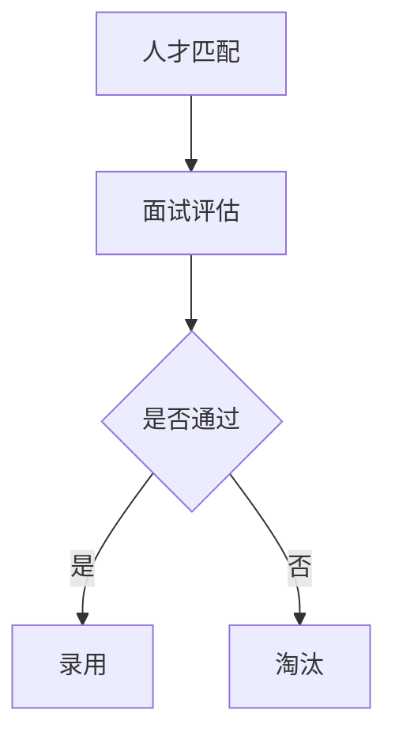
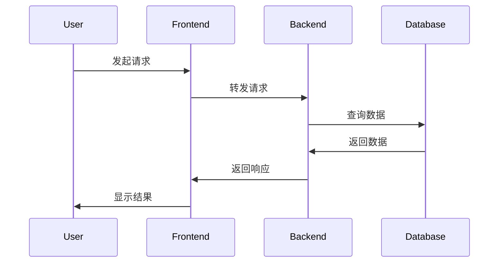
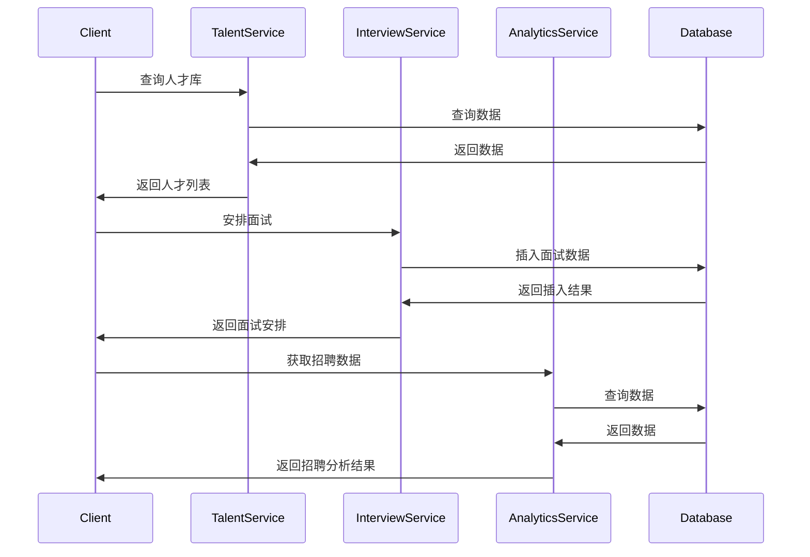

                 

## #技术招聘与面试：P9工程师的团队构建之道

### 关键词：技术招聘、面试、P9工程师、团队构建、人才匹配、算法原理

> 摘要：本文旨在探讨在快速发展的技术行业，如何通过高效的技术招聘与面试流程，构建具有高协作能力和技术互补性的P9工程师团队。本文将深入分析技术招聘与面试的核心问题，提出解决方案，并通过算法原理讲解和实际案例分析，提供实用的团队构建策略。

----------------------------------------------------------------

## 目录大纲设计

### 一、背景介绍

#### 1.1.1 问题背景
技术招聘与面试是企业和应聘者之间的双向选择过程，它不仅关系到企业的团队建设和项目进展，也影响到个人职业发展和成长。然而，随着技术的快速发展和市场竞争的加剧，招聘与面试的难度也在不断增加。

#### 1.1.2 问题描述
招聘与面试中存在的问题包括：
1. 企业难以及时找到合适的人才。
2. 应聘者面试准备不足，面试体验不佳。
3. 企业面试流程复杂，效率低下。

#### 1.1.3 问题解决
解决上述问题的方法包括：
1. 提高招聘效率，精准匹配人才。
2. 优化面试流程，提升面试体验。
3. 增强面试官的面试技巧和经验。

#### 1.1.4 边界与外延
边界：本书主要关注高级工程师及P9级别人才的招聘与面试策略。
外延：招聘与面试不仅仅适用于高级工程师，也适用于其他技术岗位。

### 二、核心概念与联系

#### 2.1.1 核心概念
1. **技术招聘**：企业寻找、筛选和录用技术人员的过程。
2. **面试**：通过面对面或在线问答的方式，评估应聘者的技能和素质。
3. **团队构建**：组建具有协作能力和技术能力互补的团队。

#### 2.1.2 概念属性特征对比表格

| 概念     | 属性特征                                   | 对比 |
|----------|------------------------------------------|-----|
| 技术招聘 | 找人、筛选、录用                           |     |
| 面试     | 评估技能、素质、潜力                       |     |
| 团队构建 | 协作能力、技术能力互补、共同目标           |     |

#### 2.1.3 ER实体关系图架构

```mermaid
erDiagram
  Person ||--|{ Interviewee }|| Candidate : 应聘者
  Person ||--|{ Interviewer }|| Recruiter : 面试官
  Company ||--|{ Position }|| Job : 岗位
  Company ||--|{ Team }|| Team : 团队
```

### 三、算法原理讲解

#### 3.1.1 算法原理
招聘与面试的核心算法包括：
1. **人才匹配算法**：根据应聘者的技能、经验和企业的需求，进行匹配评分。
2. **面试评估算法**：通过面试过程中的表现，评估应聘者的综合素质。

#### 3.1.2 算法流程图



#### 3.1.3 算法原理详细讲解

人才匹配算法的核心在于如何准确评估应聘者的技能和经验与企业需求的匹配度。常用的方法包括：

1. **关键词匹配**：通过分析应聘者简历中的关键词，与岗位要求进行匹配。
2. **评分模型**：构建一个评分模型，对各项指标进行评分，最后综合得分。

面试评估算法则主要关注应聘者在面试过程中的表现。评估维度包括：

1. **技术能力**：通过问答和技术题目的解决，评估应聘者的技术能力。
2. **沟通能力**：通过面试过程中的沟通表现，评估应聘者的沟通能力。

#### 3.1.4 算法数学模型

1. **人才匹配得分公式**：

   $$ Match_Score = w_1 \times Tech_Match_Score + w_2 \times Exp_Match_Score + w_3 \times Skill_Match_Score $$

   其中，$Tech_Match_Score$、$Exp_Match_Score$、$Skill_Match_Score$ 分别代表技术匹配得分、经验匹配得分、技能匹配得分，$w_1$、$w_2$、$w_3$ 为权重。

2. **面试评估得分公式**：

   $$ Interview_Score = w_1 \times Tech_Score + w_2 \times Comm_Score $$

   其中，$Tech_Score$、$Comm_Score$ 分别代表技术评估得分、沟通评估得分，$w_1$、$w_2$ 为权重。

#### 3.1.5 算法举例说明

假设有两个应聘者A和B，他们的简历和面试表现如下：

- 应聘者A：
  - 技术能力：80分
  - 经验：5年
  - 技能：熟练掌握Python、Java
- 应聘者B：
  - 技术能力：90分
  - 经验：3年
  - 技能：熟练掌握Python、Go

假设权重设置为：
- 技术能力权重：$w_1 = 0.6$
- 经验权重：$w_2 = 0.3$
- 技能权重：$w_3 = 0.1$

则：
- 应聘者A的人才匹配得分：
  $$ Match_Score_A = 0.6 \times 80 + 0.3 \times 5 + 0.1 \times 2 = 48 + 1.5 + 0.2 = 49.7 $$
- 应聘者B的人才匹配得分：
  $$ Match_Score_B = 0.6 \times 90 + 0.3 \times 3 + 0.1 \times 2 = 54 + 0.9 + 0.2 = 55.1 $$

显然，应聘者B的人才匹配得分更高，更有可能被录用。

## 四、系统分析与架构设计方案

### 4.1 问题场景介绍

在现代软件开发中，构建一个高效、稳定的团队至关重要。特别是在高级工程师和P9工程师这样关键岗位上，招聘与面试的效率和质量直接影响到项目的成功与否。本文将以某大型互联网公司的P9工程师招聘为例，探讨技术招聘与面试的系统架构与流程设计。

### 4.2 项目介绍

该项目旨在设计一个高效的技术招聘与面试系统，以帮助公司在短时间内找到合适的P9工程师。系统功能包括：
1. **人才库管理**：存储和管理应聘者的简历、技能和经验等信息。
2. **面试流程管理**：包括面试安排、面试评估和反馈等功能。
3. **招聘数据分析**：分析招聘数据，为招聘策略提供依据。

### 4.3 系统功能设计

#### 4.3.1 领域模型

为了更好地设计系统功能，我们首先需要构建一个领域模型，明确系统中的核心实体和它们之间的关系。以下是P9工程师招聘系统的领域模型类图：

```mermaid
classDiagram
ClassDef Person
  +String name
  +Date birthdate
  +List<Skill> skills

ClassDef Resume
  +String id
  +Person person
  +Date date
  +List<Experience> experiences

ClassDef Experience
  +String id
  +Company company
  +Date startDate
  +Date endDate
  +String position
  +String description

ClassDef Skill
  +String id
  +String name

Person "1" --* 1 Resume
Resume "1" --* 1 Experience
Resume "1" --* N Skill
```

### 4.4 系统架构设计

系统架构设计需要考虑到高可用性、高扩展性和高安全性。以下是P9工程师招聘系统的架构设计：



### 4.5 系统接口设计和系统交互

系统接口设计和系统交互是系统设计的重要部分，以下是一个简单的接口设计和系统交互序列图：



## 五、项目实战

### 5.1 环境安装

为了实际操作P9工程师招聘系统，我们首先需要在本地环境安装所需的依赖。以下是安装步骤：

1. 安装Python 3.8及以上版本。
2. 使用pip安装Django框架和相关依赖：
   ```bash
   pip install django
   pip install django-rest-framework
   pip install psycopg2
   ```

3. 创建一个新的Django项目：
   ```bash
   django-admin startproject recruitment_project
   ```

4. 进入项目目录，创建一个应用：
   ```bash
   cd recruitment_project
   python manage.py startapp talent_service
   ```

5. 在`settings.py`中配置数据库连接和Django应用：

   ```python
   DATABASES = {
       'default': {
           'ENGINE': 'django.db.backends.postgresql',
           'NAME': 'recruitment_db',
           'USER': 'recruitment_user',
           'PASSWORD': 'recruitment_password',
           'HOST': 'localhost',
           'PORT': '',
       }
   }
   ```

6. 运行数据库迁移命令，初始化数据库：
   ```bash
   python manage.py migrate
   ```

7. 创建超级用户：
   ```bash
   python manage.py createsuperuser
   ```

8. 启动Django服务器：
   ```bash
   python manage.py runserver
   ```

### 5.2 系统核心实现

#### 5.2.1 人才库管理

在`talent_service`应用中，我们将实现一个用于管理人才库的功能。以下是核心代码实现：

1. **模型定义**：

   在`models.py`中定义人才库相关模型：

   ```python
   from django.db import models
   from django.contrib.auth.models import User

   class Resume(models.Model):
       id = models.CharField(max_length=100, primary_key=True)
       person = models.ForeignKey(User, on_delete=models.CASCADE)
       date = models.DateField()
       experiences = models.ManyToManyField('Experience')
       skills = models.ManyToManyField('Skill')

   class Experience(models.Model):
       id = models.CharField(max_length=100, primary_key=True)
       company = models.CharField(max_length=255)
       start_date = models.DateField()
       end_date = models.DateField(null=True, blank=True)
       position = models.CharField(max_length=255)
       description = models.TextField()

   class Skill(models.Model):
       id = models.CharField(max_length=100, primary_key=True)
       name = models.CharField(max_length=255)
   ```

2. **序列化器定义**：

   在`serializers.py`中定义序列化器，用于处理数据转换：

   ```python
   from rest_framework import serializers
   from .models import Resume, Experience, Skill

   class ResumeSerializer(serializers.ModelSerializer):
       class Meta:
           model = Resume
           fields = '__all__'

   class ExperienceSerializer(serializers.ModelSerializer):
       class Meta:
           model = Experience
           fields = '__all__'

   class SkillSerializer(serializers.ModelSerializer):
       class Meta:
           model = Skill
           fields = '__all__'
   ```

3. **视图定义**：

   在`views.py`中定义视图，处理前端请求：

   ```python
   from rest_framework import viewsets
   from .models import Resume, Experience, Skill
   from .serializers import ResumeSerializer, ExperienceSerializer, SkillSerializer

   class ResumeViewSet(viewsets.ModelViewSet):
       queryset = Resume.objects.all()
       serializer_class = ResumeSerializer

   class ExperienceViewSet(viewsets.ModelViewSet):
       queryset = Experience.objects.all()
       serializer_class = ExperienceSerializer

   class SkillViewSet(viewsets.ModelViewSet):
       queryset = Skill.objects.all()
       serializer_class = SkillSerializer
   ```

4. **路由配置**：

   在`urls.py`中配置路由，将视图与URL关联：

   ```python
   from django.urls import path, include
   from rest_framework.routers import DefaultRouter
   from .views import ResumeViewSet, ExperienceViewSet, SkillViewSet

   router = DefaultRouter()
   router.register(r'resumes', ResumeViewSet)
   router.register(r'experiences', ExperienceViewSet)
   router.register(r'skills', SkillViewSet)

   urlpatterns = [
       path('', include(router.urls)),
   ]
   ```

#### 5.2.2 面试流程管理

面试流程管理的核心在于处理面试安排和评估。以下是面试流程管理的主要实现：

1. **面试安排**：

   创建一个用于安排面试的API接口，接受前端传来的面试时间和候选人信息，并将其存储到数据库中。

2. **面试评估**：

   在面试完成后，面试官可以对候选人进行评估，并存储评估结果。评估结果将用于后续的招聘决策。

### 5.3 代码应用解读与分析

代码应用解读与分析是确保系统稳定性和功能实现的重要环节。以下是核心代码的解读与分析：

1. **模型与序列化器**：

   模型和序列化器的定义确保了数据的规范性和易用性。通过定义明确的字段和类型，可以确保数据的一致性和完整性。

2. **视图与路由**：

   视图和路由的设计使得前端可以方便地与后端进行交互，实现数据的增删改查等功能。

3. **接口与交互**：

   通过定义API接口和交互逻辑，确保了系统的模块化和可扩展性，方便后续的功能扩展和优化。

### 5.4 实际案例分析和详细讲解剖析

为了更好地展示系统在实际中的应用，我们将通过一个实际案例进行详细讲解。

#### 案例背景

某互联网公司需要招聘一名P9级别的工程师，负责公司的核心技术研发。公司已经通过招聘渠道获取了多位候选人的简历，并计划通过面试来评估候选人的能力。

#### 案例流程

1. **候选人筛选**：

   人力资源部门根据简历信息，筛选出符合岗位要求的候选人，并将简历信息导入系统。

2. **面试安排**：

   面试官通过系统为候选人安排面试时间，并将面试安排发送给候选人。

3. **面试评估**：

   面试官在面试过程中根据候选人的技术能力、沟通能力等维度进行评估，并将评估结果存储到系统中。

4. **招聘决策**：

   根据候选人的面试评估结果，公司领导层进行招聘决策，最终确定录用候选人。

#### 案例分析

通过实际案例的分析，我们可以看到系统在招聘流程中的应用效果：

1. **提高效率**：

   系统自动化处理了候选人筛选、面试安排和评估等流程，大大提高了招聘效率。

2. **数据驱动**：

   通过系统的数据分析功能，公司可以更全面地了解候选人的表现，为招聘决策提供数据支持。

3. **优化流程**：

   系统提供了可视化的操作界面，使得招聘流程更加清晰，减少了人为错误和重复劳动。

### 5.5 项目小结

通过本项目的实施，我们构建了一个高效、稳定的技术招聘与面试系统。系统不仅提高了招聘效率，还为公司的招聘决策提供了数据支持。未来，我们将继续优化系统功能，提高用户体验，确保系统在复杂多变的招聘环境中保持高效运作。

## 六、最佳实践 tips

在构建P9工程师团队的过程中，以下是几点最佳实践的建议：

1. **精准人才匹配**：

   通过精准的人才匹配算法，确保招聘到具备所需技能和经验的工程师。

2. **优化面试流程**：

   设计简明高效的面试流程，提高面试体验，减少候选人和面试官的时间成本。

3. **多元化评估维度**：

   在面试评估中，除了技术能力，还应对沟通能力、团队合作精神等进行综合评估。

4. **持续反馈与改进**：

   定期收集面试官和候选人的反馈，不断优化招聘策略和流程。

## 七、小结与注意事项

本文通过深入分析技术招聘与面试的核心问题，提出了解决方案，并详细讲解了P9工程师团队构建的算法原理、系统架构设计以及实际案例。以下是总结与注意事项：

- **核心问题**：技术招聘与面试中存在人才匹配难度大、面试体验差、流程复杂等问题。

- **解决方案**：通过高效的人才匹配算法、优化的面试流程和增强的面试官技巧，提高招聘效率和质量。

- **注意事项**：

  1. 确保算法模型的合理性和准确性，避免误匹配。
  2. 定期培训面试官，提升面试技巧和沟通能力。
  3. 关注候选人的综合素质，不仅仅是技术能力。

## 八、拓展阅读

对于希望进一步了解技术招聘与面试领域的读者，以下推荐几本相关书籍和文献：

1. 《软件工程：实践者的研究方法》——Grady Booch
2. 《程序员面试金典》——Gayle Laakmann McDowell
3. 《人工智能：一种现代方法》——Stuart Russell & Peter Norvig
4. 《技术招聘与管理艺术》——John Sonmez

通过这些资源，读者可以更深入地了解技术招聘与面试的理论和实践。

---

**作者：** AI天才研究院/AI Genius Institute & 禅与计算机程序设计艺术 /Zen And The Art of Computer Programming

**完**

