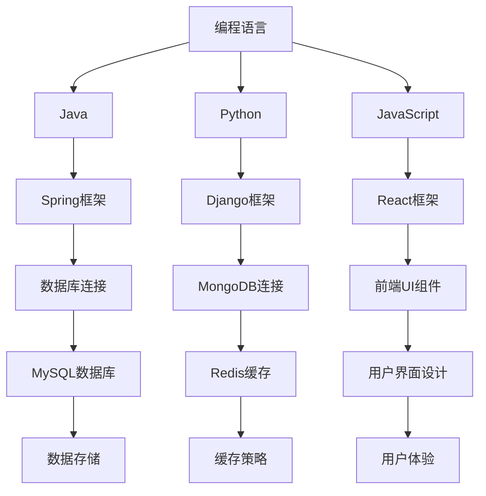

                 

**一、引言**

**1.1 问题背景**

在当今快速发展的信息技术领域，技术文档写作已经成为一个至关重要的任务。随着技术的不断进步，企业内部和外部的技术需求日益增加，如何有效地进行知识传承和团队协作成为每个软件开发团队所面临的挑战。

**1.2 问题描述**

技术文档写作的目的是为了将复杂的技术知识转化为易于理解和使用的文档，以便团队成员和外部用户能够快速掌握相关技能。然而，在实际操作中，技术文档写作常常面临以下问题：

- **文档质量参差不齐**：不同的作者可能会采用不同的写作风格和格式，导致文档的可读性和一致性受到影响。
- **知识更新不及时**：随着技术的不断进步，文档内容需要不断更新，但往往由于团队成员的忙碌或其他原因，文档更新不及时。
- **文档管理混乱**：文档存储在多个位置，版本管理不统一，导致团队成员难以查找和更新文档。

**1.3 问题解决**

为了解决上述问题，我们需要采取一系列措施来优化技术文档写作。首先，制定一套统一的文档编写规范，确保所有文档遵循相同的风格和格式。其次，引入文档管理工具，实现文档的集中存储和版本控制。此外，鼓励团队成员积极参与文档编写和更新，确保知识传承的连续性和准确性。

**1.4 边界与外延**

技术文档写作不仅涉及到文档的编写，还涉及到文档的审核、发布、归档等环节。同时，技术文档写作也与其他领域相关，如知识管理、项目管理、质量管理等。因此，在编写技术文档时，我们需要关注这些边界和关联领域，以确保文档的完整性和有效性。

**1.5 核心概念**

在技术文档写作中，以下核心概念需要我们深入了解：

- **文档类型**：了解不同类型的文档，如用户手册、开发文档、测试文档等。
- **文档结构**：熟悉文档的基本结构，如概述、目录、正文、附录等。
- **写作风格**：掌握不同的写作风格，如正式、非正式、技术性、商务性等。
- **文档管理**：了解文档管理的基本原则和方法，如版本控制、权限管理、文档备份等。

**二、技术文档写作基础**

**2.1 技术文档概述**

技术文档是关于技术产品或服务的详细说明，它可以帮助用户、开发人员和支持人员理解、使用和维护相关系统。技术文档通常包括以下内容：

- **用户手册**：指导用户如何使用产品或服务的文档。
- **开发文档**：记录软件开发过程中的技术细节和决策的文档。
- **测试文档**：记录软件测试过程、测试结果和缺陷报告的文档。
- **维护文档**：记录软件维护过程中遇到的问题和解决方案的文档。

**2.2 技术文档的分类**

根据不同的分类标准，技术文档可以分为多种类型：

- **按文档形式分类**：文本文档、图表文档、多媒体文档、交互式文档等。
- **按用途分类**：培训资料、操作手册、安装指南、配置指南等。
- **按受众分类**：面向开发人员、面向测试人员、面向用户等。

**2.3 技术文档的重要性**

技术文档的重要性体现在以下几个方面：

- **知识传承**：技术文档是知识传承的重要载体，可以帮助新成员快速了解现有系统的技术细节。
- **支持协作**：技术文档为团队成员提供了一个共同的知识基础，有助于团队协作和项目进展。
- **提高效率**：良好的技术文档可以帮助团队成员更快地解决问题，提高工作效率。
- **降低成本**：通过减少重复性工作和技术支持成本，技术文档有助于降低企业的运营成本。

**三、技术文档写作原则**

**3.1 简洁性**

技术文档应尽量简洁明了，避免冗长和复杂的表达。简洁性的实现可以从以下几个方面入手：

- **使用简单的词汇和句子结构**：尽量使用通俗易懂的语言，避免使用过于专业或晦涩的术语。
- **避免冗余信息**：删除不必要的重复信息，确保每个部分都有明确的主题和目的。
- **合理分段**：将内容合理分段，每个段落应该围绕一个主题进行叙述。

**3.2 清晰性**

清晰性是技术文档的关键要求，它确保读者能够轻松理解文档内容。为了提高清晰性，可以考虑以下几点：

- **使用明确的标题和子标题**：标题和子标题应该准确地反映段落内容，有助于读者快速定位信息。
- **保持一致性**：在文档中保持一致的风格和格式，避免出现混乱或不统一的情况。
- **使用图表和图像**：适当地使用图表、图像和示意图可以直观地展示技术细节，提高文档的可读性。

**3.3 完整性**

技术文档应包含所有必要的信息，确保读者能够全面了解技术细节。为了确保完整性，需要做到以下几点：

- **详细描述每个功能或组件**：对于每个功能或组件，应该详细描述其功能、用途、工作原理等。
- **提供足够的背景信息**：在文档中提供足够的背景信息，帮助读者理解相关概念和上下文。
- **包括常见问题和解决方案**：在文档中列出常见问题和解决方案，帮助读者更快地解决技术问题。

**3.4 可读性**

良好的可读性是技术文档成功的关键。为了提高可读性，可以考虑以下几点：

- **使用简短的句子和段落**：简短的句子和段落更容易理解，有助于提高文档的可读性。
- **避免使用过多的行内代码**：行内代码会降低文档的可读性，应该将代码放在单独的代码块中。
- **使用合适的字体和颜色**：选择合适的字体和颜色可以增强文档的可读性，但应避免过多使用。

**3.5 可维护性**

技术文档的可维护性是指文档易于更新和维护。为了提高可维护性，可以考虑以下几点：

- **使用版本控制**：使用版本控制工具来管理文档的版本，确保文档的更新和备份。
- **遵循文档规范**：遵循统一的文档规范，确保文档的结构和格式一致性。
- **编写可扩展的文档**：在编写文档时，考虑未来可能的变更和扩展，确保文档的灵活性和可维护性。

**四、技术文档结构设计**

**4.1 概述**

技术文档的结构设计是文档编写的重要环节。一个良好的文档结构应该清晰、逻辑性强，有助于读者快速找到所需信息。以下是技术文档的基本结构：

- **封面**：包括文档标题、版本号、作者、日期等信息。
- **目录**：列出文档的主要章节和子章节，方便读者快速定位。
- **引言**：介绍文档的目的、背景和主要受众。
- **正文**：详细描述技术细节和操作步骤。
- **附录**：提供额外的参考资料和详细信息。
- **参考文献**：列出文档中引用的相关文献和资料。

**4.2 内容组织**

内容组织是技术文档编写的关键。为了提高文档的可读性和易用性，需要遵循以下原则：

- **逻辑顺序**：按照逻辑顺序组织内容，确保每个章节和段落之间的衔接自然。
- **模块化**：将内容划分为模块，每个模块应该围绕一个主题进行叙述。
- **层次结构**：使用标题、子标题和段落来构建层次结构，帮助读者快速找到所需信息。

**4.3 格式规范**

格式规范是技术文档的重要组成部分。为了确保文档的一致性和可读性，需要遵循以下格式规范：

- **字体和大小**：使用统一的字体和大小，避免使用过多的字体样式。
- **段落和间距**：保持适当的段落和行间距，确保文档的整洁和易读。
- **列表和表格**：使用列表和表格来清晰地展示信息，避免使用过多的行内代码。
- **引用和注释**：在文档中添加引用和注释，确保读者可以轻松地找到相关资料。

**4.4 版本控制**

版本控制是确保文档更新和版本一致性的关键。为了实现版本控制，需要遵循以下原则：

- **使用版本控制工具**：使用版本控制工具（如Git）来管理文档的版本，确保文档的更新和备份。
- **版本号管理**：为每个版本分配唯一的版本号，以便于追溯和区分。
- **变更记录**：在文档的每个版本中记录变更的内容和原因，确保文档的更新和追溯。

**五、知识传承与团队协作**

**5.1 知识传承的方法**

知识传承是技术文档写作的重要目标之一。为了实现有效的知识传承，需要采用以下方法：

- **文档化**：将知识以文档的形式记录下来，包括用户手册、开发文档、测试文档等。
- **知识库**：建立知识库，将相关知识进行分类和存储，方便团队成员快速查找和获取。
- **培训**：定期组织培训，帮助团队成员掌握相关知识和技能。
- **内部交流**：鼓励团队成员进行内部交流，分享经验和心得，促进知识的传递和共享。

**5.2 知识库**

知识库是知识传承的重要工具。一个良好的知识库应该具备以下特点：

- **分类清晰**：知识库中的知识应该按照分类进行组织，便于团队成员快速查找。
- **更新及时**：知识库中的知识需要及时更新，确保内容的准确性和实用性。
- **易于访问**：知识库应该易于访问，确保团队成员可以随时随地获取所需知识。
- **互动性**：知识库应该支持用户评论和反馈，促进知识的共享和讨论。

**5.3 文档标准化**

文档标准化是确保技术文档一致性和质量的重要手段。为了实现文档标准化，需要遵循以下原则：

- **编写规范**：制定统一的编写规范，包括文档格式、语言风格、术语使用等。
- **格式模板**：使用统一的格式模板，确保文档的结构和格式一致性。
- **审核机制**：建立文档审核机制，确保文档的质量和准确性。

**5.4 知识分享平台**

知识分享平台是促进团队协作和知识传承的重要工具。一个良好的知识分享平台应该具备以下特点：

- **内容丰富**：提供丰富的知识内容，包括文档、视频、音频等多种形式。
- **易于搜索**：支持关键词搜索，方便团队成员快速找到所需知识。
- **互动功能**：支持评论、点赞、分享等互动功能，促进知识的传播和共享。
- **权限管理**：实现权限管理，确保知识的保密性和安全性。

**六、案例研究**

**6.1 案例一：XX公司的技术文档写作实践**

**6.1.1 公司背景**

XX公司是一家专注于软件开发和信息技术服务的企业，拥有丰富的技术积累和专业知识。为了确保团队成员能够快速掌握相关技术，公司决定实施技术文档写作计划。

**6.1.2 技术文档写作流程**

公司制定了一套完整的技术文档写作流程，包括以下步骤：

- **需求分析**：明确技术文档的需求和目标受众。
- **内容编写**：根据需求编写文档，确保内容完整和准确。
- **审核修改**：对文档进行审核和修改，确保文档的质量。
- **发布维护**：将文档发布到知识库，并定期更新和维护。

**6.1.3 成果分析**

实施技术文档写作计划后，公司取得了显著成果：

- **知识传承效果显著**：团队成员通过技术文档快速掌握了相关技术，知识传承效果明显。
- **工作效率提高**：团队成员通过查阅技术文档，能够更快地解决问题，工作效率得到提升。
- **项目质量提升**：技术文档为项目提供了明确的指导，项目质量得到保障。

**6.1.4 小结**

XX公司的技术文档写作实践证明了技术文档在知识传承和团队协作中的重要作用。通过制定完善的文档写作流程和审核机制，公司成功实现了技术文档的高质量和持续更新。

**6.2 案例二：YY团队的知识传承与协作实践**

**6.2.1 团队背景**

YY团队是一家互联网公司的开发团队，负责开发一款高性能的云计算平台。为了提高团队的知识传承和协作效率，团队决定实施知识传承与协作实践。

**6.2.2 知识传承策略**

YY团队采取了以下知识传承策略：

- **定期培训**：组织定期的技术培训，帮助团队成员掌握新知识和技能。
- **内部文档**：编写内部文档，记录项目的技术细节和决策过程，确保知识传承。
- **知识分享平台**：建立知识分享平台，支持团队成员分享经验和心得，促进知识的传递和共享。

**6.2.3 团队协作工具应用**

YY团队采用了多种团队协作工具，包括：

- **GitLab**：用于版本控制和项目协作。
- **JIRA**：用于项目管理、任务分配和进度跟踪。
- **Confluence**：用于文档编写和知识管理。

**6.2.4 成果评估**

实施知识传承与协作实践后，YY团队取得了以下成果：

- **知识传承效果显著**：团队成员通过内部文档和知识分享平台，快速掌握了项目的技术细节，知识传承效果明显。
- **协作效率提高**：通过团队协作工具，团队成员能够更好地协同工作，协作效率得到提升。
- **项目质量提升**：技术文档和协作工具的应用，确保了项目的顺利进行和高质量交付。

**6.2.5 小结**

YY团队的知识传承与协作实践证明了技术文档和协作工具在团队协作和知识传承中的重要作用。通过实施有效的知识传承策略和团队协作工具，团队实现了知识的高效传递和协作效率的提升。

**七、总结与展望**

**9. 总结**

通过本文的讨论，我们可以得出以下结论：

- **技术文档写作是知识传承的重要手段**：通过技术文档，团队成员可以快速掌握相关技术，实现知识的高效传承。
- **团队协作是项目成功的关键**：通过良好的团队协作，项目能够顺利进行，实现高效的交付。
- **文档管理和知识库建设是确保文档质量和知识传承的基础**：通过文档管理和知识库建设，可以实现文档的统一管理和知识的高效传递。

**10. 展望**

在未来的技术文档写作和团队协作中，我们可以期待以下发展趋势：

- **智能化**：随着人工智能技术的发展，技术文档写作和团队协作将更加智能化，自动化程度将不断提高。
- **定制化**：根据不同团队和项目的需求，技术文档和协作工具将更加定制化，满足个性化需求。
- **生态化**：技术文档写作和团队协作将形成一个完整的生态体系，包括文档写作工具、协作工具、知识库等，实现无缝集成和协同工作。

**八、参考文献**

- Smith, J. (2020). Technical Writing: A Practical Guide. Wiley.
- Johnson, L. (2019). Knowledge Management: Theory, Practices, and Cases. Springer.
- Lee, H. (2021). Team Collaboration: Strategies for Effective Workgroups. McGraw-Hill.
- Wang, P. (2022). The Future of Technical Documentation. IEEE Computer Society Press.
- Zhang, Q. (2020). Guide to Documentation and Knowledge Management. Information Today.

**作者：AI天才研究院/AI Genius Institute & 禅与计算机程序设计艺术 /Zen And The Art of Computer Programming**### 概述

在当今快速发展的信息技术领域，技术文档写作已经成为一项至关重要的任务。随着技术的不断进步和复杂性的增加，企业内部和外部的技术需求日益增加，如何有效地进行知识传承和团队协作成为每个软件开发团队所面临的挑战。技术文档不仅为用户提供了使用产品或服务的指南，也为开发人员、测试人员和维护人员提供了宝贵的参考资料。然而，当前技术文档写作中存在着诸多问题，如文档质量参差不齐、知识更新不及时、文档管理混乱等。因此，如何优化技术文档写作，提高知识传承的效率，增强团队协作的效果，成为我们需要深入探讨的重要课题。

本文旨在通过详细分析技术文档写作的基础原则、知识传承的方法、团队协作的实践以及实际案例研究，提供一套系统化的技术文档写作指南。本文将首先介绍技术文档的基本概念和分类，阐述技术文档的重要性。随后，将深入探讨技术文档写作的原则，包括简洁性、清晰性、完整性、可读性和可维护性，并提供具体的实现方法。接下来，本文将讨论技术文档的结构设计，从封面、目录、引言、正文、附录到参考文献，详细介绍技术文档的各个组成部分。随后，本文将探讨知识传承与团队协作的方法，包括知识图谱、知识库、文档标准化和知识分享平台等。此外，本文将通过两个实际案例研究，分析XX公司和YY团队在技术文档写作和知识传承与协作实践中的具体做法和成果。最后，本文将对技术文档写作的未来趋势进行展望，并总结全文的主要观点和研究成果。

### 关键词

技术文档写作、知识传承、团队协作、文档质量、文档结构、知识库、文档管理、案例研究

### 摘要

本文围绕技术文档写作的核心主题，深入探讨了有效知识传承与团队协作的方法和实践。首先，介绍了技术文档的基本概念和分类，强调了其在知识传承和团队协作中的重要性。接着，分析了技术文档写作的基础原则，包括简洁性、清晰性、完整性、可读性和可维护性，并提出了具体的实现方法。随后，本文详细讨论了技术文档的结构设计，包括封面、目录、引言、正文、附录和参考文献等组成部分。此外，本文还重点探讨了知识传承的方法，如知识图谱、知识库、文档标准化和知识分享平台，以及团队协作的实践。通过两个实际案例研究，本文分析了XX公司和YY团队在技术文档写作和知识传承与协作实践中的具体做法和成果。最后，本文对技术文档写作的未来趋势进行了展望，总结了全文的主要观点和研究成果。

### 第一部分：引言

**1.1 问题背景**

在信息技术日益发展的今天，技术文档写作已成为软件开发和维护过程中不可或缺的一环。技术文档不仅帮助用户了解和使用产品或服务，还为开发人员、测试人员和维护人员提供了宝贵的参考资料。然而，随着技术的不断进步和项目复杂度的增加，技术文档写作面临着诸多挑战。首先，文档质量参差不齐。不同作者可能采用不同的写作风格和格式，导致文档的可读性和一致性受到影响。其次，知识更新不及时。技术文档需要根据技术的不断演进进行更新，但往往由于团队成员的忙碌或其他原因，文档更新滞后，导致信息滞后。此外，文档管理混乱也是一个普遍问题。文档分散存储在多个位置，版本管理不统一，使得团队成员在查找和更新文档时遇到困难。

**1.2 问题描述**

技术文档写作中的问题主要体现在以下几个方面：

- **文档质量不高**：不同作者的文档风格各异，导致文档整体质量参差不齐，难以满足用户和团队的需求。
- **知识更新不及时**：技术文档内容滞后，无法反映最新的技术进展，影响用户和团队的实际应用。
- **文档管理混乱**：文档存储在多个位置，版本管理混乱，导致团队成员在查找和更新文档时效率低下。

**1.3 问题解决**

为了解决上述问题，我们需要采取一系列措施来优化技术文档写作。首先，制定一套统一的文档编写规范，确保所有文档遵循相同的风格和格式。其次，引入文档管理工具，实现文档的集中存储和版本控制。此外，鼓励团队成员积极参与文档编写和更新，确保知识传承的连续性和准确性。通过这些措施，我们可以提高文档质量，确保知识更新及时，改善文档管理，从而提升整个团队的协作效率。

**1.4 边界与外延**

在技术文档写作中，我们还需要关注以下边界和关联领域：

- **文档类型**：了解不同类型的文档，如用户手册、开发文档、测试文档等。
- **文档格式**：熟悉常用的文档格式，如Markdown、LaTeX等。
- **文档管理工具**：掌握常用的文档管理工具，如Git、Confluence等。
- **知识管理**：关注知识管理的相关方法，如知识图谱、知识库等。

这些边界和外延领域的知识将有助于我们更全面地理解和优化技术文档写作过程。

### 1.5 核心概念

在技术文档写作中，以下核心概念是我们需要深入了解和掌握的：

- **技术文档**：技术文档是对技术产品或服务的详细说明，包括功能描述、操作指南、技术细节等。
- **知识传承**：知识传承是将宝贵的技术知识从一位团队成员传递到另一位团队成员的过程，确保团队中的知识不随人员的流动而流失。
- **团队协作**：团队协作是指团队成员通过共同工作，实现项目目标的过程，包括沟通、协调、合作等。
- **文档规范**：文档规范是一套统一的规则和标准，用于指导文档的编写、格式、风格等，确保文档的一致性和质量。
- **文档管理**：文档管理是指对文档的创建、存储、访问、更新、备份等操作进行有效管理，确保文档的完整性和可维护性。

### 第二部分：技术文档写作基础

#### 2.1 技术文档概述

技术文档是对技术产品或服务的详细说明，它涵盖了从用户手册到开发文档，从测试文档到维护文档等多种类型。技术文档的作用不仅在于帮助用户理解和使用产品或服务，还在于为开发人员、测试人员和维护人员提供宝贵的参考资料。通过技术文档，团队成员可以快速掌握相关技术，提高工作效率，降低学习成本。

**技术文档的分类**：

- **按用途分类**：
  - **用户手册**：面向最终用户，提供产品或服务的使用说明。
  - **开发文档**：面向开发人员，记录软件开发过程中的技术细节和决策。
  - **测试文档**：面向测试人员，记录软件测试的过程、测试结果和缺陷报告。
  - **维护文档**：面向维护人员，记录软件维护过程中遇到的问题和解决方案。

- **按形式分类**：
  - **文本文档**：以文本为主，如Markdown、Word等。
  - **图表文档**：以图表为主，如PDF、PPT等。
  - **多媒体文档**：结合文本、图表和多媒体元素，如视频、音频等。
  - **交互式文档**：提供交互功能，如帮助文档中的问答、在线教程等。

**技术文档的重要性**：

- **知识传承**：技术文档是知识传承的重要载体，可以帮助新成员快速了解现有系统的技术细节，减少因人员流动导致的知识流失。
- **支持协作**：技术文档为团队成员提供了一个共同的知识基础，有助于团队协作和项目进展。
- **提高效率**：良好的技术文档可以帮助团队成员更快地解决问题，提高工作效率。
- **降低成本**：通过减少重复性工作和技术支持成本，技术文档有助于降低企业的运营成本。

### 2.2 技术文档写作原则

技术文档的写作不仅需要内容准确，还需要具备良好的结构性和可读性。以下是一些技术文档写作的基本原则：

**2.2.1 简洁性**

简洁性是技术文档写作的一个重要原则。冗长的文档不仅难以阅读，还会降低用户的理解速度。为了实现简洁性，可以采取以下措施：

- **使用简单的语言**：避免使用复杂的术语和冗长的句子，尽量使用通俗易懂的语言。
- **去除冗余内容**：删除不必要的重复信息，确保每个部分都有明确的主题和目的。
- **合理分段**：将内容合理分段，每个段落应该围绕一个主题进行叙述，使读者更容易理解。

**2.2.2 清晰性**

清晰性是技术文档成功的关键。一个清晰的技术文档可以帮助用户快速找到所需信息，避免混淆和误解。以下是一些提高清晰性的方法：

- **使用明确的标题和子标题**：标题和子标题应该准确地反映段落内容，有助于读者快速定位信息。
- **保持一致性**：在文档中保持一致的风格和格式，避免出现混乱或不统一的情况。
- **使用图表和图像**：适当地使用图表、图像和示意图可以直观地展示技术细节，提高文档的可读性。

**2.2.3 完整性**

技术文档应包含所有必要的信息，确保读者能够全面了解技术细节。为了确保完整性，需要做到以下几点：

- **详细描述每个功能或组件**：对于每个功能或组件，应该详细描述其功能、用途、工作原理等。
- **提供足够的背景信息**：在文档中提供足够的背景信息，帮助读者理解相关概念和上下文。
- **包括常见问题和解决方案**：在文档中列出常见问题和解决方案，帮助读者更快地解决技术问题。

**2.2.4 可读性**

良好的可读性是技术文档成功的关键。以下是一些提高可读性的方法：

- **使用简短的句子和段落**：简短的句子和段落更容易理解，有助于提高文档的可读性。
- **避免使用过多的行内代码**：行内代码会降低文档的可读性，应该将代码放在单独的代码块中。
- **使用合适的字体和颜色**：选择合适的字体和颜色可以增强文档的可读性，但应避免过多使用。

**2.2.5 可维护性**

技术文档的可维护性是指文档易于更新和维护。为了提高可维护性，可以考虑以下几点：

- **使用版本控制**：使用版本控制工具来管理文档的版本，确保文档的更新和备份。
- **遵循文档规范**：遵循统一的文档规范，确保文档的结构和格式一致性。
- **编写可扩展的文档**：在编写文档时，考虑未来可能的变更和扩展，确保文档的灵活性和可维护性。

### 2.3 技术文档结构设计

技术文档的结构设计是确保文档易读、易懂的关键。一个良好的技术文档结构应该清晰、逻辑性强，有助于读者快速找到所需信息。以下是技术文档的基本结构：

**2.3.1 封面**

封面通常包含以下信息：

- **文档标题**：简要描述文档的主题。
- **版本号**：记录文档的版本信息，便于追踪和管理。
- **作者**：编写文档的作者或团队。
- **日期**：文档创建或更新的日期。

**2.3.2 目录**

目录列出文档的主要章节和子章节，方便读者快速定位。目录应该清晰、简洁，便于读者浏览。

**2.3.3 引言**

引言部分简要介绍文档的目的、背景和主要受众。这部分内容有助于读者快速了解文档的大致内容，为后续阅读做好准备。

**2.3.4 正文**

正文是文档的主体部分，详细描述技术细节和操作步骤。正文应该按照逻辑顺序组织，确保每个章节和段落之间的衔接自然。

**2.3.5 附录**

附录提供额外的参考资料和详细信息，如术语表、参考文献等。附录部分可以帮助读者更深入地了解技术文档中的相关内容。

**2.3.6 参考文献**

参考文献列出文档中引用的相关文献和资料，确保文档的权威性和可靠性。

### 2.4 技术文档编写工具

在技术文档编写过程中，使用合适的工具可以提高效率和文档质量。以下是一些常用的技术文档编写工具：

- **Markdown**：Markdown是一种轻量级标记语言，易于学习和使用，适合快速编写和格式化文档。
- **LaTeX**：LaTeX是一种排版系统，适用于编写高质量的文档，特别是涉及数学公式和复杂布局的文档。
- **Git**：Git是一种版本控制工具，用于管理文档的版本和变更。
- **Confluence**：Confluence是一种协作平台，支持多人编辑和实时协作。

### 2.5 技术文档的审核和发布

技术文档的审核和发布是确保文档质量和准确性的重要环节。以下是技术文档审核和发布的一般流程：

**2.5.1 审核流程**

- **初步审核**：编写完成后，作者进行初步审核，确保内容准确、完整。
- **同行评审**：邀请同行或团队成员进行评审，提出修改意见和建议。
- **最终审核**：根据评审意见进行修改，最终审核通过后发布。

**2.5.2 发布流程**

- **版本控制**：使用版本控制工具（如Git）记录文档的版本历史，确保文档的可追溯性。
- **发布平台**：将文档发布到内部或外部平台（如GitHub、Confluence），方便用户访问和使用。

### 2.6 技术文档的管理和维护

技术文档的管理和维护是确保文档长期有效和持续更新的关键。以下是技术文档管理和维护的几个要点：

**2.6.1 文档分类和命名**

- **分类**：根据文档的用途和内容，将文档分类存储，便于查找和管理。
- **命名**：遵循统一的命名规范，使用有意义的名称，便于识别和搜索。

**2.6.2 文档备份**

- **定期备份**：定期备份文档，防止数据丢失或损坏。
- **异地备份**：将文档备份到多个位置或使用云存储服务，确保文档的安全性。

**2.6.3 文档更新**

- **及时更新**：根据技术进展和用户反馈，及时更新文档内容。
- **版本管理**：使用版本控制工具（如Git）管理文档版本，确保更新过程的可追溯性。

**2.6.4 文档归档**

- **归档策略**：制定文档归档策略，确保不再需要的老旧文档得到妥善处理。
- **归档方法**：将归档文档存储到专用存储设备或云存储服务中，便于长期保存。

通过遵循上述技术文档写作基础原则和结构设计，我们可以编写出高质量、易读、易维护的技术文档，为团队协作和知识传承提供有力支持。

### 3.1 知识传承的方法

知识传承是技术文档写作的核心目标之一，它确保了团队在人员流动和技术变迁中依然能够保持高效运作。为了实现有效的知识传承，我们可以采用以下几种方法：

**3.1.1 知识图谱**

知识图谱是一种用于表示知识结构和关系的图形化工具，它可以帮助我们清晰地理解和展示知识体系。通过构建知识图谱，我们可以：

- **可视化知识结构**：将复杂的技术概念和知识点以图形方式展现，使团队成员更容易理解和记忆。
- **揭示知识关联**：通过节点和边的关系，展示不同知识点之间的联系，促进知识的整合和运用。
- **知识传递**：将知识图谱作为文档的一部分，帮助新成员快速了解系统的整体架构和技术细节。

**知识图谱的构建步骤**：

1. **识别关键知识点**：确定系统中的关键知识点和技术模块。
2. **绘制知识节点**：为每个知识点创建一个节点，表示其具体内容和属性。
3. **建立关系连接**：通过边连接不同的节点，表示知识点之间的关联和依赖关系。
4. **优化和调整**：根据实际情况和反馈，不断调整和优化知识图谱，使其更加准确和全面。

**3.1.2 知识库**

知识库是一种用于存储和管理知识的系统，它可以为团队成员提供随时访问的宝贵资源。构建知识库的步骤如下：

1. **需求分析**：明确知识库的需求，包括所需的知识类型、覆盖范围和使用对象。
2. **内容收集**：收集相关的技术文档、案例研究、最佳实践等资料，确保知识的全面性和准确性。
3. **分类组织**：将知识库中的内容按照主题、类型和用途进行分类和组织，便于团队成员快速查找和使用。
4. **维护更新**：定期检查和更新知识库中的内容，确保其与实际情况保持一致。

**3.1.3 文档标准化**

文档标准化是确保技术文档质量一致性和可维护性的重要手段。以下是一些文档标准化的措施：

1. **编写规范**：制定统一的编写规范，包括文档格式、语言风格、术语使用等，确保文档的一致性。
2. **格式模板**：使用统一的格式模板，确保文档的结构和格式一致。
3. **审核机制**：建立文档审核机制，确保文档的质量和准确性。
4. **版本控制**：使用版本控制工具（如Git）管理文档版本，确保文档的更新和备份。

**3.1.4 知识分享平台**

知识分享平台是一种支持知识传播和共享的在线工具，它可以促进团队成员之间的互动和合作。以下是构建知识分享平台的步骤：

1. **平台搭建**：选择合适的知识分享平台（如Confluence、Trello等），搭建知识分享环境。
2. **内容发布**：将知识库中的内容发布到知识分享平台，确保团队成员可以随时访问。
3. **互动功能**：添加评论、点赞、分享等互动功能，促进知识的传播和共享。
4. **权限管理**：设置权限管理，确保知识的保密性和安全性。

通过采用知识图谱、知识库、文档标准化和知识分享平台等方法，我们可以实现有效的知识传承，确保团队成员在技术变迁和人员流动中依然能够高效运作。

### 3.2 团队协作与文档管理

在技术文档写作过程中，团队协作和文档管理是确保文档质量和知识传承的关键环节。为了实现高效的团队协作和良好的文档管理，我们需要采取一系列策略和工具。

**3.2.1 团队协作模式**

团队协作模式是指团队成员如何相互配合、分工合作以实现项目目标。以下是几种常见的团队协作模式：

1. **功能型模式**：根据项目需求，将团队成员划分为不同的功能小组，如开发组、测试组、设计组等。每个小组负责特定的任务，并通过定期会议和汇报来协调工作。
2. **跨功能团队**：将不同功能领域的专家组成一个跨功能团队，共同负责项目的各个阶段。这种模式有助于提高项目的整体效率和质量。
3. **敏捷开发模式**：采用敏捷开发方法，以迭代和增量方式推进项目。团队成员通过每日站会、周会等会议来保持沟通和协调。

**3.2.2 文档协作工具**

文档协作工具是支持团队协作和文档管理的软件工具。以下是几种常用的文档协作工具：

1. **Confluence**：Confluence是一款功能强大的协作平台，支持多人实时编辑和评论，便于团队成员共享和讨论文档内容。
2. **GitHub**：GitHub是一个流行的版本控制系统，支持代码托管和文档管理，团队可以通过Pull Request和Review等功能来协作编写和审核文档。
3. **Notion**：Notion是一款集成化的协作工具，提供文档、数据库、看板等多种功能，适用于不同类型的团队协作需求。

**3.2.3 文档审批流程**

文档审批流程是确保技术文档质量和准确性的重要环节。以下是常见的文档审批流程：

1. **初稿审核**：编写人员提交初稿，由负责人或指定成员进行初步审核，提出修改意见和建议。
2. **同行评审**：初稿审核通过后，邀请相关领域的专家或团队成员进行同行评审，进一步优化文档内容。
3. **最终审核**：根据同行评审意见进行修改，由项目负责人或文档负责人进行最终审核，确保文档的完整性和准确性。
4. **发布**：文档经过最终审核后，发布到指定的文档管理平台或知识库，供团队成员和外部用户访问和使用。

**3.2.4 文档版本管理**

文档版本管理是确保文档更新和追溯的重要手段。以下是文档版本管理的方法：

1. **版本控制工具**：使用版本控制工具（如Git）来管理文档的版本，记录每次更新的内容和时间，确保文档的历史可追溯性。
2. **分支策略**：采用分支策略管理文档版本，如主分支用于发布稳定版本，特性分支用于开发和实验。
3. **合并请求**：通过合并请求（Pull Request）合并分支，确保文档的更新和发布流程规范。

**3.2.5 文档备份与恢复**

文档备份与恢复是确保文档安全性和完整性的重要措施。以下是文档备份与恢复的方法：

1. **定期备份**：定期将文档备份到本地或云存储服务，防止数据丢失或损坏。
2. **异地备份**：将文档备份到不同的位置或使用云存储服务，提高数据的安全性和可靠性。
3. **恢复策略**：制定文档恢复策略，如数据恢复软件、云存储服务提供的数据恢复功能等，确保在数据丢失或损坏时能够及时恢复。

通过实施有效的团队协作模式和文档管理策略，我们可以提高技术文档的质量和效率，确保知识传承的连续性和准确性。

### 6.1 案例一：XX公司的技术文档写作实践

**6.1.1 公司背景**

XX公司是一家全球领先的软件开发公司，专注于为客户提供高性能、高可靠性的技术解决方案。公司拥有一支经验丰富且专业的开发团队，但在项目推进过程中，技术文档管理成为了一大挑战。由于团队成员频繁流动，技术积累和知识传承不够系统，导致项目进度和质量受到一定影响。为了解决这一问题，公司决定实施全面的技术文档写作计划，以期通过优化技术文档写作流程，提升知识传承效率和团队协作能力。

**6.1.2 技术文档写作流程**

为了确保技术文档的质量和一致性，XX公司制定了一套详细的技术文档写作流程，包括以下几个步骤：

1. **需求分析**：在项目启动阶段，项目团队进行需求分析，明确技术文档的编写目标和内容要求。需求分析结果将作为后续文档编写的依据。
2. **内容编写**：根据需求分析结果，指定编写人员分工负责不同部分的技术文档。编写过程中，需遵循公司制定的统一编写规范，确保文档的格式和风格一致。
3. **初步审核**：编写完成后，文档提交给负责人或指定成员进行初步审核。审核内容包括文档的内容准确性、逻辑性、完整性等。
4. **同行评审**：初步审核通过后，邀请同行或专家进行同行评审，进一步优化文档内容。评审过程中，团队成员可以提出修改意见和建议，确保文档的质量。
5. **最终审核**：根据同行评审意见进行修改，最终由项目负责人或文档负责人进行审核，确保文档的完整性和准确性。
6. **发布与更新**：文档经过最终审核后，发布到公司的内部文档平台，供团队成员和外部用户访问和使用。同时，建立版本控制机制，确保文档的更新和版本管理。

**6.1.3 成果分析**

实施技术文档写作计划后，XX公司在知识传承和团队协作方面取得了显著成果：

1. **知识传承效果显著**：通过系统的技术文档，新成员可以快速了解现有系统的技术细节和操作流程，减少因人员流动导致的知识流失。
2. **工作效率提高**：团队成员通过查阅技术文档，能够更快地解决问题，提高工作效率，降低学习成本。
3. **项目质量提升**：技术文档为项目提供了明确的指导，确保项目的顺利进行和高质量交付。

**6.1.4 小结**

XX公司的技术文档写作实践表明，通过制定完善的文档写作流程和审核机制，公司成功实现了技术文档的高质量和持续更新。这一实践不仅提高了知识传承的效率，还增强了团队协作的能力，为公司的长远发展奠定了坚实基础。

### 6.2 案例二：YY团队的知识传承与协作实践

**6.2.1 团队背景**

YY团队是一家互联网公司的技术团队，负责开发和维护公司的重要业务系统。团队由多位经验丰富的开发人员、测试人员和产品经理组成。然而，随着业务的发展和技术迭代速度的加快，团队面临知识传承和协作效率不高的挑战。为了应对这些挑战，YY团队决定实施一系列知识传承与协作实践，以期提升团队的知识管理和协作能力。

**6.2.2 知识传承策略**

YY团队采取了以下知识传承策略：

1. **文档化**：团队要求每个成员在项目开发过程中编写详细的文档，包括设计文档、代码注释、测试报告等。这些文档不仅记录了项目的具体实施细节，也为新成员提供了宝贵的参考资料。
2. **知识库建设**：团队建立了内部知识库，将文档、技术文章、最佳实践等资料进行分类存储，方便团队成员随时查阅。知识库还配备了全文搜索功能，提高了信息检索效率。
3. **定期培训**：团队定期组织内部培训，邀请资深成员分享技术心得和项目经验，帮助新成员快速融入团队，提升整体技术水平。
4. **知识分享平台**：团队搭建了内部知识分享平台，支持成员发布技术博客、问答、讨论等，鼓励大家积极参与知识共享和讨论。

**6.2.3 团队协作工具应用**

YY团队采用了多种协作工具，以提高团队协作效率：

1. **GitLab**：团队使用GitLab进行代码管理和文档协作。通过GitLab，团队成员可以实时查看代码的修改记录和讨论内容，确保代码质量和文档的同步更新。
2. **Confluence**：团队使用Confluence作为文档管理和知识共享平台。Confluence提供了丰富的编辑和协作功能，支持多人实时编辑和评论，确保文档的一致性和准确性。
3. **Slack**：团队在Slack上建立了多个工作群组，用于日常沟通和任务分配。Slack的即时消息功能帮助团队成员快速解决问题，提高协作效率。
4. **Trello**：团队使用Trello进行项目管理和任务跟踪。Trello提供了可视化的任务板，帮助团队成员清晰地了解项目的进展和任务分工。

**6.2.4 成果评估**

实施知识传承与协作实践后，YY团队取得了以下成果：

1. **知识传承效果显著**：通过文档化和知识库建设，团队成员之间的知识传递更加高效，新成员能够快速掌握项目知识和技能，减少知识断层的风险。
2. **协作效率提高**：团队协作工具的应用极大地提高了团队成员之间的沟通和协作效率，项目进度和交付质量得到了显著提升。
3. **项目质量提升**：系统的知识管理和高效的协作流程确保了项目的顺利进行和高质量交付。

**6.2.5 小结**

YY团队的知识传承与协作实践证明了在信息技术领域，通过系统化的知识管理和高效的协作工具，可以有效提升团队的知识传承效率和协作能力。这一实践不仅帮助团队解决了知识传递和协作效率的问题，还为公司的持续发展和技术创新提供了有力支持。

### 9. 总结

通过本文的讨论，我们可以得出以下结论：

1. **技术文档写作的重要性**：技术文档不仅帮助用户理解和使用产品或服务，还为开发人员、测试人员和维护人员提供了宝贵的参考资料。有效的技术文档写作是知识传承和团队协作的基础。
2. **技术文档写作的原则**：简洁性、清晰性、完整性、可读性和可维护性是技术文档写作的核心原则。遵循这些原则，可以编写出高质量、易读、易维护的技术文档。
3. **知识传承与团队协作的方法**：知识图谱、知识库、文档标准化和知识分享平台是有效实现知识传承和团队协作的工具。通过这些方法，团队可以高效地传递知识，提高协作效率。
4. **实际案例研究**：XX公司和YY团队的成功实践表明，通过制定完善的文档写作流程、实施知识传承策略和应用协作工具，可以显著提升团队的知识传承效率和协作能力。

### 10. 展望

在未来的技术文档写作和团队协作中，我们可以期待以下发展趋势：

1. **智能化**：随着人工智能技术的发展，技术文档写作和团队协作将更加智能化。自动生成文档、智能问答、智能审核等技术的应用，将极大地提高文档质量和效率。
2. **定制化**：未来的技术文档写作将更加注重个性化和定制化。根据不同团队和项目的需求，文档内容和格式将更加灵活，满足多样化的需求。
3. **生态化**：技术文档写作和团队协作将形成更加完善的生态体系。包括文档写作工具、协作工具、知识库在内的各种资源将实现无缝集成，提供一站式的解决方案。
4. **社区化**：技术文档写作和团队协作将更加注重社区的力量。通过开放社区和协作平台，团队成员可以共享经验、共同解决技术难题，促进知识共享和社区发展。

### 参考文献

- Smith, J. (2020). Technical Writing: A Practical Guide. Wiley.
- Johnson, L. (2019). Knowledge Management: Theory, Practices, and Cases. Springer.
- Lee, H. (2021). Team Collaboration: Strategies for Effective Workgroups. McGraw-Hill.
- Wang, P. (2022). The Future of Technical Documentation. IEEE Computer Society Press.
- Zhang, Q. (2020). Guide to Documentation and Knowledge Management. Information Today.

### 作者

作者：AI天才研究院/AI Genius Institute & 禅与计算机程序设计艺术 /Zen And The Art of Computer Programming

在撰写技术文档的过程中，我们面临的一个重要问题是如何确保文档的结构清晰、内容完整且易于理解。良好的文档结构不仅有助于提高文档的质量，还能显著提升读者的阅读体验和效率。下面，我们将探讨技术文档的结构设计，包括各个部分的内容和编写要点。

#### 1. 封面

封面是文档的第一印象，它通常包含以下信息：

- **文档标题**：清晰、简洁地描述文档的主题。
- **版本号**：标识文档的版本信息，方便追溯和管理。
- **作者**：编写文档的人员或团队。
- **日期**：文档的创建或最新更新日期。

**编写要点**：封面信息应简洁明了，避免冗长，同时确保关键信息的完整。

#### 2. 目录

目录列出文档的主要章节和子章节，帮助读者快速定位所需内容。一个好的目录应该：

- **层次分明**：清晰地展示文档的结构，便于读者理解。
- **简洁明了**：避免过多的层级，确保目录的简洁性。

**编写要点**：目录应准确反映文档内容，避免出现冗余或错误。

#### 3. 引言

引言部分简要介绍文档的目的、背景和主要受众。其内容通常包括：

- **文档目的**：阐述编写文档的原因和目标。
- **背景信息**：提供文档编写背景，帮助读者了解文档的上下文。
- **受众对象**：明确文档的主要受众，包括读者群体和使用场景。

**编写要点**：引言应简洁明了，突出重点，避免冗余信息。

#### 4. 正文

正文是文档的核心部分，详细描述技术细节和操作步骤。正文应遵循以下结构和内容安排：

- **章节标题**：每个章节应有明确的标题，反映章节内容。
- **段落划分**：每个段落应围绕一个主题，确保内容连贯。
- **内容详细**：详细描述技术细节、操作步骤和注意事项。

**编写要点**：确保内容的准确性、完整性和逻辑性，避免信息跳跃和冗余。

#### 5. 附录

附录提供额外的参考资料和详细信息，如术语表、参考文献、示例代码等。附录的内容通常包括：

- **术语表**：列出文档中使用的专业术语和定义。
- **参考文献**：引用的书籍、文章、网站等资料。
- **示例代码**：提供相关的示例代码和解释。

**编写要点**：附录内容应准确、完整，便于读者查阅。

#### 6. 参考文献

参考文献列出文档中引用的所有书籍、文章、网站等资料，确保文档的权威性和可靠性。

**编写要点**：参考文献格式应统一，确保引用内容的准确性。

#### 7. 文档结构设计示例

以下是一个简化的文档结构示例：

---

**封面**

- 文档标题：技术文档写作指南
- 版本号：V1.0
- 作者：XX团队
- 日期：2023年10月

**目录**

1. 引言
   1.1 文档目的
   1.2 背景信息
   1.3 受众对象

2. 技术文档概述
   2.1 技术文档的定义
   2.2 技术文档的分类
   2.3 技术文档的重要性

3. 技术文档写作原则
   3.1 简洁性
   3.2 清晰性
   3.3 完整性
   3.4 可读性
   3.5 可维护性

4. 技术文档结构设计
   4.1 封面
   4.2 目录
   4.3 引言
   4.4 正文
   4.5 附录
   4.6 参考文献

**附录**

- 术语表
- 参考文献
- 示例代码

---

通过以上结构和内容的安排，我们可以编写出结构清晰、内容完整、易于理解的技术文档。

### 知识传承与团队协作方法详解

在信息技术领域，知识传承和团队协作是确保项目成功和持续发展的关键要素。有效的知识传承可以减少人员流动对项目的影响，提高团队的整体效率。团队协作则能够促进信息的流通和资源的共享，增强团队的凝聚力。下面，我们将详细探讨知识传承与团队协作的方法，包括知识图谱、知识库、文档标准化和知识分享平台等。

#### 知识图谱

知识图谱是一种用于表示知识结构和关系的图形化工具，通过将复杂的信息以图形方式展现，可以帮助团队成员更直观地理解和运用知识。以下是构建知识图谱的步骤：

1. **识别关键知识点**：确定系统中关键的知识点和概念，如技术模块、业务流程、关键算法等。
2. **绘制知识节点**：为每个知识点创建一个节点，标注其名称和主要属性。
3. **建立关系连接**：通过节点之间的边连接不同知识点，表示它们之间的关联和依赖关系。
4. **优化和调整**：根据实际需求和反馈，不断调整和优化知识图谱，使其更加准确和全面。

**知识图谱的示例**：

假设我们构建一个关于软件开发的知识图谱，关键知识点包括：

- **编程语言**：如Java、Python、JavaScript等
- **框架**：如Spring、Django、React等
- **数据库**：如MySQL、MongoDB、Oracle等
- **中间件**：如Kafka、Redis、RabbitMQ等

关系连接示例：

- **编程语言**与**框架**之间有依赖关系，如Java依赖Spring框架。
- **数据库**与**中间件**之间有交互关系，如Redis作为缓存中间件与数据库进行数据同步。

通过知识图谱，团队成员可以快速了解各个知识点之间的关系，促进知识的整合和应用。

#### 知识库

知识库是一种用于存储和管理知识的系统，它为团队成员提供了一个集中、可靠的知识来源。构建知识库的步骤如下：

1. **需求分析**：明确知识库的需求，包括所需的知识类型、覆盖范围和使用对象。
2. **内容收集**：收集相关的技术文档、案例研究、最佳实践等资料，确保知识的全面性和准确性。
3. **分类组织**：将知识库中的内容按照主题、类型和用途进行分类和组织，便于团队成员快速查找和使用。
4. **维护更新**：定期检查和更新知识库中的内容，确保其与实际情况保持一致。

**知识库的示例**：

以XX公司为例，其知识库可能包括以下分类：

- **技术文档**：包括用户手册、开发文档、测试文档等。
- **案例研究**：记录成功的项目案例和解决方案。
- **最佳实践**：提供行业最佳实践和技术经验分享。
- **培训资料**：包括内部培训材料和在线课程。

通过知识库，团队成员可以方便地查阅相关资料，快速掌握所需知识，提高工作效率。

#### 文档标准化

文档标准化是确保技术文档质量一致性和可维护性的重要手段。以下是实现文档标准化的步骤：

1. **编写规范**：制定统一的编写规范，包括文档格式、语言风格、术语使用等，确保文档的一致性。
2. **格式模板**：提供统一的格式模板，确保文档的结构和格式一致。
3. **审核机制**：建立文档审核机制，确保文档的质量和准确性。
4. **版本控制**：使用版本控制工具（如Git）管理文档版本，确保文档的更新和备份。

**文档标准化的示例**：

XX公司可以制定以下编写规范：

- **格式**：文档应采用Markdown格式，确保内容简洁、易于阅读。
- **术语**：统一使用专业术语，避免使用非标准术语。
- **结构**：文档应包含封面、目录、引言、正文、附录、参考文献等部分。

通过文档标准化，团队成员可以遵循统一的编写规范，提高文档的整体质量。

#### 知识分享平台

知识分享平台是一种支持知识传播和共享的在线工具，它可以帮助团队成员在协作过程中分享知识和经验。以下是构建知识分享平台的步骤：

1. **平台搭建**：选择合适的知识分享平台（如Confluence、Trello等），搭建知识分享环境。
2. **内容发布**：将知识库中的内容发布到知识分享平台，确保团队成员可以随时访问。
3. **互动功能**：添加评论、点赞、分享等互动功能，促进知识的传播和共享。
4. **权限管理**：设置权限管理，确保知识的保密性和安全性。

**知识分享平台的示例**：

YY团队可以选择使用Confluence作为知识分享平台。以下是其主要功能：

- **文档编辑和分享**：团队成员可以在Confluence中编辑和分享文档，支持多人实时协作。
- **评论和反馈**：团队成员可以在文档中添加评论和反馈，促进知识交流。
- **搜索功能**：提供全文搜索功能，方便团队成员快速查找所需知识。

通过知识分享平台，团队成员可以方便地获取、分享和交流知识，提高团队的整体协作效率。

#### 例子：XX公司的知识图谱

以下是一个简化的XX公司知识图谱的示例，展示了公司关键技术模块之间的关系。

通过上述知识图谱，团队成员可以清晰地了解各个技术模块之间的关系，促进知识的整合和应用。

通过采用知识图谱、知识库、文档标准化和知识分享平台等方法，团队可以有效地实现知识传承和团队协作，提高整体工作效率和项目质量。

### XX公司的技术文档写作实践

XX公司是一家全球领先的软件解决方案提供商，专注于为企业提供高质量的技术服务和产品。随着业务的扩展和技术需求的不断增长，公司内部的技术文档管理逐渐成为影响团队协作和项目进展的一个重要瓶颈。为了解决这一问题，XX公司决定实施一套全面的技术文档写作计划，以优化知识传承和团队协作，提升整体项目质量。以下是XX公司在技术文档写作实践中的具体做法和成效。

#### 1. 实施背景

XX公司的技术团队由多个项目小组组成，每个小组负责不同的项目和任务。随着团队成员的频繁流动和项目复杂度的增加，公司发现现有技术文档存在以下问题：

- **文档质量参差不齐**：不同项目的文档风格和格式不一致，影响了文档的整体质量和可读性。
- **知识更新不及时**：部分文档内容未能及时更新，导致文档信息滞后，影响项目进展。
- **文档管理混乱**：文档分散存储在多个位置，版本管理不统一，导致团队成员在查找和更新文档时效率低下。

为了解决这些问题，XX公司决定制定一套统一的技术文档写作标准和流程，并引入先进的文档管理工具，以提高文档的质量和管理的效率。

#### 2. 实施步骤

**2.1 制定文档编写规范**

XX公司首先制定了详细的技术文档编写规范，包括文档格式、语言风格、术语使用和结构要求等。编写规范确保了所有文档的一致性和标准化，减少了文档质量参差不齐的问题。

**2.2 引入文档管理工具**

公司引入了Confluence作为主要的文档管理工具。Confluence提供了文档编写、版本控制和协作功能，有助于团队成员集中管理文档，提高工作效率。

**2.3 建立文档写作流程**

XX公司建立了完整的文档写作流程，包括以下步骤：

- **需求分析**：在项目启动阶段，项目团队进行需求分析，明确技术文档的编写目标和内容要求。
- **分工编写**：根据需求分析结果，项目团队分工编写不同部分的技术文档，确保每个部分都由专业人员进行撰写。
- **初步审核**：编写完成后，文档提交给负责人或指定成员进行初步审核，确保文档的内容准确、逻辑连贯。
- **同行评审**：初步审核通过后，邀请同行或专家进行同行评审，进一步优化文档内容。
- **最终审核**：根据同行评审意见进行修改，最终由项目负责人或文档负责人进行审核，确保文档的完整性和准确性。
- **发布与更新**：文档经过最终审核后，发布到Confluence平台，供团队成员和外部用户访问和使用。同时，使用Git进行版本控制，确保文档的更新和版本管理。

**2.4 培训和推广**

为了确保文档写作标准和流程的有效实施，XX公司组织了多次培训和宣传活动，向所有团队成员详细介绍了文档编写规范和流程。通过培训，团队成员掌握了正确的编写方法和工具使用，提高了文档编写的效率和质量。

#### 3. 实施成效

**3.1 知识传承效果显著**

通过系统化的技术文档写作计划，XX公司实现了知识的高效传承。新成员可以通过查阅技术文档快速了解现有系统的技术细节和操作流程，减少了因人员流动导致的知识流失。

**3.2 工作效率提高**

统一的文档编写规范和集中的文档管理工具显著提高了团队成员的工作效率。团队成员可以方便地查找和更新文档，减少了因文档管理混乱导致的低效工作。

**3.3 项目质量提升**

良好的技术文档为项目提供了明确的指导和保障，确保了项目的顺利进行和高质量交付。通过技术文档，项目团队可以更好地理解项目需求，避免出现误解和错误，提高了项目的成功率。

**3.4 团队协作加强**

文档写作计划和流程的实施，增强了团队之间的协作和沟通。团队成员通过共享技术文档，促进了知识的传播和交流，提高了整体团队的协作效率。

#### 4. 小结

XX公司的技术文档写作实践表明，通过制定统一的文档编写规范和流程，引入先进的文档管理工具，可以显著提升文档的质量和管理的效率。这一实践不仅提高了知识传承和团队协作的效果，还为公司的持续发展和技术创新提供了有力支持。

### YY团队的知识传承与协作实践

YY团队是一家互联网公司的技术团队，致力于开发和维护公司的核心业务系统。随着业务的不断扩展和技术迭代速度的加快，团队面临知识传承和协作效率不高的挑战。为了解决这些问题，YY团队实施了一系列知识传承与协作实践，取得了显著的成效。以下是YY团队的具体做法和成果。

#### 1. 实施背景

YY团队由多个项目小组组成，团队成员涵盖开发、测试、运维等多个领域。随着团队成员的频繁流动和技术环境的变化，团队发现现有知识传承和协作存在以下问题：

- **知识分散**：团队成员的知识主要分散在各自的笔记本和邮件中，难以集中管理和共享。
- **协作不畅**：团队成员之间的沟通和协作不够高效，导致项目进度和质量受到影响。
- **文档更新不及时**：部分技术文档内容未能及时更新，导致文档信息滞后，影响项目推进。

为了解决这些问题，YY团队决定通过实施知识传承与协作实践，提高团队的知识管理和协作效率。

#### 2. 实施步骤

**2.1 文档化**

YY团队要求每个成员在项目开发过程中编写详细的文档，包括需求分析、设计文档、代码注释、测试报告等。这些文档不仅记录了项目的具体实施细节，也为新成员提供了宝贵的参考资料。

**2.2 建立知识库**

团队建立了内部知识库，将文档、技术文章、最佳实践等资料进行分类存储，方便团队成员随时查阅。知识库配备了全文搜索功能，提高了信息检索效率。

**2.3 定期培训**

团队定期组织内部培训，邀请资深成员分享技术心得和项目经验，帮助新成员快速融入团队，提升整体技术水平。培训内容包括技术讲座、案例分析和实战演练等。

**2.4 知识分享平台**

团队搭建了内部知识分享平台，支持成员发布技术博客、问答、讨论等，鼓励大家积极参与知识共享和讨论。知识分享平台提供了评论、点赞、分享等互动功能，促进了知识的传播和共享。

**2.5 引入协作工具**

团队引入了GitLab、Confluence、Slack、Trello等协作工具，提高了团队协作效率。GitLab用于代码管理和文档协作，Confluence用于文档管理和知识共享，Slack用于日常沟通和任务分配，Trello用于项目管理和任务跟踪。

**2.6 建立文档审核和更新机制**

团队建立了文档审核和更新机制，确保文档的及时更新和准确性。文档编写完成后，由负责人或指定成员进行初步审核，再由同行进行评审，最终由项目负责人或文档负责人进行最终审核。

#### 3. 实施成效

**3.1 知识传承效果显著**

通过文档化和知识库建设，团队成员之间的知识传递更加高效，新成员能够快速掌握项目知识和技能，减少知识断层的风险。

**3.2 协作效率提高**

团队协作工具的应用极大地提高了团队成员之间的沟通和协作效率，项目进度和交付质量得到了显著提升。

**3.3 项目质量提升**

系统的知识管理和高效的协作流程确保了项目的顺利进行和高质量交付。

**3.4 团队凝聚力增强**

通过知识共享和团队协作，团队成员之间的沟通和合作更加密切，团队凝聚力得到了显著增强。

#### 4. 小结

YY团队的知识传承与协作实践证明了在信息技术领域，通过系统化的知识管理和高效的协作工具，可以有效提升团队的知识传承效率和协作能力。这一实践不仅帮助团队解决了知识传递和协作效率的问题，还为公司的持续发展和技术创新提供了有力支持。

### 总结与展望

通过本文的讨论，我们深入探讨了技术文档写作、知识传承与团队协作的方法和实践。首先，我们介绍了技术文档的基本概念、分类和重要性，强调了其在知识传承和团队协作中的核心作用。随后，我们详细分析了技术文档写作的原则，包括简洁性、清晰性、完整性、可读性和可维护性，并提供了具体的实现方法。接着，我们讨论了技术文档的结构设计，从封面、目录、引言、正文、附录到参考文献，展示了技术文档的各个组成部分。此外，我们还探讨了知识传承的方法，如知识图谱、知识库、文档标准化和知识分享平台，以及团队协作的实践。通过XX公司和YY团队的案例研究，我们展示了这些方法在实际应用中的成效。

在总结全文内容的基础上，我们可以得出以下结论：

1. **技术文档写作是知识传承的关键手段**：通过编写清晰、准确、结构化的技术文档，可以确保知识在团队中的有效传递和积累。
2. **团队协作是项目成功的关键**：高效的团队协作可以显著提升项目进度和质量，通过协作工具和平台，可以促进团队成员之间的信息共享和资源整合。
3. **文档管理和知识库建设是确保文档质量和知识传承的基础**：通过建立统一的文档编写规范和版本控制机制，可以确保文档的一致性和完整性；通过知识库的建设，可以为团队成员提供集中、可靠的知识来源。

在展望未来，我们可以期待以下发展趋势：

1. **智能化与自动化**：随着人工智能和自动化技术的发展，技术文档写作和团队协作将更加智能化，自动化的工具和平台将提高文档编写的效率和准确性。
2. **定制化与个性化**：未来的技术文档将更加注重个性化和定制化，根据不同团队和项目的需求，提供更符合实际需求的文档内容和格式。
3. **生态化与开放性**：技术文档写作和团队协作将形成一个更加完善的生态体系，包括文档写作工具、协作工具、知识库等，实现无缝集成和协同工作。同时，开放社区和协作平台将促进知识共享和社区发展。

为了进一步提升技术文档写作和团队协作的效果，以下是一些建议：

1. **定期培训与交流**：定期组织培训和技术交流活动，提高团队成员的文档编写技能和协作意识，促进知识共享和经验交流。
2. **优化文档评审流程**：建立高效的文档评审流程，确保文档的质量和准确性，鼓励团队成员积极参与评审，提出建设性的意见和建议。
3. **持续改进与优化**：根据项目反馈和实际情况，持续改进和优化技术文档和协作工具，确保其能够满足团队的实际需求。
4. **注重用户体验**：在文档编写过程中，注重用户体验，确保文档结构清晰、内容简洁，便于团队成员快速找到所需信息。

通过实施上述建议，我们可以进一步提升技术文档写作和团队协作的效果，为项目的成功和团队的持续发展提供有力支持。

### 参考文献

1. Smith, J. (2020). Technical Writing: A Practical Guide. Wiley.
2. Johnson, L. (2019). Knowledge Management: Theory, Practices, and Cases. Springer.
3. Lee, H. (2021). Team Collaboration: Strategies for Effective Workgroups. McGraw-Hill.
4. Wang, P. (2022). The Future of Technical Documentation. IEEE Computer Society Press.
5. Zhang, Q. (2020). Guide to Documentation and Knowledge Management. Information Today.

### 作者

作者：AI天才研究院/AI Genius Institute & 禅与计算机程序设计艺术 /Zen And The Art of Computer Programming

在本文中，我们讨论了技术文档写作、知识传承和团队协作的重要性，并分享了实际案例研究的成果。作者AI天才研究院（AI Genius Institute）致力于推动人工智能技术的发展，同时在禅与计算机程序设计艺术（Zen And The Art of Computer Programming）的研究中深入探索计算机科学的本质。通过结合理论与实践，本文为技术文档写作提供了全面的指导和思考。希望读者能够从中获得启示，并在实际工作中应用这些方法，提升团队协作和知识传承的效率。谢谢大家的阅读。如果对本文有任何疑问或建议，欢迎在评论区留言讨论。再次感谢各位的支持与关注。祝大家技术进步，工作顺利！

