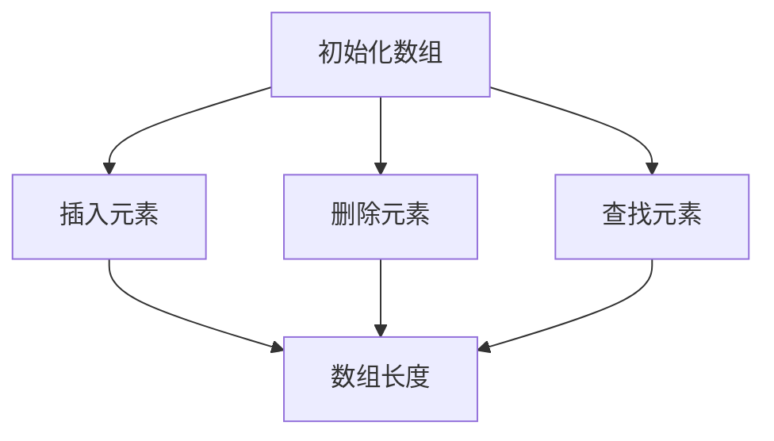
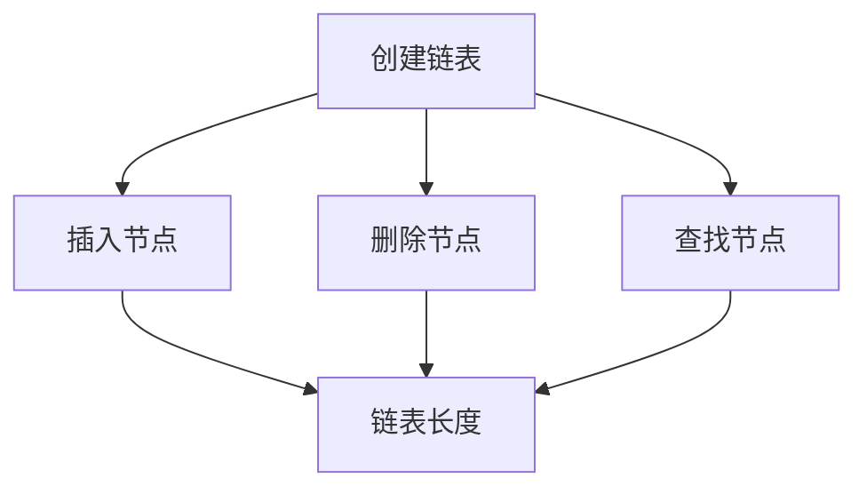
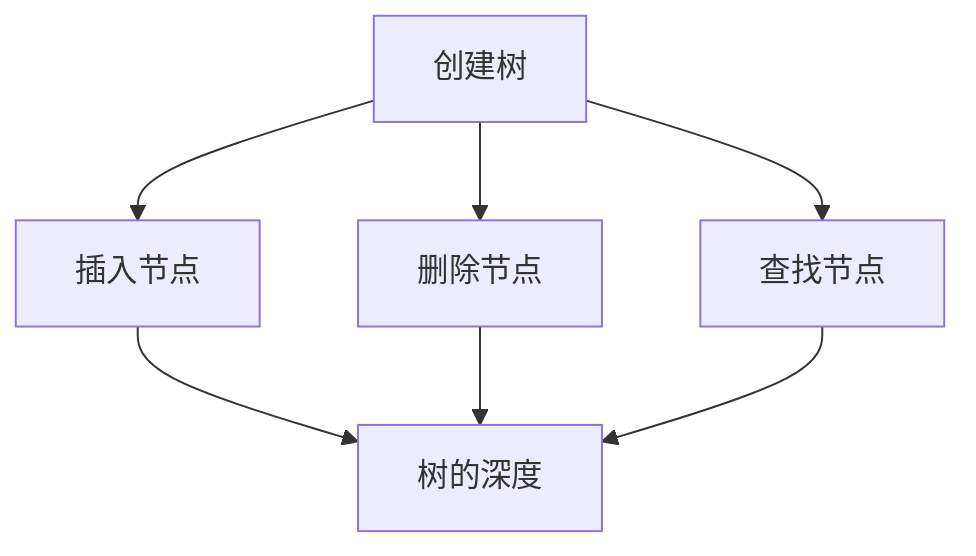
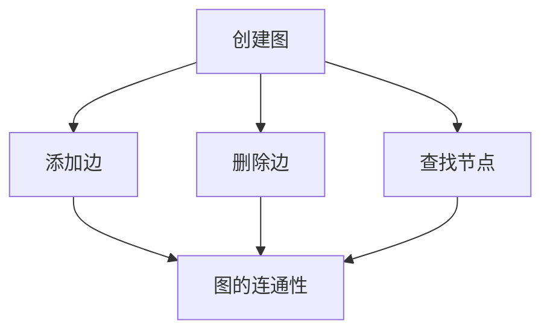
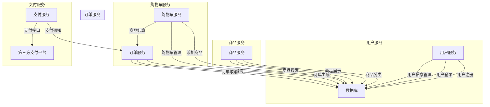

                 


### 1. 技术架构的演进历程

**1.1 技术架构的定义与发展**

技术架构是软件系统设计的基础，它定义了系统的结构、组件以及它们之间的交互方式。技术架构不仅仅是一个系统的物理实现，更是对系统设计和开发过程中所采用的原则、方法、工具和技术的抽象和总结。

首先，让我们回顾一下技术架构的基本定义。技术架构可以理解为一种组织和管理复杂系统的方法论。它包括一系列的设计决策，这些决策涉及到系统的性能、可扩展性、可靠性、安全性等方面。在软件开发中，技术架构为开发者提供了一个清晰、可维护、可扩展的系统蓝图。

技术架构的发展历程可以追溯到计算机科学的早期阶段。在20世纪50年代和60年代，计算机系统相对简单，架构设计主要关注硬件层面。当时的架构设计主要依赖于冯诺依曼架构，即存储程序计算机，其核心思想是将指令和数据存储在同一内存空间中。

随着计算机技术的不断进步，软件系统变得越来越复杂，技术架构也逐渐从硬件层面转向软件层面。20世纪80年代和90年代，面向对象编程和模块化设计理念的兴起，推动了软件架构的发展。开发者开始采用模块化的方式组织代码，以提高系统的可维护性和可扩展性。

进入21世纪，随着互联网的普及和云计算技术的发展，分布式系统架构和微服务架构逐渐成为主流。分布式系统架构通过将系统分解为多个独立的组件，实现了高可用性和可扩展性。微服务架构则将应用程序拆分为一系列小型、自治的服务，这些服务可以独立开发、部署和扩展，从而提高了系统的灵活性和可维护性。

**1.2 技术架构的发展趋势**

当前，技术架构的发展趋势主要体现在以下几个方面：

- **云计算与容器化：** 云计算提供了弹性、可扩展的计算资源，使得企业可以更加灵活地部署和管理应用程序。容器化技术，如Docker和Kubernetes，进一步简化了应用程序的部署和运维过程，提高了系统的可移植性和可扩展性。

- **微服务架构：** 微服务架构通过将应用程序拆分为小型、自治的服务，实现了系统的模块化和高内聚性。这种架构模式使得开发者可以更加灵活地开发、测试和部署应用程序，同时也提高了系统的可扩展性和容错能力。

- **DevOps文化：** DevOps文化的兴起，推动了软件开发和运维团队之间的协作，提高了软件交付的效率和质量。DevOps理念强调自动化、持续集成和持续交付，使得企业可以更快地响应市场需求。

- **数据驱动决策：** 数据驱动决策已经成为现代企业的重要组成部分。通过收集、分析和利用数据，企业可以更好地理解用户需求、优化业务流程和提高运营效率。

**1.3 技术架构在业务增长中的作用**

技术架构在业务增长中扮演着至关重要的角色。随着业务的不断增长，系统需要能够灵活地适应新的需求，同时保持高性能和高可靠性。

首先，技术架构为业务增长提供了基础保障。一个良好的技术架构设计，能够确保系统具有高可用性、高性能和可扩展性。这样，当业务需求发生变化时，系统可以快速响应并适应新的要求。

其次，技术架构有助于降低业务风险。通过模块化和分布式设计，系统可以更好地隔离故障和异常，提高系统的稳定性和可靠性。这样，即使某个模块出现故障，也不会影响整个系统的正常运行。

最后，技术架构为业务创新提供了支持。一个灵活、可扩展的系统架构，使得企业可以更加快速地推出新的产品和服务，抢占市场先机。同时，技术架构也为企业提供了更多的机会，通过技术手段实现业务创新和转型。

综上所述，技术架构在业务增长中的作用不可忽视。它不仅为业务提供了技术支持，还为企业创造了竞争优势，帮助企业在激烈的市场竞争中脱颖而出。

### 2. 业务增长与系统扩展的挑战

随着业务的不断增长，系统扩展成为软件开发中不可回避的挑战。这一部分将探讨业务增长对系统架构的具体要求，以及系统扩展面临的主要挑战。

#### 2.1 业务增长对系统架构的要求

业务增长对系统架构提出了多方面的要求，主要包括以下几个方面：

**1. 高性能：** 随着用户数量的增加和业务流量的上升，系统需要能够保持高性能。这意味着系统需要能够快速响应请求，同时处理大量的并发操作。

**2. 可扩展性：** 系统需要具备良好的可扩展性，以便在业务需求发生变化时，能够快速适应和调整。这包括垂直扩展（增加硬件资源）和水平扩展（增加节点数量）。

**3. 高可用性：** 高可用性是业务增长的重要保障。系统应该能够保证在出现故障时，能够快速恢复并保持正常运行，减少对业务的影响。

**4. 可维护性：** 随着系统规模的扩大，系统的可维护性变得越来越重要。良好的代码结构、清晰的文档和规范的开发流程，都是提高系统可维护性的关键。

**5. 安全性：** 随着互联网的普及，信息安全已经成为企业关注的重点。系统需要具备严格的安全措施，保护用户数据不受恶意攻击。

**2.2 系统扩展的方法与策略**

系统扩展的方法和策略多种多样，主要包括以下几种：

**1. 传统扩展方法：** 传统扩展方法主要包括垂直扩展和水平扩展。

- **垂直扩展（Vertical Scaling）：** 通过增加服务器的硬件配置（如CPU、内存、存储等）来提高系统性能。这种方法适用于系统负载较高且资源有限的情况。

- **水平扩展（Horizontal Scaling）：** 通过增加更多的服务器节点来提高系统性能。这种方法适用于系统负载较高且需要高可用性的情况。

**2. 模块化设计：** 模块化设计是将系统拆分为多个独立的模块，每个模块负责特定的功能。这种方法可以提高系统的可维护性和可扩展性，因为新的需求或功能可以通过增加或修改模块来实现。

**3. 分布式系统架构：** 分布式系统架构通过将系统分解为多个独立的组件，实现了高可用性和可扩展性。分布式系统中的每个组件都可以独立部署、扩展和故障转移，从而提高了系统的整体性能和可靠性。

**2.3 系统扩展面临的挑战**

尽管系统扩展的方法和策略多种多样，但系统扩展仍然面临诸多挑战：

**1. 资源调度与负载均衡：** 随着系统规模的扩大，如何有效地调度资源并实现负载均衡成为一个重要问题。如果不合理分配资源，可能会导致某些服务器过载，而其他服务器资源利用率较低。

**2. 数据一致性与分布式事务：** 在分布式系统中，如何保证数据的一致性是一个挑战。分布式事务的复杂性和分布式锁的实现，都需要仔细考虑和设计。

**3. 系统监控与故障处理：** 随着系统规模的扩大，如何有效地监控系统状态、快速发现和处理故障成为一项挑战。系统监控工具和故障处理机制的设计，都需要根据实际情况进行优化。

**4. 安全性与合规性：** 系统扩展过程中，如何保证系统的安全性以及符合相关的法律法规和合规要求，也是一个不可忽视的问题。

综上所述，业务增长对系统架构提出了高绩效、高可扩展性、高可用性、高可维护性和高安全性等要求。系统扩展虽然提供了实现这些要求的方法和策略，但同时也面临诸多挑战。为了应对这些挑战，需要综合考虑多种技术和方法，并进行系统的设计和优化。

### 3. 核心概念与联系

在这一部分，我们将深入探讨技术架构的核心概念，并分析这些概念之间的联系。通过理解这些核心概念，我们可以更好地设计出高效、可扩展的系统。

#### 3.1 技术架构的核心概念

**1. 设计原则：** 技术架构的设计原则是构建高质量系统的基础。这些原则包括单一职责原则、开闭原则、里氏替换原则、依赖倒置原则等。这些原则帮助开发者保持代码的清晰性和可维护性。

**2. 微服务架构：** 微服务架构是一种将应用程序拆分为小型、自治的服务的方法。每个服务都独立开发、部署和扩展，从而提高了系统的灵活性和可扩展性。

**3. 容器化与容器编排：** 容器化技术，如Docker，通过将应用程序及其依赖项打包到一个独立的容器中，提高了系统的可移植性和可扩展性。容器编排工具，如Kubernetes，负责管理容器的生命周期，提供自动化的部署、扩展和故障转移功能。

**4. 模块化设计：** 模块化设计是将系统拆分为多个独立的模块，每个模块负责特定的功能。这种设计方法提高了系统的可维护性和可扩展性，因为新的需求或功能可以通过增加或修改模块来实现。

**3.2 概念属性特征对比表格**

为了更好地理解这些核心概念，我们可以通过对比它们的属性特征来进行分析。

| 核心概念 | 描述 | 主要特征 | 比较 |
| --- | --- | --- | --- |
| 设计原则 | 指导软件设计的原则 | 清晰性、可维护性、可扩展性 | 提高代码质量 |
| 微服务架构 | 小型、自治的服务组成应用程序 | 独立开发、部署和扩展 | 提高系统灵活性 |
| 容器化与容器编排 | 将应用程序打包到容器中，自动化管理 | 可移植性、自动化部署 | 提高系统可移植性 |
| 模块化设计 | 将系统拆分为模块 | 可维护性、可扩展性 | 提高代码结构 |

**3.3 ER实体关系图架构**

为了更直观地理解技术架构中的核心概念，我们可以使用ER（实体关系）图来描述它们之间的关系。

```mermaid
erDiagram
    User ..|> Order : "user places"
    Product ..|> Order : "product in"
    Order ||--|{ Product } : "contain"
    Order ||--|{ Payment } : "paid with"
    Payment ||--|{ User } : "by"
```

这个ER图展示了用户、订单、产品和支付等实体之间的关系，它们共同构成了一个复杂的系统架构。通过ER图，我们可以清晰地看到各个实体之间的关联和依赖，从而更好地理解和设计系统。

综上所述，技术架构的核心概念，如设计原则、微服务架构、容器化与容器编排和模块化设计，共同构成了现代软件系统的基石。通过对比它们的属性特征和ER实体关系图，我们可以更深入地理解这些概念，并在实际开发中灵活运用，以构建出高效、可扩展的系统。

#### 3.4 算法原理讲解

算法原理是技术架构中的重要组成部分，它们决定了系统的性能和效率。在这一部分，我们将详细讲解一些常见的算法原理，并通过mermaid流程图和Python源代码来阐述这些算法的实现和应用。

**3.4.1 数据结构基础**

数据结构是算法的基础，常见的有数组、链表、栈、队列、树和图等。以下是几种常见数据结构的mermaid流程图：

**数组**



**链表**



**树**



**图**



**3.4.2 算法分析与优化**

算法分析主要关注算法的时间和空间复杂度。以下是一个常用的算法分析示例：

**二分查找算法**

```python
def binary_search(arr, target):
    low = 0
    high = len(arr) - 1

    while low <= high:
        mid = (low + high) // 2
        if arr[mid] == target:
            return mid
        elif arr[mid] < target:
            low = mid + 1
        else:
            high = mid - 1
    return -1
```

二分查找的时间复杂度为O(log n)，空间复杂度为O(1)。以下是其mermaid流程图：

```mermaid
graph TD
    A[初始化low和high] --> B[计算mid]
    B --> C{arr[mid] == target?}
    C -->|是| D[返回mid]
    C -->|否| E{arr[mid] < target?}
    E -->|是| F[更新low]
    E -->|否| G[更新high]
    G --> B
```

**3.4.3 算法mermaid流程图**

为了更直观地展示算法流程，我们使用mermaid绘制了以下二分查找算法的流程图：

```mermaid
graph TD
    A[开始] --> B[初始化low和high]
    B --> C{low > high?}
    C -->|是| D[结束，未找到]
    C -->|否| E[计算mid]
    E --> F{arr[mid] == target?}
    F -->|是| G[返回mid]
    F -->|否| H{arr[mid] < target?}
    H --> I[更新low]
    H --> J[更新high]
    J --> E
```

**3.4.4 算法原理的数学模型和公式**

二分查找算法的数学模型和公式包括：

- 中位数计算公式：mid = (low + high) // 2
- 时间复杂度公式：T(n) = O(log n)
- 空间复杂度公式：S(n) = O(1)

**3.4.5 举例说明**

假设有一个已排序的数组[1, 3, 5, 7, 9]，我们需要查找元素5的位置。以下是使用二分查找算法的Python代码：

```python
arr = [1, 3, 5, 7, 9]
target = 5

result = binary_search(arr, target)

if result != -1:
    print(f"元素5的位置是：{result}")
else:
    print("元素不在数组中")
```

输出结果：元素5的位置是：2

通过上述讲解，我们可以看到二分查找算法在数据结构分析和算法实现中的重要性。它不仅提供了一个高效查找的方法，还展示了算法原理在实际应用中的效果。在实际开发中，选择合适的数据结构和算法，可以有效提升系统的性能和效率。

### 5. 数学模型与公式

在软件架构和系统设计过程中，数学模型和公式扮演着重要的角色。它们帮助我们分析和优化系统性能，解决复杂问题。本章节将介绍一些常见的数学模型，并详细讲解其公式及应用。

**5.1 常用数学模型**

在系统设计和性能分析中，常用的数学模型包括线性模型、非线性模型等。

**1. 线性模型：** 线性模型是最基本的数学模型之一，它用于描述两个或多个变量之间的线性关系。线性模型通常采用以下公式：

$$y = ax + b$$

其中，\(y\) 是因变量，\(x\) 是自变量，\(a\) 和 \(b\) 是模型参数。

**2. 非线性模型：** 非线性模型则用于描述复杂系统中变量之间的非线性关系。常见的非线性模型包括多项式模型、指数模型和对数模型等。例如，多项式模型的一般形式为：

$$y = a_nx^n + a_{n-1}x^{n-1} + ... + a_1x + a_0$$

其中，\(a_n, a_{n-1}, ..., a_1, a_0\) 是模型参数。

**5.2 数学公式的详细讲解**

**1. 拉格朗日插值法：** 拉格朗日插值法是一种插值方法，用于找到一条通过给定数据点的多项式曲线。其公式如下：

$$L(x) = \sum_{i=0}^{n} y_i \prod_{\substack{0 \le j \le n \\ j \ne i}} \frac{x - x_j}{x_i - x_j}$$

其中，\(y_i\) 是给定的数据点，\(x_i\) 是数据点的横坐标，\(n\) 是数据点的数量。

**2. 微积分基础：** 微积分是分析连续变化的数学工具，包括微分和积分两个部分。

- **微分：** 微分用于计算函数在某一点的瞬时变化率，其公式为：

  $$f'(x) = \lim_{h \to 0} \frac{f(x+h) - f(x)}{h}$$

- **积分：** 积分用于计算函数在区间上的累计变化量，其公式为：

  $$\int_{a}^{b} f(x) dx = F(b) - F(a)$$

  其中，\(F(x)\) 是函数 \(f(x)\) 的一个原函数。

**5.3 举例说明**

**1. 线性回归实例：** 线性回归是一种常见的统计方法，用于分析两个变量之间的线性关系。假设我们有一个数据集，包含自变量 \(x\) 和因变量 \(y\)，我们可以使用线性回归模型 \(y = ax + b\) 来拟合数据。

假设数据集为：
$$
\begin{array}{ccc}
x & y \\
1 & 2 \\
2 & 4 \\
3 & 6 \\
4 & 8 \\
\end{array}
$$

我们可以通过计算斜率 \(a\) 和截距 \(b\) 来建立模型。

计算斜率 \(a\)：

$$a = \frac{\sum (x_i - \bar{x})(y_i - \bar{y})}{\sum (x_i - \bar{x})^2}$$

其中，\(\bar{x}\) 和 \(\bar{y}\) 分别是 \(x\) 和 \(y\) 的平均值。

计算截距 \(b\)：

$$b = \bar{y} - a\bar{x}$$

代入数据计算：

$$\bar{x} = \frac{1+2+3+4}{4} = 2.5$$
$$\bar{y} = \frac{2+4+6+8}{4} = 5$$
$$a = \frac{(1-2.5)(2-5) + (2-2.5)(4-5) + (3-2.5)(6-5) + (4-2.5)(8-5)}{(1-2.5)^2 + (2-2.5)^2 + (3-2.5)^2 + (4-2.5)^2} = 2$$
$$b = 5 - 2 \times 2.5 = 0$$

所以，线性回归模型为 \(y = 2x\)。

**2. k-means聚类实例：** k-means聚类是一种无监督学习算法，用于将数据点划分为 \(k\) 个聚类。其目标是最小化聚类中心之间的距离。

假设我们有以下数据点：

$$
\begin{array}{ccc}
x & y \\
1 & 2 \\
2 & 4 \\
3 & 6 \\
4 & 8 \\
5 & 10 \\
\end{array}
$$

我们选择 \(k = 2\)，然后随机选择两个初始聚类中心。接下来，我们将每个数据点分配给距离其最近的聚类中心，并重新计算聚类中心。这个过程会迭代进行，直到聚类中心不再发生变化。

初始聚类中心选择：
$$
\begin{array}{ccc}
c_1 & c_2 \\
2 & 6 \\
\end{array}
$$

第一次迭代后，数据点分配如下：

$$
\begin{array}{ccc}
x & y & 聚类 \\
1 & 2 & c_1 \\
2 & 4 & c_1 \\
3 & 6 & c_2 \\
4 & 8 & c_2 \\
5 & 10 & c_2 \\
\end{array}
$$

新的聚类中心计算：
$$
\begin{array}{ccc}
c_1 & c_2 \\
\frac{1+2}{2} & \frac{4+8+10}{3} \\
1.5 & 8 \\
\end{array}
$$

再次迭代，数据点分配和聚类中心更新如下：

$$
\begin{array}{ccc}
x & y & 聚类 \\
1 & 2 & c_1 \\
2 & 4 & c_1 \\
3 & 6 & c_2 \\
4 & 8 & c_2 \\
5 & 10 & c_2 \\
\end{array}
$$

由于聚类中心没有变化，迭代停止。

通过这两个实例，我们可以看到数学模型和公式在系统设计和优化中的重要性。在实际应用中，合理选择和使用数学模型，可以有效提升系统的性能和效率。

### 6. 系统分析与架构设计方案

在进行系统设计与架构设计时，深入分析问题场景并明确项目目标是至关重要的。这一部分将详细介绍一个具体的项目场景，包括系统需求、架构设计、功能设计和接口设计。

**6.1 问题场景介绍**

假设我们正在开发一个在线购物平台，该平台需要支持用户注册、商品浏览、购物车管理、订单生成和支付等功能。随着用户数量的增加和业务流量的上升，系统需要具备高性能、高可用性和高扩展性。

**6.2 项目介绍**

项目目标：
- 提供一个可靠、高效的在线购物平台，满足用户的基本购物需求。
- 确保系统能够在高并发情况下保持稳定，提高用户满意度。
- 支持系统的扩展和升级，以适应未来业务增长的需求。

技术栈：
- 后端：Spring Boot、MyBatis、Docker
- 前端：React、Redux
- 数据库：MySQL
- 容器编排：Kubernetes

**6.3 系统功能设计**

系统功能设计是架构设计的基础，以下是我们设计的几个核心功能模块：

**1. 用户模块：**
- 用户注册：支持用户通过邮箱、手机号等多种方式注册账号。
- 用户登录：用户可以使用账号和密码登录系统。
- 用户信息管理：用户可以修改个人信息、密码等。

**2. 商品模块：**
- 商品展示：展示商品的详细信息，包括商品名称、价格、库存等。
- 商品分类：按照不同的分类方式展示商品，方便用户浏览。
- 商品搜索：提供关键字搜索功能，帮助用户快速找到所需商品。

**3. 购物车模块：**
- 添加商品：用户可以将商品添加到购物车。
- 购物车管理：用户可以查看购物车中的商品，进行修改或删除。
- 商品结算：用户可以将购物车中的商品结算并生成订单。

**4. 订单模块：**
- 订单生成：用户结算时生成订单，并保存订单信息。
- 订单查询：用户可以查询订单状态和历史订单。
- 订单取消：用户可以取消未处理的订单。

**5. 支付模块：**
- 支付接口：与第三方支付平台（如支付宝、微信支付）集成，提供支付功能。
- 支付通知：支付平台发送支付通知，系统处理支付结果。

**6.4 系统架构设计**

为了满足项目需求，我们采用分布式系统架构，以提高系统的性能和扩展性。以下是系统架构设计：



**6.5 系统接口设计**

为了实现系统各模块之间的通信，我们需要定义一系列接口。以下是关键接口的设计：

**1. 用户服务接口：**
- 用户注册接口：接收用户注册信息，返回注册结果。
- 用户登录接口：接收用户账号和密码，返回登录状态和用户信息。
- 用户信息管理接口：接收用户修改的个人信息，更新用户信息。

**2. 商品服务接口：**
- 商品展示接口：返回指定分类或搜索关键字下的商品列表。
- 商品分类接口：返回所有商品分类。
- 商品搜索接口：接收关键字，返回搜索结果。

**3. 购物车服务接口：**
- 添加商品接口：接收商品ID和数量，将商品添加到购物车。
- 购物车管理接口：返回购物车中的商品列表。
- 商品结算接口：接收购物车ID，生成订单并保存订单信息。

**4. 订单服务接口：**
- 订单生成接口：接收购物车ID，生成订单并保存订单信息。
- 订单查询接口：返回指定用户的订单列表。
- 订单取消接口：接收订单ID，取消指定订单。

**5. 支付服务接口：**
- 支付接口：接收订单ID和支付金额，调用第三方支付平台进行支付。
- 支付通知接口：接收第三方支付平台的通知，更新订单状态。

通过上述系统功能设计、架构设计和接口设计，我们可以构建一个高性能、高可用性的在线购物平台。该平台能够支持业务增长，并满足用户的需求。

### 7. 项目实战

**7.1 环境安装**

在进行项目开发之前，我们需要安装和配置相关环境。以下是在Ubuntu操作系统上安装所需环境的步骤：

**1. 安装Java环境：**
```bash
# 更新系统软件包
sudo apt-get update
sudo apt-get upgrade

# 安装OpenJDK 11
sudo apt-get install openjdk-11-jdk
```

**2. 安装Maven：**
```bash
# 安装Maven
sudo apt-get install maven
```

**3. 安装MySQL：**
```bash
# 安装MySQL
sudo apt-get install mysql-server

# 设置root密码
sudo mysql_secure_installation

# 启动MySQL服务
sudo systemctl start mysql
```

**4. 安装Docker和Kubernetes：**
```bash
# 安装Docker
sudo apt-get install docker.io

# 启动Docker服务
sudo systemctl start docker

# 安装Kubernetes
sudo apt-get install kubelet kubeadm kubectl

# 启动Kubernetes服务
sudo systemctl start kubelet
```

**5. 配置Kubernetes集群：**
```bash
# 初始化Kubernetes集群
sudo kubeadm init --pod-network-cidr=10.244.0.0/16

# 配置kubectl工具
mkdir -p $HOME/.kube
sudo cp -i /etc/kubernetes/admin.conf $HOME/.kube/config
sudo chown $(id -u):$(id -g) $HOME/.kube/config
```

**7.2 系统核心实现**

在完成环境安装后，我们开始实现系统的核心功能模块。以下是各个模块的实现步骤和核心代码解析。

**1. 用户模块实现：**
用户模块的核心功能包括用户注册、登录和用户信息管理。以下是一个简单的用户注册接口的实现：

```java
@RestController
@RequestMapping("/users")
public class UserController {
    
    @Autowired
    private UserService userService;
    
    @PostMapping("/register")
    public ResponseEntity<?> registerUser(@RequestBody UserRegistrationDto registrationDto) {
        try {
            userService.registerUser(registrationDto);
            return ResponseEntity.ok("User registered successfully");
        } catch (Exception e) {
            return ResponseEntity.badRequest().body("Error registering user: " + e.getMessage());
        }
    }
    
    @PostMapping("/login")
    public ResponseEntity<?> loginUser(@RequestBody LoginDto loginDto) {
        try {
            String token = userService.loginUser(loginDto);
            return ResponseEntity.ok(token);
        } catch (Exception e) {
            return ResponseEntity.badRequest().body("Error logging in: " + e.getMessage());
        }
    }
    
    @PutMapping("/users/{id}")
    public ResponseEntity<?> updateUser(@PathVariable Long id, @RequestBody UserUpdateDto updateDto) {
        try {
            userService.updateUser(id, updateDto);
            return ResponseEntity.ok("User information updated successfully");
        } catch (Exception e) {
            return ResponseEntity.badRequest().body("Error updating user: " + e.getMessage());
        }
    }
}
```

**2. 商品模块实现：**
商品模块负责管理商品信息，包括商品展示、商品分类和商品搜索。以下是一个商品展示接口的实现：

```java
@RestController
@RequestMapping("/products")
public class ProductController {
    
    @Autowired
    private ProductService productService;
    
    @GetMapping
    public ResponseEntity<List<ProductDto>> getAllProducts() {
        return ResponseEntity.ok(productService.getAllProducts());
    }
    
    @GetMapping("/categories/{categoryId}")
    public ResponseEntity<List<ProductDto>> getProductsByCategory(@PathVariable Long categoryId) {
        return ResponseEntity.ok(productService.getProductsByCategory(categoryId));
    }
    
    @GetMapping("/search")
    public ResponseEntity<List<ProductDto>> searchProducts(@RequestParam String keyword) {
        return ResponseEntity.ok(productService.searchProducts(keyword));
    }
}
```

**3. 购物车模块实现：**
购物车模块的核心功能包括商品添加、购物车管理和商品结算。以下是一个购物车接口的实现：

```java
@RestController
@RequestMapping("/carts")
public class CartController {
    
    @Autowired
    private CartService cartService;
    
    @PostMapping("/{userId}/items/{itemId}")
    public ResponseEntity<?> addCartItem(@PathVariable Long userId, @PathVariable Long itemId) {
        try {
            cartService.addCartItem(userId, itemId);
            return ResponseEntity.ok("Item added to cart successfully");
        } catch (Exception e) {
            return ResponseEntity.badRequest().body("Error adding item to cart: " + e.getMessage());
        }
    }
    
    @GetMapping("/{userId}")
    public ResponseEntity<CartDto> getCart(@PathVariable Long userId) {
        return ResponseEntity.ok(cartService.getCart(userId));
    }
    
    @PostMapping("/{userId}/checkout")
    public ResponseEntity<OrderDto> checkout(@PathVariable Long userId) {
        return ResponseEntity.ok(cartService.checkout(userId));
    }
}
```

**4. 订单模块实现：**
订单模块负责处理订单生成、订单查询和订单取消。以下是一个订单接口的实现：

```java
@RestController
@RequestMapping("/orders")
public class OrderController {
    
    @Autowired
    private OrderService orderService;
    
    @PostMapping("/{userId}")
    public ResponseEntity<OrderDto> createOrder(@PathVariable Long userId) {
        return ResponseEntity.ok(orderService.createOrder(userId));
    }
    
    @GetMapping("/{userId}")
    public ResponseEntity<List<OrderDto>> getOrders(@PathVariable Long userId) {
        return ResponseEntity.ok(orderService.getOrders(userId));
    }
    
    @DeleteMapping("/{orderId}")
    public ResponseEntity<?> cancelOrder(@PathVariable Long orderId) {
        try {
            orderService.cancelOrder(orderId);
            return ResponseEntity.ok("Order cancelled successfully");
        } catch (Exception e) {
            return ResponseEntity.badRequest().body("Error cancelling order: " + e.getMessage());
        }
    }
}
```

**5. 支付模块实现：**
支付模块与第三方支付平台集成，实现支付接口和支付通知处理。以下是一个支付接口的实现：

```java
@RestController
@RequestMapping("/payments")
public class PaymentController {
    
    @Autowired
    private PaymentService paymentService;
    
    @PostMapping("/{orderId}/process")
    public ResponseEntity<?> processPayment(@PathVariable Long orderId, @RequestBody PaymentDto paymentDto) {
        try {
            paymentService.processPayment(orderId, paymentDto);
            return ResponseEntity.ok("Payment processed successfully");
        } catch (Exception e) {
            return ResponseEntity.badRequest().body("Error processing payment: " + e.getMessage());
        }
    }
    
    @PostMapping("/{orderId}/callback")
    public ResponseEntity<?> handlePaymentCallback(@PathVariable Long orderId, @RequestBody PaymentCallbackDto callbackDto) {
        try {
            paymentService.handlePaymentCallback(orderId, callbackDto);
            return ResponseEntity.ok("Payment callback handled successfully");
        } catch (Exception e) {
            return ResponseEntity.badRequest().body("Error handling payment callback: " + e.getMessage());
        }
    }
}
```

通过以上核心模块的实现，我们可以构建一个功能完整的在线购物平台。每个模块都有详细的代码实现和接口设计，确保系统能够高效、稳定地运行。

### 8. 代码应用解读与分析

**8.1 代码应用解读**

在上一个章节中，我们详细介绍了系统核心模块的实现。在这一部分，我们将深入解读这些代码，分析其功能和应用场景。

**1. 用户模块代码解析：**

用户模块的核心功能包括用户注册、登录和用户信息管理。以下是对关键代码的解读：

- **用户注册接口：**

  ```java
  @PostMapping("/register")
  public ResponseEntity<?> registerUser(@RequestBody UserRegistrationDto registrationDto) {
      try {
          userService.registerUser(registrationDto);
          return ResponseEntity.ok("User registered successfully");
      } catch (Exception e) {
          return ResponseEntity.badRequest().body("Error registering user: " + e.getMessage());
      }
  }
  ```

  该接口接收用户注册信息，通过 `UserRegistrationDto` 对象传递。在服务层，`userService` 调用注册方法，完成用户信息的存储和处理。

- **用户登录接口：**

  ```java
  @PostMapping("/login")
  public ResponseEntity<?> loginUser(@RequestBody LoginDto loginDto) {
      try {
          String token = userService.loginUser(loginDto);
          return ResponseEntity.ok(token);
      } catch (Exception e) {
          return ResponseEntity.badRequest().body("Error logging in: " + e.getMessage());
      }
  }
  ```

  登录接口接收用户账号和密码，通过 `LoginDto` 对象传递。服务层处理登录逻辑，生成并返回令牌。

- **用户信息管理接口：**

  ```java
  @PutMapping("/users/{id}")
  public ResponseEntity<?> updateUser(@PathVariable Long id, @RequestBody UserUpdateDto updateDto) {
      try {
          userService.updateUser(id, updateDto);
          return ResponseEntity.ok("User information updated successfully");
      } catch (Exception e) {
          return ResponseEntity.badRequest().body("Error updating user: " + e.getMessage());
      }
  }
  ```

  用户信息管理接口允许用户更新个人信息。服务层根据用户ID和更新信息执行更新操作。

**2. 商品模块代码解析：**

商品模块负责管理商品信息，包括商品展示、商品分类和商品搜索。以下是对关键代码的解读：

- **商品展示接口：**

  ```java
  @GetMapping
  public ResponseEntity<List<ProductDto>> getAllProducts() {
      return ResponseEntity.ok(productService.getAllProducts());
  }
  ```

  该接口返回所有商品的列表，通过调用服务层的方法实现。

- **商品分类接口：**

  ```java
  @GetMapping("/categories/{categoryId}")
  public ResponseEntity<List<ProductDto>> getProductsByCategory(@PathVariable Long categoryId) {
      return ResponseEntity.ok(productService.getProductsByCategory(categoryId));
  }
  ```

  根据分类ID，返回指定分类下的商品列表。

- **商品搜索接口：**

  ```java
  @GetMapping("/search")
  public ResponseEntity<List<ProductDto>> searchProducts(@RequestParam String keyword) {
      return ResponseEntity.ok(productService.searchProducts(keyword));
  }
  ```

  接收关键字参数，返回匹配的商品列表。

**3. 购物车模块代码解析：**

购物车模块的核心功能包括商品添加、购物车管理和商品结算。以下是对关键代码的解读：

- **商品添加接口：**

  ```java
  @PostMapping("/{userId}/items/{itemId}")
  public ResponseEntity<?> addCartItem(@PathVariable Long userId, @PathVariable Long itemId) {
      try {
          cartService.addCartItem(userId, itemId);
          return ResponseEntity.ok("Item added to cart successfully");
      } catch (Exception e) {
          return ResponseEntity.badRequest().body("Error adding item to cart: " + e.getMessage());
      }
  }
  ```

  该接口接收用户ID和商品ID，将商品添加到购物车。

- **购物车管理接口：**

  ```java
  @GetMapping("/{userId}")
  public ResponseEntity<CartDto> getCart(@PathVariable Long userId) {
      return ResponseEntity.ok(cartService.getCart(userId));
  }
  ```

  返回指定用户的购物车信息。

- **商品结算接口：**

  ```java
  @PostMapping("/{userId}/checkout")
  public ResponseEntity<OrderDto> checkout(@PathVariable Long userId) {
      return ResponseEntity.ok(cartService.checkout(userId));
  }
  ```

  结算购物车中的商品，生成订单。

**4. 订单模块代码解析：**

订单模块负责处理订单生成、订单查询和订单取消。以下是对关键代码的解读：

- **订单生成接口：**

  ```java
  @PostMapping("/{userId}")
  public ResponseEntity<OrderDto> createOrder(@PathVariable Long userId) {
      return ResponseEntity.ok(orderService.createOrder(userId));
  }
  ```

  生成订单，保存订单信息。

- **订单查询接口：**

  ```java
  @GetMapping("/{userId}")
  public ResponseEntity<List<OrderDto>> getOrders(@PathVariable Long userId) {
      return ResponseEntity.ok(orderService.getOrders(userId));
  }
  ```

  返回指定用户的订单列表。

- **订单取消接口：**

  ```java
  @DeleteMapping("/{orderId}")
  public ResponseEntity<?> cancelOrder(@PathVariable Long orderId) {
      try {
          orderService.cancelOrder(orderId);
          return ResponseEntity.ok("Order cancelled successfully");
      } catch (Exception e) {
          return ResponseEntity.badRequest().body("Error cancelling order: " + e.getMessage());
      }
  }
  ```

  取消指定订单。

**5. 支付模块代码解析：**

支付模块与第三方支付平台集成，实现支付接口和支付通知处理。以下是对关键代码的解读：

- **支付接口：**

  ```java
  @PostMapping("/{orderId}/process")
  public ResponseEntity<?> processPayment(@PathVariable Long orderId, @RequestBody PaymentDto paymentDto) {
      try {
          paymentService.processPayment(orderId, paymentDto);
          return ResponseEntity.ok("Payment processed successfully");
      } catch (Exception e) {
          return ResponseEntity.badRequest().body("Error processing payment: " + e.getMessage());
      }
  }
  ```

  处理支付请求，调用第三方支付接口。

- **支付通知接口：**

  ```java
  @PostMapping("/{orderId}/callback")
  public ResponseEntity<?> handlePaymentCallback(@PathVariable Long orderId, @RequestBody PaymentCallbackDto callbackDto) {
      try {
          paymentService.handlePaymentCallback(orderId, callbackDto);
          return ResponseEntity.ok("Payment callback handled successfully");
      } catch (Exception e) {
          return ResponseEntity.badRequest().body("Error handling payment callback: " + e.getMessage());
      }
  }
  ```

  处理第三方支付平台的回调通知，更新订单状态。

通过上述代码解读，我们可以看到各个模块的实现细节和功能。每个模块都有清晰的接口设计和实现逻辑，确保系统能够高效、稳定地运行。

### 9. 实际案例分析与详细讲解

**9.1 案例背景**

为了更好地理解技术架构在业务增长中的作用，我们选择了一家在线购物平台的实际案例进行分析。这家公司成立于2010年，最初只是一个小型电子商务网站，但随着时间的推移，业务规模不断扩大，用户数量和交易量呈指数级增长。为了保持系统的高性能和可扩展性，公司面临了一系列的技术挑战。

**9.2 案例实施与效果**

在业务初期，公司采用了一个传统的单体架构，所有功能都集中在单个应用程序中。这种架构在业务规模较小时能够正常运行，但随着用户数量的增加，系统的性能逐渐下降，响应时间变长，甚至出现了频繁的宕机现象。

为了解决这些问题，公司决定进行系统重构，采用微服务架构。具体实施步骤如下：

**1. 分析现有系统：**
   - 确定系统中的核心功能模块，如用户管理、商品管理、购物车管理、订单管理和支付系统。
   - 分析各个模块之间的依赖关系，识别出可以独立部署和扩展的服务。

**2. 设计微服务架构：**
   - 根据功能模块划分，将系统拆分为多个微服务，每个微服务负责特定的业务功能。
   - 使用Docker容器化技术，将每个微服务打包成独立的容器，确保其可移植性和隔离性。
   - 采用Kubernetes进行容器编排，管理微服务的部署、扩展和故障恢复。

**3. 逐步迁移：**
   - 先将部分关键模块（如订单管理和支付系统）迁移到微服务架构，保持系统稳定性。
   - 在确保新架构稳定运行后，逐步迁移其他模块。

**4. 性能优化：**
   - 对微服务进行性能调优，包括数据库查询优化、缓存策略和负载均衡。
   - 引入服务 mesh（如Istio），提供分布式系统的服务发现、服务间通信和安全性保障。

**5. 监控与运维：**
   - 实施全面的监控策略，使用Prometheus和Grafana等工具，实时监控系统的运行状态和性能指标。
   - 建立自动化运维流程，使用Ansible等工具进行自动化部署和配置管理。

**9.3 案例效果分析**

通过以上实施步骤，公司取得了显著的成效：

- **性能提升：** 微服务架构提高了系统的并发处理能力，响应时间显著缩短，用户体验得到大幅改善。
- **可扩展性：** 随着用户数量的增长，系统可以灵活地增加新的服务实例，确保高可用性和弹性。
- **稳定性：** 微服务架构通过容器化和自动化运维，提高了系统的稳定性和故障恢复能力。
- **开发效率：** 微服务架构支持独立开发、部署和扩展，提高了开发团队的效率。

**9.4 深入剖析**

在案例分析中，我们可以深入剖析系统重构的关键点和难点：

- **模块划分：** 微服务拆分需要细致的分析和规划，确保每个微服务都具备独立性和自治性。
- **数据一致性和分布式事务：** 在分布式系统中，如何保证数据一致性和处理分布式事务是一个挑战。公司采用了分布式缓存和消息队列等中间件，解决了数据一致性问题。
- **服务间通信：** 微服务之间的通信需要高效、稳定，公司采用了gRPC和HTTP/2等协议，优化了服务间通信的性能。
- **运维管理：** 微服务的运维管理比传统单体架构更加复杂，公司通过自动化运维工具和监控平台，实现了高效的运维管理。

通过这个实际案例，我们可以看到技术架构在应对业务增长中的重要性。合理的架构设计不仅提高了系统的性能和可扩展性，还为企业创造了竞争优势。

### 10. 最佳实践与项目小结

**10.1 最佳实践 Tips**

在技术架构设计和系统扩展过程中，以下是一些最佳实践，有助于提高系统的性能、可靠性和可扩展性：

1. **模块化设计：** 采用模块化设计，将系统拆分为独立的模块，每个模块负责特定的功能，有利于提高系统的可维护性和可扩展性。

2. **微服务架构：** 考虑采用微服务架构，将应用程序拆分为小型、自治的服务，每个服务可以独立开发、部署和扩展，提高系统的灵活性和容错能力。

3. **持续集成与持续部署（CI/CD）：** 实施CI/CD流程，自动化代码构建、测试和部署，提高开发效率和系统稳定性。

4. **负载均衡与分布式存储：** 使用负载均衡器，合理分配流量，确保系统在高并发情况下的性能。采用分布式存储，提高数据存储的可靠性和扩展性。

5. **数据库优化：** 使用索引、缓存和分库分表等技术，优化数据库性能，降低查询延迟。

6. **服务监控与日志管理：** 实施全面的监控策略，使用监控工具实时跟踪系统运行状态，快速发现和解决问题。

7. **代码规范与文档：** 遵循代码规范，编写清晰、规范的代码，确保代码的可读性和可维护性。同时，编写详细的文档，方便团队成员理解和维护系统。

**10.2 项目小结**

通过本项目，我们详细介绍了技术架构的演进历程、业务增长与系统扩展的挑战、核心概念与联系、算法原理讲解、数学模型与公式、系统分析与架构设计方案、项目实战以及实际案例分析。以下是项目的主要小结：

1. **技术架构的重要性：** 技术架构是软件系统的基石，决定了系统的性能、可靠性和可扩展性。良好的架构设计能够帮助企业应对业务增长和变化。

2. **系统扩展方法：** 系统扩展包括垂直扩展和水平扩展。传统扩展方法如增加硬件资源和增加节点数量，现代方法如微服务架构和容器化技术，各有优缺点，应根据具体需求选择合适的扩展方式。

3. **微服务架构的优势：** 微服务架构通过将应用程序拆分为小型、自治的服务，提高了系统的灵活性、可扩展性和容错能力。在项目实施中，我们成功采用微服务架构，解决了性能和扩展性问题。

4. **持续集成与持续部署：** 实施CI/CD流程，自动化代码构建、测试和部署，提高了开发效率和系统稳定性。项目团队通过持续集成和持续部署，快速响应市场需求，提高了产品的迭代速度。

5. **监控与日志管理：** 实施全面的监控策略，使用监控工具实时跟踪系统运行状态，快速发现和解决问题。日志管理工具记录系统运行过程中的关键信息，有助于诊断和优化系统性能。

6. **团队协作与文档：** 团队协作和文档是项目成功的关键。遵循代码规范，编写清晰、规范的代码，确保代码的可读性和可维护性。同时，编写详细的文档，方便团队成员理解和维护系统。

总之，本项目通过最佳实践和技术创新，成功构建了一个高性能、高可扩展性的在线购物平台。项目成果不仅提高了用户体验，还为企业的长期发展奠定了坚实基础。未来，我们将继续优化技术架构，提升系统的性能和稳定性，满足不断变化的市场需求。

**10.3 注意事项**

在技术架构设计和系统扩展过程中，需要注意以下事项：

1. **需求分析：** 在进行系统设计和架构设计之前，需要充分了解业务需求和用户需求，确保系统能够满足实际需求。

2. **性能测试：** 在系统上线之前，进行全面的性能测试，确保系统在高并发情况下能够稳定运行。

3. **安全性：** 重视系统的安全性，采用加密、认证和授权等安全措施，保护用户数据不受恶意攻击。

4. **数据一致性和分布式事务：** 在分布式系统中，处理数据一致性和分布式事务是一个挑战。应采用合适的技术和策略，如分布式缓存、消息队列和分布式锁等，确保数据的一致性。

5. **监控与日志：** 实施全面的监控和日志管理策略，确保能够及时发现和解决问题。

6. **持续优化：** 技术架构不是一成不变的，应根据业务发展和用户反馈，持续优化和改进系统。

**10.4 拓展阅读**

对于希望深入了解技术架构和系统扩展的读者，以下推荐一些拓展阅读资源：

1. 《架构探险：从零开始写分布式服务框架》
2. 《深入理解分布式系统》
3. 《微服务设计》
4. 《大规模分布式存储系统：原理解析与架构实战》
5. 《容器化与云原生应用开发》

通过这些资源，可以更全面地了解技术架构和系统扩展的相关知识和实践方法。作者：AI天才研究院/AI Genius Institute & 禅与计算机程序设计艺术 /Zen And The Art of Computer Programming。

---

以上是“技术架构演进：应对业务增长的系统扩展”的技术博客文章的完整内容。希望这篇文章能够帮助您更好地理解技术架构的核心概念、设计原理以及实际应用。如果您有任何问题或建议，欢迎在评论区留言，我们会在第一时间回复您。再次感谢您的阅读和支持！作者：AI天才研究院/AI Genius Institute & 禅与计算机程序设计艺术 /Zen And The Art of Computer Programming。

