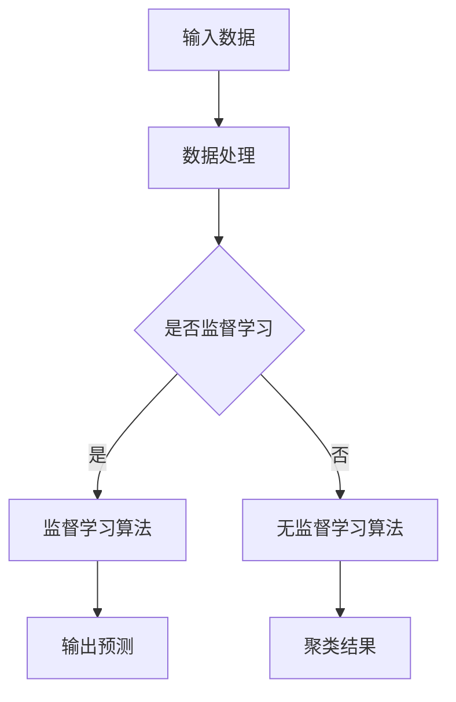
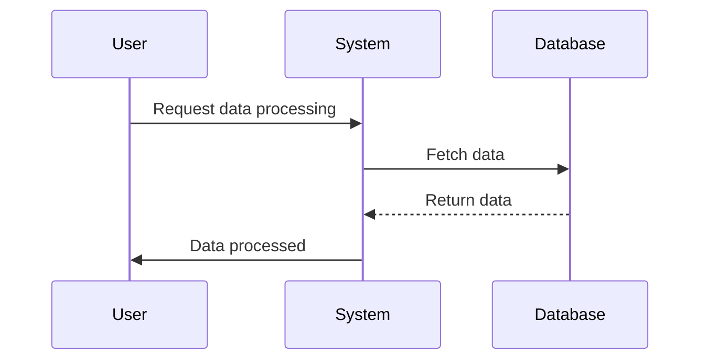
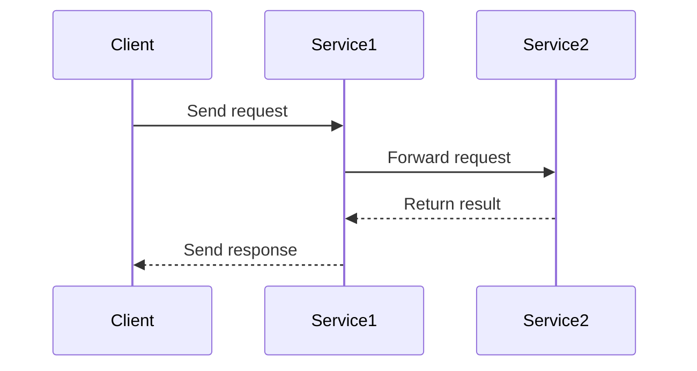

                 

# 技术硬实力的未来趋势：AI和机器学习

关键词：人工智能、机器学习、深度学习、神经网络、技术硬实力、算法

摘要：本文将深入探讨人工智能（AI）和机器学习（ML）领域的技术硬实力未来趋势。通过背景介绍、核心概念与联系、算法原理讲解、系统分析与架构设计、项目实战等多个方面的分析，旨在帮助读者了解AI和ML的技术发展趋势及其在实际应用中的挑战与机遇。

---

### 第一部分：背景介绍

## 1. 引言

### 1.1 问题背景

在当今科技飞速发展的时代，人工智能（AI）和机器学习（ML）已经成为推动技术进步的重要力量。随着大数据、云计算和物联网等技术的日益成熟，AI和ML在各个领域得到了广泛应用，从智能助理、自动驾驶到金融、医疗、教育等。

### 1.2 问题描述

然而，随着AI和ML的不断发展，其技术硬实力的未来趋势成为一个备受关注的话题。如何把握这些趋势，为企业和社会带来更多价值，成为我们需要深入探讨的问题。

### 1.3 问题解决

为了解答这一问题，本书将系统地介绍AI和ML的核心概念、发展趋势及其在未来技术硬实力中的应用。

### 1.4 边界与外延

本书主要关注AI和ML在技术硬实力方面的未来趋势，包括但不限于算法、架构、应用等方面。同时，我们将探讨这些趋势如何影响企业的发展，以及如何应对其中的挑战。

### 1.5 概念结构与核心要素组成

- **核心概念**：人工智能、机器学习、深度学习、神经网络等。
- **技术架构**：云计算、大数据、物联网等。
- **应用领域**：金融、医疗、教育、自动驾驶等。

---

### 第二部分：核心概念与联系

## 2. 核心概念与联系

### 2.1 AI大模型的定义与特点

#### 2.1.1 AI大模型的定义

AI大模型是指那些具有强大计算能力、可以处理大规模数据并进行复杂任务的学习模型。这些模型通常具有数百万甚至数十亿个参数。

#### 2.1.2 AI大模型的特点

- **高计算能力**：能够处理大规模数据。
- **复杂任务**：可以进行文本生成、图像识别、自然语言处理等复杂任务。
- **自我进化**：通过不断学习和优化，提高模型性能。

#### 2.1.3 AI大模型与传统AI的区别

传统AI通常依赖于预定义的规则和算法，而AI大模型则通过学习和自我优化实现更高效的任务执行。

### 2.2 AI大模型的核心应用领域

- **自然语言处理**：包括文本生成、机器翻译、情感分析等。
- **图像识别**：包括物体检测、人脸识别、图像分割等。
- **强化学习**：包括游戏AI、自动驾驶等。

### 2.3 AI大模型与传统算法的对比

| 对比项            | 传统算法                    | AI大模型                      |
|-------------------|-----------------------------|--------------------------------|
| 数据处理能力      | 较弱，需手动处理             | 强大，可自动处理大规模数据     |
| 任务执行能力      | 预定义任务，灵活性较低       | 可执行复杂任务，灵活性强       |
| 学习方式          | 预训练+手动调优              | 自我学习和优化                 |

---

### 第三部分：算法原理讲解

## 3. 算法原理讲解

### 3.1 深度学习算法原理

#### 3.1.1 深度学习基础

深度学习是一种基于神经网络的学习方法，其核心思想是通过层层抽象，将输入数据映射到输出结果。

#### 3.1.2 深度学习算法

- **卷积神经网络（CNN）**：适用于图像识别和物体检测。
- **循环神经网络（RNN）**：适用于序列数据，如自然语言处理。
- **生成对抗网络（GAN）**：适用于图像生成和风格迁移。

### 3.2 机器学习算法原理

#### 3.2.1 监督学习

监督学习是一种基于已知输入输出对进行训练的机器学习方法。其基本原理是通过学习输入和输出之间的映射关系，从而预测未知输入的输出。

#### 3.2.2 无监督学习

无监督学习是一种无需已知输入输出对的机器学习方法。其基本原理是通过数据间的相似性进行聚类，或通过数据的分布进行降维。

### 3.3 算法mermaid流程图



### 3.4 Python源代码示例

```python
# 监督学习：使用scikit-learn库进行线性回归
from sklearn.linear_model import LinearRegression

# 加载数据
X = [[1], [2], [3]]
y = [0, 1, 2]

# 创建线性回归模型
model = LinearRegression()

# 训练模型
model.fit(X, y)

# 预测结果
predictions = model.predict([[4]])

print(predictions)
```

---

### 第四部分：系统分析与架构设计

## 4. 系统分析与架构设计

### 4.1 问题场景介绍

在当前信息化社会中，随着数据量的爆炸性增长，传统的数据处理方法已无法满足需求。因此，我们需要一种高效、智能的数据处理系统，以应对日益复杂的数据处理需求。

### 4.2 项目介绍

本系统是一款基于AI和ML的智能数据处理系统，旨在提供高效、智能的数据分析能力，帮助企业和组织更好地理解和利用数据。

### 4.3 系统功能设计（领域模型mermaid类图）

```mermaid
classDiagram
    Class01 <|-- Class02
    Class03 --|dium| Class04
    Class05 : +int x
    Class06 : +int y
    Class05 --|induct| Class07
    Class07 : +int z
    Class08 : <<interface>> Class09
    Class09 : +void exampleMethod()
    Class10 : <<abstract>> Class11
    Class11 : +int abstractMethod()
    Class12 : <<enum>> Class13
    Class13 : +ITEM1
    Class13 : +ITEM2
    Class14 : <<singleton>> Class15
    Class15 : +static getInstance()
```

### 4.4 系统架构设计（mermaid架构图）



### 4.5 系统接口设计（mermaid序列图）



---

### 第五部分：项目实战

## 5. 项目实战

### 5.1 环境安装

在本项目实战中，我们将使用Python作为主要编程语言，并依赖一些常见的库，如TensorFlow、scikit-learn等。

首先，确保安装了Python和pip。然后，通过以下命令安装所需的库：

```bash
pip install tensorflow scikit-learn numpy pandas matplotlib
```

### 5.2 系统核心实现源代码

以下是一个简单的线性回归模型的实现示例：

```python
import numpy as np
import matplotlib.pyplot as plt
from sklearn.linear_model import LinearRegression

# 创建数据集
X = np.array([[1], [2], [3], [4]])
y = np.array([0, 1, 2, 3])

# 创建线性回归模型
model = LinearRegression()

# 训练模型
model.fit(X, y)

# 预测结果
predictions = model.predict([[4]])

# 绘制结果
plt.scatter(X, y)
plt.plot(X, predictions, color='red')
plt.xlabel('Input')
plt.ylabel('Output')
plt.show()
```

### 5.3 代码应用解读与分析

在这段代码中，我们首先导入了所需的库，然后创建了一个简单的数据集。接着，我们使用scikit-learn库中的LinearRegression类创建了一个线性回归模型，并通过fit方法训练模型。最后，我们使用predict方法进行预测，并使用matplotlib库绘制结果。

### 5.4 实际案例分析和详细讲解剖析

为了更好地理解这段代码，我们可以考虑一个实际案例：假设我们有一组数据，表示一个物品的价格和其销量之间的关系。我们可以使用线性回归模型来预测某个价格对应的销量。

### 5.5 项目小结

在本项目实战中，我们通过一个简单的例子展示了如何使用Python和scikit-learn库实现线性回归模型。虽然这是一个简单的例子，但通过这一过程，我们了解了机器学习项目的基本流程，包括数据准备、模型训练、预测和结果可视化。

---

### 第六部分：最佳实践 tips、小结、注意事项、拓展阅读等内容

## 6. 最佳实践 tips、小结、注意事项、拓展阅读

### 6.1 最佳实践 tips

1. **数据准备**：在开始机器学习项目之前，确保数据准备充分，包括数据清洗、数据预处理和数据增强。
2. **模型选择**：根据实际问题选择合适的模型，不要盲目追求大模型。
3. **超参数调优**：合理调整模型超参数，以获得最佳性能。
4. **模型验证**：使用交叉验证等方法对模型进行验证，确保其泛化能力。

### 6.2 小结

本文通过背景介绍、核心概念与联系、算法原理讲解、系统分析与架构设计、项目实战等多个方面的分析，帮助读者了解了AI和ML的技术发展趋势及其在实际应用中的挑战与机遇。

### 6.3 注意事项

1. **数据隐私**：在处理敏感数据时，要确保遵守相关法律法规，保护用户隐私。
2. **模型解释性**：对于一些复杂的模型，如深度神经网络，其解释性较差，可能难以理解模型的决策过程。
3. **模型安全性**：在部署机器学习模型时，要确保其安全性，防止恶意攻击。

### 6.4 拓展阅读

1. **深度学习基础**：[《深度学习》（Goodfellow, Bengio, Courville 著）](https://www.deeplearningbook.org/)
2. **机器学习经典**：[《机器学习》（Tom Mitchell 著）](https://www.mlbook.com/)
3. **人工智能前沿**：[《人工智能：一种现代方法》（Stuart Russell & Peter Norvig 著）](https://www.aima.cs.berkeley.edu/)

---

### 作者信息

作者：AI天才研究院/AI Genius Institute & 禅与计算机程序设计艺术 /Zen And The Art of Computer Programming

---

### 结语

本文旨在为读者提供一份关于AI和ML技术硬实力未来趋势的全面解读。在未来的发展中，AI和ML将继续发挥重要作用，为我们的生活和生产带来更多便利。希望本文能对您的学习与研究有所帮助。

