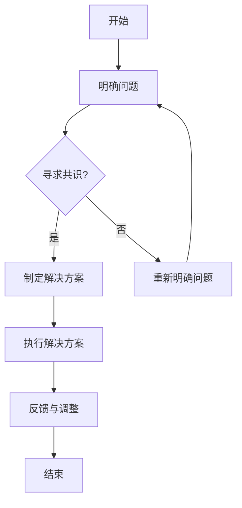
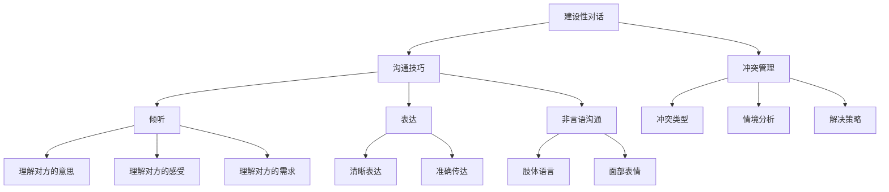

                 

**文章标题：技术管理中的冲突解决：建设性对话技巧**

**关键词：技术管理、冲突解决、建设性对话、沟通技巧、团队协作**

**摘要：本文将深入探讨技术管理中常见的冲突，以及如何通过建设性对话技巧来有效解决这些冲突，提高团队协作效率。**

**目录：**

# 技术管理中的冲突解决：建设性对话技巧

## 第1章 背景介绍

### 1.1 问题背景

### 1.2 问题描述

### 1.3 问题解决

### 1.4 边界与外延

### 1.5 概念结构与核心要素组成

## 第2章 核心概念与联系

### 2.1 建设性对话的概念与特点

### 2.2 冲突管理的概念与类型

### 2.3 沟通技巧的核心要素

## 第3章 建设性对话技巧详解

### 3.1 倾听技巧

### 3.2 表达技巧

### 3.3 非言语沟通技巧

### 3.4 冲突解决对话策略

## 第4章 项目实战

### 4.1 环境安装

### 4.2 系统核心实现源代码

### 4.3 代码应用解读与分析

### 4.4 实际案例分析和详细讲解剖析

### 4.5 项目小结

### 最佳实践 tips

### 小结

### 注意事项

### 拓展阅读

**第1章 背景介绍**

### 1.1 问题背景

在技术管理中，冲突是不可避免的。无论是软件开发团队，还是IT项目管理团队，成员之间的意见分歧、项目进度压力、资源分配不均等问题都可能导致冲突的产生。这些冲突如果不得到有效的解决，可能会影响团队的整体效率，甚至损害公司的长远发展。

### 1.2 问题描述

冲突的存在会带来一系列负面影响，如：

- 项目延误：由于团队成员之间的意见不一致，项目进度可能会受到影响，导致项目延期交付。
- 团队士气下降：冲突可能导致团队成员之间的紧张关系，影响工作氛围，降低团队士气。
- 资源浪费：如果冲突不能得到有效解决，可能会导致资源的浪费，如人力、时间、金钱等。

### 1.3 问题解决

建设性对话是一种有效的冲突解决方法。通过建设性对话，技术管理者可以在冲突发生时采取积极的态度和策略，引导团队成员寻求共赢的解决方案。建设性对话强调相互尊重、开放性沟通和寻求共识，有助于提高团队协作效率，减少冲突带来的负面影响。

### 1.4 边界与外延

本文将主要讨论以下方面的冲突解决技巧：团队沟通、项目协调、资源分配等。这些技巧适用于各种技术管理场景，如软件开发、IT项目管理等。

### 1.5 概念结构与核心要素组成

核心概念：建设性对话、冲突管理、沟通技巧。

概念属性特征对比表格：

| 概念           | 定义                                                   | 关联要素                                      |
|----------------|--------------------------------------------------------|-----------------------------------------------|
| 建设性对话     | 以积极、开放的态度进行沟通，寻求解决问题的方法         | 沟通技巧、倾听、表达、反馈                    |
| 冲突管理       | 通过合理的策略和技巧，解决团队内部的冲突               | 冲突类型、情境分析、解决策略                  |
| 沟通技巧       | 提高信息传递效率、减少误解、促进团队协作的技能         | 倾听、表达、非言语沟通、冲突解决对话策略      |

**第2章 核心概念与联系**

### 2.1 建设性对话的概念与特点

#### 2.1.1 建设性对话的定义

建设性对话是指团队成员在相互尊重的基础上，通过开放性沟通，解决冲突、提高工作效率的过程。

#### 2.1.2 建设性对话的特点

- 双方尊重：在建设性对话中，参与者应该相互尊重对方的意见和观点，避免指责和攻击。
- 开放性沟通：对话的双方应该保持开放的心态，愿意倾听和理解对方的观点，共同寻找解决问题的方法。
- 寻求共识：在建设性对话中，双方应该致力于寻求共识，找到一个双方都能接受的解决方案。
- 解决问题：建设性对话的目标是解决问题，而不是仅仅解决表面的冲突。

### 2.2 冲突管理的概念与类型

#### 2.2.1 冲突管理的定义

冲突管理是指管理者通过适当的策略和技巧，引导团队成员在冲突中寻求最佳解决方案的过程。

#### 2.2.2 冲突管理的类型

- 功能性冲突：这种冲突有助于团队的发展和进步，因为它们通常涉及到团队的目标和价值观。
- 非功能性冲突：这种冲突通常不会促进团队的发展，反而可能损害团队的合作关系和整体效率。

### 2.3 沟通技巧的核心要素

#### 2.3.1 倾听

倾听是有效沟通的基础，它包括理解对方的意思、感受和需求。

#### 2.3.2 表达

表达是指清晰、准确地传达自己的观点和需求。

#### 2.3.3 非言语沟通

非言语沟通包括肢体语言、面部表情等，它们在沟通中起着非常重要的作用。

#### 2.3.4 冲突解决对话策略

冲突解决对话策略包括：明确问题、寻找共识、制定解决方案、执行与反馈。

### 2.4 概念属性特征对比表格

| 概念           | 定义                                                   | 关联要素                                      |
|----------------|--------------------------------------------------------|-----------------------------------------------|
| 建设性对话     | 以积极、开放的态度进行沟通，寻求解决问题的方法         | 沟通技巧、倾听、表达、反馈                    |
| 冲突管理       | 通过合理的策略和技巧，解决团队内部的冲突               | 冲突类型、情境分析、解决策略                  |
| 沟通技巧       | 提高信息传递效率、减少误解、促进团队协作的技能         | 倾听、表达、非言语沟通、冲突解决对话策略      |

### 2.5 概念的ER实体关系图架构

```mermaid
entity关系图
    graph LR
    A[建设性对话] --> B[沟通技巧]
    A --> C[冲突管理]
    B --> D[倾听]
    B --> E[表达]
    B --> F[非言语沟通]
    C --> G[冲突类型]
    C --> H[情境分析]
    C --> I[解决策略]
    D --> J[理解对方的意思]
    D --> K[理解对方的感受]
    D --> L[理解对方的需求]
    E --> M[清晰表达]
    E --> N[准确传达]
    F --> O[肢体语言]
    F --> P[面部表情]
```

**第3章 建造性对话技巧详解**

### 3.1 倾听技巧

#### 3.1.1 倾听的四个层次

- 层次一：倾听表面信息
- 层次二：倾听情感
- 层次三：倾听意图
- 层次四：倾听价值观

#### 3.1.2 倾听的实践技巧

- 保持专注
- 避免打断
- 表达理解

### 3.2 表达技巧

#### 3.2.1 清晰表达的三要素

- 明确目的
- 逻辑清晰
- 语言简洁

#### 3.2.2 表达的实践技巧

- 使用具体例子
- 避免使用模糊词汇
- 控制情绪

### 3.3 非言语沟通技巧

#### 3.3.1 非言语沟通的重要性

非言语沟通在建设性对话中扮演重要角色，有助于加强沟通效果。

#### 3.3.2 非言语沟通的实践技巧

- 保持良好的肢体语言
- 善用面部表情
- 控制语速和音调

### 3.4 冲突解决对话策略

#### 3.4.1 明确问题

- 抓住问题的核心
- 区分表面问题与深层原因

#### 3.4.2 寻求共识

- 找到共同点
- 建立信任

#### 3.4.3 制定解决方案

- 多种方案选择
- 评估与选择

#### 3.4.4 执行与反馈

- 制定执行计划
- 及时反馈与调整

### 3.5 建造性对话的mermaid流程图



**第4章 项目实战**

### 4.1 环境安装

- 确定开发环境
- 安装相关工具和软件

### 4.2 系统核心实现源代码

- 代码结构设计

### 4.3 代码应用解读与分析

- 代码细节解读
- 应用场景分析

### 4.4 实际案例分析和详细讲解剖析

- 案例背景
- 冲突情况分析
- 冲突解决过程

### 4.5 项目小结

- 项目成果总结
- 项目经验教训

### 最佳实践 tips

- 沟通技巧建议
- 冲突解决策略建议

### 小结

- 文章核心内容总结
- 未来展望

### 注意事项

- 沟通技巧注意事项
- 冲突解决策略注意事项

### 拓展阅读

- 相关书籍推荐
- 在线课程推荐
- 论文推荐

**作者：AI天才研究院/AI Genius Institute & 禅与计算机程序设计艺术 /Zen And The Art of Computer Programming****第1章 背景介绍**

### 1.1 问题背景

在技术管理中，冲突是不可避免的。无论是软件开发团队，还是IT项目管理团队，成员之间的意见分歧、项目进度压力、资源分配不均等问题都可能导致冲突的产生。这些冲突如果不得到有效的解决，可能会影响团队的整体效率，甚至损害公司的长远发展。

#### 技术管理中的常见冲突类型

- **意见分歧**：团队成员对于技术方案、设计思路等存在不同看法，可能导致项目延期或资源浪费。
- **进度压力**：项目进度紧张，团队成员之间为了争取资源或完成任务，可能产生冲突。
- **资源分配**：项目资源有限，团队成员之间为了获取资源，可能产生竞争关系。

### 1.2 问题描述

冲突的存在会带来一系列负面影响，如：

- **项目延误**：由于团队成员之间的意见不一致，项目进度可能会受到影响，导致项目延期交付。
- **团队士气下降**：冲突可能导致团队成员之间的紧张关系，影响工作氛围，降低团队士气。
- **资源浪费**：如果冲突不能得到有效解决，可能会导致资源的浪费，如人力、时间、金钱等。

### 1.3 问题解决

建设性对话是一种有效的冲突解决方法。通过建设性对话，技术管理者可以在冲突发生时采取积极的态度和策略，引导团队成员寻求共赢的解决方案。建设性对话强调相互尊重、开放性沟通和寻求共识，有助于提高团队协作效率，减少冲突带来的负面影响。

#### 建设性对话的优势

- **增强团队凝聚力**：通过建设性对话，团队成员可以更好地理解彼此，增强团队凝聚力。
- **提高决策质量**：建设性对话有助于团队成员共同分析问题，提出多种解决方案，从而提高决策质量。
- **减少冲突**：建设性对话可以帮助团队成员在冲突发生时，采取积极的态度，避免冲突升级。

### 1.4 边界与外延

本文将主要讨论以下方面的冲突解决技巧：团队沟通、项目协调、资源分配等。这些技巧适用于各种技术管理场景，如软件开发、IT项目管理等。

#### 概念结构与核心要素组成

- **建设性对话**：以积极、开放的态度进行沟通，寻求解决问题的方法。
- **冲突管理**：通过合理的策略和技巧，解决团队内部的冲突。
- **沟通技巧**：提高信息传递效率、减少误解、促进团队协作的技能。

### 1.5 概念属性特征对比表格

| 概念           | 定义                                                   | 关联要素                                      |
|----------------|--------------------------------------------------------|-----------------------------------------------|
| 建设性对话     | 以积极、开放的态度进行沟通，寻求解决问题的方法         | 沟通技巧、倾听、表达、反馈                    |
| 冲突管理       | 通过合理的策略和技巧，解决团队内部的冲突               | 冲突类型、情境分析、解决策略                  |
| 沟通技巧       | 提高信息传递效率、减少误解、促进团队协作的技能         | 倾听、表达、非言语沟通、冲突解决对话策略      |

### 1.6 概念的ER实体关系图架构



**第2章 核心概念与联系**

### 2.1 建设性对话的概念与特点

#### 2.1.1 建设性对话的定义

建设性对话是指团队成员在相互尊重的基础上，通过开放性沟通，解决冲突、提高工作效率的过程。

#### 2.1.2 建设性对话的特点

- **双方尊重**：在建设性对话中，参与者应该相互尊重对方的意见和观点，避免指责和攻击。
- **开放性沟通**：对话的双方应该保持开放的心态，愿意倾听和理解对方的观点，共同寻找解决问题的方法。
- **寻求共识**：在建设性对话中，双方应该致力于寻求共识，找到一个双方都能接受的解决方案。
- **解决问题**：建设性对话的目标是解决问题，而不是仅仅解决表面的冲突。

### 2.2 冲突管理的概念与类型

#### 2.2.1 冲突管理的定义

冲突管理是指管理者通过适当的策略和技巧，引导团队成员在冲突中寻求最佳解决方案的过程。

#### 2.2.2 冲突管理的类型

- **功能性冲突**：这种冲突有助于团队的发展和进步，因为它们通常涉及到团队的目标和价值观。
- **非功能性冲突**：这种冲突通常不会促进团队的发展，反而可能损害团队的合作关系和整体效率。

### 2.3 沟通技巧的核心要素

#### 2.3.1 倾听

倾听是有效沟通的基础，它包括理解对方的意思、感受和需求。

#### 2.3.2 表达

表达是指清晰、准确地传达自己的观点和需求。

#### 2.3.3 非言语沟通

非言语沟通包括肢体语言、面部表情等，它们在沟通中起着非常重要的作用。

#### 2.3.4 冲突解决对话策略

冲突解决对话策略包括：明确问题、寻找共识、制定解决方案、执行与反馈。

### 2.4 概念属性特征对比表格

| 概念           | 定义                                                   | 关联要素                                      |
|----------------|--------------------------------------------------------|-----------------------------------------------|
| 建设性对话     | 以积极、开放的态度进行沟通，寻求解决问题的方法         | 沟通技巧、倾听、表达、反馈                    |
| 冲突管理       | 通过合理的策略和技巧，解决团队内部的冲突               | 冲突类型、情境分析、解决策略                  |
| 沟通技巧       | 提高信息传递效率、减少误解、促进团队协作的技能         | 倾听、表达、非言语沟通、冲突解决对话策略      |

### 2.5 概念的ER实体关系图架构


**第3章 建造性对话技巧详解**

### 3.1 倾听技巧

#### 3.1.1 倾听的四个层次

- **层次一：倾听表面信息**：这是最基本的倾听层次，主要关注对方说了什么。
- **层次二：倾听情感**：在这个层次上，我们开始关注对方的情感状态，如高兴、愤怒或沮丧。
- **层次三：倾听意图**：在这个层次上，我们尝试理解对方为什么要说这些话，对方的意图是什么。
- **层次四：倾听价值观**：这是最高层次的倾听，我们试图理解对方的价值观和信念，这有助于我们更好地理解对方的行为和观点。

#### 3.1.2 倾听的实践技巧

- **保持专注**：在对话中，避免分心，全身心地倾听对方。
- **避免打断**：让对方说完自己的观点，避免中途打断。
- **表达理解**：在对方说完后，可以通过总结对方的意思，表达自己对对方观点的理解。

### 3.2 表达技巧

#### 3.2.1 清晰表达的三要素

- **明确目的**：在表达观点时，首先要明确自己的目的，这样才能确保对方理解你的意图。
- **逻辑清晰**：表达观点时，要确保逻辑清晰，避免出现逻辑漏洞。
- **语言简洁**：尽量使用简单、直接的语言，避免使用过于复杂的词汇和句子。

#### 3.2.2 表达的实践技巧

- **使用具体例子**：通过具体的例子来阐述自己的观点，使对方更容易理解。
- **避免使用模糊词汇**：尽量使用明确、具体的词汇，避免使用模糊、不具体的词汇。
- **控制情绪**：在表达观点时，控制自己的情绪，避免情绪影响表达效果。

### 3.3 非言语沟通技巧

#### 3.3.1 非言语沟通的重要性

非言语沟通在建设性对话中扮演重要角色，有助于加强沟通效果。

#### 3.3.2 非言语沟通的实践技巧

- **保持良好的肢体语言**：如保持眼神交流、身体稍微前倾等，这些都可以传递出开放、友好的信号。
- **善用面部表情**：通过面部表情，可以传达出情感和态度，如微笑、皱眉等。
- **控制语速和音调**：语速和音调可以影响对方的情绪和感受，适当的控制有助于建立良好的沟通氛围。

### 3.4 冲突解决对话策略

#### 3.4.1 明确问题

- **抓住问题的核心**：在对话中，首先要明确问题的核心，避免被表面现象所迷惑。
- **区分表面问题与深层原因**：有些问题表面上看是技术问题，但实际上可能涉及到更深层的原因，如团队成员之间的信任问题。

#### 3.4.2 寻求共识

- **找到共同点**：在对话中，要努力找到双方的共同点，这有助于建立共识。
- **建立信任**：通过开放性沟通和相互尊重，建立信任，这是解决冲突的关键。

#### 3.4.3 制定解决方案

- **多种方案选择**：在找到共识后，可以提出多种解决方案，进行讨论和选择。
- **评估与选择**：对每个方案进行评估，选择最适合的方案。

#### 3.4.4 执行与反馈

- **制定执行计划**：在确定方案后，制定详细的执行计划，确保方案能够得到有效执行。
- **及时反馈与调整**：在执行过程中，要密切关注方案的实施情况，及时进行反馈和调整。

### 3.5 建造性对话的mermaid流程图


**第4章 项目实战**

### 4.1 环境安装

- **确定开发环境**：根据项目需求，确定所需的开发环境，如操作系统、编程语言、数据库等。
- **安装相关工具和软件**：安装必要的开发工具和软件，如集成开发环境（IDE）、版本控制系统等。

### 4.2 系统核心实现源代码

- **代码结构设计**：根据项目需求，设计系统的代码结构，包括模块划分、文件组织等。

### 4.3 代码应用解读与分析

- **代码细节解读**：对系统的核心代码进行详细解读，分析其实现原理和关键点。
- **应用场景分析**：分析系统在实际应用中的使用场景，评估其性能和可扩展性。

### 4.4 实际案例分析和详细讲解剖析

- **案例背景**：介绍一个实际发生的冲突案例，如团队成员在项目开发过程中出现的意见分歧。
- **冲突情况分析**：分析冲突的原因、影响以及可能产生的后果。
- **冲突解决过程**：详细描述冲突的解决过程，包括建设性对话的运用和解决方案的执行。

### 4.5 项目小结

- **项目成果总结**：总结项目的成果，如完成的功能点、性能提升等。
- **项目经验教训**：总结项目中的经验教训，为后续项目提供参考。

### 最佳实践 tips

- **沟通技巧建议**：根据项目经验和实际案例，提出有效的沟通技巧建议。
- **冲突解决策略建议**：分享有效的冲突解决策略，帮助团队成员更好地应对冲突。

### 小结

- **文章核心内容总结**：回顾文章的核心内容，总结建设性对话和冲突解决技巧的重要性和应用场景。
- **未来展望**：展望技术管理领域的发展趋势，以及建设性对话和冲突解决技巧在其中的应用前景。

### 注意事项

- **沟通技巧注意事项**：在沟通中，注意倾听、表达和非言语沟通的技巧。
- **冲突解决策略注意事项**：在解决冲突时，注意寻求共识、制定解决方案的执行与反馈。

### 拓展阅读

- **相关书籍推荐**：推荐一些与建设性对话和冲突解决相关的书籍，如《非暴力沟通》、《影响力》等。
- **在线课程推荐**：推荐一些与建设性对话和冲突解决相关的在线课程，如Coursera、edX等平台上的课程。
- **论文推荐**：推荐一些与建设性对话和冲突解决相关的论文，如学术期刊、会议论文等。

