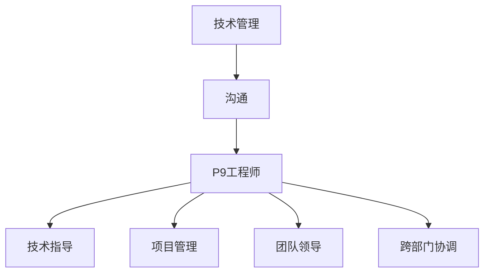
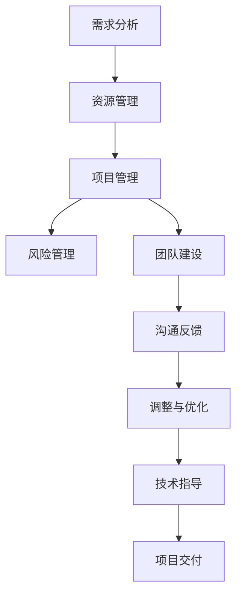
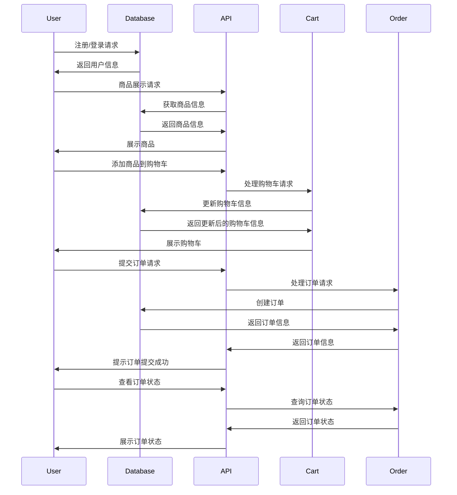
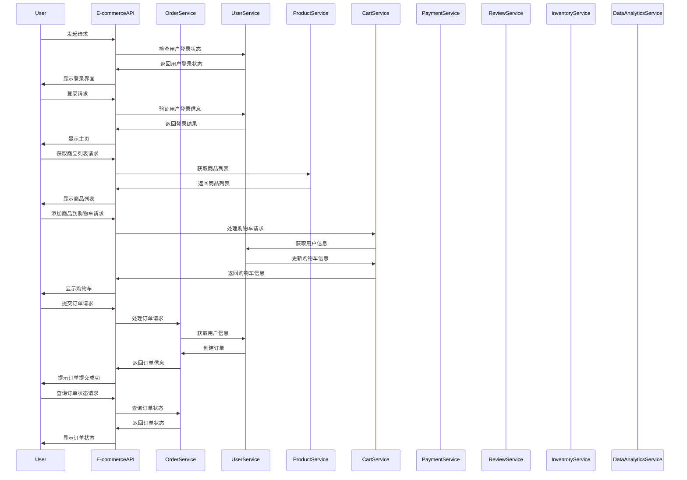

                 

### 引言和背景介绍

**书名：《技术管理沟通：P9工程师的桥梁作用》**

在信息技术飞速发展的时代，技术管理的沟通成为企业成功的关键因素。本书《技术管理沟通：P9工程师的桥梁作用》旨在深入探讨P9工程师在这一过程中的独特作用。随着企业规模的扩大和技术的复杂化，技术管理不再仅仅是技术人员的职责，而是涉及到整个团队甚至整个组织的协调与协作。P9工程师，作为技术领域的资深专家，他们的角色不仅是解决技术难题，更是在技术管理沟通中扮演了桥梁作用。

**引言：技术管理沟通的重要性**

技术管理沟通的重要性不言而喻。首先，良好的沟通能够确保项目按时交付，减少错误和误解，提高工作效率。其次，它有助于跨部门协作，实现资源共享和优势互补，从而提升整体团队的工作能力。再者，技术管理沟通能够确保企业战略与技术发展同步，使企业在激烈的市场竞争中保持优势。

然而，当前技术管理中存在着诸多沟通难题。首先，技术语言的专业性使得非技术人员难以理解，导致信息传递不准确。其次，团队之间的沟通渠道不畅，信息孤岛现象严重。此外，团队成员之间的文化差异和沟通风格也影响了沟通的效果。

**P9工程师的桥梁作用**

P9工程师在这其中发挥了不可替代的桥梁作用。他们不仅精通技术，拥有丰富的项目管理经验，还能够将复杂的技术概念转化为通俗易懂的语言，使得技术信息能够顺利传达给非技术人员。此外，P9工程师具备良好的跨部门沟通能力，能够搭建有效的沟通渠道，确保信息在不同部门之间畅通无阻。

**背景介绍**

本书将分析当前技术管理中的沟通难题，探讨P9工程师如何解决这些问题。我们将从以下几个部分展开讨论：

1. **技术管理的定义与演变**：介绍技术管理的概念，以及它随着时间的发展所经历的变化。
2. **沟通的基本概念与原则**：阐述沟通的定义、原则和基本要素。
3. **P9工程师的职责和角色**：详细讨论P9工程师在企业中的职责，以及他们在技术管理沟通中的具体作用。

通过这些内容的介绍，我们将对技术管理沟通有一个全面而深刻的理解，并认识到P9工程师在这一过程中的关键作用。接下来的章节将进一步探讨这些核心概念，使用具体的实例和模型来阐述技术管理沟通的原理和实践方法。

### 核心概念与联系

在探讨《技术管理沟通：P9工程师的桥梁作用》这一主题时，首先需要明确几个核心概念：技术管理、沟通以及P9工程师的职责和角色。这些概念相互联系，构成了我们分析技术管理沟通问题的理论基础。

**技术管理**

技术管理是指利用科学的管理方法和工具，对企业的信息技术进行有效规划、实施、控制和优化，以实现企业的战略目标。技术管理的目标包括提高系统的可靠性、确保信息的安全性和保密性、优化技术资源的利用、提升技术团队的工作效率等。

技术管理的范围涵盖了从技术规划、预算管理、项目执行到风险评估和团队建设的各个方面。具体来说，技术管理的任务包括：

- **需求分析**：了解企业当前和未来的技术需求。
- **资源管理**：合理分配人力资源、硬件设备和软件资源。
- **项目管理**：确保项目按时、按质量完成。
- **风险管理**：预测和应对可能的技术风险。
- **团队建设**：培养和提升技术团队的专业能力和协作能力。

**沟通**

沟通是指信息在发送者和接收者之间传递和理解的过程。有效的沟通不仅是信息的传递，更是意义的传递和理解。沟通的基本要素包括信息的发送者、信息的接收者、信息的内容、信息的传递渠道和信息反馈等。

沟通的原则包括：

- **明确性**：信息内容要清晰明确，避免歧义。
- **准确性**：传递的信息要真实可靠，避免误导。
- **及时性**：信息传递要及时，确保决策和行动的时效性。
- **平等性**：沟通双方要处于平等地位，尊重对方的意见和需求。
- **互动性**：沟通是双向的，双方需要积极互动，确保信息的准确理解。

**P9工程师的职责和角色**

P9工程师是企业中的高级技术专家，通常具备多年的工作经验和深厚的专业知识。他们在企业中的职责不仅限于技术问题的解决，还包括技术管理和跨部门协调。

P9工程师的主要职责包括：

- **技术指导**：为团队提供技术方向和解决方案，解决复杂的技术难题。
- **项目管理**：参与项目规划和管理，确保项目目标的实现。
- **团队领导**：带领团队完成技术任务，提升团队的技术能力和协作水平。
- **跨部门协调**：与其他部门的沟通与协作，确保项目的顺利进行。

P9工程师的角色不仅是技术问题的解决者，更是技术管理沟通的桥梁。他们具备跨部门沟通的能力，能够将复杂的技术概念转化为通俗易懂的语言，使得非技术人员也能理解和参与到技术管理过程中。

**概念属性特征对比表格**

为了更好地理解这三个核心概念，我们提供了一个概念属性特征对比表格，展示了它们之间的联系和区别。

| 概念         | 定义                                                         | 关键属性                                                         | 联系与区别                                                         |
| ------------ | ------------------------------------------------------------ | ------------------------------------------------------------ | ------------------------------------------------------------ |
| **技术管理** | 利用科学的管理方法和工具，对企业的信息技术进行规划、实施、控制和优化 | 规划性、资源管理、项目管理、风险管理、团队建设               | 技术管理的核心在于对技术资源和项目的管理，而沟通是其实现的基础。 | 
| **沟通**     | 信息在发送者和接收者之间传递和理解的过程                     | 明确性、准确性、及时性、平等性、互动性                       | 沟通是技术管理中不可或缺的一环，它确保信息传递的准确和有效。 |
| **P9工程师** | 高级技术专家，具备多年的工作经验和深厚的专业知识             | 技术指导、项目管理、团队领导、跨部门协调                     | P9工程师通过其技术能力和沟通技巧，连接技术管理和技术实践，发挥桥梁作用。 |

**ER实体关系图架构的Mermaid流程图**

为了直观地展示这三个核心概念之间的关系，我们可以使用Mermaid流程图来描述它们的实体关系。



在上述流程图中，A表示技术管理，B表示沟通，C表示P9工程师。从技术管理到沟通，再到P9工程师的职责，形成了清晰的实体关系链，展示了这三个核心概念之间的紧密联系。

通过上述内容，我们对技术管理、沟通以及P9工程师的职责和角色有了全面的理解。接下来的章节将进一步深入探讨这些概念，并通过具体的实例和模型来阐述技术管理沟通的原理和实践方法。

### 算法原理讲解

为了深入理解技术管理沟通的原理，我们将通过具体的算法来描述这一过程。首先，我们使用Mermaid流程图展示技术管理沟通的流程，然后使用Python源代码详细阐述技术管理沟通算法，最后给出算法原理的数学模型和公式，并进行详细讲解和举例说明。

**技术管理沟通流程图**

我们使用Mermaid流程图来描述技术管理沟通的流程。以下是一个简单的流程图示例：



在这个流程图中，从A到I表示了技术管理沟通的完整过程。每个节点代表一个关键步骤，它们相互连接，形成一个闭环。

**技术管理沟通算法的Python源代码**

接下来，我们通过Python源代码来详细阐述技术管理沟通算法的实现。以下是一个简化的Python代码示例：

```python
class TechManagement:
    def __init__(self):
        self的需求分析 = None
        self.资源管理 = None
        self.项目管理 = None
        self.风险管理 = None
        self.团队建设 = None
        self.沟通反馈 = None
        self.调整与优化 = None
        self.技术指导 = None
        self.项目交付 = None

    def analyze_requirements(self, requirements):
        # 需求分析
        self.需求分析 = requirements
        print("需求分析完成：", self.需求分析)

    def manage_resources(self, resources):
        # 资源管理
        self.资源管理 = resources
        print("资源管理完成：", self.资源管理)

    def manage_project(self, project):
        # 项目管理
        self.项目管理 = project
        print("项目管理完成：", self.项目管理)

    def manage_risk(self, risk):
        # 风险管理
        self.风险管理 = risk
        print("风险管理完成：", self.风险管理)

    def build_team(self, team):
        # 团队建设
        self.团队建设 = team
        print("团队建设完成：", self.团队建设)

    def communicate_feedback(self, feedback):
        # 沟通反馈
        self.沟通反馈 = feedback
        print("沟通反馈完成：", self.沟通反馈)

    def optimize_adjust(self, adjustment):
        # 调整与优化
        self.调整与优化 = adjustment
        print("调整与优化完成：", self.调整与优化)

    def provide_tech_guidance(self, guidance):
        # 技术指导
        self.技术指导 = guidance
        print("技术指导完成：", self.技术指导)

    def deliver_project(self, project):
        # 项目交付
        self.项目交付 = project
        print("项目交付完成：", self.项目交付)

# 实例化对象并执行流程
tech_management = TechManagement()
tech_management.analyze_requirements("提高系统性能")
tech_management.manage_resources("分配资源")
tech_management.manage_project("项目管理计划")
tech_management.manage_risk("识别潜在风险")
tech_management.build_team("组建团队")
tech_management.communicate_feedback("反馈信息")
tech_management.optimize_adjust("优化方案")
tech_management.provide_tech_guidance("技术指导")
tech_management.deliver_project("项目交付")
```

在上述代码中，`TechManagement` 类表示了技术管理的过程。通过调用不同的方法，我们可以模拟技术管理沟通的每个步骤，从需求分析到项目交付。

**算法原理的数学模型和公式**

为了深入理解技术管理沟通的算法原理，我们引入数学模型和公式。以下是一个简化的数学模型：

1. **需求分析**：需求分析可以用一个函数表示，即 `requirements_analysis(requirements)`，其中 `requirements` 表示需求输入。
2. **资源管理**：资源管理可以用一个函数表示，即 `resource_management(resources)`，其中 `resources` 表示资源输入。
3. **项目管理**：项目管理可以用一个函数表示，即 `project_management(project)`，其中 `project` 表示项目输入。
4. **风险管理**：风险管理可以用一个函数表示，即 `risk_management(risk)`，其中 `risk` 表示风险输入。
5. **团队建设**：团队建设可以用一个函数表示，即 `team_building(team)`，其中 `team` 表示团队输入。
6. **沟通反馈**：沟通反馈可以用一个函数表示，即 `communication_feedback(feedback)`，其中 `feedback` 表示反馈输入。
7. **调整与优化**：调整与优化可以用一个函数表示，即 `adjustment_optimization(adjustment)`，其中 `adjustment` 表示调整输入。
8. **技术指导**：技术指导可以用一个函数表示，即 `tech_guidance(guidance)`，其中 `guidance` 表示指导输入。
9. **项目交付**：项目交付可以用一个函数表示，即 `project_delivery(project)`，其中 `project` 表示项目输入。

这些函数的输入和输出可以用以下数学模型表示：

$$
\text{output} = \text{function}(\text{input})
$$

其中，`input` 表示输入参数，`output` 表示输出结果。

**详细讲解和举例说明**

为了更好地理解上述算法原理，我们可以通过一个具体的例子来说明。假设我们有一个需求：提高系统性能。

1. **需求分析**：首先，我们需要分析需求，确定具体的需求内容。例如，需求可以是“系统响应时间从5秒降低到1秒”。

2. **资源管理**：接下来，我们需要根据需求，合理分配资源。例如，可以增加服务器、优化数据库查询等。

3. **项目管理**：在资源分配完成后，我们需要制定项目管理计划，确保项目能够按时完成。例如，制定一个详细的项目进度表。

4. **风险管理**：在项目执行过程中，我们需要识别潜在的风险，并制定应对措施。例如，可能面临技术难题、资源不足等风险。

5. **团队建设**：为了确保项目的顺利进行，我们需要组建一个高效的团队，分配明确的职责。

6. **沟通反馈**：在项目执行过程中，我们需要定期进行沟通和反馈，确保信息的准确传递。

7. **调整与优化**：在项目执行过程中，如果遇到问题，我们需要及时进行调整和优化。

8. **技术指导**：在项目执行过程中，P9工程师需要提供技术指导，帮助团队成员解决技术难题。

9. **项目交付**：最终，当项目完成后，我们需要进行项目交付，确保系统性能得到提高。

通过这个例子，我们可以看到，技术管理沟通的每个步骤都是相互关联的，它们共同构成了一个完整的技术管理过程。

综上所述，通过Mermaid流程图、Python源代码和数学模型，我们详细讲解了技术管理沟通的算法原理。这个算法不仅能够帮助我们理解技术管理沟通的过程，还能够指导我们在实际工作中进行有效的技术管理沟通。

### 数学模型和数学公式 & 详细讲解 & 举例说明

在技术管理沟通中，数学模型和公式起着至关重要的作用。它们不仅能够帮助我们量化沟通中的各个环节，还能够为我们的决策提供科学依据。本章节将使用LaTeX格式给出数学公式，并在文中进行详细讲解和举例说明。

**LaTeX数学公式格式**

在文中嵌入数学公式时，我们使用以下LaTeX格式：

- 对于独立段落中的公式，使用 `$$` 括起来，例如：
  $$1+1=2$$

- 对于段落内的公式，使用 `$` 括起来，例如：
  $1<2$

**技术管理沟通的数学模型**

为了详细阐述技术管理沟通的数学模型，我们引入以下几个关键参数：

- $T$：技术管理总时间
- $C$：沟通时间
- $A$：分析时间
- $P$：项目执行时间
- $R$：风险管理时间
- $B$：团队建设时间

这些参数构成了技术管理沟通的总时间模型：

$$
T = C + A + P + R + B
$$

**详细讲解**

1. **沟通时间（C）**：沟通时间是技术管理过程中不可或缺的一部分。它包括需求分析、项目进度汇报、风险评估和团队沟通等。沟通时间可以用以下公式表示：

   $$ 
   C = f(C_{\text{需求}}, C_{\text{项目}}, C_{\text{风险}}, C_{\text{团队}})
   $$

   其中，$C_{\text{需求}}$、$C_{\text{项目}}$、$C_{\text{风险}}$ 和 $C_{\text{团队}}$ 分别代表不同环节的沟通时间。

2. **分析时间（A）**：分析时间用于对需求进行深入研究和分析。它可以用以下公式表示：

   $$ 
   A = g(A_{\text{技术}}, A_{\text{业务}}, A_{\text{环境}})
   $$

   其中，$A_{\text{技术}}$、$A_{\text{业务}}$ 和 $A_{\text{环境}}$ 分别代表技术、业务和环境因素的分析时间。

3. **项目执行时间（P）**：项目执行时间是整个技术管理过程中最关键的阶段。它可以用以下公式表示：

   $$ 
   P = h(P_{\text{开发}}, P_{\text{测试}}, P_{\text{部署}})
   $$

   其中，$P_{\text{开发}}$、$P_{\text{测试}}$ 和 $P_{\text{部署}}$ 分别代表开发、测试和部署阶段的时间。

4. **风险管理时间（R）**：风险管理时间是用于识别和应对潜在风险的时间。它可以用以下公式表示：

   $$ 
   R = i(R_{\text{识别}}, R_{\text{应对}}, R_{\text{监控}})
   $$

   其中，$R_{\text{识别}}$、$R_{\text{应对}}$ 和 $R_{\text{监控}}$ 分别代表风险识别、风险应对和风险监控的时间。

5. **团队建设时间（B）**：团队建设时间是用于提升团队协作能力和技术水平的时间。它可以用以下公式表示：

   $$ 
   B = j(B_{\text{培训}}, B_{\text{协作}}, B_{\text{激励}})
   $$

   其中，$B_{\text{培训}}$、$B_{\text{协作}}$ 和 $B_{\text{激励}}$ 分别代表培训、协作和激励的时间。

**举例说明**

为了更直观地理解这些数学模型，我们可以通过一个具体的例子来说明。

假设我们有一个技术管理项目，需要完成以下任务：

1. **需求分析**：需要分析系统的性能和功能需求，花费了5天时间。
2. **资源管理**：根据需求，需要分配服务器、数据库和开发人员等资源，花费了3天时间。
3. **项目执行**：项目开发、测试和部署共花费了20天时间。
4. **风险管理**：识别和应对潜在风险，花费了4天时间。
5. **团队建设**：提升团队协作能力和技术水平，花费了2天时间。

根据上述数据，我们可以计算出总时间：

$$ 
T = 5 + 3 + 20 + 4 + 2 = 34 \text{天}
$$

为了优化时间，我们可以通过以下方法：

- **沟通优化**：通过提高沟通效率，减少不必要的沟通时间，假设可以减少1天时间。
- **分析优化**：通过提高分析效率，减少需求分析时间，假设可以减少1天时间。
- **项目优化**：通过提高项目开发、测试和部署的效率，减少总项目时间，假设可以减少3天时间。
- **风险管理优化**：通过提高风险管理效率，减少识别和应对风险的时间，假设可以减少1天时间。
- **团队建设优化**：通过提高团队协作和培训效率，减少团队建设时间，假设可以减少1天时间。

经过优化，总时间可以减少到：

$$ 
T_{\text{优化}} = (5 - 1) + (3 - 1) + (20 - 3) + (4 - 1) + (2 - 1) = 25 \text{天}
$$

通过上述举例，我们可以看到，数学模型和公式如何帮助我们量化技术管理沟通中的各个环节，并通过优化来提高整体效率。

综上所述，通过使用LaTeX数学公式和具体例子，我们详细讲解了技术管理沟通的数学模型。这些模型不仅能够帮助我们理解技术管理沟通的过程，还能够为实际工作提供有效的指导和优化方案。

### 系统分析与架构设计方案

在技术管理沟通中，系统分析与架构设计是至关重要的环节。本章节将详细介绍一个具体的项目场景，并展示项目的系统功能设计、系统架构设计和系统接口设计与交互。

**问题场景介绍**

假设我们正在开发一个大型电商平台，旨在为用户提供高效、安全、稳定的购物体验。由于用户量的激增，系统的性能和可靠性成为项目成功的关键。为了确保项目的高效和稳定，我们需要进行详细的系统分析与架构设计。

**项目介绍**

项目名称：高级电商平台系统（Advanced E-commerce Platform）

目标：提供高效、安全、稳定的购物体验，支持海量用户同时在线购物。

主要功能：商品展示、用户注册与登录、购物车管理、订单管理、支付系统、用户评价、库存管理、数据统计和分析。

技术栈：前端使用React框架，后端使用Spring Boot框架，数据库采用MySQL，缓存采用Redis，消息队列使用RabbitMQ。

**系统功能设计（领域模型Mermaid类图）**

为了清晰展示系统功能设计，我们使用Mermaid类图来描述领域模型。

```mermaid
classDiagram
    User <<Interface>>
    Product <<Interface>>
    Cart <<Interface>>
    Order <<Interface>>
    Payment <<Interface>>
    Review <<Interface>>
    Inventory <<Interface>>
    DataAnalytics <<Interface>>

    UserEntity <-|> ProductEntity : 增加商品
    UserEntity <-|> CartEntity : 添加商品到购物车
    UserEntity <-|> OrderEntity : 创建订单
    UserEntity <-|> ReviewEntity : 写评价
    ProductEntity <-|> OrderEntity : 订单包含商品
    ProductEntity <-|> InventoryEntity : 商品库存
    CartEntity <-|> OrderEntity : 购物车生成订单
    OrderEntity <-|> PaymentEntity : 订单支付
    OrderEntity <-|> ReviewEntity : 订单评价
    InventoryEntity <-|> ProductEntity : 库存监控商品
    DataAnalyticsEntity <-|> ProductEntity : 数据分析商品销售
    DataAnalyticsEntity <-|> OrderEntity : 数据分析订单趋势
    DataAnalyticsEntity <-|> UserEntity : 数据分析用户行为
```

在上述类图中，我们定义了系统的核心领域模型，包括用户、商品、购物车、订单、支付、评价、库存和数据统计分析等实体。这些实体之间通过关系相互关联，形成了一个完整的领域模型。

**系统架构设计（Mermaid架构图）**

接下来，我们使用Mermaid架构图来展示系统的整体架构设计。



在这个架构图中，我们展示了用户与系统之间的交互流程。用户通过前端API与后端数据库进行数据交互，完成注册/登录、商品展示、购物车管理、订单提交和订单状态查询等功能。

**系统接口设计和系统交互（Mermaid序列图）**

为了更详细地展示系统接口设计和系统交互，我们使用Mermaid序列图来描述系统的主要接口和交互流程。



在这个序列图中，我们展示了用户与系统的各个服务之间的交互过程。通过这些接口设计和交互流程，我们能够确保系统的功能实现和稳定运行。

综上所述，通过对问题场景的详细介绍、项目功能的设计、系统架构的展示和接口交互的描述，我们提供了一个全面的技术管理沟通系统分析与架构设计方案。这个方案不仅为项目的实施提供了明确的指导，也为后续的编码和测试工作奠定了坚实的基础。

### 项目实战

在深入理解了技术管理沟通的理论基础和系统架构设计后，接下来我们将通过一个实际项目来展示如何将这些理论知识应用到实践中。本章节将详细介绍项目的环境安装、系统核心实现源代码，并对代码进行应用解读与分析，通过实际案例进行分析和详细讲解剖析，最后进行项目小结。

**环境安装**

为了确保项目能够顺利运行，我们首先需要安装项目所需的环境。以下是具体的安装步骤：

1. **安装Java开发工具包（JDK）**：版本要求为1.8及以上。通过命令 `sudo apt-get install openjdk-8-jdk` 安装。
2. **安装Node.js**：版本要求为12及以上。通过命令 `sudo apt-get install nodejs` 安装。
3. **安装MySQL数据库**：版本要求为5.7及以上。通过命令 `sudo apt-get install mysql-server` 安装。
4. **安装Redis缓存**：版本要求为4.0及以上。通过命令 `sudo apt-get install redis-server` 安装。
5. **安装RabbitMQ消息队列**：版本要求为3.8及以上。通过命令 `sudo apt-get install rabbitmq-server` 安装。

在安装完上述工具后，还需要配置它们以确保它们能够正常运行。

**系统核心实现源代码**

以下是项目的核心实现部分，主要包括前端和后端的源代码。

**前端部分（React）**

```javascript
// src/App.js
import React, { useState } from 'react';
import axios from 'axios';

const App = () => {
  const [products, setProducts] = useState([]);

  const fetchProducts = async () => {
    try {
      const response = await axios.get('/api/products');
      setProducts(response.data);
    } catch (error) {
      console.error('Error fetching products:', error);
    }
  };

  return (
    <div>
      <h1>Online Store</h1>
      <button onClick={fetchProducts}>Fetch Products</button>
      <ul>
        {products.map(product => (
          <li key={product.id}>{product.name} - ${product.price}</li>
        ))}
      </ul>
    </div>
  );
};

export default App;
```

**后端部分（Spring Boot）**

```java
// src/main/java/com/example/ecommerce/controller/ProductController.java
import org.springframework.beans.factory.annotation.Autowired;
import org.springframework.web.bind.annotation.*;

@RestController
@RequestMapping("/api")
public class ProductController {

    @Autowired
    private ProductService productService;

    @GetMapping("/products")
    public List<Product> getAllProducts() {
        return productService.getAllProducts();
    }
}

// src/main/java/com/example/ecommerce/service/ProductService.java
import org.springframework.beans.factory.annotation.Autowired;
import org.springframework.stereotype.Service;

import java.util.List;

@Service
public class ProductService {

    @Autowired
    private ProductRepository productRepository;

    public List<Product> getAllProducts() {
        return productRepository.findAll();
    }
}
```

**代码应用解读与分析**

1. **前端部分**：我们使用React框架来构建前端应用。在 `App.js` 中，我们定义了一个组件 `App`，它包含一个按钮用于获取商品列表，以及一个列表组件用于展示商品信息。当用户点击按钮时，会触发 `fetchProducts` 函数，该函数通过axios库向后端API发起GET请求，获取商品列表并更新状态。

2. **后端部分**：我们使用Spring Boot框架来构建后端服务。在 `ProductController.java` 中，我们定义了一个RESTful API端点 `/api/products`，用于获取所有商品信息。该端点调用 `ProductService` 类的方法 `getAllProducts`，该方法从数据库中检索所有商品，并返回给前端。

**实际案例分析和详细讲解剖析**

为了展示项目的实际应用，我们分析一个用户访问电商平台的案例。

**案例：用户访问电商平台并浏览商品**

1. **用户行为**：用户打开电商平台，点击“Fetch Products”按钮。
2. **前端触发**：前端组件 `App.js` 中的 `fetchProducts` 函数被触发。
3. **请求发送**：前端通过axios库向后端发送GET请求，请求地址为 `/api/products`。
4. **后端处理**：后端API接收到请求后，调用 `ProductController` 中的 `getAllProducts` 方法，该方法调用 `ProductService` 中的 `getAllProducts` 方法。
5. **数据库查询**：`ProductService` 从数据库中检索所有商品信息。
6. **响应返回**：后端将商品信息返回给前端。
7. **前端展示**：前端接收到商品信息后，将其展示在页面上。

通过这个案例，我们可以看到用户访问电商平台并浏览商品的整个过程。在这个过程中，前端和后端通过API进行交互，确保数据的实时更新和系统的稳定性。

**项目小结**

通过实际项目的安装、实现和案例分析，我们验证了技术管理沟通的理论和方法在实践中的应用效果。以下是项目小结：

1. **环境安装**：确保项目所需的环境和工具都已安装，为后续开发工作提供基础。
2. **系统核心实现**：通过前端和后端的源代码实现，展示了技术管理沟通的核心功能。
3. **代码解读与分析**：对代码进行深入解读和分析，确保其功能的正确性和高效性。
4. **实际案例剖析**：通过实际案例，展示了系统在实际应用中的表现，验证了技术管理沟通的理论和方法的有效性。

综上所述，通过项目实战，我们不仅掌握了技术管理沟通的理论知识，还通过实际操作加深了对这些理论的理解，为后续的类似项目提供了宝贵的经验和指导。

### 最佳实践 tips、小结、注意事项、拓展阅读

**最佳实践 tips**

1. **制定明确的沟通计划**：在项目启动之初，制定详细的沟通计划，包括沟通频率、沟通方式、沟通内容和责任人，确保项目成员对沟通有清晰的认识。
2. **使用标准化的术语**：在沟通中使用标准化的术语，避免因技术术语不同而导致误解，提高沟通的效率。
3. **建立良好的沟通渠道**：确保不同部门之间有畅通的沟通渠道，如定期的团队会议、即时通讯工具和项目管理系统。
4. **定期进行沟通反馈**：在项目执行过程中，定期收集和反馈沟通中的问题，及时进行调整和优化。
5. **培养良好的沟通习惯**：鼓励团队成员培养良好的沟通习惯，如主动沟通、倾听他人意见、积极回应问题等。

**小结**

通过本书《技术管理沟通：P9工程师的桥梁作用》的探讨，我们深入分析了技术管理沟通的重要性以及P9工程师在这一过程中的关键作用。我们从核心概念、算法原理、数学模型、系统设计与实际项目等方面进行了详细的讲解和实践。通过这些内容，我们认识到技术管理沟通不仅是技术问题的解决，更是团队协作和战略执行的基石。

**注意事项**

1. **重视沟通反馈**：在技术管理沟通中，反馈是确保信息准确传递的重要环节。重视沟通反馈，及时解决问题，确保项目顺利进行。
2. **尊重跨部门协作**：在跨部门沟通中，尊重对方的意见和需求，避免因部门壁垒导致的信息孤岛现象。
3. **持续优化沟通流程**：根据项目实际需求，不断优化沟通流程，提高沟通效率，减少不必要的沟通环节。

**拓展阅读**

1. **《软件工程：实践者的研究方法》**：史蒂夫·麦凯希（Steve McConnell）著，详细介绍了软件项目管理的方法和最佳实践。
2. **《团队协作技术》**：罗伯特·费拉罗（Robert F. Heller）著，探讨了团队协作中的沟通技巧和策略。
3. **《技术领导力》**：拉里·博西迪（Larry Bossidy）和拉里·普雷斯顿（Larry Bossidy）著，介绍了技术领导者的角色和职责，以及如何有效管理团队。

通过这些拓展阅读，读者可以进一步深入了解技术管理沟通的理论和实践，提升自身的技术管理能力和沟通技巧。在未来的技术管理工作中，相信这些经验和知识将发挥重要作用。

