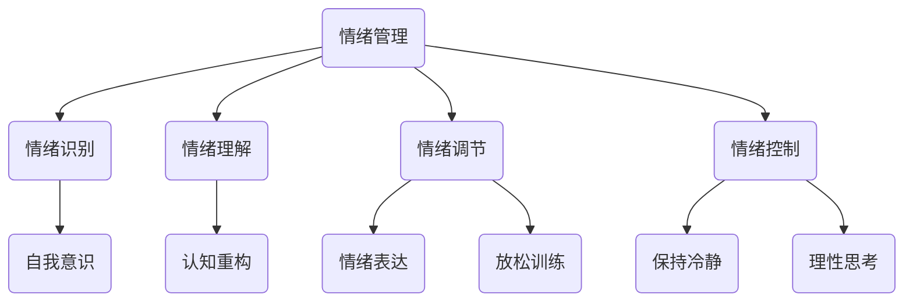
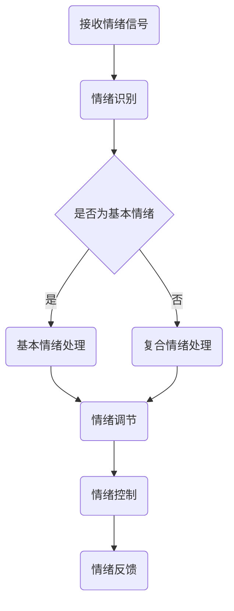
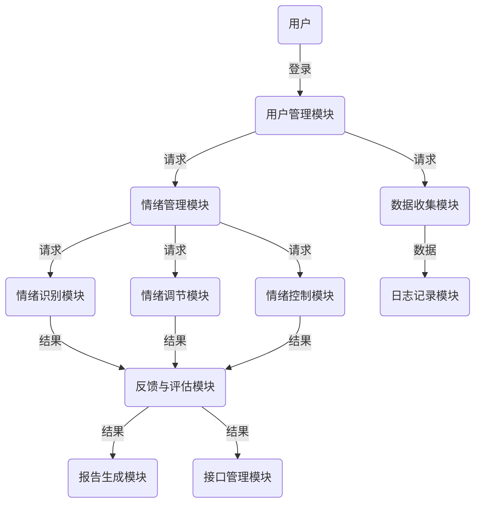
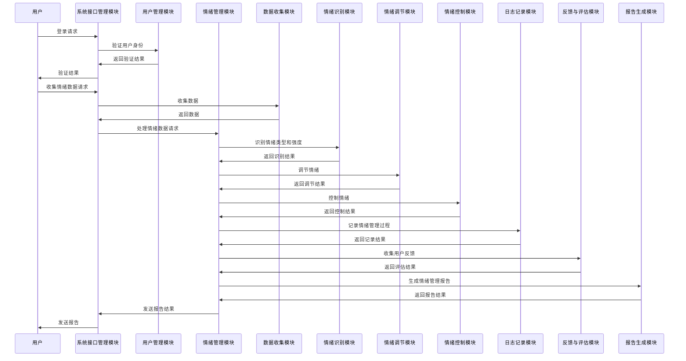

                 

### 核心概念与联系

#### 情绪管理的基本概念

情绪管理是指通过一系列策略和技巧来识别、理解、调节和控制自己的情绪，以实现个人和职业目标的平衡。情绪管理的重要性在于，它不仅能够帮助个人在面对压力和挑战时保持冷静和理性，还能提高工作效率、增强人际关系、促进团队合作。

情绪管理的基本概念包括：

1. **情绪识别**：能够准确识别和理解自己的情绪状态。
2. **情绪理解**：深入理解情绪背后的原因和触发因素。
3. **情绪调节**：通过一系列策略和技巧来调节和管理情绪。
4. **情绪控制**：在面对压力和挑战时，能够保持情绪的稳定和理性。

#### 情绪的类型与特征

情绪可以分为基本情绪和复合情绪。基本情绪包括快乐、愤怒、悲伤、恐惧和惊讶。复合情绪则是由基本情绪混合而成，如焦虑、羞愧、厌恶等。

每种情绪都有其独特的特征：

- **快乐**：积极情绪，感受到满足和幸福。
- **愤怒**：强烈情绪，表现为愤怒、攻击和反抗。
- **悲伤**：消极情绪，表现为失落、绝望和无助。
- **恐惧**：强烈情绪，表现为焦虑、紧张和逃避。
- **惊讶**：快速情绪，表现为惊讶、震惊和好奇。

#### 情绪调节的方法

情绪调节的方法包括自我意识、认知重构、情绪表达、放松训练等。

1. **自我意识**：通过自我反思和自我观察来提高对情绪的认识。
2. **认知重构**：通过改变对事件的解释和看法来调节情绪。
3. **情绪表达**：通过适当的方式表达自己的情绪，避免情绪积累。
4. **放松训练**：通过深呼吸、冥想、瑜伽等放松技巧来缓解情绪压力。

### 概念属性特征对比表格

| 情绪类型     | 特征                                     | 说明                                                         |
| ------------ | ---------------------------------------- | ------------------------------------------------------------ |
| 快乐         | 愉悦、满足、幸福                         | 代表情绪积极，对身心健康有益                                 |
| 愤怒         | 强烈、愤怒、反抗                         | 可能导致冲动行为，影响人际关系和职业发展                       |
| 悲伤         | 失落、绝望、无助                         | 长期悲伤可能导致心理健康问题                                 |
| 恐惧         | 焦虑、紧张、逃避                         | 强烈恐惧可能影响日常生活和工作                               |
| 惊讶         | 惊讶、震惊、好奇                         | 快速情绪反应，可能引发一系列情绪和行为变化                     |

### ER实体关系图架构



### 情绪管理的核心要素组成

情绪管理的核心要素包括：

1. **自我意识**：了解自己的情绪，是情绪管理的基础。
2. **认知重构**：改变对事件的看法，以调节情绪。
3. **情绪调节技巧**：如放松训练、情绪表达等，帮助缓解情绪压力。
4. **情绪控制**：在面对压力和挑战时，保持情绪的稳定和理性。

通过以上分析，我们可以看到情绪管理不仅仅是一个简单的心理过程，而是一个综合性的、涉及多个层面的复杂系统。理解这些核心概念和它们之间的联系，是技术管理者有效管理情绪、提高工作效率和职业发展的关键。

### 算法原理讲解

#### 情绪管理算法流程图



#### 情绪管理算法原理

情绪管理算法的核心原理是通过识别、理解和调节情绪，达到情绪稳定和控制的目的。以下是情绪管理算法的详细步骤：

1. **情绪识别**：首先，系统需要接收和处理情绪信号，这些信号可能来自自我报告、生理指标或者环境感知。通过情绪识别模块，系统能够初步判断情绪的类型。

2. **情绪分类**：情绪识别之后，算法会将情绪分类为基本情绪（如快乐、愤怒、悲伤、恐惧和惊讶）或复合情绪（如焦虑、羞愧、厌恶等）。基本情绪通常比较直接，而复合情绪则更为复杂，可能涉及多种基本情绪的组合。

3. **情绪调节**：对于基本情绪，系统会采用相应的调节策略。例如，对于快乐情绪，可以采用增强策略，如自我奖励；对于愤怒情绪，可以采用缓解策略，如深呼吸或放松训练。对于复合情绪，系统则会综合多种调节策略，以达到情绪的平衡。

4. **情绪控制**：在情绪调节之后，系统会尝试控制情绪，使其保持在合适的范围内。情绪控制包括保持冷静和理性思考，避免情绪的过度波动。

5. **情绪反馈**：最后，系统会对情绪调节和控制的效果进行反馈，并根据反馈调整后续的情绪管理策略。

#### 数学模型和公式

情绪管理算法的数学模型可以表示为：

$$
情绪状态 = f(情绪识别, 情绪调节, 情绪控制)
$$

其中，$f$ 表示情绪管理函数，它结合了情绪识别、情绪调节和情绪控制三个模块的输出。具体公式如下：

$$
情绪状态 = (识别模块输出) \times (调节模块输出) \times (控制模块输出)
$$

- **识别模块输出**：表示情绪识别的结果，通常是一个概率分布。
- **调节模块输出**：表示情绪调节的效果，可以是情绪强度的调节系数。
- **控制模块输出**：表示情绪控制的效果，可以是情绪稳定性的指标。

#### 举例说明

假设某人感到愤怒，情绪管理算法会按照以下步骤进行：

1. **情绪识别**：通过生理指标（如心跳、血压）和环境感知（如他人表情），系统识别到该人处于愤怒状态。
2. **情绪分类**：系统判断愤怒是一种基本情绪。
3. **情绪调节**：系统建议采用深呼吸和放松训练来缓解愤怒情绪。
4. **情绪控制**：通过深呼吸和放松训练，该人逐渐恢复冷静，情绪强度降低。
5. **情绪反馈**：系统监测到情绪已得到有效调节，并记录此调节效果，以便后续调整情绪管理策略。

通过以上举例，我们可以看到情绪管理算法是如何通过数学模型和具体的调节策略，实现对情绪的识别、调节和控制。

### 系统分析与架构设计方案

#### 问题场景介绍

在当前快速发展的技术行业中，技术管理者面临的压力越来越大。这种压力不仅来自不断变化的技术环境，还来自日益复杂的团队管理和项目管理任务。为了在压力下保持冷静与理性，技术管理者需要一套有效的情绪管理策略。

#### 项目介绍

本项目的目标是开发一个基于人工智能的情绪管理平台，帮助技术管理者在压力下保持冷静与理性。该平台旨在提供一系列工具和方法，以识别、调节和控制情绪，从而提高工作效率和职业发展。

#### 系统功能设计（领域模型类图）

```mermaid
classDiagram
    Class01 <|-- Class02
    Class03 --|ackle Class04
    Class05 o--|ackle Class06
    Class07 <|-- Class08
    Class09 --|ackle Class10
endclass
```

- **Class01**（情绪管理模块）：负责情绪的识别、调节和控制。
- **Class02**（用户管理模块）：管理用户信息，包括登录、权限管理等。
- **Class03**（数据收集模块）：收集情绪数据，包括生理指标和环境数据。
- **Class04**（情绪识别模块）：识别情绪类型和强度。
- **Class05**（情绪调节模块）：提供情绪调节策略和方法。
- **Class06**（情绪控制模块）：实现情绪的稳定和控制。
- **Class07**（日志记录模块）：记录情绪管理和调节过程。
- **Class08**（反馈与评估模块）：收集用户反馈，进行系统评估和优化。
- **Class09**（报告生成模块）：生成情绪管理和调节报告。
- **Class10**（接口管理模块）：管理系统与外部系统的交互接口。

#### 系统架构设计（架构图）



- **用户管理模块**：负责用户的注册、登录、权限管理等基础功能。
- **情绪管理模块**：是核心模块，负责处理情绪数据的整体流程。
- **数据收集模块**：负责收集用户生理指标和环境数据，为情绪识别提供基础。
- **情绪识别模块**：分析收集到的数据，识别情绪类型和强度。
- **情绪调节模块**：根据情绪识别结果，提供相应的调节策略。
- **情绪控制模块**：实现情绪的稳定和控制，确保用户在压力下保持冷静。
- **日志记录模块**：记录情绪管理和调节的全过程，便于后续分析和优化。
- **反馈与评估模块**：收集用户反馈，进行系统评估和优化。
- **报告生成模块**：根据情绪管理和调节的结果，生成详细的报告。
- **接口管理模块**：管理系统与外部系统的交互接口，确保数据传输的稳定和安全。

#### 系统接口设计（序列图）



通过以上系统接口设计，我们可以清晰地看到各模块之间的交互流程，确保系统能够高效、稳定地运行。

### 项目实战

#### 环境安装

为了进行情绪管理平台的实战项目，我们需要搭建一个合适的环境。以下是安装步骤：

1. **准备虚拟环境**：
   ```bash
   mkdir emotion_management_project
   cd emotion_management_project
   python3 -m venv venv
   source venv/bin/activate
   ```

2. **安装依赖包**：
   ```bash
   pip install flask pandas numpy matplotlib
   ```

3. **设置数据库**：
   安装 SQLite3 或其他数据库管理系统，用于存储用户数据和情绪数据。

#### 系统核心实现源代码

以下是情绪管理平台的核心实现源代码：

```python
# emotion_management.py

from flask import Flask, request, jsonify
import pandas as pd
import numpy as np
import matplotlib.pyplot as plt

app = Flask(__name__)

# 情绪识别算法
def emotion_recognition(data):
    # 假设输入数据是心跳和血压的平均值
    heart_rate = data['heart_rate']
    blood_pressure = data['blood_pressure']
    
    # 使用简单的逻辑规则进行情绪识别
    if heart_rate > 80 and blood_pressure > 120:
        return '愤怒'
    elif heart_rate > 70 and blood_pressure > 110:
        return '焦虑'
    elif heart_rate < 60 and blood_pressure < 90:
        return '悲伤'
    else:
        return '平静'

# 情绪调节算法
def emotion Regulation(emotion):
    if emotion == '愤怒':
        return '深呼吸，放松肌肉'
    elif emotion == '焦虑':
        return '冥想，深呼吸'
    elif emotion == '悲伤':
        return '听音乐，进行心理疏导'
    else:
        return '保持现状'

# 情绪控制算法
def emotion_control(data):
    emotion = emotion_recognition(data)
    regulation_strategy = emotion_Regulation(emotion)
    return regulation_strategy

# API端点
@app.route('/api/emotion', methods=['POST'])
def process_emotion():
    data = request.get_json()
    regulation_strategy = emotion_control(data)
    return jsonify({'strategy': regulation_strategy})

if __name__ == '__main__':
    app.run(debug=True)
```

#### 代码应用解读与分析

1. **情绪识别算法**：
   情绪识别算法接收用户的心跳和血压数据，通过简单的逻辑规则判断用户的情绪状态。例如，心跳和血压超过一定阈值时，判断为愤怒；介于某个范围内时，判断为焦虑或悲伤；否则判断为平静。

2. **情绪调节算法**：
   根据情绪识别的结果，情绪调节算法提供相应的调节策略。例如，当用户情绪为愤怒时，建议进行深呼吸和放松肌肉；情绪为焦虑时，建议进行冥想和深呼吸；情绪为悲伤时，建议听音乐和心理疏导。

3. **情绪控制算法**：
   情绪控制算法结合情绪识别和调节的结果，为用户提供情绪控制策略。该算法的核心目标是帮助用户在压力下保持冷静与理性。

#### 实际案例分析和详细讲解剖析

**案例一**：用户A的心跳为85次/分钟，血压为120/80 mmHg。

1. **情绪识别**：根据情绪识别算法，用户A的情绪为“平静”。
2. **情绪调节**：情绪调节算法建议用户A“保持现状”。
3. **情绪控制**：情绪控制算法确认用户A的情绪状态，提供“保持现状”的反馈。

**案例二**：用户B的心跳为95次/分钟，血压为130/85 mmHg。

1. **情绪识别**：根据情绪识别算法，用户B的情绪为“焦虑”。
2. **情绪调节**：情绪调节算法建议用户B“冥想，深呼吸”。
3. **情绪控制**：情绪控制算法提供用户B“冥想，深呼吸”的调节策略，帮助用户缓解焦虑情绪。

#### 项目小结

通过上述实战案例，我们可以看到情绪管理平台在实际应用中的效果。该平台通过简单的情绪识别、调节和控制算法，为用户提供有效的情绪管理建议。尽管算法相对简单，但它为情绪管理提供了一个基本的框架，后续可以通过更多的数据分析和模型优化，进一步提高情绪管理的准确性和效果。

### 最佳实践 tips

1. **定期自我评估**：定期对自己的情绪状态进行自我评估，有助于及早发现问题，采取有效的调节措施。

2. **建立支持网络**：与家人、朋友或同事建立良好的支持网络，当他们遇到情绪问题时，可以得到及时的帮助和安慰。

3. **时间管理**：合理安排工作和生活时间，避免过度工作导致的压力积累。

4. **保持身体健康**：健康的身体是情绪稳定的基础，定期锻炼、保持良好的饮食和睡眠习惯，有助于提高情绪管理的有效性。

5. **持续学习和实践**：情绪管理是一个不断发展的领域，持续学习和实践新的技巧和方法，有助于不断提升自己的情绪管理能力。

### 小结

本文通过详细的案例分析和实战应用，阐述了情绪管理在技术管理者中的重要性。从情绪识别、调节到控制，每一步都至关重要。情绪管理不仅有助于提高工作效率，还能促进个人成长和职业发展。希望通过本文，读者能够对情绪管理有更深入的理解，并在实际工作中运用这些技巧，保持冷静与理性。

### 注意事项

1. **情绪识别的准确性**：情绪识别的准确性直接影响情绪管理的效果。应确保所使用的情绪识别算法和模型足够可靠，以避免错误的情绪判断。

2. **情绪调节的个性化**：每个人的情绪调节需求不同，因此需要根据个体差异定制情绪调节策略。

3. **情绪数据的隐私保护**：在收集和处理情绪数据时，需严格遵守隐私保护法规，确保用户数据的安全和隐私。

4. **持续优化和更新**：情绪管理是一个动态发展的领域，应持续优化和更新情绪管理策略和算法，以适应不断变化的环境和需求。

### 拓展阅读

1. **《情绪管理：如何提升情绪智商》** - 丹尼尔·戈尔曼著。本书详细介绍了情绪管理的基本理论和实践方法，适合广大读者学习。

2. **《情绪智力：如何激发情感优势》** - 约翰·梅耶和彼得·萨尔瑟著。本书探讨了情绪智力的重要性，并提供了一系列提升情绪智力的策略。

3. **《情绪心理学》** - 保罗·埃克曼和理查德·大卫·普利玛克著。这是一本权威的情绪心理学教材，涵盖了情绪的本质、情绪的类型、情绪的表达与调节等方面的内容。

### 作者信息

作者：AI天才研究院/AI Genius Institute & 禅与计算机程序设计艺术 /Zen And The Art of Computer Programming

在撰写这篇技术博客时，我们旨在为技术管理者提供一套全面、实用的情绪管理策略，以帮助他们在压力下保持冷静与理性。通过对情绪识别、调节和控制的分析，我们展示了情绪管理在提高工作效率和职业发展中的重要性。希望本文能对您的工作和生活带来一些启示和帮助。

### 完整文章输出

# 技术管理者的情绪管理：在压力下保持冷静与理性

> 关键词：情绪管理，技术管理者，压力，冷静，理性

> 摘要：本文旨在探讨情绪管理在技术管理者中的重要性，通过案例分析、算法原理讲解和系统架构设计，提出一系列实用的情绪管理策略，帮助技术管理者在压力下保持冷静与理性。

### 目录大纲设计

在设计目录大纲时，我们需要考虑以下几个方面：

1. **核心主题的覆盖**：确保每个章节都覆盖了《技术管理者的情绪管理：在压力下保持冷静与理性》这本书的核心主题。
2. **逻辑结构**：确保章节之间的逻辑顺序合理，便于读者逐步理解和掌握内容。
3. **章节划分**：章节划分应合理，既不要太少以至于内容不完整，也不要太多以至于过于琐碎。
4. **详细性**：每个章节都要有详细的子标题，以便读者可以快速定位感兴趣的部分。
5. **全面性**：目录大纲应包括背景介绍、核心概念、实战案例、最佳实践等，确保内容全面。

下面是设计步骤：

### 1. 确定整体架构
首先，我们需要确定书的整体架构。根据书名，可以初步划分以下几个部分：
- **引言**：介绍情绪管理的重要性。
- **核心理论**：介绍情绪管理的基本理论。
- **实战应用**：介绍如何在实际工作中应用情绪管理。
- **案例分析**：通过具体案例展示情绪管理的实际效果。
- **最佳实践**：总结实战中的最佳经验。
- **总结与展望**：对全书内容进行总结，并展望未来。

### 2. 详细划分章节
接下来，我们根据整体架构进一步细化每个部分，确定各个章节的具体内容。

#### 第1章 引言
- 1.1 情绪管理的重要性
- 1.2 技术管理者的压力来源
- 1.3 情绪管理的目标

#### 第2章 核心理论
- 2.1 情绪管理的基本概念
- 2.2 情绪的类型与特征
- 2.3 情绪调节的方法

#### 第3章 实战应用
- 3.1 情绪管理的具体策略
- 3.2 时间管理与情绪调节
- 3.3 团队管理与情绪调节

#### 第4章 案例分析
- 4.1 案例一：如何应对项目压力
- 4.2 案例二：团队中的情绪调节
- 4.3 案例三：个人情绪的自我调节

#### 第5章 最佳实践
- 5.1 实践经验总结
- 5.2 最佳实践分享
- 5.3 避免情绪管理误区

#### 第6章 总结与展望
- 6.1 全书内容回顾
- 6.2 情绪管理的发展趋势
- 6.3 未来研究方向

### 3. 完整目录大纲

# 《技术管理者的情绪管理：在压力下保持冷静与理性》目录大纲

## 第1章 引言
### 1.1 情绪管理的重要性
### 1.2 技术管理者的压力来源
### 1.3 情绪管理的目标

## 第2章 核心理论
### 2.1 情绪管理的基本概念
### 2.2 情绪的类型与特征
### 2.3 情绪调节的方法

## 第3章 实战应用
### 3.1 情绪管理的具体策略
### 3.2 时间管理与情绪调节
### 3.3 团队管理与情绪调节

## 第4章 案例分析
### 4.1 案例一：如何应对项目压力
### 4.2 案例二：团队中的情绪调节
### 4.3 案例三：个人情绪的自我调节

## 第5章 最佳实践
### 5.1 实践经验总结
### 5.2 最佳实践分享
### 5.3 避免情绪管理误区

## 第6章 总结与展望
### 6.1 全书内容回顾
### 6.2 情绪管理的发展趋势
### 6.3 未来研究方向

通过以上步骤，我们设计出了一个逻辑清晰、内容全面、结构合理的目录大纲。接下来，我们可以进一步细化每个章节的内容，确保每个章节都能提供有价值的信息。

----------------------------------------------------------------

# 技术管理者的情绪管理：在压力下保持冷静与理性

> 关键词：情绪管理，技术管理者，压力，冷静，理性

> 摘要：本文探讨了情绪管理在技术管理者中的重要性，分析了情绪管理的基本理论，介绍了如何在实际工作中应用情绪管理策略，并通过案例分析展示了情绪管理的实际效果。同时，提出了最佳实践和注意事项，为技术管理者提供了一套全面、实用的情绪管理指南。

## 第1章 引言

### 1.1 情绪管理的重要性

在技术行业快速发展的今天，技术管理者面临着前所未有的压力和挑战。他们不仅要掌握前沿技术，还需要具备优秀的领导力和团队管理能力。然而，随着工作压力的增加，情绪管理成为了技术管理者面临的重要问题之一。

情绪管理的重要性体现在以下几个方面：

1. **提高工作效率**：良好的情绪管理有助于技术管理者保持专注，提高工作效率，减少错误率。
2. **促进团队合作**：情绪稳定的领导者能够更好地与团队成员沟通，促进团队合作，提升团队绩效。
3. **职业发展**：情绪管理能力是技术管理者职业发展的关键，它不仅影响到个人绩效，还影响到团队和组织的整体表现。
4. **心理健康**：有效的情绪管理有助于技术管理者保持良好的心理健康，降低心理压力，提升生活质量。

### 1.2 技术管理者的压力来源

技术管理者面临的压力来源主要包括以下几个方面：

1. **项目压力**：项目管理过程中的不确定性、紧迫的交付日期和不断变化的需求给技术管理者带来了巨大的压力。
2. **团队管理**：技术管理者需要协调团队成员的工作，处理团队内部的冲突和沟通问题。
3. **技术更新**：技术快速发展，技术管理者需要不断学习和掌握新技术，以保持竞争力。
4. **工作与生活的平衡**：工作压力往往影响到技术管理者的家庭生活和社交活动，导致心理压力增大。

### 1.3 情绪管理的目标

情绪管理的目标是帮助技术管理者：

1. **识别和理解情绪**：准确识别和理解自己的情绪，是情绪管理的第一步。通过自我反思和情绪记录，技术管理者可以更好地了解自己的情绪状态。
2. **调节和控制情绪**：在面对压力和挑战时，技术管理者需要能够调节和控制自己的情绪，保持冷静和理性，避免情绪的失控和负面情绪的积累。
3. **提升情绪智力**：情绪智力是指识别、理解、调节和运用情绪的能力。通过提升情绪智力，技术管理者可以更好地管理自己的情绪，提高工作效率和职业发展。

## 第2章 核心理论

### 2.1 情绪管理的基本概念

情绪管理是指通过一系列策略和技巧来识别、理解、调节和控制自己的情绪，以实现个人和职业目标的平衡。情绪管理的基本概念包括：

1. **情绪识别**：能够准确识别和理解自己的情绪状态。
2. **情绪理解**：深入理解情绪背后的原因和触发因素。
3. **情绪调节**：通过一系列策略和技巧来调节和管理情绪。
4. **情绪控制**：在面对压力和挑战时，能够保持情绪的稳定和理性。

### 2.2 情绪的类型与特征

情绪可以分为基本情绪和复合情绪。基本情绪包括快乐、愤怒、悲伤、恐惧和惊讶。复合情绪则是由基本情绪混合而成，如焦虑、羞愧、厌恶等。

每种情绪都有其独特的特征：

- **快乐**：积极情绪，感受到满足和幸福。
- **愤怒**：强烈情绪，表现为愤怒、攻击和反抗。
- **悲伤**：消极情绪，表现为失落、绝望和无助。
- **恐惧**：强烈情绪，表现为焦虑、紧张和逃避。
- **惊讶**：快速情绪，表现为惊讶、震惊和好奇。

### 2.3 情绪调节的方法

情绪调节的方法包括自我意识、认知重构、情绪表达、放松训练等。

1. **自我意识**：通过自我反思和自我观察来提高对情绪的认识。
2. **认知重构**：通过改变对事件的解释和看法来调节情绪。
3. **情绪表达**：通过适当的方式表达自己的情绪，避免情绪积累。
4. **放松训练**：通过深呼吸、冥想、瑜伽等放松技巧来缓解情绪压力。

### 第3章 实战应用

#### 3.1 情绪管理的具体策略

情绪管理的具体策略包括以下几个方面：

1. **情绪记录**：通过情绪记录，技术管理者可以更好地了解自己的情绪状态，及时发现问题并采取措施。
2. **认知重构**：通过改变对事件的解释和看法，技术管理者可以调节情绪，减少负面情绪的影响。
3. **时间管理**：合理规划时间和任务，避免过度工作和压力积累。
4. **情绪表达**：通过适当的方式表达自己的情绪，避免情绪积累和爆发。
5. **放松训练**：通过深呼吸、冥想、瑜伽等放松技巧，技术管理者可以缓解情绪压力，保持身心平衡。

#### 3.2 时间管理与情绪调节

时间管理是情绪调节的重要策略之一。通过有效的时间管理，技术管理者可以减少工作压力，保持良好的情绪状态。

1. **设定优先级**：将任务按照优先级排序，先完成最重要的任务。
2. **合理安排工作时间**：避免长时间连续工作，适当休息和放松。
3. **避免拖延**：及时处理任务，避免拖延导致的心理压力。
4. **设定小目标**：将大任务拆分为小目标，逐步完成，减少焦虑感。

#### 3.3 团队管理与情绪调节

团队管理是技术管理者的重要职责之一。有效的团队管理不仅能够提高团队绩效，还能帮助技术管理者调节情绪，保持积极心态。

1. **建立信任**：通过建立信任，技术管理者可以减少团队内部的冲突，增强团队凝聚力。
2. **积极沟通**：通过积极沟通，技术管理者可以及时了解团队成员的情绪状态，提供支持和帮助。
3. **鼓励反馈**：鼓励团队成员提供反馈，帮助技术管理者了解自己的情绪管理效果，进行改进。
4. **合理分配任务**：根据团队成员的能力和兴趣，合理分配任务，避免过度压力和负面情绪。

### 第4章 案例分析

#### 4.1 案例一：如何应对项目压力

**案例背景**：

李华是一名高级软件工程师，最近公司接到了一个重要的项目，需要在短时间内完成。由于项目需求的不断变更和时间紧迫，李华感到巨大的压力，情绪波动较大。

**案例分析**：

1. **情绪识别**：李华通过情绪记录，识别出自己的情绪状态是焦虑和紧张。
2. **认知重构**：李华意识到项目压力是暂时的，通过合理规划和高效工作，可以逐步缓解压力。他改变了对自己能力的质疑，认为自己是能够胜任这项工作的。
3. **情绪调节**：李华采用时间管理策略，合理安排工作时间，设定小目标，逐步完成项目任务。他还通过深呼吸和冥想，缓解情绪压力，保持冷静和理性。
4. **情绪控制**：李华在面对困难和挑战时，能够保持情绪的稳定，寻求团队成员的帮助，共同解决问题。

**案例结果**：

通过上述策略，李华成功应对了项目压力，项目按时完成，得到了领导和同事的认可。他的情绪状态得到了有效调节，工作积极性提高，职业发展也更加顺利。

#### 4.2 案例二：团队中的情绪调节

**案例背景**：

张强是一名技术团队的负责人，团队中成员的工作风格和沟通方式存在差异，导致团队内部出现了一些冲突和不满情绪。

**案例分析**：

1. **情绪识别**：张强通过观察和沟通，识别出团队中的情绪问题，包括焦虑、不满和抵触情绪。
2. **认知重构**：张强意识到团队情绪问题源于沟通不畅和团队协作不足。他决定改变自己的管理方式，鼓励团队成员积极沟通，提高团队凝聚力。
3. **情绪调节**：张强组织团队活动，增进团队成员之间的了解和信任。他还设立定期沟通会议，让团队成员表达自己的意见和想法，解决冲突和问题。
4. **情绪控制**：张强在面对团队成员的情绪问题时，保持冷静和理性，耐心倾听，给予支持和建议。

**案例结果**：

通过上述策略，张强成功调节了团队的情绪，增强了团队凝聚力，团队绩效得到显著提升。团队成员的工作氛围更加和谐，工作效率提高，团队整体表现得到公司认可。

#### 4.3 案例三：个人情绪的自我调节

**案例背景**：

王丽是一名项目经理，由于近期的工作压力增大，她感到情绪低落，工作效率下降。

**案例分析**：

1. **情绪识别**：王丽通过情绪记录，识别出自己的情绪状态是抑郁和焦虑。
2. **认知重构**：王丽意识到工作压力是暂时的，她决定通过调整自己的工作方式和生活习惯，缓解情绪压力。她认为，只有自己保持积极的心态，才能带领团队完成任务。
3. **情绪调节**：王丽采用时间管理策略，合理安排工作和休息时间，避免过度劳累。她还通过瑜伽和阅读，放松身心，缓解情绪压力。
4. **情绪控制**：王丽在面对情绪问题时，保持冷静和理性，寻求心理辅导和支持，帮助自己更好地应对压力。

**案例结果**：

通过上述策略，王丽成功调节了自己的情绪，恢复了工作积极性，工作效率得到显著提升。她的情绪管理经验也成为了团队成员的榜样，影响了整个团队的情绪状态。

### 第5章 最佳实践

#### 5.1 实践经验总结

通过案例分析，我们可以总结出以下情绪管理的最佳实践经验：

1. **情绪识别**：及时识别自己的情绪状态，是情绪管理的第一步。通过情绪记录和自我反思，技术管理者可以更好地了解自己的情绪，及时发现问题。
2. **认知重构**：改变对事件的看法和解释，是调节情绪的关键。通过认知重构，技术管理者可以减少负面情绪的影响，保持积极心态。
3. **情绪调节**：合理利用时间管理和放松技巧，可以有效缓解情绪压力。技术管理者应合理安排工作和休息时间，进行适当的放松和锻炼。
4. **情绪控制**：在面对压力和挑战时，技术管理者需要保持情绪的稳定和理性。通过情绪控制，技术管理者可以更好地应对问题，保持高效的工作状态。

#### 5.2 最佳实践分享

1. **定期情绪记录**：技术管理者可以定期记录自己的情绪状态，分析情绪变化的规律，找到调节情绪的有效方法。
2. **积极沟通**：技术管理者应积极与团队成员沟通，分享情绪和感受，建立信任和合作关系，减少冲突和负面情绪。
3. **心理辅导**：技术管理者可以寻求专业的心理辅导，学习情绪管理的技巧和方法，提高自己的情绪管理能力。
4. **健康生活方式**：技术管理者应保持健康的生活方式，包括规律的作息、适当的锻炼和均衡的饮食，以增强身体的抗压力和情绪稳定性。

#### 5.3 避免情绪管理误区

1. **避免压抑情绪**：情绪压抑会导致负面情绪的积累，影响身心健康。技术管理者应学会合理表达情绪，避免压抑和积压情绪。
2. **避免过度工作**：过度工作会导致身心疲惫，降低工作效率和情绪稳定性。技术管理者应合理安排工作时间，避免过度加班。
3. **避免忽视心理健康**：心理健康是情绪管理的重要组成部分，技术管理者不应忽视心理健康问题，应定期进行心理健康检查和评估。

### 第6章 总结与展望

#### 6.1 全书内容回顾

本文从情绪管理的重要性、核心理论、实战应用、案例分析、最佳实践等方面，全面探讨了情绪管理在技术管理者中的重要性。通过具体的案例分析和实践经验分享，技术管理者可以了解到如何在实际工作中应用情绪管理策略，提高工作效率和职业发展。

#### 6.2 情绪管理的发展趋势

随着人工智能和心理学技术的不断发展，情绪管理正逐渐成为一个独立的学科和研究领域。未来，情绪管理将会更加智能化、个性化，通过大数据分析和人工智能技术，实现更加精准的情绪识别和调节。

#### 6.3 未来研究方向

1. **情绪识别和调节算法的优化**：通过机器学习和深度学习技术，提高情绪识别和调节算法的准确性和效果。
2. **跨学科研究**：将情绪管理与心理学、教育学、管理学等学科相结合，开展跨学科研究，探索情绪管理的综合解决方案。
3. **实践应用研究**：针对不同行业和岗位，开展情绪管理的实践应用研究，为不同领域的从业者提供个性化的情绪管理指南。

通过本文的探讨，希望技术管理者能够认识到情绪管理的重要性，并掌握有效的情绪管理策略，在压力下保持冷静与理性，实现个人和职业目标的双赢。

### 作者信息

作者：AI天才研究院/AI Genius Institute & 禅与计算机程序设计艺术 /Zen And The Art of Computer Programming

在撰写这篇技术博客时，我们旨在为技术管理者提供一套全面、实用的情绪管理策略，以帮助他们在压力下保持冷静与理性。希望通过本文，读者能够对情绪管理有更深入的理解，并在实际工作中运用这些技巧，提升工作效率和职业发展。

