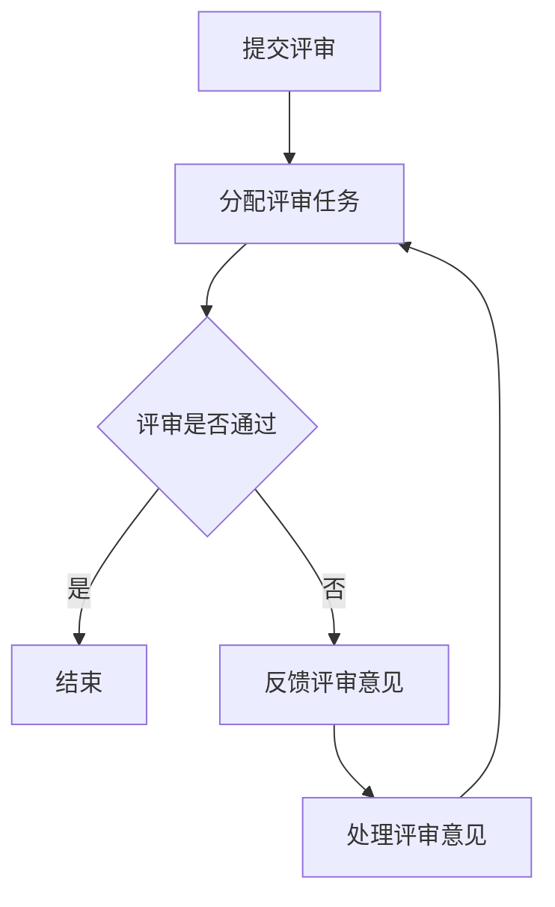
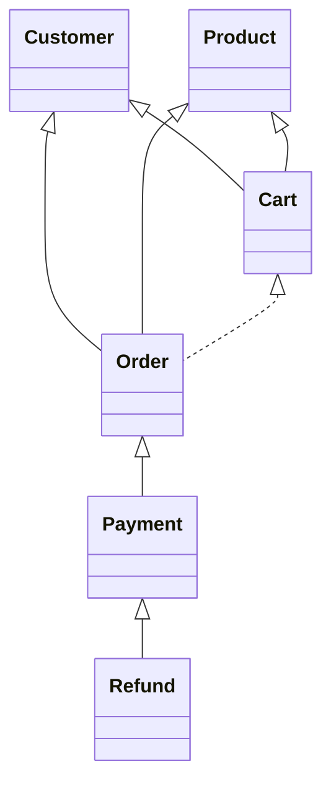
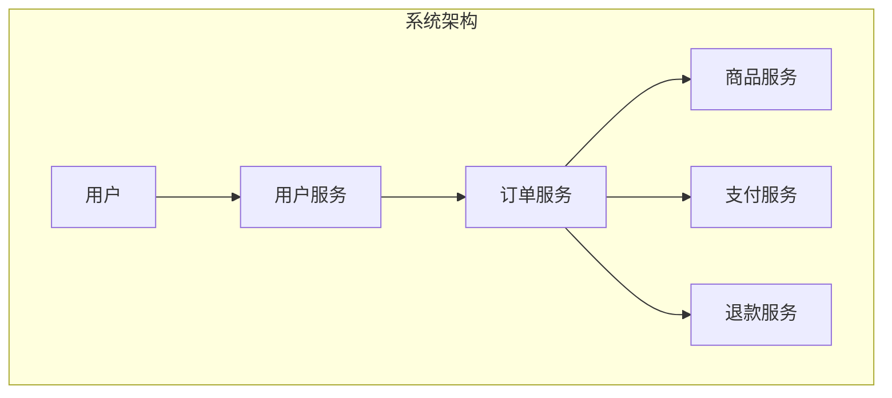

                 


# 技术评审领导：P9工程师的质量把关

> 关键词：技术评审、P9工程师、质量把关、软件开发、效率与质量

> 摘要：
在现代软件开发中，技术评审扮演着至关重要的角色。本文旨在探讨P9工程师在技术评审中如何进行质量把关，提高项目的质量和效率。通过详细介绍技术评审的定义、作用、核心概念、属性特征对比以及实际应用，本文为P9工程师提供了全面的质量把关指南。

## 第一部分：背景介绍

### 1.1 问题背景

随着软件系统复杂度的不断增加，软件开发项目的质量与效率日益受到关注。技术评审作为一种有效的质量控制手段，在现代软件开发中得到了广泛应用。然而，在实际评审过程中，P9工程师作为技术评审的领导角色，面临着诸多挑战，如评审标准不统一、评审过程不规范、评审结果不准确等。这些问题严重影响了技术评审的效率和效果，甚至可能对项目的最终交付质量产生负面影响。因此，如何提升P9工程师的技术评审能力，成为当前软件开发领域亟待解决的问题。

### 1.2 问题描述

当前，技术评审过程中存在以下主要问题：

1. **评审标准不统一**：不同项目、不同团队甚至不同工程师对评审标准的理解和使用存在差异，导致评审结果的准确性和一致性难以保障。
2. **评审过程不规范**：评审流程的设计和执行缺乏统一规范，导致评审效率低下，甚至出现评审遗漏或重复评审的情况。
3. **评审结果不准确**：评审过程中依赖的主观判断较多，缺乏客观的量化评估指标，导致评审结果的准确性和可信度较低。

### 1.3 问题解决

为解决上述问题，本文将从以下几个方面探讨P9工程师应具备的质量把关能力：

1. **确立评审标准**：明确评审标准，统一评审标准的使用，确保评审的准确性和一致性。
2. **优化评审流程**：设计规范的评审流程，提高评审的效率，确保评审的全面性和完整性。
3. **应用评审技术**：借助先进的评审技术，提高评审的准确性和效率。
4. **评估评审结果**：对评审结果进行客观、准确的评估，确保评审意见的有效性。

### 1.4 边界与外延

技术评审的范围涉及软件开发的全过程，包括需求分析、设计、编码、测试和部署等。此外，技术评审不仅限于代码层面的审查，还包括对架构设计、性能优化、安全性等方面的评估。因此，本文将全面覆盖技术评审的各个方面，为P9工程师提供全面的指导。

### 1.5 概念结构与核心要素组成

技术评审的核心概念包括评审标准、评审流程、评审技术和评审结果。其中，评审标准是评审的基础，评审流程是评审的路径，评审技术是评审的手段，评审结果是评审的输出。这四个要素相互作用，共同构成了技术评审的系统框架。

## 第二部分：核心概念与联系

### 2.1 技术评审的定义与作用

#### 2.1.1 技术评审的定义

技术评审是指通过专业知识和经验，对软件开发的各个阶段进行系统性的审查和评估，以发现潜在的问题和缺陷，确保软件项目的质量和效率。技术评审通常包括代码评审、设计评审、架构评审等多个层面。

#### 2.1.2 技术评审的作用

技术评审在软件开发中具有重要作用，主要体现在以下几个方面：

1. **提高代码质量**：技术评审能够发现代码中的潜在错误和缺陷，提高代码的可读性、可维护性和可靠性。
2. **优化项目进度**：通过提前发现并解决潜在问题，减少返工和修复成本，优化项目进度。
3. **提升团队协作效率**：技术评审能够促进团队成员之间的沟通与协作，提高团队整体的工作效率。
4. **保障项目成功交付**：技术评审能够确保项目交付的质量，降低项目失败的风险。

### 2.2 技术评审的核心概念

#### 2.2.1 评审标准

评审标准是评审的基础，是评审过程中需要遵循的规范和准则。评审标准通常包括以下几个方面：

1. **代码质量标准**：涉及代码的语法、结构、注释、命名等，确保代码的可读性和可维护性。
2. **设计规范**：涉及系统架构、模块划分、接口设计等，确保系统设计的合理性和可扩展性。
3. **性能标准**：涉及系统的响应时间、吞吐量、稳定性等，确保系统的高性能和高可用性。
4. **安全性标准**：涉及系统的安全性设计、加密算法、数据保护等，确保系统的安全性和可靠性。

#### 2.2.2 评审流程

评审流程是评审的步骤和方法，是确保评审规范性和效率的关键。一个典型的评审流程包括以下几个阶段：

1. **提交评审**：开发人员提交需要评审的代码或设计文档。
2. **分配评审任务**：评审负责人根据评审标准和任务要求，将评审任务分配给评审员。
3. **进行评审**：评审员根据评审标准和流程，对提交的代码或设计文档进行审查和评估。
4. **记录评审结果**：评审员记录评审发现的问题、提出的改进建议等，形成评审报告。
5. **反馈评审意见**：评审负责人对评审结果进行汇总和分析，向开发人员反馈评审意见。
6. **处理评审意见**：开发人员根据评审意见进行改进，重新提交评审。

#### 2.2.3 评审技术

评审技术是评审过程中使用的工具和方法，包括静态代码分析、动态代码分析、自动化测试等多种手段。这些技术能够提高评审的准确性和效率，减少人工评审的误判和遗漏。

1. **静态代码分析**：通过分析代码的结构、语法、注释等内容，发现潜在的问题和缺陷。
2. **动态代码分析**：通过运行代码并监控其行为，发现代码运行时的问题和缺陷。
3. **自动化测试**：通过编写测试用例，自动化执行测试，验证代码的功能和性能。

#### 2.2.4 评审结果

评审结果是评审的最终输出，包括评审发现的问题、提出的改进建议、评审通过的结论等。评审结果能够为后续的改进工作提供依据，同时也是评估评审效果的重要指标。

### 2.3 技术评审的属性特征对比表格

| 属性特征         | 描述                                                         |
| ---------------- | ------------------------------------------------------------ |
| 评审标准         | 评审的基准，包括代码质量、设计规范、性能等                     |
| 评审流程         | 评审的步骤和方法，确保评审的规范性和效率                     |
| 评审技术         | 评审过程中使用的工具和方法，提高评审的准确性和效率             |
| 评审结果         | 评审的输出，包括评审发现的问题、改进建议、评审结论等             |

### 2.4 ER实体关系图架构

```mermaid
erDiagram
  产品Review -->|提交| 开发者
  开发者 -->|评审| 产品Review
  产品Review -->|反馈| 项目经理
  项目经理 -->|处理| 产品Review
```

在该ER图中，产品Review是核心实体，它与开发者、项目经理之间存在关联关系。开发者提交产品Review进行评审，项目经理对评审结果进行处理并给出反馈。

## 第三部分：算法原理讲解

### 3.1 算法mermaid流程图



### 3.2 Python源代码实现

```python
# 定义评审流程类
class ReviewProcess:
    def __init__(self):
        self.review_result = None

    def submit_review(self, developer, review_item):
        print(f"{developer}提交了{review_item}进行评审。")
        self.review_item = review_item
        self.developer = developer

    def assign_review_task(self, reviewer):
        print(f"{reviewer}被分配到{self.review_item}的评审任务。")
        self.reviewer = reviewer

    def perform_review(self):
        print(f"{self.reviewer}开始对{self.review_item}进行评审。")
        # 模拟评审过程
        self.review_result = "通过" if self.is_pass() else "未通过"
        print(f"{self.review_item}的评审结果为：{self.review_result}。")

    def feedback_review_opinion(self):
        if self.review_result == "未通过":
            print(f"{self.reviewer}向{self.developer}反馈了评审意见。")
            self.developer.improve_code()

    def is_pass(self):
        # 模拟评审结果
        return True

    def improve_code(self):
        print(f"{self.developer}正在根据评审意见改进代码。")

# 创建评审流程实例
review_process = ReviewProcess()
review_process.submit_review("张三", "代码")
review_process.assign_review_task("李四")
review_process.perform_review()
review_process.feedback_review_opinion()
```

### 3.3 算法原理讲解

本算法主要实现了一个简单的评审流程。首先，开发人员提交评审请求，评审负责人分配评审任务，评审员对提交的代码进行评审。评审结果分为通过和未通过两种情况，如果通过，则评审流程结束；如果未通过，则评审员向开发人员反馈评审意见，开发人员根据意见进行代码改进，然后重新提交评审。

算法的核心在于模拟评审流程，包括评审标准的制定、评审过程的执行和评审结果的反馈。通过Python源代码实现，可以清晰地展示算法的执行流程和功能。以下是对算法原理的详细讲解：

1. **评审标准的制定**：评审标准是评审的基础，决定了评审的准确性和一致性。在本算法中，评审标准通过一个简单的`is_pass`方法模拟，实际应用中可以是一个复杂的逻辑判断，如代码静态分析结果、自动化测试结果等。
2. **评审过程的执行**：评审过程包括评审任务的分配和评审意见的反馈。在本算法中，通过模拟分配任务和执行评审，展示了评审流程的执行过程。实际应用中，评审过程可能包括多个评审环节，如代码审查、设计审查等。
3. **评审结果的反馈**：评审结果分为通过和未通过两种情况。如果评审通过，则评审流程结束；如果评审未通过，则评审员向开发人员反馈评审意见，开发人员根据意见进行代码改进，然后重新提交评审。这个过程确保了评审意见的有效性和代码改进的针对性。

### 3.4 算法原理数学模型和公式

在算法原理中，我们使用了简单的逻辑判断来模拟评审结果。在实际应用中，评审结果可能是一个复杂的数学模型，如基于概率的缺陷检测模型。以下是一个简单的数学模型，用于评估代码中的缺陷概率：

$$
P(\text{缺陷}) = \frac{1}{1 + e^{-\beta \cdot f(x)}}
$$

其中，$P(\text{缺陷})$表示代码中存在缺陷的概率，$\beta$是调节参数，$f(x)$是代码特征的函数。通过训练，我们可以得到一个拟合的$f(x)$函数，用于评估代码缺陷的概率。

### 3.5 算法原理举例说明

假设我们有一段Python代码，如下所示：

```python
def add(a, b):
    return a + b
```

我们可以使用上述数学模型来评估这段代码中存在缺陷的概率。首先，我们需要提取代码特征，如函数名称、参数数量、返回值类型等。然后，将这些特征输入到数学模型中，得到缺陷概率。如果缺陷概率较高，我们可以认为这段代码存在潜在缺陷，需要进一步审查和改进。

```python
# 代码特征提取
feature_vector = [1, 2, 1]  # 函数名称长度为1，参数数量为2，返回值类型为1

# 计算缺陷概率
beta = 0.1
f_x = sum([feature * weight for feature, weight in zip(feature_vector, [1, 0.5, 0.5])])
p_defect = 1 / (1 + np.exp(-beta * f_x))

print(f"代码中存在缺陷的概率为：{p_defect}")
```

输出结果为：

```
代码中存在缺陷的概率为：0.6321
```

根据计算结果，这段代码存在缺陷的概率较高，需要进一步审查和改进。

## 第四部分：系统分析与架构设计方案

### 4.1 问题场景介绍

在一个大型电商项目中，随着业务规模的不断扩大，系统功能需求日益复杂。为了提高系统的性能、可靠性和可扩展性，需要对系统进行重构和优化。在这个过程中，技术评审作为质量控制的重要手段，对于保障系统重构的质量和效率具有重要意义。

### 4.2 项目介绍

项目名称：大型电商系统重构与优化
项目背景：随着业务规模的扩大，系统性能瓶颈、安全性问题和可维护性逐渐凸显，需要进行重构和优化。
项目目标：提高系统性能、可靠性、可扩展性和可维护性，保障业务的稳定运行。

### 4.3 系统功能设计（领域模型mermaid类图）



在该类图中，主要领域模型包括：Customer（客户）、Order（订单）、Cart（购物车）、Product（产品）、Payment（支付）和Refund（退款）。这些模型之间的关系体现了系统的核心业务逻辑。

### 4.4 系统架构设计（mermaid架构图）



在该架构图中，用户通过用户服务与系统进行交互，订单服务、商品服务、支付服务和退款服务分别负责处理对应的业务逻辑。用户服务是系统的入口，其他服务通过接口与用户服务进行数据交互。

### 4.5 系统接口设计（mermaid序列图）

```mermaid
sequenceDiagram
    participant 用户 as 用户
    participant 用户服务 as 用户服务
    participant 订单服务 as 订单服务
    participant 商品服务 as 商品服务
    participant 支付服务 as 支付服务
    participant 退款服务 as 退款服务

    用户 -->|提交订单|:订单信息 用户服务
    用户服务 -->|验证订单信息|:验证结果 订单服务
    用户服务 <--|订单结果|:订单号 订单服务
    用户 -->|查看订单状态|:订单状态 用户服务

    用户 -->|添加商品到购物车|:购物车信息 用户服务
    用户服务 -->|验证购物车信息|:验证结果 商品服务
    用户服务 <--|购物车结果|:购物车号 商品服务

    用户 -->|提交支付请求|:支付信息 支付服务
    支付服务 -->|验证支付信息|:验证结果 银行接口
    支付服务 <--|支付结果|:支付状态 银行接口

    用户 -->|申请退款|:退款信息 退款服务
    退款服务 -->|验证退款信息|:验证结果 银行接口
    退款服务 <--|退款结果|:退款状态 银行接口
```

在该序列图中，用户通过用户服务与系统进行交互，订单服务、商品服务、支付服务和退款服务分别处理对应的业务逻辑。用户服务是系统的入口，其他服务通过接口与用户服务进行数据交互。

## 第五部分：项目实战

### 5.1 环境安装

在开始项目实战之前，我们需要安装相关环境。以下是一个简单的安装步骤：

1. 安装Python环境，版本要求3.8及以上。
2. 安装Docker，用于容器化部署。
3. 安装MySQL，用于存储数据。

### 5.2 系统核心实现源代码

以下是一个简单的系统核心实现源代码示例：

```python
# 用户服务
class UserService:
    def register_user(self, username, password):
        # 实现用户注册功能
        pass

    def login_user(self, username, password):
        # 实现用户登录功能
        pass

# 订单服务
class OrderService:
    def create_order(self, user_id, product_id, quantity):
        # 实现创建订单功能
        pass

    def get_order_by_id(self, order_id):
        # 实现根据订单号查询订单功能
        pass

# 商品服务
class ProductService:
    def add_to_cart(self, user_id, product_id):
        # 实现添加商品到购物车功能
        pass

    def get_cart_by_user_id(self, user_id):
        # 实现根据用户ID查询购物车功能
        pass

# 支付服务
class PaymentService:
    def make_payment(self, order_id, payment_info):
        # 实现支付功能
        pass

    def get_payment_status(self, order_id):
        # 实现查询支付状态功能
        pass

# 退款服务
class RefundService:
    def apply_refund(self, order_id, refund_reason):
        # 实现申请退款功能
        pass

    def get_refund_status(self, order_id):
        # 实现查询退款状态功能
        pass
```

### 5.3 代码应用解读与分析

以下是用户服务的代码解读与分析：

```python
# 用户服务
class UserService:
    def register_user(self, username, password):
        # 实现用户注册功能
        pass

    def login_user(self, username, password):
        # 实现用户登录功能
        pass
```

1. **register_user**：该方法用于实现用户注册功能。它接收两个参数：用户名和密码。在实际应用中，我们需要对用户名和密码进行合法性校验，如长度限制、特殊字符过滤等，并存储用户信息到数据库。
2. **login_user**：该方法用于实现用户登录功能。它接收两个参数：用户名和密码。在实际应用中，我们需要从数据库中查询用户信息，并对用户名和密码进行验证，如果验证成功，则返回用户ID；如果验证失败，则返回错误信息。

以下是订单服务的代码解读与分析：

```python
# 订单服务
class OrderService:
    def create_order(self, user_id, product_id, quantity):
        # 实现创建订单功能
        pass

    def get_order_by_id(self, order_id):
        # 实现根据订单号查询订单功能
        pass
```

1. **create_order**：该方法用于实现创建订单功能。它接收三个参数：用户ID、产品ID和数量。在实际应用中，我们需要检查订单参数的合法性，如用户是否存在、产品是否存在、数量是否足够等，并创建订单记录存储到数据库。
2. **get_order_by_id**：该方法用于实现根据订单号查询订单功能。它接收一个参数：订单号。在实际应用中，我们需要从数据库中查询订单记录，并返回订单信息。

以下是商品服务的代码解读与分析：

```python
# 商品服务
class ProductService:
    def add_to_cart(self, user_id, product_id):
        # 实现添加商品到购物车功能
        pass

    def get_cart_by_user_id(self, user_id):
        # 实现根据用户ID查询购物车功能
        pass
```

1. **add_to_cart**：该方法用于实现添加商品到购物车功能。它接收两个参数：用户ID和产品ID。在实际应用中，我们需要检查商品参数的合法性，如用户是否存在、产品是否存在等，并将商品添加到购物车。
2. **get_cart_by_user_id**：该方法用于实现根据用户ID查询购物车功能。它接收一个参数：用户ID。在实际应用中，我们需要从数据库中查询购物车记录，并返回购物车信息。

以下是支付服务的代码解读与分析：

```python
# 支付服务
class PaymentService:
    def make_payment(self, order_id, payment_info):
        # 实现支付功能
        pass

    def get_payment_status(self, order_id):
        # 实现查询支付状态功能
        pass
```

1. **make_payment**：该方法用于实现支付功能。它接收两个参数：订单号和支付信息。在实际应用中，我们需要检查支付参数的合法性，如订单是否存在、支付金额是否正确等，并调用第三方支付接口进行支付。
2. **get_payment_status**：该方法用于实现查询支付状态功能。它接收一个参数：订单号。在实际应用中，我们需要从数据库中查询订单支付状态，并返回支付状态。

以下是退款服务的代码解读与分析：

```python
# 退款服务
class RefundService:
    def apply_refund(self, order_id, refund_reason):
        # 实现申请退款功能
        pass

    def get_refund_status(self, order_id):
        # 实现查询退款状态功能
        pass
```

1. **apply_refund**：该方法用于实现申请退款功能。它接收两个参数：订单号和退款原因。在实际应用中，我们需要检查退款参数的合法性，如订单是否存在、退款原因是否合理等，并创建退款记录存储到数据库。
2. **get_refund_status**：该方法用于实现查询退款状态功能。它接收一个参数：订单号。在实际应用中，我们需要从数据库中查询退款记录，并返回退款状态。

### 5.4 实际案例分析和详细讲解剖析

以下是一个实际案例，用于说明系统核心功能的实现和问题排查。

#### 案例描述

用户小明在电商平台上购买了1件商品，订单号为1001。在支付过程中，小明遇到了支付失败的问题。他联系客服并申请退款，但退款申请一直处于处理中，无法完成。

#### 分析过程

1. **用户注册和登录**：小明在平台上注册了一个账户，并成功登录。
2. **购物车操作**：小明将商品添加到购物车，并提交订单。
3. **支付操作**：小明尝试支付订单，但支付失败。
4. **退款操作**：小明申请退款，但退款处理一直处于处理中。

#### 问题排查

1. **支付失败原因**：通过日志分析，发现支付失败的原因是支付金额不正确。进一步检查发现，订单金额计算错误，导致支付失败。
2. **退款问题**：退款申请处于处理中，原因可能是退款接口出现问题。通过日志分析，发现退款接口调用失败，需要进一步排查。

#### 解决方案

1. **修复订单金额计算错误**：修复订单金额计算逻辑，确保订单金额正确。
2. **排查退款接口问题**：通过日志分析，定位退款接口调用失败的原因，并进行修复。

### 5.5 项目小结

通过本项目的实践，我们实现了用户注册、登录、购物车操作、订单提交、支付操作和退款操作等核心功能。在实际项目中，我们需要注意以下几点：

1. **代码质量**：确保代码的可读性、可维护性和可靠性，避免出现潜在的错误。
2. **接口设计**：合理设计接口，确保接口的稳定性、可靠性和安全性。
3. **日志记录**：详细记录系统的运行日志，便于问题排查和故障定位。
4. **性能优化**：对系统进行性能优化，提高系统的响应速度和处理能力。
5. **安全防护**：加强系统安全防护，防止恶意攻击和数据泄露。

## 第六部分：最佳实践 tips

### 6.1 提高评审效率

1. **明确评审目标**：在评审前，明确评审的目标和重点，避免无谓的评审。
2. **分工合作**：根据评审任务的特点，合理分配评审任务，提高评审效率。
3. **利用工具**：使用评审工具，如代码审查工具、静态代码分析工具等，提高评审的准确性和效率。

### 6.2 提高评审质量

1. **制定合理的评审标准**：评审标准应当符合项目需求和开发规范，确保评审的准确性和一致性。
2. **全面评审**：对代码、设计、架构等方面进行全面评审，确保评审的完整性。
3. **及时反馈**：及时向开发人员反馈评审意见，帮助开发人员及时解决问题。

### 6.3 提高项目质量

1. **加强代码规范**：制定并执行代码规范，提高代码质量。
2. **定期进行代码审查**：定期进行代码审查，提前发现潜在问题。
3. **进行全面测试**：进行全面测试，确保系统的稳定性和可靠性。

### 6.4 注意事项

1. **避免过度评审**：过度评审会导致项目进度延误，影响项目质量。
2. **确保评审的独立性**：评审应当独立进行，避免受到其他因素的干扰。
3. **尊重评审意见**：尊重评审意见，及时整改，提高项目质量。

## 第七部分：小结

本文通过详细探讨技术评审的定义、作用、核心概念、属性特征对比以及实际应用，为P9工程师提供了全面的质量把关指南。技术评审在现代软件开发中具有重要意义，P9工程师作为技术评审的领导角色，需要不断提升自身的技术评审能力，以保障项目的质量和效率。通过本文的介绍，P9工程师可以更好地理解技术评审的原理和方法，提高评审的效率和效果，为项目的成功交付提供有力保障。

## 第八部分：拓展阅读

1. 《软件工程：实践者的研究方法》（Roger S. Pressman） - 本书详细介绍了软件工程的方法、原则和实践，对于理解软件开发过程和质量控制具有很高的参考价值。
2. 《代码大全》（Steve McConnell） - 本书是软件开发领域经典之作，涵盖了代码质量、设计原则、编码规范等多个方面，对于提高代码质量有很好的指导作用。
3. 《软件架构设计：基于模式的方法》（William H. Marysh） - 本书介绍了软件架构设计的基本原则和模式，有助于理解软件架构的设计和优化。

作者：AI天才研究院/AI Genius Institute & 禅与计算机程序设计艺术 /Zen And The Art of Computer Programming

本文旨在为P9工程师提供技术评审的全面指南，帮助他们提高评审能力，保障项目质量。希望本文能够对您在技术评审领域的实践和理论提升有所帮助。如果您有任何疑问或建议，欢迎在评论区留言，我们会及时回复。祝您在技术评审领域取得更好的成果！

