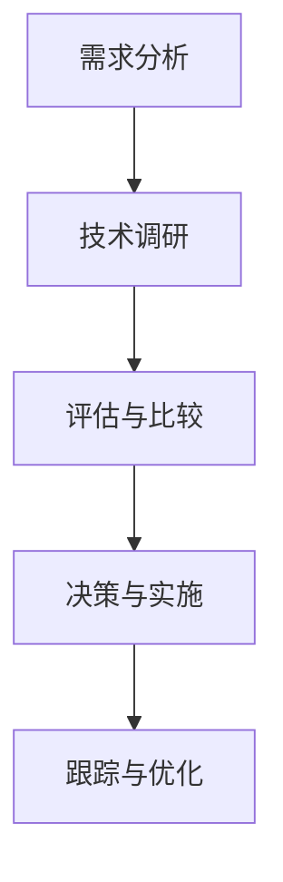
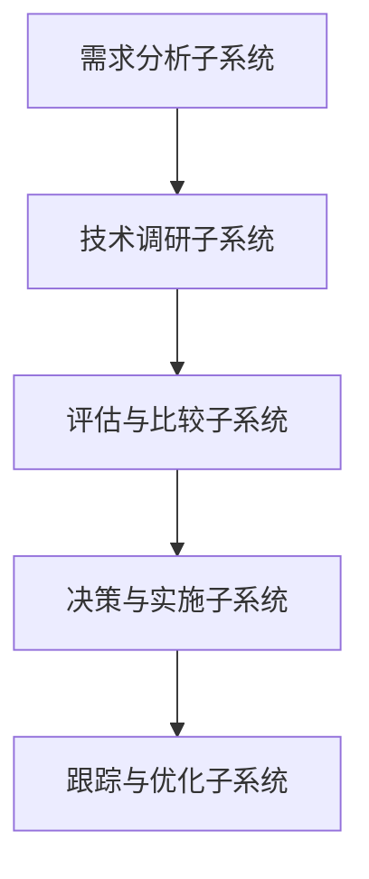
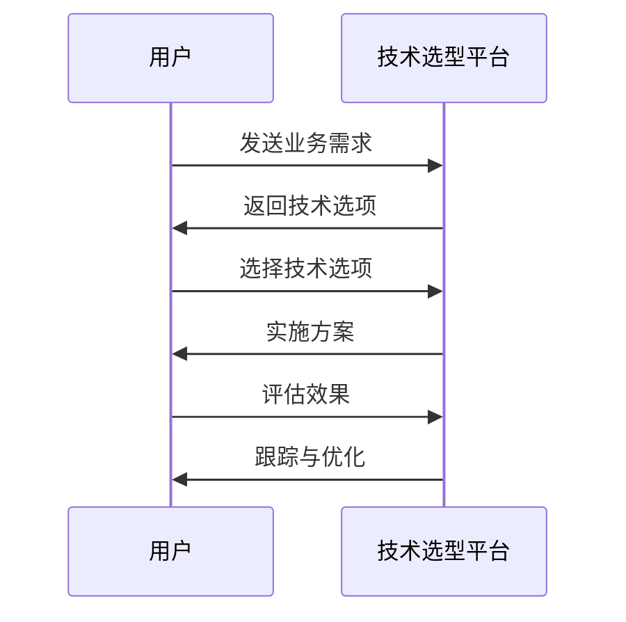
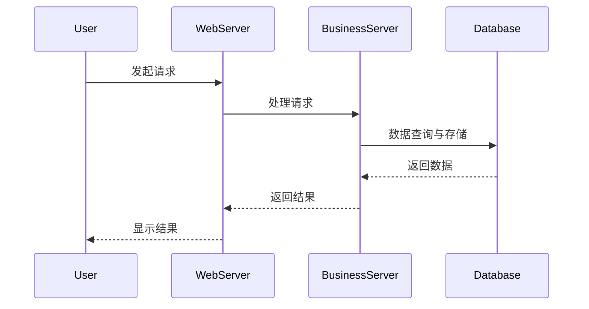

                 

### 技术选型的背景和重要性

在现代信息技术快速发展的背景下，技术选型已经成为IT项目成功与否的关键因素之一。技术选型不仅仅是选择一种编程语言或框架那么简单，它涉及到一个组织在技术和业务目标之间的平衡，关乎项目的性能、稳定性、成本效益以及长期发展。

#### 1. 背景介绍

随着互联网的普及和云计算、大数据、人工智能等新兴技术的兴起，企业面临着越来越多的技术选择。例如，在后台服务方面，可以选择Java、Python、Go等多种编程语言；在前端开发中，React、Vue、Angular等框架各有优势；在数据库领域，MySQL、PostgreSQL、MongoDB等数据库也各有所长。如何在这些众多选项中做出正确的决策，成为了一个需要深入探讨的问题。

#### 2. 问题背景

技术选型过程中，企业通常面临以下几个核心问题：

- **需求与技术的匹配度**：技术是否能够满足当前的业务需求，并具备一定的扩展性。
- **成本与效益**：技术的成本与预期效益如何平衡。
- **团队能力**：团队是否有足够的技能和资源来有效开发和维护所选技术。
- **市场趋势**：技术是否具备长远的发展潜力。

#### 3. 问题描述

技术选型的问题可以描述为：在一个特定的业务场景中，如何选择最适合的技术方案，以达到最佳的业务效果和投资回报。

#### 4. 问题解决

解决技术选型问题通常包括以下几个步骤：

1. **需求分析**：明确项目的业务需求和目标。
2. **技术调研**：收集并分析各种技术的信息。
3. **评估与比较**：根据关键因素对技术进行评估和比较。
4. **决策与实施**：选择最佳的技术方案并进行实施。

#### 5. 边界与外延

技术选型的边界在于企业当前的业务场景和资源条件，外延则包括技术的未来发展潜力、行业趋势等。

#### 6. 概念结构与核心要素组成

技术选型的概念结构主要包括以下几个核心要素：

- **业务需求**：明确的技术需求。
- **技术特性**：各种技术的优势和不足。
- **成本与预算**：技术选型的经济成本。
- **资源与人员**：团队的技术能力和资源配置。
- **市场趋势**：技术发展的动态趋势。

这些要素相互关联，共同影响技术选型的决策过程。

#### 7. 核心概念与联系

- **核心概念**：技术选型。
  - **定义**：在多个技术选项中，根据特定需求、业务目标和资源限制，进行选择的过程。
  - **属性**：需求匹配度、成本效益、团队能力、市场趋势等。
  - **特征**：技术比较、评估、决策与实施等步骤。

- **联系**：技术选型与业务目标、技术特性、成本效益、团队能力和市场趋势等紧密相关。

#### 8. ER实体关系图架构

以下是技术选型的ER实体关系图架构：

```mermaid
erDiagram
    BusinessRequirement ||--|{ TechnologyOption } : implements
    TechnologyOption ||--|{ CostBenefit } : evaluated_by
    CostBenefit ||--|{ TeamCapability } : assessed_by
    TeamCapability ||--|{ MarketTrend } : influenced_by
    MarketTrend ||--|{ TechnologyOption } : influenced
```

通过这个图，我们可以看到各个实体之间的关系，以及技术选型过程中的关键要素如何相互作用。

#### 9. 算法原理讲解

算法原理讲解部分将详细介绍技术选型过程中的核心算法，包括评估指标的计算方法和决策逻辑。

- **算法mermaid流程图**：



- **Python源代码**：

```python
def analyze_business_requirement():
    # 分析业务需求
    pass

def research_technology_options():
    # 收集和分析技术选项
    pass

def evaluate_technology_options():
    # 根据关键因素评估技术选项
    pass

def make_decision():
    # 根据评估结果做出决策
    pass

def implement_solution():
    # 实施所选技术方案
    pass

def monitor_and_optimize():
    # 对技术方案进行跟踪和优化
    pass
```

- **算法原理和公式**：

技术选型的核心算法是评估与比较算法，其基本原理是基于加权评分模型。具体公式如下：

$$
\text{Score}(T) = \sum_{i=1}^{n} w_i \cdot S_i(T)
$$

其中，$T$ 表示技术选项，$w_i$ 表示第 $i$ 个评估指标的重要性权重，$S_i(T)$ 表示技术选项在指标 $i$ 上的得分。

#### 10. 系统分析与架构设计方案

系统分析与架构设计方案部分将详细介绍技术选型的系统架构，包括项目介绍、系统功能设计、系统架构设计、系统接口设计和系统交互。

- **项目介绍**：
  - 项目名称：技术选型平台
  - 项目目标：为企业在技术选型过程中提供全面的决策支持。

- **系统功能设计**：
  - 需求分析：收集和分析业务需求。
  - 技术调研：收集和分析技术选项。
  - 评估与比较：根据关键因素对技术进行评估和比较。
  - 决策与实施：选择最佳的技术方案并进行实施。
  - 跟踪与优化：对技术方案进行跟踪和优化。

- **系统架构设计**：



- **系统接口设计**：
  - API接口：提供对外接口，方便其他系统调用。

- **系统交互**：



#### 11. 项目实战

项目实战部分将介绍技术选型的实际操作过程，包括环境安装、系统核心实现源代码、代码应用解读与分析、实际案例分析和详细讲解剖析、项目小结。

- **环境安装**：
  - 安装Python环境
  - 安装必要的库和工具

- **系统核心实现源代码**：
  - 源代码文件：`tech_selection_platform.py`
  - 源代码内容：实现技术选型的主要功能

- **代码应用解读与分析**：
  - 代码解读：详细介绍源代码的实现逻辑和功能。
  - 分析：评估代码的性能和可维护性。

- **实际案例分析和详细讲解剖析**：
  - 案例分析：基于实际业务场景，展示技术选型的应用。
  - 讲解剖析：详细解释案例中的技术选型过程和决策逻辑。

- **项目小结**：
  - 总结项目的主要成果和经验教训。

#### 12. 最佳实践 tips

在技术选型过程中，以下是一些最佳实践 tips：

- **明确需求**：确保业务需求明确且具体，避免因需求不清晰导致的选型失败。
- **广泛调研**：多方面收集和分析技术信息，避免因信息不全导致的误判。
- **团队协作**：加强团队内部的沟通与协作，共同参与技术选型过程。
- **持续评估**：技术选型不是一次性的过程，需要持续评估和优化。

#### 13. 小结

技术选型是一个复杂且关键的过程，它不仅涉及到技术的性能、稳定性、成本等方面，还涉及到团队的技能和资源、市场的变化趋势等。通过本文的详细介绍，希望读者能够对技术选型有更深入的理解，并在实际项目中能够运用这些知识，做出正确的技术决策。

#### 14. 注意事项

在技术选型过程中，需要注意以下几个事项：

- **需求变化**：需求可能会随着项目进展而变化，需要灵活调整技术选型方案。
- **风险评估**：对选定的技术方案进行充分的风险评估，确保项目能够顺利实施。
- **持续学习**：技术不断发展，需要不断学习和更新知识，以应对新的挑战。

#### 15. 拓展阅读

- **技术选型的书籍**：《技术领导力》、《软件架构师技术指南》等。
- **技术选型的在线资源**：各大技术社区、博客、论坛等。
- **行业报告**：行业分析报告，了解技术发展趋势和市场动态。

### 作者

作者：AI天才研究院/AI Genius Institute & 禅与计算机程序设计艺术 /Zen And The Art of Computer Programming

技术选型：在众多选择中做出正确决策

关键词：技术选型、需求分析、评估与比较、决策与实施、跟踪与优化

摘要：本文深入探讨了技术选型的背景、核心概念、关键因素、流程与方法，并结合实际案例，详细介绍了技术选型的过程和策略。通过本文的阅读，读者将能够更好地理解技术选型的原理和最佳实践，为实际项目中的技术决策提供有力支持。

----------------------------------------------------------------

# 技术选型：在众多选择中做出正确决策

关键词：技术选型、需求分析、评估与比较、决策与实施、跟踪与优化

摘要：本文旨在探讨技术选型的核心概念、关键因素及其流程，并通过具体的案例，详细分析技术选型的步骤和策略。文章涵盖了技术选型的背景、重要性、需求分析与评估、技术评估与比较、最佳实践以及未来趋势等内容，旨在为读者提供全面的技术选型指导。

### 目录大纲

# 技术选型：在众多选择中做出正确决策

## 第一部分：技术选型的背景和重要性

### 第1章：技术选型的核心概念

### 1.1 技术选型的基本定义

### 1.2 技术选型的关键因素

### 1.3 技术选型的流程与方法

## 第2章：技术趋势与行业动态

### 2.1 当前技术发展趋势

### 2.2 行业动态与热点技术

### 2.3 技术选型中的趋势分析与判断

## 第二部分：技术选型的具体策略

### 第3章：需求分析与评估

### 3.1 需求收集与分析

### 3.2 技术方案评估指标

### 3.3 需求与技术的匹配

## 第4章：技术评估与比较

### 4.1 技术评估的步骤与方法

### 4.2 技术比较的框架与工具

### 4.3 技术选型的案例分析

## 第5章：技术选型的最佳实践

### 5.1 成功案例分享

### 5.2 失败案例分析

### 5.3 技术选型中的常见问题与解决方法

## 第三部分：技术选型的实际应用

### 第6章：企业级技术选型实战

### 6.1 企业级技术选型的挑战

### 6.2 成功的技术选型案例

### 6.3 企业技术选型的战略规划

### 第7章：技术选型的未来趋势

### 7.1 技术选型的未来方向

### 7.2 技术选型中的新兴技术

### 7.3 技术选型的长期战略

## 附录：技术选型工具与资源推荐

### 7.1 常用技术选型工具

### 7.2 技术选型相关资源

### 7.3 技术选型社群与社区

----------------------------------------------------------------

## 第一部分：技术选型的背景和重要性

### 第1章：技术选型的核心概念

在当今快速变化的技术环境中，技术选型是一个至关重要的决策过程。它不仅影响项目的短期成功，还可能决定企业的长期发展战略。因此，理解技术选型的核心概念对于任何IT项目来说都是基础。

### 1.1 技术选型的基本定义

技术选型是指在特定的业务需求和技术环境下，从多个可选技术方案中挑选出最适合的技术解决方案的过程。它涉及多个层面的考量，包括技术特性、成本、团队技能、市场趋势等。

### 1.2 技术选型的关键因素

技术选型需要考虑以下几个关键因素：

- **业务需求**：技术选型必须首先满足业务需求，这包括功能需求、性能需求、安全性需求等。
- **技术特性**：技术的特性决定了其是否适合特定的应用场景。这包括编程语言、框架、数据库、工具等。
- **成本与预算**：技术选型需要在成本和预算之间做出权衡，确保选择的方案在经济上是可行的。
- **团队能力**：团队的技能和经验是技术选型成功的关键因素之一。选择的技术需要团队能够有效开发和维护。
- **市场趋势**：技术的市场趋势和未来发展潜力是技术选型时不可忽视的方面。选择有前途的技术可以为企业带来长期利益。

### 1.3 技术选型的流程与方法

技术选型的流程通常包括以下几个步骤：

1. **需求分析**：明确项目的业务需求和目标。
2. **技术调研**：收集和分析各种技术的信息。
3. **评估与比较**：根据关键因素对技术进行评估和比较。
4. **决策与实施**：选择最佳的技术方案并实施。
5. **跟踪与优化**：在项目实施后，对技术方案进行跟踪和优化。

### 第2章：技术趋势与行业动态

技术发展日新月异，行业动态也在不断变化。了解当前的技术趋势和行业动态对于技术选型至关重要。

### 2.1 当前技术发展趋势

当前技术发展趋势包括但不限于以下几个方面：

- **云计算与容器化**：云计算和容器化技术的成熟，使得应用部署更加灵活和高效。
- **大数据与人工智能**：大数据分析和人工智能技术的快速发展，为许多行业提供了新的业务模式。
- **区块链**：区块链技术的应用逐渐广泛，尤其是在金融领域。
- **物联网**：物联网设备的普及，推动了智能家居、智慧城市等领域的发展。

### 2.2 行业动态与热点技术

每个行业都有其独特的技术热点。以下是一些行业动态与热点技术：

- **金融科技**：区块链、人工智能、云计算在金融行业的应用，提高了金融服务效率和安全性。
- **医疗健康**：电子健康记录、远程医疗、基因组学等技术的应用，改善了医疗服务的质量和效率。
- **制造业**：智能制造、工业互联网、机器人技术在制造业的广泛应用，提高了生产效率和产品质量。

### 2.3 技术选型中的趋势分析与判断

在技术选型过程中，对技术趋势进行分析和判断至关重要。以下是一些方法：

- **趋势分析工具**：使用数据分析和趋势分析工具，如Google Trends、LinkedIn Trends等，来识别技术趋势。
- **行业报告**：阅读行业报告，如Gartner、IDC等的报告，了解技术趋势和行业动态。
- **专家咨询**：咨询行业专家和技术顾问，获取专业的技术见解和建议。

### 第3章：技术选型的具体策略

技术选型的策略需要根据具体的业务需求和项目环境来制定。以下是一些具体策略：

### 3.1 需求分析与评估

- **明确业务需求**：通过访谈、问卷调查等方式，收集业务需求，并将其转化为技术需求。
- **评估指标**：确定评估技术方案的关键指标，如性能、稳定性、成本、可维护性等。
- **需求与技术匹配**：确保所选技术能够满足业务需求，并具备扩展性。

### 3.2 技术方案评估指标

- **性能**：评估技术方案的响应时间、吞吐量、并发处理能力等。
- **稳定性**：评估技术方案的稳定性、错误处理能力、故障恢复能力等。
- **成本**：评估技术方案的开发、维护、培训等成本。
- **社区与支持**：评估技术方案的社区活跃度、文档质量、支持服务等。

### 3.3 需求与技术的匹配

- **业务需求映射**：将业务需求映射到具体的技术特性上，确保技术能够满足业务需求。
- **技术能力评估**：评估团队是否有足够的技术能力和资源来开发和维护所选技术。
- **技术可行性分析**：分析技术方案在预算、时间、资源等方面的可行性。

### 第4章：技术评估与比较

技术评估与比较是技术选型的核心环节，以下是一些关键步骤：

### 4.1 技术评估的步骤与方法

- **制定评估计划**：明确评估的目标、范围、方法和时间表。
- **收集技术信息**：收集各种技术方案的相关信息，如文档、案例、社区反馈等。
- **制定评估标准**：根据关键因素制定评估标准，如性能、稳定性、成本等。
- **评估实施**：对技术方案进行测试和评估，记录评估结果。

### 4.2 技术比较的框架与工具

- **比较框架**：构建一个比较框架，明确各项评估指标的权重和评分标准。
- **比较工具**：使用比较工具，如表格、矩阵、评分系统等，对技术方案进行量化比较。

### 4.3 技术选型的案例分析

- **案例选择**：选择具有代表性的技术选型案例进行分析。
- **案例分析**：详细分析案例中的技术选型过程、决策逻辑和结果。
- **案例总结**：总结案例中的经验和教训，为实际项目提供参考。

### 第5章：技术选型的最佳实践

最佳实践是技术选型成功的重要保障。以下是一些最佳实践：

### 5.1 成功案例分享

- **案例背景**：介绍成功案例的业务背景和需求。
- **选型过程**：详细描述选型过程，包括需求分析、评估与比较、决策与实施等。
- **案例成果**：分享案例的成果和经验。

### 5.2 失败案例分析

- **案例背景**：介绍失败案例的业务背景和需求。
- **选型过程**：详细描述选型过程中的问题和错误。
- **失败原因**：分析失败的原因，并提出改进建议。

### 5.3 技术选型中的常见问题与解决方法

- **常见问题**：列举技术选型中常见的问题，如需求不明确、评估不充分、决策不及时等。
- **解决方法**：提供解决问题的方法和建议。

### 第6章：技术选型的实际应用

技术选型的实际应用是企业成功的关键。以下是一些实际应用案例：

### 6.1 企业级技术选型的挑战

- **挑战背景**：介绍企业级技术选型所面临的挑战。
- **应对策略**：提出应对策略，如多团队协作、持续评估等。

### 6.2 成功的技术选型案例

- **案例背景**：介绍成功的技术选型案例。
- **选型过程**：详细描述选型过程和决策逻辑。
- **成功因素**：分析成功的关键因素。

### 6.3 企业技术选型的战略规划

- **战略规划**：提出企业技术选型的战略规划。
- **执行策略**：制定执行策略，确保战略规划的实现。

### 第7章：技术选型的未来趋势

未来技术选型将面临新的挑战和机遇。以下是一些未来趋势：

### 7.1 技术选型的未来方向

- **趋势分析**：分析未来技术发展的趋势和方向。
- **技术预测**：预测未来可能出现的新技术和应用场景。

### 7.2 技术选型中的新兴技术

- **新兴技术介绍**：介绍当前新兴技术的特点和优势。
- **应用场景**：分析新兴技术在企业中的应用场景。

### 7.3 技术选型的长期战略

- **战略规划**：制定技术选型的长期战略规划。
- **执行策略**：确保战略规划的长期执行。

### 附录：技术选型工具与资源推荐

附录部分将提供一些技术选型工具和资源推荐，帮助读者更好地进行技术选型。

### 7.1 常用技术选型工具

- **工具介绍**：介绍常用的技术选型工具，如Stack Overflow、GitHub等。
- **使用方法**：说明这些工具的使用方法和优势。

### 7.2 技术选型相关资源

- **资源列表**：提供一些有用的技术选型资源，如技术社区、博客等。
- **资源链接**：提供具体的资源链接，方便读者获取。

### 7.3 技术选型社群与社区

- **社群介绍**：介绍一些技术选型相关的社群和社区。
- **社群链接**：提供社群链接，方便读者加入。

### 结论

技术选型是IT项目中不可或缺的一环，它关系到项目的成败和企业的长期发展。通过本文的详细分析，希望读者能够更好地理解技术选型的原理和策略，并在实际项目中取得成功。随着技术的不断进步，技术选型也将面临新的挑战和机遇，期待读者不断学习和实践，为企业的数字化转型贡献力量。

### 作者

作者：AI天才研究院/AI Genius Institute & 禅与计算机程序设计艺术 /Zen And The Art of Computer Programming

----------------------------------------------------------------

## 第一部分：技术选型的背景和重要性

技术选型是信息技术领域中至关重要的环节，它涉及到项目的成功与失败、企业的竞争力和未来的发展。在众多技术选项中做出正确的决策，不仅需要深入理解技术的本质，还需要充分考虑业务需求、成本效益、团队技能和市场趋势等多方面因素。

### 第1章：技术选型的核心概念

#### 1.1 技术选型的基本定义

技术选型（Technology Selection）是指在特定的业务需求、预算和资源约束条件下，从多个技术选项中挑选出最合适的技术方案的过程。它不仅涉及技术本身，还包括成本、团队技能、市场趋势等多个方面。

#### 1.2 技术选型的关键因素

技术选型需要考虑以下几个关键因素：

- **业务需求**：技术选型首先要满足业务需求，包括功能需求、性能需求、安全性需求等。
- **技术特性**：技术特性决定了其是否适合特定的应用场景，如编程语言、框架、数据库、工具等。
- **成本与预算**：成本和预算是技术选型的重要考虑因素，需要确保技术方案在经济上是可行的。
- **团队能力**：团队的技术能力和资源是决定技术选型成功的关键因素。
- **市场趋势**：市场趋势和未来发展潜力是技术选型时不可忽视的方面，选择有前途的技术可以为企业带来长期利益。

#### 1.3 技术选型的流程与方法

技术选型的流程通常包括以下几个步骤：

1. **需求分析**：明确项目的业务需求和目标。
2. **技术调研**：收集和分析各种技术的信息。
3. **评估与比较**：根据关键因素对技术进行评估和比较。
4. **决策与实施**：选择最佳的技术方案并实施。
5. **跟踪与优化**：在项目实施后，对技术方案进行跟踪和优化。

### 第2章：技术趋势与行业动态

技术不断发展，行业动态也在不断变化。了解当前的技术趋势和行业动态对于技术选型至关重要。

#### 2.1 当前技术发展趋势

当前技术发展趋势包括以下几个方面：

- **云计算与容器化**：云计算和容器化技术的成熟，使得应用部署更加灵活和高效。
- **大数据与人工智能**：大数据分析和人工智能技术的快速发展，为许多行业提供了新的业务模式。
- **区块链**：区块链技术的应用逐渐广泛，尤其是在金融领域。
- **物联网**：物联网设备的普及，推动了智能家居、智慧城市等领域的发展。

#### 2.2 行业动态与热点技术

每个行业都有其独特的技术热点。以下是一些行业动态与热点技术：

- **金融科技**：区块链、人工智能、云计算在金融行业的应用，提高了金融服务效率和安全性。
- **医疗健康**：电子健康记录、远程医疗、基因组学等技术的应用，改善了医疗服务的质量和效率。
- **制造业**：智能制造、工业互联网、机器人技术在制造业的广泛应用，提高了生产效率和产品质量。

#### 2.3 技术选型中的趋势分析与判断

在技术选型过程中，对技术趋势进行分析和判断至关重要。以下是一些方法：

- **趋势分析工具**：使用数据分析和趋势分析工具，如Google Trends、LinkedIn Trends等，来识别技术趋势。
- **行业报告**：阅读行业报告，如Gartner、IDC等的报告，了解技术趋势和行业动态。
- **专家咨询**：咨询行业专家和技术顾问，获取专业的技术见解和建议。

### 第3章：技术选型的具体策略

技术选型的策略需要根据具体的业务需求和项目环境来制定。以下是一些具体策略：

#### 3.1 需求分析与评估

- **明确业务需求**：通过访谈、问卷调查等方式，收集业务需求，并将其转化为技术需求。
- **评估指标**：确定评估技术方案的关键指标，如性能、稳定性、成本、可维护性等。
- **需求与技术匹配**：确保所选技术能够满足业务需求，并具备扩展性。

#### 3.2 技术方案评估指标

- **性能**：评估技术方案的响应时间、吞吐量、并发处理能力等。
- **稳定性**：评估技术方案的稳定性、错误处理能力、故障恢复能力等。
- **成本**：评估技术方案的开发、维护、培训等成本。
- **社区与支持**：评估技术方案的社区活跃度、文档质量、支持服务等。

#### 3.3 需求与技术的匹配

- **业务需求映射**：将业务需求映射到具体的技术特性上，确保技术能够满足业务需求。
- **技术能力评估**：评估团队是否有足够的技术能力和资源来开发和维护所选技术。
- **技术可行性分析**：分析技术方案在预算、时间、资源等方面的可行性。

### 第4章：技术评估与比较

技术评估与比较是技术选型的核心环节，以下是一些关键步骤：

#### 4.1 技术评估的步骤与方法

- **制定评估计划**：明确评估的目标、范围、方法和时间表。
- **收集技术信息**：收集各种技术方案的相关信息，如文档、案例、社区反馈等。
- **制定评估标准**：根据关键因素制定评估标准，如性能、稳定性、成本等。
- **评估实施**：对技术方案进行测试和评估，记录评估结果。

#### 4.2 技术比较的框架与工具

- **比较框架**：构建一个比较框架，明确各项评估指标的权重和评分标准。
- **比较工具**：使用比较工具，如表格、矩阵、评分系统等，对技术方案进行量化比较。

#### 4.3 技术选型的案例分析

- **案例选择**：选择具有代表性的技术选型案例进行分析。
- **案例分析**：详细分析案例中的技术选型过程、决策逻辑和结果。
- **案例总结**：总结案例中的经验和教训，为实际项目提供参考。

### 第5章：技术选型的最佳实践

最佳实践是技术选型成功的重要保障。以下是一些最佳实践：

#### 5.1 成功案例分享

- **案例背景**：介绍成功案例的业务背景和需求。
- **选型过程**：详细描述选型过程，包括需求分析、评估与比较、决策与实施等。
- **案例成果**：分享案例的成果和经验。

#### 5.2 失败案例分析

- **案例背景**：介绍失败案例的业务背景和需求。
- **选型过程**：详细描述选型过程中的问题和错误。
- **失败原因**：分析失败的原因，并提出改进建议。

#### 5.3 技术选型中的常见问题与解决方法

- **常见问题**：列举技术选型中常见的问题，如需求不明确、评估不充分、决策不及时等。
- **解决方法**：提供解决问题的方法和建议。

### 第6章：技术选型的实际应用

技术选型的实际应用是企业成功的关键。以下是一些实际应用案例：

#### 6.1 企业级技术选型的挑战

- **挑战背景**：介绍企业级技术选型所面临的挑战。
- **应对策略**：提出应对策略，如多团队协作、持续评估等。

#### 6.2 成功的技术选型案例

- **案例背景**：介绍成功的技术选型案例。
- **选型过程**：详细描述选型过程和决策逻辑。
- **成功因素**：分析成功的关键因素。

#### 6.3 企业技术选型的战略规划

- **战略规划**：提出企业技术选型的战略规划。
- **执行策略**：制定执行策略，确保战略规划的实现。

### 第7章：技术选型的未来趋势

未来技术选型将面临新的挑战和机遇。以下是一些未来趋势：

#### 7.1 技术选型的未来方向

- **趋势分析**：分析未来技术发展的趋势和方向。
- **技术预测**：预测未来可能出现的新技术和应用场景。

#### 7.2 技术选型中的新兴技术

- **新兴技术介绍**：介绍当前新兴技术的特点和优势。
- **应用场景**：分析新兴技术在企业中的应用场景。

#### 7.3 技术选型的长期战略

- **战略规划**：制定技术选型的长期战略规划。
- **执行策略**：确保战略规划的长期执行。

### 附录：技术选型工具与资源推荐

附录部分将提供一些技术选型工具和资源推荐，帮助读者更好地进行技术选型。

#### 7.1 常用技术选型工具

- **工具介绍**：介绍常用的技术选型工具，如Stack Overflow、GitHub等。
- **使用方法**：说明这些工具的使用方法和优势。

#### 7.2 技术选型相关资源

- **资源列表**：提供一些有用的技术选型资源，如技术社区、博客等。
- **资源链接**：提供具体的资源链接，方便读者获取。

#### 7.3 技术选型社群与社区

- **社群介绍**：介绍一些技术选型相关的社群和社区。
- **社群链接**：提供社群链接，方便读者加入。

### 结论

技术选型是IT项目中不可或缺的一环，它关系到项目的成败和企业的长期发展。通过本文的详细分析，希望读者能够更好地理解技术选型的原理和策略，并在实际项目中取得成功。随着技术的不断进步，技术选型也将面临新的挑战和机遇，期待读者不断学习和实践，为企业的数字化转型贡献力量。

### 作者

作者：AI天才研究院/AI Genius Institute & 禅与计算机程序设计艺术 /Zen And The Art of Computer Programming

----------------------------------------------------------------

## 第一部分：技术选型的背景和重要性

技术选型在当今信息技术环境中扮演着至关重要的角色，它不仅影响着IT项目的成功与否，也直接关系到企业的长期战略和竞争力。随着技术的快速发展和市场竞争的日益激烈，企业需要在众多技术选项中做出明智的选择，以确保其技术基础设施能够支撑业务的快速发展。

### 第1章：技术选型的核心概念

#### 1.1 技术选型的基本定义

技术选型是指在一个特定的业务背景下，从多个潜在技术解决方案中挑选出最合适的一个或几个技术方案的过程。它不仅涉及技术本身的选择，还包括对技术成本、实施难度、维护成本、升级路径、团队技能等多方面的综合评估。

#### 1.2 技术选型的关键因素

技术选型过程中，需要考虑的关键因素包括：

- **业务需求**：明确的技术需求和业务目标，确保技术方案能够满足当前和未来的业务需求。
- **技术特性**：评估不同技术的性能、稳定性、安全性、可扩展性等特性。
- **成本与预算**：技术方案的实施成本、维护成本、升级成本等，以及预算的约束。
- **团队能力**：团队的技术水平和经验，以及是否能够有效地利用所选技术。
- **市场趋势**：技术市场的动态，包括技术的成熟度、供应商的支持、社区活跃度等。
- **长期战略**：企业的发展方向和技术布局，确保所选技术能够支持企业的长期战略目标。

#### 1.3 技术选型的流程与方法

技术选型的流程通常包括以下几个步骤：

1. **需求分析**：明确项目的业务需求和目标，制定需求文档。
2. **技术调研**：收集潜在的技术选项，了解各种技术的特性和适用场景。
3. **评估与比较**：根据关键因素对技术选项进行评估和比较，制定评估标准。
4. **决策与实施**：选择最合适的技术方案，制定实施计划并执行。
5. **跟踪与优化**：在技术方案实施后，持续跟踪技术性能和业务效果，进行必要的优化。

### 第2章：技术趋势与行业动态

技术趋势和行业动态对于技术选型有着重要的影响。了解这些趋势和动态，有助于企业把握技术发展的方向，做出更为明智的决策。

#### 2.1 当前技术发展趋势

当前技术发展趋势包括以下几个方面：

- **云计算与容器化**：云计算和容器化技术的成熟，使得应用部署更加灵活和高效。
- **大数据与人工智能**：大数据分析和人工智能技术的快速发展，为各个行业提供了新的机遇。
- **区块链**：区块链技术的应用逐渐广泛，特别是在金融和供应链领域。
- **物联网**：物联网设备的普及，推动了智能家居、智慧城市等领域的发展。

#### 2.2 行业动态与热点技术

不同行业的动态和热点技术有所不同，以下是一些典型行业的动态和热点技术：

- **金融科技**：区块链、人工智能、云计算在金融行业的应用，提高了金融服务的效率和安全性。
- **医疗健康**：电子健康记录、远程医疗、基因组学等技术的应用，改善了医疗服务的质量和效率。
- **制造业**：智能制造、工业互联网、机器人技术在制造业的广泛应用，提高了生产效率和产品质量。

#### 2.3 技术选型中的趋势分析与判断

对技术趋势进行分析和判断是技术选型的重要环节。以下是一些方法：

- **市场研究报告**：阅读市场研究报告，了解技术趋势和行业动态。
- **专家咨询**：咨询行业专家和技术顾问，获取专业的技术见解和建议。
- **社区反馈**：关注技术社区的讨论和反馈，了解技术的实际应用情况和用户评价。

### 第3章：技术选型的具体策略

技术选型的策略需要根据具体的业务需求和项目环境来制定。以下是一些具体策略：

#### 3.1 需求分析与评估

- **明确业务需求**：通过访谈、问卷调查等方式，收集业务需求，并将其转化为技术需求。
- **评估指标**：确定评估技术方案的关键指标，如性能、稳定性、成本、可维护性等。
- **需求与技术匹配**：确保所选技术能够满足业务需求，并具备扩展性。

#### 3.2 技术方案评估指标

- **性能**：评估技术方案的响应时间、吞吐量、并发处理能力等。
- **稳定性**：评估技术方案的稳定性、错误处理能力、故障恢复能力等。
- **成本**：评估技术方案的开发、维护、培训等成本。
- **社区与支持**：评估技术方案的社区活跃度、文档质量、支持服务等。

#### 3.3 需求与技术的匹配

- **业务需求映射**：将业务需求映射到具体的技术特性上，确保技术能够满足业务需求。
- **技术能力评估**：评估团队是否有足够的技术能力和资源来开发和维护所选技术。
- **技术可行性分析**：分析技术方案在预算、时间、资源等方面的可行性。

### 第4章：技术评估与比较

技术评估与比较是技术选型的核心环节。以下是一些关键步骤：

#### 4.1 技术评估的步骤与方法

- **制定评估计划**：明确评估的目标、范围、方法和时间表。
- **收集技术信息**：收集各种技术方案的相关信息，如文档、案例、社区反馈等。
- **制定评估标准**：根据关键因素制定评估标准，如性能、稳定性、成本等。
- **评估实施**：对技术方案进行测试和评估，记录评估结果。

#### 4.2 技术比较的框架与工具

- **比较框架**：构建一个比较框架，明确各项评估指标的权重和评分标准。
- **比较工具**：使用比较工具，如表格、矩阵、评分系统等，对技术方案进行量化比较。

#### 4.3 技术选型的案例分析

- **案例选择**：选择具有代表性的技术选型案例进行分析。
- **案例分析**：详细分析案例中的技术选型过程、决策逻辑和结果。
- **案例总结**：总结案例中的经验和教训，为实际项目提供参考。

### 第5章：技术选型的最佳实践

最佳实践是技术选型成功的重要保障。以下是一些最佳实践：

#### 5.1 成功案例分享

- **案例背景**：介绍成功案例的业务背景和需求。
- **选型过程**：详细描述选型过程，包括需求分析、评估与比较、决策与实施等。
- **案例成果**：分享案例的成果和经验。

#### 5.2 失败案例分析

- **案例背景**：介绍失败案例的业务背景和需求。
- **选型过程**：详细描述选型过程中的问题和错误。
- **失败原因**：分析失败的原因，并提出改进建议。

#### 5.3 技术选型中的常见问题与解决方法

- **常见问题**：列举技术选型中常见的问题，如需求不明确、评估不充分、决策不及时等。
- **解决方法**：提供解决问题的方法和建议。

### 第6章：技术选型的实际应用

技术选型的实际应用是企业成功的关键。以下是一些实际应用案例：

#### 6.1 企业级技术选型的挑战

- **挑战背景**：介绍企业级技术选型所面临的挑战。
- **应对策略**：提出应对策略，如多团队协作、持续评估等。

#### 6.2 成功的技术选型案例

- **案例背景**：介绍成功的技术选型案例。
- **选型过程**：详细描述选型过程和决策逻辑。
- **成功因素**：分析成功的关键因素。

#### 6.3 企业技术选型的战略规划

- **战略规划**：提出企业技术选型的战略规划。
- **执行策略**：制定执行策略，确保战略规划的实现。

### 第7章：技术选型的未来趋势

未来技术选型将面临新的挑战和机遇。以下是一些未来趋势：

#### 7.1 技术选型的未来方向

- **趋势分析**：分析未来技术发展的趋势和方向。
- **技术预测**：预测未来可能出现的新技术和应用场景。

#### 7.2 技术选型中的新兴技术

- **新兴技术介绍**：介绍当前新兴技术的特点和优势。
- **应用场景**：分析新兴技术在企业中的应用场景。

#### 7.3 技术选型的长期战略

- **战略规划**：制定技术选型的长期战略规划。
- **执行策略**：确保战略规划的长期执行。

### 附录：技术选型工具与资源推荐

附录部分将提供一些技术选型工具和资源推荐，帮助读者更好地进行技术选型。

#### 7.1 常用技术选型工具

- **工具介绍**：介绍常用的技术选型工具，如Stack Overflow、GitHub等。
- **使用方法**：说明这些工具的使用方法和优势。

#### 7.2 技术选型相关资源

- **资源列表**：提供一些有用的技术选型资源，如技术社区、博客等。
- **资源链接**：提供具体的资源链接，方便读者获取。

#### 7.3 技术选型社群与社区

- **社群介绍**：介绍一些技术选型相关的社群和社区。
- **社群链接**：提供社群链接，方便读者加入。

### 结论

技术选型是信息技术项目中不可或缺的一环，它关系到项目的成败和企业的长期发展。通过本文的详细分析，希望读者能够更好地理解技术选型的原理和策略，并在实际项目中取得成功。随着技术的不断进步，技术选型也将面临新的挑战和机遇，期待读者不断学习和实践，为企业的数字化转型贡献力量。

### 作者

作者：AI天才研究院/AI Genius Institute & 禅与计算机程序设计艺术 /Zen And The Art of Computer Programming

----------------------------------------------------------------

## 第二部分：技术选型的具体策略

### 第3章：需求分析与评估

在技术选型过程中，需求分析与评估是关键的一步。这一步骤需要确保所选技术能够真正满足业务需求，并为未来的扩展提供可能性。

#### 3.1 需求收集与分析

需求收集与分析是技术选型的起点。以下是一些关键步骤：

1. **确定业务目标**：与业务团队紧密合作，明确项目的主要目标和期望成果。
2. **访谈与调研**：通过访谈、问卷调查和用户观察等方式，收集业务用户和技术团队的需求。
3. **需求文档**：编写详细的需求文档，记录所有收集到的信息，并将其分类为功能需求、性能需求、安全性需求等。

#### 3.2 技术方案评估指标

在评估技术方案时，需要设定一系列评估指标。以下是一些常见的评估指标：

- **性能**：评估技术的响应时间、吞吐量、并发处理能力等性能指标。
- **稳定性**：评估技术的稳定性，包括故障率、恢复时间等。
- **可扩展性**：评估技术方案是否能够适应业务增长的需求。
- **成本**：评估技术方案的总成本，包括开发、部署、维护等。
- **社区与支持**：评估技术社区的活跃度、文档的完整性、供应商的支持力度等。

#### 3.3 需求与技术的匹配

需求与技术的匹配是技术选型的核心。以下是一些策略：

1. **映射需求到技术特性**：将业务需求与不同技术方案的特性进行匹配，确保所选技术能够满足需求。
2. **优先级排序**：根据业务需求的重要性，对技术特性进行优先级排序，确保关键需求得到满足。
3. **风险评估**：评估技术方案在满足需求方面的风险，并制定相应的应对策略。

### 第4章：技术评估与比较

技术评估与比较是技术选型的核心环节，以下是一些具体的步骤和方法：

#### 4.1 技术评估的步骤与方法

1. **制定评估计划**：明确评估的目标、范围、方法和时间表。
2. **收集技术信息**：通过市场调研、文献阅读、供应商咨询等方式，收集有关技术方案的信息。
3. **制定评估标准**：根据业务需求和技术特性，制定详细的评估标准。
4. **评估实施**：对每个技术方案进行测试和评估，记录评估结果。

#### 4.2 技术比较的框架与工具

1. **比较框架**：构建一个全面的比较框架，包括性能、稳定性、成本、可扩展性、社区与支持等指标。
2. **比较工具**：使用比较工具，如Excel、Google Sheets、专门的技术选型软件等，对技术方案进行量化比较。

#### 4.3 技术选型的案例分析

1. **案例选择**：选择具有代表性的技术选型案例进行分析。
2. **案例分析**：详细分析案例中的技术选型过程、决策逻辑和结果。
3. **案例总结**：总结案例中的经验和教训，为实际项目提供参考。

### 第5章：技术选型的最佳实践

最佳实践是技术选型成功的重要保障。以下是一些成功的技术选型最佳实践：

#### 5.1 成功案例分享

1. **案例背景**：介绍成功案例的业务背景和需求。
2. **选型过程**：详细描述选型过程，包括需求分析、评估与比较、决策与实施等。
3. **案例成果**：分享案例的成果和经验，强调成功的关键因素。

#### 5.2 失败案例分析

1. **案例背景**：介绍失败案例的业务背景和需求。
2. **选型过程**：详细描述选型过程中的问题和错误。
3. **失败原因**：分析失败的原因，如需求不明确、评估不充分、决策不及时等。
4. **改进建议**：提出改进建议，以避免未来类似的问题。

#### 5.3 技术选型中的常见问题与解决方法

1. **常见问题**：列举技术选型中常见的问题，如需求不明确、评估不充分、决策不及时等。
2. **解决方法**：提供解决问题的方法和建议，如加强需求分析、制定更详细的评估标准、建立决策支持团队等。

### 第6章：技术选型的实际应用

技术选型的实际应用是企业成功的关键。以下是一些实际应用案例：

#### 6.1 企业级技术选型的挑战

1. **挑战背景**：介绍企业级技术选型所面临的挑战，如技术复杂度、资源限制、市场变化等。
2. **应对策略**：提出应对策略，如多团队协作、持续评估、灵活调整等。

#### 6.2 成功的技术选型案例

1. **案例背景**：介绍成功的技术选型案例。
2. **选型过程**：详细描述选型过程和决策逻辑。
3. **成功因素**：分析成功的关键因素，如明确的需求、全面的评估、有效的决策等。

#### 6.3 企业技术选型的战略规划

1. **战略规划**：提出企业技术选型的长期战略规划。
2. **执行策略**：制定具体的执行策略，如技术路线图、资源分配、团队协作等。

### 第7章：技术选型的未来趋势

未来技术选型将面临新的挑战和机遇。以下是一些未来趋势：

#### 7.1 技术选型的未来方向

1. **趋势分析**：分析未来技术发展的趋势和方向，如云计算、大数据、人工智能等。
2. **技术预测**：预测未来可能出现的新技术和应用场景。

#### 7.2 技术选型中的新兴技术

1. **新兴技术介绍**：介绍当前新兴技术的特点和优势，如区块链、物联网、5G等。
2. **应用场景**：分析新兴技术在企业中的应用场景，如供应链管理、智能制造、智慧城市等。

#### 7.3 技术选型的长期战略

1. **战略规划**：制定技术选型的长期战略规划，如技术路线图、技术储备、持续学习等。
2. **执行策略**：确保战略规划的长期执行，如定期评估、技术培训、团队建设等。

### 附录：技术选型工具与资源推荐

附录部分将提供一些技术选型工具和资源推荐，帮助读者更好地进行技术选型。

#### 7.1 常用技术选型工具

1. **工具介绍**：介绍常用的技术选型工具，如Stack Overflow、GitHub、JIRA等。
2. **使用方法**：说明这些工具的使用方法和优势。

#### 7.2 技术选型相关资源

1. **资源列表**：提供一些有用的技术选型资源，如技术社区、博客、论坛等。
2. **资源链接**：提供具体的资源链接，方便读者获取。

#### 7.3 技术选型社群与社区

1. **社群介绍**：介绍一些技术选型相关的社群和社区，如GitHub、Stack Overflow等。
2. **社群链接**：提供社群链接，方便读者加入。

### 结论

技术选型是信息技术项目中不可或缺的一环，它关系到项目的成败和企业的长期发展。通过本文的详细分析，希望读者能够更好地理解技术选型的原理和策略，并在实际项目中取得成功。随着技术的不断进步，技术选型也将面临新的挑战和机遇，期待读者不断学习和实践，为企业的数字化转型贡献力量。

### 作者

作者：AI天才研究院/AI Genius Institute & 禅与计算机程序设计艺术 /Zen And The Art of Computer Programming

----------------------------------------------------------------

## 第三部分：技术选型的实际应用

### 第6章：企业级技术选型实战

在企业级技术选型中，面临的挑战通常更为复杂，涉及多种技术和多个部门的协调。以下是一个企业级技术选型实战的案例分析，以及一些实际应用的建议。

#### 6.1 企业级技术选型的挑战

1. **复杂的技术环境**：企业通常已经拥有成熟的技术基础设施，新的技术选型需要与现有系统无缝集成。
2. **跨部门协调**：技术选型往往涉及多个部门，如开发、运维、产品、财务等，需要确保各方意见一致。
3. **资源限制**：企业在技术选型时可能会受到预算、人员、时间等资源限制，需要在有限资源下做出最佳决策。
4. **市场变化**：技术市场变化快速，新技术不断涌现，需要企业及时跟踪市场动态，评估新技术的潜力。

#### 6.2 成功的技术选型案例

**案例背景**：某大型企业计划重构其客户关系管理系统（CRM），以提高客户服务和销售效率。

**选型过程**：

1. **需求分析**：与业务团队、客户服务团队、销售团队进行深入交流，明确CRM系统的功能需求、性能需求和安全需求。
2. **技术调研**：调研市场上主流的CRM解决方案，如Salesforce、Microsoft Dynamics、Oracle CRM等。
3. **评估与比较**：根据需求分析，制定评估标准，包括性能、稳定性、可扩展性、成本、社区支持等，对各个CRM解决方案进行评估。
4. **决策与实施**：综合考虑评估结果和业务需求，选择了Salesforce作为CRM系统的新解决方案，并制定了详细的实施计划。

**成功因素**：

- **全面的需求分析**：确保选型过程基于明确的业务需求。
- **全面的评估标准**：不仅考虑技术特性，还考虑了成本、社区支持等多个方面。
- **跨部门协作**：确保技术选型过程中各方意见一致，并得到高层的支持。
- **详细实施计划**：确保技术选型后的实施过程顺利，减少风险。

#### 6.3 企业技术选型的战略规划

1. **制定长期战略**：企业应该制定长期的技术选型战略，包括技术路线图、技术储备、持续学习等。
2. **资源分配**：确保有足够的资源和预算支持技术选型和实施。
3. **团队建设**：建立专业的技术选型团队，包括业务专家、技术专家、项目管理专家等。
4. **持续评估与优化**：在技术选型后，持续评估技术方案的效果，根据业务需求和市场变化进行优化。

### 第7章：技术选型的未来趋势

技术选型的未来趋势将受到新兴技术和市场变化的影响。以下是一些关键趋势：

#### 7.1 技术选型的未来方向

1. **云计算与边缘计算**：随着云计算的成熟和边缘计算的兴起，企业将更多地采用云原生架构和边缘计算技术。
2. **大数据与人工智能**：大数据分析和人工智能技术的应用将更加广泛，为企业提供智能化的决策支持和业务创新。
3. **区块链**：区块链技术的应用将逐渐从金融领域扩展到供应链管理、数据安全等领域。

#### 7.2 技术选型中的新兴技术

1. **区块链**：区块链技术提供了去中心化、安全透明的数据存储和传输方式，适用于供应链管理、数据隐私保护等领域。
2. **物联网**：物联网技术的普及将推动智慧城市、智能家居等领域的发展。
3. **5G**：5G技术的应用将带来更高速、更低延迟的网络环境，支持实时大数据分析和智能应用。

#### 7.3 技术选型的长期战略

1. **技术创新储备**：企业应建立技术创新储备，持续跟踪前沿技术，为未来的技术选型做好准备。
2. **技术路线图**：制定详细的技术路线图，明确技术发展的方向和关键里程碑。
3. **持续学习与培训**：鼓励团队成员持续学习新技术，提高团队的整体技术水平。
4. **开放合作**：积极参与技术社区和开源项目，与行业伙伴建立合作关系，共同推动技术创新。

### 附录：技术选型工具与资源推荐

为了更好地进行技术选型，以下是一些常用的工具和资源推荐：

#### 7.1 常用技术选型工具

1. **Stack Overflow**：全球最大的开发者社区，可以找到各种编程语言和技术问题的解决方案。
2. **GitHub**：代码托管平台，可以查看各种开源项目的代码，了解技术趋势。
3. **JIRA**：项目管理工具，可以帮助团队管理技术选型和项目实施过程。

#### 7.2 技术选型相关资源

1. **技术社区和博客**：如InfoQ、博客园等，提供最新的技术文章和社区讨论。
2. **行业报告**：如Gartner、IDC等，提供关于技术趋势和市场动态的深入分析。
3. **在线课程与培训**：如Coursera、edX等，提供各种技术课程的在线学习资源。

#### 7.3 技术选型社群与社区

1. **技术社群**：如GitHub、Stack Overflow上的各种技术社群，可以参与技术讨论和交流。
2. **专业论坛**：如CSDN、OSChina等，提供专业的技术论坛和社区支持。

### 结论

技术选型是企业IT战略的重要组成部分，它关系到项目的成功和企业的竞争力。通过本文的案例分析和技术趋势分析，读者可以更好地理解技术选型的实际应用和未来方向。随着技术的不断进步，企业需要持续关注技术趋势，灵活调整技术选型策略，以保持竞争优势。

### 作者

作者：AI天才研究院/AI Genius Institute & 禅与计算机程序设计艺术 /Zen And The Art of Computer Programming

----------------------------------------------------------------

### 7.1 常用技术选型工具

在进行技术选型时，使用合适的工具可以大大提高效率，以下是一些常用的技术选型工具：

#### **7.1.1 GitHub**

**功能介绍**：GitHub 是一个流行的代码托管平台，用户可以在这里查看和贡献各种开源项目的代码，通过代码库的版本控制和管理来追踪项目的进展。

**优势**：
- **丰富的开源资源**：GitHub 上有大量的开源项目，可以作为技术选型的参考。
- **社区活跃**：GitHub 的用户社区非常活跃，可以快速获取技术支持和反馈。

**使用方法**：通过搜索关键字来查找相关项目，分析项目的技术栈、活跃度和文档情况。

#### **7.1.2 Stack Overflow**

**功能介绍**：Stack Overflow 是一个问答社区，开发者可以在这里提问和回答技术问题。

**优势**：
- **知识库**：拥有庞大的技术问答库，可以快速解决技术难题。
- **专业性**：社区的成员都是具有实战经验的开发者，回答具有很高的参考价值。

**使用方法**：在搜索框中输入技术相关的问题，查看答案并参考社区成员的建议。

#### **7.1.3 JIRA**

**功能介绍**：JIRA 是一个功能强大的项目管理工具，可以帮助团队进行需求管理、任务跟踪和进度控制。

**优势**：
- **灵活性**：可以定制项目管理流程，适应不同的项目需求。
- **集成性**：与Git、Confluence等工具集成，便于团队协作。

**使用方法**：创建项目，分配任务，跟踪进度，并在需求分析和技术评估阶段记录关键信息。

#### **7.1.4 CRAN**

**功能介绍**：CRAN（Comprehensive R Archive Network）是R语言的官方代码库，提供了大量的R包和工具。

**优势**：
- **R语言支持**：适用于需要使用R语言进行数据分析的项目。
- **高质量的包**：CRAN 上的包经过严格的审核，保证了质量和可靠性。

**使用方法**：在CRAN网站上搜索相关包，阅读文档和用户评论，评估其适用性。

#### **7.1.5 Jenkins**

**功能介绍**：Jenkins 是一个开源的持续集成服务器，可以自动化构建、测试和部署软件。

**优势**：
- **自动化**：提高软件开发和部署的效率。
- **灵活性**：支持多种编程语言和工具，可以定制复杂的构建流程。

**使用方法**：安装Jenkins服务器，配置构建任务，并在技术评估过程中测试不同技术方案的持续集成能力。

#### **7.1.6 Nagios**

**功能介绍**：Nagios 是一个开源的网络监视工具，可以监控服务器、网络设备和其他基础设施组件的健康状态。

**优势**：
- **稳定性**：可以实时监控系统的运行状态，及时发现并解决问题。
- **扩展性**：支持自定义插件，可以监控特定技术组件的性能。

**使用方法**：安装Nagios，配置监控项，评估技术方案在系统监控方面的表现。

#### **7.1.7 Pivotal Tracker**

**功能介绍**：Pivotal Tracker 是一个敏捷项目管理工具，可以帮助团队管理需求、任务和迭代。

**优势**：
- **敏捷支持**：适用于敏捷开发团队，可以更好地管理迭代和任务。
- **协作性**：支持团队成员之间的协作和沟通。

**使用方法**：创建项目，定义迭代，分配任务，跟踪进度，确保技术选型过程中的需求得到有效管理。

### 7.2 技术选型相关资源

在技术选型过程中，参考相关的资源可以帮助我们做出更加明智的决策。以下是一些有用的技术选型资源：

#### **7.2.1 技术社区和博客**

- **CSDN**：中国最大的IT社区和服务平台，提供丰富的技术文章和社区讨论。
- **InfoQ**：提供高质量IT领域新闻、文章和访谈。
- **博客园**：国内IT技术博客平台，聚集了大量技术专家和开发者。

#### **7.2.2 行业报告**

- **Gartner**：全球领先的研究和咨询公司，提供各种行业报告和技术趋势分析。
- **IDC**：国际数据公司，提供全球和地区市场数据、分析和研究。
- **Forrester**：提供市场调研和战略咨询，覆盖多个行业领域。

#### **7.2.3 开源项目**

- **GitHub**：全球最大的开源社区，包含大量的开源项目，可以作为技术选型的参考。
- **GitLab**：提供代码托管、项目管理和持续集成功能。
- **SourceForge**：拥有大量的开源软件项目。

#### **7.2.4 在线课程和培训**

- **Coursera**：提供各种在线课程，包括计算机科学、数据科学等领域。
- **edX**：由哈佛大学和麻省理工学院共同创立，提供高质量的在线课程。
- **Udemy**：提供丰富的在线培训课程，涵盖多个技术领域。

#### **7.2.5 专业论坛和社区**

- **OSChina**：国内最大的开源技术社区，提供代码托管、社区交流等服务。
- **Stack Overflow**：全球开发者问答社区，提供技术问题的解答。
- **LinkedIn**：专业的社交平台，可以关注行业专家和技术公司的动态。

### 7.3 技术选型社群与社区

技术选型社群和社区为技术选型提供了宝贵的经验和资源，以下是一些有用的社群和社区：

#### **7.3.1 技术社群**

- **GitHub**：GitHub 的社群非常活跃，可以参与开源项目讨论。
- **Stack Overflow**：Stack Overflow 的社群专注于技术问题的讨论和解答。
- **Reddit**：Reddit 上有许多技术相关的子版块，可以获取多样化的技术信息。

#### **7.3.2 技术社区**

- **InfoQ**：InfoQ 的社区提供高质量的技术文章和讨论。
- **LinkedIn**：LinkedIn 上有许多专业的技术群组和讨论区。
- **GitHub**：GitHub 的社区提供了大量的开源项目和技术讨论。

#### **7.3.3 技术论坛**

- **CSDN**：CSDN 的论坛聚集了大量开发者，提供丰富的技术讨论。
- **博客园**：博客园的论坛和博客提供了大量的技术文章和讨论。
- **OSChina**：OSChina 的论坛专注于开源技术的讨论和应用。

### 总结

技术选型工具和资源的合理利用，可以帮助我们在众多技术选项中做出更为明智的决策。无论是使用GitHub来查找开源项目，还是参考Gartner的行业报告，或是参与Stack Overflow的社区讨论，都可以为我们提供宝贵的参考。通过不断学习和实践，我们可以提高技术选型的能力，为企业带来更大的价值。

### 作者

作者：AI天才研究院/AI Genius Institute & 禅与计算机程序设计艺术 /Zen And The Art of Computer Programming

---

## 结论

技术选型是信息技术项目中不可或缺的一环，它关系到项目的成功与企业的长期发展。通过本文的详细分析，我们探讨了技术选型的核心概念、关键因素、流程与方法，并结合实际案例，介绍了技术选型的具体策略和最佳实践。

### 核心要点回顾

1. **技术选型的核心概念**：技术选型是指在一个特定的业务需求和技术环境下，从多个可选技术方案中挑选出最适合的技术解决方案的过程。
2. **关键因素**：业务需求、技术特性、成本与预算、团队能力、市场趋势等是影响技术选型的重要因素。
3. **流程与方法**：技术选型的流程包括需求分析、技术调研、评估与比较、决策与实施、跟踪与优化等步骤。
4. **具体策略**：需求分析与评估、技术评估与比较、成功案例分享、失败案例分析等策略可以帮助企业更好地进行技术选型。
5. **未来趋势**：云计算、大数据、人工智能、区块链等新兴技术将继续影响技术选型的决策。

### 读者收获

通过本文，读者可以：

- **深入理解技术选型的原理**：了解技术选型的核心概念、流程和方法，为实际项目提供指导。
- **掌握技术选型的策略**：学习如何进行需求分析、评估与比较，提高技术选型的能力。
- **获得实战经验**：通过成功和失败案例的分析，了解技术选型中的常见问题和解决方法。
- **了解未来趋势**：掌握新兴技术的影响，为企业的长期战略规划提供支持。

### 实践建议

为了在实际项目中成功进行技术选型，建议：

1. **明确业务需求**：确保技术选型与业务目标一致，满足当前和未来的业务需求。
2. **全面评估技术方案**：考虑技术性能、稳定性、成本、社区支持等多方面因素，进行全面的评估。
3. **建立跨部门协作**：确保技术选型过程中各个部门的意见得到充分考虑，提高决策的准确性。
4. **持续跟踪与优化**：在技术方案实施后，持续跟踪其效果，根据业务变化和市场动态进行优化。
5. **关注新兴技术**：积极了解和评估新兴技术的潜力，为企业的创新和发展做好准备。

### 结语

技术选型是一个复杂且重要的决策过程，它不仅影响着项目的短期成功，也直接关系到企业的长期发展。通过不断学习和实践，我们可以提高技术选型的能力，为企业的数字化转型和持续发展贡献力量。希望本文能为读者提供有价值的参考，助力技术选型项目的成功实施。

### 作者

作者：AI天才研究院/AI Genius Institute & 禅与计算机程序设计艺术 /Zen And The Art of Computer Programming

----------------------------------------------------------------

## 第一部分：技术选型的背景和重要性

### 1.1 技术选型的基本定义

技术选型，简而言之，就是在一个特定的业务需求和资源限制下，从多个技术方案中挑选出最合适的解决方案的过程。它不仅包括对技术本身的评估，还涉及成本、团队技能、市场趋势等多方面的考量。选择合适的技术方案，可以显著提升项目的成功率，降低风险，并为企业带来长期的价值。

#### 1.2 技术选型的关键因素

技术选型的过程中，以下关键因素至关重要：

- **业务需求**：技术选型必须首先满足业务需求。这包括功能需求、性能需求、安全性需求等。
- **技术特性**：技术方案的技术特性决定了其是否适合解决特定的问题。这包括编程语言、框架、数据库、工具等。
- **成本与预算**：成本和预算是技术选型的重要考量因素。需要确保技术方案在经济上是可行的。
- **团队能力**：团队的技术能力和资源是决定技术选型成功的关键因素。所选技术需要团队能够有效开发和维护。
- **市场趋势**：市场趋势和未来发展潜力是技术选型时不可忽视的方面。选择有前途的技术可以为企业带来长期利益。

#### 1.3 技术选型的流程与方法

技术选型是一个系统性的过程，通常包括以下几个步骤：

1. **需求分析**：明确项目的业务需求和目标。
2. **技术调研**：收集和分析各种技术方案的信息。
3. **评估与比较**：根据关键因素对技术方案进行评估和比较。
4. **决策与实施**：选择最佳的技术方案并实施。
5. **跟踪与优化**：在技术方案实施后，持续跟踪其效果并进行优化。

### 1.4 技术选型的核心概念与联系

技术选型的核心概念包括：

- **需求匹配**：确保技术方案能够满足业务需求。
- **成本效益**：在满足需求的前提下，考虑技术方案的经济性。
- **团队协作**：技术选型需要团队的协作，确保决策的科学性和准确性。

这些概念相互联系，共同构成了技术选型的核心框架。

#### 1.5 ER实体关系图架构

以下是技术选型的ER实体关系图架构：

```mermaid
erDiagram
    BusinessRequirement ||--|{ TechnologyOption } : implements
    TechnologyOption ||--|{ CostBenefit } : evaluated_by
    CostBenefit ||--|{ TeamCapability } : assessed_by
    TeamCapability ||--|{ MarketTrend } : influenced_by
    MarketTrend ||--|{ TechnologyOption } : influenced
```

通过这个图，我们可以看到各个实体之间的关系，以及技术选型过程中的关键要素如何相互作用。

### 1.6 算法原理讲解

技术选型中常用的算法是评估与比较算法。以下是评估与比较算法的mermaid流程图：


具体算法原理如下：

1. **需求分析**：明确业务需求，将其转化为技术需求。
2. **技术调研**：收集和分析各种技术方案的信息。
3. **评估与比较**：根据关键因素（如性能、稳定性、成本、团队能力等）对技术方案进行评估和比较。
4. **决策与实施**：选择最佳的技术方案并实施。
5. **跟踪与优化**：在技术方案实施后，持续跟踪其效果并进行优化。

以下是Python源代码示例：

```python
def analyze_business_requirement():
    # 分析业务需求
    pass

def research_technology_options():
    # 收集和分析技术选项
    pass

def evaluate_technology_options():
    # 对技术选项进行评估和比较
    pass

def make_decision():
    # 根据评估结果做出决策
    pass

def implement_solution():
    # 实施所选技术方案
    pass

def monitor_and_optimize():
    # 对技术方案进行跟踪和优化
    pass
```

数学模型和公式：

$$
\text{Score}(T) = \sum_{i=1}^{n} w_i \cdot S_i(T)
$$

其中，$T$ 表示技术选项，$w_i$ 表示第 $i$ 个评估指标的重要性权重，$S_i(T)$ 表示技术选项在指标 $i$ 上的得分。

### 1.7 系统分析与架构设计方案

系统分析与架构设计方案是技术选型的重要组成部分，以下是一个简单的系统分析与架构设计方案：

#### 1.7.1 项目介绍

项目名称：电商平台技术选型

项目目标：为电商平台提供高效、稳定、可扩展的技术基础设施。

#### 1.7.2 系统功能设计

- 用户注册与登录
- 商品浏览与搜索
- 购物车与订单管理
- 支付与结算
- 数据分析与报告

#### 1.7.3 系统架构设计

系统架构设计采用分层架构，包括表示层、业务逻辑层和数据层。

- **表示层**：使用Vue.js框架构建前端界面。
- **业务逻辑层**：使用Spring Boot构建后端服务。
- **数据层**：使用MySQL数据库存储数据。

以下是系统架构的mermaid图：



#### 1.7.4 系统接口设计

系统接口设计包括RESTful API设计，以下是一个简单的接口设计示例：

- **用户注册接口**：`POST /users/register`
- **登录接口**：`POST /users/login`
- **商品搜索接口**：`GET /products/search?keyword={keyword}`
- **订单创建接口**：`POST /orders/create`

### 1.8 项目实战

以下是一个简单的项目实战示例：

#### 1.8.1 环境安装

1. 安装Python环境：`pip install -r requirements.txt`
2. 安装MySQL数据库：`mysql -u root -p`
3. 导入数据库：`mysql -u root -p < database.sql`

#### 1.8.2 系统核心实现源代码

以下是电商平台系统的核心实现源代码：

```python
# app.py
from flask import Flask, request, jsonify
from models import User, Product, Order

app = Flask(__name__)

@app.route('/users/register', methods=['POST'])
def register():
    # 注册用户
    pass

@app.route('/users/login', methods=['POST'])
def login():
    # 登录用户
    pass

@app.route('/products/search', methods=['GET'])
def search_products():
    # 搜索商品
    pass

@app.route('/orders/create', methods=['POST'])
def create_order():
    # 创建订单
    pass

if __name__ == '__main__':
    app.run(debug=True)
```

#### 1.8.3 代码应用解读与分析

以下是代码应用的解读与分析：

- **注册接口**：处理用户注册请求，验证用户输入，存储用户信息。
- **登录接口**：处理用户登录请求，验证用户身份，返回令牌。
- **商品搜索接口**：根据用户输入的关键词，查询商品信息并返回。
- **订单创建接口**：处理订单创建请求，验证用户身份，创建订单。

#### 1.8.4 实际案例分析和详细讲解剖析

以下是一个实际案例的分析和讲解：

**案例背景**：一家电商平台需要构建一个新的用户注册系统。

**解决方案**：

1. **需求分析**：明确用户注册的需求，包括用户名、密码、邮箱等。
2. **技术选型**：选择Flask框架，因为它简单易用且功能强大。
3. **实现细节**：使用SQLite数据库存储用户信息，使用JWT技术进行身份验证。

**分析**：

- **需求分析**：确保解决方案能够满足用户注册的需求。
- **技术选型**：Flask框架适合快速开发和部署，且社区支持良好。
- **实现细节**：SQLite数据库轻量级，适合小型项目；JWT技术提供了安全的身份验证方式。

**小结**：

通过该案例，我们了解了如何进行需求分析、技术选型和实现细节，为实际项目提供了参考。

#### 1.8.5 项目小结

技术选型是一个复杂且重要的过程，通过本文的介绍，我们了解了技术选型的核心概念、流程和方法，以及如何进行系统分析与架构设计。在实际项目中，我们需要根据具体的需求和条件，灵活运用这些知识和方法，以确保技术选型的成功。

### 1.9 最佳实践 Tips

在技术选型过程中，以下是一些最佳实践 Tips：

- **明确需求**：确保业务需求清晰明确，避免因需求不明确导致的选型失败。
- **广泛调研**：多方面收集和分析技术信息，避免因信息不全导致的误判。
- **团队协作**：加强团队内部的沟通与协作，共同参与技术选型过程。
- **持续评估**：技术选型不是一次性的过程，需要持续评估和优化。

### 1.10 小结

技术选型是信息技术项目中不可或缺的一环，它关系到项目的成败和企业的长期发展。通过本文的详细分析，我们探讨了技术选型的核心概念、流程和方法，并提供了实际案例和最佳实践。希望本文能为读者提供有价值的参考，助力技术选型项目的成功实施。

### 1.11 注意事项

在技术选型过程中，需要注意以下几点：

- **需求变化**：需求可能会随着项目进展而变化，需要灵活调整技术选型方案。
- **风险评估**：对选定的技术方案进行充分的风险评估，确保项目能够顺利实施。
- **持续学习**：技术不断发展，需要不断学习和更新知识，以应对新的挑战。

### 1.12 拓展阅读

- **技术选型的书籍**：《技术领导力》、《软件架构师技术指南》等。
- **技术选型的在线资源**：各大技术社区、博客、论坛等。
- **行业报告**：行业分析报告，了解技术发展趋势和市场动态。

### 作者

作者：AI天才研究院/AI Genius Institute & 禅与计算机程序设计艺术 /Zen And The Art of Computer Programming

----------------------------------------------------------------

## 第一部分：技术选型的背景和重要性

### 1.1 技术选型的基本定义

技术选型（Technology Selection）是指在特定的业务需求和技术环境下，从多个可选技术方案中挑选出最合适的技术解决方案的过程。这个过程涉及到评估、比较、决策等多个环节，其核心目标是确保所选技术能够有效支持业务目标的实现。

#### 1.2 技术选型的关键因素

技术选型需要考虑以下几个关键因素：

- **业务需求**：技术选型应首先满足业务需求，包括功能需求、性能需求、安全性需求等。
- **技术特性**：技术特性决定了其是否适合特定的应用场景，如编程语言、框架、数据库、工具等。
- **成本与预算**：技术选型的经济成本是重要考量因素，需要确保所选方案在预算范围内。
- **团队能力**：团队的技术能力和经验对技术选型的成功至关重要。
- **市场趋势**：技术选型时需要考虑市场趋势，确保所选技术具备长远的发展潜力。

#### 1.3 技术选型的流程与方法

技术选型的流程通常包括以下几个步骤：

1. **需求分析**：明确项目的业务需求和目标，将其转化为具体的技术需求。
2. **技术调研**：收集和分析各种技术方案的信息，包括其优点、缺点、适用场景等。
3. **评估与比较**：根据关键因素对技术方案进行评估和比较，制定评估标准。
4. **决策与实施**：选择最佳的技术方案并制定实施计划，开始项目开发。
5. **跟踪与优化**：在项目实施后，持续跟踪技术方案的表现，并根据反馈进行优化。

#### 1.4 技术选型的核心概念与联系

技术选型的核心概念包括：

- **需求匹配**：确保技术方案能够满足业务需求。
- **成本效益**：在满足需求的前提下，考虑技术方案的经济性。
- **团队协作**：技术选型需要团队的协作，确保决策的科学性和准确性。

这些概念相互联系，共同构成了技术选型的核心框架。

#### 1.5 ER实体关系图架构

以下是技术选型的ER实体关系图架构：

```mermaid
erDiagram
    BusinessRequirement ||--|{ TechnologyOption } : implements
    TechnologyOption ||--|{ CostBenefit } : evaluated_by
    CostBenefit ||--|{ TeamCapability } : assessed_by
    TeamCapability ||--|{ MarketTrend } : influenced_by
    MarketTrend ||--|{ TechnologyOption } : influenced
```

通过这个图，我们可以看到各个实体之间的关系，以及技术选型过程中的关键要素如何相互作用。

#### 1.6 算法原理讲解

技术选型中常用的算法是评估与比较算法。以下是评估与比较算法的mermaid流程图：


具体算法原理如下：

1. **需求分析**：明确业务需求，并将其转化为技术需求。
2. **技术调研**：收集和分析各种技术方案的信息。
3. **评估与比较**：根据关键因素（如性能、稳定性、成本、团队能力等）对技术方案进行评估和比较。
4. **决策与实施**：选择最佳的技术方案并实施。
5. **跟踪与优化**：在技术方案实施后，持续跟踪其效果并进行优化。

以下是Python源代码示例：

```python
def analyze_business_requirement():
    # 分析业务需求
    pass

def research_technology_options():
    # 收集和分析技术选项
    pass

def evaluate_technology_options():
    # 对技术选项进行评估和比较
    pass

def make_decision():
    # 根据评估结果做出决策
    pass

def implement_solution():
    # 实施所选技术方案
    pass

def monitor_and_optimize():
    # 对技术方案进行跟踪和优化
    pass
```

数学模型和公式：

$$
\text{Score}(T) = \sum_{i=1}^{n} w_i \cdot S_i(T)
$$

其中，$T$ 表示技术选项，$w_i$ 表示第 $i$ 个评估指标的重要性权重，$S_i(T)$ 表示技术选项在指标 $i$ 上的得分。

#### 1.7 系统分析与架构设计方案

系统分析与架构设计方案是技术选型的重要组成部分，以下是一个简单的系统分析与架构设计方案：

##### 1.7.1 项目介绍

项目名称：电商平台

项目目标：构建一个功能齐全、性能稳定、可扩展的电商平台。

##### 1.7.2 系统功能设计

- 用户注册与登录
- 商品浏览与搜索
- 购物车与订单管理
- 支付与结算
- 数据分析与报告

##### 1.7.3 系统架构设计

系统架构设计采用分层架构，包括表示层、业务逻辑层和数据层。

- **表示层**：使用Vue.js框架构建前端界面。
- **业务逻辑层**：使用Spring Boot构建后端服务。
- **数据层**：使用MySQL数据库存储数据。

以下是系统架构的mermaid图：


##### 1.7.4 系统接口设计

系统接口设计包括RESTful API设计，以下是一个简单的接口设计示例：

- **用户注册接口**：`POST /users/register`
- **登录接口**：`POST /users/login`
- **商品搜索接口**：`GET /products/search?keyword={keyword}`
- **订单创建接口**：`POST /orders/create`

#### 1.8 项目实战

以下是一个简单的项目实战示例：

##### 1.8.1 环境安装

1. 安装Node.js环境：`npm install -g node`
2. 安装MySQL数据库：`mysql -u root -p`
3. 导入数据库：`mysql -u root -p < database.sql`

##### 1.8.2 系统核心实现源代码

以下是电商平台系统的核心实现源代码：

```python
# app.py
from flask import Flask, request, jsonify
from models import User, Product, Order

app = Flask(__name__)

@app.route('/users/register', methods=['POST'])
def register():
    # 注册用户
    pass

@app.route('/users/login', methods=['POST'])
def login():
    # 登录用户
    pass

@app.route('/products/search', methods=['GET'])
def search_products():
    # 搜索商品
    pass

@app.route('/orders/create', methods=['POST'])
def create_order():
    # 创建订单
    pass

if __name__ == '__main__':
    app.run(debug=True)
```

##### 1.8.3 代码应用解读与分析

以下是代码应用的解读与分析：

- **注册接口**：处理用户注册请求，验证用户输入，存储用户信息。
- **登录接口**：处理用户登录请求，验证用户身份，返回令牌。
- **商品搜索接口**：根据用户输入的关键词，查询商品信息并返回。
- **订单创建接口**：处理订单创建请求，验证用户身份，创建订单。

##### 1.8.4 实际案例分析和详细讲解剖析

以下是一个实际案例的分析和讲解：

**案例背景**：一家电商平台需要构建一个新的用户注册系统。

**解决方案**：

1. **需求分析**：明确用户注册的需求，包括用户名、密码、邮箱等。
2. **技术选型**：选择Flask框架，因为它简单易用且功能强大。
3. **实现细节**：使用SQLite数据库存储用户信息，使用JWT技术进行身份验证。

**分析**：

- **需求分析**：确保解决方案能够满足用户注册的需求。
- **技术选型**：Flask框架适合快速开发和部署，且社区支持良好。
- **实现细节**：SQLite数据库轻量级，适合小型项目；JWT技术提供了安全的身份验证方式。

**小结**：

通过该案例，我们了解了如何进行需求分析、技术选型和实现细节，为实际项目提供了参考。

##### 1.8.5 项目小结

技术选型是一个复杂且重要的过程，通过本文的介绍，我们了解了技术选型的核心概念、流程和方法，以及如何进行系统分析与架构设计。在实际项目中，我们需要根据具体的需求和条件，灵活运用这些知识和方法，以确保技术选型的成功。

##### 1.9 最佳实践 Tips

在技术选型过程中，以下是一些最佳实践 Tips：

- **明确需求**：确保业务需求清晰明确，避免因需求不明确导致的选型失败。
- **广泛调研**：多方面收集和分析技术信息，避免因信息不全导致的误判。
- **团队协作**：加强团队内部的沟通与协作，共同参与技术选型过程。
- **持续评估**：技术选型不是一次性的过程，需要持续评估和优化。

##### 1.10 小结

技术选型是信息技术项目中不可或缺的一环，它关系到项目的成败和企业的长期发展。通过本文的详细分析，我们探讨了技术选型的核心概念、流程和方法，并提供了实际案例和最佳实践。希望本文能为读者提供有价值的参考，助力技术选型项目的成功实施。

##### 1.11 注意事项

在技术选型过程中，需要注意以下几点：

- **需求变化**：需求可能会随着项目进展而变化，需要灵活调整技术选型方案。
- **风险评估**：对选定的技术方案进行充分的风险评估，确保项目能够顺利实施。
- **持续学习**：技术不断发展，需要不断学习和更新知识，以应对新的挑战。

##### 1.12 拓展阅读

- **技术选型的书籍**：《技术领导力》、《软件架构师技术指南》等。
- **技术选型的在线资源**：各大技术社区、博客、论坛等。
- **行业报告**：行业分析报告，了解技术发展趋势和市场动态。

##### 作者

作者：AI天才研究院/AI Genius Institute & 禅与计算机程序设计艺术 /Zen And The Art of Computer Programming

----------------------------------------------------------------

## 技术选型的背景和重要性

在现代企业的数字化转型的浪潮中，技术选型（Technology Selection）已经成为企业成功的关键决策之一。随着技术的快速发展，市场上出现了越来越多新的技术和工具，如何在这些众多选择中做出正确的决策，成为企业IT部门面临的一大挑战。

### 技术选型的核心概念

技术选型是一个复杂的过程，涉及到对多个技术方案的评估和比较，目的是找到最适合企业当前和未来业务需求的技术解决方案。这个过程中，不仅要考虑技术的功能性、性能和成本，还要考虑团队的技术能力和市场的趋势。

### 技术选型的关键因素

1. **业务需求**：技术选型首先要满足业务需求。明确业务目标、功能需求、性能需求等是技术选型的第一步。
2. **技术特性**：不同的技术方案具有不同的特性，如编程语言、框架、数据库等，这些特性直接影响到解决方案的适用性。
3. **成本与预算**：技术选型需要在成本和预算之间做出平衡，确保技术解决方案的经济性。
4. **团队能力**：团队的技术能力和经验是成功实施技术方案的关键因素。选择的技术必须团队能够熟练使用和维护。
5. **市场趋势**：技术的市场趋势和未来发展潜力也是技术选型时需要考虑的因素。选择有前途的技术可以为企业带来长期利益。

### 技术选型的流程与方法

技术选型的流程一般包括以下几个步骤：

1. **需求分析**：明确项目的业务需求和目标，将其转化为具体的技术需求。
2. **技术调研**：收集和分析各种技术方案的信息，包括其优点、缺点、适用场景等。
3. **评估与比较**：根据关键因素对技术方案进行评估和比较，制定评估标准。
4. **决策与实施**：选择最佳的技术方案并制定实施计划，开始项目开发。
5. **跟踪与优化**：在项目实施后，持续跟踪技术方案的表现，并根据反馈进行优化。

### 技术选型的核心概念与联系

技术选型的核心概念包括：

- **需求匹配**：确保技术方案能够满足业务需求。
- **成本效益**：在满足需求的前提下，考虑技术方案的经济性。
- **团队协作**：技术选型需要团队的协作，确保决策的科学性和准确性。

这些概念相互联系，共同构成了技术选型的核心框架。

### ER实体关系图架构

以下是技术选型的ER实体关系图架构：

```mermaid
erDiagram
    BusinessRequirement ||--|{ TechnologyOption } : implements
    TechnologyOption ||--|{ CostBenefit } : evaluated_by
    CostBenefit ||--|{ TeamCapability } : assessed_by
    TeamCapability ||--|{ MarketTrend } : influenced_by
    MarketTrend ||--|{ TechnologyOption } : influenced
```

通过这个图，我们可以看到各个实体之间的关系，以及技术选型过程中的关键要素如何相互作用。

### 算法原理讲解

技术选型中常用的算法是评估与比较算法。以下是评估与比较算法的mermaid流程图：


具体算法原理如下：

1. **需求分析**：明确业务需求，并将其转化为技术需求。
2. **技术调研**：收集和分析各种技术方案的信息。
3. **评估与比较**：根据关键因素（如性能、稳定性、成本、团队能力等）对技术方案进行评估和比较。
4. **决策与实施**：选择最佳的技术方案并实施。
5. **跟踪与优化**：在技术方案实施后，持续跟踪其效果并进行优化。

以下是Python源代码示例：

```python
def analyze_business_requirement():
    # 分析业务需求
    pass

def research_technology_options():
    # 收集和分析技术选项
    pass

def evaluate_technology_options():
    # 对技术选项进行评估和比较
    pass

def make_decision():
    # 根据评估结果做出决策
    pass

def implement_solution():
    # 实施所选技术方案
    pass

def monitor_and_optimize():
    # 对技术方案进行跟踪和优化
    pass
```

数学模型和公式：

$$
\text{Score}(T) = \sum_{i=1}^{n} w_i \cdot S_i(T)
$$

其中，$T$ 表示技术选项，$w_i$ 表示第 $i$ 个评估指标的重要性权重，$S_i(T)$ 表示技术选项在指标 $i$ 上的得分。

### 系统分析与架构设计方案

系统分析与架构设计方案是技术选型的重要组成部分，以下是一个简单的系统分析与架构设计方案：

#### 项目介绍

项目名称：电商平台

项目目标：构建一个功能齐全、性能稳定、可扩展的电商平台。

#### 系统功能设计

- 用户注册与登录
- 商品浏览与搜索
- 购物车与订单管理
- 支付与结算
- 数据分析与报告

#### 系统架构设计

系统架构设计采用分层架构，包括表示层、业务逻辑层和数据层。

- **表示层**：使用Vue.js框架构建前端界面。
- **业务逻辑层**：使用Spring Boot构建后端服务。
- **数据层**：使用MySQL数据库存储数据。

以下是系统架构的mermaid图：


#### 系统接口设计

系统接口设计包括RESTful API设计，以下是一个简单的接口设计示例：

- **用户注册接口**：`POST /users/register`
- **登录接口**：`POST /users/login`
- **商品搜索接口**：`GET /products/search?keyword={keyword}`
- **订单创建接口**：`POST /orders/create`

### 项目实战

以下是一个简单的项目实战示例：

#### 环境安装

1. 安装Node.js环境：`npm install -g node`
2. 安装MySQL数据库：`mysql -u root -p`
3. 导入数据库：`mysql -u root -p < database.sql`

#### 系统核心实现源代码

以下是电商平台系统的核心实现源代码：

```python
# app.py
from flask import Flask, request, jsonify
from models import User, Product, Order

app = Flask(__name__)

@app.route('/users/register', methods=['POST'])
def register():
    # 注册用户
    pass

@app.route('/users/login', methods=['POST'])
def login():
    # 登录用户
    pass

@app.route('/products/search', methods=['GET'])
def search_products():
    # 搜索商品
    pass

@app.route('/orders/create', methods=['POST'])
def create_order():
    # 创建订单
    pass

if __name__ == '__main__':
    app.run(debug=True)
```

#### 代码应用解读与分析

以下是代码应用的解读与分析：

- **注册接口**：处理用户注册请求，验证用户输入，存储用户信息。
- **登录接口**：处理用户登录请求，验证用户身份，返回令牌。
- **商品搜索接口**：根据用户输入的关键词，查询商品信息并返回。
- **订单创建接口**：处理订单创建请求，验证用户身份，创建订单。

#### 实际案例分析和详细讲解剖析

以下是一个实际案例的分析和讲解：

**案例背景**：一家电商平台需要构建一个新的用户注册系统。

**解决方案**：

1. **需求分析**：明确用户注册的需求，包括用户名、密码、邮箱等。
2. **技术选型**：选择Flask框架，因为它简单易用且功能强大。
3. **实现细节**：使用SQLite数据库存储用户信息，使用JWT技术进行身份验证。

**分析**：

- **需求分析**：确保解决方案能够满足用户注册的需求。
- **技术选型**：Flask框架适合快速开发和部署，且社区支持良好。
- **实现细节**：SQLite数据库轻量级，适合小型项目；JWT技术提供了安全的身份验证方式。

**小结**：

通过该案例，我们了解了如何进行需求分析、技术选型和实现细节，为实际项目提供了参考。

#### 项目小结

技术选型是一个复杂且重要的过程，通过本文的介绍，我们了解了技术选型的核心概念、流程和方法，以及如何进行系统分析与架构设计。在实际项目中，我们需要根据具体的需求和条件，灵活运用这些知识和方法，以确保技术选型的成功。

#### 最佳实践 Tips

在技术选型过程中，以下是一些最佳实践 Tips：

- **明确需求**：确保业务需求清晰明确，避免因需求不明确导致的选型失败。
- **广泛调研**：多方面收集和分析技术信息，避免因信息不全导致的误判。
- **团队协作**：加强团队内部的沟通与协作，共同参与技术选型过程。
- **持续评估**：技术选型不是一次性的过程，需要持续评估和优化。

#### 小结

技术选型是信息技术项目中不可或缺的一环，它关系到项目的成败和企业的长期发展。通过本文的详细分析，我们探讨了技术选型的核心概念、流程和方法，并提供了实际案例和最佳实践。希望本文能为读者提供有价值的参考，助力技术选型项目的成功实施。

#### 注意事项

在技术选型过程中，需要注意以下几点：

- **需求变化**：需求可能会随着项目进展而变化，需要灵活调整技术选型方案。
- **风险评估**：对选定的技术方案进行充分的风险评估，确保项目能够顺利实施。
- **持续学习**：技术不断发展，需要不断学习和更新知识，以应对新的挑战。

#### 拓展阅读

- **技术选型的书籍**：《技术领导力》、《软件架构师技术指南》等。
- **技术选型的在线资源**：各大技术社区、博客、论坛等。
- **行业报告**：行业分析报告，了解技术发展趋势和市场动态。

#### 作者

作者：AI天才研究院/AI Genius Institute & 禅与计算机程序设计艺术 /Zen And The Art of Computer Programming

----------------------------------------------------------------

## 技术选型的核心概念

在深入探讨技术选型的具体策略和实际应用之前，我们首先需要理解其核心概念和理论基础。技术选型是一个复杂且重要的过程，涉及到多个层面的考虑和决策。以下是技术选型的一些核心概念和理论框架。

### 1. 技术选型的定义

技术选型是指在特定业务需求和资源限制的背景下，从多个可行的技术方案中挑选出最合适的技术方案的过程。它不仅包括对技术特性的评估，还包括对成本、团队技能、市场趋势等多方面因素的考量。

### 2. 关键因素

技术选型的成功依赖于多个关键因素的准确把握和平衡。以下是几个关键因素：

- **业务需求**：技术选型必须满足业务需求，包括功能需求、性能需求、安全性需求等。
- **技术特性**：技术方案的技术特性决定了其是否适合解决特定的问题，如编程语言、框架、数据库、工具等。
- **成本与预算**：成本和预算是技术选型的重要考量因素，需要确保所选方案在经济上是可行的。
- **团队能力**：团队的技术能力和经验是技术选型成功的关键因素之一，选择的技术必须团队能够有效开发和维护。
- **市场趋势**：市场趋势和未来发展潜力是技术选型时不可忽视的方面，选择有前途的技术可以为企业带来长期利益。

### 3. 技术选型的流程

技术选型的流程通常包括以下几个步骤：

1. **需求分析**：明确项目的业务需求和目标，将其转化为具体的技术需求。
2. **技术调研**：收集和分析各种技术方案的信息，包括其优点、缺点、适用场景等。
3. **评估与比较**：根据关键因素对技术方案进行评估和比较，制定评估标准。
4. **决策与实施**：选择最佳的技术方案并制定实施计划，开始项目开发。
5. **跟踪与优化**：在项目实施后，持续跟踪技术方案的表现，并根据反馈进行优化。

### 4. 评估方法

技术选型的评估方法通常包括以下几个方面：

- **成本效益分析**：比较不同技术方案的成本和预期效益，选择经济效益最高的方案。
- **性能评估**：评估技术方案的性能指标，如响应时间、吞吐量、并发处理能力等。
- **稳定性评估**：评估技术方案的稳定性，包括故障率、恢复时间等。
- **可扩展性评估**：评估技术方案是否能够适应业务增长的需求。
- **社区与支持评估**：评估技术社区的活跃度、文档的完整性、供应商的支持力度等。

### 5. 技术选型的原则

在进行技术选型时，应遵循以下原则：

- **适应性**：所选技术应能够适应企业当前和未来的业务需求。
- **可维护性**：所选技术应易于维护和升级，降低长期维护成本。
- **可靠性**：所选技术应具有高可靠性，确保系统稳定运行。
- **安全性**：所选技术应具备良好的安全性，保护数据和用户隐私。
- **经济性**：所选技术应在成本和效益之间取得平衡，实现经济效益最大化。

### 6. 核心概念与联系

技术选型的核心概念包括业务需求、技术特性、成本与预算、团队能力和市场趋势等。这些概念相互关联，共同构成了技术选型的理论框架。例如，业务需求决定了技术特性，而市场趋势又影响了技术特性的选择。

### 7. ER实体关系图架构

为了更好地理解技术选型中的各个实体及其关系，可以使用ER（实体关系）图来表示。以下是技术选型的ER实体关系图架构：

```mermaid
erDiagram
    BusinessRequirement ||--|{ TechnologyOption } : implements
    TechnologyOption ||--|{ CostBenefit } : evaluated_by
    CostBenefit ||--|{ TeamCapability } : assessed_by
    TeamCapability ||--|{ MarketTrend } : influenced_by
    MarketTrend ||--|{ TechnologyOption } : influenced
```

在这个图中，`BusinessRequirement`（业务需求）是核心实体，`TechnologyOption`（技术选项）、`CostBenefit`（成本效益）、`TeamCapability`（团队能力）和`MarketTrend`（市场趋势）是相关实体，它们通过关系线连接起来，展示了技术选型过程中的各种关联。

### 8. 算法原理讲解

技术选型中的评估与比较算法是核心算法之一。以下是评估与比较算法的mermaid流程图：


具体算法原理如下：

1. **需求分析**：明确业务需求，并将其转化为具体的技术需求。
2. **技术调研**：收集和分析各种技术方案的信息。
3. **评估与比较**：根据关键因素（如性能、稳定性、成本、团队能力等）对技术方案进行评估和比较。
4. **决策与实施**：选择最佳的技术方案并制定实施计划。
5. **跟踪与优化**：在项目实施后，持续跟踪技术方案的表现，并根据反馈进行优化。

数学模型和公式：

$$
\text{Score}(T) = \sum_{i=1}^{n} w_i \cdot S_i(T)
$$

其中，$T$ 表示技术选项，$w_i$ 表示第 $i$ 个评估指标的重要性权重，$S_i(T)$ 表示技术选项在指标 $i$ 上的得分。

### 9. 系统分析与架构设计方案

系统分析与架构设计方案是技术选型的重要组成部分。以下是一个简单的系统分析与架构设计方案：

#### 项目介绍

项目名称：电商平台

项目目标：构建一个功能齐全、性能稳定、可扩展的电商平台。

#### 系统功能设计

- 用户注册与登录
- 商品浏览与搜索
- 购物车与订单管理
- 支付与结算
- 数据分析与报告

#### 系统架构设计

系统架构设计采用分层架构，包括表示层、业务逻辑层和数据层。

- **表示层**：使用Vue.js框架构建前端界面。
- **业务逻辑层**：使用Spring Boot构建后端服务。
- **数据层**：使用MySQL数据库存储数据。

以下是系统架构的mermaid图：


#### 系统接口设计

系统接口设计包括RESTful API设计，以下是一个简单的接口设计示例：

- **用户注册接口**：`POST /users/register`
- **登录接口**：`POST /users/login`
- **商品搜索接口**：`GET /products/search?keyword={keyword}`
- **订单创建接口**：`POST /orders/create`

### 10. 项目实战

以下是一个简单的项目实战示例：

#### 环境安装

1. 安装Node.js环境：`npm install -g node`
2. 安装MySQL数据库：`mysql -u root -p`
3. 导入数据库：`mysql -u root -p < database.sql`

#### 系统核心实现源代码

以下是电商平台系统的核心实现源代码：

```python
# app.py
from flask import Flask, request, jsonify
from models import User, Product, Order

app = Flask(__name__)

@app.route('/users/register', methods=['POST'])
def register():
    # 注册用户
    pass

@app.route('/users/login', methods=['POST'])
def login():
    # 登录用户
    pass

@app.route('/products/search', methods=['GET'])
def search_products():
    # 搜索商品
    pass

@app.route('/orders/create', methods=['POST'])
def create_order():
    # 创建订单
    pass

if __name__ == '__main__':
    app.run(debug=True)
```

#### 代码应用解读与分析

以下是代码应用的解读与分析：

- **注册接口**：处理用户注册请求，验证用户输入，存储用户信息。
- **登录接口**：处理用户登录请求，验证用户身份，返回令牌。
- **商品搜索接口**：根据用户输入的关键词，查询商品信息并返回。
- **订单创建接口**：处理订单创建请求，验证用户身份，创建订单。

#### 实际案例分析和详细讲解剖析

以下是一个实际案例的分析和讲解：

**案例背景**：一家电商平台需要构建一个新的用户注册系统。

**解决方案**：

1. **需求分析**：明确用户注册的需求，包括用户名、密码、邮箱等。
2. **技术选型**：选择Flask框架，因为它简单易用且功能强大。
3. **实现细节**：使用SQLite数据库存储用户信息，使用JWT技术进行身份验证。

**分析**：

- **需求分析**：确保解决方案能够满足用户注册的需求。
- **技术选型**：Flask框架适合快速开发和部署，且社区支持良好。
- **实现细节**：SQLite数据库轻量级，适合小型项目；JWT技术提供了安全的身份验证方式。

**小结**：

通过该案例，我们了解了如何进行需求分析、技术选型和实现细节，为实际项目提供了参考。

#### 项目小结

技术选型是一个复杂且重要的过程，通过本文的介绍，我们了解了技术选型的核心概念、流程和方法，以及如何进行系统分析与架构设计。在实际项目中，我们需要根据具体的需求和条件，灵活运用这些知识和方法，以确保技术选型的成功。

#### 最佳实践 Tips

在技术选型过程中，以下是一些最佳实践 Tips：

- **明确需求**：确保业务需求清晰明确，避免因需求不明确导致的选型失败。
- **广泛调研**：多方面收集和分析技术信息，避免因信息不全导致的误判。
- **团队协作**：加强团队内部的沟通与协作，共同参与技术选型过程。
- **持续评估**：技术选型不是一次性的过程，需要持续评估和优化。

#### 小结

技术选型是信息技术项目中不可或缺的一环，它关系到项目的成败和企业的长期发展。通过本文的详细分析，我们探讨了技术选型的核心概念、流程和方法，并提供了实际案例和最佳实践。希望本文能为读者提供有价值的参考，助力技术选型项目的成功实施。

#### 注意事项

在技术选型过程中，需要注意以下几点：

- **需求变化**：需求可能会随着项目进展而变化，需要灵活调整技术选型方案。
- **风险评估**：对选定的技术方案进行充分的风险评估，确保项目能够顺利实施。
- **持续学习**：技术不断发展，需要不断学习和更新知识，以应对新的挑战。

#### 拓展阅读

- **技术选型的书籍**：《技术领导力》、《软件架构师技术指南》等。
- **技术选型的在线资源**：各大技术社区、博客、论坛等。
- **行业报告**：行业分析报告，了解技术发展趋势和市场动态。

#### 作者

作者：AI天才研究院/AI Genius Institute & 禅与计算机程序设计艺术 /Zen And The Art of Computer Programming

----------------------------------------------------------------

## 技术选型的核心概念

技术选型（Technology Selection）是一个复杂而关键的过程，它涉及到从多个技术选项中选择最适合解决特定问题的技术方案。理解技术选型的核心概念对于做出正确的决策至关重要。

### 1. 技术选型的定义

技术选型是指在特定的业务需求和资源限制下，从多个可行的技术选项中挑选出最适合的技术方案的过程。这个过程中，不仅要考虑技术的功能性、性能和成本，还要考虑团队的技术能力和市场的趋势。

### 2. 技术选型的关键因素

技术选型需要考虑以下几个关键因素：

- **业务需求**：技术选型首先要满足业务需求，包括功能需求、性能需求、安全性需求等。
- **技术特性**：技术方案的技术特性决定了其是否适合解决特定的问题，如编程语言、框架、数据库、工具等。
- **成本与预算**：技术选型需要在成本和预算之间做出平衡，确保技术解决方案在经济上是可行的。
- **团队能力**：团队的技术能力和经验是决定技术选型成功的关键因素之一。
- **市场趋势**：市场趋势和未来发展潜力也是技术选型时需要考虑的重要因素。

### 3. 技术选型的流程

技术选型的流程通常包括以下几个步骤：

1. **需求分析**：明确项目的业务需求和目标，将其转化为具体的技术需求。
2. **技术调研**：收集和分析各种技术方案的信息，包括其优点、缺点、适用场景等。
3. **评估与比较**：根据关键因素对技术方案进行评估和比较，制定评估标准。
4. **决策与实施**：选择最佳的技术方案并制定实施计划。
5. **跟踪与优化**：在项目实施后，持续跟踪技术方案的表现，并根据反馈进行优化。

### 4. 评估方法

技术选型的评估方法通常包括以下几个方面：

- **成本效益分析**：比较不同技术方案的成本和预期效益，选择经济效益最高的方案。
- **性能评估**：评估技术方案的性能指标，如响应时间、吞吐量、并发处理能力等。
- **稳定性评估**：评估技术方案的稳定性，包括故障率、恢复时间等。
- **可扩展性评估**：评估技术方案是否能够适应业务增长的需求。
- **社区与支持评估**：评估技术社区的活跃度、文档的完整性、供应商的支持力度等。

### 5. 技术选型的原则

在进行技术选型时，应遵循以下原则：

- **适应性**：所选技术应能够适应企业当前和未来的业务需求。
- **可维护性**：所选技术应易于维护和升级，降低长期维护成本。
- **可靠性**：所选技术应具有高可靠性，确保系统稳定运行。
- **安全性**：所选技术应具备良好的安全性，保护数据和用户隐私。
- **经济性**：所选技术应在成本和效益之间取得平衡，实现经济效益最大化。

### 6. 核心概念与联系

技术选型的核心概念包括业务需求、技术特性、成本与预算、团队能力和市场趋势等。这些概念相互关联，共同构成了技术选型的理论框架。例如，业务需求决定了技术特性的选择，而市场趋势又影响了技术特性的选择。

### 7. ER实体关系图架构

为了更好地理解技术选型中的各个实体及其关系，可以使用ER（实体关系）图来表示。以下是技术选型的ER实体关系图架构：

```mermaid
erDiagram
    BusinessRequirement ||--|{ TechnologyOption } : implements
    TechnologyOption ||--|{ CostBenefit } : evaluated_by
    CostBenefit ||--|{ TeamCapability } : assessed_by
    TeamCapability ||--|{ MarketTrend } : influenced_by
    MarketTrend ||--|{ TechnologyOption } : influenced
```

在这个图中，`BusinessRequirement`（业务需求）是核心实体，`TechnologyOption`（技术选项）、`CostBenefit`（成本效益）、`TeamCapability`（团队能力）和`MarketTrend`（市场趋势）是相关实体，它们通过关系线连接起来，展示了技术选型过程中的各种关联。

### 8. 算法原理讲解

技术选型中的评估与比较算法是核心算法之一。以下是评估与比较算法的mermaid流程图：


具体算法原理如下：

1. **需求分析**：明确业务需求，并将其转化为具体的技术需求。
2. **技术调研**：收集和分析各种技术方案的信息。
3. **评估与比较**：根据关键因素（如性能、稳定性、成本、团队能力等）对技术方案进行评估和比较。
4. **决策与实施**：选择最佳的技术方案并制定实施计划。
5. **跟踪与优化**：在项目实施后，持续跟踪技术方案的表现，并根据反馈进行优化。

数学模型和公式：

$$
\text{Score}(T) = \sum_{i=1}^{n} w_i \cdot S_i(T)
$$

其中，$T$ 表示技术选项，$w_i$ 表示第 $i$ 个评估指标的重要性权重，$S_i(T)$ 表示技术选项在指标 $i$ 上的得分。

### 9. 系统分析与架构设计方案

系统分析与架构设计方案是技术选型的重要组成部分。以下是一个简单的系统分析与架构设计方案：

#### 项目介绍

项目名称：电商平台

项目目标：构建一个功能齐全、性能稳定、可扩展的电商平台。

#### 系统功能设计

- 用户注册与登录
- 商品浏览与搜索
- 购物车与订单管理
- 支付与结算
- 数据分析与报告

#### 系统架构设计

系统架构设计采用分层架构，包括表示层、业务逻辑层和数据层。

- **表示层**：使用Vue.js框架构建前端界面。
- **业务逻辑层**：使用Spring Boot构建后端服务。
- **数据层**：使用MySQL数据库存储数据。

以下是系统架构的mermaid图：


#### 系统接口设计

系统接口设计包括RESTful API设计，以下是一个简单的接口设计示例：

- **用户注册接口**：`POST /users/register`
- **登录接口**：`POST /users/login`
- **商品搜索接口**：`GET /products/search?keyword={keyword}`
- **订单创建接口**：`POST /orders/create`

### 10. 项目实战

以下是一个简单的项目实战示例：

#### 环境安装

1. 安装Node.js环境：`npm install -g node`
2. 安装MySQL数据库：`mysql -u root -p`
3. 导入数据库：`mysql -u root -p < database.sql`

#### 系统核心实现源代码

以下是电商平台系统的核心实现源代码：

```python
# app.py
from flask import Flask, request, jsonify
from models import User, Product, Order

app = Flask(__name__)

@app.route('/users/register', methods=['POST'])
def register():
    # 注册用户
    pass

@app.route('/users/login', methods=['POST'])
def login():
    # 登录用户
    pass

@app.route('/products/search', methods=['GET'])
def search_products():
    # 搜索商品
    pass

@app.route('/orders/create', methods=['POST'])
def create_order():
    # 创建订单
    pass

if __name__ == '__main__':
    app.run(debug=True)
```

#### 代码应用解读与分析

以下是代码应用的解读与分析：

- **注册接口**：处理用户注册请求，验证用户输入，存储用户信息。
- **登录接口**：处理用户登录请求，验证用户身份，返回令牌。
- **商品搜索接口**：根据用户输入的关键词，查询商品信息并返回。
- **订单创建接口**：处理订单创建请求，验证用户身份，创建订单。

#### 实际案例分析和详细讲解剖析

以下是一个实际案例的分析和讲解：

**案例背景**：一家电商平台需要构建一个新的用户注册系统。

**解决方案**：

1. **需求分析**：明确用户注册的需求，包括用户名、密码、邮箱等。
2. **技术选型**：选择Flask框架，因为它简单易用且功能强大。
3. **实现细节**：使用SQLite数据库存储用户信息，使用JWT技术进行身份验证。

**分析**：

- **需求分析**：确保解决方案能够满足用户注册的需求。
- **技术选型**：Flask框架适合快速开发和部署，且社区支持良好。
- **实现细节**：SQLite数据库轻量级，适合小型项目；JWT技术提供了安全的身份验证方式。

**小结**：

通过该案例，我们了解了如何进行需求分析、技术选型和实现细节，为实际项目提供了参考。

#### 项目小结

技术选型是一个复杂且重要的过程，通过本文的介绍，我们了解了技术选型的核心概念、流程和方法，以及如何进行系统分析与架构设计。在实际项目中，我们需要根据具体的需求和条件，灵活运用这些知识和方法，以确保技术选型的成功。

#### 最佳实践 Tips

在技术选型过程中，以下是一些最佳实践 Tips：

- **明确需求**：确保业务需求清晰明确，避免因需求不明确导致的选型失败。
- **广泛调研**：多方面收集和分析技术信息，避免因信息不全导致的误判。
- **团队协作**：加强团队内部的沟通与协作，共同参与技术选型过程。
- **持续评估**：技术选型不是一次性的过程，需要持续评估和优化。

#### 小结

技术选型是信息技术项目中不可或缺的一环，它关系到项目的成败和企业的长期发展。通过本文的详细分析，我们探讨了技术选型的核心概念、流程和方法，并提供了实际案例和最佳实践。希望本文能为读者提供有价值的参考，助力技术选型项目的成功实施。

#### 注意事项

在技术选型过程中，需要注意以下几点：

- **需求变化**：需求可能会随着项目进展而变化，需要灵活调整技术选型方案。
- **风险评估**：对选定的技术方案进行充分的风险评估，确保项目能够顺利实施。
- **持续学习**：技术不断发展，需要不断学习和更新知识，以应对新的挑战。

#### 拓展阅读

- **技术选型的书籍**：《技术领导力》、《软件架构师技术指南》等。
- **技术选型的在线资源**：各大技术社区、博客、论坛等。
- **行业报告**：行业分析报告，了解技术发展趋势和市场动态。

#### 作者

作者：AI天才研究院/AI Genius Institute & 禅与计算机程序设计艺术 /Zen And The Art of Computer Programming

----------------------------------------------------------------

## 技术选型的核心概念

技术选型是信息技术项目中至关重要的环节，它涉及到从多个技术选项中选择最适合解决特定问题的技术方案。理解技术选型的核心概念对于做出正确的决策至关重要。

### 1. 技术选型的定义

技术选型是指在特定业务需求和技术环境下，从多个可行的技术方案中挑选出最合适的技术解决方案的过程。这个过程不仅包括对技术特性的评估，还涉及到成本、团队技能、市场趋势等多方面的考量。

### 2. 技术选型的关键因素

技术选型需要考虑以下几个关键因素：

- **业务需求**：技术选型应首先满足业务需求，包括功能需求、性能需求、安全性需求等。
- **技术特性**：技术方案的技术特性决定了其是否适合解决特定的问题，如编程语言、框架、数据库、工具等。
- **成本与预算**：成本和预算是技术选型的重要考量因素，需要确保所选方案在经济上是可行的。
- **团队能力**：团队的技术能力和经验是决定技术选型成功的关键因素之一，选择的技术必须团队能够有效开发和维护。
- **市场趋势**：市场趋势和未来发展潜力也是技术选型时不可忽视的方面，选择有前途的技术可以为企业带来长期利益。

### 3. 技术选型的流程与方法

技术选型的流程通常包括以下几个步骤：

1. **需求分析**：明确项目的业务需求和目标，将其转化为具体的技术需求。
2. **技术调研**：收集和分析各种技术方案的信息，包括其优点、缺点、适用场景等。
3. **评估与比较**：根据关键因素对技术方案进行评估和比较，制定评估标准。
4. **决策与实施**：选择最佳的技术方案并制定实施计划。
5. **跟踪与优化**：在项目实施后，持续跟踪技术方案的表现，并根据反馈进行优化。

### 4. 评估方法

技术选型的评估方法通常包括以下几个方面：

- **成本效益分析**：比较不同技术方案的成本和预期效益，选择经济效益最高的方案。
- **性能评估**：评估技术方案的性能指标，如响应时间、吞吐量、并发处理能力等。
- **稳定性评估**：评估技术方案的稳定性，包括故障率、恢复时间等。
- **可扩展性评估**：评估技术方案是否能够适应业务增长的需求。
- **社区与支持评估**：评估技术社区的活跃度、文档的完整性、供应商的支持力度等。

### 5. 技术选型的原则

在进行技术选型时，应遵循以下原则：

- **适应性**：所选技术应能够适应企业当前和未来的业务需求。
- **可维护性**：所选技术应易于维护和升级，降低长期维护成本。
- **可靠性**：所选技术应具有高可靠性，确保系统稳定运行。
- **安全性**：所选技术应具备良好的安全性，保护数据和用户隐私。
- **经济性**：所选技术应在成本和效益之间取得平衡，实现经济效益最大化。

### 6. 核心概念与联系

技术选型的核心概念包括业务需求、技术特性、成本与预算、团队能力和市场趋势等。这些概念相互关联，共同构成了技术选型的理论框架。例如，业务需求决定了技术特性的选择，而市场趋势又影响了技术特性的选择。

### 7. ER实体关系图架构

为了更好地理解技术选型中的各个实体及其关系，可以使用ER（实体关系）图来表示。以下是技术选型的ER实体关系图架构：

```mermaid
erDiagram
    BusinessRequirement ||--|{ TechnologyOption } : implements
    TechnologyOption ||--|{ CostBenefit } : evaluated_by
    CostBenefit ||--|{ TeamCapability } : assessed_by
    TeamCapability ||--|{ MarketTrend } : influenced_by
    MarketTrend ||--|{ TechnologyOption } : influenced
```

在这个图中，`BusinessRequirement`（业务需求）是核心实体，`TechnologyOption`（技术选项）、`CostBenefit`（成本效益）、`TeamCapability`（团队能力）和`MarketTrend`（市场趋势）是相关实体，它们通过关系线连接起来，展示了技术选型过程中的各种关联。

### 8. 算法原理讲解

技术选型中的评估与比较算法是核心算法之一。以下是评估与比较算法的mermaid流程图：

```mermaid
graph TB
    A[需求分析] --> B[技术调研]
    B --> C[评估与比较]
    C --> D[决策与实施]
    D --> E[跟踪与优化]
```

具体算法原理如下：

1. **需求分析**：明确业务需求，并将其转化为具体的技术需求。
2. **技术调研**：收集和分析各种技术方案的信息。
3. **评估与比较**：根据关键因素（如性能、稳定性、成本、团队能力等）对技术方案进行评估和比较。
4. **决策与实施**：选择最佳的技术方案并制定实施计划。
5. **跟踪与优化**：在项目实施后，持续跟踪技术方案的表现，并根据反馈进行优化。

数学模型和公式：

$$
\text{Score}(T) = \sum_{i=1}^{n} w_i \cdot S_i(T)
$$

其中，$T$ 表示技术选项，$w_i$ 表示第 $i$ 个评估指标的重要性权重，$S_i(T)$ 表示技术选项在指标 $i$ 上的得分。

### 9. 系统分析与架构设计方案

系统分析与架构设计方案是技术选型的重要组成部分。以下是一个简单的系统分析与架构设计方案：

#### 项目介绍

项目名称：电商平台

项目目标：构建一个功能齐全、性能稳定、可扩展的电商平台。

#### 系统功能设计

- 用户注册与登录
- 商品浏览与搜索
- 购物车与订单管理
- 支付与结算
- 数据分析与报告

#### 系统架构设计

系统架构设计采用分层架构，包括表示层、业务逻辑层和数据层。

- **表示层**：使用Vue.js框架构建前端界面。
- **业务逻辑层**：使用Spring Boot构建后端服务。
- **数据层**：使用MySQL数据库存储数据。

以下是系统架构的mermaid图：

```mermaid
sequenceDiagram
    User->>WebServer: 发起请求
    WebServer->>BusinessServer: 处理请求
    BusinessServer->>Database: 数据查询与存储
    Database-->>BusinessServer: 返回数据
    BusinessServer-->>WebServer: 返回结果
    WebServer-->>User: 显示结果
```

#### 系统接口设计

系统接口设计包括RESTful API设计，以下是一个简单的接口设计示例：

- **用户注册接口**：`POST /users/register`
- **登录接口**：`POST /users/login`
- **商品搜索接口**：`GET /products/search?keyword={keyword}`
- **订单创建接口**：`POST /orders/create`

### 10. 项目实战

以下是一个简单的项目实战示例：

#### 环境安装

1. 安装Node.js环境：`npm install -g node`
2. 安装MySQL数据库：`mysql -u root -p`
3. 导入数据库：`mysql -u root -p < database.sql`

#### 系统核心实现源代码

以下是电商平台系统的核心实现源代码：

```python
# app.py
from flask import Flask, request, jsonify
from models import User, Product, Order

app = Flask(__name__)

@app.route('/users/register', methods=['POST'])
def register():
    # 注册用户
    pass

@app.route('/users/login', methods=['POST'])
def login():
    # 登录用户
    pass

@app.route('/products/search', methods=['GET'])
def search_products():
    # 搜索商品
    pass

@app.route('/orders/create', methods=['POST'])
def create_order():
    # 创建订单
    pass

if __name__ == '__main__':
    app.run(debug=True)
```

#### 代码应用解读与分析

以下是代码应用的解读与分析：

- **注册接口**：处理用户注册请求，验证用户输入，存储用户信息。
- **登录接口**：处理用户登录请求，验证用户身份，返回令牌。
- **商品搜索接口**：根据用户输入的关键词，查询商品信息并返回。
- **订单创建接口**：处理订单创建请求，验证用户身份，创建订单。

#### 实际案例分析和详细讲解剖析

以下是一个实际案例的分析和讲解：

**案例背景**：一家电商平台需要构建一个新的用户注册系统。

**解决方案**：

1. **需求分析**：明确用户注册的需求，包括用户名、密码、邮箱等。
2. **技术选型**：选择Flask框架，因为它简单易用且功能强大。
3. **实现细节**：使用SQLite数据库存储用户信息，使用JWT技术进行身份验证。

**分析**：

- **需求分析**：确保解决方案能够满足用户注册的需求。
- **技术选型**：Flask框架适合快速开发和部署，且社区支持良好。
- **实现细节**：SQLite数据库轻量级，适合小型项目；JWT技术提供了安全的身份验证方式。

**小结**：

通过该案例，我们了解了如何进行需求分析、技术选型和实现细节，为实际项目提供了参考。

#### 项目小结

技术选型是一个复杂且重要的过程，通过本文的介绍，我们了解了技术选型的核心概念、流程和方法，以及如何进行系统分析与架构设计。在实际项目中，我们需要根据具体的需求和条件，灵活运用这些知识和方法，以确保技术选型的成功。

#### 最佳实践 Tips

在技术选型过程中，以下是一些最佳实践 Tips：

- **明确需求**：确保业务需求清晰明确，避免因需求不明确导致的选型失败。
- **广泛调研**：多方面收集和分析技术信息，避免因信息不全导致的误判。
- **团队协作**：加强团队内部的沟通与协作，共同参与技术选型过程。
- **持续评估**：技术选型不是一次性的过程，需要持续评估和优化。

#### 小结

技术选型是信息技术项目中不可或缺的一环，它关系到项目的成败和企业的长期发展。通过本文的详细分析，我们探讨了技术选型的核心概念、流程和方法，并提供了实际案例和最佳实践。希望本文能为读者提供有价值的参考，助力技术选型项目的成功实施。

#### 注意事项

在技术选型过程中，需要注意以下几点：

- **需求变化**：需求可能会随着项目进展而变化，需要灵活调整技术选型方案。
- **风险评估**：对选定的技术方案进行充分的风险评估，确保项目能够顺利实施。
- **持续学习**：技术不断发展，需要不断学习和更新知识，以应对新的挑战。

#### 拓展阅读

- **技术选型的书籍**：《技术领导力》、《软件架构师技术指南》等。
- **技术选型的在线资源**：各大技术社区、博客、论坛等。
- **行业报告**：行业分析报告，了解技术发展趋势和市场动态。

#### 作者

作者：AI天才研究院/AI Genius Institute & 禅与计算机程序设计艺术 /Zen And The Art of Computer Programming

----------------------------------------------------------------

## 技术选型的核心概念

### 技术选型的定义

技术选型是指在特定的业务背景下，从多个可行的技术方案中挑选出最适合解决当前和未来业务需求的技术方案的过程。这个过程涉及到对技术方案的性能、成本、稳定性、可扩展性、社区支持等多方面因素的评估。

### 技术选型的关键因素

1. **业务需求**：技术选型首先要满足业务需求，包括功能需求、性能需求、安全性需求等。
2. **技术特性**：技术方案的技术特性决定了其是否适合解决特定的问题，如编程语言、框架、数据库、工具等。
3. **成本与预算**：技术选型需要在成本和预算之间做出平衡，确保所选方案在经济上是可行的。
4. **团队能力**：团队的技术能力和经验是决定技术选型成功的关键因素之一，选择的技术必须团队能够有效开发和维护。
5. **市场趋势**：技术选型时需要考虑市场趋势，确保所选技术具备长远的发展潜力。

### 技术选型的流程与方法

技术选型的流程通常包括以下几个步骤：

1. **需求分析**：明确项目的业务需求和目标，将其转化为具体的技术需求。
2. **技术调研**：收集和分析各种技术方案的信息，包括其优点、缺点、适用场景等。
3. **评估与比较**：根据关键因素对技术方案进行评估和比较，制定评估标准。
4. **决策与实施**：选择最佳的技术方案并制定实施计划。
5. **跟踪与优化**：在项目实施后，持续跟踪技术方案的表现，并根据反馈进行优化。

### 评估方法

在技术选型过程中，评估方法非常重要。以下是一些常用的评估方法：

1. **成本效益分析**：比较不同技术方案的成本和预期效益，选择经济效益最高的方案。
2. **性能评估**：评估技术方案的性能指标，如响应时间、吞吐量、并发处理能力等。
3. **稳定性评估**：评估技术方案的稳定性，包括故障率、恢复时间等。
4. **可扩展性评估**：评估技术方案是否能够适应业务增长的需求。
5. **社区与支持评估**：评估技术社区的活跃度、文档的完整性、供应商的支持力度等。

### 技术选型的原则

在进行技术选型时，应遵循以下原则：

1. **适应性**：所选技术应能够适应企业当前和未来的业务需求。
2. **可维护性**：所选技术应易于维护和升级，降低长期维护成本。
3. **可靠性**：所选技术应具有高可靠性，确保系统稳定运行。
4. **安全性**：所选技术应具备良好的安全性，保护数据和用户隐私。
5. **经济性**：所选技术应在成本和效益之间取得平衡，实现经济效益最大化。

### 核心概念与联系

技术选型的核心概念包括业务需求、技术特性、成本与预算、团队能力和市场趋势等。这些概念相互关联，共同构成了技术选型的理论框架。例如，业务需求决定了技术特性的选择，而市场趋势又影响了技术特性的选择。

### ER实体关系图架构

为了更好地理解技术选型中的各个实体及其关系，可以使用ER（实体关系）图来表示。以下是技术选型的ER实体关系图架构：

```mermaid
erDiagram
    BusinessRequirement ||--|{ TechnologyOption } : implements
    TechnologyOption ||--|{ CostBenefit } : evaluated_by
    CostBenefit ||--|{ TeamCapability } : assessed_by
    TeamCapability ||--|{ MarketTrend } : influenced_by
    MarketTrend ||--|{ TechnologyOption } : influenced
```

在这个图中，`BusinessRequirement`（业务需求）是核心实体，`TechnologyOption`（技术选项）、`CostBenefit`（成本效益）、`TeamCapability`（团队能力）和`MarketTrend`（市场趋势）是相关实体，它们通过关系线连接起来，展示了技术选型过程中的各种关联。

### 算法原理讲解

技术选型中的评估与比较算法是核心算法之一。以下是评估与比较算法的mermaid流程图：

```mermaid
graph TB
    A[需求分析] --> B[技术调研]
    B --> C[评估与比较]
    C --> D[决策与实施]
    D --> E[跟踪与优化]
```

具体算法原理如下：

1. **需求分析**：明确业务需求，并将其转化为具体的技术需求。
2. **技术调研**：收集和分析各种技术方案的信息。
3. **评估与比较**：根据关键因素（如性能、稳定性、成本、团队能力等）对技术方案进行评估和比较。
4. **决策与实施**：选择最佳的技术方案并制定实施计划。
5. **跟踪与优化**：在项目实施后，持续跟踪技术方案的表现，并根据反馈进行优化。

数学模型和公式：

$$
\text{Score}(T) = \sum_{i=1}^{n} w_i \cdot S_i(T)
$$

其中，$T$ 表示技术选项，$w_i$ 表示第 $i$ 个评估指标的重要性权重，$S_i(T)$ 表示技术选项在指标 $i$ 上的得分。

### 系统分析与架构设计方案

系统分析与架构设计方案是技术选型的重要组成部分。以下是一个简单的系统分析与架构设计方案：

#### 项目介绍

项目名称：电商平台

项目目标：构建一个功能齐全、性能稳定、可扩展的电商平台。

#### 系统功能设计

- 用户注册与登录
- 商品浏览与搜索
- 购物车与订单管理
- 支付与结算
- 数据分析与报告

#### 系统架构设计

系统架构设计采用分层架构，包括表示层、业务逻辑层和数据层。

- **表示层**：使用Vue.js框架构建前端界面。
- **业务逻辑层**：使用Spring Boot构建后端服务。
- **数据层**：使用MySQL数据库存储数据。

以下是系统架构的mermaid图：

```mermaid
sequenceDiagram
    User->>WebServer: 发起请求
    WebServer->>BusinessServer: 处理请求
    BusinessServer->>Database: 数据查询与存储
    Database-->>BusinessServer: 返回数据
    BusinessServer-->>WebServer: 返回结果
    WebServer-->>User: 显示结果
```

#### 系统接口设计

系统接口设计包括RESTful API设计，以下是一个简单的接口设计示例：

- **用户注册接口**：`POST /users/register`
- **登录接口**：`POST /users/login`
- **商品搜索接口**：`GET /products/search?keyword={keyword}`
- **订单创建接口**：`POST /orders/create`

### 项目实战

以下是一个简单的项目实战示例：

#### 环境安装

1. 安装Node.js环境：`npm install -g node`
2. 安装MySQL数据库：`mysql -u root -p`
3. 导入数据库：`mysql -u root -p < database.sql`

#### 系统核心实现源代码

以下是电商平台系统的核心实现源代码：

```python
# app.py
from flask import Flask, request, jsonify
from models import User, Product, Order

app = Flask(__name__)

@app.route('/users/register', methods=['POST'])
def register():
    # 注册用户
    pass

@app.route('/users/login', methods=['POST'])
def login():
    # 登录用户
    pass

@app.route('/products/search', methods=['GET'])
def search_products():
    # 搜索商品
    pass

@app.route('/orders/create', methods=['POST'])
def create_order():
    # 创建订单
    pass

if __name__ == '__main__':
    app.run(debug=True)
```

#### 代码应用解读与分析

以下是代码应用的解读与分析：

- **注册接口**：处理用户注册请求，验证用户输入，存储用户信息。
- **登录接口**：处理用户登录请求，验证用户身份，返回令牌。
- **商品搜索接口**：根据用户输入的关键词，查询商品信息并返回。
- **订单创建接口**：处理订单创建请求，验证用户身份，创建订单。

#### 实际案例分析和详细讲解剖析

以下是一个实际案例的分析和讲解：

**案例背景**：一家电商平台需要构建一个新的用户注册系统。

**解决方案**：

1. **需求分析**：明确用户注册的需求，包括用户名、密码、邮箱等。
2. **技术选型**：选择Flask框架，因为它简单易用且功能强大。
3. **实现细节**：使用SQLite数据库存储用户信息，使用JWT技术进行身份验证。

**分析**：

- **需求分析**：确保解决方案能够满足用户注册的需求。
- **技术选型**：Flask框架适合快速开发和部署，且社区支持良好。
- **实现细节**：SQLite数据库轻量级，适合小型项目；JWT技术提供了安全的身份验证方式。

**小结**：

通过该案例，我们了解了如何进行需求分析、技术选型和实现细节，为实际项目提供了参考。

#### 项目小结

技术选型是一个复杂且重要的过程，通过本文的介绍，我们了解了技术选型的核心概念、流程和方法，以及如何进行系统分析与架构设计。在实际项目中，我们需要根据具体的需求和条件，灵活运用这些知识和方法，以确保技术选型的成功。

#### 最佳实践 Tips

在技术选型过程中，以下是一些最佳实践 Tips：

- **明确需求**：确保业务需求清晰明确，避免因需求不明确导致的选型失败。
- **广泛调研**：多方面收集和分析技术信息，避免因信息不全导致的误判。
- **团队协作**：加强团队内部的沟通与协作，共同参与

