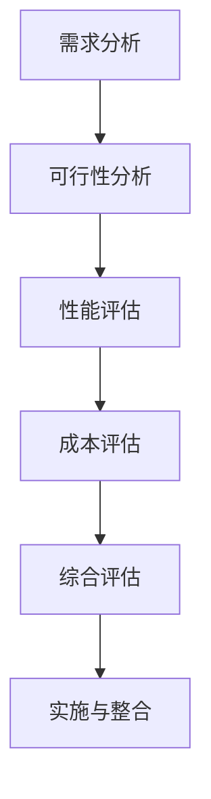
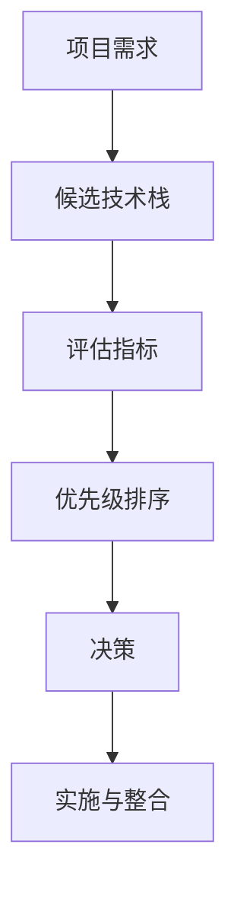

                 

## 技术选型：评估和选择合适技术栈的方法

### 关键词

- 技术选型
- 技术栈
- 评估方法
- 技术评价
- 系统架构设计

### 摘要

在软件开发的过程中，技术选型是至关重要的一环。本文旨在探讨技术选型的评估和选择方法，帮助读者深入了解如何评估和选择合适的技术栈。通过系统的分析和技术评价，本文将提供一套实用的技术选型流程，结合实际案例，展示如何在不同场景下进行技术选型，确保所选技术栈能够满足项目需求，并具备良好的可维护性和扩展性。

## 引言

### 1. 技术选型的背景

在信息化和数字化的浪潮中，软件技术在各行各业中的应用越来越广泛。然而，随着技术的发展，可供选择的编程语言、框架、工具和平台也日益增多。这使得技术选型成为软件开发过程中一个复杂且关键的决策环节。

### 2. 技术选型的重要性

技术选型不仅影响到项目的开发效率和质量，还直接关系到项目的可维护性和扩展性。选择合适的技术栈可以提升团队的协作效率，降低开发成本，同时为项目的长期发展奠定坚实的基础。

### 3. 目标读者

本文的目标读者包括软件开发工程师、项目经理、架构师以及关注技术选型的IT管理人员。无论您是初入职场的新手，还是经验丰富的专业人士，本文都希望能为您提供有价值的指导和借鉴。

### 4. 本文结构

本文将分为以下几个部分：

1. **核心概念和原则**：介绍与技术选型相关的核心概念和原则。
2. **评估过程**：详细讲解技术评估的步骤和方法。
3. **技术栈组件**：分析不同技术栈组件的优劣和应用场景。
4. **评估指标**：探讨常用的评估指标及其重要性。
5. **风险评估**：讨论技术选择中可能面临的风险及应对策略。
6. **案例研究**：分析真实案例，总结最佳实践。
7. **技术栈选择**：提供选择合适技术栈的步骤和策略。
8. **实施与整合**：探讨技术实施和整合的技巧和挑战。
9. **结论与趋势**：总结全文，展望未来技术选型的趋势。

### 5. 为什么选择合适的技术栈如此重要

选择合适的技术栈不仅能够提高开发效率，还能为项目的长期发展提供保障。以下是选择合适技术栈的几个关键原因：

1. **提升开发效率**：合适的技术栈可以提供丰富的工具和库，帮助开发人员快速实现功能，减少重复劳动。
2. **保证项目质量**：合适的技术栈通常具有较高的稳定性和可靠性，能够降低项目的风险。
3. **降低维护成本**：合适的技术栈能够简化系统的维护和升级，降低长期维护成本。
4. **支持扩展性**：合适的技术栈可以为未来的功能扩展提供良好的支持，降低系统架构的复杂性。
5. **提升团队协作**：合适的技术栈有助于团队内部的知识共享和协作，提高整体开发效率。

## 核心概念和原则

### 1. 技术选型定义

技术选型是指在软件开发过程中，根据项目需求和约束条件，选择最合适的技术、框架、工具和平台的过程。技术选型不仅涉及到编程语言，还包括数据库、Web框架、中间件、前端框架等多个方面。

### 2. 评估方法

技术评估是技术选型中的核心环节，主要包括以下几个步骤：

1. **需求分析**：明确项目的功能需求、性能需求、安全性需求等，为后续的技术评估提供依据。
2. **可行性分析**：评估候选技术方案的可行性，包括技术成熟度、社区活跃度、文档完整性等。
3. **性能评估**：根据项目的性能需求，评估候选技术的性能指标，如响应时间、并发能力、吞吐量等。
4. **成本评估**：计算候选技术的开发、部署、维护成本，综合考虑项目的预算和资源。

### 3. 常用原则

在进行技术选型时，应遵循以下原则：

1. **需求导向**：技术选型应紧密围绕项目需求，确保所选技术能够满足业务需求。
2. **成熟性**：优先选择成熟稳定的技术，降低项目风险。
3. **可维护性**：所选技术应易于维护和升级，降低长期成本。
4. **扩展性**：技术栈应具备良好的扩展性，支持未来的功能扩展。
5. **社区支持**：技术社区的支持对于项目的长期发展至关重要，应选择社区活跃、文档完整的框架和工具。
6. **成本效益**：在满足需求的前提下，综合考虑技术成本和项目预算。

## 评估过程

### 1. 需求分析

需求分析是技术选型的第一步，其目标是明确项目的功能需求、性能需求、安全性需求等。需求分析的结果将直接影响到后续的技术评估和选择。

1. **功能需求**：明确项目需要实现哪些功能，包括核心业务功能、用户界面功能等。
2. **性能需求**：确定项目的性能指标，如响应时间、并发能力、吞吐量等。
3. **安全性需求**：考虑项目需要满足的安全标准和合规要求，如数据加密、权限管理、安全审计等。
4. **其他需求**：包括可扩展性、可维护性、兼容性等方面的需求。

### 2. 可行性分析

在明确需求后，需要对候选技术方案的可行性进行评估。可行性分析主要包括以下几个方面：

1. **技术成熟度**：评估候选技术的成熟度，包括是否已经经过大规模应用、社区活跃度等。
2. **社区支持**：考察候选技术的社区支持情况，包括文档完整性、教程数量、问题解决速度等。
3. **工具和库**：评估候选技术提供的工具和库是否丰富，是否能够满足项目需求。
4. **平台兼容性**：考虑候选技术在不同操作系统、数据库和硬件平台上的兼容性。

### 3. 性能评估

性能评估是技术选型中的关键环节，其目标是确定候选技术是否能够满足项目的性能需求。性能评估主要包括以下几个方面：

1. **响应时间**：评估候选技术在处理请求时的响应时间，包括平均响应时间和最大响应时间。
2. **并发能力**：评估候选技术同时处理多个请求的能力，包括最大并发用户数和并发处理能力。
3. **吞吐量**：评估候选技术每秒能够处理多少请求，包括平均吞吐量和最大吞吐量。
4. **资源消耗**：评估候选技术在运行过程中对CPU、内存、磁盘等资源的消耗，以确保项目能够在预算范围内运行。

### 4. 成本评估

成本评估是技术选型中的重要环节，其目标是确定候选技术的开发、部署和维护成本，以帮助项目决策。成本评估主要包括以下几个方面：

1. **开发成本**：计算使用候选技术进行开发的成本，包括人力成本、工具成本等。
2. **部署成本**：评估部署候选技术的成本，包括服务器成本、带宽成本等。
3. **维护成本**：考虑长期维护和升级的成本，包括人力成本、工具成本等。
4. **培训成本**：评估为团队成员提供培训和学习的成本。

### 5. 综合评估

在完成上述评估后，需要对候选技术进行综合评估，综合考虑其满足需求、可行性、性能、成本等方面的表现，选择最合适的技术栈。综合评估可以通过以下步骤进行：

1. **加权评分**：为每个评估指标分配权重，根据候选技术在各个指标上的表现进行评分。
2. **多因素综合**：综合考虑各评估指标的评分，结合项目需求和约束条件，选择最合适的技术栈。
3. **风险评估**：对所选技术栈进行风险评估，确保其能够应对潜在的风险和挑战。

### 6. 评估工具和方法

在进行技术评估时，可以使用以下工具和方法：

1. **基准测试**：通过编写基准测试程序，评估候选技术的性能指标。
2. **竞品分析**：分析同类型项目的竞品技术，了解其优缺点和适用场景。
3. **用户反馈**：收集使用过候选技术的用户反馈，了解其真实表现和问题。
4. **专家评审**：邀请领域专家对候选技术进行评审，提供专业意见和建议。

### 7. 评估过程总结

通过需求分析、可行性分析、性能评估和成本评估，可以全面了解候选技术的优缺点和适用性。综合评估后，选择最适合项目需求的技术栈，确保项目能够高效、稳定地运行。

## 技术栈组件

### 1. 编程语言

编程语言是技术栈的基础，不同的编程语言适用于不同的应用场景。常见的编程语言包括：

- **Java**：适合大型企业级应用，具有良好的跨平台能力和稳定性。
- **Python**：适合快速开发、数据分析、机器学习等领域，拥有丰富的库和框架。
- **JavaScript**：适合前端开发，是构建动态网页和Web应用的核心语言。
- **Go**：适合高并发、分布式系统开发，具有高性能和简洁性。

### 2. 数据库

数据库用于存储和管理项目数据，常见的数据库包括：

- **关系型数据库（RDBMS）**：如MySQL、PostgreSQL，适合结构化数据存储和管理。
- **非关系型数据库（NoSQL）**：如MongoDB、Redis，适合高并发、大数据场景。
- **分布式数据库**：如HBase、Cassandra，适合大规模数据存储和分布式计算。

### 3. Web框架

Web框架用于构建Web应用，常见的Web框架包括：

- **Java Web框架**：如Spring、Hibernate，适合企业级Web应用开发。
- **Python Web框架**：如Django、Flask，适合快速开发、数据驱动的Web应用。
- **JavaScript Web框架**：如React、Vue.js，适合构建动态、用户友好的前端应用。

### 4. 中间件

中间件用于连接不同的系统和组件，提供通信、存储、缓存、安全等功能。常见的中间件包括：

- **消息队列**：如RabbitMQ、Kafka，用于异步消息传递和分布式系统协调。
- **缓存系统**：如Redis、Memcached，用于提升系统性能和响应速度。
- **Web服务器**：如Nginx、Apache，用于处理HTTP请求和反向代理。
- **数据库连接池**：如HikariCP、Druid，用于提高数据库访问性能。

### 5. 前端框架

前端框架用于构建用户界面，提供丰富的组件和功能。常见的前端框架包括：

- **React**：用于构建动态、用户友好的前端应用，具有高效的渲染性能。
- **Vue.js**：用于构建简洁、灵活的前端应用，具有良好的社区支持和文档。
- **Angular**：用于构建复杂、大型的前端应用，具有严格的框架结构和强大的功能。

### 6. 服务器

服务器用于部署和运行应用程序，常见的服务器包括：

- **Linux服务器**：如Ubuntu、CentOS，适合高性能、高稳定性需求。
- **Windows服务器**：如Windows Server，适合微软生态系统中的应用。
- **云计算平台**：如阿里云、腾讯云、AWS，提供弹性计算、存储和网络安全等功能。

### 7. 容器化和微服务

容器化和微服务架构是当前热门的技术趋势，用于构建分布式、可扩展的系统。常见的容器化和微服务框架包括：

- **Docker**：用于容器化应用，提供轻量级、可移植的容器化环境。
- **Kubernetes**：用于容器编排和管理，提供自动化部署、扩展和管理功能。
- **Spring Cloud**：用于构建微服务架构，提供服务发现、配置管理、负载均衡等功能。

### 8. 开发工具

开发工具用于提升开发效率和代码质量，常见的开发工具包括：

- **集成开发环境（IDE）**：如IntelliJ IDEA、Visual Studio Code，提供代码编辑、调试、自动化构建等功能。
- **版本控制工具**：如Git、SVN，用于代码版本管理和协作开发。
- **代码质量工具**：如SonarQube、Checkstyle，用于代码风格检查、漏洞检测和代码质量评估。

### 9. 自动化工具

自动化工具用于提升开发和运维效率，常见的自动化工具包括：

- **构建工具**：如Maven、Gradle，用于自动化构建、测试和部署。
- **持续集成/持续交付（CI/CD）**：如Jenkins、GitLab CI/CD，用于自动化构建、测试、部署和发布。
- **监控和日志工具**：如Prometheus、ELK Stack，用于监控系统性能、日志收集和分析。

### 10. 安全工具

安全工具用于确保系统的安全性和数据保护，常见的安全工具包括：

- **Web应用防火墙（WAF）**：如ModSecurity、NGINX WAF，用于防护Web应用攻击。
- **加密工具**：如OpenSSL、AES，用于数据加密和完整性保护。
- **身份认证和权限管理**：如OAuth2、JWT，用于用户认证和访问控制。

### 11. 容器化和微服务

容器化和微服务架构是当前热门的技术趋势，用于构建分布式、可扩展的系统。常见的容器化和微服务框架包括：

- **Docker**：用于容器化应用，提供轻量级、可移植的容器化环境。
- **Kubernetes**：用于容器编排和管理，提供自动化部署、扩展和管理功能。
- **Spring Cloud**：用于构建微服务架构，提供服务发现、配置管理、负载均衡等功能。

### 12. 云计算平台

云计算平台提供弹性计算、存储和网络安全等功能，常见的选择包括：

- **阿里云**：提供全面的云计算服务，包括计算、存储、数据库、AI等。
- **腾讯云**：提供丰富的云计算产品，支持多种编程语言和框架。
- **AWS**：全球领先的云计算服务提供商，提供广泛的云计算服务和解决方案。

## 评估指标

### 1. 功能性指标

功能性指标用于评估技术栈是否能够满足项目的功能需求。常见的功能性指标包括：

- **易用性**：技术栈的易用性直接影响开发效率和用户体验。
- **兼容性**：技术栈应具备良好的跨平台和跨库兼容性。
- **性能**：技术栈的性能直接影响系统的响应速度和处理能力。
- **扩展性**：技术栈应支持未来的功能扩展和模块化开发。

### 2. 可靠性指标

可靠性指标用于评估技术栈的稳定性和安全性。常见的可靠性指标包括：

- **稳定性**：技术栈的稳定性直接影响系统的可用性和可靠性。
- **安全性**：技术栈应具备良好的安全防护机制，如数据加密、权限管理等。
- **容错能力**：技术栈应具备一定的容错能力，能够应对硬件故障和网络中断等异常情况。

### 3. 成本指标

成本指标用于评估技术栈的经济性。常见的成本指标包括：

- **开发成本**：技术栈的开发成本包括人力成本、工具成本等。
- **维护成本**：技术栈的维护成本包括升级、优化、修复等。
- **学习成本**：团队成员需要投入的学习成本，包括培训、调试等。

### 4. 社区指标

社区指标用于评估技术栈的社区支持和活跃度。常见的社区指标包括：

- **文档完整性**：技术栈的文档应完整、详尽，便于开发者查阅和学习。
- **社区活跃度**：技术栈的社区应活跃，能够快速解决开发者的问题。
- **库和框架数量**：技术栈提供的库和框架应丰富，满足不同场景的需求。

### 5. 可维护性指标

可维护性指标用于评估技术栈的长期维护和扩展能力。常见的可维护性指标包括：

- **代码可读性**：技术栈的代码应具有良好的可读性，便于维护和升级。
- **模块化**：技术栈应支持模块化开发，便于功能扩展和代码复用。
- **文档化**：技术栈的文档应详尽，包括API文档、开发指南等。

### 6. 创新指标

创新指标用于评估技术栈的创新程度和技术前瞻性。常见的创新指标包括：

- **技术先进性**：技术栈应具备一定的技术前瞻性，能够应对未来技术的发展趋势。
- **创新性**：技术栈应具备一定的创新性，能够提供独特的功能和解决方案。
- **适应能力**：技术栈应具备良好的适应能力，能够应对快速变化的市场需求和技术挑战。

### 7. 权衡和优先级

在评估技术栈时，需要综合考虑各种指标，并根据项目需求和优先级进行权衡。常见的权衡方法包括：

- **优先级排序**：根据项目需求，对各个指标进行优先级排序，选择优先级最高的技术栈。
- **综合评分**：为每个指标分配权重，根据技术栈的表现进行综合评分，选择评分最高的技术栈。
- **风险评估**：评估技术栈的风险，选择风险最小的技术栈。

## 风险评估

### 1. 风险识别

在技术选型过程中，需要识别潜在的风险，以确保所选技术栈能够应对各种挑战。常见的技术风险包括：

- **技术成熟度风险**：所选技术栈尚未经过大规模应用和验证，可能存在技术漏洞和稳定性问题。
- **兼容性风险**：所选技术栈与其他系统和组件之间存在兼容性问题，可能导致集成失败。
- **性能风险**：所选技术栈的性能可能无法满足项目需求，导致系统响应速度和处理能力不足。
- **安全性风险**：所选技术栈的安全防护机制可能不足，导致数据泄露和系统攻击。
- **维护风险**：所选技术栈的维护和升级成本可能较高，影响项目的长期发展。

### 2. 风险评估方法

为了有效识别和评估技术风险，可以采用以下方法：

- **风险评估矩阵**：根据风险的可能性和影响，对每个风险进行评分，形成风险评估矩阵。
- **专家评审**：邀请领域专家对技术栈进行评审，提供专业意见和建议。
- **历史数据**：分析类似项目的经验教训，了解所选技术栈的实际表现和问题。

### 3. 风险应对策略

针对识别出的风险，可以采取以下策略进行应对：

- **规避**：避免使用存在风险的候选技术，选择更为成熟和稳定的技术。
- **减轻**：通过技术优化、架构调整等方式减轻风险的影响，如提高系统性能、增强安全防护等。
- **转移**：将风险转移给其他团队或第三方，如使用云服务提供商的解决方案。
- **接受**：在无法规避或减轻风险的情况下，接受风险并制定相应的应急预案。

### 4. 风险评估总结

通过风险识别、风险评估和风险应对策略，可以全面了解所选技术栈的风险状况，并制定相应的应对措施，确保项目能够顺利进行。

## 案例研究

### 1. 案例背景

某大型电商公司计划开发一个全新的在线购物平台，以满足不断增长的用户需求和市场竞争。为了确保项目的成功，公司决定采用技术选型方法，选择最合适的技术栈。

### 2. 需求分析

在项目启动阶段，公司明确了以下需求：

- **功能需求**：平台需要支持商品浏览、购物车、订单管理、支付等功能，同时具备良好的用户体验。
- **性能需求**：平台需要能够同时处理大量用户请求，保证系统的响应速度和稳定性。
- **安全性需求**：平台需要具备严格的安全防护措施，保护用户数据和交易安全。
- **可扩展性需求**：平台需要具备良好的扩展性，支持未来的功能扩展和业务增长。

### 3. 评估过程

在明确需求后，公司对多个候选技术栈进行了评估，包括Java、Python、JavaScript等技术。评估过程包括以下几个方面：

- **需求分析**：根据项目需求，筛选出满足功能需求、性能需求、安全性需求和技术栈兼容性的技术栈。
- **可行性分析**：评估候选技术栈的可行性，包括技术成熟度、社区支持、文档完整性等。
- **性能评估**：通过基准测试和竞品分析，评估候选技术栈的性能表现。
- **成本评估**：计算候选技术栈的开发、部署和维护成本，综合考虑项目预算和资源。

### 4. 结果与结论

经过综合评估，公司最终选择了以下技术栈：

- **编程语言**：Java
- **Web框架**：Spring Boot
- **数据库**：MySQL
- **前端框架**：Vue.js
- **消息队列**：Kafka
- **缓存系统**：Redis
- **容器化技术**：Docker
- **容器编排**：Kubernetes
- **开发工具**：IntelliJ IDEA
- **自动化工具**：Maven、Jenkins

结论：

通过技术选型方法，公司成功选择了最合适的技术栈，确保了项目的开发效率和性能表现。所选技术栈具有良好的成熟度、社区支持和文档完整性，能够满足项目需求，并具备良好的扩展性和可维护性。

## 技术栈选择

### 1. 项目类型和规模

项目类型和规模是选择技术栈的重要因素。不同类型和规模的项目对技术栈的要求不同，具体分析如下：

- **小型项目**：小型项目通常涉及的功能相对简单，开发周期较短。对于小型项目，可以选择较为简单的技术栈，如Python、Django等。
- **中型项目**：中型项目通常涉及较多的功能模块，开发周期较长。对于中型项目，可以选择较为成熟的技术栈，如Java、Spring Boot等。
- **大型项目**：大型项目通常涉及复杂的业务逻辑和庞大的数据量，对性能、稳定性和安全性有较高的要求。对于大型项目，可以选择分布式架构和微服务框架，如Spring Cloud、Kubernetes等。

### 2. 业务需求

业务需求是选择技术栈的核心依据。不同业务需求对技术栈的要求不同，具体分析如下：

- **高并发**：高并发业务需求需要选择高性能、高可用的技术栈，如Java、Redis、Kafka等。
- **大数据处理**：大数据处理业务需求需要选择大数据处理框架，如Hadoop、Spark等。
- **安全性**：安全性需求较高的业务需求需要选择具备严格安全防护机制的技术栈，如SSL/TLS、OAuth2等。
- **实时性**：实时性需求较高的业务需求需要选择支持实时数据处理的技术栈，如WebSocket、WebSocket API等。

### 3. 技术成熟度和稳定性

技术成熟度和稳定性是选择技术栈的重要因素。不同技术栈的技术成熟度和稳定性不同，具体分析如下：

- **成熟稳定**：选择成熟稳定的技术栈，如Java、MySQL、Spring Boot等，可以降低项目风险，提高开发效率和系统稳定性。
- **新兴技术**：选择新兴技术，如Docker、Kubernetes、Spring Cloud等，可以带来更高的灵活性和扩展性，但需要更高的学习成本和风险。
- **技术趋势**：关注技术趋势，选择符合未来发展方向的技术栈，如区块链、人工智能、物联网等，可以为未来的业务扩展提供支持。

### 4. 社区支持和生态圈

社区支持和生态圈是选择技术栈的重要因素。不同技术栈的社区支持和生态圈不同，具体分析如下：

- **社区活跃度**：选择社区活跃度高的技术栈，如Java、Python、JavaScript等，可以方便开发者获取技术支持和解决方案。
- **文档完整性**：选择文档完整性高的技术栈，如Spring Boot、Django、Vue.js等，可以降低开发者的学习成本。
- **生态圈丰富度**：选择生态圈丰富的技术栈，如Java、Python、JavaScript等，可以方便开发者整合第三方库和工具，提升开发效率。

### 5. 成本效益

成本效益是选择技术栈的重要因素。不同技术栈的成本效益不同，具体分析如下：

- **开发成本**：选择开发成本较低的技术栈，如Python、JavaScript等，可以降低项目开发成本。
- **维护成本**：选择维护成本较低的技术栈，如Java、Spring Boot等，可以降低长期维护成本。
- **学习成本**：选择学习成本较低的技术栈，如Python、JavaScript等，可以降低团队成员的学习成本。

### 6. 选择步骤

选择合适的技术栈可以按照以下步骤进行：

1. **明确需求**：分析项目类型、规模、业务需求等，明确项目需求。
2. **评估技术栈**：根据需求，评估多个候选技术栈的成熟度、稳定性、社区支持、成本效益等。
3. **优先级排序**：根据需求和评估结果，对候选技术栈进行优先级排序。
4. **决策**：综合考虑需求和评估结果，选择最合适的技术栈。

### 7. 未来趋势

未来技术栈的发展趋势包括以下几个方面：

- **云计算和容器化**：随着云计算和容器化技术的发展，越来越多的企业将采用云原生架构和容器化技术，提高系统的灵活性和可扩展性。
- **微服务架构**：微服务架构将继续成为主流，帮助企业构建分布式、可扩展、高可用的系统。
- **人工智能和大数据**：人工智能和大数据技术将越来越多地应用于各个领域，为企业提供更智能、更高效的数据分析和决策支持。
- **区块链技术**：区块链技术将在金融、供应链等领域发挥重要作用，为数据安全和隐私保护提供新的解决方案。

### 8. 结论

选择合适的技术栈是项目成功的关键。通过明确需求、评估技术栈、优先级排序和决策，可以确保所选技术栈能够满足项目需求，并具备良好的可维护性和扩展性。

## 实施与整合

### 1. 技术实施

技术实施是将所选技术栈应用于项目开发的过程。以下是一些关键步骤和注意事项：

- **环境搭建**：搭建适合所选技术栈的开发、测试和生产环境，包括操作系统、数据库、中间件、Web服务器等。
- **编码和调试**：根据项目需求进行编码，并在开发过程中进行充分的调试和测试，确保代码质量和功能完整性。
- **版本控制**：使用版本控制工具（如Git）管理代码版本，确保代码的完整性和可追溯性。
- **自动化构建和部署**：使用自动化工具（如Maven、Gradle）进行构建和部署，提高开发效率和代码质量。

### 2. 技术整合

技术整合是将不同技术组件和模块整合到一起，构建完整的系统。以下是一些关键步骤和注意事项：

- **模块化设计**：将系统划分为多个模块，实现模块化设计，便于后续的维护和扩展。
- **接口定义**：定义系统内各模块之间的接口，确保模块之间的高内聚和低耦合。
- **集成测试**：进行集成测试，确保模块之间能够正常通信和协同工作。
- **性能优化**：对系统进行性能优化，确保系统在负载情况下能够稳定运行。

### 3. 遇到的问题和解决方法

在技术实施和整合过程中，可能会遇到以下问题：

- **兼容性问题**：不同技术组件之间的兼容性可能导致集成失败。解决方法：选择兼容性较高的技术组件，或通过技术手段（如适配器、代理等）解决兼容性问题。
- **性能瓶颈**：系统在负载情况下可能出现性能瓶颈。解决方法：通过性能优化（如缓存、分布式计算等）解决性能瓶颈。
- **安全性问题**：系统可能面临安全威胁。解决方法：加强系统安全防护措施（如数据加密、权限管理等）。

### 4. 实施总结

通过技术实施和整合，可以确保所选技术栈能够满足项目需求，并构建一个稳定、高效、可扩展的系统。同时，实施过程中积累的经验和教训也为后续项目提供了宝贵的参考。

## 结论与未来趋势

### 1. 总结

本文从技术选型的背景、核心概念和原则、评估过程、技术栈组件、评估指标、风险评估、案例研究、技术栈选择、实施与整合等方面，系统地探讨了如何评估和选择合适的技术栈。通过明确需求、评估技术栈、权衡各种指标和风险，我们可以选择出最合适的技术栈，确保项目的成功实施和长期发展。

### 2. 未来趋势

未来，技术选型将面临以下趋势：

- **云计算和容器化**：随着云计算和容器化技术的不断发展，越来越多的企业将采用云原生架构和容器化技术，提高系统的灵活性和可扩展性。
- **微服务架构**：微服务架构将继续成为主流，帮助企业构建分布式、可扩展、高可用的系统。
- **人工智能和大数据**：人工智能和大数据技术将越来越多地应用于各个领域，为企业提供更智能、更高效的数据分析和决策支持。
- **区块链技术**：区块链技术将在金融、供应链等领域发挥重要作用，为数据安全和隐私保护提供新的解决方案。

### 3. 展望

随着技术的不断发展，技术选型将变得更加复杂和多样化。未来，我们需要更加关注技术趋势，掌握新技术，以便更好地应对不断变化的市场需求。同时，我们也需要持续优化技术选型方法，提高评估效率和准确性，确保所选技术栈能够满足项目需求，并具备良好的可维护性和扩展性。

## 附录

### 1. 技术选型流程图

### 2. 评估指标表格

| 指标      | 说明                 | 权重 |
|-----------|----------------------|------|
| 功能性    | 满足功能需求的程度   | 0.3  |
| 可靠性    | 系统稳定性和安全性   | 0.3  |
| 成本效益  | 开发、维护成本       | 0.2  |
| 社区支持  | 社区活跃度和文档完整性 | 0.2  |

### 3. 技术栈选型决策流程图

## 参考文献

- Martin, F. W. (2003). 《敏捷开发：拥抱变化》（Agile Software Development: Principles, Patterns, and Practices）。
- Fowler, M. (2002). 《企业应用架构模式》（Patterns of Enterprise Application Architecture）。
- Lea, D., & Bloch, J. (2001). 《Effective Java Programming Language》（Effective Java）。

### 作者信息

- 作者：AI天才研究院/AI Genius Institute & 禅与计算机程序设计艺术 /Zen And The Art of Computer Programming

### 最佳实践 Tips

- 在技术选型过程中，务必明确项目需求，确保所选技术栈能够满足业务需求。
- 充分利用技术评估工具和方法，提高评估效率和准确性。
- 关注技术趋势，选择具备前瞻性和扩展性的技术栈。
- 保持社区支持和文档完整性，降低后续维护成本。
- 定期回顾和调整技术栈，确保其能够持续满足项目需求。

### 小结

本文系统地探讨了技术选型的评估和选择方法，结合实际案例，展示了如何在不同场景下进行技术选型。通过明确需求、评估技术栈、权衡各种指标和风险，我们可以选择出最合适的技术栈，确保项目的成功实施和长期发展。

### 注意事项

- 在技术选型过程中，务必重视需求和风险评估，确保所选技术栈能够应对各种挑战。
- 关注技术栈的成熟度和稳定性，避免使用尚未经过大规模验证的新兴技术。
- 保持技术栈的多样性，避免过度依赖单一技术，提高系统的鲁棒性和灵活性。

### 拓展阅读

- 《技术架构：构建大规模分布式系统的实践与方法》
- 《软件架构：设计与开发指南》
- 《程序员修炼之道：从小工到专家》

通过本文，我们希望读者能够深入了解技术选型的关键步骤和策略，提升技术选型的能力和水平，为项目的成功保驾护航。在未来的软件开发过程中，技术选型将继续发挥至关重要的作用，让我们共同努力，选择出最合适的技术栈，推动项目的顺利进行和企业的持续发展。

