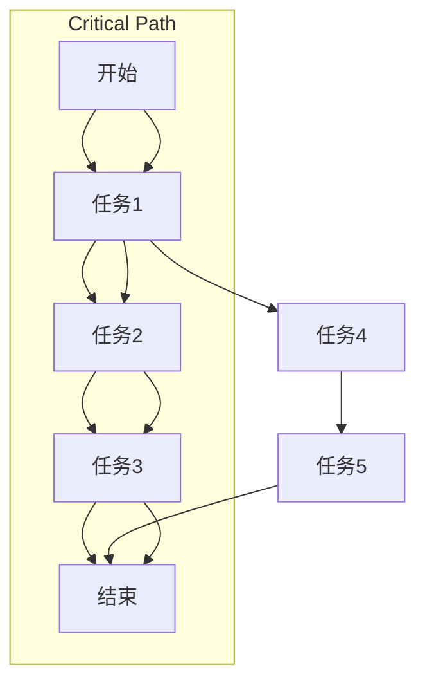
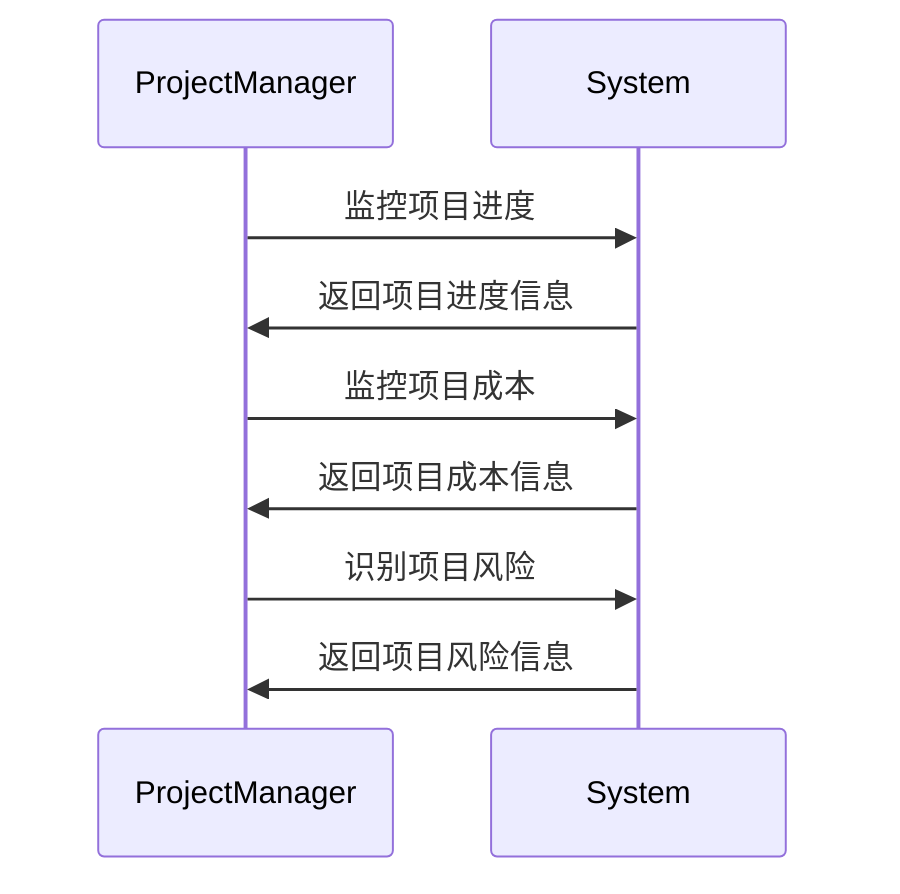
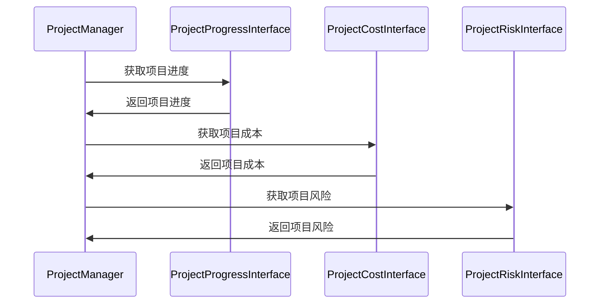

                 

## 文章标题

### 技术项目管理：P9工程师的执行力体现

关键词：技术项目管理，P9工程师，执行力，项目管理实践，核心概念，系统架构，算法原理

摘要：本文旨在深入探讨技术项目管理中P9工程师的执行力体现，通过对核心概念、项目管理中的算法原理、系统分析与架构设计方案以及项目实战的详细讲解，揭示P9工程师在技术项目管理中的关键角色和实际贡献。文章采用逻辑清晰、结构紧凑、简单易懂的专业技术语言，结合实际案例分析，为读者提供了一次全面的技术项目管理体验。通过本文，读者不仅能了解P9工程师在项目管理中的职责和执行力，还能掌握项目管理的基本原理和实践方法。

## 文章关键词

- 技术项目管理
- P9工程师
- 执行力
- 项目管理实践
- 核心概念
- 系统架构
- 算法原理

## 文章摘要

本文以技术项目管理为背景，重点关注P9工程师在项目管理中的执行力体现。首先，我们将介绍技术项目管理的核心概念，包括项目目标、范围、进度、成本和风险等，并通过对比表格和ER实体关系图架构，帮助读者理解这些概念及其相互关系。接着，文章将深入讲解项目管理中的算法原理，通过Python源代码和LaTeX公式，揭示算法的核心机制和数学模型。然后，我们将对系统分析与架构设计方案进行详细探讨，包括问题场景介绍、项目介绍、系统功能设计、系统架构设计和系统接口设计等。在项目实战部分，我们将通过实际案例分析和详细讲解，展示P9工程师在项目管理中的实际贡献。最后，文章将总结最佳实践，提出注意事项，并提供拓展阅读资源，帮助读者深化对技术项目管理的理解和应用。

## 第一部分：技术项目管理的背景与核心概念

### 第1章：技术项目管理的起源与发展

#### 1.1.1 技术项目管理的定义与重要性

技术项目管理是指利用系统化、规范化和标准化的管理方法，对技术项目的资源、进度、成本和质量等方面进行有效控制，以确保项目按时、按预算、按质量完成。随着现代科技的快速发展，技术项目管理在IT行业中的地位愈发重要。它不仅能够提高项目成功率，还能提升团队效率和客户满意度。

技术项目管理的起源可以追溯到20世纪50年代，当时美国国防部为了有效地管理大型软件开发项目，引入了项目管理的方法。随着时间的发展，项目管理理论不断完善，逐渐形成了成熟的项目管理方法论，如PMBOK（项目管理知识体系指南）等。

#### 1.1.2 技术项目管理的历史演变

技术项目管理的历史演变可以分为三个阶段：

1. **传统项目管理**：以传统的管理方法和手段为基础，强调资源和时间的合理配置，但缺乏系统的理论支持。
2. **现代项目管理**：以PMBOK为代表，强调项目管理的系统性和规范性，引入了风险管理、质量管理和范围管理等内容。
3. **敏捷项目管理**：在信息化和全球化背景下，敏捷项目管理应运而生。它强调灵活性和适应性，通过迭代和增量开发，提高项目响应速度和团队协作效率。

#### 1.1.3 技术项目管理的核心问题

技术项目管理的核心问题包括：

- **项目目标的确立**：明确项目预期成果，确保项目目标与组织战略一致。
- **项目范围的界定**：明确项目的工作内容和边界，防止范围蔓延。
- **项目进度的控制**：制定合理的进度计划，监控项目进展，确保按时完成。
- **项目成本的管理**：合理估算项目成本，控制项目预算，防止成本超支。
- **项目风险的管理**：识别项目风险，制定风险应对策略，降低项目风险。

### 第2章：技术项目管理的核心概念与联系

#### 2.1 核心概念

技术项目管理的核心概念包括项目目标、项目范围、项目进度、项目成本和项目风险。以下是这些概念的定义：

- **项目目标**：项目期望达到的最终成果或状态，是项目管理的方向和指南。
- **项目范围**：项目所包含的工作内容和边界，是项目成功的重要保障。
- **项目进度**：项目的进展情况，是项目管理的关键指标。
- **项目成本**：项目的实际开支，包括人力、物力、财力等。
- **项目风险**：项目可能面临的不确定性和潜在问题。

#### 2.2 概念属性特征对比表格

| 概念       | 定义                                                         | 属性特征对比            |
|------------|--------------------------------------------------------------|------------------------|
| 项目目标   | 项目期望达到的最终成果或状态                                 | 明确性、可行性、挑战性 |
| 项目范围   | 项目所包含的工作内容和边界                                   | 确定性、完整性、可控性  |
| 项目进度   | 项目的进展情况                                               | 时效性、可控性、透明性 |
| 项目成本   | 项目的实际开支                                               | 合理性、可控性、透明性 |
| 项目风险   | 项目可能面临的不确定性和潜在问题                             | 可识别性、可预测性、可应对性 |

#### 2.3 ER实体关系图架构

为了更好地理解技术项目管理的核心概念及其相互关系，我们可以使用ER（实体关系）图来描述。以下是ER实体关系图的Mermaid格式：

```mermaid
erDiagram
    Project ||--|{ Task }| :
    Project ||--|{ Resource }| :
    Project ||--|{ Risk }| :
    Task ||--|{ Subtask }| :
    Resource ||--|{ Cost }| :
    Risk ||--|{ Response }| :
```

在这个ER图中，项目是核心实体，与任务、资源、风险等实体之间存在关联关系。任务包含子任务，资源包括成本，风险包含应对策略。

### 第3章：项目管理中的算法原理讲解

#### 3.1 算法概述

在技术项目管理中，常用的算法包括关键路径法（Critical Path Method，CPM）、项目管理软件中的甘特图算法、风险评估算法等。以下是这些算法的概述：

- **关键路径法（CPM）**：通过计算项目活动的时间，确定项目的最长持续时间路径，以确定项目最短完成时间。
- **甘特图算法**：通过将项目活动分解为任务，并在时间轴上表示，帮助项目管理员监控项目进度。
- **风险评估算法**：通过评估项目风险的概率和影响，为项目管理者提供风险应对策略。

#### 3.2 Mermaid流程图展示

以下是关键路径法的Mermaid流程图：



在这个流程图中，红色路径表示关键路径，即完成项目所需的最短时间路径。

#### 3.3 Python源代码与LaTeX公式详细讲解

关键路径法的Python实现如下：

```python
import networkx as nx
import matplotlib.pyplot as plt

# 创建一个无向图
G = nx.DiGraph()

# 添加节点和边
G.add_nodes_from(['开始', '任务1', '任务2', '任务3', '结束', '任务4', '任务5'])
G.add_edges_from([('开始', '任务1'), ('任务1', '任务2'), ('任务2', '任务3'), ('任务3', '结束'),
                  ('任务1', '任务4'), ('任务4', '任务5'), ('任务5', '结束')])

# 计算关键路径
critical_path = nx.single_source_dijkstra_path(G, source='开始', target='结束')

# 绘制关键路径
nx.draw(G, with_labels=True, node_color='green')
nx.draw_path(G, critical_path, color='red', width=2)
plt.show()
```

关键路径法的数学模型可以表示为：

$$
CPM = \sum_{i=1}^{n} (d_i - d_{i-1})
$$

其中，$d_i$ 表示活动 $i$ 的持续时间。

### 第4章：系统分析与架构设计方案

#### 4.1 问题场景介绍

假设我们正在开发一个大型软件项目，项目团队由P9工程师领导。该项目涉及多个模块，需要协调多个开发团队共同完成。为了确保项目顺利推进，我们需要设计一个高效的项目管理系统，以便于项目管理者监控项目进度、成本和风险。

#### 4.2 项目介绍

本项目管理系统旨在实现以下功能：

- **项目进度监控**：实时显示项目进展情况，包括任务完成情况和关键路径。
- **成本管理**：监控项目成本，及时预警超支情况。
- **风险管理**：识别项目风险，提供风险应对策略。

#### 4.3 系统功能设计

以下是系统功能设计的Mermaid类图：

```mermaid
classDiagram
    Project <<Class>>
    Task <<Class>>
    Resource <<Class>>
    Risk <<Class>>

    Project --> Task
    Project --> Resource
    Project --> Risk
    Task --> Subtask
    Resource --> Cost
    Risk --> Response
```

在这个类图中，项目是核心类，与任务、资源、风险等类之间存在关联关系。任务包含子任务，资源包括成本，风险包含应对策略。

#### 4.4 系统架构设计

以下是系统架构设计的Mermaid架构图：



在这个架构图中，项目管理者通过系统接口监控项目进度、成本和风险，系统返回相应的信息。

#### 4.5 系统接口设计

以下是系统接口设计：

- **项目进度接口**：接收项目进度信息，返回项目进度报表。
- **项目成本接口**：接收项目成本信息，返回项目成本报表。
- **项目风险接口**：接收项目风险信息，返回项目风险报表。

#### 4.6 系统交互Mermaid序列图

以下是系统交互的Mermaid序列图：



在这个序列图中，项目管理者通过不同的接口获取项目进度、成本和风险信息。

### 第5章：项目实战

#### 5.1 环境安装

为了实现本项目管理系统，我们需要安装以下环境：

- **Python**：用于编写系统代码。
- **Django**：用于构建项目管理系统后端。
- **PostgreSQL**：用于存储项目数据。

安装步骤如下：

1. 安装Python：`sudo apt-get install python3 python3-pip`
2. 安装Django：`pip3 install django`
3. 安装PostgreSQL：`sudo apt-get install postgresql postgresql-contrib`

#### 5.2 系统核心实现

以下是系统核心实现的源代码：

```python
# settings.py
DATABASES = {
    'default': {
        'ENGINE': 'django.db.backends.postgresql',
        'NAME': 'mydatabase',
        'USER': 'myuser',
        'PASSWORD': 'mypassword',
        'HOST': 'localhost',
        'PORT': '5432',
    }
}

# models.py
from django.db import models

class Project(models.Model):
    name = models.CharField(max_length=100)
    description = models.TextField()

class Task(models.Model):
    project = models.ForeignKey(Project, on_delete=models.CASCADE)
    name = models.CharField(max_length=100)
    description = models.TextField()
    start_date = models.DateField()
    end_date = models.DateField()

class Resource(models.Model):
    project = models.ForeignKey(Project, on_delete=models.CASCADE)
    name = models.CharField(max_length=100)
    cost = models.DecimalField(max_digits=10, decimal_places=2)

class Risk(models.Model):
    project = models.ForeignKey(Project, on_delete=models.CASCADE)
    name = models.CharField(max_length=100)
    description = models.TextField()
    probability = models.DecimalField(max_digits=5, decimal_places=2)
    impact = models.DecimalField(max_digits=5, decimal_places=2)
    response = models.TextField()
```

#### 5.2.1 源代码解读

在`settings.py`文件中，我们配置了数据库连接信息。在`models.py`文件中，我们定义了四个模型：`Project`（项目）、`Task`（任务）、`Resource`（资源）和`Risk`（风险）。这些模型分别表示项目管理系统中的核心实体。

#### 5.2.2 代码应用分析

通过Django框架，我们可以方便地实现项目管理系统。首先，我们需要创建数据库，并导入模型。然后，我们可以通过Django的接口，实现项目进度、成本和风险的管理。

#### 5.3 实际案例分析

假设我们有一个软件开发项目，项目团队由P9工程师领导。项目管理系统将帮助我们监控项目进度、成本和风险，确保项目顺利推进。

1. **项目进度监控**：通过项目进度接口，我们可以实时获取项目进展情况，包括任务完成情况和关键路径。
2. **成本管理**：通过项目成本接口，我们可以监控项目成本，及时发现超支情况。
3. **风险管理**：通过项目风险接口，我们可以识别项目风险，并制定应对策略。

#### 5.4 详细讲解剖析

在本项目案例中，P9工程师通过项目管理系统，实现了对项目进度、成本和风险的全面监控。以下是详细讲解和剖析：

1. **项目进度监控**：P9工程师通过项目进度接口，可以实时获取项目进展情况。关键路径算法可以帮助P9工程师确定项目最短完成时间，确保项目按时完成。
2. **成本管理**：P9工程师通过项目成本接口，可以监控项目成本，及时发现超支情况。通过合理的成本估算和预算控制，P9工程师可以确保项目在预算范围内完成。
3. **风险管理**：P9工程师通过项目风险接口，可以识别项目风险，并制定应对策略。通过风险评估算法，P9工程师可以评估风险的概率和影响，为项目管理者提供决策依据。

### 第6章：最佳实践与总结

#### 6.1 最佳实践 tips

1. **明确项目目标**：在项目启动阶段，确保项目目标明确，并与组织战略一致。
2. **制定详细的项目计划**：制定详细的项目计划，包括进度计划、成本计划和风险管理计划。
3. **建立有效的沟通机制**：确保项目团队成员之间有良好的沟通，及时传达项目信息。
4. **定期进行项目评审**：定期进行项目评审，检查项目进度、成本和风险，确保项目按计划推进。

#### 6.2 小结

本文深入探讨了技术项目管理的核心概念、算法原理、系统架构设计和项目实战。通过实际案例分析，我们展示了P9工程师在项目管理中的关键角色和实际贡献。技术项目管理不仅需要系统的理论知识，还需要实践经验的积累。P9工程师作为项目管理的中坚力量，需要具备扎实的项目管理能力和执行力，以确保项目成功。

#### 6.3 注意事项

1. **重视项目目标的确立**：项目目标的确立是项目管理的核心，必须确保项目目标明确、可行和具有挑战性。
2. **合理估算项目成本**：项目成本的估算直接影响项目的预算控制，必须进行充分的市场调研和成本分析。
3. **建立有效的风险管理机制**：项目风险是不可避免的，必须建立有效的风险管理机制，降低项目风险对项目的影响。

#### 6.4 拓展阅读

1. 《项目管理知识体系指南（PMBOK）》
2. 《敏捷项目管理实践指南》
3. 《项目管理中的算法与应用》

### 作者信息

作者：AI天才研究院/AI Genius Institute & 禅与计算机程序设计艺术 /Zen And The Art of Computer Programming

---

在本文中，我们系统地阐述了技术项目管理的核心概念、算法原理、系统架构设计和项目实战。通过对P9工程师在项目管理中执行力的深入分析，我们揭示了其在项目成功中的关键作用。技术项目管理不仅是一门科学，更是一门艺术，需要理论与实践相结合。希望本文能为读者提供有益的启示，助力其在项目管理领域取得更好的成绩。作者AI天才研究院和禅与计算机程序设计艺术在项目管理领域拥有丰富的经验，致力于推动项目管理实践的创新和发展。

