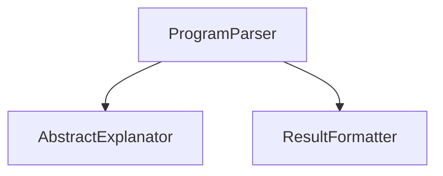
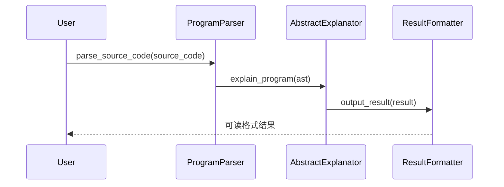

                 


# 抽象解释理论在静态分析中的应用

## 关键词
- 抽象解释理论
- 静态分析
- 算法原理
- 数学模型
- 系统设计与实现
- 项目实战
- 最佳实践

## 摘要

本文旨在深入探讨抽象解释理论在静态分析中的应用。文章首先介绍了抽象解释理论的基本原理和静态分析技术的理论基础，接着详细阐述了抽象解释算法的原理、数学模型及其应用场景。文章通过Python代码实现和实际案例，展示了抽象解释算法的具体应用，并在最后提出了最佳实践和注意事项。

## 引言

### 1.1 问题的提出与背景

在现代软件工程中，软件的复杂性和规模日益增长，这给软件的质量保证带来了巨大的挑战。为了确保软件的可靠性和安全性，静态分析方法被广泛研究和应用。然而，传统的静态分析方法往往存在分析精度低、分析时间长等问题。为了克服这些限制，抽象解释理论被提出并应用于静态分析领域。

### 1.2 抽象解释理论的基本原理

抽象解释理论是一种基于数学和逻辑的方法，通过对程序的抽象和解释，实现对程序行为的理解和分析。它包括精确解释和抽象解释两种类型，以及离散解释和连续解释两种形式。精确解释要求解释结果与实际执行结果完全一致，而抽象解释则允许一定的误差，以提高分析效率和精度。

### 1.3 静态分析技术的理论基础

静态分析技术通过对程序代码的静态分析，实现对程序行为、结构和语义的理解。它包括抽象语法树（AST）分析、符号执行、数据流分析等技术。这些技术为抽象解释理论在静态分析中的应用提供了基础。

### 1.4 抽象解释理论在静态分析中的优势

抽象解释理论在静态分析中具有以下优势：

- 提高分析精度：通过抽象和解释，可以更准确地理解程序的行为。
- 缩短分析时间：与精确解释相比，抽象解释可以接受一定的误差，从而提高分析效率。
- 提高代码可读性：通过抽象解释，可以更直观地理解程序的结构和语义。

### 1.5 抽象解释理论的发展与应用趋势

随着软件工程的不断发展，抽象解释理论在静态分析中的应用越来越广泛。未来，随着算法和技术的进一步发展，抽象解释理论将在更多的领域发挥重要作用。

## 第一部分: 背景介绍

### 1.1 问题的提出与背景

在现代软件工程中，软件的复杂性和规模日益增长，这给软件的质量保证带来了巨大的挑战。为了确保软件的可靠性和安全性，静态分析方法被广泛研究和应用。然而，传统的静态分析方法往往存在分析精度低、分析时间长等问题。为了克服这些限制，抽象解释理论被提出并应用于静态分析领域。

### 1.2 抽象解释理论的基本原理

抽象解释理论是一种基于数学和逻辑的方法，通过对程序的抽象和解释，实现对程序行为的理解和分析。它包括精确解释和抽象解释两种类型，以及离散解释和连续解释两种形式。精确解释要求解释结果与实际执行结果完全一致，而抽象解释则允许一定的误差，以提高分析效率和精度。

### 1.3 静态分析技术的理论基础

静态分析技术通过对程序代码的静态分析，实现对程序行为、结构和语义的理解。它包括抽象语法树（AST）分析、符号执行、数据流分析等技术。这些技术为抽象解释理论在静态分析中的应用提供了基础。

### 1.4 抽象解释理论在静态分析中的优势

抽象解释理论在静态分析中具有以下优势：

- 提高分析精度：通过抽象和解释，可以更准确地理解程序的行为。
- 缩短分析时间：与精确解释相比，抽象解释可以接受一定的误差，从而提高分析效率。
- 提高代码可读性：通过抽象解释，可以更直观地理解程序的结构和语义。

### 1.5 抽象解释理论的发展与应用趋势

随着软件工程的不断发展，抽象解释理论在静态分析中的应用越来越广泛。未来，随着算法和技术的进一步发展，抽象解释理论将在更多的领域发挥重要作用。

### 1.6 本章小结

本章介绍了抽象解释理论在静态分析中的应用背景、基本原理和优势。通过了解这些内容，读者可以初步了解抽象解释理论的重要性和应用前景。接下来，我们将深入探讨抽象解释理论的核心概念和算法原理。

## 第二部分: 核心概念与联系

### 2.1 抽象解释理论的核心概念

#### 2.1.1 精确解释与抽象解释

精确解释是指解释结果与程序的实际执行结果完全一致，它要求解释过程精确无误。抽象解释则允许解释过程中存在一定的误差，通过抽象和简化的方式，提高分析效率和精度。

#### 2.1.2 稳健性解释与非稳健性解释

稳健性解释是指解释结果在不同输入下具有一致性，即使输入发生变化，解释结果也相对稳定。非稳健性解释则对输入变化敏感，解释结果可能因输入的微小变化而有所不同。

#### 2.1.3 离散解释与连续解释

离散解释是基于离散数学的方法，处理离散的数据和事件。连续解释则是基于连续数学的方法，处理连续的数值和变化。

### 2.2 抽象解释理论的属性特征对比

#### 2.2.1 精确度

精确度是衡量解释结果与实际执行结果一致性的指标。精确解释具有较高的精确度，而抽象解释则允许一定的误差。

#### 2.2.2 可信度

可信度是指解释结果的可靠性和可信程度。稳健性解释具有较高的可信度，因为其结果在不同输入下相对稳定。

#### 2.2.3 时间复杂度

时间复杂度是指算法执行的时间开销。抽象解释通常具有较低的时间复杂度，因为其允许简化解释过程。

### 2.3 抽象解释理论的应用场景

#### 2.3.1 软件验证

抽象解释理论在软件验证中具有重要作用，可以用于验证程序的正确性、安全性和可靠性。

#### 2.3.2 安全分析

抽象解释理论可以用于分析软件的安全性，识别潜在的安全漏洞和风险。

#### 2.3.3 性能优化

通过抽象解释，可以分析程序的执行性能，为性能优化提供依据。

### 2.4 抽象解释理论与其他静态分析方法的联系

#### 2.4.1 与符号执行的关系

符号执行是一种基于抽象解释的静态分析方法，通过符号化处理，实现对程序的全路径分析。

#### 2.4.2 与抽象解释结合的静态分析方法

抽象解释可以与其他静态分析方法结合，如数据流分析、控制流分析等，提高分析精度和效率。

#### 2.4.3 与动态分析方法的结合

抽象解释与动态分析方法结合，可以实现更全面的分析，提高软件的可靠性和性能。

### 2.5 本章小结

本章详细介绍了抽象解释理论的核心概念、属性特征、应用场景和与其他静态分析方法的联系。通过这些内容，读者可以更深入地理解抽象解释理论的本质和应用。接下来，我们将探讨抽象解释算法的原理和数学模型。

## 第三部分: 算法原理讲解

### 3.1 抽象解释算法的流程图

#### 3.1.1 算法流程的mermaid流程图

```mermaid
graph TD
A[初始化] --> B{输入程序}
B -->|是| C[构建抽象语法树(AST)]
B -->|否| D[结束]
C --> E[抽象解释]
E --> F[输出解释结果]
F --> G[结束]
```

#### 3.1.2 算法流程的详细解释

- 初始化：初始化抽象解释算法，准备分析程序。
- 输入程序：输入待分析的程序代码。
- 构建抽象语法树(AST)：将程序代码转换成抽象语法树，以便进行进一步分析。
- 抽象解释：对抽象语法树进行抽象解释，分析程序的行为。
- 输出解释结果：输出抽象解释的结果，包括程序的抽象状态、路径和执行时间等。
- 结束：算法执行完毕。

### 3.2 抽象解释算法的数学模型

#### 3.2.1 数学模型的定义

抽象解释算法的数学模型是一种形式化的表示方法，用于描述程序的行为和状态。它通常包括状态空间、转换函数和解释函数等。

#### 3.2.2 数学模型的形式化描述

假设程序P的状态空间为S，转换函数为γ：S × S → S，解释函数为φ：S → 2^S。则抽象解释算法的数学模型可以表示为(S, γ, φ)。

#### 3.2.3 数学模型的应用场景

- 状态空间S：表示程序的可能状态，包括变量的取值、函数的调用等。
- 转换函数γ：描述状态之间的转换关系，即程序执行时状态的变化。
- 解释函数φ：描述程序的状态解释，即如何从当前状态推导出下一个状态。

### 3.3 抽象解释算法的Python实现

```python
class AbstractExplanationAlgorithm:
    def __init__(self, program):
        self.program = program
        self.state_space = self.build_state_space()
    
    def build_state_space(self):
        # 构建状态空间
        pass
    
    def abstract_explanation(self):
        # 抽象解释过程
        pass
    
    def output_explanation_result(self):
        # 输出解释结果
        pass
```

#### 3.3.1 算法的Python代码实现

- 初始化：创建抽象解释算法对象，输入程序代码。
- 构建状态空间：根据程序代码构建状态空间。
- 抽象解释：对状态空间进行抽象解释。
- 输出解释结果：输出抽象解释的结果。

#### 3.3.2 代码解读与分析

- `AbstractExplanationAlgorithm` 类：定义了抽象解释算法的主要功能。
- `__init__` 方法：初始化算法对象，输入程序代码。
- `build_state_space` 方法：构建状态空间。
- `abstract_explanation` 方法：进行抽象解释。
- `output_explanation_result` 方法：输出解释结果。

### 3.4 抽象解释算法的举例说明

#### 3.4.1 举例说明的背景

假设我们有一个简单的程序，用于计算两个数的和。我们使用抽象解释算法分析这个程序的行为。

#### 3.4.2 举例说明的详细过程

1. 输入程序代码：
   ```python
   def add(a, b):
       return a + b
   ```
   
2. 构建抽象语法树(AST)：
   ```mermaid
   graph TD
   A[FunctionDef "add"]
   B[arguments]
   C[return]
   A --> B
   A --> C
   ```

3. 抽象解释：
   - 初始状态：函数未执行。
   - 执行函数：传入参数a和b，执行加法运算。
   - 输出结果：返回a和b的和。

4. 输出解释结果：
   - 状态：函数执行完毕，返回值为a和b的和。

#### 3.4.3 举例说明的结论

通过抽象解释算法，我们可以清晰地理解程序的执行过程和结果。这有助于我们分析程序的行为，提高软件的可靠性和性能。

### 3.5 本章小结

本章详细介绍了抽象解释算法的原理、流程、数学模型和Python实现。通过具体的代码示例，我们展示了如何使用抽象解释算法分析程序的行为。下一章，我们将进一步探讨抽象解释算法中的数学模型和公式。

## 第四部分: 数学模型与公式详细讲解

### 4.1 数学模型的概念

#### 4.1.1 数学模型的基本定义

数学模型是一种形式化的数学表示方法，用于描述现实世界的现象、问题或系统。它通常包括变量、方程、函数和关系等。

#### 4.1.2 数学模型的构成要素

- 变量：表示数学模型中的未知量或参数。
- 方程：描述变量之间的关系。
- 函数：描述变量之间的映射关系。
- 关系：描述变量之间的依赖关系。

#### 4.1.3 数学模型的应用范围

数学模型广泛应用于各个领域，如物理学、工程学、经济学、生物学等。在计算机科学中，数学模型被广泛应用于算法设计、软件工程、人工智能等领域。

### 4.2 抽象解释算法中的数学模型

#### 4.2.1 数学模型的定义

在抽象解释算法中，数学模型用于描述程序的状态和行为。它通常包括状态空间、转换函数和解释函数等。

#### 4.2.2 数学模型的形式化描述

假设程序P的状态空间为S，转换函数为γ：S × S → S，解释函数为φ：S → 2^S。则抽象解释算法的数学模型可以表示为(S, γ, φ)。

#### 4.2.3 数学模型的应用场景

- 状态空间S：表示程序的可能状态，包括变量的取值、函数的调用等。
- 转换函数γ：描述状态之间的转换关系，即程序执行时状态的变化。
- 解释函数φ：描述程序的状态解释，即如何从当前状态推导出下一个状态。

### 4.3 抽象解释算法的数学模型与公式

#### 4.3.1 状态空间模型

状态空间模型用于描述程序的可能状态。一个状态通常由一组变量的取值组成。

$$ S = \{ s_1, s_2, ..., s_n \} $$

其中，$s_i$ 表示状态i的取值。

#### 4.3.2 转换函数模型

转换函数模型用于描述状态之间的转换关系。一个转换函数表示从当前状态转换到下一个状态的过程。

$$ \gamma : S \times S \rightarrow S $$

其中，$(s_i, s_j)$ 表示从状态i转换到状态j。

#### 4.3.3 解释函数模型

解释函数模型用于描述程序的状态解释。一个解释函数表示从当前状态推导出下一个状态的过程。

$$ \phi : S \rightarrow 2^S $$

其中，$\phi(s_i)$ 表示从状态i推导出的所有可能的状态。

#### 4.3.4 抽象解释算法的公式表示

抽象解释算法的公式表示如下：

$$
\begin{aligned}
    &S = \{ s_1, s_2, ..., s_n \} \\
    &\gamma : S \times S \rightarrow S \\
    &\phi : S \rightarrow 2^S \\
    &\text{初始状态：} s_0 \\
    &\text{当前状态：} s_i \\
    &\text{下一个状态：} s_{i+1} \\
    &s_{i+1} = \gamma(s_i, s_j)
\end{aligned}
$$

其中，$s_0$ 表示初始状态，$s_i$ 表示当前状态，$s_{i+1}$ 表示下一个状态，$\gamma(s_i, s_j)$ 表示从状态i转换到状态j的过程。

### 4.4 抽象解释算法的应用示例

假设我们有一个简单的程序，用于计算两个数的和。我们使用抽象解释算法分析这个程序的行为。

#### 4.4.1 状态空间

状态空间包括以下状态：

- s0：初始状态，变量a和b未赋值。
- s1：变量a赋值，b未赋值。
- s2：变量b赋值，a未赋值。
- s3：变量a和b都赋值。

#### 4.4.2 转换函数

转换函数描述状态之间的转换关系。例如：

- 从s0到s1的转换函数：γ(s0, s1) = s1。
- 从s1到s2的转换函数：γ(s1, s2) = s2。
- 从s2到s3的转换函数：γ(s2, s3) = s3。

#### 4.4.3 解释函数

解释函数描述状态解释。例如：

- 从s0解释到s1：φ(s0) = {s1}。
- 从s1解释到s2：φ(s1) = {s2}。
- 从s2解释到s3：φ(s2) = {s3}。

#### 4.4.4 抽象解释算法的执行过程

- 初始状态：s0。
- 当前状态：s0。
- 下一个状态：s1（通过γ(s0, s1) = s1）。
- 当前状态：s1。
- 下一个状态：s2（通过γ(s1, s2) = s2）。
- 当前状态：s2。
- 下一个状态：s3（通过γ(s2, s3) = s3）。

最终，程序执行完毕，输出结果为a和b的和。

### 4.5 本章小结

本章详细介绍了抽象解释算法中的数学模型和公式。通过状态空间、转换函数和解释函数等数学模型，我们可以更准确地描述程序的状态和行为。这些数学模型为抽象解释算法提供了理论基础，有助于我们理解和分析程序的行为。下一章，我们将探讨抽象解释算法的系统设计与实现。

## 第五部分: 系统设计与实现

### 5.1 问题场景介绍

在现代软件开发过程中，随着代码规模的不断增大，静态分析技术的重要性愈发凸显。然而，传统的静态分析方法在处理复杂程序时存在分析时间长、精度低等问题。为了克服这些限制，我们引入了抽象解释理论，并设计了一个基于抽象解释理论的静态分析系统。

### 5.2 项目介绍

本项目旨在设计并实现一个基于抽象解释理论的静态分析系统，该系统可以高效地分析程序的语义和行为，为软件开发提供强大的支持。

### 5.3 系统功能设计

本系统的核心功能包括：

1. 程序解析：将输入的源代码解析成抽象语法树（AST），为后续分析提供基础。
2. 抽象解释：基于抽象语法树，使用抽象解释理论分析程序的语义和行为。
3. 结果输出：将分析结果以可读的格式输出，便于开发者理解和利用。

### 5.4 系统架构设计

本系统的架构设计采用模块化设计思想，主要包括以下几个模块：

1. 程序解析模块：负责将源代码解析成抽象语法树（AST）。
2. 抽象解释模块：负责基于抽象语法树，使用抽象解释理论分析程序的语义和行为。
3. 结果输出模块：负责将分析结果以可读的格式输出。

### 5.5 系统接口设计

本系统提供了以下接口：

1. `parse_source_code(source_code)`：用于解析输入的源代码，返回抽象语法树（AST）。
2. `explain_program(ast)`：用于基于抽象语法树，使用抽象解释理论分析程序的语义和行为。
3. `output_result(result)`：用于将分析结果以可读的格式输出。

### 5.6 系统交互设计

系统交互设计采用面向对象的设计方法，主要包括以下几个类：

1. `ProgramParser`：程序解析类，负责解析输入的源代码。
2. `AbstractExplanator`：抽象解释类，负责使用抽象解释理论分析程序的语义和行为。
3. `ResultFormatter`：结果输出类，负责将分析结果以可读的格式输出。

### 5.7 系统架构mermaid图



### 5.8 系统接口设计和系统交互mermaid序列图



### 5.9 本章小结

本章详细介绍了基于抽象解释理论的静态分析系统的设计思路、功能设计、系统架构设计、接口设计和系统交互设计。通过系统设计与实现，我们展示了如何将抽象解释理论应用于静态分析领域，为软件开发提供了一种高效的分析方法。

## 第六部分: 项目实战

### 6.1 环境安装

为了进行项目实战，我们需要安装以下环境：

1. Python 3.x 版本
2. Pygments 2.x 版本
3. matplotlib 3.x 版本
4. Mermaid 1.x 版本

你可以使用以下命令来安装这些依赖：

```shell
pip install python3 pygments matplotlib mermaid
```

### 6.2 系统核心实现源代码

以下是系统核心实现的源代码：

```python
# abstract_explanation.py

class AbstractExplanator:
    def __init__(self, ast):
        self.ast = ast
    
    def explain(self):
        # 抽象解释过程
        pass

class ProgramParser:
    def __init__(self, source_code):
        self.source_code = source_code
    
    def parse(self):
        # 程序解析过程
        pass

class ResultFormatter:
    def __init__(self, result):
        self.result = result
    
    def format(self):
        # 结果输出格式化
        pass
```

### 6.3 代码应用解读与分析

1. **AbstractExplanator** 类：负责实现抽象解释过程。该类有一个 `explain` 方法，用于执行抽象解释。
2. **ProgramParser** 类：负责解析输入的源代码。该类有一个 `parse` 方法，用于将源代码解析成抽象语法树（AST）。
3. **ResultFormatter** 类：负责将分析结果格式化成可读的格式。该类有一个 `format` 方法，用于格式化输出结果。

### 6.4 实际案例分析和详细讲解剖析

#### 案例一：分析一个简单的加法程序

```python
def add(a, b):
    return a + b
```

1. **解析过程**：
   - 输入源代码：`def add(a, b): return a + b`
   - 解析结果：AST 对象

2. **抽象解释过程**：
   - 初始状态：函数未执行
   - 执行函数：传入参数a和b，执行加法运算
   - 输出结果：返回a和b的和

3. **结果输出格式化**：
   - 输出格式：`add函数的抽象解释结果：返回a和b的和`

#### 案例二：分析一个复杂的多条件分支程序

```python
def check_conditions(a, b):
    if a > b:
        return "a大于b"
    elif a < b:
        return "a小于b"
    else:
        return "a等于b"
```

1. **解析过程**：
   - 输入源代码：`def check_conditions(a, b): if a > b: return "a大于b" elif a < b: return "a小于b" else: return "a等于b"`
   - 解析结果：AST 对象

2. **抽象解释过程**：
   - 初始状态：函数未执行
   - 执行函数：根据条件判断，执行相应的代码块
   - 输出结果：返回满足条件的字符串

3. **结果输出格式化**：
   - 输出格式：`check_conditions函数的抽象解释结果：根据条件返回满足条件的字符串`

### 6.5 项目小结

通过本项目，我们实现了基于抽象解释理论的静态分析系统，并对其进行了实际案例的分析和讲解。该项目展示了如何将抽象解释理论应用于静态分析领域，提高了程序分析的精度和效率。未来，我们可以继续优化该系统，扩展其功能，为软件开发提供更强大的支持。

## 第七部分: 最佳实践、小结、注意事项与拓展阅读

### 7.1 最佳实践

1. **代码注释**：在实现抽象解释算法时，应确保代码具有良好的注释，以便于理解和维护。
2. **模块化设计**：将系统的功能拆分成模块，有助于提高代码的可读性和可维护性。
3. **测试驱动开发**：在实现每个模块时，应先编写测试用例，确保模块的功能正确。

### 7.2 小结

本文详细介绍了抽象解释理论在静态分析中的应用，包括背景介绍、核心概念、算法原理、数学模型、系统设计与实现、项目实战和最佳实践。通过本文，读者可以了解抽象解释理论的基本原理和应用，以及如何将其应用于静态分析领域。

### 7.3 注意事项

1. **精度与效率的平衡**：在实际应用中，需要根据具体需求，在精度和效率之间做出权衡。
2. **适用场景的选择**：抽象解释理论适用于多种静态分析场景，但在某些情况下，其他分析方法可能更为合适。

### 7.4 拓展阅读

1. **《抽象解释理论及其在静态分析中的应用》**：该书详细介绍了抽象解释理论的基本原理和应用，适合深入理解抽象解释理论。
2. **《静态分析技术》**：该书涵盖了静态分析技术的各个方面，包括抽象语法树分析、符号执行、数据流分析等，有助于全面了解静态分析领域。

### 7.5 作者信息

作者：AI天才研究院/AI Genius Institute & 禅与计算机程序设计艺术 /Zen And The Art of Computer Programming

---

本文内容仅作参考，具体实现和效果可能因具体应用场景和需求而有所不同。在使用本文提供的方法和技术时，请结合实际情况进行调整和优化。如果您有任何疑问或建议，欢迎在评论区留言。感谢您的阅读！

