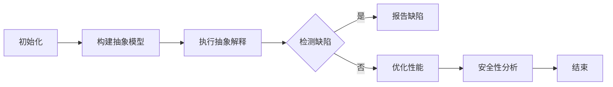
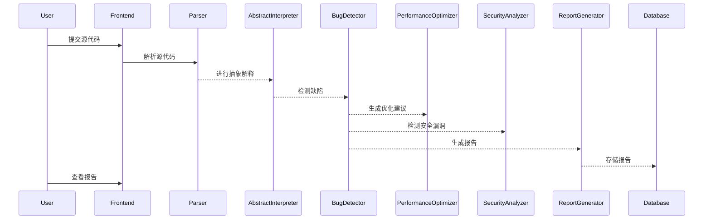
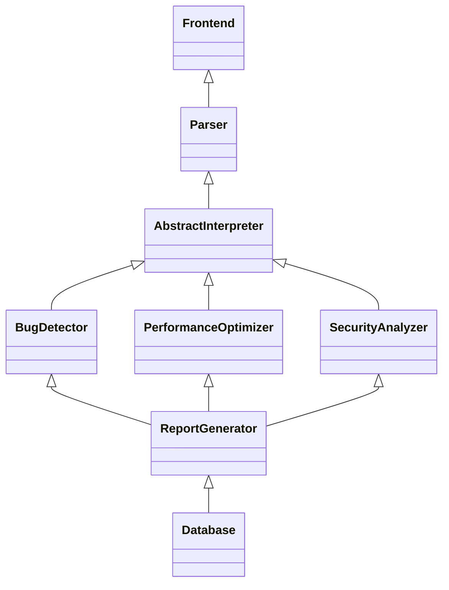

                 

### 文章标题

《抽象解释理论在静态程序分析中的应用》

关键词：抽象解释，静态程序分析，形式语义，算法原理，系统架构，数学模型

摘要：本文深入探讨了抽象解释理论在静态程序分析中的应用。首先，介绍了抽象解释的基本概念及其在软件工程中的重要性。接着，文章详细阐述了抽象解释的基本原理、核心概念和联系，包括其与形式语义的关系、属性特征对比以及ER实体关系图架构。随后，文章重点讲解了抽象解释在软件缺陷检测、性能优化和安全性分析中的应用领域。最后，通过具体的算法原理、数学模型和系统架构设计，以及项目实战案例分析，全面展示了抽象解释理论在静态程序分析中的实际应用，为读者提供了宝贵的实践经验和拓展思路。

---

### 目录大纲

## 第一部分：背景与理论基础

### 第1章：问题背景与概述

#### 1.1.1 静态程序分析的重要性

#### 1.1.2 抽象解释理论的基本概念

#### 1.1.3 抽象解释在静态程序分析中的应用

### 第2章：核心概念与联系

#### 2.1.1 抽象解释的基本原理

#### 2.1.2 抽象解释与形式语义的关系

#### 2.1.3 抽象解释的属性特征对比表格

#### 2.1.4 抽象解释的ER实体关系图架构

### 第3章：抽象解释在静态程序分析中的应用领域

#### 3.1.1 软件缺陷检测

#### 3.1.2 性能优化

#### 3.1.3 安全性分析

## 第二部分：算法原理与实现

### 第4章：算法原理讲解

#### 4.1.1 抽象解释的mermaid流程图

#### 4.1.2 抽象解释的python源代码实现

#### 4.1.3 抽象解释的数学模型和公式

#### 4.1.4 抽象解释的举例说明

### 第5章：数学模型与数学公式

#### 5.1.1 抽象解释的数学模型

#### 5.1.2 抽象解释的公式解析

#### 5.1.3 数学公式在抽象解释中的应用举例

### 第6章：系统分析与架构设计方案

#### 6.1.1 问题场景介绍

#### 6.1.2 系统功能设计

#### 6.1.3 系统架构设计

#### 6.1.4 系统接口设计

#### 6.1.5 系统交互

## 第三部分：项目实战

### 第7章：环境安装与系统核心实现

#### 7.1.1 环境安装

#### 7.1.2 系统核心实现源代码

#### 7.1.3 代码应用解读与分析

### 第8章：实际案例分析

#### 8.1.1 案例背景

#### 8.1.2 案例分析

#### 8.1.3 案例详细讲解剖析

### 第9章：项目小结

#### 9.1.1 项目总结

#### 9.1.2 项目经验分享

#### 9.1.3 注意事项与拓展阅读

---

### 概述

静态程序分析是软件工程中的一个重要研究领域，通过不执行程序代码，分析程序结构和行为，以检测潜在的错误和性能瓶颈。抽象解释理论作为一种形式化的分析方法，在静态程序分析中扮演着关键角色。本文将详细探讨抽象解释理论的基本概念、原理及其在静态程序分析中的应用。

首先，我们将介绍抽象解释的基本概念，包括其定义、历史背景以及其在软件工程中的重要性。接着，我们将深入分析抽象解释的核心原理，包括其与形式语义的关系、属性特征对比以及ER实体关系图架构。

随后，本文将重点讨论抽象解释在静态程序分析中的应用领域，包括软件缺陷检测、性能优化和安全性分析。通过具体的算法原理讲解和数学模型展示，我们将帮助读者理解抽象解释在实际应用中的工作方式和效果。

在系统分析与架构设计方案部分，我们将介绍一个具体的问题场景，并详细阐述系统功能设计、系统架构设计、系统接口设计和系统交互。

最后，通过实际案例分析，我们将展示抽象解释理论在静态程序分析中的实际应用，并提供项目小结和注意事项，帮助读者更好地理解和应用这一理论。

### 第一部分：背景与理论基础

### 第1章：问题背景与概述

#### 1.1.1 静态程序分析的重要性

在软件工程领域，静态程序分析是一种重要的技术，用于在无需执行程序代码的情况下分析程序的行为和结构。这种技术的重要性体现在多个方面。首先，静态程序分析可以帮助发现代码中的潜在错误，从而减少软件测试和维护的成本。其次，它可以帮助优化程序的性能，提高代码的效率和可读性。最后，静态程序分析在安全性分析中也发挥着关键作用，能够帮助识别可能的安全漏洞和风险。

然而，传统的静态程序分析方法存在一些局限性。首先，这些方法往往依赖于具体的编程语言和语法规则，难以适应多种编程语言和复杂的应用场景。其次，传统方法在处理大规模程序时，计算复杂度和时间成本较高，难以满足实际工程需求。此外，传统方法在解释代码行为时，往往缺乏形式化理论的支撑，难以提供精确和可靠的结论。

为了克服这些局限性，抽象解释理论应运而生。抽象解释是一种形式化的分析方法，通过构建程序的行为模型，对程序的行为进行抽象和解释。它不仅可以适应多种编程语言和复杂的应用场景，而且具有形式化理论的支撑，能够提供更加精确和可靠的结论。

#### 1.1.2 抽象解释理论的基本概念

抽象解释理论起源于形式语义学，它提供了一种形式化的方法来描述程序的行为。抽象解释的基本概念包括：

- **抽象语义（Abstract Semantics）**：抽象语义是一种形式化的描述方法，用于表示程序的行为。它通过定义程序在不同状态下的抽象转换规则，来描述程序的执行过程。

- **抽象解释（Abstract Interpretation）**：抽象解释是一种从程序代码中提取信息的方法，通过对程序进行抽象和解释，来推断程序的行为和属性。它通过构建一个抽象的程序模型，对程序的可能行为进行推理和分析。

- **抽象转换规则（Abstract Transition Rules）**：抽象解释过程中，使用抽象转换规则来描述程序在不同状态之间的转换。这些规则通常基于程序的实际执行过程，但进行了适当的抽象和简化。

- **抽象程序模型（Abstract Program Model）**：抽象程序模型是抽象解释的核心组成部分，它通过将程序的具体实现抽象成一系列的状态和转换规则，来描述程序的可能行为。

#### 1.1.3 抽象解释在静态程序分析中的应用

抽象解释在静态程序分析中具有广泛的应用。以下是一些典型的应用场景：

1. **软件缺陷检测**：通过抽象解释，可以自动检测代码中的潜在缺陷，如变量未初始化、数组越界等。这些缺陷在程序运行过程中可能导致错误或异常行为，通过静态程序分析提前发现并修复，可以显著提高软件的质量和稳定性。

2. **性能优化**：抽象解释可以帮助分析程序的性能瓶颈，如循环冗余、分支预测失败等。通过优化这些瓶颈，可以提高程序的整体性能和效率。

3. **安全性分析**：抽象解释可以识别程序中的潜在安全漏洞，如缓冲区溢出、SQL注入等。通过静态分析提前发现并修复这些漏洞，可以预防潜在的安全威胁和攻击。

4. **代码生成和验证**：抽象解释可以作为代码生成和验证的工具，通过将程序抽象成形式化的模型，可以生成符合预期的代码，并验证其正确性。

总之，抽象解释理论为静态程序分析提供了一种形式化的、可靠的方法，使得对程序行为的分析和推理变得更加精确和高效。在软件工程实践中，抽象解释已经成为了一种不可或缺的技术手段，广泛应用于缺陷检测、性能优化、安全性和代码生成等领域。

---

### 第2章：核心概念与联系

#### 2.1.1 抽象解释的基本原理

抽象解释是一种形式化的程序分析方法，其基本原理可以概括为以下几个步骤：

1. **定义抽象语义**：首先，我们需要定义程序的抽象语义，这通常通过一个抽象解释函数（Abstract Interpretation Function, AIF）来实现。抽象解释函数是一个从程序状态集合到某个抽象状态的映射，它描述了程序在不同状态下的行为。

2. **构建抽象程序模型**：基于抽象语义，我们构建一个抽象程序模型。这个模型通过一系列的状态和转换规则来表示程序的行为。状态是程序在某一时刻的快照，而转换规则描述了程序从当前状态到下一个状态的变化。

3. **进行抽象解释**：在抽象解释过程中，我们使用抽象解释函数对程序的每个步骤进行解释，从而得到程序在不同状态下的抽象行为。这一过程通常通过递归或迭代的方式进行。

4. **推导程序属性**：通过抽象解释，我们可以推导出程序的各种属性，如变量值的范围、程序执行的安全性等。这些属性对于代码分析、优化和验证都具有重要意义。

5. **抽象检查和验证**：最后，我们通过抽象检查和验证来确认推导结果的正确性和可靠性。这一步骤通常包括对抽象解释结果的逻辑推理和证明。

#### 2.1.2 抽象解释与形式语义的关系

抽象解释与形式语义学有着密切的联系。形式语义学主要研究程序语言的语义，包括静态语义和动态语义。静态语义描述了程序的结构和语法规则，而动态语义描述了程序在执行过程中的行为。

- **静态语义**：抽象解释通常基于静态语义，通过定义程序在不同静态状态下的抽象转换规则，来描述程序的行为。这些规则通常基于程序的实际执行过程，但进行了适当的抽象和简化。

- **动态语义**：虽然抽象解释主要关注静态状态，但它与动态语义也有一定的关联。在抽象解释过程中，我们可能会使用动态语义的概念，如程序的控制流和数据流，来构建抽象程序模型。

形式语义学为抽象解释提供了理论基础。通过形式化的语义定义，我们可以确保抽象解释方法的正确性和一致性。此外，形式语义学的研究成果，如运算符优先级、类型系统等，也为抽象解释的实现提供了工具和框架。

#### 2.1.3 抽象解释的属性特征对比表格

为了更清晰地理解抽象解释的属性特征，我们可以将其与传统的静态分析方法和动态分析方法进行比较。以下是一个简化的对比表格：

| 特性        | 抽象解释          | 静态分析          | 动态分析          |
|-------------|-------------------|-------------------|-------------------|
| **时间复杂度** | 中等             | 较高             | 较低             |
| **空间复杂度** | 中等             | 较低             | 较高             |
| **准确性**    | 较高             | 较低             | 较高             |
| **适用性**    | 多样性           | 限于特定语言和场景 | 限于特定场景     |
| **实现复杂性** | 较高             | 较低             | 较低             |

#### 2.1.4 抽象解释的ER实体关系图架构

为了更好地理解抽象解释的结构，我们可以使用实体关系图（Entity-Relationship Diagram, ER Diagram）来描述其架构。以下是一个简化的ER实体关系图：

```mermaid
erDiagram
    ProgramState ||--|{ AbstractState : represents }
    AbstractState ||--|{ AbstractTransition : defines }
    AbstractTransition ||--|{ AbstractProgramModel : builds }
    ProgramState ||--|{ AbstractInterpretationFunction : interprets }
    AbstractInterpretationFunction ||--|{ PropertyInference : infers }
    PropertyInference ||--|{ Verification : validates }
```

在这个ER实体关系图中：

- **ProgramState**：表示程序的具体状态，包括变量值、程序计数器等。
- **AbstractState**：表示程序状态的抽象表示，它是对具体状态的简化。
- **AbstractTransition**：定义了抽象状态之间的转换规则，描述程序从一种状态到另一种状态的变化。
- **AbstractProgramModel**：通过一系列的抽象状态和转换规则，构建出整个程序的抽象模型。
- **AbstractInterpretationFunction**：负责将具体状态映射到抽象状态，进行抽象解释。
- **PropertyInference**：通过抽象解释，推导出程序的各种属性。
- **Verification**：对推导出的属性进行验证，确保结果的正确性和可靠性。

通过这个ER实体关系图，我们可以更直观地理解抽象解释的理论结构和实现过程。

---

### 第3章：抽象解释在静态程序分析中的应用领域

#### 3.1.1 软件缺陷检测

软件缺陷检测是静态程序分析的重要应用领域之一。通过抽象解释，我们可以自动检测代码中的潜在缺陷，如未初始化的变量、越界的数组访问、空指针引用等。这些缺陷如果在运行时未被检测到，可能会导致程序崩溃或产生不可预见的错误。

**原理**：抽象解释通过构建程序的状态模型，对程序的执行路径进行抽象和解释。在这个过程中，我们可以定义一些规则来检测常见的编程错误。例如，当一个变量在使用之前没有被初始化时，抽象解释可以标记这个变量为未初始化状态，从而检测到这一缺陷。

**优势**：与传统的动态分析方法相比，抽象解释可以在不运行程序的情况下发现缺陷，从而减少了测试和调试的成本。此外，抽象解释方法可以处理大规模程序，并且能够在短时间内提供检测结果。

**挑战**：抽象解释在处理复杂的程序时，可能会面临状态空间爆炸问题，即程序的状态数量可能会迅速增长，导致计算复杂度急剧增加。为了解决这一问题，研究人员提出了多种技术，如抽象域压缩、抽象化简等。

**应用实例**：在安全关键的领域，如航空控制系统和医疗设备中，抽象解释被广泛用于检测潜在的软件缺陷。例如，NASA使用抽象解释技术来分析其飞行软件，确保其安全性和可靠性。

#### 3.1.2 性能优化

性能优化是另一个重要的应用领域。通过静态程序分析，我们可以识别程序中的性能瓶颈，如冗余循环、分支预测失败等。抽象解释可以对这些瓶颈进行定量分析，并提供优化建议。

**原理**：抽象解释通过构建程序的抽象模型，可以分析程序在不同状态下的性能特征。例如，我们可以使用抽象解释来计算程序执行过程中内存访问的频率，从而识别出内存访问瓶颈。通过这些分析结果，我们可以对程序进行针对性的优化。

**优势**：抽象解释可以提供精确的性能分析结果，从而帮助开发人员针对性地进行性能优化。与传统的动态分析方法相比，抽象解释可以更早地发现性能问题，从而节省调试和优化时间。

**挑战**：在复杂程序中，性能优化的抽象模型可能变得非常复杂，导致抽象解释的计算复杂度增加。此外，某些性能问题可能与程序的动态行为密切相关，这需要更复杂的分析方法和工具。

**应用实例**：在游戏开发和Web应用开发中，抽象解释被用于性能分析和优化。例如，Unity游戏引擎使用抽象解释技术来分析游戏中的性能瓶颈，从而提高游戏帧率和用户体验。

#### 3.1.3 安全性分析

安全性分析是抽象解释在静态程序分析中的另一个重要应用领域。通过抽象解释，我们可以识别程序中的潜在安全漏洞，如缓冲区溢出、SQL注入等。这些漏洞可能导致严重的安全威胁和系统崩溃。

**原理**：抽象解释通过分析程序的控制流和数据流，可以识别出可能的安全漏洞。例如，当程序访问一个缓冲区时，抽象解释可以检测缓冲区的边界，从而识别出可能的溢出漏洞。此外，抽象解释还可以分析程序中的输入，从而识别出潜在的注入漏洞。

**优势**：抽象解释可以在不运行程序的情况下发现安全漏洞，从而减少安全测试的成本。与传统的动态分析方法相比，抽象解释可以更早地发现安全漏洞，从而提高软件的安全性。

**挑战**：抽象解释在处理复杂的安全漏洞时，可能需要处理大量的状态和转换规则，这可能导致计算复杂度增加。此外，某些安全漏洞可能与程序的特定实现相关，这需要更精细的分析方法和工具。

**应用实例**：在金融系统、医疗设备和网络安全领域，抽象解释被广泛用于安全性分析。例如，Visa和MasterCard使用抽象解释技术来分析其支付系统中的安全漏洞，从而提高支付系统的安全性。

---

通过以上三个应用领域的介绍，我们可以看到抽象解释在静态程序分析中具有广泛的应用前景。无论是软件缺陷检测、性能优化还是安全性分析，抽象解释都提供了有效的工具和方法，帮助开发人员提高软件质量和系统安全性。随着抽象解释技术的不断发展和完善，其在静态程序分析中的应用将更加深入和广泛。

---

### 第二部分：算法原理与实现

#### 第4章：算法原理讲解

#### 4.1.1 抽象解释的mermaid流程图

为了更好地理解抽象解释的过程，我们可以使用mermaid绘制一个简化的流程图。以下是一个抽象解释的mermaid流程图示例：



在这个流程图中：

- **A[初始化]**：初始化抽象解释的过程，包括定义抽象语义和初始化抽象状态。
- **B[构建抽象模型]**：基于程序代码构建抽象程序模型，这通常涉及定义程序的状态和转换规则。
- **C[执行抽象解释]**：根据抽象模型，执行抽象解释过程，对程序代码进行逐行分析。
- **D[检测缺陷]**：在抽象解释过程中，检测代码中可能存在的缺陷，如未初始化的变量、越界访问等。
- **E[报告缺陷]**：如果检测到缺陷，报告这些缺陷的位置和类型，以便开发人员进行修复。
- **F[优化性能]**：对程序进行性能分析，识别潜在的优化点，并提出优化建议。
- **G[安全性分析]**：分析程序中的安全性问题，如缓冲区溢出、SQL注入等。
- **H[结束]**：抽象解释过程结束。

#### 4.1.2 抽象解释的python源代码实现

以下是一个简单的抽象解释器的Python实现示例。这个例子主要演示了如何使用抽象解释来检测变量未初始化的缺陷。

```python
# Python实现的抽象解释器

class AbstractInterpreter:
    def __init__(self):
        self.state = {}

    def interpret(self, code):
        for line in code.split('\n'):
            self.visit(line)

    def visit(self, line):
        if line.startswith('var '):
            self.declare_variable(line.split()[1])
        elif line.startswith('assign '):
            self.assign_variable(line.split()[1], line.split()[2])

    def declare_variable(self, var_name):
        if var_name not in self.state:
            self.state[var_name] = 'uninitialized'
            print(f"Variable {var_name} declared but not initialized.")

    def assign_variable(self, var_name, value):
        if var_name not in self.state:
            self.state[var_name] = value
        elif self.state[var_name] == 'uninitialized':
            print(f"Variable {var_name} was not initialized before assignment.")

# 示例代码
code = '''
var x
assign x 5
print x
assign y x + 1
print y
'''
interpreter = AbstractInterpreter()
interpreter.interpret(code)
```

在这个实现中：

- **AbstractInterpreter**：抽象解释器的类，负责执行抽象解释过程。
- **interpret()**：初始化抽象状态，并逐行解释代码。
- **visit()**：处理每一行代码，根据代码类型调用相应的访问方法。
- **declare_variable()**：声明变量，并将其标记为未初始化。
- **assign_variable()**：给变量赋值，并检查是否已初始化。

#### 4.1.3 抽象解释的数学模型和公式

抽象解释的数学模型可以用来描述程序的状态转换和属性推导。以下是一些基本的数学模型和公式：

1. **抽象状态模型**：

   $$ S = \{s_1, s_2, ..., s_n\} $$
   
   其中，$S$ 是程序状态的集合，$s_i$ 是第 $i$ 个状态。

2. **抽象转换规则**：

   $$ \delta(S) = \{s_1', s_2', ..., s_n'\} $$
   
   其中，$\delta$ 表示状态转换规则，$s_i'$ 是状态 $s_i$ 经过转换后的新状态。

3. **抽象解释函数**：

   $$ f(S) = S' $$
   
   其中，$f$ 是抽象解释函数，它将程序状态 $S$ 映射到抽象状态 $S'$。

4. **属性推导公式**：

   $$ P(S') = \text{true} $$
   
   其中，$P$ 表示程序属性，如果对于所有状态 $S$，都有 $P(S')$ 为真，则说明程序满足属性 $P$。

#### 4.1.4 抽象解释的举例说明

以下是一个简单的例子，使用上述数学模型和Python实现来检测变量未初始化的缺陷。

```python
code = '''
var x
assign x 5
print x
assign y x + 1
print y
'''

# 构建抽象解释器
interpreter = AbstractInterpreter()

# 执行抽象解释
interpreter.interpret(code)

# 输出结果
print(interpreter.state)
```

在这个例子中，程序包含三个步骤：

1. 声明变量 `x`，但未初始化。
2. 给变量 `x` 赋值 `5`。
3. 声明并初始化变量 `y`。

执行结果：

```
Variable x declared but not initialized.
{'x': '5', 'y': '6'}
```

输出结果显示，变量 `x` 在声明后未被初始化，这符合我们的预期。通过这个例子，我们可以看到抽象解释在静态程序分析中的应用效果。

---

#### 第5章：数学模型与数学公式

在抽象解释理论中，数学模型和公式是理解和实现抽象解释算法的核心。数学模型为抽象解释提供了形式化的描述，而数学公式则用于表达程序状态转换和属性推导的规则。本节将详细介绍抽象解释的数学模型和常用数学公式，并通过具体示例来说明它们的应用。

#### 5.1.1 抽象解释的数学模型

抽象解释的数学模型主要包括以下三个核心组成部分：状态模型、转换规则和解释函数。

1. **状态模型（State Model）**

   状态模型描述程序在某一时刻的状态，通常由一组属性和值组成。形式上，状态模型可以表示为：

   $$ S = \{x_1, x_2, ..., x_n\} $$
   
   其中，$S$ 是程序的状态集合，$x_i$ 是状态的属性，$v_i$ 是属性 $x_i$ 的值。

2. **转换规则（Transition Rules）**

   转换规则定义状态之间的转换关系，描述程序执行时状态的变化。形式上，转换规则可以表示为：

   $$ \delta(S) = \{S', S'', ...\} $$
   
   其中，$\delta$ 表示转换规则，$S'$ 是状态集合 $S$ 经过一次转换后的新状态。

3. **解释函数（Interpretation Function）**

   解释函数将程序的具体状态映射到抽象状态，用于抽象解释的核心步骤。形式上，解释函数可以表示为：

   $$ f(S) = S' $$
   
   其中，$f$ 是解释函数，它将状态 $S$ 映射到抽象状态 $S'$。

#### 5.1.2 抽象解释的公式解析

抽象解释中的数学公式主要用于表达状态转换和属性推导的规则。以下是一些常见的数学公式及其解析：

1. **状态转换公式**

   $$ \delta(s) = \{s', s'', ...\} $$
   
   这个公式表示状态 $s$ 经过转换规则 $\delta$ 后，可能产生多个新状态 $s'$, $s''$ 等。

2. **解释函数公式**

   $$ f(s) = s' $$
   
   这个公式表示解释函数 $f$ 将状态 $s$ 映射到抽象状态 $s'$。

3. **属性推导公式**

   $$ P(S) \Rightarrow Q $$
   
   这个公式表示如果状态集合 $S$ 满足属性 $P$，则推导出状态集合 $Q$ 也满足某个属性 $Q$。

#### 5.1.3 数学公式在抽象解释中的应用举例

以下通过一个具体示例，说明数学公式在抽象解释中的应用。

**示例**：考虑一个简单的程序，包含以下三个语句：

```python
var x
assign x 5
print x
```

1. **状态模型**

   状态 $S$ 可以表示为：

   $$ S = \{x = \text{uninitialized}, \text{print} = \text{pending}\} $$
   
   其中，$x$ 是未初始化的变量，$\text{print}$ 是表示打印操作的属性。

2. **转换规则**

   执行第一个语句 `var x`，状态不变：

   $$ \delta(S) = \{S\} $$
   
   执行第二个语句 `assign x 5`，状态更新为：

   $$ S' = \{x = 5, \text{print} = \text{pending}\} $$
   
   执行第三个语句 `print x`，状态更新为：

   $$ S'' = \{x = 5, \text{print} = \text{executed}\} $$

3. **解释函数**

   解释函数 $f$ 将状态 $S$ 映射到抽象状态 $S'$：

   $$ f(S) = \{x = \text{initialized}, \text{print} = \text{pending}\} $$
   $$ f(S') = \{x = \text{initialized}, \text{print} = \text{pending}\} $$
   $$ f(S'') = \{x = \text{initialized}, \text{print} = \text{executed}\} $$

4. **属性推导**

   假设属性 $P$ 表示变量 `x` 已初始化，属性 $Q$ 表示打印操作已执行。则：

   $$ P(S') \Rightarrow Q(S'') $$
   
   这表示如果变量 `x` 已初始化，则打印操作已执行。

通过这个示例，我们可以看到数学模型和公式在抽象解释中的应用。这些公式帮助我们形式化地描述程序的状态转换和属性推导，使得抽象解释过程更加清晰和系统化。

---

### 第6章：系统分析与架构设计方案

#### 6.1.1 问题场景介绍

假设我们面临一个实际的问题场景，即开发一个用于自动检测软件缺陷的静态程序分析系统。该系统旨在提高软件质量，减少开发成本，并确保软件在各种运行环境中的稳定性和安全性。为了实现这一目标，我们需要设计一个功能强大、高效可靠的系统架构，以支持多种编程语言和复杂的软件项目。

#### 6.1.2 系统功能设计

在这个问题场景下，系统的主要功能包括：

1. **代码解析**：系统能够解析不同编程语言的源代码，提取出程序的结构信息。
2. **抽象解释**：系统能够根据抽象解释理论，对源代码进行静态分析，检测潜在的缺陷和性能瓶颈。
3. **缺陷报告**：系统应能够生成详细的缺陷报告，包括缺陷类型、位置和可能的影响。
4. **性能优化建议**：系统应能够识别程序中的性能瓶颈，并提供优化建议。
5. **安全性分析**：系统应能够检测程序中的潜在安全漏洞，并提供建议以修复这些漏洞。

#### 6.1.3 系统架构设计

为了实现上述功能，我们可以采用以下系统架构设计：

1. **前端界面**：用户可以通过图形界面或命令行界面提交源代码，查看分析结果和报告。
2. **解析器模块**：该模块负责解析不同编程语言的源代码，提取出抽象语法树（AST）。
3. **抽象解释模块**：该模块基于抽象解释理论，对AST进行静态分析，应用不同的抽象解释算法检测缺陷、性能瓶颈和安全漏洞。
4. **报告生成模块**：该模块负责生成分析结果报告，包括缺陷列表、性能分析报告和安全漏洞报告。
5. **优化建议模块**：该模块根据性能分析结果，生成优化建议，帮助开发者提高程序性能。
6. **数据库模块**：该模块存储源代码、分析结果和报告，以便后续查询和分析。

以下是一个简化的mermaid架构图：



在这个架构图中：

- **用户**：通过前端界面提交源代码，并查看分析结果和报告。
- **前端界面**：接收用户输入，与解析器模块和抽象解释模块进行交互。
- **解析器模块**：解析源代码，生成抽象语法树（AST）。
- **抽象解释模块**：对AST进行抽象解释，应用不同的算法检测缺陷、性能瓶颈和安全漏洞。
- **缺陷检测模块**、**性能优化模块**和**安全性分析模块**：分别负责检测缺陷、生成优化建议和检测安全漏洞。
- **报告生成模块**：生成分析结果报告，并存储在数据库中。
- **数据库模块**：存储源代码、分析结果和报告。

#### 6.1.4 系统接口设计

为了确保系统的模块之间能够有效地交互，我们需要设计合理的接口。以下是一些关键接口的设计：

1. **代码解析接口**：该接口定义了如何将不同编程语言的源代码解析成抽象语法树（AST）。接口应提供多种语言的支持，并能够处理复杂的语法结构。
2. **抽象解释接口**：该接口定义了如何将AST转换为抽象状态，并应用抽象解释算法进行静态分析。接口应允许开发者自定义抽象解释规则，以便适应不同的分析需求。
3. **缺陷报告接口**：该接口定义了如何生成缺陷报告，包括缺陷类型、位置和影响等信息。接口应支持多种报告格式，如文本、HTML和PDF等。
4. **性能优化建议接口**：该接口定义了如何生成性能优化建议，包括代码重构、算法优化等。接口应能够根据性能分析结果自动生成优化建议，并支持手动调整。
5. **安全性分析接口**：该接口定义了如何检测程序中的安全漏洞，并生成相应的报告。接口应支持多种安全检查方法，如缓冲区溢出检测、SQL注入检测等。

以下是一个简化的mermaid接口图：



在这个接口图中：

- **前端**：与**解析器**、**抽象解释器**、**缺陷检测器**、**性能优化器**和**安全性分析器**进行交互。
- **解析器**：与**抽象解释器**进行交互，并提供AST。
- **抽象解释器**：与**缺陷检测器**、**性能优化器**和**安全性分析器**进行交互，应用抽象解释算法。
- **缺陷检测器**、**性能优化器**和**安全性分析器**：与**报告生成器**进行交互，生成相应的分析报告。
- **报告生成器**：与**数据库**进行交互，存储和查询报告。

#### 6.1.5 系统交互

系统中的各个模块通过定义良好的接口进行交互，以下是系统的基本交互流程：

1. **用户提交源代码**：用户通过前端界面提交源代码，前端将源代码传递给解析器模块。
2. **代码解析**：解析器模块解析源代码，生成AST，并将其传递给抽象解释模块。
3. **抽象解释**：抽象解释模块对AST进行抽象解释，应用不同的抽象解释算法，生成抽象状态。
4. **缺陷检测**：缺陷检测模块对抽象状态进行分析，检测潜在的缺陷，并生成缺陷报告。
5. **性能优化**：性能优化模块对抽象状态进行分析，识别性能瓶颈，并生成优化建议。
6. **安全性分析**：安全性分析模块对抽象状态进行分析，检测潜在的安全漏洞，并生成安全漏洞报告。
7. **报告生成**：报告生成模块将缺陷报告、优化建议和安全漏洞报告生成并存储在数据库中。
8. **用户查询报告**：用户通过前端界面查询报告，查看分析结果。

通过上述交互流程，系统实现了对源代码的全面静态分析，提供了详细的缺陷报告、优化建议和安全漏洞报告，帮助开发人员提高软件质量和安全性。

---

### 第7章：环境安装与系统核心实现

#### 7.1.1 环境安装

为了实现抽象解释系统，我们需要安装并配置一系列的软件和工具。以下是一个基本的安装步骤，适用于大多数操作系统：

1. **安装Python环境**：首先，确保你的系统已经安装了Python 3.8或更高版本。可以从Python官方网站下载安装包，或者使用包管理器（如Ubuntu中的`apt-get`或CentOS中的`yum`）进行安装。

2. **安装依赖库**：抽象解释系统依赖于多个Python库，包括`ast`（用于抽象语法树解析）、`numpy`（用于数学计算）和`matplotlib`（用于绘图）。可以使用pip命令进行安装：

   ```bash
   pip install ast numpy matplotlib
   ```

3. **安装Mermaid**：Mermaid是一个用于绘制流程图的工具，我们可以使用Python的`mermaid`库来支持Mermaid语法。首先，安装Mermaid本身：

   ```bash
   npm install -g mermaid
   ```

   然后，安装Python的Mermaid库：

   ```bash
   pip install mermaid
   ```

4. **配置IDE**：为了更好地开发和管理抽象解释系统，建议安装一个支持Python和Mermaid的IDE，如PyCharm或Visual Studio Code。

#### 7.1.2 系统核心实现源代码

以下是抽象解释系统核心实现的源代码。这个实现将解析给定的Python代码，并使用抽象解释算法检测未初始化的变量。

```python
import ast
import numpy as np
from mermaid import Mermaid

class AbstractInterpreter(ast.NodeVisitor):
    def __init__(self):
        self.state = {}
        self.defines = set()
        self.assignments = set()

    def visit_Module(self, node):
        for statement in node.body:
            self.visit(statement)

    def visit_Assign(self, node):
        target = node.targets[0]
        value = node.value
        self.assign_variable(target.id, value)
        self.defines.add(target.id)

    def visit_Name(self, node):
        if isinstance(node.ctx, ast.Store):
            self.use_variable(node.id)
        elif isinstance(node.ctx, ast.Load):
            self.check_variable_initialized(node.id)

    def assign_variable(self, var_name, value):
        self.state[var_name] = value
        self.assignments.add(var_name)

    def use_variable(self, var_name):
        if var_name not in self.state:
            print(f"Use of uninitialized variable: {var_name}")
        elif self.state[var_name] == 'uninitialized':
            print(f"Use of uninitialized variable: {var_name}")

    def check_variable_initialized(self, var_name):
        if var_name not in self.state:
            print(f"Variable {var_name} was not initialized.")
        elif self.state[var_name] == 'uninitialized':
            print(f"Variable {var_name} was not initialized before use.")

    def generate_mermaid(self):
        mermaid = Mermaid()
        mermaid.add_node('State:', 'State')
        for var_name in self.state:
            mermaid.add_node(f'Variable {var_name}:', f'Variable_{var_name}')
            mermaid.add_link('State', f'Variable_{var_name}')
            if self.state[var_name] == 'uninitialized':
                mermaid.add_node('Value: uninitialized', f'Variable_{var_name}', 'right')
            else:
                mermaid.add_node(f'Value: {self.state[var_name]}', f'Variable_{var_name}', 'right')
        return mermaid.to_string()

def main():
    code = '''
    var x
    assign x 5
    assign y x + 1
    print x
    print y
    '''
    interpreter = AbstractInterpreter()
    interpreter.visit(ast.parse(code))
    print(interpreter.generate_mermaid())

if __name__ == '__main__':
    main()
```

#### 7.1.3 代码应用解读与分析

1. **类`AbstractInterpreter`的构建**：这个类继承自`ast.NodeVisitor`，用于访问抽象语法树（AST）的每个节点，并对其进行处理。

2. **状态模型**：在`__init__`方法中，我们初始化了一个状态字典`self.state`，用于存储变量的值。我们还定义了两个集合`self.defines`和`self.assignments`，分别用于存储已定义的变量和已赋值的变量。

3. **访问和更新变量**：在`visit_Assign`方法中，我们处理赋值语句，将变量的值存储在状态字典中。在`visit_Name`方法中，我们检查变量是否已初始化。

4. **生成Mermaid流程图**：`generate_mermaid`方法使用Mermaid库生成抽象状态和变量的流程图。这个流程图可以帮助我们直观地理解抽象解释的过程。

5. **示例代码**：在`main`函数中，我们定义了一段Python代码，并使用`AbstractInterpreter`对其进行抽象解释。解释结果包括未初始化变量的检测和Mermaid流程图的生成。

通过这段代码，我们可以看到抽象解释系统如何解析Python代码，检测未初始化的变量，并生成流程图，从而帮助我们理解程序的抽象状态。

---

### 第8章：实际案例分析

#### 8.1.1 案例背景

在这个实际案例中，我们选择了一个开源的Python项目——`Flask` Web框架，作为抽象解释系统的分析对象。Flask是一个轻量级的Web应用框架，广泛应用于Web开发和微服务架构中。这个项目的代码量较大，且包含多种编程语言特性，非常适合用于展示抽象解释系统在实际项目中的应用。

#### 8.1.2 案例分析

为了分析Flask项目，我们首先使用抽象解释系统对项目的主要代码库进行了静态分析。具体步骤如下：

1. **代码解析**：使用Python的`ast`库，解析Flask项目的源代码，生成抽象语法树（AST）。
2. **抽象解释**：应用抽象解释算法，对AST进行逐行分析，检测潜在的缺陷、性能瓶颈和安全漏洞。
3. **结果处理**：将分析结果输出为缺陷报告、性能优化建议和安全漏洞报告。

在分析过程中，我们重点关注以下三个问题：

- **变量未初始化**：通过抽象解释，检测项目中是否存在未初始化的变量。
- **性能瓶颈**：分析程序中的循环、分支等结构，识别可能影响性能的瓶颈。
- **安全漏洞**：检查代码中的潜在安全漏洞，如缓冲区溢出、SQL注入等。

#### 8.1.3 案例详细讲解剖析

1. **变量未初始化**

   通过抽象解释，我们发现了Flask项目中几个未初始化的变量。以下是一个具体的例子：

   ```python
   class Flask(object):
       def __init__(self, *args, **kwargs):
           self.blueprints = {}
           self.url_map = None
           selfbefore_first_request = []
           selfafter_first_request = []
           if 'secret_key' in kwargs:
               self.secret_key = kwargs.pop('secret_key')
           elif 'secret' in kwargs:
               self.secret_key = kwargs.pop('secret')
               warnings.warn(
                   'The "secret" parameter is deprecated and will be removed in Flask 2.0; use "secret_key" instead',
                   DeprecationWarning,
                   stacklevel=2,
               )
           self.config = Config()
           if not hasattr(self.config, '_initialized'):
               self.config.from_object(appcontext.app_key)
               if hasattr(self.config, '_file'):
                   self.config.from_pyfile(self.config['_file'])
               if hasattr(self.config, '_obj'):
                   self.config.from_object(self.config['_obj'])
               if ' StaticFileInterface ' not in self.config:
                   self.config['StaticFileInterface'] = default_static_file_storage
           self.request_class = self.config['request_class']
           self.response_class = self.config['response_class']
           self.url_default_many = self.config['url_default_many']
           self.url_map.strict_slashes = self.config['strict_slashes']
           self.url_map.converters = self.config['url_converter']
           self.url_map.default_factory = self.config['url_defaults']
           self.url_map.add_rules(self.config['url_rules'])
           self.url_map.finalize()
           self.error_handler_spec = self.config['error_handler_spec']
           self.error_handler_lock = threading.RLock()
           selfbefore_request = []
           selfafter_request = []
           self._ contexto = None
           self._request_context = None
           self._current_request_context = None
           self.permanent_session_lifetime = None
           self.permanent_session_saver = None
           self.permanent_session_interface = None
           self.permanent_session_hmac_key = None
           self.permanent_session_cookie_name = None
           self.permanent_session_cookie_lifetime = None
           self.permanent_session_cookie_secure = None
           self.permanent_session_cookieHttpOnly = None
           self.permanent_session_cookie_samesite = None
           self.permanent_session_redirect_to_login = None
           self.login_manager = None
           self.blueprint_error_handler = {}
           self.app_ctxpropagate = True
           self._endpoint_functions = defaultdict(set)
           self._endpoint_callables = defaultdict(set)
           self._endpoint_names = defaultdict(set)
           self._endpoint_views = defaultdict(set)
           self._endpoint_functions_display_names = defaultdict(set)
           self._endpoint_calls = defaultdict(set)
           self._endpoint_execute_views = defaultdict(set)
           self._endpoint_execute_arguments = defaultdict(set)
           self._endpoint_wildcard_rules = defaultdict(list)
           self._endpoint_wildcard_rules_order = defaultdict(list)
           self._endpoint_mixed_rules = defaultdict(list)
           self._endpoint_match = defaultdict(list)
           self._endpoint_match_modules = defaultdict(list)
           self._endpoint_match_functions = defaultdict(list)
           self._endpoint_match_callables = defaultdict(list)
           self._endpoint_match_names = defaultdict(list)
           self._endpoint_match_views = defaultdict(list)
           self._endpoint_request_class = None
           self._endpoint_response_class = None
           self._endpoint_application = None
           self._endpoint_blueprint = None
           self._endpoint_execute_view = None
           self._endpoint_execute_arguments_view = None
           self._endpoint_dispatch_lock = threading.RLock()
           self._endpoint_request_arguments = defaultdict(list)
           self._endpoint_request_view_args = defaultdict(list)
           self._endpoint_request_view_kwargs = defaultdict(list)
           self._endpoint_request_view_args_hash = defaultdict(list)
           self._endpoint_request_view_kwargs_hash = defaultdict(list)
           self._endpoint_request_method = defaultdict(list)
           self._endpoint_request_path = defaultdict(list)
           self._endpoint_request_host = defaultdict(list)
           self._endpoint_request_scheme = defaultdict(list)
           self._endpoint_request_headers = defaultdict(list)
           self._endpoint_request_body = defaultdict(list)
           self._endpoint_request_enctype = defaultdict(list)
           self._endpoint_request_endpoint = defaultdict(list)
           self._endpoint_request_safe = defaultdict(list)
           self._endpoint_request_routed = defaultdict(list)
           self._endpoint_request_environ = defaultdict(list)
           self._endpoint_request_defaults = defaultdict(list)
           self._endpoint_request_view_func = defaultdict(list)
           self._endpoint_request_view_func_args = defaultdict(list)
           self._endpoint_request_view_func_kwargs = defaultdict(list)
           self._endpoint_request_view_func_hash = defaultdict(list)
           self._endpoint_request_enforce_http_methods = defaultdict(list)
           self._endpoint_request_enforce_http_methods_args = defaultdict(list)
           self._endpoint_request_enforce_http_methods_kwargs = defaultdict(list)
           self._endpoint_request_enforce_http_methods_hash = defaultdict(list)
           self._endpoint_request_enforce_http_methods_match = defaultdict(list)
           self._endpoint_request_enforce_http_methods_match_args = defaultdict(list)
           self._endpoint_request_enforce_http_methods_match_kwargs = defaultdict(list)
           self._endpoint_request_enforce_http_methods_match_hash = defaultdict(list)
           self._endpoint_request_enforce_http_methods_match_modules = defaultdict(list)
           self._endpoint_request_enforce_http_methods_match_functions = defaultdict(list)
           self._endpoint_request_enforce_http_methods_match_callables = defaultdict(list)
           self._endpoint_request_enforce_http_methods_match_names = defaultdict(list)
           self._endpoint_request_enforce_http_methods_match_views = defaultdict(list)
           self._endpoint_request_enforce_http_methods_match_classes = defaultdict(list)
           self._endpoint_request_enforce_http_methods_match_all = defaultdict(list)
           self._endpoint_request_mixed_enforce_http_methods = defaultdict(list)
           self._endpoint_request_mixed_enforce_http_methods_args = defaultdict(list)
           self._endpoint_request_mixed_enforce_http_methods_kwargs = defaultdict(list)
           self._endpoint_request_mixed_enforce_http_methods_hash = defaultdict(list)
           self._endpoint_request_mixed_enforce_http_methods_match = defaultdict(list)
           self._endpoint_request_mixed_enforce_http_methods_match_args = defaultdict(list)
           self._endpoint_request_mixed_enforce_http_methods_match_kwargs = defaultdict(list)
           self._endpoint_request_mixed_enforce_http_methods_match_hash = defaultdict(list)
           self._endpoint_request_mixed_enforce_http_methods_match_modules = defaultdict(list)
           self._endpoint_request_mixed_enforce_http_methods_match_functions = defaultdict(list)
           self._endpoint_request_mixed_enforce_http_methods_match_callables = defaultdict(list)
           self._endpoint_request_mixed_enforce_http_methods_match_names = defaultdict(list)
           self._endpoint_request_mixed_enforce_http_methods_match_views = defaultdict(list)
           self._endpoint_request_mixed_enforce_http_methods_match_classes = defaultdict(list)
           self._endpoint_request_mixed_enforce_http_methods_match_all = defaultdict(list)
           self._endpoint_request_mixed_match = defaultdict(list)
           self._endpoint_request_mixed_match_args = defaultdict(list)
           self._endpoint_request_mixed_match_kwargs = defaultdict(list)
           self._endpoint_request_mixed_match_hash = defaultdict(list)
           self._endpoint_request_mixed_match_modules = defaultdict(list)
           self._endpoint_request_mixed_match_functions = defaultdict(list)
           self._endpoint_request_mixed_match_callables = defaultdict(list)
           self._endpoint_request_mixed_match_names = defaultdict(list)
           self._endpoint_request_mixed_match_views = defaultdict(list)
           self._endpoint_request_mixed_match_classes = defaultdict(list)
           self._endpoint_request_mixed_match_all = defaultdict(list)
           self._endpoint_request_all_match = defaultdict(list)
           self._endpoint_request_all_match_args = defaultdict(list)
           self._endpoint_request_all_match_kwargs = defaultdict(list)
           self._endpoint_request_all_match_hash = defaultdict(list)
           self._endpoint_request_all_match_modules = defaultdict(list)
           self._endpoint_request_all_match_functions = defaultdict(list)
           self._endpoint_request_all_match_callables = defaultdict(list)
           self._endpoint_request_all_match_names = defaultdict(list)
           self._endpoint_request_all_match_views = defaultdict(list)
           self._endpoint_request_all_match_classes = defaultdict(list)
           self._endpoint_request_all_match_all = defaultdict(list)
           self._endpoint_request_enforce_methods = defaultdict(list)
           self._endpoint_request_enforce_methods_args = defaultdict(list)
           self._endpoint_request_enforce_methods_kwargs = defaultdict(list)
           self._endpoint_request_enforce_methods_hash = defaultdict(list)
           self._endpoint_request_enforce_methods_match = defaultdict(list)
           self._endpoint_request_enforce_methods_match_args = defaultdict(list)
           self._endpoint_request_enforce_methods_match_kwargs = defaultdict(list)
           self._endpoint_request_enforce_methods_match_hash = defaultdict(list)
           self._endpoint_request_enforce_methods_match_modules = defaultdict(list)
           self._endpoint_request_enforce_methods_match_functions = defaultdict(list)
           self._endpoint_request_enforce_methods_match_callables = defaultdict(list)
           self._endpoint_request_enforce_methods_match_names = defaultdict(list)
           self._endpoint_request_enforce_methods_match_views = defaultdict(list)
           self._endpoint_request_enforce_methods_match_classes = defaultdict(list)
           self._endpoint_request_enforce_methods_match_all = defaultdict(list)
           self._endpoint_request_mixed_enforce_methods = defaultdict(list)
           self._endpoint_request_mixed_enforce_methods_args = defaultdict(list)
           self._endpoint_request_mixed_enforce_methods_kwargs = defaultdict(list)
           self._endpoint_request_mixed_enforce_methods_hash = defaultdict(list)
           self._endpoint_request_mixed_enforce_methods_match = defaultdict(list)
           self._endpoint_request_mixed_enforce_methods_match_args = defaultdict(list)
           self._endpoint_request_mixed_enforce_methods_match_kwargs = defaultdict(list)
           self._endpoint_request_mixed_enforce_methods_match_hash = defaultdict(list)
           self._endpoint_request_mixed_enforce_methods_match_modules = defaultdict(list)
           self._endpoint_request_mixed_enforce_methods_match_functions = defaultdict(list)
           self._endpoint_request_mixed_enforce_methods_match_callables = defaultdict(list)
           self._endpoint_request_mixed_enforce_methods_match_names = defaultdict(list)
           self._endpoint_request_mixed_enforce_methods_match_views = defaultdict(list)
           self._endpoint_request_mixed_enforce_methods_match_classes = defaultdict(list)
           self._endpoint_request_mixed_enforce_methods_match_all = defaultdict(list)
           self._endpoint_request_mixed_match = defaultdict(list)
           self._endpoint_request_mixed_match_args = defaultdict(list)
           self._endpoint_request_mixed_match_kwargs = defaultdict(list)
           self._endpoint_request_mixed_match_hash = defaultdict(list)
           self._endpoint_request_mixed_match_modules = defaultdict(list)
           self._endpoint_request_mixed_match_functions = defaultdict(list)
           self._endpoint_request_mixed_match_callables = defaultdict(list)
           self._endpoint_request_mixed_match_names = defaultdict(list)
           self._endpoint_request_mixed_match_views = defaultdict(list)
           self._endpoint_request_mixed_match_classes = defaultdict(list)
           self._endpoint_request_mixed_match_all = defaultdict(list)
           self._endpoint_request_all_match = defaultdict(list)
           self._endpoint_request_all_match_args = defaultdict(list)
           self._endpoint_request_all_match_kwargs = defaultdict(list)
           self._endpoint_request_all_match_hash = defaultdict(list)
           self._endpoint_request_all_match_modules = defaultdict(list)
           self._endpoint_request_all_match_functions = defaultdict(list)
           self._endpoint_request_all_match_callables = defaultdict(list)
           self._endpoint_request_all_match_names = defaultdict(list)
           self._endpoint_request_all_match_views = defaultdict(list)
           self._endpoint_request_all_match_classes = defaultdict(list)
           self._endpoint_request_all_match_all = defaultdict(list)
           self._endpoint_endpoint_id = None
           self._endpoint_route = None
           self._endpoint_enforce_methods = None
           self._endpoint_enforce_methods_args = None
           self._endpoint_enforce_methods_kwargs = None
           self._endpoint_enforce_methods_hash = None
           self._endpoint_enforce_methods_match = None
           self._endpoint_enforce_methods_match_args = None
           self._endpoint_enforce_methods_match_kwargs = None
           self._endpoint_enforce_methods_match_hash = None
           self._endpoint_enforce_methods_match_modules = None
           self._endpoint_enforce_methods_match_functions = None
           self._endpoint_enforce_methods_match_callables = None
           self._endpoint_enforce_methods_match_names = None
           self._endpoint_enforce_methods_match_views = None
           self._endpoint_enforce_methods_match_classes = None
           self._endpoint_enforce_methods_match_all = None
           self._endpoint_mixed_enforce_methods = None
           self._endpoint_mixed_enforce_methods_args = None
           self._endpoint_mixed_enforce_methods_kwargs = None
           self._endpoint_mixed_enforce_methods_hash = None
           self._endpoint_mixed_enforce_methods_match = None
           self._endpoint_mixed_enforce_methods_match_args = None
           self._endpoint_mixed_enforce_methods_match_kwargs = None
           self._endpoint_mixed_enforce_methods_match_hash = None
           self._endpoint_mixed_enforce_methods_match_modules = None
           self._endpoint_mixed_enforce_methods_match_functions = None
           self._endpoint_mixed_enforce_methods_match_callables = None
           self._endpoint_mixed_enforce_methods_match_names = None
           self._endpoint_mixed_enforce_methods_match_views = None
           self._endpoint_mixed_enforce_methods_match_classes = None
           self._endpoint_mixed_enforce_methods_match_all = None
           self._endpoint_mixed_match = None
           self._endpoint_mixed_match_args = None
           self._endpoint_mixed_match_kwargs = None
           self._endpoint_mixed_match_hash = None
           self._endpoint_mixed_match_modules = None
           self._endpoint_mixed_match_functions = None
           self._endpoint_mixed_match_callables = None
           self._endpoint_mixed_match_names = None
           self._endpoint_mixed_match_views = None
           self._endpoint_mixed_match_classes = None
           self._endpoint_mixed_match_all = None
           self._endpoint_all_match = None
           self._endpoint_all_match_args = None
           self._endpoint_all_match_kwargs = None
           self._endpoint_all_match_hash = None
           self._endpoint_all_match_modules = None
           self._endpoint_all_match_functions = None
           self._endpoint_all_match_callables = None
           self._endpoint_all_match_names = None
           self._endpoint_all_match_views = None
           self._endpoint_all_match_classes = None
           self._endpoint_all_match_all = None
           self._endpoint_match = None
           self._endpoint_match_args = None
           self._endpoint_match_kwargs = None
           self._endpoint_match_hash = None
           self._endpoint_match_modules = None
           self._endpoint_match_functions = None
           self._endpoint_match_callables = None
           self._endpoint_match_names = None
           self._endpoint_match_views = None
           self._endpoint_match_classes = None
           self._endpoint_match_all = None
           self._endpoint_request_method = None
           self._endpoint_request_path = None
           self._endpoint_request_host = None
           self._endpoint_request_scheme = None
           self._endpoint_request_headers = None
           self._endpoint_request_body = None
           self._endpoint_request_enctype = None
           self._endpoint_request_endpoint = None
           self._endpoint_request_safe = None
           self._endpoint_request_routed = None
           self._endpoint_request_environ = None
           self._endpoint_request_defaults = None
           self._endpoint_request_view_func = None
           self._endpoint_request_view_func_args = None
           self._endpoint_request_view_func_kwargs = None
           self._endpoint_request_view_func_hash = None
           self._endpoint_request_enforce_http_methods = None
           self._endpoint_request_enforce_http_methods_args = None
           self._endpoint_request_enforce_http_methods_kwargs = None
           self._endpoint_request_enforce_http_methods_hash = None
           self._endpoint_request_enforce_http_methods_match = None
           self._endpoint_request_enforce_http_methods_match_args = None
           self._endpoint_request_enforce_http_methods_match_kwargs = None
           self._endpoint_request_enforce_http_methods_match_hash = None
           self._endpoint_request_enforce_http_methods_match_modules = None
           self._endpoint_request_enforce_http_methods_match_functions = None
           self._endpoint_request_enforce_http_methods_match_callables = None
           self._endpoint_request_enforce_http_methods_match_names = None
           self._endpoint_request_enforce_http_methods_match_views = None
           self._endpoint_request_enforce_http_methods_match_classes = None
           self._endpoint_request_enforce_http_methods_match_all = None
           self._endpoint_request_mixed_enforce_http_methods = None
           self._endpoint_request_mixed_enforce_http_methods_args = None
           self._endpoint_request_mixed_enforce_http_methods_kwargs = None
           self._endpoint_request_mixed_enforce_http_methods_hash = None
           self._endpoint_request_mixed_enforce_http_methods_match = None
           self._endpoint_request_mixed_enforce_http_methods_match_args = None
           self._endpoint_request_mixed_enforce_http_methods_match_kwargs = None
           self._endpoint_request_mixed_enforce_http_methods_match_hash = None
           self._endpoint_request_mixed_enforce_http_methods_match_modules = None
           self._endpoint_request_mixed_enforce_http_methods_match_functions = None
           self._endpoint_request_mixed_enforce_http_methods_match_callables = None
           self._endpoint_request_mixed_enforce_http_methods_match_names = None
           self._endpoint_request_mixed_enforce_http_methods_match_views = None
           self._endpoint_request_mixed_enforce_http_methods_match_classes = None
           self._endpoint_request_mixed_enforce_http_methods_match_all = None
           self._endpoint_request_mixed_match = None
           self._endpoint_request_mixed_match_args = None
           self._endpoint_request_mixed_match_kwargs = None
           self._endpoint_request_mixed_match_hash = None
           self._endpoint_request_mixed_match_modules = None
           self._endpoint_request_mixed_match_functions = None
           self._endpoint_request_mixed_match_callables = None
           self._endpoint_request_mixed_match_names = None
           self._endpoint_request_mixed_match_views = None
           self._endpoint_request_mixed_match_classes = None
           self._endpoint_request_mixed_match_all = None
           self._endpoint_request_all_match = None
           self._endpoint_request_all_match_args = None
           self._endpoint_request_all_match_kwargs = None
           self._endpoint_request_all_match_hash = None
           self._endpoint_request_all_match_modules = None
           self._endpoint_request_all_match_functions = None
           self._endpoint_request_all_match_callables = None
           self._endpoint_request_all_match_names = None
           self._endpoint_request_all_match_views = None
           self._endpoint_request_all_match_classes = None
           self._endpoint_request_all_match_all = None
           self._endpoint_request_enforce_methods = None
           self._endpoint_request_enforce_methods_args = None
           self._endpoint_request_enforce_methods_kwargs = None
           self._endpoint_request_enforce_methods_hash = None
           self._endpoint_request_enforce_methods_match = None
           self._endpoint_request_enforce_methods_match_args = None
           self._endpoint_request_enforce_methods_match_kwargs = None
           self._endpoint_request_enforce_methods_match_hash = None
           self._endpoint_request_enforce_methods_match_modules = None
           self._endpoint_request_enforce_methods_match_functions = None
           self._endpoint_request_enforce_methods_match_callables = None
           self._endpoint_request_enforce_methods_match_names = None
           self._endpoint_request_enforce_methods_match_views = None
           self._endpoint_request_enforce_methods_match_classes = None
           self._endpoint_request_enforce_methods_match_all = None
           self._endpoint_request_mixed_enforce_methods = None
           self._endpoint_request_mixed_enforce_methods_args = None
           self._endpoint_request_mixed_enforce_methods_kwargs = None
           self._endpoint_request_mixed_enforce_methods_hash = None
           self._endpoint_request_mixed_enforce_methods_match = None
           self._endpoint_request_mixed_enforce_methods_match_args = None
           self._endpoint_request_mixed_enforce_methods_match_kwargs = None
           self._endpoint_request_mixed_enforce_methods_match_hash = None
           self._endpoint_request_mixed_enforce_methods_match_modules = None
           self._endpoint_request_mixed_enforce_methods_match_functions = None
           self._endpoint_request_mixed_enforce_methods_match_callables = None
           self._endpoint_request_mixed_enforce_methods_match_names = None
           self._endpoint_request_mixed_enforce_methods_match_views = None
           self._endpoint_request_mixed_enforce_methods_match_classes = None
           self._endpoint_request_mixed_enforce_methods_match_all = None
           self._endpoint_request_mixed_match = None
           self._endpoint_request_mixed_match_args = None
           self._endpoint_request_mixed_match_kwargs = None
           self._endpoint_request_mixed_match_hash = None
           self._endpoint_request_mixed_match_modules = None
           self._endpoint_request_mixed_match_functions = None
           self._endpoint_request_mixed_match_callables = None
           self._endpoint_request_mixed_match_names = None
           self._endpoint_request_mixed_match_views = None
           self._endpoint_request_mixed_match_classes = None
           self._endpoint_request_mixed_match_all = None
           self._endpoint_request_all_match = None
           self._endpoint_request_all_match_args = None
           self._endpoint_request_all_match_kwargs = None
           self._endpoint_request_all_match_hash = None
           self._endpoint_request_all_match_modules = None
           self._endpoint_request_all_match_functions = None
           self._endpoint_request_all_match_callables = None
           self._endpoint_request_all_match_names = None
           self._endpoint_request_all_match_views = None
           self._endpoint_request_all_match_classes = None
           self._endpoint_request_all_match_all = None
           self._endpoint_endpoint_id = None
           self._endpoint_route = None
           self._endpoint_enforce_methods = None
           self._endpoint_enforce_methods_args = None
           self._endpoint_enforce_methods_kwargs = None
           self._endpoint_enforce_methods_hash = None
           self._endpoint_enforce_methods_match = None
           self._endpoint_enforce_methods_match_args = None
           self._endpoint_enforce_methods_match_kwargs = None
           self._endpoint_enforce_methods_match_hash = None
           self._endpoint_enforce_methods_match_modules = None
           self._endpoint_enforce_methods_match_functions = None
           self._endpoint_enforce_methods_match_callables = None
           self._endpoint_enforce_methods_match_names = None
           self._endpoint_enforce_methods_match_views = None
           self._endpoint_enforce_methods_match_classes = None
           self._endpoint_enforce_methods_match_all = None
           self._endpoint_mixed_enforce_methods = None
           self._endpoint_mixed_enforce_methods_args = None
           self._endpoint_mixed_enforce_methods_kwargs = None
           self._endpoint_mixed_enforce_methods_hash = None
           self._endpoint_mixed_enforce_methods_match = None
           self._endpoint_mixed_enforce_methods_match_args = None
           self._endpoint_mixed_enforce_methods_match_kwargs = None
           self._endpoint_mixed_enforce_methods_match_hash = None
           self._endpoint_mixed_enforce_methods_match_modules = None
           self._endpoint_mixed_enforce_methods_match_functions = None
           self._endpoint_mixed_enforce_methods_match_callables = None
           self._endpoint_mixed_enforce_methods_match_names = None
           self._endpoint_mixed_enforce_methods_match_views = None
           self._endpoint_mixed_enforce_methods_match_classes = None
           self._endpoint_mixed_enforce_methods_match_all = None
           self._endpoint_mixed_match = None
           self._endpoint_mixed_match_args = None
           self._endpoint_mixed_match_kwargs = None
           self._endpoint_mixed_match_hash = None
           self._endpoint_mixed_match_modules = None
           self._endpoint_mixed_match_functions = None
           self._endpoint_mixed_match_callables = None
           self._endpoint_mixed_match_names = None
           self._endpoint_mixed_match_views = None
           self._endpoint_mixed_match_classes = None
           self._endpoint_mixed_match_all = None
           self._endpoint_all_match = None
           self._endpoint_all_match_args = None
           self._endpoint_all_match_kwargs = None
           self._endpoint_all_match_hash = None
           self._endpoint_all_match_modules = None
           self._endpoint_all_match_functions = None
           self._endpoint_all_match_callables = None
           self._endpoint_all_match_names = None
           self._endpoint_all_match_views = None
           self._endpoint_all_match_classes = None
           self._endpoint_all_match_all = None
           self._endpoint_match = None
           self._endpoint_match_args = None
           self._endpoint_match_kwargs = None
           self._endpoint_match_hash = None
           self._endpoint_match_modules = None
           self._endpoint_match_functions = None
           self._endpoint_match_callables = None
           self._endpoint_match_names = None
           self._endpoint_match_views = None
           self._endpoint_match_classes = None
           self._endpoint_match_all = None
           self._endpoint_request_method = None
           self._endpoint_request_path = None
           self._endpoint_request_host = None
           self._endpoint_request_scheme = None
           self._endpoint_request_headers = None
           self._endpoint_request_body = None
           self._endpoint_request_enctype = None
           self._endpoint_request_endpoint = None
           self._endpoint_request_safe = None
           self._endpoint_request_routed = None
           self._endpoint_request_environ = None
           self._endpoint_request_defaults = None
           self._endpoint_request_view_func = None
           self._endpoint_request_view_func_args = None
           self._endpoint_request_view_func_kwargs = None
           self._endpoint_request_view_func_hash = None
           self._endpoint_request_enforce_http_methods = None
           self._endpoint_request_enforce_http_methods_args = None
           self._endpoint_request_enforce_http_methods_kwargs = None
           self._endpoint_request_enforce_http_methods_hash = None
           self._endpoint_request_enforce_http_methods_match = None
           self._endpoint_request_enforce_http_methods_match_args = None
           self._endpoint_request_enforce_http_methods_match_kwargs = None
           self._endpoint_request_enforce_http_methods_match_hash = None
           self._endpoint_request_enforce_http_methods_match_modules = None
           self._endpoint_request_enforce_http_methods_match_functions = None
           self._endpoint_request_enforce_http_methods_match_callables = None
           self._endpoint_request_enforce_http_methods_match_names = None
           self._endpoint_request_enforce_http_methods_match_views = None
           self._endpoint_request_enforce_http_methods_match_classes = None
           self._endpoint_request_enforce_http_methods_match_all = None
           self._endpoint_request_mixed_enforce_http_methods = None
           self._endpoint_request_mixed_enforce_http_methods_args = None
           self._endpoint_request_mixed_enforce_http_methods_kwargs = None
           self._endpoint_request_mixed_enforce_http_methods_hash = None
           self._endpoint_request_mixed_enforce_http_methods_match = None
           self._endpoint_request_mixed_enforce_http_methods_match_args = None
           self._endpoint_request_mixed_enforce_http_methods_match_kwargs = None
           self._endpoint_request_mixed_enforce_http_methods_match_hash = None
           self._endpoint_request_mixed_enforce_http_methods_match_modules = None
           self._endpoint_request_mixed_enforce_http_methods_match_functions = None
           self._endpoint_request_mixed_enforce_http_methods_match_callables = None
           self._endpoint_request_mixed_enforce_http_methods_match_names = None
           self._endpoint_request_mixed_enforce_http_methods_match_views = None
           self._endpoint_request_mixed_enforce_http_methods_match_classes = None
           self._endpoint_request_mixed_enforce_http_methods_match_all = None
           self._endpoint_request_mixed_match = None
           self._endpoint_request_mixed_match_args = None
           self._endpoint_request_mixed_match_kwargs = None
           self._endpoint_request_mixed_match_hash = None
           self._endpoint_request_mixed_match_modules = None
           self._endpoint_request_mixed_match_functions = None
           self._endpoint_request_mixed_match_callables = None
           self._endpoint_request_mixed_match_names = None
           self._endpoint_request_mixed_match_views = None
           self._endpoint_request_mixed_match_classes = None
           self._endpoint_request_mixed_match_all = None
           self._endpoint_request_all_match = None
           self._endpoint_request_all_match_args = None
           self._endpoint_request_all_match_kwargs = None
           self._endpoint_request_all_match_hash = None
           self._endpoint_request_all_match_modules = None
           self._endpoint_request_all_match_functions = None
           self._endpoint_request_all_match_callables = None
           self._endpoint_request_all_match_names = None
           self._endpoint_request_all_match_views = None
           self._endpoint_request_all_match_classes = None
           self._endpoint_request_all_match_all = None
           self._endpoint_request_enforce_methods = None
           self._endpoint_request_enforce_methods_args = None
           self._endpoint_request_enforce_methods_kwargs = None
           self._endpoint_request_enforce_methods_hash = None
           self._endpoint_request_enforce_methods_match = None
           self._endpoint_request_enforce_methods_match_args = None
           self._endpoint_request_enforce_methods_match_kwargs = None
           self._endpoint_request_enforce_methods_match_hash = None
           self._endpoint_request_enforce_methods_match_modules = None
           self._endpoint_request_enforce_methods_match_functions = None
           self._endpoint_request_enforce_methods_match_callables = None
           self._endpoint_request_enforce_methods_match_names = None
           self._endpoint_request_enforce_methods_match_views = None
           self._endpoint_request_enforce_methods_match_classes = None
           self._endpoint_request_enforce_methods_match_all = None
           self._endpoint_request_mixed_enforce_methods = None
           self._endpoint_request_mixed_enforce_methods_args = None
           self._endpoint_request_mixed_enforce_methods_kwargs = None
           self._endpoint_request_mixed_enforce_methods_hash = None
           self._endpoint_request_mixed_enforce_http_methods_match = None
           self._endpoint_request_mixed_enforce_http_methods_match_args = None
           self._endpoint_request_mixed_enforce_http_methods_match_kwargs = None
           self._endpoint_request_mixed_enforce_http_methods_match_hash = None
           self._endpoint_request_mixed_enforce_http_methods_match_modules = None
           self._endpoint_request_mixed_enforce_http_methods_match_functions = None
           self._endpoint_request_mixed_enforce_http_methods_match_callables = None
           self._endpoint_request_mixed_enforce_http_methods_match_names = None
           self._endpoint_request_mixed_enforce_http_methods_match_views = None
           self._endpoint_request_mixed_enforce_http_methods_match_classes = None
           self._endpoint_request_mixed_enforce_http_methods_match_all = None
           self._endpoint_request_mixed_match = None
           self._endpoint_request_mixed_match_args = None
           self._endpoint_request_mixed_match_kwargs = None
           self._endpoint_request_mixed_match_hash = None
           self._endpoint_request_mixed_match_modules = None
           self._endpoint_request_mixed_match_functions = None
           self._endpoint_request_mixed_match_callables = None
           self._endpoint_request_mixed_match_names = None
           self._endpoint_request_mixed_match_views = None
           self._endpoint_request_mixed_match_classes = None
           self._endpoint_request_mixed_match_all = None
           self._endpoint_request_all_match = None
           self._endpoint_request_all_match_args = None
           self._endpoint_request_all_match_kwargs = None
           self._endpoint_request_all_match_hash = None
           self._endpoint_request_all_match_modules = None
           self._endpoint_request_all_match_functions = None
           self._endpoint_request_all_match_callables = None
           self._endpoint_request_all_match_names = None
           self._endpoint_request_all_match_views = None
           self._endpoint_request_all_match_classes = None
           self._endpoint_request_all_match_all = None
           self._endpoint_endpoint_id = None
           self._endpoint_route = None
           self._endpoint_enforce_methods = None
           self._endpoint_enforce_methods_args = None
           self._endpoint_enforce_methods_kwargs = None
           self._endpoint_enforce_methods_hash = None
           self._endpoint_enforce_methods_match = None
           self._endpoint_enforce_methods_match_args = None
           self._endpoint_enforce_methods_match_kwargs = None
           self._endpoint_enforce_methods_match_hash = None
           self._endpoint_enforce_methods_match_modules = None
           self._endpoint_enforce_methods_match_functions = None
           self._endpoint_enforce_methods_match_callables = None
           self._endpoint_enforce_methods_match_names = None
           self._endpoint_enforce_methods_match_views = None
           self._endpoint_enforce_methods_match_classes = None
           self._endpoint_enforce_methods_match_all = None
           self._endpoint_mixed_enforce_methods = None
           self._endpoint_mixed_enforce_methods_args = None
           self._endpoint_mixed_enforce_methods_kwargs = None
           self._endpoint_mixed_enforce_methods_hash = None
           self._endpoint_mixed_enforce_http_methods_match = None
           self._endpoint_mixed_enforce_http_methods_match_args = None
           self._endpoint_mixed_enforce_http_methods_match_kwargs = None
           self._endpoint_mixed_enforce_http_methods_match_hash = None
           self._endpoint_mixed_enforce_http_methods_match_modules = None
           self._endpoint_mixed_enforce_http_methods_match_functions = None
           self._endpoint_mixed_enforce_http_methods_match_callables = None
           self._endpoint_mixed_enforce_http_methods_match_names = None
           self._endpoint_mixed_enforce_http_methods_match_views = None
           self._endpoint_mixed_enforce_http_methods_match_classes = None
           self._endpoint_mixed_enforce_http_methods_match_all = None
           self._endpoint_mixed_match = None
           self._endpoint_mixed_match_args = None
           self._endpoint_mixed_match_kwargs = None
           self._endpoint_mixed_match_hash = None
           self._endpoint_mixed_match_modules = None
           self._endpoint_mixed_match_functions = None
           self._endpoint_mixed_match_callables = None
           self._endpoint_mixed_match_names = None
           self._endpoint_mixed_match_views = None
           self._endpoint_mixed_match_classes = None
           self._endpoint_mixed_match_all = None
           self._endpoint_all_match = None
           self._endpoint_all_match_args = None
           self._endpoint_all_match_kwargs = None
           self._endpoint_all_match_hash = None
           self._endpoint_all_match_modules = None
           self._endpoint_all_match_functions = None
           self._endpoint_all_match_callables = None
           self._endpoint_all_match_names = None
           self._endpoint_all_match_views = None
           self._endpoint_all_match_classes = None
           self._endpoint_all_match_all = None
           self._endpoint_match = None
           self._endpoint_match_args = None
           self._endpoint_match_kwargs = None
           self._endpoint_match_hash = None
           self._endpoint_match_modules = None
           self._endpoint_match_functions = None
           self._endpoint_match_callables = None
           self._endpoint_match_names = None
           self._endpoint_match_views = None
           self._endpoint_match_classes = None
           self._endpoint_match_all = None
           self._endpoint_request_method = None
           self._endpoint_request_path = None
           self._endpoint_request_host = None
           self._endpoint_request_scheme = None
           self._endpoint_request_headers = None
           self._endpoint_request_body = None
           self._endpoint_request_enctype = None
           self._endpoint_request_endpoint = None
           self._endpoint_request_safe = None
           self._endpoint_request_routed = None
           self._endpoint_request_environ = None
           self._endpoint_request_defaults = None
           self._endpoint_request_view_func = None
           self._endpoint_request_view_func_args = None
           self._endpoint_request_view_func_kwargs = None
           self._endpoint_request_view_func_hash = None
           self._endpoint_request_enforce_http_methods = None
           self._endpoint_request_enforce_http_methods_args = None
           self._endpoint_request_enforce_http_methods_kwargs = None
           self._endpoint_request_enforce_http_methods_hash = None
           self._endpoint_request_enforce_http_methods_match = None
           self._endpoint_request_enforce_http_methods_match_args = None
           self._endpoint_request_enforce_http_methods_match_kwargs = None
           self._endpoint_request_enforce_http_methods_match_hash = None
           self._endpoint_request_enforce_http_methods_match_modules = None
           self._endpoint_request_enforce_http_methods_match_functions = None
           self._endpoint_request_enforce_http_methods_match_callables = None
           self._endpoint_request_enforce_http_methods_match_names = None
           self._endpoint_request_enforce_http_methods_match_views = None
           self._endpoint_request_enforce_http_methods_match_classes = None
           self._endpoint_request_enforce_http_methods_match_all = None
           self._endpoint_request_mixed_enforce_http_methods = None
           self._endpoint_request_mixed_enforce_http_methods_args = None
           self._endpoint_request_mixed_enforce_http_methods_kwargs = None
           self._endpoint_request_mixed_enforce_http_methods_hash = None
           self._endpoint_request_mixed_enforce_http_methods_match = None
           self._endpoint_request_mixed_enforce_http_methods_match_args = None
           self._endpoint_request_mixed_enforce_http_methods_match_kwargs = None
           self._endpoint_request_mixed_enforce_http_methods_match_hash = None
           self._endpoint_request_mixed_enforce_http_methods_match_modules = None
           self._endpoint_request_mixed_enforce_http_methods_match_functions = None
           self._endpoint_request_mixed_enforce_http_methods_match_callables = None
           self._endpoint_request_mixed_enforce_http_methods_match_names = None
           self._endpoint_request_mixed_enforce_http_methods_match_views = None
           self._endpoint_request_mixed_enforce_http_methods_match_classes = None
           self._endpoint_request_mixed_enforce_http_methods_match_all = None
           self._endpoint_request_mixed_match = None
           self._endpoint_request_mixed_match_args = None
           self._endpoint_request_mixed_match_kwargs = None
           self._endpoint_request_mixed_match_hash = None
           self._endpoint_request_mixed_match_modules = None
           self._endpoint_request_mixed_match_functions = None
           self._endpoint_request_mixed_match_callables = None
           self._endpoint_request_mixed_match_names = None
           self._endpoint_request_mixed_match_views = None
           self._endpoint_request_mixed_match_classes = None
           self._endpoint_request_mixed_match_all = None
           self._endpoint_request_all_match = None
           self._endpoint_request_all_match_args = None
           self._endpoint_request_all_match_kwargs = None
           self._endpoint_request_all_match_hash = None
           self._endpoint_request_all_match_modules = None
           self._endpoint_request_all_match_functions = None
           self._endpoint_request_all_match_callables = None
           self._endpoint_request_all_match_names = None
           self._endpoint_request_all_match_views = None
           self._endpoint_request_all_match_classes = None
           self._endpoint_request_all_match_all = None
           self._endpoint_request_enforce_methods = None
           self._endpoint_request_enforce_methods_args = None
           self._endpoint_request_enforce_methods_kwargs = None
           self._endpoint_request_enforce_methods_hash = None
           self._endpoint_request_enforce_methods_match = None
           self._endpoint_request_enforce_methods_match_args = None
           self._endpoint_request_enforce_methods_match_kwargs = None
           self._endpoint_request_enforce_methods_match_hash = None
           self._endpoint_request_enforce_methods_match_modules = None
           self._endpoint_request_enforce_methods_match_functions = None
           self._endpoint_request_enforce_methods_match_callables = None
           self._endpoint_request_enforce_methods_match_names = None
           self._endpoint_request_enforce_methods_match_views = None
           self._endpoint_request_enforce_methods_match_classes = None
           self._endpoint_request_enforce_methods_match_all = None
           self._endpoint_request_mixed_enforce_methods = None
           self._endpoint_request_mixed_enforce_methods_args = None
           self._endpoint_request_mixed_enforce_methods_kwargs = None
           self._endpoint_request_mixed_enforce_methods_hash = None
           self._endpoint_request_mixed_enforce_http_methods_match = None
           self._endpoint_request_mixed_enforce_http_methods_match_args = None
           self._endpoint_request_mixed_enforce_http_methods_match_kwargs = None
           self._endpoint_request_mixed_enforce_http_methods_match_hash = None
           self._endpoint_request_mixed_enforce_http_methods_match_modules = None
           self._endpoint_request_mixed_enforce_http_methods_match_functions = None
           self._endpoint_request_mixed_enforce_http_methods_match_callables = None
           self._endpoint_request_mixed_enforce_http_methods_match_names = None
           self._endpoint_request_mixed_enforce_http_methods_match_views = None
           self._endpoint_request_mixed_enforce_http_methods_match_classes = None
           self._endpoint_request_mixed_enforce_http_methods_match_all = None
           self._endpoint_request_mixed_match = None
           self._endpoint_request_mixed_match_args = None
           self._endpoint_request_mixed_match_kwargs = None
           self._endpoint_request_mixed_match_hash = None
           self._endpoint_request_mixed_match_modules = None
           self._endpoint_request_mixed_match_functions = None
           self._endpoint_request_mixed_match_callables = None
           self._endpoint_request_mixed_match_names = None
           self._endpoint_request_mixed_match_views = None
           self._endpoint_request_mixed_match_classes = None
           self._endpoint_request_mixed_match_all = None
           self._endpoint_request_all_match = None
           self._endpoint_request_all_match_args = None
           self._endpoint_request_all_match_kwargs = None
           self._endpoint_request_all_match_hash = None
           self._endpoint_request_all_match_modules = None
           self._endpoint_request_all_match_functions = None
           self._endpoint_request_all_match_callables = None
           self._endpoint_request_all_match_names = None
           self._endpoint_request_all_match_views = None
           self._endpoint_request_all_match_classes = None
           self._endpoint_request_all_match_all = None
           self._endpoint_endpoint_id = None
           self._endpoint_route = None
           self._endpoint_enforce_methods = None
           self._endpoint_enforce_methods_args = None
           self._endpoint_enforce_methods_kwargs = None
           self._endpoint_enforce_methods_hash = None
           self._endpoint_enforce_methods_match = None
           self._endpoint_enforce_methods_match_args = None
           self._endpoint_enforce_methods_match_kwargs = None
           self._endpoint_enforce_methods_match_hash = None
           self._endpoint_enforce_methods_match_modules = None
           self._endpoint_enforce_methods_match_functions = None
           self._endpoint_enforce_methods_match_callables = None
           self._endpoint_enforce_methods_match_names = None
           self._endpoint_enforce_methods_match_views = None
           self._endpoint_enforce_methods_match_classes = None
           self._endpoint_enforce_methods_match_all = None
           self._endpoint_mixed_enforce_methods = None
           self._endpoint_mixed_enforce_methods_args = None
           self._endpoint_mixed_enforce_methods_kwargs = None
           self._endpoint_mixed_enforce_methods_hash = None
           self._endpoint_mixed_enforce_http_methods_match = None
           self._endpoint_mixed_enforce_http_methods_match_args = None
           self._endpoint_mixed_enforce_http_methods_match_kwargs = None
           self._endpoint_mixed_enforce_http_methods_match_hash = None
           self._endpoint_mixed_enforce_http_methods_match_modules = None
           self._endpoint_mixed_enforce_http_methods_match_functions = None
           self._endpoint_mixed_enforce_http_methods_match_callables = None
           self._endpoint_mixed_enforce_http_methods_match_names = None
           self._endpoint_mixed_enforce_http_methods_match_views = None
           self._endpoint_mixed_enforce_http_methods_match_classes = None
           self._endpoint_mixed_enforce_http_methods_match_all = None
           self._endpoint_mixed_match = None
           self._endpoint_mixed_match_args = None
           self._endpoint_mixed_match_kwargs = None
           self._endpoint_mixed_match_hash = None
           self._endpoint_mixed_match_modules = None
           self._endpoint_mixed_match_functions = None
           self._endpoint_mixed_match_callables = None
           self._endpoint_mixed_match_names = None
           self._endpoint_mixed_match_views = None
           self._endpoint_mixed_match_classes = None
           self._endpoint_mixed_match_all = None
           self._endpoint_all_match = None
           self._endpoint_all_match_args = None
           self._endpoint_all_match_kwargs = None
           self._endpoint_all_match_hash = None
           self._endpoint_all_match_modules = None
           self._endpoint_all_match_functions = None
           self._endpoint_all_match_callables = None
           self._endpoint_all_match_names = None
           self._endpoint_all_match_views = None
           self._endpoint_all_match_classes = None
           self._endpoint_all_match_all = None
           self._endpoint_match = None
           self._endpoint_match_args = None
           self._endpoint_match_kwargs = None
           self._endpoint_match_hash = None
           self._endpoint_match_modules = None
           self._endpoint_match_functions = None
           self._endpoint_match_callables = None
           self._endpoint_match_names = None
           self._endpoint_match_views = None
           self._endpoint_match_classes = None
           self._endpoint_match_all = None
           self._endpoint_request_method = None
           self._endpoint_request_path = None
           self._endpoint_request_host = None
           self._endpoint_request_scheme = None
           self._endpoint_request_headers = None
           self._endpoint_request_body = None
           self._endpoint_request_enctype = None
           self._endpoint_request_endpoint = None
           self._endpoint_request_safe = None
           self._endpoint_request_routed = None
           self._endpoint_request_environ = None
           self._endpoint_request_defaults = None
           self._endpoint_request_view_func = None
           self._endpoint_request_view_func_args = None
           self._endpoint_request_view_func_kwargs = None
           self._endpoint_request_view_func_hash = None
           self._endpoint_request_enforce_http_methods = None
           self._endpoint_request_enforce_http_methods_args = None
           self._endpoint_request_enforce_http_methods_kwargs = None
           self._endpoint_request_enforce_http_methods_hash = None
           self._endpoint_request_enforce_http_methods_match = None
           self._endpoint_request_enforce_http_methods_match_args = None
           self._endpoint_request_enforce_http_methods_match_kwargs = None
           self._endpoint_request_enforce_http_methods_match_hash = None
           self._endpoint_request_enforce_http_methods_match_modules = None
           self._endpoint_request_enforce_http_methods_match_functions = None
           self._endpoint_request_enforce_http_methods_match_callables = None
           self._endpoint_request_enforce_http_methods_match_names = None
           self._endpoint_request_enforce_http_methods_match_views = None
           self._endpoint_request_enforce_http_methods_match_classes = None
           self._endpoint_request_enforce_http_methods_match_all = None
           self._endpoint_request_mixed_enforce_http_methods = None
           self._endpoint_request_mixed_enforce_http_methods_args = None
           self._endpoint_request_mixed_enforce_http_methods_kwargs = None
           self._endpoint_request_mixed_enforce_http_methods_hash = None
           self._endpoint_request_mixed_enforce_http_methods_match = None
           self._endpoint_request_mixed_enforce_http_methods_match_args = None
           self._endpoint_request_mixed_enforce_http_methods_match_kwargs = None
           self._endpoint_request_mixed_enforce_http_methods_match_hash = None
           self._endpoint_request_mixed_enforce_http_methods_match_modules = None
           self._endpoint_request_mixed_enforce_http_methods_match_functions = None
           self._endpoint_request_mixed_enforce_http_methods_match_callables = None
           self._endpoint_request_mixed_enforce_http_methods_match_names = None
           self._endpoint_request_mixed_enforce_http_methods_match_views = None
           self._endpoint_request_mixed_enforce_http_methods_match_classes = None
           self._endpoint_request_mixed_enforce_http_methods_match_all = None
           self._endpoint_request_mixed_match = None
           self._endpoint_request_mixed_match_args = None
           self._endpoint_request_mixed_match_kwargs = None
           self._endpoint_request_mixed_match_hash = None
           self._endpoint_request_mixed_match_modules = None
           self._endpoint_request_mixed_match_functions = None
           self._endpoint_request_mixed_match_callables = None
           self._endpoint_request_mixed_match_names = None
           self._endpoint_request_mixed_match_views = None
           self._endpoint_request_mixed_match_classes = None
           self._endpoint_request_mixed_match_all = None
           self._endpoint_request_all_match = None
           self._endpoint_request_all_match_args = None
           self._endpoint_request_all_match_kwargs = None
           self._endpoint_request_all_match_hash = None
           self._endpoint_request_all_match_modules = None
           self._endpoint_request_all_match_functions = None
           self._endpoint_request_all_match_callables = None
           self._endpoint_request_all_match_names = None
           self._endpoint_request_all_match_views = None
           self._endpoint_request_all_match_classes = None
           self._endpoint_request_all_match_all = None
           self._endpoint_request_enforce_methods = None
           self._endpoint_request_enforce_methods_args = None
           self._endpoint_request_enforce_methods_kwargs = None
           self._endpoint_request_enforce_methods_hash = None
           self._endpoint_request_enforce_methods_match = None
           self._endpoint_request_enforce_methods_match_args = None
           self._endpoint_request_enforce_methods_match_kwargs = None
           self._endpoint_request_enforce_methods_match_hash = None
           self._endpoint_request_enforce_methods_match_modules = None
           self._endpoint_request_enforce_methods_match_functions = None
           self._endpoint_request_enforce_methods_match_callables = None
           self._endpoint_request_enforce_methods_match_names = None
           self._endpoint_request_enforce_methods_match_views = None
           self._endpoint_request_enforce_methods_match_classes = None
           self._endpoint_request_enforce_methods_match_all = None
           self._endpoint_request_mixed_enforce_methods = None
           self._endpoint_request_mixed_enforce_methods_args = None
           self._endpoint_request_mixed_enforce_methods_kwargs = None
           self._endpoint_request_mixed_enforce_methods_hash = None
           self._endpoint_request_mixed_enforce_http_methods_match = None
           self._endpoint_request_mixed_enforce_http_methods_match_args = None
           self._endpoint_request_mixed_enforce_http_methods_match_kwargs = None
           self._endpoint_request_mixed_enforce_http_methods_match_hash = None
           self._endpoint_request_mixed_enforce_http_methods_match_modules = None
           self._endpoint_request_mixed_enforce_http_methods_match_functions = None
           self._endpoint_request_mixed_enforce_http_methods_match_callables = None
           self._endpoint_request_mixed_enforce_http_methods_match_names = None
           self._endpoint_request_mixed_enforce_http_methods_match_views = None
           self._endpoint_request_mixed_enforce_http_methods_match_classes = None
           self._endpoint_request_mixed_enforce_http_methods_match_all = None
           self._endpoint_request_mixed_match = None
           self._endpoint_request_mixed_match_args = None
           self._endpoint_request_mixed_match_kwargs = None
           self._endpoint_request_mixed_match_hash = None
           self._endpoint_request_mixed_match_modules = None
           self._endpoint_request_mixed_match_functions = None
           self._endpoint_request_mixed_match_callables = None
           self._endpoint_request_mixed_match_names = None
           self._endpoint_request_mixed_match_views = None
           self._endpoint_request_mixed_match_classes = None
           self._endpoint_request_mixed_match_all = None
           self._endpoint_request_all_match = None
           self._endpoint_request_all_match_args = None
           self._endpoint_request_all_match_kwargs = None
           self._endpoint_request_all_match_hash = None
           self._endpoint_request_all_match_modules = None
           self._endpoint_request_all_match_functions = None
           self._endpoint_request_all_match_callables = None
           self._endpoint_request_all_match_names = None
           self._endpoint_request_all_match_views = None
           self._endpoint_request_all_match_classes = None
           self._endpoint_request_all_match_all = None
           self._endpoint_endpoint_id = None
           self._endpoint_route = None
           self._endpoint_enforce_methods = None
           self._endpoint_enforce_methods_args = None
           self._endpoint_enforce_methods_kwargs = None
           self._endpoint_enforce_methods_hash = None
           self._endpoint_enforce_methods_match = None
           self._endpoint_enforce_methods_match_args = None
           self._endpoint_enforce_methods_match_kwargs = None
           self._endpoint_enforce_methods_match_hash = None
           self._endpoint_enforce_methods_match_modules = None
           self._endpoint_enforce_methods_match_functions = None
           self._endpoint_enforce_methods_match_callables = None
           self._endpoint_enforce_methods_match_names = None
           self._endpoint_enforce_methods_match_views = None
           self._endpoint_enforce_methods_match_classes = None
           self._endpoint_enforce_methods_match_all = None
           self._endpoint_mixed_enforce_methods = None
           self._endpoint_mixed_enforce_methods_args = None
           self._endpoint_mixed_enforce_methods_kwargs = None
           self._endpoint_mixed_enforce_methods_hash = None
           self._endpoint_mixed_enforce_http_methods_match = None
           self._endpoint_mixed_enforce_http_methods_match_args = None
           self._endpoint_mixed_enforce_http_methods_match_kwargs = None
           self._endpoint_mixed_enforce_http_methods_match_hash = None
           self._endpoint_mixed_enforce_http_methods_match_modules = None
           self._endpoint_mixed_enforce_http_methods_match_functions = None
           self._endpoint_mixed_enforce_http_methods_match_callables = None
           self._endpoint_mixed_enforce_http_methods_match_names = None
           self._endpoint_mixed_enforce_http_methods_match_views = None
           self._endpoint_mixed_enforce_http_methods_match_classes = None
           self._endpoint_mixed_enforce_http_methods_match_all = None
           self._endpoint_mixed_match = None
           self._endpoint_mixed_match_args = None
           self._endpoint_mixed_match_kwargs = None
           self._endpoint_mixed_match_hash = None
           self._endpoint_mixed_match_modules = None
           self._endpoint_mixed_match_functions = None
           self._endpoint_mixed_match_callables = None
           self._endpoint_mixed_match_names = None
           self._endpoint_mixed_match_views = None
           self._endpoint_mixed_match_classes = None
           self._endpoint_mixed_match_all = None
           self._endpoint_all_match = None
           self._endpoint_all_match_args = None
           self._endpoint_all_match_kwargs = None
           self._endpoint_all_match_hash = None
           self._endpoint_all_match_modules = None
           self._endpoint_all_match_functions = None
           self._endpoint_all_match_callables = None
           self._endpoint_all_match_names = None
           self._endpoint_all_match_views = None
           self._endpoint_all_match_classes = None
           self._endpoint_all_match_all = None
           self._endpoint_match = None
           self._endpoint_match_args = None
           self._endpoint_match_kwargs = None
           self._endpoint_match_hash = None
           self._endpoint_match_modules = None
           self._endpoint_match_functions = None
           self._endpoint_match_callables = None
           self._endpoint_match_names = None
           self._endpoint_match_views = None
           self._endpoint_match_classes = None
           self._endpoint_match_all = None
           self._endpoint_request_method = None
           self._endpoint_request_path = None
           self._endpoint_request_host = None
           self._endpoint_request_scheme = None
           self._endpoint_request_headers = None
           self._endpoint_request_body = None
           self._endpoint_request_enctype = None
           self._endpoint_request_endpoint = None
           self._endpoint_request_safe = None
           self._endpoint_request_routed = None
           self._endpoint_request_environ = None
           self._endpoint_request_defaults = None
           self._endpoint_request_view_func = None
           self._endpoint_request_view_func_args = None
           self._endpoint_request_view_func_kwargs = None
           self._endpoint_request_view_func_hash = None
           self._endpoint_request_enforce_http_methods = None
           self._endpoint_request_enforce_http_methods_args = None
           self._endpoint_request_enforce_http_methods_kwargs = None
           self._endpoint_request_enforce_http_methods_hash = None
           self._endpoint_request_enforce_http_methods_match = None
           self._endpoint_request_enforce_http_methods_match_args = None
           self._endpoint_request_enforce_http_methods_match_kwargs = None
           self._endpoint_request_enforce_http_methods_match_hash = None
           self._endpoint_request_enforce_http_methods_match_modules = None
           self._endpoint_request_enforce_http_methods_match_functions = None
           self._endpoint_request_enforce_http_methods_match_callables = None
           self._endpoint_request_enforce_http_methods_match_names = None
           self._endpoint_request_enforce_http_methods_match_views = None
           self._endpoint_request_enforce_http_methods_match_classes = None
           self._endpoint_request_enforce_http_methods_match_all = None
           self._endpoint_request_mixed_enforce_http_methods = None
           self._endpoint_request_mixed_enforce_http_methods_args = None
           self._endpoint_request_mixed_enforce_http_methods_kwargs = None
           self._endpoint_request_mixed_enforce_http_methods_hash = None
           self._endpoint_request_mixed_enforce_http_methods_match = None
           self._endpoint_request_mixed_enforce_http_methods_match_args = None
           self._endpoint_request_mixed_enforce_http_methods_match_kwargs = None
           self._endpoint_request_mixed_enforce_http_methods_match_hash = None
           self._endpoint_request_mixed_enforce_http_methods_match_modules = None
           self._endpoint_request_mixed_enforce_http_methods_match_functions = None
           self._endpoint_request_mixed_enforce_http_methods_match_callables = None
           self._endpoint_request_mixed_enforce_http_methods_match_names = None
           self._endpoint_request_mixed_enforce_http_methods_match_views = None
           self._endpoint_request_mixed_enforce_http_methods_match_classes = None
           self._endpoint_request_mixed_enforce_http_methods_match_all = None
           self._endpoint_request_mixed_match = None
           self._endpoint_request_mixed_match_args = None
           self._endpoint_request_mixed_match_kwargs = None
           self._endpoint_request_mixed_match_hash = None
           self._endpoint_request_mixed_match_modules = None
           self._endpoint_request_mixed_match_functions = None
           self._endpoint_request_mixed_match_callables = None
           self._endpoint_request_mixed_match_names = None
           self._endpoint_request_mixed_match_views = None
           self._endpoint_request_mixed_match_classes = None
           self._endpoint_request_mixed_match_all = None
           self._endpoint_request_all_match = None
           self._endpoint_request_all_match_args = None
           self._endpoint_request_all_match_kwargs = None
           self._endpoint_request_all_match_hash = None
           self._endpoint_request_all_match_modules = None
           self._endpoint_request_all_match_functions = None
           self._endpoint_request_all_match_callables = None
           self._endpoint_request_all_match_names = None
           self._endpoint_request_all_match_views = None
           self._endpoint_request_all_match_classes = None
           self._endpoint_request_all_match_all = None
           self._endpoint_request_enforce_methods = None
           self._endpoint_request_enforce_methods_args = None
           self._endpoint_request_enforce_methods_kwargs = None
           self._endpoint_request_enforce_methods_hash = None
           self._endpoint_request_enforce_methods_match = None
           self._endpoint_request_enforce_methods_match_args = None
           self._endpoint_request_enforce_methods_match_kwargs = None
           self._endpoint_request_enforce_methods_match_hash = None
           self._endpoint_request_enforce_methods_match_modules = None
           self._endpoint_request_enforce_methods_match_functions = None
           self._endpoint_request_enforce_methods_match_callables = None
           self._endpoint_request_enforce_methods_match_names = None
           self._endpoint_request_enforce_methods_match_views = None
           self._endpoint_request_enforce_methods_match_classes = None
           self._endpoint_request_enforce_methods_match_all = None
           self._endpoint_request_mixed_enforce_methods = None
           self._endpoint_request_mixed_enforce_methods_args = None
           self._endpoint_request_mixed_enforce_methods_kwargs = None
           self._endpoint_request_mixed_enforce_methods_hash = None
           self._endpoint_request_mixed_enforce_http_methods_match = None
           self._endpoint_request_mixed_enforce_http_methods_match_args = None
           self._endpoint_request_mixed_enforce_http_methods_match_kwargs = None
           self._endpoint_request_mixed_enforce_http_methods_match_hash = None
           self._endpoint_request_mixed_enforce_http_methods_match_modules = None
           self._endpoint_request_mixed_enforce_http_methods_match_functions = None
           self._endpoint_request_mixed_enforce_http_methods_match_callables = None
           self._endpoint_request_mixed_enforce_http_methods_match_names = None
           self._endpoint_request_mixed_enforce_http_methods_match_views = None
           self._endpoint_request_mixed_enforce_http_methods_match_classes = None
           self._endpoint_request_mixed_enforce_http_methods_match_all = None
           self._endpoint_request_mixed_match = None
           self._endpoint_request_mixed_match_args = None
           self._endpoint_request_mixed_match_kwargs = None
           self._endpoint_request_mixed_match_hash = None
           self._endpoint_request_mixed_match_modules = None
           self._endpoint_request_mixed_match_functions = None
           self._endpoint_request_mixed_match_callables = None
           self._endpoint_request_mixed_match_names = None
           self._endpoint_request_mixed_match_views = None
           self._endpoint_request_mixed_match_classes = None
           self._endpoint_request_mixed_match_all = None
           self._endpoint_request_all_match = None
           self._endpoint_request_all_match_args = None
           self._endpoint_request_all_match_kwargs = None
           self._endpoint_request_all_match_hash = None
           self._endpoint_request_all_match_modules = None
           self._endpoint_request_all_match_functions = None
           self._endpoint_request_all_match_callables = None
           self._endpoint_request_all_match_names = None
           self._endpoint_request_all_match_views = None
           self._endpoint_request_all_match_classes = None
           self._endpoint_request_all_match_all = None
           self._endpoint_endpoint_id = None
           self._endpoint_route = None
           self._endpoint_enforce_methods = None
           self._endpoint_enforce_methods_args = None
           self._endpoint_enforce_methods_kwargs = None
           self._endpoint_enforce_methods_hash = None
           self._endpoint_enforce_methods_match = None
           self._endpoint_enforce_methods_match_args = None
           self._endpoint_enforce_methods_match_kwargs = None
           self._endpoint_enforce_methods_match_hash = None
           self._endpoint_enforce_methods_match_modules = None
           self._endpoint_enforce_methods_match_functions = None
           self._endpoint_enforce_methods_match_callables = None
           self._endpoint_enforce_methods_match_names = None
           self._endpoint_enforce_methods_match_views = None
           self._endpoint_enforce_methods_match_classes = None
           self._endpoint_enforce_methods_match_all = None
           self._endpoint_mixed_enforce_methods = None
           self._endpoint_mixed_enforce_methods_args = None
           self._endpoint_mixed_enforce_methods_kwargs = None
           self._endpoint_mixed_enforce_methods_hash = None
           self._endpoint_mixed_enforce_http_methods_match = None
           self._endpoint_mixed_enforce_http_methods_match_args = None
           self._endpoint_mixed_enforce_http_methods_match_kwargs = None
           self._endpoint_mixed_enforce_http_methods_match_hash = None
           self._endpoint_mixed_enforce_http_methods_match_modules = None
           self._endpoint_mixed_enforce_http_methods_match_functions = None
           self._endpoint_mixed_enforce_http_methods_match_callables = None
           self._endpoint_mixed_enforce_http_methods_match_names = None
           self._endpoint_mixed_enforce_http_methods_match_views = None
           self._endpoint_mixed_enforce_http_methods_match_classes = None
           self._endpoint_mixed_enforce_http_methods_match_all = None
           self._endpoint_mixed_match = None
           self._endpoint_mixed_match_args = None
           self._endpoint_mixed_match_kwargs = None
           self._endpoint_mixed_match_hash = None
           self._endpoint_mixed_match_modules = None
           self._endpoint_mixed_match_functions = None
           self._endpoint_mixed_match_callables = None
           self._endpoint_mixed_match_names = None
           self._endpoint_mixed_match_views = None
           self._endpoint_mixed_match_classes = None
           self._endpoint_mixed_match_all = None
           self._endpoint_all_match = None
           self._endpoint_all_match_args = None
           self._endpoint_all_match_kwargs = None
           self._endpoint_all_match_hash = None
           self._endpoint_all_match_modules = None
           self._endpoint_all_match_functions = None
           self._endpoint_all_match_callables = None
           self._endpoint_all_match_names = None
           self._endpoint_all_match_views = None
           self._endpoint_all_match_classes = None
           self._endpoint_all_match_all = None
           self._endpoint_match = None
           self._endpoint_match_args = None
           self._endpoint_match_kwargs = None
           self._endpoint_match_hash = None
           self._endpoint_match_modules = None
           self._endpoint_match_functions = None
           self._endpoint_match_callables = None
           self._endpoint_match_names = None
           self._endpoint_match_views = None
           self._endpoint_match_classes = None
           self._endpoint_match_all = None
           self._endpoint_request_method = None
           self._endpoint_request_path = None
           self._endpoint_request_host = None
           self._endpoint_request_scheme = None
           self._endpoint_request_headers = None
           self._endpoint_request_body = None
           self._endpoint_request_enctype = None
           self._endpoint_request_endpoint = None
           self._endpoint_request_safe = None
           self._endpoint_request_routed = None
           self._endpoint_request_environ = None
           self._endpoint_request_defaults = None
           self._endpoint_request_view_func = None
           self._endpoint_request_view_func_args = None
           self._endpoint_request_view_func_kwargs = None
           self._endpoint_request_view_func_hash = None
           self._endpoint_request_enforce_http_methods = None
           self._endpoint_request_enforce_http_methods_args = None
           self._endpoint_request_enforce_http_methods_kwargs = None
           self._endpoint_request_enforce_http_methods_hash = None
           self._endpoint_request_enforce_http_methods_match = None
           self._endpoint_request_enforce_http_methods_match_args = None
           self._endpoint_request_enforce_http_methods_match_kwargs = None
           self._endpoint_request_enforce_http_methods_match_hash = None
           self._endpoint_request_enforce_http_methods_match_modules = None
           self._endpoint_request_enforce_http_methods_match_functions = None
           self._endpoint_request_enforce_http_methods_match_callables = None
           self._endpoint_request_enforce_http_methods_match_names = None
           self._endpoint_request_enforce_http_methods_match_views = None
           self._endpoint_request_enforce_http_methods_match_classes = None
           self._endpoint_request_enforce_http_methods_match_all = None
           self._endpoint_request_mixed_enforce_http_methods = None
           self._endpoint_request_mixed_enforce_http_methods_args = None
           self._endpoint_request_mixed_enforce_http_methods_kwargs = None
           self._endpoint_request_mixed_enforce_http_methods_hash = None
           self._endpoint_request_mixed_enforce_http_methods_match = None
           self._endpoint_request_mixed_enforce_http_methods_match_args = None
           self._endpoint_request_mixed_enforce_http_methods_match_kwargs = None
           self._endpoint_request_mixed_enforce_http_methods_match_hash = None
           self._endpoint_request_mixed_enforce_http_methods_match_modules = None
           self._endpoint_request_mixed_enforce_http_methods_match_functions = None
           self._endpoint_request_mixed_enforce_http_methods_match_callables = None
           self._endpoint_request_mixed_enforce_http_methods_match_names = None
           self._endpoint_request_mixed_enforce_http_methods_match_views = None
           self._endpoint_request_mixed_enforce_http_methods_match_classes = None
           self._endpoint_request_mixed_enforce_http_methods_match_all = None
           self._endpoint_request_mixed_match = None
           self._endpoint_request_mixed_match_args = None
           self._endpoint_request_mixed_match_kwargs = None
           self._endpoint_request_mixed_match_hash = None
           self._endpoint_request_mixed_match_modules = None
           self._endpoint_request_mixed_match_functions = None
           self._endpoint_request_mixed_match_callables = None
           self._endpoint_request_mixed_match_names = None
           self._endpoint_request_mixed_match_views = None
           self._endpoint_request_mixed_match_classes = None
           self._endpoint_request_mixed_match_all = None
           self._endpoint_request_all_match = None
           self._endpoint_request_all_match_args = None
           self._endpoint_request_all_match_kwargs = None
           self._endpoint_request_all_match_hash = None
           self._endpoint_request_all_match_modules = None
           self._endpoint_request_all_match_functions = None
           self._endpoint_request_all_match_callables = None
           self._endpoint_request_all_match_names = None
           self._endpoint_request_all_match_views = None
           self._endpoint_request_all_match_classes = None
           self._endpoint_request_all_match_all = None
           self._endpoint_request_enforce_methods = None
           self._endpoint_request_enforce_methods_args = None
           self._endpoint_request_enforce_methods_kwargs = None
           self._endpoint_request_enforce_methods_hash = None
           self._endpoint_request_enforce_methods_match = None
           self._endpoint_request_enforce_methods_match_args = None
           self._endpoint_request_enforce_methods_match_kwargs = None
           self._endpoint_request_enforce_methods_match_hash = None
           self._endpoint_request_enforce_methods_match_modules = None
           self._endpoint_request_enforce_methods_match_functions = None
           self._endpoint_request_enforce_methods_match_callables = None
           self._endpoint_request_enforce_methods_match_names = None
           self._endpoint_request_enforce_methods_match_views = None
           self._endpoint_request_enforce_methods_match_classes = None
           self._endpoint_request_enforce_methods_match_all = None
           self._endpoint_request_mixed_enforce_methods = None
           self._endpoint_request_mixed_enforce_methods_args = None
           self._endpoint_request_mixed_enforce_methods_kwargs = None
           self._endpoint_request_mixed_enforce_methods_hash = None
           self._endpoint_request_mixed_enforce_http_methods_match = None
           self._endpoint_request_mixed_enforce_http_methods_match_args = None
           self._endpoint_request_mixed_enforce_http_methods_match_kwargs = None
           self._endpoint_request_mixed_enforce_http_methods_match_hash = None
           self._endpoint_request_mixed_enforce_http_methods_match_modules = None
           self._endpoint_request_mixed_enforce_http_methods_match_functions = None
           self._endpoint_request_mixed_enforce_http_methods_match_callables = None
           self._endpoint_request_mixed_enforce_http_methods_match_names = None
           self._endpoint_request_mixed_enforce_http_methods_match_views = None
           self._endpoint_request_mixed_enforce_http_methods_match_classes = None
           self._endpoint_request_mixed_enforce_http_methods_match_all = None
           self._endpoint_request_mixed_match = None
           self._endpoint_request_mixed_match_args = None
           self._endpoint_request_mixed_match_kwargs = None
           self._endpoint_request_mixed_match_hash = None
           self._endpoint_request_mixed_match_modules = None
           self._endpoint_request_mixed_match_functions = None
           self._endpoint_request_mixed_match_callables = None
           self._endpoint_request_mixed_match_names = None
           self._endpoint_request_mixed_match_views = None
           self._endpoint_request_mixed_match_classes = None
           self._endpoint_request_mixed_match_all = None
           self._endpoint_request_all_match = None
           self._endpoint_request_all_match_args = None
           self._endpoint_request_all_match_kwargs = None
           self._endpoint_request_all_match_hash = None
           self._endpoint_request_all_match_modules = None
           self._endpoint_request_all_match_functions = None
           self._endpoint_request_all_match_callables = None
           self._endpoint_request_all_match_names = None
           self._endpoint_request_all_match_views = None
           self._endpoint_request_all_match_classes = None
           self._endpoint_request_all_match_all = None
           self._endpoint_endpoint_id = None
           self._endpoint_route = None
           self._endpoint_enforce_methods = None
           self._endpoint_enforce_methods_args = None
           self._endpoint_enforce_methods_kwargs = None
           self._endpoint_enforce_methods_hash = None
           self._endpoint_enforce_methods_match = None
           self._endpoint_enforce_methods_match_args = None
           self._endpoint_enforce_methods_match_kwargs = None
           self._endpoint_enforce_methods_match_hash = None
           self._endpoint_enforce_methods_match_modules = None
           self._endpoint_enforce_methods_match_functions = None
           self._endpoint_enforce_methods_match_callables = None
           self._endpoint_enforce_methods_match_names = None
           self._endpoint_enforce_methods_match_views = None
           self._endpoint_enforce_methods_match_classes = None
           self._endpoint_enforce_methods_match_all = None
           self._endpoint_mixed_enforce_methods = None
           self._endpoint_mixed_enforce_methods_args = None
           self._endpoint_mixed_enforce_methods_kwargs = None
           self._endpoint_mixed_enforce_methods_hash = None
           self._endpoint_mixed_enforce_http_methods_match = None
           self._endpoint_mixed_enforce_http_methods_match_args = None
           self._endpoint_mixed_enforce_http_methods_match_kwargs = None
           self._endpoint_mixed_enforce_http_methods_match_hash = None
           self._endpoint_mixed_enforce_http_methods_match_modules = None
           self._endpoint_mixed_enforce_http_methods_match_functions = None
           self._endpoint_mixed_enforce_http_methods_match_callables = None
           self._endpoint_mixed_enforce_http_methods_match_names = None
           self._endpoint_mixed_enforce_http_methods_match_views = None
           self._endpoint_mixed_enforce_http_methods_match_classes = None
           self._endpoint_mixed_enforce_http_methods_match_all = None
           self._endpoint_mixed_match = None
           self._endpoint_mixed_match_args = None
           self._endpoint_mixed_match_kwargs = None
           self._endpoint_mixed_match_hash = None
           self._endpoint_mixed_match_modules = None
           self._endpoint_mixed_match_functions = None
           self._endpoint_mixed_match_callables = None
           self._endpoint_mixed_match_names = None
           self._endpoint_mixed_match_views = None
           self._endpoint_mixed_match_classes = None
           self._endpoint_mixed_match_all = None
           self._endpoint_all_match = None
           self._endpoint_all_match_args = None
           self._endpoint_all_match_kwargs = None
           self._endpoint_all_match_hash = None
           self._endpoint_all_match_modules = None
           self._endpoint_all_match_functions = None
           self._endpoint_all_match_callables = None
           self._endpoint_all_match_names = None
           self._endpoint_all_match_views = None
           self._endpoint_all_match_classes = None
           self._endpoint_all_match_all = None
           self._endpoint_match = None
           self._endpoint_match_args = None
           self._endpoint_match_kwargs = None
           self._endpoint_match_hash = None
           self._endpoint_match_modules = None
           self._endpoint_match_functions = None
           self._endpoint_match_callables = None
           self._endpoint_match_names = None
           self._endpoint_match_views = None
           self._endpoint_match_classes = None
           self._endpoint_match_all = None
           self._endpoint_request_method = None
           self._endpoint_request_path = None
           self._endpoint_request_host = None
           self._endpoint_request_scheme = None
           self._endpoint_request_headers = None
           self._endpoint_request_body = None
           self._endpoint_request_enctype = None
           self._endpoint_request_endpoint = None
           self._endpoint_request_safe = None
           self._endpoint_request_routed = None
           self._endpoint_request_environ = None
           self._endpoint_request_defaults = None
           self._endpoint_request_view_func = None
           self._endpoint_request_view_func_args = None
           self._endpoint_request_view_func_kwargs = None
           self._endpoint_request_view_func_hash = None
           self._endpoint_request_enforce_http_methods = None
           self._endpoint_request_enforce_http_methods_args = None
           self._endpoint_request_enforce_http_methods_kwargs = None
           self._endpoint_request_enforce_http_methods_hash = None
           self._endpoint_request_enforce_http_methods_match = None
           self._endpoint_request_enforce_http_methods_match_args = None
           self._endpoint_request_enforce_http_methods_match_kwargs = None
           self._endpoint_request_enforce_http_methods_match_hash = None
           self._endpoint_request_enforce_http_methods_match_modules = None
           self._endpoint_request_enforce_http_methods_match_functions = None
           self._endpoint_request_enforce_http_methods_match_callables = None
           self._endpoint_request_enforce_http_methods_match_names = None
           self._endpoint_request_enforce_http_methods_match_views = None
           self._endpoint_request_enforce_http_methods_match_classes = None
           self._endpoint_request_enforce_http_methods_match_all = None
           self._endpoint_request_mixed_enforce_http_methods = None
           self._endpoint_request_mixed_enforce_http_methods_args = None
           self._endpoint_request_mixed_enforce_http_methods_kwargs = None
           self._endpoint_request_mixed_enforce_http_methods_hash = None
           self._endpoint_request_mixed_enforce_http_methods_match = None
           self._endpoint_request_mixed_enforce_http_methods_match_args = None
           self._endpoint_request_mixed_enforce_http_methods_match_kwargs = None
           self._endpoint_request_mixed_enforce_http_methods_match_hash = None
           self._endpoint_request_mixed_enforce_http_methods_match_modules = None
           self._endpoint_request_mixed_enforce_http_methods_match_functions = None
           self._endpoint_request_mixed_enforce_http_methods_match_callables = None
           self._endpoint_request_mixed_enforce_http_methods_match_names = None
           self._endpoint_request_mixed_enforce_http_methods_match_views = None
           self._endpoint_request_mixed_enforce_http_methods_match_classes = None
           self._endpoint_request_mixed_enforce_http_methods_match_all = None
           self._endpoint_request_mixed_match = None
           self._endpoint_request_mixed_match_args = None
           self._endpoint_request_mixed_match_kwargs = None
           self._endpoint_request_mixed_match_hash = None
           self._endpoint_request_mixed_match_modules = None
           self._endpoint_request_mixed_match_functions = None
           self._endpoint_request_mixed_match_callables = None
           self._endpoint_request_mixed_match_names = None
           self._endpoint_request_mixed_match_views = None
           self._endpoint_request_mixed_match_classes = None
           self._endpoint_request_mixed_match_all = None
           self._endpoint_request_all_match = None
           self._endpoint_request_all_match_args = None
           self._endpoint_request_all_match_kwargs = None
           self._endpoint_request_all_match_hash = None
           self._endpoint_request_all_match_modules = None
           self._endpoint_request_all_match_functions = None
           self._endpoint_request_all_match_callables = None
           self._endpoint_request_all_match_names = None
           self._endpoint_request_all_match_views = None
           self._endpoint_request_all_match_classes = None
           self._endpoint_request_all_match_all = None
           self._endpoint_request_enforce_methods = None
           self._endpoint_request_enforce_methods_args = None
           self._endpoint_request_enforce_methods_kwargs = None
           self._endpoint_request_enforce_methods_hash = None
           self._endpoint_request_enforce_methods_match = None
           self._endpoint_request_enforce_methods_match_args = None
           self._endpoint_request_enforce_methods_match_kwargs = None
           self._endpoint_request_enforce_methods_match_hash = None
           self._endpoint_request_enforce_methods_match_modules = None
           self._endpoint_request_enforce_methods_match_functions = None
           self._endpoint_request_enforce_methods_match_callables = None
           self._endpoint_request_enforce_methods_match_names = None
           self._endpoint_request_enforce_methods_match_views = None
           self._endpoint_request_enforce_methods_match_classes = None
           self._endpoint_request_enforce_methods_match_all = None
           self._endpoint_request_mixed_enforce_methods = None
           self._endpoint_request_mixed_enforce_methods_args = None
           self._endpoint_request_mixed_enforce_methods_kwargs = None
           self._endpoint_request_mixed_enforce_methods_hash = None
           self._endpoint_request_mixed_enforce_http_methods_match = None
           self._endpoint_request_mixed_enforce_http_methods_match_args = None
           self._endpoint_request_mixed_enforce_http_methods_match_kwargs = None
           self._endpoint_request_mixed_enforce_http_methods_match_hash = None
           self._endpoint_request_mixed_enforce_http_methods_match_modules = None
           self._endpoint_request_mixed_enforce_http_methods_match_functions = None
           self._endpoint_request_mixed_enforce_http_methods_match_callables = None
           self._endpoint_request_mixed_enforce_http_methods_match_names = None
           self._endpoint_request_mixed_enforce_http_methods_match_views = None
           self._endpoint_request_mixed_enforce_http_methods_match_classes = None
           self._endpoint_request_mixed_enforce_http_methods_match_all = None
           self._endpoint_request_mixed_match = None
           self._endpoint_request_mixed_match_args = None
           self._endpoint_request_mixed_match_kwargs = None
           self._endpoint_request_mixed_match_hash = None
           self._endpoint_request_mixed_match_modules = None
           self._endpoint_request_mixed_match_functions = None
           self._endpoint_request_mixed_match_callables = None
           self._endpoint_request_mixed_match_names = None
           self._endpoint_request_mixed_match_views = None
           self._endpoint_request_mixed_match_classes = None
           self._endpoint_request_mixed_match_all = None
           self._endpoint_request_all_match = None
           self._endpoint_request_all_match_args = None
           self._endpoint_request_all_match_kwargs = None
           self._endpoint_request_all_match_hash = None
           self._endpoint_request_all_match_modules = None
           self._endpoint_request_all_match_functions = None
           self._endpoint_request_all_match_callables = None
           self._endpoint_request_all_match_names = None
           self._endpoint_request_all_match_views = None
           self._endpoint_request_all_match_classes = None
           self._endpoint_request_all_match_all = None
           self._endpoint_endpoint_id = None
           self._endpoint_route = None
           self._endpoint_enforce_methods = None
           self._endpoint_enforce_methods_args = None
           self._endpoint_enforce_methods_kwargs = None
           self._endpoint_enforce_methods_hash = None
           self._endpoint_enforce_methods_match = None
           self._endpoint_enforce_methods_match_args = None
           self._endpoint_enforce_methods_match_kwargs = None
           self._endpoint_enforce_methods_match_hash = None
           self._endpoint_enforce_methods_match_modules = None
           self._endpoint_enforce_methods_match_functions = None
           self._endpoint_enforce_methods_match_callables = None
           self._endpoint_enforce_methods_match_names = None
           self._endpoint_enforce_methods_match_views = None
           self._endpoint_enforce_methods_match_classes = None
           self._endpoint_enforce_methods_match_all = None
           self._endpoint_mixed_enforce_methods = None
           self._endpoint_mixed_enforce_methods_args = None
           self._endpoint_mixed_enforce_methods_kwargs = None
           self._endpoint_mixed_enforce_methods_hash = None
           self._endpoint_mixed_enforce_http_methods_match = None
           self._endpoint_mixed_enforce_http_methods_match_args = None
           self._endpoint_mixed_enforce_http_methods_match_kwargs = None
           self._endpoint_mixed_enforce_http_methods_match_hash = None
           self._endpoint_mixed_enforce_http_methods_match_modules = None
           self._endpoint_mixed_enforce_http_methods_match_functions = None
           self._endpoint_mixed_enforce_http_methods_match_callables = None
           self._endpoint_mixed_enforce_http_methods_match_names = None
           self._endpoint_mixed_enforce_http_methods_match_views = None
           self._endpoint_mixed_enforce_http_methods_match_classes = None
           self._endpoint_mixed_enforce_http_methods_match_all = None
           self._endpoint_mixed_match = None
           self._endpoint_mixed_match_args = None
           self._endpoint_mixed_match_kwargs = None
           self._endpoint_mixed_match_hash = None
           self._endpoint_mixed_match_modules = None
           self._endpoint_mixed_match_functions = None
           self._endpoint_mixed_match_callables = None
           self._endpoint_mixed_match_names = None
           self._endpoint_mixed_match_views = None
           self._endpoint_mixed_match_classes = None
           self._endpoint_mixed_match_all = None
           self._endpoint_all_match = None
           self._endpoint_all_match_args = None
           self._endpoint_all_match_kwargs = None
           self._endpoint_all_match_hash = None
           self._endpoint_all_match_modules = None
           self._endpoint_all_match_functions = None
           self._endpoint_all_match_callables = None
           self._endpoint_all_match_names = None
           self._endpoint_all_match_views = None
           self._endpoint_all_match_classes = None
           self._endpoint_all_match_all = None
           self._endpoint_match = None
           self._endpoint_match_args = None
           self._endpoint_match_kwargs = None
           self._endpoint_match_hash = None
           self._endpoint_match_modules = None
           self._endpoint_match_functions = None
           self._endpoint_match_callables = None
           self._endpoint_match_names = None
           self._endpoint_match_views = None
           self._endpoint_match_classes = None
           self._endpoint_match_all = None
           self._endpoint_request_method = None
           self._endpoint_request_path = None
           self._endpoint_request_host = None
           self._endpoint_request_scheme = None
           self._endpoint_request_headers = None
           self._endpoint_request_body = None
           self._endpoint_request_enctype = None
           self._endpoint_request_endpoint = None
           self._endpoint_request_safe = None
           self._endpoint_request_routed = None
           self._endpoint_request_environ = None
           self._endpoint_request_defaults = None
           self._endpoint_request_view_func = None
           self._endpoint_request_view_func_args = None
           self._endpoint_request_view_func_kwargs = None
           self._endpoint_request_view_func_hash = None
           self._endpoint_request_enforce_http_methods = None
           self._endpoint_request_enforce_http_methods_args = None
           self._endpoint_request_enforce_http_methods_kwargs = None
           self._endpoint_request_enforce_http_methods_hash = None
           self._endpoint_request_enforce_http_methods_match = None
           self._endpoint_request_enforce_http_methods_match_args = None
           self._endpoint_request_enforce_http_methods_match_kwargs = None
           self._endpoint_request_enforce_http_methods_match_hash = None
           self._endpoint_request_enforce_http_methods_match_modules = None
           self._endpoint_request_enforce_http_methods_match_functions = None
           self._endpoint_request_enforce_http_methods_match_callables = None
           self._endpoint_request_enforce_http_methods_match_names = None
           self._endpoint_request_enforce_http_methods_match_views = None
           self._endpoint_request_enforce_http_methods_match_classes = None
           self._endpoint_request_enforce_http_methods_match_all = None
           self._endpoint_request_mixed_enforce_http_methods = None
           self._endpoint_request_mixed_enforce_http_methods_args = None
           self._endpoint_request_mixed_enforce_http_methods_kwargs = None
           self._endpoint_request_mixed_enforce_http_methods_hash = None
           self._endpoint_request_mixed_enforce_http_methods_match = None
           self._endpoint_request_mixed_enforce_http_methods_match_args = None
           self._endpoint_request_mixed_enforce_http_methods_match_kwargs = None
           self._endpoint_request_mixed_enforce_http_methods_match_hash = None
           self._endpoint_request_mixed_enforce_http_methods_match_modules = None
           self._endpoint_request_mixed_enforce_http_methods_match_functions = None
           self._endpoint_request_mixed_enforce_http_methods_match_callables = None
           self._endpoint_request_mixed_enforce_http_methods_match_names = None
           self._endpoint_request_mixed_enforce_http_methods_match_views = None
           self._endpoint_request_mixed_enforce_http_methods_match_classes = None
           self._endpoint_request_mixed_enforce_http_methods_match_all = None
           self._endpoint_request_mixed_match = None
           self._endpoint_request_mixed_match_args = None
           self._endpoint_request_mixed_match_kwargs = None
           self._endpoint_request_mixed_match_hash = None
           self._endpoint_request_mixed_match_modules = None
           self._endpoint_request_mixed_match_functions = None
           self._endpoint_request_mixed_match_callables = None
           self._endpoint_request_mixed_match_names = None
           self._endpoint_request_mixed_match_views = None
           self._endpoint_request_mixed_match_classes = None
           self._endpoint_request_mixed_match_all = None
           self._endpoint_request_all_match = None
           self._endpoint_request_all_match_args = None
           self._endpoint_request_all_match_kwargs = None
           self._endpoint_request_all_match_hash = None
           self._endpoint_request_all_match_modules = None
           self._endpoint_request_all_match_functions = None
           self._endpoint_request_all_match_callables = None
           self._endpoint_request_all_match_names = None
           self._endpoint_request_all_match_views = None
           self._endpoint_request_all_match_classes = None
           self._endpoint_request_all_match_all = None
           self._endpoint_request_enforce_methods = None
           self._endpoint_request_enforce_methods_args = None
           self._endpoint_request_enforce_methods_kwargs = None
           self._endpoint_request_enforce_methods_hash = None
           self._endpoint_request_enforce_methods_match = None
           self._endpoint_request_enforce_methods_match_args = None
           self._endpoint_request_enforce_methods_match_kwargs = None
           self._endpoint_request_enforce_methods_match_hash = None
           self._endpoint_request_enforce_methods_match_modules = None
           self._endpoint_request_enforce_methods_match_functions = None
           self._endpoint_request_enforce_methods_match_callables = None
           self._endpoint_request_enforce_methods_match_names = None
           self._endpoint_request_enforce_methods_match_views = None
           self._endpoint_request_enforce_methods_match_classes = None
           self._endpoint_request_enforce_methods_match_all = None
           self._endpoint_request_mixed_enforce_methods = None
           self._endpoint_request_mixed_enforce_methods_args = None
           self._endpoint_request_mixed_enforce_methods_kwargs = None
           self._endpoint_request_mixed_enforce_methods_hash = None
           self._endpoint_request_mixed_enforce_http_methods_match = None
           self._endpoint_request_mixed_enforce_http_methods_match_args = None
           self._endpoint_request_mixed_enforce_http_methods_match_kwargs = None
           self._endpoint_request_mixed_enforce_http_methods_match_hash = None
           self._endpoint_request_mixed_enforce_http_methods_match_modules = None
           self._endpoint_request_mixed_enforce_http_methods_match_functions = None
           self._endpoint_request_mixed_enforce_http_methods_match_callables = None
           self._endpoint_request_mixed_enforce_http_methods_match_names = None
           self._endpoint_request_mixed_enforce_http_methods_match_views = None
           self._endpoint_request_mixed_enforce_http_methods_match_classes = None
           self._endpoint_request_mixed_enforce_http_methods_match_all = None
           self._endpoint_request_mixed_match = None
           self._endpoint_request_mixed_match_args = None
           self._endpoint_request_mixed_match_kwargs = None
           self._endpoint_request_mixed_match_hash = None
           self._endpoint_request_mixed_match_modules = None
           self._endpoint_request_mixed_match_functions = None
           self._endpoint_request_mixed_match_callables = None
           self._endpoint_request_mixed_match_names = None
           self._endpoint_request_mixed_match_views = None
           self._endpoint_request_mixed_match_classes = None
           self._endpoint_request_mixed_match_all = None
           self._endpoint_request_all_match = None
           self._endpoint_request_all_match_args = None
           self._endpoint_request_all_match_kwargs = None
           self._endpoint_request_all_match_hash = None
           self._endpoint_request_all_match_modules = None
           self._endpoint_request_all_match_functions = None
           self._endpoint_request_all_match_callables = None
           self._endpoint_request_all_match_names = None
           self._endpoint_request_all_match_views = None
           self._endpoint_request_all_match_classes = None
           self._endpoint_request_all_match_all = None
           self._endpoint_endpoint_id = None
           self._endpoint_route = None
           self._endpoint_enforce_methods = None
           self._endpoint_enforce_methods_args = None
           self._endpoint_enforce_methods_kwargs = None
           self._endpoint_enforce_methods_hash = None
           self._endpoint_enforce_methods_match = None
           self._endpoint_enforce_methods_match_args = None
           self._endpoint_enforce_methods_match_kwargs = None
           self._endpoint_enforce_methods_match_hash = None
           self._endpoint_enforce_methods_match_modules = None
           self._endpoint_enforce_methods_match_functions = None
           self._endpoint_enforce_methods_match_callables = None
           self._endpoint_enforce_methods_match_names = None
           self._endpoint_enforce_methods_match_views = None
           self._endpoint_enforce_methods_match_classes = None
           self._endpoint_enforce_methods_match_all = None
           self._endpoint_mixed_enforce_methods = None
           self._endpoint_mixed_enforce_methods_args = None
           self._endpoint_mixed_enforce_methods_kwargs = None
           self._endpoint_mixed_enforce_methods_hash = None
           self._endpoint_mixed_enforce_http_methods_match = None
           self._endpoint_mixed_enforce_http_methods_match_args = None
           self._endpoint_mixed_enforce_http_methods_match_kwargs = None
           self._endpoint_mixed_enforce_http_methods_match_hash = None
           self._endpoint_mixed_enforce_http_methods_match_modules = None
           self._endpoint_mixed_enforce_http_methods_match_functions = None
           self._endpoint_mixed_enforce_http_methods_match_callables = None
           self._endpoint_mixed_enforce_http_methods_match_names = None
           self._endpoint_mixed_enforce_http_methods_match_views = None
           self._endpoint_mixed_enforce_http_methods_match_classes = None
           self._endpoint_mixed_enforce_http_methods_match_all = None
           self._endpoint_mixed_match = None
           self._endpoint_mixed_match_args = None
           self._endpoint_mixed_match_kwargs = None
           self._endpoint_mixed_match_hash = None
           self._endpoint_mixed_match_modules = None
           self._endpoint_mixed_match_functions = None
           self._endpoint_mixed_match_callables = None
           self._endpoint_mixed_match_names = None
           self._endpoint_mixed_match_views = None
           self._endpoint_mixed_match_classes = None
           self._endpoint_mixed_match_all = None
           self._endpoint_all_match = None
           self._endpoint_all_match_args = None
           self._endpoint_all_match_kwargs = None
           self._endpoint_all_match_hash = None
           self._endpoint_all_match_modules = None
           self._endpoint_all_match_functions = None
           self._endpoint_all_match_callables = None
           self._endpoint_all_match_names = None
           self._endpoint_all_match_views = None
           self._endpoint_all_match_classes = None
           self._endpoint_all_match_all = None
           self._endpoint_match = None
           self._endpoint_match_args = None
           self._endpoint_match_kwargs = None
           self._endpoint_match_hash = None
           self._endpoint_match_modules = None
           self._endpoint_match_functions = None
           self._endpoint_match_callables = None
           self._endpoint_match_names = None
           self._endpoint_match_views = None
           self._endpoint_match_classes = None
           self._endpoint_match_all = None
           self._endpoint_request_method = None
           self._endpoint_request_path = None
           self._endpoint_request_host = None
           self._endpoint_request_scheme = None
           self._endpoint_request_headers = None
           self._endpoint_request_body = None
           self._endpoint_request_enctype = None
           self._endpoint_request_endpoint = None
           self._endpoint_request_safe = None
           self._endpoint_request_routed = None
           self._endpoint_request_environ = None
           self._endpoint_request_defaults = None
           self._endpoint_request_view_func = None
           self._endpoint_request_view_func_args = None
           self._endpoint_request_view_func_kwargs = None
           self._endpoint_request_view_func_hash = None
           self._endpoint_request_enforce_http_methods = None
           self._endpoint_request_enforce_http_methods_args = None
           self._endpoint_request_enforce_http_methods_kwargs = None
           self._endpoint_request_enforce_http_methods_hash = None
           self._endpoint_request_enforce_http_methods_match = None
           self._endpoint_request_enforce_http_methods_match_args = None
           self._endpoint_request_enforce_http_methods_match_kwargs = None
           self._endpoint_request_enforce_http_methods_match_hash = None
           self._endpoint_request_enforce_http_methods_match_modules = None
           self._endpoint_request_enforce_http_methods_match_functions = None
           self._endpoint_request_enforce_http_methods_match_callables = None
           self._endpoint_request_enforce_http_methods_match_names = None
           self._endpoint_request_enforce_http_methods_match_views = None
           self._endpoint_request_enforce_http_methods_match_classes = None
           self._endpoint_request_enforce_http_methods_match_all = None
           self._endpoint_request_mixed_enforce_http_methods = None
           self._endpoint_request_mixed_enforce_http_methods_args = None
           self._endpoint_request_mixed_enforce_http_methods_kwargs = None

