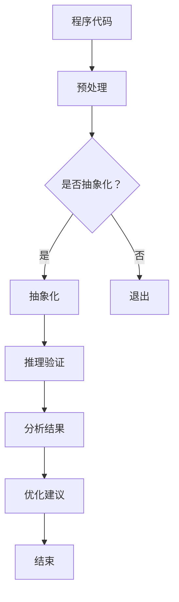

                 

### 第1章：静态程序分析概述

#### 1.1 静态程序分析的定义与意义

- **定义：** 静态程序分析是一种在程序运行之前，通过解析、检查和评估程序代码来发现潜在问题的技术。它不涉及程序的动态执行，而是通过分析代码结构和语义来获取程序信息。
- **意义：** 静态程序分析在软件开发过程中扮演着至关重要的角色。它可以提高软件质量、降低开发成本、减少维护难度，并帮助开发者更好地理解代码的行为。

#### 1.2 静态程序分析的发展历程

- **早期阶段：** 20世纪60年代，随着软件开发的兴起，人们开始关注如何提高软件质量和开发效率。静态程序分析的概念逐渐形成，并开始应用于代码审查和编译器的优化。
- **发展阶段：** 20世纪70年代，抽象解释和符号执行等理论的出现，为静态程序分析提供了新的方法和技术。这一时期，出现了许多静态分析工具，如LINT和Esprit。
- **成熟阶段：** 20世纪80年代，随着计算机硬件和软件的快速发展，静态程序分析技术得到了广泛的应用和深入研究。许多工业界和学术界的研究成果被应用于实际软件开发中。

#### 1.3 静态程序分析的核心概念

- **抽象：** 抽象是静态程序分析中的一个重要概念，它通过简化程序代码的结构和语义，使得分析过程更加高效和准确。
- **解释：** 解释是对程序代码进行推理和验证的过程，它帮助开发者理解代码的行为，并发现潜在的问题。

---

### 第2章：抽象解释的理论基础

#### 2.1 抽象解释的基本概念

- **定义：** 抽象解释是一种将程序代码转化为抽象形式，并通过推理和分析抽象形式来理解程序行为的方法。
- **作用：** 抽象解释可以帮助开发者更好地理解代码的行为，提高代码的可维护性，并发现潜在的错误。

#### 2.2 抽象解释的应用场景

- **代码审查：** 抽象解释可以用于自动化代码审查，帮助开发者发现代码中的潜在问题，如语法错误、逻辑错误和潜在的安全漏洞。
- **安全分析：** 抽象解释可以用于安全分析，检测程序中的安全漏洞，如SQL注入、跨站脚本攻击等。
- **性能优化：** 抽象解释可以用于性能优化，分析程序的性能瓶颈，并提供优化建议。

#### 2.3 抽象解释的方法与策略

- **数据流分析：** 数据流分析是一种常见的抽象解释方法，它通过分析变量在程序中的传播路径和取值，帮助开发者理解变量的行为。
- **控制流分析：** 控制流分析是一种用于分析程序执行路径的方法，它帮助开发者理解程序的执行过程，并发现潜在的错误。
- **依赖分析：** 依赖分析是一种用于分析程序中各部分之间依赖关系的方法，它帮助开发者理解程序的模块化和组件关系。

---

### 第3章：抽象解释与静态分析的关系

#### 3.1 抽象解释在静态分析中的角色

- **定义：** 抽象解释是静态分析中的一个核心工具，它通过将程序代码转化为抽象形式，使得静态分析过程更加高效和准确。
- **作用：** 抽象解释可以帮助静态分析工具更好地理解程序代码，发现潜在的问题，并生成更准确的报告。

#### 3.2 抽象解释的优势与局限

- **优势：**
  - 降低分析复杂度：通过将程序代码转化为抽象形式，抽象解释可以简化分析过程，降低分析复杂度。
  - 提高分析准确性：抽象解释可以更准确地分析程序行为，减少分析错误。
  - 增强可维护性：抽象解释可以帮助开发者更好地理解代码行为，提高代码的可维护性。
- **局限：**
  - 时间和空间成本：抽象解释过程可能需要较大的时间和空间成本，尤其是在处理大规模程序时。
  - 分析深度限制：抽象解释可能无法完全反映程序的动态行为，特别是在处理复杂和动态的程序时。

#### 3.3 抽象解释与其他静态分析方法的比较

- **数据流分析：** 数据流分析是抽象解释的一种常见方法，它通过分析变量在程序中的传播路径和取值，帮助开发者理解变量的行为。与数据流分析相比，抽象解释可以更全面地分析程序行为，但可能需要更多的时间和空间。
- **控制流分析：** 控制流分析是一种用于分析程序执行路径的方法，它通过分析程序的跳转和分支，帮助开发者理解程序的执行过程。与控制流分析相比，抽象解释可以更准确地分析程序行为，但可能无法完全反映程序的动态行为。
- **依赖分析：** 依赖分析是一种用于分析程序中各部分之间依赖关系的方法，它通过分析程序中的模块和组件，帮助开发者理解程序的模块化和组件关系。与依赖分析相比，抽象解释可以更全面地分析程序行为，但可能需要更多的时间和空间。

---

### 第4章：抽象解释的核心概念原理

#### 4.1 抽象解释的基本原理

- **定义：** 抽象解释是一种将程序代码转化为抽象形式，并通过推理和分析抽象形式来理解程序行为的方法。
- **原理：**
  - **抽象化：** 抽象解释通过将程序代码转化为抽象形式，简化了程序的复杂度，使得分析过程更加高效和准确。
  - **推理：** 抽象解释通过对抽象形式进行推理和分析，发现程序中的潜在问题，如变量依赖、控制流异常等。
  - **验证：** 抽象解释通过验证抽象形式，确保分析结果的准确性和可靠性。

#### 4.2 抽象解释的属性特征对比表格

| 特性         | 抽象解释           | 数据流分析       | 控制流分析       | 依赖分析         |
| ------------ | ------------------ | --------------- | --------------- | ---------------- |
| **定义**     | 程序行为的抽象分析   | 变量依赖分析     | 程序执行路径分析   | 模块和组件关系分析 |
| **目标**     | 理解程序行为、发现错误 | 发现变量依赖问题   | 发现控制流异常     | 确保模块间一致性   |
| **方法**     | 抽象形式化、推理验证   | 流图表示、路径分析   | 图表示、路径分析   | 调用图表示、依赖分析 |
| **优势**     | 低时间成本、高准确性   | 低空间成本、快速分析   | 低时间成本、快速分析   | 低时间成本、高准确性 |
| **局限**     | 高空间成本、分析深度限制 | 分析深度限制、空间成本高 | 分析深度限制、空间成本高   | 分析深度限制、时间成本高 |

#### 4.3 抽象解释的ER实体关系图架构

- **实体：**
  - **程序代码：** 表示程序中的源代码。
  - **抽象形式：** 表示通过抽象解释得到的程序代码的抽象形式。
  - **分析结果：** 表示通过抽象解释分析得到的程序行为和潜在问题的结果。
- **关系：**
  - **程序代码 -> 抽象形式：** 表示程序代码经过抽象解释后转化为抽象形式。
  - **抽象形式 -> 分析结果：** 表示通过抽象形式分析得到的程序行为和潜在问题的结果。
  - **分析结果 -> 优化建议：** 表示根据分析结果提供的优化建议。

```mermaid
erDiagram
  程序代码 ||--o> 抽象形式 : 转换
  抽象形式 ||--o> 分析结果 : 分析
  分析结果 ||--o> 优化建议 : 建议
```

---

### 第5章：抽象解释算法原理

#### 5.1 抽象解释算法的mermaid流程图



#### 5.2 抽象解释算法的python源代码

```python
# 抽象解释算法的Python实现

# 预处理
def preprocess(source_code):
    # 对源代码进行预处理，如去除注释、缩进等
    # ...
    return preprocessed_code

# 抽象化
def abstraction(preprocessed_code):
    # 将预处理后的源代码转化为抽象形式
    # ...
    return abstract_form

# 推理验证
def reasoning(abstract_form):
    # 对抽象形式进行推理和验证，发现潜在问题
    # ...
    return analysis_result

# 生成优化建议
def optimization_suggestion(analysis_result):
    # 根据分析结果生成优化建议
    # ...
    return suggestion

# 抽象解释算法的入口
def abstract_explanation(source_code):
    preprocessed_code = preprocess(source_code)
    if not is_abstractable(preprocessed_code):
        print("无法进行抽象化")
        return
    abstract_form = abstraction(preprocessed_code)
    analysis_result = reasoning(abstract_form)
    suggestion = optimization_suggestion(analysis_result)
    return suggestion

# 示例
source_code = """
# 示例代码
def add(a, b):
    return a + b
"""
suggestion = abstract_explanation(source_code)
print(suggestion)
```

#### 5.3 抽象解释算法的数学模型与公式

- **抽象化：** 抽象化是将具体的程序代码转化为更抽象的形式。数学上，可以表示为：
  $$ A' = f(A) $$
  其中，$A'$ 是抽象后的形式，$A$ 是原始程序代码，$f$ 是抽象化函数。

- **推理验证：** 推理验证是在抽象形式上进行分析，以发现潜在的问题。数学上，可以表示为：
  $$ P(A') \rightarrow R(A') $$
  其中，$P(A')$ 表示抽象形式上的假设，$R(A')$ 表示基于假设的推理结果。

#### 5.4 抽象解释算法的详细讲解与举例说明

- **抽象化过程：**
  抽象化是将具体的程序代码转化为更抽象的形式，以简化分析过程。例如，将具体的函数调用转化为函数抽象表示，将循环结构转化为循环抽象表示等。

- **推理验证过程：**
  推理验证是在抽象形式上进行分析，以发现潜在的问题。例如，通过分析函数的输入和输出，验证函数是否满足预期的行为。

- **举例说明：**
  考虑以下程序代码：

  ```python
  def add(a, b):
      return a + b
  ```

  - **抽象化：**
    ```python
    def binary_operation(a, b):
        return a + b
    ```

  - **推理验证：**
    假设输入 $a=2$ 和 $b=3$，则：
    ```python
    binary_operation(2, 3) = 2 + 3 = 5
    ```

    根据函数定义，输出应该等于输入的和。因此，该抽象形式满足预期的行为。

---

### 第6章：抽象解释在软件开发中的应用

#### 6.1 抽象解释在软件开发中的问题场景

- **代码质量评估：** 在代码审查过程中，使用抽象解释技术可以快速发现代码中的潜在问题，如语法错误、逻辑错误和潜在的安全漏洞。
- **性能优化：** 在性能分析过程中，使用抽象解释技术可以分析程序的行为，发现性能瓶颈，并提供优化建议。
- **安全检测：** 在安全测试过程中，使用抽象解释技术可以检测程序中的安全漏洞，如SQL注入、跨站脚本攻击等。

#### 6.2 抽象解释在软件开发中的应用实例

- **代码质量评估：** 使用抽象解释技术进行代码质量评估，可以快速发现代码中的潜在问题。例如，使用数据流分析技术，可以检测变量未初始化、变量溢出等潜在问题。
- **性能优化：** 使用抽象解释技术进行性能优化，可以分析程序的行为，发现性能瓶颈。例如，使用控制流分析技术，可以检测循环冗余、函数调用冗余等问题。
- **安全检测：** 使用抽象解释技术进行安全检测，可以检测程序中的安全漏洞。例如，使用依赖分析技术，可以检测SQL注入、跨站脚本攻击等潜在漏洞。

#### 6.3 抽象解释在软件开发中的系统架构设计

- **模块划分：** 使用抽象解释技术进行系统架构设计时，可以将程序划分为多个模块，每个模块负责不同的功能。通过抽象解释，可以分析模块之间的依赖关系，确保模块之间的接口清晰、模块化程度高。
- **接口设计：** 使用抽象解释技术进行接口设计时，可以分析模块之间的交互关系，确保接口设计的合理性和一致性。通过抽象解释，可以检测接口调用错误、接口参数传递错误等问题。
- **系统交互：** 使用抽象解释技术进行系统交互分析时，可以分析程序中各个模块之间的交互过程，确保系统交互的可靠性和一致性。通过抽象解释，可以检测数据传递错误、控制流异常等问题。

---

### 第7章：抽象解释项目实战

#### 7.1 环境安装与配置

- **安装依赖：** 在开始项目实战之前，需要安装抽象解释的相关依赖。例如，安装Python的抽象解释库、数据流分析库等。
- **配置环境：** 配置Python环境，确保抽象解释库和其他依赖的版本兼容性。

#### 7.2 系统核心实现源代码

- **代码结构：** 项目核心代码可以分为三个部分：预处理、抽象化和推理验证。
- **预处理：** 预处理代码用于对源代码进行预处理，如去除注释、缩进等。
- **抽象化：** 抽象化代码用于将预处理后的源代码转化为抽象形式。
- **推理验证：** 推理验证代码用于对抽象形式进行推理和验证，发现潜在问题。

#### 7.3 代码应用解读与分析

- **代码应用：** 使用抽象解释技术对实际的程序代码进行分析，发现潜在的问题和优化建议。
- **解读与分析：** 分析代码的抽象形式，理解代码的行为，发现潜在的错误和性能瓶颈。

#### 7.4 实际案例分析与详细讲解剖析

- **案例一：** 分析一个简单的Python函数，使用抽象解释技术发现潜在的问题和优化建议。
- **案例二：** 分析一个复杂的Java程序，使用抽象解释技术分析程序的行为，发现潜在的性能瓶颈和安全漏洞。

#### 7.5 项目小结

- **项目总结：** 总结项目中的关键技术和方法，分析项目的优点和不足，提出改进建议。
- **未来展望：** 探讨抽象解释技术在软件开发中的未来发展趋势和应用前景。

---

### 第8章：抽象解释的最佳实践

#### 8.1 抽象解释在实际项目中的经验分享

- **代码审查：** 在代码审查过程中，使用抽象解释技术可以快速发现代码中的潜在问题，提高代码质量。
- **性能优化：** 在性能优化过程中，使用抽象解释技术可以分析程序的行为，发现性能瓶颈，并提供优化建议。
- **安全检测：** 在安全检测过程中，使用抽象解释技术可以检测程序中的安全漏洞，提高软件安全性。

#### 8.2 抽象解释的常见问题与解决方案

- **分析时间成本高：** 使用抽象解释技术进行大规模程序分析时，可能需要较大的时间和空间成本。解决方案包括优化算法、减少分析范围等。
- **分析准确性不足：** 抽象解释可能无法完全反映程序的动态行为，导致分析结果的准确性不足。解决方案包括提高抽象解释的精度、结合动态分析技术等。

#### 8.3 抽象解释的未来发展趋势

- **多语言支持：** 抽象解释技术在未来可能会支持更多的编程语言，提高其在实际项目中的应用范围。
- **结合动态分析：** 抽象解释技术与动态分析技术相结合，可以更全面地分析程序的行为，提高分析结果的准确性。
- **自动化工具：** 抽象解释技术的自动化工具将得到进一步发展，提高分析效率和准确性。

---

### 第9章：小结与展望

#### 9.1 本书主要内容回顾

- **静态程序分析概述：** 介绍了静态程序分析的定义、意义、发展历程和核心概念。
- **抽象解释的理论基础：** 介绍了抽象解释的基本概念、应用场景和抽象化方法。
- **抽象解释与静态分析的关系：** 分析了抽象解释在静态分析中的角色、优势与局限。
- **抽象解释算法原理：** 讲解了抽象解释算法的基本原理、数学模型和Python实现。
- **抽象解释在软件开发中的应用：** 介绍了抽象解释在软件开发中的问题场景、应用实例和系统架构设计。
- **抽象解释项目实战：** 通过实际案例，展示了抽象解释在软件开发中的应用。
- **抽象解释的最佳实践：** 分享了抽象解释在实际项目中的经验、常见问题与解决方案和未来发展趋势。

#### 9.2 抽象解释的应用领域拓展

- **软件工程：** 抽象解释技术在软件工程中具有广泛的应用，包括代码质量评估、性能优化和安全检测等。
- **人工智能：** 抽象解释技术可以用于人工智能领域，如程序生成、模型验证等。
- **安全领域：** 抽象解释技术可以用于安全领域，如漏洞检测、入侵检测等。

#### 9.3 抽象解释在未来的挑战与机遇

- **挑战：**
  - **分析准确性：** 提高抽象解释的准确性，以更好地发现潜在的问题。
  - **时间成本：** 优化算法，降低分析时间和空间成本。
  - **多语言支持：** 扩展抽象解释技术，支持更多编程语言。
- **机遇：**
  - **自动化工具：** 开发更高效的抽象解释自动化工具，提高分析效率。
  - **跨领域应用：** 探索抽象解释技术在其他领域的应用，如人工智能、安全领域等。

---

**作者：AI天才研究院/AI Genius Institute & 禅与计算机程序设计艺术 /Zen And The Art of Computer Programming**

