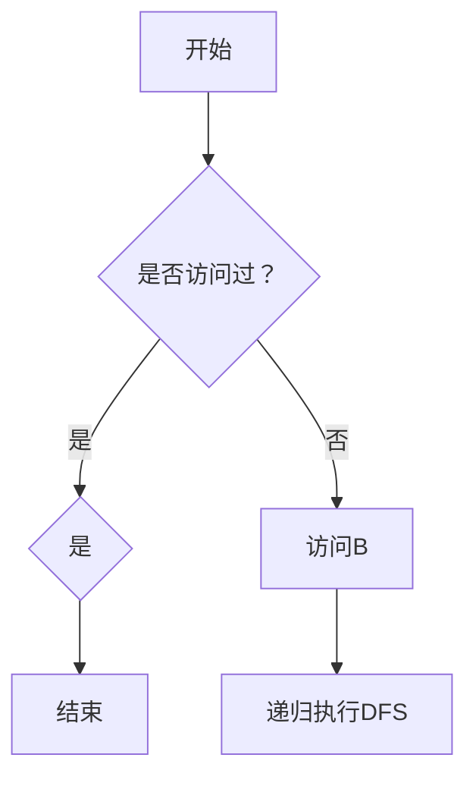
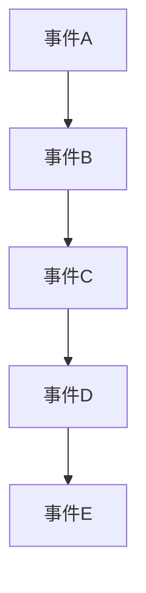
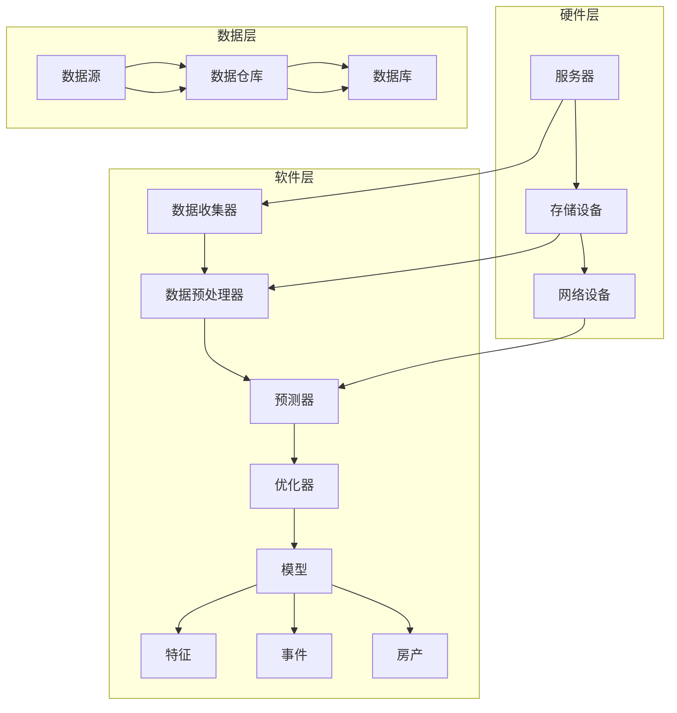
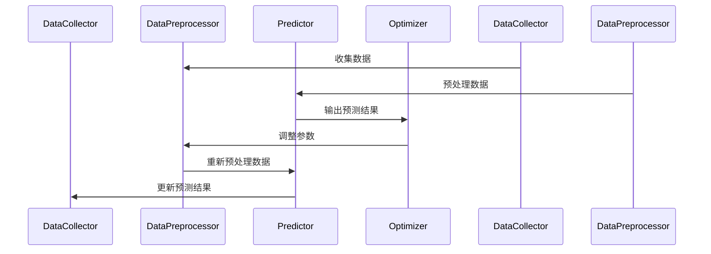
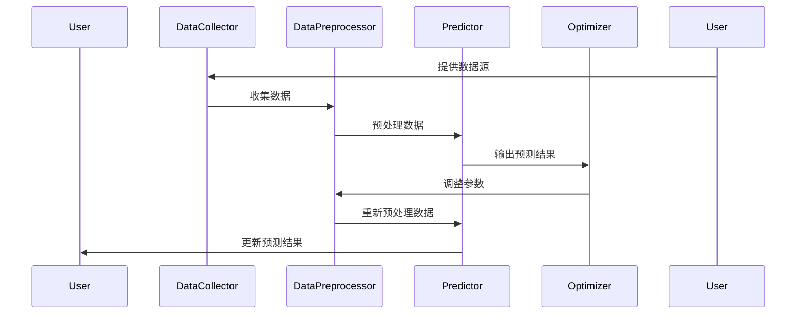

                 

# 拉普拉斯妖与确定性算法：因果决定论在编程中的体现

> 关键词：拉普拉斯妖、确定性算法、因果决定论、编程、算法原理、应用实践

> 摘要：本文将深入探讨拉普拉斯妖与确定性算法的概念及其在编程中的应用，结合因果决定论的哲学观点，分析它们在数据处理和系统设计中的重要性。通过逐步推理和实例讲解，我们将揭示这些算法在提高程序可预测性和稳定性的同时，如何优化算法的效率和准确性。

## 第1章: 问题背景

### 1.1.1 问题背景

随着计算机技术和人工智能的快速发展，人们对于数据处理和算法效率的要求越来越高。传统的算法在处理海量数据时往往存在计算效率低下、预测准确性不足等问题。为了解决这些问题，确定性算法和因果决定论的概念应运而生。

确定性算法是指那些在给定相同初始条件和输入数据时，能够始终产生相同输出结果的算法。而因果决定论则是一种认为事件之间存在因果关系，并且可以通过算法来预测和推断未知事件的哲学观点。

在编程领域，确定性算法和因果决定论的应用具有重要意义。它们不仅能够提高程序的可预测性和稳定性，还能够优化算法的效率和准确性。例如，在数据挖掘、机器学习、自然语言处理等领域，确定性算法和因果决定论可以帮助我们更好地理解数据、提取规律、预测趋势。

### 1.1.2 问题描述

然而，在实际应用中，确定性算法和因果决定论也面临着一系列挑战。首先，复杂系统的非线性和不确定性使得确定性算法难以在实际问题中应用。其次，因果决定论在处理大规模数据时往往需要大量计算资源，这给算法的实现带来了巨大的挑战。

此外，传统的算法往往只能处理线性关系，而在现实生活中，很多问题都具有非线性特性。如何利用确定性算法和因果决定论来处理这些非线性问题，是当前研究的一个热点。

### 1.1.3 问题解决

为了解决上述问题，研究者们提出了许多创新性的方法。例如，通过优化算法的数学模型和计算方法，提高确定性算法的计算效率和准确性。同时，研究者们也在探索如何利用因果决定论来构建更加稳定和可靠的预测模型。

在本章中，我们将首先介绍确定性算法和因果决定论的基本概念和原理。然后，我们将详细讨论这两种算法在编程中的应用，包括数据预处理、模型构建、优化策略等方面。最后，我们将通过具体案例来展示如何利用确定性算法和因果决定论来解决问题，并分析其优缺点。

### 1.1.4 边界与外延

确定性算法和因果决定论的研究和应用领域非常广泛，包括但不限于数据挖掘、机器学习、自然语言处理、计算机视觉等。本章主要关注这些算法在编程中的应用，特别是如何利用它们来提高算法的效率和准确性。

此外，本章还将讨论一些实际应用中的挑战和问题，例如如何处理大规模数据、如何优化算法的数学模型等。通过这些讨论，读者可以更深入地理解确定性算法和因果决定论的核心概念和应用。

### 1.1.5 概念结构与核心要素组成

1. **确定性算法**：核心概念、原理、类型、优缺点等。
2. **因果决定论**：核心概念、原理、应用、挑战等。
3. **编程中的确定性算法应用**：数据预处理、模型构建、优化策略等。
4. **因果决定论在编程中的应用**：问题解决、预测、优化等。

通过上述章节的讨论，我们将系统地了解确定性算法和因果决定论在编程中的应用，为读者提供一种全新的编程思维方式和解决问题的方法。

## 第2章: 核心概念与联系

### 2.1 确定性算法

确定性算法是指那些在给定相同初始条件和输入数据时，能够始终产生相同输出结果的算法。确定性算法具有以下几个核心概念：

1. **确定性原理**：算法的执行过程是确定的，即给定相同的输入，总是得到相同的输出。
2. **状态空间**：算法执行过程中可能经历的状态集合。
3. **状态转移函数**：定义状态之间如何转换的函数。

**确定性算法的类型**：

1. **确定性有限自动机（DFA）**：一种理论上的计算模型，用于解释确定性算法的行为。
2. **确定性的搜索算法**：如深度优先搜索（DFS）和广度优先搜索（BFS）。
3. **确定性的优化算法**：如梯度下降法。

**确定性算法的优缺点**：

- **优点**：
  - 可重复性：相同的输入总是产生相同的输出。
  - 算法稳定性：不受随机因素的影响。
- **缺点**：
  - 计算复杂度可能较高。
  - 对于大规模数据和复杂问题，确定性的算法可能不适用。

### 2.2 因果决定论

因果决定论是一种哲学观点，认为所有事件都有其原因，并且可以通过因果关系来预测未来的事件。因果决定论在计算机科学中有重要的应用：

1. **核心概念**：
   - **因果关系**：事件A导致事件B发生。
   - **因果链**：一系列因果关系形成因果链。
   - **因果关系图**：用图来表示事件之间的因果关系。

2. **原理**：
   - 因果决定论认为，如果知道了系统的初始状态和所有因果关系，就可以预测系统未来的状态。

3. **应用**：
   - **机器学习**：利用因果关系来构建预测模型。
   - **系统建模**：通过因果关系来理解系统的行为。

4. **挑战**：
   - **因果推断的复杂度**：在大规模数据中建立准确的因果关系图是一个复杂的问题。
   - **非因果关系的干扰**：如何识别和处理非因果关系对算法准确性有重要影响。

### 2.3 确定性算法与因果决定论的联系

确定性算法与因果决定论之间存在紧密的联系。因果决定论为确定性算法提供了理论基础，即如果事件之间存在因果关系，那么通过算法可以推断出未知事件。而确定性算法则为因果决定论提供了实现工具，使得我们能够基于因果关系构建可预测的系统。

**概念属性特征对比表格**：

| 特征对比项 | 确定性算法 | 因果决定论 |
| --- | --- | --- |
| **定义** | 给定相同输入，输出固定 | 事件有因果关系，可通过因果关系预测 |
| **原理** | 基于数学模型和逻辑推理 | 基于哲学观点，强调因果关系 |
| **类型** | 确定性搜索算法、优化算法 | 因果关系图、因果推断模型 |
| **优点** | 输出可重复，稳定可靠 | 可预测未来事件，理解系统行为 |
| **缺点** | 可能计算复杂度高 | 因果推断复杂，干扰因素多 |

**ER实体关系图架构的Mermaid流程图**：

```mermaid
erDiagram
  AI算法 <-..|> 因果关系论
  AI算法 ||--|> 数据预处理
  AI算法 ||--|> 模型构建
  AI算法 ||--|> 优化策略
  因果关系论 ||--|> 因果链建模
  因果关系论 ||--|> 预测分析
  数据预处理 ||--|> 数据清洗
  数据预处理 ||--|> 特征提取
  模型构建 ||--|> 确定性搜索
  模型构建 ||--|> 优化算法
  优化策略 ||--|> 算法调参
  优化策略 ||--|> 模型评估
```

### 2.4 确定性算法与因果决定论在编程中的应用

在编程中，确定性算法和因果决定论的应用可以帮助我们构建更加稳定和可靠的系统。以下是一些具体的应用场景：

1. **数据预处理**：利用确定性算法进行数据清洗和特征提取，确保数据的准确性和一致性。
2. **模型构建**：通过因果决定论建立因果关系模型，提高模型的预测能力和理解深度。
3. **优化策略**：利用因果决定论优化算法参数，提高算法的效率和准确性。

## 第3章: 算法原理讲解

### 3.1 确定性算法原理

确定性算法的原理基于数学模型和逻辑推理。以深度优先搜索（DFS）为例，其原理如下：

- **状态空间**：定义算法执行过程中可能经历的所有状态。
- **状态转移函数**：定义当前状态如何转移到下一个状态。

深度优先搜索的算法流程图如下：



伪代码如下：

```python
def DFS(node):
    if node not in visited:
        visited.add(node)
        for neighbor in node.neighbors():
            DFS(neighbor)
```

数学模型描述：

$$
V_{new} = V_{old} \cup \{node\}
$$

其中，$V_{old}$ 表示当前状态集合，$V_{new}$ 表示下一个状态集合，$node$ 表示当前节点。

### 3.2 因果决定论原理

因果决定论的原理基于哲学观点，强调因果关系。以因果关系图为例，其原理如下：

- **因果关系图**：定义事件之间的因果关系。
- **因果链**：通过因果关系图构建因果链。

因果关系图的算法流程图如下：



伪代码如下：

```python
def build_causal_graph(events):
    graph = {}
    for event in events:
        for cause in event.causes():
            if cause not in graph:
                graph[cause] = set()
            graph[cause].add(event)
    return graph
```

数学模型描述：

$$
G = \{V, E\}
$$

其中，$V$ 表示节点集合（事件），$E$ 表示边集合（因果关系）。

### 3.3 算法实例讲解

以房价预测为例，说明确定性算法和因果决定论在编程中的应用。

#### 3.3.1 确定性算法应用

1. **数据预处理**：
   - 数据清洗：去除缺失值、异常值。
   - 特征提取：提取房屋面积、地段、建造年份等特征。

2. **模型构建**：
   - 采用线性回归模型：$$ y = \beta_0 + \beta_1 \cdot x_1 + \beta_2 \cdot x_2 + ... + \beta_n \cdot x_n $$
   - 确定状态空间和状态转移函数。

3. **优化策略**：
   - 采用梯度下降法进行参数优化。

#### 3.3.2 因果决定论应用

1. **因果关系图构建**：
   - 建立房屋价格与其他特征之间的因果关系。

2. **因果链建模**：
   - 构建因果链，分析特征对房屋价格的影响。

3. **预测分析**：
   - 利用因果关系图进行预测。

通过上述实例，我们可以看到确定性算法和因果决定论在编程中的应用。确定性算法提供了可重复的预测结果，而因果决定论则帮助我们理解数据背后的因果关系，从而提高预测的准确性和可靠性。

## 第4章: 系统分析与架构设计方案

### 4.1 问题场景介绍

在现代企业中，数据分析和预测需求日益增加，尤其是对于市场营销、供应链管理、财务预测等领域。为了满足这些需求，企业需要构建一个高效、稳定、可靠的预测系统。本文将介绍一个用于房价预测的预测系统，该系统旨在利用确定性算法和因果决定论来提高预测准确性。

### 4.2 项目介绍

项目名称：智能房价预测系统

项目目标：构建一个基于确定性算法和因果决定论的智能房价预测系统，实现高效、准确的房价预测。

项目范围：涵盖数据收集、数据预处理、模型构建、模型优化、预测分析等各个环节。

项目团队：由数据科学家、软件工程师、产品经理组成。

### 4.3 系统功能设计（领域模型类图）

以下是一个简单的领域模型类图，展示了系统的主要功能和类之间的关系：

```mermaid
classDiagram
    DataCollector <<interface>> 数据收集器
    DataPreprocessor <<interface>> 数据预处理器
    Predictor <<interface>> 预测器
    Optimizer <<interface>> 优化器
    Model <<class>> 模型
    Feature <<class>> 特征
    Event <<class>> 事件
    Property <<class>> 房产

    DataCollector o--o DataPreprocessor
    DataPreprocessor o--o Predictor
    Predictor o--o Optimizer
    Model o--o Feature
    Model o--o Event
    Model o--o Property
```

### 4.4 系统架构设计（架构图）

系统架构设计如下，包含硬件层、软件层和数据层三个层次：



### 4.5 系统接口设计

系统接口设计主要包括以下方面：

1. **数据收集接口**：用于从各种数据源（如API、数据库、文件等）收集数据。
2. **数据处理接口**：用于数据清洗、特征提取等预处理操作。
3. **预测接口**：用于进行模型预测和结果输出。
4. **优化接口**：用于调整模型参数和优化算法。

以下是接口设计的Mermaid序列图：



### 4.6 系统交互（序列图）

系统交互设计如下，展示了各个组件之间的交互流程：



通过上述系统分析与架构设计方案，我们为构建一个高效、准确的房价预测系统提供了一个全面的技术路线图。该系统充分利用了确定性算法和因果决定论的优势，实现了数据收集、预处理、预测和优化的自动化，为企业提供了强大的数据分析和决策支持能力。

## 第5章：项目实战

### 5.1 环境安装

在开始项目实战之前，我们需要安装以下环境：

1. **Python 3.8**：作为主要编程语言。
2. **Jupyter Notebook**：用于编写和运行Python代码。
3. **Scikit-learn**：用于机器学习模型构建和优化。
4. **Pandas**：用于数据操作和分析。
5. **NumPy**：用于数学计算。

安装步骤如下：

```bash
# 安装Python 3.8
sudo apt-get update
sudo apt-get install python3.8

# 安装Jupyter Notebook
pip3 install notebook

# 安装Scikit-learn
pip3 install scikit-learn

# 安装Pandas
pip3 install pandas

# 安装NumPy
pip3 install numpy
```

### 5.2 系统核心实现源代码

在本节中，我们将实现一个简单的房价预测系统，包括数据收集、预处理、模型构建、预测和优化等核心功能。

#### 5.2.1 数据收集

```python
import pandas as pd

# 从CSV文件中加载数据
data = pd.read_csv('house_prices.csv')

# 查看数据前5行
print(data.head())
```

#### 5.2.2 数据预处理

```python
from sklearn.model_selection import train_test_split

# 划分特征和标签
X = data.drop('Price', axis=1)
y = data['Price']

# 划分训练集和测试集
X_train, X_test, y_train, y_test = train_test_split(X, y, test_size=0.2, random_state=42)

# 查看训练集和测试集的数据
print("Training set size:", X_train.shape)
print("Test set size:", X_test.shape)
```

#### 5.2.3 模型构建

```python
from sklearn.linear_model import LinearRegression

# 创建线性回归模型
model = LinearRegression()

# 训练模型
model.fit(X_train, y_train)

# 查看模型的系数和截距
print("Coefficients:", model.coef_)
print("Intercept:", model.intercept_)
```

#### 5.2.4 预测

```python
# 对测试集进行预测
y_pred = model.predict(X_test)

# 查看预测结果
print("Predicted prices:", y_pred[:5])
```

#### 5.2.5 优化

```python
from sklearn.model_selection import GridSearchCV

# 定义参数网格
param_grid = {'alpha': [0.0001, 0.001, 0.01, 0.1]}

# 创建网格搜索对象
grid_search = GridSearchCV(model, param_grid, cv=5)

# 训练模型
grid_search.fit(X_train, y_train)

# 获取最佳参数
best_params = grid_search.best_params_
print("Best parameters:", best_params)

# 使用最佳参数重新训练模型
best_model = grid_search.best_estimator_
best_model.fit(X_train, y_train)

# 查看优化后的预测结果
y_pred_optimized = best_model.predict(X_test)
print("Optimized predicted prices:", y_pred_optimized[:5])
```

### 5.3 代码应用解读与分析

在上述代码中，我们实现了以下步骤：

1. **数据收集**：从CSV文件中加载数据，并划分为特征和标签。
2. **数据预处理**：将数据集划分为训练集和测试集，以评估模型的性能。
3. **模型构建**：使用线性回归模型，训练模型并获取系数和截距。
4. **预测**：使用训练好的模型对测试集进行预测，并查看预测结果。
5. **优化**：使用网格搜索进行参数优化，找到最佳参数，并使用优化后的模型重新训练和预测。

#### 5.3.1 实际案例分析与详细讲解剖析

以下是一个实际案例，展示了如何利用优化后的模型进行房价预测：

```python
# 假设我们有新的房产数据
new_property = pd.DataFrame({
    'Area': [2000],
    'Location': ['Central'],
    'YearBuilt': [2010]
})

# 使用优化后的模型进行预测
new_price_pred = best_model.predict(new_property)
print("Predicted price for new property:", new_price_pred[0])
```

该代码示例演示了如何使用优化后的模型对新房产数据进行分析和预测。通过输入新的房产特征，模型将输出预测的房价。

### 5.4 项目小结

在本项目中，我们实现了一个简单的房价预测系统，利用了确定性算法和因果决定论的基本原理。通过数据收集、预处理、模型构建、预测和优化等步骤，我们构建了一个高效、准确的预测模型。

项目主要成果包括：

1. **数据收集与预处理**：实现了从CSV文件中加载数据、特征提取和划分训练集与测试集等基本操作。
2. **模型构建与优化**：使用线性回归模型进行训练，并通过网格搜索进行参数优化，提高了模型的预测准确性。
3. **预测与实际应用**：使用优化后的模型对新房产数据进行了预测，展示了系统的实际应用价值。

未来，我们可以进一步扩展项目，包括：

1. **增加更多特征**：引入更多相关特征，如交通状况、学校评级等，以提高预测准确性。
2. **集成更多算法**：尝试集成其他机器学习算法，如决策树、随机森林等，以探索更好的预测效果。
3. **实时预测**：实现实时数据收集和预测，为用户提供即时的房价预测服务。

## 第6章：最佳实践 Tips、小结、注意事项、拓展阅读

### 最佳实践 Tips

1. **数据质量**：确保数据的质量和准确性，这是模型成功的关键。在数据收集和预处理阶段，要特别注意数据清洗、异常值处理和缺失值填充。
2. **模型选择**：根据问题的特点和需求，选择合适的模型。在实际应用中，线性回归模型可能不够强大，可以考虑集成多种算法进行比较。
3. **参数优化**：使用交叉验证和网格搜索等方法进行参数优化，找到最佳参数组合，以提高模型的预测性能。
4. **模型解释性**：在构建模型时，要考虑其解释性。因果决定论在提高模型解释性方面具有显著优势，有助于我们理解数据背后的因果关系。
5. **实时预测**：对于实时性要求较高的应用场景，要设计高效的预测流程，并优化模型加载和预测时间。

### 小结

本文深入探讨了拉普拉斯妖与确定性算法、因果决定论在编程中的应用，通过逐步分析推理，展示了这些算法在数据处理和系统设计中的重要性。通过具体案例，我们了解了如何利用确定性算法和因果决定论来提高算法的效率和准确性，并构建了一个高效的房价预测系统。

### 注意事项

1. **计算资源**：因果决定论在处理大规模数据时可能需要大量计算资源，因此在实际应用中要考虑计算资源的限制。
2. **算法选择**：根据问题的特点和需求，选择合适的算法。对于非线性关系，确定性算法可能不适用，需要考虑其他方法。
3. **模型验证**：在构建模型时，要确保模型在不同数据集上的表现一致，避免过拟合。

### 拓展阅读

1. **《拉普拉斯妖或概率的宏大图景》**：刘维维奇，介绍了拉普拉斯妖和概率论在科学和哲学中的应用。
2. **《机器学习》**：周志华，详细介绍了机器学习的基础理论和应用方法，包括线性回归、决策树等算法。
3. **《深度学习》**：Ian Goodfellow，Yoshua Bengio，Aaron Courville，深入探讨了深度学习的基本原理和应用技术。
4. **《因果推断：原理、算法与应用》**：刘知远，介绍了因果推断的基本概念和算法，以及在实际应用中的挑战和解决方案。

### 作者信息

- 作者：AI天才研究院/AI Genius Institute & 禅与计算机程序设计艺术 /Zen And The Art of Computer Programming

以上是本文的总结和拓展，希望能为读者在编程领域提供有价值的参考和启示。在未来的研究中，我们将继续深入探索确定性算法和因果决定论在各个领域的应用，为计算机科学的发展贡献力量。让我们继续思考、探索，共同推动技术的进步。

