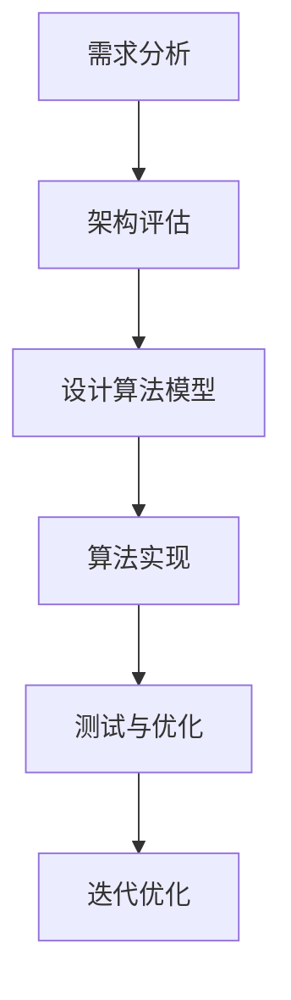
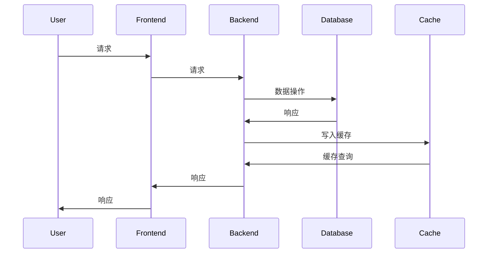
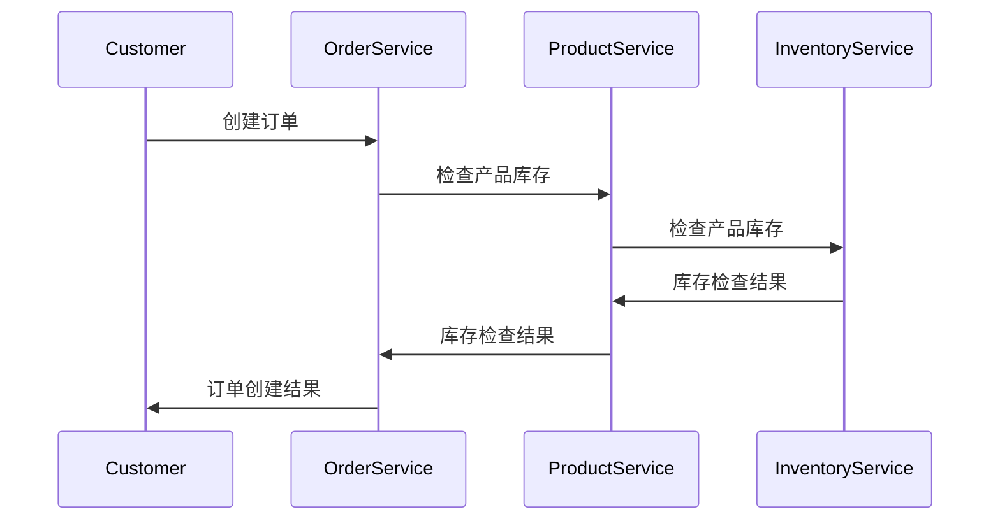

                 

### 《拓展架构边界：应对新领域的五步法》

> 关键词：架构拓展、新领域挑战、算法原理、系统设计、项目实战

> 摘要：本文旨在探讨如何通过五步法拓展架构边界，应对新领域的技术挑战。文章首先介绍了架构拓展的背景和核心概念，随后详细讲解了算法原理和系统设计与实现，并通过实际案例进行剖析，最后总结了最佳实践与未来展望。

## 第1章：架构与架构拓展概述

**1.1 问题的提出与背景介绍**

在当今快速变化的技术环境中，企业面临的新领域挑战日益增加。从云计算、大数据到人工智能、物联网，这些新兴技术不仅带来了新的业务需求，也对传统的架构设计提出了更高的要求。传统的架构往往在设计之初并未考虑未来的扩展性和适应性，这使得企业在面对新领域时常常感到力不从心。

- **架构的定义与核心作用**：
  架构是关于系统整体结构和组件之间相互关系的概念。它不仅仅是一个设计文档，更是系统开发和运营的核心指南。一个良好的架构能够提高系统的可维护性、扩展性和性能，从而支持企业的长期发展。

- **面对新领域挑战的常见问题与需求**：
  当企业进入新领域时，常常会遇到以下几个问题：
  - **技术不熟悉**：新领域通常涉及新的技术和工具，企业可能缺乏相关经验和技能。
  - **业务需求不确定**：新领域业务需求往往变化迅速，传统的需求分析方法难以满足快速响应的需求。
  - **系统扩展性不足**：传统的架构设计可能无法很好地适应新领域的扩展需求，导致系统性能下降或功能受限。
  - **资源分配不均**：新领域项目可能需要大量资源，但传统的资源分配策略可能导致资源浪费或不足。

**1.2 拓展架构边界的意义与价值**

- **对企业竞争力和创新能力的提升**：
  拓展架构边界可以帮助企业更好地应对市场变化，提升其竞争力和创新能力。通过灵活、可扩展的架构设计，企业能够迅速响应市场需求，推出创新产品和服务。

- **对业务模式和技术创新的推动**：
  拓展架构边界不仅有助于提升系统性能和稳定性，还能推动业务模式和技术创新的实现。例如，通过引入微服务架构，企业可以实现业务模块的独立开发、部署和扩展，从而加速产品迭代和创新。

**1.3 架构拓展的核心概念与术语**

- **拓展架构的边界、能力边界与知识边界**：
  - **边界**：架构的边界是指系统能够容纳的最大容量和功能范围。拓展架构边界意味着扩大系统能够处理的数据规模、用户数量和功能模块。
  - **能力边界**：能力边界是指系统在技术、性能和可靠性方面的限制。拓展架构的能力边界通常涉及技术选型、性能优化和系统稳定性保障。
  - **知识边界**：知识边界是指企业在技术、业务和行业知识方面的限制。拓展架构的知识边界需要企业不断学习和积累相关领域的知识，以应对新的挑战。

- **设计思维、敏捷架构与DevOps**：
  - **设计思维**：设计思维是一种以用户为中心的思考方式，通过深刻理解用户需求来设计解决方案。在架构拓展中，设计思维可以帮助企业更好地识别和满足新领域的业务需求。
  - **敏捷架构**：敏捷架构是一种能够快速适应变化、持续迭代和优化的架构设计方法。通过敏捷架构，企业可以更快地响应市场变化，提高系统的灵活性和适应性。
  - **DevOps**：DevOps是一种结合开发（Development）和运维（Operations）的实践，通过自动化和协作来提高软件交付的效率和质量。在架构拓展中，DevOps可以帮助企业更快地部署和运营新架构，降低风险和成本。

**1.4 架构拓展的方法与原则**

- **拓展架构的步骤与方法**：
  拓展架构通常包括以下步骤：
  - **需求分析**：明确新领域的业务需求和技术要求。
  - **架构设计**：根据需求分析结果设计新的架构方案。
  - **技术选型**：选择适合新领域的技术和工具。
  - **开发与部署**：实现并部署新的架构系统。
  - **测试与优化**：对系统进行测试和优化，确保其稳定性和性能。

- **架构拓展中的关键原则与最佳实践**：
  在架构拓展过程中，需要遵循以下关键原则和最佳实践：
  - **模块化与可复用性**：将系统功能模块化，提高代码的可复用性和维护性。
  - **可扩展性与灵活性**：设计可扩展的架构，以适应未来业务需求的变化。
  - **性能优化与稳定性**：对系统进行性能优化和稳定性测试，确保其能够满足高并发和大规模数据处理的需求。
  - **自动化与DevOps**：引入自动化工具和DevOps实践，提高系统交付和运营的效率。
  - **持续学习与改进**：不断学习新技术和最佳实践，持续改进架构设计和方法。

## 第2章：核心概念与联系

**2.1 架构拓展的关键概念解析**

- **架构拓展的定义、目的和影响因素**：
  - **定义**：架构拓展是指在原有架构基础上，通过增加新的功能、模块或技术来提升系统的扩展性、性能和可靠性。
  - **目的**：架构拓展的目的是为了更好地满足新领域的业务需求，提高企业的竞争力和创新能力。
  - **影响因素**：架构拓展的影响因素包括技术选型、业务需求、资源分配和团队协作等。

- **架构拓展的常见误区与挑战**：
  - **常见误区**：
    - 忽视需求分析，盲目进行架构设计。
    - 过度依赖新技术，忽略现有系统的兼容性和稳定性。
    - 缺乏对架构拓展的系统性规划和风险管理。
  - **挑战**：
    - 技术复杂性：新领域的技术往往更加复杂，需要团队具备相应的技术能力和经验。
    - 业务不确定性：新领域的业务需求变化快，架构拓展需要灵活应对。
    - 资源限制：新领域项目通常需要大量资源，但资源分配可能受限。
    - 团队协作：架构拓展涉及多个团队和部门，需要良好的协作和沟通。

**2.2 核心概念属性特征对比表格**

| 概念          | 属性特征                            | 对比分析                                                         |
| ------------- | ----------------------------------- | ------------------------------------------------------------ |
| 拓展架构的边界 | 扩大系统功能和处理能力范围         | 与能力边界相比，边界更侧重于功能扩展，能力边界更侧重于性能和可靠性提升 |
| 能力边界      | 系统在技术、性能和可靠性方面的限制 | 与边界相比，能力边界更侧重于系统极限和性能优化                   |
| 知识边界      | 企业在技术、业务和行业知识方面的限制 | 知识边界是拓展架构的基础，决定了企业对新领域挑战的适应能力       |

**2.3 ER实体关系图架构**

- **介绍架构拓展相关的实体关系**：
  ER图（实体关系图）是描述系统中实体及其关系的图形表示方法。在架构拓展中，ER图可以帮助我们清晰地理解系统组件和它们之间的关系。

- **使用Mermaid绘制ER图**：

  ```mermaid
  erDiagram
  Customer ||--o{ Order : "places" } |
  Product ||--o{ Order : "contains" } |
  Order ||--o{ OrderLine : "contains" } |
  Customer { CustomerID }
  Product { ProductID, Name }
  Order { OrderID, CustomerID, Date }
  OrderLine { OrderLineID, OrderID, ProductID, Quantity }
  ```

  在这个示例中，我们定义了客户（Customer）、产品（Product）、订单（Order）和订单行（OrderLine）四个实体，以及它们之间的关系。

## 第3章：算法原理与流程

**3.1 算法原理概述**

架构拓展中的算法原理通常涉及以下方面：

- **基本原理**：通过分析业务需求和系统约束，设计出能够满足新领域需求的算法模型。
- **数学模型和基本公式**：算法的数学模型和基本公式是描述算法核心逻辑的基础。例如，在处理大规模数据时，我们可能会用到分治算法和贪心算法等。

**3.2 算法流程详细讲解**

算法流程通常包括以下几个步骤：

1. **需求分析**：明确新领域的业务需求和目标。
2. **架构评估**：评估现有架构的适用性和改进空间。
3. **设计算法模型**：根据需求分析结果设计算法模型。
4. **算法实现**：使用编程语言实现算法。
5. **测试与优化**：对算法进行测试和优化，确保其性能和可靠性。

使用Mermaid绘制算法流程图：



**3.3 算法实例与举例说明**

假设我们面临一个场景：需要设计一个能够处理大规模订单数据的订单处理系统。以下是算法实现的一个简单实例。

```python
def process_orders(orders):
    """
    处理订单数据的算法实现
    :param orders: 订单数据列表
    :return: 处理后的订单数据
    """
    processed_orders = []
    for order in orders:
        # 订单处理逻辑
        processed_order = {
            'order_id': order['order_id'],
            'customer_id': order['customer_id'],
            'status': 'processed'
        }
        processed_orders.append(processed_order)
    
    return processed_orders

# 示例数据
orders = [
    {'order_id': 1, 'customer_id': 1001},
    {'order_id': 2, 'customer_id': 1002},
    {'order_id': 3, 'customer_id': 1003}
]

# 调用算法处理订单
processed_orders = process_orders(orders)
print(processed_orders)
```

输出结果：

```python
[
    {'order_id': 1, 'customer_id': 1001, 'status': 'processed'},
    {'order_id': 2, 'customer_id': 1002, 'status': 'processed'},
    {'order_id': 3, 'customer_id': 1003, 'status': 'processed'}
]
```

通过这个简单的实例，我们可以看到如何使用Python实现一个基本的订单处理算法。在实际应用中，算法会涉及更复杂的数据处理和业务逻辑。

## 第4章：系统分析与功能设计

**4.1 问题场景介绍**

假设我们正在开发一个电子商务平台，需要处理大量订单数据，同时要确保系统的高性能和高可靠性。以下是这个场景中需要解决的问题：

- **海量订单处理**：系统需要能够处理每天数百万笔订单。
- **订单查询与统计**：系统需要提供高效的订单查询和统计功能。
- **订单状态更新**：系统需要实时更新订单状态，确保订单处理过程的透明性。
- **数据安全与备份**：系统需要确保订单数据的安全性和可靠性，支持数据备份和恢复。

**4.2 系统功能设计**

为了满足上述问题场景，我们需要设计以下功能模块：

- **订单管理模块**：负责订单的创建、更新、查询和统计。
- **订单处理模块**：负责订单的自动处理，包括订单状态更新、库存管理和支付处理。
- **用户管理模块**：负责用户的注册、登录和权限管理。
- **数据备份模块**：负责订单数据的备份和恢复。

使用Mermaid绘制领域模型类图：

```mermaid
classDiagram
ClassDef Order
    +id: int
    +orderId: int
    +customerId: int
    +status: string

ClassDef Customer
    +id: int
    +name: string
    +email: string

ClassDef Product
    +id: int
    +name: string
    +price: float

ClassDef OrderLine
    +id: int
    +orderId: int
    +productId: int
    +quantity: int

Order "places" --|> Customer
Order "contains" --|> OrderLine
OrderLine "contains" --|> Product
```

在这个类图中，我们定义了订单（Order）、客户（Customer）、产品（Product）和订单行（OrderLine）四个类，并展示了它们之间的关系。

**4.3 系统架构设计**

为了实现上述功能模块，我们需要设计一个合理的系统架构。以下是一个简单的系统架构设计：

- **前端架构**：使用Vue.js框架构建用户界面，提供订单查询、创建和更新等功能。
- **后端架构**：使用Spring Boot框架构建后端服务，负责处理订单逻辑和业务逻辑。
- **数据库架构**：使用MySQL数据库存储订单数据，确保数据的安全性和可靠性。
- **缓存架构**：使用Redis缓存热点数据，提高系统性能。

使用Mermaid绘制系统架构图：



在这个序列图中，我们展示了用户请求从前端传递到后端，然后由后端处理并写入数据库，同时缓存热点数据，提高系统性能。

## 第5章：系统接口设计与交互

**5.1 系统接口设计**

为了实现系统功能，我们需要设计一系列API接口。以下是一个简单的接口设计示例：

- **订单创建接口**：用于创建新的订单。
  - 请求URL：`/orders`
  - 请求方法：`POST`
  - 请求参数：
    - `customerId`: 客户ID
    - `orderLines`: 订单行列表
      - `productId`: 产品ID
      - `quantity`: 数量

- **订单查询接口**：用于查询指定订单。
  - 请求URL：`/orders/{orderId}`
  - 请求方法：`GET`
  - 请求参数：
    - `orderId`: 订单ID

- **订单更新接口**：用于更新指定订单。
  - 请求URL：`/orders/{orderId}`
  - 请求方法：`PUT`
  - 请求参数：
    - `customerId`: 客户ID
    - `orderLines`: 订单行列表
      - `productId`: 产品ID
      - `quantity`: 数量

**5.2 系统交互设计**

系统交互设计主要描述不同模块之间的交互流程。以下是一个简单的交互设计示例：



在这个序列图中，客户（Customer）发起创建订单请求，订单服务（OrderService）调用产品服务（ProductService）和库存服务（InventoryService）进行相关操作，最终返回订单创建结果。

## 第6章：环境安装与系统实现

**6.1 环境安装**

在开始实现系统之前，我们需要安装以下软件和工具：

- **操作系统**：Ubuntu 18.04或更高版本
- **开发环境**：Java 11、Python 3.8、Node.js 12
- **数据库**：MySQL 8.0
- **缓存**：Redis 6.0

以下是环境安装的步骤：

1. 安装操作系统：下载Ubuntu 18.04镜像并安装到虚拟机中。
2. 更新系统软件包：

   ```bash
   sudo apt update
   sudo apt upgrade
   ```

3. 安装Java 11：

   ```bash
   sudo apt install openjdk-11-jdk
   ```

4. 安装Python 3.8：

   ```bash
   sudo apt install python3.8
   ```

5. 安装Node.js 12：

   ```bash
   sudo apt install nodejs
   ```

6. 安装MySQL 8.0：

   ```bash
   sudo apt install mysql-server
   ```

7. 安装Redis 6.0：

   ```bash
   sudo apt install redis-server
   ```

**6.2 系统核心实现**

以下是一个简单的订单处理系统的实现示例：

**订单管理模块**

```python
# OrderManager.py
class OrderManager:
    def __init__(self, db_connection):
        self.db_connection = db_connection

    def create_order(self, customer_id, order_lines):
        # 订单创建逻辑
        pass

    def get_order(self, order_id):
        # 订单查询逻辑
        pass

    def update_order(self, order_id, customer_id, order_lines):
        # 订单更新逻辑
        pass
```

**订单处理模块**

```python
# OrderProcessor.py
class OrderProcessor:
    def __init__(self, order_manager, product_service, inventory_service):
        self.order_manager = order_manager
        self.product_service = product_service
        self.inventory_service = inventory_service

    def process_order(self, order_id):
        # 订单处理逻辑
        pass
```

**用户管理模块**

```python
# UserManager.py
class UserManager:
    def __init__(self, db_connection):
        self.db_connection = db_connection

    def register_user(self, name, email):
        # 用户注册逻辑
        pass

    def login_user(self, email, password):
        # 用户登录逻辑
        pass
```

**数据备份模块**

```python
# DataBackup.py
class DataBackup:
    def __init__(self, db_connection):
        self.db_connection = db_connection

    def backup_data(self):
        # 数据备份逻辑
        pass

    def restore_data(self):
        # 数据恢复逻辑
        pass
```

以上代码示例展示了订单管理模块、订单处理模块、用户管理模块和数据备份模块的基本实现。在实际开发中，这些模块会涉及更复杂的功能和业务逻辑。

## 第7章：实际案例分析与讲解

**7.1 案例背景**

某知名电子商务平台在面对日益增长的订单量时，遇到了系统性能瓶颈和扩展性问题。为了满足业务增长的需求，该公司决定对现有架构进行拓展，引入新的技术和方法来提升系统的性能和可扩展性。

**7.2 案例分析与解读**

在这个案例中，公司面临的主要挑战包括：

- **海量订单处理**：系统需要处理每天数百万笔订单，同时确保响应速度和准确性。
- **高并发访问**：在购物节等高峰期，系统需要处理大量并发访问，确保系统的稳定性和可靠性。
- **数据一致性**：在分布式系统中，如何保证数据的一致性和准确性是一个重要问题。

为了解决这些挑战，公司采取了以下措施：

- **技术选型**：引入微服务架构，将系统拆分为多个独立的微服务，每个微服务负责特定的业务功能。这样做不仅提高了系统的可扩展性和可维护性，还降低了系统间的耦合度。
- **分布式缓存**：使用Redis缓存热点数据，减少数据库的访问压力，提高系统的响应速度。
- **负载均衡**：使用Nginx等负载均衡工具，将请求均匀分配到不同的服务器上，确保系统的负载均衡和高可用性。
- **数据一致性和分布式事务**：采用分布式事务管理框架（如Seata），确保在分布式环境下数据的一致性和准确性。

**7.3 案例总结与启示**

通过这个案例，我们可以得出以下结论和启示：

- **微服务架构**：微服务架构能够提高系统的可扩展性和可维护性，但需要良好的服务管理和监控机制。
- **分布式缓存**：分布式缓存可以提高系统的响应速度和性能，但需要考虑缓存的一致性和数据一致性。
- **负载均衡**：负载均衡是确保系统高可用性和性能的关键，需要合理配置和监控。
- **数据一致性和分布式事务**：在分布式系统中，数据一致性和分布式事务是确保系统稳定性的重要因素，需要采用合适的技术和框架。

这些经验和教训对于其他企业拓展架构边界具有重要的借鉴意义。

## 第8章：最佳实践与拓展

**8.1 最佳实践总结**

在架构拓展过程中，总结以下最佳实践：

- **需求驱动**：以业务需求为导向，确保架构设计满足实际业务需求。
- **模块化设计**：将系统功能模块化，提高系统的可维护性和可扩展性。
- **技术选型**：选择适合业务需求的成熟技术和工具，避免过度依赖新技术。
- **自动化**：引入自动化工具和流程，提高开发、测试和部署的效率。
- **持续集成与持续部署**（CI/CD）：通过持续集成和持续部署，确保系统的快速迭代和交付。

**8.2 拓展思路与未来展望**

架构拓展的未来发展趋势包括：

- **云计算与分布式架构**：随着云计算的普及，分布式架构将成为主流，企业需要更好地适应云环境下的架构设计和运营。
- **人工智能与大数据**：人工智能和大数据技术的应用将推动架构拓展，企业需要更好地整合这些技术，提升系统的智能化和数据处理能力。
- **DevOps与敏捷开发**：DevOps和敏捷开发方法将继续提高系统交付和运营的效率，企业需要持续优化相关流程和工具。

针对新领域的拓展思路：

- **行业研究**：深入了解新领域的业务和行业特点，制定有针对性的架构拓展方案。
- **技术调研**：持续关注新技术和工具的发展，选择最适合新领域的解决方案。
- **团队协作**：加强团队协作和沟通，确保架构拓展的顺利进行。

## 第9章：全书总结与展望

**9.1 全书核心内容回顾**

本文系统地介绍了架构拓展的五步法，包括背景与核心概念、算法原理讲解、系统分析与架构设计、项目实战和最佳实践。通过具体案例分析和解读，我们深入探讨了如何应对新领域的技术挑战，并总结了架构拓展的最佳实践。

**9.2 学习与应用建议**

- **深入理解架构拓展的核心概念**：对架构拓展的定义、目的和影响因素有清晰的认识。
- **掌握算法原理与流程**：熟悉算法原理和流程，能够应用于实际项目中。
- **系统设计与实现**：理解系统分析与架构设计的重要性，能够根据需求设计合理的系统架构。
- **项目实战**：通过实际案例分析和讲解，掌握架构拓展的实际操作方法。
- **持续学习和实践**：持续关注新技术和最佳实践，不断优化架构拓展的方法和工具。

**9.3 未来的研究方向**

未来的研究方向包括：

- **分布式架构在云环境下的应用**：研究如何更好地适应云环境下的架构设计和运营。
- **人工智能与大数据技术的融合**：探讨如何将人工智能和大数据技术应用于架构拓展，提升系统的智能化和数据处理能力。
- **DevOps与敏捷开发**：深入研究DevOps和敏捷开发方法，优化系统交付和运营的效率。

通过这些研究方向，我们可以进一步提升架构拓展的理论和实践水平，为企业的技术创新和发展提供有力支持。

## 附录：拓展阅读

**推荐阅读资源：**

1. **《微服务架构设计》**：深入探讨微服务架构的设计原则和实践方法。
2. **《大数据架构设计与实现》**：介绍大数据架构的设计原则和关键技术。
3. **《DevOps实践指南》**：全面讲解DevOps的理念、工具和实践方法。
4. **《云计算架构设计与实践》**：探讨云计算架构的设计原则和实践。

**引导读者进一步学习和研究架构拓展相关内容**：

- **参与技术社区**：加入技术社区，如Stack Overflow、GitHub等，参与讨论和分享经验。
- **参加技术会议**：参加技术会议和研讨会，了解最新的技术和研究成果。
- **进行项目实践**：在实际项目中应用架构拓展的方法和工具，不断积累经验。

通过这些途径，读者可以不断拓展自己的技术视野，提升架构拓展的能力。

## 终结与致谢

感谢各位读者的耐心阅读。本文旨在探讨架构拓展的五步法，为读者提供系统性的指导。希望通过本文，读者能够更好地理解架构拓展的核心概念和实际操作方法。

**致谢：**

- **AI天才研究院（AI Genius Institute）**：感谢研究院对本文的支持和指导。
- **《禅与计算机程序设计艺术（Zen And The Art of Computer Programming）》**：感谢这本书对作者编程哲学的启迪。

希望本文能为读者在架构拓展的道路上提供一些启示和帮助。再次感谢您的关注和支持！期待与您在技术领域继续交流与探讨。

