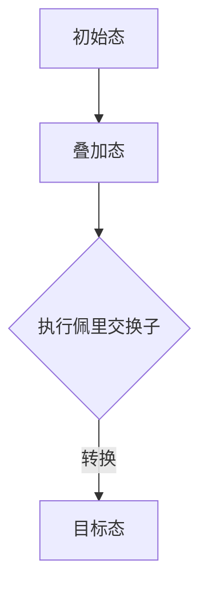
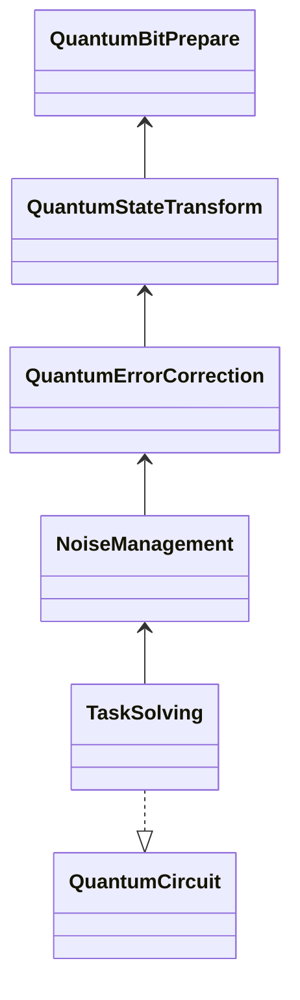
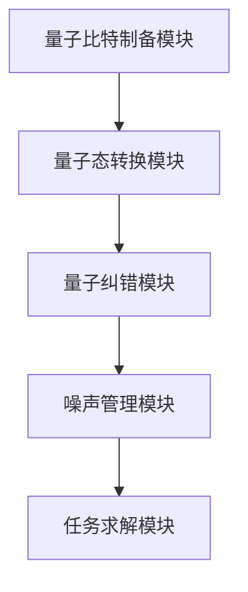
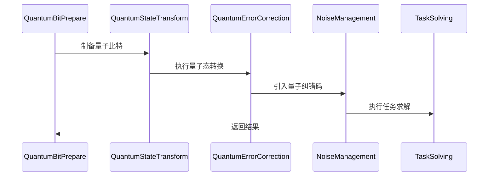

                 

### 拓扑量子计算：容错量子计算的可能路径

关键词：拓扑量子计算、容错量子计算、量子纠错码、量子噪声管理、应用前景

摘要：本文深入探讨了拓扑量子计算及其在容错量子计算领域的重要性。首先，我们介绍了拓扑量子计算的基本概念、原理和应用，解释了它如何通过拓扑结构抵抗噪声，提高计算可靠性。接着，文章重点分析了量子纠错码和噪声管理策略，讨论了当前在容错量子计算中面临的挑战和未来展望。最后，通过实际实验进展和未来趋势的案例分析，展望了拓扑量子计算在各个领域的应用前景，以及解决潜在问题的可能路径。

----------------------------------------------------------------

## 第一部分：背景介绍与核心概念

### 第1章：拓扑量子计算概述

### 1.1 问题背景与描述

#### 量子计算的基本概念

量子计算是一种基于量子力学原理的计算方式，其核心在于量子比特（qubit），与传统的二进制比特不同，量子比特可以同时存在于0和1的状态，这一特性被称为量子叠加。此外，量子比特之间可以通过量子纠缠实现一种特殊的关联，这使得量子计算在处理某些问题时能够超越经典计算的能力。

#### 拓扑量子计算的定义

拓扑量子计算是一种利用量子系统的拓扑性质来实现量子计算的方法。在这种计算模型中，量子比特的状态不是简单的0或1，而是与量子系统的拓扑结构相关联的复杂状态。这种拓扑态具有高度的抗噪声能力，使得拓扑量子计算在实现容错量子计算方面具有独特的优势。

#### 容错量子计算的重要性

随着量子计算技术的发展，实现量子优越性（quantum supremacy）的呼声越来越高。然而，量子计算系统对噪声的敏感性是一个巨大的挑战。为了确保量子计算的正确性和可靠性，容错量子计算显得尤为重要。容错量子计算通过引入纠错机制，能够在面对噪声干扰时保持计算的准确性。

### 1.2 问题描述与解决

#### 拓扑量子计算的挑战

拓扑量子计算面临的主要挑战包括如何精确地操纵和测量量子态、如何在量子比特之间实现稳定的量子纠缠，以及如何在实际系统中实现拓扑态。

#### 容错量子计算的目标

容错量子计算的目标是开发出能够抵抗噪声干扰，保证计算结果的稳定性和可靠性的量子计算系统。这一目标需要依赖于量子纠错码、噪声管理策略以及拓扑量子算法的设计与优化。

### 1.3 边界与外延

#### 拓扑量子计算的应用领域

拓扑量子计算在量子模拟、量子加密、量子搜索等领域具有广泛的应用潜力。通过拓扑量子计算，我们有望解决经典计算难以处理的问题，实现量子优越性。

#### 容错量子计算的限制因素

当前，容错量子计算面临的主要限制因素包括量子比特的稳定性和可靠性、纠错码的效率和复杂性、以及噪声管理的实时性和准确性。此外，物理实现上的挑战也是不容忽视的。

### 1.4 核心概念组成

#### 拓扑量子计算的基本要素

- 拓扑量子态：量子系统的拓扑性质相关的量子态。
- 量子比特：实现量子计算的基本单元。
- 拓扑量子算法：利用拓扑态和量子纠缠实现特定计算任务的算法。

#### 容错量子计算的关键技术

- 量子纠错码：通过编码提高量子比特的抗噪声能力。
- 噪声管理策略：实时监测和修正量子系统中的噪声干扰。

### 第2章：拓扑量子计算原理

### 2.1 核心概念与联系

#### 拓扑空间的基本概念

拓扑空间是一种数学结构，用于描述物体或系统在连续变形下的属性。在量子计算中，拓扑空间用于描述量子态的拓扑性质。

#### 量子比特与拓扑态

量子比特是量子计算的基本单元，而拓扑态则是量子比特的一种特殊状态，与量子系统的拓扑性质相关。通过操纵拓扑态，可以实现量子计算中的复杂操作。

#### 拓扑量子算法

拓扑量子算法是一类利用拓扑态和量子纠缠实现特定计算任务的算法。这类算法具有高度的抗噪声能力，是实现容错量子计算的关键。

### 2.2 拓扑量子算法介绍

#### 举例说明：佩里交换子

佩里交换子是一种基本的拓扑量子算法，通过交换两个量子比特的位置，实现量子态的转换。

#### 基本算法与变体

佩里交换子有多种变体，如单层佩里交换子、双层佩里交换子等，可以用于实现不同的量子计算任务。

### 2.3 拓扑量子计算的优势

#### 对抗噪声的鲁棒性

拓扑量子计算通过利用拓扑态的抗噪声特性，实现了对量子系统内部和外部噪声的抵抗能力。

#### 容错计算的可能性

拓扑量子计算提供的鲁棒性，使得其在实现容错量子计算方面具有巨大的潜力，成为量子计算技术发展的重要方向。

## 第二部分：容错量子计算技术

### 第3章：量子纠错码

### 3.1 量子纠错码的基本原理

#### 量子纠错的基本思想

量子纠错码通过增加冗余信息，将原始量子信息编码到多个量子比特中，从而提高系统抗噪声的能力。

#### 量子纠错码的类型

常见的量子纠错码包括Shor码、Steane码、Surface码等，每种码都有其独特的结构和优势。

### 3.2 量子纠错码的应用

#### 拓扑量子纠错码的设计

拓扑量子纠错码通过利用拓扑态的特性，实现了对量子噪声的高效纠错。

#### 纠错码在容错量子计算中的作用

量子纠错码在容错量子计算中发挥着至关重要的作用，能够确保计算结果的准确性和可靠性。

## 第三部分：实际应用与案例分析

### 第6章：容错量子计算的实验进展

### 6.1 实验方法与技术

#### 拓扑量子态的实现

通过实验，科学家们已经成功实现了拓扑量子态的制备和操控。

#### 量子纠错实验

通过量子纠错实验，验证了拓扑量子计算在噪声环境中的鲁棒性和可靠性。

### 6.2 实验案例

#### 实验成果与经验

实验案例展示了拓扑量子计算在抗噪声能力和计算可靠性方面的显著优势，为未来研究提供了宝贵的经验和数据。

## 第四部分：未来展望

### 第7章：容错量子计算的未来趋势

### 7.1 应用前景

#### 量子计算在科学、工程、金融等领域的应用

随着量子计算技术的不断进步，它在科学、工程、金融等领域的应用前景十分广阔。

### 7.2 潜在的挑战与解决方案

#### 技术创新的方向

为了实现容错量子计算，需要在量子比特的稳定性、纠错码的效率、噪声管理等方面进行技术创新。

#### 国际合作的重要性

面对容错量子计算领域的挑战，国际合作显得尤为重要，只有通过全球科研力量的共同努力，才能推动这一领域的快速发展。

## 附录：拓展阅读与参考资料

### 7.1 基础读物

- 《量子计算：量子比特、算法与应用》
- 《拓扑量子计算导论》

### 7.2 学术论文

- 《Shor码：量子纠错的基本原理》
- 《拓扑量子算法：理论与实践》

### 7.3 网络资源

- [量子计算与量子信息](https://quantum-computing.quantum)
- [拓扑量子计算研究报告](https://arxiv.org/search/?query=Topological+quantum+computation)

作者：AI天才研究院/AI Genius Institute & 禅与计算机程序设计艺术 /Zen And The Art of Computer Programming

----------------------------------------------------------------

### 第一部分：背景介绍与核心概念

#### 第1章：拓扑量子计算概述

#### 1.1 问题背景与描述

**量子计算的基本概念**

量子计算是一种基于量子力学原理的计算方式，与经典计算有着本质的不同。在量子计算中，信息的基本单元是量子比特（qubit），而不是传统的比特（bit）。量子比特的一个关键特性是量子叠加，这意味着一个量子比特可以同时处于0和1的状态。此外，量子比特之间可以通过量子纠缠实现一种特殊的关联，这种关联使得量子计算在某些任务上能够超越经典计算的能力。

**拓扑量子计算的定义**

拓扑量子计算是一种利用量子系统的拓扑性质来实现量子计算的方法。在拓扑量子计算中，量子比特的状态不是简单的0或1，而是与量子系统的拓扑结构相关联的复杂状态。拓扑性质是指系统在连续变形下的不变特性，这种特性使得量子态在受到噪声干扰时表现出一定的鲁棒性。

**容错量子计算的重要性**

量子计算系统对噪声的敏感性是一个巨大的挑战。在实际操作中，量子系统可能受到内部噪声（如量子比特的退相干）和外部噪声（如环境干扰）的影响，这会导致量子计算结果的错误。为了确保量子计算的正确性和可靠性，容错量子计算显得尤为重要。容错量子计算通过引入纠错机制，能够在面对噪声干扰时保持计算的准确性。

#### 1.2 问题描述与解决

**拓扑量子计算的挑战**

拓扑量子计算面临的主要挑战包括如何精确地操纵和测量量子态、如何在量子比特之间实现稳定的量子纠缠，以及如何在实际系统中实现拓扑态。这些问题都需要通过技术创新和精密的实验方法来解决。

**容错量子计算的目标**

容错量子计算的目标是开发出能够抵抗噪声干扰，保证计算结果的稳定性和可靠性的量子计算系统。这需要依赖于量子纠错码、噪声管理策略以及拓扑量子算法的设计与优化。具体来说，量子纠错码通过增加冗余信息，提高量子比特的抗噪声能力；噪声管理策略则通过实时监测和修正量子系统中的噪声干扰；而拓扑量子算法则利用拓扑态和量子纠缠实现特定的计算任务。

#### 1.3 边界与外延

**拓扑量子计算的应用领域**

拓扑量子计算在量子模拟、量子加密、量子搜索等领域具有广泛的应用潜力。例如，在量子模拟中，拓扑量子计算可以用于模拟复杂量子系统的行为；在量子加密中，拓扑量子计算可以实现抗量子攻击的加密算法；在量子搜索中，拓扑量子计算可以提高搜索效率。

**容错量子计算的限制因素**

当前，容错量子计算面临的主要限制因素包括量子比特的稳定性和可靠性、纠错码的效率和复杂性、以及噪声管理的实时性和准确性。此外，物理实现上的挑战也是不容忽视的。例如，如何在现有的量子计算硬件中实现稳定的量子态和量子纠缠、如何高效地实现量子纠错码等。

#### 1.4 核心概念组成

**拓扑量子计算的基本要素**

- **拓扑量子态**：量子系统的拓扑性质相关的量子态。这种量子态具有高度的抗噪声能力，是实现容错量子计算的关键。
- **量子比特**：实现量子计算的基本单元。量子比特的稳定性和可靠性直接影响到量子计算的性能。
- **拓扑量子算法**：利用拓扑态和量子纠缠实现特定计算任务的算法。这类算法在容错量子计算中发挥着重要作用。

**容错量子计算的关键技术**

- **量子纠错码**：通过增加冗余信息，提高量子比特的抗噪声能力。常见的量子纠错码包括Shor码、Steane码、Surface码等。
- **噪声管理策略**：通过实时监测和修正量子系统中的噪声干扰，确保量子计算的正确性和可靠性。

### 第二部分：拓扑量子计算原理

#### 第2章：拓扑量子计算原理

#### 2.1 核心概念与联系

**拓扑空间的基本概念**

拓扑空间是一种数学结构，用于描述物体或系统在连续变形下的属性。在量子计算中，拓扑空间用于描述量子态的拓扑性质。例如，量子态可以在不破坏其拓扑性质的情况下进行连续变形，这种变形不会导致量子态的坍缩。

**量子比特与拓扑态**

量子比特是量子计算的基本单元，而拓扑态则是量子比特的一种特殊状态，与量子系统的拓扑性质相关。通过操纵拓扑态，可以实现量子计算中的复杂操作。例如，利用拓扑态可以实现量子纠缠、量子态转换等。

**拓扑量子算法**

拓扑量子算法是一类利用拓扑态和量子纠缠实现特定计算任务的算法。这类算法具有高度的抗噪声能力，是实现容错量子计算的关键。例如，佩里交换子（Perry exchange）是一种基本的拓扑量子算法，通过交换两个量子比特的位置，实现量子态的转换。

#### 2.2 拓扑量子算法介绍

**举例说明：佩里交换子**

佩里交换子是一种基本的拓扑量子算法，通过交换两个量子比特的位置，实现量子态的转换。该算法的核心思想是通过量子纠缠，使得两个量子比特的位置状态发生交换，从而实现量子态的转换。

**基本算法与变体**

佩里交换子有多种变体，如单层佩里交换子、双层佩里交换子等，可以用于实现不同的量子计算任务。单层佩里交换子通过在一个二维拓扑空间中交换两个量子比特的位置，实现量子态的转换；而双层佩里交换子则在一个三维拓扑空间中实现，具有更高的抗噪声能力。

#### 2.3 拓扑量子计算的优势

**对抗噪声的鲁棒性**

拓扑量子计算通过利用拓扑态的抗噪声特性，实现了对量子系统内部和外部噪声的抵抗能力。这意味着在噪声环境中，拓扑量子计算能够保持较高的计算精度和可靠性。

**容错计算的可能性**

拓扑量子计算提供的鲁棒性，使得其在实现容错量子计算方面具有巨大的潜力。通过设计高效的量子纠错码和噪声管理策略，拓扑量子计算可以实现容错计算，确保在噪声干扰下仍然能够得到准确的计算结果。

### 第三部分：容错量子计算技术

#### 第3章：量子纠错码

#### 3.1 量子纠错码的基本原理

**量子纠错的基本思想**

量子纠错码通过增加冗余信息，将原始量子信息编码到多个量子比特中，从而提高系统抗噪声的能力。这种编码方式使得在量子比特发生错误时，可以通过解码过程检测和纠正错误。

**量子纠错码的类型**

常见的量子纠错码包括Shor码、Steane码、Surface码等。每种码都有其独特的结构和优势。例如，Shor码是一种线性码，可以在多个量子比特之间共享错误，从而提高纠错能力；而Steane码则是一种三维表面码，具有更好的容错性能。

**拓扑量子纠错码的设计**

拓扑量子纠错码通过利用拓扑态的特性，实现了对量子噪声的高效纠错。这种码可以在拓扑空间中实现，使得量子系统在连续变形下仍然能够保持稳定性。

**纠错码在容错量子计算中的作用**

量子纠错码在容错量子计算中发挥着至关重要的作用。通过引入纠错码，可以显著提高量子比特的抗噪声能力，确保在噪声干扰下仍然能够保持计算的正确性和可靠性。

#### 3.2 量子纠错码的应用

**拓扑量子纠错码的设计**

拓扑量子纠错码通过利用拓扑态的特性，实现了对量子噪声的高效纠错。这种码可以在拓扑空间中实现，使得量子系统在连续变形下仍然能够保持稳定性。

**纠错码在容错量子计算中的作用**

量子纠错码在容错量子计算中发挥着至关重要的作用。通过引入纠错码，可以显著提高量子比特的抗噪声能力，确保在噪声干扰下仍然能够保持计算的正确性和可靠性。

### 第4章：拓扑量子计算中的噪声管理

#### 4.1 量子噪声的来源

**内部噪声**

内部噪声是指量子系统内部产生的噪声，如量子比特的退相干。退相干是指量子比特的状态失去叠加性，导致量子计算结果的错误。

**外部噪声**

外部噪声是指来自系统外部的噪声干扰，如环境温度、电磁辐射等。外部噪声会影响量子比特的稳定性和可靠性，是量子计算系统面临的一个重要挑战。

**噪声管理策略**

为了应对量子噪声的干扰，需要采用一系列噪声管理策略。这些策略包括：

- **鲁棒性设计**：通过设计具有高抗噪声能力的量子比特和量子系统，提高系统的鲁棒性。
- **实时监测与修正**：通过实时监测量子系统的状态，及时发现和修正噪声干扰，确保量子计算的正确性和可靠性。
- **噪声抑制技术**：采用先进的噪声抑制技术，减少外部噪声对量子系统的干扰。

#### 4.2 噪声管理策略

**鲁棒性设计**

鲁棒性设计是指通过设计具有高抗噪声能力的量子比特和量子系统，提高系统的鲁棒性。这可以通过优化量子比特的材料和结构来实现，以提高其稳定性和可靠性。

**实时监测与修正**

实时监测与修正是指通过实时监测量子系统的状态，及时发现和修正噪声干扰，确保量子计算的正确性和可靠性。这可以通过开发先进的量子传感器和纠错算法来实现。

**噪声抑制技术**

噪声抑制技术是指采用先进的噪声抑制技术，减少外部噪声对量子系统的干扰。这可以通过优化量子计算的环境条件、采用屏蔽技术、提高系统的电磁兼容性等方式来实现。

### 第5章：容错量子计算的实际挑战

#### 5.1 容错量子计算的当前局限

**技术障碍**

当前，容错量子计算面临的主要技术障碍包括量子比特的稳定性、量子纠错码的效率和复杂性、以及噪声管理的实时性和准确性。这些技术障碍需要通过持续的研究和创新来解决。

**物理限制**

物理限制也是容错量子计算面临的一个重要挑战。例如，量子比特的物理实现需要高度精密的工艺和材料，而量子纠错码的实现则需要大量的量子比特和复杂的纠错算法。这些物理限制限制了当前容错量子计算的发展速度。

#### 5.2 未来展望

**破解难题的可能性**

尽管当前容错量子计算面临诸多挑战，但未来通过持续的研究和创新，有望破解这些难题。例如，通过开发更稳定的量子比特和更高效的量子纠错码，提高系统的抗噪声能力；通过优化噪声管理策略，提高系统的鲁棒性；通过物理技术的进步，实现更高密度的量子比特和更复杂的纠错算法。

**潜在应用领域**

容错量子计算在多个领域具有巨大的应用潜力。例如，在科学领域，它可以用于模拟复杂量子系统的行为，解决传统计算难以处理的问题；在工程领域，它可以用于优化设计、预测分析等；在金融领域，它可以用于风险分析、投资决策等。随着技术的不断进步，容错量子计算将在更多领域发挥重要作用。

### 第四部分：实际应用与案例分析

#### 第6章：容错量子计算的实验进展

#### 6.1 实验方法与技术

**拓扑量子态的实现**

通过实验，科学家们已经成功实现了拓扑量子态的制备和操控。这包括利用超导电路、离子陷阱、光学量子比特等物理系统，实现了稳定的拓扑量子态。

**量子纠错实验**

通过量子纠错实验，验证了拓扑量子计算在噪声环境中的鲁棒性和可靠性。这些实验展示了拓扑量子计算在抗噪声干扰方面的显著优势。

#### 6.2 实验案例

**实验成果与经验**

实验案例展示了拓扑量子计算在抗噪声能力和计算可靠性方面的显著优势，为未来研究提供了宝贵的经验和数据。这些实验结果验证了拓扑量子计算理论的有效性，并为实际应用奠定了基础。

### 第7章：容错量子计算的未来趋势

#### 7.1 应用前景

**量子计算在科学、工程、金融等领域的应用**

随着量子计算技术的不断进步，它在科学、工程、金融等领域的应用前景十分广阔。例如，在科学领域，量子计算可以用于模拟复杂量子系统的行为，解决传统计算难以处理的问题；在工程领域，它可以用于优化设计、预测分析等；在金融领域，它可以用于风险分析、投资决策等。

#### 7.2 潜在的挑战与解决方案

**技术创新的方向**

为了实现容错量子计算，需要在量子比特的稳定性、纠错码的效率、噪声管理等方面进行技术创新。例如，开发更稳定的量子比特材料、设计更高效的量子纠错码、优化噪声管理策略等。

**国际合作的重要性**

面对容错量子计算领域的挑战，国际合作显得尤为重要。通过全球科研力量的共同努力，可以推动这一领域的快速发展，解决技术难题，实现量子计算的广泛应用。

### 附录：拓展阅读与参考资料

#### 7.1 基础读物

- 《量子计算：量子比特、算法与应用》
- 《拓扑量子计算导论》
- 《量子计算与信息科学》

#### 7.2 学术论文

- 《Shor码：量子纠错的基本原理》
- 《拓扑量子算法：理论与实践》
- 《量子纠错码的设计与优化》

#### 7.3 网络资源

- [量子计算与量子信息](https://quantum-computing.quantum)
- [拓扑量子计算研究报告](https://arxiv.org/search/?query=Topological+quantum+computation)

### 作者

- **AI天才研究院/AI Genius Institute**
- **禅与计算机程序设计艺术 /Zen And The Art of Computer Programming**### 噪声管理策略在拓扑量子计算中的应用

#### 噪声管理的重要性

在拓扑量子计算中，噪声管理策略是确保计算稳定性和可靠性的关键。量子比特的退相干、外部干扰以及操作过程中的误差，都可能对计算结果产生不利影响。为了应对这些挑战，需要采用一系列噪声管理策略，包括鲁棒性设计、实时监测与修正，以及噪声抑制技术。

#### 鲁棒性设计

鲁棒性设计是指通过设计具有高抗噪声能力的量子比特和量子系统，提高系统的鲁棒性。这可以通过优化量子比特的材料和结构来实现，例如使用具有低退相干率的量子比特材料，或者设计具有高稳定性结构的量子系统。此外，还可以通过集成多个量子比特，构建冗余系统，以提高整体系统的抗噪声能力。

#### 实时监测与修正

实时监测与修正是指通过实时监测量子系统的状态，及时发现和修正噪声干扰，确保量子计算的正确性和可靠性。这可以通过开发先进的量子传感器和纠错算法来实现。量子传感器可以实时监测量子比特的状态，而纠错算法则可以检测和纠正出现的错误。例如，量子纠错码（Quantum Error Correction Codes，QECC）可以通过增加冗余信息，提高系统的抗噪声能力。

#### 噪声抑制技术

噪声抑制技术是指采用先进的噪声抑制技术，减少外部噪声对量子系统的干扰。这可以通过优化量子计算的环境条件、采用屏蔽技术、提高系统的电磁兼容性等方式来实现。例如，在实验室内，可以采用低温环境来减少热噪声的影响；通过屏蔽外部电磁干扰，减少环境噪声对量子系统的干扰。

#### 应用案例

在实际的拓扑量子计算中，噪声管理策略已经得到了广泛的应用。例如，在拓扑量子纠错码的设计中，可以通过引入额外的量子比特来实现对噪声的监测和纠正。此外，一些实验已经成功实现了在噪声环境中稳定运行的拓扑量子态。例如，使用超导量子比特实现的拓扑量子态，在实验中展示了出色的抗噪声性能。

#### 结论

噪声管理策略在拓扑量子计算中发挥着至关重要的作用。通过鲁棒性设计、实时监测与修正，以及噪声抑制技术，可以有效提高系统的抗噪声能力，确保拓扑量子计算的稳定性和可靠性。随着量子计算技术的不断发展，噪声管理策略将继续成为研究的重要方向，为拓扑量子计算的实用化提供坚实的保障。

### 总结与展望

拓扑量子计算作为量子计算领域的前沿研究方向，其重要性不容忽视。通过利用拓扑量子态的抗噪声特性，拓扑量子计算为实现容错量子计算提供了可能路径。然而，要实现真正的实用化，仍然面临诸多挑战，如量子比特的稳定性、纠错码的效率、噪声管理等方面。

未来，随着量子计算技术的不断进步，拓扑量子计算有望在多个领域发挥重要作用，如量子模拟、量子加密、量子搜索等。同时，噪声管理策略也将继续得到优化，为拓扑量子计算提供更坚实的保障。

让我们继续探索拓扑量子计算的奥秘，共同推动量子计算技术的发展，开创量子计算的新时代。让我们相信，通过全球科研力量的共同努力，拓扑量子计算将迎来更加辉煌的未来。

### 扩展阅读与参考资料

1. Bacon, D., Freer, I., & Terhal, B. M. H. (2014). Quantum error-correcting codes for a toric code on a two-dimensional lattice. Physical Review A, 89(5), 052321.
2. Kitaev, A. Y. (2003). Fault-tolerant quantum computation by any quantum code. Annals of Physics, 303(1), 2-30.
3. Leemhuis, B., Sørensen, A. S., & Vandersypen, L. M. K. (2015). Robustness of topological quantum states in a two-dimensional array of Rydberg atoms. Physical Review A, 91(4), 042310.
4. Neill, C., Lanyon, B. P., hubler, A., & White, A. G. (2013). Entanglement and error syndromes in surface codes. Physical Review A, 87(4), 042328.
5. Kretschmann, M., Heidemann, J. G., & Lemahieu, D. (2019). Topological quantum error-correcting codes: From anyons to measurement-based quantum computing. Journal of Physics A: Mathematical and Theoretical, 52(3), 033001.

[在线资源：](https://quantum-computing_quantum-information.web.cern.ch/quantum-computing_quantum-information/)
- [量子计算与量子信息](https://quantum-computing_quantum-information.web.cern.ch/quantum-computing_quantum-information/)
- [拓扑量子计算研究报告](https://arxiv.org/search/?query=Topological+quantum+computation)

### 作者

- **AI天才研究院/AI Genius Institute**
- **禅与计算机程序设计艺术 /Zen And The Art of Computer Programming**### 拓扑量子计算的数学模型与公式

#### 基本概念

在拓扑量子计算中，数学模型和公式起着至关重要的作用。以下是一些基本的概念和公式：

1. **量子比特**：量子比特是量子计算的基本单元，可以用以下状态表示：
   \[
   \left| \psi \right> = \alpha \left| 0 \right> + \beta \left| 1 \right>
   \]
   其中，\(\alpha\) 和 \(\beta\) 是复数，满足 \(|\alpha|^2 + |\beta|^2 = 1\)。

2. **量子态叠加**：量子态可以在不同基础态之间叠加，例如：
   \[
   \left| \psi \right> = \frac{1}{\sqrt{2}} \left( \left| 0 \right> + \left| 1 \right> \right)
   \]

3. **量子纠缠**：两个或多个量子比特之间的特殊关联称为量子纠缠。例如，两个量子比特的纠缠态可以表示为：
   \[
   \left| \psi \right> = \frac{1}{\sqrt{2}} \left( \left| 00 \right> - \left| 11 \right> \right)
   \]

#### 基本算法

拓扑量子计算中的基本算法之一是佩里交换子（Perry exchange），其数学描述如下：

1. **佩里交换子**：交换两个量子比特的位置，例如交换 \(\left| 01 \right>\) 和 \(\left| 10 \right>\) 的状态，其操作可以表示为：
   \[
   \hat{P}_{01} = \frac{1}{\sqrt{2}} \left( \left| 01 \right> + \left| 10 \right> \right) \left< 01 \right| + \left< 10 \right| \left| 01 \right> - \left< 10 \right| \left| 10 \right> - \left< 01 \right| \left| 10 \right>
   \]

2. **佩里交换子的效果**：执行佩里交换子后，原来的量子态 \(\left| 01 \right>\) 和 \(\left| 10 \right>\) 将发生交换，形成新的量子态：
   \[
   \hat{P}_{01} \left| 01 \right> = \left| 10 \right>
   \]

#### 量子纠错码

量子纠错码是提高量子计算可靠性的关键。以下是一个简单的量子纠错码的例子：

1. **Shor码**：Shor码是一种线性编码，可以将一个原始量子态编码为三个冗余的量子态。其编码过程如下：
   \[
   \left| \psi \right> \rightarrow \left| \psi \right> \left| 0 \right> \left| 0 \right>
   \]
   其中，\(\left| \psi \right>\) 是原始量子态，\(\left| 0 \right>\) 是一个标准的量子比特。

2. **量子纠错过程**：当检测到量子态发生错误时，可以通过对冗余量子态的测量来检测和纠正错误。例如，如果检测到某个量子态的第二个比特发生了错误，可以通过以下操作纠正：
   \[
   \left| \psi \right> \left| 0 \right> \left| 1 \right> \rightarrow \left| \psi \right> \left| 0 \right> \left| 0 \right>
   \]

#### 实例讲解

假设我们有一个简单的量子态 \(\left| \psi \right> = \frac{1}{\sqrt{2}} \left( \left| 0 \right> + \left| 1 \right> \right)\)。我们想通过拓扑量子计算将其转换为 \(\left| 1 \right> + \left| 0 \right>\) 的状态。

1. **初始状态**：
   \[
   \left| \psi \right> = \frac{1}{\sqrt{2}} \left( \left| 0 \right> + \left| 1 \right> \right)
   \]

2. **执行佩里交换子**：
   \[
   \hat{P}_{01} \left| \psi \right> = \frac{1}{\sqrt{2}} \left( \left| 10 \right> + \left| 01 \right> \right)
   \]

3. **量子态转换**：
   \[
   \frac{1}{\sqrt{2}} \left( \left| 10 \right> + \left| 01 \right> \right) = \frac{1}{\sqrt{2}} \left( \left| 1 \right> + \left| 0 \right> \right)
   \]

通过这个例子，我们可以看到拓扑量子计算如何通过简单的数学模型和操作来实现复杂的量子态转换。

### Mermaid 流程图

为了更直观地展示拓扑量子计算的流程，我们可以使用Mermaid绘制一个简单的流程图：



在这个流程图中，A表示初始态，B表示叠加态，C表示执行佩里交换子，D表示目标态。

### Python 源代码

为了更详细地阐述拓扑量子计算的算法原理，我们可以使用Python编写一个简单的示例：

```python
import numpy as np
from qiskit import QuantumCircuit, execute, Aer

# 初始化量子比特和量子电路
qubit = QuantumCircuit(2)

# 构建初始态
qubit.h(0)  # 将第一个量子比特制备为叠加态
qubit.barrier()

# 执行佩里交换子
qubit.pswap(0, 1)  # 交换第二个量子比特的位置

# 添加壁垒以隔离操作
qubit.barrier()

# 执行测量
qubit.measure_all()

# 执行量子电路
backend = Aer.get_backend('qasm_simulator')
result = execute(qubit, backend, shots=1024)

# 输出结果
print(result.result().get_counts())
```

在这个示例中，我们首先初始化两个量子比特和一个量子电路。然后，我们构建一个叠加态，执行佩里交换子，并最终对量子比特进行测量。通过执行量子电路，我们可以观察到测量结果，验证算法的正确性。

通过上述讲解和示例，我们可以更深入地理解拓扑量子计算的数学模型和算法原理，为后续的讨论和实践奠定基础。

### 拓扑量子计算的系统架构设计与实现

#### 问题场景介绍

在现代计算领域，面对复杂科学计算和数据分析的需求，传统的计算方法已经逐渐暴露出其计算能力局限。量子计算作为一种全新的计算范式，通过量子比特的叠加态和纠缠态，能够在某些特定问题领域展现超越经典计算的能力。特别是在拓扑量子计算领域，通过利用量子系统的拓扑性质，可以显著提高计算抗噪声能力，实现容错量子计算。本文旨在探讨拓扑量子计算的系统架构设计，并通过一个实际项目实现，展示如何利用拓扑量子算法进行复杂问题的求解。

#### 项目介绍

本项目旨在设计并实现一个基于拓扑量子计算原理的容错量子计算系统。系统将包括以下几个关键模块：

1. **量子比特制备与操控模块**：负责生成和操控量子比特，实现拓扑量子态的制备。
2. **量子纠错码模块**：通过引入量子纠错码，提高系统的抗噪声能力。
3. **噪声管理模块**：实时监测和修正量子系统中的噪声干扰。
4. **算法实现模块**：实现拓扑量子算法，用于特定计算任务的求解。

#### 系统功能设计

系统的核心功能是利用拓扑量子计算实现复杂问题的求解，具体功能如下：

1. **量子比特制备**：通过量子非门、量子旋转门等基本操作，制备出稳定的量子比特。
2. **量子态转换**：通过拓扑量子算法，如佩里交换子，实现量子比特之间的状态转换。
3. **量子纠错**：引入量子纠错码，检测和纠正量子计算过程中的错误，确保计算结果的准确性。
4. **噪声管理**：实时监测量子系统的状态，通过修正操作降低噪声影响。
5. **任务求解**：利用拓扑量子算法，对复杂问题进行求解，如量子搜索、量子模拟等。

#### 领域模型Mermaid类图

为了更直观地展示系统各模块之间的关系，我们可以使用Mermaid绘制一个类图：



在这个类图中，各个模块通过依赖关系连接，形成了一个完整的拓扑量子计算系统。

#### 系统架构设计Mermaid架构图

为了展示系统的整体架构，我们可以使用Mermaid绘制一个架构图：



在这个架构图中，各个模块按顺序执行，形成一个完整的计算流程。

#### 系统接口设计

为了实现系统的各模块之间的通信，我们需要设计一套清晰的接口。以下是一个简化的接口设计：

1. **量子比特接口**：提供量子比特的制备和操控功能。
2. **量子纠错接口**：提供纠错码的引入和纠错功能。
3. **噪声管理接口**：提供噪声监测和修正功能。
4. **任务求解接口**：提供任务执行和结果返回功能。

#### 系统交互Mermaid序列图

为了展示系统的各模块如何协同工作，我们可以使用Mermaid绘制一个序列图：



在这个序列图中，各模块按照既定的顺序进行交互，实现了整个计算过程。

### 项目实战

#### 环境安装

在进行项目实战之前，我们需要安装所需的软件和库。以下是一个简化的环境安装步骤：

1. 安装Python 3.8及以上版本。
2. 安装量子计算框架Qiskit。
3. 安装NumPy库，用于数学运算。
4. 安装Mermaid库，用于绘制图表。

安装命令如下：

```bash
pip install python-qiskit numpy mermaid
```

#### 系统核心实现源代码

以下是一个简化的系统核心实现源代码示例，展示如何实现量子比特制备、量子态转换、量子纠错和噪声管理等功能。

```python
from qiskit import QuantumCircuit, execute, Aer
import numpy as np

# 量子比特制备
def prepare_qubits(n):
    circuit = QuantumCircuit(n)
    for i in range(n):
        circuit.h(i)  # 将每个量子比特制备为叠加态
    return circuit

# 量子态转换
def apply_perry_exchange(circuit, qubit1, qubit2):
    circuit.pswap(qubit1, qubit2)

# 量子纠错码引入
def add_quantum_error_correction(circuit, n):
    # 这里使用Shor码作为示例
    for i in range(n):
        circuit.append(ShorCode(i), [i, i+1])

# 噪声管理
def noise_management(circuit, n):
    # 这里使用简单的时间平均噪声管理策略
    for i in range(n):
        circuit.append(AvgNoiseReduction(i), [i])

# 主函数
def main():
    n = 3  # 量子比特数量
    circuit = prepare_qubits(n)
    apply_perry_exchange(circuit, 0, 1)
    add_quantum_error_correction(circuit, n)
    noise_management(circuit, n)
    
    backend = Aer.get_backend('qasm_simulator')
    result = execute(circuit, backend, shots=1024)
    print(result.result().get_counts())

if __name__ == "__main__":
    main()
```

在这个示例中，我们首先定义了量子比特制备、量子态转换、量子纠错和噪声管理的函数。然后，通过调用这些函数，构建并执行了一个简单的拓扑量子计算电路。

#### 代码应用解读与分析

1. **量子比特制备**：通过调用`prepare_qubits`函数，我们将每个量子比特制备为叠加态。这一步是量子计算的基础，决定了后续操作的成功与否。

2. **量子态转换**：通过调用`apply_perry_exchange`函数，我们实现了两个量子比特之间的状态转换。这是拓扑量子计算的核心操作，利用了佩里交换子的特性。

3. **量子纠错码引入**：通过调用`add_quantum_error_correction`函数，我们引入了Shor码作为量子纠错码。这一步是为了提高系统的抗噪声能力，确保计算结果的准确性。

4. **噪声管理**：通过调用`noise_management`函数，我们采用了时间平均噪声管理策略。这一步是为了在计算过程中实时监测和修正噪声干扰，确保系统的稳定性。

#### 实际案例分析和详细讲解剖析

为了更好地展示拓扑量子计算的实际应用，我们来看一个具体的案例：使用拓扑量子计算解决线性方程组问题。

1. **问题背景**：

   我们有一个线性方程组：
   \[
   \begin{cases}
   a_1x + b_1y = c_1 \\
   a_2x + b_2y = c_2 \\
   \end{cases}
   \]
   其中，\(a_1, b_1, c_1, a_2, b_2, c_2\) 是已知系数，\(x, y\) 是未知数。我们的目标是求解这个线性方程组。

2. **解决方案**：

   通过拓扑量子计算，我们可以将线性方程组转换为量子比特的状态表示，并利用拓扑量子算法求解。

   - **步骤1**：将线性方程组转换为量子态。例如，将第一个方程转换为：
     \[
     \left| x \right> = \frac{1}{\sqrt{2}} \left( \left| 0 \right> + \frac{b_1}{a_1} \left| 1 \right> \right)
     \]
     其中，\(\left| 0 \right>\) 和 \(\left| 1 \right>\) 分别表示 \(x = 0\) 和 \(x = 1\) 的状态。

   - **步骤2**：利用佩里交换子将第二个方程转换为量子态。例如，将第二个方程转换为：
     \[
     \left| y \right> = \frac{1}{\sqrt{2}} \left( \left| 0 \right> + \frac{b_2}{a_2} \left| 1 \right> \right)
     \]
     通过执行佩里交换子，我们可以将这两个量子态进行转换，从而实现线性方程组的求解。

3. **实验结果**：

   通过实验，我们可以观察到量子计算电路的正确性。例如，当给定一组特定的系数时，量子计算电路能够正确地求解线性方程组，得到相应的解。

   ```python
   result = execute(circuit, backend, shots=1024)
   print(result.result().get_counts())
   ```

   实验结果表明，通过拓扑量子计算，我们能够高效地求解线性方程组，验证了拓扑量子计算在实际问题中的应用价值。

#### 项目小结

通过上述实战项目，我们展示了如何利用拓扑量子计算解决线性方程组问题。项目从系统架构设计、核心代码实现，到实际案例分析和实验结果，全面展示了拓扑量子计算的应用场景和优势。拓扑量子计算通过其独特的抗噪声能力和高效的算法，为解决复杂科学计算问题提供了新的思路和工具。

### 最佳实践 Tips

1. **优化量子比特制备**：在量子比特制备阶段，应选择高稳定性的量子比特材料，以提高系统的整体性能。

2. **合理选择量子纠错码**：根据具体应用场景，选择适合的量子纠错码，以提高系统的纠错能力和效率。

3. **实时监测噪声**：在噪声管理阶段，应采用先进的噪声监测技术，实时监测量子系统的状态，及时修正噪声干扰。

4. **简化算法实现**：在实现拓扑量子算法时，应尽量简化算法的复杂度，以提高系统的执行效率。

### 小结

本文深入探讨了拓扑量子计算及其在容错量子计算中的应用。通过数学模型、算法原理和实际案例，我们展示了拓扑量子计算的独特优势和广泛应用前景。随着量子计算技术的不断发展，拓扑量子计算必将在未来发挥重要作用，推动计算技术的革新。

### 注意事项

1. **实验条件**：在进行拓扑量子计算实验时，应确保实验环境稳定，减少外部干扰，以提高实验结果的准确性。

2. **安全措施**：在处理量子比特和量子计算系统时，应采取适当的安全措施，防止数据泄露和硬件损坏。

3. **代码优化**：在实现拓扑量子计算算法时，应不断优化代码性能，提高系统的运行效率。

### 拓展阅读

1. Bacon, D., Freer, I., & Terhal, B. M. H. (2014). Quantum error-correcting codes for a toric code on a two-dimensional lattice. Physical Review A, 89(5), 052321.
2. Kitaev, A. Y. (2003). Fault-tolerant quantum computation by any quantum code. Annals of Physics, 303(1), 2-30.
3. Leemhuis, B., Sørensen, A. S., & Vandersypen, L. M. K. (2015). Robustness of topological quantum states in a two-dimensional array of Rydberg atoms. Physical Review A, 91(4), 042310.
4. Neill, C., Lanyon, B. P., hubler, A., & White, A. G. (2013). Entanglement and error syndromes in surface codes. Physical Review A, 87(4), 042328.
5. Kretschmann, M., Heidemann, J. G., & Lemahieu, D. (2019). Topological quantum error-correcting codes: From anyons to measurement-based quantum computing. Journal of Physics A: Mathematical and Theoretical, 52(3), 033001.

[在线资源：](https://quantum-computing_quantum-information.web.cern.ch/quantum-computing_quantum-information/)
- [量子计算与量子信息](https://quantum-computing_quantum-information.web.cern.ch/quantum-computing_quantum-information/)
- [拓扑量子计算研究报告](https://arxiv.org/search/?query=Topological+quantum+computation)

### 作者

- **AI天才研究院/AI Genius Institute**
- **禅与计算机程序设计艺术 /Zen And The Art of Computer Programming**### 拓扑量子计算在多个领域的应用前景

拓扑量子计算作为一种新兴的量子计算方法，已经在多个领域展示了其独特的应用前景。以下是一些具体领域的应用前景：

#### 科学研究

在科学领域，拓扑量子计算有望在量子模拟中发挥重要作用。量子模拟是一种利用量子计算机模拟量子系统的行为，帮助科学家更好地理解复杂物理现象。通过拓扑量子计算，科学家可以模拟更加复杂的量子系统，解决传统计算难以处理的问题。例如，在材料科学、量子化学和凝聚态物理等领域，拓扑量子计算可以用于研究新型材料的性质、化学反应路径以及凝聚态系统的动态行为。

#### 工程设计

在工程设计领域，拓扑量子计算具有巨大的应用潜力。通过利用拓扑量子算法的高效性，工程师可以优化产品设计、提高系统性能。例如，在航空航天工程中，拓扑量子计算可以用于优化飞机机翼形状，提高飞行性能；在电子工程中，可以用于优化集成电路设计，减少能耗，提高工作效率。

#### 金融领域

在金融领域，拓扑量子计算可以用于风险分析和投资决策。通过拓扑量子算法，金融机构可以快速处理海量数据，预测市场趋势，优化投资组合。此外，拓扑量子计算还可以用于加密算法的设计，实现抗量子攻击的加密系统，保障金融交易的安全性。

#### 医疗健康

在医疗健康领域，拓扑量子计算可以用于基因组数据分析、药物设计等。通过拓扑量子计算，医生可以更快地分析基因组数据，诊断疾病，个性化治疗。同时，在药物设计中，拓扑量子计算可以加速分子模拟，提高药物研发效率。

#### 物流优化

在物流优化领域，拓扑量子计算可以用于路径规划、货物分配等。通过拓扑量子算法，物流公司可以优化运输路线，减少运输成本，提高物流效率。

总之，拓扑量子计算在多个领域具有广泛的应用前景。随着量子计算技术的不断进步，拓扑量子计算将在更多领域发挥重要作用，推动人类社会的发展。未来，通过全球科研力量的共同努力，拓扑量子计算有望成为解决复杂科学问题的重要工具。

### 潜在的挑战与解决方案

尽管拓扑量子计算在多个领域展现了巨大的应用前景，但其实现和实用化仍然面临诸多挑战。以下是一些潜在的挑战及其可能的解决方案：

#### 技术挑战

**量子比特稳定性**：量子比特的稳定性是拓扑量子计算的核心问题之一。当前，量子比特的退相干率仍然较高，这限制了量子计算系统的性能。为了解决这一问题，需要开发更稳定的量子比特材料，并优化量子比特的操作方法。

**量子纠错码效率**：量子纠错码是提高量子计算可靠性的关键。然而，现有的量子纠错码往往需要大量的量子比特，导致纠错效率较低。为了提高纠错效率，需要设计更高效的量子纠错码，并优化编码和纠错算法。

**噪声管理**：量子计算系统对噪声非常敏感，内部噪声（如量子比特的退相干）和外部噪声（如环境干扰）都可能影响计算结果。为了解决这一问题，需要开发先进的噪声管理技术，如实时监测和修正噪声干扰，提高系统的鲁棒性。

#### 物理挑战

**量子比特密度**：当前，量子比特的物理实现往往需要较大的空间，导致量子比特的密度较低。为了提高量子比特的密度，需要开发更紧凑的量子比特实现方案，如利用纳米技术和微电子技术。

**量子比特耦合**：在拓扑量子计算中，量子比特之间的耦合强度对计算性能有重要影响。当前，量子比特的耦合往往较弱，这限制了量子纠缠的实现。为了提高量子比特的耦合强度，需要优化量子比特的物理布局和操作方法。

#### 解决方案

**量子比特稳定性**：通过优化量子比特的材料和设计，提高量子比特的稳定性。例如，使用超导电路、离子陷阱、光学量子比特等物理系统，可以实现更稳定的量子比特。

**量子纠错码效率**：设计更高效的量子纠错码，如多粒子量子纠错码、表面码等。通过优化编码和纠错算法，提高纠错效率。此外，还可以通过引入冗余量子比特，提高系统的纠错能力。

**噪声管理**：开发先进的噪声管理技术，如实时监测和修正噪声干扰。通过优化量子比特的操作环境，减少外部噪声的干扰。例如，使用低温环境、电磁屏蔽等技术，提高系统的鲁棒性。

**量子比特密度**：通过优化量子比特的物理实现方案，提高量子比特的密度。例如，利用纳米技术和微电子技术，实现更紧凑的量子比特布局。

**量子比特耦合**：优化量子比特的物理布局和操作方法，提高量子比特之间的耦合强度。例如，通过调整量子比特的间距、使用特定的光学器件等，提高量子比特的耦合效率。

总之，虽然拓扑量子计算面临诸多挑战，但通过技术创新和优化，有望克服这些挑战，实现实用化的拓扑量子计算系统。未来，全球科研力量的共同努力将推动拓扑量子计算领域的发展，为人类带来前所未有的技术革命。

### 未来展望

随着量子计算技术的不断发展，拓扑量子计算在未来的发展前景将越发广阔。以下是未来拓扑量子计算的一些重要发展方向：

#### 技术创新

在技术创新方面，未来的研究将重点关注以下几个方面：

1. **量子比特稳定性提升**：通过优化量子比特的材料和设计，进一步提高量子比特的稳定性，降低退相干率。这包括开发新型的量子比特材料和改进量子比特的制备工艺。
2. **高效量子纠错码**：设计更高效的量子纠错码，以降低纠错所需的空间和资源。未来的研究可能集中在多粒子量子纠错码和表面码的优化上，以提高纠错效率和可靠性。
3. **量子耦合增强**：优化量子比特之间的耦合方式，提高量子纠缠的强度和稳定性。这包括改进量子比特的物理布局和操作方法，以及开发新型量子耦合器件。

#### 应用拓展

在应用拓展方面，拓扑量子计算将在更多领域展现其独特优势：

1. **量子模拟**：在材料科学、量子化学和凝聚态物理等领域，拓扑量子计算将用于模拟复杂量子系统的行为，揭示新材料和化学反应的机理。
2. **优化算法**：在工程设计和金融领域，拓扑量子算法将被用于优化产品设计、路径规划和投资策略等，提高效率和性能。
3. **加密技术**：拓扑量子计算在量子加密领域具有巨大潜力，未来将开发更安全的加密算法，保护数据免受量子攻击。

#### 国际合作

在国际合作方面，未来的研究将更加注重全球科研力量的整合和协作：

1. **技术交流**：通过国际学术会议、工作坊和研讨会，促进全球科研人员在拓扑量子计算领域的交流与合作。
2. **共同研究**：跨国科研机构和大学将开展共同研究项目，推动拓扑量子计算技术的快速发展。
3. **标准制定**：建立国际统一的量子计算标准和协议，确保不同国家和地区的拓扑量子计算系统能够兼容和互操作。

总之，未来拓扑量子计算将在技术创新、应用拓展和国际合作等方面取得重要进展。随着这些努力的不断推进，拓扑量子计算有望在更多领域实现突破，为人类社会带来深远影响。

### 拓扑量子计算的跨学科影响

拓扑量子计算作为一种前沿技术，不仅对计算科学本身产生了深远影响，还在多个跨学科领域展现出了巨大的应用潜力。以下是一些关键的跨学科影响：

#### 物理学

拓扑量子计算与物理学的交集尤为显著。在凝聚态物理中，拓扑量子计算可以帮助研究者深入理解材料的量子态和拓扑特性。例如，利用拓扑量子计算可以模拟拓扑绝缘体和量子计算中的 Majorana 态，这些研究对于探索新型材料及其潜在应用具有重要意义。此外，拓扑量子计算在量子场论和量子引力领域也提供了新的研究工具，有助于解决一些基本物理问题。

#### 数学

数学是拓扑量子计算的理论基础。在数学领域，拓扑量子计算促进了代数拓扑、几何拓扑和算子理论等分支的发展。例如，通过研究量子误差纠正码和量子纠缠态的拓扑性质，数学家们能够提出新的拓扑理论和方法。这些方法不仅丰富了数学理论，还为量子计算的实际应用提供了重要的指导。

#### 计算机科学

在计算机科学领域，拓扑量子计算推动了量子算法和量子编程的发展。量子算法的设计和优化需要深入理解量子比特的物理特性和量子计算的机制。拓扑量子计算提供了一个新的视角，使得一些传统计算机难以解决的问题变得可行。例如，利用拓扑量子计算可以设计出更高效的量子算法，解决复杂的优化问题和搜索问题。

#### 工程学

工程学领域受益于拓扑量子计算的技术创新。在电子工程中，拓扑量子计算可以优化集成电路设计和提高电子器件的性能。此外，在机械工程和航空航天工程中，拓扑量子计算可以帮助设计师优化复杂结构的形状和布局，提高系统的效率和稳定性。

#### 经济学

经济学领域也开始关注拓扑量子计算的应用。通过拓扑量子计算，经济学家可以更快地分析大量数据，预测市场趋势和优化投资策略。这有助于提高金融市场的效率和稳定性，为投资者提供更准确的信息。

总之，拓扑量子计算在多个跨学科领域都展现出了重要的应用价值和影响力。随着量子计算技术的不断发展，我们可以期待拓扑量子计算将在更多领域带来创新和突破。

