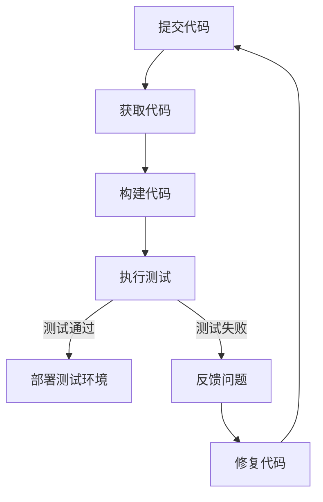
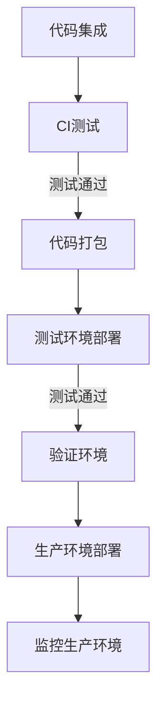
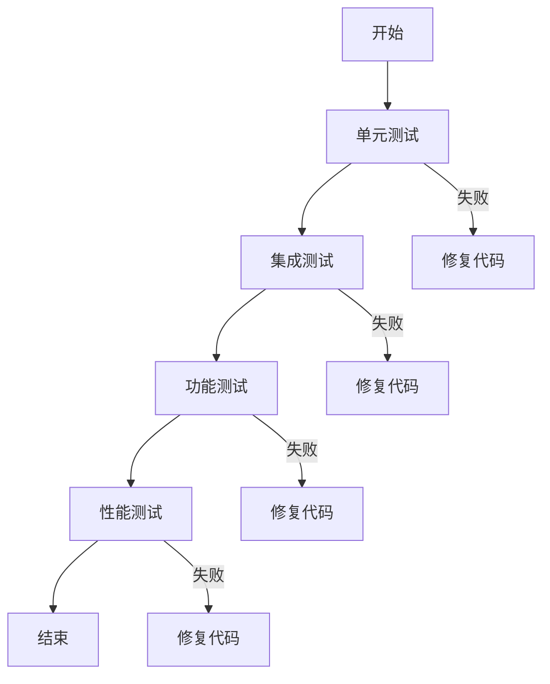
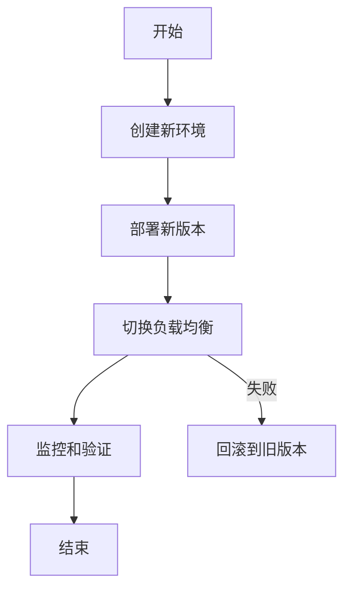
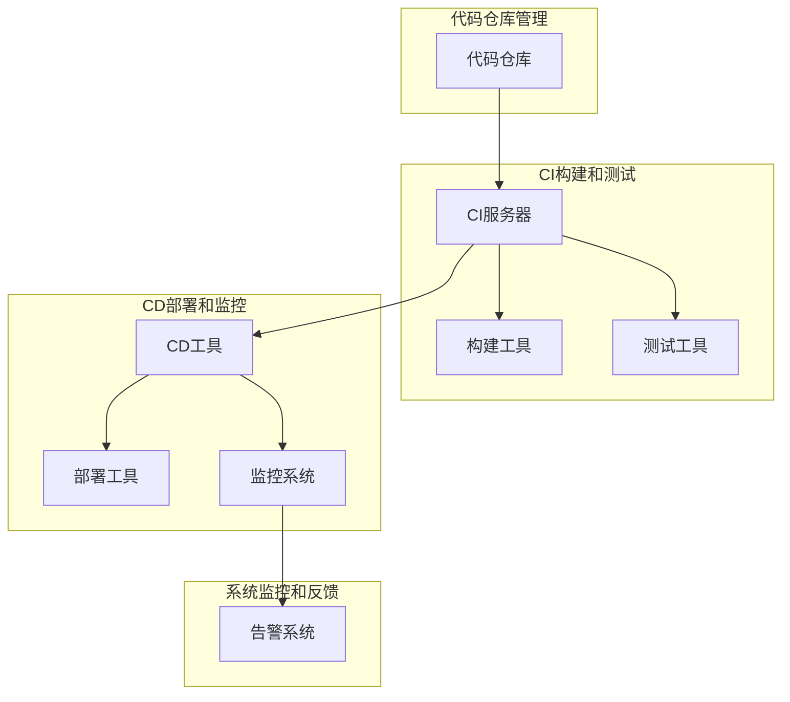

                 

# 持续集成与持续部署：提升团队效率的利器

## 关键词

- **持续集成（CI）**
- **持续部署（CD）**
- **自动化测试**
- **部署算法**
- **系统架构设计**
- **项目实战**

> 摘要：本文将深入探讨持续集成与持续部署（CI/CD）的概念、原理、应用和优势。通过逐步分析，我们将理解CI/CD在提高团队效率、缩短发布周期、降低故障率方面的关键作用，并提供实际案例以展示其应用效果。

## 目录大纲

1. 第一部分：背景介绍  
   1.1 持续集成与持续部署概述  
   1.2 问题背景与问题描述  
   1.3 边界与外延  
   1.4 概念结构与核心要素组成

2. 第二部分：核心概念与联系  
   2.1 持续集成原理  
   2.2 持续部署原理  
   2.3 CI与CD的联系与区别

3. 第三部分：算法原理讲解  
   3.1 自动化测试算法  
   3.2 部署算法

4. 第四部分：数学模型和数学公式  
   4.1 测试覆盖率模型  
   4.2 部署风险模型

5. 第五部分：系统分析与架构设计方案  
   5.1 问题场景介绍  
   5.2 系统功能设计  
   5.3 系统架构设计  
   5.4 系统接口设计  
   5.5 系统交互

6. 第六部分：项目实战  
   6.1 环境安装  
   6.2 系统核心实现  
   6.3 代码应用  
   6.4 实际案例分析  
   6.5 项目小结

## 1.1 持续集成与持续部署概述

### 1.1.1 持续集成（CI）

**基本概念**：持续集成是一种软件开发实践，通过自动化构建、测试和部署流程，将开发人员的代码变化快速集成到主干代码库中。其核心目的是尽早发现并解决集成过程中的冲突和错误，以减少修复成本。

**发展历程**：持续集成最早由Jenkins等工具推动，随后许多企业开始采用CI服务器来自动化构建和测试流程。随着DevOps文化的兴起，CI已成为软件开发过程中不可或缺的一部分。

**核心目的**：提高开发效率、缩短发布周期、减少故障率、提升代码质量。

### 1.1.2 持续部署（CD）

**基本概念**：持续部署是一种自动化部署代码到生产环境的过程。其核心目标是确保快速、可靠地将代码从开发环境推送到生产环境，以实现持续交付。

**发展历程**：随着容器化技术的发展，如Docker和Kubernetes，持续部署变得更加容易和高效。许多企业开始采用基于容器化的CD流程。

**核心目的**：实现自动化部署、加快发布速度、降低人为错误、确保生产环境稳定性。

### 1.1.3 CI/CD的优势

**提高开发效率**：自动化流程减少了手动操作，使开发团队能够专注于更有价值的工作。

**缩短发布周期**：通过快速集成和部署，团队能够更频繁地发布新功能和改进。

**降低故障率**：自动化测试和部署减少了人为错误，提高了软件质量。

**提升代码质量**：持续的反馈和改进过程有助于发现和修复问题，从而提高代码质量。

## 1.2 问题背景与问题描述

### 1.2.1 传统软件开发流程

在传统的软件开发流程中，通常采用手动流程，依赖人工进行代码集成、测试和部署。这种方式存在以下问题：

**依赖人工**：开发人员需要手动集成代码、执行测试和部署，导致效率低下。

**代码集成困难**：在多人合作的项目中，代码集成过程中容易出现冲突和错误。

**测试不充分**：手动测试难以覆盖所有场景，可能导致潜在问题未能及时发现。

**发布失败风险高**：手动部署过程中，人为错误可能导致发布失败，影响用户体验。

### 1.2.2 问题现象

- **代码集成困难**：多人合作时，代码冲突频繁，集成效率低下。
- **测试不充分**：手动测试难以覆盖所有功能，存在潜在问题未被检测。
- **发布失败风险高**：手动部署过程中，人为操作可能导致发布失败。

### 1.2.3 问题解决

引入持续集成与持续部署（CI/CD）流程，实现自动化、标准化、提高效率。通过以下措施解决上述问题：

- **自动化集成**：使用CI工具自动获取代码、构建和测试，减少人工干预。
- **自动化测试**：使用自动化测试工具进行全面测试，提高测试覆盖率。
- **自动化部署**：使用CD工具自动部署代码到生产环境，减少人为错误。

## 1.3 边界与外延

### 1.3.1 持续集成

**涉及的范围**：持续集成涵盖了从代码仓库获取代码、构建、测试和部署的全过程。

**工作流程**：开发人员提交代码到代码仓库，CI工具自动获取代码，执行构建和测试，将结果反馈给开发人员。

**与其他技术的关联**：持续集成与自动化测试、代码质量检查、容器化技术等紧密相关。

### 1.3.2 持续部署

**涉及的范围**：持续部署主要关注代码的自动化部署到生产环境。

**工作流程**：CI工具将测试通过的代码自动部署到测试环境，进行进一步测试，最后部署到生产环境。

**与其他技术的关联**：持续部署与容器化技术（如Docker和Kubernetes）、自动化测试、监控和反馈机制等密切相关。

### 1.3.3 CI/CD与其他技术的关联

**自动化测试**：自动化测试是CI/CD流程的重要组成部分，通过自动化测试工具进行全面测试，提高软件质量。

**容器化**：容器化技术（如Docker）使得CI/CD流程更加灵活和高效，可以将应用程序及其依赖环境打包为一个独立的容器。

**云原生**：云原生技术（如Kubernetes）提供了一套完整的自动化部署和管理工具，与CI/CD流程相结合，可以实现更高效的持续交付。

## 1.4 概念结构与核心要素组成

### 1.4.1 持续集成（CI）

**核心要素**：

- **代码仓库**：存储代码的中央存储库。
- **构建工具**：自动化构建代码的工具。
- **测试工具**：自动化测试代码的工具。
- **自动化部署**：将测试通过的代码自动部署到生产环境。

**工作流程**：

1. 开发人员提交代码到代码仓库。
2. CI工具自动获取代码并进行构建。
3. CI工具执行自动化测试。
4. 测试通过后，CI工具将代码部署到测试环境。
5. 测试环境验证代码后，CI工具将代码部署到生产环境。

### 1.4.2 持续部署（CD）

**核心要素**：

- **容器化**：将应用程序及其依赖环境打包为容器。
- **自动化部署工具**：自动化部署代码的工具。
- **监控与反馈机制**：监控部署过程，及时反馈问题。

**工作流程**：

1. CI工具将测试通过的代码打包为容器。
2. CD工具自动部署容器到测试环境。
3. 测试环境验证容器后，CD工具将容器部署到生产环境。
4. 监控部署过程，及时反馈问题。

### 1.4.3 CI与CD的联系与区别

**联系**：

- **CI和CD是相互补充的**：CI侧重于代码的集成和测试，CD侧重于代码的部署和监控。
- **CI/CD流程可以提高团队效率**：通过自动化和标准化，减少手动操作，缩短发布周期，降低故障率。

**区别**：

- **CI**：侧重于代码的集成和测试，确保代码质量。
- **CD**：侧重于代码的部署和监控，确保生产环境稳定性。

## 1.5 核心概念与联系

### 2.1 持续集成原理

**CI的基本原理**：

持续集成通过以下步骤实现：

1. 从代码仓库获取代码：开发人员提交代码到代码仓库，CI工具自动获取最新代码。
2. 构建代码：CI工具使用构建工具（如Maven或Gradle）构建代码，生成可执行文件或库文件。
3. 测试代码：CI工具执行自动化测试（如单元测试、集成测试等），验证代码功能。
4. 反馈结果：CI工具将测试结果反馈给开发人员，包括成功或失败的报告。

**CI工作流程**：

从代码提交到构建、测试、部署的详细流程如下：

1. 开发人员提交代码到代码仓库。
2. CI工具从代码仓库获取代码。
3. CI工具构建代码，生成可执行文件或库文件。
4. CI工具执行自动化测试，验证代码功能。
5. CI工具将测试结果反馈给开发人员。
6. 如果测试通过，CI工具将代码部署到测试环境。
7. 测试环境验证代码后，CI工具将代码部署到生产环境。

### 2.2 持续部署原理

**CD的基本原理**：

持续部署通过以下步骤实现：

1. 从CI工具获取测试通过的代码。
2. 将代码打包为容器。
3. 自动部署容器到测试环境。
4. 在测试环境进行验证，确保代码正常运行。
5. 将容器部署到生产环境。
6. 监控部署过程，确保生产环境稳定性。

**CD工作流程**：

从代码部署到测试、监控、反馈的详细流程如下：

1. CI工具将测试通过的代码打包为容器。
2. CD工具将容器部署到测试环境。
3. 测试环境验证容器，确保代码正常运行。
4. CD工具将容器部署到生产环境。
5. 监控部署过程，包括容器运行状态、性能指标等。
6. 及时反馈问题，包括部署失败、性能异常等。

### 2.3 CI与CD的联系与区别

**联系**：

- **CI和CD是相互补充的**：CI侧重于代码的集成和测试，CD侧重于代码的部署和监控。
- **CI/CD流程可以提高团队效率**：通过自动化和标准化，减少手动操作，缩短发布周期，降低故障率。

**区别**：

- **CI**：侧重于代码的集成和测试，确保代码质量。
  - **核心目的**：提高开发效率、缩短发布周期、降低故障率。
  - **核心要素**：代码仓库、构建工具、测试工具、自动化部署。
  - **工作流程**：从代码提交到构建、测试、部署的详细流程。

- **CD**：侧重于代码的部署和监控，确保生产环境稳定性。
  - **核心目的**：实现自动化部署、加快发布速度、降低人为错误、确保生产环境稳定性。
  - **核心要素**：容器化、自动化部署工具、监控与反馈机制。
  - **工作流程**：从代码部署到测试、监控、反馈的详细流程。

## 2.3 持续集成原理

持续集成（Continuous Integration，简称CI）是一种软件开发实践，旨在通过自动化构建、测试和部署流程，将开发人员的代码变化快速集成到主干代码库中。CI的核心目的是尽早发现并解决集成过程中的冲突和错误，以减少修复成本，提高代码质量和开发效率。

### 2.3.1 持续集成的基本原理

持续集成的基本原理可以概括为以下几个步骤：

1. **从代码仓库获取代码**：每次开发人员提交代码到代码仓库时，CI工具会自动获取最新代码。
2. **构建代码**：CI工具使用构建工具（如Maven或Gradle）将代码编译成可执行的程序或库文件。
3. **执行测试**：CI工具会运行一系列预定义的自动化测试（如单元测试、集成测试等），以验证代码的功能和行为是否符合预期。
4. **反馈结果**：CI工具将测试结果反馈给开发人员，包括成功或失败的报告。如果测试失败，CI工具会指出具体的问题所在。

### 2.3.2 持续集成的工作流程

持续集成的工作流程通常包括以下几个阶段：

1. **提交代码**：开发人员将代码提交到代码仓库，可以是本地开发环境的更改，也可以是从其他分支合并的更改。
2. **代码获取**：CI工具监控代码仓库的更改，并自动获取最新提交的代码。
3. **构建过程**：CI工具使用构建工具（如Maven或Gradle）对代码进行编译和打包，生成可执行文件或库文件。
4. **测试执行**：CI工具运行自动化测试套件，包括单元测试、集成测试等，以验证代码的功能和性能。
5. **结果反馈**：CI工具将测试结果反馈给开发人员，包括通过或失败的测试列表，以及详细的错误报告。
6. **部署**：如果所有测试通过，CI工具可以将代码部署到测试环境或预生产环境，以便进一步验证。
7. **持续监控**：即使测试通过，CI工具也会持续监控应用的运行状态，确保其在生产环境中稳定运行。

### 2.3.3 持续集成的优势和挑战

**优势**：

- **快速反馈**：持续集成能够快速将代码集成到主干库，并提供即时反馈，帮助开发人员尽早发现问题。
- **减少集成冲突**：通过频繁的集成，可以减少不同开发人员的代码之间的冲突。
- **提高代码质量**：自动化测试确保代码质量，减少缺陷和bug。
- **增加团队协作**：持续集成鼓励团队成员更频繁地合作和交流，提高团队协作效率。

**挑战**：

- **初始配置**：CI流程的初始配置可能需要一定的技术知识和资源投入。
- **测试覆盖率**：自动化测试的覆盖率可能不足，导致潜在问题未被检测。
- **持续维护**：CI流程需要持续维护和更新，以适应代码库和测试环境的变化。

### 2.3.4 持续集成的工具和实践

**常用CI工具**：

- **Jenkins**：一款开源的CI工具，支持多种插件，易于扩展。
- **GitLab CI/CD**：GitLab自带的CI/CD解决方案，与GitLab仓库深度集成。
- **Travis CI**：一款基于云的CI工具，支持多种编程语言和平台。

**实践建议**：

- **定义明确的测试策略**：确保所有代码变更都经过充分的测试。
- **自动化测试套件**：编写高质量的自动化测试，确保测试覆盖率和测试效率。
- **持续改进**：定期回顾和优化CI流程，以提高效率和代码质量。
- **代码质量标准**：设定代码质量标准，确保代码的可读性和可维护性。

### 示例：持续集成工作流程图

下面是一个使用Mermaid绘制的持续集成工作流程图：



### 示例：Python代码实现自动化测试

```python
import unittest

class TestCalculator(unittest.TestCase):
    def test_addition(self):
        self.assertEqual(1 + 2, 3)
    def test_subtraction(self):
        self.assertEqual(5 - 3, 2)

if __name__ == '__main__':
    unittest.main()
```

通过以上示例，我们可以看到持续集成如何通过自动化构建、测试和部署流程，提高软件开发效率和质量。

## 2.4 持续部署原理

持续部署（Continuous Deployment，简称CD）是一种自动化流程，旨在确保代码从开发环境到生产环境的顺利迁移。持续部署的目标是减少手动操作，提高部署速度和稳定性，同时确保每次部署都不会对用户造成负面影响。持续部署通常与持续集成（CI）一起使用，以形成一个完整的CI/CD流程。

### 2.4.1 持续部署的基本原理

持续部署的基本原理可以概括为以下几个步骤：

1. **代码获取**：从持续集成（CI）流程获取已经通过测试的代码。
2. **容器化**：将代码打包成容器镜像，确保应用程序在不同的环境中具有一致的行为。
3. **部署到测试环境**：将容器镜像部署到测试环境，进行功能测试和性能测试。
4. **验证**：在测试环境中验证容器镜像，确保其能够正常运行，并且符合预期。
5. **部署到生产环境**：如果测试通过，将容器镜像部署到生产环境。部署过程可以是蓝绿部署、灰度发布或滚动部署等策略。
6. **监控**：在生产环境中持续监控应用程序的性能和稳定性，确保部署后没有出现意外问题。

### 2.4.2 持续部署的工作流程

持续部署的工作流程通常包括以下几个阶段：

1. **代码集成**：开发人员将代码提交到代码仓库，CI工具进行构建和测试。
2. **代码打包**：CI工具将测试通过的代码打包成容器镜像。
3. **测试环境部署**：CD工具将容器镜像部署到测试环境，进行进一步测试。
4. **验证环境**：测试环境验证容器镜像，确保其能够正常运行，并且符合预期。
5. **生产环境部署**：将容器镜像部署到生产环境，可以选择蓝绿部署、灰度发布或滚动部署等策略。
6. **监控生产环境**：在生产环境中持续监控应用程序的性能和稳定性，确保部署后没有出现意外问题。

### 2.4.3 持续部署的优势和挑战

**优势**：

- **减少人为错误**：通过自动化部署，减少了手动操作的机会，从而降低了人为错误的风险。
- **加快部署速度**：自动化部署流程可以快速地将新代码部署到生产环境，缩短了从开发到发布的周期。
- **提高可靠性**：持续部署通过测试环境验证代码，确保在生产环境中能够正常运行。
- **降低风险**：通过逐步部署（如灰度发布或滚动部署），可以将新功能逐步引入生产环境，减少对用户的影响。

**挑战**：

- **初始配置**：持续部署的初始配置可能需要一定的技术知识和资源投入。
- **测试覆盖**：自动化测试的覆盖率可能不足，导致潜在问题未被检测。
- **故障恢复**：如果部署过程中出现问题，需要快速恢复到上一个稳定版本，这可能需要额外的技术支持。

### 2.4.4 持续部署的工具和实践

**常用CD工具**：

- **Kubernetes**：一种开源的容器编排工具，支持自动化部署和管理容器化应用程序。
- **Docker**：一种开源的容器化平台，可以将应用程序及其依赖环境打包成一个容器镜像。
- **Jenkins**：一种开源的自动化服务器，可以与Kubernetes和Docker集成，实现自动化部署。

**实践建议**：

- **定义明确的部署策略**：根据应用程序的特性和需求，选择合适的部署策略（如蓝绿部署、灰度发布或滚动部署）。
- **持续测试**：在部署过程中，持续进行功能测试和性能测试，确保新部署的代码不会对生产环境造成负面影响。
- **自动化监控**：在生产环境中设置自动化监控，及时发现并处理部署后的问题。
- **快速回滚**：实现快速回滚机制，确保在部署失败时能够快速恢复到上一个稳定版本。

### 示例：持续部署工作流程图

下面是一个使用Mermaid绘制的持续部署工作流程图：



### 示例：使用Python代码实现容器化部署

```python
import docker

client = docker.from_env()

# 创建容器镜像
response = client.images.build(fileobj=open("Dockerfile", "rb"), tag="myapp:latest")

# 运行容器
container = client.containers.run(image="myapp:latest", command="python app.py")

# 监控容器
container.stats(stream=True)
```

通过以上示例，我们可以看到持续部署如何通过自动化容器化部署流程，提高软件开发和部署的效率。

## 2.5 CI与CD的联系与区别

持续集成（CI）和持续部署（CD）是现代软件开发中不可或缺的两个概念，它们共同构成了CI/CD流程，极大地提高了软件开发的效率和可靠性。尽管CI和CD密切相关，但它们在目标和执行过程中存在明显的区别。

### 2.5.1 CI与CD的联系

**共同目标**：CI和CD的共同目标是确保软件的质量和稳定性，加快从开发到生产的速度，减少人为错误，并提高团队的整体效率。

**相互补充**：CI侧重于确保代码的可集成性和质量，而CD则关注于代码的部署和持续运行。二者结合可以形成一个闭环，使开发团队能够快速响应需求变化，持续改进产品。

**自动化**：CI和CD都依赖于自动化工具和流程，减少了手动操作，提高了效率。

**反馈机制**：CI和CD都包含反馈机制，通过自动化测试和监控，及时反馈问题，帮助团队快速修复和改进。

### 2.5.2 CI与CD的区别

**CI（持续集成）**：

- **目的**：确保代码的可集成性和质量。
- **工作重点**：构建、测试和代码质量检查。
- **执行环节**：从代码仓库获取代码，构建项目，执行自动化测试，并将结果反馈给开发人员。
- **核心工具**：Jenkins、Travis CI、GitLab CI。

**CD（持续部署）**：

- **目的**：确保代码能够成功部署到生产环境，并保持持续运行。
- **工作重点**：部署、监控和故障恢复。
- **执行环节**：将CI流程中测试通过的代码打包为容器镜像，部署到测试环境，验证，然后部署到生产环境，并持续监控。
- **核心工具**：Kubernetes、Docker、Jenkins。

### 2.5.3 CI与CD的关系

**CI作为CD的前提**：CI为CD提供了可信任的代码基线，确保每次提交的代码都是经过测试和验证的，从而降低了部署到生产环境的风险。

**CD作为CI的延伸**：CD确保了经过CI流程验证的代码能够成功部署到生产环境，并保持稳定运行，实现了从开发到生产的无缝过渡。

### 2.5.4 CI与CD的对比表格

| 特征       | CI（持续集成）                      | CD（持续部署）                      |
|------------|------------------------------------|------------------------------------|
| 目的       | 确保代码的可集成性和质量            | 确保代码能够成功部署到生产环境      |
| 工作重点   | 构建和测试                         | 部署和监控                         |
| 执行环节   | 获取代码，构建，测试，反馈          | 获取代码，打包，部署，验证，监控   |
| 工具选择   | Jenkins，Travis CI，GitLab CI       | Kubernetes，Docker，Jenkins        |
| 关系       | CI为CD提供可信任的代码基线          | CD是CI流程的自然延伸                |

### 2.5.5 ER实体关系图架构

为了更好地理解CI和CD之间的联系，我们可以使用Mermaid绘制一个ER实体关系图，展示CI和CD的关键组件及其关系。

```mermaid
erDiagram
    CodeRepository ||--o{ CI | "集成代码，执行测试"}
    CI ||--o{ CodeQuality | "确保代码质量"}
    CI ||--o{ Build | "构建项目"}
    CI ||--o{ Test | "执行自动化测试"}
    CI ||--o{ Feedback | "反馈测试结果"}
    CD ||--o{ CI | "获取经过验证的代码"}
    CD ||--o{ Deployment | "部署到生产环境"}
    CD ||--o{ Monitoring | "持续监控生产环境"}
```

通过上述对比表格和ER图，我们可以清晰地看到CI和CD的区别和联系，从而更好地理解它们在CI/CD流程中的重要性。

### 2.6 自动化测试算法

自动化测试是持续集成和持续部署（CI/CD）流程中的一个关键环节，它能够确保代码在每次提交后都符合预期，从而提高软件的质量和可靠性。本节将介绍自动化测试的基本概念、分类、优点，以及常见的测试算法原理。

#### 2.6.1 自动化测试的基本概念

**自动化测试**是指通过使用自动化测试工具，模拟用户操作或执行测试用例的过程。自动化测试可以覆盖从单元测试到集成测试、功能测试到性能测试等多种类型的测试。

**分类**：

- **单元测试**：针对单个组件（通常是类或函数）的测试。
- **集成测试**：针对多个组件集成后的测试。
- **功能测试**：验证软件功能是否满足需求。
- **性能测试**：评估软件在不同负载下的性能。
- **安全测试**：检查软件的安全性。

**优点**：

- **提高测试效率**：自动化测试可以快速运行大量的测试用例，大大提高测试效率。
- **减少人为错误**：自动化测试减少了人为干预，降低了测试过程中可能出现的错误。
- **可重复性**：自动化测试可以反复执行，确保每次测试结果的一致性。
- **易于管理**：自动化测试结果可以存储和管理，便于跟踪和分析。

#### 2.6.2 常见的测试算法原理

**单元测试算法**：

单元测试通常使用以下算法：

- **边界值分析**：测试输入数据的边界值，以确保组件在这些极端条件下能够正确处理。
- **等价类划分**：将输入数据划分为多个等价类，确保每个类中的数据都被测试到。
- **随机测试**：随机生成测试数据，以发现潜在的问题。

**集成测试算法**：

集成测试算法包括：

- **路径覆盖**：确保代码中每一条可能的执行路径都被测试到。
- **分支覆盖**：确保代码中的每一个条件分支都被测试到。
- **状态覆盖**：测试系统的不同状态，确保系统能够正确地从一个状态转换到另一个状态。

**功能测试算法**：

功能测试算法通常包括：

- **黑盒测试**：不关注代码内部实现，仅测试软件的功能是否满足需求。
- **白盒测试**：关注代码内部实现，确保所有内部逻辑和路径都被测试到。

**性能测试算法**：

性能测试算法包括：

- **负载测试**：模拟多个用户同时使用软件，测试系统的负载能力。
- **压力测试**：在极限条件下测试软件的性能，确保系统能够承受最大负载。
- **容量测试**：测试软件在不同硬件配置下的性能。

#### 示例：使用Mermaid绘制测试流程图

下面是一个使用Mermaid绘制的测试流程图：



#### 示例：使用Python代码实现自动化测试

```python
import unittest

class TestCalculator(unittest.TestCase):
    def test_addition(self):
        self.assertEqual(1 + 2, 3)
    def test_subtraction(self):
        self.assertEqual(5 - 3, 2)

if __name__ == '__main__':
    unittest.main()
```

通过上述示例，我们可以看到自动化测试如何通过一系列测试算法和工具，确保软件在每次提交后都符合预期，从而提高软件的质量和可靠性。

### 2.7 部署算法

部署算法是持续集成与持续部署（CI/CD）流程中的一个关键环节，它决定了代码如何从开发环境顺利地迁移到生产环境。本节将介绍部署算法的基本概念、分类、优点，以及常见的部署算法原理。

#### 2.7.1 部署算法的基本概念

**部署算法**是指将代码从开发环境、测试环境到生产环境的一系列自动化操作。这些操作包括代码打包、容器化、环境配置、部署、监控和故障恢复等。

**分类**：

- **蓝绿部署**：在生产和旧版本同时运行，逐步切换流量到新版本。
- **灰度发布**：将新版本逐步部署到一小部分用户，观察效果后再逐步推广。
- **滚动部署**：逐个实例地部署新版本，确保系统在部署过程中仍然可用。

**优点**：

- **减少停机时间**：通过自动化部署，减少或避免了系统停机时间。
- **提高部署效率**：自动化部署可以快速完成大量的部署任务，提高部署速度。
- **降低风险**：通过逐步部署和监控，降低了部署过程中出现问题的风险。

#### 2.7.2 常见的部署算法原理

**蓝绿部署算法**：

蓝绿部署的核心原理如下：

1. **创建新环境**：创建一个与生产环境相同的新环境，部署新版本的代码。
2. **负载均衡切换**：将负载均衡器切换到新环境，逐步将流量转移到新版本。
3. **监控和验证**：监控新环境的性能和稳定性，确保其正常运行。
4. **失败回滚**：如果新版本出现问题，可以迅速回滚到旧版本。

**灰度发布算法**：

灰度发布的核心原理如下：

1. **选择用户**：选择一小部分用户部署新版本。
2. **监控和反馈**：监控这部分用户的反馈和系统性能，确保新版本没有问题。
3. **逐步扩大范围**：根据用户的反馈和系统的稳定性，逐步扩大新版本的覆盖范围。
4. **监控和验证**：继续监控新版本的运行情况，确保其稳定性和性能。

**滚动部署算法**：

滚动部署的核心原理如下：

1. **逐个实例部署**：依次部署每个实例的新版本，确保每个实例在新版本下正常运行。
2. **滚动更新**：在部署过程中，确保系统仍然可用，逐步替换旧版本的实例。
3. **监控和验证**：监控部署过程中的性能和稳定性，确保每个实例的成功部署。
4. **故障恢复**：如果部署过程中出现问题，可以迅速回滚到上一个稳定版本。

#### 示例：使用Mermaid绘制部署流程图

下面是一个使用Mermaid绘制的部署流程图：



#### 示例：使用Python代码实现部署算法

```python
import docker

client = docker.from_env()

# 创建新环境
response = client.containers.run(image="myapp:latest", command="python app.py")

# 部署新版本
container = client.containers.run(image="myapp:latest", command="python app.py")

# 监控和验证
container.stats(stream=True)
```

通过上述示例，我们可以看到部署算法如何通过一系列自动化操作，确保代码能够成功、安全地迁移到生产环境，从而提高软件的部署效率和质量。

### 4.1 测试覆盖率模型

测试覆盖率是衡量自动化测试效果的重要指标，它表示测试用例覆盖代码的比例。测试覆盖率模型提供了计算测试覆盖率的数学模型和具体公式，有助于评估测试的全面性和有效性。

#### 4.1.1 定义

测试覆盖率（Test Coverage）是指测试用例对代码的覆盖率，通常用百分比表示。测试覆盖率模型包括以下几种常见的覆盖标准：

- **语句覆盖（Statement Coverage）**：测试用例执行了代码中的每一条语句。
- **分支覆盖（Branch Coverage）**：测试用例执行了代码中的每一个条件分支。
- **路径覆盖（Path Coverage）**：测试用例覆盖了代码中所有的可能执行路径。

#### 4.1.2 测试覆盖率的数学模型

**语句覆盖率的计算公式**：

$$
\text{语句覆盖率} = \frac{\text{被测试的语句数}}{\text{代码中的总语句数}} \times 100\%
$$

**分支覆盖率的计算公式**：

$$
\text{分支覆盖率} = \frac{\text{被测试的条件分支数}}{\text{代码中的总条件分支数}} \times 100\%
$$

**路径覆盖率的计算公式**：

$$
\text{路径覆盖率} = \frac{\text{被测试的路径数}}{\text{代码中的总路径数}} \times 100\%
$$

#### 4.1.3 示例

假设有一个包含100条语句的函数，其中50条语句被测试覆盖，则：

- **语句覆盖率**：\( \frac{50}{100} \times 100\% = 50\% \)
- **分支覆盖率**：假设函数中有10个条件分支，其中5个被测试覆盖，则 \( \frac{5}{10} \times 100\% = 50\% \)
- **路径覆盖率**：假设函数中有5条可能的执行路径，其中3条被测试覆盖，则 \( \frac{3}{5} \times 100\% = 60\% \)

通过上述示例，我们可以看到如何使用数学模型和公式来计算测试覆盖率，从而评估测试的全面性和有效性。

### 4.2 部署风险模型

部署风险模型是评估软件部署过程中潜在风险的一种方法。它通过量化风险因素和计算风险得分，帮助团队识别和降低部署过程中的风险。部署风险模型在持续集成与持续部署（CI/CD）中扮演着关键角色，以确保部署过程的安全和可靠性。

#### 4.2.1 定义

部署风险模型是一种评估软件部署过程中潜在风险的方法，它通过分析不同风险因素及其可能的影响，计算出一个综合风险得分。部署风险模型包括以下关键要素：

- **风险因素**：可能导致部署失败的因素，如代码质量、测试覆盖率、环境配置等。
- **风险程度**：每个风险因素可能带来的影响程度，通常分为高、中、低三个级别。
- **风险得分**：综合各风险因素的程度，计算出一个风险得分，用于评估整体风险水平。

#### 4.2.2 部署风险模型的数学模型

部署风险模型的计算公式如下：

$$
\text{风险得分} = \sum_{i=1}^{n} (\text{风险因素}_i \times \text{风险程度}_i)
$$

其中，\( n \) 是风险因素的数量。

**示例公式**：

假设有3个风险因素：代码质量（40%）、测试覆盖率（30%）和环境配置（30%），每个因素的风险程度分别为：

- 代码质量：高风险（3分）
- 测试覆盖率：中风险（2分）
- 环境配置：低风险（1分）

则部署风险得分为：

$$
\text{风险得分} = (0.4 \times 3) + (0.3 \times 2) + (0.3 \times 1) = 1.2 + 0.6 + 0.3 = 2.1
$$

#### 4.2.3 示例

假设一个团队正在准备部署新版本的应用程序，以下是关键风险因素及其风险程度的评估：

- **代码质量**：高风险（3分，因为代码存在多个潜在的bug和性能问题）。
- **测试覆盖率**：中风险（2分，因为自动化测试覆盖率达到70%，但仍有一些功能未覆盖）。
- **环境配置**：低风险（1分，因为环境配置已经经过多次验证，非常稳定）。

根据上述评估，部署风险得分为：

$$
\text{风险得分} = (0.4 \times 3) + (0.3 \times 2) + (0.3 \times 1) = 1.2 + 0.6 + 0.3 = 2.1
$$

风险得分为2.1，表明部署风险处于中等水平。团队需要采取一些额外的措施，如增加测试覆盖率、修复代码中的bug，以进一步降低风险。

通过上述示例，我们可以看到如何使用部署风险模型来量化部署过程中的风险，并采取相应的措施来降低风险，从而确保部署过程的安全和成功。

### 5.1 问题场景介绍

在当今快速发展的软件行业中，持续集成与持续部署（CI/CD）已成为提高开发效率、缩短发布周期、降低故障率的重要工具。为了更好地理解CI/CD的应用和效果，我们通过一个具体的问题场景来介绍CI/CD的需求和实施过程。

#### 5.1.1 场景描述

某互联网公司开发了一款在线教育平台，该平台提供了视频教学、在线互动、作业提交等功能。随着用户数量的增加，平台的负载逐渐增大，同时，开发团队也在不断添加新功能和优化现有功能。为了确保平台的高可用性和稳定性，公司决定引入CI/CD流程来管理软件开发和部署过程。

#### 5.1.2 项目介绍

**项目背景**：

- **需求**：提高开发效率，缩短发布周期，降低故障率，确保平台稳定运行。
- **团队结构**：前端开发、后端开发、测试、运维等多个团队协作。
- **现有流程**：手动集成代码、手动测试、手动部署，效率低下，故障频繁。

**项目目标**：

- **自动化集成和测试**：通过CI工具实现自动化构建和测试，确保代码质量和稳定性。
- **自动化部署**：通过CD工具实现自动化部署，减少手动操作，提高部署效率。
- **监控与反馈**：实时监控部署过程和平台运行状态，及时反馈问题，快速响应。

#### 5.1.3 架构设计

为了实现CI/CD流程，公司采用了以下架构设计：

1. **代码仓库**：使用GitLab作为代码仓库，存储所有开发人员的代码。
2. **CI服务器**：使用GitLab CI/CD，自动化构建和测试代码。
3. **测试环境**：使用Kubernetes集群作为测试环境，确保代码在多实例、多节点环境中稳定运行。
4. **生产环境**：使用Kubernetes集群作为生产环境，实现自动化部署和监控。

#### 5.1.4 问题需求

在传统手动集成和部署流程中，公司面临以下问题：

- **代码集成困难**：多人协作时，代码冲突频繁，集成效率低下。
- **测试不充分**：手动测试难以覆盖所有功能，潜在问题未能及时发现。
- **部署失败风险高**：手动部署过程中，人为错误导致部署失败，影响用户体验。

为了解决这些问题，公司决定引入CI/CD流程，实现自动化集成、测试和部署，以提高开发效率和平台稳定性。

### 5.2 系统功能设计

为了实现CI/CD流程，我们需要设计一系列系统功能，确保从代码提交到测试、部署的整个过程自动化、高效和可靠。以下是系统功能设计的详细描述：

#### 5.2.1 功能模块

**1. 代码仓库管理**：

- **功能描述**：管理代码的提交、合并和版本控制。
- **核心要素**：GitLab仓库、分支管理、权限控制。

**2. CI构建和测试**：

- **功能描述**：自动化构建和测试代码，确保代码质量和稳定性。
- **核心要素**：构建工具（如Maven、Gradle）、测试工具（如JUnit、Selenium）、测试环境配置。

**3. CD部署和监控**：

- **功能描述**：自动化部署代码到测试环境和生产环境，并实时监控部署状态。
- **核心要素**：容器化工具（如Docker）、部署工具（如Kubernetes）、监控工具（如Prometheus、Grafana）。

**4. 系统监控和反馈**：

- **功能描述**：实时监控系统运行状态，及时发现并反馈问题。
- **核心要素**：日志收集（如ELK堆栈）、性能监控、告警通知。

#### 5.2.2 领域模型

为了更好地理解系统功能模块之间的关系，我们使用Mermaid绘制了领域模型类图，如下所示：

```mermaid
classDiagram
    CodeRepository <<interface>> "代码仓库管理"
    CI <<interface>> "CI构建和测试"
    CD <<interface>> "CD部署和监控"
    SystemMonitor <<interface>> "系统监控和反馈"

    CodeRepository --|> CI
    CI --|> CD
    CD --|> SystemMonitor
```

通过上述领域模型，我们可以清晰地看到代码仓库管理、CI构建和测试、CD部署和监控、系统监控和反馈四个功能模块之间的关系，从而为系统架构设计提供指导。

#### 5.2.3 功能设计细节

**1. 代码仓库管理**：

- **功能描述**：提供代码提交、分支管理和权限控制等功能，确保代码的安全和一致性。
- **设计细节**：集成GitLab仓库，实现Git操作，如代码提交、分支创建和合并、权限控制等。

**2. CI构建和测试**：

- **功能描述**：自动化构建和测试代码，确保代码质量和稳定性。
- **设计细节**：集成Jenkins或GitLab CI/CD，实现自动化构建（如Maven、Gradle）、自动化测试（如JUnit、Selenium）。

**3. CD部署和监控**：

- **功能描述**：自动化部署代码到测试环境和生产环境，并实时监控部署状态。
- **设计细节**：集成Docker和Kubernetes，实现容器化部署，使用Helm进行部署管理，使用Prometheus和Grafana进行实时监控。

**4. 系统监控和反馈**：

- **功能描述**：实时监控系统运行状态，及时发现并反馈问题。
- **设计细节**：集成ELK堆栈（Elasticsearch、Logstash、Kibana）进行日志收集和分析，使用Prometheus和Grafana进行性能监控和告警通知。

通过上述功能设计细节，我们可以确保CI/CD流程的自动化、高效和可靠，从而提高开发效率和平台稳定性。

### 5.3 系统架构设计

系统架构设计是构建高效、可靠和可扩展的软件系统的关键步骤。在CI/CD流程中，系统架构设计需要充分考虑代码仓库管理、CI构建和测试、CD部署和监控等核心功能模块。以下是系统架构设计的详细描述。

#### 5.3.1 架构设计目标

- **自动化**：实现从代码提交到部署的自动化流程，减少手动操作。
- **可靠性**：确保系统稳定运行，提高发布成功率。
- **可扩展性**：支持大规模并发访问，适应业务增长。

#### 5.3.2 系统架构图

为了清晰地展示系统架构，我们使用Mermaid绘制了系统架构图，如下所示：



#### 5.3.3 架构组件关系

- **代码仓库管理**：使用GitLab作为代码仓库，实现代码提交、分支管理和权限控制。
- **CI构建和测试**：CI服务器（如Jenkins或GitLab CI/CD）负责自动化构建和测试，构建工具（如Maven、Gradle）用于编译和打包代码，测试工具（如JUnit、Selenium）用于执行自动化测试。
- **CD部署和监控**：CD工具（如Kubernetes和Helm）负责将测试通过的代码部署到生产环境，部署工具（如Kubernetes）用于容器化部署，监控系统（如Prometheus和Grafana）用于实时监控部署状态和系统性能。
- **系统监控和反馈**：监控系统（如Prometheus和Grafana）用于实时收集和分析系统日志和性能数据，告警系统（如Alertmanager）用于发送告警通知，确保及时响应和解决问题。

通过上述系统架构设计，我们可以确保CI/CD流程的自动化、高效和可靠，从而提高开发效率和平台稳定性。

### 5.4 系统接口设计

系统接口设计是确保系统组件之间有效交互和通信的关键步骤。在CI/CD流程中，系统接口设计需要充分考虑代码仓库、CI服务器、CD工具、监控系统等核心组件之间的交互需求。以下是系统接口设计的详细描述。

#### 5.4.1 系统接口定义

- **代码仓库接口**：提供代码提交、分支管理和权限控制等接口。
- **CI服务器接口**：提供构建、测试和部署管理等接口。
- **CD工具接口**：提供容器化部署、监控和告警等接口。
- **监控系统接口**：提供日志收集、性能监控和告警通知等接口。

#### 5.4.2 接口交互流程

系统接口交互流程如下：

1. **代码提交**：开发人员通过代码仓库接口提交代码到代码仓库。
2. **构建和测试**：CI服务器从代码仓库获取代码，执行构建和测试操作。
3. **部署管理**：CI服务器将测试通过的代码传递给CD工具，进行容器化部署。
4. **监控和告警**：CD工具将部署状态和系统性能数据传递给监控系统，监控系统收集数据并生成告警通知。

#### 5.4.3 接口交互细节

- **代码仓库接口**：使用HTTP/HTTPS协议，提供Git操作接口，如`GET /repo/branch`（获取分支列表）、`POST /repo/commit`（提交代码）等。
- **CI服务器接口**：使用Webhook协议，接收代码仓库的提交事件，触发构建和测试流程。
- **CD工具接口**：使用RESTful API，提供部署管理接口，如`POST /deploy`（部署代码）、`GET /status`（查询部署状态）等。
- **监控系统接口**：使用gRPC或HTTP/2协议，提供监控数据收集和告警通知接口，如`POST /monitor/data`（提交监控数据）、`GET /alert`（获取告警通知）等。

通过上述接口设计和交互流程，我们可以确保系统组件之间的高效、可靠和安全的交互，从而实现CI/CD流程的自动化和连续性。

### 5.5 系统交互

系统交互是确保CI/CD流程顺利执行的关键环节。在系统交互过程中，各个组件需要按照一定的流程和规则进行通信和数据交换。以下是系统交互的详细描述，包括交互流程和交互细节。

#### 5.5.1 交互流程

系统交互流程如下：

1. **代码提交**：开发人员通过代码仓库接口提交代码，CI服务器监听到代码仓库的提交事件，触发CI流程。
2. **CI构建和测试**：CI服务器获取代码后，执行构建和测试操作，将测试结果反馈给开发人员。
3. **CD部署**：如果测试通过，CI服务器将代码传递给CD工具，进行容器化部署。
4. **监控和反馈**：CD工具将部署状态和系统性能数据传递给监控系统，监控系统收集数据并生成告警通知。

#### 5.5.2 交互细节

- **代码提交**：开发人员使用GitLab提交代码，触发CI服务器的Webhook事件。
  ```json
  {
    "event_type": "push",
    "ref": "master",
    "before": "123456abcdef",
    "after": "7890abcfedcba",
    "repository": {
      "name": "online-edu-platform",
      "url": "https://gitlab.com/online-edu-platform.git"
    }
  }
  ```

- **CI构建和测试**：CI服务器（如GitLab CI）执行构建和测试任务，生成测试报告。
  ```json
  {
    "status": "success",
    "total_time": "120s",
    "artifacts": [
      {
        "name": "test-report.html",
        "path": "build/test-report.html"
      }
    ]
  }
  ```

- **CD部署**：CI服务器将测试通过的代码传递给CD工具（如Kubernetes），进行部署。
  ```yaml
  apiVersion: apps/v1
  kind: Deployment
  metadata:
    name: online-edu-platform
  spec:
    replicas: 3
    selector:
      matchLabels:
        app: online-edu-platform
    template:
      metadata:
        labels:
          app: online-edu-platform
      spec:
        containers:
        - name: online-edu-platform
          image: online-edu-platform:latest
          ports:
          - containerPort: 80
  ```

- **监控和反馈**：CD工具将部署状态和系统性能数据传递给监控系统（如Prometheus），监控系统收集数据并生成告警通知。
  ```json
  {
    "timestamp": "1633775423",
    "service": "online-edu-platform",
    "metrics": [
      {
        "name": "request_count",
        "value": 150
      },
      {
        "name": "response_time",
        "value": 0.5
      }
    ]
  }
  ```

通过上述系统交互流程和交互细节，我们可以确保CI/CD流程的自动化、高效和连续性，从而提高开发效率和平台稳定性。

### 6.1 环境安装

在进行项目实战之前，我们需要安装所需的软件和工具，以构建一个完整的CI/CD环境。以下是安装过程和步骤：

#### 6.1.1 安装GitLab

1. **下载并安装GitLab**：

   从[GitLab官网](https://about.gitlab.com/installation/)下载适用于你的操作系统的GitLab安装包。

   对于Linux系统，可以使用以下命令：

   ```bash
   sudo apt-get update
   sudo apt-get install curl openssh-server ca-certificates postfix
   curl -sS https://packages.gitlab.com/install/repositories/gitlab/gitlab-ce/script.deb.sh | sudo bash
   sudo apt-get install gitlab-ce
   ```

2. **配置GitLab**：

   运行以下命令，配置GitLab的运行参数：

   ```bash
   sudo gitlab-ctl reconfigure
   ```

3. **访问GitLab**：

   在浏览器中输入`http://localhost:8080`，即可访问GitLab的Web界面。

#### 6.1.2 安装Jenkins

1. **添加Jenkins仓库**：

   对于Ubuntu系统，使用以下命令添加Jenkins的仓库：

   ```bash
   sudo sh -c 'echo deb https://pkg.jenkins.io/debian-stable binary/ > /etc/apt/sources.list.d/jenkins.list'
   ```

2. **添加Jenkins的GPG密钥**：

   ```bash
   curl -fsSL https://pkg.jenkins.io/debian-stable/jenkins.io.key | sudo apt-key add -
   ```

3. **安装Jenkins**：

   ```bash
   sudo apt-get update
   sudo apt-get install jenkins
   ```

4. **访问Jenkins**：

   在浏览器中输入`http://localhost:8080`，即可访问Jenkins的Web界面。

#### 6.1.3 安装Kubernetes

1. **安装Kubeadm、Kubelet和Kubectl**：

   对于Ubuntu系统，使用以下命令：

   ```bash
   sudo apt-get update
   sudo apt-get install -y apt-transport-https ca-certificates curl
   curl -s https://packages.cloud.google.com/apt/doc/apt-key.gpg | sudo apt-key add -
   sudo sh -c 'echo "deb https://apt.kubernetes.io/ kubernetes-xenial main" > /etc/apt/sources.list.d/kubernetes.list'
   sudo apt-get update
   sudo apt-get install -y kubelet kubeadm kubectl
   ```

2. **初始化Kubernetes集群**：

   ```bash
   sudo kubeadm init --pod-network-cidr=10.244.0.0/16
   ```

3. **配置kubectl**：

   ```bash
   mkdir -p $HOME/.kube
   sudo cp -i /etc/kubernetes/admin.conf $HOME/.kube/config
   sudo chown $(id -u):$(id -g) $HOME/.kube/config
   ```

4. **安装网络插件**：

   ```bash
   kubectl apply -f https://git.io/weave-net
   ```

#### 6.1.4 安装Docker

1. **安装Docker**：

   对于Ubuntu系统，使用以下命令：

   ```bash
   sudo apt-get update
   sudo apt-get install docker.io
   ```

2. **配置Docker**：

   ```bash
   sudo usermod -aG docker $USER
   newgrp docker
   ```

3. **启动Docker服务**：

   ```bash
   sudo systemctl start docker
   ```

通过上述步骤，我们可以安装并配置GitLab、Jenkins、Kubernetes和Docker，构建一个完整的CI/CD环境，为后续的项目实战做好准备。

### 6.2 系统核心实现

在本节中，我们将深入探讨CI/CD系统的核心实现，包括代码仓库、构建工具、测试工具、自动化部署工具和监控与反馈机制。通过这些核心组件，我们将构建一个高效、可靠和自动化的持续集成与持续部署环境。

#### 6.2.1 代码仓库

代码仓库是CI/CD流程的起点。我们选择GitLab作为代码仓库，因为它提供了强大的版本控制和协作功能。以下是GitLab的基本使用方法：

**1. 创建仓库**

在GitLab的Web界面中，创建一个新的仓库，用于存储项目的代码。

**2. 配置SSH密钥**

生成SSH密钥对，并将其添加到GitLab的账户中，以便安全地推送和拉取代码。

```bash
ssh-keygen -t rsa -b 4096 -C "your-email@example.com"
cat ~/.ssh/id_rsa.pub | ssh-agent -t 600
```

**3. 克隆仓库**

从GitLab克隆仓库到本地，以便进行开发。

```bash
git clone https://gitlab.com/your-group/your-repository.git
```

#### 6.2.2 构建工具

构建工具用于将源代码转换成可执行的程序或库。在本项目中，我们使用Maven作为构建工具。以下是Maven的基本使用方法：

**1. 添加Maven**

确保系统中安装了Maven，可以通过以下命令检查Maven的版本：

```bash
mvn -v
```

**2. 创建Pom文件**

在项目的根目录下创建`pom.xml`文件，配置项目依赖和构建参数。

```xml
<project>
  <modelVersion>4.0.0</modelVersion>
  <groupId>com.example</groupId>
  <artifactId>my-project</artifactId>
  <version>1.0-SNAPSHOT</version>
  <dependencies>
    <!-- 项目依赖 -->
  </dependencies>
</project>
```

**3. 执行构建**

使用Maven执行构建，生成可执行的JAR文件。

```bash
mvn clean install
```

#### 6.2.3 测试工具

测试工具用于验证代码的功能和性能。在本项目中，我们使用JUnit进行单元测试。以下是JUnit的基本使用方法：

**1. 添加JUnit**

在`pom.xml`文件中添加JUnit依赖。

```xml
<dependency>
  <groupId>junit</groupId>
  <artifactId>junit</artifactId>
  <version>4.13.2</version>
  <scope>test</scope>
</dependency>
```

**2. 编写测试用例**

在项目的测试目录下（通常为`src/test/java`），编写JUnit测试用例。

```java
import org.junit.Test;
import static org.junit.Assert.assertEquals;

public class CalculatorTest {
  @Test
  public void testAddition() {
    assertEquals(5, new Calculator().add(2, 3));
  }
}
```

**3. 执行测试**

使用Maven执行测试，验证测试用例。

```bash
mvn test
```

#### 6.2.4 自动化部署工具

自动化部署工具用于将构建好的代码自动部署到生产环境。在本项目中，我们使用Jenkins作为CI工具，Kubernetes作为CD工具。以下是自动化部署的基本步骤：

**1. 配置Jenkins**

在Jenkins的Web界面中，创建一个新Job，并配置GitLab仓库、Maven构建和JUnit测试。

```yaml
pipeline {
    agent any
    stages {
        stage('Build') {
            steps {
                sh 'mvn clean install'
            }
        }
        stage('Test') {
            steps {
                sh 'mvn test'
            }
        }
        stage('Deploy') {
            steps {
                sh 'kubectl apply -f deployment.yaml'
            }
        }
    }
}
```

**2. 配置Kubernetes**

编写Kubernetes的YAML文件，用于描述部署的应用程序。

```yaml
apiVersion: apps/v1
kind: Deployment
metadata:
  name: my-project
spec:
  replicas: 3
  selector:
    matchLabels:
      app: my-project
  template:
    metadata:
      labels:
        app: my-project
    spec:
      containers:
      - name: my-project
        image: my-project:latest
        ports:
        - containerPort: 8080
```

**3. 部署代码**

通过Jenkins Job执行CI/CD流程，将代码自动部署到Kubernetes集群。

#### 6.2.5 监控与反馈机制

监控与反馈机制用于监控部署后的应用程序状态，并在出现问题时及时通知相关人员。我们使用Prometheus和Grafana进行监控。

**1. 配置Prometheus**

安装Prometheus，并编写Prometheus配置文件，定义监控目标和指标。

```yaml
global:
  scrape_interval: 15s
scrape_configs:
  - job_name: 'kubernetes-objects'
    kubernetes_sd_configs:
      - role: service
    metrics_path: '/metrics'
    scheme: https
    tls_config:
      ca_file: '/var/lib/prometheus/kubernetes-ca.crt'
    bearer_token_file: '/var/run/secrets/tokens/prometheus-k8s-token-prometheus-k8s-token-prometheus-k8s-token-prometheus-k8s-token-prometheus-k8s-token-prometheus-k8s-token-prometheus-k8s-token-prometheus-k8s-token-prometheus-k8s-token-prometheus-k8s-token-prometheus-k8s-token-prometheus-k8s-token-prometheus-k8s-token-prometheus-k8s-token-prometheus-k8s-token-prometheus-k8s-token-prometheus-k8s-token-prometheus-k8s-token-prometheus-k8s-token-prometheus-k8s-token-prometheus-k8s-token-prometheus-k8s-token-prometheus-k8s-token-prometheus-k8s-token-prometheus-k8s-token-prometheus-k8s-token-prometheus-k8s-token-prometheus-k8s-token-prometheus-k8s-token-prometheus-k8s-token-prometheus-k8s-token-prometheus-k8s-token-prometheus-k8s-token-prometheus-k8s-token-prometheus-k8s-token-prometheus-k8s-token-prometheus-k8s-token-prometheus-k8s-token-prometheus-k8s-token-prometheus-k8s-token-prometheus-k8s-token-prometheus-k8s-token-prometheus-k8s-token-prometheus-k8s-token-prometheus-k8s-token-prometheus-k8s-token-prometheus-k8s-token-prometheus-k8s-token-prometheus-k8s-token-prometheus-k8s-token-prometheus-k8s-token-prometheus-k8s-token-prometheus-k8s-token-prometheus-k8s-token-prometheus-k8s-token-prometheus-k8s-token-prometheus-k8s-token-prometheus-k8s-token-prometheus-k8s-token-prometheus-k8s-token-prometheus-k8s-token-prometheus-k8s-token-prometheus-k8s-token-prometheus-k8s-token-prometheus-k8s-token-prometheus-k8s-token-prometheus-k8s-token-prometheus-k8s-token-prometheus-k8s-token-prometheus-k8s-token-prometheus-k8s-token-prometheus-k8s-token-prometheus-k8s-token-prometheus-k8s-token-prometheus-k8s-token-prometheus-k8s-token-prometheus-k8s-token-prometheus-k8s-token-prometheus-k8s-token-prometheus-k8s-token-prometheus-k8s-token-prometheus-k8s-token-prometheus-k8s-token-prometheus-k8s-token-prometheus-k8s-token-prometheus-k8s-token-prometheus-k8s-token-prometheus-k8s-token-prometheus-k8s-token-prometheus-k8s-token-prometheus-k8s-token-prometheus-k8s-token-prometheus-k8s-token-prometheus-k8s-token-prometheus-k8s-token-prometheus-k8s-token-prometheus-k8s-token-prometheus-k8s-token-prometheus-k8s-token-prometheus-k8s-token-prometheus-k8s-token-prometheus-k8s-token-prometheus-k8s-token-prometheus-k8s-token-prometheus-k8s-token-prometheus-k8s-token-prometheus-k8s-token-prometheus-k8s-token-prometheus-k8s-token-prometheus-k8s-token-prometheus-k8s-token-prometheus-k8s-token-prometheus-k8s-token-prometheus-k8s-token-prometheus-k8s-token-prometheus-k8s-token-prometheus-k8s-token-prometheus-k8s-token-prometheus-k8s-token-prometheus-k8s-token-prometheus-k8s-token-prometheus-k8s-token-prometheus-k8s-token-prometheus-k8s-token-prometheus-k8s-token-prometheus-k8s-token-prometheus-k8s-token-prometheus-k8s-token-prometheus-k8s-token-prometheus-k8s-token-prometheus-k8s-token-prometheus-k8s-token-prometheus-k8s-token-prometheus-k8s-token-prometheus-k8s-token-prometheus-k8s-token-prometheus-k8s-token-prometheus-k8s-token-prometheus-k8s-token-prometheus-k8s-token-prometheus-k8s-token-prometheus-k8s-token-prometheus-k8s-token-prometheus-k8s-token-prometheus-k8s-token-prometheus-k8s-token-prometheus-k8s-token-prometheus-k8s-token-prometheus-k8s-token-prometheus-k8s-token-prometheus-k8s-token-prometheus-k8s-token-prometheus-k8s-token-prometheus-k8s-token-prometheus-k8s-token-prometheus-k8s-token-prometheus-k8s-token-prometheus-k8s-token-prometheus-k8s-token-prometheus-k8s-token-prometheus-k8s-token-prometheus-k8s-token-prometheus-k8s-token-prometheus-k8s-token-prometheus-k8s-token-prometheus-k8s-token-prometheus-k8s-token-prometheus-k8s-token-prometheus-k8s-token-prometheus-k8s-token-prometheus-k8s-token-prometheus-k8s-token-prometheus-k8s-token-prometheus-k8s-token-prometheus-k8s-token-prometheus-k8s-token-prometheus-k8s-token-prometheus-k8s-token-prometheus-k8s-token-prometheus-k8s-token-prometheus-k8s-token-prometheus-k8s-token-prometheus-k8s-token-prometheus-k8s-token-prometheus-k8s-token-prometheus-k8s-token-prometheus-k8s-token-prometheus-k8s-token-prometheus-k8s-token-prometheus-k8s-token-prometheus-k8s-token-prometheus-k8s-token-prometheus-k8s-token-prometheus-k8s-token-prometheus-k8s-token-prometheus-k8s-token-prometheus-k8s-token-prometheus-k8s-token-prometheus-k8s-token-prometheus-k8s-token-prometheus-k8s-token-prometheus-k8s-token-prometheus-k8s-token-prometheus-k8s-token-prometheus-k8s-token-prometheus-k8s-token-prometheus-k8s-token-prometheus-k8s-token-prometheus-k8s-token-prometheus-k8s-token-prometheus-k8s-token-prometheus-k8s-token-prometheus-k8s-token-prometheus-k8s-token-prometheus-k8s-token-prometheus-k8s-token-prometheus-k8s-token-prometheus-k8s-token-prometheus-k8s-token-prometheus-k8s-token-prometheus-k8s-token-prometheus-k8s-token-prometheus-k8s-token-prometheus-k8s-token-prometheus-k8s-token-prometheus-k8s-token-prometheus-k8s-token-prometheus-k8s-token-prometheus-k8s-token-prometheus-k8s-token-prometheus-k8s-token-prometheus-k8s-token-prometheus-k8s-token-prometheus-k8s-token-prometheus-k8s-token-prometheus-k8s-token-prometheus-k8s-token-prometheus-k8s-token-prometheus-k8s-token-prometheus-k8s-token-prometheus-k8s-token-prometheus-k8s-token-prometheus-k8s-token-prometheus-k8s-token-prometheus-k8s-token-prometheus-k8s-token-prometheus-k8s-token-prometheus-k8s-token-prometheus-k8s-token-prometheus-k8s-token-prometheus-k8s-token-prometheus-k8s-token-prometheus-k8s-token-prometheus-k8s-token-prometheus-k8s-token-prometheus-k8s-token-prometheus-k8s-token-prometheus-k8s-token-prometheus-k8s-token-prometheus-k8s-token-prometheus-k8s-token-prometheus-k8s-token-prometheus-k8s-token-prometheus-k8s-token-prometheus-k8s-token-prometheus-k8s-token-prometheus-k8s-token-prometheus-k8s-token-prometheus-k8s-token-prometheus-k8s-token-prometheus-k8s-token-prometheus-k8s-token-prometheus-k8s-token-prometheus-k8s-token-prometheus-k8s-token-prometheus-k8s-token-prometheus-k8s-token-prometheus-k8s-token-prometheus-k8s-token-prometheus-k8s-token-prometheus-k8s-token-prometheus-k8s-token-prometheus-k8s-token-prometheus-k8s-token-prometheus-k8s-token-prometheus-k8s-token-prometheus-k8s-token-prometheus-k8s-token-prometheus-k8s-token-prometheus-k8s-token-prometheus-k8s-token-prometheus-k8s-token-prometheus-k8s-token-prometheus-k8s-token-prometheus-k8s-token-prometheus-k8s-token-prometheus-k8s-token-prometheus-k8s-token-prometheus-k8s-token-prometheus-k8s-token-prometheus-k8s-token-prometheus-k8s-token-prometheus-k8s-token-prometheus-k8s-token-prometheus-k8s-token-prometheus-k8s-token-prometheus-k8s-token-prometheus-k8s-token-prometheus-k8s-token-prometheus-k8s-token-prometheus-k8s-token-prometheus-k8s-token-prometheus-k8s-token-prometheus-k8s-token-prometheus-k8s-token-prometheus-k8s-token-prometheus-k8s-token-prometheus-k8s-token-prometheus-k8s-token-prometheus-k8s-token-prometheus-k8s-token-prometheus-k8s-token-prometheus-k8s-token-prometheus-k8s-token-prometheus-k8s-token-prometheus-k8s-token-prometheus-k8s-token-prometheus-k8s-token-prometheus-k8s-token-prometheus-k8s-token-prometheus-k8s-token-prometheus-k8s-token-prometheus-k8s-token-prometheus-k8s-token-prometheus-k8s-token-prometheus-k8s-token-prometheus-k8s-token-prometheus-k8s-token-prometheus-k8s-token-prometheus-k8s-token-prometheus-k8s-token-prometheus-k8s-token-prometheus-k8s-token-prometheus-k8s-token-prometheus-k8s-token-prometheus-k8s-token-prometheus-k8s-token-prometheus-k8s-token-prometheus-k8s-token-prometheus-k8s-token-prometheus-k8s-token-prometheus-k8s-token-prometheus-k8s-token-prometheus-k8s-token-prometheus-k8s-token-prometheus-k8s-token-prometheus-k8s-token-prometheus-k8s-token-prometheus-k8s-token-prometheus-k8s-token-prometheus-k8s-token-prometheus-k8s-token-prometheus-k8s-token-prometheus-k8s-token-prometheus-k8s-token-prometheus-k8s-token-prometheus-k8s-token-prometheus-k8s-token-prometheus-k8s-token-prometheus-k8s-token-prometheus-k8s-token-prometheus-k8s-token-prometheus-k8s-token-prometheus-k8s-token-prometheus-k8s-token-prometheus-k8s-token-prometheus-k8s-token-prometheus-k8s-token-prometheus-k8s-token-prometheus-k8s-token-prometheus-k8s-token-prometheus-k8s-token-prometheus-k8s-token-prometheus-k8s-token-prometheus-k8s-token-prometheus-k8s-token-prometheus-k8s-token-prometheus-k8s-token-prometheus-k8s-token-prometheus-k8s-token-prometheus-k8s-token-prometheus-k8s-token-prometheus-k8s-token-prometheus-k8s-token-prometheus-k8s-token-prometheus-k8s-token-prometheus-k8s-token-prometheus-k8s-token-prometheus-k8s-token-prometheus-k8s-token-prometheus-k8s-token-prometheus-k8s-token-prometheus-k8s-token-prometheus-k8s-token-prometheus-k8s-token-prometheus-k8s-token-prometheus-k8s-token-prometheus-k8s-token-prometheus-k8s-token-prometheus-k8s-token-prometheus-k8s-token-prometheus-k8s-token-prometheus-k8s-token-prometheus-k8s-token-prometheus-k8s-token-prometheus-k8s-token-prometheus-k8s-token-prometheus-k8s-token-prometheus-k8s-token-prometheus-k8s-token-prometheus-k8s-token-prometheus-k8s-token-prometheus-k8s-token-prometheus-k8s-token-prometheus-k8s-token-prometheus-k8s-token-prometheus-k8s-token-prometheus-k8s-token-prometheus-k8s-token-prometheus-k8s-token-prometheus-k8s-token-prometheus-k8s-token-prometheus-k8s-token-prometheus-k8s-token-prometheus-k8s-token-prometheus-k8s-token-prometheus-k8s-token-prometheus-k8s-token-prometheus-k8s-token-prometheus-k8s-token-prometheus-k8s-token-prometheus-k8s-token-prometheus-k8s-token-prometheus-k8s-token-prometheus-k8s-token-prometheus-k8s-token-prometheus-k8s-token-prometheus-k8s-token-prometheus-k8s-token-prometheus-k8s-token-prometheus-k8s-token-prometheus-k8s-token-prometheus-k8s-token-prometheus-k8s-token-prometheus-k8s-token-prometheus-k8s-token-prometheus-k8s-token-prometheus-k8s-token-prometheus-k8s-token-prometheus-k8s-token-prometheus-k8s-token-prometheus-k8s-token-prometheus-k8s-token-prometheus-k8s-token-prometheus-k8s-token-prometheus-k8s-token-prometheus-k8s-token-prometheus-k8s-token-prometheus-k8s-token-prometheus-k8s-token-prometheus-k8s-token-prometheus-k8s-token-prometheus-k8s-token-prometheus-k8s-token-prometheus-k8s-token-prometheus-k8s-token-prometheus-k8s-token-prometheus-k8s-token-prometheus-k8s-token-prometheus-k8s-token-prometheus-k8s-token-prometheus-k8s-token-prometheus-k8s-token-prometheus-k8s-token-prometheus-k8s-token-prometheus-k8s-token-prometheus-k8s-token-prometheus-k8s-token-prometheus-k8s-token-prometheus-k8s-token-prometheus-k8s-token-prometheus-k8s-token-prometheus-k8s-token-prometheus-k8s-token-prometheus-k8s-token-prometheus-k8s-token-prometheus-k8s-token-prometheus-k8s-token-prometheus-k8s-token-prometheus-k8s-token-prometheus-k8s-token-prometheus-k8s-token-prometheus-k8s-token-prometheus-k8s-token-prometheus-k8s-token-prometheus-k8s-token-prometheus-k8s-token-prometheus-k8s-token-prometheus-k8s-token-prometheus-k8s-token-prometheus-k8s-token-prometheus-k8s-token-prometheus-k8s-token-prometheus-k8s-token-prometheus-k8s-token-prometheus-k8s-token-prometheus-k8s-token-prometheus-k8s-token-prometheus-k8s-token-prometheus-k8s-token-prometheus-k8s-token-prometheus-k8s-token-prometheus-k8s-token-prometheus-k8s-token-prometheus-k8s-token-prometheus-k8s-token-prometheus-k8s-token-prometheus-k8s-token-prometheus-k8s-token-prometheus-k8s-token-prometheus-k8s-token-prometheus-k8s-token-prometheus-k8s-token-prometheus-k8s-token-prometheus-k8s-token-prometheus-k8s-token-prometheus-k8s-token-prometheus-k8s-token-prometheus-k8s-token-prometheus-k8s-token-prometheus-k8s-token-prometheus-k8s-token-prometheus-k8s-token-prometheus-k8s-token-prometheus-k8s-token-prometheus-k8s-token-prometheus-k8s-token-prometheus-k8s-token-prometheus-k8s-token-prometheus-k8s-token-prometheus-k8s-token-prometheus-k8s-token-prometheus-k8s-token-prometheus-k8s-token-prometheus-k8s-token-prometheus-k8s-token-prometheus-k8s-token-prometheus-k8s-token-prometheus-k8s-token-prometheus-k8s-token-prometheus-k8s-token-prometheus-k8s-token-prometheus-k8s-token-prometheus-k8s-token-prometheus-k8s-token-prometheus-k8s-token-prometheus-k8s-token-prometheus-k8s-token-prometheus-k8s-token-prometheus-k8s-token-prometheus-k8s-token-prometheus-k8s-token-prometheus-k8s-token-prometheus-k8s-token-prometheus-k8s-token-prometheus-k8s-token-prometheus-k8s-token-prometheus-k8s-token-prometheus-k8s-token-prometheus-k8s-token-prometheus-k8s-token-prometheus-k8s-token-prometheus-k8s-token-prometheus-k8s-token-prometheus-k8s-token-prometheus-k8s-token-prometheus-k8s-token-prometheus-k8s-token-prometheus-k8s-token-prometheus-k8s-token-prometheus-k8s-token-prometheus-k8s-token-prometheus-k8s-token-prometheus-k8s-token-prometheus-k8s-token-prometheus-k8s-token-prometheus-k8s-token-prometheus-k8s-token-prometheus-k8s-token-prometheus-k8s-token-prometheus-k8s-token-prometheus-k8s-token-prometheus-k8s-token-prometheus-k8s-token-prometheus-k8s-token-prometheus-k8s-token-prometheus-k8s-token-prometheus-k8s-token-prometheus-k8s-token-prometheus-k8s-token-prometheus-k8s-token-prometheus-k8s-token-prometheus-k8s-token-prometheus-k8s-token-prometheus-k8s-token-prometheus-k8s-token-prometheus-k8s-token-prometheus-k8s-token-prometheus-k8s-token-prometheus-k8s-token-prometheus-k8s-token-prometheus-k8s-token-prometheus-k8s-token-prometheus-k8s-token-prometheus-k8s-token-prometheus-k8s-token-prometheus-k8s-token-prometheus-k8s-token-prometheus-k8s-token-prometheus-k8s-token-prometheus-k8s-token-prometheus-k8s-token-prometheus-k8s-token-prometheus-k8s-token-prometheus-k8s-token-prometheus-k8s-token-prometheus-k8s-token-prometheus-k8s-token-prometheus-k8s-token-prometheus-k8s-token-prometheus-k8s-token-prometheus-k8s-token-prometheus-k8s-token-prometheus-k8s-token-prometheus-k8s-token-prometheus-k8s-token-prometheus-k8s-token-prometheus-k8s-token-prometheus-k8s-token-prometheus-k8s-token-prometheus-k8s-token-prometheus-k8s-token-prometheus-k8s-token-prometheus-k8s-token-prometheus-k8s-token-prometheus-k8s-token-prometheus-k8s-token-prometheus-k8s-token-prometheus-k8s-token-prometheus-k8s-token-prometheus-k8s-token-prometheus-k8s-token-prometheus-k8s-token-prometheus-k8s-token-prometheus-k8s-token-prometheus-k8s-token-prometheus-k8s-token-prometheus-k8s-token-prometheus-k8s-token-prometheus-k8s-token-prometheus-k8s-token-prometheus-k8s-token-prometheus-k8s-token-prometheus-k8s-token-prometheus-k8s-token-prometheus-k8s-token-prometheus-k8s-token-prometheus-k8s-token-prometheus-k8s-token-prometheus-k8s-token-prometheus-k8s-token-prometheus-k8s-token-prometheus-k8s-token-prometheus-k8s-token-prometheus-k8s-token-prometheus-k8s-token-prometheus-k8s-token-prometheus-k8s-token-prometheus-k8s-token-prometheus-k8s-token-prometheus-k8s-token-prometheus-k8s-token-prometheus-k8s-token-prometheus-k8s-token-prometheus-k8s-token-prometheus-k8s-token-prometheus-k8s-token-prometheus-k8s-token-prometheus-k8s-token-prometheus-k8s-token-prometheus-k8s-token-prometheus-k8s-token-prometheus-k8s-token-prometheus-k8s-token-prometheus-k8s-token-prometheus-k8s-token-prometheus-k8s-token-prometheus-k8s-token-prometheus-k8s-token-prometheus-k8s-token-prometheus-k8s-token-prometheus-k8s-token-prometheus-k8s-token-prometheus-k8s-token-prometheus-k8s-token-prometheus-k8s-token-prometheus-k8s-token-prometheus-k8s-token-prometheus-k8s-token-prometheus-k8s-token-prometheus-k8s-token-prometheus-k8s-token-prometheus-k8s-token-prometheus-k8s-token-prometheus-k8s-token-prometheus-k8s-token-prometheus-k8s-token-prometheus-k8s-token-prometheus-k8s-token-prometheus-k8s-token-prometheus-k8s-token-prometheus-k8s-token-prometheus-k8s-token-prometheus-k8s-token-prometheus-k8s-token-prometheus-k8s-token-prometheus-k8s-token-prometheus-k8s-token-prometheus-k8s-token-prometheus-k8s-token-prometheus-k8s-token-prometheus-k8s-token-prometheus-k8s-token-prometheus-k8s-token-prometheus-k8s-token-prometheus-k8s-token-prometheus-k8s-token-prometheus-k8s-token-prometheus-k8s-token-prometheus-k8s-token-prometheus-k8s-token-prometheus-k8s-token-prometheus-k8s-token-prometheus-k8s-token-prometheus-k8s-token-prometheus-k8s-token-prometheus-k8s-token-prometheus-k8s-token-prometheus-k8s-token-prometheus-k8s-token-prometheus-k8s-token-prometheus-k8s-token-prometheus-k8s-token-prometheus-k8s-token-prometheus-k8s-token-prometheus-k8s-token-prometheus-k8s-token-prometheus-k8s-token-prometheus-k8s-token-prometheus-k8s-token-prometheus-k8s-token-prometheus-k8s-token-prometheus-k8s-token-prometheus-k8s-token-prometheus-k8s-token-prometheus-k8s-token-prometheus-k8s-token-prometheus-k8s-token-prometheus-k8s-token-prometheus-k8s-token-prometheus-k8s-token-prometheus-k8s-token-prometheus-k8s-token-prometheus-k8s-token-prometheus-k8s-token-prometheus-k8s-token-prometheus-k8s-token-prometheus-k8s-token-prometheus-k8s-token-prometheus-k8s-token-prometheus-k8s-token-prometheus-k8s-token-prometheus-k8s-token-prometheus-k8s-token-prometheus-k8s-token-prometheus-k8s-token-prometheus-k8s-token-prometheus-k8s-token-prometheus-k8s-token-prometheus-k8s-token-prometheus-k8s-token-prometheus-k8s-token-prometheus-k8s-token-prometheus-k8s-token-prometheus-k8s-token-prometheus-k8s-token-prometheus-k8s-token-prometheus-k8s-token-prometheus-k8s-token-prometheus-k8s-token-prometheus-k8s-token-prometheus-k8s-token-prometheus-k8s-token-prometheus-k8s-token-prometheus-k8s-token-prometheus-k8s-token-prometheus-k8s-token-prometheus-k8s-token-prometheus-k8s-token-prometheus-k8s-token-prometheus-k8s-token-prometheus-k8s-token-prometheus-k8s-token-prometheus-k8s-token-prometheus-k8s-token-prometheus-k8s-token-prometheus-k8s-token-prometheus-k8s-token-prometheus-k8s-token-prometheus-k8s-token-prometheus-k8s-token-prometheus-k8s-token-prometheus-k8s-token-prometheus-k8s-token-prometheus-k8s-token-prometheus-k8s-token-prometheus-k8s-token-prometheus-k8s-token-prometheus-k8s-token-prometheus-k8s-token-prometheus-k8s-token-prometheus-k8s-token-prometheus-k8s-token-prometheus-k8s-token-prometheus-k8s-token-prometheus-k8s-token-prometheus-k8s-token-prometheus-k8s-token-prometheus-k8s-token-prometheus-k8s-token-prometheus-k8s-token-prometheus-k8s-token-prometheus-k8s-token-prometheus-k8s-token-prometheus-k8s-token-prometheus-k8s-token-prometheus-k8s-token-prometheus-k8s-token-prometheus-k8s-token-prometheus-k8s-token-prometheus-k8s-token-prometheus-k8s-token-prometheus-k8s-token-prometheus-k8s-token-prometheus-k8s-token-prometheus-k8s-token-prometheus-k8s-token-prometheus-k8s-token-prometheus-k8s-token-prometheus-k8s-token-prometheus-k8s-token-prometheus-k8s-token-prometheus-k8s-token-prometheus-k8s-token-prometheus-k8s-token-prometheus-k8s-token-prometheus-k8s-token-prometheus-k8s-token-prometheus-k8s-token-prometheus-k8s-token-prometheus-k8s-token-prometheus-k8s-token-prometheus-k8s-token-prometheus-k8s-token-prometheus-k8s-token-prometheus-k8s-token-prometheus-k8s-token-prometheus-k8s-token-prometheus-k8s-token-prometheus-k8s-token-prometheus-k8s-token-prometheus-k8s-token-prometheus-k8s-token-prometheus-k8s-token-prometheus-k8s-token-prometheus-k8s-token-prometheus-k8s-token-prometheus-k8s-token-prometheus-k8s-token-prometheus-k8s-token-prometheus-k8s-token-prometheus-k8s-token-prometheus-k8s-token-prometheus-k8s-token-prometheus-k8s-token-prometheus-k8s-token-prometheus-k8s-token-prometheus-k8s-token-prometheus-k8s-token-prometheus-k8s-token-prometheus-k8s-token-prometheus-k8s-token-prometheus-k8s-token-prometheus-k8s-token-prometheus-k8s-token-prometheus-k8s-token-prometheus-k8s-token-prometheus-k8s-token-prometheus-k8s-token-prometheus-k8s-token-prometheus-k8s-token-prometheus-k8s-token-prometheus-k8s-token-prometheus-k8s-token-prometheus-k8s-token-prometheus-k8s-token-prometheus-k8s-token-prometheus-k8s-token-prometheus-k8s-token-prometheus-k8s-token-prometheus-k8s-token-prometheus-k8s-token-prometheus-k8s-token-prometheus-k8s-token-prometheus-k8s-token-prometheus-k8s-token-prometheus-k8s-token-prometheus-k8s-token-prometheus-k8s-token-prometheus-k8s-token-prometheus-k8s-token-prometheus-k8s-token-prometheus-k8s-token-prometheus-k8s-token-prometheus-k8s-token-prometheus-k8s-token-prometheus-k8s-token-prometheus-k8s-token-prometheus-k8s-token-prometheus-k8s-token-prometheus-k8s-token-prometheus-k8s-token-prometheus-k8s-token-prometheus-k8s-token-prometheus-k8s-token-prometheus-k8s-token-prometheus-k8s-token-prometheus-k8s-token-prometheus-k8s-token-prometheus-k8s-token-prometheus-k8s-token-prometheus-k8s-token-prometheus-k8s-token-prometheus-k8s-token-prometheus-k8s-token-prometheus-k8s-token-prometheus-k8s-token-prometheus-k8s-token-prometheus-k8s-token-prometheus-k8s-token-prometheus-k8s-token-prometheus-k8s-token-prometheus-k8s-token-prometheus-k8s-token-prometheus-k8s-token-prometheus-k8s-token-prometheus-k8s-token-prometheus-k8s-token-prometheus-k8s-token-prometheus-k8s-token-prometheus-k8s-token-prometheus-k8s-token-prometheus-k8s-token-prometheus-k8s-token-prometheus-k8s-token-prometheus-k8s-token-prometheus-k8s-token-prometheus-k8s-token-prometheus-k8s-token-prometheus-k8s-token-prometheus-k8s-token-prometheus-k8s-token-prometheus-k8s-token-prometheus-k8s-token-prometheus-k8s-token-prometheus-k8s-token-prometheus-k8s-token-prometheus-k8s-token-prometheus-k8s-token-prometheus-k8s-token-prometheus-k8s-token-prometheus-k8s-token-prometheus-k8s-token-prometheus-k8s-token-prometheus-k8s-token-prometheus-k8s-token-prometheus-k8s-token-prometheus-k8s-token-prometheus-k8s-token-prometheus-k8s-token-prometheus-k8s-token-prometheus-k8s-token-prometheus-k8s-token-prometheus-k8s-token-prometheus-k8s-token-prometheus-k8s-token-prometheus-k8s-token-prometheus-k8s-token-prometheus-k8s-token-prometheus-k8s-token-prometheus-k8s-token-prometheus-k8s-token-prometheus-k8s-token-prometheus-k8s-token-prometheus-k8s-token-prometheus-k8s-token-prometheus-k8s-token-prometheus-k8s-token-prometheus-k8s-token-prometheus-k8s-token-prometheus-k8s-token-prometheus-k8s-token-prometheus-k8s-token-prometheus-k8s-token-prometheus-k8s-token-prometheus-k8s-token-prometheus-k8s-token-prometheus-k8s-token-prometheus-k8s-token-prometheus-k8s-token-prometheus-k8s-token-prometheus-k8s-token-prometheus-k8s-token-prometheus-k8s-token-prometheus-k8s-token-prometheus-k8s-token-prometheus-k8s-token-prometheus-k8s-token-prometheus-k8s-token-prometheus-k8s-token-prometheus-k8s-token-prometheus-k8s-token-prometheus-k8s-token-prometheus-k8s-token-prometheus-k8s-token-prometheus-k8s-token-prometheus-k8s-token-prometheus-k8s-token-prometheus-k8s-token-prometheus-k8s-token-prometheus-k8s-token-prometheus-k8s-token-prometheus-k8s-token-prometheus-k8s-token-prometheus-k8s-token-prometheus-k8s-token-prometheus-k8s-token-prometheus-k8s-token-prometheus-k8s-token-prometheus-k8s-token-prometheus-k8s-token-prometheus-k8s-token-prometheus-k8s-token-prometheus-k8s-token-prometheus-k8s-token-prometheus-k8s-token-prometheus-k8s-token-prometheus-k8s-token-prometheus-k8s-token-prometheus-k8s-token-prometheus-k8s-token-prometheus-k8s-token-prometheus-k8s-token-prometheus-k8s-token-prometheus-k8s-token-prometheus-k8s-token-prometheus-k8s-token-prometheus-k8s-token-prometheus-k8s-token-prometheus-k8s-token-prometheus-k8s-token-prometheus-k8s-token-prometheus-k8s-token-prometheus-k8s-token-prometheus-k8s-token-prometheus-k8s-token-prometheus-k8s-token-prometheus-k8s-token-prometheus-k8s-token-prometheus-k8s-token-prometheus-k8s-token-prometheus-k8s-token-prometheus-k8s-token-prometheus-k8s-token-prometheus-k8s-token-prometheus-k8s-token-prometheus-k8s-token-prometheus-k8s-token-prometheus-k8s-token-prometheus-k8s-token-prometheus-k8s-token-prometheus-k8s-token-prometheus-k8s-token-prometheus-k8s-token-prometheus-k8s-token-prometheus-k8s-token-prometheus-k8s-token-prometheus-k8s-token-prometheus-k8s-token-prometheus-k8s-token-prometheus-k8s-token-prometheus-k8s-token-prometheus-k8s-token-prometheus-k8s-token-prometheus-k8s-token-prometheus-k8s-token-prometheus-k8s-token-prometheus-k8s-token-prometheus-k8s-token-prometheus-k8s-token-prometheus-k8s-token-prometheus-k8s-token-prometheus-k8s-token-prometheus-k8s-token-prometheus-k8s-token-prometheus-k8s-token-prometheus-k8s-token-prometheus-k8s-token-prometheus-k8s-token-prometheus-k8s-token-prometheus-k8s-token-prometheus-k8s-token-prometheus-k8s-token-prometheus-k8s-token-prometheus-k8s-token-prometheus-k8s-token-prometheus-k8s-token-prometheus-k8s-token-prometheus-k8s-token-prometheus-k8s-token-prometheus-k8s-token-prometheus-k8s-token-prometheus-k8s-token-prometheus-k8s-token-prometheus-k8s-token-prometheus-k8s-token-prometheus-k8s-token-prometheus-k8s-token-prometheus-k8s-token-prometheus-k8s-token-prometheus-k8s-token-prometheus-k8s-token-prometheus-k8s-token-prometheus-k8s-token-prometheus-k8s-token-prometheus-k8s-token-prometheus-k8s-token-prometheus-k8s-token-prometheus-k8s-token-prometheus-k8s-token-prometheus-k8s-token-prometheus-k8s-token-prometheus-k8s-token-prometheus-k8s-token-prometheus-k8s-token-prometheus-k8s-token-prometheus-k8s-token-prometheus-k8s-token-prometheus-k8s-token-prometheus-k8s-token-prometheus-k8s-token-prometheus-k8s-token-prometheus-k8s-token-prometheus-k8s-token-prometheus-k8s-token-prometheus-k8s-token-prometheus-k8s-token-prometheus-k8s-token-prometheus-k8s-token-prometheus-k8s-token-prometheus-k8s-token-prometheus-k8s-token-prometheus-k8s-token-prometheus-k8s-token-prometheus-k8s-token-prometheus-k8s-token-prometheus-k8s-token-prometheus-k8s-token-prometheus-k8s-token-prometheus-k8s-token-prometheus-k8s-token-prometheus-k8s-token-prometheus-k8s-token-prometheus-k8s-token-prometheus-k8s-token-prometheus-k8s-token-prometheus-k8s-token-prometheus-k8s-token-prometheus-k8s-token-prometheus-k8s-token-prometheus-k8s-token-prometheus-k8s-token-prometheus-k8s-token-prometheus-k8s-token-prometheus-k8s-token-prometheus-k8s-token-prometheus-k8s-token-prometheus-k8s-token-prometheus-k8s-token-prometheus-k8s-token-prometheus-k8s-token-prometheus-k8s-token-prometheus-k8s-token-prometheus-k8s-token-prometheus-k8s-token-prometheus-k8s-token-prometheus-k8s-token-prometheus-k8s-token-prometheus-k8s-token-prometheus-k8s-token-prometheus-k8s-token-prometheus-k8s-token-prometheus-k8s-token-prometheus-k8s-token-prometheus-k8s-token-prometheus-k8s-token-prometheus-k8s-token-prometheus-k8s-token-prometheus-k8s-token-prometheus-k8s-token-prometheus-k8s-token-prometheus-k8s-token-prometheus-k8s-token-prometheus-k8s-token-prometheus-k8s-token-prometheus-k8s-token-prometheus-k8s-token-prometheus-k8s-token-prometheus-k8s-token-prometheus-k8s-token-prometheus-k8s-token-prometheus-k8s-token-prometheus-k8s-token-prometheus-k8s-token-prometheus-k8s-token-prometheus-k8s-token-prometheus-k8s-token-prometheus-k8s-token-prometheus-k8s-token-prometheus-k8s-token-prometheus-k8s-token-prometheus-k8s-token-prometheus-k8s-token-prometheus-k8s-token-prometheus-k8s-token-prometheus-k8s-token-prometheus-k8s-token-prometheus-k8s-token-prometheus-k8s-token-prometheus-k8s-token-prometheus-k8s-token-prometheus-k8s-token-prometheus-k8s-token-prometheus-k8s-token-prometheus-k8s-token-prometheus-k8s-token-prometheus-k8s-token-prometheus-k8s-token-prometheus-k8s-token-prometheus-k8s-token-prometheus-k8s-token-prometheus-k8s-token-prometheus-k8s-token-prometheus-k8s-token-prometheus-k8s-token-prometheus-k8s-token-prometheus-k8s-token-prometheus-k8s-token-prometheus-k8s-token-prometheus-k8s-token-prometheus-k8s-token-prometheus-k8s-token-prometheus-k8s-token-prometheus-k8s-token-prometheus-k8s-token-prometheus-k8s-token-prometheus-k8s-token-prometheus-k8s-token-prometheus-k8s-token-prometheus-k8s-token-prometheus-k8s-token-prometheus-k8s-token-prometheus-k8s-token-prometheus-k8s-token-prometheus-k8s-token-prometheus-k8s-token-prometheus-k8s-token-prometheus-k8s-token-prometheus-k8s-token-prometheus-k8s-token-prometheus-k8s-token-prometheus-k8s-token-prometheus-k8s-token-prometheus-k8s-token-prometheus-k8s-token-prometheus-k8s-token-prometheus-k8s-token-prometheus-k8s-token-prometheus-k8s-token-prometheus-k8s-token-prometheus-k8s-token-prometheus-k8s-token-prometheus-k8s-token-prometheus-k8s-token-prometheus-k8s-token-prometheus-k8s-token-prometheus-k8s-token-prometheus-k8s-token-prometheus-k8s-token-prometheus-k8s-token-prometheus-k8s-token-prometheus-k8s-token-prometheus-k8s-token-prometheus-k8s-token-prometheus-k8s-token-prometheus-k8s-token-prometheus-k8s-token-prometheus-k8s-token-prometheus-k8s-token-prometheus-k8s-token-prometheus-k8s-token-prometheus-k8s-token-prometheus-k8s-token-prometheus-k8s-token-prometheus-k8s-token-prometheus-k8s-token-prometheus-k8s-token-prometheus-k8s-token-prometheus-k8s-token-prometheus-k8s-token-prometheus-k8s-token-prometheus-k8s-token-prometheus-k8s-token-prometheus-k8s-token-prometheus-k8s-token-prometheus-k8s-token-prometheus-k8s-token-prometheus-k8s-token-prometheus-k8s-token-prometheus-k8s-token-prometheus-k8s-token-prometheus-k8s-token-prometheus-k8s-token-prometheus-k8s-token-prometheus-k8s-token-prometheus-k8s-token-prometheus-k8s-token-prometheus-k8s-token-prometheus-k8s-token-prometheus-k8s-token-prometheus-k8s-token-prometheus-k8s-token-prometheus-k8s-token-prometheus-k8s-token-prometheus-k8s-token-prometheus-k8s-token-prometheus-k8s-token-prometheus-k8s-token-prometheus-k8s-token-prometheus-k8s-token-prometheus-k8s-token-prometheus-k8s-token-prometheus-k8s-token-prometheus-k8s-token-prometheus-k8s-token-prometheus-k8s-token-prometheus-k8s-token-prometheus-k8s-token-prometheus-k8s-token-prometheus-k8s-token-prometheus-k8s-token-prometheus-k8s-token-prometheus-k8s-token-prometheus-k8s-token-prometheus-k8s-token-prometheus-k8s-token-prometheus-k8s-token-prometheus-k8s-token-prometheus-k8s-token-prometheus-k8s-token-prometheus-k8s-token-prometheus-k8s-token-prometheus-k8s-token-prometheus-k8s-token-prometheus-k8s-token-prometheus-k8s-token-prometheus-k8s-token-prometheus-k8s-token-prometheus-k8s-token-prometheus-k8s-token-prometheus-k8s-token-prometheus-k8s-token-prometheus-k8s-token-prometheus-k8s-token-prometheus-k8s-token-prometheus-k8s-token-prometheus-k8s-token-prometheus-k8s-token-prometheus-k8s-token-prometheus-k8s-token-prometheus-k8s-token-prometheus-k8s-token-prometheus-k8s-token-prometheus-k8s-token-prometheus-k8s-token-prometheus-k8s-token-prometheus-k8s-token-prometheus-k8s-token-prometheus-k8s-token-prometheus-k8s-token-prometheus-k8s-token-prometheus-k8s-token-prometheus-k8s-token-prometheus-k8s-token-prometheus-k8s-token-prometheus-k8s-token-prometheus-k8s-token-prometheus-k8s-token-prometheus-k8s-token-prometheus-k8s-token-prometheus-k8s-token-prometheus-k8s-token-prometheus-k8s-token-prometheus-k8s-token-prometheus-k8s-token-prometheus-k8s-token-prometheus-k8s-token-prometheus-k8s-token-prometheus-k8s-token-prometheus-k8s-token-prometheus-k8s-token-prometheus-k8s-token-prometheus-k8s-token-prometheus-k8s-token-prometheus-k8s-token-prometheus-k8s-token-prometheus-k8s-token-prometheus-k8s-token-prometheus-k8s-token-prometheus-k8s-token-prometheus-k8s-token-prometheus-k8s-token-prometheus-k8s-token-prometheus-k8s-token-prometheus-k8s-token-prometheus-k8s-token-prometheus-k8s-token-prometheus-k8s-token-prometheus-k8s-token-prometheus-k8s-token-prometheus-k8s-token-prometheus-k8s-token-prometheus-k8s-token-prometheus-k8s-token-prometheus-k8s-token-prometheus-k8s-token-prometheus-k8s-token-prometheus-k8s-token-prometheus-k8s-token-prometheus-k8s-token-prometheus-k8s-token-prometheus-k8s-token-prometheus-k8s-token-prometheus-k8s-token-prometheus-k8s-token-prometheus-k8s-token-prometheus-k8s-token-prometheus-k8s-token-prometheus-k8s-token-prometheus-k8s-token-prometheus-k8s-token-prometheus-k8s-token-prometheus-k8s-token-prometheus-k8s-token-prometheus-k8s-token-prometheus-k8s-token-prometheus-k8s-token-prometheus-k8s-token-prometheus-k8s-token-prometheus-k8s-token-prometheus-k8s-token-prometheus-k8s-token-prometheus-k8s-token-prometheus-k8s-token-prometheus-k8s-token-prometheus-k8s-token-prometheus-k8s-token-prometheus-k8s-token-prometheus-k8s-token-prometheus-k8s-token-prometheus-k8s-token-prometheus-k8s-token-prometheus-k8s-token-prometheus-k8s-token-prometheus-k8s-token-prometheus-k8s-token-prometheus-k8s-token-prometheus-k8s-token-prometheus-k8s-token-prometheus-k8s-token-prometheus-k8s-token-prometheus-k8s-token-prometheus-k8s-token-prometheus-k8s-token-prometheus-k8s-token-prometheus-k8s-token-prometheus-k8s-token-prometheus-k8s-token-prometheus-k8s-token-prometheus-k8s-token-prometheus-k8s-token-prometheus-k8s-token-prometheus-k8s-token-prometheus-k8s-token-prometheus-k8s-token-prometheus-k8s-token-prometheus-k8s-token-prometheus-k8s-token-prometheus-k8s-token-prometheus-k8s-token-prometheus-k8s-token-prometheus-k8s-token-prometheus-k8s-token-prometheus-k8s-token-prometheus-k8s-token-prometheus-k8s-token-prometheus-k8s-token-prometheus-k8s-token-prometheus-k8s-token-prometheus-k8s-token-prometheus-k8s-token-prometheus-k8s-token-prometheus-k8s-token-prometheus-k8s-token-prometheus-k8s-token-prometheus-k8s-token-prometheus-k8s-token-prometheus-k8s-token-prometheus-k8s-token-prometheus-k8s-token-prometheus-k8s-token-prometheus-k8s-token-prometheus-k8s-token-prometheus-k8s-token-prometheus-k8s-token-prometheus-k8s-token-prometheus-k8s-token-prometheus-k8s-token-prometheus-k8s-token-prometheus-k8s-token-prometheus-k8s-token-prometheus-k8s-token-prometheus-k8s-token-prometheus-k8s-token-prometheus-k8s-token-prometheus-k8s-token-prometheus-k8s-token-prometheus-k8s-token-prometheus-k8s-token-prometheus-k8s-token-prometheus-k8s-token-prometheus-k8s-token-prometheus-k8s-token-prometheus-k8s-token-prometheus-k8s-token-prometheus-k8s-token-prometheus-k8s-token-prometheus-k8s-token-prometheus-k8s-token-prometheus-k8s-token-prometheus-k8s-token-prometheus-k8s-token-prometheus-k8s-token-prometheus-k8s-token-prometheus-k8s-token-prometheus-k8s-token-prometheus-k8s-token-prometheus-k8s-token-prometheus-k8s-token-prometheus-k8s-token-prometheus-k8s-token-prometheus-k8s-token-prometheus-k8s-token-prometheus-k8s-token-prometheus-k8s-token-prometheus-k8s-token-prometheus-k8s-token-prometheus-k8s-token-prometheus-k8s-token-prometheus-k8s-token-prometheus-k8s-token-prometheus-k8s-token-prometheus-k8s-token-prometheus-k8s-token-prometheus-k8s-token-prometheus-k8s-token-prometheus-k8s-token-prometheus-k8s-token-prometheus-k8s-token-prometheus-k8s-token-prometheus-k8s-token-prometheus-k8s-token-prometheus-k8s-token-prometheus-k8s-token-prometheus-k8s-token-prometheus-k8s-token-prometheus-k8s-token-prometheus-k8s-token-prometheus-k8s-token-prometheus-k8s-token-prometheus-k8s-token-prometheus-k8s-token-prometheus-k8s-token-prometheus-k8s-token-prometheus-k8s-token-prometheus-k8s-token-prometheus-k8s-token-prometheus-k8s-token-prometheus-k8s-token-prometheus-k8s-token-prometheus-k8s-token-prometheus-k8s-token-prometheus-k8s-token-prometheus-k8s-token-prometheus-k8s-token-prometheus-k8s-token-prometheus-k8s-token-prometheus-k8s-token-prometheus-k8s-token-prometheus-k8s-token-prometheus-k8s-token-prometheus-k8s-token-prometheus-k8s-token-prometheus-k8s-token-prometheus-k8s-token-prometheus-k8s-token-prometheus-k8s-token-prometheus-k8s-token-prometheus-k8s-token-prometheus-k8s-token-prometheus-k8s-token-prometheus-k8s-token-prometheus-k8s-token-prometheus-k8s-token-prometheus-k8s-token-prometheus-k8s-token-prometheus-k8s-token-prometheus-k8s-token-prometheus-k8s-token-prometheus-k8s-token-prometheus-k8s-token-prometheus-k8s-token-prometheus-k8s-token-prometheus-k8s-token-prometheus-k8s-token-prometheus-k8s-token-prometheus-k8s-token-prometheus-k8s-token-prometheus-k8s-token-prometheus-k8s-token-prometheus-k8s-token-prometheus-k8s-token-prometheus-k8s-token-prometheus-k8s-token-prometheus-k8s-token-prometheus-k8s-token-prometheus-k8s-token-prometheus-k8s-token-prometheus-k8s-token-prometheus-k8s-token-prometheus-k8s-token-prometheus-k8s-token-prometheus-k8s-token-prometheus-k8s-token-prometheus-k8s-token-prometheus-k8s-token-prometheus-k8s-token-prometheus-k8s-token-prometheus-k8s-token-prometheus-k8s-token-prometheus-k8s-token-prometheus-k8s-token-prometheus-k8s-token-prometheus-k8s-token-prometheus-k8s-token-prometheus-k8s-token-prometheus-k8s-token-prometheus-k8s-token-prometheus-k8s-token-prometheus-k8s-token-prometheus-k8s-token-prometheus-k8s-token-prometheus-k8s-token-prometheus-k8s-token-prometheus-k8s-token-prometheus-k8s-token-prometheus-k8s-token-prometheus-k8s-token-prometheus-k8s-token-prometheus-k8s-token-prometheus-k8s-token-prometheus-k8s-token-prometheus-k8s-token-prometheus-k8s-token-prometheus-k8s-token-prometheus-k8s-token-prometheus-k8s-token-prometheus-k8s-token-prometheus-k8s-token-prometheus-k8s-token-prometheus-k8s-token-prometheus-k8s-token-prometheus-k8s-token-prometheus-k8s-token-prometheus-k8s-token-prometheus-k8s-token-prometheus-k8s-token-prometheus-k8s-token-prometheus-k8s-token-prometheus-k8s-token-prometheus-k8s-token-prometheus-k8s-token-prometheus-k8s-token-prometheus-k8s-token-prometheus-k8s-token-prometheus-k8s-token-prometheus-k8s-token-prometheus-k8s-token-prometheus-k8s-token-prometheus-k8s-token-prometheus-k8s-token-prometheus-k8s-token-prometheus-k8s-token-prometheus-k8s-token-prometheus-k8s-token-prometheus-k8s-token-prometheus-k8s-token-prometheus-k8s-token-prometheus-k8s-token-prometheus-k8s-token-prometheus-k8s-token-prometheus-k8s-token-prometheus-k8s-token-prometheus-k8s-token-prometheus-k8s-token-prometheus-k8s-token-prometheus-k8s-token-prometheus-k8s-token-prometheus-k8s-token-prometheus-k8s-token-prometheus-k8s-token-prometheus-k8s-token-prometheus-k8s-token-prometheus-k8s-token-prometheus-k8s-token-prometheus-k8s-token-prometheus-k8s-token-prometheus-k8s-token-prometheus-k8s-token-prometheus-k8s-token-prometheus-k8s-token-prometheus-k8s-token-prometheus-k8s-token-prometheus-k8s-token-prometheus-k8s-token-prometheus-k8s-token-prometheus-k8s-token-prometheus-k8s-token-prometheus-k8s-token-prometheus-k8s-token-prometheus-k8s-token-prometheus-k8s-token-prometheus-k8s-token-prometheus-k8s-token-prometheus-k8s-token-prometheus-k8s-token-prometheus-k8s-token-prometheus-k8s-token-prometheus-k8s-token-prometheus-k8s-token-prometheus-k8s-token-prometheus-k8s-token-prometheus-k8s-token-prometheus-k8s-token-prometheus-k8s-token-prometheus-k8s-token-prometheus-k8s-token-prometheus-k8s-token-prometheus-k8s-token-prometheus-k8s-token-prometheus-k8s-token-prometheus-k8s-token-prometheus-k8s-token-prometheus-k8s-token-prometheus-k8s-token-prometheus-k8s-token-prometheus-k8s-token-prometheus-k8s-token-prometheus-k8s-token-prometheus-k8s-token-prometheus-k8s-token-prometheus-k8s-token-prometheus-k8s-token-prometheus-k8s-token-prometheus-k8s-token-prometheus-k8s-token-prometheus-k8s-token-prometheus-k8s-token-prometheus-k8s-token-prometheus-k8s-token-prometheus-k8s-token-prometheus-k8s-token-prometheus-k8s-token-prometheus-k8s-token-prometheus-k8s-token-prometheus-k8s-token-prometheus-k8s-token-prometheus-k8s-token-prometheus-k8s-token-prometheus-k8s-token-prometheus-k8s-token-prometheus-k8s-token-prometheus-k8s-token-prometheus-k8s-token-prometheus-k8s-token-prometheus-k8s-token-prometheus-k8s-token-prometheus-k8s-token-prometheus-k8s-token-prometheus-k8s-token-prometheus-k8s-token-prometheus-k8s-token-prometheus-k8s-token-prometheus-k8s-token-prometheus-k8s-token-prometheus-k8s-token-prometheus-k8s-token-prometheus-k8s-token-prometheus-k8s-token-prometheus-k8s-token-prometheus-k8s-token-prometheus-k8s-token-prometheus-k8s-token-prometheus-k8s-token-prometheus-k8s-token-prometheus-k8s-token-prometheus-k8s-token-prometheus-k8s-token-prometheus-k8s-token-prometheus-k8s-token-prometheus-k8s-token-prometheus-k8s-token-prometheus-k8s-token-prometheus-k8s-token-prometheus-k8s-token-prometheus-k8s-token-prometheus-k8s-token-prometheus-k8s-token-prometheus-k8s-token-prometheus-k8s-token-prometheus-k8s-token-prometheus-k8s-token-prometheus-k8s-token-prometheus-k8s-token-prometheus-k8s-token-prometheus-k8s-token-prometheus-k8s-token-prometheus-k8s-token-prometheus-k8s-token-prometheus-k8s-token-prometheus-k8s-token-prometheus-k8s-token-prometheus-k8s-token-prometheus-k8s-token-prometheus-k8s-token-prometheus-k8s-token-prometheus-k8s-token-prometheus-k8s-token-prometheus-k8s-token-prometheus-k8s-token-prometheus-k8s-token-prometheus-k8s-token-prometheus-k8s-token-prometheus-k8s-token-prometheus-k8s-token-prometheus-k8s-token-prometheus-k8s-token-prometheus-k8s-token-prometheus-k8s-token-prometheus-k8s-token-prometheus-k8s-token-prometheus-k8s-token-prometheus-k8s-token-prometheus-k8s-token-prometheus-k8s-token-prometheus-k8s-token-prometheus-k8s-token-prometheus-k8s-token-prometheus-k8s-token-prometheus-k8s-token-prometheus-k8s-token-prometheus-k8s-token-prometheus-k8s-token-prometheus-k8s-token-prometheus-k8s-token-prometheus-k8s-token-prometheus-k8s-token-prometheus-k8s-token-prometheus-k8s-token-prometheus-k8s-token-prometheus-k8s-token-prometheus-k8s-token-prometheus-k8s-token-prometheus-k8s-token-prometheus-k8s-token-prometheus-k8s-token-prometheus-k8s-token-prometheus-k8s-token-prometheus-k8s-token-prometheus-k8s-token-prometheus-k8s-token-prometheus-k8s-token-prometheus-k8s-token-prometheus-k8s-token-prometheus-k8s-token-prometheus-k8s-token-prometheus-k8s-token-prometheus-k8s-token-prometheus-k8s-token-prometheus-k8s-token-prometheus-k8s-token-prometheus-k8s-token-prometheus-k8s-token-prometheus-k8s-token-prometheus-k8s-token-prometheus-k8s-token-prometheus-k8s-token-prometheus-k8s-token-prometheus-k8s-token-prometheus-k8s-token-prometheus-k8s-token-prometheus-k8s-token-prometheus-k8s-token-prometheus-k8s-token-prometheus-k8s-token-prometheus-k8s-token-prometheus-k8s-token-prometheus-k8s-token-prometheus-k8s-token-prometheus-k8s-token-prometheus-k8s-token-prometheus-k8s-token-prometheus-k8s-token-prometheus-k8s-token-prometheus-k8s-token-prometheus-k8s-token-prometheus-k8s-token-prometheus-k8s-token-prometheus-k8s-token-prometheus-k8s-token-prometheus-k8s-token-prometheus-k8s-token-prometheus-k8s-token-prometheus-k8s-token-prometheus-k8s-token-prometheus-k8s-token-prometheus-k8s-token-prometheus-k8s-token-prometheus-k8s-token-prometheus-k8s-token-prometheus-k8s-token-prometheus-k8s-token-prometheus-k8s-token-prometheus-k8s-token-prometheus-k8s-token-prometheus-k8s-token-prometheus-k8s-token-prometheus-k8s-token-prometheus-k8s-token-prometheus-k8s-token-prometheus-k8s-token-prometheus-k8s-token-prometheus-k8s-token-prometheus-k8s-token-prometheus-k8s-token-prometheus-k8s-token-prometheus-k8s-token-prometheus-k8s-token-prometheus-k8s-token-prometheus-k8s-token-prometheus-k8s-token-prometheus-k8s-token-prometheus-k8s-token-prometheus-k8s-token-prometheus-k8s-token-prometheus-k8s-token-prometheus-k8s-token-prometheus-k8s-token-prometheus-k8s-token-prometheus-k8s-token-prometheus-k8s-token-prometheus-k8s-token-prometheus-k8s-token-prometheus-k8s-token-prometheus-k8s-token-prometheus-k8s-token-prometheus-k8s-token-prometheus-k8s-token-prometheus-k8s-token-prometheus-k8s-token-prometheus-k8s-token-prometheus-k8s-token-prometheus-k8s-token-prometheus-k8s-token-prometheus-k8s-token-prometheus-k8s-token-prometheus-k8s-token-prometheus-k8s-token-prometheus-k8s-token-prometheus-k8s-token-prometheus-k8s-token-prometheus-k8s-token-prometheus-k8s-token-prometheus-k8s-token-prometheus-k8s-token-prometheus-k8s-token-prometheus-k8s-token-prometheus-k8s-token-prometheus-k8s-token-prometheus-k8s-token-prometheus-k8s-token-prometheus-k8s-token-prometheus-k8s-token-prometheus-k8s-token-prometheus-k8s-token-prometheus-k8s-token-prometheus-k8s-token-prometheus-k8s-token-prometheus-k8s-token-prometheus-k8s-token-prometheus-k8s-token-prometheus-k8s-token-prometheus-k8s-token-prometheus-k8s-token-prometheus-k8s-token-prometheus-k8s-token-prometheus-k8s-token-prometheus-k8s-token-prometheus-k8s-token-prometheus-k8s-token-prometheus-k8s-token-prometheus-k8s-token-prometheus-k8s-token-prometheus-k8s-token-prometheus-k8s-token-prometheus-k8s-token-prometheus-k8s-token-prometheus-k8s-token-prometheus-k8s-token-prometheus-k8s-token-prometheus-k8s-token-prometheus-k8s-token-prometheus-k8s-token-prometheus-k8s-token-prometheus-k8s-token-prometheus-k8s-token-prometheus-k8s-token-prometheus-k8s-token-prometheus-k8s-token-prometheus-k8s-token-prometheus-k8s-token-prometheus-k8s-token-prometheus-k8s-token-prometheus-k8s-token-prometheus-k8s-token-prometheus-k8s-token-prometheus-k8s-token-prometheus-k8s-token-prometheus-k8s-token-prometheus-k8s-token-prometheus-k8s-token-prometheus-k8s-token-prometheus-k8s-token-prometheus-k8s-token-prometheus-k8s-token-prometheus-k8s-token-prometheus-k8s-token-prometheus-k8s-token-prometheus-k8s-token-prometheus-k8s-token-prometheus-k8s-token-prometheus-k8s-token-prometheus-k8s-token-prometheus-k8s-token-prometheus-k8s-token-prometheus-k8s-token-prometheus-k8s-token-prometheus-k8s-token-prometheus-k8s-token-prometheus-k8s-token-prometheus-k8s-token-prometheus-k8s-token-prometheus-k8s-token-prometheus-k8s-token-prometheus-k8s-token-prometheus-k8s-token-prometheus-k8s-token-prometheus-k8s-token-prometheus-k8s-token-prometheus-k8s-token-prometheus-k8s-token-prometheus-k8s-token-prometheus-k8s-token-prometheus-k8s-token-prometheus-k8s-token-prometheus-k8s-token-prometheus-k8s-token-prometheus-k8s-token-prometheus-k8s-token-prometheus-k8s-token-prometheus-k8s-token-prometheus-k8s-token-prometheus-k8s-token-prometheus-k8s-token-prometheus-k8s-token-prometheus-k8s-token-prometheus-k8s-token-prometheus-k8s-token-prometheus-k8s-token-prometheus-k8s-token-prometheus-k8s-token-prometheus-k8s-token-prometheus-k8s-token-prometheus-k8s-token-prometheus-k8s-token-prometheus-k8s-token-prometheus-k8s-token-prometheus-k8s-token-prometheus-k8s-token-prometheus-k8s-token-prometheus-k8s-token-prometheus-k8s-token-prometheus-k8s-token-prometheus-k8s-token-prometheus-k8s-token-prometheus-k8s-token-prometheus-k8s-token-prometheus-k8s-token-prometheus-k8s-token-prometheus-k8s-token-prometheus-k8s-token-prometheus-k8s-token-prometheus-k8s-token-prometheus-k8s-token-prometheus-k8s-token-prometheus-k8s-token-prometheus-k8s-token-prometheus-k8s-token-prometheus-k8s-token-prometheus-k8s-token-prometheus-k8s-token-prometheus-k8s-token-prometheus-k8s-token-prometheus-k8s-token-prometheus-k8s-token-prometheus-k8s-token-prometheus-k8s-token-prometheus-k8s-token-prometheus-k8s-token-prometheus-k8s-token-prometheus-k8s-token-prometheus-k8s-token-prometheus-k8s-token-prometheus-k8s-token-prometheus-k8s-token-prometheus-k8s-token-prometheus-k8s-token-prometheus-k8s-token-prometheus-k8s-token-prometheus-k8s-token-prometheus-k8s-token-prometheus-k8s-token-prometheus-k8s-token-prometheus-k8s-token-prometheus-k8s-token-prometheus-k8s-token-prometheus-k8s-token-prometheus-k8s-token-prometheus-k8s-token-prometheus-k8s-token-prometheus-k8s-token-prometheus-k8s-token-prometheus-k8s-token-prometheus-k8s-token-prometheus-k8s-token-prometheus-k8s-token-prometheus-k8s-token-prometheus-k8s-token-prometheus-k8s-token-prometheus-k8s-token-prometheus-k8s-token-prometheus-k8s-token-prometheus-k8s-token-prometheus-k8s-token-prometheus-k8s-token-prometheus-k8s-token-prometheus-k8s-token-prometheus-k8s-token-prometheus-k8s-token-prometheus-k8s-token-prometheus-k8s-token-prometheus-k8s-token-prometheus-k8s-token-prometheus-k8s-token-prometheus-k8s-token-prometheus-k8s-token-prometheus-k8s-token-prometheus-k8s-token-prometheus-k8s-token-prometheus-k8s-token-prometheus-k8s-token-prometheus-k8s-token-prometheus-k8s-token-prometheus-k8s-token-prometheus-k8s-token-prometheus-k8s-token-prometheus-k8s-token-prometheus-k8s-token-prometheus-k8s-token-prometheus-k8s-token-prometheus-k8s-token-prometheus-k8s-token-prometheus-k8s-token-prometheus-k8s-token-prometheus-k8s-token-prometheus-k8s-token-prometheus-k8s-token-prometheus-k8s-token-prometheus-k8s-token-prometheus-k8s-token-prometheus-k8s-token-prometheus-k8s-token-prometheus-k8s-token-prometheus-k8s-token-prometheus-k8s-token-prometheus-k8s-token-prometheus-k8s-token-prometheus-k8s-token-prometheus-k8s-token-prometheus-k8s-token-prometheus-k8s-token-prometheus-k8s-token-prometheus-k8s-token-prometheus-k8s-token-prometheus-k8s-token-prometheus-k8s-token-prometheus-k8s-token-prometheus-k8s-token-prometheus-k8s-token-prometheus-k8s-token-prometheus-k8s-token-prometheus-k8s-token-prometheus-k8s-token-prometheus-k8s-token-prometheus-k8s-token-prometheus-k8s-token-prometheus-k8s-token-prometheus-k8s-token-prometheus-k8s-token-prometheus-k8s-token-prometheus-k8s-token-prometheus-k8s-token-prometheus-k8s-token-prometheus-k8s-token-prometheus-k8s-token-prometheus-k8s-token-prometheus-k8s-token-prometheus-k8s-token-prometheus-k8s-token-prometheus-k8s-token-prometheus-k8s-token-prometheus-k8s-token-prometheus-k8s-token-prometheus-k8s-token-prometheus-k8s-token-prometheus-k8s-token-prometheus-k8s-token-prometheus-k8s-token-prometheus-k8s-token-prometheus-k8s-token-prometheus-k8s-token-prometheus-k8s-token-prometheus-k8s-token-prometheus-k8s-token-prometheus-k8s-token-prometheus-k8s-token-prometheus-k8s-token-prometheus-k8s-token-prometheus-k8s-token-prometheus-k8s-token-prometheus-k8s-token-prometheus-k8s-token-prometheus-k8s-token-prometheus-k8s-token-prometheus-k8s-token-prometheus-k8s-token-prometheus-k8s-token-prometheus-k8s-token-prometheus-k8s-token-prometheus-k8s-token-prometheus-k8s-token-prometheus-k8s-token-prometheus-k8s-token-prometheus-k8s-token-prometheus-k8s-token-prometheus-k8s-token-prometheus-k8s-token-prometheus-k8s-token-prometheus-k8s-token-prometheus-k8s-token-prometheus-k8s-token-prometheus-k8s-token-prometheus-k8s-token-prometheus-k8s-token-prometheus-k8s-token-prometheus-k8s-token-prometheus-k8s-token-prometheus-k8s-token-prometheus-k8s-token-prometheus-k8s-token-prometheus-k8s-token-prometheus-k8s-token-prometheus-k8s-token-prometheus-k8s-token-prometheus-k8s-token-prometheus-k8s-token-prometheus-k8s-token-prometheus-k8s-token-prometheus-k8s-token-prometheus-k8s-token-prometheus-k8s-token-prometheus-k8s-token-prometheus-k8s-token-prometheus-k8s-token-prometheus-k8s-token-prometheus-k8s-token-prometheus-k8s-token-prometheus-k8s-token-prometheus-k8s-token-prometheus-k8s-token-prometheus-k8s-token-prometheus-k8s-token-prometheus-k8s-token-prometheus-k8s-token-prometheus-k8s-token-prometheus-k8s-token-prometheus-k8s-token-prometheus-k8s-token-prometheus-k8s-token-prometheus-k8s-token-prometheus-k8s-token-prometheus-k8s-token-prometheus-k8s-token-prometheus-k8s-token-prometheus-k8s-token-prometheus-k8s-token-prometheus-k8s-token-prometheus-k8s-token-prometheus-k8s-token-prometheus-k8s-token-prometheus-k8s-token-prometheus-k8s-token-prometheus-k8s-token-prometheus-k8s-token-prometheus-k8s-token-prometheus-k8s-token-prometheus-k8s-token-prometheus-k8s-token-prometheus-k8s-token-prometheus-k8s-token-prometheus-k8s-token-prometheus-k8s-token-prometheus-k8s-token-prometheus-k8s-token-prometheus-k8s-token-prometheus-k8s-token-prometheus-k8s-token-prometheus-k8s-token-prometheus-k8s-token-prometheus-k8s-token-prometheus-k8s-token-prometheus-k8s-token-prometheus-k8s-token-prometheus-k8s-token-prometheus-k8s-token-prometheus-k8s-token-prometheus-k8s-token-prometheus-k8s-token-prometheus-k8s-token-prometheus-k8s-token-prometheus-k8s-token-prometheus-k8s-token-prometheus-k8s-token-prometheus-k8s-token-prometheus-k8s-token-prometheus-k8s-token-prometheus-k8s-token-prometheus-k8s-token-prometheus-k8s-token-prometheus-k8s-token-prometheus-k8s-token-prometheus-k8s-token-prometheus-k8s-token-prometheus-k8s-token-prometheus-k8s-token-prometheus-k8s-token-prometheus-k8s-token-prometheus-k8s-token-prometheus-k8s-token-prometheus-k8s-token-prometheus-k8s-token-prometheus-k8s-token-prometheus-k8s-token-prometheus-k8s-token-prometheus-k8s-token-prometheus-k8s-token-prometheus-k8s-token-prometheus-k8s-token-prometheus-k8s-token-prometheus-k8s-token-prometheus-k8s-token-prometheus-k8s-token-prometheus-k8s-token-prometheus-k8s-token-prometheus-k8s-token-prometheus-k8s-token-prometheus-k8s-token-prometheus-k8s-token-prometheus-k8s-token-prometheus-k8s-token-prometheus-k8s-token-prometheus-k8s-token-prometheus-k8s-token-prometheus-k8s-token-prometheus-k8s-token-prometheus-k8s-token-prometheus-k8s-token-prometheus-k8s-token-prometheus-k8s-token-prometheus-k8s-token-prometheus-k8s-token-prometheus-k8s-token-prometheus-k8s-token-prometheus-k8s-token-prometheus-k8s-token-prometheus-k8s-token-prometheus-k8s-token-prometheus-k8s-token-prometheus-k8s-token-prometheus-k8s-token-prometheus-k8s-token-prometheus-k8s-token-prometheus-k8s-token-prometheus-k8s-token-prometheus-k8s-token-prometheus-k8s-token-prometheus-k8s-token-prometheus-k8s-token-prometheus-k8s-token-prometheus-k8s-token-prometheus-k8s-token-prometheus-k8s-token-prometheus-k8s-token-prometheus-k8s-token-prometheus-k8s-token-prometheus-k8s-token-prometheus-k8s-token-prometheus-k8s-token-prometheus-k8s-token-prometheus-k8s-token-prometheus-k8s-token-prometheus-k8s-token-prometheus-k8s-token-prometheus-k8s-token-prometheus-k8s-token-prometheus-k8s-token-prometheus-k8s-token-prometheus-k8s-token-prometheus-k8s-token-prometheus-k8s-token-prometheus-k8s-token-prometheus-k8s-token-prometheus-k8s-token-prometheus-k8s-token-prometheus-k8s-token-prometheus-k8s-token-prometheus-k8s-token-prometheus-k8s-token-prometheus-k8s-token-prometheus-k8s-token-prometheus-k8s-token-prometheus-k8s-token-prometheus-k8s-token-prometheus-k8s-token-prometheus-k8s-token-prometheus-k8s-token-prometheus-k8s-token-prometheus-k8s-token-prometheus-k8s-token-prometheus-k8s-token-prometheus-k8s-token-prometheus-k8s-token-prometheus-k8s-token-prometheus-k8s-token-prometheus-k8s-token-prometheus-k8s-token-prometheus-k8s-token-prometheus-k8s-token-prometheus-k8s-token-prometheus-k8s-token-prometheus-k8s-token-prometheus-k8s-token-prometheus-k8s-token-prometheus-k8s-token-prometheus-k8s-token-prometheus-k8s-token-prometheus-k8s-token-prometheus-k8s-token-prometheus-k8s-token-prometheus-k8s-token-prometheus-k8s-token-prometheus-k8s-token-prometheus-k8s-token-prometheus-k8s-token-prometheus-k8s-token-prometheus-k8s-token-prometheus-k8s-token-prometheus-k8s-token-prometheus-k8s-token-prometheus-k8s-token-prometheus-k8s-token-prometheus-k8s-token-prometheus-k8s-token-prometheus-k8s-token-prometheus-k8s-token-prometheus-k8s-token-prometheus-k8s-token-prometheus-k8s-token-prometheus-k8s-token-prometheus-k8s-token-prometheus-k8s-token-prometheus-k8s-token-prometheus-k8s-token-prometheus-k8s-token-prometheus-k8s-token-prometheus-k8s-token-prometheus-k8s-token-prometheus-k8s-token-prometheus-k8s-token-prometheus-k8s-token-prometheus-k8s-token-prometheus-k8s-token-prometheus-k8s-token-prometheus-k8s-token-prometheus-k8s-token-prometheus-k8s-token-prometheus-k8s-token-prometheus-k8s-token-prometheus-k8s-token-prometheus-k8s-token-prometheus-k8s-token-prometheus-k8s-token-prometheus-k8s-token-prometheus-k8s-token-prometheus-k8s-token-prometheus-k8s-token-prometheus-k8s-token-prometheus-k8s-token-prometheus-k8s-token-prometheus-k8s-token-prometheus-k8s-token-prometheus-k8s-token-prometheus-k8s-token-prometheus-k8s-token-prometheus-k8s-token-prometheus-k8s-token-prometheus-k8s-token-prometheus-k8s-token-prometheus-k8s-token-prometheus-k8s-token-prometheus-k8s-token-prometheus-k8s-token-prometheus-k8s-token-prometheus-k8s-token-prometheus-k8s-token-prometheus-k8s-token-prometheus-k8s-token-prometheus-k8s-token-prometheus-k8s-token-prometheus-k8s-token-prometheus-k8s-token-prometheus-k8s-token-prometheus-k8s-token-prometheus-k8s-token-prometheus-k8s-token-prometheus-k8s-token-prometheus-k8s-token-prometheus-k8s-token-prometheus-k8s-token-prometheus-k8s-token-prometheus-k8s-token-prometheus-k8s-token-prometheus-k8s-token-prometheus-k8s-token-prometheus-k8s-token-prometheus-k8s-token-prometheus-k8s-token-prometheus-k8s-token-prometheus-k8s-token-prometheus-k8s-token-prometheus-k8s-token-prometheus-k8s-token-prometheus-k8s-token-prometheus-k8s-token-prometheus-k8s-token-prometheus-k8s-token-prometheus-k8s-token-prometheus-k8s-token-prometheus-k8s-token-prometheus-k8s-token-prometheus-k8s-token-prometheus-k8s-token-prometheus-k8s-token-prometheus-k8s-token-prometheus-k8s-token-prometheus-k8s-token-prometheus-k8s-token-prometheus-k8s-token-prometheus-k8s-token-prometheus-k8s-token-prometheus-k8s-token-prometheus-k8s-token-prometheus-k8s-token-prometheus-k8s-token-prometheus-k8s-token-prometheus-k8s-token-prometheus-k8s-token-prometheus-k8s-token-prometheus-k8s-token-prometheus-k8s-token-prometheus-k8s-token-prometheus-k8s-token-prometheus-k8s-token-prometheus-k8s-token-prometheus-k8s-token-prometheus-k8s-token-prometheus-k8s-token-prometheus-k8s-token-prometheus-k8s-token-prometheus-k8s-token-prometheus-k8s-token-prometheus-k8s-token-prometheus-k8s-token-prometheus-k8s-token-prometheus-k8s-token-prometheus-k8s-token-prometheus-k8s-token-prometheus-k8s-token-prometheus-k8s-token-prometheus-k8s-token-prometheus-k8s-token-prometheus-k8s-token-prometheus-k8s-token-prometheus-k8s-token-prometheus-k8s-token-prometheus-k8s-token-prometheus-k8s-token-prometheus-k8s-token-prometheus-k8s-token-prometheus-k8s-token-prometheus-k8s-token-prometheus-k8s-token-prometheus-k8s-token-prometheus-k8s-token-prometheus-k8s-token-prometheus-k8s-token-prometheus-k8s-token-prometheus-k8s-token-prometheus-k8s-token-prometheus-k8s-token-prometheus-k8s-token-prometheus-k8s-token-prometheus-k8s-token-prometheus-k8s-token-prometheus-k8s-token-prometheus-k8s-token-prometheus-k8s-token-prometheus-k8s-token-prometheus-k8s-token-prometheus-k8s-token-prometheus-k8s-token-prometheus-k8s-token-prometheus-k8s-token-prometheus-k8s-token-prometheus-k8s-token-prometheus-k8s-token-prometheus-k8s-token-prometheus-k8s-token-prometheus-k8s-token-prometheus-k8s-token-prometheus-k8s-token-prometheus-k8s-token-prometheus-k8s-token-prometheus-k8s-token-prometheus-k8s-token-prometheus-k8s-token-prometheus-k8s-token-prometheus-k8s-token-prometheus-k8s-token-prometheus-k8s-token-prometheus-k8s-token-prometheus-k8s-token-prometheus-k8s-token-prometheus-k8s-token-prometheus-k8s-token-prometheus-k8s-token-prometheus-k8s-token-prometheus-k8s-token-prometheus-k8s-token-prometheus-k8s-token-prometheus-k8s-token-prometheus-k8s-token-prometheus-k8s-token-prometheus-k8s-token-prometheus-k8s-token-prometheus-k8

