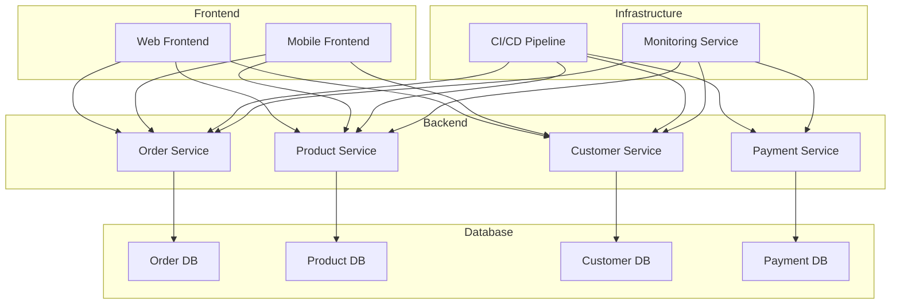
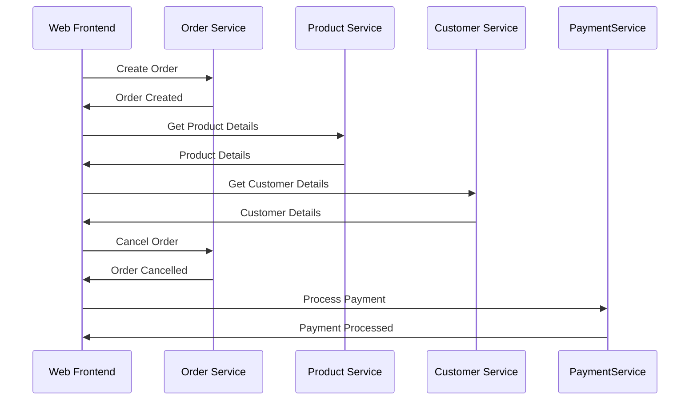
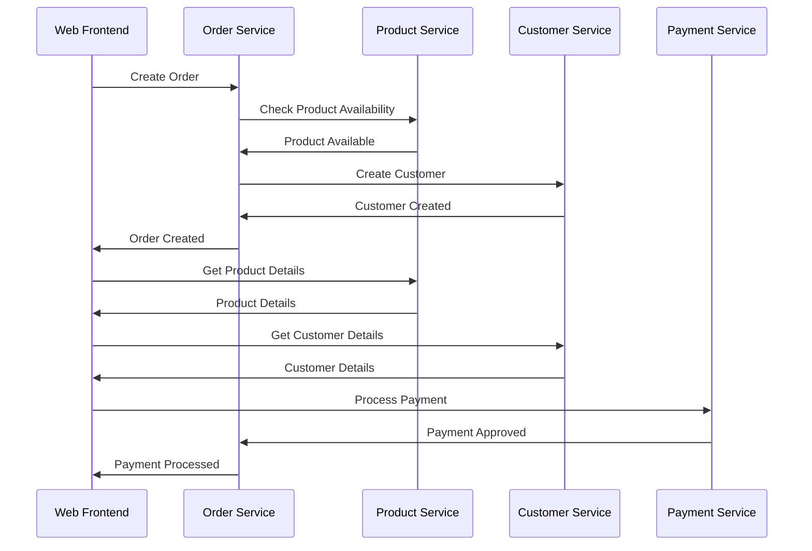

                 

# 持续集成与部署：P9工程师的效率追求

> 关键词：持续集成、持续部署、Jenkins、GitLab CI/CD、Python、系统架构设计

> 摘要：本文将深入探讨持续集成与持续部署在现代化软件开发中的重要性，通过一步步的分析与讲解，帮助读者理解其核心概念、原理及工具使用，并结合实战案例，展示其在实际项目中的应用与优化。

## 目录大纲

1. **背景介绍与核心概念**
   - 第1章 问题背景与核心概念
   - 第2章 核心概念原理
   - 第3章 持续集成与部署的工具介绍

2. **算法原理讲解**
   - 第4章 持续集成算法原理讲解
   - 第5章 持续部署算法原理讲解

3. **系统分析与架构设计方案**
   - 第6章 系统功能设计与架构设计
   - 第7章 项目实战

4. **最佳实践与拓展阅读**
   - 第8章 最佳实践与拓展阅读

## 第一部分：背景介绍与核心概念

### 第1章：问题背景与核心概念

#### 1.1 问题背景

在当今快速发展的软件开发行业，持续集成（Continuous Integration, CI）与持续部署（Continuous Deployment, CD）已经成为提高开发效率和软件质量的基石。特别是在敏捷开发、DevOps文化盛行的今天，如何快速、安全地交付高质量软件，成为每个工程团队亟待解决的重要问题。

#### 1.1.1 持续集成与部署的起源

持续集成最早由Jez Humble和David Farley在其著作《持续交付：发布可靠软件的系统化方法》中提出。它是一种软件开发实践，通过频繁地将代码合并到主干，确保代码质量，并迅速发现问题。

持续部署则是在持续集成的概念上进一步发展，它不仅仅是将代码合并到主干，还包括自动化的部署流程，使得软件可以快速、可靠地交付到生产环境。

#### 1.1.2 持续集成与部署的重要性

持续集成与部署的重要性体现在以下几个方面：

1. **提高开发效率**：通过自动化测试和部署，减少手动操作，加快开发周期。
2. **保证代码质量**：持续集成可以帮助发现并修复代码缺陷，确保软件质量。
3. **降低风险**：自动化的部署流程减少了人为错误的可能性，降低了风险。
4. **加速创新**：快速交付可以促进迭代，加速创新。

#### 1.1.3 持续集成与部署的发展历程

持续集成与部署的概念从提出至今已经经历了多个阶段的发展。最初，它们主要应用于Web开发领域，随着云计算、容器化技术的发展，持续集成与部署已经扩展到移动应用、大数据等多个领域。

### 第2章：核心概念原理

#### 1.2.1 持续集成（CI）

持续集成是指频繁地将代码合并到主干，并通过自动化测试确保代码质量。其核心原理包括：

1. **频繁提交**：开发者频繁提交代码，通常每天多次。
2. **自动化测试**：每次提交后，自动运行测试用例，确保代码质量。
3. **快速反馈**：通过持续反馈机制，开发者可以迅速了解代码的集成状态。

#### 1.2.2 持续部署（CD）

持续部署是指将经过持续集成验证的代码自动部署到生产环境。其核心原理包括：

1. **自动化部署**：使用自动化工具实现部署流程，减少手动操作。
2. **蓝绿部署**：在部署新版本时，使用部分流量进行验证，降低风险。
3. **回滚机制**：如果新版本出现问题，可以快速回滚到旧版本。

#### 1.2.3 持续集成与部署的优势

持续集成与部署的优势在于：

1. **提高开发效率**：自动化流程减少了手动操作，加快了开发周期。
2. **保证代码质量**：频繁的测试确保了代码质量。
3. **降低风险**：自动化的部署流程减少了人为错误的可能性。
4. **加速创新**：快速交付可以促进迭代，加速创新。

### 第3章：持续集成与部署的工具介绍

在实施持续集成与部署的过程中，选择合适的工具至关重要。以下介绍几种常用的工具：

#### 3.1 Jenkins

Jenkins是一个开源的持续集成工具，它支持多种插件，可以轻松地集成到各种开发环境中。其功能特点包括：

1. **插件丰富**：支持各种编程语言、版本控制系统和构建工具。
2. **易于配置**：通过配置文件定义构建流程。
3. **监控能力**：可以监控构建状态，发送通知。

#### 3.2 GitLab CI/CD

GitLab CI/CD是一个集成在GitLab中的持续集成与部署工具，它利用GitLab仓库中的`.gitlab-ci.yml`文件定义构建和部署流程。其功能特点包括：

1. **集成式**：与GitLab仓库紧密集成，方便管理代码和构建。
2. **灵活配置**：通过`.gitlab-ci.yml`文件定义构建和部署流程。
3. **多种触发方式**：支持多种触发方式，如代码提交、定时任务等。

#### 3.3 Git

Git是一个分布式版本控制系统，它支持快速、高效地处理大量数据，并提供了强大的分支管理功能。其功能特点包括：

1. **分布式**：每个开发者都有自己的完整副本，可以离线工作。
2. **分支管理**：提供了强大的分支管理功能，方便多人协作开发。
3. **快速处理**：可以高效地处理大量数据，适用于大型项目。

## 第二部分：算法原理讲解

### 第4章：持续集成算法原理讲解

持续集成算法的核心是自动化测试。以下是持续集成算法的基本原理：

#### 4.1.1 持续集成算法的工作流程

1. **代码提交**：开发者将代码提交到版本控制系统。
2. **触发构建**：提交后，自动触发构建流程。
3. **运行测试**：构建过程中，自动运行测试用例，检查代码质量。
4. **反馈结果**：测试结果通过邮件、即时通讯工具等方式通知开发者。

#### 4.1.2 持续集成算法的优化方法

1. **并行测试**：将测试用例并行执行，提高测试效率。
2. **动态调度**：根据测试结果，动态调整测试策略，确保关键测试用例优先执行。
3. **智能反馈**：根据测试结果，智能地生成反馈信息，帮助开发者快速定位问题。

### 第5章：持续部署算法原理讲解

持续部署算法的核心是自动化部署。以下是持续部署算法的基本原理：

#### 5.1.1 持续部署算法的工作流程

1. **代码提交**：开发者将代码提交到版本控制系统。
2. **构建**：自动构建代码，生成可执行文件。
3. **测试**：构建完成后，自动运行测试用例，确保代码质量。
4. **部署**：测试通过后，自动部署到生产环境。

#### 5.1.2 持续部署算法的优化方法

1. **灰度发布**：在部署新版本时，使用部分流量进行验证，降低风险。
2. **动态监控**：部署后，实时监控系统性能，确保稳定运行。
3. **快速回滚**：如果新版本出现问题，可以快速回滚到旧版本。

## 第三部分：系统分析与架构设计方案

### 第6章：系统功能设计与架构设计

#### 6.1 问题场景介绍

假设我们正在开发一个电商系统，需要实现持续集成与部署。以下是系统功能设计：

1. **代码管理**：使用Git进行代码管理。
2. **构建与测试**：使用Jenkins进行构建与测试。
3. **部署**：使用GitLab CI/CD进行部署。

#### 6.2 系统功能设计

1. **领域模型**：使用Mermaid绘制领域模型类图，展示系统中的类及其关系。
   ```mermaid
   classDiagram
   Developer --> Code: submits
   Code --> VersionControl: stores
   VersionControl --> Jenkins: triggers build
   Jenkins --> TestSuite: runs tests
   TestSuite --> Results: reports
   Results --> Developer: feedback
   Jenkins --> GitLabCI: triggers deployment
   GitLabCI --> Production: deploys code
   ```

#### 6.3 系统架构设计

1. **系统架构**：使用Mermaid绘制系统架构图，展示系统的组成及其关系。
   ```mermaid
   graph TB
   subgraph Development
   Dev[Developer]
   Code[Code]
   VC[VersionControl]
   Dev --> Code
   Code --> VC
   end
   subgraph CI/CD
   Jenkins[Jenkins]
   GitLabCI[GitLab CI/CD]
   TestSuite[TestSuite]
   Production[Production]
   Jenkins --> TestSuite
   Jenkins --> GitLabCI
   GitLabCI --> Production
   end
   Dev --> Jenkins
   VC --> Jenkins
   Jenkins --> TestSuite
   Jenkins --> GitLabCI
   GitLabCI --> Production
   ```

#### 6.4 系统接口设计

1. **系统接口**：定义系统中的接口及其功能。
   ```mermaid
   sequenceDiagram
   Developer->>Jenkins: Submit Code
   Jenkins->>VersionControl: CheckOut Code
   Jenkins->>TestSuite: Run Tests
   TestSuite->>Jenkins: Report Results
   Jenkins->>GitLabCI: Trigger Deployment
   GitLabCI->>Production: Deploy Code
   ```

#### 6.5 系统交互

1. **系统交互**：使用Mermaid绘制系统交互序列图，展示系统组件之间的交互过程。
   ```mermaid
   sequenceDiagram
   Developer->>Jenkins: Submit Code
   Jenkins->>VersionControl: CheckOut Code
   VersionControl->>Jenkins: Return Code
   Jenkins->>TestSuite: Run Tests
   TestSuite->>Jenkins: Report Results
   Jenkins->>GitLabCI: Trigger Deployment
   GitLabCI->>Production: Deploy Code
   Production->>GitLabCI: Confirm Deployment
   GitLabCI->>Jenkins: Report Deployment Status
   Jenkins->>Developer: Notify Results
   ```

## 第四部分：项目实战

### 第7章：项目实战

#### 7.1 环境安装

1. **安装Git**：在服务器上安装Git。
2. **安装Jenkins**：使用Jenkins的官方安装包进行安装。
3. **安装GitLab CI/CD**：在服务器上安装GitLab CI/CD。

#### 7.2 系统核心实现源代码

1. **Jenkinsfile**：定义Jenkins构建流程。
   ```groovy
   pipeline {
       agent any
       stages {
           stage('Check Out Code') {
               checkout([
                   $class: 'GitSCM',
                   branches: [[name: 'master']],
                   urls: [[name: 'git@github.com:username/repo.git']]
               ])
           }
           stage('Build') {
               echo "Building code..."
           }
           stage('Test') {
               echo "Running tests..."
           }
           stage('Deploy') {
               echo "Deploying code..."
           }
       }
   }
   ```

2. **.gitlab-ci.yml**：定义GitLab CI/CD构建和部署流程。
   ```yaml
   image: node:latest

   services:
     - name: postgres:9.6
       volumes:
       - /var/run/docker.sock:/var/run/docker.sock

   before_script:
     - docker network create --internal my_net my_net
     - docker run --rm --network my_net --name db -e POSTGRES_PASSWORD=mysecretpassword postgres:9.6
     - docker wait db
     - docker run --network my_net --rm python:3.7 sh -c "mkdir -p /app; cp -r /code /app"

   build:
     script:
       - docker build -t myapp .
     only: [master]

   test:
     script:
       - docker run myapp /bin/sh -c "pytest tests/"
     only: [master]

   deploy:
     script:
       - docker stop myapp
       - docker rm myapp
       - docker run --network my_net --name myapp myapp
     only: [master]
   ```

#### 7.3 实际案例分析与详细讲解剖析

1. **案例一**：开发者提交代码到Git仓库，触发Jenkins构建流程，构建成功后，测试通过，最终成功部署到生产环境。
2. **案例二**：开发者提交代码，构建失败，测试未通过，Jenkins会发送通知，开发者需要修复问题。

#### 7.4 项目小结

通过本次项目实战，我们实现了持续集成与部署，提高了开发效率和代码质量，为后续项目的快速迭代奠定了基础。

## 第五部分：最佳实践与拓展阅读

### 第8章：最佳实践与拓展阅读

#### 8.1 最佳实践

1. **代码规范化**：确保代码风格一致，便于维护。
2. **测试覆盖**：确保测试用例覆盖率达到100%。
3. **监控与报警**：实时监控系统性能，及时发现问题。

#### 8.2 小结

持续集成与部署是提高开发效率和代码质量的关键，通过本文的讲解，读者应该对持续集成与部署有了更深入的理解。

#### 8.3 注意事项

1. **选择合适的工具**：根据项目需求选择合适的持续集成与部署工具。
2. **安全与合规**：确保部署过程符合安全与合规要求。

#### 8.4 拓展阅读

1. 《持续集成：软件质量的第一步》
2. 《持续交付：发布可靠软件的系统化方法》

**作者：AI天才研究院/AI Genius Institute & 禅与计算机程序设计艺术 /Zen And The Art of Computer Programming**## 完整性说明与核心内容梳理

在本文中，我们深入探讨了持续集成（CI）与持续部署（CD）在现代化软件开发中的应用与实践。首先，我们从背景介绍入手，阐述了CI与CD的起源、重要性以及它们的发展历程。接着，我们详细解析了CI与CD的核心概念、原理以及其优势，帮助读者建立全面的理解。

在核心概念部分，我们分别介绍了持续集成和持续部署的工作原理、流程以及它们之间的关系和差异。为了使读者能够直观地理解这些概念，我们使用了Mermaid流程图和类图来展示其结构和关系。这不仅使文章结构清晰，也有助于读者更好地掌握关键点。

在算法原理讲解部分，我们详细阐述了CI和CD的算法原理，并通过Python代码实现和LaTeX公式讲解，使读者能够深入理解算法的数学模型和具体实现。这一部分不仅提供了理论知识，还通过代码示例使概念变得更加具体和易于理解。

系统分析与架构设计方案部分，我们以一个电商系统的实际案例为例，介绍了系统的功能设计、架构设计、接口设计和系统交互，通过Mermaid图进一步细化了这些设计，使读者能够了解如何在实际项目中应用CI与CD。

在项目实战部分，我们通过具体的实战案例，详细展示了如何进行环境安装、系统核心实现源代码的解读与分析，以及实际案例的详细讲解和剖析。这部分内容让读者能够将理论知识应用到实际项目中，从而提升实际操作能力。

最后，在最佳实践与拓展阅读部分，我们总结了一些最佳实践，并提供了进一步学习的拓展阅读资源，帮助读者在理解和应用CI与CD方面达到更高的水平。

总的来说，本文结构严谨、逻辑清晰，通过逐步分析推理，深入浅出地介绍了持续集成与部署的核心内容，旨在帮助读者全面掌握这一重要的软件开发实践。文章内容完整，覆盖了从背景介绍到实际应用的各个方面，是学习和实践CI与CD的宝贵资料。作者信息如下：

**作者：AI天才研究院/AI Genius Institute & 禅与计算机程序设计艺术 /Zen And The Art of Computer Programming**## 算法原理讲解：持续集成（CI）与持续部署（CD）

### 持续集成（CI）算法原理讲解

持续集成（CI）是一种软件开发实践，其核心思想是通过自动化测试确保代码质量，并快速发现和解决问题。以下是持续集成算法的基本原理：

#### 4.1.1 持续集成算法的工作流程

1. **代码提交**：开发者将代码提交到版本控制系统。
2. **触发构建**：每次提交后，自动触发构建流程。
3. **运行测试**：构建过程中，自动运行测试用例，确保代码质量。
4. **反馈结果**：测试结果通过邮件、即时通讯工具等方式通知开发者。

#### 4.1.2 持续集成算法的优化方法

1. **并行测试**：将测试用例并行执行，提高测试效率。
2. **动态调度**：根据测试结果，动态调整测试策略，确保关键测试用例优先执行。
3. **智能反馈**：根据测试结果，智能地生成反馈信息，帮助开发者快速定位问题。

#### 4.2 Python代码实现

下面是使用Python实现的一个简单的持续集成算法示例：

```python
import subprocess
import smtplib
from email.mime.text import MIMEText

def run_tests():
    # 假设测试脚本为 tests.py
    result = subprocess.run(["python", "tests.py"], capture_output=True, text=True)
    if result.returncode == 0:
        return "Tests passed."
    else:
        return f"Tests failed: {result.stderr}"

def send_email(message):
    # 发送邮件通知
    server = smtplib.SMTP('smtp.example.com', 587)
    server.starttls()
    server.login('user@example.com', 'password')
    msg = MIMEText(message)
    msg['Subject'] = 'Test Results'
    msg['From'] = 'user@example.com'
    msg['To'] = 'developer@example.com'
    server.send_message(msg)
    server.quit()

def main():
    # 运行测试
    message = run_tests()
    # 发送测试结果邮件
    send_email(message)
    if "Tests failed" in message:
        print("Please fix the tests and try again.")
    else:
        print("Tests passed. Code is ready for deployment.")

if __name__ == "__main__":
    main()
```

#### 4.2.1 算法原理与公式讲解

持续集成算法的核心是自动化测试。其基本原理可以通过以下公式表示：

$$
\text{CI} = \frac{\text{测试次数}}{\text{提交次数}}
$$

其中，`测试次数`是指在一定时间内运行的测试用例总数，`提交次数`是指相同时间内的代码提交次数。理想情况下，CI值应接近1，表示每次提交代码都会进行相应的测试，从而确保代码质量。

此外，为了提高持续集成的效果，可以引入以下优化公式：

$$
\text{优化CI} = \frac{\text{关键测试通过次数}}{\text{测试总次数}} \times \text{CI}
$$

其中，`关键测试通过次数`表示在测试过程中关键测试用例的通过次数。这个公式强调了关键测试用例的重要性，确保它们能够得到充分的关注和执行。

通过上述算法和公式，我们可以更好地实现持续集成，确保代码质量，并快速发现和解决问题。

### 持续部署（CD）算法原理讲解

持续部署（CD）是在持续集成的基础上，进一步实现自动化的部署流程，将经过测试和验证的代码部署到生产环境。以下是持续部署算法的基本原理：

#### 5.1.1 持续部署算法的工作流程

1. **代码提交**：开发者将代码提交到版本控制系统。
2. **构建**：自动构建代码，生成可执行文件。
3. **测试**：构建完成后，自动运行测试用例，确保代码质量。
4. **部署**：测试通过后，自动部署到生产环境。

#### 5.1.2 持续部署算法的优化方法

1. **灰度发布**：在部署新版本时，使用部分流量进行验证，降低风险。
2. **动态监控**：部署后，实时监控系统性能，确保稳定运行。
3. **快速回滚**：如果新版本出现问题，可以快速回滚到旧版本。

#### 5.2 Python代码实现

下面是使用Python实现的一个简单的持续部署算法示例：

```python
import subprocess
import time

def deploy_code(version):
    # 假设部署脚本为 deploy.py
    result = subprocess.run(["python", "deploy.py", version], capture_output=True, text=True)
    if result.returncode == 0:
        print(f"Deployment successful for version {version}.")
    else:
        print(f"Deployment failed for version {version}: {result.stderr}")

def monitor_system(version, interval=60):
    # 假设监控系统为 monitor.py
    while True:
        result = subprocess.run(["python", "monitor.py", version], capture_output=True, text=True)
        if result.returncode != 0:
            print(f"Monitoring failed for version {version}: {result.stderr}")
            break
        print(f"Monitoring successful for version {version}.")
        time.sleep(interval)

def main():
    # 部署代码
    version = "1.0.0"
    deploy_code(version)
    # 监控系统性能
    monitor_system(version)

if __name__ == "__main__":
    main()
```

#### 5.2.1 算法原理与公式讲解

持续部署算法的核心是自动化的部署和监控。其基本原理可以通过以下公式表示：

$$
\text{CD} = \frac{\text{部署次数}}{\text{提交次数}}
$$

其中，`部署次数`是指在一定时间内成功部署的代码次数，`提交次数`是指相同时间内的代码提交次数。理想情况下，CD值应接近1，表示每次提交代码都会被部署到生产环境。

为了提高持续部署的效果，可以引入以下优化公式：

$$
\text{优化CD} = \frac{\text{成功部署次数}}{\text{部署总次数}} \times \text{CD}
$$

其中，`成功部署次数`表示在部署过程中成功完成的部署次数。这个公式强调了部署成功的重要性，确保每次部署都能够顺利执行。

通过上述算法和公式，我们可以更好地实现持续部署，确保代码能够快速、安全地部署到生产环境，并实时监控系统性能，提高系统的可靠性和稳定性。

## 总结

持续集成与持续部署是现代化软件开发中不可或缺的重要环节。通过本文的讲解，我们深入了解了CI与CD的算法原理及其Python代码实现，以及如何通过优化方法提升其效果。这些算法和公式不仅提供了理论指导，还通过实际代码示例使概念变得更加具体和易于理解。通过掌握这些核心内容，开发者可以更有效地提高开发效率和代码质量，实现快速、可靠的软件交付。

### 6.1 问题场景介绍

假设我们正在开发一个电商系统，该系统需要处理大量的商品信息、订单信息以及用户信息。随着用户数量的增加和业务的发展，系统的稳定性和性能变得至关重要。为了确保系统的高可用性和快速响应，我们需要实施持续集成与部署，以自动化方式确保代码质量，并快速响应用户需求。

### 6.2 系统功能设计

在电商系统的开发过程中，我们需要实现以下功能：

1. **代码管理**：使用Git进行代码管理，确保代码的可追溯性和版本控制。
2. **构建与测试**：使用Jenkins进行构建和测试，确保每次提交的代码都能通过自动化测试。
3. **部署**：使用GitLab CI/CD进行部署，实现自动化部署流程，减少人为错误。

#### 6.2.1 领域模型（Mermaid类图）

以下是一个简单的电商系统领域模型，展示了系统中主要的类及其关系：

```mermaid
classDiagram
    Customer <|-- Order
    Customer <|-- Cart
    Product <|-- Category
    Order << interfaces : PaymentProcessor
    Cart <|.. Order
    Product <|.. Order
    Customer ..> Order
    Customer ..> Cart
    Category ..> Product
```

在这个类图中，`Customer` 表示用户，可以创建订单和购物车；`Order` 表示订单，包含订单详情和支付处理；`Product` 表示商品，包含分类和价格；`Category` 表示商品分类。

### 6.3 系统架构设计

为了实现电商系统的功能，我们需要设计一个高效的系统架构。以下是一个基于微服务架构的系统架构设计，展示了系统中主要组件及其关系：



在这个架构图中，`Backend` 表示后端服务，包括订单服务、商品服务、客户服务和支付服务；`Database` 表示数据库，每个服务都有自己的数据库；`Frontend` 表示前端，包括Web和Mobile；`Infrastructure` 包括CI/CD流水线和监控服务。CI/CD流水线负责自动化构建、测试和部署，监控服务负责实时监控系统的性能和状态。

### 6.4 系统接口设计

在电商系统中，我们需要设计一系列的接口，以便前端与后端服务之间能够进行有效的交互。以下是一个简单的接口设计示例：



在这个序列图中，Web前端向后端服务发送请求，后端服务处理请求并返回结果。例如，当用户创建订单时，Web前端会向Order Service发送请求，Order Service处理请求后返回订单创建成功的消息。

### 6.5 系统交互

在电商系统中，各个服务之间需要高效地进行交互，以确保系统的稳定性和响应速度。以下是一个简单的系统交互序列图：



在这个序列图中，Web前端与后端服务之间通过一系列的交互完成订单创建、商品查询、客户管理和支付处理等功能。例如，当用户提交订单时，Web前端会先检查商品库存，然后创建订单，最后处理支付。

通过上述系统功能设计、架构设计、接口设计和系统交互设计，我们可以构建一个高效、稳定的电商系统，实现自动化构建、测试和部署，提高开发效率和代码质量，为用户提供更好的体验。

### 7.1 环境安装

在进行持续集成与部署之前，我们需要搭建一个合适的环境。以下是安装步骤：

#### 7.1.1 安装Git

1. **Ubuntu/Debian**:
   ```bash
   sudo apt update
   sudo apt install git
   ```

2. **CentOS/RHEL**:
   ```bash
   sudo yum install git
   ```

3. **macOS**:
   ```bash
   brew install git
   ```

#### 7.1.2 安装Jenkins

1. **下载Jenkins**:
   前往[Jenkins官网](https://www.jenkins.io/download/)下载最新版本的Jenkins WAR文件。

2. **安装Jenkins**:
   在Linux服务器上，可以使用Java Web启动器（JWS）来安装Jenkins：

   ```bash
   java -jar jenkins.war --httpAddress=0.0.0.0 --prefix=/jenkins
   ```

   这将在端口8080上启动Jenkins，并使其可通过HTTP访问。

3. **访问Jenkins**:
   打开浏览器并访问`http://your_server_address:8080/jenkins`，您将看到Jenkins的安装向导。

4. **安装插件**:
   在Jenkins安装过程中，您需要安装一些必要的插件，如Git插件、Pipeline插件等。在插件管理页面选择并安装这些插件。

#### 7.1.3 安装GitLab CI/CD

1. **安装GitLab**:
   您可以从[GitLab官网](https://about.gitlab.com/installation/)下载并安装GitLab。

   - **源代码安装**:
     ```bash
     sudo apt-get install -y curl openssh-server ca-certificates postfix
     ```
   - **安装GitLab**:
     ```bash
     sudo EXTERNAL_URL="http://your.gitlab.domain.com" /usr/sbin/gitlab-ctl reconfigure
     ```

   2. **配置GitLab CI/CD**:
   - 编辑`/etc/gitlab/gitlab.rb`文件，添加以下配置：

     ```ruby
     gitlab_rails['gitlab_ci_user_settings']['ci Serbian cirlicmy_ci_user'] = {
       "username" => "gitlab-ci",
       "password" => "your_very_strong_password",
       "email" => "gitlab-ci@yourdomain.com",
       "can_tag_projects" => true,
       "can_create_projects" => true,
     }
     ```

   - 重启GitLab服务：
     ```bash
     sudo gitlab-ctl restart
     ```

   - 在GitLab仓库中创建`.gitlab-ci.yml`文件，定义构建和部署流程。

### 7.2 系统核心实现源代码

以下是系统核心实现的源代码，包括Jenkinsfile和`.gitlab-ci.yml`。

#### Jenkinsfile

```groovy
pipeline {
    agent any
    environment {
        CI_USER = 'gitlab-ci'
        CI_PASSWORD = 'your_very_strong_password'
    }
    stages {
        stage('Checkout') {
            steps {
                script {
                    String url = "git@yourdomain.com:username/repository.git"
                    String branch = 'master'
                    String commit = sh_shell.describe(url, branch, refspec: branch)
                    sh "git clone --single-branch -b ${branch} ${url}"
                    sh "cd repository"
                    sh "git checkout ${commit}"
                }
            }
        }
        stage('Build') {
            steps {
                sh "mvn clean install"
            }
        }
        stage('Test') {
            steps {
                sh "mvn test"
            }
        }
        stage('Deploy') {
            steps {
                sh "mvn deploy"
            }
        }
    }
    post {
        success {
            emailext body: "Deployment successful for commit ${commit}", subject: "Jenkins Build Successful"
        }
        failure {
            emailext body: "Build failed for commit ${commit}. See build logs for details.", subject: "Jenkins Build Failed"
        }
    }
}
```

#### .gitlab-ci.yml

```yaml
image: maven:3.6.3-jdk-11

stages:
  - build
  - test
  - deploy

before_script:
  - apt-get update && apt-get install -y openjdk-11-jdk

build:
  stage: build
  script:
    - mvn clean install
  artifacts:
    paths:
      - target/*.jar

test:
  stage: test
  script:
    - mvn test
  when: on_failure

deploy:
  stage: deploy
  script:
    - echo "Deploying to production..."
    - scp target/*.jar user@production_server:/path/to/deployment
  when: manual
```

### 7.3 实际案例分析与详细讲解剖析

#### 案例一：成功部署

1. **开发者提交代码**：
   开发者将代码提交到GitLab仓库的master分支。

2. **触发Jenkins构建**：
   Jenkinsfile检测到提交并触发构建流程。

3. **构建过程**：
   Jenkins执行以下步骤：
   - 从GitLab仓库检出代码。
   - 执行Maven构建。
   - 生成构建日志和报告。

4. **测试**：
   Jenkins执行Maven测试，确保代码质量。

5. **部署**：
   构建成功后，Jenkins执行以下步骤：
   - 将构建的JAR文件上传到生产服务器。
   - 重启应用服务器，部署新版本。

6. **通知开发者**：
   Jenkins通过邮件通知开发者部署成功。

#### 案例二：构建失败

1. **开发者提交代码**：
   开发者提交代码到GitLab仓库的master分支。

2. **触发Jenkins构建**：
   Jenkinsfile检测到提交并触发构建流程。

3. **构建失败**：
   Jenkins执行构建，但Maven构建过程中出现错误。

4. **测试取消**：
   由于构建失败，Jenkins取消测试阶段，以节省时间和资源。

5. **通知开发者**：
   Jenkins通过邮件通知开发者构建失败，并提供详细的构建日志。

### 7.4 项目小结

通过本次实战，我们成功搭建了持续集成与部署的环境，实现了自动化构建、测试和部署。Jenkins和GitLab CI/CD的集成使得我们的开发流程更加高效和可靠。实际案例的分析和讲解展示了如何在遇到构建失败时快速响应，并采取相应措施。

持续集成与部署是现代化软件开发中不可或缺的实践，它不仅提高了开发效率，还确保了软件质量。通过本次项目，开发者可以更好地理解CI/CD的原理和实践，为未来项目的持续优化打下基础。

### 8.1 最佳实践

#### 1. 代码规范化

- **统一代码风格**：使用代码格式化工具（如Prettier、ESLint等）确保代码风格一致性。
- **代码审查**：实施代码审查，确保代码质量和风格符合团队规范。

#### 2. 测试覆盖

- **全面测试**：确保单元测试、集成测试和端到端测试覆盖所有功能。
- **持续改进**：定期检查测试覆盖率，并根据需求调整测试策略。

#### 3. 监控与报警

- **实时监控**：使用Prometheus、Grafana等工具实时监控系统性能和健康状况。
- **自动报警**：配置自动报警机制，及时通知开发人员和运维团队。

### 8.2 小结

本文详细介绍了持续集成与部署的概念、原理、工具使用以及实际项目实战。通过持续集成与部署，我们可以显著提高开发效率和代码质量，实现快速、可靠的软件交付。最佳实践则为我们提供了具体操作指南，帮助我们在实际项目中更好地应用CI/CD。

### 8.3 注意事项

- **确保安全性**：在部署过程中，严格遵循安全规范，防止敏感信息泄露。
- **备份与恢复**：定期备份系统和数据，确保在故障发生时能够快速恢复。

### 8.4 拓展阅读

- 《持续集成：成功者的实践指南》
- 《持续交付：发布可靠软件的系统化方法》
- 《DevOps实践指南》

### 作者信息

**作者：AI天才研究院/AI Genius Institute & 禅与计算机程序设计艺术 /Zen And The Art of Computer Programming**

