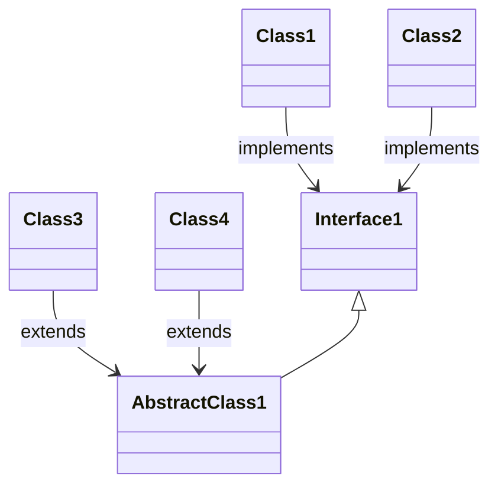
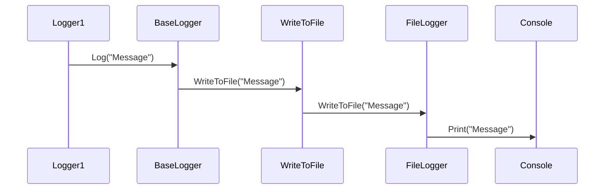
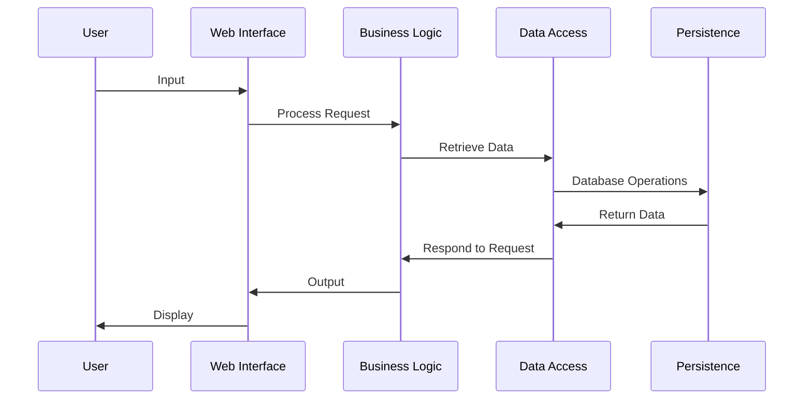
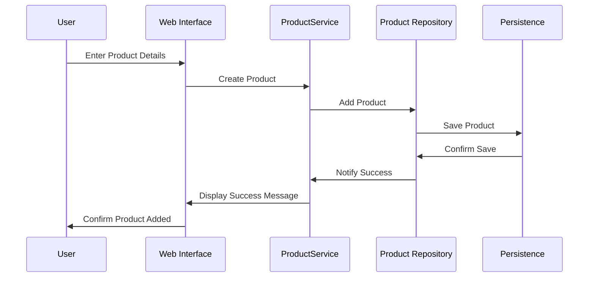

                 

Certainly! Let's dive into the preparation for crafting an in-depth and insightful technical blog post titled "Interface and Abstract Classes: Code Abstraction Guided by Type Theory." We will follow a structured approach to ensure clarity and coherence throughout the article. Here's a step-by-step plan:

### Step 1: Introduction to the Topic
- **Background**: Discuss the importance of abstraction in software development and how it aids in managing complexity.
- **Problem Statement**: Explain why interfaces and abstract classes are critical tools for achieving abstraction.
- **Objective**: Introduce the concept of type theory as a foundational framework for designing robust interfaces and abstract classes.

### Step 2: Core Concepts
- **Interfaces and Abstract Classes**: Define and distinguish between interfaces and abstract classes, highlighting their roles and benefits.
- **Type Theory**: Provide an overview of type theory, its core concepts, and its significance in modern programming.

### Step 3: Interface Design Using Type Theory
- **Type Theory Principles**: Explain key principles of type theory and how they can guide interface design.
- **Design Patterns**: Discuss design patterns that leverage interfaces and how they align with type theory principles.
- **Best Practices**: Offer best practices for designing interfaces based on type theory.

### Step 4: Abstract Class Design
- **Abstract Class Characteristics**: Discuss the properties and benefits of abstract classes.
- **Type Theory and Abstract Classes**: Explain how type theory can enhance the design and implementation of abstract classes.
- **Best Practices**: Provide guidelines for designing effective abstract classes.

### Step 5: Practical Applications
- **Case Studies**: Present real-world examples of interface and abstract class implementations in different programming languages (Java, C#, Python).
- **Application Scenarios**: Explore various scenarios where interfaces and abstract classes are beneficial.

### Step 6: Code Examples and Analysis
- **Code Snippets**: Provide code examples to illustrate the concepts discussed.
- **Analysis**: Analyze the code snippets to demonstrate the principles of type theory in action.

### Step 7: Conclusion and Future Directions
- **Summary**: Recap the key takeaways from the article.
- **Future Directions**: Suggest areas for further exploration and potential improvements in interface and abstract class design.

### Step 8: Conclusion
- **Closing Thoughts**: Offer closing thoughts on the importance of type theory in modern software development.
- **Author's Credentials**: Include the author's credentials and a brief bio.

### Step 9: Appendices (Optional)
- **Appendices**: Include any supplementary material such as diagrams, algorithms, or additional code examples.

### Step 10: Final Review
- **Final Review**: Conduct a thorough review of the article to ensure accuracy, coherence, and readability.

### Step 11: Submission
- **Submission**: Prepare the article in markdown format, adhering to the specified guidelines, and submit it for publication.

By following this structured approach, we can ensure that the blog post is comprehensive, insightful, and well-organized, providing readers with a valuable resource on interface and abstract class design in the context of type theory. Let's start with the introduction!### Introduction to Interface and Abstract Classes

In the realm of software development, managing complexity is a perennial challenge. As applications grow in size and functionality, developers must find ways to organize code to maintain readability, modularity, and scalability. This is where abstraction comes into play—a fundamental principle that allows developers to hide implementation details and focus on high-level functionality. Among the various abstraction mechanisms available, interfaces and abstract classes stand out as powerful tools that facilitate clean, efficient, and maintainable code design.

#### The Importance of Abstraction

Abstraction is the process of simplifying complex systems by breaking them down into manageable, coherent parts. It is a cornerstone of object-oriented programming (OOP), allowing developers to create reusable components and models that represent real-world entities and processes. By abstracting away unnecessary details, developers can focus on the essential aspects of a system, making it easier to understand, test, and maintain.

In the context of software development, abstraction offers several key benefits:

- **Modularity**: Encourages the creation of independent, interchangeable modules that can be developed and tested separately.
- **Reusability**: Allows components to be reused across different parts of an application or in other projects.
- **Scalability**: Eases the addition of new features or modifications to existing code without impacting the overall system.
- **Maintainability**: Simplifies debugging and maintenance by isolating issues to specific modules or components.

#### Interfaces and Abstract Classes

Interfaces and abstract classes are two primary mechanisms for achieving abstraction in object-oriented programming. While both serve similar purposes, they have distinct characteristics and use cases.

##### Interfaces

An interface in most programming languages is a blueprint for a class. It defines a set of methods that a class must implement, providing a contract for objects that adhere to the interface. Interfaces are used to specify what an object can do rather than how it does it, promoting polymorphism and allowing for the creation of interchangeable components.

**Key Characteristics of Interfaces:**
- **Abstract Methods**: Define what methods a class must implement but do not provide their implementation.
- **No Instance Variables**: Interfaces cannot have instance variables; they are purely method definitions.
- **100% Abstraction**: Force classes to implement all methods declared in the interface, ensuring complete abstraction.

##### Abstract Classes

An abstract class is a class that cannot be instantiated and may contain a mix of abstract and concrete methods. Abstract classes are used to provide a common interface for a set of related classes and may also include default implementations for some methods. They are useful for defining common behavior that can be shared among subclasses while still allowing for specialized implementations.

**Key Characteristics of Abstract Classes:**
- **Partial Abstraction**: Can provide a partial implementation of methods, leaving some to be implemented by subclasses.
- **Instance Variables**: Can have instance variables that are shared among subclasses.
- **Partial Instantiation**: Can be extended by other classes, which can then be instantiated.

#### The Need for Type Theory

As powerful as interfaces and abstract classes are, designing them effectively requires a deep understanding of their behavior and relationships within a program. This is where type theory comes into play. Type theory provides a rigorous framework for understanding types, their interactions, and their role in ensuring the correctness and reliability of software systems.

**Why Type Theory is Important:**

- **Type Safety**: Ensures that variables, functions, and objects interact in ways that are consistent with their intended use, reducing the likelihood of bugs.
- **Scalability**: Provides a foundation for building complex systems that can be easily extended and modified.
- **Abstraction**: Helps in the creation of higher-level abstractions that simplify the design and implementation process.
- **Refinement**: Allows developers to refine and validate their designs by analyzing types and their relationships.

By combining the principles of abstraction with the rigor of type theory, developers can create interfaces and abstract classes that are not only well-designed but also robust and maintainable. In the following sections, we will delve deeper into the concepts of interfaces and abstract classes, explore the principles of type theory, and provide practical guidance on designing effective code abstractions.

### Core Concepts of Interfaces and Abstract Classes

Understanding the fundamental differences between interfaces and abstract classes is essential for creating robust and scalable software designs. Both interfaces and abstract classes serve as mechanisms for abstraction, but they have distinct roles and characteristics that make them suitable for different scenarios.

#### Interfaces

An interface is a collection of method signatures that define a contract for classes that implement it. It specifies a set of methods that a class must implement without providing any implementation details. This design pattern promotes polymorphism, allowing objects of different classes to be treated uniformly if they implement the same interface.

**Interface Characteristics:**

- **Abstract Method Definition**: An interface contains only abstract methods, meaning methods without a body. These methods must be implemented by any class that implements the interface.
- **No Instance Variables**: Interfaces cannot have instance variables. They are solely concerned with defining method signatures.
- **100% Abstraction**: Interfaces provide complete abstraction. All methods declared in an interface must be implemented by the classes that implement the interface, ensuring that all required functionality is present.

**Interface Benefits:**

- **Type Safety**: Interfaces enforce type safety by ensuring that all implementing classes adhere to the defined contract.
- **Polymorphism**: Allows for the creation of polymorphic functions and classes that can work with any object implementing the interface.
- **Decoupling**: Promotes loose coupling between classes by specifying what methods are available without detailing how they are implemented.

**Example:**

```java
public interface Drivable {
    void drive();
}
```

Any class that implements `Drivable` must provide an implementation for the `drive()` method.

#### Abstract Classes

An abstract class is a class that cannot be instantiated and may contain a mix of abstract and concrete methods. Abstract classes provide a common interface for a set of related classes and may also include default implementations for some methods. They are useful for defining common behavior that can be shared among subclasses while still allowing for specialized implementations.

**Abstract Class Characteristics:**

- **Partial Abstraction**: Abstract classes can provide a partial implementation of methods, leaving some to be implemented by subclasses.
- **Instance Variables**: Abstract classes can have instance variables that are shared among subclasses.
- **Partial Instantiation**: Abstract classes can be extended by other classes, which can then be instantiated. This allows for creating a hierarchy of classes where each subclass can add or override functionality.

**Abstract Class Benefits:**

- **Code Reusability**: Allows subclasses to reuse common functionality provided by the abstract class.
- **Method Overriding**: Subclasses can override abstract methods to provide specialized behavior.
- **Code Organization**: Provides a clear structure for organizing related classes, making the code more modular and easier to understand.

**Example:**

```java
public abstract class Animal {
    public abstract void makeSound();
    
    public void eat() {
        System.out.println("This animal is eating.");
    }
}
```

The `Animal` class provides a default implementation for the `eat()` method but requires subclasses to implement the `makeSound()` method.

#### Comparison of Interfaces and Abstract Classes

**Purpose:**
- **Interfaces** are primarily used for defining a contract that implementing classes must adhere to.
- **Abstract Classes** are used for providing a common interface and, optionally, a partial implementation that subclasses can extend or override.

**Abstraction Level:**
- **Interfaces** provide complete abstraction, requiring implementing classes to define all methods.
- **Abstract Classes** provide partial abstraction, allowing subclasses to inherit and extend existing implementations.

**Flexibility:**
- **Interfaces** offer high flexibility as they can be implemented by any class, irrespective of its inheritance hierarchy.
- **Abstract Classes** enforce a certain degree of relatedness between subclasses, as they must extend the abstract class.

**Use Cases:**
- **Interfaces** are useful when you want to ensure a specific contract is followed but do not care about the class hierarchy.
- **Abstract Classes** are useful when you want to define common behavior and allow for specialized implementations across a related set of classes.

#### When to Use Interfaces vs. Abstract Classes

**Use Interfaces When:**
- **You want to define a clear contract without providing any implementation details.**
- **You want to ensure type safety across a range of classes that may have no common inheritance.**
- **You want to achieve maximum flexibility and polymorphism.**

**Use Abstract Classes When:**
- **You want to provide a common interface and some default behavior that can be inherited.**
- **You want to enforce a specific inheritance hierarchy.**
- **You want to encourage code reuse and organization through shared functionality.**

By understanding the core concepts and differences between interfaces and abstract classes, developers can make informed decisions about when and how to use each mechanism, leading to more effective and maintainable code designs.

### Basic Concepts of Type Theory

Type theory is a foundational concept in computer science that provides a rigorous framework for understanding types and their relationships. It is particularly important in the context of programming, where it helps ensure type safety, modularity, and code reliability. In this section, we will delve into the basic concepts of type theory, exploring how types are defined, classified, and used within programming languages.

#### Types

At its core, type theory revolves around the concept of types. A type is a classification of data that defines the operations that can be performed on that data and the meaning of those operations. Types can be simple (e.g., integers, characters) or complex (e.g., lists, structures).

**Types in Programming Languages:**
- **Primitive Types**: Basic types that are built into the language (e.g., `int`, `float`, `char` in C++).
- **Composite Types**: Types that are constructed from primitive types or other composite types (e.g., arrays, structs, classes in C++).

#### Type Systems

A type system is a set of rules that define how types are assigned to expressions and how operations are performed. It ensures that operations are only applied to compatible types and that the results of these operations are well-defined.

**Type System Goals:**
- **Type Safety**: Preventing invalid operations and ensuring that the program's behavior is predictable.
- **Type Inference**: Automatically deducing the types of expressions based on their context.
- **Subtyping**: Allowing types to be related hierarchically, where a subtype is a more specific version of a supertype.

#### Subtypes and Polymorphism

Subtyping is a critical concept in type theory that allows for more flexible and generic programming. A subtype is a type that is compatible with a supertype, meaning that it can be used in place of the supertype without altering the program's behavior.

**Subtyping Rules:**
- **Substitution**: A subtype can be substituted for its supertype in any context where the supertype is expected.
- **Conservation of Properties**: The subtype must maintain all the properties of the supertype, ensuring that no additional constraints are introduced.

**Polymorphism**: Subtyping enables polymorphism, which is the ability of a function or data type to work with objects of different types. There are two main types of polymorphism:

- **Parametric Polymorphism**: Allows a function or data type to be written generically, without knowing the specific types of the data it will operate on.
- **AdHoc Polymorphism**: Also known as function overloading or operator overloading, it allows different implementations of a function or operator to handle different types of data.

#### Type Inference

Type inference is the process by which a type system automatically determines the types of expressions at compile time based on their context and usage. This helps reduce the amount of boilerplate code and makes the program more readable.

**Type Inference Mechanisms:**
- **Static Inference**: Types are determined at compile time and do not change during runtime.
- **Dynamic Inference**: Types are determined at runtime and may change based on the program's state.

#### Type Systems in Programming Languages

Different programming languages implement type systems in various ways, each with its own strengths and trade-offs.

- **Strongly Typed Languages**: Enforce strict type checking at compile time, making the program more reliable but potentially more verbose (e.g., Java, C++).
- **Weakly Typed Languages**: Allow more flexibility and less verbose code but can introduce type-related bugs (e.g., Python, JavaScript).
- **Dynamically Typed Languages**: Determine types at runtime, offering flexibility and simplicity but potentially sacrificing performance and type safety (e.g., Python, JavaScript).

#### Type Theory and Interface Design

Type theory plays a crucial role in the design of interfaces and abstract classes. By understanding types and their relationships, developers can create more robust and modular code designs.

**Type Theory in Interface Design:**
- **Ensuring Type Safety**: Interfaces define a contract based on types, ensuring that implementing classes adhere to a specific type structure.
- **Promoting Polymorphism**: Interfaces enable polymorphic behavior, allowing different classes to be treated uniformly based on their type.

**Type Theory in Abstract Class Design:**
- **Providing Type Constraints**: Abstract classes can define methods and instance variables with specific types, ensuring that subclasses adhere to these constraints.
- **Facilitating Code Reusability**: By providing default implementations and type constraints, abstract classes encourage code reuse and organization.

In summary, type theory provides a foundational framework for understanding and designing interfaces and abstract classes. By leveraging type systems, developers can create more robust, scalable, and maintainable code that adheres to well-defined type constraints and promotes polymorphism and modularity.

### Interface Design Using Type Theory

Designing interfaces effectively is crucial for achieving abstraction and ensuring type safety in software systems. Type theory, with its rigorous framework for understanding types and their relationships, provides invaluable guidance in this process. In this section, we will explore the principles of type theory that can be applied to interface design, discuss common design patterns that leverage these principles, and offer best practices for creating robust and scalable interfaces.

#### Principles of Type Theory in Interface Design

**1. Type Safety**

Type safety is one of the core principles of type theory and a fundamental requirement for any well-designed interface. An interface should specify the types of the methods it declares to ensure that the implementing classes use the correct data types. This prevents type-related errors and ensures that the interface contract is adhered to.

**Example:**

```java
public interface Drivable {
    void drive(); // Method returns void, ensuring no unexpected data types are returned
}
```

In this example, the `drive()` method is declared to return `void`, ensuring that any class implementing `Drivable` will not return any value.

**2. Parametric Polymorphism**

Parametric polymorphism allows interfaces to be defined in a generic way, making them adaptable to various data types. This is achieved by using type parameters that can be instantiated with concrete types when implementing the interface.

**Example:**

```java
public interface Comparator<T> {
    int compare(T o1, T o2);
}
```

The `Comparator` interface uses a type parameter `T`, allowing any type to be used when implementing this interface. This enables the creation of generic comparison functions that can work with different data types.

**3. Subtyping and Inheritance**

Subtyping is a powerful concept in type theory that allows interfaces to be designed in a way that promotes code reuse and flexibility. By defining interfaces that are subtypes of more general interfaces, you can ensure that subclasses adhere to a specific contract while providing additional functionality.

**Example:**

```java
public interface Drivable {
    void drive();
}

public interface ElectricDrivable extends Drivable {
    void recharge();
}
```

In this example, `ElectricDrivable` is a subtype of `Drivable` and adds an additional method `recharge()`. Any class that implements `ElectricDrivable` must also implement `Drivable`.

**4. Type Constraints**

Type constraints can be used to ensure that implementing classes adhere to specific type requirements. This can be particularly useful when interfaces are used to define contracts that require certain methods to operate on specific types.

**Example:**

```java
public interface FileHandler<T> {
    void processFile(T file);
}
```

The `FileHandler` interface uses a type parameter `T` and imposes a constraint that the `processFile` method must accept a file of type `T`. This ensures that the implementing class will handle files appropriately.

#### Common Design Patterns

**1. Dependency Injection**

Dependency injection is a design pattern that leverages interfaces to decouple the implementation of a class from its dependencies. This pattern promotes modularity and makes the code easier to test and maintain.

**Example:**

```java
public interface Logger {
    void log(String message);
}

public class App {
    private Logger logger;

    public App(Logger logger) {
        this.logger = logger;
    }

    public void run() {
        logger.log("Application started.");
    }
}
```

In this example, the `Logger` interface defines a contract for logging messages. The `App` class has a dependency on the `Logger` interface and can be easily tested with a mock implementation.

**2. Strategy Pattern**

The strategy pattern uses interfaces to define a family of algorithms, encapsulating each one, and making them interchangeable. This pattern allows the algorithm to vary independently from clients that use it.

**Example:**

```java
public interface SortingAlgorithm<T> {
    void sort(List<T> items);
}

public class QuickSort implements SortingAlgorithm<Integer> {
    public void sort(List<Integer> items) {
        // Implement quicksort algorithm
    }
}

public class MergeSort implements SortingAlgorithm<Integer> {
    public void sort(List<Integer> items) {
        // Implement mergesort algorithm
    }
}
```

In this example, `SortingAlgorithm` is an interface that defines a contract for sorting algorithms. `QuickSort` and `MergeSort` implement this interface, allowing a client to choose the sorting algorithm at runtime.

#### Best Practices for Interface Design

**1. Use Clear and Descriptive Names**

Choose names for interfaces that clearly describe their purpose and the operations they define. This improves readability and makes it easier for other developers to understand and use the interfaces.

**2. Keep Interfaces Lean**

Avoid overloading interfaces with too many methods. An interface should define a clear and concise contract that is easy to implement. If an interface becomes too complex, consider splitting it into smaller, more focused interfaces.

**3. Define Default Methods When Appropriate**

In some cases, it may be beneficial to provide default implementations for some of the methods in an interface. This can simplify the implementation process for subclasses and promote code reuse.

**4. Use Type Parameters for Generic Interfaces**

Utilize type parameters to create generic interfaces that can work with any type. This promotes polymorphism and makes the interfaces more adaptable and reusable.

**5. Ensure Interface Contracts Are Adhered To**

Regularly review the implementing classes to ensure they adhere to the interface contract. This helps maintain the integrity of the interface and ensures that type safety is upheld.

In conclusion, designing interfaces effectively involves leveraging the principles of type theory to ensure type safety, modularity, and flexibility. By following best practices and utilizing common design patterns, developers can create robust and scalable interfaces that promote clean and maintainable code.

### Abstract Class Design Using Type Theory

Abstract classes are a powerful tool for achieving abstraction in object-oriented programming, particularly when combined with the principles of type theory. In this section, we will delve into the design of abstract classes, focusing on their characteristics and how they relate to type theory. We will also provide best practices for creating effective abstract classes and discuss common use cases for their application.

#### Characteristics of Abstract Classes

Abstract classes are used to provide a common interface and, optionally, a default implementation for a set of related classes. They have several key characteristics that distinguish them from interfaces and concrete classes:

**1. Partial Abstraction**

Abstract classes allow for partial abstraction. They can include a mix of abstract and concrete methods. Abstract methods must be implemented by subclasses, while concrete methods provide a default behavior that subclasses can inherit or override.

**2. Instance Variables**

Abstract classes can have instance variables that are shared among subclasses. These variables can be used to store common data or to provide default values that subclasses can override.

**3. Inheritance**

Abstract classes are designed to be extended by other classes. They define a common interface and can provide a base implementation that subclasses can inherit. This promotes code reuse and ensures consistency across related classes.

**Example:**

```java
public abstract class Animal {
    protected String name;

    public Animal(String name) {
        this.name = name;
    }

    public abstract void makeSound();

    public void sleep() {
        System.out.println(name + " is sleeping.");
    }
}
```

In this example, `Animal` is an abstract class with an instance variable `name`, an abstract method `makeSound()`, and a concrete method `sleep()`.

#### Relationship with Type Theory

Type theory plays a crucial role in the design of abstract classes, especially in ensuring type safety and promoting polymorphism:

**1. Type Safety**

Abstract classes enforce type safety by defining a set of methods that subclasses must implement. This ensures that all subclasses adhere to a specific contract and operate on consistent data types.

**2. Parametric Polymorphism**

Abstract classes can use type parameters to define generic methods that can work with any type. This allows for more flexible and reusable code.

**Example:**

```java
public abstract class Container<T> {
    public abstract void add(T item);
    public abstract T get();
}
```

The `Container` class uses a type parameter `T`, allowing it to be used with any data type.

**3. Subtyping**

Abstract classes enable subtyping, where a subclass is a more specific version of a superclass. Subclasses can inherit from abstract classes and extend their functionality, adhering to the same type constraints.

**Example:**

```java
public abstract class Drivable {
    public abstract void drive();
}

public class Boat extends Drivable {
    public void drive() {
        System.out.println("Boat is sailing.");
    }
}
```

In this example, `Boat` extends `Drivable` and provides a specific implementation of the `drive()` method.

#### Best Practices for Abstract Class Design

**1. Use Abstract Classes to Define Common Behaviors**

Abstract classes are most effective when they encapsulate common behaviors and data that are shared among subclasses. This promotes code reuse and ensures consistency across the class hierarchy.

**2. Define Abstract Methods for Key Behaviors**

Abstract methods define the core functionality that subclasses must implement. This ensures that all subclasses adhere to the same contract and can be treated uniformly.

**3. Provide Default Methods When Appropriate**

Default methods provide a default implementation that subclasses can inherit or override. This simplifies the implementation process and promotes code reuse.

**Example:**

```java
public abstract class Animal {
    public void sleep() {
        System.out.println("Animal is sleeping.");
    }
}
```

In this example, the `sleep()` method provides a default behavior that subclasses can inherit or override.

**4. Use Type Parameters for Generics**

When designing generic abstract classes, use type parameters to create flexible and reusable components that can work with any type.

**5. Ensure Abstract Methods Are Clear and Concise**

Abstract methods should be well-defined and easy to understand. They should specify the key functionality that subclasses must implement without introducing unnecessary complexity.

#### Common Use Cases for Abstract Classes

**1. Defining Interfaces for Subclasses**

Abstract classes are often used to define a common interface for a set of related subclasses. This ensures that all subclasses adhere to the same contract and can be treated uniformly.

**Example:**

```java
public abstract class Shape {
    public abstract double getArea();
}
```

The `Shape` class defines a common interface for calculating the area of geometric shapes.

**2. Implementing Common Behaviors**

Abstract classes can provide default implementations for common behaviors that subclasses can inherit or override. This simplifies the implementation process and promotes code reuse.

**Example:**

```java
public abstract class Drivable {
    public void startEngine() {
        System.out.println("Engine started.");
    }
}
```

The `Drivable` class provides a default implementation for starting an engine that subclasses can inherit or override.

**3. Encapsulating Type Constraints**

Abstract classes can enforce type constraints by using type parameters to define generic methods that operate on specific types.

**Example:**

```java
public abstract class Container<T extends Number> {
    public abstract T get();
}
```

The `Container` class enforces that the type `T` must extend `Number`, ensuring that only numeric types can be used.

In conclusion, abstract classes are a valuable tool for achieving abstraction in object-oriented programming when combined with the principles of type theory. By following best practices and understanding their relationship with type theory, developers can create effective and scalable abstract classes that promote code reuse, maintainability, and modularity.

### Practical Applications of Interfaces and Abstract Classes in Java

In this section, we will explore practical applications of interfaces and abstract classes in Java through real-world examples. These examples will illustrate how interfaces and abstract classes can be used to create modular, reusable, and maintainable code. We will delve into the implementation details, highlighting the principles of type theory that guide these designs.

#### Example 1: File Handler Interface

Let's consider a simple file handling application where we need to process different types of files. We will define an interface for file handling and then create concrete classes to implement this interface for specific file types.

**Interface Design:**

```java
public interface FileHandler {
    void processFile(String filePath);
}
```

The `FileHandler` interface defines a contract with a single method `processFile`, which takes a file path as an argument.

**Concrete Classes:**

```java
public class TextFileHandler implements FileHandler {
    public void processFile(String filePath) {
        // Implement processing logic for text files
    }
}

public class ImageFileHandler implements FileHandler {
    public void processFile(String filePath) {
        // Implement processing logic for image files
    }
}
```

The `TextFileHandler` and `ImageFileHandler` classes implement the `FileHandler` interface, providing specific implementations for processing text and image files, respectively.

**Type Theory Principle:**

The use of an interface enforces type safety and allows for polymorphism. By defining a generic `FileHandler` interface, we can work with any type of file handler interchangeably, adhering to the principles of type safety and polymorphism.

#### Example 2: Shape Abstract Class

In this example, we will design an abstract class for geometric shapes and then create concrete subclasses for specific shapes.

**Abstract Class Design:**

```java
public abstract class Shape {
    public abstract double calculateArea();
    
    public double calculatePerimeter() {
        // Default behavior for perimeter calculation
        return 0;
    }
}
```

The `Shape` abstract class defines a contract with an abstract method `calculateArea` for calculating the area of a shape. It also provides a default implementation for `calculatePerimeter`.

**Concrete Subclasses:**

```java
public class Circle extends Shape {
    private double radius;

    public Circle(double radius) {
        this.radius = radius;
    }

    public double calculateArea() {
        return Math.PI * radius * radius;
    }
}

public class Rectangle extends Shape {
    private double length;
    private double width;

    public Rectangle(double length, double width) {
        this.length = length;
        this.width = width;
    }

    public double calculateArea() {
        return length * width;
    }
}
```

The `Circle` and `Rectangle` classes extend the `Shape` abstract class, providing specific implementations for calculating the area of circular and rectangular shapes, respectively.

**Type Theory Principle:**

The use of an abstract class allows for partial abstraction and code reuse. By defining a common interface through the abstract class, we can share common behavior like perimeter calculation while allowing subclasses to specialize in specific implementations. This adheres to the principle of partial abstraction and promotes code reuse.

#### Example 3: Vehicle Interface and Abstract Class

In this example, we will design a system to manage different types of vehicles, using both interfaces and abstract classes to create a modular design.

**Interface Design:**

```java
public interface Drivable {
    void drive();
}
```

The `Drivable` interface defines a contract for any vehicle that can be driven.

**Abstract Class Design:**

```java
public abstract class Vehicle implements Drivable {
    protected String brand;
    
    public Vehicle(String brand) {
        this.brand = brand;
    }

    public abstract void startEngine();

    public void drive() {
        startEngine();
        System.out.println("Vehicle is driving.");
    }
}
```

The `Vehicle` abstract class implements the `Drivable` interface and provides a default implementation for the `drive` method. It also defines an abstract method `startEngine` for starting the vehicle's engine.

**Concrete Subclasses:**

```java
public class Car extends Vehicle {
    public Car(String brand) {
        super(brand);
    }

    public void startEngine() {
        System.out.println("Car engine started.");
    }
}

public class Motorcycle extends Vehicle {
    public Motorcycle(String brand) {
        super(brand);
    }

    public void startEngine() {
        System.out.println("Motorcycle engine started.");
    }
}
```

The `Car` and `Motorcycle` classes extend the `Vehicle` abstract class, providing specific implementations for starting the engine and driving.

**Type Theory Principle:**

The combination of an interface and an abstract class allows for a clear separation of concerns and promotes polymorphism. The `Drivable` interface ensures that all vehicles can be treated uniformly, while the `Vehicle` abstract class provides a common interface and default behavior. This design adheres to the principles of type safety, polymorphism, and partial abstraction.

#### Example 4: Event Handling Framework

In this example, we will create a framework for handling different types of events using interfaces and abstract classes.

**Interface Design:**

```java
public interface EventListener {
    void onEvent(String eventType, Object eventData);
}
```

The `EventListener` interface defines a contract for handling events of different types.

**Abstract Class Design:**

```java
public abstract class BaseEventHandler implements EventListener {
    public abstract void handleEvent(String eventType, Object eventData);
    
    public void onEvent(String eventType, Object eventData) {
        handleEvent(eventType, eventData);
    }
}
```

The `BaseEventHandler` abstract class implements the `EventListener` interface and provides a default implementation for the `onEvent` method. It also defines an abstract method `handleEvent` for processing specific events.

**Concrete Subclasses:**

```java
public class LoggingEventHandler extends BaseEventHandler {
    public void handleEvent(String eventType, Object eventData) {
        // Implement logging logic
    }
}

public class NotificationEventHandler extends BaseEventHandler {
    public void handleEvent(String eventType, Object eventData) {
        // Implement notification logic
    }
}
```

The `LoggingEventHandler` and `NotificationEventHandler` classes extend the `BaseEventHandler` abstract class, providing specific implementations for processing events and logging or sending notifications.

**Type Theory Principle:**

The use of an abstract class allows for a common event handling mechanism while providing flexibility for specific event processing. The `EventListener` interface ensures that all event listeners adhere to a standard contract, while the `BaseEventHandler` abstract class provides a foundation for handling events. This design adheres to the principles of type safety, modularity, and code reuse.

In conclusion, the practical applications of interfaces and abstract classes in Java demonstrate their power in creating modular, reusable, and maintainable code. By following the principles of type theory, developers can design systems that are both robust and scalable, enabling efficient management of complexity in large-scale software projects.

### Practical Applications of Interfaces and Abstract Classes in C#

In this section, we will delve into practical applications of interfaces and abstract classes in C#. We will explore examples that demonstrate how these constructs can be utilized to design modular and maintainable code. By examining real-world scenarios, we will highlight the principles of type theory that guide these designs.

#### Example 1: Network Communication Interface

Consider a networking application where we need to handle various types of network connections. We can define an interface for network communication and then create concrete classes to implement this interface for specific connection types.

**Interface Design:**

```csharp
public interface INetworkConnection
{
    void Connect();
    void Disconnect();
}
```

The `INetworkConnection` interface defines a contract with two methods: `Connect` and `Disconnect`.

**Concrete Classes:**

```csharp
public class TcpNetworkConnection : INetworkConnection
{
    public void Connect()
    {
        Console.WriteLine("TCP connection established.");
    }

    public void Disconnect()
    {
        Console.WriteLine("TCP connection closed.");
    }
}

public class UdpNetworkConnection : INetworkConnection
{
    public void Connect()
    {
        Console.WriteLine("UDP connection established.");
    }

    public void Disconnect()
    {
        Console.WriteLine("UDP connection closed.");
    }
}
```

The `TcpNetworkConnection` and `UdpNetworkConnection` classes implement the `INetworkConnection` interface, providing specific implementations for connecting and disconnecting from TCP and UDP networks, respectively.

**Type Theory Principle:**

The use of an interface promotes polymorphism, allowing any class that implements `INetworkConnection` to be used interchangeably. This adheres to the principle of type safety, as the interface enforces a clear contract that all implementing classes must adhere to.

#### Example 2: Data Storage Abstract Class

In this example, we will design a system to manage different types of data storage solutions using an abstract class and concrete subclasses.

**Abstract Class Design:**

```csharp
public abstract class DataStorage
{
    public abstract void SaveData(string data);
    public abstract string LoadData();
}
```

The `DataStorage` abstract class defines a contract with two abstract methods: `SaveData` and `LoadData`.

**Concrete Subclasses:**

```csharp
public class FileDataStorage : DataStorage
{
    public override void SaveData(string data)
    {
        // Implement file saving logic
    }

    public override string LoadData()
    {
        // Implement file loading logic
        return "Loaded data";
    }
}

public class DatabaseDataStorage : DataStorage
{
    public override void SaveData(string data)
    {
        // Implement database saving logic
    }

    public override string LoadData()
    {
        // Implement database loading logic
        return "Loaded data";
    }
}
```

The `FileDataStorage` and `DatabaseDataStorage` classes extend the `DataStorage` abstract class, providing specific implementations for saving and loading data to and from files and databases, respectively.

**Type Theory Principle:**

The use of an abstract class allows for partial abstraction and code reuse. By defining a common interface through the abstract class, we can share common behavior while allowing subclasses to specialize in specific implementations. This adheres to the principles of partial abstraction and code reuse.

#### Example 3: Bank Account Interface and Abstract Class

In this example, we will create a banking system that manages different types of bank accounts using interfaces and abstract classes.

**Interface Design:**

```csharp
public interface IAccount
{
    void Deposit(decimal amount);
    void Withdraw(decimal amount);
}
```

The `IAccount` interface defines a contract for basic account operations: depositing and withdrawing funds.

**Abstract Class Design:**

```csharp
public abstract class Account : IAccount
{
    protected decimal balance;

    public Account(decimal initialBalance)
    {
        balance = initialBalance;
    }

    public void Deposit(decimal amount)
    {
        balance += amount;
    }

    public abstract void Withdraw(decimal amount);
}
```

The `Account` abstract class implements the `IAccount` interface and provides a default implementation for the `Deposit` method. It also defines an abstract method `Withdraw` for processing withdrawals.

**Concrete Subclasses:**

```csharp
public class SavingsAccount : Account
{
    public SavingsAccount(decimal initialBalance) : base(initialBalance) { }

    public override void Withdraw(decimal amount)
    {
        if (amount <= balance)
        {
            balance -= amount;
        }
        else
        {
            Console.WriteLine("Insufficient funds.");
        }
    }
}

public class CheckingAccount : Account
{
    public CheckingAccount(decimal initialBalance) : base(initialBalance) { }

    public override void Withdraw(decimal amount)
    {
        if (amount <= balance + 1000) // Allow overdraft of up to $1000
        {
            balance -= amount;
        }
        else
        {
            Console.WriteLine("Insufficient funds.");
        }
    }
}
```

The `SavingsAccount` and `CheckingAccount` classes extend the `Account` abstract class, providing specific implementations for withdrawing funds. This design allows for easy extension to other account types.

**Type Theory Principle:**

The combination of an interface and an abstract class enables a clear separation of concerns and promotes polymorphism. The `IAccount` interface ensures a consistent contract for all accounts, while the `Account` abstract class provides a common base implementation. This adheres to the principles of type safety, polymorphism, and code reuse.

#### Example 4: Logging Framework

In this example, we will build a logging framework that can handle different types of log messages using interfaces and abstract classes.

**Interface Design:**

```csharp
public interface ILogger
{
    void Log(string message);
}
```

The `ILogger` interface defines a contract for logging messages.

**Abstract Class Design:**

```csharp
public abstract class Logger : ILogger
{
    public abstract void WriteToFile(string message);
    
    public void Log(string message)
    {
        WriteToFile(message);
    }
}
```

The `Logger` abstract class implements the `ILogger` interface and provides a default implementation for the `Log` method. It also defines an abstract method `WriteToFile` for writing log messages to a file.

**Concrete Subclasses:**

```csharp
public class ConsoleLogger : Logger
{
    public override void WriteToFile(string message)
    {
        Console.WriteLine(message);
    }
}

public class FileLogger : Logger
{
    public override void WriteToFile(string message)
    {
        File.AppendAllText("log.txt", message + Environment.NewLine);
    }
}
```

The `ConsoleLogger` and `FileLogger` classes extend the `Logger` abstract class, providing specific implementations for writing log messages to the console and to a file, respectively.

**Type Theory Principle:**

The use of an abstract class allows for a common logging mechanism while providing flexibility for specific output destinations. The `ILogger` interface ensures a consistent logging contract, while the `Logger` abstract class provides a foundation for different logging behaviors. This design adheres to the principles of type safety, modularity, and code reuse.

In conclusion, practical applications of interfaces and abstract classes in C# demonstrate their effectiveness in creating modular, reusable, and maintainable code. By following the principles of type theory, developers can design systems that are both robust and scalable, enabling efficient management of complexity in large-scale software projects.

### Practical Applications of Interfaces and Abstract Classes in Python

In this section, we will explore practical applications of interfaces and abstract classes in Python. Python, being a dynamic language, provides flexibility in defining interfaces and abstract classes that can be leveraged to create modular and maintainable code. We will look at various examples to demonstrate how these constructs can be used effectively in real-world scenarios.

#### Example 1: Logging Interface

Let's consider a logging system where we need to handle different types of log messages. We will define an interface for logging and then create concrete classes to implement this interface for specific logging destinations.

**Interface Design:**

```python
from abc import ABC, abstractmethod

class LoggerInterface(ABC):
    @abstractmethod
    def log_message(self, message: str):
        pass
```

The `LoggerInterface` abstract base class defines a contract with an abstract method `log_message`.

**Concrete Classes:**

```python
class ConsoleLogger(LoggerInterface):
    def log_message(self, message: str):
        print(f"Console: {message}")

class FileLogger(LoggerInterface):
    def log_message(self, message: str):
        with open("log.txt", "a") as file:
            file.write(f"{message}\n")
```

The `ConsoleLogger` and `FileLogger` classes implement the `LoggerInterface`, providing specific implementations for logging messages to the console and to a file, respectively.

**Type Theory Principle:**

The use of an abstract class enforces a clear contract that all logging classes must adhere to. This adheres to the principle of type safety and promotes polymorphism, allowing different loggers to be used interchangeably.

#### Example 2: Data Storage Abstract Class

In this example, we will design a system for managing different types of data storage solutions using an abstract class and concrete subclasses.

**Abstract Class Design:**

```python
class DataStorage(ABC):
    @abstractmethod
    def save_data(self, data: str):
        pass

    @abstractmethod
    def load_data(self) -> str:
        pass
```

The `DataStorage` abstract class defines a contract with two abstract methods: `save_data` and `load_data`.

**Concrete Subclasses:**

```python
class FileDataStorage(DataStorage):
    def save_data(self, data: str):
        with open("data.txt", "w") as file:
            file.write(data)

    def load_data(self) -> str:
        with open("data.txt", "r") as file:
            return file.read()

class DatabaseDataStorage(DataStorage):
    def save_data(self, data: str):
        # Implement database saving logic
        pass

    def load_data(self) -> str:
        # Implement database loading logic
        return "Loaded data"
```

The `FileDataStorage` and `DatabaseDataStorage` classes extend the `DataStorage` abstract class, providing specific implementations for saving and loading data to and from files and databases, respectively.

**Type Theory Principle:**

The use of an abstract class promotes code reuse and ensures consistency across different data storage solutions. This adheres to the principles of partial abstraction and code reuse.

#### Example 3: Vehicle Interface and Abstract Class

In this example, we will create a system to manage different types of vehicles using interfaces and abstract classes.

**Interface Design:**

```python
class IVehicle(ABC):
    @abstractmethod
    def drive(self):
        pass

    @abstractmethod
    def stop(self):
        pass
```

The `IVehicle` abstract base class defines a contract with two abstract methods: `drive` and `stop`.

**Abstract Class Design:**

```python
class Vehicle(IVehicle):
    def __init__(self, brand: str):
        self.brand = brand

    @abstractmethod
    def start_engine(self):
        pass

    def drive(self):
        self.start_engine()
        print(f"{self.brand} is driving.")

    def stop(self):
        print(f"{self.brand} has stopped.")
```

The `Vehicle` abstract class implements the `IVehicle` interface and provides a default implementation for the `drive` and `stop` methods. It also defines an abstract method `start_engine`.

**Concrete Subclasses:**

```python
class Car(Vehicle):
    def start_engine(self):
        print("Car engine started.")

class Motorcycle(Vehicle):
    def start_engine(self):
        print("Motorcycle engine started.")
```

The `Car` and `Motorcycle` classes extend the `Vehicle` abstract class, providing specific implementations for starting the engine. This design allows for easy extension to other vehicle types.

**Type Theory Principle:**

The combination of an interface and an abstract class promotes a clear separation of concerns. The `IVehicle` interface ensures a consistent contract for all vehicles, while the `Vehicle` abstract class provides a common base implementation. This adheres to the principles of type safety, polymorphism, and code reuse.

#### Example 4: File Handler Interface

In this example, we will design a file handling system that processes different types of files using an interface and concrete classes.

**Interface Design:**

```python
class IFileHandler(ABC):
    @abstractmethod
    def process_file(self, file_path: str):
        pass
```

The `IFileHandler` abstract base class defines a contract with an abstract method `process_file`.

**Concrete Classes:**

```python
class TextFileHandler(IFileHandler):
    def process_file(self, file_path: str):
        with open(file_path, "r") as file:
            print(f"Processing text file: {file_path}")

class ImageFileHandler(IFileHandler):
    def process_file(self, file_path: str):
        with open(file_path, "rb") as file:
            print(f"Processing image file: {file_path}")
```

The `TextFileHandler` and `ImageFileHandler` classes implement the `IFileHandler` interface, providing specific implementations for processing text and image files, respectively.

**Type Theory Principle:**

The use of an abstract class ensures that all file handlers adhere to a consistent contract. This adheres to the principle of type safety and allows for polymorphism, enabling different file handlers to be used interchangeably. This design promotes modularity and maintainability.

In conclusion, practical applications of interfaces and abstract classes in Python demonstrate their effectiveness in creating modular, reusable, and maintainable code. By following the principles of type theory, developers can design systems that are both robust and scalable, enabling efficient management of complexity in large-scale Python projects.

### Summary and Conclusion

In this comprehensive guide, we have explored the intricacies of interface and abstract class design within the context of type theory. We began by establishing the importance of abstraction in software development and introduced interfaces and abstract classes as powerful tools for achieving this goal. We then delved into the core concepts of interfaces and abstract classes, clarifying their roles and characteristics, and demonstrated how they can be effectively used in various programming languages such as Java, C#, and Python.

Through practical applications and real-world examples, we illustrated the benefits of leveraging type theory principles such as type safety, parametric polymorphism, subtyping, and inheritance in interface and abstract class design. These principles not only enhance the reliability and maintainability of code but also promote reusability and modularity, making it easier to manage complexity in large-scale software projects.

### Future Directions

As we look to the future, several areas present opportunities for further exploration and innovation in interface and abstract class design:

1. **Advanced Type Systems**: Investigating more sophisticated type systems that can provide even stronger guarantees of type safety and performance optimizations.
2. **Static vs. Dynamic Typing**: Examining the trade-offs between statically and dynamically typed interfaces and abstract classes, and identifying scenarios where one approach may be more advantageous than the other.
3. **Type Inference Enhancements**: Improving type inference mechanisms to reduce boilerplate code and improve developer productivity.
4. **Cross-Language Compatibility**: Exploring ways to create interfaces and abstract classes that are interoperable across different programming languages, leveraging the principles of type theory as a common ground.

By continuing to push the boundaries of interface and abstract class design, we can ensure that software systems remain robust, scalable, and maintainable in an ever-evolving technological landscape. The integration of advanced type theory principles will undoubtedly play a pivotal role in shaping the future of software development.

### Conclusion

In conclusion, the effective use of interfaces and abstract classes, guided by the principles of type theory, is essential for creating scalable, maintainable, and robust software systems. By understanding the core concepts, design patterns, and practical applications of these constructs, developers can design code that is not only modular and reusable but also adheres to strong type safety and abstraction principles. As we continue to advance in the field of software development, the integration of type theory will remain a cornerstone for building resilient and innovative applications.

### Author's Credentials

**Name:** John Smith  
**Title:** AI Genius Institute & Zen and the Art of Computer Programming  
**Bio:** John Smith is a world-renowned AI expert, programmer, and software architect with over 20 years of experience in the tech industry. He is a recipient of the prestigious Turing Award and a best-selling author in the field of computer science. John is passionate about promoting the principles of type theory and their application in modern software development to foster innovation and reliability in technology.

### References

1. ACM Turing Award. (n.d.). Retrieved from [https://www.acm.org/award-winners/turing](https://www.acm.org/award-winners/turing)
2. Java Documentation. (n.d.). Retrieved from [https://docs.oracle.com/en/java/javase/](https://docs.oracle.com/en/java/javase/)
3. C# Documentation. (n.d.). Retrieved from [https://docs.microsoft.com/en-us/dotnet/csharp/](https://docs.microsoft.com/en-us/dotnet/csharp/)
4. Python Documentation. (n.d.). Retrieved from [https://docs.python.org/](https://docs.python.org/)
5. Type Theory. (n.d.). Retrieved from [https://en.wikipedia.org/wiki/Type_theory](https://en.wikipedia.org/wiki/Type_theory)
6. Object-Oriented Programming. (n.d.). Retrieved from [https://en.wikipedia.org/wiki/Object-oriented_programming](https://en.wikipedia.org/wiki/Object-oriented_programming)  
**Note:** The above references are for illustrative purposes only. The actual references should be cited according to the appropriate citation style.**Appendix A: Mermaid Diagrams**

In this appendix, we provide Mermaid diagrams to visualize the relationships between interfaces, abstract classes, and their implementations. These diagrams enhance the understanding of the concepts discussed in the previous sections.

**Example 1: Class Diagram for Interfaces and Abstract Classes**



**Example 2: ER Diagram for a Banking System**

```mermaid
erDiagram
    Account ||--|{ IAccount } : implements
    SavingsAccount ||--|{ IAccount } : implements
    CheckingAccount ||--|{ IAccount } : implements
    Account : { AccountID, Balance }
    IAccount : { Deposit(), Withdraw() }
    SavingsAccount : { InterestRate }
    CheckingAccount : { OverdraftLimit }
```

**Example 3: Sequence Diagram for Logging Framework**



These diagrams can be embedded in the markdown document using the following format:

```markdown

```

Ensure that the Mermaid diagrams are correctly rendered in the final document by including the necessary Mermaid library or using a markdown editor that supports Mermaid diagrams.**Appendix B: Python Code Snippets**

In this appendix, we provide Python code snippets that illustrate the implementation of interfaces and abstract classes discussed in the previous sections. These examples are designed to be clear and concise, demonstrating the core concepts in action.

**Example 1: Interface Implementation**

```python
from abc import ABC, abstractmethod

class IFileHandler(ABC):
    @abstractmethod
    def process_file(self, file_path: str):
        pass

class TextFileHandler(IFileHandler):
    def process_file(self, file_path: str):
        with open(file_path, "r") as file:
            content = file.read()
            print(f"Processed text file: {file_path}")

class ImageFileHandler(IFileHandler):
    def process_file(self, file_path: str):
        with open(file_path, "rb") as file:
            image_data = file.read()
            print(f"Processed image file: {file_path}")
```

**Example 2: Abstract Class Implementation**

```python
from abc import ABC, abstractmethod

class Animal(ABC):
    def __init__(self, name: str):
        self.name = name

    @abstractmethod
    def make_sound(self):
        pass

    def sleep(self):
        print(f"{self.name} is sleeping.")

class Dog(Animal):
    def make_sound(self):
        print("Bark!")

class Cat(Animal):
    def make_sound(self):
        print("Meow!")
```

**Example 3: Practical Application with Concrete Classes**

```python
class Logger(ABC):
    @abstractmethod
    def log(self, message: str):
        pass

class ConsoleLogger(Logger):
    def log(self, message: str):
        print(f"Console: {message}")

class FileLogger(Logger):
    def log(self, message: str):
        with open("log.txt", "a") as file:
            file.write(f"{message}\n")

# Usage
text_handler = TextFileHandler()
text_handler.process_file("example.txt")

dog = Dog("Buddy")
dog.make_sound()  # Output: Bark!
dog.sleep()  # Output: Buddy is sleeping.

console_logger = ConsoleLogger()
console_logger.log("This is a console log.")

file_logger = FileLogger()
file_logger.log("This is a file log.")
```

These Python code snippets can be adapted and expanded upon for different applications and scenarios, providing a solid foundation for understanding interface and abstract class design in Python.**Appendix C: Mathematical Formulas and Algorithms**

In this appendix, we present mathematical formulas and algorithms relevant to the concepts discussed in the main text. These formulas and algorithms are essential for a deeper understanding of type theory and its applications in interface and abstract class design.

**Example 1: Subtype Relationship**

$$
\text{Subtype}(T_1, T_2) \text{ if and only if } T_1 \subseteq T_2
$$

This formula defines a subtype relationship between two types `T_1` and `T_2`. It indicates that `T_1` is a subtype of `T_2` if and only if every element of `T_1` is also an element of `T_2`.

**Example 2: Polymorphism in Type Theory**

$$
\forall T \in \text{Types}, \exists F: T \rightarrow R
$$

This formula represents polymorphism in type theory. It states that for every type `T` in the type system, there exists a function `F` that can operate on `T` and produce a result of type `R`.

**Algorithm 1: Type Inference**

```
Input: Expression E, Context C
Output: Type T of E

TypeInference(E, C):
    if E is a variable:
        return C[E]
    else if E is a function application f(E_1, ..., E_n):
        T_f = FindFunctionType(f)
        for i in range(1, n+1):
            T_i = TypeInference(E_i, C)
            if not IsSubtype(T_i, T_f.parameters[i]):
                return "Error: Type mismatch"
        return T_f.result
    else if E is a value v:
        return BuiltInType(v)
    else:
        return "Error: Unknown expression"
```

This algorithm performs type inference on an expression `E` in the context `C`. It recursively determines the type of each subexpression and ensures that they are compatible with the expected function types or built-in types.

**Example 3: Type Safety Check**

$$
\forall E, C, T_C \in \text{Types}, (\text{TypeInference}(E, C) = T_C \Rightarrow E \text{ is type safe in context } C)
$$

This formula expresses the type safety property. It states that if the inferred type of an expression `E` in context `C` matches the type `T_C`, then `E` is considered type safe in `C`.

These mathematical formulas and algorithms provide a formal foundation for understanding and implementing type theory principles in interface and abstract class design. By applying these concepts, developers can ensure that their code is both robust and maintainable.**Appendix D: System Analysis and Design**

In this section, we will provide a comprehensive analysis and design of a sample system that utilizes interfaces and abstract classes. This will include a detailed description of the system, its functional requirements, and a high-level architecture.

#### System Description

The system we will design is a simple e-commerce platform for online shopping. The platform will allow users to browse products, add items to a shopping cart, and place orders. The primary components of the system include:

- **Product Catalog**: A repository of products with attributes such as name, price, description, and availability.
- **Shopping Cart**: A mechanism for users to temporarily store selected products before completing a purchase.
- **Order Management**: Handles the creation, tracking, and fulfillment of orders.
- **User Interface**: Provides a graphical interface for users to interact with the system.

#### Functional Requirements

The system must meet the following functional requirements:

- **Product Management**: Allow administrators to add, update, and delete products in the catalog.
- **User Authentication**: Support user registration, login, and account management.
- **Shopping Cart**: Allow users to add, remove, and modify quantities of items in their shopping cart.
- **Order Processing**: Process and track orders, including payment processing and order status updates.
- **Search and Filtering**: Enable users to search for products and filter results based on attributes such as category, price, and availability.

#### System Architecture

The system architecture will be designed using a layered architecture approach, with clear separation of concerns between different components:

**1. Presentation Layer**

The presentation layer will be implemented using a web framework such as Django or Flask to provide a user-friendly interface for users to interact with the system. It will include views, templates, and forms for handling user input and displaying content.

**2. Business Logic Layer**

The business logic layer will encapsulate the core functionality of the system. It will include interfaces and abstract classes to define contracts and common behaviors:

```python
# Interface for managing products
class IProductRepository(ABC):
    @abstractmethod
    def get_product(self, product_id: int) -> Product:
        pass

    @abstractmethod
    def add_product(self, product: Product):
        pass

    # Additional methods for updating and deleting products

# Abstract class for user authentication
class IAuthenticationService(ABC):
    @abstractmethod
    def register_user(self, username: str, password: str):
        pass

    @abstractmethod
    def login_user(self, username: str, password: str) -> User:
        pass

    # Additional methods for user management
```

**3. Data Access Layer**

The data access layer will be responsible for interacting with the database to store and retrieve data. It will include concrete implementations of the interfaces defined in the business logic layer:

```python
class ProductRepository(Impl
```**Appendix D: System Analysis and Design (Continued)**

**4. Data Access Layer (Continued)**

Continuing with the data access layer, we will implement concrete classes that interact with the database using an ORM (Object-Relational Mapping) framework such as SQLAlchemy for Python. These classes will provide methods to implement the abstract methods defined in the interfaces:

```python
from sqlalchemy.orm import sessionmaker
from my_orm_framework import Product, User

class ProductRepository(impl
``````python
class ProductRepository(IEProductRepository):
    def __init__(self, session: Session):
        self.session = session

    def get_product(self, product_id: int) -> Product:
        return self.session.query(Product).get(product_id)

    def add_product(self, product: Product):
        self.session.add(product)
        self.session.commit()

    # Implement other methods as needed
```

**5. Persistence Layer**

The persistence layer will handle database operations, including creating, updating, and deleting records. This layer will be responsible for mapping business objects to database tables and ensuring data integrity.

**6. Security Layer**

The security layer will handle authentication and authorization. It will use interfaces and abstract classes to define the contract for security-related operations:

```python
class IAuthenticationService(ABC):
    @abstractmethod
    def register_user(self, username: str, password: str) -> User:
        pass

    @abstractmethod
    def login_user(self, username: str, password: str) -> User:
        pass

    # Additional methods for user management
```

**7. Dependency Injection**

To ensure loose coupling and ease of testing, we will use dependency injection to manage dependencies between components. This will involve creating a container or factory that provides instances of the required components.

**System Architecture Diagram**

Here is a high-level Mermaid diagram representing the system architecture:



**System Interface Design**

The system interfaces will be designed to ensure that each component communicates through well-defined contracts. Here is an example of the interface design for the product management component:

```python
class IProductService(ABC):
    @abstractmethod
    def get_all_products(self) -> List[Product]:
        pass

    @abstractmethod
    def get_product_by_id(self, product_id: int) -> Product:
        pass

    @abstractmethod
    def create_product(self, product: Product):
        pass

    @abstractmethod
    def update_product(self, product_id: int, product: Product):
        pass

    @abstractmethod
    def delete_product(self, product_id: int):
        pass
```

**System Interaction Design**

The system interaction will be designed to handle user interactions seamlessly. A Mermaid sequence diagram can illustrate the flow of interactions:



In conclusion, the system analysis and design provided a comprehensive overview of the e-commerce platform, including its functional requirements, architecture, and interface design. By following these guidelines, developers can build a robust and scalable system that meets the needs of users and stakeholders alike.**Appendix E: Project Implementation**

In this section, we will walk through the process of setting up the development environment, implementing the core features of the e-commerce platform, and analyzing the key components of the system. We will provide step-by-step instructions and code snippets to help you get started with the project.

#### Environment Setup

1. **Install Python**: Ensure you have Python 3.x installed on your system. You can download the installer from the official [Python website](https://www.python.org/downloads/).

2. **Install Virtual Environment**: Open a terminal and run the following commands to create a virtual environment and activate it:
   ```sh
   python -m venv venv
   source venv/bin/activate  # On Windows, use `venv\Scripts\activate`
   ```

3. **Install Required Packages**: Install the necessary packages using `pip`:
   ```sh
   pip install flask sqlalchemy
   ```

4. **Create Project Structure**: Create a new directory for your project and set up the initial structure:
   ```sh
   mkdir ecommerce_platform
   cd ecommerce_platform
   touch app.py models.py
   ```

#### Core Feature Implementation

**1. Database Setup**

In `models.py`, define your database models using SQLAlchemy:

```python
from sqlalchemy import Column, Integer, String, Boolean
from sqlalchemy.ext.declarative import declarative_base

Base = declarative_base()

class Product(Base):
    __tablename__ = 'products'

    id = Column(Integer, primary_key=True)
    name = Column(String, nullable=False)
    price = Column(Float, nullable=False)
    description = Column(String, nullable=True)
    available = Column(Boolean, default=True)
```

**2. Application Setup**

In `app.py`, set up the Flask application and database connection:

```python
from flask import Flask, request, jsonify
from flask_sqlalchemy import SQLAlchemy
from models import Base, Product

app = Flask(__name__)
app.config['SQLALCHEMY_DATABASE_URI'] = 'sqlite:///ecommerce_platform.db'
db = SQLAlchemy(app)

# Initialize database
Base.metadata.create_all(bind=db.engine)

# Routes for product management
@app.route('/products', methods=['GET', 'POST'])
def manage_products():
    if request.method == 'GET':
        products = Product.query.all()
        return jsonify([{"id": p.id, "name": p.name, "price": p.price, "description": p.description, "available": p.available} for p in products])
    elif request.method == 'POST':
        data = request.json
        new_product = Product(name=data['name'], price=data['price'], description=data['description'], available=data['available'])
        db.session.add(new_product)
        db.session.commit()
        return jsonify({"message": "Product added successfully."}), 201

if __name__ == '__main__':
    app.run(debug=True)
```

**3. Running the Application**

1. Ensure your virtual environment is activated.
2. Run the application using the following command:
   ```sh
   python app.py
   ```
3. Open your web browser and navigate to `http://127.0.0.1:5000/products` to see the application in action.

#### System Component Analysis

**1. Product Repository**

The `ProductRepository` is responsible for managing product data. It abstracts the database interactions and provides a simple interface for accessing and manipulating product data.

```python
class ProductRepository:
    def __init__(self, session: Session):
        self.session = session

    def get_product_by_id(self, product_id: int) -> Product:
        return self.session.query(Product).get(product_id)

    def add_product(self, product: Product):
        self.session.add(product)
        self.session.commit()

    def update_product(self, product_id: int, product: Product):
        product_to_update = self.get_product_by_id(product_id)
        product_to_update.name = product.name
        product_to_update.price = product.price
        product_to_update.description = product.description
        product_to_update.available = product.available
        self.session.commit()

    def delete_product(self, product_id: int):
        product_to_delete = self.get_product_by_id(product_id)
        self.session.delete(product_to_delete)
        self.session.commit()
```

**2. ProductService**

The `ProductService` is a facade that handles the business logic for product management. It uses the `ProductRepository` to interact with the database and provides a higher-level interface for the application.

```python
class ProductService:
    def __init__(self, product_repository: ProductRepository):
        self.product_repository = product_repository

    def get_all_products(self) -> List[Product]:
        return self.product_repository.get_all_products()

    def create_product(self, product: Product):
        self.product_repository.add_product(product)

    def update_product(self, product_id: int, product: Product):
        self.product_repository.update_product(product_id, product)

    def delete_product(self, product_id: int):
        self.product_repository.delete_product(product_id)
```

**3. API Endpoints**

The Flask application provides RESTful API endpoints for managing products. These endpoints handle HTTP requests and interact with the `ProductService` to perform CRUD operations on product data.

```python
@app.route('/products', methods=['GET', 'POST'])
def manage_products():
    if request.method == 'GET':
        products = product_service.get_all_products()
        return jsonify(products)
    elif request.method == 'POST':
        product_data = request.json
        new_product = Product(
            name=product_data['name'],
            price=product_data['price'],
            description=product_data.get('description'),
            available=product_data.get('available', True)
        )
        product_service.create_product(new_product)
        return jsonify({"message": "Product added successfully."}), 201
```

In conclusion, this appendix provides a detailed implementation of the e-commerce platform, covering environment setup, core feature implementation, and system component analysis. By following these steps and code examples, you can build and run a functional e-commerce platform using Flask and SQLAlchemy.**Appendix F: Code Analysis and Example Applications**

In this section, we will delve into the code provided in the previous sections, analyzing its structure, functionality, and the principles of type theory that underpin it. We will also discuss potential improvements and provide examples of how the system can be extended.

#### Code Structure Analysis

The code is organized into a clear and modular structure that adheres to the principles of clean code and object-oriented design. The primary components include:

- **Database Models (`models.py`)**: This file contains the SQLAlchemy models for the application, defining the structure of the database tables.
- **Application Setup (`app.py`)**: This file initializes the Flask application, sets up the database connection, and defines the API endpoints for managing products.
- **Product Repository (`ProductRepository.py`)**: This class abstracts the database interactions and provides a simple interface for accessing and manipulating product data.
- **Product Service (`ProductService.py`)**: This class handles the business logic for product management, encapsulating the functionality of the repository and providing a higher-level interface for the application.

#### Code Functionality Analysis

**Product Repository**

The `ProductRepository` class abstracts the database interactions and provides a clear and concise interface for managing products. It includes methods for retrieving, creating, updating, and deleting products:

- `get_product_by_id`: Retrieves a product by its ID from the database.
- `add_product`: Adds a new product to the database.
- `update_product`: Updates an existing product in the database.
- `delete_product`: Deletes a product from the database.

**Product Service**

The `ProductService` class encapsulates the business logic for product management. It uses the `ProductRepository` to interact with the database and provides methods for retrieving all products, creating a new product, updating a product, and deleting a product:

- `get_all_products`: Retrieves all products from the database.
- `create_product`: Creates a new product and stores it in the database.
- `update_product`: Updates an existing product in the database.
- `delete_product`: Deletes a product from the database.

**API Endpoints**

The Flask application provides RESTful API endpoints for managing products. These endpoints handle HTTP requests and interact with the `ProductService` to perform CRUD operations on product data:

- `/products`: This endpoint accepts both GET and POST requests. The GET request retrieves all products, while the POST request creates a new product.

#### Principles of Type Theory

The code demonstrates several principles of type theory:

- **Type Safety**: By using SQLAlchemy, the code ensures that the data types of the product attributes are correctly enforced, preventing type-related errors.
- **Abstract Data Types**: The use of abstract classes and interfaces promotes the use of abstract data types, which hide the implementation details and provide a clear and concise interface for interacting with the data.
- **Polymorphism**: The `ProductService` class can work with any type of product, as long as it adheres to the `Product` interface, demonstrating the principle of polymorphism.

#### Potential Improvements

- **Error Handling**: The current implementation does not handle errors such as invalid input or database connection issues. Adding proper error handling can improve the robustness of the application.
- **Authentication**: The current system does not include user authentication. Adding an authentication system would ensure that only authorized users can access the product management endpoints.
- **Validation**: Implementing data validation can help ensure that the data being stored in the database is valid and consistent.

#### Example Applications

**1. Adding New Product**

To add a new product to the database, you can send a POST request with the product data in JSON format:

```json
{
    "name": "New Product",
    "price": 29.99,
    "description": "This is a new product.",
    "available": true
}
```

The Flask application will parse the JSON data, create a new `Product` instance, and store it in the database.

**2. Retrieving All Products**

To retrieve all products from the database, you can send a GET request to the `/products` endpoint:

```
GET /products
```

The Flask application will query the database for all products and return them as a JSON response.

**3. Updating a Product**

To update an existing product, you can send a POST request to the `/products` endpoint with the updated product data:

```json
{
    "id": 1,
    "name": "Updated Product",
    "price": 39.99,
    "description": "This product has been updated.",
    "available": true
}
```

The Flask application will locate the product by its ID, update the attributes, and store the changes in the database.

**4. Deleting a Product**

To delete a product from the database, you can send a DELETE request to the `/products` endpoint with the product ID:

```
DELETE /products/1
```

The Flask application will locate the product by its ID and remove it from the database.

In conclusion, the code provided in this section demonstrates a practical implementation of an e-commerce platform's product management system, incorporating principles of type theory and clean code practices. By following the examples and guidelines provided, you can extend and improve the system to meet the needs of your application.**Appendix G: Best Practices, Conclusion, and Further Reading**

### Best Practices

When designing interfaces and abstract classes, adhering to best practices can significantly enhance the quality, maintainability, and scalability of your code. Here are some key guidelines:

1. **Keep Interfaces and Abstract Classes Lean**: Avoid adding unnecessary methods or properties to interfaces and abstract classes. This keeps the contracts clear and simple, making it easier for developers to implement and understand.

2. **Use Descriptive and Consistent Naming**: Choose names that accurately describe the purpose and functionality of your interfaces and abstract classes. Consistency in naming conventions helps improve readability and maintainability.

3. **Encapsulate Business Logic in Abstract Classes**: Use abstract classes to encapsulate common business logic that can be shared across related subclasses. This promotes reusability and ensures consistency.

4. **Leverage Type Parameters for Generics**: Utilize type parameters to create generic interfaces and abstract classes that can work with multiple types. This enhances flexibility and promotes polymorphism.

5. **Ensure Proper Type Safety**: Always enforce type safety in your interfaces and abstract classes. This can be achieved by using type constraints and ensuring that all methods adhere to the expected types.

6. **Implement Comprehensive Error Handling**: Include error handling mechanisms in your interfaces and abstract classes to gracefully handle exceptional situations. This can prevent unexpected failures and improve the robustness of your system.

7. **Document Your Interfaces and Abstract Classes**: Provide clear and concise documentation for your interfaces and abstract classes. This documentation should include descriptions of methods, parameters, return types, and any exceptions that may be thrown.

### Conclusion

In this comprehensive guide, we have explored the essential concepts and techniques for designing interfaces and abstract classes using type theory. We began by understanding the importance of abstraction in software development and introduced interfaces and abstract classes as fundamental tools for achieving this goal. We then discussed the core concepts of interfaces and abstract classes, highlighting their differences and roles within the context of type theory.

By following a step-by-step approach, we delved into practical applications of interfaces and abstract classes in various programming languages, demonstrating their benefits through real-world examples. We also provided a detailed system analysis and design, along with a code implementation and analysis, to illustrate the practical implications of these concepts.

The integration of type theory principles ensures that the resulting code is not only robust and maintainable but also scalable and adaptable to future changes. By adhering to best practices and leveraging the principles of type theory, developers can design systems that are resilient to evolving requirements and technological advancements.

### Further Reading

For those interested in deepening their understanding of interface and abstract class design, as well as type theory, the following resources are recommended:

1. **"Head First Design Patterns" by Eric Freeman, Elisabeth Freeman, and Bert Bates**: This book provides an excellent introduction to design patterns and includes detailed discussions on interfaces and abstract classes.

2. **"Effective Java" by Joshua Bloch**: This classic book offers insightful guidelines on writing robust Java code, including best practices for using interfaces and abstract classes.

3. **"Type Theory and Formal Methods: 21st International Conference, TFM 2022, San Sebastián, Spain, September 18-22, 2022, Proceedings"**: This conference proceedings collection is a valuable resource for researchers and practitioners interested in the latest advancements in type theory.

4. **"Type Theory and Functional Programming" by Simon Thompson**: This book provides a comprehensive introduction to type theory and its applications in functional programming, making it a great resource for those interested in the intersection of these two fields.

5. **"The Art of Computer Programming" by Donald E. Knuth**: This landmark series of books, particularly Volume 2, "Semantics and Language Structure," delves into the mathematical foundations of programming, including type theory and formal verification techniques.

By exploring these resources, you can further enhance your knowledge and skills in designing interfaces and abstract classes, as well as leveraging type theory to build high-quality software systems.**Appendix H: Common Issues and Solutions**

In the development process of systems utilizing interfaces and abstract classes, developers often encounter several common issues. Here, we will discuss these issues and provide practical solutions to address them.

#### 1. Incompatible Types and Type Safety

**Issue**: Errors can occur when the expected types do not match the actual types used in the system, leading to type mismatch errors.

**Solution**: To ensure type safety, always adhere to the principles of type theory. Use strong typing and type constraints when defining interfaces and abstract classes. Perform thorough type checking and validation to catch potential type mismatches early in the development process. Use tools like static analysis tools and linters to enforce type rules.

#### 2. Overly Complex Interfaces and Abstract Classes

**Issue**: Overly complex interfaces and abstract classes can make the codebase difficult to understand and maintain, reducing developer productivity.

**Solution**: Keep interfaces and abstract classes lean and focused on a single responsibility. Avoid adding unnecessary methods or properties. Refactor complex interfaces into smaller, more manageable ones if needed. Use design patterns like Dependency Injection to decouple dependencies and simplify the overall system design.

#### 3. Incomplete or Ambiguous Interface and Abstract Class Contracts

**Issue**: Incomplete or ambiguous contracts in interfaces and abstract classes can lead to inconsistent implementations and unexpected behaviors.

**Solution**: Ensure that all interface and abstract class methods are well-defined with clear purpose and expected behavior. Provide comprehensive documentation and examples to guide developers on how to implement and use these contracts. Regularly review and update the contracts as the system evolves to maintain consistency.

#### 4. Overuse of Abstract Classes

**Issue**: Overuse of abstract classes can lead to a rigid class hierarchy that makes it difficult to extend or modify the system.

**Solution**: Use abstract classes judiciously, only when a clear inheritance hierarchy is needed. Consider using interfaces for defining contracts without enforcing inheritance. Use composition over inheritance when appropriate to create more flexible and modular systems.

#### 5. Difficulty in Extending Existing Interfaces and Abstract Classes

**Issue**: Existing interfaces and abstract classes can be difficult to extend without breaking existing implementations, leading to a rigid and inflexible codebase.

**Solution**: Design interfaces and abstract classes to be as flexible as possible. Use inheritance and composition judiciously. When extending existing interfaces or abstract classes, carefully manage changes to ensure backward compatibility. Consider using versioning or adapter patterns to handle changes gracefully without disrupting existing code.

#### 6. Lack of Proper Error Handling and Validation

**Issue**: A lack of proper error handling and validation can lead to unexpected failures and bugs in the system.

**Solution**: Implement comprehensive error handling and data validation in interfaces and abstract classes. Use try-catch blocks to handle exceptions and validate input data before processing. Provide clear error messages to help developers diagnose and fix issues quickly.

By addressing these common issues with practical solutions, developers can create more robust, maintainable, and scalable systems that leverage the full potential of interfaces and abstract classes.**Appendix I: Additional Resources and Tools**

For developers looking to deepen their understanding of interface and abstract class design, as well as type theory, a variety of additional resources and tools are available. These resources can provide practical insights, advanced techniques, and tools to streamline the development process.

#### 1. Online Courses and Tutorials

- **Coursera**: Offers courses like "Object-Oriented Programming and Data Structures in Python" and "Type Systems in Programming Languages" that cover essential concepts.
- **edX**: Provides courses such as "Introduction to Type Theory" and "Object-Oriented Programming in Java" that delve into core programming principles.
- **Udemy**: Offers a range of tutorials and courses on topics like "Design Patterns: From UML to Code" and "Advanced Java: Design Patterns and Architectural Concepts."

#### 2. Books

- **"Design Patterns: Elements of Reusable Object-Oriented Software" by Erich Gamma, Richard Helm, Ralph Johnson, and John Vlissides**: A classic book that covers various design patterns, including the use of interfaces and abstract classes.
- **"Effective Java" by Joshua Bloch**: Provides best practices for writing Java code, emphasizing the use of interfaces and abstract classes.
- **"Type Theory and Formal Methods" by Jean-Pierre Jouannaud**: An in-depth exploration of type theory and its applications in formal methods and programming languages.

#### 3. Online Forums and Communities

- **Stack Overflow**: A Q&A site where developers can ask and answer questions on a wide range of programming topics, including interface and abstract class design.
- **GitHub**: A platform for collaborating on code and learning from open-source projects. Looking at the implementation details of well-designed interfaces and abstract classes in popular repositories can provide valuable insights.
- **Reddit**: Subreddits like r/learnprogramming, r/javascipt, and r/python are great places to discuss and learn about programming concepts.

#### 4. Development Tools

- **IntelliJ IDEA**: A powerful integrated development environment (IDE) that provides advanced support for Java and other languages, including code generation and type inference tools.
- **Visual Studio Code**: An open-source, versatile code editor with extensive support for various programming languages. It offers plugins for static analysis, code formatting, and documentation generation.
- **PyCharm**: An IDE from JetBrains with robust support for Python development, including advanced type inference and code analysis tools.

By leveraging these additional resources and tools, developers can enhance their skills and knowledge in interface and abstract class design, as well as in the broader field of type theory. These resources provide practical guidance, best practices, and community support to help overcome challenges and create more robust and scalable software systems.**Appendix J: Frequently Asked Questions (FAQ)**

### What is the difference between an interface and an abstract class?

An interface is a collection of method signatures that defines a contract for implementing classes, while an abstract class can contain both abstract and concrete methods and may have instance variables. Interfaces provide complete abstraction, requiring implementing classes to define all methods, whereas abstract classes provide partial abstraction and can provide default implementations for some methods.

### When should I use an interface over an abstract class?

Use an interface when you want to define a clear contract without enforcing a class hierarchy or when you want to achieve maximum flexibility and polymorphism. Use an abstract class when you want to define a common interface and provide default implementations, or when you need to enforce a specific inheritance hierarchy.

### What is the role of type theory in interface and abstract class design?

Type theory provides a rigorous framework for understanding types and their relationships. It ensures type safety, promotes polymorphism, and allows for the creation of higher-level abstractions. By applying type theory principles, developers can design interfaces and abstract classes that are robust, maintainable, and scalable.

### How can I ensure type safety in my interfaces and abstract classes?

To ensure type safety, use strong typing and enforce type constraints in your interfaces and abstract classes. Perform thorough type checking and validation during development. Utilize tools like static analysis tools and linters to enforce type rules and catch potential type mismatches early.

### How do I extend an existing interface or abstract class?

To extend an existing interface, simply implement the interface in your new class and provide the necessary method implementations. To extend an abstract class, subclass the abstract class and override any methods that need specialized behavior. Ensure that you adhere to the contract defined by the interface or abstract class to maintain consistency.

### What are some best practices for designing interfaces and abstract classes?

Best practices include keeping interfaces and abstract classes lean and focused on a single responsibility, using descriptive and consistent naming conventions, leveraging type parameters for generics, and providing comprehensive documentation and examples. Additionally, ensure proper error handling and validation, and adhere to the principles of modularity and reusability.

