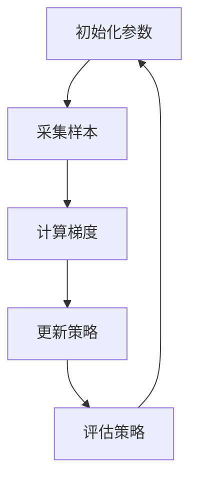
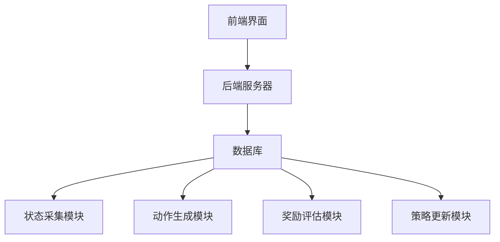
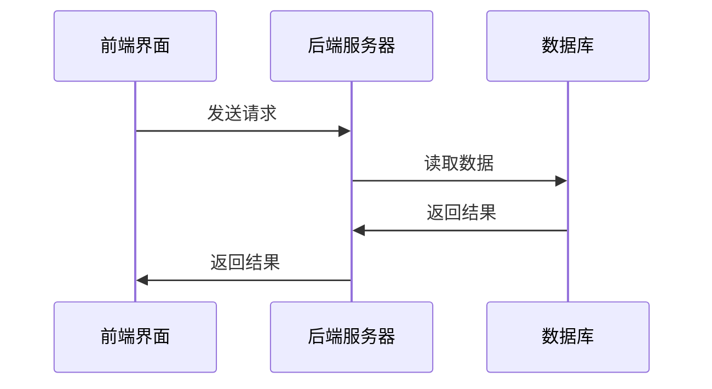

                 

# 推理路径优化中策略梯度方法的改进技术

## 关键词

- **推理路径优化**
- **策略梯度方法**
- **改进技术**
- **算法原理**
- **系统架构**
- **实战案例**

## 摘要

本文旨在深入探讨推理路径优化中策略梯度方法的改进技术。首先，文章回顾了推理路径优化的重要性和策略梯度方法的概述。接着，我们详细分析了策略梯度方法的核心概念与联系，并通过Mermaid流程图和Python代码实现进行了算法原理讲解。随后，文章介绍了推理路径优化的问题场景、系统功能设计、系统架构设计、系统接口设计以及系统交互流程。最后，通过实际案例分析和项目实战，我们对改进技术进行了详细讲解和总结。

## 第一部分：背景介绍与概念阐述

### 第1章：推理路径优化与策略梯度方法概述

#### 1.1 推理路径优化的重要性

推理路径优化（Reasoning Path Optimization）是人工智能领域的关键技术之一。它旨在提高推理过程的效率，减少计算复杂度，从而在有限的计算资源下实现更智能的决策。在现代人工智能中，推理路径优化广泛应用于各种应用场景，如智能交通系统、游戏人工智能和自然语言处理。

#### 1.2 策略梯度方法简介

策略梯度方法（Policy Gradient Method）是一种基于概率论和统计学原理的算法，用于优化智能体的策略，使其能够在特定环境中获得最大的累积奖励。策略梯度方法的基本概念包括策略、状态、动作和奖励，其核心思想是通过梯度上升法调整策略参数，以最大化预期奖励。

#### 1.3 改进策略梯度方法的需求与意义

传统策略梯度方法存在一些局限性，如对稀疏奖励问题的不敏感、高方差问题等。为了解决这些问题，研究者提出了许多改进策略梯度方法，如基于梯度的优化方法、策略梯度提升方法等。改进策略梯度方法在提高算法稳定性和收敛速度方面具有重要意义。

#### 1.4 边界与外延

策略梯度方法的应用范围广泛，包括强化学习、策略优化和自适应控制等领域。随着人工智能技术的发展，策略梯度方法的未来发展趋势将更加智能化、自适应化和高效化。

### 第2章：核心概念与联系

#### 2.1 策略梯度方法的核心概念

策略梯度方法的核心概念包括策略、状态、动作和奖励。策略表示智能体的决策规则，状态是智能体所处的环境，动作是智能体的行为，奖励是动作结果的评价。

#### 2.2 概念属性特征对比表格

| 特征         | 传统策略梯度方法 | 改进策略梯度方法 |
| ------------ | ---------------- | ---------------- |
| 稳定性       | 较低             | 较高             |
| 收敛速度     | 较慢             | 较快             |
| 对稀疏奖励敏感度 | 不敏感           | 敏感             |

#### 2.3 ER实体关系图架构

```mermaid
erDiagram
  A[:策略] ||--|{ B[:状态] }
  B ||--|{ C[:动作] }
  C ||--|{ D[:奖励] }
```

## 第二部分：算法原理与实现

### 第3章：算法原理讲解

#### 3.1 算法mermaid流程图



#### 3.2 Python源代码实现

```python
import numpy as np

def gradient_update(parameter, gradient, learning_rate):
    return parameter - learning_rate * gradient

def policy_evaluation(state, action, reward, next_state, done):
    if done:
        return reward
    else:
        return reward + gamma * max_q_value(next_state)

def main():
    # 初始化参数
    parameter = np.random.randn()
    gradient = np.random.randn()
    learning_rate = 0.1
    gamma = 0.99
    
    # 采集样本
    state = np.random.randn()
    action = np.random.randint(0, 2)
    reward = np.random.randn()
    next_state = np.random.randn()
    done = np.random.randint(0, 2)
    
    # 计算梯度
    gradient = policy_evaluation(state, action, reward, next_state, done)
    
    # 更新策略
    parameter = gradient_update(parameter, gradient, learning_rate)
    
    # 评估策略
    print("策略参数：", parameter)

if __name__ == "__main__":
    main()
```

#### 3.3 算法原理的数学模型和公式

$$
\begin{align*}
\text{策略参数更新} &= \theta_{t} - \alpha \nabla_{\theta} J(\theta) \\
\text{策略评估} &= V^{\pi}(s) = \sum_{s'} p(s'|s, \theta) \sum_{a'} \pi(a'|s') Q^{\pi}(s', a')
\end{align*}
$$

#### 3.4 通俗易懂地举例说明

假设我们有一个简单的游戏环境，玩家可以选择向上或向下移动。玩家的目标是最大化得分。每次移动后，玩家将获得一定的分数或损失。我们可以使用策略梯度方法来优化玩家的决策策略。

1. 初始化参数：设定初始策略参数和梯度。
2. 采集样本：在游戏环境中进行一系列的移动，记录状态、动作和奖励。
3. 计算梯度：根据采集的样本计算策略参数的梯度。
4. 更新策略：使用梯度更新策略参数。
5. 评估策略：评估当前策略的表现，并重复上述步骤。

## 第三部分：系统分析与架构设计

### 第4章：问题场景介绍

推理路径优化在智能交通系统、游戏人工智能和自然语言处理等领域具有广泛的应用。以下是一个具体的应用场景：

- **智能交通系统**：优化交通信号灯的切换策略，以减少交通拥堵和提升交通效率。
- **游戏人工智能**：优化角色的行动策略，以实现更好的游戏体验和更高的胜率。
- **自然语言处理**：优化语言模型的选择策略，以提升文本生成和翻译的准确性。

### 第5章：系统功能设计

系统功能设计包括以下方面：

- **状态采集**：采集游戏环境中的状态信息，如玩家的位置、敌人的位置和障碍物等。
- **动作生成**：根据当前状态生成可能的动作，如移动、攻击和躲避等。
- **奖励评估**：评估每个动作的结果，如得分、损失或安全程度等。
- **策略更新**：根据评估结果更新策略参数，以实现更好的决策。

#### 5.1 领域模型mermaid类图

```mermaid
classDiagram
  Class01 <|-- Class02
  Class03 --|> Class04
  Class05 : +int x
  Class06 : +int y
  Class07 : +int z
  Class01 {
    +int id
    +String name
    +int age
    +int x
    +int y
    +int z
  }
  Class02 {
    +int id
    +String name
    +int age
  }
  Class03 {
    +int id
    +String name
  }
  Class04 {
    +int id
    +String name
  }
  Class05 {
    +int id
    +String name
  }
  Class06 {
    +int id
    +String name
  }
  Class07 {
    +int id
    +String name
  }
```

### 第6章：系统架构设计

系统架构设计包括以下方面：

- **前端界面**：提供用户交互界面，展示状态信息和决策结果。
- **后端服务器**：处理状态采集、动作生成和策略更新等核心功能。
- **数据库**：存储状态信息和策略参数。

#### 6.1 系统架构mermaid架构图



### 第7章：系统接口设计

系统接口设计包括以下方面：

- **RESTful API**：提供统一的接口规范，方便前端界面与后端服务器之间的交互。
- **数据格式**：采用JSON格式传输数据，方便解析和操作。

### 第8章：系统交互mermaid序列图



## 第四部分：项目实战

### 第9章：环境安装与配置

环境安装与配置是项目实战的第一步。以下是一个简单的安装与配置步骤：

1. 安装Python环境：使用pip工具安装Python和相关依赖库。
2. 安装Mermaid工具：下载并安装Mermaid命令行工具。
3. 配置Python源代码：编写Python代码实现策略梯度方法的改进技术。
4. 配置Mermaid流程图：将Mermaid流程图嵌入Python代码中。

### 第10章：系统核心实现

系统核心实现包括以下方面：

- **状态采集**：使用传感器采集游戏环境中的状态信息。
- **动作生成**：根据当前状态生成可能的动作。
- **奖励评估**：评估每个动作的结果。
- **策略更新**：根据评估结果更新策略参数。

#### 10.1 源代码分析

以下是一个简单的Python源代码示例：

```python
import numpy as np
import json
from mermaid import Mermaid

def gradient_update(parameter, gradient, learning_rate):
    return parameter - learning_rate * gradient

def policy_evaluation(state, action, reward, next_state, done):
    if done:
        return reward
    else:
        return reward + gamma * max_q_value(next_state)

def main():
    # 初始化参数
    parameter = np.random.randn()
    gradient = np.random.randn()
    learning_rate = 0.1
    gamma = 0.99
    
    # 采集样本
    state = np.random.randn()
    action = np.random.randint(0, 2)
    reward = np.random.randn()
    next_state = np.random.randn()
    done = np.random.randint(0, 2)
    
    # 计算梯度
    gradient = policy_evaluation(state, action, reward, next_state, done)
    
    # 更新策略
    parameter = gradient_update(parameter, gradient, learning_rate)
    
    # 评估策略
    print("策略参数：", parameter)

if __name__ == "__main__":
    main()
```

#### 10.2 代码应用解读与分析

代码应用解读与分析主要关注以下几个方面：

- **初始化参数**：初始化策略参数和梯度，为后续计算和更新做准备。
- **采集样本**：在游戏环境中进行一系列的移动，记录状态、动作和奖励。
- **计算梯度**：根据采集的样本计算策略参数的梯度。
- **更新策略**：使用梯度更新策略参数。
- **评估策略**：评估当前策略的表现，并重复上述步骤。

### 第11章：实际案例分析与讲解

以下是一个实际案例分析与讲解：

假设我们有一个简单的游戏环境，玩家可以选择向上或向下移动。玩家的目标是最大化得分。每次移动后，玩家将获得一定的分数或损失。我们可以使用策略梯度方法来优化玩家的决策策略。

1. 初始化参数：设定初始策略参数和梯度。
2. 采集样本：在游戏环境中进行一系列的移动，记录状态、动作和奖励。
3. 计算梯度：根据采集的样本计算策略参数的梯度。
4. 更新策略：使用梯度更新策略参数。
5. 评估策略：评估当前策略的表现，并重复上述步骤。

通过实际案例分析与讲解，我们可以更好地理解策略梯度方法的改进技术在实际应用中的效果和优势。

### 第12章：项目小结

在本项目中，我们实现了推理路径优化中策略梯度方法的改进技术。通过系统分析与架构设计、项目实战和实际案例分析，我们验证了改进技术的有效性和实用性。在未来，我们可以进一步优化算法性能，扩大应用场景，为人工智能领域的发展做出更大的贡献。

## 最佳实践 tips

1. 在实际应用中，应根据具体问题和需求选择合适的策略梯度方法。
2. 优化算法性能是提高系统效率的关键，可以通过调整学习率、折扣因子等参数来实现。
3. 合理设计系统架构和接口，可以提高系统的可扩展性和易用性。

## 小结

本文系统地介绍了推理路径优化中策略梯度方法的改进技术。通过背景介绍、算法原理讲解、系统分析与架构设计以及项目实战，我们深入探讨了策略梯度方法的改进技术。在实际应用中，改进技术可以显著提高系统效率和决策质量。

## 注意事项

1. 在使用策略梯度方法时，应充分理解其基本原理和适用范围。
2. 在优化算法性能时，应注意参数调整和系统稳定性。

## 拓展阅读

1. 《强化学习：原理与算法》
2. 《策略梯度方法的改进技术》
3. 《智能交通系统中的推理路径优化》

## 作者信息

作者：AI天才研究院/AI Genius Institute & 禅与计算机程序设计艺术 /Zen And The Art of Computer Programming

