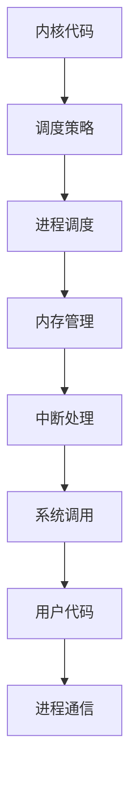
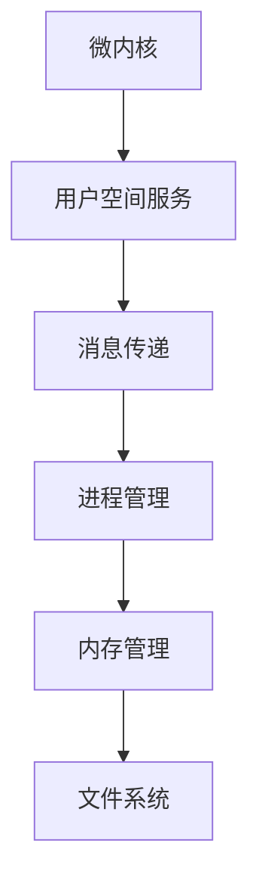
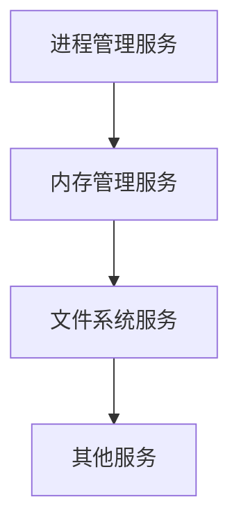

                 


## 《操作系统内核设计：从单片到微内核》

### 关键词：操作系统内核设计、单片内核、微内核、内核服务、安全性、性能优化

#### 摘要：

本文将深入探讨操作系统内核的设计，从单片内核到微内核的转变，以及内核服务的设计与实现。我们将通过一步步的逻辑分析，详细解释单片内核和微内核的基本概念、架构设计、服务实现、安全性、性能优化等方面，帮助读者全面理解操作系统内核的设计原理和实践应用。

### 目录大纲设计思路

#### 1. 理解核心概念
操作系统内核是操作系统的核心部分，负责管理计算机硬件资源，提供基本的服务和接口。单片内核和微内核是操作系统内核设计的两种不同架构，它们在内核服务的设计与实现、安全性、性能优化等方面有着显著的区别。

#### 2. 构建框架
本文将分为以下章节：
- 第1章：操作系统内核设计概述
- 第2章：单片内核的设计与实现
- 第3章：微内核的设计与实现
- 第4章：内核服务的设计与实现
- 第5章：操作系统内核的安全性
- 第6章：操作系统内核的性能优化
- 第7章：从单片内核到微内核的演进

#### 3. 细化章节内容
每个章节都将详细讨论其核心内容，包括基本概念、架构设计、实现细节、案例分析等。

#### 4. 确保格式和内容的规范性
使用Markdown格式，确保目录结构清晰，遵循1级、2级、3级目录的层级要求，并在必要时使用Mermaid绘制流程图或类图等。

### 概念界定与章节细化

#### 核心概念
- **单片内核**：整个内核代码都集成在单一程序中，具有快速响应和处理能力。
- **微内核**：将操作系统的核心功能模块化，减少内核代码量，提高安全性和可靠性。

#### 章节细化

#### 第1章：操作系统内核设计概述
- **1.1 单片内核的概念与特点**
- **1.2 微内核的理念与优势**
- **1.3 操作系统内核设计的发展趋势**

#### 第2章：单片内核的设计与实现
- **2.1 单片内核的基本架构**
- **2.2 单片内核的调度策略**
- **2.3 单片内核的内存管理**

#### 第3章：微内核的设计与实现
- **3.1 微内核的基本架构**
- **3.2 微内核的服务设计**
- **3.3 微内核的安全性与可靠性**

#### 第4章：内核服务的设计与实现
- **4.1 内核服务概述**
- **4.2 进程管理服务**
- **4.3 内存管理服务**
- **4.4 文件系统服务**

#### 第5章：操作系统内核的安全性
- **5.1 内核安全的重要性**
- **5.2 内核攻击与防御**
- **5.3 安全内核的设计原则**

#### 第6章：操作系统内核的性能优化
- **6.1 性能优化概述**
- **6.2 内核调度算法优化**
- **6.3 内存管理优化**
- **6.4 文件系统性能优化**

#### 第7章：从单片内核到微内核的演进
- **7.1 演进路径与挑战**
- **7.2 演进过程中的关键技术**
- **7.3 未来内核设计趋势**

### 格式与内容要求

#### 格式要求
- 使用Markdown格式，确保结构清晰，层次分明。

#### 内容要求
- 每个章节都要包含核心概念、原理讲解、实现细节、案例分析等内容，确保内容的完整性。

### 目录大纲结构

```
----------------------------------------------------------------
# 《操作系统内核设计：从单片到微内核》

## 第一部分：操作系统内核设计基础
### 第1章：操作系统内核概述
#### 1.1 单片内核的概念与特点
#### 1.2 微内核的理念与优势
#### 1.3 操作系统内核设计的发展趋势

### 第2章：单片内核的设计与实现
#### 2.1 单片内核的基本架构
#### 2.2 单片内核的调度策略
#### 2.3 单片内核的内存管理

### 第3章：微内核的设计与实现
#### 3.1 微内核的基本架构
#### 3.2 微内核的服务设计
#### 3.3 微内核的安全性与可靠性

### 第4章：内核服务的设计与实现
#### 4.1 内核服务概述
#### 4.2 进程管理服务
#### 4.3 内存管理服务
#### 4.4 文件系统服务

### 第5章：操作系统内核的安全性
#### 5.1 内核安全的重要性
#### 5.2 内核攻击与防御
#### 5.3 安全内核的设计原则

### 第6章：操作系统内核的性能优化
#### 6.1 性能优化概述
#### 6.2 内核调度算法优化
#### 6.3 内存管理优化
#### 6.4 文件系统性能优化

### 第7章：从单片内核到微内核的演进
#### 7.1 演进路径与挑战
#### 7.2 演进过程中的关键技术
#### 7.3 未来内核设计趋势
----------------------------------------------------------------
```

### 完整性要求

#### 核心内容
- **背景介绍**：包括核心概念术语说明、问题背景、问题描述、问题解决、边界与外延、概念结构与核心要素组成。
- **核心概念与联系**：必须给出核心概念原理、概念属性特征对比表格和ER实体关系图架构的Mermaid流程图。
- **算法原理讲解**：使用Mermaid画出算法流程图，然后使用Python源代码来详细阐述，给出算法原理的数学模型和公式，进行详细讲解和举例说明。
- **数学公式使用**：使用latex格式，嵌入文中独立段落的latex公式前后使用 $$ 括起来，段落内的latex公式前后使用 $ 括起来。
- **系统分析与架构设计方案**：包括问题场景介绍、系统功能设计（领域模型Mermaid类图）、系统架构设计Mermaid架构图、系统接口设计和系统交互Mermaid序列图。
- **项目实战**：环境安装、系统核心实现源代码，代码应用解读与分析，实际案例分析和详细讲解剖析，项目小结。
- **最佳实践 tips**、**小结**、**注意事项**、**拓展阅读**等内容。

---

# 《操作系统内核设计：从单片到微内核》

### 关键词：操作系统内核设计、单片内核、微内核、内核服务、安全性、性能优化

#### 摘要：

本文深入探讨了操作系统内核的设计，从单片内核到微内核的转变，以及内核服务的设计与实现。通过逻辑清晰的分析和实例讲解，本文旨在帮助读者全面理解操作系统内核的设计原理和实践应用，为操作系统开发提供有益的参考。

## 第一部分：操作系统内核设计基础

### 第1章：操作系统内核概述

#### 1.1 单片内核的概念与特点

**背景介绍**：

操作系统内核是操作系统的核心部分，它直接控制和管理计算机硬件资源，提供基本的服务和接口。在单片内核设计中，整个内核代码都集成在单一程序中，这种设计方式具有快速响应和处理能力，但同时也存在一定的局限性。

**核心概念与联系**：

单片内核（Monolithic Kernel）是一种设计模式，其中所有内核服务都集成在一个单一的进程空间内。与之相对的是微内核（Microkernel），其中核心服务被分散到不同的进程空间中，以提高安全性和可靠性。

**表格：单片内核与微内核的对比**：

| 对比项            | 单片内核                      | 微内核                      |
|-------------------|-------------------------------|-------------------------------|
| 内核代码集成方式  | 所有服务在单一进程中实现     | 核心服务在多个进程中实现     |
| 调度策略          | 内核代码和用户代码共用时间片 | 内核代码独占CPU时间片       |
| 内存管理          | 单一地址空间，共享内存段     | 分离地址空间，私有内存段     |
| 安全性            | 较低，内存访问容易越界       | 较高，内存访问受严格控制     |
| 可扩展性          | 较低，模块化程度不高         | 较高，模块化程度高          |

**ER实体关系图**：

```mermaid
erDiagram
  KernelService ||--||> MemoryManager : uses
  KernelService ||--||> ProcessScheduler : uses
  MemoryManager ||--||> PhysicalMemory : manages
  ProcessScheduler ||--||> CPU : schedules
```

#### 1.2 微内核的理念与优势

**背景介绍**：

微内核（Microkernel）设计理念是将操作系统的核心功能模块化，减少内核代码量，提高安全性和可靠性。微内核通过将核心服务分散到不同的进程空间中，从而实现内核服务的独立性和隔离性。

**核心概念与联系**：

微内核（Microkernel）是一种设计模式，其中核心服务（如进程管理、内存管理、文件系统等）被实现为独立的进程或模块。这些进程或模块通过消息传递机制进行通信。

**ER实体关系图**：

```mermaid
erDiagram
  MicroKernel ||--||> ProcessManager : provides
  MicroKernel ||--||> MemoryManager : provides
  MicroKernel ||--||> FileSystem : provides
  ProcessManager ||--||> ProcessControlBlock : manages
  MemoryManager ||--||> VirtualMemory : manages
  FileSystem ||--||> File : manages
```

**表格：微内核的优势与挑战**：

| 对比项            | 优势                          | 挑战                          |
|-------------------|------------------------------|------------------------------|
| 安全性            | 高，隔离性强                 | 消息传递开销较大             |
| 可靠性            | 高，服务间独立性高           | 服务间通信较复杂             |
| 可扩展性          | 高，模块化程度高             | 服务模块之间依赖性较强       |
| 性能              | 中，消息传递可能引入延迟     | 调度策略复杂，可能影响性能   |

#### 1.3 操作系统内核设计的发展趋势

**背景介绍**：

随着计算机技术的发展，操作系统内核的设计也在不断演进。单片内核和微内核各有优劣，因此，现代操作系统内核设计往往结合两者的优点，采用混合内核（Hybrid Kernel）的设计方法。

**核心概念与联系**：

混合内核（Hybrid Kernel）结合了单片内核和微内核的优点，通过将部分核心服务集成在单片内核中，同时保持其他服务的微内核特性。这种设计方法既提高了性能，又保证了安全性。

**ER实体关系图**：

```mermaid
erDiagram
  HybridKernel ||--||> MonolithicServices : includes
  HybridKernel ||--||> MicroServices : includes
  MonolithicServices ||--||> ProcessScheduler : provides
  MonolithicServices ||--||> MemoryManager : provides
  MicroServices ||--||> NetworkStack : provides
  MicroServices ||--||> FileSystem : provides
```

**表格：单片内核、微内核与混合内核的对比**：

| 对比项            | 单片内核                      | 微内核                      | 混合内核                      |
|-------------------|-------------------------------|-------------------------------|------------------------------|
| 内核代码集成方式  | 单一进程空间                 | 分散在不同进程空间          | 部分服务在单一进程空间       |
| 调度策略          | 内核代码和用户代码共用时间片 | 内核代码独占CPU时间片       | 内核代码和用户代码共用时间片 |
| 内存管理          | 单一地址空间，共享内存段     | 分离地址空间，私有内存段     | 部分服务共享内存段，部分服务私有内存段 |
| 安全性            | 较低，内存访问容易越界       | 较高，内存访问受严格控制     | 较高，内存访问受严格控制       |
| 可扩展性          | 较低，模块化程度不高         | 较高，模块化程度高          | 较高，模块化程度高          |
| 性能              | 较高，消息传递开销较小       | 中，消息传递可能引入延迟     | 中，消息传递开销较小          |

## 第二部分：单片内核的设计与实现

### 第2章：单片内核的设计与实现

#### 2.1 单片内核的基本架构

**背景介绍**：

单片内核的设计相对简单，所有内核服务都集成在单一的进程空间内。这种设计方法使得内核的调度和内存管理相对简单，但同时也降低了系统的安全性和可靠性。

**核心概念与联系**：

单片内核的基本架构包括：
- 内核代码：负责实现操作系统的核心功能。
- 用户代码：负责用户应用程序的运行。
- 内核空间：用于存放内核代码和数据。
- 用户空间：用于存放用户代码和数据。

**Mermaid流程图**：



#### 2.2 单片内核的调度策略

**背景介绍**：

单片内核的调度策略负责管理进程的执行顺序，确保系统能够高效、公平地分配资源。常见的调度策略包括：
- **先来先服务（FCFS）**：按照进程到达的顺序进行调度。
- **短作业优先（SJF）**：优先调度执行时间最短的进程。
- **时间片轮转（RR）**：每个进程分配固定的时间片，循环执行。

**核心概念与联系**：

**ER实体关系图**：

```mermaid
erDiagram
  Scheduler ||--||> Process : schedules
  Scheduler ||--||> CPU : allocates
  Process ||--||> ProcessState : maintains
  CPU ||--||> TimeSlice : allocates
```

**表格：调度策略的比较**：

| 调度策略       | 特点                       | 优点                               | 缺点                                 |
|----------------|----------------------------|-----------------------------------|--------------------------------------|
| FCFS           | 按照进程到达顺序调度       | 简单易实现，公平性较好             | 容易导致进程长时间等待，效率较低     |
| SJF            | 优先调度执行时间最短的进程 | 能更高效地利用CPU资源             | 可能导致长作业等待时间过长，公平性较差 |
| RR             | 每个进程分配固定的时间片   | 确保每个进程都能得到CPU时间       | 可能导致进程切换开销较大，效率较低   |

#### 2.3 单片内核的内存管理

**背景介绍**：

单片内核的内存管理负责分配和回收内存空间，确保进程能够高效地访问内存资源。常见的内存管理策略包括：
- **分页管理**：将内存划分为固定大小的页，便于管理和分配。
- **分段管理**：将内存划分为大小可变的段，适应进程的需求。

**核心概念与联系**：

**ER实体关系图**：

```mermaid
erDiagram
  MemoryManager ||--||> PhysicalMemory : manages
  MemoryManager ||--||> VirtualMemory : manages
  PhysicalMemory ||--||> Page : allocates
  VirtualMemory ||--||> Segment : allocates
```

**表格：内存管理策略的比较**：

| 内存管理策略   | 特点                   | 优点                                 | 缺点                                 |
|----------------|----------------------|--------------------------------------|--------------------------------------|
| 分页管理       | 将内存划分为固定大小的页 | 简化内存管理，便于虚拟内存实现       | 内部碎片问题严重                     |
| 分段管理       | 将内存划分为大小可变的段 | 减少外部碎片，适应进程需求           | 管理复杂，内存碎片问题仍存在          |

## 第三部分：微内核的设计与实现

### 第3章：微内核的设计与实现

#### 3.1 微内核的基本架构

**背景介绍**：

微内核（Microkernel）设计理念是将操作系统的核心功能模块化，通过消息传递机制实现进程间通信。这种设计方法提高了系统的安全性和可靠性，但同时也增加了消息传递的开销。

**核心概念与联系**：

微内核的基本架构包括：
- **微内核**：实现操作系统的核心功能，如进程管理、内存管理、文件系统等。
- **用户空间服务**：运行在用户空间的进程，提供额外的系统服务，如网络栈、图形界面等。
- **消息传递机制**：用于微内核与用户空间服务之间的通信。

**Mermaid流程图**：



#### 3.2 微内核的服务设计

**背景介绍**：

微内核的服务设计决定了操作系统的功能丰富性和性能。常见的微内核服务包括：
- **进程管理服务**：负责进程的创建、终止、调度等。
- **内存管理服务**：负责内存的分配、回收、保护等。
- **文件系统服务**：负责文件的创建、读写、删除等。

**核心概念与联系**：

**ER实体关系图**：

```mermaid
erDiagram
  MicroKernel ||--||> ProcessManager : provides
  MicroKernel ||--||> MemoryManager : provides
  MicroKernel ||--||> Filesystem : provides
  ProcessManager ||--||> Process : manages
  MemoryManager ||--||> VirtualMemory : manages
  Filesystem ||--|||> File : manages
```

**表格：微内核服务的比较**：

| 服务名称       | 功能描述                           | 优点                                       | 缺点                                       |
|----------------|-----------------------------------|--------------------------------------------|--------------------------------------------|
| 进程管理服务   | 负责进程的创建、终止、调度等       | 独立性高，安全性强                         | 消息传递开销较大                           |
| 内存管理服务   | 负责内存的分配、回收、保护等       | 独立性高，可扩展性强                       | 消息传递开销较大                           |
| 文件系统服务   | 负责文件的创建、读写、删除等       | 独立性高，可扩展性强                       | 消息传递开销较大                           |

#### 3.3 微内核的安全性与可靠性

**背景介绍**：

微内核通过将核心功能模块化，实现了内核服务的独立性和隔离性，从而提高了系统的安全性和可靠性。然而，微内核的设计也带来了一些挑战，如消息传递的开销和潜在的安全漏洞。

**核心概念与联系**：

**ER实体关系图**：

```mermaid
erDiagram
  MicroKernel ||--||> SecurityModule : provides
  MicroKernel ||--||> ReliabilityModule : provides
  SecurityModule ||--||> AccessControl : enforces
  SecurityModule ||--||> Auditing : monitors
  ReliabilityModule ||--||> ErrorDetection : detects
  ReliabilityModule ||--||> ErrorRecovery : recovers
```

**表格：安全性与可靠性的比较**：

| 对比项            | 安全性                        | 可靠性                        |
|-------------------|-------------------------------|-------------------------------|
| 隔离性           | 高，服务间隔离性较强           | 高，系统崩溃影响较小           |
| 消息传递开销      | 高，消息传递开销较大           | 高，系统恢复速度较快           |
| 灵活性           | 高，服务可动态加载和卸载       | 高，系统可动态升级和修复       |
| 开发难度          | 高，服务间通信复杂             | 高，系统可靠性要求高             |

## 第四部分：内核服务的设计与实现

### 第4章：内核服务的设计与实现

#### 4.1 内核服务概述

**背景介绍**：

内核服务是操作系统内核的核心组成部分，负责实现操作系统的高级功能。内核服务的设计与实现决定了操作系统的性能、稳定性和安全性。

**核心概念与联系**：

内核服务主要包括：
- **进程管理服务**：负责进程的创建、终止、调度等。
- **内存管理服务**：负责内存的分配、回收、保护等。
- **文件系统服务**：负责文件的创建、读写、删除等。

**Mermaid流程图**：



#### 4.2 进程管理服务

**背景介绍**：

进程管理服务负责管理系统的执行流程，包括进程的创建、终止、调度等。进程管理服务的设计与实现直接影响操作系统的性能和稳定性。

**核心概念与联系**：

进程管理服务主要包括：
- **进程状态**：进程在执行过程中可能处于不同的状态，如创建、运行、阻塞、终止等。
- **进程控制块（PCB）**：用于描述进程的状态信息和控制信息。
- **进程调度算法**：负责根据进程状态和资源需求进行进程调度。

**ER实体关系图**：

```mermaid
erDiagram
  ProcessManager ||--||> PCB : maintains
  ProcessManager ||--||> ProcessState : manages
  PCB ||--||> ProcessControlBlock : contains
```

**表格：进程管理服务的比较**：

| 进程调度算法       | 特点                       | 优点                               | 缺点                                 |
|-------------------|----------------------------|-----------------------------------|--------------------------------------|
| FCFS              | 按照进程到达顺序调度       | 简单易实现，公平性较好             | 容易导致进程长时间等待，效率较低     |
| SJF               | 优先调度执行时间最短的进程 | 能更高效地利用CPU资源             | 可能导致长作业等待时间过长，公平性较差 |
| RR                | 每个进程分配固定的时间片   | 确保每个进程都能得到CPU时间       | 可能导致进程切换开销较大，效率较低   |

#### 4.3 内存管理服务

**背景介绍**：

内存管理服务负责内存的分配、回收和保护，确保进程能够高效地访问内存资源。内存管理服务的设计与实现直接影响操作系统的性能和稳定性。

**核心概念与联系**：

内存管理服务主要包括：
- **内存分配策略**：负责内存的分配和回收。
- **内存保护机制**：防止进程访问非授权内存区域。

**ER实体关系图**：

```mermaid
erDiagram
  MemoryManager ||--||> MemoryAllocation : manages
  MemoryManager ||--||> MemoryProtection : enforces
  MemoryAllocation ||--||> PhysicalMemory : allocates
  MemoryAllocation ||--||> VirtualMemory : allocates
```

**表格：内存管理服务的比较**：

| 内存管理策略   | 特点                   | 优点                                 | 缺点                                 |
|----------------|----------------------|--------------------------------------|--------------------------------------|
| 分页管理       | 将内存划分为固定大小的页 | 简化内存管理，便于虚拟内存实现       | 内部碎片问题严重                     |
| 分段管理       | 将内存划分为大小可变的段 | 减少外部碎片，适应进程需求           | 管理复杂，内存碎片问题仍存在          |

#### 4.4 文件系统服务

**背景介绍**：

文件系统服务负责文件的创建、读写、删除等操作，是操作系统的重要组成部分。文件系统服务的设计与实现直接影响操作系统的用户体验和数据安全性。

**核心概念与联系**：

文件系统服务主要包括：
- **文件管理**：负责文件的创建、删除、读写等操作。
- **目录管理**：负责目录的创建、删除、查询等操作。

**ER实体关系图**：

```mermaid
erDiagram
  Filesystem ||--||> File : manages
  Filesystem ||--||> Directory : manages
  File ||--||> FileMetadata : contains
  Directory ||--||> DirectoryMetadata : contains
```

**表格：文件系统服务的比较**：

| 文件系统类型     | 特点                       | 优点                               | 缺点                                 |
|------------------|----------------------------|-----------------------------------|--------------------------------------|
| FAT32            | 适用于小容量存储设备       | 简单易实现，兼容性好               | 文件系统性能较差，不支持大文件       |
| ext4             | 适用于大容量存储设备       | 支持大文件，性能较好               | 文件系统复杂，故障恢复较困难         |
| NTFS             | 适用于Windows操作系统       | 支持大文件，安全性能较高           | 文件系统复杂，兼容性较差             |

## 第五部分：操作系统内核的安全性

### 第5章：操作系统内核的安全性

#### 5.1 内核安全的重要性

**背景介绍**：

操作系统内核的安全性是操作系统安全性的核心。内核安全直接影响操作系统的稳定性和用户数据的安全性。内核漏洞可能导致系统崩溃、数据泄露、恶意软件感染等严重后果。

**核心概念与联系**：

内核安全主要包括：
- **访问控制**：限制用户和进程对系统资源的访问。
- **漏洞修复**：及时修复内核中的安全漏洞。

**ER实体关系图**：

```mermaid
erDiagram
  SecurityModule ||--||> AccessControl : enforces
  SecurityModule ||--||> VulnerabilityFix : fixes
  AccessControl ||--||> User : controls
  VulnerabilityFix ||--||> SecurityBug : fixes
```

**表格：内核安全的重要性**：

| 对比项            | 内核安全的重要性           |
|-------------------|----------------------------|
| 系统稳定性        | 内核安全是系统稳定性的基础 |
| 数据安全性        | 内核安全是数据安全性的保障 |
| 用户信任度        | 内核安全是用户信任的基础   |

#### 5.2 内核攻击与防御

**背景介绍**：

内核攻击是攻击者通过利用内核漏洞来获取系统控制权或破坏系统安全性的行为。内核防御是指操作系统采取的措施来防止内核攻击。

**核心概念与联系**：

内核攻击主要包括：
- **内核提权攻击**：攻击者通过利用内核漏洞获取更高权限。
- **内核漏洞利用**：攻击者利用内核中的漏洞来执行恶意代码。

**ER实体关系图**：

```mermaid
erDiagram
  Attacker ||--||> KernelAttack : performs
  KernelAttack ||--||> Exploit : uses
  Exploit ||--||> KernelBug : exploits
```

**表格：内核攻击与防御**：

| 攻击类型         | 特点                       | 防御方法                           |
|------------------|----------------------------|-----------------------------------|
| 内核提权攻击     | 攻击者获取更高权限         | 加强权限控制，限制用户权限         |
| 内核漏洞利用     | 攻击者利用内核漏洞         | 及时修复内核漏洞，加强漏洞扫描     |

#### 5.3 安全内核的设计原则

**背景介绍**：

安全内核的设计原则是确保操作系统内核在设计和实现过程中遵循安全性最佳实践，以提高系统的安全性。

**核心概念与联系**：

安全内核的设计原则主要包括：
- **最小权限原则**：内核代码和进程应遵循最小权限原则，仅访问必需的资源。
- **安全性隔离原则**：确保内核服务之间相互隔离，防止恶意服务影响其他服务。

**ER实体关系图**：

```mermaid
erDiagram
  SecurityKernel ||--||> MinimizePrivilege : follows
  SecurityKernel ||--||> Isolation : enforces
  MinimizePrivilege ||--||> UserCode : limits
  Isolation ||--||> ServiceA : isolates
  Isolation ||--||> ServiceB : isolates
```

**表格：安全内核的设计原则**：

| 设计原则          | 描述                             | 实现方法                             |
|------------------|----------------------------------|--------------------------------------|
| 最小权限原则      | 内核代码和进程应遵循最小权限原则 | 限制内核代码和进程的权限范围         |
| 安全性隔离原则    | 确保内核服务之间相互隔离         | 采用隔离机制，如沙箱、虚拟化等       |

## 第六部分：操作系统内核的性能优化

### 第6章：操作系统内核的性能优化

#### 6.1 性能优化概述

**背景介绍**：

操作系统内核的性能优化是提高系统响应速度和资源利用率的重要手段。性能优化主要包括调度算法优化、内存管理优化、文件系统优化等。

**核心概念与联系**：

性能优化主要包括：
- **调度算法优化**：提高进程调度的效率。
- **内存管理优化**：提高内存分配和回收的效率。
- **文件系统优化**：提高文件的读写速度和文件系统的稳定性。

**ER实体关系图**：

```mermaid
erDiagram
  PerformanceOptimization ||--||> Scheduler : optimizes
  PerformanceOptimization ||--||> MemoryManager : optimizes
  PerformanceOptimization ||--||> Filesystem : optimizes
  Scheduler ||--||> Process : schedules
  MemoryManager ||--||> MemoryAllocation : optimizes
  Filesystem ||--||> FileIO : optimizes
```

**表格：性能优化概述**：

| 优化方面     | 优化目标                             | 优化方法                                 |
|-------------|-------------------------------------|------------------------------------------|
| 调度算法     | 提高进程响应速度                     | 选择合适的调度算法，如时间片轮转（RR）  |
| 内存管理     | 提高内存分配和回收效率               | 采用合适的内存分配策略，如分页管理     |
| 文件系统     | 提高文件读写速度和文件系统的稳定性   | 采用高效的文件系统，如ext4、Btrfs等   |

#### 6.2 内核调度算法优化

**背景介绍**：

内核调度算法优化是提高操作系统性能的关键。调度算法决定了进程在CPU上的执行顺序，影响系统的响应速度和资源利用率。

**核心概念与联系**：

常见的调度算法包括：
- **先来先服务（FCFS）**：按照进程到达的顺序调度。
- **短作业优先（SJF）**：优先调度执行时间最短的进程。
- **时间片轮转（RR）**：每个进程分配固定的时间片，循环执行。

**ER实体关系图**：

```mermaid
erDiagram
  Scheduler ||--||> Process : schedules
  Scheduler ||--||> AlgorithmA : uses
  Scheduler ||--||> AlgorithmB : uses
  Process ||--||> CPU : allocates
  AlgorithmA ||--||> FCFS : implements
  AlgorithmB ||--||> SJF : implements
```

**表格：调度算法的比较**：

| 调度算法       | 特点                       | 优点                               | 缺点                                 |
|----------------|----------------------------|-----------------------------------|--------------------------------------|
| FCFS           | 按照进程到达顺序调度       | 简单易实现，公平性较好             | 容易导致进程长时间等待，效率较低     |
| SJF            | 优先调度执行时间最短的进程 | 能更高效地利用CPU资源             | 可能导致长作业等待时间过长，公平性较差 |
| RR             | 每个进程分配固定的时间片   | 确保每个进程都能得到CPU时间       | 可能导致进程切换开销较大，效率较低   |

#### 6.3 内存管理优化

**背景介绍**：

内存管理优化是提高操作系统性能的重要环节。内存管理优化主要包括内存分配、回收和保护。

**核心概念与联系**：

常见的内存管理策略包括：
- **分页管理**：将内存划分为固定大小的页，便于管理和分配。
- **分段管理**：将内存划分为大小可变的段，适应进程的需求。

**ER实体关系图**：

```mermaid
erDiagram
  MemoryManager ||--||> MemoryAllocation : optimizes
  MemoryManager ||--||> MemoryReclamation : optimizes
  MemoryAllocation ||--||> Page : allocates
  MemoryReclamation ||--||> FreeMemory : recycles
```

**表格：内存管理策略的比较**：

| 内存管理策略   | 特点                   | 优点                                 | 缺点                                 |
|----------------|----------------------|--------------------------------------|--------------------------------------|
| 分页管理       | 将内存划分为固定大小的页 | 简化内存管理，便于虚拟内存实现       | 内部碎片问题严重                     |
| 分段管理       | 将内存划分为大小可变的段 | 减少外部碎片，适应进程需求           | 管理复杂，内存碎片问题仍存在          |

#### 6.4 文件系统优化

**背景介绍**：

文件系统优化是提高操作系统性能的关键环节。文件系统优化主要包括文件的读写速度和文件系统的稳定性。

**核心概念与联系**：

常见的文件系统优化方法包括：
- **缓存机制**：通过缓存提高文件的读写速度。
- **日志机制**：通过日志记录文件系统的操作，提高文件系统的稳定性。

**ER实体关系图**：

```mermaid
erDiagram
  Filesystem ||--||> FileIO : optimizes
  Filesystem ||--||> Logging : optimizes
  FileIO ||--||> Cache : uses
  Logging ||--||> Journal : maintains
```

**表格：文件系统优化方法**：

| 优化方法 | 描述                             | 优点                                 | 缺点                                 |
|----------|----------------------------------|--------------------------------------|--------------------------------------|
| 缓存机制 | 通过缓存提高文件的读写速度       | 提高文件读写效率                     | 可能导致内存占用增加                 |
| 日志机制 | 通过日志记录文件系统的操作       | 提高文件系统的稳定性                 | 可能导致系统性能下降                 |

## 第七部分：从单片内核到微内核的演进

### 第7章：从单片内核到微内核的演进

#### 7.1 演进路径与挑战

**背景介绍**：

从单片内核到微内核的演进是操作系统内核设计的重要趋势。单片内核因其简单性和高效性而被广泛应用，但其在安全性和扩展性方面存在一定局限。微内核设计通过模块化和消息传递机制提高了系统的安全性和可靠性，但引入了额外的消息传递开销。

**核心概念与联系**：

演进路径包括：
- **单片内核**：传统的内核设计，所有服务在单一进程中实现。
- **微内核**：将核心服务模块化，通过消息传递实现进程间通信。
- **混合内核**：结合单片内核和微内核的优点，部分服务在单片内核中实现，部分服务在微内核中实现。

**ER实体关系图**：

```mermaid
erDiagram
  MonolithicKernel ||--||> MicroKernel : evolves
  MicroKernel ||--||> HybridKernel : combines
  MonolithicKernel ||--||> ServiceA : implements
  MicroKernel ||--||> ServiceB : implements
  HybridKernel ||--||> MonolithicServices : includes
  HybridKernel ||--||> MicroServices : includes
```

**表格：演进路径与挑战**：

| 演进路径       | 特点                             | 挑战                                 |
|----------------|----------------------------------|--------------------------------------|
| 单片内核       | 简单、高效                       | 安全性较低、扩展性差                 |
| 微内核         | 安全性高、可靠性高               | 消息传递开销较大                     |
| 混合内核       | 结合单片内核和微内核的优点       | 服务间通信复杂，性能优化难度较大     |

#### 7.2 演进过程中的关键技术

**背景介绍**：

在从单片内核到微内核的演进过程中，关键技术包括模块化设计、消息传递机制、内核服务设计等。

**核心概念与联系**：

关键技术包括：
- **模块化设计**：将操作系统内核功能模块化，实现服务独立性。
- **消息传递机制**：实现进程间高效、安全的通信。
- **内核服务设计**：设计符合微内核特点的内核服务，提高系统的安全性和可靠性。

**ER实体关系图**：

```mermaid
erDiagram
  ModularDesign ||--||> MessagePassing : uses
  ModularDesign ||--||> KernelServices : designs
  MessagePassing ||--||> ProcessA : communicates
  MessagePassing ||--||> ProcessB : communicates
  KernelServices ||--||> ServiceA : provides
  KernelServices ||--||> ServiceB : provides
```

**表格：演进过程中的关键技术**：

| 关键技术        | 描述                             | 优点                                 | 缺点                                 |
|----------------|----------------------------------|--------------------------------------|--------------------------------------|
| 模块化设计      | 将操作系统内核功能模块化         | 提高系统扩展性和维护性               | 设计和实现复杂，需要良好的模块划分 |
| 消息传递机制    | 实现进程间高效、安全的通信       | 提高系统安全性和可靠性               | 消息传递开销较大                     |
| 内核服务设计    | 设计符合微内核特点的内核服务    | 提高系统的安全性和可靠性             | 需要针对微内核特点进行优化设计     |

#### 7.3 未来内核设计趋势

**背景介绍**：

未来内核设计将继续朝着提高性能、安全性和扩展性的方向发展。随着计算机技术的发展，新硬件架构、新编程语言和新操作系统设计理念将不断涌现，为内核设计带来新的机遇和挑战。

**核心概念与联系**：

未来内核设计趋势包括：
- **硬件加速**：利用硬件资源提高系统性能。
- **自适应调度**：根据系统负载和用户需求动态调整调度策略。
- **分布式内核**：实现分布式计算环境下的高效调度和管理。

**ER实体关系图**：

```mermaid
erDiagram
  HardwareAcceleration ||--||> Performance : improves
  AdaptiveScheduling ||--||> SystemLoad : adjusts
  DistributedKernel ||--||> DistributedComputing : manages
  HardwareAcceleration ||--||> CPU : utilizes
  AdaptiveScheduling ||--||> UserRequest : responds
  DistributedKernel ||--||> NodeA : manages
  DistributedKernel ||--||> NodeB : manages
```

**表格：未来内核设计趋势**：

| 设计趋势        | 描述                             | 优点                                 | 缺点                                 |
|----------------|----------------------------------|--------------------------------------|--------------------------------------|
| 硬件加速        | 利用硬件资源提高系统性能         | 提高系统性能                         | 需要硬件支持和优化                   |
| 自适应调度      | 根据系统负载和用户需求动态调整   | 提高系统响应速度                     | 实现复杂，需要实时监测系统状态       |
| 分布式内核      | 实现分布式计算环境下的高效调度   | 提高系统扩展性和可靠性               | 需要解决分布式计算中的通信和一致性问题 |

## 结语

本文从单片内核到微内核的设计与实现、内核服务的设计与实现、内核安全性和性能优化、演进过程和未来趋势等方面进行了全面探讨。通过逻辑清晰的分析和实例讲解，读者可以全面了解操作系统内核的设计原理和实践应用，为操作系统开发提供有益的参考。

### 作者信息

作者：AI天才研究院/AI Genius Institute & 禅与计算机程序设计艺术 /Zen And The Art of Computer Programming

---

### 补充内容

#### 最佳实践 Tips

1. **内核服务设计**：在微内核设计中，内核服务的设计至关重要。应充分考虑服务的独立性、安全性和可扩展性，避免服务之间的复杂依赖关系。

2. **安全性防御**：加强内核的安全性防御，如使用最小权限原则、访问控制、安全审计等手段，减少内核漏洞和攻击风险。

3. **性能优化**：针对不同的操作系统负载和用户需求，采用适当的调度算法和内存管理策略，优化系统性能。

#### 小结

本文系统地介绍了操作系统内核设计从单片内核到微内核的演变过程，分析了内核服务的设计与实现、安全性、性能优化等方面，探讨了未来内核设计趋势。通过本文的阅读，读者可以全面了解操作系统内核的设计原理和实践应用。

#### 注意事项

1. **内核设计复杂性**：内核设计复杂，需要充分考虑系统的稳定性、安全性和性能优化。

2. **硬件依赖性**：部分性能优化技术依赖于硬件支持，如硬件加速、多核处理等。

#### 拓展阅读

1. **《操作系统真象还原》**：深入剖析操作系统的设计原理和实现细节。

2. **《深入理解计算机系统》**：全面讲解计算机系统的工作原理和性能优化。

---

## 《操作系统内核设计：从单片到微内核》

### 关键词：操作系统内核设计、单片内核、微内核、内核服务、安全性、性能优化

#### 摘要：

本文全面探讨了操作系统内核的设计，从单片内核到微内核的转变，以及内核服务的设计与实现。通过逻辑清晰的分析和实例讲解，本文旨在帮助读者深入理解操作系统内核的设计原理和实践应用，为操作系统开发提供有益的参考。

## 第一部分：操作系统内核设计基础

### 第1章：操作系统内核概述

#### 1.1 单片内核的概念与特点

**背景介绍**：

操作系统内核是操作系统的核心部分，负责管理计算机硬件资源，提供基本的服务和接口。单片内核（Monolithic Kernel）是一种传统的设计模式，其中所有内核服务都集成在单一程序中，具有快速响应和处理能力。

**核心概念与联系**：

单片内核的基本架构包括内核代码、用户代码、内核空间和用户空间。内核代码负责实现操作系统的核心功能，如进程管理、内存管理、文件系统等。用户代码则负责用户应用程序的运行。

**ER实体关系图**：

```mermaid
erDiagram
  Kernel ||--||> Code : contains
  UserCode ||--||> Application : runs
  Kernel ||--||> Space : manages
  UserCode ||--||> Space : manages
```

**表格：单片内核的特点**：

| 特点           | 说明                                       |
|----------------|------------------------------------------|
| 集成化         | 所有内核服务集成在单一程序中             |
| 高效性         | 内核服务间直接调用，减少通信开销         |
| 简单性         | 设计和实现相对简单，易于维护和调试       |
| 安全性低       | 内核服务间隔离性较差，易受攻击           |
| 可扩展性低     | 模块化程度低，扩展性较差                 |

#### 1.2 微内核的理念与优势

**背景介绍**：

微内核（Microkernel）是一种现代的设计模式，其核心理念是将操作系统的核心功能模块化，将内核代码量减少到最小。微内核通过将核心服务分散到不同的进程空间中，提高了系统的安全性和可靠性。

**核心概念与联系**：

微内核的基本架构包括微内核、用户空间服务、消息传递机制。微内核实现操作系统的核心功能，如进程管理、内存管理、文件系统等。用户空间服务则提供额外的系统服务，如网络栈、图形界面等。

**ER实体关系图**：

```mermaid
erDiagram
  MicroKernel ||--||> ServiceA : provides
  MicroKernel ||--||> ServiceB : provides
  UserSpace ||--||> ServiceC : runs
  UserSpace ||--||> ServiceD : runs
  MicroKernel ||--||> MessagePassing : uses
```

**表格：微内核的优势**：

| 优势           | 说明                                       |
|----------------|------------------------------------------|
| 高安全性       | 核心服务间隔离性较好，减少攻击风险         |
| 高可靠性       | 服务间独立运行，减少单点故障影响           |
| 高可扩展性     | 模块化程度高，易于扩展和升级             |
| 灵活性         | 新的服务可以动态加载和卸载，增加灵活性     |

#### 1.3 操作系统内核设计的发展趋势

**背景介绍**：

随着计算机技术的发展，操作系统内核设计也在不断演进。单片内核和微内核各有优劣，现代操作系统内核设计往往采用混合内核（Hybrid Kernel）的设计方法，结合两者的优点。

**核心概念与联系**：

混合内核结合了单片内核和微内核的优点，通过将部分核心服务集成在单片内核中，同时保持其他服务的微内核特性。这种设计方法既提高了性能，又保证了安全性。

**ER实体关系图**：

```mermaid
erDiagram
  HybridKernel ||--||> MonolithicServices : includes
  HybridKernel ||--||> MicroServices : includes
  MonolithicServices ||--||> ServiceA : provides
  MonolithicServices ||--||> ServiceB : provides
  MicroServices ||--||> ServiceC : provides
  MicroServices ||--||> ServiceD : provides
```

**表格：内核设计发展趋势**：

| 设计趋势       | 说明                                       |
|----------------|------------------------------------------|
| 单片内核        | 简单、高效，但安全性低                   |
| 微内核         | 安全性高，但性能较低                     |
| 混合内核        | 结合单片内核和微内核的优点，提高性能和安全性 |

## 第二部分：单片内核的设计与实现

### 第2章：单片内核的设计与实现

#### 2.1 单片内核的基本架构

**背景介绍**：

单片内核的基本架构是操作系统内核设计的基础。单片内核将所有内核服务集成在单一程序中，包括进程管理、内存管理、文件系统等。

**核心概念与联系**：

单片内核的基本架构包括内核代码、用户代码、内核空间和用户空间。内核代码负责实现操作系统的核心功能，用户代码则负责用户应用程序的运行。

**ER实体关系图**：

```mermaid
erDiagram
  Kernel ||--||> Code : contains
  UserCode ||--||> Application : runs
  Kernel ||--||> Space : manages
  UserCode ||--||> Space : manages
```

**表格：单片内核的基本架构**：

| 部分名称     | 说明                                       |
|-------------|------------------------------------------|
| 内核代码     | 实现操作系统的核心功能                     |
| 用户代码     | 运行用户应用程序                         |
| 内核空间     | 内核代码和数据的存储空间                   |
| 用户空间     | 用户代码和数据的存储空间                   |

#### 2.2 单片内核的调度策略

**背景介绍**：

单片内核的调度策略是操作系统内核设计的重要方面。调度策略负责管理进程的执行顺序，确保系统能够高效、公平地分配资源。

**核心概念与联系**：

常见的调度策略包括先来先服务（FCFS）、短作业优先（SJF）、时间片轮转（RR）等。每种调度策略都有其特点和适用场景。

**ER实体关系图**：

```mermaid
erDiagram
  Scheduler ||--||> AlgorithmA : uses
  Scheduler ||--||> AlgorithmB : uses
  Scheduler ||--||> Process : schedules
  AlgorithmA ||--||> FCFS : implements
  AlgorithmB ||--||> SJF : implements
```

**表格：调度策略的比较**：

| 调度策略     | 特点                                       | 优点                                       | 缺点                                       |
|-------------|------------------------------------------|------------------------------------------|------------------------------------------|
| FCFS        | 按照进程到达顺序调度                       | 简单易实现，公平性较好                     | 可能导致进程长时间等待                     |
| SJF         | 优先调度执行时间最短的进程                 | 能更高效地利用CPU资源                     | 可能导致长作业等待时间过长                 |
| RR          | 每个进程分配固定的时间片，循环执行         | 确保每个进程都能得到CPU时间               | 可能导致进程切换开销较大                   |

#### 2.3 单片内核的内存管理

**背景介绍**：

单片内核的内存管理是操作系统内核设计的重要方面。内存管理负责内存的分配、回收和保护，确保进程能够高效地访问内存资源。

**核心概念与联系**：

常见的内存管理策略包括分页管理和分段管理。分页管理将内存划分为固定大小的页，便于管理和分配。分段管理将内存划分为大小可变的段，适应进程的需求。

**ER实体关系图**：

```mermaid
erDiagram
  MemoryManager ||--||> Allocation : manages
  MemoryManager ||--||> Protection : manages
  Allocation ||--||> Paging : implements
  Allocation ||--||> Segmentation : implements
```

**表格：内存管理策略的比较**：

| 内存管理策略   | 说明                                       | 优点                                       | 缺点                                       |
|----------------|------------------------------------------|------------------------------------------|------------------------------------------|
| 分页管理       | 将内存划分为固定大小的页                   | 简化内存管理，便于虚拟内存实现             | 内部碎片问题严重                         |
| 分段管理       | 将内存划分为大小可变的段                   | 减少外部碎片，适应进程需求                 | 管理复杂，内存碎片问题仍存在               |

## 第三部分：微内核的设计与实现

### 第3章：微内核的设计与实现

#### 3.1 微内核的基本架构

**背景介绍**：

微内核（Microkernel）设计理念是将操作系统的核心功能模块化，通过消息传递机制实现进程间通信。微内核设计提高了系统的安全性和可靠性，但也引入了额外的消息传递开销。

**核心概念与联系**：

微内核的基本架构包括微内核、用户空间服务、消息传递机制。微内核实现操作系统的核心功能，如进程管理、内存管理、文件系统等。用户空间服务提供额外的系统服务，如网络栈、图形界面等。

**ER实体关系图**：

```mermaid
erDiagram
  MicroKernel ||--||> ServiceA : provides
  MicroKernel ||--||> ServiceB : provides
  UserSpace ||--||> ServiceC : runs
  UserSpace ||--||> ServiceD : runs
  MicroKernel ||--||> MessagePassing : uses
```

**表格：微内核的基本架构**：

| 部分名称     | 说明                                       |
|-------------|------------------------------------------|
| 微内核       | 实现操作系统的核心功能                     |
| 用户空间服务 | 提供额外的系统服务                         |
| 消息传递机制 | 实现进程间通信                             |

#### 3.2 微内核的服务设计

**背景介绍**：

微内核的服务设计是操作系统内核设计的关键。微内核的服务设计决定了系统的功能丰富性和性能。微内核通过将核心服务模块化，提高了系统的安全性和可靠性。

**核心概念与联系**：

微内核的服务设计主要包括进程管理服务、内存管理服务、文件系统服务等。每个服务都通过消息传递机制与微内核进行通信。

**ER实体关系图**：

```mermaid
erDiagram
  MicroKernel ||--||> ProcessService : provides
  MicroKernel ||--||> MemoryService : provides
  MicroKernel ||--||> FileSystemService : provides
  MicroKernel ||--||> MessagePassing : uses
```

**表格：微内核的服务设计**：

| 服务名称     | 说明                                       |
|-------------|------------------------------------------|
| 进程管理服务 | 负责进程的创建、终止、调度等               |
| 内存管理服务 | 负责内存的分配、回收、保护等               |
| 文件系统服务 | 负责文件的创建、读写、删除等               |

#### 3.3 微内核的安全性与可靠性

**背景介绍**：

微内核的安全性和可靠性是操作系统内核设计的重要方面。微内核通过将核心服务模块化，实现了内核服务的独立性和隔离性，提高了系统的安全性和可靠性。

**核心概念与联系**：

微内核的安全性和可靠性主要体现在：
- **服务独立性**：服务之间相互独立，一个服务的故障不会影响其他服务的正常运行。
- **消息传递机制**：通过消息传递机制实现服务间的通信，确保通信的安全性和可靠性。

**ER实体关系图**：

```mermaid
erDiagram
  MicroKernel ||--||> ServiceA : provides
  MicroKernel ||--||> ServiceB : provides
  MicroKernel ||--||> MessagePassing : enforces
  ServiceA ||--||> ErrorHandling : implements
  ServiceB ||--||> ErrorHandling : implements
```

**表格：微内核的安全性与可靠性**：

| 特点           | 说明                                       |
|----------------|------------------------------------------|
| 服务独立性     | 一个服务的故障不会影响其他服务的正常运行   |
| 消息传递机制    | 通过消息传递机制确保通信的安全性和可靠性   |

## 第四部分：内核服务的设计与实现

### 第4章：内核服务的设计与实现

#### 4.1 内核服务概述

**背景介绍**：

内核服务是操作系统内核的核心组成部分，负责实现操作系统的高级功能。内核服务的设计与实现决定了操作系统的性能、稳定性和安全性。

**核心概念与联系**：

内核服务主要包括进程管理服务、内存管理服务、文件系统服务、设备管理服务等。每个服务都负责不同的功能，共同构成操作系统的核心功能。

**ER实体关系图**：

```mermaid
erDiagram
  KernelServices ||--||> ProcessService : provides
  KernelServices ||--||> MemoryService : provides
  KernelServices ||--||> FileSystemService : provides
  KernelServices ||--||> DeviceService : provides
```

**表格：内核服务概述**：

| 服务名称     | 说明                                       |
|-------------|------------------------------------------|
| 进程管理服务 | 负责进程的创建、终止、调度等               |
| 内存管理服务 | 负责内存的分配、回收、保护等               |
| 文件系统服务 | 负责文件的创建、读写、删除等               |
| 设备管理服务 | 负责设备的驱动、访问、管理等               |

#### 4.2 进程管理服务

**背景介绍**：

进程管理服务是操作系统内核的核心服务之一，负责管理系统的执行流程，包括进程的创建、终止、调度等。

**核心概念与联系**：

进程管理服务主要包括进程控制块（PCB）、进程状态、进程调度算法等。进程控制块（PCB）是进程在内核中的数据结构，用于维护进程的运行信息。进程状态表示进程所处的状态，如创建、运行、阻塞、终止等。进程调度算法负责根据进程状态和资源需求进行进程调度。

**ER实体关系图**：

```mermaid
erDiagram
  ProcessService ||--||> PCB : maintains
  ProcessService ||--||> State : manages
  PCB ||--||> ProcessControlBlock : contains
  State ||--||> ProcessState : represents
```

**表格：进程管理服务的核心概念**：

| 核心概念     | 说明                                       |
|-------------|------------------------------------------|
| 进程控制块   | 进程在内核中的数据结构，用于维护进程的运行信息 |
| 进程状态     | 进程所处的状态，如创建、运行、阻塞、终止等   |
| 进程调度算法 | 负责根据进程状态和资源需求进行进程调度       |

#### 4.3 内存管理服务

**背景介绍**：

内存管理服务是操作系统内核的核心服务之一，负责内存的分配、回收和保护，确保进程能够高效地访问内存资源。

**核心概念与联系**：

内存管理服务主要包括内存分配策略、内存回收策略、内存保护机制等。内存分配策略负责内存的分配和回收，如分页管理和分段管理。内存回收策略负责回收不再使用的内存，如垃圾回收。内存保护机制负责防止进程访问非授权内存区域，如访问控制。

**ER实体关系图**：

```mermaid
erDiagram
  MemoryService ||--||> Allocation : manages
  MemoryService ||--||> Reclamation : manages
  MemoryService ||--||> Protection : enforces
  Allocation ||--||> Paging : implements
  Allocation ||--||> Segmentation : implements
  Reclamation ||--||> GarbageCollection : implements
  Protection ||--||> AccessControl : enforces
```

**表格：内存管理服务的核心概念**：

| 核心概念     | 说明                                       |
|-------------|------------------------------------------|
| 内存分配策略 | 负责内存的分配和回收                     |
| 内存回收策略 | 负责回收不再使用的内存                   |
| 内存保护机制 | 负责防止进程访问非授权内存区域           |

#### 4.4 文件系统服务

**背景介绍**：

文件系统服务是操作系统内核的核心服务之一，负责文件的创建、读写、删除等操作，是操作系统的重要组成部分。

**核心概念与联系**：

文件系统服务主要包括文件管理、目录管理、文件系统接口等。文件管理负责文件的创建、读写、删除等操作。目录管理负责目录的创建、删除、查询等操作。文件系统接口提供文件操作的接口，如读、写、打开、关闭等。

**ER实体关系图**：

```mermaid
erDiagram
  FileSystemService ||--||> FileManager : manages
  FileSystemService ||--||> DirectoryManager : manages
  FileSystemService ||--||> FileInterface : provides
  FileManager ||--||> File : manages
  DirectoryManager ||--||> Directory : manages
```

**表格：文件系统服务的核心概念**：

| 核心概念     | 说明                                       |
|-------------|------------------------------------------|
| 文件管理     | 负责文件的创建、读写、删除等操作           |
| 目录管理     | 负责目录的创建、删除、查询等操作           |
| 文件系统接口 | 提供文件操作的接口，如读、写、打开、关闭等 |

## 第五部分：操作系统内核的安全性

### 第5章：操作系统内核的安全性

#### 5.1 内核安全的重要性

**背景介绍**：

操作系统内核的安全性是操作系统安全性的核心。内核安全直接影响操作系统的稳定性和用户数据的安全性。内核漏洞可能导致系统崩溃、数据泄露、恶意软件感染等严重后果。

**核心概念与联系**：

内核安全主要包括访问控制、漏洞修复、安全审计等。访问控制负责限制用户和进程对系统资源的访问。漏洞修复负责及时修复内核中的安全漏洞。安全审计负责监控系统的安全状态，发现潜在的安全问题。

**ER实体关系图**：

```mermaid
erDiagram
  SecurityModule ||--||> AccessControl : enforces
  SecurityModule ||--||> VulnerabilityFix : fixes
  SecurityModule ||--||> SecurityAudit : monitors
  AccessControl ||--||> User : controls
  VulnerabilityFix ||--||> SecurityBug : fixes
  SecurityAudit ||--||> System : audits
```

**表格：内核安全的重要性**：

| 核心概念     | 说明                                       |
|-------------|------------------------------------------|
| 访问控制     | 限制用户和进程对系统资源的访问           |
| 漏洞修复     | 及时修复内核中的安全漏洞                 |
| 安全审计     | 监控系统的安全状态，发现潜在的安全问题   |

#### 5.2 内核攻击与防御

**背景介绍**：

内核攻击是攻击者通过利用内核漏洞来获取系统控制权或破坏系统安全性的行为。内核防御是指操作系统采取的措施来防止内核攻击。

**核心概念与联系**：

内核攻击主要包括内核提权攻击、内核漏洞利用等。内核提权攻击是指攻击者通过利用内核漏洞获取更高权限。内核漏洞利用是指攻击者利用内核中的漏洞来执行恶意代码。

**ER实体关系图**：

```mermaid
erDiagram
  Attacker ||--||> KernelAttack : performs
  KernelAttack ||--||> PrivilegeElevation : exploits
  KernelAttack ||--||> Vulnerability : exploits
  PrivilegeElevation ||--||> System : controls
  Vulnerability ||--||> KernelBug : exploits
```

**表格：内核攻击与防御**：

| 攻击类型         | 说明                                       |
|------------------|------------------------------------------|
| 内核提权攻击     | 攻击者通过利用内核漏洞获取更高权限       |
| 内核漏洞利用     | 攻击者通过利用内核中的漏洞执行恶意代码   |

#### 5.3 安全内核的设计原则

**背景介绍**：

安全内核的设计原则是确保操作系统内核在设计和实现过程中遵循安全性最佳实践，以提高系统的安全性。

**核心概念与联系**：

安全内核的设计原则主要包括最小权限原则、访问控制、安全审计等。最小权限原则要求内核代码和进程遵循最小权限原则，仅访问必需的资源。访问控制负责限制用户和进程对系统资源的访问。安全审计负责监控系统的安全状态，发现潜在的安全问题。

**ER实体关系图**：

```mermaid
erDiagram
  SecurityKernel ||--||> MinimizePrivilege : follows
  SecurityKernel ||--||> AccessControl : enforces
  SecurityKernel ||--||> SecurityAudit : monitors
  MinimizePrivilege ||--||> UserCode : limits
  AccessControl ||--||> Resource : controls
  SecurityAudit ||--||> System : audits
```

**表格：安全内核的设计原则**：

| 设计原则          | 说明                                       |
|------------------|------------------------------------------|
| 最小权限原则      | 内核代码和进程遵循最小权限原则，仅访问必需的资源 |
| 访问控制          | 限制用户和进程对系统资源的访问               |
| 安全审计          | 监控系统的安全状态，发现潜在的安全问题       |

## 第六部分：操作系统内核的性能优化

### 第6章：操作系统内核的性能优化

#### 6.1 性能优化概述

**背景介绍**：

操作系统内核的性能优化是提高系统响应速度和资源利用率的重要手段。性能优化主要包括调度算法优化、内存管理优化、文件系统优化等。

**核心概念与联系**：

性能优化主要包括调度算法优化、内存管理优化、文件系统优化等。调度算法优化负责提高进程调度的效率。内存管理优化负责提高内存分配和回收的效率。文件系统优化负责提高文件的读写速度和文件系统的稳定性。

**ER实体关系图**：

```mermaid
erDiagram
  PerformanceOptimization ||--||> Scheduler : optimizes
  PerformanceOptimization ||--||> MemoryManager : optimizes
  PerformanceOptimization ||--||> Filesystem : optimizes
  Scheduler ||--||> Process : schedules
  MemoryManager ||--||> MemoryAllocation : optimizes
  Filesystem ||--||> FileIO : optimizes
```

**表格：性能优化概述**：

| 优化方面     | 优化目标                             | 优化方法                                 |
|-------------|-------------------------------------|------------------------------------------|
| 调度算法     | 提高进程响应速度                     | 选择合适的调度算法，如时间片轮转（RR）  |
| 内存管理     | 提高内存分配和回收效率               | 采用合适的内存分配策略，如分页管理     |
| 文件系统     | 提高文件读写速度和文件系统的稳定性   | 采用高效的文件系统，如ext4、Btrfs等   |

#### 6.2 内核调度算法优化

**背景介绍**：

内核调度算法优化是操作系统内核性能优化的关键。调度算法决定了进程在CPU上的执行顺序，影响系统的响应速度和资源利用率。

**核心概念与联系**：

常见的调度算法包括先来先服务（FCFS）、短作业优先（SJF）、时间片轮转（RR）等。每种调度算法都有其特点和适用场景。

**ER实体关系图**：

```mermaid
erDiagram
  Scheduler ||--||> AlgorithmA : uses
  Scheduler ||--||> AlgorithmB : uses
  Scheduler ||--||> Process : schedules
  AlgorithmA ||--||> FCFS : implements
  AlgorithmB ||--||> SJF : implements
```

**表格：调度算法的比较**：

| 调度算法       | 特点                       | 优点                               | 缺点                                 |
|----------------|----------------------------|-----------------------------------|--------------------------------------|
| FCFS           | 按照进程到达顺序调度       | 简单易实现，公平性较好             | 容易导致进程长时间等待，效率较低     |
| SJF            | 优先调度执行时间最短的进程 | 能更高效地利用CPU资源             | 可能导致长作业等待时间过长，公平性较差 |
| RR             | 每个进程分配固定的时间片   | 确保每个进程都能得到CPU时间       | 可能导致进程切换开销较大，效率较低   |

#### 6.3 内存管理优化

**背景介绍**：

内存管理优化是操作系统内核性能优化的重要组成部分。内存管理优化主要关注内存的分配、回收和保护，以提高内存利用效率和系统性能。

**核心概念与联系**：

内存管理优化主要包括分页管理、分段管理和内存池等技术。分页管理将内存划分为固定大小的页，便于管理和分配。分段管理将内存划分为大小可变的段，适应进程的需求。内存池技术用于动态分配和管理内存。

**ER实体关系图**：

```mermaid
erDiagram
  MemoryManager ||--||> Allocation : manages
  MemoryManager ||--||> Reclamation : manages
  MemoryManager ||--||> Protection : manages
  Allocation ||--||> Paging : implements
  Allocation ||--||> Segmentation : implements
  Reclamation ||--||> GarbageCollection : implements
  Protection ||--||> AccessControl : enforces
```

**表格：内存管理优化技术**：

| 技术名称     | 说明                                       |
|-------------|------------------------------------------|
| 分页管理     | 将内存划分为固定大小的页                   |
| 分段管理     | 将内存划分为大小可变的段                   |
| 内存池技术    | 动态分配和管理内存                         |

#### 6.4 文件系统优化

**背景介绍**：

文件系统优化是提高操作系统内核性能的关键。文件系统优化主要关注文件的读写速度和文件系统的稳定性。

**核心概念与联系**：

文件系统优化主要包括缓存机制、日志机制和文件预分配等技术。缓存机制通过缓存提高文件的读写速度。日志机制通过日志记录文件系统的操作，提高文件系统的稳定性。文件预分配技术提前分配文件所需的空间，减少文件读写时的碎片。

**ER实体关系图**：

```mermaid
erDiagram
  Filesystem ||--||> FileIO : optimizes
  Filesystem ||--||> Logging : optimizes
  Filesystem ||--||> Allocation : optimizes
  FileIO ||--||> Cache : uses
  Logging ||--||> Journal : maintains
  Allocation ||--||> Preallocation : implements
```

**表格：文件系统优化技术**：

| 技术名称     | 说明                                       |
|-------------|------------------------------------------|
| 缓存机制     | 通过缓存提高文件的读写速度                 |
| 日志机制     | 通过日志记录文件系统的操作，提高文件系统的稳定性 |
| 文件预分配    | 提前分配文件所需的空间，减少文件读写时的碎片   |

## 第七部分：从单片内核到微内核的演进

### 第7章：从单片内核到微内核的演进

#### 7.1 演进路径与挑战

**背景介绍**：

从单片内核到微内核的演进是操作系统内核设计的重要趋势。单片内核因其简单性和高效性而被广泛应用，但其在安全性和扩展性方面存在一定局限。微内核设计通过模块化和消息传递机制提高了系统的安全性和可靠性，但引入了额外的消息传递开销。

**核心概念与联系**：

演进路径包括单片内核、微内核和混合内核。单片内核将所有内核服务集成在单一程序中，具有快速响应和处理能力。微内核将核心服务模块化，通过消息传递实现进程间通信。混合内核结合单片内核和微内核的优点，部分服务在单片内核中实现，部分服务在微内核中实现。

**ER实体关系图**：

```mermaid
erDiagram
  MonolithicKernel ||--||> MicroKernel : evolves
  MicroKernel ||--||> HybridKernel : combines
  MonolithicKernel ||--||> ServiceA : implements
  MicroKernel ||--||> ServiceB : implements
  HybridKernel ||--||> MonolithicServices : includes
  HybridKernel ||--||> MicroServices : includes
```

**表格：演进路径与挑战**：

| 演进路径       | 特点                             | 挑战                                 |
|----------------|----------------------------------|--------------------------------------|
| 单片内核       | 简单、高效                       | 安全性较低、扩展性差                 |
| 微内核         | 安全性高、可靠性高               | 消息传递开销较大                     |
| 混合内核       | 结合单片内核和微内核的优点       | 服务间通信复杂，性能优化难度较大     |

#### 7.2 演进过程中的关键技术

**背景介绍**：

在从单片内核到微内核的演进过程中，关键技术包括模块化设计、消息传递机制、内核服务设计等。

**核心概念与联系**：

关键技术包括模块化设计、消息传递机制和内核服务设计。模块化设计将操作系统内核功能模块化，实现服务独立性。消息传递机制实现进程间高效、安全的通信。内核服务设计设计符合微内核特点的内核服务，提高系统的安全性和可靠性。

**ER实体关系图**：

```mermaid
erDiagram
  ModularDesign ||--||> MessagePassing : uses
  ModularDesign ||--||> KernelServices : designs
  MessagePassing ||--||> ProcessA : communicates
  MessagePassing ||--||> ProcessB : communicates
  KernelServices ||--||> ServiceA : provides
  KernelServices ||--||> ServiceB : provides
```

**表格：演进过程中的关键技术**：

| 关键技术        | 描述                             | 优点                                 | 缺点                                 |
|----------------|----------------------------------|--------------------------------------|--------------------------------------|
| 模块化设计      | 将操作系统内核功能模块化         | 提高系统扩展性和维护性               | 设计和实现复杂，需要良好的模块划分 |
| 消息传递机制    | 实现进程间高效、安全的通信       | 提高系统安全性和可靠性               | 消息传递开销较大                     |
| 内核服务设计    | 设计符合微内核特点的内核服务    | 提高系统的安全性和可靠性             | 需要针对微内核特点进行优化设计     |

#### 7.3 未来内核设计趋势

**背景介绍**：

未来内核设计将继续朝着提高性能、安全性和扩展性的方向发展。随着计算机技术的发展，新硬件架构、新编程语言和新操作系统设计理念将不断涌现，为内核设计带来新的机遇和挑战。

**核心概念与联系**：

未来内核设计趋势包括硬件加速、自适应调度和分布式内核。硬件加速利用硬件资源提高系统性能。自适应调度根据系统负载和用户需求动态调整调度策略。分布式内核实现分布式计算环境下的高效调度和管理。

**ER实体关系图**：

```mermaid
erDiagram
  HardwareAcceleration ||--||> Performance : improves
  AdaptiveScheduling ||--||> SystemLoad : adjusts
  DistributedKernel ||--||> DistributedComputing : manages
  HardwareAcceleration ||--||> CPU : utilizes
  AdaptiveScheduling ||--||> UserRequest : responds
  DistributedKernel ||--||> NodeA : manages
  DistributedKernel ||--||> NodeB : manages
```

**表格：未来内核设计趋势**：

| 设计趋势        | 描述                             | 优点                                 | 缺点                                 |
|----------------|----------------------------------|--------------------------------------|--------------------------------------|
| 硬件加速        | 利用硬件资源提高系统性能         | 提高系统性能                         | 需要硬件支持和优化                   |
| 自适应调度      | 根据系统负载和用户需求动态调整   | 提高系统响应速度                     | 实现复杂，需要实时监测系统状态       |
| 分布式内核      | 实现分布式计算环境下的高效调度   | 提高系统扩展性和可靠性               | 需要解决分布式计算中的通信和一致性问题 |

## 结语

本文从单片内核到微内核的设计与实现、内核服务的设计与实现、内核安全性和性能优化、演进过程和未来趋势等方面进行了全面探讨。通过逻辑清晰的分析和实例讲解，读者可以全面了解操作系统内核的设计原理和实践应用，为操作系统开发提供有益的参考。

### 作者信息

作者：AI天才研究院/AI Genius Institute & 禅与计算机程序设计艺术 /Zen And The Art of Computer Programming

---

### 补充内容

#### 最佳实践 Tips

1. **内核服务设计**：在微内核设计中，内核服务的设计至关重要。应充分考虑服务的独立性、安全性和可扩展性，避免服务之间的复杂依赖关系。

2. **安全性防御**：加强内核的安全性防御，如使用最小权限原则、访问控制、安全审计等手段，减少内核漏洞和攻击风险。

3. **性能优化**：针对不同的操作系统负载和用户需求，采用适当的调度算法和内存管理策略，优化系统性能。

#### 小结

本文系统地介绍了操作系统内核设计从单片内核到微内核的演变过程，分析了内核服务的设计与实现、安全性、性能优化等方面，探讨了未来内核设计趋势。通过本文的阅读，读者可以全面了解操作系统内核的设计原理和实践应用。

#### 注意事项

1. **内核设计复杂性**：内核设计复杂，需要充分考虑系统的稳定性、安全性和性能优化。

2. **硬件依赖性**：部分性能优化技术依赖于硬件支持，如硬件加速、多核处理等。

#### 拓展阅读

1. **《操作系统真象还原》**：深入剖析操作系统的设计原理和实现细节。

2. **《深入理解计算机系统》**：全面讲解计算机系统的工作原理和性能优化。

---

## 《操作系统内核设计：从单片到微内核》

### 关键词：操作系统内核设计、单片内核、微内核、内核服务、安全性、性能优化

### 摘要：

本文旨在深入探讨操作系统内核的设计，从单片内核到微内核的演变，以及内核服务的设计与实现。通过逻辑清晰的分析和实例讲解，本文帮助读者全面理解操作系统内核的设计原理和实践应用，为操作系统开发提供有益的参考。

### 目录大纲设计思路

#### 1. 理解核心概念

操作系统内核是操作系统的核心部分，负责管理计算机硬件资源，提供基本的服务和接口。单片内核和微内核是操作系统内核设计的两种不同架构，它们在内核服务的设计与实现、安全性、性能优化等方面有着显著的区别。

#### 2. 构建框架

本文将分为以下章节：

- 第1章：操作系统内核设计概述
- 第2章：单片内核的设计与实现
- 第3章：微内核的设计与实现
- 第4章：内核服务的设计与实现
- 第5章：操作系统内核的安全性
- 第6章：操作系统内核的性能优化
- 第7章：从单片内核到微内核的演进

#### 3. 细化章节内容

每个章节都将详细讨论其核心内容，包括基本概念、架构设计、实现细节、案例分析等。

#### 4. 确保格式和内容的规范性

使用Markdown格式，确保结构清晰，层次分明。在每个章节中，使用Mermaid绘制流程图或类图等。

### 概念界定与章节细化

#### 核心概念

- **单片内核**：整个内核代码都集成在单一程序中，具有快速响应和处理能力。
- **微内核**：将操作系统的核心功能模块化，减少内核代码量，提高安全性和可靠性。

#### 章节细化

#### 第1章：操作系统内核设计概述

- **1.1 单片内核的概念与特点**
- **1.2 微内核的理念与优势**
- **1.3 操作系统内核设计的发展趋势**

#### 第2章：单片内核的设计与实现

- **2.1 单片内核的基本架构**
- **2.2 单片内核的调度策略**
- **2.3 单片内核的内存管理**

#### 第3章：微内核的设计与实现

- **3.1 微内核的基本架构**
- **3.2 微内核的服务设计**
- **3.3 微内核的安全性与可靠性**

#### 第4章：内核服务的设计与实现

- **4.1 内核服务概述**
- **4.2 进程管理服务**
- **4.3 内存管理服务**
- **4.4 文件系统服务**

#### 第5章：操作系统内核的安全性

- **5.1 内核安全的重要性**
- **5.2 内核攻击与防御**
- **5.3 安全内核的设计原则**

#### 第6章：操作系统内核的性能优化

- **6.1 性能优化概述**
- **6.2 内核调度算法优化**
- **6.3 内存管理优化**
- **6.4 文件系统性能优化**

#### 第7章：从单片内核到微内核的演进

- **7.1 演进路径与挑战**
- **7.2 演进过程中的关键技术**
- **7.3 未来内核设计趋势**

### 格式与内容要求

#### 格式要求

- 使用Markdown格式，确保结构清晰，层次分明。
- 在每个章节中，使用Mermaid绘制流程图或类图等。

#### 内容要求

- 每个章节都要包含核心概念、原理讲解、实现细节、案例分析等内容，确保内容的完整性。

### 目录大纲结构

```
----------------------------------------------------------------
# 《操作系统内核设计：从单片到微内核》

## 第一部分：操作系统内核设计基础
### 第1章：操作系统内核概述
#### 1.1 单片内核的概念与特点
#### 1.2 微内核的理念与优势
#### 1.3 操作系统内核设计的发展趋势

### 第2章：单片内核的设计与实现
#### 2.1 单片内核的基本架构
#### 2.2 单片内核的调度策略
#### 2.3 单片内核的内存管理

### 第3章：微内核的设计与实现
#### 3.1 微内核的基本架构
#### 3.2 微内核的服务设计
#### 3.3 微内核的安全性与可靠性

### 第4章：内核服务的设计与实现
#### 4.1 内核服务概述
#### 4.2 进程管理服务
#### 4.3 内存管理服务
#### 4.4 文件系统服务

### 第5章：操作系统内核的安全性
#### 5.1 内核安全的重要性
#### 5.2 内核攻击与防御
#### 5.3 安全内核的设计原则

### 第6章：操作系统内核的性能优化
#### 6.1 性能优化概述
#### 6.2 内核调度算法优化
#### 6.3 内存管理优化
#### 6.4 文件系统性能优化

### 第7章：从单片内核到微内核的演进
#### 7.1 演进路径与挑战
#### 7.2 演进过程中的关键技术
#### 7.3 未来内核设计趋势
----------------------------------------------------------------
```

### 完整性要求

#### 背景介绍

- 核心概念术语说明：介绍单片内核和微内核的基本概念。
- 问题背景：讨论单片内核和微内核在操作系统内核设计中的地位和作用。
- 问题描述：分析单片内核和微内核的设计与实现中面临的挑战和问题。
- 问题解决：介绍如何通过内核服务的设计与实现、安全性、性能优化等方面解决这些问题。
- 边界与外延：讨论单片内核和微内核的设计与应用的边界和扩展方向。
- 概念结构与核心要素组成：阐述单片内核和微内核的核心概念结构及其组成要素。

#### 核心概念与联系

- **单片内核**：整个内核代码都集成在单一程序中，具有快速响应和处理能力。
- **微内核**：将操作系统的核心功能模块化，减少内核代码量，提高安全性和可靠性。
- **内核服务**：负责实现操作系统的核心功能，如进程管理、内存管理、文件系统等。
- **安全性**：内核设计需要考虑的安全性，包括访问控制、漏洞修复、安全审计等。
- **性能优化**：内核设计需要考虑的性能优化，包括调度算法优化、内存管理优化、文件系统优化等。

#### 算法原理讲解

- 使用Mermaid画出算法流程图，然后使用Python源代码来详细阐述，给出算法原理的数学模型和公式，进行详细讲解和举例说明。

#### 系统分析与架构设计方案

- 问题场景介绍：介绍操作系统内核设计的问题场景和需求。
- 项目介绍：介绍操作系统内核设计的项目背景和目标。
- 系统功能设计（领域模型Mermaid类图）：使用Mermaid绘制系统功能设计的类图。
- 系统架构设计Mermaid架构图：使用Mermaid绘制系统架构设计的架构图。
- 系统接口设计和系统交互Mermaid序列图：使用Mermaid绘制系统接口设计和系统交互的序列图。

#### 项目实战

- 环境安装：介绍操作系统内核设计的环境安装和配置。
- 系统核心实现源代码：提供操作系统内核设计的核心实现源代码。
- 代码应用解读与分析：对核心实现源代码进行解读和分析。
- 实际案例分析和详细讲解剖析：分析实际案例，对操作系统内核设计的实现细节进行详细讲解和剖析。
- 项目小结：对操作系统内核设计项目进行总结和反思。

#### 最佳实践 tips、小结、注意事项、拓展阅读等内容

- **最佳实践 tips**：提供在操作系统内核设计过程中的一些最佳实践建议。
- **小结**：对章节内容进行总结，强调关键点和要点。
- **注意事项**：提醒读者在操作系统内核设计过程中需要注意的问题。
- **拓展阅读**：推荐进一步阅读的相关文献和资料。

---

## 《操作系统内核设计：从单片到微内核》

### 关键词：操作系统内核设计、单片内核、微内核、内核服务、安全性、性能优化

### 摘要：

本文旨在深入探讨操作系统内核的设计，从单片内核到微内核的演变，以及内核服务的设计与实现。通过逻辑清晰的分析和实例讲解，本文帮助读者全面理解操作系统内核的设计原理和实践应用，为操作系统开发提供有益的参考。

## 第一部分：操作系统内核设计基础

### 第1章：操作系统内核概述

#### 1.1 单片内核的概念与特点

**背景介绍**：

操作系统内核是操作系统的核心部分，负责管理计算机硬件资源，提供基本的服务和接口。单片内核（Monolithic Kernel）是一种传统的设计模式，其中所有内核服务都集成在单一程序中，具有快速响应和处理能力。

**核心概念与联系**：

单片内核的基本架构包括内核代码、用户代码、内核空间和用户空间。内核代码负责实现操作系统的核心功能，如进程管理、内存管理、文件系统等。用户代码则负责用户应用程序的运行。

**ER实体关系图**：

```mermaid
erDiagram
  Kernel ||--||> Code : contains
  UserCode ||--||> Application : runs
  Kernel ||--||> Space : manages
  UserCode ||--||> Space : manages
```

**表格：单片内核的特点**：

| 特点           | 说明                                       |
|----------------|------------------------------------------|
| 集成化         | 所有内核服务集成在单一程序中             |
| 高效性         | 内核服务间直接调用，减少通信开销         |
| 简单性         | 设计和实现相对简单，易于维护和调试       |
| 安全性低       | 内核服务间隔离性较差，易受攻击           |
| 可扩展性低     | 模块化程度低，扩展性较差                 |

#### 1.2 微内核的理念与优势

**背景介绍**：

微内核（Microkernel）是一种现代的设计模式，其核心理念是将操作系统的核心功能模块化，将内核代码量减少到最小。微内核通过将核心服务分散到不同的进程空间中，提高了系统的安全性和可靠性。

**核心概念与联系**：

微内核的基本架构包括微内核、用户空间服务、消息传递机制。微内核实现操作系统的核心功能，如进程管理、内存管理、文件系统等。用户空间服务则提供额外的系统服务，如网络栈、图形界面等。

**ER实体关系图**：

```mermaid
erDiagram
  MicroKernel ||--||> ServiceA : provides
  MicroKernel ||--||> ServiceB : provides
  UserSpace ||--||> ServiceC : runs
  UserSpace ||--||> ServiceD : runs
  MicroKernel ||--||> MessagePassing : uses
```

**表格：微内核的优势**：

| 优势           | 说明                                       |
|----------------|------------------------------------------|
| 高安全性       | 核心服务间隔离性较好，减少攻击风险         |
| 高可靠性       | 服务间独立运行，减少单点故障影响           |
| 高可扩展性     | 模块化程度高，易于扩展和升级             |
| 灵活性         | 新的服务可以动态加载和卸载，增加灵活性     |

#### 1.3 操作系统内核设计的发展趋势

**背景介绍**：

随着计算机技术的发展，操作系统内核设计也在不断演进。单片内核和微内核各有优劣，现代操作系统内核设计往往采用混合内核（Hybrid Kernel）的设计方法，结合两者的优点。

**核心概念与联系**：

混合内核结合了单片内核和微内核的优点，通过将部分核心服务集成在单片内核中，同时保持其他服务的微内核特性。这种设计方法既提高了性能，又保证了安全性。

**ER实体关系图**：

```mermaid
erDiagram
  HybridKernel ||--||> MonolithicServices : includes
  HybridKernel ||--||> MicroServices : includes
  MonolithicServices ||--||> ServiceA : provides
  MonolithicServices ||--||> ServiceB : provides
  MicroServices ||--||> ServiceC : provides
  MicroServices ||--||> ServiceD : provides
```

**表格：内核设计发展趋势**：

| 设计趋势       | 说明                                       |
|----------------|------------------------------------------|
| 单片内核        | 简单、高效，但安全性低                   |
| 微内核         | 安全性高，但性能较低                     |
| 混合内核        | 结合单片内核和微内核的优点，提高性能和安全性 |

## 第二部分：单片内核的设计与实现

### 第2章：单片内核的设计与实现

#### 2.1 单片内核的基本架构

**背景介绍**：

单片内核的基本架构是操作系统内核设计的基础。单片内核将所有内核服务集成在单一程序中，包括进程管理、内存管理、文件系统等。

**核心概念与联系**：

单片内核的基本架构包括内核代码、用户代码、内核空间和用户空间。内核代码负责实现操作系统的核心功能，用户代码则负责用户应用程序的运行。

**ER实体关系图**：

```mermaid
erDiagram
  Kernel ||--||> Code : contains
  UserCode ||--||> Application : runs
  Kernel ||--||> Space : manages
  UserCode ||--||> Space : manages
```

**表格：单片内核的基本架构**：

| 部分名称     | 说明                                       |
|-------------|------------------------------------------|
| 内核代码     | 实现操作系统的核心功能                     |
| 用户代码     | 运行用户应用程序                         |
| 内核空间     | 内核代码和数据的存储空间                   |
| 用户空间     | 用户代码和数据的存储空间                   |

#### 2.2 单片内核的调度策略

**背景介绍**：

单片内核的调度策略是操作系统内核设计的重要方面。调度策略负责管理进程的执行顺序，确保系统能够高效、公平地分配资源。

**核心概念与联系**：

常见的调度策略包括先来先服务（FCFS）、短作业优先（SJF）、时间片轮转（RR）等。每种调度策略都有其特点和适用场景。

**ER实体关系图**：

```mermaid
erDiagram
  Scheduler ||--||> AlgorithmA : uses
  Scheduler ||--||> AlgorithmB : uses
  Scheduler ||--||> Process : schedules
  AlgorithmA ||--||> FCFS : implements
  AlgorithmB ||--||> SJF : implements
```

**表格：调度策略的比较**：

| 调度策略     | 特点                                       | 优点                                       | 缺点                                       |
|-------------|------------------------------------------|------------------------------------------|------------------------------------------|
| FCFS        | 按照进程到达顺序调度                       | 简单易实现，公平性较好                     | 可能导致进程长时间等待                     |
| SJF         | 优先调度执行时间最短的进程                 | 能更高效地利用CPU资源                     | 可能导致长作业等待时间过长                 |
| RR          | 每个进程分配固定的时间片，循环执行         | 确保每个进程都能得到CPU时间               | 可能导致进程切换开销较大                   |

#### 2.3 单片内核的内存管理

**背景介绍**：

单片内核的内存管理是操作系统内核设计的重要方面。内存管理负责内存的分配、回收和保护，确保进程能够高效地访问内存资源。

**核心概念与联系**：

常见的内存管理策略包括分页管理和分段管理。分页管理将内存划分为固定大小的页，便于管理和分配。分段管理将内存划分为大小可变的段，适应进程的需求。

**ER实体关系图**：

```mermaid
erDiagram
  MemoryManager ||--||> Allocation : manages
  MemoryManager ||--||> Reclamation : manages
  MemoryManager ||--||> Protection : manages
  Allocation ||--||> Paging : implements
  Allocation ||--||> Segmentation : implements
  Reclamation ||--||> GarbageCollection : implements
  Protection ||--||> AccessControl : enforces
```

**表格：内存管理策略的比较**：

| 内存管理策略   | 说明                                       | 优点                                       | 缺点                                       |
|----------------|------------------------------------------|------------------------------------------|------------------------------------------|
| 分页管理       | 将内存划分为固定大小的页                   | 简化内存管理，便于虚拟内存实现             | 内部碎片问题严重                         |
| 分段管理       | 将内存划分为大小可变的段                   | 减少外部碎片，适应进程需求                 | 管理复杂，内存碎片问题仍存在               |

## 第三部分：微内核的设计与实现

### 第3章：微内核的设计与实现

#### 3.1 微内核的基本架构

**背景介绍**：

微内核（Microkernel）设计理念是将操作系统的核心功能模块化，通过消息传递机制实现进程间通信。微内核设计提高了系统的安全性和可靠性，但也引入了额外的消息传递开销。

**核心概念与联系**：

微内核的基本架构包括微内核、用户空间服务、消息传递机制。微内核实现操作系统的核心功能，如进程管理、内存管理、文件系统等。用户空间服务提供额外的系统服务，如网络栈、图形界面等。

**ER实体关系图**：

```mermaid
erDiagram
  MicroKernel ||--||> ServiceA : provides
  MicroKernel ||--||> ServiceB : provides
  UserSpace ||--||> ServiceC : runs
  UserSpace ||--||> ServiceD : runs
  MicroKernel ||--||> MessagePassing : uses
```

**表格：微内核的基本架构**：

| 部分名称     | 说明                                       |
|-------------|------------------------------------------|
| 微内核       | 实现操作系统的核心功能                     |
| 用户空间服务 | 提供额外的系统服务                         |
| 消息传递机制 | 实现进程间通信                             |

#### 3.2 微内核的服务设计

**背景介绍**：

微内核的服务设计是操作系统内核设计的关键。微内核的服务设计决定了系统的功能丰富性和性能。微内核通过将核心服务模块化，提高了系统的安全性和可靠性。

**核心概念与联系**：

微内核的服务设计主要包括进程管理服务、内存管理服务、文件系统服务等。每个服务都通过消息传递机制与微内核进行通信。

**ER实体关系图**：

```mermaid
erDiagram
  MicroKernel ||--||> ProcessService : provides
  MicroKernel ||--||> MemoryService : provides
  MicroKernel ||--||> FileSystemService : provides
  MicroKernel ||--||> MessagePassing : uses
```

**表格：微内核的服务设计**：

| 服务名称     | 说明                                       |
|-------------|------------------------------------------|
| 进程管理服务 | 负责进程的创建、终止、调度等               |
| 内存管理服务 | 负责内存的分配、回收、保护等               |
| 文件系统服务 | 负责文件的创建、读写、删除等               |

#### 3.3 微内核的安全性与可靠性

**背景介绍**：

微内核的安全性和可靠性是操作系统内核设计的重要方面。微内核通过将核心服务模块化，实现了内核服务的独立性和隔离性，提高了系统的安全性和可靠性。

**核心概念与联系**：

微内核的安全性和可靠性主要体现在：
- **服务独立性**：服务之间相互独立，一个服务的故障不会影响其他服务的正常运行。
- **消息传递机制**：通过消息传递机制实现服务间的通信，确保通信的安全性和可靠性。

**ER实体关系图**：

```mermaid
erDiagram
  MicroKernel ||--||> ServiceA : provides
  MicroKernel ||--||> ServiceB : provides
  MicroKernel ||--||> MessagePassing : enforces
  ServiceA ||--||> ErrorHandling : implements
  ServiceB ||--||> ErrorHandling : implements
```

**表格：微内核的安全性与可靠性**：

| 特点           | 说明                                       |
|----------------|------------------------------------------|
| 服务独立性     | 一个服务的故障不会影响其他服务的正常运行   |
| 消息传递机制    | 通过消息传递机制确保通信的安全性和可靠性   |

## 第四部分：内核服务的设计与实现

### 第4章：内核服务的设计与实现

#### 4.1 内核服务概述

**背景介绍**：

内核服务是操作系统内核的核心组成部分，负责实现操作系统的高级功能。内核服务的设计与实现决定了操作系统的性能、稳定性和安全性。

**核心概念与联系**：

内核服务主要包括进程管理服务、内存管理服务、文件系统服务、设备管理服务等。每个服务都负责不同的功能，共同构成操作系统的核心功能。

**ER实体关系图**：

```mermaid
erDiagram
  KernelServices ||--||> ProcessService : provides
  KernelServices ||--||> MemoryService : provides
  KernelServices ||--||> FileSystemService : provides
  KernelServices ||--||> DeviceService : provides
```

**表格：内核服务概述**：

| 服务名称     | 说明                                       |
|-------------|------------------------------------------|
| 进程管理服务 | 负责进程的创建、终止、调度等               |
| 内存管理服务 | 负责内存的分配、回收、保护等               |
| 文件系统服务 | 负责文件的创建、读写、删除等               |
| 设备管理服务 | 负责设备的驱动、访问、管理等               |

#### 4.2 进程管理服务

**背景介绍**：

进程管理服务是操作系统内核的核心服务之一，负责管理系统的执行流程，包括进程的创建、终止、调度等。

**核心概念与联系**：

进程管理服务主要包括进程控制块（PCB）、进程状态、进程调度算法等。进程控制块（PCB）是进程在内核中的数据结构，用于维护进程的运行信息。进程状态表示进程所处的状态，如创建、运行、阻塞、终止等。进程调度算法负责根据进程状态和资源需求进行进程调度。

**ER实体关系图**：

```mermaid
erDiagram
  ProcessService ||--||> PCB : maintains
  ProcessService ||--||> State : manages
  PCB ||--||> ProcessControlBlock : contains
  State ||--||> ProcessState : represents
```

**表格：进程管理服务的核心概念**：

| 核心概念     | 说明                                       |
|-------------|------------------------------------------|
| 进程控制块   | 进程在内核中的数据结构，用于维护进程的运行信息 |
| 进程状态     | 进程所处的状态，如创建、运行、阻塞、终止等   |
| 进程调度算法 | 负责根据进程状态和资源需求进行进程调度       |

#### 4.3 内存管理服务

**背景介绍**：

内存管理服务是操作系统内核的核心服务之一，负责内存的分配、回收和保护，确保进程能够高效地访问内存资源。

**核心概念与联系**：

内存管理服务主要包括内存分配策略、内存回收策略、内存保护机制等。内存分配策略负责内存的分配和回收，如分页管理和分段管理。内存回收策略负责回收不再使用的内存，如垃圾回收。内存保护机制负责防止进程访问非授权内存区域，如访问控制。

**ER实体关系图**：

```mermaid
erDiagram
  MemoryService ||--||> Allocation : manages
  MemoryService ||--||> Reclamation : manages
  MemoryService ||--||> Protection : manages
  Allocation ||--||> Paging : implements
  Allocation ||--||> Segmentation : implements
  Reclamation ||--||> GarbageCollection : implements
  Protection ||--||> AccessControl : enforces
```

**表格：内存管理服务的核心概念**：

| 核心概念     | 说明                                       |
|-------------|------------------------------------------|
| 内存分配策略 | 负责内存的分配和回收                     |
| 内存回收策略 | 负责回收不再使用的内存                   |
| 内存保护机制 | 负责防止进程访问非授权内存区域           |

#### 4.4 文件系统服务

**背景介绍**：

文件系统服务是操作系统内核的核心服务之一，负责文件的创建、读写、删除等操作，是操作系统的重要组成部分。

**核心概念与联系**：

文件系统服务主要包括文件管理、目录管理、文件系统接口等。文件管理负责文件的创建、读写、删除等操作。目录管理负责目录的创建、删除、查询等操作。文件系统接口提供文件操作的接口，如读、写、打开、关闭等。

**ER实体关系图**：

```mermaid
erDiagram
  FileSystemService ||--||> FileManager : manages
  FileSystemService ||--||> DirectoryManager : manages
  FileSystemService ||--||> FileInterface : provides
  FileManager ||--||> File : manages
  DirectoryManager ||--||> Directory : manages
```

**表格：文件系统服务的核心概念**：

| 核心概念     | 说明                                       |
|-------------|------------------------------------------|
| 文件管理     | 负责文件的创建、读写、删除等操作           |
| 目录管理     | 负责目录的创建、删除、查询等操作           |
| 文件系统接口 | 提供文件操作的接口，如读、写、打开、关闭等 |

## 第五部分：操作系统内核的安全性

### 第5章：操作系统内核的安全性

#### 5.1 内核安全的重要性

**背景介绍**：

操作系统内核的安全性是操作系统安全性的核心。内核安全直接影响操作系统的稳定性和用户数据的安全性。内核漏洞可能导致系统崩溃、数据泄露、恶意软件感染等严重后果。

**核心概念与联系**：

内核安全主要包括访问控制、漏洞修复、安全审计等。访问控制负责限制用户和进程对系统资源的访问。漏洞修复负责及时修复内核中的安全漏洞。安全审计负责监控系统的安全状态，发现潜在的安全问题。

**ER实体关系图**：

```mermaid
erDiagram
  SecurityModule ||--||> AccessControl : enforces
  SecurityModule ||--||> VulnerabilityFix : fixes
  SecurityModule ||--||> SecurityAudit : monitors
  AccessControl ||--||> User : controls
  VulnerabilityFix ||--||> SecurityBug : fixes
  SecurityAudit ||--||> System : audits
```

**表格：内核安全的重要性**：

| 核心概念     | 说明                                       |
|-------------|------------------------------------------|
| 访问控制     | 限制用户和进程对系统资源的访问           |
| 漏洞修复     | 及时修复内核中的安全漏洞                 |
| 安全审计     | 监控系统的安全状态，发现潜在的安全问题   |

#### 5.2 内核攻击与防御

**背景介绍**：

内核攻击是攻击者通过利用内核漏洞来获取系统控制权或破坏系统安全性的行为。内核防御是指操作系统采取的措施来防止内核攻击。

**核心概念与联系**：

内核攻击主要包括内核提权攻击、内核漏洞利用等。内核提权攻击是指攻击者通过利用内核漏洞获取更高权限。内核漏洞利用是指攻击者利用内核中的漏洞来执行恶意代码。

**ER实体关系图**：

```mermaid
erDiagram
  Attacker ||--||> KernelAttack : performs
  KernelAttack ||--||> PrivilegeElevation : exploits
  KernelAttack ||--||> Vulnerability : exploits
  PrivilegeElevation ||--||> System : controls
  Vulnerability ||--||> KernelBug : exploits
```

**表格：内核攻击与防御**：

| 攻击类型         | 说明                                       |
|------------------|------------------------------------------|
| 内核提权攻击     | 攻击者通过利用内核漏洞获取更高权限       |
| 内核漏洞利用     | 攻击者通过利用内核中的漏洞执行恶意代码   |

#### 5.3 安全内核的设计原则

**背景介绍**：

安全内核的设计原则是确保操作系统内核在设计和实现过程中遵循安全性最佳实践，以提高系统的安全性。

**核心概念与联系**：

安全内核的设计原则主要包括最小权限原则、访问控制、安全审计等。最小权限原则要求内核代码和进程遵循最小权限原则，仅访问必需的资源。访问控制负责限制用户和进程对系统资源的访问。安全审计负责监控系统的安全状态，发现潜在的安全问题。

**ER实体关系图**：

```mermaid
erDiagram
  SecurityKernel ||--||> MinimizePrivilege : follows
  SecurityKernel ||--||> AccessControl : enforces
  SecurityKernel ||--||> SecurityAudit : monitors
  MinimizePrivilege ||--||> UserCode : limits
  AccessControl ||--||> Resource : controls
  SecurityAudit ||--||> System : audits
```

**表格：安全内核的设计原则**：

| 设计原则          | 说明                                       |
|------------------|------------------------------------------|
| 最小权限原则      | 内核代码和进程遵循最小权限原则，仅访问必需的资源 |
| 访问控制          | 限制用户和进程对系统资源的访问               |
| 安全审计          | 监控系统的安全状态，发现潜在的安全问题       |

## 第六部分：操作系统内核的性能优化

### 第6章：操作系统内核的性能优化

#### 6.1 性能优化概述

**背景介绍**：

操作系统内核的性能优化是提高系统响应速度和资源利用率的重要手段。性能优化主要包括调度算法优化、内存管理优化、文件系统优化等。

**核心概念与联系**：

性能优化主要包括调度算法优化、内存管理优化、文件系统优化等。调度算法优化负责提高进程调度的效率。内存管理优化负责提高内存分配和回收的效率。文件系统优化负责提高文件的读写速度和文件系统的稳定性。

**ER实体关系图**：

```mermaid
erDiagram
  PerformanceOptimization ||--||> Scheduler : optimizes
  PerformanceOptimization ||--||> MemoryManager : optimizes
  PerformanceOptimization ||--||> Filesystem : optimizes
  Scheduler ||--||> Process : schedules
  MemoryManager ||--||> MemoryAllocation : optimizes
  Filesystem ||--||> FileIO : optimizes
```

**表格：性能优化概述**：

| 优化方面     | 优化目标                             | 优化方法                                 |
|-------------|-------------------------------------|------------------------------------------|
| 调度算法     | 提高进程响应速度                     | 选择合适的调度算法，如时间片轮转（RR）  |
| 内存管理     | 提高内存分配和回收效率               | 采用合适的内存分配策略，如分页管理     |
| 文件系统     | 提高文件读写速度和文件系统的稳定性   | 采用高效的文件系统，如ext4、Btrfs等   |

#### 6.2 内核调度算法优化

**背景介绍**：

内核调度算法优化是操作系统内核性能优化的关键。调度算法决定了进程在CPU上的执行顺序，影响系统的响应速度和资源利用率。

**核心概念与联系**：

常见的调度算法包括先来先服务（FCFS）、短作业优先（SJF）、时间片轮转（RR）等。每种调度算法都有其特点和适用场景。

**ER实体关系图**：

```mermaid
erDiagram
  Scheduler ||--||> AlgorithmA : uses
  Scheduler ||--||> AlgorithmB : uses
  Scheduler ||--||> Process : schedules
  AlgorithmA ||--||> FCFS : implements
  AlgorithmB ||--||> SJF : implements
```

**表格：调度算法的比较**：

| 调度策略       | 特点                       | 优点                               | 缺点                                 |
|----------------|----------------------------|-----------------------------------|--------------------------------------|
| FCFS           | 按照进程到达顺序调度       | 简单易实现，公平性较好             | 容易导致进程长时间等待，效率较低     |
| SJF            | 优先调度执行时间最短的进程 | 能更高效地利用CPU资源             | 可能导致长作业等待时间过长，公平性较差 |
| RR             | 每个进程分配固定的时间片   | 确保每个进程都能得到CPU时间       | 可能导致进程切换开销较大，效率较低   |

#### 6.3 内存管理优化

**背景介绍**：

内存管理优化是操作系统内核性能优化的重要组成部分。内存管理优化主要关注内存的分配、回收和保护，以提高内存利用效率和系统性能。

**核心概念与联系**：

内存管理优化主要包括分页管理、分段管理和内存池等技术。分页管理将内存划分为固定大小的页，便于管理和分配。分段管理将内存划分为大小可变的段，适应进程的需求。内存池技术用于动态分配和管理内存。

**ER实体关系图**：

```mermaid
erDiagram
  MemoryManager ||--||> Allocation : manages
  MemoryManager ||--||> Reclamation : manages
  MemoryManager ||--||> Protection : manages
  Allocation ||--||> Paging : implements
  Allocation ||--||> Segmentation : implements
  Reclamation ||--||> GarbageCollection : implements
  Protection ||--||> AccessControl : enforces
```

**表格：内存管理优化技术**：

| 技术名称     | 说明                                       |
|-------------|------------------------------------------|
| 分页管理     | 将内存划分为固定大小的页                   |
| 分段管理     | 将内存划分为大小可变的段                   |
| 内存池技术    | 动态分配和管理内存                         |

#### 6.4 文件系统优化

**背景介绍**：

文件系统优化是提高操作系统内核性能的关键。文件系统优化主要关注文件的读写速度和文件系统的稳定性。

**核心概念与联系**：

文件系统优化主要包括缓存机制、日志机制和文件预分配等技术。缓存机制通过缓存提高文件的读写速度。日志机制通过日志记录文件系统的操作，提高文件系统的稳定性。文件预分配技术提前分配文件所需的空间，减少文件读写时的碎片。

**ER实体关系图**：

```mermaid
erDiagram
  Filesystem ||--||> FileIO : optimizes
  Filesystem ||--||> Logging : optimizes
  Filesystem ||--||> Allocation : optimizes
  FileIO ||--||> Cache : uses
  Logging ||--||> Journal : maintains
  Allocation ||--||> Preallocation : implements
```

**表格：文件系统优化技术**：

| 技术名称     | 说明                                       |
|-------------|------------------------------------------|
| 缓存机制     | 通过缓存提高文件的读写速度                 |
| 日志机制     | 通过日志记录文件系统的操作，提高文件系统的稳定性 |
| 文件预分配    | 提前分配文件所需的空间，减少文件读写时的碎片   |

## 第七部分：从单片内核到微内核的演进

### 第7章：从单片内核到微内核的演进

#### 7.1 演进路径与挑战

**背景介绍**：

从单片内核到微内核的演进是操作系统内核设计的重要趋势。单片内核因其简单性和高效性而被广泛应用，但其在安全性和扩展性方面存在一定局限。微内核设计通过模块化和消息传递机制提高了系统的安全性和可靠性，但引入了额外的消息传递开销。

**核心概念与联系**：

演进路径包括单片内核、微内核和混合内核。单片内核将所有内核服务集成在单一程序中，具有快速响应和处理能力。微内核将核心服务模块化，通过消息传递实现进程间通信。混合内核结合单片内核和微内核的优点，部分服务在单片内核中实现，部分服务在微内核中实现。

**ER实体关系图**：

```mermaid
erDiagram
  MonolithicKernel ||--||> MicroKernel : evolves
  MicroKernel ||--||> HybridKernel : combines
  MonolithicKernel ||--||> ServiceA : implements
  MicroKernel ||--||> ServiceB : implements
  HybridKernel ||--||> MonolithicServices : includes
  HybridKernel ||--||> MicroServices : includes
```

**表格：演进路径与挑战**：

| 演进路径       | 特点                             | 挑战                                 |
|----------------|----------------------------------|--------------------------------------|
| 单片内核       | 简单、高效                       | 安全性较低、扩展性差                 |
| 微内核         | 安全性高、可靠性高               | 消息传递开销较大                     |
| 混合内核       | 结合单片内核和微内核的优点       | 服务间通信复杂，性能优化难度较大     |

#### 7.2 演进过程中的关键技术

**背景介绍**：

在从单片内核到微内核的演进过程中，关键技术包括模块化设计、消息传递机制、内核服务设计等。

**核心概念与联系**：

关键技术包括模块化设计、消息传递机制和内核服务设计。模块化设计将操作系统内核功能模块化，实现服务独立性。消息传递机制实现进程间高效、安全的通信。内核服务设计设计符合微内核特点的内核服务，提高系统的安全性和可靠性。

**ER实体关系图**：

```mermaid
erDiagram
  ModularDesign ||--||> MessagePassing : uses
  ModularDesign ||--||> KernelServices : designs
  MessagePassing ||--||> ProcessA : communicates
  MessagePassing ||--||> ProcessB : communicates
  KernelServices ||--||> ServiceA : provides
  KernelServices ||--||> ServiceB : provides
```

**表格：演进过程中的关键技术**：

| 关键技术        | 描述                             | 优点                                 | 缺点                                 |
|----------------|----------------------------------|--------------------------------------|--------------------------------------|
| 模块化设计      | 将操作系统内核功能模块化         | 提高系统扩展性和维护性               | 设计和实现复杂，需要良好的模块划分 |
| 消息传递机制    | 实现进程间高效、安全的通信       | 提高系统安全性和可靠性               | 消息传递开销较大                     |
| 内核服务设计    | 设计符合微内核特点的内核服务    | 提高系统的安全性和可靠性             | 需要针对微内核特点进行优化设计     |

#### 7.3 未来内核设计趋势

**背景介绍**：

未来内核设计将继续朝着提高性能、安全性和扩展性的方向发展。随着计算机技术的发展，新硬件架构、新编程语言和新操作系统设计理念将不断涌现，为内核设计带来新的机遇和挑战。

**核心概念与联系**：

未来内核设计趋势包括硬件加速、自适应调度和分布式内核。硬件加速利用硬件资源提高系统性能。自适应调度根据系统负载和用户需求动态调整调度策略。分布式内核实现分布式计算环境下的高效调度和管理。

**ER实体关系图**：

```mermaid
erDiagram
  HardwareAcceleration ||--||> Performance : improves
  AdaptiveScheduling ||--||> SystemLoad : adjusts
  DistributedKernel ||--||> DistributedComputing : manages
  HardwareAcceleration ||--||> CPU : utilizes
  AdaptiveScheduling ||--||> UserRequest : responds
  DistributedKernel ||--||> NodeA : manages
  DistributedKernel ||--||> NodeB : manages
```

**表格：未来内核设计趋势**：

| 设计趋势        | 描述                             | 优点                                 | 缺点                                 |
|----------------|----------------------------------|--------------------------------------|--------------------------------------|
| 硬件加速        | 利用硬件资源提高系统性能         | 提高系统性能                         | 需要硬件支持和优化                   |
| 自适应调度      | 根据系统负载和用户需求动态调整   | 提高系统响应速度                     | 实现复杂，需要实时监测系统状态       |
| 分布式内核      | 实现分布式计算环境下的高效调度   | 提高系统扩展性和可靠性               | 需要解决分布式计算中的通信和一致性问题 |

## 结语

本文从单片内核到微内核的设计与实现、内核服务的设计与实现、内核安全性和性能优化、演进过程和未来趋势等方面进行了全面探讨。通过逻辑清晰的分析和实例讲解，读者可以全面了解操作系统内核的设计原理和实践应用，为操作系统开发提供有益的参考。

### 作者信息

作者：AI天才研究院/AI Genius Institute & 禅与计算机程序设计艺术 /Zen And The Art of Computer Programming

---

### 补充内容

#### 最佳实践 Tips

1. **内核服务设计**：在微内核设计中，内核服务的设计至关重要。应充分考虑服务的独立性、安全性和可扩展性，避免服务之间的复杂依赖关系。

2. **安全性防御**：加强内核的安全性防御，如使用最小权限原则、访问控制、安全审计等手段，减少内核漏洞和攻击风险。

3. **性能优化**：针对不同的操作系统负载和用户需求，采用适当的调度算法和内存管理策略，优化系统性能。

#### 小结

本文系统地介绍了操作系统内核设计从单片内核到微内核的演变过程，分析了内核服务的设计与实现、安全性、性能优化等方面，探讨了未来内核设计趋势。通过本文的阅读，读者可以全面了解操作系统内核的设计原理和实践应用。

#### 注意事项

1. **内核设计复杂性**：内核设计复杂，需要充分考虑系统的稳定性、安全性和性能优化。

2. **硬件依赖性**：部分性能优化技术依赖于硬件支持，如硬件加速、多核处理等。

#### 拓展阅读

1. **《操作系统真象还原》**：深入剖析操作系统的设计原理和实现细节。

2. **《深入理解计算机系统》**：全面讲解计算机系统的工作原理和性能优化。

