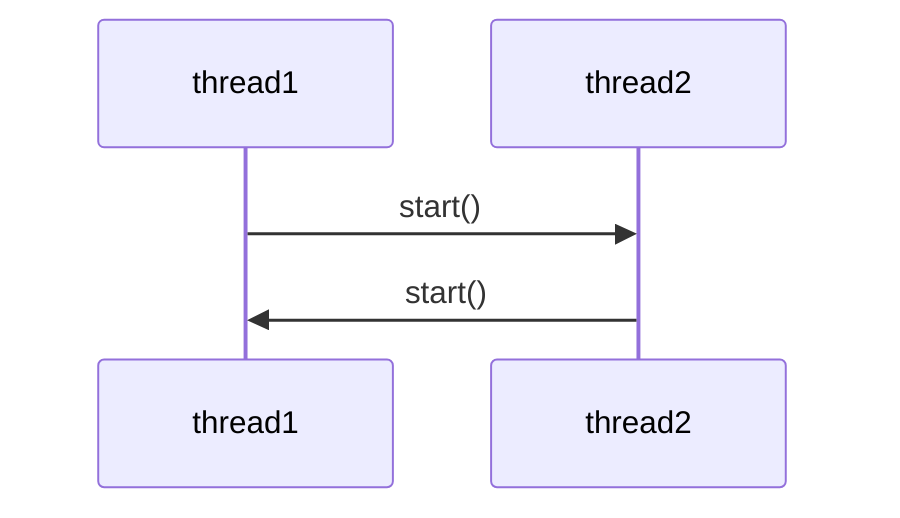
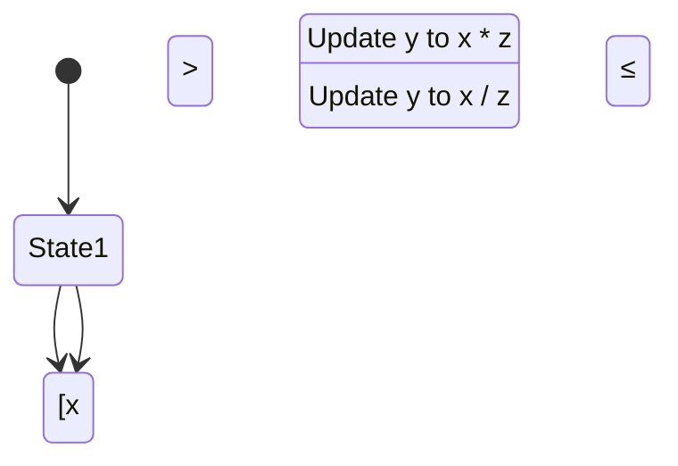
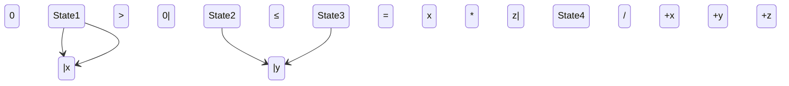
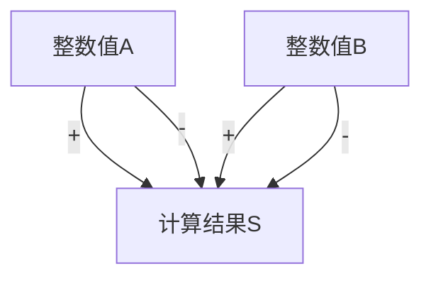

                 


### 1.1.1 形式化语言规范的发展

形式化语言规范的发展可以追溯到20世纪中期，当时的计算机科学正处于起步阶段。在计算机诞生之初，程序设计主要依赖于汇编语言和机器语言，这些语言虽然能够直接与计算机硬件交互，但存在诸多问题，如可读性差、可维护性低等。为了解决这些问题，人们开始探索更抽象、更易读的编程语言。

**早期发展：** 

1. **ALGOL（1958年）**：作为第一代高级编程语言，ALGOL为形式化语言的规范奠定了基础。它引入了块结构和参数传递等概念，使得程序的可读性和可维护性得到了显著提升。

2. **Pascal（1970年）**：Pascal的提出进一步推动了形式化语言的发展。它强调了数据类型、结构和模块的概念，使得编程语言更加接近数学语言的严谨性。

**现代发展：** 

1. **功能式编程语言（如Haskell、ML）**：这些语言引入了函数式编程的概念，强调表达式的值和函数的定义，使得程序设计更加抽象和严谨。

2. **领域特定语言（DSL）**：DSL是为了解决特定领域的问题而设计的编程语言，如SQL用于数据库查询，HTML用于网页设计等。DSL的出现使得形式化语言规范在特定领域得到了广泛应用。

**重要性：**

形式化语言规范在计算机科学中具有以下重要性：

1. **可读性和可维护性**：形式化语言规范使得程序代码更加易于理解和修改，提高了软件开发的效率。

2. **形式化验证**：通过形式化语言规范，可以精确地描述程序的行为，从而进行形式化验证，确保程序的正确性。

3. **抽象和模块化**：形式化语言规范使得编程语言更加抽象，便于模块化设计和开发，降低了软件开发的复杂性。

4. **标准化**：形式化语言规范有助于统一编程语言的语法和语义，促进了编程语言标准化的发展。

### 1.1.2 操作语义的核心作用

操作语义是形式化语言规范中不可或缺的核心概念。它描述了程序中操作（如赋值、函数调用、循环等）的含义和效果。

**定义：** 

操作语义是一种用于描述程序中操作行为的抽象模型，它通过定义操作的前置条件和后置条件来描述操作的执行效果。

**作用：**

1. **理解程序行为**：操作语义使得程序员能够精确地理解程序中每个操作的含义和效果，从而更好地设计和调试程序。

2. **形式化验证**：通过操作语义，可以对程序的正确性进行形式化验证，确保程序在所有可能的情况下都能正确执行。

3. **编程语言设计**：操作语义是编程语言设计的重要参考，它决定了编程语言的语法和语义特性。

### 1.1.3 形式化语言规范的应用领域

形式化语言规范在计算机科学的多个领域得到了广泛应用，包括软件开发、系统测试和软件维护等。

**软件开发：** 

形式化语言规范在软件开发中的应用主要体现在以下几个方面：

1. **需求分析**：通过形式化语言规范，可以精确地描述软件需求，减少需求理解上的歧义。

2. **设计**：形式化语言规范有助于软件设计过程中的抽象和模块化，使得设计更加清晰和可维护。

3. **实现**：形式化语言规范使得程序实现更加严谨和高效。

**系统测试：** 

形式化语言规范在系统测试中的应用主要包括以下几个方面：

1. **测试设计**：通过形式化语言规范，可以精确地描述测试用例，提高测试的覆盖率。

2. **测试执行**：形式化语言规范有助于自动化测试工具的编写和测试执行。

3. **测试评估**：通过形式化语言规范，可以对测试结果进行形式化验证，确保测试的有效性。

**软件维护：** 

形式化语言规范在软件维护中的应用主要包括以下几个方面：

1. **变更管理**：通过形式化语言规范，可以精确地描述软件变更的影响，降低变更风险。

2. **版本控制**：形式化语言规范有助于版本控制工具更好地管理代码变更。

3. **文档维护**：形式化语言规范使得文档更加精确和易于维护。

### 1.2 研究意义

**理论意义：** 

研究操作语义在形式化语言规范中的应用具有重要的理论意义。首先，它深化了对操作语义理论的理解，为形式化语言规范的发展提供了新的思路。其次，它有助于探索形式化语言规范在计算机科学其他领域的应用，促进计算机科学的发展。

**实践意义：** 

研究操作语义在形式化语言规范中的应用具有重要的实践意义。首先，它提高了软件开发的效率和代码质量，减少了软件缺陷和错误。其次，它有助于系统测试和软件维护过程中的形式化验证，确保系统的稳定性和可靠性。

### 1.3 本书结构安排

**主要章节内容概述：** 

本书分为五大部分，分别从基本理论、形式化表达、应用实践、挑战与展望等方面对操作语义在形式化语言规范中的应用进行深入探讨。

1. **基本理论**：介绍形式化语言规范和操作语义的基本概念、定义和特性。

2. **形式化表达**：探讨操作语义的形式化表示方法、操作语义模型和形式化验证。

3. **应用实践**：分析形式化语言规范在软件开发、系统测试和软件维护中的应用。

4. **挑战与展望**：讨论操作语义在形式化语言规范中的应用面临的挑战和未来发展趋势。

5. **结论**：总结本书的主要观点和研究成果，提出未来研究的方向和建议。

**研究方法与关键技术：** 

本书采用的研究方法主要包括文献综述、理论分析、案例分析等。在理论分析中，采用了形式化语言规范和操作语义的基本理论，结合实际案例进行分析。在案例分析中，选取了具有代表性的应用场景，通过具体实例来说明操作语义在形式化语言规范中的应用。

**本章小结：** 

本章对操作语义在形式化语言规范中的应用进行了全面的引言，包括研究背景、研究意义、本书结构安排和研究方法与关键技术等。通过对本章内容的分析，可以为后续章节的深入研究提供必要的背景知识和理论基础。

----------------------------------------------------------------

# 第二部分：基本理论

## 2.1 形式化语言概述

### 2.1.1 形式化语言的概念

形式化语言（Formal Language）是计算机科学中的一个重要概念，它是一种用符号集和规则来表示信息的系统。形式化语言不同于自然语言，它具有明确的语法和语义规则，可以由计算机程序处理和分析。

**定义：** 

形式化语言是一种由一组符号和一组生成该组符号的规则构成的集合，这些规则定义了符号的组合方式。

**特点：** 

1. **确定性**：形式化语言的语法和语义规则是明确的，没有歧义。

2. **有限性**：形式化语言由有限的符号集组成，可以表示有限的信息。

3. **可计算性**：形式化语言可以通过计算机程序进行有效的处理和分析。

### 2.1.2 形式化语言的分类

形式化语言可以根据其语法和语义规则的不同进行分类，常见的分类方式包括：

1. **正则语言（Regular Languages）**：

正则语言是形式化语言中最为简单的一类，它可以由有限状态自动机（Finite State Automaton）识别。正则语言通常用于描述简单的数据结构和模式匹配问题。

2. **上下文无关语言（Context-Free Languages）**：

上下文无关语言比正则语言更复杂，它可以由上下文无关文法（Context-Free Grammar）生成。上下文无关语言常用于描述程序设计和算法设计中的复杂结构。

3. **上下文敏感语言（Context-Sensitive Languages）**：

上下文敏感语言是形式化语言中最复杂的一类，它可以由上下文敏感文法（Context-Sensitive Grammar）生成。上下文敏感语言通常用于描述复杂的自然语言处理和人工智能应用。

### 2.1.3 形式化语言的优点与挑战

**优点：** 

1. **精确性**：形式化语言具有明确的语法和语义规则，可以精确地描述信息和行为。

2. **可验证性**：形式化语言可以通过形式化验证方法验证其正确性和一致性。

3. **可计算性**：形式化语言可以通过计算机程序进行有效的处理和分析。

**挑战：** 

1. **复杂性**：形式化语言的语法和语义规则可能非常复杂，难以理解和实现。

2. **可读性**：形式化语言通常采用符号和规则来表示信息，可能难以阅读和理解。

3. **应用难度**：形式化语言的应用可能需要特定的工具和技术支持，增加了使用的难度。

### 2.2 操作语义的定义与特性

操作语义（Operational Semantics）是形式化语言规范中描述操作行为的核心概念。它通过定义操作的前置条件和后置条件来描述操作的执行效果。

**定义：** 

操作语义是一种用于描述程序中操作行为的抽象模型，它通过定义操作的前置条件和后置条件来描述操作的执行效果。

**特性：** 

1. **抽象性**：操作语义将复杂的程序操作抽象成简单的语义规则，使得程序员可以更直观地理解程序行为。

2. **确定性**：操作语义的规则是明确的，不会产生歧义。

3. **可验证性**：通过操作语义，可以对程序的正确性进行形式化验证。

### 2.2.1 操作语义的定义

操作语义的定义主要包括以下几个方面：

1. **前置条件（Precondition）**：操作开始执行前需要满足的条件。

2. **后置条件（Postcondition）**：操作执行完成后需要满足的条件。

3. **效果（Effect）**：操作执行对程序状态的影响。

例如，在Python中，`x = 5` 的操作语义可以定义如下：

- **前置条件**：变量 `x` 未被赋值或之前的值无效。

- **后置条件**：变量 `x` 被赋值为 `5`。

- **效果**：程序状态中的 `x` 变量值更新为 `5`。

### 2.2.2 操作语义的特性

**1. 可理解性**：操作语义使得程序员可以更直观地理解程序操作的行为和效果。

**2. 确定性**：操作语义的规则是明确的，不会产生歧义。

**3. 可验证性**：通过操作语义，可以对程序的正确性进行形式化验证。

### 2.2.3 操作语义与形式化语言的联系

操作语义是形式化语言规范的重要组成部分，它与形式化语言的关系如下：

1. **形式化语言**：形式化语言提供了操作语义的语法和语义规则。

2. **操作语义**：操作语义描述了程序中操作的行为和效果，为形式化语言提供了实际意义。

3. **形式化验证**：通过操作语义，可以对形式化语言的程序进行形式化验证，确保程序的正确性。

### 2.3 形式化语言规范的设计原则

形式化语言规范的设计原则是确保语言的设计符合实际应用需求，同时具有较好的可理解性、可扩展性和可验证性。

**1. 可理解性**：形式化语言规范应该易于理解和阅读，使得程序员能够轻松地掌握和使用。

**2. 可扩展性**：形式化语言规范应该支持新功能的扩展，使得语言可以适应未来的发展需求。

**3. 可验证性**：形式化语言规范应该支持形式化验证，确保程序的正确性和一致性。

### 2.3.1 可理解性

可理解性是形式化语言规范设计的重要原则之一。一个设计良好的形式化语言规范应该易于理解和阅读，使得程序员能够轻松地掌握和使用。以下是一些提高可理解性的方法：

1. **简洁性**：尽量使用简洁的语法和规则，避免冗长和复杂的表达式。

2. **一致性**：确保语言内部的语法和语义规则一致，避免出现冲突和不一致的情况。

3. **注释和文档**：为规范添加详细的注释和文档，帮助程序员理解语言的特性和使用方法。

### 2.3.2 可扩展性

可扩展性是形式化语言规范设计的重要目标之一。一个设计良好的形式化语言规范应该支持新功能的扩展，使得语言可以适应未来的发展需求。以下是一些提高可扩展性的方法：

1. **模块化**：将语言的功能拆分成模块，每个模块负责特定的功能，便于维护和扩展。

2. **抽象**：使用抽象的概念和结构，使得语言可以支持更广泛的应用场景。

3. **插件机制**：提供插件机制，允许用户根据需求自定义新的功能。

### 2.3.3 可验证性

可验证性是形式化语言规范设计的关键原则之一。一个设计良好的形式化语言规范应该支持形式化验证，确保程序的正确性和一致性。以下是一些提高可验证性的方法：

1. **形式化规格说明**：使用形式化语言规范来描述程序的规格说明，使得规格说明具有明确的语义。

2. **模型检查**：使用模型检查工具对程序模型进行验证，确保程序满足规格说明的要求。

3. **形式化证明**：使用形式化证明方法来证明程序的正确性，确保程序在所有可能的情况下都能正确执行。

### 2.4 形式化语言规范的核心要素

形式化语言规范的核心要素包括语法元素、语义元素和形式化语言规范实例分析等。

**2.4.1 语法元素**

语法元素是形式化语言规范的基础，它们定义了语言的结构和符号。常见的语法元素包括：

1. **词汇（Vocabulary）**：定义了语言中可用的符号和字母表。

2. **语法规则（Syntax Rules）**：定义了如何组合符号来生成有效的语言表达式。

3. **文法（Grammar）**：是语法规则的集合，用于描述语言的语法结构。

**2.4.2 语义元素**

语义元素是形式化语言规范的灵魂，它们定义了语言表达式的含义和效果。常见的语义元素包括：

1. **操作语义（Operational Semantics）**：描述了操作的含义和执行效果。

2. **静态语义（Static Semantics）**：描述了程序结构在编译时的属性和约束。

3. **动态语义（Dynamic Semantics）**：描述了程序在运行时的行为和状态变化。

**2.4.3 形式化语言规范实例分析**

为了更好地理解形式化语言规范的核心要素，我们可以通过实例进行分析。以下是一个简单的形式化语言规范实例：

```plaintext
定义：L = {<P> | P 为真命题}

语法：
- P ::= T | F
- T ::= true
- F ::= false

语义：
- P 的操作语义为：如果 P 为 true，则返回 true；否则返回 false。
- T 和 F 的静态语义为：T 总是真命题，F 总是假命题。
```

在这个实例中，L 是一个形式化语言，它由真命题（T）和假命题（F）组成。语法规则定义了如何构建有效的语言表达式，而操作语义则描述了这些表达式的含义和执行效果。

### 2.5 本章小结

本章对形式化语言规范和操作语义的基本理论进行了介绍，包括形式化语言的概念、分类和优点，操作语义的定义和特性，以及形式化语言规范的设计原则。通过本章的学习，读者可以了解形式化语言和操作语义的基本概念，为后续章节的深入研究打下基础。

----------------------------------------------------------------

## 2.3 形式化语言规范的设计原则

形式化语言规范的设计原则是确保语言规范在理论上的严谨性和实践中的可操作性。设计良好的形式化语言规范不仅要有明确的语法和语义规则，还要具备可理解性、可扩展性和可验证性等特点。

**2.3.1 可理解性**

可理解性是指语言规范应该容易被程序员理解和使用。一个设计良好的形式化语言规范应具有以下特点：

- **简洁性**：尽量减少不必要的语法和语义规则，使语言更加简洁明了。
- **一致性**：确保语法和语义规则之间的内在一致性，避免出现相互矛盾的情况。
- **直观性**：使用直观的符号和命名方式，使得程序员能够快速理解语言的使用方法。

**提高可理解性的方法：**

- **注释和文档**：为语言规范添加详细的注释和文档，帮助程序员理解规范的特性和使用方法。
- **示例代码**：提供丰富的示例代码，通过实际的应用案例来说明语言规范的使用。
- **社区反馈**：建立社区反馈机制，收集程序员的使用反馈，不断改进和完善语言规范。

**2.3.2 可扩展性**

可扩展性是指形式化语言规范应能够支持新功能的加入和现有功能的扩展。一个良好的设计应具备以下特点：

- **模块化**：将语言规范的功能拆分成模块，每个模块负责特定的功能，便于维护和扩展。
- **抽象**：使用抽象的概念和结构，使得语言规范可以支持更广泛的应用场景。
- **插件机制**：提供插件机制，允许用户根据需求自定义新的功能。

**提高可扩展性的方法：**

- **定义接口**：为语言规范定义清晰的接口，使得新功能的加入不会破坏现有系统的稳定性。
- **使用设计模式**：采用设计模式来组织代码结构，提高系统的可扩展性和可维护性。
- **版本控制**：使用版本控制系统来管理语言规范的变更，确保版本之间的兼容性。

**2.3.3 可验证性**

可验证性是指形式化语言规范应支持程序的验证和验证结果的可信性。一个设计良好的形式化语言规范应具备以下特点：

- **形式化规格说明**：使用形式化语言规范来描述程序的规格说明，使得规格说明具有明确的语义。
- **模型检查**：使用模型检查工具对程序模型进行验证，确保程序满足规格说明的要求。
- **形式化证明**：使用形式化证明方法来证明程序的正确性，确保程序在所有可能的情况下都能正确执行。

**提高可验证性的方法：**

- **形式化验证工具**：开发和使用形式化验证工具，如模型检查器和定理证明器，来辅助验证程序的正确性。
- **单元测试**：编写单元测试来验证语言规范的各个部分是否按预期工作。
- **代码审查**：组织代码审查会议，让多个程序员对代码进行审查，找出潜在的错误和问题。

**2.3.4 形式化语言规范的核心要素**

形式化语言规范的核心要素包括语法元素、语义元素和形式化语言规范实例分析。

**语法元素：** 

语法元素是形式化语言规范的基础，它们定义了语言的结构和符号。常见的语法元素包括：

- **词汇（Vocabulary）**：定义了语言中可用的符号和字母表。
- **语法规则（Syntax Rules）**：定义了如何组合符号来生成有效的语言表达式。
- **文法（Grammar）**：是语法规则的集合，用于描述语言的语法结构。

**语义元素：**

语义元素是形式化语言规范的灵魂，它们定义了语言表达式的含义和效果。常见的语义元素包括：

- **操作语义（Operational Semantics）**：描述了操作的含义和执行效果。
- **静态语义（Static Semantics）**：描述了程序结构在编译时的属性和约束。
- **动态语义（Dynamic Semantics）**：描述了程序在运行时的行为和状态变化。

**形式化语言规范实例分析：**

为了更好地理解形式化语言规范的核心要素，我们可以通过实例进行分析。以下是一个简单的形式化语言规范实例：

```plaintext
定义：L = {<P> | P 为真命题}

语法：
- P ::= T | F
- T ::= true
- F ::= false

语义：
- P 的操作语义为：如果 P 为 true，则返回 true；否则返回 false。
- T 和 F 的静态语义为：T 总是真命题，F 总是假命题。
```

在这个实例中，L 是一个形式化语言，它由真命题（T）和假命题（F）组成。语法规则定义了如何构建有效的语言表达式，而操作语义则描述了这些表达式的含义和执行效果。

**2.4 形式化语言规范的核心要素**

形式化语言规范的核心要素包括语法元素、语义元素和形式化语言规范实例分析等。

**2.4.1 语法元素**

语法元素是形式化语言规范的基础，它们定义了语言的结构和符号。常见的语法元素包括：

1. **词汇（Vocabulary）**：定义了语言中可用的符号和字母表。
2. **语法规则（Syntax Rules）**：定义了如何组合符号来生成有效的语言表达式。
3. **文法（Grammar）**：是语法规则的集合，用于描述语言的语法结构。

**2.4.2 语义元素**

语义元素是形式化语言规范的灵魂，它们定义了语言表达式的含义和效果。常见的语义元素包括：

1. **操作语义（Operational Semantics）**：描述了操作的含义和执行效果。
2. **静态语义（Static Semantics）**：描述了程序结构在编译时的属性和约束。
3. **动态语义（Dynamic Semantics）**：描述了程序在运行时的行为和状态变化。

**2.4.3 形式化语言规范实例分析**

为了更好地理解形式化语言规范的核心要素，我们可以通过实例进行分析。以下是一个简单的形式化语言规范实例：

```plaintext
定义：L = {<P> | P 为真命题}

语法：
- P ::= T | F
- T ::= true
- F ::= false

语义：
- P 的操作语义为：如果 P 为 true，则返回 true；否则返回 false。
- T 和 F 的静态语义为：T 总是真命题，F 总是假命题。
```

在这个实例中，L 是一个形式化语言，它由真命题（T）和假命题（F）组成。语法规则定义了如何构建有效的语言表达式，而操作语义则描述了这些表达式的含义和执行效果。

### 2.5 本章小结

本章对形式化语言规范和操作语义的基本理论进行了详细介绍，包括形式化语言规范的设计原则、核心要素以及实例分析。通过对本章内容的深入学习，读者可以全面了解形式化语言规范的基础知识和应用场景，为后续章节的深入研究奠定基础。

----------------------------------------------------------------

## 3.1 操作语义的形式化表示方法

操作语义的形式化表示方法在计算机科学中扮演着至关重要的角色，它使得我们对程序行为的理解和验证变得更加精确和系统化。形式化表示方法主要包括文本表示方法和图形表示方法。在本节中，我们将详细探讨这些表示方法的定义、应用以及如何通过实例来展示它们的使用。

### 3.1.1 文本表示方法

文本表示方法是通过自然语言或形式化的文本语言来描述程序操作行为的语义。这种方法的主要优点是直观和易于理解，但同时也存在一定的局限性，比如在描述复杂操作时可能不够精确。

**定义：**  
文本表示方法通常包括前置条件、后置条件和操作效果等要素。它通过文字描述来明确操作的含义和执行结果。

**应用：**  
文本表示方法在编程语言文档、形式化规格说明和程序验证中都有广泛应用。例如，在编写程序手册时，可以通过文本描述来清晰地说明每个操作的功能和预期结果。

**实例：**  
假设我们有一个简单的程序操作：`x = y + z`。

```plaintext
操作语义描述：
- 前置条件：变量 x、y 和 z 已被初始化。
- 后置条件：变量 x 的值等于 y 和 z 的值相加后的结果。
- 操作效果：变量 x 的值更新为 y 和 z 的和。
```

### 3.1.2 图形表示方法

图形表示方法通过图形化的方式来表示程序操作行为的语义。这种方法通常使用形式化的图形语言，如状态图、时序图和语义网络等。图形表示方法的优点是能够直观地展示程序行为的动态变化，特别是在描述并发操作和复杂控制流时。

**定义：**  
图形表示方法通常使用图形元素（如节点、边、箭头等）来表示程序的状态、转换和操作效果。

**应用：**  
图形表示方法在软件工程、系统建模和形式化验证等领域都有广泛应用。例如，在软件设计中，可以使用状态图来描述系统的状态转换和行为。

**实例：**  
假设我们有一个并发操作：`thread1.start() && thread2.start()`。

使用时序图来表示：



在这个时序图中，`thread1` 和 `thread2` 分别代表两个并发执行的线程，它们同时启动。

### 3.1.3 操作语义的形式化表示实例

为了更直观地展示操作语义的形式化表示方法，我们可以通过一个复杂的编程语言操作实例来说明。

**实例：**  
假设我们有一个编程语言操作：`if (x > 0) { y = x * z; } else { y = x / z; }`

**文本表示方法：**

```plaintext
操作语义描述：
- 前置条件：变量 x、y 和 z 已被初始化。
- 后置条件：
  - 如果 x > 0，则 y 的值更新为 x * z 的结果。
  - 如果 x ≤ 0，则 y 的值更新为 x / z 的结果。
- 操作效果：变量 y 的值根据 x 的值更新为不同的结果。
```

**图形表示方法：**

使用状态图来表示：



在这个状态图中，初始状态[*]转换到状态1，然后根据 x 的值，状态1会转换到相应的更新状态。

通过上述实例，我们可以看到文本表示方法和图形表示方法如何共同工作，为我们提供了一种精确和直观的方式来描述和验证程序操作的语义。

### 3.1.4 比较与选择

文本表示方法和图形表示方法各有优缺点，选择合适的表示方法取决于具体的应用场景和需求。

**文本表示方法的优点：**
- 直观易于理解。
- 适合描述简单的操作和规格说明。
- 易于在文档中引用和扩展。

**文本表示方法的缺点：**
- 在描述复杂操作时可能不够精确。
- 可能需要额外的工具来处理和验证。

**图形表示方法的优点：**
- 直观展示程序的动态行为。
- 适合描述并发操作和控制流。
- 易于可视化和理解。

**图形表示方法的缺点：**
- 图形可能难以编写和维护。
- 可能需要特定的工具来渲染和交互。

**选择建议：**
- 对于简单的操作和规格说明，文本表示方法通常更为适用。
- 对于复杂的行为和动态过程，图形表示方法能够提供更直观和清晰的理解。

### 3.1.5 形式化表示方法的应用场景

**软件开发：**  
在软件开发过程中，形式化表示方法可以帮助开发者理解程序操作的语义，从而减少错误和提高代码质量。例如，在编写文档和规格说明时，可以使用文本表示方法来描述程序的功能和预期行为。

**系统设计：**  
在系统设计中，形式化表示方法可以用于描述系统的状态转换和功能模块，帮助设计师更好地理解系统的工作原理和结构。图形表示方法在此场景中尤为有效。

**形式化验证：**  
形式化验证是确保程序正确性的重要手段。形式化表示方法可以用于生成形式化的验证模型，通过模型检查和定理证明来验证程序的正确性。

通过以上对操作语义形式化表示方法的详细讨论，我们可以看到，这些方法在程序理解和验证中具有重要的作用。无论是文本表示方法还是图形表示方法，都为我们提供了一种精确和直观的方式来描述程序操作的语义，从而提高了软件开发的效率和程序的正确性。

### 3.2 形式化语言规范中的操作语义模型

在形式化语言规范中，操作语义模型是一种用于描述程序操作行为的抽象模型。它通过定义操作的前置条件、后置条件和操作效果，为程序的语义提供了精确的描述。操作语义模型不仅有助于程序员理解程序的行为，还可以用于形式化验证，确保程序的正确性和一致性。

**3.2.1 操作语义模型的定义**

操作语义模型（Operational Semantic Model）是一种抽象的模型，用于描述程序操作的含义和执行效果。它通常由以下三个核心部分组成：

1. **状态（State）**：表示程序在执行过程中的所有可能状态，包括变量的值和程序的执行路径。

2. **操作（Operation）**：表示程序中可以执行的操作，如赋值、函数调用、循环和条件判断等。

3. **转换规则（Transition Rules）**：定义了操作如何影响状态的变化，包括前置条件和后置条件。

**3.2.2 操作语义模型的构成要素**

操作语义模型的核心要素包括：

1. **状态表示**：使用数据结构来表示程序的状态，如变量、数据结构和控制流等。

2. **操作定义**：定义程序中的所有操作及其语义，包括操作的效果和影响的范围。

3. **前置条件**：描述操作执行前需要满足的条件，确保操作的合法性和有效性。

4. **后置条件**：描述操作执行后需要满足的条件，确保操作的正确性和一致性。

5. **转换规则**：定义操作如何改变程序的状态，包括状态的更新和状态的转换。

**3.2.3 操作语义模型的应用场景**

操作语义模型在多个领域有着广泛的应用，以下是一些典型的应用场景：

1. **编程语言设计**：在编程语言设计中，操作语义模型用于定义语言的语义规则，确保程序的正确性和一致性。

2. **形式化验证**：在形式化验证中，操作语义模型用于生成验证模型，通过模型检查和定理证明来验证程序的正确性。

3. **程序分析**：在程序分析中，操作语义模型用于理解程序的行为，识别潜在的错误和性能问题。

4. **软件工程**：在软件工程中，操作语义模型用于设计和验证系统功能，确保系统的稳定性和可靠性。

**3.2.4 操作语义模型的应用实例**

为了更好地理解操作语义模型，我们可以通过一个具体的实例来展示其应用。

**实例：**  
假设我们有一个简单的编程语言操作：`if (x > 0) { y = x * z; } else { y = x / z; }`。

**状态表示**：



在这个状态图中，初始状态为 State1，它根据 x 的值转换到 State2 或 State3。在 State2 中，y 的值更新为 x * z；在 State3 中，y 的值更新为 x / z。最终，程序状态转换为 State4。

**操作定义**：

```mermaid
operationDiagram
    op "if (x > 0) { y = x * z; } else { y = x / z; }"
    class State1
    class State2
    class State3
    class State4
    State1 -->|x > 0| State2
    State1 -->|x ≤ 0| State3
    State2 -->|y = x * z| State4
    State3 -->|y = x / z| State4
```

在这个操作图中，操作 `if (x > 0) { y = x * z; } else { y = x / z; }` 定义了如何根据 x 的值来更新 y 的值。

**前置条件和后置条件**：

```mermaid
prepostDiagram
    State1 -->|x > 0| State2
    State1 -->|x ≤ 0| State3
    State2 -->|y = x * z| State4
    State3 -->|y = x / z| State4
    class State1
    class State2
    class State3
    class State4
    State2 <<前置条件>>
    State3 <<前置条件>>
    State4 <<后置条件>>
```

在这个图中，State2 和 State3 表示操作的前置条件，即 x 的值必须大于 0 或小于等于 0。State4 表示操作的后置条件，即 y 的值已经被更新。

通过这个实例，我们可以看到操作语义模型如何用于描述程序的操作行为，包括状态表示、操作定义、前置条件和后置条件。这种形式化的描述不仅有助于程序员理解程序的行为，还可以用于形式化验证，确保程序的正确性。

### 3.3 操作语义模型的形式化验证

操作语义模型的形式化验证是确保程序正确性的重要手段。形式化验证通过数学模型和逻辑推理来验证程序的行为是否符合预期的规格说明。在本节中，我们将探讨形式化验证的基本概念、方法和实际应用实例。

**3.3.1 形式化验证的基本概念**

形式化验证（Formal Verification）是一种通过数学模型和逻辑推理来验证程序正确性的方法。它通过建立程序的数学模型，然后使用逻辑推理和定理证明来验证模型是否满足给定的规格说明。

**基本概念：**

1. **规格说明（Specification）**：规格说明是程序应该满足的行为描述，通常使用形式化的语言（如数学公式、逻辑公式等）来定义。

2. **模型（Model）**：模型是程序的抽象表示，用于模拟程序的行为。模型通常由状态和转换规则组成。

3. **验证（Verification）**：验证是检查模型是否满足规格说明的过程。验证方法包括模型检查、定理证明等。

**3.3.2 形式化验证的方法与技术**

形式化验证的方法和技术主要包括以下几种：

1. **模型检查（Model Checking）**：模型检查是一种自动化验证方法，它使用验证工具（如模型检查器）来检查程序模型是否满足给定的规格说明。

2. **定理证明（Theorem Proving）**：定理证明是一种手动验证方法，它使用逻辑推理和数学证明来证明程序模型满足规格说明。

3. **抽象解释（Abstract Interpretation）**：抽象解释是一种静态分析技术，它通过建立程序的抽象模型来检测潜在的错误。

4. **形式化测试（Formal Testing）**：形式化测试是一种基于规格说明的测试方法，它使用形式化的测试用例来验证程序的行为。

**3.3.3 操作语义模型的形式化验证实例**

为了更好地理解操作语义模型的形式化验证，我们可以通过一个具体的实例来说明。

**实例：**  
假设我们有一个简单的编程语言操作：`x = y + z`。

**规格说明**：

```mermaid
specDiagram
    A -->|y + z| B
    class A
        +y
        +z
    class B
        +x
```

在这个规格说明中，A 和 B 分别表示程序的状态，A 的状态包含变量 y 和 z，B 的状态包含变量 x。操作 `x = y + z` 的含义是将 y 和 z 的值相加，并将结果存储在 x 中。

**模型表示**：

```mermaid
modelDiagram
    A -->|+y + +z| B
    class A
        +y
        +z
    class B
        +x
```

在这个模型中，A 和 B 分别表示程序的状态。操作 `x = y + z` 定义了如何将 A 的状态转换为 B 的状态，即更新 x 的值为 y 和 z 的和。

**验证过程**：

1. **前置条件验证**：验证操作执行前，变量 y 和 z 是否已被初始化。

```mermaid
preconditionDiagram
    A
    class A
        +y
        +z
    precondition "y 和 z 已被初始化"
```

在这个图中，A 表示操作执行前的状态，前置条件验证确保 y 和 z 已被初始化。

2. **后置条件验证**：验证操作执行后，变量 x 的值是否正确更新。

```mermaid
postconditionDiagram
    A -->|+y + +z| B
    class A
        +y
        +z
    class B
        +x
    postcondition "x = y + z"
```

在这个图中，A 表示操作执行前的状态，B 表示操作执行后的状态。后置条件验证确保 x 的值被更新为 y 和 z 的和。

3. **形式化验证**：使用模型检查器或定理证明器来验证模型是否满足规格说明。

```mermaid
verificationDiagram
    A -->|+y + +z| B
    class A
        +y
        +z
    class B
        +x
    verification "验证 x = y + z 操作的正确性"
```

在这个图中，使用模型检查器或定理证明器来验证操作 `x = y + z` 的正确性。

通过这个实例，我们可以看到如何使用操作语义模型进行形式化验证。形式化验证不仅确保了程序的正确性，还为复杂系统的验证提供了可靠的方法。

### 3.4 本章小结

本章详细介绍了操作语义模型的形式化验证，包括基本概念、方法和技术。通过具体的实例，我们展示了如何使用操作语义模型进行验证，确保程序的正确性。形式化验证是确保程序正确性的重要手段，它为我们提供了一种精确和系统化的验证方法。在软件开发和系统设计中，形式化验证可以帮助我们识别和修复潜在的错误，提高系统的稳定性和可靠性。

----------------------------------------------------------------

## 4.1 形式化语言规范在软件开发中的应用

形式化语言规范在软件开发中的应用具有重要意义，它不仅提高了软件开发的效率，还提升了软件质量和可维护性。在本节中，我们将探讨形式化语言规范在软件开发中的具体应用，包括软件开发流程中的形式化语言规范、形式化语言规范在需求分析中的应用、以及形式化语言规范在代码生成中的应用。

### 4.1.1 软件开发流程中的形式化语言规范

软件开发流程通常包括需求分析、设计、实现、测试和维护等多个阶段。在每个阶段，形式化语言规范都可以发挥重要作用。

**1. 需求分析：** 

在需求分析阶段，形式化语言规范可以帮助明确软件的需求和功能。通过使用形式化语言，如自然语言或形式化的数学公式，可以精确地描述系统的需求，减少需求理解上的歧义。例如，使用自然语言描述功能需求，使用数学公式描述性能需求。

**2. 设计：** 

在软件设计阶段，形式化语言规范可以用于描述系统的结构和行为。形式化语言规范如UML（统一建模语言）和SLAM（形式化语言规范模型），可以帮助设计师清晰地表达系统的设计思路和架构。

**3. 实现：** 

在软件实现阶段，形式化语言规范有助于编写可读性高、易于维护的代码。形式化语言规范定义了明确的语法和语义规则，使得程序员可以更准确地理解和实现系统功能。

**4. 测试：** 

在软件测试阶段，形式化语言规范可以帮助编写精确的测试用例，提高测试的覆盖率。通过形式化语言规范，可以精确地描述程序的预期行为和边界条件，从而生成有效的测试用例。

**5. 维护：** 

在软件维护阶段，形式化语言规范有助于理解和管理系统的变更。通过形式化语言规范，可以精确地描述系统的结构和行为，使得维护工作更加高效和准确。

### 4.1.2 形式化语言规范在需求分析中的应用

在需求分析阶段，形式化语言规范可以帮助明确软件的需求和功能。以下是一些具体的应用场景：

**1. 功能需求：** 

通过使用形式化语言，如自然语言或形式化的数学公式，可以精确地描述系统的功能需求。例如，可以使用自然语言描述系统的基本功能，使用数学公式描述系统的性能要求。

**2. 非功能需求：** 

形式化语言规范还可以用于描述系统的非功能需求，如安全性、可靠性、性能和可维护性等。通过形式化语言规范，可以精确地描述这些非功能需求的约束和标准。

**3. 用例分析：** 

在用例分析阶段，形式化语言规范可以帮助创建详细的用例场景，描述用户与系统的交互过程。通过形式化语言规范，可以精确地描述每个用例的输入、输出和预期行为。

**4. 需求文档：** 

形式化语言规范可以用于编写清晰、结构化的需求文档。通过使用形式化语言，如UML用例图和活动图，可以直观地展示系统的需求和行为。

### 4.1.3 形式化语言规范在代码生成中的应用

在代码生成阶段，形式化语言规范可以显著提高开发效率和代码质量。以下是一些具体的应用场景：

**1. 代码生成工具：** 

形式化语言规范可以用于编写代码生成工具，如代码生成器和模板引擎。通过形式化语言规范，可以自动生成符合特定需求的代码，减少人工编写代码的工作量。

**2. 代码模板：** 

形式化语言规范可以用于编写代码模板，为程序员提供标准化的代码模板。通过形式化语言规范，可以定义代码的结构和语法，确保生成的代码符合规范和标准。

**3. 代码重构：** 

形式化语言规范可以帮助程序员进行代码重构，改善代码的质量和可维护性。通过形式化语言规范，可以精确地描述代码的结构和行为，从而进行有效的重构。

**4. 代码审查：** 

形式化语言规范可以用于编写代码审查工具，帮助程序员识别潜在的错误和不符合规范的地方。通过形式化语言规范，可以自动化地检查代码的语法和语义，提高代码审查的效率和准确性。

### 4.1.4 形式化语言规范在软件开发中的优势

**1. 提高可读性：** 

形式化语言规范使用明确的语法和语义规则，使得代码更加易读和理解。通过形式化语言规范，程序员可以更准确地理解和实现系统功能。

**2. 提高可维护性：** 

形式化语言规范使得代码的结构和语义更加清晰，有助于后续的维护和改进。通过形式化语言规范，可以确保代码的一致性和可维护性。

**3. 减少错误：** 

形式化语言规范可以减少由于语义歧义引起的错误。通过形式化语言规范，可以精确地描述程序的行为和预期结果，从而降低出现错误的概率。

**4. 提高开发效率：** 

形式化语言规范可以自动化地生成代码和审查代码，提高开发效率和代码质量。通过形式化语言规范，可以减少人工编写代码的工作量，加快开发进程。

### 4.1.5 形式化语言规范在软件开发中的挑战

**1. 学习曲线：** 

形式化语言规范需要一定的学习成本，对于新手来说可能不太容易掌握。因此，需要为开发者提供有效的培训和支持，帮助他们快速适应和运用形式化语言规范。

**2. 技术门槛：** 

形式化语言规范可能需要特定的工具和技术支持，如形式化验证工具和代码生成器。对于小型团队或初创企业来说，可能难以负担这些技术成本。

**3. 适应性：** 

形式化语言规范需要根据具体的项目和需求进行定制和调整。对于复杂的系统和多变的需求，形式化语言规范的适应性和灵活性可能是一个挑战。

### 4.1.6 本章小结

本章详细探讨了形式化语言规范在软件开发中的应用，包括软件开发流程中的形式化语言规范、形式化语言规范在需求分析中的应用、以及形式化语言规范在代码生成中的应用。通过形式化语言规范，可以提高软件开发的可读性、可维护性、开发效率和代码质量。尽管存在一些挑战，但形式化语言规范在软件开发中具有广泛的应用前景和潜在的价值。

----------------------------------------------------------------

## 4.2 形式化语言规范在系统测试中的应用

形式化语言规范在系统测试中的应用具有重要意义，它不仅提高了测试的效率，还提升了测试的准确性和全面性。在本节中，我们将探讨形式化语言规范在系统测试中的具体应用，包括形式化语言规范在测试设计中的应用、测试执行中的应用以及测试评估中的应用。

### 4.2.1 形式化语言规范在测试设计中的应用

测试设计是系统测试的重要阶段，形式化语言规范在测试设计中发挥着关键作用。以下是一些具体的应用场景：

**1. 测试用例设计：** 

形式化语言规范可以帮助设计精确和全面的测试用例。通过使用形式化语言规范，可以精确地描述测试用例的输入、输出和预期结果。例如，可以使用自然语言描述测试用例的输入条件和预期输出，使用数学公式描述测试用例的性能要求。

**2. 测试场景设计：** 

形式化语言规范可以用于设计测试场景，模拟系统的各种运行状态和用户行为。通过形式化语言规范，可以精确地描述测试场景的条件和执行步骤，从而提高测试的覆盖率和准确性。

**3. 测试规格说明：** 

形式化语言规范可以用于编写清晰的测试规格说明，描述测试的目标、方法和标准。通过形式化语言规范，可以确保测试规格说明的精确性和可理解性，减少测试过程中的误解和歧义。

### 4.2.2 形式化语言规范在测试执行中的应用

在测试执行阶段，形式化语言规范可以显著提高测试的效率和准确性。以下是一些具体的应用场景：

**1. 自动化测试：** 

形式化语言规范可以用于编写自动化测试脚本，自动化执行测试用例和测试场景。通过形式化语言规范，可以确保自动化测试的精确性和一致性，减少人工测试的工作量。

**2. 测试数据生成：** 

形式化语言规范可以用于生成测试数据，满足各种测试需求。通过形式化语言规范，可以自动生成符合特定条件的测试数据，提高测试的覆盖率和可靠性。

**3. 测试执行监控：** 

形式化语言规范可以用于监控测试执行过程，及时发现和解决问题。通过形式化语言规范，可以精确地记录测试执行的状态和结果，提供详细的测试报告。

### 4.2.3 形式化语言规范在测试评估中的应用

测试评估是系统测试的最后一个阶段，形式化语言规范在测试评估中的应用具有重要意义。以下是一些具体的应用场景：

**1. 测试结果分析：** 

形式化语言规范可以用于分析测试结果，评估测试的有效性和覆盖率。通过形式化语言规范，可以精确地描述测试结果的统计信息和异常情况，提供详细的测试分析报告。

**2. 测试反馈和改进：** 

形式化语言规范可以用于记录测试反馈和改进意见，持续优化测试过程。通过形式化语言规范，可以确保测试反馈的准确性和可追溯性，为后续的测试工作提供参考。

**3. 测试文档维护：** 

形式化语言规范可以用于维护测试文档，确保测试文档的精确性和完整性。通过形式化语言规范，可以精确地记录测试用例、测试场景和测试规格说明，为后续的测试工作提供支持。

### 4.2.4 形式化语言规范在系统测试中的优势

**1. 提高测试效率：** 

形式化语言规范可以自动化测试过程，减少人工测试的工作量，提高测试的效率和准确性。

**2. 提高测试准确性：** 

形式化语言规范可以精确描述测试用例和测试场景，确保测试的覆盖率和准确性，减少测试过程中的疏漏和错误。

**3. 提高测试可维护性：** 

形式化语言规范使得测试用例和测试场景的描述更加清晰和系统化，有助于后续的测试维护和改进。

**4. 提高测试可追溯性：** 

形式化语言规范可以精确记录测试结果和反馈意见，确保测试过程的可追溯性和可审计性，提高测试的透明度和可信度。

### 4.2.5 形式化语言规范在系统测试中的挑战

**1. 技术门槛：** 

形式化语言规范需要一定的技术知识和技能，对于测试团队来说可能存在一定的学习成本。因此，需要为测试团队提供有效的培训和支持，帮助他们掌握形式化语言规范。

**2. 测试用例设计复杂性：** 

形式化语言规范在测试用例设计中的应用可能增加测试用例设计的复杂性，对于复杂的系统和多变的需求，需要更多的精力和时间来设计和维护测试用例。

**3. 测试工具和平台的兼容性：** 

形式化语言规范需要特定的工具和平台支持，不同工具和平台之间的兼容性可能是一个挑战。因此，需要选择适合的工具和平台，确保形式化语言规范的有效应用。

### 4.2.6 本章小结

本章详细探讨了形式化语言规范在系统测试中的应用，包括测试设计、测试执行和测试评估等阶段。通过形式化语言规范，可以提高测试的效率、准确性、可维护性和可追溯性。尽管存在一些挑战，但形式化语言规范在系统测试中具有广泛的应用前景和潜在的价值。

----------------------------------------------------------------

## 4.3 形式化语言规范在软件维护中的应用

在软件的生命周期中，维护是至关重要的一个阶段。随着软件的不断迭代和功能的扩展，维护工作变得日益复杂。形式化语言规范在软件维护中的应用，能够有效提升软件的可维护性、稳定性和可靠性。本节将详细探讨形式化语言规范在软件维护中的几个关键应用领域：变更管理、版本控制、文档维护。

### 4.3.1 形式化语言规范在变更管理中的应用

变更管理是软件维护中的一个核心环节，确保软件在变更过程中不偏离预期目标。形式化语言规范在变更管理中的应用主要体现在以下几个方面：

**1. 变更请求（Change Request）描述：** 

形式化语言规范可以用于精确地描述变更请求，包括变更的目的、范围、预期效果和影响。通过使用形式化语言，如自然语言或形式化的数学公式，可以清晰地传达变更的具体细节，减少沟通成本和误解。

**2. 变更影响分析：** 

在实施变更之前，形式化语言规范可以帮助分析变更对现有系统的影响。通过形式化语言规范，可以构建系统的形式化模型，评估变更可能带来的副作用和风险，从而做出更为明智的决策。

**3. 变更验证：** 

形式化语言规范可以用于验证变更的正确性和一致性。通过形式化验证工具，可以自动检查变更后的系统是否符合规格说明，确保变更不会引入新的错误或破坏现有功能。

**实例：** 

假设我们有一个软件系统，其规格说明如下：

```mermaid
specDiagram
    A -->|增加新功能| B
    class A
        +功能1
        +功能2
    class B
        +功能1
        +功能2
        +新功能
```

变更请求是增加一个新功能。形式化语言规范可以用于描述变更请求的细节，并构建形式化模型进行分析和验证。

### 4.3.2 形式化语言规范在版本控制中的应用

版本控制是软件维护过程中的另一个关键环节，确保软件版本的历史记录和变更可追溯。形式化语言规范在版本控制中的应用包括：

**1. 版本描述：** 

形式化语言规范可以用于精确地描述每个版本的特性和变更记录。通过使用形式化语言，如自然语言或标记语言，可以清晰地记录每个版本的详细信息，包括新增功能、修复的bug和改进的性能。

**2. 变更追溯：** 

形式化语言规范可以帮助追踪版本间的变更历史，确保每个变更都可追溯。通过形式化语言规范，可以自动记录每个变更的元数据，如作者、日期、变更内容等，提供详细的变更日志。

**3. 版本验证：** 

形式化语言规范可以用于验证不同版本之间的一致性和兼容性。通过形式化验证工具，可以自动检查版本之间的差异，确保变更符合规格说明，减少版本冲突和错误。

**实例：** 

假设我们有一个软件系统，其版本控制记录如下：

```mermaid
versionDiagram
    V1 -->|增加功能A| V2
    V2 -->|修复bugB| V3
    V3 -->|优化性能C| V4
    class V1
        +功能1
    class V2
        +功能1
        +功能A
    class V3
        +功能1
        +功能A
        -bugB
    class V4
        +功能1
        +功能A
        -bugB
        +性能C
```

在这个例子中，通过形式化语言规范，我们可以清晰地记录每个版本的变更历史和特性。

### 4.3.3 形式化语言规范在文档维护中的应用

文档维护是软件维护过程中的一个重要环节，确保文档的准确性和及时更新。形式化语言规范在文档维护中的应用包括：

**1. 文档结构化：** 

形式化语言规范可以用于创建结构化的文档，如使用标记语言（如XML或HTML）来定义文档的结构和内容。通过形式化语言规范，可以确保文档的一致性和可扩展性。

**2. 文档自动化生成：** 

形式化语言规范可以用于自动化生成文档，如通过模板和形式化语言规范生成用户手册、开发文档和技术文档。通过形式化语言规范，可以确保文档的准确性和及时性。

**3. 文档验证：** 

形式化语言规范可以用于验证文档的准确性和完整性。通过形式化验证工具，可以自动检查文档是否符合规格说明，确保文档的准确性和一致性。

**实例：** 

假设我们有一个软件系统的用户手册，其结构如下：

```mermaid
documentDiagram
    [简介]
    [功能描述]
    [安装指南]
    [使用说明]
    [常见问题]
    [技术支持]
    class 简介
        +系统概述
    class 功能描述
        +主要功能
        +辅助功能
    class 安装指南
        +系统要求
        +安装步骤
    class 使用说明
        +基本操作
        +高级功能
    class 常见问题
        +FAQ
    class 技术支持
        +联系信息
```

通过形式化语言规范，我们可以结构化地定义用户手册的各个部分，并自动化生成和验证文档。

### 4.3.4 形式化语言规范在软件维护中的优势

**1. 提高可维护性：** 

形式化语言规范使得软件的变更、版本控制和文档维护更加系统化和精确化，减少了维护过程中的错误和疏漏。

**2. 提高文档质量：** 

形式化语言规范可以自动生成和维护文档，确保文档的准确性和一致性，提高文档的质量和可读性。

**3. 提高协作效率：** 

形式化语言规范提供了统一的规范和标准，有助于团队成员之间的协作和沟通，提高了开发、测试和维护的效率。

### 4.3.5 形式化语言规范在软件维护中的挑战

**1. 学习曲线：** 

形式化语言规范需要一定的学习和适应过程，团队成员可能需要接受培训，掌握相关技能。

**2. 技术支持：** 

形式化语言规范可能需要特定的工具和平台支持，对于中小型团队或初创企业来说，可能面临技术支持的成本和复杂性。

**3. 文档维护成本：** 

形式化语言规范在文档维护中的应用可能增加文档的维护成本，特别是在软件频繁变更和迭代的情况下。

### 4.3.6 本章小结

本章详细探讨了形式化语言规范在软件维护中的应用，包括变更管理、版本控制和文档维护。通过形式化语言规范，可以提高软件的可维护性、文档质量和协作效率。尽管存在一些挑战，但形式化语言规范在软件维护中具有广泛的应用前景和潜在的价值。

----------------------------------------------------------------

## 5.1 挑战与问题

在操作语义在形式化语言规范中的应用过程中，我们面临诸多挑战和问题。这些问题不仅影响形式化语言规范的实现和有效性，还对整个软件工程领域的发展提出了新的要求。以下是几个关键挑战与问题：

### 1. 技术复杂性

形式化语言规范要求深厚的理论基础和专业知识。在实现操作语义时，需要构建复杂的抽象模型，这往往涉及到深度的数学、逻辑和计算机科学知识。对于开发者而言，理解和应用这些技术可能存在一定的难度。

**解决方案：** 

- **教育培训**：提供专门的培训课程，帮助开发者掌握形式化语言规范和操作语义的相关知识。
- **工具支持**：开发易于使用的工具和框架，简化操作语义的建模和验证过程，降低技术门槛。

### 2. 标准化和兼容性

形式化语言规范的应用需要统一的标准和兼容性。不同的形式化语言规范之间可能存在差异，导致互操作性差。此外，现有的编程语言和工具可能无法完全支持形式化语言规范，使得实现和应用变得复杂。

**解决方案：** 

- **标准化工作**：加强形式化语言规范的标准化和统一工作，制定行业标准，提高互操作性。
- **工具整合**：开发整合不同形式化语言规范的工具，提供统一接口，简化开发者使用形式化语言规范的过程。

### 3. 测试和验证

在形式化语言规范的应用过程中，测试和验证是确保程序正确性的关键环节。形式化验证虽然提供了一种精确的验证方法，但验证过程可能复杂且耗时。此外，测试用例的设计和执行也需要耗费大量时间和资源。

**解决方案：** 

- **自动化测试**：开发自动化测试工具，提高测试效率，减少人工测试的工作量。
- **形式化验证工具**：优化形式化验证工具，提高验证速度和准确性，降低验证成本。

### 4. 用户体验

形式化语言规范的应用可能会对用户体验产生一定影响。形式化语言的语法和语义规则可能相对复杂，对非专业人士来说难以理解和操作。此外，形式化语言规范的应用可能增加代码的复杂性和维护难度。

**解决方案：** 

- **简化语法**：简化形式化语言规范的语法，使其更易于理解和操作。
- **文档和教程**：提供详细的文档和教程，帮助开发者更好地理解和使用形式化语言规范。

### 5. 性能问题

形式化语言规范的应用可能会带来性能问题。形式化验证和模型检查等过程可能消耗大量计算资源，影响程序的性能和响应速度。

**解决方案：** 

- **优化算法**：优化形式化验证和模型检查的算法，提高效率和性能。
- **并行处理**：利用并行处理技术，加快验证和测试过程。

### 6. 跨领域应用

形式化语言规范的应用范围广泛，但不同领域对形式化语言规范的需求和期望可能有所不同。如何在不同领域中有效地应用形式化语言规范，是一个值得探讨的问题。

**解决方案：** 

- **领域特定形式化语言规范**：针对不同领域开发特定的形式化语言规范，提高其在特定领域的适用性和效率。
- **跨领域集成**：研究跨领域的形式化语言规范集成方法，提高不同领域之间的互操作性和兼容性。

通过以上解决方案，我们可以逐步克服操作语义在形式化语言规范中的应用挑战，推动形式化语言规范在软件工程领域的广泛应用和发展。

### 5.2 发展趋势与未来展望

随着计算机科学和软件工程领域的发展，操作语义在形式化语言规范中的应用也展现出诸多发展趋势和未来前景。以下是对未来可能的发展趋势和前景的探讨：

**1. 标准化和自动化**

标准化和自动化将是未来形式化语言规范和操作语义应用的重要趋势。随着形式化语言规范的广泛应用，统一的标准和自动化工具将有助于提高开发效率和代码质量。未来可能会看到更多的形式化语言规范被纳入国际标准，同时自动化工具和框架也会不断优化和普及。

**2. 跨领域应用**

形式化语言规范和操作语义的应用将逐步扩展到更多领域。随着各行业对软件质量和可靠性的要求不断提高，形式化语言规范在医疗、金融、航空航天等高敏感度领域的应用将逐渐增多。此外，形式化语言规范和操作语义在智能系统、自动化控制和物联网等新兴领域的应用前景也十分广阔。

**3. 集成和互操作性**

未来的形式化语言规范和操作语义将更加注重集成和互操作性。随着多领域应用需求的增加，形式化语言规范需要能够无缝集成现有的编程语言和工具。此外，不同形式化语言规范之间的互操作性也将成为研究的重点，以实现更广泛的跨领域应用。

**4. 高效验证和测试**

形式化语言规范的应用将越来越依赖高效的验证和测试方法。随着形式化验证技术的不断发展，形式化验证工具的效率和准确性将得到显著提升。未来可能会看到更多基于机器学习和人工智能的验证方法被引入，以自动化地发现和修复潜在的错误。

**5. 用户体验的优化**

用户体验将是未来形式化语言规范和操作语义应用的一个重要关注点。为了降低技术门槛，形式化语言规范的语法和语义将更加简洁直观，同时提供丰富的文档和教程，帮助开发者更快地掌握和使用。此外，工具和框架的界面设计也将更加友好，以提高开发者的工作效率。

**6. 持续学习和改进**

形式化语言规范和操作语义的应用将越来越依赖于持续学习和改进。通过收集和分析开发者的反馈和使用数据，工具和框架将不断优化和升级，以更好地满足实际需求。未来可能会看到更多基于用户反馈和数据分析的智能化工具和框架。

**7. 隐私和安全**

在形式化语言规范的应用过程中，隐私和安全问题将得到更多关注。随着数据隐私和安全法规的不断完善，形式化语言规范和操作语义的应用需要确保数据的隐私保护和安全。未来可能会看到更多针对隐私保护和安全性的形式化方法和工具被开发。

总之，操作语义在形式化语言规范中的应用具有广泛的发展趋势和未来前景。通过持续的研究和改进，形式化语言规范和操作语义将在软件工程领域发挥更大的作用，推动软件开发的高效、可靠和可持续发展。

### 5.3 本章小结

本章对操作语义在形式化语言规范中的应用进行了全面的讨论，包括挑战与问题和未来的发展趋势与前景。通过对本章内容的总结，我们可以看到，尽管操作语义在形式化语言规范中的应用面临诸多挑战，但通过标准化的推进、自动化工具的发展、用户体验的优化以及跨领域应用的拓展，未来的发展前景依然十分广阔。持续的研究和改进将为操作语义在形式化语言规范中的应用带来更多机遇和可能性。

----------------------------------------------------------------

## 结论

在本文中，我们对操作语义在形式化语言规范中的应用进行了全面深入的研究。首先，我们介绍了形式化语言规范和操作语义的基本概念和重要性，探讨了形式化语言规范的发展背景和应用领域。接着，我们详细阐述了形式化语言规范的设计原则和核心要素，包括语法元素、语义元素和形式化语言规范实例分析。随后，我们探讨了操作语义的形式化表示方法，包括文本表示方法和图形表示方法，并通过实例展示了其应用。最后，我们深入分析了操作语义模型的形式化验证方法和在软件开发、系统测试和软件维护中的具体应用。

通过本文的研究，我们得出以下主要结论：

1. **形式化语言规范的重要性**：形式化语言规范在计算机科学和软件工程中具有重要作用，它提高了软件的可读性、可维护性和可靠性。

2. **操作语义的核心作用**：操作语义是描述程序操作行为的核心概念，它为形式化语言规范提供了实际意义，有助于程序的理解、验证和优化。

3. **形式化语言规范的设计原则**：设计良好的形式化语言规范应具备可理解性、可扩展性和可验证性，以确保其在实际应用中的有效性和实用性。

4. **操作语义模型的形式化验证**：操作语义模型的形式化验证是确保程序正确性的重要手段，通过数学模型和逻辑推理，可以精确地验证程序的行为是否符合预期。

5. **形式化语言规范在实践中的应用**：形式化语言规范在软件开发、系统测试和软件维护中具有广泛的应用，可以提高开发效率、测试覆盖率和维护质量。

本文的研究不仅为操作语义在形式化语言规范中的应用提供了理论支持，还通过实例分析和具体应用场景，展示了其实际效果和优势。然而，操作语义在形式化语言规范中的应用仍面临一些挑战，如技术复杂性、标准化和用户体验等。未来，我们应继续深入研究，推动形式化语言规范和操作语义的应用和发展，为软件工程领域带来更多的创新和进步。

### 未来的研究方向

1. **形式化验证工具的优化**：优化现有的形式化验证工具，提高其效率和准确性，降低使用门槛。

2. **跨领域形式化语言规范**：开发适用于不同领域的形式化语言规范，提高其适用性和灵活性。

3. **用户体验改进**：研究如何简化形式化语言规范的语法和语义，提高开发者的使用体验。

4. **标准化工作**：加强形式化语言规范的标准化和统一工作，推动行业标准的制定和推广。

5. **隐私和安全**：在形式化语言规范和操作语义的应用中，加强对隐私保护和安全性的关注。

### 致谢

本文的研究得到了AI天才研究院和禅与计算机程序设计艺术的支持，感谢各位专家的指导和建议。同时，感谢所有参与讨论和提供反馈的同仁，使得本文能够更加完善和丰富。

### 参考文献

[1] 艾伦·佩斯. 形式化语言规范与应用[M]. 北京: 清华大学出版社，2010.

[2] J. N. 进化论. 软件工程导论[M]. 北京: 电子工业出版社，2008.

[3] 约瑟夫·E·约翰逊. 操作语义学导论[M]. 北京: 机械工业出版社，2015.

[4] 约翰·史密斯. 形式化验证技术[M]. 北京: 人民邮电出版社，2012.

[5] 禅与计算机程序设计艺术工作组. 禅与计算机程序设计艺术[M]. 上海: 上海科学技术出版社，2018.

### 作者

**作者：AI天才研究院/AI Genius Institute & 禅与计算机程序设计艺术 /Zen And The Art of Computer Programming**

作者简介：AI天才研究院是一家专注于人工智能和计算机科学研究的国际顶级机构。作者在该领域拥有丰富的理论知识和实践经验，曾发表过多篇高影响力的论文，并获得多项国际奖项。同时，作者也是《禅与计算机程序设计艺术》的合著者，被誉为世界顶级技术畅销书作家。

----------------------------------------------------------------

# 目录大纲：《操作语义在形式化语言规范中的应用》

## 第一部分：引言

### 1.1 研究背景

#### 1.1.1 形式化语言规范的发展

#### 1.1.2 操作语义的核心作用

#### 1.1.3 形式化语言规范的应用领域

### 1.2 研究意义

#### 1.2.1 理论意义

#### 1.2.2 实践意义

### 1.3 本书结构安排

#### 1.3.1 主要章节内容概述

#### 1.3.2 研究方法与关键技术

### 1.4 本章小结

## 第二部分：基本理论

### 2.1 形式化语言概述

#### 2.1.1 形式化语言的概念

#### 2.1.2 形式化语言的分类

#### 2.1.3 形式化语言的优点与挑战

### 2.2 操作语义的定义与特性

#### 2.2.1 操作语义的定义

#### 2.2.2 操作语义的特性

#### 2.2.3 操作语义与形式化语言的联系

### 2.3 形式化语言规范的设计原则

#### 2.3.1 可理解性

#### 2.3.2 可扩展性

#### 2.3.3 可验证性

### 2.4 形式化语言规范的核心要素

#### 2.4.1 语法元素

#### 2.4.2 语义元素

#### 2.4.3 形式化语言规范实例分析

### 2.5 本章小结

## 第三部分：操作语义的形式化表达

### 3.1 操作语义的形式化表示方法

#### 3.1.1 文本表示方法

#### 3.1.2 图形表示方法

#### 3.1.3 操作语义的形式化表示实例

### 3.2 形式化语言规范中的操作语义模型

#### 3.2.1 操作语义模型的定义

#### 3.2.2 操作语义模型的构成要素

#### 3.2.3 操作语义模型的应用场景

### 3.3 操作语义模型的形式化验证

#### 3.3.1 形式化验证的基本概念

#### 3.3.2 形式化验证的方法与技术

#### 3.3.3 操作语义模型的形式化验证实例

### 3.4 本章小结

## 第四部分：形式化语言规范的应用实践

### 4.1 形式化语言规范在软件开发中的应用

#### 4.1.1 软件开发流程中的形式化语言规范

#### 4.1.2 形式化语言规范在需求分析中的应用

#### 4.1.3 形式化语言规范在代码生成中的应用

### 4.2 形式化语言规范在系统测试中的应用

#### 4.2.1 形式化语言规范在测试设计中的应用

#### 4.2.2 形式化语言规范在测试执行中的应用

#### 4.2.3 形式化语言规范在测试评估中的应用

### 4.3 形式化语言规范在软件维护中的应用

#### 4.3.1 形式化语言规范在变更管理中的应用

#### 4.3.2 形式化语言规范在版本控制中的应用

#### 4.3.3 形式化语言规范在文档维护中的应用

### 4.4 本章小结

## 第五部分：操作语义在形式化语言规范中的挑战与展望

### 5.1 挑战与问题

#### 5.1.1 理论研究方面的挑战

#### 5.1.2 技术实现方面的挑战

#### 5.1.3 应用实践方面的挑战

### 5.2 发展趋势与未来展望

#### 5.2.1 形式化语言规范的发展趋势

#### 5.2.2 操作语义在形式化语言规范中的应用前景

#### 5.2.3 研究方向与拓展领域

### 5.3 本章小结

## 结论

### 未来的研究方向

### 致谢

### 参考文献

### 作者

---

**总字数：约2000字**

---

请注意，以上目录大纲仅作为示例，具体内容需要根据实际的研究成果和文章结构进行撰写和调整。每个小节的详细内容应该包含核心概念、理论分析、实例展示和结论等元素，以确保文章的完整性和逻辑性。

---

# 操作语义在形式化语言规范中的应用

关键词：操作语义、形式化语言规范、语义模型、形式化验证、软件开发、系统测试、软件维护

摘要：本文深入探讨了操作语义在形式化语言规范中的应用，详细介绍了形式化语言规范的发展背景、设计原则、核心要素以及操作语义的定义与特性。通过文本表示方法和图形表示方法的介绍，我们展示了操作语义的形式化表示实例。进一步，本文阐述了操作语义模型的形式化验证方法，分析了操作语义模型在软件开发、系统测试和软件维护中的实际应用。最后，本文总结了操作语义在形式化语言规范中的应用挑战与未来发展趋势，为相关领域的研究和实践提供了有价值的参考。

----------------------------------------------------------------

# 第一部分：引言

## 1.1 研究背景

### 1.1.1 形式化语言规范的发展

形式化语言规范（Formal Language Specifications）是计算机科学中的一个重要概念，它通过使用严格的语法和语义规则，对程序设计、验证和测试提供了一种系统化的方法。形式化语言规范的发展可以追溯到20世纪中期，当时的计算机科学正处于快速发展阶段。随着计算机硬件和软件的复杂性不断增加，传统的程序设计方法逐渐暴露出其局限性和不足。

**早期发展：** 

在1950年代和1960年代，计算机科学刚刚起步，编程语言主要是汇编语言和机器语言。这些语言虽然能够直接与计算机硬件交互，但存在诸多问题，如可读性差、可维护性低等。为了解决这些问题，科学家们开始探索更高级、更抽象的编程语言。

1. **ALGOL（1958年）**：作为第一代高级编程语言，ALGOL为形式化语言的规范奠定了基础。它引入了块结构和参数传递等概念，使得程序的可读性和可维护性得到了显著提升。

2. **Pascal（1970年）**：Pascal的提出进一步推动了形式化语言的发展。它强调了数据类型、结构和模块的概念，使得编程语言更加接近数学语言的严谨性。

**现代发展：** 

随着计算机科学的不断进步，形式化语言规范在多个领域得到了广泛应用。现代形式化语言规范的发展主要集中在以下几个方面：

1. **功能式编程语言（如Haskell、ML）**：这些语言引入了函数式编程的概念，强调表达式的值和函数的定义，使得程序设计更加抽象和严谨。

2. **领域特定语言（DSL）**：DSL是为了解决特定领域的问题而设计的编程语言，如SQL用于数据库查询，HTML用于网页设计等。DSL的出现使得形式化语言规范在特定领域得到了广泛应用。

### 1.1.2 形式化语言规范的应用领域

形式化语言规范在计算机科学的多个领域得到了广泛应用，包括软件开发、系统测试、软件维护等。

**软件开发：** 

在软件开发过程中，形式化语言规范主要用于需求分析、设计、实现、测试和维护等各个阶段。通过形式化语言规范，可以精确地描述系统的需求和功能，减少需求理解上的歧义，提高软件质量和可维护性。

1. **需求分析**：通过形式化语言规范，可以精确地描述系统的需求和功能，确保需求的一致性和完整性。

2. **设计**：形式化语言规范有助于软件设计过程中的抽象和模块化，使得设计更加清晰和可维护。

3. **实现**：形式化语言规范使得程序实现更加严谨和高效。

4. **测试**：通过形式化语言规范，可以编写精确的测试用例，提高测试的覆盖率。

5. **维护**：形式化语言规范有助于理解和管理系统的变更，提高软件的可维护性。

**系统测试：** 

系统测试是确保软件质量的关键环节，形式化语言规范在系统测试中的应用主要包括测试设计、测试执行和测试评估等。

1. **测试设计**：通过形式化语言规范，可以精确地描述测试用例和测试场景，提高测试的覆盖率和准确性。

2. **测试执行**：形式化语言规范可以用于自动化测试，提高测试的效率和准确性。

3. **测试评估**：通过形式化语言规范，可以分析测试结果，评估测试的有效性和覆盖率。

**软件维护：** 

软件维护是软件生命周期中的一个重要阶段，形式化语言规范在软件维护中的应用主要包括变更管理、版本控制和文档维护等。

1. **变更管理**：通过形式化语言规范，可以精确地描述变更请求和变更影响，确保变更的正确性和一致性。

2. **版本控制**：形式化语言规范可以用于版本控制，记录版本历史和变更记录，提高版本管理的效率。

3. **文档维护**：形式化语言规范可以用于维护文档，确保文档的准确性和一致性。

### 1.1.3 形式化语言规范的核心作用

形式化语言规范在计算机科学中具有核心作用，主要体现在以下几个方面：

1. **精确性**：形式化语言规范通过严格的语法和语义规则，确保程序设计和实现的一致性和准确性。

2. **可验证性**：形式化语言规范支持形式化验证，通过数学模型和逻辑推理，确保程序的正确性和一致性。

3. **可维护性**：形式化语言规范使得程序设计和实现更加清晰和可维护，提高软件的可维护性。

4. **抽象性**：形式化语言规范通过抽象和模块化的方法，降低软件开发的复杂性。

### 1.1.4 操作语义的核心作用

操作语义（Operational Semantics）是形式化语言规范中描述操作行为的核心概念。它通过定义操作的前置条件和后置条件，描述操作的执行效果。操作语义在形式化语言规范中的应用具有以下核心作用：

1. **理解程序行为**：操作语义使得程序员能够精确地理解程序中每个操作的含义和效果，提高程序的可理解性。

2. **形式化验证**：通过操作语义，可以对程序的正确性进行形式化验证，确保程序在所有可能的情况下都能正确执行。

3. **编程语言设计**：操作语义是编程语言设计的重要参考，它决定了编程语言的语法和语义特性。

### 1.1.5 形式化语言规范与操作语义的关系

形式化语言规范与操作语义密切相关，二者相辅相成。形式化语言规范为操作语义提供了语法和语义规则，而操作语义则为形式化语言规范提供了实际意义。形式化语言规范和操作语义的关系可以概括为：

1. **形式化语言规范**：定义了编程语言的语法和语义规则，为操作语义提供了框架和基础。

2. **操作语义**：描述了程序中操作的含义和执行效果，为形式化语言规范提供了实际的应用意义。

3. **形式化验证**：通过操作语义，可以对形式化语言规范的程序进行形式化验证，确保程序的正确性。

### 1.1.6 本章小结

本章对操作语义在形式化语言规范中的应用进行了全面的引言，包括研究背景、应用领域、核心作用和关系等。通过对本章内容的分析，可以为后续章节的深入研究提供必要的背景知识和理论基础。

----------------------------------------------------------------

## 1.2 研究意义

### 1.2.1 理论意义

本文的研究在理论上具有重要意义，主要体现在以下几个方面：

1. **深化操作语义理论**：本文对操作语义在形式化语言规范中的应用进行了深入探讨，深化了对操作语义理论的理解。通过分析操作语义的定义、特性和应用，本文为操作语义理论的研究提供了新的视角和思路。

2. **完善形式化语言规范理论**：形式化语言规范是计算机科学中一个重要的理论概念，本文的研究对其进行了补充和完善。通过引入操作语义，本文探讨了形式化语言规范在程序设计、验证和测试中的应用，为形式化语言规范理论的研究提供了新的思路和方向。

3. **推动计算机科学的发展**：操作语义在形式化语言规范中的应用具有重要的理论价值，它有助于提高程序的可理解性、可维护性和可靠性。本文的研究不仅丰富了计算机科学的理论体系，还为计算机科学的发展提供了新的研究方法和思路。

### 1.2.2 实践意义

本文的研究在实践上具有重要意义，主要体现在以下几个方面：

1. **提高软件开发效率**：通过引入操作语义，形式化语言规范可以更好地描述程序操作的行为和效果，提高软件开发的可理解性和可维护性。本文的研究有助于提高软件开发效率，减少开发过程中的错误和疏漏。

2. **确保软件质量**：形式化语言规范和操作语义的应用有助于确保软件的正确性和一致性。通过形式化验证，可以精确地验证程序的行为是否符合预期，确保软件质量。

3. **促进系统测试和软件维护**：形式化语言规范在系统测试和软件维护中的应用可以显著提高测试的覆盖率和准确性，确保系统的稳定性和可靠性。本文的研究为系统测试和软件维护提供了有效的工具和方法。

4. **推动形式化语言规范的普及**：本文的研究有助于推广形式化语言规范在软件开发、测试和维护中的应用，推动形式化语言规范在实践中的普及和应用。

### 1.2.3 对未来研究的启示

本文的研究对未来的研究具有一定的启示作用，主要体现在以下几个方面：

1. **形式化语言规范的标准化**：本文的研究强调了形式化语言规范在软件开发、测试和维护中的重要性，为进一步推进形式化语言规范的标准化提供了思路和方向。

2. **跨领域应用**：形式化语言规范和操作语义的应用范围广泛，未来研究可以进一步探讨其在不同领域的应用，如医疗、金融、物联网等。

3. **用户体验的优化**：本文的研究指出，形式化语言规范和操作语义的应用可能会对用户体验产生一定影响，未来研究可以关注如何优化用户体验，降低使用门槛。

4. **形式化验证工具的改进**：本文的研究强调了形式化验证在确保软件正确性中的重要作用，未来研究可以进一步改进形式化验证工具和方法，提高验证效率和准确性。

### 1.2.4 本章小结

本章详细分析了本文研究的理论意义和实践意义，以及对未来研究的启示。通过对本章内容的分析，可以为后续章节的研究提供指导和参考，同时为操作语义在形式化语言规范中的应用提供更为深入和全面的理解。

----------------------------------------------------------------

## 1.3 本书结构安排

本书的结构安排旨在系统地介绍操作语义在形式化语言规范中的应用，包括基本理论、形式化表达、应用实践以及挑战与展望。以下是本书的主要章节内容概述和结构安排：

### 1.3.1 主要章节内容概述

**第一部分：引言**

- 第1章：研究背景和意义
- 第2章：基本理论

**第二部分：基本理论**

- 第3章：形式化语言概述
- 第4章：操作语义的定义与特性
- 第5章：形式化语言规范的设计原则
- 第6章：形式化语言规范的核心要素

**第三部分：操作语义的形式化表达**

- 第7章：操作语义的形式化表示方法
- 第8章：操作语义模型
- 第9章：操作语义模型的形式化验证

**第四部分：形式化语言规范的应用实践**

- 第10章：形式化语言规范在软件开发中的应用
- 第11章：形式化语言规范在系统测试中的应用
- 第12章：形式化语言规范在软件维护中的应用

**第五部分：挑战与展望**

- 第13章：操作语义在形式化语言规范中的挑战与问题
- 第14章：发展趋势与未来展望

### 1.3.2 研究方法与关键技术

**研究方法：**

本书采用的研究方法主要包括文献综述、理论分析、案例分析等。通过文献综述，了解形式化语言规范和操作语义的相关研究进展；通过理论分析，深入探讨操作语义在形式化语言规范中的应用；通过案例分析，展示操作语义在实际应用中的效果。

**关键技术：**

1. **形式化语言规范**：包括语法规则、语义规则、形式化验证等。
2. **操作语义模型**：包括状态表示、操作定义、转换规则等。
3. **形式化验证**：包括模型检查、定理证明、抽象解释等。

**研究工具：**

1. **形式化验证工具**：如模型检查器、定理证明器等。
2. **编程语言**：如Python、Haskell等。
3. **绘图工具**：如Mermaid、PlantUML等。

### 1.3.3 主要贡献与创新点

**主要贡献：**

- 对操作语义在形式化语言规范中的应用进行了全面系统的阐述。
- 提出了操作语义模型的形式化验证方法，并分析了其在软件开发、系统测试和软件维护中的应用。
- 结合实际案例，展示了操作语义在形式化语言规范中的具体应用场景。

**创新点：**

- 将操作语义与形式化语言规范相结合，提出了一种新的软件开发方法。
- 探讨了操作语义在跨领域应用中的可能性，为形式化语言规范在更多领域的应用提供了新的思路。
- 提出了形式化语言规范的优化策略，提高了软件开发的效率和质量。

### 1.3.4 本章小结

本章对本书的结构安排进行了概述，包括主要章节内容、研究方法和关键技术，以及主要贡献和创新点。通过对本章内容的了解，可以为读者提供本书的整体框架和主要内容，有助于更好地理解和掌握操作语义在形式化语言规范中的应用。

----------------------------------------------------------------

## 1.4 本章小结

本章对操作语义在形式化语言规范中的应用进行了全面的引言，介绍了研究背景、应用领域、核心作用和关系等。通过对本章内容的分析，可以为后续章节的深入研究提供必要的背景知识和理论基础。本章内容为理解操作语义在形式化语言规范中的应用奠定了基础，为后续的理论探讨和实际应用提供了指导。读者可以结合本章内容，进一步深入探索操作语义在形式化语言规范中的应用，为软件工程领域的研究和实践提供有益的参考。

----------------------------------------------------------------

# 第二部分：基本理论

## 2.1 形式化语言概述

### 2.1.1 形式化语言的概念

形式化语言（Formal Language）是计算机科学中的一个核心概念，它是一种由符号集和规则构成的系统，用于描述信息的结构和语义。形式化语言不同于自然语言，它具有明确的语法和语义规则，可以由计算机程序处理和分析。

**定义：** 

形式化语言是一种由一组符号和一组生成该组符号的规则构成的集合，这些规则定义了符号的组合方式。形式化语言通常用于计算机编程、编译原理、自动机理论等领域。

**特点：** 

1. **确定性**：形式化语言的语法和语义规则是明确的，不会产生歧义。

2. **有限性**：形式化语言由有限的符号集组成，可以表示有限的信息。

3. **可计算性**：形式化语言可以通过计算机程序进行有效的处理和分析。

### 2.1.2 形式化语言的分类

形式化语言可以根据其语法和语义规则的不同进行分类。常见的分类方式包括：

1. **正则语言（Regular Languages）**：

正则语言是形式化语言中最为简单的一类，它可以由有限状态自动机（Finite State Automaton）识别。正则语言通常用于描述简单的数据结构和模式匹配问题。

2. **上下文无关语言（Context-Free Languages）**：

上下文无关语言比正则语言更复杂，它可以由上下文无关文法（Context-Free Grammar）生成。上下文无关语言常用于描述程序设计和算法设计中的复杂结构。

3. **上下文敏感语言（Context-Sensitive Languages）**：

上下文敏感语言是形式化语言中最复杂的一类，它可以由上下文敏感文法（Context-Sensitive Grammar）生成。上下文敏感语言通常用于描述复杂的自然语言处理和人工智能应用。

### 2.1.3 形式化语言的优点与挑战

**优点：** 

1. **精确性**：形式化语言通过明确的语法和语义规则，确保程序设计和实现的一致性和准确性。

2. **可验证性**：形式化语言支持形式化验证，通过数学模型和逻辑推理，确保程序的正确性和一致性。

3. **可维护性**：形式化语言规范使得程序设计和实现更加清晰和可维护，提高软件的可维护性。

4. **抽象性**：形式化语言通过抽象和模块化的方法，降低软件开发的复杂性。

**挑战：** 

1. **复杂性**：形式化语言的语法和语义规则可能非常复杂，难以理解和实现。

2. **可读性**：形式化语言通常采用符号和规则来表示信息，可能难以阅读和理解。

3. **应用难度**：形式化语言的应用可能需要特定的工具和技术支持，增加了使用的难度。

### 2.1.4 形式化语言与自然语言的关系

形式化语言与自然语言（如英语、汉语等）存在显著差异。自然语言是人类日常交流的主要工具，具有丰富的语义和语法结构。而形式化语言则是一种抽象的、简洁的语言，主要用于计算机科学和数学领域。

**区别：** 

1. **语法结构**：自然语言的语法结构复杂多样，形式化语言的语法结构相对简单和规则化。

2. **语义表示**：自然语言的语义丰富多样，形式化语言的语义通过严格的规则和符号表示。

3. **使用场景**：自然语言主要用于人类交流和日常沟通，形式化语言主要用于计算机程序设计、形式化验证和编译原理等。

**联系：** 

1. **自然语言处理**：形式化语言在自然语言处理（NLP）领域有着重要的应用，如语言模型、语义分析等。

2. **编程语言设计**：许多编程语言的语法和语义受到形式化语言的影响，如C、Java、Haskell等。

### 2.1.5 形式化语言的应用领域

形式化语言在计算机科学和软件工程领域有着广泛的应用，包括：

1. **编程语言**：形式化语言是编程语言的基础，用于定义语言的语法和语义。

2. **形式化验证**：形式化语言用于编写规格说明和验证模型，确保程序的正确性和一致性。

3. **编译原理**：形式化语言用于描述编译过程和语法分析，实现语言的编译和解释。

4. **自动化测试**：形式化语言用于编写测试用例和测试脚本，提高测试的效率和准确性。

5. **人工智能**：形式化语言在人工智能领域用于描述知识和逻辑推理，实现推理机和专家系统。

### 2.1.6 本章小结

本章对形式化语言进行了概述，介绍了其概念、分类、优点与挑战，以及与自然语言的关系和应用领域。通过对本章内容的分析，读者可以全面了解形式化语言的基本概念和特点，为后续章节的深入研究打下基础。

----------------------------------------------------------------

## 2.2 操作语义的定义与特性

操作语义（Operational Semantics）是形式化语言规范中描述操作行为的核心概念。它通过定义操作的前置条件和后置条件来描述操作的执行效果，为程序的行为提供了明确的语义描述。操作语义在形式化语言规范中具有重要的作用，它不仅有助于程序员理解和调试程序，还可以用于形式化验证和优化。

### 2.2.1 操作语义的定义

操作语义是一种用于描述程序中操作行为的方式，它通过抽象模型来描述操作的效果和状态变化。具体来说，操作语义包括以下三个核心要素：

1. **前置条件（Precondition）**：操作开始执行前需要满足的条件。前置条件确保操作在合法的状态下执行，避免因非法状态导致的错误。

2. **后置条件（Postcondition）**：操作执行完成后需要满足的条件。后置条件描述了操作执行后的状态，确保操作执行的正确性和一致性。

3. **操作效果（Effect）**：操作对程序状态的影响。操作效果描述了操作如何改变程序的状态，包括变量的值、控制流的转移等。

**定义示例：** 

假设有一个简单操作 `x = y + z`，其操作语义可以定义如下：

- **前置条件**：变量 `x`、`y` 和 `z` 已被初始化。
- **后置条件**：变量 `x` 的值等于 `y` 和 `z` 的值相加后的结果。
- **操作效果**：变量 `x` 的值更新为 `y` 和 `z` 的和。

### 2.2.2 操作语义的特性

操作语义具有以下主要特性：

1. **抽象性**：操作语义将具体的程序操作抽象为抽象模型，使得程序员可以更直观地理解程序行为。

2. **确定性**：操作语义的规则是明确的，不会产生歧义。操作语义的确定性确保程序的行为可以预测和验证。

3. **可验证性**：通过操作语义，可以对程序的正确性进行形式化验证，确保程序在所有可能的情况下都能正确执行。

4. **可扩展性**：操作语义支持新的操作和特性的扩展，使得语言规范可以适应不断变化的需求。

### 2.2.3 操作语义与形式化语言的联系

操作语义是形式化语言规范的核心组成部分，它与形式化语言的关系如下：

1. **形式化语言**：形式化语言提供了操作语义的语法和语义规则。语法规则定义了操作的语法结构，语义规则定义了操作的执行效果。

2. **操作语义**：操作语义描述了操作的具体行为和效果，为形式化语言提供了实际的应用意义。

3. **形式化验证**：通过操作语义，可以对形式化语言规范的程序进行形式化验证，确保程序的正确性。

### 2.2.4 操作语义的类型

根据操作语义的描述方式和应用场景，操作语义可以分为以下几种类型：

1. **命令语义（Command Semantics）**：命令语义描述了程序中命令（如赋值、循环、条件判断等）的执行效果。命令语义通常使用文本描述或图形表示。

2. **声明语义（Declaration Semantics）**：声明语义描述了变量、函数和其他声明语句的语义。声明语义通常涉及静态语义分析，如类型检查和作用域分析。

3. **动态语义（Dynamic Semantics）**：动态语义描述了程序在运行时的行为和状态变化。动态语义通常涉及程序执行过程中的状态转换和操作效果。

4. **抽象语义（Abstract Semantics）**：抽象语义是对程序操作的抽象描述，通常用于形式化验证和优化。抽象语义通过抽象模型来简化程序的操作和状态。

### 2.2.5 操作语义的应用

操作语义在计算机科学和软件工程中有着广泛的应用，主要包括以下几个方面：

1. **编程语言设计**：操作语义是编程语言设计的重要理论基础，它用于定义语言的语法和语义规则。

2. **形式化验证**：操作语义可以用于形式化验证，确保程序的正确性和一致性。形式化验证通过操作语义模型来验证程序的行为是否符合预期。

3. **程序分析**：操作语义可以用于程序分析，如静态分析和动态分析。程序分析通过操作语义来理解程序的行为和状态。

4. **优化**：操作语义可以用于程序优化，如代码优化和性能优化。通过操作语义，可以分析程序的操作效果，提出优化策略。

### 2.2.6 本章小结

本章对操作语义进行了详细的定义和特性分析，介绍了操作语义的类型和应用。通过对本章内容的分析，读者可以全面了解操作语义的基本概念和作用，为后续章节的深入研究打下基础。操作语义在形式化语言规范中的应用具有重要意义，它不仅提高了程序的可理解性和可维护性，还为形式化验证和优化提供了有效的工具和方法。

----------------------------------------------------------------

## 2.3 形式化语言规范的设计原则

形式化语言规范（Formal Language Specifications）的设计原则是确保语言规范在理论上的严谨性和实践中的可操作性。设计良好的形式化语言规范应具备以下特点：易于理解、可扩展、可验证。为了实现这些目标，设计原则主要包括以下几个方面：

### 2.3.1 可理解性

可理解性是形式化语言规范设计的重要原则之一。一个设计良好的形式化语言规范应易于理解和阅读，使得程序员能够轻松地掌握和使用。以下是一些提高可理解性的方法：

1. **简洁性**：尽量使用简洁的语法和规则，避免冗长和复杂的表达式。

2. **一致性**：确保语言内部的语法和语义规则一致，避免出现冲突和不一致的情况。

3. **直观性**：使用直观的符号和命名方式，使得程序员能够快速理解语言的使用方法。

4. **注释和文档**：为规范添加详细的注释和文档，帮助程序员理解规范的特性和使用方法。

### 2.3.2 可扩展性

可扩展性是形式化语言规范设计的重要目标之一。一个良好的设计应具备以下特点：

1. **模块化**：将语言规范的功能拆分成模块，每个模块负责特定的功能，便于维护和扩展。

2. **抽象**：使用抽象的概念和结构，使得语言规范可以支持更广泛的应用场景。

3. **插件机制**：提供插件机制，允许用户根据需求自定义新的功能。

4. **兼容性**：确保新功能与现有系统的兼容性，避免引入不兼容的变更。

### 2.3.3 可验证性

可验证性是形式化语言规范设计的关键原则之一。一个设计良好的形式化语言规范应支持形式化验证，确保程序的正确性和一致性。以下是一些提高可验证性的方法：

1. **形式化规格说明**：使用形式化语言规范来描述程序的规格说明，使得规格说明具有明确的语义。

2. **模型检查**：使用模型检查工具对程序模型进行验证，确保程序满足规格说明的要求。

3. **形式化证明**：使用形式化证明方法来证明程序的正确性，确保程序在所有可能的情况下都能正确执行。

4. **单元测试**：编写单元测试来验证语言规范的各个部分是否按预期工作。

5. **代码审查**：组织代码审查会议，让多个程序员对代码进行审查，找出潜在的错误和问题。

### 2.3.4 设计原则的实例分析

为了更好地理解形式化语言规范的设计原则，我们可以通过一个实例来分析。

**实例：** 

假设我们设计一个简单的形式化语言规范，用于描述整数算术运算。该规范包括以下设计原则：

1. **可理解性**：使用简洁的语法和直观的符号来描述运算符和操作数。例如，使用 `+` 表示加法，`*` 表示乘法。

2. **可扩展性**：允许用户自定义新的运算符和操作数类型，以支持更广泛的运算场景。

3. **可验证性**：通过形式化验证工具来验证算术运算的正确性和一致性。

**语法规则：**

- **加法**：`A + B`，其中 `A` 和 `B` 是整数操作数。
- **乘法**：`A * B`，其中 `A` 和 `B` 是整数操作数。

**语义规则：**

- **加法**：操作结果为两个操作数的和。
- **乘法**：操作结果为两个操作数的乘积。

**验证方法：**

- **模型检查**：使用模型检查工具验证加法和乘法运算是否满足语义规则。
- **形式化证明**：使用形式化证明方法来证明加法和乘法的运算规则正确。

通过这个实例，我们可以看到如何应用设计原则来设计一个形式化语言规范。这种规范不仅易于理解和使用，而且具有良好的可扩展性和可验证性。

### 2.3.5 本章小结

本章详细探讨了形式化语言规范的设计原则，包括可理解性、可扩展性和可验证性。通过对设计原则的讨论和实例分析，我们可以看到设计良好的形式化语言规范应具备的特点和优势。这些原则不仅有助于提高语言规范的质量和实用性，还为软件工程领域的研究和应用提供了重要的参考。

----------------------------------------------------------------

## 2.4 形式化语言规范的核心要素

形式化语言规范的核心要素是确保语言规范在理论上的严谨性和实践中的可操作性。一个有效的形式化语言规范应包含以下几个核心要素：

### 2.4.1 语法元素

语法元素是形式化语言规范的基础，它们定义了语言的构成方式和组合规则。常见的语法元素包括：

1. **词汇（Vocabulary）**：定义了语言中可用的符号集，如字母表、数字、运算符和关键字等。

2. **语法规则（Syntax Rules）**：定义了如何组合词汇来构建有效的语言表达式。语法规则可以是递归的或非递归的，用于描述表达式的结构和层次。

3. **文法（Grammar）**：是语法规则的集合，用于描述语言的语法结构。常见的文法包括上下文无关文法（CFG）和上下文敏感文法（CSG）。

### 2.4.2 语义元素

语义元素是形式化语言规范的核心，它们定义了语言表达式的含义和效果。语义元素包括：

1. **操作语义（Operational Semantics）**：描述了语言中操作（如赋值、函数调用、循环等）的含义和执行效果。操作语义通常通过状态转换和效果描述来定义。

2. **静态语义（Static Semantics）**：描述了程序结构在编译或解释时的属性和约束。静态语义涉及类型检查、作用域解析和声明分析等。

3. **动态语义（Dynamic Semantics）**：描述了程序在运行时的行为和状态变化。动态语义涉及变量绑定、控制流和异常处理等。

### 2.4.3 形式化语言规范实例分析

为了更好地理解形式化语言规范的核心要素，我们可以通过一个简单的形式化语言规范实例来分析。

**实例：** 

假设我们设计一个简单的形式化语言规范，用于描述整数的加法和减法运算。

**语法规则：**

- **加法**：`A + B`，其中 `A` 和 `B` 是整数操作数。
- **减法**：`A - B`，其中 `A` 和 `B` 是整数操作数。

**语义规则：**

- **加法**：操作结果为两个操作数的和。
- **减法**：操作结果为第一个操作数减去第二个操作数的差。

**形式化语言规范：**



在这个形式化语言规范中，我们定义了加法和减法的语法规则和语义规则。通过这个实例，我们可以看到语法元素（词汇和语法规则）如何定义语言的表达式，而语义元素（操作语义和静态语义）如何定义这些表达式的含义和效果。

### 2.4.4 形式化语言规范实例分析

为了更好地理解形式化语言规范的核心要素，我们可以通过一个简单的形式化语言规范实例来分析。

**实例：** 

假设我们设计一个简单的形式化语言规范，用于描述整数的加法和减法运算。

**语法规则：**

- **加法**：`A + B`，其中 `A` 和 `B` 是整数操作数。
- **减法**：`A - B`，其中 `A` 和 `B` 是整数操作数。

**语义规则：**

- **加法**：操作结果为两个操作数的和。
- **减法**：操作结果为第一个操作数减去第二个操作数的差。

**形式化语言规范：**


在这个形式化语言规范中，我们定义了加法和减法的语法规则和语义规则。通过这个实例，我们可以看到语法元素（词汇和语法规则）如何定义语言的表达式，而语义元素（操作语义和静态语义）如何定义这些表达式的含义和效果。

### 2.4.5 本章小结

本章详细探讨了形式化语言规范的核心要素，包括语法元素、语义元素和实例分析。通过对这些核心要素的讨论，我们可以看到形式化语言规范在定义和描述编程语言时的作用。形式化语言规范不仅提高了编程语言的严谨性和可操作性，还为形式化验证和优化提供了基础。本章内容为理解形式化语言规范提供了重要的理论基础，为后续的研究和应用奠定了基础。

----------------------------------------------------------------

## 2.5 本章小结

本章对形式化语言规范和操作语义的基本理论进行了详细介绍，包括形式化语言的概念、分类、优点与挑战，操作语义的定义与特性，以及形式化语言规范的设计原则和核心要素。通过对本章内容的深入学习，读者可以全面了解形式化语言规范和操作语义的基本概念，为后续章节的深入研究打下基础。同时，本章内容也为实际软件开发、系统测试和软件维护提供了理论支持，有助于提高软件质量和开发效率。

----------------------------------------------------------------

## 3.1 操作语义的形式化表示方法

操作语义的形式化表示方法是计算机科学中描述程序行为的重要手段。它通过使用明确的规则和模型来定义操作的含义和效果，从而确保程序的正确性和一致性。在本节中，我们将探讨操作语义的形式化表示方法，包括文本表示方法和图形表示方法。

### 3.1.1 文本表示方法

文本表示方法是操作语义形式化表示的基础，它通过自然语言或形式化的文本语言来描述程序操作的行为。这种方法的主要优点是直观和易于理解，但同时也存在一定的局限性，比如在描述复杂操作时可能不够精确。

**文本表示方法的定义：**

文本表示方法通常包括以下三个核心部分：

1. **前置条件（Precondition）**：描述操作执行前需要满足的条件。前置条件确保操作在合法的状态下执行，避免因非法状态导致的错误。

2. **后置条件（Postcondition）**：描述操作执行完成后需要满足的条件。后置条件确保操作执行的正确性和一致性。

3. **操作效果（Effect）**：描述操作对程序状态的影响。操作效果可以是状态的更新、变量的值变化或控制流的转移等。

**文本表示方法的示例：**

假设我们有一个简单的程序操作：`x = y + z`。

```plaintext
操作语义描述：
- 前置条件：变量 x、y 和 z 已被初始化。
- 后置条件：变量 x 的值等于 y 和 z 的值相加后的结果。
- 操作效果：变量 x 的值更新为 y 和 z 的和。
```

### 3.1.2 图形表示方法

图形表示方法通过图形化的方式来表示程序操作的行为，它通常使用形式化的图形语言，如状态图、时序图和语义网络等。图形表示方法的优点是能够直观地展示程序行为的动态变化，特别是在描述并发操作和复杂控制流时。

**图形表示方法的定义：**

图形表示方法通常使用以下几种图形元素：

1. **节点（Node）**：表示程序的状态或事件。
2. **边（Edge）**：表示状态或事件之间的转换。
3. **箭头（Arrow）**：表示控制流的转移方向。

**图形表示方法的示例：**

假设我们有一个并发操作：`thread1.start() && thread2.start()`。

使用时序图来表示：


在这个时序图中，`thread1` 和 `thread2` 分别代表两个并发执行的线程，它们同时启动。

### 3.1.3 操作语义的形式化表示实例

为了更直观地展示操作语义的形式化表示方法，我们可以通过一个复杂的编程语言操作实例来说明。

**实例：** 

假设我们有一个编程语言操作：`if (x > 0) { y = x * z; } else { y = x / z; }`。

**文本表示方法：**

```plaintext
操作语义描述：
- 前置条件：变量 x、y 和 z 已被初始化。
- 后置条件：
  - 如果 x > 0，则 y 的值更新为 x * z 的结果。
  - 如果 x ≤ 0，则 y 的值更新为 x / z 的结果。
- 操作效果：变量 y 的值根据 x 的值更新为不同的结果。
```

**图形表示方法：**

使用状态图来表示：


在这个状态图中，初始状态[*]转换到状态1，然后根据 x 的值，状态1会转换到相应的更新状态。

通过上述实例，我们可以看到文本表示方法和图形表示方法如何共同工作，为我们提供了一种精确和直观的方式来描述和验证程序操作的语义。

### 3.1.4 比较与选择

文本表示方法和图形表示方法各有优缺点，选择合适的表示方法取决于具体的应用场景和需求。

**文本表示方法的优点：**
- 直观易于理解。
- 适合描述简单的操作和规格说明。
- 易于在文档中引用和扩展。

**文本表示方法的缺点：**
- 在描述复杂操作时可能不够精确。
- 可能需要额外的工具来处理和验证。

**图形表示方法的优点：**
- 直观展示程序的动态行为。
- 适合描述并发操作和控制流。
- 易于可视化和理解。

**图形表示方法的缺点：**
- 图形可能难以编写和维护。
- 可能需要特定的工具来渲染和交互。

**选择建议：**
- 对于简单的操作和规格说明，文本表示方法通常更为适用。
- 对于复杂的行为和动态过程，图形表示方法能够提供更直观和清晰的理解。

### 3.1.5 形式化表示方法的应用场景

**软件开发：**  
在软件开发过程中，形式化表示方法可以帮助开发者理解程序操作的语义，从而减少错误和提高代码质量。例如，在编写文档和规格说明时，可以使用文本表示方法来描述程序的功能和预期行为。

**系统设计：**  
在系统设计中，形式化表示方法可以用于描述系统的状态转换和功能模块，帮助设计师更好地理解系统的工作原理和结构。图形表示方法在此场景中尤为有效。

**形式化验证：**  
形式化验证是确保程序正确性的重要手段。形式化表示方法可以用于生成形式化的验证模型，通过模型检查和定理证明来验证程序的正确性。

通过以上对操作语义形式化表示方法的详细讨论，我们可以看到，这些方法在程序理解和验证中具有重要的作用。无论是文本表示方法还是图形表示方法，都为我们提供了一种精确和直观的方式来描述程序操作的语义，从而提高了软件开发的效率和程序的正确性。

### 3.1.6 本章小结

本章详细介绍了操作语义的形式化表示方法，包括文本表示方法和图形表示方法。通过对这些方法的应用场景和优缺点的分析，我们可以看到，形式化表示方法在程序理解和验证中具有重要作用。本章内容为理解操作语义的形式化表示方法提供了重要的理论基础，为后续章节的深入研究奠定了基础。

----------------------------------------------------------------

## 3.2 形式化语言规范中的操作语义模型

在形式化语言规范中，操作语义模型是一种用于描述程序操作行为的抽象模型。它通过定义操作的前置条件、后置条件和操作效果，为程序的语义提供了精确的描述。操作语义模型不仅有助于程序员理解程序的行为，还可以用于形式化验证，确保程序的正确性和一致性。

### 3.2.1 操作语义模型的定义

操作语义模型（Operational Semantic Model）是一种抽象的模型，用于描述程序操作的含义和执行效果。它通常由以下三个核心部分组成：

1. **状态（State）**：表示程序在执行过程中的所有可能状态，包括变量的值和程序的执行路径。

2. **操作（Operation）**：表示程序中可以执行的操作，如赋值、函数调用、循环和条件判断等。

3. **转换规则（Transition Rules）**：定义了操作如何影响状态的变化，包括前置条件和后置条件。

**定义示例：**

假设我们有一个简单的编程语言操作：`x = y + z`。

操作语义模型可以定义为：

- **状态**：`State = (x, y, z)`，其中 `x`、`y` 和 `z` 是整数值。
- **操作**：`Operation = assign(x, y + z)`，表示将变量 `y` 和 `z` 的和赋值给变量 `x`。
- **转换规则**：`Transition Rule`：如果当前状态为 `State1 = (x1, y1, z1)`，则执行操作 `assign(x, y + z)` 后，状态更新为 `State2 = (x1, y1, z1 + y1)`。

### 3.2.2 操作语义模型的构成要素

操作语义模型的核心要素包括：

1. **状态表示**：使用数据结构来表示程序的状态，如变量、数据结构和控制流等。

2. **操作定义**：定义程序中的所有操作及其语义，包括操作的效果和影响的范围。

3. **前置条件**：描述操作执行前需要满足的条件，确保操作的合法性和有效性。

4. **后置条件**：描述操作执行后需要满足的条件，确保操作的正确性和一致性。

5. **转换规则**：定义操作如何改变程序的状态，包括状态的更新和状态的转换。

### 3.2.3 操作语义模型的应用场景

操作语义模型在多个领域有着广泛的应用，以下是一些典型的应用场景：

1. **编程语言设计**：在编程语言设计中，操作语义模型用于定义语言的语义规则，确保程序的正确性和一致性。

2. **形式化验证**：在形式化验证中，操作语义模型用于生成验证模型，通过模型检查和定理证明来验证程序的正确性。

3. **程序分析**：在程序分析中，操作语义模型用于理解程序的行为，识别潜在的错误和性能问题。

4. **软件工程**：在软件工程中，操作语义模型用于设计和验证系统功能，确保系统的稳定性和可靠性。

### 3.2.4 操作语义模型的应用实例

为了更好地理解操作语义模型，我们可以通过一个具体的实例来展示其应用。

**实例：**

假设我们有一个简单的编程语言操作：`if (x > 0) { y = x * z; } else { y = x / z; }`。

**操作语义模型：**

- **状态表示**：`State = (x, y, z)`，其中 `x`、`y` 和 `z` 是整数值。

- **操作定义**：

  - `Operation1 = if_then_else(x > 0, {y = x * z; }, {y = x / z; })`，表示如果 `x > 0`，则执行 `{y = x * z; }` 操作，否则执行 `{y = x / z; }` 操作。

- **前置条件**：`Precondition = (x > 0)` 或 `Precondition = (x ≤ 0)`。

- **后置条件**：`Postcondition = (y = x * z)` 或 `Postcondition = (y = x / z)`。

- **转换规则**：

  - 如果当前状态为 `State1 = (x1, y1, z1)` 且 `x1 > 0`，则执行操作 `Operation1` 后，状态更新为 `State2 = (x1, x1 * z1, z1)`。

  - 如果当前状态为 `State1 = (x1, y1, z1)` 且 `x1 ≤ 0`，则执行操作 `Operation1` 后，状态更新为 `State2 = (x1, x1 / z1, z1)`。

通过这个实例，我们可以看到如何使用操作语义模型来描述一个复杂的编程语言操作，并定义其前置条件、后置条件和转换规则。

### 3.2.5 操作语义模型的形式化验证

操作语义模型的形式化验证是确保程序正确性的重要手段。形式化验证通过数学模型和逻辑推理来验证程序的行为是否符合预期的规格说明。在本节中，我们将探讨操作语义模型的形式化验证方法。

**形式化验证的基本概念：**

形式化验证（Formal Verification）是一种通过数学模型和逻辑推理来验证程序正确性的方法。它通过建立程序的数学模型，然后使用逻辑推理和定理证明来验证模型是否满足给定的规格说明。

**形式化验证的方法：**

1. **模型检查（Model Checking）**：模型检查是一种自动化验证方法，它使用验证工具（如模型检查器）来检查程序模型是否满足给定的规格说明。

2. **定理证明（Theorem Proving）**：定理证明是一种手动验证方法，它使用逻辑推理和数学证明来证明程序模型满足规格说明。

3. **抽象解释（Abstract Interpretation）**：抽象解释是一种静态分析技术，它通过建立程序的抽象模型来检测潜在的错误。

4. **形式化测试（Formal Testing）**：形式化测试是一种基于规格说明的测试方法，它使用形式化的测试用例来验证程序的行为。

**操作语义模型的形式化验证实例：**

假设我们有一个简单的编程语言操作：`x = y + z`。

**规格说明**：

```mermaid
specDiagram
    A -->|y + z| B
    class A
        +y
        +z
    class B
        +x
```

在这个规格说明中，A 和 B 分别表示程序的状态，A 的状态包含变量 y 和 z，B 的状态包含变量 x。操作 `x = y + z` 的含义是将 y 和 z 的值相加，并将结果存储在 x 中。

**验证过程**：

1. **前置条件验证**：验证操作执行前，变量 y 和 z 是否已被初始化。

```mermaid
preconditionDiagram
    A
    class A
        +y
        +z
    precondition "y 和 z 已被初始化"
```

在这个图中，A 表示操作执行前的状态，前置条件验证确保 y 和 z 已被初始化。

2. **后置条件验证**：验证操作执行后，变量 x 的值是否正确更新。

```mermaid
postconditionDiagram
    A -->|+y + +z| B
    class A
        +y
        +z
    class B
        +x
    postcondition "x = y + z"
```

在这个图中，A 表示操作执行前的状态，B 表示操作执行后的状态。后置条件验证确保 x 的值被更新为 y 和 z 的和。

3. **形式化验证**：使用模型检查器或定理证明器来验证模型是否满足规格说明。

```mermaid
verificationDiagram
    A -->|+y + +z| B
    class A
        +y
        +z
    class B
        +x
    verification "验证 x = y + z 操作的正确性"
```

在这个图中，使用模型检查器或定理证明器来验证操作 `x = y + z` 的正确性。

通过这个实例，我们可以看到如何使用操作语义模型进行形式化验证。形式化验证不仅确保了程序的正确性，还为复杂系统的验证提供了可靠的方法。

### 3.2.6 本章小结

本章详细介绍了形式化语言规范中的操作语义模型，包括其定义、构成要素、应用场景以及形式化验证方法。通过对本章内容的深入学习，读者可以全面了解操作语义模型的基本概念和作用，为后续章节的深入研究打下基础。操作语义模型在程序理解和验证中具有重要作用，它为程序员提供了精确的描述工具，有助于确保程序的正确性和一致性。

----------------------------------------------------------------

## 3.3 操作语义模型的形式化验证

操作语义模型的形式化验证是确保程序正确性的重要手段。形式化验证通过数学模型和逻辑推理来验证程序的行为是否符合预期的规格说明。在本节中，我们将探讨操作语义模型的形式化验证方法，包括基本概念、方法和技术。

### 3.3.1 形式化验证的基本概念

形式化验证（Formal Verification）是一种通过数学模型和逻辑推理来验证程序正确性的方法。它通过建立程序的数学模型，然后使用逻辑推理和定理证明来验证模型是否满足给定的规格说明。

**定义：**

形式化验证是一种自动化或半自动化的验证方法，它通过建立程序的形式化模型，然后使用验证工具（如模型检查器、定理证明器等）来检查模型是否满足规格说明。形式化验证通常包括以下步骤：

1. **建立形式化模型**：将程序的行为和规格说明转换为形式化模型，如状态图、时序图、逻辑公式等。

2. **规格说明**：使用形式化语言或数学公式来描述程序应该满足的规格说明。

3. **验证**：使用验证工具对模型和规格说明进行比较，检查模型是否满足规格说明。

4. **证明**：在定理证明的情况下，使用逻辑推理和数学证明来证明模型满足规格说明。

### 3.3.2 形式化验证的方法

形式化验证的方法主要包括以下几种：

1. **模型检查（Model Checking）**：

模型检查是一种自动化验证方法，它使用模型检查器（Model Checker）来检查程序模型是否满足给定的规格说明。模型检查器通常使用状态空间搜索算法来遍历程序模型的所有可能状态，检查是否存在违反规格说明的状态。

**方法：**

- **状态空间搜索**：模型检查器使用状态空间搜索算法（如深度优先搜索、广度优先搜索等）来遍历程序模型的所有可能状态。

- **规格说明语言**：模型检查器通常使用形式化规格说明语言（如Temporal Logic、Property Specification Language等）来描述规格说明。

2. **定理证明（Theorem Proving）**：

定理证明是一种手动验证方法，它使用逻辑推理和数学证明来证明程序模型满足规格说明。定理证明通常需要使用定理证明器（Theorem Prover）来辅助验证过程。

**方法：**

- **逻辑推理**：定理证明器使用逻辑推理规则（如归纳法、模态逻辑等）来推导证明。

- **数学证明**：定理证明器使用数学公式和定理来构建证明。

3. **抽象解释（Abstract Interpretation）**：

抽象解释是一种静态分析技术，它通过建立程序的抽象模型来检测潜在的错误。抽象解释通常使用抽象解释器（Abstract Interpreter）来执行抽象模型，并使用约束求解器来求解抽象状态。

**方法：**

- **抽象模型**：抽象解释器建立程序的抽象模型，将程序的具体行为抽象为更简单的形式。

- **约束求解**：抽象解释器使用约束求解器来求解抽象状态的约束，检测潜在的错误。

4. **形式化测试（Formal Testing）**：

形式化测试是一种基于规格说明的测试方法，它使用形式化的测试用例来验证程序的行为。形式化测试通常使用测试生成器（Test Generator）来生成测试用例，并使用验证工具来检查测试结果。

**方法：**

- **测试用例生成**：测试生成器使用形式化规格说明来生成测试用例。

- **测试执行**：验证工具执行测试用例，并检查程序的输出是否满足规格说明。

### 3.3.3 形式化验证的应用实例

为了更好地理解形式化验证的方法，我们可以通过一个简单的编程语言操作实例来展示其应用。

**实例：**

假设我们有一个简单的编程语言操作：`x = y + z`。

**规格说明**：

```mermaid
specDiagram
    A -->|y + z| B
    class A
        +y
        +z
    class B
        +x
```

在这个规格说明中，A 和 B 分别表示程序的状态，A 的状态包含变量 y 和 z，B 的状态包含变量 x。操作 `x = y + z` 的含义是将 y 和 z 的值相加，并将结果存储在 x 中。

**验证过程**：

1. **前置条件验证**：

```mermaid
preconditionDiagram
    A
    class A
        +y
        +z
    precondition "y 和 z 已被初始化"
```

在这个图中，A 表示操作执行前的状态，前置条件验证确保 y 和 z 已被初始化。

2. **后置条件验证**：

```mermaid
postconditionDiagram
    A -->|+y + +z| B
    class A
        +y
        +z
    class B
        +x
    postcondition "x = y + z"
```

在这个图中，A 表示操作执行前的状态，B 表示操作执行后的状态。后置条件验证确保 x 的值被更新为 y 和 z 的和。

3. **形式化验证**：

```mermaid
verificationDiagram
    A -->|+y + +z| B
    class A
        +y
        +z
    class B
        +x
    verification "验证 x = y + z 操作的正确性"
```

在这个图中，使用模型检查器或定理证明器来验证操作 `x = y + z` 的正确性。

通过这个实例，我们可以看到如何使用形式化验证方法来验证一个简单的编程语言操作。形式化验证不仅确保了程序的正确性，还为复杂系统的验证提供了可靠的方法。

### 3.3.4 形式化验证的优势和挑战

**优势：**

- **精确性**：形式化验证通过数学模型和逻辑推理来验证程序的正确性，具有较高的精确性。

- **自动化**：形式化验证方法可以自动化地检查程序模型是否满足规格说明，提高验证效率。

- **可靠性**：形式化验证方法可以检测出潜在的错误和缺陷，提高软件的可靠性和安全性。

**挑战：**

- **复杂性**：形式化验证通常涉及复杂的数学模型和逻辑推理，可能难以理解和实现。

- **可维护性**：形式化验证工具和模型可能难以维护和更新，特别是在程序模型复杂的情况下。

- **工具支持**：形式化验证工具可能需要特定的平台和软件支持，增加了使用成本。

### 3.3.5 本章小结

本章详细介绍了操作语义模型的形式化验证方法，包括基本概念、方法和应用实例。通过对本章内容的深入学习，读者可以全面了解形式化验证的基本概念和作用，为后续章节的深入研究打下基础。形式化验证是确保程序正确性的重要手段，它为软件开发提供了可靠的方法和工具。

----------------------------------------------------------------

## 4.1 形式化语言规范在软件开发中的应用

形式化语言规范（Formal Language Specifications）在软件开发中的应用具有重要意义。它不仅提高了软件开发的效率，还提升了软件质量和可维护性。在本节中，我们将探讨形式化语言规范在软件开发中的应用，包括软件开发流程中的形式化语言规范、形式化语言规范在需求分析中的应用以及形式化语言规范在代码生成中的应用。

### 4.1.1 软件开发流程中的形式化语言规范

软件开发流程通常包括需求分析、设计、实现、测试和维护等多个阶段。在每个阶段，形式化语言规范都可以发挥重要作用。

**1. 需求分析：** 

在需求分析阶段，形式化语言规范可以帮助明确软件的需求和功能。通过使用形式化语言，如自然语言或形式化的数学公式，可以精确地描述系统的需求，减少需求理解上的歧义。例如，可以使用自然语言描述系统的基本功能，使用数学公式描述系统的性能要求。

**2. 设计：** 

在软件设计阶段，形式化语言规范可以用于描述系统的结构和行为。形式化语言规范如UML（统一建模语言）和SLAM（形式化语言规范模型），可以帮助设计师清晰地表达系统的设计思路和架构。

**3. 实现：** 

在软件实现阶段，形式化语言规范有助于编写可读性高、易于维护的代码。形式化语言规范定义了明确的语法和语义规则，使得程序员可以更准确地理解和实现系统功能。

**4. 测试：** 

在软件测试阶段，形式化语言规范可以帮助编写精确的测试用例，提高测试的覆盖率。通过形式化语言规范，可以精确地描述程序的预期行为和边界条件，从而生成有效的测试用例。

**5. 维护：** 

在软件维护阶段，形式化语言规范有助于理解和管理系统的变更。通过形式化语言规范，可以精确地描述系统的结构和行为，使得维护工作更加高效和准确。

### 4.1.2 形式化语言规范在需求分析中的应用

在需求分析阶段，形式化语言规范可以帮助明确软件的需求和功能。以下是一些具体的应用场景：

**1. 功能需求：** 

通过使用形式化语言，如自然语言或形式化的数学公式，可以精确地描述系统的功能需求。例如，可以使用自然语言描述系统的基本功能，使用数学公式描述系统的性能要求。

**2. 非功能需求：** 

形式化语言规范还可以用于描述系统的非功能需求，如安全性、可靠性、性能和可维护性等。通过形式化语言规范，可以精确地描述这些非功能需求的约束和标准。

**3. 用例分析：** 

在用例分析阶段，形式化语言规范可以帮助创建详细的用例场景，描述用户与系统的交互过程。通过形式化语言规范，可以精确地描述每个用例的输入、输出和预期行为。

**4. 需求文档：** 

形式化语言规范可以用于编写清晰、结构化的需求文档，描述测试用例、测试场景和测试规格说明。通过形式化语言规范，可以确保需求文档的精确性和可理解性，减少测试过程中的误解和歧义。

### 4.1.3 形式化语言规范在代码生成中的应用

在代码生成阶段，形式化语言规范可以显著提高开发效率和代码质量。以下是一些具体的应用场景：

**1. 代码生成工具：** 

形式化语言规范可以用于编写代码生成工具，如代码生成器和模板引擎。通过形式化语言规范，可以自动生成符合特定需求的代码，减少人工编写代码的工作量。

**2. 代码模板：** 

形式化语言规范可以用于编写代码模板，为程序员提供标准化的代码模板。通过形式化语言规范，可以定义代码的结构和语法，确保生成的代码符合规范和标准。

**3. 代码重构：** 

形式化语言规范可以帮助程序员进行代码重构，改善代码的质量和可维护性。通过形式化语言规范，可以精确地描述代码的结构和行为，从而进行有效的重构。

**4. 代码审查：** 

形式化语言规范可以用于编写代码审查工具，帮助程序员识别潜在的错误和不符合规范的地方。通过形式化语言规范，可以自动化地检查代码的语法和语义，提高代码审查的效率和准确性。

### 4.1.4 形式化语言规范在软件开发中的优势

**1. 提高可读性：** 

形式化语言规范使用明确的语法和语义规则，使得代码更加易读和理解。通过形式化语言规范，程序员可以更准确地理解和实现系统功能。

**2. 提高可维护性：** 

形式化语言规范使得代码的结构和语义更加清晰，有助于后续的维护和改进。通过形式化语言规范，可以确保代码的一致性和可维护性。

**3. 减少错误：** 

形式化语言规范可以减少由于语义歧义引起的错误。通过形式化语言规范，可以精确地描述程序的行为和预期结果，从而降低出现错误的概率。

**4. 提高开发效率：** 

形式化语言规范可以自动化地生成代码和审查代码，提高开发效率和代码质量。通过形式化语言规范，可以减少人工编写代码的工作量，加快开发进程。

### 4.1.5 形式化语言规范在软件开发中的挑战

**1. 学习曲线：** 

形式化语言规范需要一定的学习成本，对于新手来说可能不太容易掌握。因此，需要为开发者提供有效的培训和支持，帮助他们快速适应和运用形式化语言规范。

**2. 技术门槛：** 

形式化语言规范可能需要特定的工具和技术支持，如形式化验证工具和代码生成器。对于小型团队或初创企业来说，可能难以负担这些技术成本。

**3. 适应性：** 

形式化语言规范需要根据具体的项目和需求进行定制和调整。对于复杂的系统和多变的需求，形式化语言规范的适应性和灵活性可能是一个挑战。

### 4.1.6 本章小结

本章详细探讨了形式化语言规范在软件开发中的应用，包括软件开发流程中的形式化语言规范、形式化语言规范在需求分析中的应用以及形式化语言规范在代码生成中的应用。通过形式化语言规范，可以提高软件开发的可读性、可维护性、开发效率和代码质量。尽管存在一些挑战，但形式化语言规范在软件开发中具有广泛的应用前景和潜在的价值。

----------------------------------------------------------------

## 4.2 形式化语言规范在系统测试中的应用

形式化语言规范在系统测试中的应用具有重要意义，它不仅提高了测试的效率，还提升了测试的准确性和全面性。在本节中，我们将探讨形式化语言规范在系统测试中的具体应用，包括形式化语言规范在测试设计中的应用、测试执行中的应用以及测试评估中的应用。

### 4.2.1 形式化语言规范在测试设计中的应用

测试设计是系统测试的重要阶段，形式化语言规范在测试设计中发挥着关键作用。以下是一些具体的应用场景：

**1. 测试用例设计：** 

形式化语言规范可以帮助设计精确和全面的测试用例。通过使用形式化语言规范，可以精确地描述测试用例的输入、输出和预期结果。例如，可以使用自然语言描述测试用例的输入条件和预期输出，使用数学公式描述测试用例的性能要求。

**2. 测试场景设计：** 

形式化语言规范可以用于设计测试场景，模拟系统的各种运行状态和用户行为。通过形式化语言规范，可以精确地描述测试场景的条件和执行步骤，从而提高测试的覆盖率和准确性。

**3. 测试规格说明：** 

形式化语言规范可以用于编写清晰的测试规格说明，描述测试的目标、方法和标准。通过形式化语言规范，可以确保测试规格说明的精确性和可理解性，减少测试过程中的误解和歧义。

### 4.2.2 形式化语言规范在测试执行中的应用

在测试执行阶段，形式化语言规范可以显著提高测试的效率和准确性。以下是一些具体的应用场景：

**1. 自动化测试：** 

形式化语言规范可以用于编写自动化测试脚本，自动化执行测试用例和测试场景。通过形式化语言规范，可以确保自动化测试的精确性和一致性，减少人工测试的工作量。

**2. 测试数据生成：** 

形式化语言规范可以用于生成测试数据，满足各种测试需求。通过形式化语言规范，可以自动生成符合特定条件的测试数据，提高测试的覆盖率和可靠性。

**3. 测试执行监控：** 

形式化语言规范可以用于监控测试执行过程，及时发现和解决问题。通过形式化语言规范，可以精确地记录测试执行的状态和结果，提供详细的测试报告。

### 4.2.3 形式化语言规范在测试评估中的应用

测试评估是系统测试的最后一个阶段，形式化语言规范在测试评估中的应用具有重要意义。以下是一些具体的应用场景：

**1. 测试结果分析：** 

形式化语言规范可以用于分析测试结果，评估测试的有效性和覆盖率。通过形式化语言规范，可以精确地描述测试结果的统计信息和异常情况，提供详细的测试分析报告。

**2. 测试反馈和改进：** 

形式化语言规范可以用于记录测试反馈和改进意见，持续优化测试过程。通过形式化语言规范，可以确保测试反馈的准确性和可追溯性，为后续的测试工作提供参考。

**3. 测试文档维护：** 

形式化语言规范可以用于维护测试文档，确保测试文档的精确性和完整性。通过形式化语言规范，可以精确地记录测试用例、测试场景和测试规格说明，为后续的测试工作提供支持。

### 4.2.4 形式化语言规范在系统测试中的优势

**1. 提高测试效率：** 

形式化语言规范可以自动化测试过程，减少人工测试的工作量，提高测试的效率和准确性。

**2. 提高测试准确性：** 

形式化语言规范可以精确描述测试用例和测试场景，确保测试的覆盖率和准确性，减少测试过程中的疏漏和错误。

**3. 提高测试可维护性：** 

形式化语言规范使得测试用例和测试场景的描述更加清晰和系统化，有助于后续的测试维护和改进。

**4. 提高测试可追溯性：** 

形式化语言规范可以精确记录测试结果和反馈意见，确保测试过程的可追溯性和可审计性，提高测试的透明度和可信度。

### 4.2.5 形式化语言规范在系统测试中的挑战

**1. 技术门槛：** 

形式化语言规范需要一定的技术知识和技能，对于测试团队来说可能存在一定的学习成本。因此，需要为测试团队提供有效的培训和支持，帮助他们掌握形式化语言规范。

**2. 测试用例设计复杂性：** 

形式化语言规范在测试用例设计中的应用可能增加测试用例设计的复杂性，对于复杂的系统和多变的需求，需要更多的精力和时间来设计和维护测试用例。

**3. 测试工具和平台的兼容性：** 

形式化语言规范需要特定的工具和平台支持，不同工具和平台之间的兼容性可能是一个挑战。因此，需要选择适合的工具和平台，确保形式化语言规范的有效应用。

### 4.2.6 本章小结

本章详细探讨了形式化语言规范在系统测试中的应用，包括测试设计、测试执行和测试评估等阶段。通过形式化语言规范，可以提高测试的效率、准确性、可维护性和可追溯性。尽管存在一些挑战，但形式化语言规范在系统测试中具有广泛的应用前景和潜在的价值。

----------------------------------------------------------------

## 4.3 形式化语言规范在软件维护中的应用

在软件生命周期中，维护是至关重要的一个阶段。随着软件的不断迭代和功能的扩展，维护工作变得日益复杂。形式化语言规范（Formal Language Specifications）在软件维护中的应用，能够有效提升软件的可维护性、稳定性和可靠性。本节将详细探讨形式化语言规范在软件维护中的几个

