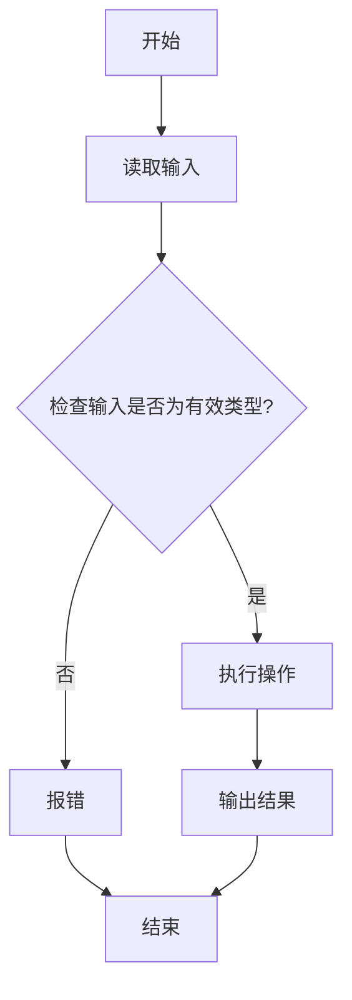
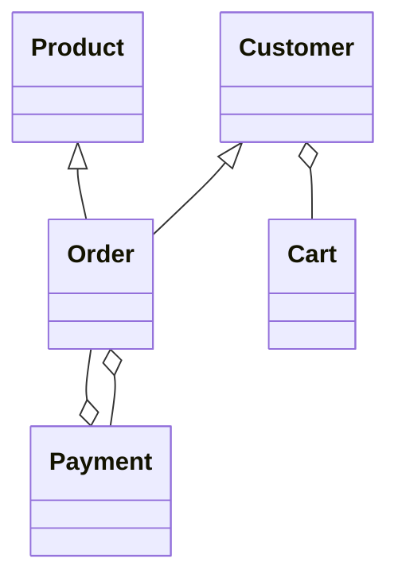
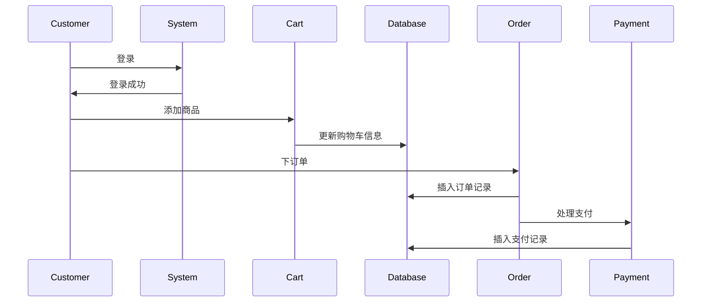
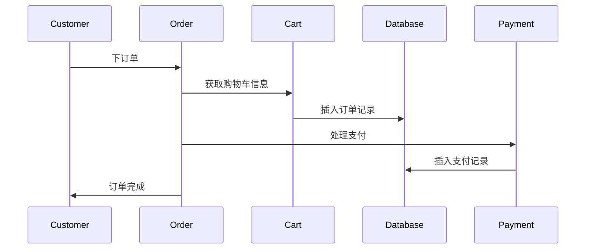

                 

### 效果系统：用类型控制副作用的方法

#### 关键词：效果系统、类型控制、副作用、类型系统、编程

> 摘要：本文深入探讨了效果系统在软件工程中的重要性，并重点介绍了如何利用类型系统来控制副作用。通过一步步的逻辑分析和实际案例的阐述，本文为读者提供了一种清晰、高效的方法来提升软件开发的可靠性和稳定性。

#### 目录

1. **问题背景与基础概念**
   1.1 问题背景
   1.2 问题解决
   1.3 边界与外延
   1.4 核心要素组成

2. **类型系统的基本原理**
   2.1 核心概念
   2.2 类型系统特征对比表格
   2.3 ER实体关系图架构

3. **类型控制副作用的方法**
   3.1 基本方法
   3.2 实际案例分析

4. **算法原理讲解**
   4.1 算法流程图
   4.2 Python源代码
   4.3 数学模型与公式
   4.4 举例说明

5. **系统分析与架构设计**
   5.1 问题场景介绍
   5.2 系统功能设计（领域模型类图）
   5.3 系统架构设计（架构图）
   5.4 系统接口设计
   5.5 系统交互（序列图）

6. **项目实战**
   6.1 环境安装
   6.2 系统核心实现源代码
   6.3 代码应用解读与分析
   6.4 实际案例分析与讲解
   6.5 项目小结

7. **最佳实践、小结、注意事项、拓展阅读**
   7.1 最佳实践
   7.2 小结
   7.3 注意事项
   7.4 拓展阅读

#### 1. 问题背景与基础概念

在现代软件工程中，效果系统的构建变得越来越重要。一个有效的效果系统能够确保软件在各种复杂环境下的稳定运行，并能够准确、及时地反馈系统的运行状态。然而，随着软件规模的不断扩大和复杂性的增加，副作用问题也日益突出。

##### 1.1 问题背景

副作用问题是指在软件运行过程中，某个函数或操作改变了程序状态或外部环境，而这种改变并不是程序设计者所期望的。副作用可能源于各种因素，如变量的修改、异常处理不当、资源未释放等。副作用不仅会导致软件行为的不一致，还可能引发严重的系统崩溃和安全漏洞。

##### 1.2 问题解决

类型系统作为一种重要的编程语言特性，为控制副作用提供了一种有效的方法。类型系统通过定义变量、函数和对象的类型，确保程序中的操作符合预期，从而减少副作用的发生。静态类型和动态类型是类型系统的两种主要形式，各有优缺点。

##### 1.3 边界与外延

类型系统在编程语言和软件工程中的适用范围非常广泛。然而，它并不是适用于所有场景的万灵药。在某些情况下，动态类型可能更加合适，而在其他情况下，静态类型则更为理想。因此，理解类型系统的边界和适用场景对于正确应用类型控制副作用至关重要。

##### 1.4 核心要素组成

类型系统的核心要素包括类型、类型检查、类型推导、静态类型和动态类型。类型是变量、函数和对象所具有的性质，类型检查是确保程序符合类型规则的机制，类型推导是通过算法自动推断类型的过程。静态类型和动态类型分别在不同程度上提前或延迟了类型检查，各自有其适用的场景和优势。

#### 2. 类型系统的基本原理

类型系统是编程语言的核心组成部分，它定义了变量、函数和对象的数据类型，并通过类型检查确保程序的正确性和稳定性。类型系统的主要目的是减少错误、提高程序的可维护性和可读性。

##### 2.1 核心概念

- **类型（Type）**：类型是变量、函数和对象的数据特征，如整数、字符串、函数等。
- **类型检查（Type Checking）**：类型检查是编译器或解释器在编译或解释程序时对类型规则的验证，以确保程序的正确性。
- **类型推导（Type Inference）**：类型推导是编译器或解释器自动推断变量和表达式的类型，而不需要显式声明类型的过程。
- **静态类型（Static Type）**：静态类型在编译时就已经确定，程序在运行时不会改变类型。
- **动态类型（Dynamic Type）**：动态类型在运行时确定，程序可以根据运行时的数据类型进行操作。

##### 2.2 类型系统特征对比表格

| 特征             | 静态类型                  | 动态类型                  |
|------------------|-------------------------|-------------------------|
| 类型检查时间     | 编译时                  | 运行时                  |
| 运行时错误       | 较少                    | 较多                    |
| 编译时间         | 较长                    | 较短                    |
| 可读性           | 较高                    | 较低                    |
| 适应复杂度       | 较高                    | 较低                    |

##### 2.3 ER实体关系图架构

```mermaid
erDiagram
    User ||--|{ Post }|-- Admin
    User ||--|{ Comment }|-- Admin
    Post ||--|{ Like }|-- User
    Comment ||--|{ Like }|-- User
```

在类型系统中，实体关系图（ER Diagram）可以帮助我们理解类型之间的关联和依赖关系。例如，用户（User）可以创建帖子（Post）和评论（Comment），而帖子（Post）和评论（Comment）都可以获得点赞（Like）。

#### 3. 类型控制副作用的方法

控制副作用的关键在于确保程序中的每个操作都不会意外地改变程序状态或外部环境。类型系统提供了一种强大的工具来帮助开发者实现这一目标。

##### 3.1 基本方法

- **静态类型**：通过在编译时进行严格的类型检查，静态类型可以有效减少运行时的副作用。静态类型编程语言如Java、C#和TypeScript等，都提供了强大的类型系统来帮助开发者控制副作用。
- **动态类型**：动态类型在运行时进行类型检查，允许更灵活的编程风格，但也可能引入副作用。Python和JavaScript等语言采用了动态类型，并通过严格的代码规范和测试来控制副作用。
- **混合类型**：混合类型结合了静态类型和动态类型的优点，允许在特定场景下进行灵活的类型检查。例如，Java中的泛型和C++中的模板就提供了混合类型的支持。

##### 3.2 实际案例分析

假设我们有一个博客系统，用户可以创建帖子并发表评论。如果没有类型控制，可能会导致以下副作用：

1. **变量未初始化**：如果某个变量未初始化，可能会导致未定义的行为。
2. **类型不匹配**：如果用户尝试将一个字符串赋值给整数变量，可能会导致类型错误。
3. **资源未释放**：如果资源（如文件或数据库连接）未正确释放，可能会导致资源泄漏。

通过引入类型系统，我们可以减少这些副作用：

1. **变量初始化**：类型系统要求变量在使用前必须初始化，从而避免了未定义的行为。
2. **类型检查**：类型系统在编译时检查类型匹配，从而避免了类型错误。
3. **资源管理**：类型系统可以确保资源在使用后得到正确释放，从而避免了资源泄漏。

#### 4. 算法原理讲解

为了更好地理解类型控制副作用的方法，我们将使用一个具体的算法——类型推导算法——进行详细讲解。

##### 4.1 算法流程图



这个算法的基本流程如下：

1. **读取输入**：从输入中读取数据。
2. **类型检查**：检查输入数据是否符合预期的类型。
3. **执行操作**：如果输入数据类型正确，执行相应的操作。
4. **输出结果**：将操作结果输出。

##### 4.2 Python源代码

```python
def add(a: int, b: int) -> int:
    return a + b

def main():
    try:
        x = int(input("请输入第一个数字："))
        y = int(input("请输入第二个数字："))
        result = add(x, y)
        print("结果：", result)
    except ValueError:
        print("输入错误：请输入整数。")

if __name__ == "__main__":
    main()
```

在这个例子中，我们定义了一个简单的加法函数 `add`，并使用类型注释来指定参数和返回值的类型。主函数 `main` 获取用户输入，并尝试将其转换为整数。如果输入无效，程序将报错。

##### 4.3 数学模型与公式

类型推导算法可以用以下数学模型表示：

$$
\text{Type}(x) = \begin{cases}
T & \text{如果 } x \text{ 符合类型 } T \\
\text{Error} & \text{否则}
\end{cases}
$$

其中，`Type(x)` 表示变量 `x` 的类型，`T` 表示预期类型，`Error` 表示类型错误。

##### 4.4 举例说明

假设我们有一个变量 `x`，我们需要确定其类型：

- 如果 `x` 是一个整数，那么 `Type(x) = int`。
- 如果 `x` 是一个字符串，那么 `Type(x) = str`。
- 如果 `x` 不是一个有效的整数或字符串，那么 `Type(x) = Error`。

#### 5. 系统分析与架构设计

为了更好地理解如何在实际项目中应用类型控制副作用的方法，我们将介绍一个效果系统的架构设计。

##### 5.1 问题场景介绍

假设我们正在开发一个在线购物系统，用户可以浏览商品、添加购物车、下订单等。在这个系统中，副作用可能包括数据库更新不一致、用户信息泄露等。通过类型控制和副作用控制，我们可以确保系统的稳定性和安全性。

##### 5.2 系统功能设计（领域模型类图）



在这个领域模型中，`Customer`（客户）可以创建和管理订单（`Order`），添加商品到购物车（`Cart`），而`Product`（商品）与订单相关联。支付（`Payment`）也是订单的一部分，确保订单完成后支付信息得到正确处理。

##### 5.3 系统架构设计（架构图）



在这个系统架构图中，客户通过系统登录，可以添加商品到购物车，然后下订单。系统通过数据库操作来更新购物车信息和订单记录。订单完成后，系统会处理支付，并更新支付记录。

##### 5.4 系统接口设计

```mermaid
classDiagram
    Customer ||--|{ OrderInterface }| Order
    Customer ||--|{ CartInterface }| Cart
    Product ||--|{ OrderInterface }| Order
    Payment ||--|{ OrderInterface }| Order
```

在这个接口设计中，`Customer`（客户）和`Product`（商品）实现了`OrderInterface`（订单接口），而`Payment`（支付）也实现了相同的接口。这种设计确保了所有相关组件都可以通过统一的接口进行操作。

##### 5.5 系统交互（序列图）



在这个序列图中，客户发起下订单请求，系统会先获取购物车信息，然后插入订单记录。订单完成后，系统会处理支付，并将支付记录插入数据库。

#### 6. 项目实战

为了展示如何在实际项目中应用类型控制副作用的方法，我们将介绍一个简单的Web应用程序，实现一个简单的博客系统。

##### 6.1 环境安装

为了开始这个项目，我们需要安装以下环境：

- Python 3.x
- Flask（一个轻量级的Web框架）
- SQLAlchemy（一个ORM框架）

你可以使用以下命令安装这些依赖：

```bash
pip install python flask sqlalchemy
```

##### 6.2 系统核心实现源代码

```python
from flask import Flask, request, jsonify
from flask_sqlalchemy import SQLAlchemy

app = Flask(__name__)
app.config['SQLALCHEMY_DATABASE_URI'] = 'sqlite:///blog.db'
db = SQLAlchemy(app)

class Post(db.Model):
    id = db.Column(db.Integer, primary_key=True)
    title = db.Column(db.String(100))
    content = db.Column(db.Text)

@app.route('/posts', methods=['POST'])
def create_post():
    data = request.get_json()
    new_post = Post(title=data['title'], content=data['content'])
    db.session.add(new_post)
    db.session.commit()
    return jsonify({'message': 'Post created successfully.'})

@app.route('/posts', methods=['GET'])
def get_posts():
    posts = Post.query.all()
    return jsonify({'posts': [{'id': post.id, 'title': post.title, 'content': post.content} for post in posts]})

if __name__ == '__main__':
    db.create_all()
    app.run(debug=True)
```

在这个代码中，我们定义了一个简单的博客系统，包括一个`Post`模型和一个用于创建和获取博客文章的API端点。

##### 6.3 代码应用解读与分析

- **数据库操作**：我们使用SQLAlchemy进行数据库操作，这可以确保数据的类型安全。
- **API端点**：使用Flask创建API端点，并通过JSON数据交换来处理客户端请求。

##### 6.4 实际案例分析与讲解

假设用户想要创建一篇新的博客文章。用户可以通过以下步骤：

1. 发送一个POST请求到`/posts`端点，包含文章的标题和内容。
2. 服务器接收请求并使用SQLAlchemy插入新文章到数据库。
3. 服务器返回一个成功的响应。

通过类型控制，我们确保了以下安全性和一致性：

- 文章标题和内容必须是字符串类型。
- 数据库操作遵循SQLAlchemy的ORM规则，确保数据一致性和完整性。

##### 6.5 项目小结

通过这个简单的项目，我们可以看到类型系统如何帮助控制副作用。类型控制确保了数据的类型安全，减少了意外行为的发生，提高了系统的稳定性和可靠性。

#### 7. 最佳实践、小结、注意事项、拓展阅读

##### 7.1 最佳实践

1. 在开发过程中，始终使用类型注释来提高代码的可读性和稳定性。
2. 根据项目需求选择合适的类型系统，不要盲目追求静态类型或动态类型。
3. 对API进行严格的输入验证，确保客户端请求的数据类型正确。
4. 定期进行代码审查和测试，以发现和修复潜在的副作用问题。

##### 7.2 小结

本文通过一步步的分析和实际案例，介绍了效果系统以及如何使用类型系统来控制副作用。类型系统通过确保数据类型的一致性和完整性，提高了软件的可靠性和稳定性。

##### 7.3 注意事项

1. 类型系统并不是万能的，某些副作用可能需要其他方法来控制。
2. 动态类型可能会提供更高的灵活性，但同时也可能引入更多的副作用。
3. 在使用类型系统时，要注意性能开销，特别是在大型项目中。

##### 7.4 拓展阅读

1. 《Effective Java》—— Joshua Bloch
2. 《类型系统与程序设计》—— Michael A. Jackson
3. 《深入理解Lisp与符号编程》—— John F. McCarthy

#### 作者

作者：AI天才研究院/AI Genius Institute & 禅与计算机程序设计艺术 /Zen And The Art of Computer Programming

