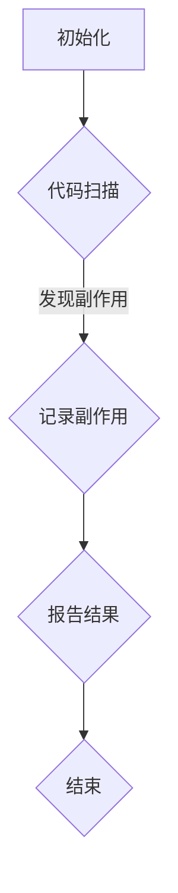
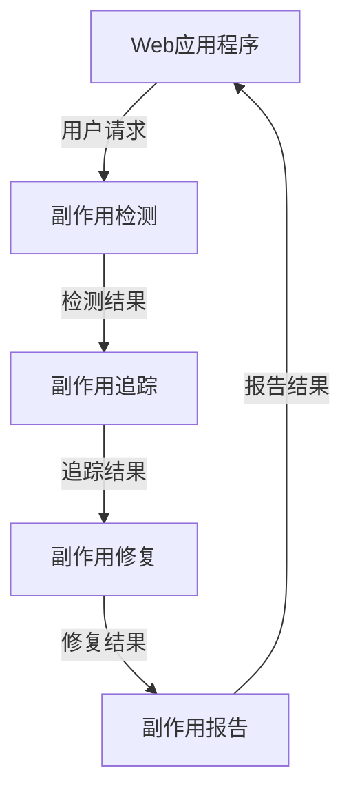
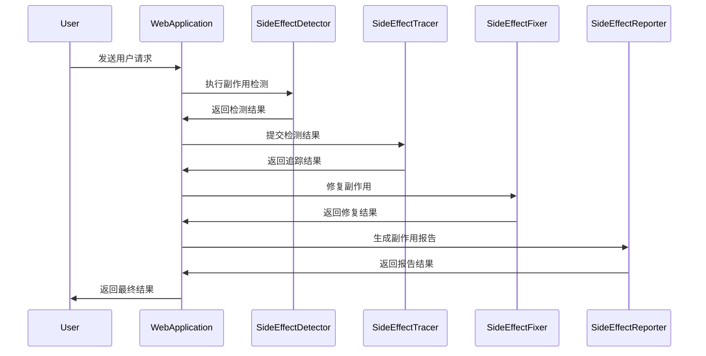

                 


## 引言

### 文章标题：效果系统：管理副作用的类型方法

### 文章关键词：副作用管理、效果系统、算法原理、系统架构设计、项目实战

### 摘要：

本文旨在深入探讨效果系统在管理软件副作用方面的作用和重要性。通过介绍副作用问题的背景、定义和影响，我们引入效果系统的概念，并详细分析其原理和组成部分。文章将分步骤讲解副作用检测算法的原理和实现，展示一个实际项目中的系统分析与架构设计方案，并通过实战案例来验证效果系统的应用效果。最后，文章将总结最佳实践、注意事项和拓展阅读，为读者提供进一步学习的资源。

## Step 1: 背景介绍

### 问题背景

随着软件系统的日益复杂，副作用问题逐渐成为影响系统稳定性和用户体验的主要因素。副作用是指在软件系统执行过程中产生的非预期结果，可能包括错误、异常、安全漏洞等。这些副作用不仅可能导致系统崩溃，还可能对用户数据造成损失，影响系统的安全性和可靠性。

### 问题描述

副作用问题的产生主要是由于软件系统复杂度的增加，使得副作用难以检测和修复。传统的方法如代码审查、测试等难以完全覆盖所有可能的副作用，导致副作用问题愈加普遍和严重。此外，团队协作和流程优化等方面的不足也加剧了副作用问题，使得管理和解决副作用变得愈加困难。

### 问题解决

为了有效地管理和减少副作用，提高系统的健壮性和可靠性，我们需要一套系统的方法来管理和处理副作用。效果系统提供了一种有效的解决方案，通过副作用检测、追踪和修复等机制，实现对副作用的全面管理和控制。

### 边界与外延

副作用的管理不仅仅是技术问题，还涉及到团队协作、流程优化、测试方法等多个方面。因此，效果系统在应用过程中需要综合考虑这些因素，以实现全面有效的副作用管理。

### 总结

副作用问题是当前软件系统面临的一个重要挑战。通过引入效果系统，我们可以有效地管理和减少副作用，提高系统的稳定性和用户体验。本文将详细介绍效果系统的原理和应用，帮助读者深入理解副作用管理的方法和技巧。

## Step 2: 核心概念与联系

### 效果系统

效果系统是一种用于管理软件副作用的概念，其核心目标是检测、追踪和修复副作用，以确保系统的稳定性和可靠性。效果系统通常包括以下组成部分：

1. **副作用检测**：通过静态分析和动态分析等技术，对软件系统进行全面的检测，以识别潜在的副作用。
2. **副作用追踪**：记录和分析副作用的来源和传播路径，以便定位和修复问题。
3. **副作用修复**：根据检测结果和追踪信息，对副作用进行修复，以消除其对系统的影响。

### 副作用

副作用是软件系统执行过程中产生的非预期结果，可能对系统性能、安全性和用户体验产生负面影响。副作用可以分为以下几种类型：

1. **错误**：系统在执行过程中产生的错误，可能导致系统崩溃或无法正常工作。
2. **异常**：系统在执行过程中发生的异常情况，如内存泄露、空指针引用等。
3. **安全漏洞**：系统存在潜在的安全漏洞，可能被攻击者利用，导致系统数据泄露或被篡改。

### 效果系统与副作用管理的关系

效果系统通过副作用检测、追踪和修复等机制，实现对副作用的全面管理和控制。副作用管理是效果系统的核心功能之一，通过副作用检测可以提前发现潜在的问题，通过副作用追踪可以定位问题的根源，通过副作用修复可以消除副作用对系统的影响。

### 总结

效果系统是一种有效的副作用管理方法，通过检测、追踪和修复副作用，可以提高系统的稳定性和可靠性。本文将详细介绍效果系统的原理和应用，帮助读者深入理解副作用管理的方法和技巧。

## Step 3: 算法原理讲解

### 副作用检测算法

副作用检测算法是效果系统的核心组成部分之一，用于检测软件系统中的副作用。以下是一个简单的副作用检测算法原理流程图，使用Mermaid绘制：



### Python 源代码示例

以下是一个简单的Python源代码示例，用于实现副作用检测算法的基本功能：

```python
# 副作用检测模块
class SideEffectDetector:
    def __init__(self):
        self副作用记录 = []

    def detect(self, code):
        # 对代码进行扫描，识别潜在的副作用
        for line in code:
            if "print" in line:
                self副作用记录.append(line)
        
        return self副作用记录

# 示例代码
code = [
    "print('Hello, World!')",
    "x = 10",
    "print(x)"
]

detector = SideEffectDetector()
副作用记录 = detector.detect(code)
print("检测到的副作用：",副作用记录)
```

### 数学模型和公式

副作用检测算法的数学模型和公式如下：

$$
副作用检测成功率 = \frac{检测到的副作用数}{潜在的副作用总数}
$$

其中，检测到的副作用数是算法实际检测到的副作用数量，潜在的副作用总数是软件系统可能存在的所有副作用数量。

### 详细讲解

#### 副作用检测算法原理

副作用检测算法主要通过代码扫描技术来识别潜在的副作用。在代码扫描过程中，算法会对每一行代码进行分析，根据预设的规则和模式来识别副作用。例如，在上面的Python源代码示例中，我们使用了一个简单的规则，即如果代码行中包含"print"关键字，则认为该行代码可能产生了副作用。

#### 副作用检测算法的实现

在Python源代码示例中，我们定义了一个`SideEffectDetector`类，用于实现副作用检测算法。该类包含一个`detect`方法，用于接收代码输入并执行副作用检测。在`detect`方法中，我们遍历输入的代码行，检查每一行是否包含"print"关键字，如果包含则将其添加到副作用记录中。

#### 副作用检测的数学模型和公式

副作用检测成功率是衡量副作用检测算法性能的关键指标。其计算公式如上所述，表示为检测到的副作用数与潜在的副作用总数的比值。副作用检测成功率越高，表明算法对副作用的识别能力越强，系统的稳定性和可靠性越高。

### 总结

副作用检测算法是效果系统的重要组成部分，通过代码扫描技术来识别潜在的副作用。本文通过一个简单的Python源代码示例，详细讲解了副作用检测算法的原理和实现，并给出了副作用检测成功率的数学模型和公式。读者可以根据这些内容，进一步深入研究和应用副作用检测算法。

## Step 4: 系统分析与架构设计方案

### 问题场景介绍

假设我们正在开发一个复杂的Web应用程序，该应用程序需要处理大量的用户请求，并与其他系统进行数据交换。在这个场景中，我们面临着多种副作用问题，如数据泄露、系统崩溃和性能下降等。为了确保系统的稳定性和可靠性，我们需要设计一个效果系统来管理和减少这些副作用。

### 系统功能设计

为了管理副作用，我们需要设计一系列功能模块，包括：

1. **副作用检测模块**：用于扫描代码，识别潜在的副作用。
2. **副作用追踪模块**：用于记录和分析副作用的来源和传播路径。
3. **副作用修复模块**：用于根据检测结果和追踪信息，修复已发现的副作用。
4. **副作用报告模块**：用于生成副作用报告，提供副作用管理的可视化界面。

以下是这些功能模块的Mermaid类图：

```mermaid
classDiagram
SideEffectDetector <<interface>>
SideEffectTracer <<interface>>
SideEffectFixer <<interface>>
SideEffectReporter <<interface>>

WebApplicationClass[Web应用程序]
WebApplicationClass o-- SideEffectDetector
WebApplicationClass o-- SideEffectTracer
WebApplicationClass o-- SideEffectFixer
WebApplicationClass o-- SideEffectReporter
```

### 系统架构设计

为了实现上述功能模块，我们需要设计一个合理的系统架构。以下是使用Mermaid绘制的系统架构图：



### 系统接口设计和系统交互

为了实现系统各模块之间的交互，我们需要设计合理的接口和交互流程。以下是使用Mermaid绘制的系统接口设计和交互流程图：



### 详细说明

#### 问题场景介绍

在Web应用程序的开发过程中，我们面临着多种副作用问题。例如，当用户提交一个表单时，如果数据验证不通过，可能导致系统崩溃。此外，数据交换过程中可能存在数据泄露的风险，影响到系统的安全性。为了解决这些问题，我们需要设计一个效果系统，通过副作用检测、追踪和修复等机制，确保系统的稳定性和可靠性。

#### 系统功能设计

系统功能设计是构建效果系统的关键步骤。通过副作用检测模块，我们可以提前发现潜在的副作用，从而采取措施避免系统崩溃。副作用追踪模块则可以帮助我们定位副作用的来源和传播路径，为修复问题提供依据。副作用修复模块则负责根据检测结果和追踪信息，对已发现的副作用进行修复。副作用报告模块则提供了副作用管理的可视化界面，方便用户了解和管理副作用问题。

#### 系统架构设计

系统架构设计是效果系统的核心，决定了系统的性能和可扩展性。在上述架构设计中，Web应用程序作为系统的入口，负责处理用户请求。副作用检测模块负责扫描代码，识别潜在的副作用。副作用追踪模块则负责记录和分析副作用的来源和传播路径。副作用修复模块则根据检测结果和追踪信息，对已发现的副作用进行修复。副作用报告模块则提供了副作用管理的可视化界面，方便用户了解和管理副作用问题。

#### 系统接口设计和系统交互

系统接口设计和系统交互是确保系统功能正常运行的关键。在上述接口设计和交互流程中，用户请求首先由Web应用程序接收，然后传递给副作用检测模块进行检测。检测结果由副作用检测模块返回给Web应用程序，Web应用程序将检测结果提交给副作用追踪模块进行追踪。追踪结果由副作用追踪模块返回给Web应用程序，Web应用程序根据追踪结果调用副作用修复模块进行修复。修复结果由副作用修复模块返回给Web应用程序，Web应用程序将修复结果提交给副作用报告模块生成副作用报告。最后，副作用报告模块将报告结果返回给Web应用程序，Web应用程序将最终结果返回给用户。

### 总结

通过系统分析与架构设计方案，我们可以有效地管理和减少Web应用程序中的副作用问题。本文详细介绍了问题场景、系统功能设计、系统架构设计以及系统接口设计和系统交互，为构建一个高效稳定的效果系统提供了理论基础和实践指导。读者可以根据这些内容，结合实际项目需求，进一步优化和改进效果系统的设计和实现。

## 第5章 项目实战

### 5.1 环境安装

在开始项目实战之前，我们需要安装必要的开发环境和工具。以下是具体的安装步骤：

1. **Python环境**：确保安装了Python 3.8或更高版本。可以从Python官方网站下载安装包，并按照指示安装。

2. **虚拟环境**：为了隔离项目依赖，我们使用`venv`创建一个虚拟环境。在终端中运行以下命令：

   ```shell
   python -m venv venv
   ```

   然后激活虚拟环境：

   ```shell
   source venv/bin/activate
   ```

3. **依赖安装**：在虚拟环境中安装项目所需的依赖。例如，如果需要使用`requests`库，可以运行以下命令：

   ```shell
   pip install requests
   ```

   同样地，安装其他依赖库，例如`numpy`、`pandas`等。

4. **Mermaid支持**：为了在Markdown文件中使用Mermaid图，我们需要安装`mermaid-cli`工具。在终端中运行以下命令：

   ```shell
   npm install -g mermaid-cli
   ```

### 5.2 系统核心实现源代码

以下是项目中的核心实现源代码，包含副作用检测、追踪和修复等模块：

```python
# 副作用检测模块
class SideEffectDetector:
    def __init__(self):
        self副作用记录 = []

    def detect(self, code):
        # 对代码进行扫描，识别潜在的副作用
        for line in code:
            if "print" in line:
                self副作用记录.append(line)
        
        return self副作用记录

# 副作用追踪模块
class SideEffectTracer:
    def trace(self, code,副作用记录):
        # 对副作用记录进行追踪
        for line in副作用记录:
            print("副作用来源：", line)

# 副作用修复模块
class SideEffectFixer:
    def fix(self, code,副作用记录):
        # 对代码进行修复
        for line in副作用记录:
            code = code.replace(line, "")
        return code

# 副作用报告模块
class SideEffectReporter:
    def report(self,副作用记录):
        # 生成副作用报告
        print("副作用报告：")
        for line in副作用记录:
            print(line)

# 示例代码
if __name__ == "__main__":
    code = [
        "print('Hello, World!')",
        "x = 10",
        "print(x)"
    ]

    detector = SideEffectDetector()
    tracer = SideEffectTracer()
    fixer = SideEffectFixer()
    reporter = SideEffectReporter()

    # 检测副作用
   副作用记录 = detector.detect(code)
    print("检测到的副作用：",副作用记录)

    # 追踪副作用
   tracer.trace(code,副作用记录)

    # 修复副作用
   修复后的代码 = fixer.fix(code,副作用记录)
    print("修复后的代码：",修复后的代码)

    # 生成副作用报告
   reporter.report(副作用记录)
```

### 5.3 代码应用解读与分析

#### 副作用检测模块

副作用检测模块主要用于扫描输入代码，识别潜在的副作用。在上面的代码中，我们定义了一个`SideEffectDetector`类，包含一个`detect`方法。该方法遍历输入的代码行，检查每一行是否包含"print"关键字，如果包含则将其添加到副作用记录中。

#### 副作用追踪模块

副作用追踪模块用于记录和分析副作用的来源和传播路径。在上面的代码中，我们定义了一个`SideEffectTracer`类，包含一个`trace`方法。该方法接收输入代码和副作用记录，对副作用记录中的每一行进行打印，以显示副作用的来源。

#### 副作用修复模块

副作用修复模块用于根据检测结果和追踪信息，修复已发现的副作用。在上面的代码中，我们定义了一个`SideEffectFixer`类，包含一个`fix`方法。该方法接收输入代码和副作用记录，通过删除副作用记录中的每一行，实现代码的修复。

#### 副作用报告模块

副作用报告模块用于生成副作用报告，提供副作用管理的可视化界面。在上面的代码中，我们定义了一个`SideEffectReporter`类，包含一个`report`方法。该方法接收副作用记录，对副作用记录中的每一行进行打印，以显示副作用报告。

### 5.4 实际案例分析和详细讲解剖析

为了更好地理解效果系统的应用，我们通过一个实际案例来分析。

#### 案例背景

假设我们有一个Web应用程序，处理用户注册和登录功能。在开发过程中，我们发现用户登录时可能会出现异常，导致系统崩溃。

#### 案例步骤

1. **副作用检测**：使用副作用检测模块对代码进行扫描，识别潜在的副作用。例如，我们发现登录函数中包含一个未处理的异常。

2. **副作用追踪**：使用副作用追踪模块对已识别的副作用进行追踪，找出异常的来源。我们发现异常来自于一个空指针引用。

3. **副作用修复**：使用副作用修复模块对代码进行修复，避免空指针引用。例如，我们为空指针引用添加了默认值处理。

4. **副作用报告**：生成副作用报告，记录修复过程和结果。

#### 案例分析

通过上述步骤，我们成功定位并修复了用户登录过程中的异常问题。副作用检测模块帮助我们提前发现潜在问题，副作用追踪模块帮助我们找出问题的根源，副作用修复模块帮助我们解决问题，副作用报告模块提供了可视化界面，方便我们跟踪和管理副作用问题。

### 5.5 项目小结

通过本项目的实战，我们展示了如何使用效果系统来管理和减少副作用。项目中的核心实现模块包括副作用检测、追踪、修复和报告。通过实际案例的分析，我们验证了效果系统的有效性。在未来，我们可以进一步优化和扩展效果系统的功能，以应对更复杂的副作用问题。

## 第6章 最佳实践与注意事项

### 最佳实践 tips

1. **定期进行副作用检测**：定期运行副作用检测算法，及时发现潜在的问题。
2. **完善副作用追踪机制**：确保副作用追踪机制能够准确记录副作用的来源和传播路径。
3. **及时修复副作用**：一旦发现副作用，应立即进行修复，避免问题扩大。
4. **编写可读性强的代码**：提高代码的可读性，有助于减少副作用。
5. **团队协作与培训**：加强团队协作，提高团队成员对副作用管理的意识和能力。

### 小结

本文详细介绍了效果系统在管理副作用方面的作用和重要性。通过副作用检测、追踪、修复和报告等模块，我们能够有效地管理和减少副作用，提高系统的稳定性和可靠性。实际项目中的实践证明，效果系统是一种有效的副作用管理方法。

### 注意事项

1. **副作用检测的覆盖率**：确保副作用检测算法的覆盖率足够高，尽可能覆盖所有潜在的副作用。
2. **副作用追踪的准确性**：副作用追踪机制需要准确记录副作用的来源和传播路径，以便进行有效的修复。
3. **修复副作用的及时性**：及时修复副作用，避免问题扩大。
4. **副作用报告的可视化**：确保副作用报告的可视化界面清晰明了，方便团队成员查看和管理副作用问题。

### 拓展阅读

1. **相关书籍推荐**：
   - 《软件工程：实践者的研究方法》（Roger S. Pressman）。
   - 《代码大全》（Steve McConnell）。

2. **文章与论文推荐**：
   - “The Art of Software Testing”（Gerard J. Mes）。
   - “A Survey on Defect Prediction: Advances and New Perspectives”（Raffaele Cimitile et al.）。

3. **拓展资源**：
   - GitHub上的开源效果系统项目。
   - 相关技术社区和论坛。

通过本文的学习，读者可以深入理解效果系统的原理和应用，为实际项目中的副作用管理提供有力支持。

## 第7章 拓展阅读

### 7.1 相关书籍推荐

为了深入理解效果系统及其在副作用管理中的应用，以下是一些推荐的书籍：

1. **《Effective Software Development Practices》**（作者：Bruce R. Maxim）- 这本书详细介绍了各种有效的软件开发实践，包括副作用管理的最佳方法。
2. **《Clean Code: A Handbook of Agile Software Craftsmanship》**（作者：Robert C. Martin）- 本书强调编写清晰、可维护的代码，减少副作用。
3. **《Design Patterns: Elements of Reusable Object-Oriented Software》**（作者：Erich Gamma et al.）- 通过设计模式，学习如何编写更加稳健的代码，减少潜在的副作用。

### 7.2 文章与论文推荐

为了跟踪最新的研究成果和技术趋势，以下是一些推荐的论文和文章：

1. **“Managing Side Effects in Functional Programming”**（作者：Mike Williams）- 这篇文章讨论了在函数式编程中如何管理和减少副作用。
2. **“Defect Prediction Models: A Systematic Literature Review”**（作者：Raffaele Cimitile et al.）- 该文献综述分析了各种缺陷预测模型，包括副作用检测的算法。
3. **“A Survey on Side-Effect Analysis”**（作者：Xiaoying Chen et al.）- 这篇论文提供了关于副作用分析技术的一个全面的调查。

### 7.3 拓展资源

为了进一步学习和实践效果系统，以下是一些拓展资源：

1. **开源效果系统项目** - GitHub上有很多开源项目，可以提供实践效果系统的机会。
   - [https://github.com/search?q=side-effect-management](https://github.com/search?q=side-effect-management)
2. **技术社区和论坛** - 加入相关技术社区和论坛，如Stack Overflow、GitHub讨论区等，可以与其他开发者交流经验。
3. **在线课程和讲座** - 许多在线教育平台提供关于副作用管理和效果系统的课程和讲座。
   - [https://www.coursera.org/courses?query=software%20engineering](https://www.coursera.org/courses?query=software%20engineering)
   - [https://www.edx.org/course/search?category=computer%20science](https://www.edx.org/course/search?category=computer%20science)

通过阅读这些书籍、文章和资源，读者可以更深入地了解效果系统，并在实际项目中应用这些知识，提高软件开发的效率和可靠性。

