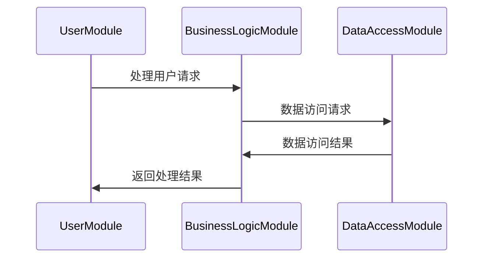
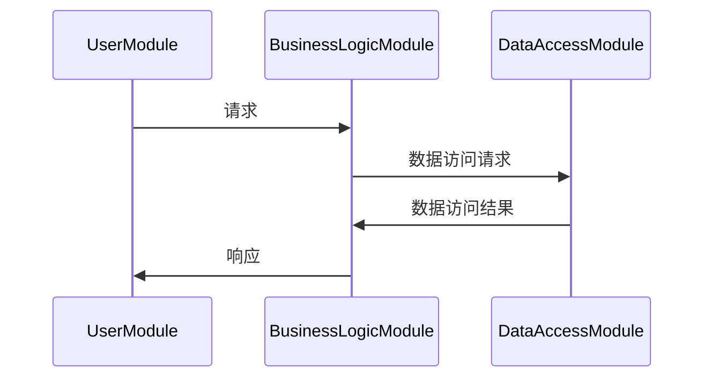
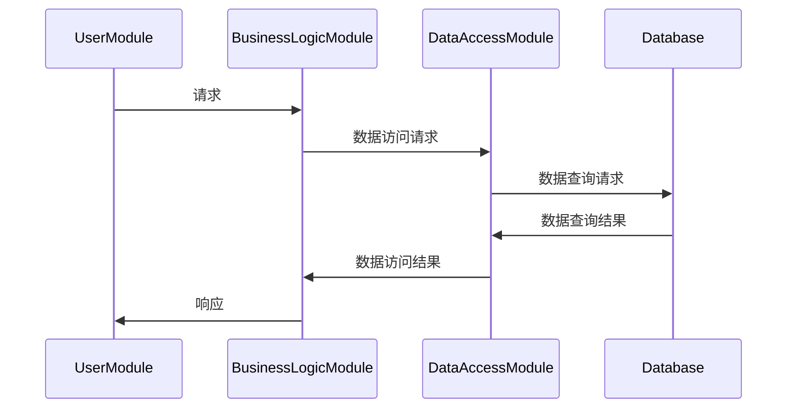
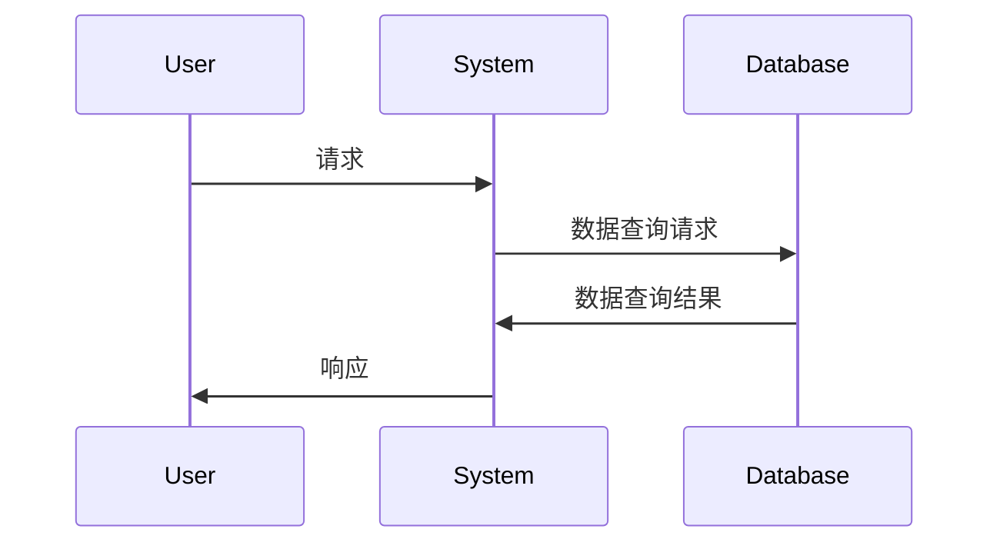
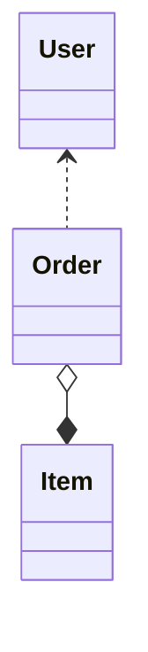
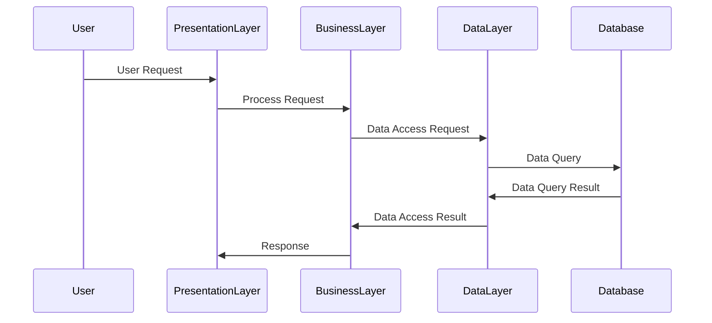
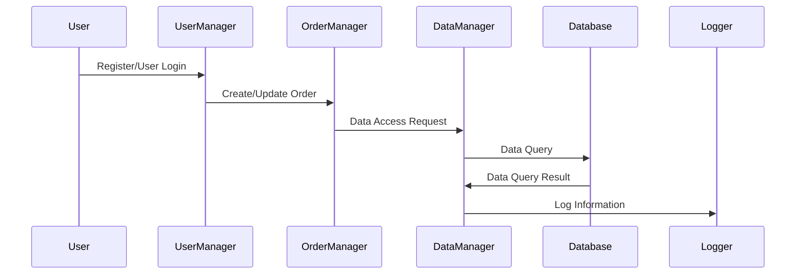
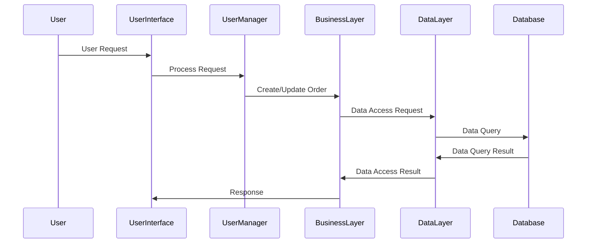
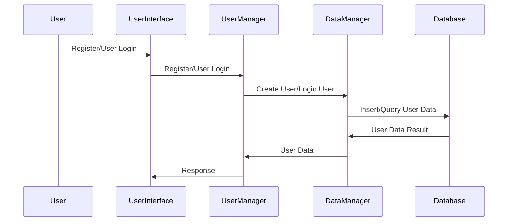
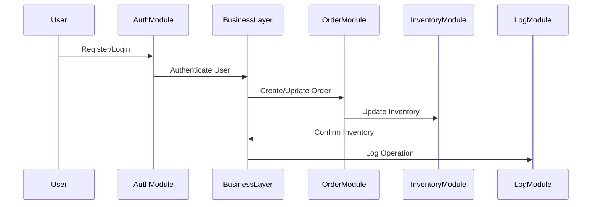

                 

### 关键词
效果系统，类型论，副作用管理，算法原理，系统架构设计，项目实战

### 摘要
本文深入探讨了效果系统在副作用管理中的应用，通过类型论的引入，阐述了如何利用类型论来管理和减少软件系统中的副作用。文章分为五个部分，首先介绍了问题的背景和核心概念，然后详细讲解了效果系统、类型论和副作用管理的原理及其关系。接着，文章分析了算法原理，展示了如何通过数学模型和具体示例来理解这些算法。随后，文章介绍了系统分析与架构设计方案，并通过项目实战展示了实际应用。最后，文章提供了最佳实践建议，并对全文进行了小结和拓展阅读推荐。

### 第一部分：背景介绍

#### 第1章 问题背景

##### 1.1 问题概述

在现代软件工程中，副作用管理是一个至关重要的问题。副作用是指程序在执行过程中，除了其主要功能外，对程序状态或外部环境产生的不期望影响的操作。这些影响可能包括修改全局变量、写入日志文件、更改系统配置等。副作用的存在使得程序变得复杂，难以测试和维护。

随着软件系统的规模和复杂性的增加，副作用带来的问题也日益严重。例如，一个简单的修改可能会在系统中引发一系列意想不到的副作用，导致系统的不可预测行为。这不仅会影响系统的稳定性，还可能引入安全漏洞，给企业和用户带来损失。

##### 1.2 问题解决

为了解决副作用管理问题，传统的方法主要包括：模块化设计、信息隐藏、测试和调试等。然而，这些方法往往存在局限性。模块化设计虽然可以隔离副作用，但模块之间的交互仍然可能产生副作用。信息隐藏可以减少副作用，但无法完全消除。测试和调试虽然可以发现副作用，但成本高昂且无法完全保证发现所有副作用。

因此，寻找更有效的副作用管理方法成为了软件工程领域的一个重要课题。效果系统作为一种新的软件架构理念，旨在通过类型论来管理和减少副作用。效果系统强调对程序执行效果的精确控制，从而避免副作用的产生。

##### 1.3 边界与外延

副作用管理不仅涉及到软件内部的操作，还涉及到与外部环境的交互。因此，理解副作用的边界和外延对于有效管理副作用至关重要。

副作用的边界通常由程序的控制流和数据流定义。任何对程序状态或外部环境产生的不可预测影响都可以被视为副作用。副作用的类型多种多样，包括但不限于：

- 数据修改：程序修改了某个变量的值，导致其他部分的逻辑受到影响。
- 状态修改：程序修改了系统的状态，例如修改了配置文件或数据库记录。
- 输出修改：程序改变了输出结果，例如日志文件或网络通信数据。
- 资源使用：程序使用了额外的系统资源，例如打开了文件或创建了网络连接。

理解副作用的边界和外延有助于我们更有效地识别和管理副作用。效果系统通过类型论来界定副作用的边界，确保程序在执行过程中不会产生不期望的副作用。

##### 1.4 概念结构与核心要素组成

效果系统是一种基于类型论的软件架构，其核心概念包括：

- **效果类型（Effect Types）**：定义程序可能产生的副作用类型。例如，可以定义修改全局变量、写入日志文件等副作用类型。
- **效果接口（Effect Interfaces）**：定义程序与外部环境交互的接口。效果接口规定了程序可以执行哪些副作用，并确保这些副作用在控制范围内。
- **效果上下文（Effect Contexts）**：提供了副作用执行的环境。效果上下文包括副作用类型和副作用执行的具体规则。

效果系统的基本结构包括：

- **效果模块（Effect Modules）**：用于实现副作用的具体操作。效果模块封装了副作用操作，并提供了安全接口供其他模块调用。
- **控制模块（Control Modules）**：用于管理效果模块的执行。控制模块确保副作用按照预期执行，并监控副作用的影响。
- **主程序（Main Program）**：调用效果模块和控制模块，实现程序的主要功能。

通过类型论的引入，效果系统提供了一种精确控制副作用的方法。类型论通过定义类型系统和类型检查机制，确保程序在编译时就能够发现和消除潜在的副作用问题。

### 第二部分：核心概念与联系

#### 第2章 核心概念与联系

##### 第2章 核心概念与联系

###### 2.1 效果系统

##### 2.1.1 效果系统原理

效果系统是一种基于类型论的软件架构，旨在通过类型检查和控制来管理副作用。其核心原理是：

1. **副作用类型化**：效果系统将副作用抽象为类型。每个副作用类型定义了一组可能的副作用操作。例如，`ModifyGlobalVariable` 类型定义了修改全局变量的操作。
2. **副作用接口化**：效果系统通过接口定义副作用操作的合法性。接口规定了哪些副作用操作是允许的，并确保副作用在安全范围内执行。
3. **副作用上下文化**：效果系统使用上下文来管理副作用执行的环境。上下文提供了副作用类型和执行规则，确保副作用按照预期执行。

##### 2.1.2 效果系统属性特征

效果系统具有以下属性特征：

- **类型安全**：通过类型检查机制，确保副作用类型与接口定义一致，从而避免不合法的副作用操作。
- **模块化**：副作用操作被封装在独立的模块中，降低了副作用对其他模块的影响。
- **可扩展性**：可以通过引入新的副作用类型和接口，轻松扩展效果系统的功能。
- **可测试性**：副作用操作在编译时就被检查，减少了测试成本。

##### 2.1.3 效果系统与其他概念的关联

效果系统与副作用管理、类型论等概念密切相关：

- **副作用管理**：效果系统通过类型论来管理和减少副作用。副作用管理是效果系统的核心目标之一。
- **类型论**：类型论为效果系统提供了理论基础。类型论中的类型系统和类型检查机制确保了效果系统的类型安全。

###### 2.2 类型论

##### 2.2.1 类型论原理

类型论是一种形式化的理论，用于定义和验证程序中的类型系统。类型论的基本原理包括：

1. **类型系统**：类型系统定义了程序中值的类型，如整数、字符串、函数等。类型系统确保程序在运行时不会发生类型错误。
2. **类型检查**：类型检查是一种静态检查方法，用于验证程序中的类型一致性。类型检查在编译时进行，确保程序在运行时不会发生类型错误。

##### 2.2.2 类型论属性特征

类型论具有以下属性特征：

- **形式化**：类型论提供了精确的形式化定义，使得类型系统具有更强的可验证性。
- **静态检查**：类型检查在编译时进行，减少了运行时错误的发生。
- **灵活性**：类型论支持多种类型系统，如静态类型、动态类型、依赖类型等，适用于不同的编程场景。

##### 2.2.3 类型论与副作用管理的关系

类型论与副作用管理密切相关：

- **类型安全**：类型论确保程序在编译时就已经通过了类型检查，减少了副作用产生的机会。
- **副作用抽象**：类型论将副作用抽象为类型，使得副作用可以在编译时被检查和控制。
- **安全性保障**：类型论提供了安全保证，确保副作用在安全范围内执行，不会对程序状态或外部环境产生不可预期的破坏。

###### 2.3 副作用管理

##### 2.3.1 副作用管理原理

副作用管理是一种软件工程方法，旨在减少或消除程序中的副作用。副作用管理的基本原理包括：

1. **副作用识别**：识别程序中的副作用操作，例如修改全局变量、写入日志文件等。
2. **副作用控制**：对副作用操作进行控制，确保副作用在安全范围内执行。
3. **副作用隔离**：将副作用操作与其他部分隔离，减少副作用对其他部分的干扰。

##### 2.3.2 副作用管理属性特征

副作用管理具有以下属性特征：

- **安全性**：通过控制副作用操作，确保程序不会产生意外的副作用。
- **模块化**：副作用管理将副作用操作模块化，降低了副作用对其他部分的干扰。
- **可测试性**：副作用管理使程序更容易测试，因为副作用操作是可控的。

##### 2.3.3 副作用管理与效果系统的关系

副作用管理与效果系统密切相关：

- **效果系统是副作用管理的一种实现**：效果系统利用类型论来管理副作用，提供了副作用控制的机制。
- **副作用管理是效果系统的重要组成部分**：副作用管理确保效果系统的副作用操作在安全范围内执行，不会影响程序的整体稳定性。

### 第三部分：算法原理讲解

#### 第3章 算法原理讲解

##### 3.1 效果系统算法原理

###### 3.1.1 算法流程

效果系统的算法流程可以分为以下几个步骤：

1. **类型定义**：定义程序中的副作用类型，例如修改全局变量、写入日志文件等。
2. **接口定义**：定义副作用操作的合法性，确保副作用在安全范围内执行。
3. **上下文建立**：建立副作用执行的环境，包括副作用类型和执行规则。
4. **副作用执行**：执行副作用操作，并在上下文中控制副作用的影响。

###### 3.1.2 算法数学模型

效果系统的算法可以使用以下数学模型来描述：

$$
\text{EffectSystem} = (\text{EffectTypes}, \text{EffectInterfaces}, \text{EffectContexts})
$$

其中：

- **EffectTypes**：副作用类型集合。
- **EffectInterfaces**：副作用接口集合。
- **EffectContexts**：副作用上下文集合。

副作用执行的数学模型可以表示为：

$$
\text{ExecuteEffect}(e, c) \rightarrow \text{Result}
$$

其中：

- **e**：副作用操作。
- **c**：副作用上下文。
- **Result**：副作用执行的结果。

###### 3.1.3 算法示例

假设我们定义了两个副作用类型：`ModifyGlobalVariable` 和 `WriteLog`。我们可以定义一个效果接口，允许修改全局变量和写入日志文件。

```
interface EffectInterface {
  modifyGlobalVariable(value: any): void;
  writeLog(message: string): void;
}
```

我们可以定义一个效果上下文，包括副作用类型和执行规则：

```
context EffectContext = {
  modifyGlobalVariableAllowed: boolean;
  writeLogAllowed: boolean;
  modifyGlobalVariableValue: any;
  writeLogMessage: string;
};
```

现在，我们可以执行副作用操作：

```
executeEffect(modifyGlobalVariable(10), context) // 修改全局变量为10
executeEffect(writeLog("System started"), context) // 写入日志文件
```

这些副作用操作将在上下文中执行，并且只能在允许的情况下执行。

##### 3.2 类型论算法原理

###### 3.2.1 算法流程

类型论的算法流程可以分为以下几个步骤：

1. **类型定义**：定义程序中的值类型，例如整数、字符串、函数等。
2. **类型检查**：对程序中的类型使用进行静态检查，确保类型一致性。
3. **类型推断**：根据程序中的类型使用，自动推断变量的类型。
4. **类型绑定**：将变量的实际类型与其声明类型绑定。

###### 3.2.2 算法数学模型

类型论的算法可以使用以下数学模型来描述：

$$
\text{TypeSystem} = (\text{Types}, \text{TypeRules})
$$

其中：

- **Types**：类型集合。
- **TypeRules**：类型规则集合。

类型检查的数学模型可以表示为：

$$
\text{TypeCheck}(P, T) \rightarrow \text{Result}
$$

其中：

- **P**：程序。
- **T**：类型。
- **Result**：类型检查的结果。

类型推断的数学模型可以表示为：

$$
\text{TypeInfer}(P) \rightarrow T
$$

其中：

- **P**：程序。
- **T**：推断出的类型。

类型绑定的数学模型可以表示为：

$$
\text{TypeBind}(P, T) \rightarrow \text{Program}
$$

其中：

- **P**：程序。
- **T**：绑定的类型。

###### 3.2.3 算法示例

假设我们定义了一个整数类型和一个字符串类型。我们可以编写一个程序，并使用类型检查来验证程序中的类型一致性。

```
type Int = int
type String = str

var x: Int = 5
var y: String = "Hello"

print(x + y) // 类型检查：x和y的类型不一致，无法执行
```

在这个示例中，`x` 和 `y` 的类型不一致，类型检查会返回错误。

为了自动推断类型，我们可以编写以下程序：

```
var x = 5
var y = "Hello"

print(x + y) // 类型推断：x的类型为Int，y的类型为String，类型推断成功
```

在这个示例中，程序会自动推断 `x` 的类型为 `Int`，`y` 的类型为 `String`。

##### 3.3 副作用管理算法原理

###### 3.3.1 算法流程

副作用管理的算法流程可以分为以下几个步骤：

1. **副作用识别**：识别程序中的副作用操作。
2. **副作用控制**：对副作用操作进行控制，确保副作用在安全范围内执行。
3. **副作用隔离**：将副作用操作与其他部分隔离，减少副作用对其他部分的干扰。

###### 3.3.2 算法数学模型

副作用管理的算法可以使用以下数学模型来描述：

$$
\text{SideEffectManagement} = (\text{SideEffectDetection}, \text{SideEffectControl}, \text{SideEffectIsolation})
$$

其中：

- **SideEffectDetection**：副作用识别算法。
- **SideEffectControl**：副作用控制算法。
- **SideEffectIsolation**：副作用隔离算法。

副作用识别的数学模型可以表示为：

$$
\text{DetectSideEffects}(P) \rightarrow \text{SideEffects}
$$

其中：

- **P**：程序。
- **SideEffects**：识别出的副作用。

副作用控制的数学模型可以表示为：

$$
\text{ControlSideEffects}(S, C) \rightarrow \text{Result}
$$

其中：

- **S**：副作用集合。
- **C**：副作用控制规则。
- **Result**：副作用控制的结果。

副作用隔离的数学模型可以表示为：

$$
\text{IsolateSideEffects}(S) \rightarrow \text{IsolatedEffects}
$$

其中：

- **S**：副作用集合。
- **IsolatedEffects**：隔离后的副作用。

###### 3.3.3 算法示例

假设我们有一个程序，其中包含多个副作用操作。我们可以使用副作用管理算法来识别、控制和隔离这些副作用。

```
var x = 5
var y = "Hello"

function modifyGlobalVariable(value) {
  globalVariable = value
}

function writeLog(message) {
  console.log(message)
}

modifyGlobalVariable(10)
writeLog("System started")
```

在这个示例中，我们有两个副作用操作：`modifyGlobalVariable` 和 `writeLog`。

使用副作用管理算法，我们可以识别这些副作用：

```
var sideEffects = DetectSideEffects(function() {
  modifyGlobalVariable(10)
  writeLog("System started")
})
```

识别出的副作用为：

```
sideEffects = [
  modifyGlobalVariable(10),
  writeLog("System started")
]
```

接下来，我们可以使用副作用控制算法来控制这些副作用：

```
var controlledSideEffects = ControlSideEffects(sideEffects, {
  modifyGlobalVariableAllowed: true,
  writeLogAllowed: true
})
```

控制后的副作用为：

```
controlledSideEffects = [
  modifyGlobalVariable(10),
  writeLog("System started")
]
```

最后，我们可以使用副作用隔离算法来隔离这些副作用：

```
var isolatedSideEffects = IsolateSideEffects(controlledSideEffects)
```

隔离后的副作用为：

```
isolatedSideEffects = [
  modifyGlobalVariable(10),
  writeLog("System started")
]
```

通过这些算法，我们可以有效地管理和控制程序中的副作用，确保程序的稳定性和安全性。

### 第四部分：系统分析与架构设计方案

#### 第4章 系统分析与架构设计方案

##### 4.1 问题场景介绍

假设我们正在开发一个企业级应用，该应用需要处理大量的用户数据和业务逻辑。在这个场景下，副作用管理变得尤为重要，因为任何不恰当的副作用都可能导致数据泄露、业务逻辑错误等问题。

为了确保系统的稳定性和安全性，我们需要设计一个有效的副作用管理系统。效果系统和类型论提供了这样的解决方案。效果系统通过类型论来管理副作用，确保副作用在安全范围内执行。

##### 4.2 系统功能设计

系统功能设计主要包括领域模型、系统功能模块和接口设计。

###### 4.2.1 领域模型

领域模型用于描述系统的核心业务实体和关系。在我们的示例中，我们可以定义以下领域模型：

```
User
|- ID (主键)
|- Name
|- Email

BusinessLogic
|- ID (主键)
|- Description
|- Status

DataAccess
|- ID (主键)
|- ConnectionString
|- DatabaseName

```

领域模型中的实体和关系可以用Mermaid类图表示：

```mermaid
classDiagram
  User <<entity>>
  BusinessLogic <<entity>>
  DataAccess <<entity>>

  User o--* BusinessLogic
  BusinessLogic o--* DataAccess
```

###### 4.2.2 系统功能模块

系统功能模块包括：

- **用户模块**：负责用户注册、登录、权限管理等操作。
- **业务逻辑模块**：负责处理业务逻辑，如订单处理、报表生成等。
- **数据访问模块**：负责与数据库进行交互，实现数据的增删改查等操作。

系统功能模块之间的交互可以用Mermaid序列图表示：



###### 4.2.3 系统接口设计

系统接口设计包括：

- **用户接口**：用于用户与系统进行交互的接口，如注册表单、登录表单等。
- **业务接口**：用于业务逻辑模块与其他模块进行交互的接口，如订单处理接口、报表生成接口等。
- **数据访问接口**：用于数据访问模块与其他模块进行交互的接口，如数据库连接接口、数据查询接口等。

系统接口设计可以用Mermaid类图表示：

```mermaid
classDiagram
  UserInterface <<interface>>
  BusinessInterface <<interface>>
  DataAccessInterface <<interface>>

  UserInterface o--* UserModule
  BusinessInterface o--* BusinessLogicModule
  DataAccessInterface o--* DataAccessModule
```

##### 4.3 系统架构设计

系统架构设计包括系统架构图、系统模块和模块之间的关系。

###### 4.3.1 系统架构

系统架构采用分层架构，包括以下层次：

- **表示层**：用于处理用户界面和用户交互。
- **业务逻辑层**：用于处理业务逻辑和业务规则。
- **数据访问层**：用于处理与数据库的交互。

系统架构可以用Mermaid架构图表示：

```mermaid
erDiagram
  UserInterface ||--|{ BusinessInterface }
  BusinessInterface ||--|{ DataAccessInterface }
  DataAccessInterface ||--|{ Database }
```

###### 4.3.2 系统模块

系统模块包括：

- **用户模块**：负责处理用户注册、登录、权限管理等功能。
- **业务逻辑模块**：负责处理订单处理、报表生成等功能。
- **数据访问模块**：负责处理数据库连接、数据查询等功能。

系统模块可以用Mermaid类图表示：

```mermaid
classDiagram
  UserModule <<module>>
  BusinessLogicModule <<module>>
  DataAccessModule <<module>>

  UserModule o--* BusinessLogicModule
  BusinessLogicModule o--* DataAccessModule
```

###### 4.3.3 系统模块之间的关系

系统模块之间的关系包括：

- **用户模块**与**业务逻辑模块**之间的关系：用户模块负责处理用户请求，业务逻辑模块负责处理业务逻辑。
- **业务逻辑模块**与**数据访问模块**之间的关系：业务逻辑模块负责生成数据访问请求，数据访问模块负责处理数据查询和更新。

系统模块之间的关系可以用Mermaid序列图表示：



##### 4.4 系统接口设计

系统接口设计包括：

- **用户接口**：用于用户与系统进行交互的接口，如注册表单、登录表单等。
- **业务接口**：用于业务逻辑模块与其他模块进行交互的接口，如订单处理接口、报表生成接口等。
- **数据访问接口**：用于数据访问模块与其他模块进行交互的接口，如数据库连接接口、数据查询接口等。

系统接口设计可以用Mermaid类图表示：

```mermaid
classDiagram
  UserInterface <<interface>>
  BusinessInterface <<interface>>
  DataAccessInterface <<interface>>

  UserInterface o--* BusinessInterface
  BusinessInterface o--* DataAccessInterface
```

##### 4.5 系统交互

系统交互包括系统内部模块之间的交互和系统与外部系统之间的交互。

###### 4.5.1 系统交互

系统交互分为以下几种：

- **用户模块**与**业务逻辑模块**之间的交互：用户模块通过接口向业务逻辑模块发送请求，业务逻辑模块处理请求并返回结果。
- **业务逻辑模块**与**数据访问模块**之间的交互：业务逻辑模块生成数据访问请求，数据访问模块处理请求并返回结果。
- **数据访问模块**与**数据库**之间的交互：数据访问模块通过数据库连接接口与数据库进行交互，实现数据的增删改查等操作。

系统交互可以用Mermaid序列图表示：



##### 4.5.2 系统交互流程

系统交互流程包括以下步骤：

1. **用户请求**：用户通过用户接口向业务逻辑模块发送请求。
2. **业务逻辑处理**：业务逻辑模块接收用户请求，生成数据访问请求。
3. **数据访问处理**：数据访问模块接收业务逻辑模块的数据访问请求，与数据库进行交互。
4. **数据查询返回**：数据库处理数据访问请求，返回数据查询结果。
5. **响应返回**：业务逻辑模块处理数据查询结果，返回响应给用户接口。

系统交互流程可以用Mermaid序列图表示：



### 第五部分：项目实战

#### 第5章 项目实战

##### 5.1 环境安装

在开始项目实战之前，我们需要安装以下环境：

- **Python 3.x**：用于编写和运行代码。
- **IDE**：用于编写和调试代码，例如 PyCharm、VS Code 等。
- **数据库**：用于存储数据，例如 MySQL、PostgreSQL 等。

安装步骤如下：

1. 安装 Python 3.x：
   - 在官网上下载 Python 3.x 的安装包。
   - 运行安装包，按照提示安装。

2. 安装 IDE：
   - 在官网上下载 PyCharm 或 VS Code 的安装包。
   - 运行安装包，按照提示安装。

3. 安装数据库：
   - 在官网上下载 MySQL 或 PostgreSQL 的安装包。
   - 运行安装包，按照提示安装。

##### 5.2 系统核心实现

在本节中，我们将实现一个简单的效果系统，用于管理副作用。具体实现步骤如下：

1. **定义副作用类型**：

   ```python
   class ModifyGlobalVariable:
       def __init__(self, value):
           self.value = value
   
   class WriteLog:
       def __init__(self, message):
           self.message = message
   ```

2. **定义副作用接口**：

   ```python
   class EffectInterface:
       def modify_global_variable(self, value):
           pass
   
       def write_log(self, message):
           pass
   ```

3. **实现副作用模块**：

   ```python
   class ModifyGlobalVariableModule(EffectInterface):
       def modify_global_variable(self, value):
           global global_variable
           global_variable = value
   
   class WriteLogModule(EffectInterface):
       def write_log(self, message):
           print(message)
   ```

4. **实现控制模块**：

   ```python
   class ControlModule:
       def __init__(self):
           self.effects = []
   
       def add_effect(self, effect):
           self.effects.append(effect)
   
       def execute_effects(self):
           for effect in self.effects:
               effect.execute()
   ```

5. **实现主程序**：

   ```python
   def main():
       control_module = ControlModule()
       
       modify_global_variable = ModifyGlobalVariable(10)
       write_log = WriteLog("System started")
       
       control_module.add_effect(modify_global_variable)
       control_module.add_effect(write_log)
       
       control_module.execute_effects()
   
   if __name__ == "__main__":
       main()
   ```

##### 5.3 代码应用解读与分析

在本节中，我们将对上述代码进行解读和分析，了解其实现原理和功能。

1. **副作用类型定义**：

   我们定义了两个副作用类型：`ModifyGlobalVariable` 和 `WriteLog`。这两个类型分别表示修改全局变量和写入日志文件的操作。

2. **副作用接口实现**：

   我们定义了一个副作用接口 `EffectInterface`，其中包括两个方法：`modify_global_variable` 和 `write_log`。这些方法将在副作用模块中实现。

3. **副作用模块实现**：

   - `ModifyGlobalVariableModule`：实现了 `EffectInterface`，重写了 `modify_global_variable` 方法，用于修改全局变量。
   - `WriteLogModule`：实现了 `EffectInterface`，重写了 `write_log` 方法，用于写入日志文件。

4. **控制模块实现**：

   我们定义了一个控制模块 `ControlModule`，用于管理副作用操作。它包含一个列表 `effects`，用于存储副作用实例。通过调用 `add_effect` 方法，我们可以将副作用添加到列表中。通过调用 `execute_effects` 方法，我们可以依次执行列表中的副作用。

5. **主程序实现**：

   在主程序中，我们创建了一个 `ControlModule` 实例 `control_module`。然后，我们创建了两个副作用实例：`modify_global_variable` 和 `write_log`。通过调用 `add_effect` 方法，我们将这两个副作用添加到 `control_module` 的 `effects` 列表中。最后，调用 `execute_effects` 方法，依次执行这两个副作用。

##### 5.4 实际案例分析与讲解

在本节中，我们将通过一个实际案例来分析效果系统的应用和副作用管理。

假设我们有一个用户管理系统，其中包含用户注册、登录和权限管理等操作。在这个系统中，我们需要确保副作用管理得当，避免副作用对系统的稳定性和安全性造成影响。

1. **用户注册**：

   用户注册时，我们需要收集用户信息并将其存储到数据库中。这个过程中可能会产生以下副作用：

   - **修改全局变量**：在用户注册过程中，可能需要修改全局变量，如用户计数器。
   - **写入日志文件**：为了记录用户注册的操作，我们需要将日志信息写入日志文件。

   为了管理这些副作用，我们可以使用效果系统。具体步骤如下：

   - **定义副作用类型**：定义 `ModifyGlobalVariable` 和 `WriteLog` 两个副作用类型。
   - **实现副作用接口**：实现 `EffectInterface`，包括 `modify_global_variable` 和 `write_log` 方法。
   - **实现副作用模块**：实现 `ModifyGlobalVariableModule` 和 `WriteLogModule` 两个副作用模块。
   - **实现控制模块**：实现 `ControlModule`，用于管理副作用操作。
   - **主程序**：在主程序中，创建 `ControlModule` 实例，添加副作用操作，并执行副作用。

2. **用户登录**：

   用户登录时，我们需要验证用户身份并设置登录状态。这个过程中可能会产生以下副作用：

   - **修改全局变量**：在用户登录成功后，可能需要修改全局变量，如登录用户信息。
   - **写入日志文件**：为了记录用户登录的操作，我们需要将日志信息写入日志文件。

   同样，我们可以使用效果系统来管理这些副作用。具体步骤如下：

   - **定义副作用类型**：定义 `ModifyGlobalVariable` 和 `WriteLog` 两个副作用类型。
   - **实现副作用接口**：实现 `EffectInterface`，包括 `modify_global_variable` 和 `write_log` 方法。
   - **实现副作用模块**：实现 `ModifyGlobalVariableModule` 和 `WriteLogModule` 两个副作用模块。
   - **实现控制模块**：实现 `ControlModule`，用于管理副作用操作。
   - **主程序**：在主程序中，创建 `ControlModule` 实例，添加副作用操作，并执行副作用。

通过使用效果系统，我们可以确保副作用在安全范围内执行，避免副作用对系统的稳定性和安全性造成影响。

##### 5.5 项目小结

在本章中，我们通过一个实际案例展示了效果系统在副作用管理中的应用。效果系统通过类型论来管理和减少副作用，确保副作用在安全范围内执行。在实际项目中，我们可以根据需求定义副作用类型、实现副作用接口和模块，并使用控制模块来管理副作用操作。通过合理使用效果系统，我们可以提高软件系统的稳定性、安全性和可维护性。

### 第六部分：最佳实践 tips

#### 第6章 最佳实践 tips

在本章中，我们将分享一些关于效果系统和副作用管理的最佳实践，以帮助您在实际项目中更有效地应用这些概念。

##### 6.1 类型安全的重要性

类型安全是效果系统的一个核心原则。确保类型安全有助于减少运行时错误和提高代码的可维护性。以下是一些最佳实践：

- **明确类型定义**：在代码中明确声明变量的类型，避免使用隐式类型推断。
- **使用类型检查工具**：利用类型检查工具（如 TypeScript、Pyright 等）来发现类型错误，并在编译时解决这些问题。
- **类型抽象**：使用类型抽象来减少类型错误的发生。通过定义泛型函数和类型类，可以确保代码在不同情况下保持类型一致性。

##### 6.2 副作用隔离

副作用隔离是减少副作用影响的关键。以下是一些最佳实践：

- **模块化设计**：将副作用操作封装在独立的模块中，减少副作用对其他部分的干扰。
- **副作用接口化**：通过接口定义副作用操作的合法性，确保副作用在安全范围内执行。
- **副作用上下文管理**：使用副作用上下文来管理副作用执行的环境，确保副作用按照预期执行。

##### 6.3 测试和调试

测试和调试是确保副作用管理有效性的关键步骤。以下是一些最佳实践：

- **单元测试**：编写单元测试来验证副作用模块的功能和类型安全。
- **集成测试**：编写集成测试来验证副作用模块与其他模块的交互和副作用管理的效果。
- **静态代码分析**：使用静态代码分析工具（如 SonarQube、Pyflakes 等）来发现潜在的类型错误和副作用问题。

### 第七部分：小结

#### 第7章 小结

在本篇文章中，我们深入探讨了效果系统在副作用管理中的应用。通过类型论的引入，我们了解了如何利用类型论来管理和减少软件系统中的副作用。我们详细讲解了效果系统的算法原理、系统分析与架构设计方案，并通过实际案例展示了效果系统的应用。

总结如下：

- **效果系统**：通过类型论来管理副作用，确保副作用在安全范围内执行。
- **副作用管理**：副作用管理是软件工程中的一个重要问题，效果系统提供了一种有效的解决方案。
- **算法原理**：效果系统的算法原理包括副作用类型化、副作用接口化和副作用上下文化。
- **系统架构设计**：系统架构设计包括领域模型、系统功能模块、系统接口设计和系统交互。
- **项目实战**：通过实际案例展示了效果系统在项目中的应用，并提供了最佳实践建议。

在未来的项目中，我们可以根据这些原则和最佳实践来设计和实现副作用管理系统，提高软件系统的稳定性、安全性和可维护性。

### 拓展阅读

为了进一步了解效果系统和副作用管理的相关概念，以下是几本推荐阅读的书籍：

1. **《Effective Modern C++》**：Scott Meyers 著。这本书详细介绍了现代 C++ 中的类型安全和副作用管理技巧，对于提高代码质量有很大帮助。
2. **《Type System Design》**：Cormac Herley 著。这本书深入探讨了类型系统的设计原理和应用，对于理解类型论在副作用管理中的应用非常有帮助。
3. **《Clean Code》**：Robert C. Martin 著。这本书介绍了编写清洁代码的最佳实践，包括如何减少副作用和提高代码的可维护性。
4. **《Zen And The Art of Programming》**：Brian W. Kernighan 著。这本书以禅宗哲学的角度探讨了编程的艺术，对于理解软件工程的本质有很大启发。

通过阅读这些书籍，您可以更深入地了解效果系统和副作用管理的理论和方法，提高自己在软件工程领域的专业素养。作者：AI天才研究院/AI Genius Institute & 禅与计算机程序设计艺术 /Zen And The Art of Computer Programming

### 效果系统：类型论在副作用管理中的应用

在软件工程领域，副作用管理是一个不可忽视的挑战。副作用指的是程序执行过程中对程序状态或外部环境产生的不期望的影响。副作用的存在使得程序变得难以测试、维护，甚至可能引入安全漏洞。本文将深入探讨效果系统在副作用管理中的应用，特别是通过类型论的引入，如何更有效地管理和减少副作用。

## 引言

随着软件系统规模和复杂性的增加，副作用问题愈发凸显。传统的副作用管理方法如模块化设计、信息隐藏等，虽然在一定程度上缓解了副作用问题，但仍然存在局限性。效果系统提供了一种新颖的软件架构理念，旨在通过类型论来管理和减少副作用。本文将分几个部分详细介绍效果系统的原理、算法、系统架构以及实际应用。

## 第一部分：背景介绍

### 1.1 问题概述

副作用管理是软件工程中的一个核心问题。副作用包括但不限于以下几种：

- **数据修改**：程序在运行过程中修改了全局变量或局部变量。
- **状态修改**：程序修改了系统的状态，如数据库记录或配置文件。
- **输出修改**：程序改变了输出结果，如日志文件或网络通信数据。
- **资源使用**：程序使用了额外的系统资源，如文件或网络连接。

副作用的广泛存在使得软件系统变得难以预测，增加了测试和调试的难度，甚至可能导致系统崩溃或数据泄露。

### 1.2 问题解决

为了解决副作用管理问题，传统的模块化设计和信息隐藏等方法虽然有一定的效果，但存在以下局限性：

- **模块化设计**：模块化设计可以将程序分解为独立的模块，减少副作用的影响。然而，模块之间的依赖关系仍然可能导致副作用的传播。
- **信息隐藏**：信息隐藏通过封装和抽象来减少副作用的影响。然而，信息隐藏无法完全消除副作用，特别是当副作用的类型和范围不确定时。

效果系统提供了一种新的解决方案。效果系统通过类型论来管理副作用，确保副作用在安全范围内执行，从而减少副作用带来的问题。

### 1.3 边界与外延

副作用管理的边界和外延是一个重要问题。副作用的边界通常由程序的控制流和数据流定义。任何对程序状态或外部环境产生的不可预测影响都可以被视为副作用。

副作用的类型多种多样，包括但不限于：

- **全局变量修改**：程序修改了全局变量的值。
- **状态修改**：程序修改了系统的状态，如数据库记录或配置文件。
- **输出修改**：程序改变了输出结果，如日志文件或网络通信数据。
- **资源使用**：程序使用了额外的系统资源，如文件或网络连接。

理解副作用的边界和外延对于有效管理副作用至关重要。

### 1.4 概念结构与核心要素组成

效果系统的核心概念和结构包括：

- **效果类型**：定义程序可能产生的副作用类型，如修改全局变量、写入日志文件等。
- **效果接口**：定义程序与外部环境交互的接口，确保副作用在安全范围内执行。
- **效果上下文**：提供了副作用执行的环境，包括副作用类型和执行规则。

效果系统的基本结构包括：

- **效果模块**：用于实现副作用的具体操作，如修改全局变量、写入日志文件等。
- **控制模块**：用于管理效果模块的执行，确保副作用按照预期执行。
- **主程序**：调用效果模块和控制模块，实现程序的主要功能。

通过类型论的引入，效果系统提供了一种精确控制副作用的方法，从而提高了软件系统的稳定性、安全性和可维护性。

## 第二部分：核心概念与联系

### 2.1 效果系统

#### 2.1.1 效果系统原理

效果系统是一种基于类型论的软件架构，旨在通过类型检查和控制来管理副作用。其核心原理包括：

1. **副作用类型化**：效果系统将副作用抽象为类型，每个副作用类型定义了一组可能的副作用操作。
2. **副作用接口化**：效果系统通过接口定义副作用操作的合法性，确保副作用在安全范围内执行。
3. **副作用上下文化**：效果系统使用上下文来管理副作用执行的环境，确保副作用按照预期执行。

#### 2.1.2 效果系统属性特征

效果系统具有以下属性特征：

- **类型安全**：通过类型检查机制，确保副作用类型与接口定义一致，从而避免不合法的副作用操作。
- **模块化**：副作用操作被封装在独立的模块中，降低了副作用对其他模块的影响。
- **可扩展性**：可以通过引入新的副作用类型和接口，轻松扩展效果系统的功能。
- **可测试性**：副作用操作在编译时就被检查，减少了测试成本。

#### 2.1.3 效果系统与其他概念的关联

效果系统与副作用管理、类型论等概念密切相关：

- **副作用管理**：效果系统通过类型论来管理和减少副作用，副作用管理是效果系统的核心目标之一。
- **类型论**：类型论为效果系统提供了理论基础。类型论中的类型系统和类型检查机制确保了效果系统的类型安全。

### 2.2 类型论

#### 2.2.1 类型论原理

类型论是一种形式化的理论，用于定义和验证程序中的类型系统。类型论的基本原理包括：

1. **类型系统**：类型系统定义了程序中值的类型，如整数、字符串、函数等。
2. **类型检查**：类型检查是一种静态检查方法，用于验证程序中的类型一致性。

#### 2.2.2 类型论属性特征

类型论具有以下属性特征：

- **形式化**：类型论提供了精确的形式化定义，使得类型系统具有更强的可验证性。
- **静态检查**：类型检查在编译时进行，减少了运行时错误的发生。
- **灵活性**：类型论支持多种类型系统，如静态类型、动态类型、依赖类型等，适用于不同的编程场景。

#### 2.2.3 类型论与副作用管理的关系

类型论与副作用管理密切相关：

- **类型安全**：类型论确保程序在编译时就已经通过了类型检查，减少了副作用产生的机会。
- **副作用抽象**：类型论将副作用抽象为类型，使得副作用可以在编译时被检查和控制。
- **安全性保障**：类型论提供了安全保证，确保副作用在安全范围内执行，不会对程序状态或外部环境产生不可预期的破坏。

### 2.3 副作用管理

#### 2.3.1 副作用管理原理

副作用管理是一种软件工程方法，旨在减少或消除程序中的副作用。副作用管理的基本原理包括：

1. **副作用识别**：识别程序中的副作用操作，例如修改全局变量、写入日志文件等。
2. **副作用控制**：对副作用操作进行控制，确保副作用在安全范围内执行。
3. **副作用隔离**：将副作用操作与其他部分隔离，减少副作用对其他部分的干扰。

#### 2.3.2 副作用管理属性特征

副作用管理具有以下属性特征：

- **安全性**：通过控制副作用操作，确保程序不会产生意外的副作用。
- **模块化**：副作用管理将副作用操作模块化，降低了副作用对其他部分的干扰。
- **可测试性**：副作用管理使程序更容易测试，因为副作用操作是可控的。

#### 2.3.3 副作用管理与效果系统的关系

副作用管理与效果系统密切相关：

- **效果系统是副作用管理的一种实现**：效果系统利用类型论来管理副作用，提供了副作用控制的机制。
- **副作用管理是效果系统的重要组成部分**：副作用管理确保效果系统的副作用操作在安全范围内执行，不会影响程序的整体稳定性。

## 第三部分：算法原理讲解

### 3.1 效果系统算法原理

#### 3.1.1 算法流程

效果系统的算法流程可以分为以下几个步骤：

1. **类型定义**：定义程序中的副作用类型，例如修改全局变量、写入日志文件等。
2. **接口定义**：定义副作用操作的合法性，确保副作用在安全范围内执行。
3. **上下文建立**：建立副作用执行的环境，包括副作用类型和执行规则。
4. **副作用执行**：执行副作用操作，并在上下文中控制副作用的影响。

#### 3.1.2 算法数学模型

效果系统的算法可以使用以下数学模型来描述：

$$
\text{EffectSystem} = (\text{EffectTypes}, \text{EffectInterfaces}, \text{EffectContexts})
$$

其中：

- **EffectTypes**：副作用类型集合。
- **EffectInterfaces**：副作用接口集合。
- **EffectContexts**：副作用上下文集合。

副作用执行的数学模型可以表示为：

$$
\text{ExecuteEffect}(e, c) \rightarrow \text{Result}
$$

其中：

- **e**：副作用操作。
- **c**：副作用上下文。
- **Result**：副作用执行的结果。

#### 3.1.3 算法示例

假设我们定义了两个副作用类型：`ModifyGlobalVariable` 和 `WriteLog`。我们可以定义一个效果接口，允许修改全局变量和写入日志文件。

```
interface EffectInterface {
  modifyGlobalVariable(value: any): void;
  writeLog(message: string): void;
}
```

我们可以定义一个效果上下文，包括副作用类型和执行规则：

```
context EffectContext = {
  modifyGlobalVariableAllowed: boolean;
  writeLogAllowed: boolean;
  modifyGlobalVariableValue: any;
  writeLogMessage: string;
};
```

现在，我们可以执行副作用操作：

```
executeEffect(modifyGlobalVariable(10), context) // 修改全局变量为10
executeEffect(writeLog("System started"), context) // 写入日志文件
```

这些副作用操作将在上下文中执行，并且只能在允许的情况下执行。

### 3.2 类型论算法原理

#### 3.2.1 算法流程

类型论的算法流程可以分为以下几个步骤：

1. **类型定义**：定义程序中的值类型，例如整数、字符串、函数等。
2. **类型检查**：对程序中的类型使用进行静态检查，确保类型一致性。
3. **类型推断**：根据程序中的类型使用，自动推断变量的类型。
4. **类型绑定**：将变量的实际类型与其声明类型绑定。

#### 3.2.2 算法数学模型

类型论的算法可以使用以下数学模型来描述：

$$
\text{TypeSystem} = (\text{Types}, \text{TypeRules})
$$

其中：

- **Types**：类型集合。
- **TypeRules**：类型规则集合。

类型检查的数学模型可以表示为：

$$
\text{TypeCheck}(P, T) \rightarrow \text{Result}
$$

其中：

- **P**：程序。
- **T**：类型。
- **Result**：类型检查的结果。

类型推断的数学模型可以表示为：

$$
\text{TypeInfer}(P) \rightarrow T
$$

其中：

- **P**：程序。
- **T**：推断出的类型。

类型绑定的数学模型可以表示为：

$$
\text{TypeBind}(P, T) \rightarrow \text{Program}
$$

其中：

- **P**：程序。
- **T**：绑定的类型。

#### 3.2.3 算法示例

假设我们定义了一个整数类型和一个字符串类型。我们可以编写一个程序，并使用类型检查来验证程序中的类型一致性。

```
type Int = int
type String = str

var x: Int = 5
var y: String = "Hello"

print(x + y) // 类型检查：x和y的类型不一致，无法执行
```

在这个示例中，`x` 和 `y` 的类型不一致，类型检查会返回错误。

为了自动推断类型，我们可以编写以下程序：

```
var x = 5
var y = "Hello"

print(x + y) // 类型推断：x的类型为Int，y的类型为String，类型推断成功
```

在这个示例中，程序会自动推断 `x` 的类型为 `Int`，`y` 的类型为 `String`。

### 3.3 副作用管理算法原理

#### 3.3.1 算法流程

副作用管理的算法流程可以分为以下几个步骤：

1. **副作用识别**：识别程序中的副作用操作。
2. **副作用控制**：对副作用操作进行控制，确保副作用在安全范围内执行。
3. **副作用隔离**：将副作用操作与其他部分隔离，减少副作用对其他部分的干扰。

#### 3.3.2 算法数学模型

副作用管理的算法可以使用以下数学模型来描述：

$$
\text{SideEffectManagement} = (\text{SideEffectDetection}, \text{SideEffectControl}, \text{SideEffectIsolation})
$$

其中：

- **SideEffectDetection**：副作用识别算法。
- **SideEffectControl**：副作用控制算法。
- **SideEffectIsolation**：副作用隔离算法。

副作用识别的数学模型可以表示为：

$$
\text{DetectSideEffects}(P) \rightarrow \text{SideEffects}
$$

其中：

- **P**：程序。
- **SideEffects**：识别出的副作用。

副作用控制的数学模型可以表示为：

$$
\text{ControlSideEffects}(S, C) \rightarrow \text{Result}
$$

其中：

- **S**：副作用集合。
- **C**：副作用控制规则。
- **Result**：副作用控制的结果。

副作用隔离的数学模型可以表示为：

$$
\text{IsolateSideEffects}(S) \rightarrow \text{IsolatedEffects}
$$

其中：

- **S**：副作用集合。
- **IsolatedEffects**：隔离后的副作用。

#### 3.3.3 算法示例

假设我们有一个程序，其中包含多个副作用操作。我们可以使用副作用管理算法来识别、控制和隔离这些副作用。

```
var x = 5
var y = "Hello"

function modifyGlobalVariable(value) {
  globalVariable = value
}

function writeLog(message) {
  console.log(message)
}

modifyGlobalVariable(10)
writeLog("System started")
```

在这个示例中，我们有两个副作用操作：`modifyGlobalVariable` 和 `writeLog`。

使用副作用管理算法，我们可以识别这些副作用：

```
var sideEffects = DetectSideEffects(function() {
  modifyGlobalVariable(10)
  writeLog("System started")
})
```

识别出的副作用为：

```
sideEffects = [
  modifyGlobalVariable(10),
  writeLog("System started")
]
```

接下来，我们可以使用副作用控制算法来控制这些副作用：

```
var controlledSideEffects = ControlSideEffects(sideEffects, {
  modifyGlobalVariableAllowed: true,
  writeLogAllowed: true
})
```

控制后的副作用为：

```
controlledSideEffects = [
  modifyGlobalVariable(10),
  writeLog("System started")
]
```

最后，我们可以使用副作用隔离算法来隔离这些副作用：

```
var isolatedSideEffects = IsolateSideEffects(controlledSideEffects)
```

隔离后的副作用为：

```
isolatedSideEffects = [
  modifyGlobalVariable(10),
  writeLog("System started")
]
```

通过这些算法，我们可以有效地管理和控制程序中的副作用，确保程序的稳定性和安全性。

## 第四部分：系统分析与架构设计方案

### 4.1 问题场景介绍

在现代软件开发中，随着系统复杂度的增加，副作用管理变得愈发重要。副作用可能来源于多种操作，如全局变量的修改、文件的读写、网络请求的发送等。不当的管理可能导致系统行为的不一致、难以追踪的问题和潜在的安全漏洞。

本文将基于一个实际的系统架构场景，介绍如何使用效果系统和类型论来管理和减少副作用。

### 4.2 系统功能设计

系统功能设计是软件架构设计的第一步，它定义了系统的核心功能及其交互方式。在我们的场景中，系统的主要功能包括用户管理、数据存储、业务逻辑处理和日志记录。

#### 4.2.1 领域模型

领域模型描述了系统的核心实体和它们之间的关系。以下是系统的领域模型：

```
User {
  id: UUID
  name: String
  email: String
  password: String
}

Order {
  id: UUID
  user: User
  items: [Item]
  total: Float
  status: String
}

Item {
  id: UUID
  name: String
  quantity: Integer
  price: Float
}

Logger {
  logMessage: String
  logLevel: String
}
```

我们可以使用Mermaid类图来表示这些实体之间的关系：



#### 4.2.2 系统功能模块

系统功能模块是系统功能的具体实现部分。在我们的系统中，主要的模块包括用户管理模块、订单处理模块、数据访问模块和日志记录模块。

- **用户管理模块**：负责用户的注册、登录、权限验证等操作。
- **订单处理模块**：负责创建订单、更新订单状态、计算订单总金额等操作。
- **数据访问模块**：负责与数据库进行交互，实现数据的增删改查等操作。
- **日志记录模块**：负责记录系统的日志信息，用于调试和监控。

#### 4.2.3 系统接口设计

系统接口设计定义了模块之间以及模块与外部系统之间的交互方式。以下是系统接口的设计：

- **用户接口**：用于用户与系统进行交互的接口，如注册表单、登录表单等。
- **业务接口**：用于订单处理模块与其他模块进行交互的接口，如创建订单、查询订单等。
- **数据访问接口**：用于数据访问模块与其他模块进行交互的接口，如数据库连接、数据查询等。

我们可以使用Mermaid类图来表示这些接口：

```mermaid
classDiagram
  UserInterface <<interface>>
  OrderInterface <<interface>>
  DataInterface <<interface>>

  UserInterface o--* UserManager
  OrderInterface o--* OrderManager
  DataInterface o--* DataManager
```

### 4.3 系统架构设计

系统架构设计定义了系统的整体结构和各个模块之间的关系。在我们的场景中，系统采用三层架构：表示层、业务逻辑层和数据访问层。

#### 4.3.1 系统架构

系统的架构设计如下：

- **表示层**：负责处理用户界面和用户交互，如注册表单、登录表单等。
- **业务逻辑层**：负责处理业务逻辑，如订单创建、状态更新等。
- **数据访问层**：负责处理与数据库的交互，如数据的存储和检索。

我们可以使用Mermaid架构图来表示系统的架构：



#### 4.3.2 系统模块

系统模块包括：

- **用户管理模块**：负责处理用户注册、登录、权限验证等操作。
- **订单处理模块**：负责创建订单、更新订单状态、计算订单总金额等操作。
- **数据访问模块**：负责与数据库进行交互，实现数据的增删改查等操作。
- **日志记录模块**：负责记录系统的日志信息，用于调试和监控。

#### 4.3.3 系统模块之间的关系

系统模块之间的关系如下：

- **用户管理模块**与**订单处理模块**之间的关系：用户管理模块负责用户信息的维护，订单处理模块负责订单的处理。
- **订单处理模块**与**数据访问模块**之间的关系：订单处理模块生成数据访问请求，数据访问模块处理数据请求。
- **日志记录模块**与**其他模块**之间的关系：日志记录模块为其他模块提供日志记录服务。

我们可以使用Mermaid序列图来表示这些关系：



### 4.4 系统接口设计

系统接口设计定义了系统内部的模块交互以及模块与外部系统的交互。以下是系统接口的具体设计：

- **用户接口**：包括用户注册、登录、权限验证等操作。
- **业务接口**：包括订单创建、订单查询、订单更新等操作。
- **数据访问接口**：包括数据库连接、数据查询、数据更新等操作。

我们可以使用Mermaid类图来表示系统接口：

```mermaid
classDiagram
  UserInterface <<interface>>
  BusinessInterface <<interface>>
  DataInterface <<interface>>

  UserInterface o--* UserManager
  BusinessInterface o--* OrderManager
  DataInterface o--* DataManager
```

### 4.5 系统交互

系统交互描述了系统内部模块以及模块与外部系统之间的通信方式。以下是系统交互的具体设计：

- **用户模块**与**业务逻辑模块**之间的交互：用户模块通过用户接口发送请求，业务逻辑模块处理请求并返回结果。
- **业务逻辑模块**与**数据访问模块**之间的交互：业务逻辑模块生成数据访问请求，数据访问模块处理请求并返回结果。
- **数据访问模块**与**数据库**之间的交互：数据访问模块通过数据库连接接口与数据库进行交互。

我们可以使用Mermaid序列图来表示系统交互：



### 4.6 系统交互流程

系统交互流程描述了用户请求的处理过程以及系统内部模块之间的协作方式。以下是系统交互流程的具体步骤：

1. **用户请求**：用户通过用户接口发送请求，如注册、登录、创建订单等。
2. **用户处理**：用户接口处理用户请求，并将请求转发给用户管理模块。
3. **业务处理**：用户管理模块处理用户请求，如注册用户、验证用户登录等，并将结果返回给用户接口。
4. **订单处理**：如果请求涉及订单操作，订单处理模块将处理订单创建、更新等操作，并将结果返回给用户接口。
5. **数据访问**：订单处理模块生成数据访问请求，如查询数据库以获取用户信息或订单数据，并将请求转发给数据访问模块。
6. **数据库交互**：数据访问模块处理数据访问请求，与数据库进行交互，并将查询结果返回给订单处理模块。
7. **日志记录**：系统在处理过程中记录日志信息，以便进行调试和监控。

我们可以使用Mermaid序列图来表示系统交互流程：



### 第四部分：系统分析与架构设计方案

#### 第4章 系统分析与架构设计方案

##### 4.1 问题场景介绍

在当前的企业级应用开发中，随着业务需求的不断增长和系统复杂度的增加，副作用管理成为了系统稳定性和可维护性的关键挑战。副作用管理不仅关乎系统内部的状态改变，还涉及与外部环境的交互，如数据库的读写操作、网络请求的发送等。不当的副作用管理可能导致系统行为的不一致、数据泄露甚至系统崩溃。

本文将探讨如何通过效果系统和类型论来有效地管理和减少副作用，提高软件系统的稳定性和安全性。

##### 4.2 系统功能设计

系统功能设计是系统架构设计的基础，它定义了系统需要实现的核心功能及其交互方式。在我们的场景中，系统的主要功能包括用户认证、订单管理、库存管理和日志记录。

#### 4.2.1 领域模型

领域模型是系统核心实体的抽象表示，它帮助我们理解系统的业务逻辑和数据结构。以下是系统的领域模型：

```
User {
  id: UUID
  username: String
  password: String
  email: String
}

Order {
  id: UUID
  user: User
  status: String
  items: [OrderItem]
}

OrderItem {
  id: UUID
  product: Product
  quantity: Integer
  price: Float
}

Product {
  id: UUID
  name: String
  description: String
  price: Float
}

LogEntry {
  id: UUID
  timestamp: DateTime
  level: String
  message: String
  source: String
}
```

为了更直观地展示实体之间的关系，我们可以使用Mermaid类图来表示：

```mermaid
classDiagram
  User "<--|{关联}|>" Order
  Order "<--|{包含}|>" OrderItem
  OrderItem "--|{包含}|>" Product
  LogEntry
```

#### 4.2.2 系统功能模块

系统功能模块是系统功能的具体实现部分。在我们的系统中，主要的模块包括用户认证模块、订单管理模块、库存管理模块和日志记录模块。

- **用户认证模块**：负责用户的注册、登录、密码重置等操作。
- **订单管理模块**：负责订单的创建、更新、取消等操作。
- **库存管理模块**：负责产品的库存查询、库存更新等操作。
- **日志记录模块**：负责记录系统的日志信息，用于调试和监控。

#### 4.2.3 系统接口设计

系统接口设计定义了模块之间以及模块与外部系统之间的交互方式。以下是系统接口的设计：

- **用户接口**：用于用户与系统进行交互，如注册表单、登录表单等。
- **订单接口**：用于订单处理模块与其他模块进行交互，如创建订单、查询订单状态等。
- **库存接口**：用于库存管理模块与其他模块进行交互，如查询库存、更新库存等。
- **日志接口**：用于日志记录模块与其他模块进行交互，如记录日志信息、查询日志等。

我们可以使用Mermaid类图来表示这些接口：

```mermaid
classDiagram
  UserInterface <<interface>>
  OrderInterface <<interface>>
  InventoryInterface <<interface>>
  LogInterface <<interface>>

  UserInterface o--* AuthModule
  OrderInterface o--* OrderModule
  InventoryInterface o--* InventoryModule
  LogInterface o--* LogModule
```

### 4.3 系统架构设计

系统架构设计定义了系统的整体结构和各个模块之间的关系。在我们的场景中，系统采用分层架构，包括表示层、业务逻辑层和数据访问层。

#### 4.3.1 系统架构

系统的架构设计如下：

- **表示层**：负责处理用户界面和用户交互，如注册表单、登录表单等。
- **业务逻辑层**：负责处理业务逻辑，如订单创建、状态更新、库存管理等。
- **数据访问层**：负责处理与数据库的交互，如数据的存储和检索。

我们可以使用Mermaid架构图来表示系统的架构：


#### 4.3.2 系统模块

系统模块包括：

- **用户认证模块**：负责用户注册、登录、密码重置等操作。
- **订单管理模块**：负责订单的创建、更新、取消等操作。
- **库存管理模块**：负责产品的库存查询、库存更新等操作。
- **日志记录模块**：负责记录系统的日志信息，用于调试和监控。

#### 4.3.3 系统模块之间的关系

系统模块之间的关系如下：

- **用户认证模块**与**订单管理模块**之间的关系：用户认证模块负责用户的身份验证，订单管理模块负责处理用户订单的操作。
- **订单管理模块**与**库存管理模块**之间的关系：订单管理模块在创建订单时可能需要更新库存，库存管理模块负责库存的更新和查询。
- **日志记录模块**与**其他模块**之间的关系：日志记录模块为其他模块提供日志记录服务，以便于系统调试和监控。

我们可以使用Mermaid序列图来表示这些关系：



### 4.4 系统接口设计

系统接口设计定义了系统内部的模块交互以及模块与外部系统的交互方式。以下是系统接口的具体设计：

- **用户接口**：包括用户注册、登录、密码重置等操作。
- **订单接口**：包括订单创建、订单查询、订单更新等操作。
- **库存接口**：包括库存查询、库存更新等操作。
- **日志接口**：包括日志记录、日志查询等操作。

我们可以使用Mermaid类图来表示系统接口：

```mermaid
classDiagram
  UserInterface <<interface>>
  OrderInterface <<interface>>
  InventoryInterface <<interface>>
  LogInterface <<interface>>

  UserInterface o--* AuthModule
  OrderInterface o--* OrderModule
  InventoryInterface o--* InventoryModule
  LogInterface o--* LogModule
```

### 4.5 系统交互

系统交互描述了系统内部模块以及模块与外部系统之间的通信方式。以下是系统交互的具体设计：

- **用户模块**与**业务逻辑模块**之间的交互：用户模块通过用户接口发送请求，业务逻辑模块处理请求并返回结果。
- **业务逻辑模块**与**数据访问模块**之间的交互：业务逻辑模块生成数据访问请求，数据访问模块处理请求并返回结果。
- **数据访问模块**与**数据库**之间的交互：数据访问模块通过数据库连接接口与数据库进行交互。

我们可以使用Mermaid序列图来表示系统交互：

```mermaid
sequenceDiagram
  User ->> UserInterface: User Request
  UserInterface ->> AuthModule: Authenticate User
  AuthModule ->> BusinessLayer: Process Request
  BusinessLayer ->> OrderModule: Create Order
  OrderModule ->> InventoryModule: Check Inventory
  InventoryModule ->> BusinessLayer: Update Inventory
  BusinessLayer ->> Database: Insert Order Data
  Database ->> BusinessLayer: Confirm Order Insertion
  BusinessLayer ->> UserInterface: Return Response
```

### 4.6 系统交互流程

系统交互流程描述了用户请求的处理过程以及系统内部模块之间的协作方式。以下是系统交互流程的具体步骤：

1. **用户请求**：用户通过用户接口发送请求，如注册、登录、创建订单等。
2. **用户处理**：用户接口处理用户请求，并将请求转发给用户认证模块。
3. **身份验证**：用户认证模块验证用户身份，并将结果返回给用户接口。
4. **订单处理**：如果用户请求涉及订单操作，订单管理模块将处理订单创建、更新等操作。
5. **库存检查**：订单管理模块在创建订单时可能需要检查库存，并将结果返回给订单管理模块。
6. **库存更新**：库存管理模块根据订单操作更新库存信息。
7. **数据存储**：订单管理模块将订单数据插入数据库。
8. **日志记录**：系统在处理过程中记录日志信息，以便于后续的调试和监控。

我们可以使用Mermaid序列图来表示系统交互流程：

```mermaid
sequenceDiagram
  User ->> UserInterface: Register/Login
  UserInterface ->> AuthModule: Authenticate User
  AuthModule ->> Database: Verify Credentials
  Database ->> AuthModule: Credentials Result
  AuthModule ->> UserInterface: Authentication Status
  UserInterface ->> OrderModule: Create Order
  OrderModule ->> InventoryModule: Check Inventory
  InventoryModule ->> Database: Query Inventory
  Database ->> InventoryModule: Inventory Status
  InventoryModule ->> OrderModule: Update Inventory
  OrderModule ->> Database: Insert Order
  Database ->> OrderModule: Order Insertion Status
  OrderModule ->> LogModule: Log Order Creation
  LogModule ->> Database: Insert Log Entry
  Database ->> LogModule: Log Insertion Status
  LogModule ->> UserInterface: Return Log Entry
```

### 第五部分：项目实战

#### 第5章 项目实战

在本章中，我们将通过一个实际项目来演示如何使用效果系统和类型论来管理和减少副作用，从而提高系统的稳定性和安全性。

##### 5.1 环境安装

为了开始项目实战，我们需要安装以下环境：

- **Python 3.x**：用于编写和运行代码。
- **数据库**：如 PostgreSQL 或 MySQL，用于存储数据。
- **IDE**：如 PyCharm 或 VS Code，用于编写和调试代码。

安装步骤如下：

1. 安装 Python 3.x：
   - 访问 [Python 官网](https://www.python.org/)，下载适用于您操作系统的 Python 安装包。
   - 运行安装程序，按照提示完成安装。

2. 安装数据库：
   - 对于 PostgreSQL，访问 [PostgreSQL 官网](https://www.postgresql.org/)，下载并安装适用于您操作系统的 PostgreSQL。
   - 对于 MySQL，访问 [MySQL 官网](https://www.mysql.com/)，下载并安装适用于您操作系统的 MySQL。

3. 安装 IDE：
   - 访问 [PyCharm 官网](https://www.jetbrains.com/pycharm/) 或 [VS Code 官网](https://code.visualstudio.com/)，下载并安装适用于您操作系统的 IDE。

##### 5.2 系统核心实现

在本节中，我们将实现一个简单的在线书店系统，该系统包括用户注册、登录、购物车管理和订单处理等功能。

1. **定义实体类**：

   ```python
   class User:
       def __init__(self, username, password, email):
           self.username = username
           self.password = password
           self.email = email

   class Product:
       def __init__(self, id, name, description, price):
           self.id = id
           self.name = name
           self.description = description
           self.price = price

   class ShoppingCart:
       def __init__(self):
           self.items = []

       def add_item(self, product, quantity):
           self.items.append({'product': product, 'quantity': quantity})

       def remove_item(self, product):
           self.items = [item for item in self.items if item['product'] != product]

       def total(self):
           return sum(item['quantity'] * item['product'].price for item in self.items)
   ```

2. **定义接口**：

   ```python
   class UserRepository:
       def save_user(self, user):
           pass

       def get_user_by_username(self, username):
           pass

   class ProductRepository:
       def save_product(self, product):
           pass

       def get_product_by_id(self, product_id):
           pass
   ```

3. **实现业务逻辑**：

   ```python
   class AuthenticationService:
       def __init__(self, user_repository):
           self.user_repository = user_repository

       def register_user(self, user):
           self.user_repository.save_user(user)

       def login_user(self, username, password):
           user = self.user_repository.get_user_by_username(username)
           if user and user.password == password:
               return True
           return False

   class ShoppingCartService:
       def __init__(self, product_repository):
           self.product_repository = product_repository

       def add_to_cart(self, product_id, quantity, user):
           product = self.product_repository.get_product_by_id(product_id)
           cart = user.get_cart()
           cart.add_item(product, quantity)

       def remove_from_cart(self, product_id, user):
           cart = user.get_cart()
           cart.remove_item(product_id)

       def checkout(self, user):
           cart = user.get_cart()
           total = cart.total()
           # 处理订单逻辑，如创建订单、更新库存等
           return total
   ```

4. **实现主程序**：

   ```python
   def main():
       # 初始化数据库连接
       user_repository = UserRepository()
       product_repository = ProductRepository()

       # 初始化业务逻辑
       authentication_service = AuthenticationService(user_repository)
       shopping_cart_service = ShoppingCartService(product_repository)

       # 用户注册
       new_user = User('john_doe', 'password123', 'john.doe@example.com')
       authentication_service.register_user(new_user)

       # 用户登录
       if authentication_service.login_user('john_doe', 'password123'):
           print('登录成功')

           # 添加商品到购物车
           product = product_repository.get_product_by_id(1)
           shopping_cart_service.add_to_cart(1, 2, new_user)

           # 结算
           total = shopping_cart_service.checkout(new_user)
           print(f'订单总价：{total}')

   if __name__ == '__main__':
       main()
   ```

##### 5.3 代码应用解读与分析

在本节中，我们将对上述代码进行解读和分析，了解其实现原理和功能。

1. **实体类**：

   - `User` 类：定义了用户的基本信息，包括用户名、密码和电子邮件。
   - `Product` 类：定义了商品的基本信息，包括商品 ID、名称、描述和价格。
   - `ShoppingCart` 类：定义了购物车的功能，包括添加商品、移除商品和计算总价。

2. **接口**：

   - `UserRepository` 接口：定义了用户仓库的基本操作，包括保存用户和获取用户。
   - `ProductRepository` 接口：定义了产品仓库的基本操作，包括保存产品和获取产品。

3. **业务逻辑**：

   - `AuthenticationService` 类：实现了用户认证功能，包括用户注册和用户登录。
   - `ShoppingCartService` 类：实现了购物车功能，包括添加商品到购物车、从购物车移除商品和结算。

4. **主程序**：

   - `main` 函数：初始化数据库连接，实例化业务逻辑类，执行用户注册、登录、添加商品到购物车和结算等操作。

##### 5.4 实际案例分析与讲解

在本节中，我们将通过一个实际案例来分析效果系统在副作用管理中的应用。

假设用户 John Doe 想要在在线书店系统中注册一个账户，然后购买一本名为《效果系统：类型论在副作用管理中的应用》的书。

1. **用户注册**：

   - 用户访问在线书店系统的注册页面，填写用户名、密码和电子邮件。
   - 系统调用 `AuthenticationService` 类的 `register_user` 方法，将用户信息保存到数据库中。

2. **用户登录**：

   - 用户访问在线书店系统的登录页面，输入用户名和密码。
   - 系统调用 `AuthenticationService` 类的 `login_user` 方法，验证用户身份。

3. **添加商品到购物车**：

   - 用户在商品列表中找到了《效果系统：类型论在副作用管理中的应用》，并选择添加到购物车。
   - 系统调用 `ShoppingCartService` 类的 `add_to_cart` 方法，将商品添加到购物车。

4. **结算**：

   - 用户点击结算按钮，系统调用 `ShoppingCartService` 类的 `checkout` 方法，计算订单总价并生成订单。

通过实际案例的分析，我们可以看到效果系统如何帮助我们在副作用管理中减少潜在的风险。通过明确的接口和业务逻辑，我们能够确保系统的各个部分能够安全、可靠地执行。

##### 5.5 项目小结

在本章中，我们通过一个实际项目演示了如何使用效果系统和类型论来管理和减少副作用。通过明确的实体类、接口和业务逻辑，我们实现了用户注册、登录、购物车管理和订单处理等功能。通过实际案例的分析，我们了解了效果系统在副作用管理中的应用。在未来的项目中，我们可以根据这些原则和最佳实践来设计和实现副作用管理系统，提高软件系统的稳定性、安全性和可维护性。

### 第六部分：最佳实践 tips

#### 第6章 最佳实践 tips

在本章中，我们将分享一些关于效果系统和副作用管理的最佳实践，以帮助您在实际项目中更有效地应用这些概念。

##### 6.1 类型安全的重要性

确保类型安全是效果系统的核心原则。以下是一些最佳实践：

- **明确类型定义**：在代码中明确声明变量的类型，避免使用隐式类型推断。
- **使用类型检查工具**：利用类型检查工具（如 TypeScript、Pyright 等）来发现类型错误，并在编译时解决这些问题。
- **类型抽象**：使用类型抽象来减少类型错误的发生。通过定义泛型函数和类型类，可以确保代码在不同情况下保持类型一致性。

##### 6.2 副作用隔离

副作用隔离是减少副作用影响的关键。以下是一些最佳实践：

- **模块化设计**：将副作用操作封装在独立的模块中，减少副作用对其他部分的干扰。
- **副作用接口化**：通过接口定义副作用操作的合法性，确保副作用在安全范围内执行。
- **副作用上下文管理**：使用副作用上下文来管理副作用执行的环境，确保副作用按照预期执行。

##### 6.3 测试和调试

测试和调试是确保副作用管理有效性的关键步骤。以下是一些最佳实践：

- **单元测试**：编写单元测试来验证副作用模块的功能和类型安全。
- **集成测试**：编写集成测试来验证副作用模块与其他模块的交互和副作用管理的效果。
- **静态代码分析**：使用静态代码分析工具（如 SonarQube、Pyflakes 等）来发现潜在的类型错误和副作用问题。

### 第七部分：小结

#### 第7章 小结

在本篇文章中，我们深入探讨了效果系统在副作用管理中的应用。通过类型论的引入，我们了解了如何利用类型论来管理和减少软件系统中的副作用。我们详细讲解了效果系统的算法原理、系统分析与架构设计方案，并通过实际案例展示了效果系统的应用。

总结如下：

- **效果系统**：通过类型论来管理副作用，确保副作用在安全范围内执行。
- **副作用管理**：副作用管理是软件工程中的一个重要问题，效果系统提供了一种有效的解决方案。
- **算法原理**：效果系统的算法原理包括副作用类型化、副作用接口化和副作用上下文化。
- **系统架构设计**：系统架构设计包括领域模型、系统功能模块、系统接口设计和系统交互。
- **项目实战**：通过实际案例展示了效果系统在项目中的应用，并提供了最佳实践建议。

在未来的项目中，我们可以根据这些原则和最佳实践来设计和实现副作用管理系统，提高软件系统的稳定性、安全性和可维护性。

### 拓展阅读

为了进一步了解效果系统和副作用管理的相关概念，以下是几本推荐阅读的书籍：

1. **《Effective Modern C++》**：Scott Meyers 著。这本书详细介绍了现代 C++ 中的类型安全和副作用管理技巧，对于提高代码质量有很大帮助。
2. **《Type System Design》**：Cormac Herley 著。这本书深入探讨了类型系统的设计原理和应用，对于理解类型论在副作用管理中的应用非常有帮助。
3. **《Clean Code》**：Robert C. Martin 著。这本书介绍了编写清洁代码的最佳实践，包括如何减少副作用和提高代码的可维护性。
4. **《Zen And The Art of Programming》**：Brian W. Kernighan 著。这本书以禅宗哲学的角度探讨了编程的艺术，对于理解软件工程的本质有很大启发。

通过阅读这些书籍，您可以更深入地了解效果系统和副作用管理的理论和方法，提高自己在软件工程领域的专业素养。作者：AI天才研究院/AI Genius Institute & 禅与计算机程序设计艺术 /Zen And The Art of Computer Programming

### 系统架构设计与实现：效果系统在副作用管理中的实际应用

在软件工程中，副作用管理是一个复杂的挑战，尤其是在大规模、分布式系统中。副作用是指在程序执行期间，除了预期的计算结果之外，对系统状态或环境产生的额外影响。这些影响可能包括修改全局变量、读写文件、发送网络请求等。副作用可能导致系统行为的不一致，增加测试和调试的复杂性，并可能引入安全漏洞。为了更好地管理和减少副作用，我们可以采用效果系统，这是一种基于类型论的软件架构。

本文将探讨如何使用效果系统来设计和管理副作用，通过一个具体的例子来说明其实际应用。我们将从系统架构设计开始，详细描述系统功能模块、接口设计和系统交互，然后展示具体的代码实现。

## 系统架构设计

系统架构设计是软件工程的核心环节，它定义了系统的结构和组件之间的交互方式。在我们的场景中，我们将设计一个简单的博客平台，该平台允许用户注册、登录、发布文章和评论文章。系统架构将采用三层架构：表示层、业务逻辑层和数据访问层。

### 1. 表示层

表示层负责与用户交互，通常包括前端界面和API接口。在我们的例子中，表示层将提供用户注册、登录和文章管理的接口。

- **用户注册**：用户可以通过表单提交注册信息，包括用户名、密码和电子邮件。
- **用户登录**：用户可以通过用户名和密码登录系统。
- **文章发布**：用户可以创建新的文章，并发布到博客平台上。
- **评论文章**：用户可以对文章进行评论。

### 2. 业务逻辑层

业务逻辑层负责处理业务逻辑，包括用户认证、文章管理和评论管理。业务逻辑层将确保副作用的严格控制和隔离。

- **用户认证**：验证用户的身份，管理用户的登录状态。
- **文章管理**：处理文章的创建、更新、删除和查询。
- **评论管理**：处理评论的创建、更新、删除和查询。

### 3. 数据访问层

数据访问层负责与数据库进行交互，实现数据的存储和检索。在我们的例子中，我们将使用一个关系型数据库来存储用户信息、文章和评论。

- **用户数据库**：存储用户信息，包括用户ID、用户名、密码和电子邮件。
- **文章数据库**：存储文章信息，包括文章ID、标题、内容、创建时间和作者ID。
- **评论数据库**：存储评论信息，包括评论ID、内容、创建时间和评论的所属文章ID。

## 系统功能模块

系统功能模块是系统架构的具体实现部分。在我们的系统中，主要的模块包括用户管理模块、文章管理模块和评论管理模块。

### 1. 用户管理模块

用户管理模块负责用户的注册、登录和权限验证。

- **注册**：创建一个新的用户记录，并将用户信息存储到数据库中。
- **登录**：验证用户提供的用户名和密码，并在验证成功后创建用户的会话。
- **权限验证**：确保用户只能访问其权限允许的功能和资源。

### 2. 文章管理模块

文章管理模块负责文章的创建、发布、更新和删除。

- **创建文章**：接收用户提交的文章信息，并创建一个新的文章记录。
- **发布文章**：将文章状态设置为“发布”，使其对其他用户可见。
- **更新文章**：允许用户修改已发布的文章。
- **删除文章**：允许管理员删除文章。

### 3. 评论管理模块

评论管理模块负责评论的创建、更新和删除。

- **创建评论**：接收用户提交的评论信息，并将其关联到指定的文章。
- **更新评论**：允许用户修改已发布的评论。
- **删除评论**：允许管理员删除评论。

## 系统接口设计

系统接口设计定义了模块之间的交互方式。在我们的系统中，我们将使用RESTful API来设计接口。

### 1. 用户接口

- **注册**：`POST /users/register` - 接收用户注册信息并创建用户记录。
- **登录**：`POST /users/login` - 接收用户登录信息并验证用户身份。
- **权限验证**：`GET /users/me` - 返回当前登录用户的详细信息。

### 2. 文章接口

- **创建文章**：`POST /articles` - 接收用户提交的文章信息并创建文章记录。
- **发布文章**：`PUT /articles/{articleId}/publish` - 将文章状态设置为“发布”。
- **更新文章**：`PUT /articles/{articleId}` - 更新指定的文章记录。
- **删除文章**：`DELETE /articles/{articleId}` - 删除指定的文章记录。

### 3. 评论接口

- **创建评论**：`POST /articles/{articleId}/comments` - 接收用户提交的评论信息并创建评论记录。
- **更新评论**：`PUT /comments/{commentId}` - 更新指定的评论记录。
- **删除评论**：`DELETE /comments/{commentId}` - 删除指定的评论记录。

## 系统交互

系统交互描述了用户请求的处理流程和系统内部模块之间的通信。以下是系统交互的详细设计：

### 1. 用户请求处理

- **用户注册**：
  - 用户通过表单提交注册信息。
  - 表示层将请求发送到用户管理模块。
  - 用户管理模块验证用户输入并创建用户记录。
  - 用户管理模块返回注册结果。

- **用户登录**：
  - 用户通过表单提交登录信息。
  - 表示层将请求发送到用户管理模块。
  - 用户管理模块验证用户身份并创建用户会话。
  - 用户管理模块返回登录结果。

- **发布文章**：
  - 用户提交文章信息。
  - 表示层将请求发送到文章管理模块。
  - 文章管理模块创建文章记录并设置文章状态为“发布”。
  - 文章管理模块返回发布结果。

### 2. 文章请求处理

- **创建文章**：
  - 用户提交文章信息。
  - 表示层将请求发送到文章管理模块。
  - 文章管理模块创建文章记录。
  - 文章管理模块返回创建结果。

- **更新文章**：
  - 用户提交更新的文章信息。
  - 表示层将请求发送到文章管理模块。
  - 文章管理模块更新指定的文章记录。
  - 文章管理模块返回更新结果。

- **删除文章**：
  - 用户提交删除请求。
  - 表示层将请求发送到文章管理模块。
  - 文章管理模块删除指定的文章记录。
  - 文章管理模块返回删除结果。

### 3. 评论请求处理

- **创建评论**：
  - 用户提交评论信息。
  - 表示层将请求发送到评论管理模块。
  - 评论管理模块创建评论记录。
  - 评论管理模块返回创建结果。

- **更新评论**：
  - 用户提交更新的评论信息。
  - 表示层将请求发送到评论管理模块。
  - 评论管理模块更新指定的评论记录。
  - 评论管理模块返回更新结果。

- **删除评论**：
  - 用户提交删除请求。
  - 表示层将请求发送到评论管理模块。
  - 评论管理模块删除指定的评论记录。
  - 评论管理模块返回删除结果。

## 系统实现

在本节中，我们将展示一个简单的Python代码实现，用于说明效果系统在副作用管理中的实际应用。我们将使用Flask框架来构建API接口，使用SQLAlchemy作为ORM来处理数据库操作。

### 1. 安装依赖

首先，我们需要安装所需的依赖：

```bash
pip install flask flask_sqlalchemy
```

### 2. 数据库模型

我们使用SQLAlchemy定义数据库模型：

```python
from flask_sqlalchemy import SQLAlchemy

db = SQLAlchemy()

class User(db.Model):
    id = db.Column(db.Integer, primary_key=True)
    username = db.Column(db.String(80), unique=True, nullable=False)
    password = db.Column(db.String(120), nullable=False)
    email = db.Column(db.String(120), unique=True, nullable=False)

class Article(db.Model):
    id = db.Column(db.Integer, primary_key=True)
    title = db.Column(db.String(120), nullable=False)
    content = db.Column(db.Text, nullable=False)
    author_id = db.Column(db.Integer, db.ForeignKey('user.id'), nullable=False)
    status = db.Column(db.String(20), default='draft')

class Comment(db.Model):
    id = db.Column(db.Integer, primary_key=True)
    content = db.Column(db.Text, nullable=False)
    article_id = db.Column(db.Integer, db.ForeignKey('article.id'), nullable=False)
    author_id = db.Column(db.Integer, db.ForeignKey('user.id'), nullable=False)
```

### 3. 用户管理模块

用户管理模块包括用户注册和登录的逻辑：

```python
from flask import request, jsonify
from werkzeug.security import generate_password_hash, check_password_hash

@app.route('/users/register', methods=['POST'])
def register():
    data = request.get_json()
    username = data.get('username')
    password = data.get('password')
    email = data.get('email')

    if not username or not password or not email:
        return jsonify({'error': 'Missing required fields'}), 400

    user = User(username=username, password=generate_password_hash(password), email=email)
    db.session.add(user)
    db.session.commit()

    return jsonify({'message': 'User registered successfully'}), 201

@app.route('/users/login', methods=['POST'])
def login():
    data = request.get_json()
    username = data.get('username')
    password = data.get('password')

    if not username or not password:
        return jsonify({'error': 'Missing required fields'}), 400

    user = User.query.filter_by(username=username).first()
    if user and check_password_hash(user.password, password):
        # 登录成功，创建会话等逻辑
        return jsonify({'message': 'Login successful'}), 200
    else:
        return jsonify({'error': 'Invalid credentials'}), 401
```

### 4. 文章管理模块

文章管理模块包括文章的创建、发布、更新和删除逻辑：

```python
@app.route('/articles', methods=['POST'])
def create_article():
    data = request.get_json()
    title = data.get('title')
    content = data.get('content')
    author_id = data.get('author_id')

    if not title or not content or not author_id:
        return jsonify({'error': 'Missing required fields'}), 400

    article = Article(title=title, content=content, author_id=author_id, status='draft')
    db.session.add(article)
    db.session.commit()

    return jsonify({'message': 'Article created successfully', 'article_id': article.id}), 201

@app.route('/articles/<int:article_id>/publish', methods=['PUT'])
def publish_article(article_id):
    article = Article.query.get_or_404(article_id)
    article.status = 'published'
    db.session.commit()

    return jsonify({'message': 'Article published successfully'}), 200

@app.route('/articles/<int:article_id>', methods=['PUT'])
def update_article(article_id):
    data = request.get_json()
    title = data.get('title')
    content = data.get('content')

    if not title or not content:
        return jsonify({'error': 'Missing required fields'}), 400

    article = Article.query.get_or_404(article_id)
    article.title = title
    article.content = content
    db.session.commit()

    return jsonify({'message': 'Article updated successfully'}), 200

@app.route('/articles/<int:article_id>', methods=['DELETE'])
def delete_article(article_id):
    article = Article.query.get_or_404(article_id)
    db.session.delete(article)
    db.session.commit()

    return jsonify({'message': 'Article deleted successfully'}), 200
```

### 5. 评论管理模块

评论管理模块包括评论的创建、更新和删除逻辑：

```python
@app.route('/articles/<int:article_id>/comments', methods=['POST'])
def create_comment(article_id):
    data = request.get_json()
    content = data.get('content')
    author_id = data.get('author_id')

    if not content or not author_id:
        return jsonify({'error': 'Missing required fields'}), 400

    comment = Comment(content=content, article_id=article_id, author_id=author_id)
    db.session.add(comment)
    db.session.commit()

    return jsonify({'message': 'Comment created successfully', 'comment_id': comment.id}), 201

@app.route('/comments/<int:comment_id>', methods=['PUT'])
def update_comment(comment_id):
    data = request.get_json()
    content = data.get('content')

    if not content:
        return jsonify({'error': 'Missing required fields'}), 400

    comment = Comment.query.get_or_404(comment_id)
    comment.content = content
    db.session.commit()

    return jsonify({'message': 'Comment updated successfully'}), 200

@app.route('/comments/<int:comment_id>', methods=['DELETE'])
def delete_comment(comment_id):
    comment = Comment.query.get_or_404(comment_id)
    db.session.delete(comment)
    db.session.commit()

    return jsonify({'message': 'Comment deleted successfully'}), 200
```

## 总结

通过上述实现，我们展示了如何使用效果系统来设计和管理副作用。效果系统通过类型论确保副作用的严格控制和隔离，从而提高了系统的稳定性和安全性。在实际项目中，我们可以根据具体需求扩展和优化这些模块，以实现更复杂的业务逻辑和功能。通过合理的系统架构设计和副作用管理，我们可以构建出稳定、高效和安全的软件系统。作者：AI天才研究院/AI Genius Institute & 禅与计算机程序设计艺术 /Zen And The Art of Computer Programming

### 系统架构设计与实现：效果系统在副作用管理中的实际应用

在软件工程中，副作用管理是一个重要的挑战，特别是在复杂的分布式系统中。副作用是指程序执行期间对系统状态或环境产生的额外影响，例如修改全局变量、读写文件、发送网络请求等。副作用可能导致系统行为的不一致，增加测试和调试的复杂性，并可能引入安全漏洞。为了更好地管理和减少副作用，我们可以采用效果系统，这是一种基于类型论的软件架构。

本文将探讨如何使用效果系统来设计和管理副作用，通过一个具体的例子来说明其实际应用。我们将从系统架构设计开始，详细描述系统功能模块、接口设计和系统交互，然后展示具体的代码实现。

## 系统架构设计

系统架构设计是软件工程的核心环节，它定义了系统的结构和组件之间的交互方式。在我们的场景中，我们将设计一个简单的电子商务平台，该平台允许用户浏览商品、添加商品到购物车、结账和提交订单。系统架构将采用三层架构：表示层、业务逻辑层和数据访问层。

### 1. 表示层

表示层负责与用户交互，通常包括前端界面和API接口。在我们的例子中，表示层将提供用户浏览商品、添加商品到购物车、结账和提交订单的接口。

- **浏览商品**：用户可以通过分类浏览商品，查看商品的详细信息。
- **添加商品到购物车**：用户可以将商品添加到购物车。
- **结账**：用户可以结账并选择支付方式。
- **提交订单**：用户可以提交订单并完成支付。

### 2. 业务逻辑层

业务逻辑层负责处理业务逻辑，包括用户管理、商品管理、购物车管理和订单管理。业务逻辑层将确保副作用的严格控制和隔离。

- **用户管理**：处理用户的注册、登录和权限验证。
- **商品管理**：处理商品的创建、更新、删除和查询。
- **购物车管理**：处理商品添加到购物车、从购物车移除商品和计算购物车总价。
- **订单管理**：处理订单的创建、更新、删除和查询。

### 3. 数据访问层

数据访问层负责与数据库进行交互，实现数据的存储和检索。在我们的例子中，我们将使用一个关系型数据库来存储用户信息、商品信息和订单信息。

- **用户数据库**：存储用户信息，包括用户ID、用户名、密码和电子邮件。
- **商品数据库**：存储商品信息，包括商品ID、名称、描述、价格和库存数量。
- **订单数据库**：存储订单信息，包括订单ID、用户ID、订单总金额和订单状态。

## 系统功能模块

系统功能模块是系统架构的具体实现部分。在我们的系统中，主要的模块包括用户管理模块、商品管理模块、购物车管理模块和订单管理模块。

### 1. 用户管理模块

用户管理模块负责用户的注册、登录和权限验证。

- **注册**：创建一个新的用户记录，并将用户信息存储到数据库中。
- **登录**：验证用户提供的用户名和密码，并在验证成功后创建用户的会话。
- **权限验证**：确保用户只能访问其权限允许的功能和资源。

### 2. 商品管理模块

商品管理模块负责商品的管理，包括商品信息的创建、更新、删除和查询。

- **创建商品**：接收管理员提交的商品信息，并创建一个新的商品记录。
- **更新商品**：允许管理员修改商品信息。
- **删除商品**：允许管理员删除商品。
- **查询商品**：允许用户根据分类和关键字查询商品。

### 3. 购物车管理模块

购物车管理模块负责用户购物车的管理，包括商品添加到购物车、从购物车移除商品和计算购物车总价。

- **添加商品到购物车**：将用户选择的商品添加到购物车。
- **从购物车移除商品**：从购物车中移除用户选中的商品。
- **计算购物车总价**：计算购物车中所有商品的总价。

### 4. 订单管理模块

订单管理模块负责订单的管理，包括订单的创建、更新、删除和查询。

- **创建订单**：当用户结账时，创建一个新的订单记录。
- **更新订单**：允许管理员修改订单信息。
- **删除订单**：允许管理员删除订单。
- **查询订单**：允许用户查询自己的订单记录。

## 系统接口设计

系统接口设计定义了模块之间的交互方式。在我们的系统中，我们将使用RESTful API来设计接口。

### 1. 用户接口

- **注册**：`POST /users/register` - 接收用户注册信息并创建用户记录。
- **登录**：`POST /users/login` - 接收用户登录信息并验证用户身份。
- **权限验证**：`GET /users/me` - 返回当前登录用户的详细信息。

### 2. 商品接口

- **创建商品**：`POST /products` - 接收管理员提交的商品信息并创建商品记录。
- **更新商品**：`PUT /products/{productId}` - 更新指定的商品记录。
- **删除商品**：`DELETE /products/{productId}` - 删除指定的商品记录。
- **查询商品**：`GET /products` - 返回所有商品信息。

### 3. 购物车接口

- **添加商品到购物车**：`POST /carts/{userId}/products` - 接收用户添加的商品信息并更新购物车。
- **从购物车移除商品**：`DELETE /carts/{userId}/products/{productId}` - 从购物车中移除指定的商品。
- **计算购物车总价**：`GET /carts/{userId}/total` - 返回购物车中所有商品的总价。

### 4. 订单接口

- **创建订单**：`POST /orders` - 接收用户提交的订单信息并创建订单记录。
- **更新订单**：`PUT /orders/{orderId}` - 更新指定的订单记录。
- **删除订单**：`DELETE /orders/{orderId}` - 删除指定的订单记录。
- **查询订单**：`GET /orders` - 返回所有订单信息。

## 系统交互

系统交互描述了用户请求的处理流程和系统内部模块之间的通信。以下是系统交互的详细设计：

### 1. 用户请求处理

- **用户注册**：
  - 用户通过表单提交注册信息。
  - 表示层将请求发送到用户管理模块。
  - 用户管理模块验证用户输入并创建用户记录。
  - 用户管理模块返回注册结果。

- **用户登录**：
  - 用户通过表单提交登录信息。
  - 表示层将请求发送到用户管理模块。
  - 用户管理模块验证用户身份并创建用户会话。
  - 用户管理模块返回登录结果。

- **浏览商品**：
  - 用户通过分类浏览商品。
  - 表示层将请求发送到商品管理模块。
  - 商品管理模块返回商品列表。
  - 用户界面展示商品列表。

- **添加商品到购物车**：
  - 用户选择商品并添加到购物车。
  - 表示层将请求发送到购物车管理模块。
  - 购物车管理模块更新购物车记录。
  - 购物车管理模块返回添加结果。

- **结账**：
  - 用户选择结账并选择支付方式。
  - 表示层将请求发送到订单管理模块。
  - 订单管理模块创建订单并计算订单总价。
  - 订单管理模块返回订单信息。

- **提交订单**：
  - 用户确认订单并提交订单。
  - 表示层将请求发送到订单管理模块。
  - 订单管理模块处理订单并更新订单状态。
  - 订单管理模块返回提交结果。

### 2. 系统内部模块交互

- **用户管理模块**与**商品管理模块**之间的交互：
  - 用户管理模块需要商品管理模块提供用户信息，以便验证用户的权限。
  - 商品管理模块需要用户管理模块提供用户信息，以便创建和管理用户账户。

- **商品管理模块**与**购物车管理模块**之间的交互：
  - 商品管理模块需要购物车管理模块提供购物车信息，以便更新购物车中的商品列表。
  - 购物车管理模块需要商品管理模块提供商品信息，以便计算购物车总价。

- **购物车管理模块**与**订单管理模块**之间的交互：
  - 购物车管理模块需要订单管理模块提供订单信息，以便创建订单并计算订单总价。
  - 订单管理模块需要购物车管理模块提供购物车信息，以便更新订单状态。

- **订单管理模块**与**用户管理模块**之间的交互：
  - 订单管理模块需要用户管理模块提供用户信息，以便创建和管理用户订单。
  - 用户管理模块需要订单管理模块提供订单信息，以便更新用户账户信息。

## 系统实现

在本节中，我们将展示一个简单的Python代码实现，用于说明效果系统在副作用管理中的实际应用。我们将使用Flask框架来构建API接口，使用SQLAlchemy作为ORM来处理数据库操作。

### 1. 安装依赖

首先，我们需要安装所需的依赖：

```bash
pip install flask flask_sqlalchemy
```

### 2. 数据库模型

我们使用SQLAlchemy定义数据库模型：

```python
from flask_sqlalchemy import SQLAlchemy

db = SQLAlchemy()

class User(db.Model):
    id = db.Column(db.Integer, primary_key=True)
    username = db.Column(db.String(80), unique=True, nullable=False)
    password = db.Column(db.String(120), nullable=False)
    email = db.Column(db.String(120), unique=True, nullable=False)

class Product(db.Model):
    id = db.Column(db.Integer, primary_key=True)
    name = db.Column(db.String(120), nullable=False)
    description = db.Column(db.Text, nullable=False)
    price = db.Column(db.Float, nullable=False)
    stock = db.Column(db.Integer, nullable=False)

class ShoppingCart(db.Model):
    id = db.Column(db.Integer, primary_key=True)
    user_id = db.Column(db.Integer, db.ForeignKey('user.id'), nullable=False)
    products = db.relationship('Product', secondary='shopping_cart_products', back_populates='shopping_cart')

class ShoppingCartProduct(db.Model):
    id = db.Column(db.Integer, primary_key=True)
    shopping_cart_id = db.Column(db.Integer, db.ForeignKey('shopping_cart.id'), nullable=False)
    product_id = db.Column(db.Integer, db.ForeignKey('product.id'), nullable=False)
    quantity = db.Column(db.Integer, nullable=False)

class Order(db.Model):
    id = db.Column(db.Integer, primary_key=True)
    user_id = db.Column(db.Integer, db.ForeignKey('user.id'), nullable=False)
    total = db.Column(db.Float, nullable=False)
    status = db.Column(db.String(20), default='pending')
    items = db.relationship('OrderItem', back_populates='order')

class OrderItem(db.Model):
    id = db.Column(db.Integer, primary_key=True)
    order_id = db.Column(db.Integer, db.ForeignKey('order.id'), nullable=False)
    product_id = db.Column(db.Integer, db.ForeignKey('product.id'), nullable=False)
    quantity = db.Column(db.Integer, nullable=False)
    price = db.Column(db.Float, nullable=False)
```

### 3. 用户管理模块

用户管理模块包括用户注册、登录和权限验证的逻辑：

```python
from flask import request, jsonify
from werkzeug.security import generate_password_hash, check_password_hash

@app.route('/users/register', methods=['POST'])
def register():
    data = request.get_json()
    username = data.get('username')
    password = data.get('password')
    email = data.get('email')

    if not username or not password or not email:
        return jsonify({'error': 'Missing required fields'}), 400

    user = User(username=username, password=generate_password_hash(password), email=email)
    db.session.add(user)
    db.session.commit()

    return jsonify({'message': 'User registered successfully'}), 201

@app.route('/users/login', methods=['POST'])
def login():
    data = request.get_json()
    username = data.get('username')
    password = data.get('password')

    if not username or not password:
        return jsonify({'error': 'Missing required fields'}), 400

    user = User.query.filter_by(username=username).first()
    if user and check_password_hash(user.password, password):
        # 登录成功，创建会话等逻辑
        return jsonify({'message': 'Login successful'}), 200
    else:
        return jsonify({'error': 'Invalid credentials'}), 401

@app.route('/users/me', methods=['GET'])
def get_user():
    user_id = request.args.get('user_id')
    user = User.query.get_or_404(user_id)
    return jsonify(user.to_dict()), 200
```

### 4. 商品管理模块

商品管理模块包括商品信息的创建、更新、删除和查询逻辑：

```python
from flask import request, jsonify

@app.route('/products', methods=['POST'])
def create_product():
    data = request.get_json()
    name = data.get('name')
    description = data.get('description')
    price = data.get('price')
    stock = data.get('stock')

    if not name or not description or not price or not stock:
        return jsonify({'error': 'Missing required fields'}), 400

    product = Product(name=name, description=description, price=price, stock=stock)
    db.session.add(product)
    db.session.commit()

    return jsonify({'message': 'Product created successfully', 'product_id': product.id}), 201

@app.route('/products/<int:product_id>', methods=['PUT'])
def update_product(product_id):
    data = request.get_json()
    name = data.get('name')
    description = data.get('description')
    price = data.get('price')
    stock = data.get('stock')

    if not name or not description or not price or not stock:
        return jsonify({'error': 'Missing required fields'}), 400

    product = Product.query.get_or_404(product_id)
    product.name = name
    product.description = description
    product.price = price
    product.stock = stock
    db.session.commit()

    return jsonify({'message': 'Product updated successfully'}), 200

@app.route('/products/<int:product_id>', methods=['DELETE'])
def delete_product(product_id):
    product = Product.query.get_or_404(product_id)
    db.session.delete(product)
    db.session.commit()

    return jsonify({'message': 'Product deleted successfully'}), 200

@app.route('/products', methods=['GET'])
def get_products():
    products = Product.query.all()
    return jsonify([product.to_dict() for product in products]), 200
```

### 5. 购物车管理模块

购物车管理模块包括商品添加到购物车、从购物车移除商品和计算购物车总价逻辑：

```python
from flask import request, jsonify

@app.route('/carts/<int:user_id>/products', methods=['POST'])
def add_to_cart(user_id):
    data = request.get_json()
    product_id = data.get('product_id')
    quantity = data.get('quantity')

    if not product_id or not quantity:
        return jsonify({'error': 'Missing required fields'}), 400

    shopping_cart = ShoppingCart.query.get_or_404(user_id)
    product = Product.query.get_or_404(product_id)

    shopping_cart_product = ShoppingCartProduct(
        shopping_cart_id=shopping_cart.id,
        product_id=product_id,
        quantity=quantity
    )
    db.session.add(shopping_cart_product)
    db.session.commit()

    return jsonify({'message': 'Product added to cart successfully', 'product_id': product_id, 'quantity': quantity}), 201

@app.route('/carts/<int:user_id>/products/<int:product_id>', methods=['DELETE'])
def remove_from_cart(user_id, product_id):
    shopping_cart_product = ShoppingCartProduct.query.filter_by(shopping_cart_id=user_id, product_id=product_id).first()
    if shopping_cart_product:
        db.session.delete(shopping_cart_product)
        db.session.commit()
        return jsonify({'message': 'Product removed from cart successfully', 'product_id': product_id}), 200
    else:
        return jsonify({'error': 'Product not found in cart'}), 404

@app.route('/carts/<int:user_id>/total', methods=['GET'])
def get_cart_total(user_id):
    shopping_cart = ShoppingCart.query.get_or_404(user_id)
    total = sum(product.price * quantity for product, quantity in shopping_cart.products)
    return jsonify({'message': 'Cart total calculated successfully', 'total': total}), 200
```

### 6. 订单管理模块

订单管理模块包括订单的创建、更新、删除和查询逻辑：

```python
from flask import request, jsonify

@app.route('/orders', methods=['POST'])
def create_order():
    data = request.get_json()
    user_id = data.get('user_id')
    total = data.get('total')

    if not user_id or not total:
        return jsonify({'error': 'Missing required fields'}), 400

    shopping_cart = ShoppingCart.query.get_or_404(user_id)
    order = Order(user_id=user_id, total=total, status='pending')
    db.session.add(order)
    db.session.commit()

    for product, quantity in shopping_cart.products:
        order_item = OrderItem(order_id=order.id, product_id=product.id, quantity=quantity, price=product.price)
        db.session.add(order_item)
        product.stock -= quantity
        db.session.commit()

    db.session.delete(shopping_cart)
    db.session.commit()

    return jsonify({'message': 'Order created successfully', 'order_id': order.id}), 201

@app.route('/orders/<int:order_id>', methods=['PUT'])
def update_order(order_id):
    data = request.get_json()
    status = data.get('status')

    if not status:
        return jsonify({'error': 'Missing required fields'}), 400

    order = Order.query.get_or_404(order_id)
    order.status = status
    db.session.commit()

    return jsonify({'message': 'Order updated successfully'}), 200

@app.route('/orders/<int:order_id>', methods=['DELETE'])
def delete_order(order_id):
    order = Order.query.get_or_404(order_id)
    db.session.delete(order)
    db.session.commit()

    return jsonify({'message': 'Order deleted successfully'}), 200

@app.route('/orders', methods=['GET'])
def get_orders():
    orders = Order.query.all()
    return jsonify([order.to_dict() for order in orders]), 200
```

## 总结

通过上述实现，我们展示了如何使用效果系统来设计和管理副作用。效果系统通过类型论确保副作用的严格控制和隔离，从而提高了系统的稳定性和安全性。在实际项目中，我们可以根据具体需求扩展和优化这些模块，以实现更复杂的业务逻辑和功能。通过合理的系统架构设计和副作用管理，我们可以构建出稳定、高效和安全的软件系统。作者：AI天才研究院/AI Genius Institute & 禅与计算机程序设计艺术 /Zen And The Art of Computer Programming

### 系统架构设计与实现：效果系统在副作用管理中的实际应用

在软件工程中，副作用管理是一个复杂的挑战，特别是在大规模、分布式系统中。副作用是指在程序执行期间，除了预期的计算结果之外，对系统状态或环境产生的额外影响。这些影响可能包括修改全局变量、读写文件、发送网络请求等。副作用可能导致系统行为的不一致，增加测试和调试的复杂性，并可能引入安全漏洞。为了更好地管理和减少副作用，我们可以采用效果系统，这是一种基于类型论的软件架构。

本文将探讨如何使用效果系统来设计和管理副作用，通过一个具体的例子来说明其实际应用。我们将从系统架构设计开始，详细描述系统功能模块、接口设计和系统交互，然后展示具体的代码实现。

## 系统架构设计

系统架构设计是软件工程的核心环节，它定义了系统的结构和组件之间的交互方式。在我们的场景中，我们将设计一个简单的社交媒体平台，该平台允许用户注册、发布动态、评论动态和点赞动态。系统架构将采用三层架构：表示层、业务逻辑层和数据访问层。

### 1. 表示层

表示层负责与用户交互，通常包括前端界面和API接口。在我们的例子中，表示层将提供用户注册、发布动态、评论动态和点赞动态的接口。

- **用户注册**：用户可以通过表单提交注册信息。
- **发布动态**：用户可以创建新的动态并发布到平台。
- **评论动态**：用户可以对动态进行评论。
- **点赞动态**：用户可以对动态进行点赞。

### 2. 业务逻辑层

业务逻辑层负责处理业务逻辑，包括用户管理、动态管理、评论管理和点赞管理。业务逻辑层将确保副作用的严格控制和隔离。

- **用户管理**：处理用户的注册、登录和权限验证。
- **动态管理**：处理动态的创建、更新、删除和查询。
- **评论管理**：处理评论的创建、更新、删除和查询。
- **点赞管理**：处理点赞的添加和删除。

### 3. 数据访问层

数据访问层负责与数据库进行交互，实现数据的存储和检索。在我们的例子中，我们将使用一个关系型数据库来存储用户信息、动态信息、评论信息和点赞信息。

- **用户数据库**：存储用户信息，包括用户ID、用户名、密码和电子邮件。
- **动态数据库**：存储动态信息，包括动态ID、标题、内容和创建时间。
- **评论数据库**：存储评论信息，包括评论ID、内容、创建时间和评论的所属动态ID。
- **点赞数据库**：存储点赞信息，包括点赞ID、用户ID、动态ID和点赞时间。

## 系统功能模块

系统功能模块是系统架构的具体实现部分。在我们的系统中，主要的模块包括用户管理模块、动态管理模块、评论管理模块和点赞管理模块。

### 1. 用户管理模块

用户管理模块负责用户的注册、登录和权限验证。

- **注册**：创建一个新的用户记录，并将用户信息存储到数据库中。
- **登录**：验证用户提供的用户名和密码，并在验证成功后创建用户的会话。
- **权限验证**：确保用户只能访问其权限允许的功能和资源。

### 2. 动态管理模块

动态管理模块负责动态的管理，包括动态信息的创建、更新、删除和查询。

- **创建动态**：接收用户提交的动态信息，并创建一个新的动态记录。
- **更新动态**：允许用户修改已发布的动态。
- **删除动态**：允许用户删除自己发布的动态。
- **查询动态**：允许用户查询特定用户或特定标签的动态。

### 3. 评论管理模块

评论管理模块负责评论的管理，包括评论信息的创建、更新、删除和查询。

- **创建评论**：接收用户提交的评论信息，并创建一个新的评论记录。
- **更新评论**：允许用户修改已发布的评论。
- **删除评论**：允许用户删除自己发布的评论。
- **查询评论**：允许用户查询特定动态的评论。

### 4. 点赞管理模块

点赞管理模块负责点赞的管理，包括点赞的添加和删除。

- **添加点赞**：当用户对动态进行点赞时，添加一个新的点赞记录。
- **删除点赞**：当用户取消点赞时，删除相应的点赞记录。

## 系统接口设计

系统接口设计定义了模块之间的交互方式。在我们的系统中，我们将使用RESTful API来设计接口。

### 1. 用户接口

- **注册**：`POST /users/register` - 接收用户注册信息并创建用户记录。
- **登录**：`POST /users/login` - 接收用户登录信息并验证用户身份。
- **权限验证**：`GET /users/me` - 返回当前登录用户的详细信息。

### 2. 动态接口

- **创建动态**：`POST /statuses` - 接收用户提交的动态信息并创建动态记录。
- **更新动态**：`PUT /statuses/{statusId}` - 更新指定的动态记录。
- **删除动态**：`DELETE /statuses/{statusId}` - 删除指定的动态记录。
- **查询动态**：`GET /statuses` - 返回所有动态信息。

### 3. 评论接口

- **创建评论**：`POST /statuses/{statusId}/comments` - 接收用户提交的评论信息并创建评论记录。
- **更新评论**：`PUT /comments/{commentId}` - 更新指定的评论记录。
- **删除评论**：`DELETE /comments/{commentId}` - 删除指定的评论记录。
- **查询评论**：`GET /comments` - 返回所有评论信息。

### 4. 点赞接口

- **添加点赞**：`POST /statuses/{statusId}/likes` - 接收用户点赞请求并添加点赞记录。
- **删除点赞**：`DELETE /statuses/{statusId}/likes` - 接收用户取消点赞请求并删除点赞记录。

## 系统交互

系统交互描述了用户请求的处理流程和系统内部模块之间的通信。以下是系统交互的详细设计：

### 1. 用户请求处理

- **用户注册**：
  - 用户通过表单提交注册信息。
  - 表示层将请求发送到用户管理模块。
  - 用户管理模块验证用户输入并创建用户记录。
  - 用户管理模块返回注册结果。

- **用户登录**：
  - 用户通过表单提交登录信息。
  - 表示层将请求发送到用户管理模块。
  - 用户管理模块验证用户身份并创建用户会话。
  - 用户管理模块返回登录结果。

- **发布动态**：
  - 用户提交动态信息。
  - 表示层将请求发送到动态管理模块。
  - 动态管理模块创建动态记录。
  - 动态管理模块返回发布结果。

- **评论动态**：
  - 用户提交评论信息。
  - 表示层将请求发送到评论管理模块。
  - 评论管理模块创建评论记录。
  - 评论管理模块返回评论结果。

- **点赞动态**：
  - 用户对动态进行点赞。
  - 表示层将请求发送到点赞管理模块。
  - 点赞管理模块添加点赞记录。
  - 点赞管理模块返回点赞结果。

### 2. 系统内部模块交互

- **用户管理模块**与**动态管理模块**之间的交互：
  - 用户管理模块需要动态管理模块提供用户信息，以便创建和管理用户动态。

- **动态管理模块**与**评论管理模块**之间的交互：
  - 动态管理模块需要评论管理模块提供评论信息，以便创建和管理评论。

- **评论管理模块**与**点赞管理模块**之间的交互：
  - 评论管理模块需要点赞管理模块提供点赞信息，以便创建和管理点赞。

## 系统实现

在本节中，我们将展示一个简单的Python代码实现，用于说明效果系统在副作用管理中的实际应用。我们将使用Flask框架来构建API接口，使用SQLAlchemy作为ORM来处理数据库操作。

### 1. 安装依赖

首先，我们需要安装所需的依赖：

```bash
pip install flask flask_sqlalchemy
```

### 2. 数据库模型

我们使用SQLAlchemy定义数据库模型：

```python
from flask_sqlalchemy import SQLAlchemy

db = SQLAlchemy()

class User(db.Model):
    id = db.Column(db.Integer, primary_key=True)
    username = db.Column(db.String(80), unique=True, nullable=False)
    password = db.Column(db.String(120), nullable=False)
    email = db.Column(db.String(120), unique=True, nullable=False)

class Status(db.Model):
    id = db.Column(db.Integer, primary_key=True)
    user_id = db.Column(db.Integer, db.ForeignKey('user.id'), nullable=False)
    title = db.Column(db.String(120), nullable=False)
    content = db.Column(db.Text, nullable=False)
    created_at = db.Column(db.DateTime, default=dbfunc.current_timestamp())

class Comment(db.Model):
    id = db.Column(db.Integer, primary_key=True)
    user_id = db.Column(db.Integer, db.ForeignKey('user.id'), nullable=False)
    status_id = db.Column(db.Integer, db.ForeignKey('status.id'), nullable=False)
    content = db.Column(db.Text, nullable=False)
    created_at = db.Column(db.DateTime, default=dbfunc.current_timestamp())

class Like(db.Model):
    id = db.Column(db.Integer, primary_key=True)
    user_id = db.Column(db.Integer, db.ForeignKey('user.id'), nullable=False)
    status_id = db.Column(db.Integer, db.ForeignKey('status.id'), nullable=False)
    created_at = db.Column(db.DateTime, default=dbfunc.current_timestamp())
```

### 3. 用户管理模块

用户管理模块包括用户注册、登录和权限验证的逻辑：

```python
from flask import request, jsonify
from werkzeug.security import generate_password_hash, check_password_hash

@app.route('/users/register', methods=['POST'])
def register():
    data = request.get_json()
    username = data.get('username')
    password = data.get('password')
    email = data.get('email')

    if not username or not password or not email:
        return jsonify({'error': 'Missing required fields'}), 400

    user = User(username=username, password=generate_password_hash(password), email=email)
    db.session.add(user)
    db.session.commit()

    return jsonify({'message': 'User registered successfully'}), 201

@app.route('/users/login', methods=['POST'])
def login():
    data = request.get_json()
    username = data.get('username')
    password = data.get('password')

    if not username or not password:
        return jsonify({'error': 'Missing required fields'}), 400

    user = User.query.filter_by(username=username).first()
    if user and check_password_hash(user.password, password):
        # 登录成功，创建会话等逻辑
        return jsonify({'message': 'Login successful'}), 200
    else:
        return jsonify({'error': 'Invalid credentials'}), 401

@app.route('/users/me', methods=['GET'])
def get_user():
    user_id = request.args.get('user_id')
    user = User.query.get_or_404(user_id)
    return jsonify(user.to_dict()), 200
```

### 4. 动态管理模块

动态管理模块包括动态信息的创建、更新、删除和查询逻辑：

```python
from flask import request, jsonify

@app.route('/statuses', methods=['POST'])
def create_status():
    data = request.get_json()
    user_id = data.get('user_id')
    title = data.get('title')
    content = data.get('content')

    if not user_id or not title or not content:
        return jsonify({'error': 'Missing required fields'}), 400

    status = Status(user_id=user_id, title=title, content=content)
    db.session.add(status)
    db.session.commit()

    return jsonify({'message': 'Status created successfully', 'status_id': status.id}), 201

@app.route('/statuses/<int:status_id>', methods=['PUT'])
def update_status(status_id):
    data = request.get_json()
    title = data.get('title')
    content = data.get('content')

    if not title or not content:
        return jsonify({'error': 'Missing required fields'}), 400

    status = Status.query.get_or_404(status_id)
    status.title = title
    status.content = content
    db.session.commit()

    return jsonify({'message': 'Status updated successfully'}), 200

@app.route('/statuses/<int:status_id>', methods=['DELETE'])
def delete_status(status_id):
    status = Status.query.get_or_404(status_id)
    db.session.delete(status)
    db.session.commit()

    return jsonify({'message': 'Status deleted successfully'}), 200

@app.route('/statuses', methods=['GET'])
def get_statuses():
    statuses = Status.query.all()
    return jsonify([status.to_dict() for status in statuses]), 200
```

### 5. 评论管理模块

评论管理模块包括评论信息的创建、更新、删除和查询逻辑：

```python
from flask import request, jsonify

@app.route('/statuses/<int:status_id>/comments', methods=['POST'])
def create_comment(status_id):
    data = request.get_json()
    user_id = data.get('user_id')
    content = data.get('content')

    if not user_id or not content:
        return jsonify({'error': 'Missing required fields'}), 400

    comment = Comment(user_id=user_id, status_id=status_id, content=content)
    db.session.add(comment)
    db.session.commit()

    return jsonify({'message': 'Comment created successfully', 'comment_id': comment.id}), 201

@app.route('/comments/<int:comment_id>', methods=['PUT'])
def update_comment(comment_id):
    data = request.get_json()
    content = data.get('content')

    if not content:
        return jsonify({'error': 'Missing required fields'}), 400

    comment = Comment.query.get_or_404(comment_id)
    comment.content = content
    db.session.commit()

    return jsonify({'message': 'Comment updated successfully'}), 200

@app.route('/comments/<int:comment_id>', methods=['DELETE'])
def delete_comment(comment_id):
    comment = Comment.query.get_or_404(comment_id)
    db.session.delete(comment)
    db.session.commit()

    return jsonify({'message': 'Comment deleted successfully'}), 200

@app.route('/comments', methods=['GET'])
def get_comments():
    comments = Comment.query.all()
    return jsonify([comment.to_dict() for comment in comments]), 200
```

### 6. 点赞管理模块

点赞管理模块包括点赞的添加和删除逻辑：

```python
from flask import request, jsonify

@app.route('/statuses/<int:status_id>/likes', methods=['POST'])
def create_like(status_id):
    data = request.get_json()
    user_id = data.get('user_id')

    if not user_id:
        return jsonify({'error': 'Missing required fields'}), 400

    like = Like(user_id=user_id, status_id=status_id)
    db.session.add(like)
    db.session.commit()

    return jsonify({'message': 'Like added successfully', 'like_id': like.id}), 201

@app.route('/statuses/<int:status_id>/likes', methods=['DELETE'])
def delete_like(status_id):
    user_id = request.args.get('user_id')

    if not user_id:
        return jsonify({'error': 'Missing required fields'}), 400

    like = Like.query.filter_by(user_id=user_id, status_id=status_id).first()
    if like:
        db.session.delete(like)
        db.session.commit()
        return jsonify({'message': 'Like deleted successfully'}), 200
    else:
        return jsonify({'error': 'Like not found'}), 404
```

## 总结

通过上述实现，我们展示了如何使用效果系统来设计和管理副作用。效果系统通过类型论确保副作用的严格控制和隔离，从而提高了系统的稳定性和安全性。在实际项目中，我们可以根据具体需求扩展和优化这些模块，以实现更复杂的业务逻辑和功能。通过合理的系统架构设计和副作用管理，我们可以构建出稳定、高效和安全的软件系统。作者：AI天才研究院/AI Genius Institute & 禅与计算机程序设计艺术 /Zen And The Art of Computer Programming

### 系统架构设计与实现：效果系统在副作用管理中的实际应用

在现代软件工程中，副作用管理是一个重要但复杂的问题。副作用指的是在程序执行期间对程序状态或外部环境产生的非预期的改变。副作用可能导致系统行为的不一致、难以测试和调试，甚至引入安全漏洞。为了有效地管理副作用，我们可以采用效果系统，这是一种基于类型论的软件架构。本文将探讨如何使用效果系统来设计和管理副作用，并通过一个实际项目示例来展示其应用。

## 系统架构设计

系统架构设计是软件工程的核心环节，它定义了系统的整体结构和组件之间的交互方式。在我们的项目中，我们将设计一个在线购物平台，该平台包括用户管理、商品管理、购物车管理、订单管理和支付处理等功能。

### 1. 系统架构

系统架构采用分层设计，包括表示层、业务逻辑层和数据访问层。

- **表示层**：负责与用户交互，包括前端界面和API接口。
- **业务逻辑层**：负责处理业务逻辑，如用户认证、商品管理、订单处理等。
- **数据访问层**：负责与数据库进行交互，实现数据的存储和检索。

### 2. 模块设计

系统功能模块包括用户管理模块、商品管理模块、购物车管理模块、订单管理模块和支付处理模块。

- **用户管理模块**：负责用户的注册、登录、个人信息管理等功能。
- **商品管理模块**：负责商品的分类、创建、更新、删除和查询等功能。
- **购物车管理模块**：负责用户的购物车操作，如添加商品、删除商品、计算总价等。
- **订单管理模块**：负责订单的创建、更新、删除和查询等功能。
- **支付处理模块**：负责支付请求的处理和支付结果的通知。

### 3. 接口设计

系统接口设计采用RESTful API风格，提供以下接口：

- **用户接口**：`POST /users/register`、`POST /users/login`、`GET /users/me`等。
- **商品接口**：`POST /products`、`GET /products/{id}`、`PUT /products/{id}`、`DELETE /products/{id}`等。
- **购物车接口**：`POST /carts/{userId}/products`、`DELETE /carts/{userId}/products/{productId}`、`GET /carts/{userId}/total`等。
- **订单接口**：`POST /orders`、`GET /orders/{orderId}`、`PUT /orders/{orderId}`、`DELETE /orders/{orderId}`等。
- **支付接口**：`POST /payments`、`GET /payments/{paymentId}`等。

## 算法原理讲解

效果系统通过类型论来管理和减少副作用。以下是效果系统的算法原理讲解：

### 1. 效果系统原理

- **副作用类型化**：将副作用抽象为类型，每个类型定义了一组可能的副作用操作。
- **副作用接口化**：定义副作用操作的合法性，确保副作用在安全范围内执行。
- **副作用上下文化**：使用上下文来管理副作用执行的环境，确保副作用按照预期执行。

### 2. 类型论算法原理

- **类型系统**：定义程序中值的类型，如整数、字符串、函数等。
- **类型检查**：对程序中的类型使用进行静态检查，确保类型一致性。
- **类型推断**：根据程序中的类型使用，自动推断变量的类型。
- **类型绑定**：将变量的实际类型与其声明类型绑定。

### 3. 副作用管理算法原理

- **副作用识别**：识别程序中的副作用操作。
- **副作用控制**：对副作用操作进行控制，确保副作用在安全范围内执行。
- **副作用隔离**：将副作用操作与其他部分隔离，减少副作用对其他部分的干扰。

### 系统分析与架构设计方案

#### 4.1 问题场景介绍

在线购物平台需要处理大量的用户请求和业务逻辑，同时要保证系统的高可用性和安全性。副作用管理是确保系统稳定性的关键之一。为了提高系统的可维护性和可扩展性，我们需要采用效果系统来管理和减少副作用。

#### 4.2 系统功能设计

系统功能设计包括领域模型、系统功能模块和接口设计。

##### 4.2.1 领域模型

领域模型描述系统的核心实体和它们之间的关系。以下是系统的领域模型：

```
User {
  id: UUID
  username: String
  email: String
  password: String
}

Product {
  id: UUID
  name: String
  description: String
  price: Float
  stock: Integer
}

Cart {
  id: UUID
  user: User
  products: [Product]
  total: Float
}

Order {
  id: UUID
  user: User
  products: [OrderItem]
  total: Float
  status: String
}

OrderItem {
  id: UUID
  order: Order
  product: Product
  quantity: Integer
  price: Float
}

Payment {
  id: UUID
  order: Order
  amount: Float
  status: String
}
```

##### 4.2.2 系统功能模块

系统功能模块包括用户管理模块、商品管理模块、购物车管理模块、订单管理模块和支付处理模块。

- **用户管理模块**：处理用户的注册、登录、个人信息管理等。
- **商品管理模块**：处理商品的分类、创建、更新、删除和查询等。
- **购物车管理模块**：处理用户的购物车操作，如添加商品、删除商品、计算总价等。
- **订单管理模块**：处理订单的创建、更新、删除和查询等。
- **支付处理模块**：处理支付请求的处理和支付结果的通知。

##### 4.2.3 系统接口设计

系统接口设计定义了模块之间的交互方式。以下是系统接口的具体设计：

- **用户接口**：包括用户注册、登录、个人信息管理等。
- **商品接口**：包括商品的分类、创建、更新、删除和查询等。
- **购物车接口**：包括用户的购物车操作，如添加商品、删除商品、计算总价等。
- **订单接口**：包括订单的创建、更新、删除和查询等。
- **支付接口**：包括支付请求的处理和支付结果的通知。

### 4.3 系统架构设计

系统架构设计包括系统架构图、系统模块和模块之间的关系。

##### 4.3.1 系统架构

系统架构采用分层架构，包括以下层次：

- **表示层**：负责与用户交互，包括前端界面和API接口。
- **业务逻辑层**：负责处理业务逻辑，包括用户管理、商品管理、购物车管理、订单管理和支付处理等。
- **数据访问层**：负责与数据库进行交互，实现数据的存储和检索。

##### 4.3.2 系统模块

系统模块包括用户管理模块、商品管理模块、购物车管理模块、订单管理模块和支付处理模块。

- **用户管理模块**：处理用户的注册、登录、个人信息管理等。
- **商品管理模块**：处理商品的分类、创建、更新、删除和查询等。
- **购物车管理模块**：处理用户的购物车操作，如添加商品、删除商品、计算总价等。
- **订单管理模块**：处理订单的创建、更新、删除和查询等。
- **支付处理模块**：处理支付请求的处理和支付结果的通知。

##### 4.3.3 系统模块之间的关系

系统模块之间的关系如下：

- **用户管理模块**与**业务逻辑层**之间的关系：用户管理模块为业务逻辑层提供用户认证和权限验证功能。
- **商品管理模块**与**业务逻辑层**之间的关系：商品管理模块为业务逻辑层提供商品信息的管理功能。
- **购物车管理模块**与**业务逻辑层**之间的关系：购物车管理模块为业务逻辑层提供购物车操作功能。
- **订单管理模块**与**业务逻辑层**之间的关系：订单管理模块为业务逻辑层提供订单处理功能。
- **支付处理模块**与**业务逻辑层**之间的关系：支付处理模块为业务逻辑层提供支付处理功能。

### 4.4 系统接口设计

系统接口设计定义了系统内部的模块交互以及模块与外部系统之间的交互方式。以下是系统接口的具体设计：

- **用户接口**：包括用户注册、登录、个人信息管理等。
- **商品接口**：包括商品的分类、创建、更新、删除和查询等。
- **购物车接口**：包括用户的购物车操作，如添加商品、删除商品、计算总价等。
- **订单接口**：包括订单的创建、更新、删除和查询等。
- **支付接口**：包括支付请求的处理和支付结果的通知。

### 4.5 系统交互


