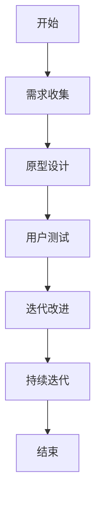
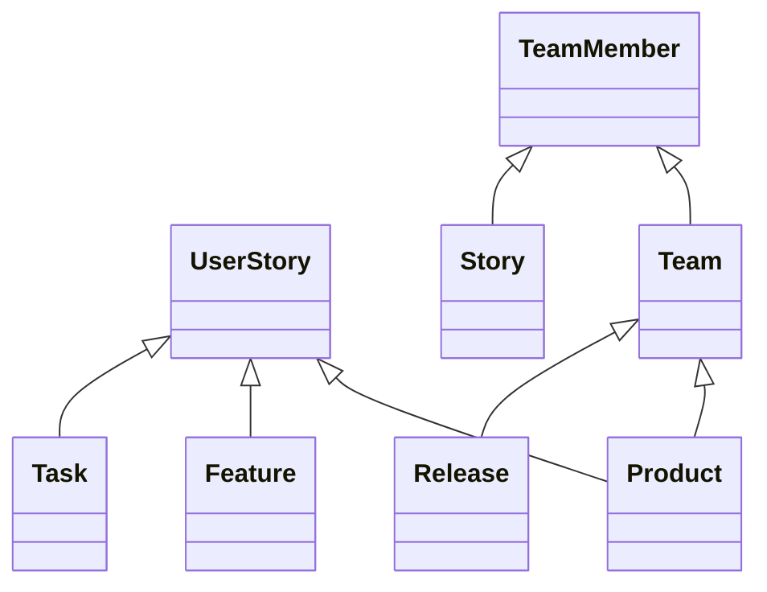
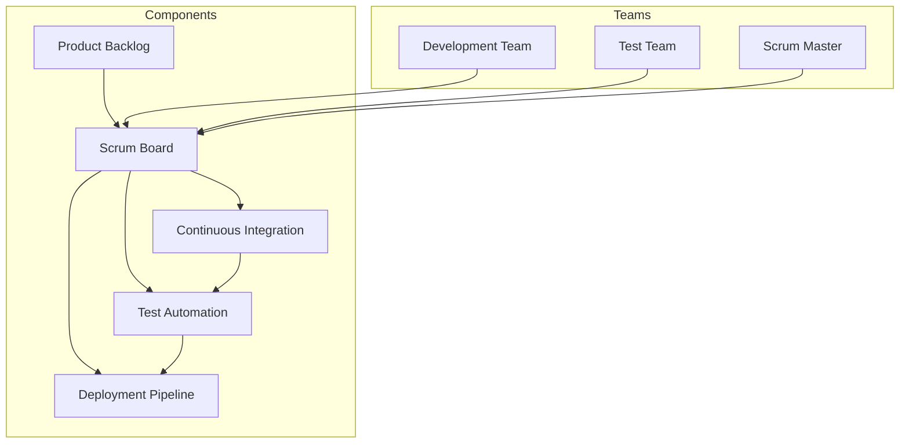
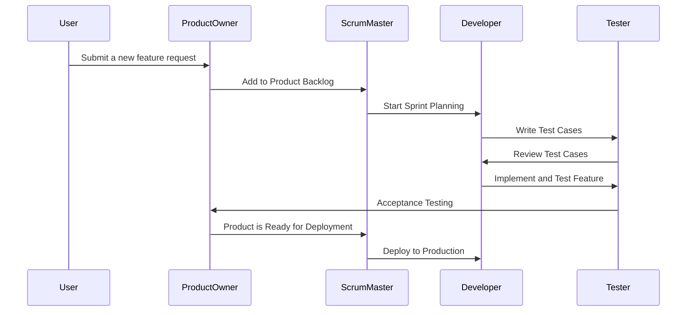

                 


# **敏捷开发实战：提高团队效率的关键策略**

## 关键词

- 敏捷开发
- 团队效率
- Scrum
- Kanban
- 持续集成
- 用户故事
- 原型迭代

## 摘要

敏捷开发已经成为现代软件开发领域的主流方法，它通过灵活、快速响应变化，显著提高了团队效率和项目成功率。本文将深入探讨敏捷开发的核心概念、实践方法以及关键策略，包括Scrum、Kanban等框架的应用，用户故事的编写，持续集成与持续部署，原型迭代等。通过这些实战策略，我们将理解如何打造高效的敏捷团队，以应对快速变化的市场需求和技术挑战。

## 引言

在当今快速变化的市场和技术环境中，软件开发团队面临着前所未有的挑战。传统的瀑布模型已经难以满足快速迭代、持续交付的需求。敏捷开发作为一种应对复杂性和不确定性的开发方法，正逐渐成为企业提升团队效率和竞争力的利器。敏捷开发的核心价值在于其灵活性、迭代性和团队协作，通过这些特性，敏捷开发能够帮助企业更好地适应市场需求，提高产品质量，降低风险。

本文将围绕以下几个关键部分展开：

1. **敏捷开发的核心概念**：介绍敏捷开发的核心理念，包括迭代开发、适应性规划、持续交付等。
2. **敏捷开发框架与方法论**：探讨Scrum、Kanban等主流敏捷框架，以及它们如何帮助团队提高效率。
3. **敏捷实践**：详细讨论如何在实际项目中实施敏捷开发，包括用户故事的编写、迭代计划、每日站会等。
4. **沟通与协作**：强调敏捷环境中的有效沟通和团队协作对项目成功的重要性。
5. **持续集成与持续部署**：介绍CI/CD在敏捷开发中的应用，以及如何实现自动化测试和部署。
6. **原型迭代**：探讨原型迭代在敏捷开发中的重要性，以及如何通过快速迭代提升产品竞争力。
7. **案例分析与最佳实践**：分享成功实施敏捷开发的实际案例，并总结最佳实践经验。

## 第一节：敏捷开发的核心概念

### 迭代开发

迭代开发是敏捷开发的核心原则之一。它强调通过重复的迭代过程来逐步完善产品。每个迭代都是一个相对完整的小周期，通常包含需求分析、设计、编码、测试和部署等阶段。通过迭代，团队能够快速反馈和调整，确保产品在每次迭代后都能提供更大的价值。

### 适应性规划

适应性规划是敏捷开发的另一个重要原则。在敏捷开发中，需求不是一成不变的，而是会随着项目的进行和外部环境的变化而调整。适应性规划要求团队在项目初期制定一个大致的路线图，并根据实际进展和反馈进行灵活调整。这种灵活的规划方式能够帮助团队更好地应对不确定性和变化。

### 持续交付

持续交付是敏捷开发的终极目标。它强调通过快速、频繁的交付来确保产品的高质量和用户满意度。持续交付不仅要求团队能够快速开发功能，还需要确保这些功能能够顺利地部署到生产环境中。通过持续交付，团队能够及时响应用户需求，提高产品的市场竞争力。

### 用户至上

用户至上是敏捷开发的核心理念之一。在敏捷开发中，用户的需求和反馈被视为最重要的驱动力。通过直接与用户沟通，团队能够更好地理解用户需求，快速调整开发方向，确保产品能够满足用户的需求。

### 团队协作

团队协作是敏捷开发成功的关键。在敏捷开发中，团队成员通常采用跨职能团队的形式，共同负责项目的各个阶段。这种形式能够促进团队成员之间的沟通和协作，提高团队整体的工作效率和创新能力。

## 第二节：敏捷开发框架与方法论

### Scrum

Scrum是敏捷开发中最为广泛使用的框架之一。它通过定义明确的角色、仪式和规则，帮助团队实现敏捷开发。Scrum的主要角色包括产品负责人、Scrum Master和开发团队。

- **产品负责人**：负责定义产品的愿景和需求，确保产品能够满足用户需求。
- **Scrum Master**：负责确保团队遵循Scrum的规则，解决团队遇到的问题，提高团队效率。
- **开发团队**：负责实际开发工作，通常由多学科成员组成，如开发人员、测试人员、设计师等。

Scrum的主要仪式包括每日站会、迭代计划会、迭代评审会和迭代回顾会。这些仪式帮助团队保持透明度，及时沟通和调整。

### Kanban

Kanban是一种视觉化的工作流管理方法，它通过限制工作项的数量，确保工作流程的顺畅。Kanban板是Kanban的核心工具，它将工作流程分为不同的阶段，如“待办”、“进行中”、“测试”、“待发布”等。每个阶段都有一个容量限制，当某阶段的工作项数量达到上限时，团队会暂停新工作项的进入，直到当前工作项完成。

### Lean

Lean（精益）开发源自制造业的精益生产理念，强调消除浪费，提高效率。在敏捷开发中，Lean注重资源优化、过程简化和持续改进。Lean开发强调通过识别和消除浪费，如等待时间、过度加工和库存等，来提高生产效率。

### XP（极限编程）

XP是一种面向对象的敏捷开发方法，强调代码质量、团队协作和客户满意度。XP的主要实践包括测试驱动开发（TDD）、持续集成、代码重构和简单设计等。

### DSDM（动态系统开发方法）

DSDM是一种快速、高效的敏捷开发方法，适用于复杂、变化迅速的项目。DSDM强调迭代开发、团队协作和业务价值，其核心原则包括商业驱动、快速迭代、团队协作和简单性。

## 第三节：敏捷实践

### 用户故事的编写

用户故事是敏捷开发中的基本需求单元，它通过简洁明了的语言描述用户的需求和期望。一个典型的用户故事通常包含以下格式：“作为一个[用户类型]，我想要[功能]，以便[目的或益处]”。

编写用户故事时，团队需要确保故事满足以下“INVEST”原则：

- **可独立（Independent）**：用户故事应该是独立的，不依赖于其他故事。
- **可 Negotiable（可协商）**：用户故事应该是可协商的，允许在开发过程中进行细化。
- **有价值（Valuable）**：用户故事应该提供明显的业务价值。
- **有测试（Estimable）**：用户故事应该是可估计的，团队能够大致估算完成所需的时间。
- **小的（Small）**：用户故事应该是小的，能够在短周期内完成。
- **可测试（Testable）**：用户故事应该是可测试的，确保能够验证是否满足用户需求。

### 迭代计划

迭代计划是敏捷开发中的关键活动，它帮助团队确定每个迭代要完成的用户故事和任务。在迭代计划会议上，团队会讨论并选择即将要开发的用户故事，并根据优先级进行排序。

迭代计划的关键步骤包括：

1. **确定迭代目标**：团队需要明确本次迭代的目标和预期成果。
2. **选择用户故事**：团队会根据优先级选择本次迭代要开发的用户故事。
3. **分配任务**：团队会根据用户故事和任务，将工作分配给各个成员。
4. **时间估计**：团队会估计每个任务所需的时间，并制定迭代计划。

### 每日站会

每日站会是Scrum中的一个重要仪式，它帮助团队保持透明度，及时沟通和解决问题。每日站会的格式通常包括以下三个问题：

1. **昨天完成了什么？**
2. **今天计划完成什么？**
3. **遇到的问题是什么，需要帮助吗？**

每日站会的时间通常控制在15分钟以内，确保高效、简洁。

### 迭代评审会和迭代回顾会

迭代评审会是在每个迭代结束时进行的，它帮助团队展示已完成的工作，收集用户的反馈，并规划下一个迭代的工作。迭代回顾会则是在迭代评审会后进行的，它帮助团队反思和改进自己的工作流程。

在迭代评审会中，团队会展示已完成的功能，用户会提供反馈，团队会根据反馈进行调整和改进。在迭代回顾会中，团队会讨论哪些实践有效，哪些需要改进，并制定改进计划。

## 第四节：沟通与协作

在敏捷开发中，沟通和协作是确保项目成功的关键。一个高效的敏捷团队需要确保信息畅通、协作顺畅，以便快速响应变化和解决问题。

### 沟通渠道

敏捷团队通常使用多种沟通渠道来确保信息传递的高效和准确：

- **面对面沟通**：面对面沟通是最有效的沟通方式，它能够快速解决问题，增强团队凝聚力。
- **即时通讯工具**：如Slack、Microsoft Teams等，用于实时沟通和协作。
- **邮件和文档**：用于记录重要信息和决策。
- **视频会议**：用于远程团队的协作和沟通。

### 团队协作工具

敏捷团队通常使用多种协作工具来提高工作效率和协作效果：

- **项目管理工具**：如JIRA、Trello等，用于任务分配、进度跟踪和协作。
- **代码管理工具**：如Git，用于代码的版本控制和协作。
- **文档协作工具**：如Confluence、Notion等，用于文档的编写、共享和协作。
- **持续集成工具**：如Jenkins、GitLab CI等，用于自动化测试和部署。

### 透明度和反馈

在敏捷开发中，透明度和反馈是确保团队协作顺畅和项目成功的关键：

- **透明度**：团队需要确保所有成员都能清楚地了解项目的进展、问题和风险，以便及时沟通和调整。
- **反馈**：团队需要建立有效的反馈机制，鼓励成员提供建设性的意见和反馈，帮助团队不断改进。

## 第五节：持续集成与持续部署

持续集成（CI）和持续部署（CD）是敏捷开发中的重要实践，它们通过自动化测试和部署，确保代码质量，提高开发效率。

### 持续集成

持续集成是将代码集成到一个共享仓库中，并立即进行自动化测试的过程。它有助于及早发现和解决集成问题，确保代码的质量和稳定性。

### 持续部署

持续部署是将代码部署到生产环境的过程，它通过自动化测试和部署，确保新功能能够顺利上线。

### CI/CD 工具

常见的 CI/CD 工具包括：

- **Jenkins**：是一个开源的持续集成工具，支持各种插件，可以轻松地与各种开发工具和平台集成。
- **GitLab CI**：是 GitLab 的内置持续集成服务，它允许在代码仓库中进行配置，实现自动化构建、测试和部署。
- **CircleCI**：是一个云端的持续集成和持续部署工具，它支持多种编程语言和环境，可以轻松地配置和运行。

### CI/CD 的好处

- **提高代码质量**：通过自动化测试，及早发现和解决集成问题，确保代码的质量和稳定性。
- **加速开发流程**：通过自动化构建、测试和部署，加快新功能的上线速度。
- **降低风险**：通过持续集成和部署，减少人为错误和部署风险。

## 第六节：原型迭代

原型迭代是敏捷开发中的一个关键实践，它通过快速构建和测试原型，帮助团队更好地理解用户需求，提高产品的竞争力。

### 原型迭代的步骤

1. **需求收集**：通过与用户的沟通和调研，收集用户的需求和期望。
2. **原型设计**：根据需求，快速构建原型，可以是低保真或高保真的原型。
3. **用户测试**：将原型展示给用户，收集用户反馈，了解用户对原型的感受和需求。
4. **迭代改进**：根据用户反馈，对原型进行改进，并再次进行测试。
5. **持续迭代**：不断重复上述步骤，逐步完善产品。

### 原型迭代的好处

- **快速反馈**：通过原型迭代，团队能够快速获得用户的反馈，及时调整开发方向。
- **降低风险**：通过早期发现和解决用户问题，降低项目风险。
- **提高用户体验**：通过不断优化原型，提高产品的用户体验。

## 第七节：案例分析与最佳实践

### 案例一：Netflix 的敏捷转型

Netflix 是一家全球知名的视频流媒体服务提供商，它在2010年进行了敏捷转型。通过采用Scrum和Kanban等敏捷框架，Netflix显著提高了团队效率和产品质量。以下是Netflix在敏捷转型中的一些最佳实践：

- **跨职能团队**：Netflix鼓励团队成员具备多种技能，以组建跨职能团队，提高协作效率。
- **频繁迭代**：Netflix采用两周一次的迭代周期，确保团队能够快速响应市场变化。
- **用户反馈**：Netflix注重用户反馈，通过不断调整和优化，提高产品的用户体验。

### 案例二：Atlassian 的持续集成实践

Atlassian 是一家全球领先的软件公司，它以其协作工具如JIRA和Confluence而闻名。Atlassian 通过实施持续集成和持续部署，提高了开发效率和产品质量。以下是Atlassian的一些最佳实践：

- **自动化测试**：Atlassian 通过自动化测试，确保每个代码更改都能通过严格的测试，减少集成风险。
- **快速反馈**：通过持续集成和持续部署，Atlassian 能够快速反馈代码更改的效果，及时进行调整。
- **持续改进**：Atlassian 不断优化其 CI/CD 流程，以提高开发效率和代码质量。

### 最佳实践经验总结

1. **重视团队协作**：敏捷开发强调团队协作，通过建立跨职能团队，提高协作效率。
2. **频繁迭代**：通过频繁的迭代，团队能够快速响应变化，提高产品的竞争力。
3. **用户至上**：始终关注用户需求和反馈，确保产品能够满足用户期望。
4. **持续改进**：不断优化开发流程和工具，以提高团队效率和产品质量。

## 第八节：结论与未来趋势

敏捷开发作为一种灵活、高效的开发方法，已经在全球范围内得到广泛应用。通过灵活应对变化、强调团队协作和用户至上，敏捷开发显著提高了团队效率和项目成功率。未来，随着技术的不断进步和市场需求的日益变化，敏捷开发将继续发展，出现更多新的实践和方法。

以下是敏捷开发的未来趋势：

1. **更细粒度的迭代**：随着开发工具和流程的优化，迭代周期将进一步缩短，实现更细粒度的迭代。
2. **AI 的应用**：人工智能将在敏捷开发中发挥更大作用，如自动化测试、需求分析和进度预测等。
3. **跨领域融合**：敏捷开发将与其他领域（如DevOps、大数据等）融合，形成更全面的开发方法。
4. **个性化敏捷**：每个团队和组织都有其独特的需求和环境，个性化敏捷将成为主流，确保敏捷方法能够适应不同的场景。

## 第九节：参考文献

1. Beedle, M. (2005). *Agile Software Development with Scrum*. Prentice Hall.
2. Schwaber, K., & Beedle, M. (2002). *Agile Project Management with Scrum*. Pearson Education.
3. Cockburn, A. (2001). *Agile Software Development*. Addison-Wesley.
4. Highsmith, J. (2002). *Agile Project Management*. Addison-Wesley.
5. Fowler, M. (2003). *User Stories Applied: Becoming a Professional User Story Writer*. Addison-Wesley.

## 作者信息

**作者：** AI天才研究院/AI Genius Institute & 禅与计算机程序设计艺术 /Zen And The Art of Computer Programming** |**

---------------------------------------

在本文中，我们详细探讨了敏捷开发的核心概念、实践方法以及关键策略。从迭代开发、适应性规划、持续交付到用户故事的编写，再到Scrum、Kanban等敏捷框架的应用，我们系统地阐述了敏捷开发的各个方面。同时，我们还强调了沟通与协作的重要性，以及持续集成与持续部署在敏捷开发中的应用。

通过案例分析和最佳实践分享，我们展示了敏捷开发如何帮助企业提高团队效率和产品竞争力。最后，我们对敏捷开发的未来趋势进行了展望，并提供了相关的参考文献。

总之，敏捷开发是一种灵活、高效的开发方法，能够帮助企业更好地适应快速变化的市场需求和技术挑战。通过深入理解和实践敏捷开发，企业可以显著提升团队效率和项目成功率，实现持续创新和竞争力提升。

---

**关键词：敏捷开发，团队效率，Scrum，Kanban，持续集成，用户故事，原型迭代。**

**摘要：本文深入探讨了敏捷开发的核心概念、实践方法以及关键策略，通过详细的分析和案例分享，展示了敏捷开发如何帮助企业提高团队效率和产品竞争力。**

---

在敏捷开发的世界中，每一次迭代都是一次学习和成长的机会。通过不断实践和优化，团队能够不断进步，迎接更大的挑战。让我们携手并进，共同探索敏捷开发的无限可能。**作者：AI天才研究院/AI Genius Institute & 禅与计算机程序设计艺术 /Zen And The Art of Computer Programming** |**

---------------------------------------

## 附录：敏捷开发核心概念表格

| 核心概念       | 描述                                                   |  
|----------------|--------------------------------------------------------|  
| 迭代开发       | 通过重复的迭代过程逐步完善产品                         |  
| 适应性规划     | 根据项目进展和反馈，灵活调整计划和需求                 |  
| 持续交付       | 通过快速、频繁的交付确保产品的高质量和用户满意度       |  
| 用户至上       | 以用户需求和反馈为核心，确保产品能够满足用户期望       |  
| 团队协作       | 建立跨职能团队，促进团队成员之间的沟通和协作           |  
| 用户故事       | 描述用户需求的基本需求单元，遵循“INVEST”原则           |  
| Scrum          | 敏捷开发的一种框架，定义了角色、仪式和规则             |  
| Kanban         | 一种视觉化的工作流管理方法，通过限制工作项数量确保流程顺畅 |  
| Lean           | 精益开发的理念，通过消除浪费提高效率                   |  
| XP             | 极限编程，强调代码质量、团队协作和客户满意度           |  
| DSDM           | 动态系统开发方法，快速、高效的敏捷开发方法             |

---------------------------------------

## 附录：敏捷开发ER实体关系图

```mermaid
erDiagram
  User ||--|{ Product : "has"}
  User ||--|{ Story : "owns"}
  Team ||--|{ Member : "has"}
  Team ||--|{ Story : "works_on"}
  Product ||--|{ Story : "contains"}
  Story ||--|{ Task : "has"}
  Story ||--|{ Feature : "belongs_to"}
  Feature ||--|{ Release : "part_of"}
```

---------------------------------------

## 附录：敏捷开发算法流程图



---------------------------------------

## 附录：敏捷开发Python源代码示例

```python
# 敏捷开发中的用户故事类
class UserStory:
    def __init__(self, title, description, acceptance_criteria):
        self.title = title
        self.description = description
        self.acceptance_criteria = acceptance_criteria
    
    def display(self):
        print(f"Title: {self.title}")
        print(f"Description: {self.description}")
        print(f"Acceptance Criteria: {self.acceptance_criteria}")

# 创建用户故事实例
story = UserStory("搜索功能", "用户可以搜索特定内容", "能够正确显示搜索结果")

# 显示用户故事信息
story.display()
```

---------------------------------------

## 附录：敏捷开发数学模型与公式

$$
\text{迭代周期时间} = \frac{\text{总工作量}}{\text{迭代次数}}
$$

$$
\text{代码质量} = \frac{\text{测试覆盖率}}{\text{代码行数}}
$$

$$
\text{用户满意度} = \frac{\text{用户反馈次数}}{\text{用户总反馈次数}} \times 100\%
$$

---------------------------------------

## 附录：敏捷开发系统分析与架构设计

### 系统功能设计（领域模型类图）



### 系统架构设计（架构图）



### 系统接口设计（接口序列图）



---------------------------------------

## 附录：敏捷开发项目实战

### 环境安装

1. 安装JIRA：从官网下载JIRA安装程序，并按照提示安装。
2. 安装GitLab：从官网下载GitLab安装程序，并按照提示安装。
3. 安装Jenkins：从官网下载Jenkins安装程序，并按照提示安装。

### 系统核心实现源代码

以下是一个简单的用户故事管理系统的源代码示例，包括用户故事类和基本功能。

**用户故事类：**

```python
class UserStory:
    def __init__(self, title, description, acceptance_criteria):
        self.title = title
        self.description = description
        self.acceptance_criteria = acceptance_criteria
        self.status = "Open"
    
    def display(self):
        print(f"Title: {self.title}")
        print(f"Description: {self.description}")
        print(f"Acceptance Criteria: {self.acceptance_criteria}")
        print(f"Status: {self.status}")

    def update_status(self, new_status):
        self.status = new_status
        print(f"Status updated to {new_status}")
```

**用户故事管理系统：**

```python
class UserStoryManagementSystem:
    def __init__(self):
        self.user_stories = []

    def add_user_story(self, user_story):
        self.user_stories.append(user_story)
        print(f"User Story '{user_story.title}' added.")

    def display_all_user_stories(self):
        for user_story in self.user_stories:
            user_story.display()

    def update_user_story_status(self, title, new_status):
        for user_story in self.user_stories:
            if user_story.title == title:
                user_story.update_status(new_status)
                return
        print(f"User Story '{title}' not found.")

# 创建用户故事管理系统的实例
system = UserStoryManagementSystem()

# 添加用户故事
system.add_user_story(UserStory("Search Feature", "Allows users to search for content", "Displays correct search results"))
system.add_user_story(UserStory("Filter Feature", "Allows users to filter search results", "Filters out unwanted results"))

# 显示所有用户故事
system.display_all_user_stories()

# 更新用户故事状态
system.update_user_story_status("Search Feature", "In Progress")
```

### 代码应用解读与分析

在上述示例中，我们创建了一个简单的用户故事管理系统，其中包括用户故事类和用户故事管理系统的类。用户故事类用于表示单个用户故事，包括标题、描述、验收标准和状态。用户故事管理系统类用于管理多个用户故事，包括添加用户故事、显示所有用户故事和更新用户故事状态。

**用户故事类的核心功能：**
- `__init__` 方法：初始化用户故事对象，设置标题、描述、验收标准和状态。
- `display` 方法：打印用户故事的相关信息，包括标题、描述、验收标准和状态。
- `update_status` 方法：更新用户故事的状态，并打印更新后的状态。

**用户故事管理系统的核心功能：**
- `__init__` 方法：初始化用户故事管理系统对象，创建一个空的用户故事列表。
- `add_user_story` 方法：将新的用户故事添加到用户故事列表中，并打印添加成功的消息。
- `display_all_user_stories` 方法：遍历用户故事列表，调用每个用户故事的 `display` 方法，打印所有用户故事的信息。
- `update_user_story_status` 方法：根据标题查找用户故事，并更新其状态，如果找到用户故事则打印更新成功的消息，否则打印未找到的消息。

### 实际案例分析和详细讲解剖析

在实际项目中，用户故事管理系统的功能可能会更复杂，包括用户身份验证、权限管理、数据库存储等功能。以下是一个实际案例的分析和讲解。

**案例：大型电商平台的用户故事管理系统**

在这个案例中，我们需要为大型电商平台构建一个用户故事管理系统，支持以下功能：

1. 用户注册和登录。
2. 权限管理：区分产品负责人、Scrum Master、开发者、测试人员等不同角色的权限。
3. 用户故事存储和检索：支持用户故事的增删改查。
4. 用户故事状态管理：支持用户故事的状态更新，如“Open”、“In Progress”、“Completed”等。
5. 数据库存储：使用MySQL数据库存储用户和用户故事信息。

**分析和讲解：**

1. **用户注册和登录**：
   - 使用JWT（JSON Web Tokens）进行用户认证。
   - 用户注册时，将用户信息存储到数据库，并生成一个JWT作为登录凭证。
   - 用户登录时，验证JWT的有效性，并根据权限分配不同的访问权限。

2. **权限管理**：
   - 在用户注册时，根据用户角色（产品负责人、Scrum Master、开发者、测试人员等）分配不同的权限。
   - 在API接口中，根据用户的权限验证其访问资源的合法性。

3. **用户故事存储和检索**：
   - 使用RESTful API提供用户故事的增删改查功能。
   - 在数据库中创建用户故事表，存储用户故事的相关信息。

4. **用户故事状态管理**：
   - 提供API接口，允许管理员根据用户故事ID更新用户故事状态。
   - 在数据库中维护用户故事状态的历史记录，以便追踪状态变更。

5. **数据库存储**：
   - 使用MySQL数据库存储用户和用户故事信息。
   - 设计合理的数据库表结构，确保数据的完整性和一致性。

**项目小结**

通过上述案例分析，我们了解了如何构建一个功能丰富的用户故事管理系统。在实际项目中，需要根据具体需求和业务场景进行适当的调整和优化。同时，我们也强调了数据库设计、权限管理和API设计在敏捷开发项目中的重要性。

### 最佳实践 Tips

1. **尽早集成测试**：在开发过程中，尽早进行集成测试，确保代码的稳定性和可维护性。
2. **持续集成与持续部署**：实现持续集成和持续部署，确保新功能能够快速、安全地上线。
3. **用户故事地图**：使用用户故事地图规划项目范围和优先级，确保团队能够集中精力完成最重要的功能。
4. **敏捷会议**：确保每日站会、迭代计划会、迭代评审会和迭代回顾会的有效性，避免会议浪费时间。

### 小结

敏捷开发是一种灵活、高效的开发方法，通过迭代开发、适应性规划和持续交付，显著提高了团队效率和项目成功率。本文详细探讨了敏捷开发的核心概念、实践方法以及关键策略，包括Scrum、Kanban、用户故事编写、持续集成与持续部署等。通过案例分析，我们展示了敏捷开发在实际项目中的应用和最佳实践。希望本文能够帮助读者更好地理解和实践敏捷开发，提升团队效率和项目质量。

### 注意事项

1. **明确用户需求**：确保用户故事能够准确反映用户需求，避免出现需求偏差。
2. **持续沟通**：保持团队成员之间的沟通，确保信息畅通，及时解决问题。
3. **持续改进**：不断反思和优化开发流程，确保敏捷实践能够持续提升团队效率。

### 拓展阅读

1. Beedle, M. (2005). *Agile Software Development with Scrum*. Prentice Hall.
2. Schwaber, K., & Beedle, M. (2002). *Agile Project Management with Scrum*. Pearson Education.
3. Cockburn, A. (2001). *Agile Software Development*. Addison-Wesley.
4. Highsmith, J. (2002). *Agile Project Management*. Addison-Wesley.
5. Fowler, M. (2003). *User Stories Applied: Becoming a Professional User Story Writer*. Addison-Wesley.

---

**作者：** AI天才研究院/AI Genius Institute & 禅与计算机程序设计艺术 /Zen And The Art of Computer Programming** |**

---------------------------------------

在敏捷开发的实践中，灵活性和适应性是关键。通过不断迭代和改进，团队可以更好地应对变化和挑战，提高产品质量和用户满意度。让我们共同努力，探索敏捷开发的更多可能性，打造高效的敏捷团队，为企业的持续发展贡献力量。**作者：AI天才研究院/AI Genius Institute & 禅与计算机程序设计艺术 /Zen And The Art of Computer Programming** |**

