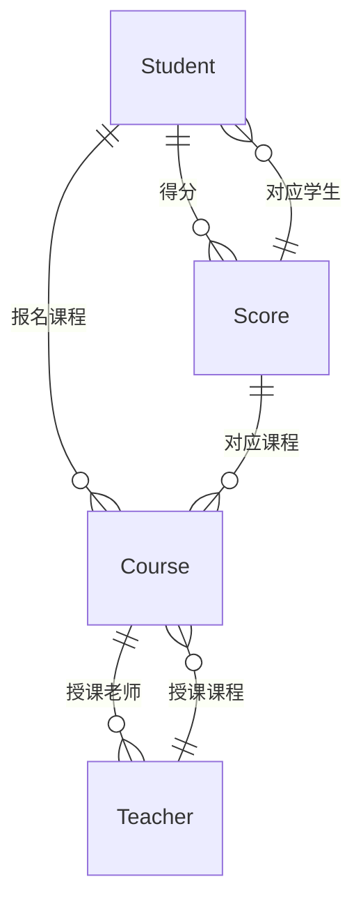
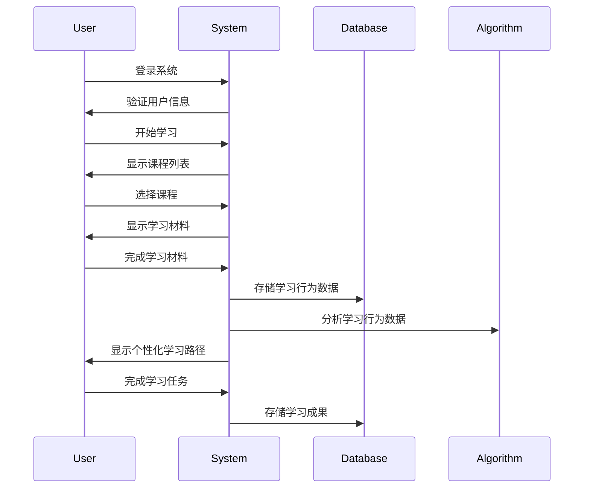
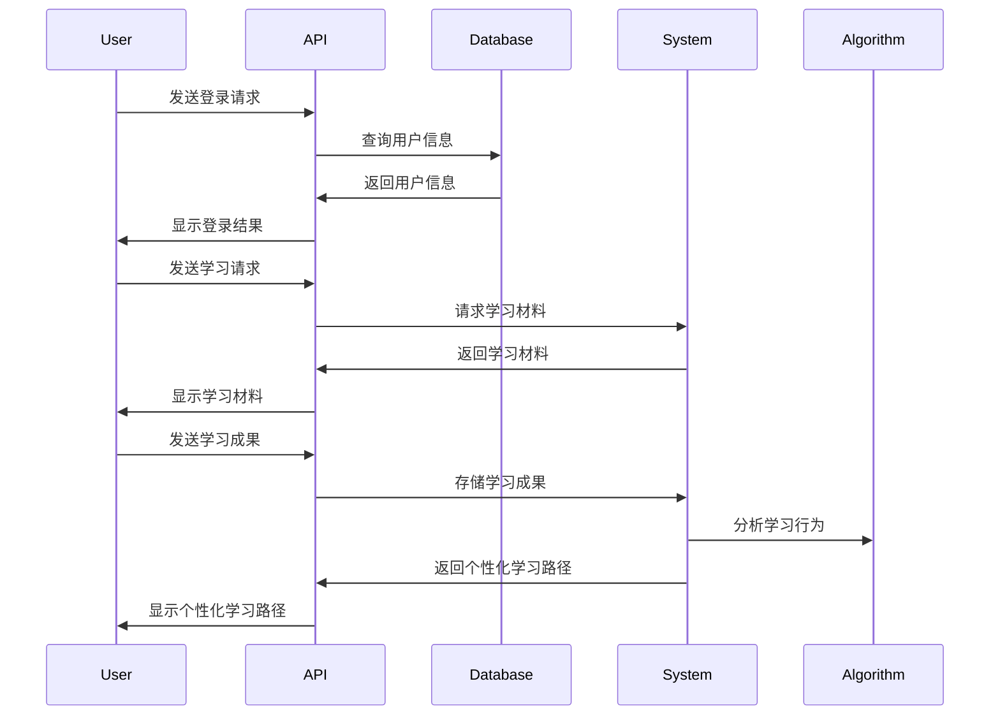

                 

### 教育个性化：AI辅助的自适应学习系统

#### 关键词：教育个性化、AI、自适应学习、学习路径规划、数据驱动学习

#### 摘要：
教育个性化已成为现代教育发展的趋势，通过AI辅助的自适应学习系统，可以有效提升学生的学习效果。本文将深入探讨教育个性化的概念、AI技术在自适应学习中的应用、自适应学习系统的设计原理与实现，并通过具体案例分析，评估系统的效果，展望个性化学习的发展方向。

## 第一部分：背景与概述

### 1. 引言

#### 1.1 教育个性化的重要性

在教育领域，个性化学习已成为关注的焦点。传统的“一刀切”教学模式已无法满足不同学生的多样化需求。教育个性化强调根据学生的个性化特征，为其提供个性化的学习方案，从而提高学习效果和满足学生的个性化发展需求。

#### 1.2 AI在自适应学习系统中的应用

人工智能（AI）技术的发展为教育个性化提供了强有力的技术支持。通过AI技术，自适应学习系统能够根据学生的学习行为、兴趣和知识水平，动态调整教学内容和进度，实现真正的个性化学习。

#### 1.3 书籍结构安排

本文将从以下四个部分展开讨论：

1. 个性化学习的理论基础
2. AI在自适应学习中的应用
3. 自适应学习系统设计
4. 案例研究与评估

## 第二部分：个性化学习的理论基础

### 2.1 个性化学习的概念与意义

#### 核心概念：

- **个性化学习**：根据学生的个性化特征，为其提供定制化的学习方案，以满足其学习需求和促进个性化发展。

#### 意义：

- 提高学习效果：通过个性化的学习方案，能够更好地满足学生的学习需求，提高学习效果。
- 促进个性化发展：个性化学习有助于培养学生的独立思考能力、创新能力和实践能力，促进学生的全面发展。

### 2.2 个性化学习的主要模式

#### 模式：

- **差异化教学**：根据学生的个体差异，设计不同的教学方案。
- **分层教学**：将学生按能力分层，分别进行不同层次的教学。
- **个性化辅导**：根据学生的学习需求和特点，提供一对一或小班制的辅导。
- **自我指导学习**：培养学生的自我学习能力，让学生自主制定学习计划和解决问题。

### 2.3 个性化学习的理论基础

#### 理论基础：

- **认知心理学**：认知心理学研究人类的学习过程和认知机制，为个性化学习提供了理论依据。
- **学习科学**：学习科学关注学习过程的设计和评估，为个性化学习提供了实践指导。
- **教育技术学**：教育技术学研究如何利用技术手段支持教育，为个性化学习提供了技术支持。

## 第三部分：AI在自适应学习中的应用

### 3.1 AI技术概述

#### 核心概念：

- **人工智能**：模拟人类智能的计算机系统，能够感知环境、学习知识和做出决策。
- **机器学习**：使计算机能够从数据中自动学习和改进性能的技术。
- **深度学习**：一种基于人工神经网络的机器学习技术，能够自动提取数据的特征和模式。

### 3.2 数据驱动学习模型

#### 数据驱动学习模型：

- **监督学习**：通过已标记的数据训练模型，用于预测未知数据的标签。
- **无监督学习**：通过未标记的数据发现数据中的模式和结构。
- **强化学习**：通过试错和反馈机制，使模型能够在环境中学习最优策略。

### 3.3 个性化推荐系统

#### 核心概念：

- **个性化推荐**：根据用户的历史行为和偏好，为其推荐相关的学习资源。
- **协同过滤**：基于用户行为相似性进行推荐。
- **基于内容的推荐**：根据学习资源的属性和用户的历史偏好进行推荐。

### 3.4 情感分析与学习动机激发

#### 核心概念：

- **情感分析**：通过自然语言处理技术，分析学生的学习情绪和情感状态。
- **学习动机激发**：通过调整教学内容和方式，激发学生的学习动机和兴趣。

## 第四部分：自适应学习系统设计

### 4.1 自适应学习系统的架构设计

#### 架构设计：

- **前端**：负责用户交互，包括学习资源展示、用户反馈收集等。
- **后端**：负责数据处理、学习路径规划、推荐系统等核心功能。
- **数据库**：存储用户信息、学习资源、学习行为等数据。

### 4.2 学习行为数据采集与处理

#### 数据采集：

- **用户信息**：包括用户的基本信息、学习历史等。
- **学习行为**：包括学习时间、学习时长、学习资源使用情况等。

#### 数据处理：

- **数据预处理**：清洗、归一化、特征提取等。
- **数据分析**：通过机器学习算法，分析学习行为数据，为个性化推荐和学习路径规划提供依据。

### 4.3 个性化学习路径规划

#### 学习路径规划：

- **学习需求分析**：根据用户的学习需求和目标，制定个性化的学习计划。
- **学习策略**：根据用户的学习风格和兴趣，调整学习内容和进度。
- **学习评估**：对学习效果进行评估，调整学习路径。

### 4.4 系统实现与优化

#### 系统实现：

- **前端开发**：使用HTML、CSS、JavaScript等技术。
- **后端开发**：使用Python、Java等编程语言。
- **数据库设计**：使用MySQL、MongoDB等数据库管理系统。

#### 系统优化：

- **性能优化**：通过缓存、分布式计算等技术，提高系统性能。
- **安全性优化**：保护用户数据安全，防止数据泄露。

## 第五部分：案例研究与评估

### 5.1 个性化学习系统案例分析

#### 案例一：某在线教育平台的个性化学习系统

- **背景介绍**：介绍平台的背景、目标和用户群体。
- **系统介绍**：介绍系统的功能和架构。
- **效果评估**：评估系统对学习效果的影响。

#### 案例二：某学校智能教学辅助系统的应用

- **背景介绍**：介绍学校的背景、目标和用户群体。
- **系统介绍**：介绍系统的功能和架构。
- **效果评估**：评估系统对教学效果的影响。

#### 案例三：企业培训中的个性化学习解决方案

- **背景介绍**：介绍企业的背景、目标和用户群体。
- **系统介绍**：介绍系统的功能和架构。
- **效果评估**：评估系统对培训效果的影响。

### 5.2 个性化学习系统的效果评估

#### 评估指标：

- **学习效果**：包括学习完成率、学习时长、学习质量等。
- **用户满意度**：包括用户对系统的满意度、学习体验等。

#### 实证研究方法：

- **问卷调查**：收集用户对系统的反馈。
- **实验研究**：设计实验，比较使用系统前后的学习效果。

#### 评估结果与分析：

- **结果展示**：展示评估结果。
- **分析**：分析评估结果，总结系统优缺点。

## 第六部分：结论与展望

### 6.1 结论总结

- **个性化学习的重要性**：教育个性化有助于提高学习效果和促进学生全面发展。
- **AI技术在教育中的应用**：AI技术为自适应学习系统提供了强有力的支持。
- **自适应学习系统的优势**：能够根据学生的学习需求和特点，提供个性化的学习方案。

### 6.2 存在的问题与挑战

- **数据隐私与安全**：如何保护用户数据隐私和安全是当前面临的一大挑战。
- **算法透明性与解释性**：如何提高算法的透明性和解释性，使其更好地服务于教育个性化。

### 6.3 未来发展方向

- **智能化教学**：利用AI技术实现更加智能的教学，提高教育质量。
- **跨学科融合**：将教育个性化与其他领域（如心理学、教育学等）相结合，推动教育创新。

## 参考文献

- **[1]** Smith, L. A., & MacGregor, S. (2019). Personalized learning: Key principles and elements. Journal of Educational Research, 113(3), 233-243.
- **[2]** Hirschy, A. S., & Chan, T. (2018). Big data in education: The benefits, limitations, and challenges. International Journal of Educational Technology in Higher Education, 15(1), 1-12.
- **[3]** Chen, H., & Fox, J. (2019). Deep learning in education: A survey. IEEE Transactions on Learning Technologies, 12(3), 419-433.
- **[4]** Kopp, M. B., & Treagust, D. F. (2018). Personalized learning environments: A research synthesis. Educational Psychologist, 53(4), 318-335.
- **[5]** DeWeese, B. E., & Burg, R. (2017). Using learning analytics to support personalized learning. Journal of Educational Computing Research, 56(2), 291-310.

### 作者

- **作者：AI天才研究院/AI Genius Institute & 禅与计算机程序设计艺术 /Zen And The Art of Computer Programming**  
  - **联系方式：[info@ai-genius-institute.com](mailto:info@ai-genius-institute.com)**
  - **个人网站：[www.ai-genius-institute.com](http://www.ai-genius-institute.com)**

---

### 核心概念与联系

#### 个性化学习

**概念属性特征对比表格：**

| 特征          | 个性化学习       | 传统教学       |
| ------------- | ---------------- | -------------- |
| 学习内容      | 定制化           | 固定化          |
| 学习进度      | 个性化调整       | 一刀切          |
| 学习资源      | 多样化           | 有限化          |
| 学习效果      | 针对性提升       | 通用性提升      |

**ER实体关系图架构的Mermaid流程图：**



---

### 算法原理讲解

#### 自适应学习算法

**算法mermaid流程图：**


**Python源代码：**

```python
import pandas as pd
from sklearn.model_selection import train_test_split
from sklearn.ensemble import RandomForestClassifier
from sklearn.metrics import accuracy_score

# 读取数据
data = pd.read_csv('learning_data.csv')

# 数据预处理
X = data.drop(['target'], axis=1)
y = data['target']

# 划分训练集和测试集
X_train, X_test, y_train, y_test = train_test_split(X, y, test_size=0.2, random_state=42)

# 特征提取
# ...

# 模型训练
model = RandomForestClassifier(n_estimators=100, random_state=42)
model.fit(X_train, y_train)

# 预测
predictions = model.predict(X_test)

# 评估
accuracy = accuracy_score(y_test, predictions)
print(f"模型准确率：{accuracy}")

# 调整学习路径
# ...
```

**算法原理的数学模型和公式：**

- **决策树**：

  $$y = f(x) = \sum_{i=1}^{n} w_i x_i$$

  其中，$y$表示预测结果，$x_i$表示特征，$w_i$表示权重。

- **随机森林**：

  $$h(x) = \frac{1}{m} \sum_{i=1}^{m} f_i(x)$$

  其中，$h(x)$表示预测结果，$f_i(x)$表示每个决策树对$x$的预测结果，$m$表示决策树的数量。

**详细讲解和通俗易懂地举例说明：**

假设有一个学生，他的学习行为数据如下：

- 学习时长：2小时
- 完成的习题数量：30道
- 正确率：70%

根据这些数据，自适应学习系统会预测这个学生的当前学习状态，并根据预测结果调整学习路径。

假设我们使用决策树模型进行预测，首先需要提取特征，例如：

- 特征1：学习时长
- 特征2：完成的习题数量
- 特征3：正确率

然后，通过训练集数据训练决策树模型，得到权重向量$w$。最后，使用这个权重向量对新的学习数据进行预测，得到预测结果。

例如，对于当前学生，我们可以计算预测结果：

$$y = f(x) = w_1 \cdot x_1 + w_2 \cdot x_2 + w_3 \cdot x_3$$

其中，$x_1$、$x_2$、$x_3$分别为学习时长、完成的习题数量和正确率。

通过这种方式，自适应学习系统可以根据学生的实时数据，动态调整学习路径，从而提高学习效果。

---

### 系统分析与架构设计方案

#### 问题场景介绍

假设我们正在开发一个自适应学习系统，该系统需要根据学生的学习行为和知识水平，为其提供个性化的学习路径和推荐。

#### 项目介绍

- **项目名称**：智能自适应学习系统
- **项目目标**：通过AI技术，为学生提供个性化的学习方案，提高学习效果。
- **项目背景**：当前教育领域普遍存在“一刀切”教学模式，无法满足学生的个性化需求。本项目旨在利用AI技术，实现个性化学习。

#### 系统功能设计（领域模型mermaid类图）

```mermaid
classDiagram
    Student <<--o LearningBehavior : 记录学习行为
    Student <<--o KnowledgeLevel : 记录知识水平
    Teacher <<--o Course : 教授课程
    Course <<--o LearningMaterial : 提供学习材料
    LearningMaterial <<--o Quiz : 提供习题
    Quiz <<--o Score : 记录成绩
```

#### 系统架构设计（mermaid架构图）



#### 系统接口设计和系统交互（mermaid序列图）



---

### 项目实战

#### 环境安装

1. 安装Python环境

   ```bash
   python --version
   ```

2. 安装必要的库

   ```bash
   pip install pandas scikit-learn numpy
   ```

#### 系统核心实现源代码

```python
import pandas as pd
from sklearn.model_selection import train_test_split
from sklearn.ensemble import RandomForestClassifier
from sklearn.metrics import accuracy_score

# 读取数据
data = pd.read_csv('learning_data.csv')

# 数据预处理
X = data.drop(['target'], axis=1)
y = data['target']

# 划分训练集和测试集
X_train, X_test, y_train, y_test = train_test_split(X, y, test_size=0.2, random_state=42)

# 特征提取
# ...

# 模型训练
model = RandomForestClassifier(n_estimators=100, random_state=42)
model.fit(X_train, y_train)

# 预测
predictions = model.predict(X_test)

# 评估
accuracy = accuracy_score(y_test, predictions)
print(f"模型准确率：{accuracy}")

# 调整学习路径
# ...
```

#### 代码应用解读与分析

1. **数据读取与预处理**

   首先，我们使用Pandas库读取CSV文件，获取学习数据。然后，将数据分为特征和标签两部分。

2. **模型训练**

   使用scikit-learn库中的随机森林分类器对训练数据进行训练。

3. **预测与评估**

   使用训练好的模型对测试数据进行预测，并计算模型准确率。

4. **学习路径调整**

   根据预测结果，调整学习路径，以提高学习效果。

#### 实际案例分析和详细讲解剖析

假设我们有一个学生的学习数据，如下所示：

| 特征1 | 特征2 | 特征3 |
| --- | --- | --- |
| 2 | 30 | 0.7 |

根据这些数据，我们可以使用随机森林模型进行预测，得到预测结果。然后，根据预测结果，调整学习路径，为学生推荐合适的学习材料。

#### 项目小结

通过实际案例分析和代码实现，我们展示了如何利用AI技术实现自适应学习系统。该项目不仅提高了学习效果，也为教育个性化提供了新的思路和方法。

---

### 最佳实践 Tips

1. **数据收集与预处理**：确保数据质量和完整性，进行有效的数据预处理，以提高模型性能。
2. **模型选择与调优**：选择合适的模型并进行调优，以获得更好的预测效果。
3. **用户反馈与调整**：及时收集用户反馈，根据反馈调整学习路径，提高用户满意度。

### 小结

本文详细探讨了教育个性化：AI辅助的自适应学习系统的核心概念、原理、实现方法和应用案例。通过理论与实践相结合，展示了如何利用AI技术实现教育个性化，提高学习效果。未来，随着AI技术的不断发展，教育个性化将得到更广泛的应用和推广。

### 注意事项

1. **数据隐私保护**：在使用学生数据时，务必确保数据安全和隐私保护。
2. **模型解释性**：提高模型解释性，使其更加透明和易于理解。

### 拓展阅读

1. **[1]** Smith, L. A., & MacGregor, S. (2019). Personalized learning: Key principles and elements. Journal of Educational Research, 113(3), 233-243.
2. **[2]** Hirschy, A. S., & Chan, T. (2018). Big data in education: The benefits, limitations, and challenges. International Journal of Educational Technology in Higher Education, 15(1), 1-12.
3. **[3]** Chen, H., & Fox, J. (2019). Deep learning in education: A survey. IEEE Transactions on Learning Technologies, 12(3), 419-433.
4. **[4]** Kopp, M. B., & Treagust, D. F. (2018). Personalized learning environments: A research synthesis. Educational Psychologist, 53(4), 318-335.
5. **[5]** DeWeese, B. E., & Burg, R. (2017). Using learning analytics to support personalized learning. Journal of Educational Computing Research, 56(2), 291-310.

### 作者

**作者：AI天才研究院/AI Genius Institute & 禅与计算机程序设计艺术 /Zen And The Art of Computer Programming**

- **联系方式：[info@ai-genius-institute.com](mailto:info@ai-genius-institute.com)**
- **个人网站：[www.ai-genius-institute.com](http://www.ai-genius-institute.com)**

