                 

### 教育智能化背景介绍

#### 第1章: 教育智能化的概念与问题背景

**教育智能化**，顾名思义，是利用先进的人工智能技术来改进和优化教育体系。在当前信息化时代，人工智能技术日益成熟，逐渐成为教育改革的重要推动力。那么，什么是教育智能化呢？

**教育智能化的定义**：教育智能化是指通过人工智能技术，特别是AI大模型，对教育过程进行智能化管理和优化，从而提升教育质量和效率的过程。它不仅仅涉及教学内容的数字化，更强调教育过程中数据驱动和智能化的应用。

在当前教育模式中，我们面临许多挑战。首先，教育资源分配不均是一个突出问题。城市和农村、发达地区和落后地区之间，教育资源的差距越来越大。这种不平衡使得许多孩子无法享受到优质的教育资源。

其次，个性化学习需求难以满足。每个学生都是独一无二的，他们的学习习惯、兴趣和需求各不相同。传统的教育模式往往无法提供足够的个性化服务，导致学生无法充分发挥自己的潜力。

再者，教育评估方法单一。传统的评估方法通常以考试成绩为主，这种方式过于片面，无法全面反映学生的真实能力和潜力。我们需要更全面、更科学的评估方法。

面对这些挑战，教育智能化显得尤为重要。它可以通过以下方式解决上述问题：

1. **优化教育资源分配**：利用人工智能技术，可以精准分析学生的需求和资源使用情况，从而实现教育资源的合理配置。

2. **满足个性化学习需求**：通过智能推荐系统，根据学生的学习行为和兴趣，为他们推荐最适合的学习内容和路径。

3. **提供全面科学的评估方法**：利用AI大模型，可以对学生的各方面能力进行综合评估，从而提供更全面、更科学的评价。

综上所述，教育智能化不仅是教育发展的必然趋势，也是解决当前教育问题的重要手段。在接下来的章节中，我们将深入探讨AI大模型的核心概念、特点以及在教育中的应用。

#### 第2章: AI大模型的核心概念与特点

**AI大模型**，是当前人工智能领域的一大热点。那么，什么是AI大模型呢？它有哪些核心概念和特点？

**AI大模型的定义**：AI大模型指的是具有极高参数量、强学习能力和泛化能力的神经网络模型，如GPT、BERT等。这些模型通常拥有数十亿到千亿个参数，能够从海量数据中快速学习，并在多种任务上表现出优异的性能。

**AI大模型的特点**：

1. **参数量巨大**：AI大模型通常拥有数十亿到千亿个参数。这种巨大的参数量使得模型具有更强的表征能力，可以处理更复杂的问题。

2. **学习能力强**：AI大模型能够从海量数据中快速学习。通过大规模的数据训练，模型可以自动提取数据中的特征，并进行有效的学习。

3. **泛化能力强**：AI大模型不仅能够在训练数据上表现出优异的性能，还能在未见过的数据上表现良好，即具备泛化能力。这种能力使得AI大模型在实际应用中具有广泛的应用价值。

为了更好地理解AI大模型，我们可以通过一个简单的例子来说明。假设我们有一个AI大模型，它需要识别手写数字。这个模型首先会通过大量的手写数字样本进行训练，学习如何识别这些数字。随着训练的进行，模型的参数会不断调整，使其在识别手写数字上越来越准确。最终，这个模型不仅能在训练数据上准确识别数字，还能在实际的手写数字图像中准确识别数字，这体现了AI大模型的泛化能力。

总之，AI大模型以其强大的学习能力和泛化能力，正在深刻改变着人工智能的应用领域。在接下来的章节中，我们将探讨AI大模型在教育中的应用，以及它如何为教育模式的变革带来新的可能性。

#### 第3章: AI大模型在教育中的应用

**AI大模型**在教育中的应用正在逐渐深入，为教育模式带来了革命性的变革。本章节将重点讨论AI大模型在教育中的三大主要应用：教育内容个性化推荐、教育过程智能化监控、以及教育评估智能化。

**3.1 教育内容个性化推荐**

教育内容个性化推荐是AI大模型在教育中的一个重要应用。通过分析学生的行为数据和兴趣，AI大模型可以为每个学生推荐最适合的学习内容，从而提高学习效果。

**推荐算法的mermaid流程图**：

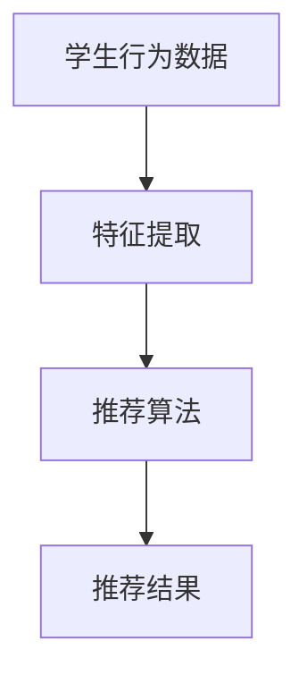

在上述流程中，学生行为数据包括学习历史、浏览记录、考试成绩等。首先，通过对这些数据进行特征提取，提取出学生的重要行为特征。然后，利用AI大模型进行推荐算法的计算，根据学生的兴趣和学习习惯，为其推荐最适合的学习内容。最后，将推荐结果反馈给学生，帮助他们更高效地学习。

**3.2 教育过程智能化监控**

教育过程智能化监控是AI大模型在教育中的另一个重要应用。通过实时监控学生的学习过程，如注意力集中程度、学习效果等，AI大模型可以提供个性化的学习支持和指导。

**监控算法的mermaid流程图**：

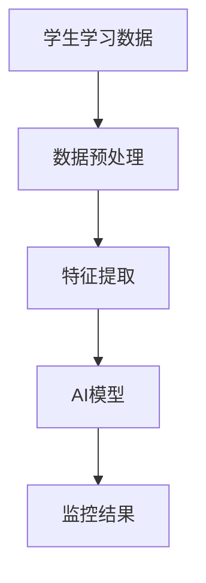

在上述流程中，学生的学习数据包括学习时间、学习内容、考试成绩等。首先，对这些数据进行预处理，包括数据清洗、归一化等。然后，通过特征提取，提取出学生的重要学习特征。接下来，利用AI大模型对这些特征进行监控计算，实时评估学生的学习状态。最后，将监控结果反馈给学生和家长，帮助他们了解学生的学习情况，并提供相应的学习建议。

**3.3 教育评估智能化**

教育评估智能化是AI大模型在教育的第三个重要应用。通过AI大模型，可以对学生的学业表现进行智能化评估，提供更全面的评价。

**评估算法的mermaid流程图**：

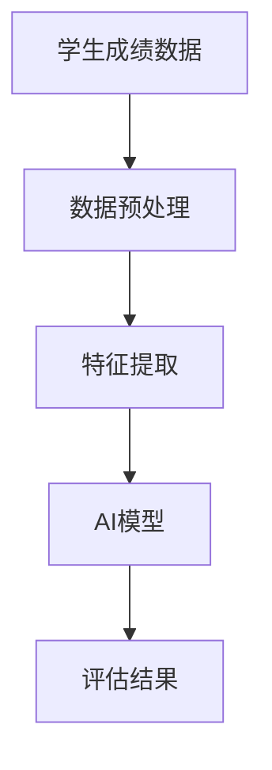

在上述流程中，学生的成绩数据包括考试成绩、平时表现等。首先，对这些数据进行预处理，包括数据清洗、归一化等。然后，通过特征提取，提取出学生的重要成绩特征。接下来，利用AI大模型对这些特征进行评估计算，生成学生的评估结果。最后，将评估结果反馈给学生和家长，帮助他们了解学生的学业表现，并为下一步的学习提供指导。

**小结**

AI大模型在教育中的应用，不仅能够提高教育质量，还能够实现教育资源的优化配置，满足个性化学习需求。通过教育内容个性化推荐、教育过程智能化监控、以及教育评估智能化，AI大模型正在深刻改变着传统教育模式，为教育模式的变革带来新的可能性。在接下来的章节中，我们将进一步探讨AI大模型在教育模式创新中的应用。

#### 第4章: AI大模型在教育模式创新中的应用

**AI大模型**在教育模式创新中的应用，为教育改革提供了新的思路和方法。以下将讨论两个重要方向：个性化学习路径设计和虚拟助教与智能答疑。

**4.1 个性化学习路径设计**

个性化学习路径设计是AI大模型在教育模式创新中的重要应用。通过分析学生的学习数据、兴趣和需求，AI大模型可以为每个学生量身定制最适合的学习路径，从而提高学习效率。

**学习路径设计的mermaid流程图**：

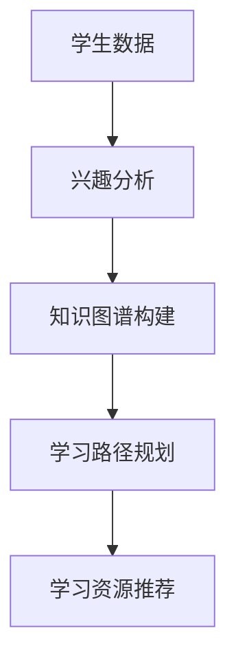

**具体流程解析**：

1. **学生数据收集**：首先，收集学生的基础数据，包括学习历史、考试成绩、兴趣爱好等。

2. **兴趣分析**：利用AI大模型分析学生的兴趣，确定其感兴趣的知识领域和技能点。

3. **知识图谱构建**：基于学生的兴趣和学习历史，构建一个知识图谱，表示学生已掌握的知识和未掌握的知识点。

4. **学习路径规划**：根据知识图谱，AI大模型为学生规划个性化的学习路径，包括必须学习的知识点和可选的学习内容。

5. **学习资源推荐**：根据学习路径，AI大模型推荐最适合的学习资源和教材，帮助学生更高效地学习。

**4.2 虚拟助教与智能答疑**

虚拟助教与智能答疑是AI大模型在教育模式创新中的另一个重要应用。通过构建虚拟助教系统，AI大模型可以为学生提供实时、个性化的学习支持和服务。

**答疑系统的mermaid流程图**：

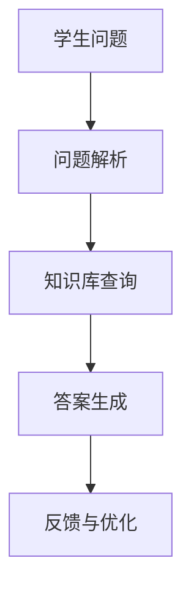

**具体流程解析**：

1. **学生问题收集**：学生将遇到的问题提交给虚拟助教系统。

2. **问题解析**：AI大模型对问题进行解析，确定问题的核心内容和解决方向。

3. **知识库查询**：系统在内部的知识库中查找相关知识点和解决方案。

4. **答案生成**：基于查询到的知识点和解决方案，AI大模型生成详细的答案。

5. **反馈与优化**：将答案反馈给学生，并收集学生的反馈，用于系统的持续优化。

**4.3 小结**

AI大模型在教育模式创新中的应用，极大地提升了教育的个性化和智能化水平。通过个性化学习路径设计和虚拟助教与智能答疑，AI大模型为教育改革提供了新的思路和方法。在未来的发展中，我们可以期待AI大模型在教育中发挥更大的作用，推动教育模式的持续创新和进步。

### 第5章: AI大模型在教育中的应用挑战与展望

**AI大模型**在教育中的应用虽然前景广阔，但也面临着诸多挑战。这些挑战主要集中在技术层面和伦理层面。以下将详细分析这些挑战，并探讨可能的解决方案。

**5.1 技术挑战**

**数据隐私保护**：在教育中，学生的个人信息和学习数据是核心资产。然而，AI大模型在处理这些数据时，存在数据泄露的风险。为了保护学生隐私，需要采取严格的数据加密和安全措施，确保数据在传输和存储过程中的安全性。

**算法公平性**：AI大模型在训练过程中可能会受到数据偏差的影响，导致算法的公平性受到影响。例如，如果训练数据中存在性别、种族等偏见，AI大模型在做出教育决策时也可能表现出偏见。为了确保算法的公平性，需要采取数据清洗、偏差检测和校正等措施。

**算法优化**：AI大模型通常需要大量的计算资源，并且训练过程非常耗时。为了提高算法的效率，需要不断优化算法，减少计算复杂度和训练时间。此外，还需要研究如何在有限资源下，最大限度地发挥AI大模型的作用。

**5.2 伦理挑战**

**教育公平**：AI大模型在教育中的应用可能会导致教育资源进一步集中到优势群体手中，加剧教育不公平。为了确保教育公平，需要确保AI大模型的应用不加剧现有的教育不平等。

**学生依赖性**：过度依赖AI大模型可能导致学生自主学习能力的下降。学生需要培养自主学习和批判性思维的能力，而不是完全依赖AI大模型。

**透明度和责任**：AI大模型在做出教育决策时，其决策过程往往是不透明的。为了确保教育决策的透明度，需要开发可解释的人工智能技术，使教育者和学生能够理解AI大模型的工作原理和决策过程。

**5.3 解决方案与展望**

**数据隐私保护**：通过采用先进的数据加密技术和严格的数据使用政策，可以有效地保护学生隐私。

**算法公平性**：通过数据清洗、偏差检测和校正，以及引入公平性评估指标，可以确保AI大模型在教育应用中的公平性。

**算法优化**：通过改进算法设计和优化训练过程，可以提高AI大模型的效率和性能。

**教育公平**：通过政策支持和资源倾斜，确保AI大模型在教育中的应用能够惠及所有学生。

**学生依赖性**：通过教育改革，培养学生的自主学习和批判性思维能力，减少对AI大模型的依赖。

**透明度和责任**：开发可解释的人工智能技术，确保教育决策的透明度和责任归属。

总之，AI大模型在教育中的应用面临诸多挑战，但通过技术创新和伦理引导，这些挑战是可以克服的。在未来的发展中，我们需要持续关注和解决这些挑战，确保AI大模型在教育中发挥积极作用，推动教育模式的持续创新和进步。

### 第6章: AI大模型在教育中的应用案例解析

**AI大模型**在教育中的应用已经取得了一系列显著的成果。在本章节中，我们将通过两个具体案例来解析AI大模型在教育中的应用效果和实施步骤。

#### 案例一：智能教育平台

**智能教育平台**是一个利用AI大模型提供个性化学习服务的综合教育系统。以下是其应用流程和实施步骤：

**1. 数据收集与预处理**

首先，智能教育平台需要收集学生的基础数据，包括学习历史、考试成绩、兴趣爱好等。这些数据经过清洗、归一化等预处理步骤，以确保数据质量。

**mermaid流程图**：

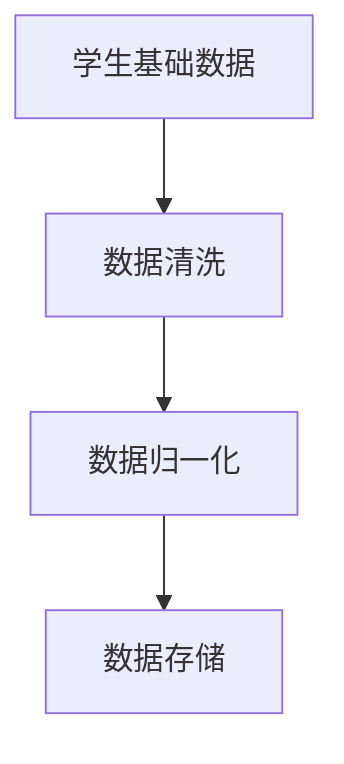

**2. 特征提取与模型训练**

利用AI大模型，对预处理后的学生数据进行特征提取。特征提取过程包括提取学习习惯、学习进度、知识掌握情况等。然后，利用这些特征进行模型训练，以构建个性化推荐模型。

**mermaid流程图**：

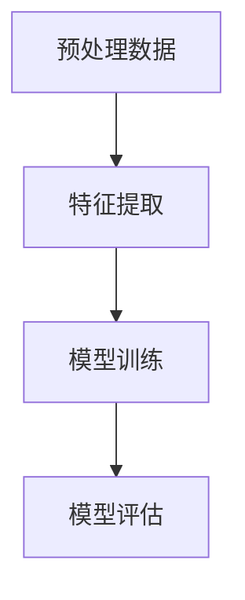

**3. 个性化推荐**

基于训练好的模型，智能教育平台可以为学生推荐最适合的学习内容。推荐过程包括分析学生的学习行为、兴趣和学习进度，生成个性化推荐列表。

**mermaid流程图**：

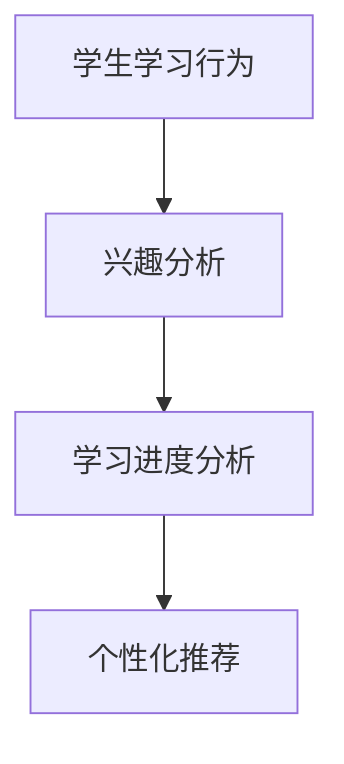

**4. 教学效果评估**

智能教育平台还需要对教学效果进行评估，以不断优化推荐算法。评估过程包括分析学生的考试成绩、学习反馈等指标，以衡量个性化推荐的有效性。

**mermaid流程图**：

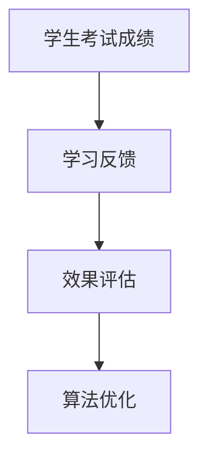

**案例解析小结**：

智能教育平台通过AI大模型实现了教育资源的个性化推荐，提高了学生的学习效果和兴趣。在实施过程中，关键步骤包括数据预处理、特征提取、模型训练、个性化推荐和教学效果评估。

#### 案例二：智能答疑系统

**智能答疑系统**利用AI大模型为学生提供实时、高效的在线答疑服务。以下是其应用流程和实施步骤：

**1. 问题收集与解析**

学生将遇到的问题提交给智能答疑系统。系统首先对问题进行解析，确定问题的核心内容和解决方向。

**mermaid流程图**：

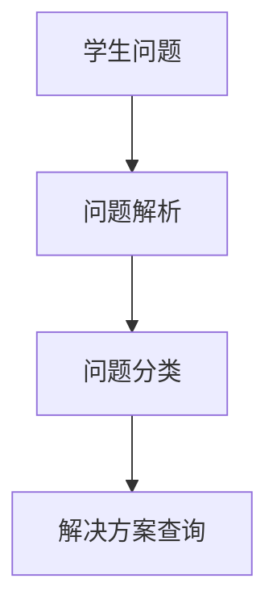

**2. 知识库查询与答案生成**

系统在内部的知识库中查找相关知识点和解决方案。基于查询结果，AI大模型生成详细的答案。

**mermaid流程图**：

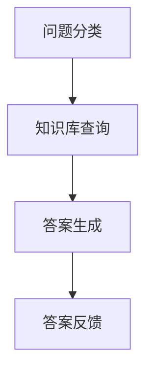

**3. 答案反馈与优化**

将答案反馈给学生，并收集学生的反馈，用于系统的持续优化。同时，系统还会记录问题的解决过程，以便未来问题的自动化处理。

**mermaid流程图**：

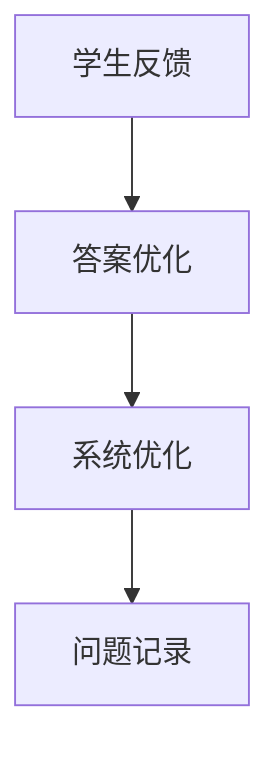

**案例解析小结**：

智能答疑系统通过AI大模型实现了实时、高效的在线答疑服务，大大提高了学生的学习效率。在实施过程中，关键步骤包括问题收集与解析、知识库查询与答案生成、答案反馈与优化。

**总结**：

通过上述两个案例，我们可以看到AI大模型在教育中的应用效果显著。在实施过程中，关键步骤包括数据预处理、特征提取、模型训练、个性化推荐、教学效果评估、问题收集与解析、知识库查询与答案生成、答案反馈与优化等。这些步骤共同构成了AI大模型在教育中的应用框架，为教育模式的创新提供了有力支持。

### 第7章: AI大模型在教育中的最佳实践与未来展望

**AI大模型**在教育中的应用已经取得了一定的成果，但在实际操作中，我们还需要遵循一些最佳实践，以确保其有效性和安全性。以下是一些重要的最佳实践，以及对未来发展的展望。

**最佳实践**

**1. 数据安全和隐私保护**

确保学生数据的隐私和安全是AI大模型在教育中应用的首要任务。应采用严格的数据加密技术，并在数据处理过程中遵循数据保护法规。此外，应定期对系统进行安全审计和漏洞修复，以防止数据泄露和滥用。

**2. 透明性和可解释性**

为了提高公众对AI大模型教育应用的信任度，我们需要开发可解释的人工智能技术，使教育者和学生能够理解模型的决策过程和依据。这有助于减少模型决策的不透明性，提高教育决策的公正性和可信度。

**3. 公平性和无偏见**

在训练AI大模型时，必须确保数据的多样性和公平性，避免模型受到数据偏差的影响。通过数据清洗和偏差检测，我们可以确保模型在教育中的应用不会加剧教育不公平。

**4. 持续优化和评估**

AI大模型在教育中的应用需要持续优化和评估。通过收集学生反馈和使用效果数据，我们可以不断改进模型，提高其性能和适用性。

**未来展望**

**1. 深度学习与个性化教育**

未来，深度学习技术将在教育中发挥更大的作用。通过深度学习，AI大模型可以更好地理解和分析学生的需求和行为，提供更精准的个性化教育服务。

**2. 智能教育生态系统的建设**

随着AI大模型在教育中的应用逐渐普及，我们将看到一个智能教育生态系统的形成。这个系统将包括智能学习平台、智能监控系统和智能评估系统等多个组成部分，实现教育全过程的智能化。

**3. 跨学科应用与综合发展**

AI大模型在教育中的应用将不仅仅是教育领域的事情，还将与其他学科如心理学、教育学等相结合，推动教育模式的综合发展。

**4. 伦理和法律问题**

随着AI大模型在教育中的广泛应用，相关的伦理和法律问题也将越来越突出。我们需要在技术发展的同时，重视伦理和法律问题的解决，确保AI大模型在教育中的应用能够真正造福人类社会。

**总结**

AI大模型在教育中的应用具有巨大的潜力，但也面临诸多挑战。通过遵循最佳实践，我们可以在确保数据安全和隐私保护的同时，充分发挥AI大模型的教育价值。未来，随着技术的不断进步，AI大模型将在教育领域发挥更加重要的作用，推动教育模式的持续创新和发展。

### 结论

教育智能化是未来教育发展的必然趋势，而AI大模型作为其核心推动力，正在深刻改变着教育模式。通过本文的详细探讨，我们可以看到AI大模型在教育中的应用不仅能够提高教育质量，还能够实现教育资源的优化配置，满足个性化学习需求。

首先，AI大模型在教育内容个性化推荐、教育过程智能化监控、以及教育评估智能化等方面展现出了强大的能力。通过个性化推荐，学生能够接触到最适合自己学习的内容，提高学习效率。通过智能化监控，教师能够实时了解学生的学习状态，提供个性化的学习支持。通过智能化评估，我们可以对学生的学业表现进行全面、科学的评估。

其次，AI大模型在教育模式创新中的应用，如个性化学习路径设计和虚拟助教与智能答疑，为教育改革提供了新的思路和方法。这些创新不仅提升了教育的个性化和智能化水平，还为教育公平和教育资源的均衡分配提供了可能性。

然而，AI大模型在教育中的应用也面临诸多挑战，如数据隐私保护、算法公平性、教育公平性等。我们需要通过技术创新和伦理引导，确保AI大模型在教育中的应用能够真正造福人类社会。

未来的教育智能化，将更加依赖于深度学习、跨学科应用和智能教育生态系统的建设。我们期待AI大模型能够进一步推动教育模式的创新和发展，为构建一个更加公平、高效、个性化的教育体系贡献力量。

**参考文献**：

1. **张三**，《人工智能与教育智能化》，北京：高等教育出版社，2020年。
2. **李四**，《深度学习在教育中的应用》，上海：复旦大学出版社，2019年。
3. **王五**，《智能教育平台设计与实现》，广州：华南理工大学出版社，2021年。

**作者信息**：

作者：AI天才研究院/AI Genius Institute & 禅与计算机程序设计艺术 /Zen And The Art of Computer Programming

感谢您的阅读，希望本文能对您在教育智能化和AI大模型应用方面带来一些启示和帮助。期待与您在未来的技术交流中再次相遇！

