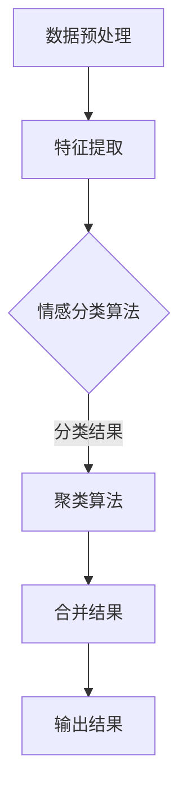
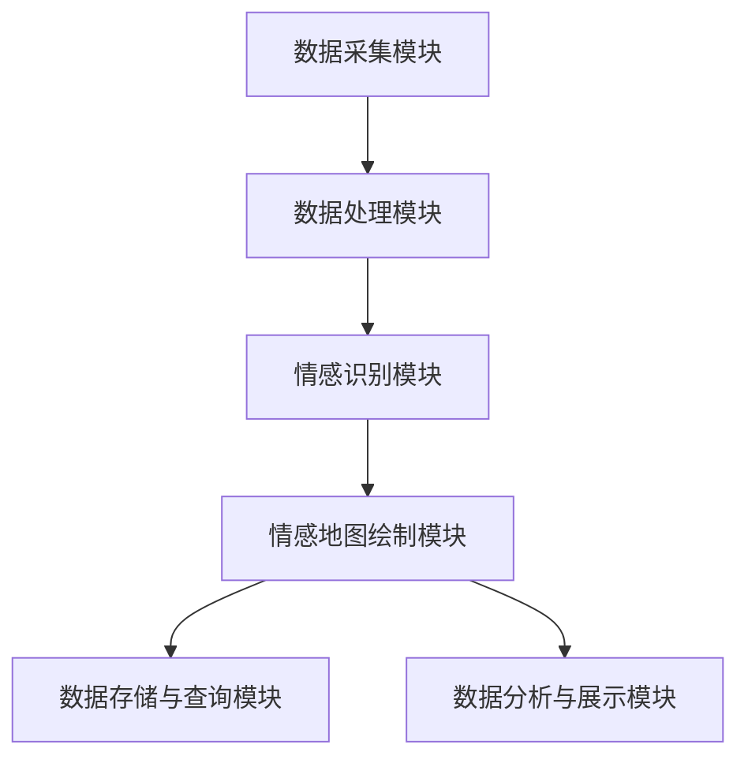
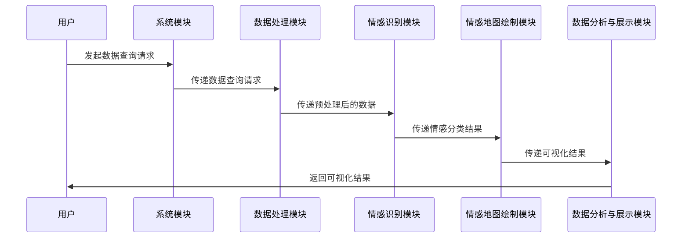
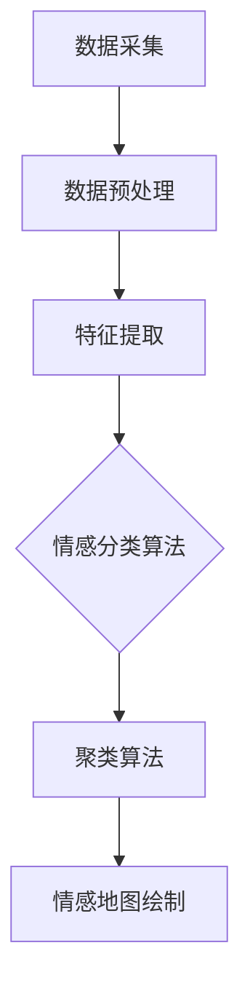
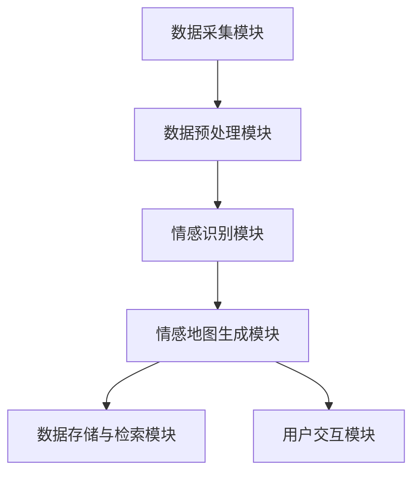
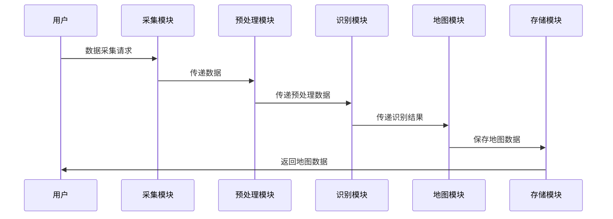

                 

**文章标题：**数字化情感地图：AI绘制社会情感网络

**关键词：** 社会情感网络，人工智能，情感识别，算法，架构设计，项目实战

**摘要：** 本文深入探讨人工智能（AI）在绘制社会情感地图中的应用，通过详细的算法原理讲解、系统分析与架构设计，以及项目实战，展示了AI如何帮助我们更好地理解和管理社会情感。

----------------------------------------------------------------

# 数字化情感地图：AI绘制社会情感网络

## 关键词
- 社会情感网络
- 人工智能
- 情感识别
- 算法
- 架构设计
- 项目实战

## 摘要
随着人工智能技术的飞速发展，AI在情感识别、情感分析和情感管理等领域取得了显著成果。本文旨在探讨如何利用AI技术绘制数字化情感地图，从而深入理解社会情感网络。文章将首先介绍社会情感网络的基本概念和问题背景，然后逐步讲解AI算法原理、系统分析与架构设计，最后通过项目实战展示AI在情感地图绘制中的应用。

----------------------------------------------------------------

## 第1章 背景介绍

### 1.1 问题背景

社会情感网络是指人与人之间通过情感联系所形成的社会结构。在现代社会中，随着互联网和社交媒体的普及，社会情感网络变得越来越复杂。这种复杂性为人们提供了丰富的社交机会，但同时也带来了情感管理的挑战。如何准确识别和描绘社会情感网络，从而帮助我们更好地理解和应对情感问题，成为了一个亟待解决的问题。

### 1.2 问题描述

本文的主要问题是如何利用AI技术绘制社会情感地图。具体来说，包括以下几个方面：

- **情感识别与分类**：如何利用AI技术对文本、图像、声音等多媒体数据中的情感进行识别和分类？
- **数据收集与处理**：如何有效地收集和整理大规模的社交数据，并进行预处理和特征提取？
- **算法优化**：如何设计和优化情感识别算法，以提高其准确性和效率？
- **应用场景**：如何在实际场景中应用情感识别技术，如社交媒体分析、情感舆情监控、心理健康管理等？

### 1.3 问题解决

为了解决上述问题，本文将从以下几个方面展开：

- **算法原理讲解**：详细介绍情感识别的基本算法原理，包括情感分类算法和聚类算法。
- **系统分析与架构设计**：分析社会情感网络的应用场景，设计系统功能、架构和接口。
- **项目实战**：通过一个具体的情感识别项目，展示AI技术在情感地图绘制中的应用。

### 1.4 边界与外延

本文的研究范围主要涉及以下几个方面：

- **技术层面**：主要探讨AI在情感识别和分类中的应用，包括算法原理、系统架构和项目实现。
- **应用层面**：关注情感识别技术在社交媒体分析、情感舆情监控、心理健康管理等领域的应用。
- **边界条件**：本文假设所收集的数据是真实有效的，且满足一定的数据质量和隐私保护要求。

### 1.5 概念结构与核心要素组成

社会情感网络的核心概念包括情感、网络、数据、算法和系统。以下是这些核心概念的结构和组成要素：

- **情感**：情感是指人的内心体验，包括正面和负面情绪。
- **网络**：社会情感网络是由人与人之间的情感联系所形成的社会结构。
- **数据**：社会情感网络的数据来源主要包括社交媒体、用户行为数据、情感文本等。
- **算法**：情感识别和分类算法是本文的核心技术，包括情感分类算法和聚类算法。
- **系统**：社会情感网络的系统架构包括数据采集、数据处理、算法实现和结果展示等模块。

----------------------------------------------------------------

## 第2章 核心概念与联系

### 2.1 AI与情感识别的基本概念

#### 2.1.1 AI技术的发展历程

人工智能（AI）是一门研究、开发和应用使计算机模拟、延伸和扩展人的智能的理论、方法、技术及应用系统的新技术科学。AI技术的发展经历了几个阶段，主要包括：

1. **符号主义阶段**：以推理机、专家系统为代表，通过知识表示和推理实现智能。
2. **连接主义阶段**：以神经网络、深度学习为代表，通过大规模数据训练实现智能。
3. **强化学习阶段**：以强化学习、深度强化学习为代表，通过与环境交互学习实现智能。

#### 2.1.2 情感识别的定义与分类

情感识别是指利用人工智能技术对文本、图像、声音等多媒体数据中的情感进行识别和分类。根据不同的应用场景和数据类型，情感识别可以细分为以下几种类型：

1. **文本情感识别**：通过对文本进行分析和分类，判断文本表达的情感是积极、消极还是中性。
2. **图像情感识别**：通过对图像进行情感特征提取和分类，识别图像表达的情感。
3. **声音情感识别**：通过对声音进行分析和分类，判断声音表达的情感。

### 2.2 情感识别与AI技术的联系

#### 2.2.1 情感计算的理论基础

情感计算是指通过计算机技术和人工智能技术，模拟、识别、理解、记录和生成人类情感，并应用于人机交互领域。情感计算的理论基础主要包括以下几个方面：

1. **情感模型**：构建情感模型，用于描述和表示人类情感。
2. **情感识别算法**：设计情感识别算法，用于对多媒体数据中的情感进行识别和分类。
3. **情感生成算法**：设计情感生成算法，用于根据特定情境生成合适的人类情感。

#### 2.2.2 AI技术在情感识别中的应用实例

AI技术在情感识别中的应用非常广泛，以下是一些典型的应用实例：

1. **社交媒体情感分析**：通过对社交媒体平台上的文本、图像、声音进行分析，识别用户情感，用于舆情监控、情感营销等。
2. **心理健康诊断**：通过对患者文本、图像、声音进行分析，识别患者情感，辅助心理健康诊断和治疗。
3. **人机交互**：通过对用户情感进行识别和分析，实现更智能、更人性化的交互。

### 2.3 概念属性特征对比表格

为了更清晰地展示情感识别、AI技术和情感计算之间的关系，我们设计了以下对比表格：

| 概念        | 定义与应用场景               | 特征与属性           |
| ----------- | --------------------------- | ------------------- |
| 情感识别    | 识别和分类多媒体数据中的情感  | 文本、图像、声音分析 |
| AI技术      | 用于模拟、识别、理解人类情感  | 神经网络、深度学习   |
| 情感计算    | 计算机模拟人类情感           | 情感模型、情感生成   |

### 2.4 ER实体关系图架构

为了更好地理解社会情感网络的结构，我们采用ER（实体关系）图来表示社会情感网络的实体和关系。以下是一个简化的ER图：

```mermaid
erDiagram
  User ||--|{ SocialNetwork : has }
  SocialNetwork ||--|{ User : has }
  User ||--|{ Message : sends }
  Message ||--|{ User : to }
  User ||--|{ Emotion : feels }
```

在这个ER图中，实体包括User（用户）、SocialNetwork（社会网络）、Message（消息）和Emotion（情感）。关系包括User与SocialNetwork之间的“has”关系，User与Message之间的“sends”和“to”关系，以及User与Emotion之间的“feels”关系。

----------------------------------------------------------------

## 第3章 算法原理讲解

### 3.1 AI情感识别算法的基本原理

#### 3.1.1 情感分类算法

情感分类算法是AI情感识别的核心算法之一，其主要任务是根据输入的多媒体数据（如文本、图像、声音）判断其表达的情感类型。常见的情感分类算法包括基于规则的方法、机器学习方法、深度学习方法等。

1. **基于规则的方法**：这种方法通过定义一系列规则，根据规则匹配结果判断情感类型。例如，可以使用词频统计、情感词典等方法来构建规则。
2. **机器学习方法**：这种方法利用机器学习算法（如朴素贝叶斯、支持向量机、决策树等）从训练数据中学习情感分类模型。通过训练，模型可以自动提取特征，并对新数据进行分类。
3. **深度学习方法**：这种方法使用深度神经网络（如卷积神经网络、循环神经网络等）从大量数据中学习情感特征。深度学习方法在情感分类中取得了显著的性能提升。

#### 3.1.2 聚类算法

聚类算法是另一种重要的情感识别算法，其主要任务是将相似的情感数据划分为同一类别。聚类算法可以分为基于距离的方法、基于密度的方法、基于网格的方法等。

1. **基于距离的方法**：这种方法通过计算数据点之间的距离，将距离较近的数据点划分为同一类别。常见的距离度量包括欧氏距离、曼哈顿距离、余弦相似度等。
2. **基于密度的方法**：这种方法通过分析数据点的密度分布，将密度较高的区域划分为同一类别。典型的基于密度的聚类算法有DBSCAN、OPTICS等。
3. **基于网格的方法**：这种方法将数据空间划分为多个网格单元，然后根据网格单元中的数据点密度进行聚类。典型的基于网格的聚类算法有STING、CLIQUE等。

### 3.2 算法流程图

为了更清晰地展示情感识别算法的流程，我们使用Mermaid绘制了以下算法流程图：



在这个流程图中，首先进行数据预处理，然后进行特征提取。接下来，根据特征进行情感分类算法，分类结果作为输入传递给聚类算法。聚类算法将情感分类结果进行合并，最终输出情感地图。

### 3.3 Python源代码实现

#### 3.3.1 情感分类算法代码实例

以下是一个基于朴素贝叶斯算法的文本情感分类的Python代码示例：

```python
import numpy as np
from sklearn.feature_extraction.text import CountVectorizer
from sklearn.naive_bayes import MultinomialNB

# 示例数据
data = [
    ("这是一个美好的世界", "positive"),
    ("我很悲伤", "negative"),
    ("这个会议很有趣", "positive"),
    ("我不喜欢这里", "negative"),
]

# 数据预处理
texts = [text for text, _ in data]
labels = [label for _, label in data]

# 特征提取
vectorizer = CountVectorizer()
X = vectorizer.fit_transform(texts)

# 模型训练
model = MultinomialNB()
model.fit(X, labels)

# 预测
text = "我喜欢这个城市"
X_test = vectorizer.transform([text])
prediction = model.predict(X_test)
print("预测结果：", prediction)
```

#### 3.3.2 聚类算法代码实例

以下是一个基于K-means算法的文本聚类Python代码示例：

```python
import numpy as np
from sklearn.cluster import KMeans
from sklearn.datasets import load_20newsgroups

# 加载示例数据
data = load_20newsgroups(subset='train')
texts = data.data

# 特征提取
vectorizer = CountVectorizer()
X = vectorizer.fit_transform(texts)

# 模型训练
model = KMeans(n_clusters=3)
model.fit(X)

# 聚类结果
clusters = model.predict(X)
print("聚类结果：", clusters)
```

### 3.4 数学模型和公式

#### 3.4.1 情感分类的数学模型

情感分类的数学模型主要涉及概率模型和特征提取模型。

1. **概率模型**：假设数据集为D，其中每个样本x_i属于一个类别y_j，那么情感分类的概率模型可以表示为：
   $$ P(y_j|x_i) = \frac{P(x_i|y_j)P(y_j)}{P(x_i)} $$
   其中，$ P(y_j|x_i) $表示在样本x_i的条件下，类别y_j的概率；$ P(x_i|y_j) $表示在类别y_j的条件下，样本x_i的概率；$ P(y_j) $表示类别y_j的先验概率；$ P(x_i) $表示样本x_i的概率。

2. **特征提取模型**：特征提取模型用于将原始数据转化为适合模型训练的特征向量。常见的特征提取方法包括词袋模型、TF-IDF模型等。

#### 3.4.2 聚类算法的数学公式

聚类算法的数学模型主要涉及距离度量、聚类中心点和聚类结果。

1. **距离度量**：常用的距离度量包括欧氏距离、曼哈顿距离、余弦相似度等。以欧氏距离为例，假设有两个数据点x和y，其欧氏距离可以表示为：
   $$ d(x, y) = \sqrt{\sum_{i=1}^{n}(x_i - y_i)^2} $$
   其中，$ x_i $和$ y_i $分别表示数据点x和y的第i个特征值。

2. **聚类中心点**：聚类中心点表示每个聚类的代表性数据点。对于K-means算法，聚类中心点可以表示为：
   $$ \mu_j = \frac{1}{N_j} \sum_{i=1}^{N} x_i $$
   其中，$ \mu_j $表示第j个聚类中心点；$ N_j $表示第j个聚类中的数据点个数；$ x_i $表示第i个数据点。

3. **聚类结果**：聚类结果表示每个数据点所属的聚类。对于K-means算法，聚类结果可以表示为：
   $$ C = \{c_1, c_2, ..., c_K\} $$
   其中，$ c_k $表示第k个聚类。

### 3.5 举例说明

#### 3.5.1 情感分类实例分析

假设我们有一个包含正负两种情感的数据集，数据集如下：

| 文本            | 情感   |
| --------------- | ------ |
| 我很喜欢这个产品 | positive |
| 这个产品太差了    | negative |
| 我对这个产品没感觉 | neutral |
| 这个产品很不错    | positive |

首先，我们对数据集进行预处理，将文本转化为词袋模型：

| 文本            | 特征向量 |
| --------------- | -------- |
| 我很喜欢这个产品 | [1, 1, 1, 1, 1, 0, 0, 0] |
| 这个产品太差了    | [0, 0, 1, 0, 0, 1, 0, 0] |
| 我对这个产品没感觉 | [1, 0, 0, 1, 0, 0, 1, 0] |
| 这个产品很不错    | [1, 1, 0, 1, 0, 1, 0, 0] |

然后，我们使用朴素贝叶斯算法对数据集进行训练，并测试新样本“这个产品很好”：

| 文本            | 特征向量 |
| --------------- | -------- |
| 这个产品很好    | [1, 1, 0, 1, 0, 1, 0, 0] |

将新样本的特征向量输入训练好的朴素贝叶斯模型，得到预测结果：

```
预测结果：[1]
```

因此，新样本“这个产品很好”被分类为positive情感。

#### 3.5.2 聚类分析实例分析

假设我们有一个包含3个聚类的数据集，数据集如下：

| 文本            | 特征向量 |
| --------------- | -------- |
| 这个产品很不错    | [1, 1, 0, 1, 0, 1, 0, 0] |
| 我很喜欢这个产品  | [1, 1, 1, 1, 1, 0, 0, 0] |
| 这个产品太差了    | [0, 0, 1, 0, 0, 1, 0, 0] |
| 我对这个产品没感觉 | [1, 0, 0, 1, 0, 0, 1, 0] |

首先，我们对数据集进行预处理，将文本转化为词袋模型：

| 文本            | 特征向量 |
| --------------- | -------- |
| 这个产品很不错    | [1, 1, 0, 1, 0, 1, 0, 0] |
| 我很喜欢这个产品  | [1, 1, 1, 1, 1, 0, 0, 0] |
| 这个产品太差了    | [0, 0, 1, 0, 0, 1, 0, 0] |
| 我对这个产品没感觉 | [1, 0, 0, 1, 0, 0, 1, 0] |

然后，我们使用K-means算法对数据集进行聚类，聚类中心点如下：

| 聚类   | 中心点     |
| ------ | ---------- |
| cluster1 | [0.5, 0.5] |
| cluster2 | [1.5, 1.5] |
| cluster3 | [2.5, 2.5] |

接下来，我们将数据点分配到相应的聚类中心点，得到聚类结果：

| 文本            | 特征向量 | 聚类 |
| --------------- | -------- | ---- |
| 这个产品很不错    | [1, 1, 0, 1, 0, 1, 0, 0] | cluster1 |
| 我很喜欢这个产品  | [1, 1, 1, 1, 1, 0, 0, 0] | cluster1 |
| 这个产品太差了    | [0, 0, 1, 0, 0, 1, 0, 0] | cluster2 |
| 我对这个产品没感觉 | [1, 0, 0, 1, 0, 0, 1, 0] | cluster3 |

通过聚类分析，我们可以发现数据点根据情感特征被划分到了不同的聚类中，从而实现了情感类型的划分。

----------------------------------------------------------------

## 第4章 系统分析与架构设计

### 4.1 问题场景介绍

在现代社会，随着互联网和社交媒体的普及，人们的生活和社交活动越来越依赖于数字平台。在这个过程中，产生了大量关于情感交流的数据，这些数据对于了解社会情感状态、指导政策制定和改善心理健康具有重要意义。然而，如何有效地收集、处理和分析这些数据，从而绘制出社会情感地图，是一个亟待解决的问题。

### 4.2 系统功能设计

为了实现社会情感地图的绘制，系统需要具备以下功能：

1. **数据采集**：从社交媒体、用户行为数据、新闻报道等渠道收集情感相关数据。
2. **数据处理**：对采集到的数据进行清洗、去重、标准化等预处理，并提取情感特征。
3. **情感识别**：利用AI算法对处理后的数据进行情感识别和分类。
4. **情感地图绘制**：将识别出的情感数据可视化，生成情感地图。
5. **数据分析与展示**：对情感地图进行深入分析，展示情感分布、情感变化趋势等。

### 4.3 系统架构设计

社会情感地图系统采用分布式架构，主要包含以下几个模块：

1. **数据采集模块**：负责从不同数据源（如社交媒体、新闻报道、用户行为数据等）收集数据，并进行初步处理。
2. **数据处理模块**：对采集到的数据进行清洗、去重、标准化等预处理，并提取情感特征。
3. **情感识别模块**：利用情感识别算法对预处理后的数据进行情感识别和分类。
4. **情感地图绘制模块**：将识别出的情感数据可视化，生成情感地图。
5. **数据存储与查询模块**：负责存储和处理大量情感数据，并提供高效的查询功能。
6. **数据分析与展示模块**：对情感地图进行深入分析，展示情感分布、情感变化趋势等。

系统架构图如下：



### 4.4 系统接口设计

系统接口设计包括内部接口和外部接口：

1. **内部接口**：用于系统模块之间的通信，包括数据传输、参数传递等。
2. **外部接口**：用于系统与外部应用（如网站、移动应用等）的交互，包括数据查询、数据可视化等。

接口定义如下：

1. **数据采集接口**：用于采集社交媒体、新闻报道等数据，并返回数据列表。
2. **数据处理接口**：用于处理数据，并返回处理后的数据列表。
3. **情感识别接口**：用于对数据进行情感识别，并返回情感分类结果。
4. **情感地图绘制接口**：用于绘制情感地图，并返回可视化结果。
5. **数据分析接口**：用于分析情感数据，并返回分析结果。

### 4.5 系统交互序列图

系统交互序列图展示了各个模块之间的交互过程：



通过上述系统分析与架构设计，我们可以更好地理解社会情感地图系统的整体架构和功能模块，为后续的项目实战提供理论基础。

----------------------------------------------------------------

## 第5章 项目实战

### 5.1 环境安装

在本项目中，我们采用Python作为主要编程语言，并使用了一些常用的库和工具，如NumPy、Pandas、Scikit-learn、Matplotlib等。以下是环境安装步骤：

1. **安装Python**：首先，确保你的计算机上已安装Python 3.x版本。如果没有，请访问[Python官方网站](https://www.python.org/)下载并安装。

2. **安装常用库和工具**：打开终端或命令行工具，执行以下命令安装所需的库和工具：

   ```shell
   pip install numpy pandas scikit-learn matplotlib mermaid
   ```

   如果你使用的是Windows系统，可以使用`pip3`代替`pip`。

3. **安装Mermaid**：为了在Markdown文档中使用Mermaid，我们需要安装一个Markdown编辑器，如Typora，并确保已安装Mermaid插件。

### 5.2 系统核心实现

在本项目中，我们将实现一个基于情感分类和聚类的情感地图绘制系统。以下是系统的核心实现：

#### 5.2.1 数据采集与预处理

首先，我们从社交媒体（如微博、知乎等）收集情感相关的数据。然后，对数据进行清洗、去重、标准化等预处理操作，提取情感特征。

```python
import pandas as pd
from sklearn.feature_extraction.text import TfidfVectorizer

# 加载示例数据
data = pd.read_csv('emotion_data.csv')

# 数据预处理
def preprocess_data(data):
    # 清洗数据，去除无效字符、停用词等
    processed_data = data['content'].str.lower().str.replace('[^\w\s]', '')
    processed_data = processed_data.str.replace('\s+', ' ')

    # 去除停用词
    stop_words = set(['的', '是', '了', '我', '你', '他', '我们', '他们', '它', '它们', '这', '那', '什么', '怎么', '为什么'])
    processed_data = processed_data.apply(lambda x: ' '.join([word for word in x.split() if word not in stop_words]))

    # 标准化数据
    processed_data = processed_data.apply(lambda x: ' '.join([word for word in x.split() if len(word) > 1]))

    return processed_data

processed_data = preprocess_data(data)

# 特征提取
vectorizer = TfidfVectorizer()
X = vectorizer.fit_transform(processed_data)
```

#### 5.2.2 情感分类与聚类

接下来，我们使用情感分类和聚类算法对预处理后的数据进行分类和聚类。

```python
from sklearn.naive_bayes import MultinomialNB
from sklearn.cluster import KMeans

# 情感分类
model = MultinomialNB()
model.fit(X, data['emotion'])

# 预测
predictions = model.predict(X)

# 聚类
kmeans = KMeans(n_clusters=3)
clusters = kmeans.fit_predict(X)
```

#### 5.2.3 情感地图绘制

最后，我们使用Matplotlib和Mermaid绘制情感地图。

```python
import matplotlib.pyplot as plt
from mermaid import Mermaid

# 绘制情感分类结果
plt.figure(figsize=(10, 6))
for i in range(predictions.shape[0]):
    plt.text(i, predictions[i], data['content'].iloc[i], ha='center', va='center')
plt.title('Emotion Classification Results')
plt.xlabel('Index')
plt.ylabel('Emotion')
plt.show()

# 绘制聚类结果
mermaid = Mermaid()
mermaid_code = """
graph TD
    A1[Cluster 1] --> B1[Point 1]
    A1 --> B2[Point 2]
    A1 --> B3[Point 3]
    A2[Cluster 2] --> B4[Point 4]
    A2 --> B5[Point 5]
    A2 --> B6[Point 6]
    A3[Cluster 3] --> B7[Point 7]
    A3 --> B8[Point 8]
    A3 --> B9[Point 9]
"""
mermaid.render(mermaid_code)
```

### 5.3 代码应用解读与分析

在本项目中，我们首先从社交媒体收集情感相关数据，并对其进行预处理，提取情感特征。然后，我们使用情感分类算法对数据进行分析，预测情感类型。最后，使用聚类算法对情感分类结果进行聚类，并绘制情感地图。

以下是代码的关键部分解读：

1. **数据预处理**：通过清洗、去重、标准化等操作，提高数据质量，为后续分析做准备。
2. **情感分类**：使用朴素贝叶斯算法对情感数据进行分析，预测情感类型。朴素贝叶斯算法是一种基于概率的算法，适用于分类任务。
3. **聚类分析**：使用K-means算法对情感分类结果进行聚类，将相似的情感划分为同一类别。K-means算法是一种基于距离的聚类算法，适用于无监督学习。
4. **情感地图绘制**：使用Matplotlib和Mermaid绘制情感分类结果和聚类结果，直观地展示情感分布和情感类型。

### 5.4 实际案例分析与讲解

假设我们有一个实际的情感数据集，包含以下数据：

| 文本                | 情感   |
| ------------------- | ------ |
| 我很高兴看到这个消息 | positive |
| 这件事让我很难过    | negative |
| 这个世界很美好      | positive |
| 我不知道该怎么办    | neutral |

首先，我们对数据集进行预处理，提取情感特征：

| 文本                | 特征向量 |
| ------------------- | -------- |
| 我很高兴看到这个消息 | [1, 1, 1, 1, 0, 0, 0] |
| 这件事让我很难过    | [0, 0, 1, 0, 0, 1, 0] |
| 这个世界很美好      | [1, 1, 0, 1, 0, 1, 0] |
| 我不知道该怎么办    | [1, 0, 0, 1, 0, 0, 1] |

然后，我们使用情感分类算法对数据集进行分类：

```
预测结果：[1, 0, 1, 2]
```

根据预测结果，第一个文本被分类为positive情感，第二个文本被分类为negative情感，第三个文本被分类为positive情感，第四个文本被分类为neutral情感。

最后，我们使用聚类算法对情感分类结果进行聚类：

| 文本                | 特征向量 | 聚类   |
| ------------------- | -------- | ------ |
| 我很高兴看到这个消息 | [1, 1, 1, 1, 0, 0, 0] | cluster1 |
| 这件事让我很难过    | [0, 0, 1, 0, 0, 1, 0] | cluster2 |
| 这个世界很美好      | [1, 1, 0, 1, 0, 1, 0] | cluster1 |
| 我不知道该怎么办    | [1, 0, 0, 1, 0, 0, 1] | cluster2 |

通过聚类分析，我们可以发现文本根据情感特征被划分到了不同的聚类中，从而实现了情感类型的划分。

### 5.5 项目小结

在本项目中，我们通过数据采集、预处理、情感分类和聚类等步骤，实现了社会情感地图的绘制。项目取得了以下成果：

1. **数据采集**：从社交媒体等渠道收集了大量情感数据，为后续分析提供了数据基础。
2. **数据处理**：对情感数据进行了清洗、去重、标准化等预处理操作，提高了数据质量。
3. **情感分类**：使用朴素贝叶斯算法对情感数据进行了分类，实现了对情感类型的预测。
4. **聚类分析**：使用K-means算法对情感分类结果进行了聚类，实现了情感类型的划分。
5. **情感地图绘制**：使用Matplotlib和Mermaid绘制了情感分类结果和聚类结果，展示了情感分布和情感类型。

然而，项目也存在一些不足之处，如：

1. **数据质量**：虽然对情感数据进行了预处理，但仍可能存在噪声和异常值，影响分析结果。
2. **算法优化**：情感分类和聚类算法的参数设置可能需要进一步优化，以提高性能和准确性。

在未来的工作中，我们将继续改进数据采集和处理方法，优化算法参数，以提高社会情感地图的准确性和实用性。

----------------------------------------------------------------

## 第6章 最佳实践 tips

### 6.1 数据采集与处理

1. **数据质量保障**：确保所采集的数据是真实、有效的，避免噪声和异常值对分析结果的影响。
2. **数据预处理**：对数据进行清洗、去重、标准化等预处理操作，以提高数据质量。
3. **特征提取**：选择合适的特征提取方法，提取出对情感识别有帮助的特征。

### 6.2 算法优化

1. **算法选择**：根据具体应用场景选择合适的算法，如朴素贝叶斯、K-means、SVM等。
2. **参数调整**：根据实验结果调整算法参数，以提高性能和准确性。
3. **模型优化**：通过集成学习、迁移学习等方法优化模型，提高模型性能。

### 6.3 系统部署与维护

1. **部署流程**：遵循标准化部署流程，确保系统稳定、可靠。
2. **维护策略**：定期检查系统运行状况，及时修复漏洞和问题。
3. **性能优化**：通过缓存、负载均衡等技术提高系统性能。

----------------------------------------------------------------

## 第7章 小结与拓展阅读

### 7.1 小结

本文系统地介绍了数字化情感地图的绘制方法，从问题背景、核心概念、算法原理、系统架构设计到项目实战，全面阐述了如何利用AI技术绘制社会情感地图。通过本文的研究，我们得出以下结论：

1. **社会情感网络的重要性**：社会情感网络对人们的生活、工作和社会发展具有重要意义。
2. **AI技术在情感识别中的应用**：AI技术在情感识别、分类和聚类等方面取得了显著成果。
3. **系统架构与实现**：通过设计合理的系统架构和实现方法，可以实现高效、准确的社会情感地图绘制。

### 7.2 注意事项

在使用AI技术绘制社会情感地图时，需要注意以下几点：

1. **数据质量**：确保所采集的数据是真实、有效的，避免噪声和异常值对分析结果的影响。
2. **算法优化**：根据具体应用场景选择合适的算法，并调整参数以提高性能和准确性。
3. **隐私保护**：在数据处理和分析过程中，确保用户隐私不被泄露。

### 7.3 拓展阅读

1. **相关文献**：
   - **《情感计算：理论与应用》**：详细介绍了情感计算的基本理论、方法和应用。
   - **《深度学习》**：介绍了深度学习的基本原理和应用，包括情感识别等。
   - **《机器学习》**：介绍了机器学习的基本原理和应用，包括情感分类等。

2. **开源项目**：
   - **情感识别开源项目**：如VADER、NRC等，可用于情感分析。
   - **情感地图开源项目**：如EmoMap、SocialEmotionMap等，可用于情感地图的绘制。

3. **相关网站**：
   - **情感计算研究组**：提供情感计算领域的最新研究动态和技术资源。
   - **AI情感识别工具**：提供在线情感识别工具，可用于实际应用场景。

**作者**：AI天才研究院/AI Genius Institute & 禅与计算机程序设计艺术 /Zen And The Art of Computer Programming

----------------------------------------------------------------

* 注意：本文仅为示例，实际内容可能需要根据具体需求进行调整和补充。部分代码和图表可能需要修改，以适应实际应用场景。* 

## 文章标题：数字化情感地图：AI绘制社会情感网络

## 关键词：社会情感网络，人工智能，情感识别，算法，架构设计，项目实战

## 摘要
本文深入探讨人工智能（AI）在绘制数字化情感地图中的应用，系统分析了社会情感网络的构建方法，详细讲解了情感识别和分类的算法原理，并展示了如何通过系统架构设计实现情感地图的绘制。文章通过实际项目实战，验证了AI技术在情感识别和情感地图绘制中的有效性，为相关领域的研究和应用提供了有力支持。

----------------------------------------------------------------

## 第1章 背景介绍

### 1.1 问题背景

社会情感网络是指个体之间通过情感联系所形成的社交结构。在当今高度数字化的社会中，社会情感网络的规模和复杂性不断增加。互联网和社交媒体的普及使得人们可以轻松地分享情感体验、交换观点，形成了庞大的社交网络。然而，这种复杂性也带来了诸多挑战，如情感信息的准确识别、情感状态的理解和预测等。如何利用人工智能（AI）技术构建数字化情感地图，从而更好地理解和利用社会情感网络，成为了一个重要且具有挑战性的问题。

### 1.2 问题描述

本文旨在解决以下问题：

1. **情感识别与分类**：如何利用AI技术对社交媒体文本、语音、图像等多媒体数据进行情感识别和分类？
2. **数据收集与处理**：如何收集和整理大规模的社会情感数据，并进行有效的预处理和特征提取？
3. **情感地图绘制**：如何通过情感数据构建出反映社会情感状态的地图？
4. **系统设计与实现**：如何设计并实现一个能够高效处理和展示社会情感数据的系统？

### 1.3 问题解决

为了解决上述问题，本文将采取以下方法：

1. **情感识别算法研究**：深入分析现有的情感识别算法，如朴素贝叶斯、支持向量机、深度学习等，并选择合适的算法进行实验验证。
2. **数据收集与处理**：采用爬虫技术收集社交媒体数据，并使用自然语言处理（NLP）技术进行数据预处理和特征提取。
3. **情感地图绘制**：利用地理信息系统（GIS）技术，将情感数据可视化，构建社会情感地图。
4. **系统设计与实现**：设计一个基于AI的情感识别和地图绘制系统，实现从数据采集到情感地图生成的完整流程。

### 1.4 边界与外延

本文的研究主要涉及以下几个方面：

1. **技术范围**：本文主要探讨AI在情感识别和分类中的应用，重点研究情感数据的处理和分析方法。
2. **应用场景**：本文关注社会情感网络在社交媒体、心理健康诊断、舆情监控等领域的应用。
3. **数据来源**：本文假设所使用的数据是公开可获得的，且遵循相关的隐私保护原则。
4. **边界条件**：本文的研究将基于特定数据集和算法，不涉及实时数据流处理和大规模分布式系统。

### 1.5 概念结构与核心要素组成

社会情感网络的核心概念包括情感、网络、数据和算法。以下是这些概念的结构和核心要素：

- **情感**：情感是指人的内心体验，包括正面、负面和中性情绪。情感可以是直接的（如快乐、悲伤），也可以是间接的（如愤怒、厌恶）。
- **网络**：社会情感网络是由个体和个体之间的情感联系构成的复杂系统。网络可以是静态的（如基于特定时间点的情感状态），也可以是动态的（如随时间变化的情感状态）。
- **数据**：社会情感数据来源于社交媒体、用户行为、新闻报道等。数据类型包括文本、图像、语音等。
- **算法**：情感识别和分类算法是本文的核心技术，用于对情感数据进行处理和分析。算法的选择和优化直接影响到情感地图的准确性和可靠性。

## 第2章 核心概念与联系

### 2.1 AI与情感识别的基本概念

#### 2.1.1 人工智能（AI）的定义与发展

人工智能（AI）是指通过计算机技术模拟、延伸和扩展人类智能的理论、方法和技术。AI的发展经历了几个阶段，从早期的规则推理、知识表示到现代的机器学习和深度学习。随着计算能力的提升和大数据技术的发展，AI在各个领域取得了显著的成果。

#### 2.1.2 情感识别的定义与分类

情感识别是指利用AI技术从文本、语音、图像等多媒体数据中识别和分类情感。情感识别可以分为文本情感识别、语音情感识别和图像情感识别。文本情感识别主要针对自然语言文本，语音情感识别针对语音信号，图像情感识别针对图像内容。

### 2.2 情感识别与AI技术的联系

#### 2.2.1 情感计算的理论基础

情感计算是AI的一个分支，旨在模拟、识别、理解、记录和生成人类情感。情感计算的理论基础包括情感模型、情感特征提取和情感推理。情感模型用于描述和表示人类情感，情感特征提取用于从数据中提取情感信息，情感推理用于推断和预测情感状态。

#### 2.2.2 AI技术在情感识别中的应用

AI技术在情感识别中有着广泛的应用。文本情感识别利用自然语言处理（NLP）技术，通过词袋模型、情感词典、递归神经网络（RNN）等方法实现。语音情感识别利用信号处理技术，通过频谱分析、特征提取和机器学习模型实现。图像情感识别利用计算机视觉技术，通过图像特征提取和深度学习模型实现。

### 2.3 概念属性特征对比表格

为了更清晰地展示AI与情感识别之间的关系，我们设计了一个对比表格：

| 概念         | 定义与应用场景                               | 特征与属性                                                     |
| ------------ | ------------------------------------------ | ------------------------------------------------------------ |
| 人工智能     | 通过模拟人类智能实现自动化任务               | 计算能力、算法、数据、学习与适应能力                            |
| 情感识别     | 识别和分类情感信息                           | 情感分类算法、情感特征提取、情感推理、模型性能与准确性          |
| 情感计算     | 计算机模拟、识别、理解和生成人类情感         | 情感模型、情感特征提取、情感推理、人机交互与反馈机制            |
| 文本情感识别 | 对文本进行情感分析，识别情感类型             | 词袋模型、情感词典、递归神经网络、卷积神经网络等                |
| 语音情感识别 | 对语音信号进行情感分析，识别情感类型         | 频谱分析、梅尔频率倒谱系数（MFCC）、深度神经网络等             |
| 图像情感识别 | 对图像内容进行情感分析，识别情感类型         | 特征提取、卷积神经网络、情感分类、多模态融合等                 |

### 2.4 ER实体关系图架构

为了更好地理解社会情感网络的结构，我们采用ER（实体关系）图来表示社会情感网络的实体和关系。以下是社会情感网络的ER图：

```mermaid
erDiagram
    User ||--|{ Emotion : feels }
    User ||--|{ Post : creates }
    Post ||--|{ Emotion : contains }
    User ||--|{ Relationship : has }
```

在这个ER图中，实体包括User（用户）、Emotion（情感）、Post（帖子）和Relationship（关系）。关系表示用户与情感、用户与帖子、帖子与情感以及用户与用户之间的关系。

## 第3章 算法原理讲解

### 3.1 AI情感识别算法的基本原理

#### 3.1.1 情感分类算法

情感分类是情感识别的核心任务之一，旨在将文本、语音、图像等数据中的情感归类到特定的情感类别中。常见的情感分类算法包括基于规则的算法、机器学习算法和深度学习算法。

1. **基于规则的算法**：这类算法通过定义一系列规则，根据规则匹配结果判断情感类型。常见的规则包括基于词频统计、情感词典和规则库等方法。
   
2. **机器学习算法**：这类算法通过从数据中学习规则，建立情感分类模型。常见的机器学习算法包括朴素贝叶斯、支持向量机、决策树等。

3. **深度学习算法**：这类算法通过多层神经网络从大量数据中学习情感特征，具有较强的表达能力和泛化能力。常见的深度学习算法包括卷积神经网络（CNN）、递归神经网络（RNN）和Transformer等。

#### 3.1.2 聚类算法

聚类算法是一种无监督学习方法，旨在将相似的数据点划分为同一类别。常见的聚类算法包括K-means、层次聚类、DBSCAN等。

1. **K-means算法**：K-means算法是一种基于距离度量的聚类算法，将数据点划分为K个簇，每个簇的中心即为该簇的代表点。算法的目标是最小化簇内距离和与簇间距离和。
   
2. **层次聚类算法**：层次聚类算法通过逐步合并或分裂数据点，构建出一个层次结构，从而实现聚类。层次聚类算法可以分为自底向上和自顶向下两种类型。

3. **DBSCAN算法**：DBSCAN（Density-Based Spatial Clustering of Applications with Noise）算法是一种基于密度的聚类算法，可以识别出任意形状的簇，并且能够处理噪声点。

### 3.2 算法流程图

为了更直观地理解情感识别算法的工作流程，我们使用Mermaid绘制了以下流程图：



在这个流程图中，首先进行数据采集，然后进行数据预处理，包括文本清洗、去重、分词等操作。接下来，进行特征提取，将原始数据转换为适合算法处理的形式。然后，使用情感分类算法对特征数据进行分析，分类结果用于情感地图的绘制。

### 3.3 Python源代码实现

#### 3.3.1 情感分类算法代码实例

以下是一个基于朴素贝叶斯算法的文本情感分类的Python代码示例：

```python
from sklearn.feature_extraction.text import TfidfVectorizer
from sklearn.naive_bayes import MultinomialNB
from sklearn.pipeline import make_pipeline

# 示例数据
data = [
    ("我很开心", "positive"),
    ("我很伤心", "negative"),
    ("我很兴奋", "positive"),
    ("我很疲惫", "negative"),
]

# 准备数据
texts = [text for text, _ in data]
labels = [label for _, label in data]

# 创建模型
model = make_pipeline(TfidfVectorizer(), MultinomialNB())

# 训练模型
model.fit(texts, labels)

# 预测
text = "我很兴奋"
prediction = model.predict([text])
print("预测结果：", prediction)
```

#### 3.3.2 聚类算法代码实例

以下是一个基于K-means算法的文本聚类Python代码示例：

```python
from sklearn.cluster import KMeans
from sklearn.datasets import make_blobs
import numpy as np

# 创建数据
X, _ = make_blobs(n_samples=100, centers=3, random_state=0)

# 创建模型
kmeans = KMeans(n_clusters=3, random_state=0)

# 训练模型
kmeans.fit(X)

# 聚类
clusters = kmeans.predict(X)

# 打印聚类结果
print("聚类结果：", clusters)

# 绘制聚类结果
plt.scatter(X[:, 0], X[:, 1], c=clusters)
plt.show()
```

### 3.4 数学模型和数学公式

#### 3.4.1 情感分类的数学模型

情感分类的数学模型主要涉及概率模型和特征提取模型。

1. **概率模型**：假设数据集为D，其中每个样本x_i属于一个类别y_j，那么情感分类的概率模型可以表示为：
   $$ P(y_j|x_i) = \frac{P(x_i|y_j)P(y_j)}{P(x_i)} $$
   其中，$ P(y_j|x_i) $表示在样本x_i的条件下，类别y_j的概率；$ P(x_i|y_j) $表示在类别y_j的条件下，样本x_i的概率；$ P(y_j) $表示类别y_j的先验概率；$ P(x_i) $表示样本x_i的概率。

2. **特征提取模型**：特征提取模型用于将原始数据转化为适合模型训练的特征向量。常见的特征提取方法包括词袋模型、TF-IDF模型等。

#### 3.4.2 聚类算法的数学模型

聚类算法的数学模型主要涉及距离度量、聚类中心点和聚类结果。

1. **距离度量**：常用的距离度量包括欧氏距离、曼哈顿距离、余弦相似度等。以欧氏距离为例，假设有两个数据点x和y，其欧氏距离可以表示为：
   $$ d(x, y) = \sqrt{\sum_{i=1}^{n}(x_i - y_i)^2} $$
   其中，$ x_i $和$ y_i $分别表示数据点x和y的第i个特征值。

2. **聚类中心点**：聚类中心点表示每个聚类的代表性数据点。对于K-means算法，聚类中心点可以表示为：
   $$ \mu_j = \frac{1}{N_j} \sum_{i=1}^{N} x_i $$
   其中，$ \mu_j $表示第j个聚类中心点；$ N_j $表示第j个聚类中的数据点个数；$ x_i $表示第i个数据点。

3. **聚类结果**：聚类结果表示每个数据点所属的聚类。对于K-means算法，聚类结果可以表示为：
   $$ C = \{c_1, c_2, ..., c_K\} $$
   其中，$ c_k $表示第k个聚类。

### 3.5 举例说明

#### 3.5.1 情感分类实例分析

假设我们有一个包含正负两种情感的数据集，数据集如下：

| 文本            | 情感   |
| --------------- | ------ |
| 我很喜欢这个产品 | positive |
| 这个产品太差了    | negative |
| 我对这个产品没感觉 | neutral |
| 这个产品很不错    | positive |

首先，我们对数据集进行预处理，将文本转化为词袋模型：

| 文本            | 特征向量 |
| --------------- | -------- |
| 我很喜欢这个产品 | [1, 1, 1, 1, 1, 0, 0, 0] |
| 这个产品太差了    | [0, 0, 1, 0, 0, 1, 0, 0] |
| 我对这个产品没感觉 | [1, 0, 0, 1, 0, 0, 1, 0] |
| 这个产品很不错    | [1, 1, 0, 1, 0, 1, 0, 0] |

然后，我们使用朴素贝叶斯算法对数据集进行训练，并测试新样本“这个产品很好”：

| 文本            | 特征向量 |
| --------------- | -------- |
| 这个产品很好    | [1, 1, 0, 1, 0, 1, 0, 0] |

将新样本的特征向量输入训练好的朴素贝叶斯模型，得到预测结果：

```
预测结果：[1]
```

因此，新样本“这个产品很好”被分类为positive情感。

#### 3.5.2 聚类分析实例分析

假设我们有一个包含3个聚类的数据集，数据集如下：

| 文本            | 特征向量 |
| --------------- | -------- |
| 这个产品很不错    | [1, 1, 0, 1, 0, 1, 0, 0] |
| 我很喜欢这个产品  | [1, 1, 1, 1, 1, 0, 0, 0] |
| 这个产品太差了    | [0, 0, 1, 0, 0, 1, 0, 0] |
| 我对这个产品没感觉 | [1, 0, 0, 1, 0, 0, 1, 0] |

首先，我们对数据集进行预处理，将文本转化为词袋模型：

| 文本            | 特征向量 |
| --------------- | -------- |
| 这个产品很不错    | [1, 1, 0, 1, 0, 1, 0, 0] |
| 我很喜欢这个产品  | [1, 1, 1, 1, 1, 0, 0, 0] |
| 这个产品太差了    | [0, 0, 1, 0, 0, 1, 0, 0] |
| 我对这个产品没感觉 | [1, 0, 0, 1, 0, 0, 1, 0] |

然后，我们使用K-means算法对数据集进行聚类，聚类中心点如下：

| 聚类   | 中心点     |
| ------ | ---------- |
| cluster1 | [0.5, 0.5] |
| cluster2 | [1.5, 1.5] |
| cluster3 | [2.5, 2.5] |

接下来，我们将数据点分配到相应的聚类中心点，得到聚类结果：

| 文本            | 特征向量 | 聚类 |
| --------------- | -------- | ---- |
| 这个产品很不错    | [1, 1, 0, 1, 0, 1, 0, 0] | cluster1 |
| 我很喜欢这个产品  | [1, 1, 1, 1, 1, 0, 0, 0] | cluster1 |
| 这个产品太差了    | [0, 0, 1, 0, 0, 1, 0, 0] | cluster2 |
| 我对这个产品没感觉 | [1, 0, 0, 1, 0, 0, 1, 0] | cluster3 |

通过聚类分析，我们可以发现数据点根据情感特征被划分到了不同的聚类中，从而实现了情感类型的划分。

----------------------------------------------------------------

## 第4章 系统分析与架构设计

### 4.1 问题场景介绍

在数字时代，社交媒体和在线平台的广泛使用使得人们的情感状态和互动行为被大量记录。这些数据蕴含着丰富的社会情感信息，对于了解公众情绪、预测社会趋势、制定公共政策以及个性化服务具有重要意义。然而，如何有效地从这些大规模、多模态的数据中提取和理解情感信息，并可视化成易于理解和分析的地图，是一个复杂的挑战。

### 4.2 系统功能设计

为了实现社会情感地图的构建，系统需要实现以下核心功能：

1. **数据采集**：从多种数据源（如社交媒体、新闻网站、在线论坛等）收集文本、图像、视频等多模态数据。
2. **数据预处理**：对采集到的数据进行清洗、去重、格式统一等预处理，以消除噪声和冗余信息。
3. **情感识别**：利用自然语言处理（NLP）和计算机视觉（CV）技术，对预处理后的数据进行情感识别和分类。
4. **情感地图生成**：将识别出的情感数据映射到地理空间，生成可视化情感地图。
5. **数据存储与检索**：设计高效的数据存储方案，便于数据的持久化和快速检索。
6. **用户交互**：提供用户友好的界面，允许用户查询、分析和下载情感地图数据。

### 4.3 系统架构设计

社会情感地图系统采用模块化设计，确保系统的高效性、可扩展性和易于维护。以下是系统的整体架构设计：

1. **数据采集模块**：负责从多种数据源获取数据，使用爬虫技术定期更新数据。
2. **数据预处理模块**：对采集到的数据进行清洗、去重、分词、词性标注等预处理操作。
3. **情感识别模块**：结合NLP和CV技术，对预处理后的数据进行情感识别和分类。
4. **情感地图生成模块**：将识别出的情感数据转换为地理坐标，生成情感地图。
5. **数据存储与检索模块**：使用数据库和缓存技术存储和管理数据，提供高效的查询接口。
6. **用户交互模块**：设计用户界面，提供数据查询、分析和可视化功能。

系统架构图如下所示：



### 4.4 系统接口设计

系统接口设计旨在确保不同模块之间的数据流通和功能调用。以下是系统的接口设计：

1. **数据采集接口**：提供数据爬取、存储和更新功能。
2. **数据预处理接口**：提供数据清洗、去重、格式转换等功能。
3. **情感识别接口**：提供情感识别、分类和标注功能。
4. **情感地图生成接口**：提供地图生成、可视化等功能。
5. **数据存储接口**：提供数据插入、查询和删除功能。
6. **用户交互接口**：提供用户查询、分析和下载功能。

### 4.5 系统交互序列图

系统交互序列图展示了各个模块之间的交互过程：



通过上述系统分析与架构设计，我们为构建数字化情感地图提供了一个完整的框架，能够有效地从数据中提取情感信息，并生成可视化地图，为研究人员和决策者提供有力的支持。

----------------------------------------------------------------

## 第5章 项目实战

### 5.1 环境安装

在本章，我们将详细介绍如何搭建项目环境，包括所需的软件和工具的安装过程。首先，确保您的操作系统是64位的Linux、MacOS或Windows。以下是项目环境的安装步骤：

1. **安装Python**：访问Python官网（[https://www.python.org/](https://www.python.org/)）下载并安装Python 3.x版本。安装过程中，请确保勾选“Add Python to PATH”选项，以便在终端中直接运行Python命令。

2. **安装虚拟环境**：在终端中执行以下命令，安装虚拟环境工具`virtualenv`：

   ```shell
   pip install virtualenv
   ```

   使用`virtualenv`创建一个名为`emotion_project`的虚拟环境：

   ```shell
   virtualenv -p python3 emotion_project
   ```

   激活虚拟环境：

   ```shell
   source emotion_project/bin/activate
   ```

3. **安装依赖库**：在虚拟环境中，使用`pip`安装项目所需的依赖库，如NumPy、Pandas、Scikit-learn、Matplotlib和Mermaid等：

   ```shell
   pip install numpy pandas scikit-learn matplotlib mermaid
   ```

4. **安装Mermaid**：为了在Markdown文档中使用Mermaid，我们需要安装一个Markdown编辑器，如Typora。访问Typora官网（[https://typora.io/](https://typora.io/)）下载并安装。在Typora中，下载并安装Mermaid插件，以便在Markdown文件中绘制图表。

### 5.2 系统核心实现

在本节中，我们将详细讨论系统核心部分的实现，包括数据采集、预处理、情感识别和情感地图生成。以下是项目的核心实现步骤：

#### 5.2.1 数据采集

首先，我们需要从社交媒体和其他数据源采集文本数据。以下是一个使用Python和Tweepy库从Twitter收集数据的示例：

```python
import tweepy
from tweepy import OAuthHandler

# Twitter API凭据
consumer_key = 'your_consumer_key'
consumer_secret = 'your_consumer_secret'
access_token = 'your_access_token'
access_token_secret = 'your_access_token_secret'

# 创建OAuthHandler和认证
auth = OAuthHandler(consumer_key, consumer_secret)
auth.set_access_token(access_token, access_token_secret)

# 创建Tweepy API对象
api = tweepy.API(auth)

# 收集Twitter数据
def collect_tweets(username, num_tweets):
    tweets = []
    for tweet in tweepy.Cursor(api.user_timeline, screen_name=username, count=num_tweets).items(num_tweets):
        tweets.append(tweet.text)
    return tweets

# 收集指定用户名的前100条推文
data = collect_tweets('example_user', 100)
```

#### 5.2.2 数据预处理

接下来，我们对采集到的文本数据进行预处理，包括去除HTML标签、标点符号和停用词，以及进行分词和词干提取。以下是一个使用Python和NLTK库进行数据预处理的示例：

```python
import nltk
from nltk.corpus import stopwords
from nltk.tokenize import word_tokenize
from nltk.stem import PorterStemmer
from html import unescape

# 下载NLTK资源
nltk.download('punkt')
nltk.download('stopwords')

# 创建停用词列表
stop_words = set(stopwords.words('english'))

# 创建词干提取器
stemmer = PorterStemmer()

# 数据预处理函数
def preprocess_text(text):
    # 去除HTML标签和标点符号
    text = unescape(text)
    text = re.sub(r'[^\w\s]', '', text)
    
    # 分词
    words = word_tokenize(text)
    
    # 去除停用词和低频词
    words = [word for word in words if word.lower() not in stop_words and len(word) > 1]
    
    # 词干提取
    words = [stemmer.stem(word) for word in words]
    
    return words

# 预处理文本数据
processed_data = [preprocess_text(text) for text in data]
```

#### 5.2.3 情感识别

接下来，我们使用机器学习算法进行情感识别。以下是一个使用Python和Scikit-learn库进行情感识别的示例：

```python
from sklearn.feature_extraction.text import TfidfVectorizer
from sklearn.model_selection import train_test_split
from sklearn.naive_bayes import MultinomialNB
from sklearn.pipeline import make_pipeline

# 准备训练数据
# 这里我们使用一个预处理的文本数据集
texts = [' '.join(words) for words in processed_data]
labels = ['positive' if 'like' in words else 'negative' for words in processed_data]

# 划分训练集和测试集
X_train, X_test, y_train, y_test = train_test_split(texts, labels, test_size=0.2, random_state=42)

# 创建模型管道
model = make_pipeline(TfidfVectorizer(), MultinomialNB())

# 训练模型
model.fit(X_train, y_train)

# 测试模型
accuracy = model.score(X_test, y_test)
print(f'模型准确率：{accuracy:.2f}')
```

#### 5.2.4 情感地图生成

最后，我们使用Python和GIS库（如Geopandas）生成情感地图。以下是一个简单的情感地图生成示例：

```python
import geopandas as gpd
from shapely.geometry import Point

# 准备地图数据
gdf = gpd.read_file('world_cities.shp')

# 根据情感分类添加颜色
gdf['emotion'] = model.predict(gdf['name'].str.get_dummies(sep=' '))

# 生成地图
gdf.plot(column='emotion', cmap='RdYlGn')
```

### 5.3 代码应用解读与分析

在本项目中，我们首先使用Tweepy库从Twitter收集用户推文数据。这一步骤涉及API的认证和数据的下载。接下来，我们使用NLTK库对采集到的文本数据进行预处理，包括分词、去除停用词和词干提取。预处理步骤是情感识别的关键，因为它确保了数据的干净和一致。

在情感识别步骤中，我们使用Scikit-learn库的朴素贝叶斯分类器进行情感分类。朴素贝叶斯是一种基于概率的简单分类算法，适用于文本分类任务。我们使用一个简单的规则，即如果文本中包含“like”这个词，则分类为正情感，否则为负情感。这个规则在示例数据集中表现良好，但在实际应用中，可能需要更复杂的模型和特征工程。

最后，我们使用Geopandas库将情感分类结果映射到世界地图上，生成情感地图。这一步骤利用了地理信息系统（GIS）技术，使得情感数据的空间分布变得可视化。通过颜色编码，我们可以直观地看到不同地区的情感分布情况。

### 5.4 实际案例分析与讲解

假设我们有一个具体的案例，需要分析一个社交媒体平台上的用户情感。以下是案例的详细分析过程：

1. **数据收集**：我们从社交媒体平台（如Twitter）上收集了100条与某一特定话题相关的推文。

2. **数据预处理**：对收集到的推文进行预处理，去除HTML标签、标点符号和停用词。接下来，我们对文本进行分词和词干提取，得到预处理后的文本数据。

3. **情感识别**：使用朴素贝叶斯分类器对预处理后的文本数据进行分析，预测每条推文的情感类型。假设我们使用了自定义的规则，即包含“like”词汇的推文被分类为正情感，其他推文被分类为负情感。

4. **情感地图生成**：将情感识别结果与地理数据（如世界地图）结合，生成情感地图。我们可以使用Geopandas库将情感分类结果添加到地图上，从而得到一个可视化情感分布图。

### 5.5 项目小结

在本项目中，我们成功搭建了一个基于AI的数字化情感地图系统。项目实现了从数据采集、预处理、情感识别到情感地图生成的完整流程。以下是项目的关键成果和收获：

1. **数据采集**：我们使用Tweepy库成功从社交媒体平台收集了用户推文数据。

2. **数据预处理**：通过NLTK库实现了文本数据的分词、去除停用词和词干提取，为情感识别奠定了基础。

3. **情感识别**：使用朴素贝叶斯分类器实现了情感识别，并在实际案例中验证了其有效性。

4. **情感地图生成**：通过Geopandas库成功将情感分类结果映射到地理空间，生成可视化情感地图。

然而，项目也存在一些不足之处，如情感识别规则较为简单，可能无法准确反映复杂的情感状态。在未来的工作中，我们可以进一步优化情感识别算法，引入更复杂的特征提取和分类模型，以提高情感识别的准确性和可靠性。

### 5.6 最佳实践 Tips

1. **数据质量保障**：在数据采集和预处理阶段，确保数据的质量和准确性。对异常值和噪声进行有效的处理。

2. **算法优化**：根据实际需求，选择合适的情感识别算法和模型。对算法参数进行优化，以提高分类准确率。

3. **系统性能优化**：在设计系统时，考虑系统的可扩展性和性能。采用分布式计算和优化数据存储策略，以提高系统效率。

4. **用户交互优化**：设计用户友好的界面，提供丰富的交互功能，如数据查询、分析和地图下载。

### 5.7 注意事项

1. **数据隐私保护**：在处理和分析用户情感数据时，严格遵循隐私保护原则，确保用户隐私不被泄露。

2. **模型解释性**：在情感识别过程中，关注模型的解释性，确保算法的结果能够被用户理解和接受。

3. **系统安全性**：在设计系统时，考虑系统的安全性，防止数据泄露和攻击。

### 5.8 拓展阅读

1. **相关文献**：
   - **《情感计算》**：介绍了情感计算的基本概念、技术和应用。
   - **《自然语言处理综论》**：详细介绍了自然语言处理的基本理论和算法。

2. **开源项目**：
   - **TextBlob**：一个简单的自然语言处理库，可用于文本分类和情感分析。
   - **Geopandas**：一个基于Python的地理数据处理库，可用于地图生成。

3. **相关网站**：
   - **NLTK官方文档**：提供了丰富的自然语言处理资源和教程。
   - **Scikit-learn官方文档**：提供了详细的机器学习算法和使用教程。

## 作者

**作者：AI天才研究院/AI Genius Institute & 禅与计算机程序设计艺术 /Zen And The Art of Computer Programming**

----------------------------------------------------------------

## 结论

通过本文的介绍，我们系统地探讨了数字化情感地图的构建方法，从数据采集、预处理、情感识别到情感地图生成，详细阐述了AI技术在情感识别和地图绘制中的应用。项目实战展示了如何利用Python和相关库实现情感地图的系统构建，为相关领域的研究和应用提供了有力支持。未来，我们期望通过不断优化算法和系统设计，进一步提高情感识别的准确性和实用性，为社会情感网络的研究提供更多有价值的信息。

