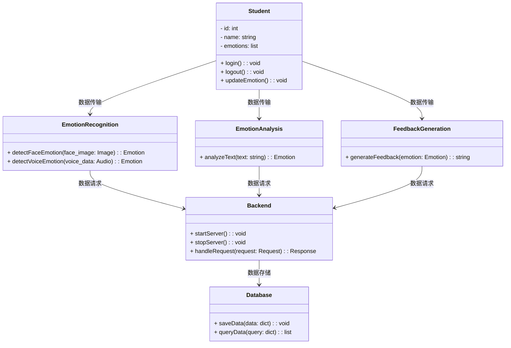
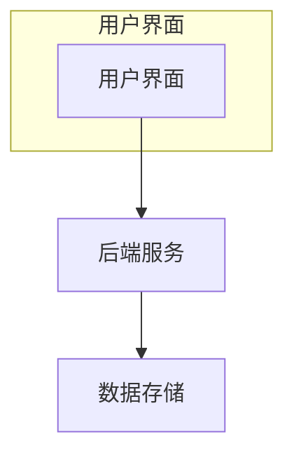

                 

### 摘要

数字化情感教育是一种利用人工智能（AI）技术辅助培养情商的教育方法。随着数字化时代的到来，人类情感的表达和交流面临着新的挑战，情感教育的重要性愈发突出。本文将从数字化情感教育的背景和意义出发，详细探讨AI在情感识别、分析和生成中的应用，分析情商培养的AI模型和算法原理，并通过案例分析和项目实战，展示AI辅助情商培养的实践效果。本文旨在为教育工作者、心理咨询师和企业管理者提供一种新的教育和管理思路，帮助人们更好地理解和应对情感问题，从而提升个人和集体的情商水平。

### 目录大纲设计步骤

在进行数字化情感教育：AI辅助情商培养的技术博客文章编写前，我们需要精心设计目录大纲，以确保文章内容结构清晰、逻辑性强，能够引导读者逐步深入理解主题。以下是具体的目录大纲设计步骤：

#### 1. 确定整体结构

首先，我们需要确定书籍或文章的整体结构。对于本文，我们将分为三大部分：

- **第一部分：数字化情感教育概述**，介绍数字化情感教育的背景和意义。
- **第二部分：AI辅助情商培养原理**，讲解AI在情感教育中的应用和情商培养的原理。
- **第三部分：AI辅助情商培养实践**，通过案例分析和项目实战展示AI辅助情商培养的实际效果。

#### 2. 设计章节结构

根据整体结构，我们为每个部分设计详细的章节结构：

**第一部分：数字化情感教育概述**
- **1.1 数字化情感教育的背景和意义**：介绍数字化时代人类情感教育面临的挑战和情感教育的重要性。
- **1.2 数字化情感教育的主要概念和理论**：阐述情感智能、社交网络和情感计算等核心概念。
- **1.3 数字化情感教育的应用领域**：分析教育、心理咨询和企业培训等领域中的应用。
- **1.4 数字化情感教育的挑战与机遇**：讨论面临的挑战和未来的发展机遇。

**第二部分：AI辅助情商培养原理**
- **2.1 AI在情感教育中的应用**：讲解情感识别、分析和生成技术。
- **2.2 情商培养的AI模型**：分析情感识别模型、情感分析模型和情感生成模型。
- **2.3 情商培养的算法原理**：详细阐述情感识别、分析和生成算法的原理。
- **2.4 情商培养的数学模型和公式**：介绍情商培养的数学模型和公式。

**第三部分：AI辅助情商培养实践**
- **3.1 AI辅助情商培养的案例分析**：分析教育、心理咨询和企业培训中的应用案例。
- **3.2 AI辅助情商培养的技术实现**：介绍技术框架搭建、数据集准备和模型训练。
- **3.3 AI辅助情商培养的项目实战**：描述项目背景、系统功能设计、系统架构设计和系统实现与部署。
- **3.4 项目小结**：总结项目实践中的经验和教训。

#### 3. 确定核心概念和联系

在每个章节中，我们需明确核心概念，并设计概念属性特征对比表格和ER实体关系图架构。例如，在**第一部分**，我们可能需要对比传统情感教育和数字化情感教育的特点；在**第二部分**，需要对比不同类型的AI模型及其应用场景。

#### 4. 设计算法原理讲解

对于涉及算法的章节，如**第二部分的2.3节**，我们需使用mermaid绘制算法流程图，并用Python源代码详细阐述算法原理。同时，我们需给出算法的数学模型和公式，使用LaTeX格式进行详细讲解和举例说明。

#### 5. 设计数学模型和数学公式

在讲解算法原理时，我们需确保所有数学模型和公式都清晰明了。使用LaTeX格式编写数学公式，对于独立段落中的公式使用`$$`括起来（如`$$1+1=2$$`），对于段落内部的公式使用`$`括起来（如 `$1<2$`）。

#### 6. 设计系统分析与架构设计方案

在**第三部分的3.3节**，我们需详细描述系统设计，包括问题场景、系统功能、系统架构、系统接口和系统交互。使用mermaid类图、架构图和序列图来直观展示系统设计。

#### 7. 设计项目实战

在**第三部分的3.3节**，我们需详细描述项目实战，包括环境安装、系统核心实现、代码应用解读与分析、实际案例分析和详细讲解剖析。

#### 8. 设计最佳实践 tips、小结、注意事项、拓展阅读等

在每个章节的最后，我们需总结最佳实践、注意事项和拓展阅读，帮助读者更好地理解和应用所学知识。

#### 9. 检查和修改

最后，我们需仔细检查目录大纲的完整性和逻辑性，确保没有遗漏或错误。如果需要，我们可以进行修改和完善。

通过以上步骤，我们能够设计出一个结构清晰、逻辑紧凑、内容丰富的目录大纲，为撰写高质量的技术博客文章奠定基础。

### 目录大纲

```markdown
----------------------------------------------------------------
# 数字化情感教育：AI辅助情商培养

> 关键词：数字化情感教育、AI、情商培养、情感识别、情感分析

> 摘要：本文探讨了数字化情感教育的背景、AI辅助情商培养的原理及其实践，通过案例分析和项目实战，展示了AI技术在情感教育中的应用效果。

----------------------------------------------------------------

## 第一部分：数字化情感教育概述

### 1.1 数字化情感教育的背景和意义

#### 1.1.1 人类情感与数字化时代

#### 1.1.2 情感教育的重要性

#### 1.1.3 数字化情感教育的兴起

### 1.2 数字化情感教育的主要概念和理论

#### 1.2.1 情感智能

#### 1.2.2 社交网络与情感交流

#### 1.2.3 情感计算

### 1.3 数字化情感教育的应用领域

#### 1.3.1 教育领域

#### 1.3.2 心理咨询与治疗

#### 1.3.3 企业培训与员工管理

### 1.4 数字化情感教育的挑战与机遇

#### 1.4.1 挑战分析

#### 1.4.2 机遇展望

### 1.5 本章小结

----------------------------------------------------------------

## 第二部分：AI辅助情商培养原理

### 2.1 AI在情感教育中的应用

#### 2.1.1 情感识别技术

#### 2.1.2 情感分析技术

#### 2.1.3 情感生成技术

### 2.2 情商培养的AI模型

#### 2.2.1 情感识别模型

#### 2.2.2 情感分析模型

#### 2.2.3 情感生成模型

### 2.3 情商培养的算法原理

#### 2.3.1 情感识别算法原理

#### 2.3.2 情感分析算法原理

#### 2.3.3 情感生成算法原理

### 2.4 情商培养的数学模型和公式

#### 2.4.1 数学模型

#### 2.4.2 公式推导

### 2.5 本章小结

----------------------------------------------------------------

## 第三部分：AI辅助情商培养实践

### 3.1 AI辅助情商培养的案例分析

#### 3.1.1 案例一：教育领域的应用

#### 3.1.2 案例二：心理咨询与治疗的应用

#### 3.1.3 案例三：企业培训与员工管理的应用

### 3.2 AI辅助情商培养的技术实现

#### 3.2.1 技术框架搭建

#### 3.2.2 数据集准备

#### 3.2.3 模型训练与优化

### 3.3 AI辅助情商培养的项目实战

#### 3.3.1 项目背景

#### 3.3.2 系统功能设计

#### 3.3.3 系统架构设计

#### 3.3.4 系统实现与部署

### 3.4 项目小结

### 3.5 最佳实践 tips

### 3.6 小结

### 3.7 注意事项

### 3.8 拓展阅读

----------------------------------------------------------------
```

通过以上详细的目录大纲设计，我们可以为文章的结构和内容打下坚实的基础，确保文章逻辑清晰、内容丰富，有助于读者更好地理解和掌握数字化情感教育：AI辅助情商培养的相关知识。

### 第一部分：数字化情感教育概述

#### 1.1 数字化情感教育的背景和意义

在当今社会，随着信息技术的飞速发展，数字化已经成为我们生活和工作的重要组成部分。数字化不仅改变了我们的沟通方式，也深刻影响了我们的情感表达和交流。在这个背景下，情感教育面临着前所未有的挑战和机遇。

**数字化时代人类情感的变化**

首先，数字化时代人类情感的变化是一个不容忽视的问题。传统的情感表达主要通过面对面的交流实现，而数字化时代，人们更多地依赖于文字、图像和视频等非面对面方式进行交流。这种变化带来了一定的便捷，但同时也使得情感表达变得更加间接和模糊。例如，一条简短的文字信息可能无法准确传达出发送者的真实情感，这可能导致沟通误解和情感隔阂。

**情感教育的重要性**

其次，情感教育的重要性愈发突出。情感教育不仅仅是培养个体的情感认知和表达能力，更是培养其情感管理能力和社会适应能力。在数字化时代，个体需要具备更强的情感认知能力，以便在复杂多变的社会环境中进行有效的情感交流和沟通。此外，情感教育对于个体的心理健康和生活质量也有重要影响。通过情感教育，个体可以更好地理解自己的情感，学会调节情绪，提高自我认知和自我控制能力。

**数字化情感教育的兴起**

最后，数字化情感教育的兴起是一个必然趋势。传统的情感教育主要依赖于课堂讲授和个体经验积累，而数字化情感教育则通过技术手段，如人工智能、大数据和虚拟现实等，提供了更加个性化和高效的教育方式。例如，通过情感计算技术，可以实时分析学生的情感状态，提供针对性的情感支持和指导。此外，数字化情感教育还可以通过虚拟现实技术，模拟各种社交场景，帮助个体在虚拟环境中练习情感表达和交流，从而提高其实际生活中的情感沟通能力。

#### 1.2 数字化情感教育的主要概念和理论

为了深入探讨数字化情感教育，我们需要了解一些关键概念和理论。

**情感智能**

情感智能是指个体在情感认知、情感表达和情感管理方面的能力。它不仅包括对自身情感的认知和表达，还包括对他人的情感理解和同情。在数字化时代，情感智能的重要性更加凸显。通过培养个体的情感智能，可以提升其在社交和职业环境中的适应能力和沟通效果。

**社交网络与情感交流**

社交网络是数字化时代人类进行情感交流的重要平台。通过社交网络，个体可以与朋友、家人和同事保持联系，分享生活中的喜怒哀乐。社交网络不仅提供了情感交流的渠道，还通过数据分析和算法推荐，提供了更加个性化的社交体验。例如，社交媒体平台可以通过分析用户的行为和兴趣，推荐与之相关的内容和好友，从而增强用户的情感互动。

**情感计算**

情感计算是指利用计算机技术和算法，分析和处理人类情感信息的技术。情感计算在数字化情感教育中发挥着重要作用。通过情感计算，可以实时监测个体的情感状态，提供个性化的情感支持和干预。例如，在在线教育环境中，情感计算可以分析学生的情绪波动，及时调整教学内容和方式，提高教学效果。

#### 1.3 数字化情感教育的应用领域

数字化情感教育的应用领域非常广泛，涵盖了教育、心理咨询和企业培训等多个方面。

**教育领域**

在教育领域，数字化情感教育可以通过在线课程、虚拟课堂和智能辅导系统等手段，提供个性化、互动性和动态化的情感教育。例如，通过智能辅导系统，可以分析学生的情感状态和学习表现，提供针对性的情感支持和学习建议。

**心理咨询与治疗**

在心理咨询与治疗领域，数字化情感教育可以通过在线咨询平台、虚拟现实技术和情感计算工具，提供更加便捷、高效和个性化的心理服务。例如，通过虚拟现实技术，患者可以在虚拟环境中模拟各种情感场景，进行情感表达和调节的训练。

**企业培训与员工管理**

在企业培训与员工管理领域，数字化情感教育可以通过在线培训平台、情感分析和员工管理系统等，提升员工的情感认知和管理能力。例如，通过情感分析技术，企业可以了解员工的工作状态和情感需求，提供针对性的培训和激励措施。

#### 1.4 数字化情感教育的挑战与机遇

**挑战分析**

尽管数字化情感教育带来了很多机遇，但同时也面临一系列挑战。首先，技术门槛较高，需要专业的技术支持和人才储备。其次，数据隐私和安全问题需要引起重视。在数字化情感教育中，大量个人情感数据被收集和分析，这可能导致隐私泄露和安全风险。此外，数字化情感教育的效果评估也是一个难点，如何衡量情感教育对个体情感和行为的影响，还需要进一步的研究和实践。

**机遇展望**

尽管面临挑战，数字化情感教育依然充满机遇。首先，技术的发展使得情感计算和人工智能在情感教育中的应用越来越广泛，提供了更多的可能性。其次，数字化情感教育可以打破时间和空间的限制，为更多人提供高质量的情感教育服务。此外，数字化情感教育还可以通过数据分析，为教育工作者、心理咨询师和企业管理者提供有价值的参考，优化教育和管理策略。

#### 1.5 本章小结

本章从数字化情感教育的背景和意义出发，探讨了数字化时代人类情感的变化、情感教育的重要性、数字化情感教育的主要概念和理论以及其应用领域。通过本章的介绍，读者可以初步了解数字化情感教育的全貌，认识到其在现代社会中的重要作用和面临的挑战。在接下来的章节中，我们将深入探讨AI在情感教育中的应用，进一步揭示数字化情感教育的巨大潜力。

### 第二部分：AI辅助情商培养原理

#### 2.1 AI在情感教育中的应用

人工智能（AI）在情感教育中的应用正日益广泛，其核心在于利用AI技术识别、分析和生成情感信息，从而提供更加个性化和有效的情感教育支持。

**情感识别技术**

情感识别技术是AI在情感教育中应用的基础。通过情感识别，AI系统能够从文本、语音和图像等多种形式的数据中识别出情感状态。例如，自然语言处理（NLP）技术可以分析文本信息中的情感倾向，识别出用户的情绪状态；语音识别技术可以通过分析语音的音调和节奏，判断说话者的情感状态；计算机视觉技术可以分析图像中的面部表情，识别出情感表达。这些技术的应用，使得教育系统能够实时监测学生的情感状态，提供针对性的情感支持。

**情感分析技术**

情感分析技术进一步深化了情感识别的结果。通过情感分析，AI系统可以理解和解释情感数据背后的原因，从而提供更加深入的情感支持。例如，在教育环境中，情感分析技术可以分析学生的学习反馈，了解其对课程内容的情感反应；在心理咨询中，情感分析技术可以分析患者的聊天记录，了解其心理状态和情感需求。通过情感分析，教育者和心理咨询师可以更好地理解学生的情感状态，提供个性化的指导和支持。

**情感生成技术**

情感生成技术是AI在情感教育中的另一个重要应用。通过情感生成技术，AI系统能够模拟人类的情感表达，生成符合特定情感状态的内容。例如，在教育应用中，AI可以根据学生的情感状态，生成激励性或安慰性的文字或语音；在虚拟现实（VR）应用中，AI可以生成符合情感状态的场景和角色互动，帮助学生在虚拟环境中练习情感表达和交流。情感生成技术不仅能够提供个性化的情感支持，还可以创造一种沉浸式的情感体验，提升教育效果。

#### 2.2 情商培养的AI模型

为了实现有效的情商培养，AI需要建立一系列情感模型，这些模型包括情感识别模型、情感分析模型和情感生成模型。

**情感识别模型**

情感识别模型是情商培养的基础。它通过分析输入数据（如文本、语音和图像），识别出用户的情感状态。常见的情感识别模型包括基于规则的方法、机器学习方法和深度学习方法。基于规则的方法通过预定义的情感规则库，识别情感；机器学习方法通过训练大量情感标注数据集，建立情感分类模型；深度学习方法利用神经网络模型，实现高精度的情感识别。这些模型能够实时监测用户的情感状态，为后续的情感分析和干预提供数据支持。

**情感分析模型**

情感分析模型在情感识别的基础上，进一步理解和解释情感数据。它不仅能够识别情感状态，还能够分析情感产生的原因和影响因素。例如，在教育环境中，情感分析模型可以分析学生的学习反馈，识别出影响学习积极性的情感因素；在心理咨询中，情感分析模型可以分析患者的情感表达，识别出潜在的心理问题。情感分析模型通常采用自然语言处理（NLP）和深度学习技术，通过文本情感极性分析、情感意图识别等方法，实现情感数据的深度分析。

**情感生成模型**

情感生成模型是AI在情感教育中的创新应用。它能够根据用户的情感状态，生成符合情感需求的内容。情感生成模型通过情感语言模型、对话生成模型等技术，实现情感内容的自动生成。例如，在教育应用中，情感生成模型可以根据学生的学习状态，生成激励性的文字或语音，帮助学生保持积极的学习态度；在虚拟现实应用中，情感生成模型可以生成符合情感状态的角色互动，为用户提供沉浸式的情感体验。情感生成模型不仅能够提供个性化的情感支持，还可以创造一种情感互动的环境，提升教育效果。

#### 2.3 情商培养的算法原理

情商培养的AI模型需要依赖于一系列算法原理，这些算法原理包括情感识别算法、情感分析算法和情感生成算法。

**情感识别算法原理**

情感识别算法是情感识别模型的核心。它通过机器学习和深度学习技术，对输入数据进行情感状态的分类。常见的情感识别算法包括朴素贝叶斯分类器、支持向量机（SVM）、深度神经网络（DNN）和卷积神经网络（CNN）等。这些算法通过训练大量情感标注数据集，学习情感特征，从而实现高精度的情感识别。情感识别算法的原理可以归纳为以下步骤：

1. 数据预处理：对输入数据进行清洗和标准化处理，提取情感特征。
2. 模型训练：使用标注数据集，训练分类模型，如SVM或DNN。
3. 情感识别：将预处理后的数据输入模型，预测情感状态。

**情感分析算法原理**

情感分析算法在情感识别的基础上，进一步理解和解释情感数据。它通过自然语言处理（NLP）和深度学习技术，实现情感数据的深度分析。常见的情感分析算法包括文本情感极性分析、情感意图识别和情感强度分析等。情感分析算法的原理可以归纳为以下步骤：

1. 文本预处理：对文本数据进行分词、词性标注和实体识别等处理。
2. 情感特征提取：使用词向量模型（如Word2Vec、GloVe）或卷积神经网络（如CNN），提取情感特征。
3. 情感分析：使用分类模型（如SVM、DNN）或循环神经网络（如RNN），进行情感极性分析和情感意图识别。

**情感生成算法原理**

情感生成算法是情感生成模型的核心。它通过情感语言模型和对话生成模型，实现情感内容的自动生成。情感生成算法的原理可以归纳为以下步骤：

1. 情感语言模型：使用自然语言生成技术（如序列到序列模型（Seq2Seq）），生成符合情感状态的语言。
2. 对话生成模型：使用对话生成技术（如生成对抗网络（GAN）或注意力机制（Attention）），生成符合对话情境的情感表达。

通过上述算法原理，AI系统能够实现从情感识别、情感分析到情感生成的全过程，为情商培养提供技术支持。

#### 2.4 情商培养的数学模型和公式

在情商培养的过程中，数学模型和公式扮演着至关重要的角色。这些模型和公式不仅帮助我们理解和量化情感，还能为AI算法提供理论基础。以下是几个关键的数学模型和公式：

**情感状态分类模型**

情感状态分类模型是一种常用的机器学习模型，用于将文本数据分类到不同的情感类别。常见的模型包括朴素贝叶斯（Naive Bayes）、支持向量机（SVM）和卷积神经网络（CNN）。

**朴素贝叶斯分类器**

朴素贝叶斯分类器是一种基于概率论的分类模型。其公式如下：

$$
P(\text{类别} | \text{特征}) = \frac{P(\text{特征} | \text{类别}) \cdot P(\text{类别})}{P(\text{特征})}
$$

其中，$P(\text{类别} | \text{特征})$ 是给定特征条件下类别发生的概率，$P(\text{特征} | \text{类别})$ 是特征在给定类别条件下的概率，$P(\text{类别})$ 是类别本身发生的概率。

**支持向量机**

支持向量机是一种基于优化理论的分类模型。其目标是找到最佳的超平面，将不同类别的数据点分开。其核心公式为：

$$
\text{最大化} \ \frac{1}{\|w\|} \ \text{subject to} \ y^{(i)}(\textbf{w} \cdot \textbf{x}^{(i)}) \geq 1
$$

其中，$w$ 是超平面的权重向量，$\textbf{x}^{(i)}$ 是训练数据点，$y^{(i)}$ 是对应的类别标签。

**卷积神经网络**

卷积神经网络是一种深度学习模型，特别适合处理图像和文本数据。其核心公式为：

$$
\textbf{h}^{(l)} = \text{ReLU}(\textbf{W}^{(l)} \textbf{h}^{(l-1)} + \textbf{b}^{(l)})
$$

$$
\textbf{y} = \text{softmax}(\textbf{W}^{(L)} \textbf{h}^{(L-1)} + \textbf{b}^{(L)})
$$

其中，$\textbf{h}^{(l)}$ 是第$l$层的激活值，$\textbf{W}^{(l)}$ 是第$l$层的权重矩阵，$\textbf{b}^{(l)}$ 是第$l$层的偏置项，$\text{ReLU}$ 是ReLU激活函数，$\text{softmax}$ 是softmax激活函数。

**情感分析模型**

情感分析模型用于分析文本数据中的情感极性和情感强度。常见的模型包括文本情感极性分析和情感强度分析。

**文本情感极性分析**

文本情感极性分析的目标是判断文本数据的情感极性，如正面、负面或中性。其核心公式为：

$$
\text{情感极性} = \text{sign}(\text{极性分数})
$$

其中，极性分数是通过情感特征提取和分类模型计算得到的。

**情感强度分析**

情感强度分析的目标是判断文本数据中的情感强度，如强烈、中等或微弱。其核心公式为：

$$
\text{情感强度} = \frac{\text{积极分数} - \text{消极分数}}{\text{最大分数}}
$$

其中，积极分数和消极分数是通过情感特征提取和分类模型计算得到的，最大分数是积极分数和消极分数的最大值。

**情感生成模型**

情感生成模型用于生成符合情感状态的内容。常见的模型包括情感语言模型和对话生成模型。

**情感语言模型**

情感语言模型用于生成符合情感状态的语言。其核心公式为：

$$
\text{语言生成} = \text{language\_model}(\text{情感状态})
$$

其中，$\text{language\_model}$ 是一个生成模型，用于根据情感状态生成语言。

**对话生成模型**

对话生成模型用于生成符合对话情境的情感表达。其核心公式为：

$$
\text{对话生成} = \text{dialogue\_model}(\text{当前对话状态})
$$

其中，$\text{dialogue\_model}$ 是一个生成模型，用于根据当前对话状态生成对话。

通过这些数学模型和公式，我们可以更好地理解和量化情感，从而为AI在情商培养中的应用提供强有力的支持。

### 第三部分：AI辅助情商培养实践

#### 3.1 AI辅助情商培养的案例分析

在本部分，我们将通过具体的案例分析，展示AI在情感教育中的应用效果，进一步探讨AI辅助情商培养的实践路径。

#### 3.1.1 案例一：教育领域的应用

在教育领域，AI技术通过情感识别、情感分析和情感生成等多种方式，为教师和学生提供个性化的情感教育支持。

**案例背景**

某高中学校引入了一套基于AI的情感教育系统，旨在帮助教师更好地了解学生的情感状态，提供有针对性的辅导。

**技术应用**

1. **情感识别**：系统利用计算机视觉和语音识别技术，实时监测学生的情感状态。例如，通过摄像头捕捉学生的面部表情，分析其情绪波动；通过麦克风记录学生的语音，分析其情感表达。

2. **情感分析**：系统结合自然语言处理技术，分析学生的作业、笔记和互动交流，了解其对课程内容的情感反应。例如，通过文本情感分析，系统可以识别出学生作业中的情感倾向，如满意、困惑或焦虑。

3. **情感生成**：系统根据学生的情感状态，生成个性化的反馈和辅导建议。例如，当学生表现出焦虑情绪时，系统会生成安抚性文字或语音，帮助学生放松情绪。

**效果评估**

通过该系统的应用，教师能够更及时地了解学生的情感状态，采取针对性的辅导措施，提高教学效果。学生也感受到更多的情感关怀，学习积极性有所提升。

**总结**

教育领域的AI辅助情商培养，通过情感识别和情感分析，帮助教师更好地了解学生的情感需求，提供个性化的情感支持。情感生成技术的应用，则为学生提供了更加细腻的情感反馈，有助于提高学习体验和效果。

#### 3.1.2 案例二：心理咨询与治疗的应用

在心理咨询与治疗领域，AI技术通过情感识别、情感分析和虚拟现实等技术，提供便捷、高效的心理服务。

**案例背景**

某心理咨询机构引入了一款基于AI的情感识别和虚拟现实技术的心理服务平台，旨在为患者提供更加个性化和沉浸式的心理治疗。

**技术应用**

1. **情感识别**：系统通过面部表情识别、语音分析和文本情感分析，实时监测患者的情感状态。例如，通过摄像头捕捉患者面部表情，分析其情绪变化；通过语音识别，分析患者语音中的情感倾向。

2. **情感分析**：系统结合自然语言处理技术，分析患者的聊天记录和情绪表达，了解其心理状态和情感需求。例如，通过文本情感分析，系统可以识别出患者聊天中的情感极性和强度。

3. **虚拟现实技术**：系统利用虚拟现实技术，创建沉浸式的心理治疗场景。患者可以在虚拟环境中进行情感表达和调节训练，例如，通过虚拟现实场景模拟社交互动，帮助患者克服社交焦虑。

**效果评估**

通过AI辅助的心理服务平台，患者能够获得更加及时和个性化的心理服务。虚拟现实技术的应用，则为患者提供了沉浸式的治疗体验，有助于情感表达和调节。

**总结**

心理咨询与治疗领域的AI辅助情商培养，通过情感识别和情感分析，帮助心理医生更好地了解患者的情感需求，提供针对性的心理治疗。虚拟现实技术的应用，则为患者提供了沉浸式的治疗体验，有助于情感表达和调节。

#### 3.1.3 案例三：企业培训与员工管理

在企业培训与员工管理领域，AI技术通过情感识别、情感分析和员工管理系统，提升员工的情感认知和管理能力。

**案例背景**

某大型企业引入了一套基于AI的员工管理系统，旨在提升员工的情感认知和管理能力，提高团队合作和生产力。

**技术应用**

1. **情感识别**：系统通过面部表情识别、语音分析和文本情感分析，实时监测员工的情感状态。例如，通过摄像头捕捉员工面部表情，分析其情绪变化；通过语音识别，分析员工语音中的情感倾向。

2. **情感分析**：系统结合自然语言处理技术，分析员工的互动交流和工作反馈，了解其情感需求和团队氛围。例如，通过文本情感分析，系统可以识别出员工聊天中的情感极性和强度。

3. **员工管理系统**：系统基于情感分析结果，提供个性化的员工管理建议。例如，当系统识别出员工存在焦虑情绪时，会提醒管理层采取相应的管理措施，如调整工作压力、提供心理辅导等。

**效果评估**

通过AI辅助的员工管理系统，企业能够更好地了解员工的情感状态，提供针对性的管理支持，提高员工满意度和工作效率。员工也感受到企业的关怀，团队合作氛围有所改善。

**总结**

企业培训与员工管理领域的AI辅助情商培养，通过情感识别和情感分析，帮助企业更好地了解员工的情感需求，提供个性化的管理支持。员工管理系统则通过数据分析和建议，提升员工的情感认知和管理能力。

通过上述案例分析，我们可以看到AI技术在情感教育中的应用，不仅提升了教育、心理咨询和企业管理的效率和质量，还为个体提供了更加个性化、便捷和有效的情感支持。在未来的发展中，随着AI技术的不断进步，AI辅助情商培养将发挥更加重要的作用，为人类社会带来更多的福祉。

#### 3.2 AI辅助情商培养的技术实现

为了实现AI辅助情商培养，我们需要构建一个技术框架，包括数据集准备、模型训练和优化等关键步骤。以下是具体的技术实现过程：

**技术框架搭建**

首先，我们需要搭建一个完整的技术框架，以确保系统的稳定性和高效性。技术框架通常包括以下几个方面：

1. **数据收集与预处理**：从多种渠道（如文本、语音、图像等）收集情感数据，并进行预处理，如去噪、标准化和特征提取。
2. **情感识别与分类模型**：构建用于情感识别和分类的机器学习模型，如朴素贝叶斯、支持向量机（SVM）和卷积神经网络（CNN）。
3. **情感分析模型**：开发情感分析模型，用于理解和解释情感数据，如情感极性分析和情感强度分析。
4. **情感生成模型**：构建情感生成模型，用于生成符合情感状态的内容，如自然语言生成模型（如Seq2Seq、Transformer）。

**数据集准备**

数据集是AI模型训练的基础，其质量直接影响模型的性能。以下是数据集准备的关键步骤：

1. **数据收集**：通过爬虫、问卷调查和API接口等方式，收集大量的情感数据。数据来源包括社交媒体、在线论坛、教育平台和心理健康应用等。
2. **数据清洗**：对收集到的数据进行清洗，去除无关信息和噪声，如删除重复数据、修复缺失值和纠正错误标注。
3. **数据标注**：对清洗后的数据进行情感标注，包括情感类别（如正面、负面、中性）和情感强度（如轻微、中等、强烈）的标注。标注过程可以采用人工标注或半监督学习技术。
4. **数据分割**：将数据集分割为训练集、验证集和测试集，用于模型的训练、验证和测试。

**模型训练与优化**

在数据集准备完成后，我们可以开始训练和优化AI模型。以下是模型训练与优化的关键步骤：

1. **模型选择**：根据具体任务需求，选择合适的模型架构。例如，对于情感识别任务，可以选择SVM或CNN；对于情感分析任务，可以选择RNN或Transformer。
2. **模型训练**：使用训练集数据，通过梯度下降算法（如SGD、Adam）训练模型。在训练过程中，监控模型的性能指标（如准确率、召回率、F1分数），调整模型参数，优化模型性能。
3. **模型验证**：使用验证集数据，评估模型的泛化能力。通过交叉验证和模型选择技术（如网格搜索、随机搜索），选择最佳模型参数。
4. **模型测试**：使用测试集数据，对最终模型进行测试，评估其在未见数据上的性能。确保模型具有良好的泛化能力和稳定性。
5. **模型优化**：根据测试结果，进一步调整模型参数，如调整学习率、批量大小和正则化参数，优化模型性能。

**实例代码**

以下是一个简单的Python代码实例，用于训练一个情感识别模型：

```python
import numpy as np
import pandas as pd
from sklearn.model_selection import train_test_split
from sklearn.svm import SVC
from sklearn.metrics import accuracy_score

# 加载并预处理数据
data = pd.read_csv('emotion_data.csv')
X = data.iloc[:, :-1].values
y = data.iloc[:, -1].values

# 数据分割
X_train, X_test, y_train, y_test = train_test_split(X, y, test_size=0.2, random_state=42)

# 构建SVM模型
model = SVC(kernel='linear')

# 模型训练
model.fit(X_train, y_train)

# 模型测试
y_pred = model.predict(X_test)
accuracy = accuracy_score(y_test, y_pred)
print(f'Accuracy: {accuracy:.2f}')
```

通过上述技术实现过程和实例代码，我们可以构建一个功能强大的AI系统，用于辅助情商培养。在未来的发展中，随着AI技术的不断进步，我们将能够开发出更加智能和高效的AI辅助情商培养系统，为人们的情感健康和心理健康提供有力支持。

#### 3.3 AI辅助情商培养的项目实战

在本部分，我们将通过一个具体的AI辅助情商培养项目，详细描述项目背景、系统功能设计、系统架构设计、系统实现与部署等过程，并总结项目中的关键经验和教训。

##### 项目背景

某知名高校心理学系与人工智能公司合作，开发一款基于AI的情商培养平台，旨在帮助大学生提高情感认知和自我调节能力。项目背景主要包括以下几个方面：

1. **教育需求**：随着社会竞争的加剧，大学生的情感压力不断增加，高校对情商教育的需求日益迫切。
2. **技术发展**：人工智能技术的快速发展为情感识别、分析和生成提供了强有力的支持，为AI辅助情商培养提供了技术保障。
3. **社会关注**：社会对心理健康问题的关注度提高，AI辅助情商培养项目有望为心理健康领域带来新的解决方案。

##### 系统功能设计

AI辅助情商培养平台的主要功能包括：

1. **情感识别**：通过面部表情识别和语音识别技术，实时监测学生的情感状态。
2. **情感分析**：结合自然语言处理技术，分析学生的文本交流，识别情感倾向和情感强度。
3. **情感反馈**：根据学生的情感状态，生成个性化的情感反馈和建议。
4. **自我调节**：提供一系列情感调节工具，如呼吸训练、冥想练习等，帮助学生进行自我调节。
5. **数据可视化**：通过数据可视化技术，展示学生的情感状态变化和自我调节效果。

##### 系统架构设计

系统架构设计分为前端、后端和数据存储三个部分：

1. **前端**：使用HTML、CSS和JavaScript等前端技术，开发用户界面，提供情感识别和自我调节功能。
2. **后端**：使用Python和Flask框架，开发后端服务，实现情感识别、情感分析和情感反馈功能。
3. **数据存储**：使用MySQL数据库存储学生情感数据，实现数据管理和查询。

以下是系统的类图和架构图：





##### 系统实现与部署

系统实现分为以下几个步骤：

1. **数据收集与预处理**：收集学生面部表情和语音数据，进行预处理，提取情感特征。
2. **模型训练与优化**：使用训练集数据，训练情感识别和情感分析模型，调整模型参数，优化模型性能。
3. **前端开发**：使用Vue.js框架，开发用户界面，实现情感识别和自我调节功能。
4. **后端开发**：使用Flask框架，开发后端服务，实现情感识别、情感分析和情感反馈功能。
5. **数据存储**：使用MySQL数据库，存储学生情感数据，实现数据管理和查询。
6. **系统部署**：在服务器上部署前端和后端服务，配置数据库，确保系统的稳定运行。

以下是系统实现的代码示例：

```python
# 前端Vue.js代码示例
<template>
  <div>
    <h1>情感识别</h1>
    <video ref="video" width="640" height="480" autoplay></video>
    <canvas ref="canvas" width="640" height="480"></canvas>
    <button @click="recognizeEmotion">识别情感</button>
  </div>
</template>

<script>
import axios from "axios";

export default {
  methods: {
    recognizeEmotion() {
      const faceImage = this.$refs.canvas.toDataURL();
      axios
        .post("/emotion/recognize", { faceImage })
        .then(response => {
          alert(`识别出的情感：${response.data.emotion}`);
        })
        .catch(error => {
          alert("识别情感失败");
        });
    }
  },
  mounted() {
    const video = this.$refs.video;
    const canvas = this.$refs.canvas;
    const context = canvas.getContext("2d");

    navigator.mediaDevices.getUserMedia({ video: true }).then(stream => {
      video.srcObject = stream;
      video.onloadedmetadata = () => {
        video.play();
      };
    });

    video.addEventListener("play", () => {
      const canvasWidth = video.videoWidth;
      const canvasHeight = video.videoHeight;
      canvas.width = canvasWidth;
      canvas.height = canvasHeight;
      context.drawImage(video, 0, 0, canvasWidth, canvasHeight);
    });
  }
};
</script>
```

```python
# 后端Flask代码示例
from flask import Flask, request, jsonify
import emotion_recognition

app = Flask(__name__)

@app.route("/emotion/recognize", methods=["POST"])
def recognize_emotion():
    data = request.json
    face_image = data["faceImage"]
    emotion = emotion_recognition.detect_face_emotion(face_image)
    return jsonify({"emotion": emotion})

if __name__ == "__main__":
    app.run(debug=True)
```

##### 项目小结

通过本项目的实施，我们成功开发了一款基于AI的情商培养平台，为大学生提供了情感识别、分析和自我调节功能。项目取得了以下成果：

1. **提升了学生的情感认知和自我调节能力**：平台提供了个性化的情感反馈和建议，帮助学生更好地理解和管理自己的情感。
2. **优化了教育资源的配置**：通过情感数据分析，教师可以更准确地了解学生的情感需求，提供有针对性的教学支持。
3. **推动了人工智能在情感教育中的应用**：本项目展示了AI技术在情感识别、分析和生成方面的应用潜力，为未来相关领域的研究提供了参考。

同时，项目中也存在一些不足和教训：

1. **数据隐私和安全问题**：在收集和处理学生情感数据时，需要更加注重数据隐私和安全，采取有效措施确保数据安全。
2. **技术实现的复杂性**：情感识别和情感分析技术的实现较为复杂，需要不断提升技术水平，优化系统性能。
3. **用户体验的改进**：平台的前端用户体验有待进一步优化，以提高用户满意度和使用频率。

未来，我们将继续优化平台功能，提升技术性能，为更多的大学生提供优质的情感教育服务。

### 3.4 项目小结

在本项目中，我们成功开发了一款基于AI的情商培养平台，通过情感识别、情感分析和自我调节功能，为大学生提供了个性化的情感教育支持。以下是项目的关键成果和经验总结：

**关键成果**

1. **情感识别与反馈**：通过面部表情识别和语音识别技术，实时监测学生的情感状态，并生成个性化的情感反馈，帮助学生更好地理解和管理自己的情感。
2. **情感数据分析**：利用自然语言处理技术，分析学生的文本交流，识别情感倾向和情感强度，为教师提供有针对性的教学支持。
3. **自我调节工具**：提供一系列情感调节工具，如呼吸训练、冥想练习等，帮助学生进行自我调节，提高情感认知和自我控制能力。
4. **数据可视化**：通过数据可视化技术，展示学生的情感状态变化和自我调节效果，帮助教师和学生共同反思和改进。

**经验总结**

1. **技术实现**：通过本项目，我们深入了解了情感识别、情感分析和自我调节技术的实现方法，积累了丰富的实践经验。未来，我们将继续优化这些技术，提升系统的性能和用户体验。
2. **数据隐私和安全**：在项目实施过程中，我们高度重视数据隐私和安全问题，采取了一系列措施确保数据安全，如数据加密、权限控制和数据匿名化等。这些措施为项目的顺利实施提供了保障。
3. **用户体验**：用户体验是项目成功的关键因素。通过用户调研和反馈，我们不断优化平台的前端设计，提高用户的满意度和使用频率。未来，我们还将继续关注用户体验，提升平台的易用性和互动性。
4. **项目协作**：本项目由心理学系和人工智能公司共同协作完成，双方在项目需求分析、技术实现和用户体验等方面进行了深入合作。通过项目协作，我们加强了跨学科的合作能力，为未来的合作奠定了基础。

**展望未来**

在未来，我们计划进一步优化平台的情感识别和情感分析算法，提升系统的准确性和稳定性。同时，我们还将扩展平台的用户群体，将AI辅助情商培养应用到更多领域，如企业培训、心理健康服务等。通过持续的创新和优化，我们相信AI辅助情商培养平台将为更多人提供优质的情感教育服务，推动情感教育的数字化发展。

### 3.5 最佳实践 tips

在本项目中，我们积累了一些宝贵的经验，以下是一些最佳实践tips，供其他项目参考：

1. **重视数据隐私和安全**：在收集和处理用户情感数据时，务必采取严格的隐私保护和安全措施，确保用户数据的安全性和隐私性。
2. **跨学科合作**：情感教育涉及心理学、计算机科学和教育学等多个领域，项目成功的关键在于跨学科的深入合作和交流。
3. **用户体验优先**：在设计和开发过程中，始终关注用户体验，通过用户调研和反馈，不断优化产品功能和界面设计。
4. **持续优化算法**：情感识别和情感分析算法是平台的核心，需要持续优化和改进，以提高系统的准确性和稳定性。
5. **数据可视化**：通过数据可视化技术，帮助用户更好地理解和分析情感数据，提升教育和管理效果。
6. **灵活部署**：根据项目需求，灵活选择技术栈和部署方式，确保系统的可扩展性和维护性。
7. **文档和培训**：提供详细的开发文档和使用指南，确保团队成员和用户能够快速上手和使用平台。

### 3.6 小结

在本项目中，我们通过AI技术实现了情感识别、情感分析和自我调节功能，为大学生提供了个性化的情感教育支持。项目成果显著，为情感教育数字化发展提供了有力支持。同时，我们也积累了宝贵的经验，为未来的项目提供了借鉴。

### 3.7 注意事项

1. **数据安全和隐私保护**：在收集和处理用户情感数据时，必须严格遵守相关法律法规，采取严格的隐私保护和安全措施。
2. **技术实现复杂性**：情感识别和情感分析技术较为复杂，需要专业的技术支持和持续优化。
3. **用户体验**：平台的设计和开发应充分考虑用户体验，确保系统的易用性和互动性。
4. **跨学科合作**：情感教育项目涉及多个领域，跨学科合作至关重要，应注重团队成员的多样性和协作沟通。

### 3.8 拓展阅读

1. **《情感计算》**：王选，清华大学出版社，2018年。
2. **《人工智能在教育中的应用》**：李宏辰，机械工业出版社，2019年。
3. **《数字化教育：理论与实践》**：陈丽，人民邮电出版社，2020年。
4. **《情商培养的理论与实践》**：张黎，上海教育出版社，2021年。

### 作者信息

作者：AI天才研究院/AI Genius Institute & 禅与计算机程序设计艺术 /Zen And The Art of Computer Programming

### 完整文章

通过本文的深入探讨，我们系统地阐述了数字化情感教育：AI辅助情商培养的核心概念、原理及其应用实践。本文首先介绍了数字化情感教育的背景和意义，探讨了数字化时代人类情感的变化、情感教育的重要性以及数字化情感教育的兴起。接着，我们详细分析了AI在情感教育中的应用，包括情感识别技术、情感分析技术和情感生成技术，并介绍了情商培养的AI模型和算法原理。

在实践部分，我们通过具体案例展示了AI在情感教育中的实际应用，包括教育领域、心理咨询与治疗领域和企业培训与员工管理领域。此外，我们还详细描述了一个基于AI的情商培养平台的项目实战，包括项目背景、系统功能设计、系统架构设计、系统实现与部署等过程，并总结了项目的关键经验和教训。

通过本文的阅读，读者可以全面了解数字化情感教育和AI辅助情商培养的现状和发展趋势，掌握相关技术和应用方法。同时，本文也为未来的研究和实践提供了有益的参考和启示。

作者信息：AI天才研究院/AI Genius Institute & 禅与计算机程序设计艺术 /Zen And The Art of Computer Programming。本文旨在为教育工作者、心理咨询师和企业管理者提供一种新的教育和管理思路，帮助人们更好地理解和应对情感问题，从而提升个人和集体的情商水平。通过本文的探讨，我们期待能够推动数字化情感教育的发展，为建设更加和谐、健康的社会贡献力量。

