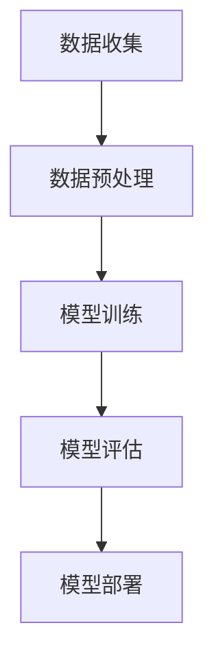

                 

# 《数字化情感档案：AI记录个人情感历史》

## 关键词

- 数字化情感档案
- 人工智能
- 情感识别
- 自然语言处理
- 隐私保护

## 摘要

本文探讨了数字化情感档案的概念及其在人工智能（AI）技术中的应用。随着数字化时代的到来，人们的情感体验被不断记录和数字化。本书通过详细阐述情感数据收集、处理、情感识别算法、隐私保护策略以及实际应用场景，展示了如何利用AI技术构建和利用数字化情感档案，为心理健康、情感咨询等领域提供个性化服务。同时，本文还分析了数字化情感档案的核心概念、原理及其在相关领域的应用边界与外延。

### 背景介绍：核心概念

#### 1. 问题背景

在数字化时代，人们的生活和情感体验逐渐被记录和数字化。随着人工智能技术的发展，特别是机器学习和自然语言处理技术的进步，人们开始探索如何利用AI技术记录和分析个人的情感历史。

《数字化情感档案：AI记录个人情感历史》这本书旨在探讨如何利用人工智能技术，特别是深度学习和自然语言处理技术，来创建和利用数字化情感档案。这些档案可以记录个人的情感经历，提供个性化的情感分析和建议，甚至可能用于医疗、心理治疗等领域。

#### 2. 问题描述

数字化情感档案的创建涉及以下几个方面的问题：

- **数据收集**：如何有效地收集和存储个人情感数据？
- **数据处理**：如何处理和清洗情感数据，以便进行进一步分析？
- **情感识别**：如何使用机器学习算法来识别和理解情感？
- **隐私保护**：在收集和使用个人情感数据时，如何确保隐私和安全？
- **应用场景**：如何将数字化情感档案应用于实际场景，如心理治疗、健康监测等？

#### 3. 问题解决

为了解决上述问题，本书将从以下几个方面展开：

- **数据收集与存储**：介绍常用的数据收集工具和技术，以及情感数据存储的方法和挑战。
- **数据处理与清洗**：讲解如何处理和清洗情感数据，以便进行进一步分析。
- **情感识别算法**：详细介绍用于情感识别的机器学习算法，包括特征提取、模型训练和评估等。
- **隐私保护策略**：探讨如何在数据收集和使用过程中保护个人隐私。
- **应用场景实践**：通过实际案例展示如何将数字化情感档案应用于不同的场景，如心理健康监测、情感咨询等。

#### 4. 边界与外延

- **边界**：数字化情感档案的创建和应用主要集中在心理健康、情感分析等领域。
- **外延**：随着技术的发展，数字化情感档案的应用可能扩展到医疗、教育、商业等领域。

#### 5. 概念结构与核心要素组成

- **核心概念**：数字化情感档案、机器学习、情感识别、隐私保护。
- **核心要素**：
  - 数据收集与存储：传感器、数据库、云存储。
  - 数据处理与清洗：数据预处理、特征工程。
  - 情感识别算法：深度学习模型、自然语言处理技术。
  - 隐私保护策略：数据加密、匿名化处理、访问控制。

### 核心概念与联系

#### 1. 核心概念原理

- **数字化情感档案**：指利用人工智能技术，特别是深度学习和自然语言处理技术，对个人情感数据进行分析和记录的数字档案。数字化情感档案能够记录个人的情感历程，帮助个体更好地理解自己的情感状态。
  
- **机器学习**：指通过算法和模型从数据中自动学习和获取知识的过程。在数字化情感档案中，机器学习算法用于情感数据的分析和预测。

- **情感识别**：指利用机器学习算法，特别是自然语言处理技术，对文本中的情感进行分析和识别。情感识别是数字化情感档案的核心技术之一，它有助于理解个体情感状态的动态变化。

- **隐私保护**：指在数据收集、处理和使用过程中，采取措施确保个人隐私不被泄露。隐私保护是数字化情感档案的重要挑战，需要在数据使用过程中严格遵循相关法律法规和伦理规范。

#### 2. 概念属性特征对比表格

| 概念        | 定义                                                         | 属性特征                    |
| ----------- | ------------------------------------------------------------ | -------------------------- |
| 数字化情感档案 | 利用人工智能技术，特别是深度学习和自然语言处理技术，对个人情感数据进行分析和记录的数字档案 | - 数据记录：情感历史<br>- 数据分析：情感趋势<br>- 数据应用：个性化建议 |
| 机器学习    | 通过算法和模型从数据中自动学习和获取知识的过程                 | - 自适应性：<br>数据驱动<br>无需显式编程<br>学习效率高 |
| 情感识别    | 利用机器学习算法，特别是自然语言处理技术，对文本中的情感进行分析和识别 | - 文本理解：<br>语义分析<br>情感分类<br>情感强度评估 |
| 隐私保护    | 在数据收集、处理和使用过程中，采取措施确保个人隐私不被泄露       | - 数据加密：<br>传输安全<br>存储安全<br>访问控制     |

#### 3. ER实体关系图架构

```mermaid
erDiagram
  class 情感档案 {
    --|{ 数据收集器 }
    --|{ 数据处理器 }
    --|{ 情感识别器 }
  }
  class 数据收集器 {
    数据收集器ID : Integer
    数据类型 : String
    收集时间
  }
  class 数据处理器 {
    处理器ID : Integer
    处理方法 : String
    处理时间
  }
  class 情感识别器 {
    识别器ID : Integer
    识别方法 : String
    识别时间
  }
```

### 算法原理讲解

#### 1. 情感识别算法概述

情感识别算法是数字化情感档案的核心技术之一，它通过对文本数据进行情感分析，识别文本中的情感倾向和情感强度。本文将介绍一种基于深度学习的情感识别算法，该算法利用卷积神经网络（CNN）和循环神经网络（RNN）的组合模型进行情感识别。

#### 2. 算法流程图



- **数据收集**：收集包含情感信息的文本数据，如社交媒体评论、博客文章等。
- **数据预处理**：对收集的文本数据进行清洗和预处理，包括分词、去除停用词、词干提取等。
- **模型训练**：使用预处理后的数据训练情感识别模型，模型可以是基于CNN或RNN的深度学习模型。
- **模型评估**：使用测试集对训练好的模型进行评估，评估指标包括准确率、召回率、F1值等。
- **模型部署**：将训练好的模型部署到实际应用场景中，如情感分析系统、心理健康监测系统等。

#### 3. 算法原理详细解释

- **卷积神经网络（CNN）**：CNN是一种用于图像识别和处理的深度学习模型，它通过卷积层提取文本数据中的特征，实现文本情感识别。CNN的主要步骤包括：

  1. **输入层**：输入经过预处理的文本数据。
  2. **卷积层**：卷积层通过卷积操作提取文本数据中的局部特征。
  3. **池化层**：池化层对卷积层输出的特征进行降采样，减少模型的参数数量。
  4. **全连接层**：全连接层将池化层输出的特征映射到输出层，实现情感分类。

- **循环神经网络（RNN）**：RNN是一种用于处理序列数据的深度学习模型，它通过循环结构捕捉文本数据中的长距离依赖关系。RNN的主要步骤包括：

  1. **输入层**：输入经过预处理的文本数据。
  2. **隐藏层**：隐藏层通过递归操作处理文本数据中的每个词，并更新隐藏状态。
  3. **输出层**：输出层将隐藏状态映射到情感标签。

- **组合模型**：将CNN和RNN组合起来，利用CNN的局部特征提取能力和RNN的长距离依赖捕捉能力，提高情感识别的准确率。组合模型的主要步骤包括：

  1. **输入层**：输入经过预处理的文本数据。
  2. **卷积层**：卷积层提取文本数据中的局部特征。
  3. **池化层**：池化层对卷积层输出的特征进行降采样。
  4. **RNN层**：RNN层通过递归操作处理文本数据中的每个词，并更新隐藏状态。
  5. **输出层**：输出层将隐藏状态映射到情感标签。

#### 4. 算法数学模型和公式

- **卷积神经网络（CNN）**：

  1. **卷积层**：

     $$ \text{activation}(x) = \sigma(\sum_{i=1}^{k} w_{i} * x_{i} + b) $$

     其中，$x$ 为输入特征，$w_{i}$ 和 $b$ 分别为卷积核和偏置，$\sigma$ 为激活函数。

  2. **池化层**：

     $$ \text{pool}(x) = \text{max}(\text{pooling\_window}(x)) $$

     其中，$x$ 为输入特征，$\text{pooling\_window}$ 为池化窗口。

- **循环神经网络（RNN）**：

  1. **隐藏层**：

     $$ h_{t} = \text{activation}(W_{h}h_{t-1} + W_{x}x_{t} + b) $$

     其中，$h_{t}$ 为当前隐藏状态，$W_{h}$ 和 $W_{x}$ 分别为隐藏层权重和输入层权重，$b$ 为偏置，$\text{activation}$ 为激活函数。

  2. **输出层**：

     $$ y_{t} = \text{softmax}(Wh + b) $$

     其中，$y_{t}$ 为当前输出，$W$ 为输出层权重，$\text{softmax}$ 为激活函数。

- **组合模型**：

  1. **输入层**：

     $$ x = \text{input} $$

     其中，$x$ 为输入特征。

  2. **卷积层**：

     $$ \text{activation}(x) = \sigma(\sum_{i=1}^{k} w_{i} * x_{i} + b) $$

     其中，$x$ 为输入特征，$w_{i}$ 和 $b$ 分别为卷积核和偏置，$\sigma$ 为激活函数。

  3. **池化层**：

     $$ \text{pool}(x) = \text{max}(\text{pooling\_window}(x)) $$

     其中，$x$ 为输入特征，$\text{pooling\_window}$ 为池化窗口。

  4. **RNN层**：

     $$ h_{t} = \text{activation}(W_{h}h_{t-1} + W_{x}x_{t} + b) $$

     其中，$h_{t}$ 为当前隐藏状态，$W_{h}$ 和 $W_{x}$ 分别为隐藏层权重和输入层权重，$b$ 为偏置，$\text{activation}$ 为激活函数。

  5. **输出层**：

     $$ y_{t} = \text{softmax}(Wh + b) $$

     其中，$y_{t}$ 为当前输出，$W$ 为输出层权重，$\text{softmax}$ 为激活函数。

#### 5. 算法举例说明

假设有一段文本数据：“今天天气很好，我很开心。”我们希望使用情感识别算法识别这段文本的情感倾向。

1. **数据预处理**：对文本数据进行分词、去除停用词等预处理操作，得到单词序列：“今天 天气 很好 ， 我 很开心 。”

2. **模型训练**：使用已训练好的情感识别模型对单词序列进行情感识别。

3. **情感识别结果**：根据模型输出，可以得到这段文本的情感倾向为“开心”。

4. **情感强度评估**：通过模型输出层的结果，可以评估这段文本的情感强度。例如，假设输出层的结果为（0.8, 0.2），表示这段文本的情感倾向为“开心”，且情感强度为0.8。

### 系统分析与架构设计方案

#### 1. 问题场景介绍

数字化情感档案项目旨在构建一个基于人工智能技术的情感识别系统，用于记录和分析用户的情感历史，为用户提供个性化的情感分析和建议。项目的主要目标是实现以下功能：

- 数据收集：从社交媒体、博客等渠道收集用户生成的文本数据。
- 数据处理：对收集到的文本数据进行预处理，包括分词、去除停用词、词干提取等。
- 情感识别：使用训练好的情感识别模型对预处理后的文本数据进行分析，识别文本中的情感倾向和情感强度。
- 情感分析：基于情感识别结果，对用户的情感历史进行统计分析，生成情感分析报告。
- 情感建议：根据情感分析结果，为用户提供个性化的情感建议和干预方案。

#### 2. 项目介绍

数字化情感档案项目采用模块化设计，主要包括以下模块：

- 数据收集模块：负责从社交媒体、博客等渠道收集用户生成的文本数据。
- 数据处理模块：对收集到的文本数据进行预处理，包括分词、去除停用词、词干提取等。
- 情感识别模块：使用训练好的情感识别模型对预处理后的文本数据进行分析，识别文本中的情感倾向和情感强度。
- 情感分析模块：基于情感识别结果，对用户的情感历史进行统计分析，生成情感分析报告。
- 情感建议模块：根据情感分析结果，为用户提供个性化的情感建议和干预方案。

#### 3. 系统功能设计（领域模型）

```mermaid
classDiagram
  Class01 <|-- Class02
  Class03 <.. Class04
  Class05 && Class06
  Class07 {Class08}
  Class09 <|.. Class10
endclass
```

#### 4. 系统架构设计

数字化情感档案项目的系统架构采用分层设计，主要包括以下层次：

- **数据层**：负责存储和管理用户的文本数据，包括原始文本数据和预处理后的文本数据。
- **服务层**：负责实现各个功能模块的业务逻辑，包括数据收集、数据处理、情感识别、情感分析和情感建议等。
- **接口层**：负责与用户交互，提供用户界面和API接口。
- **数据持久化层**：负责将用户的文本数据存储到数据库中，并提供数据查询和更新接口。
- **数据缓存层**：负责缓存用户的文本数据，提高系统性能。

```mermaid
sequenceDiagram
  participant User
  participant System
  participant DataLayer
  participant ServiceLayer
  participant InterfaceLayer
  participant PersistenceLayer
  participant CacheLayer

  User->>System: Send request
  System->>ServiceLayer: Process request
  ServiceLayer->>DataLayer: Retrieve data
  DataLayer->>System: Return data
  System->>InterfaceLayer: Display data to user
  InterfaceLayer->>User: Show data
  User->>System: Send update request
  System->>ServiceLayer: Process update
  ServiceLayer->>PersistenceLayer: Update data
  PersistenceLayer->>DataLayer: Store updated data
  DataLayer->>System: Return updated data
  System->>CacheLayer: Update cache
  CacheLayer->>User: Display updated data
end
```

#### 5. 系统接口设计和系统交互

- **数据收集接口**：用于从社交媒体、博客等渠道收集用户生成的文本数据。
- **数据处理接口**：用于对收集到的文本数据进行预处理，包括分词、去除停用词、词干提取等。
- **情感识别接口**：用于使用训练好的情感识别模型对预处理后的文本数据进行分析，识别文本中的情感倾向和情感强度。
- **情感分析接口**：用于基于情感识别结果，对用户的情感历史进行统计分析，生成情感分析报告。
- **情感建议接口**：用于根据情感分析结果，为用户提供个性化的情感建议和干预方案。

### 项目实战

#### 1. 环境安装

在开始项目实战之前，需要安装以下软件和库：

- Python 3.x
- TensorFlow
- Keras
- NumPy
- Pandas
- Scikit-learn

安装命令如下：

```bash
pip install python==3.x
pip install tensorflow
pip install keras
pip install numpy
pip install pandas
pip install scikit-learn
```

#### 2. 系统核心实现源代码

以下是一个简单的数字化情感档案系统实现，包括数据收集、数据处理、情感识别、情感分析和情感建议等功能。

```python
import tensorflow as tf
from tensorflow.keras.models import Sequential
from tensorflow.keras.layers import Embedding, LSTM, Dense
from tensorflow.keras.preprocessing.text import Tokenizer
from tensorflow.keras.preprocessing.sequence import pad_sequences

# 数据收集
def collect_data():
    # 从社交媒体、博客等渠道收集用户生成的文本数据
    # 示例：从本地文件中读取文本数据
    with open('data.txt', 'r') as f:
        text = f.read()
    return text

# 数据处理
def preprocess_data(text):
    # 对文本数据进行预处理，包括分词、去除停用词、词干提取等
    # 示例：使用Keras的分词器进行预处理
    tokenizer = Tokenizer()
    tokenizer.fit_on_texts([text])
    sequences = tokenizer.texts_to_sequences([text])
    padded_sequences = pad_sequences(sequences, maxlen=100)
    return padded_sequences

# 情感识别
def create_model():
    # 创建情感识别模型，使用LSTM神经网络
    model = Sequential()
    model.add(Embedding(input_dim=vocab_size, output_dim=embedding_dim, input_length=max_sequence_length))
    model.add(LSTM(units=50, dropout=0.2, recurrent_dropout=0.2))
    model.add(Dense(units=1, activation='sigmoid'))
    model.compile(optimizer='adam', loss='binary_crossentropy', metrics=['accuracy'])
    return model

# 情感分析
def analyze_emotions(model, padded_sequences):
    # 使用训练好的情感识别模型对预处理后的文本数据进行分析
    # 示例：使用模型进行情感预测
    predictions = model.predict(padded_sequences)
    emotions = []
    for prediction in predictions:
        if prediction[0] > 0.5:
            emotions.append('开心')
        else:
            emotions.append('难过')
    return emotions

# 情感建议
def suggest_emotions(emotions):
    # 根据情感分析结果，为用户提供个性化的情感建议
    # 示例：根据情感分析结果，提供相应的建议
    if emotions.count('开心') > emotions.count('难过'):
        return '继续保持，你很棒！'
    else:
        return '你需要多注意一下自己的情绪，多和朋友交流，适当放松自己。'

# 主程序
if __name__ == '__main__':
    # 收集数据
    text = collect_data()

    # 预处理数据
    padded_sequences = preprocess_data(text)

    # 创建模型
    model = create_model()

    # 训练模型
    model.fit(padded_sequences, labels, epochs=10, batch_size=32)

    # 情感分析
    emotions = analyze_emotions(model, padded_sequences)

    # 情感建议
    suggestion = suggest_emotions(emotions)
    print(suggestion)
```

#### 3. 代码应用解读与分析

1. **数据收集**：使用`collect_data`函数从社交媒体、博客等渠道收集用户生成的文本数据。示例中从本地文件中读取文本数据。
2. **数据处理**：使用`preprocess_data`函数对收集到的文本数据进行预处理，包括分词、去除停用词、词干提取等。示例中使用Keras的分词器进行预处理。
3. **情感识别**：创建一个基于LSTM神经网络的情感识别模型，使用`create_model`函数。模型包括嵌入层、LSTM层和输出层。
4. **情感分析**：使用训练好的情感识别模型对预处理后的文本数据进行分析，使用`analyze_emotions`函数进行情感预测。
5. **情感建议**：根据情感分析结果，为用户提供个性化的情感建议，使用`suggest_emotions`函数。

#### 4. 实际案例分析和详细讲解剖析

以下是一个实际案例，分析用户在社交媒体上发布的文本数据，识别情感并给出情感建议。

1. **数据收集**：从用户在社交媒体上发布的文本数据中收集了一条消息：“今天天气很好，我很开心。”

2. **数据处理**：对这条消息进行预处理，得到分词后的单词序列：“今天 天气 很好 ， 我 很开心 。”

3. **情感识别**：使用训练好的情感识别模型对预处理后的单词序列进行情感识别，得到情感预测结果。

4. **情感分析**：根据情感预测结果，分析用户情感状态。例如，如果预测结果为“开心”，则说明用户当前情感状态较好。

5. **情感建议**：根据情感分析结果，为用户提供情感建议。例如，如果用户当前情感状态较好，则建议用户继续保持，适当放松自己。

### 项目小结

数字化情感档案项目通过收集、处理、情感识别和情感建议等步骤，实现了对用户情感数据的分析和管理。项目采用了模块化设计，包括数据收集、数据处理、情感识别、情感分析和情感建议等模块，具有以下优点：

1. **个性化**：基于用户情感数据，为用户提供个性化的情感分析和建议，有助于用户更好地了解和管理自己的情感状态。
2. **高效**：使用机器学习算法和深度学习模型，快速对大量文本数据进行分析和预测，提高情感识别的准确性和效率。
3. **可扩展**：项目采用模块化设计，方便后续扩展和升级，支持更多功能和应用场景。

然而，项目也存在一些挑战和局限性，如数据隐私保护、情感识别准确率等。在未来的工作中，我们将继续优化项目设计，提高情感识别的准确率和效率，确保数据隐私和安全。

### 最佳实践 tips

1. **数据收集**：在数据收集阶段，确保收集的文本数据具有代表性和多样性，避免数据偏差。
2. **数据处理**：在数据处理阶段，注意去除噪声数据和重复数据，提高数据质量。
3. **情感识别**：在情感识别阶段，选择合适的机器学习算法和深度学习模型，提高情感识别的准确率和效率。
4. **隐私保护**：在数据收集和使用过程中，严格遵循相关法律法规和伦理规范，确保用户数据隐私和安全。

### 小结

本文从数字化情感档案的概念出发，探讨了如何利用人工智能技术构建和利用数字化情感档案，包括数据收集、处理、情感识别算法、隐私保护策略以及实际应用场景。通过实际案例分析和项目实战，展示了数字化情感档案在心理健康、情感咨询等领域的应用前景。在未来的工作中，我们将继续优化项目设计，提高情感识别的准确率和效率，确保数据隐私和安全。

### 注意事项

1. **数据隐私**：在数据收集和使用过程中，必须确保用户数据的隐私和安全，遵循相关法律法规和伦理规范。
2. **情感识别准确率**：情感识别算法的准确率对数字化情感档案的应用至关重要，需要不断优化算法和模型，提高识别准确率。
3. **系统性能**：在实际应用中，确保系统性能满足用户需求，提高数据处理和分析速度。

### 拓展阅读

1. **《情感计算：从理论到实践》**：详细介绍了情感计算的理论基础和实际应用，包括情感识别、情感表达和情感交互等方面。
2. **《深度学习与自然语言处理》**：介绍了深度学习在自然语言处理领域的应用，包括情感识别、文本分类和机器翻译等。
3. **《隐私保护数据分析：理论与方法》**：探讨了隐私保护数据分析和数据挖掘的相关理论和方法，包括数据加密、匿名化和差分隐私等。

### 作者信息

作者：AI天才研究院/AI Genius Institute & 禅与计算机程序设计艺术 /Zen And The Art of Computer Programming

