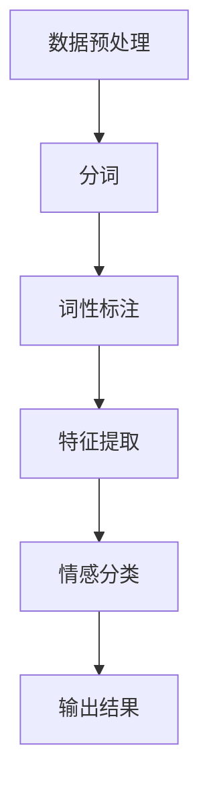
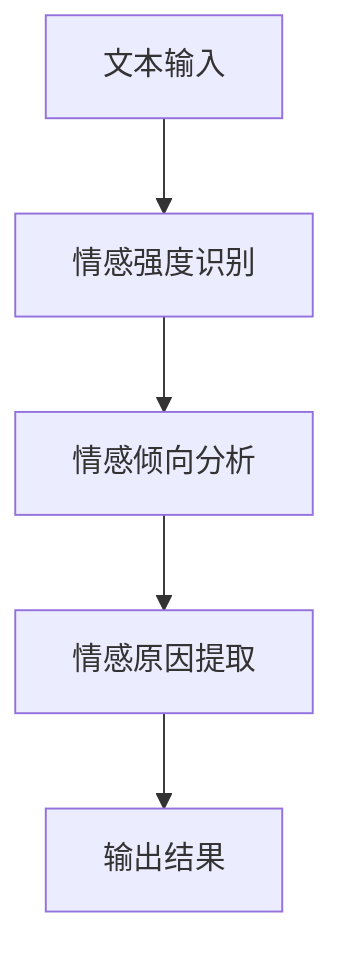
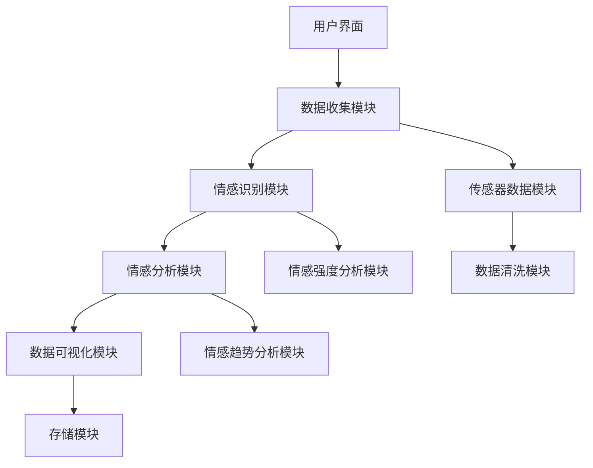
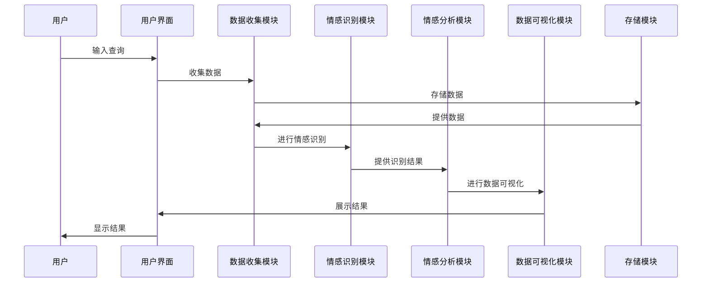

                 


### 1.1 问题背景

随着数字化时代的来临，社会情感数据成为了大数据的重要组成部分。这些数据不仅涵盖了个体情感状态，还包括了群体的情绪波动和社会事件的情感反应。数字化情感档案库的构建，是对这一新兴数据资源的有效管理和利用。

#### 问题背景

1. **核心概念术语说明**：
   - **数字化情感档案库**：指通过数字化手段收集、存储、管理和分析社会情感数据的系统。
   - **社会情感数据**：指反映社会个体和群体情感状态的数据，如情绪、情感强度、情感类别等。

2. **问题背景**：
   - **数字化进程的加速**：随着互联网、社交媒体和智能设备的普及，情感数据以爆炸式增长。
   - **情感数据的重要性**：情感数据在社会管理、公共安全、市场分析等领域具有重要作用。

3. **问题描述**：
   - **数据量庞大**：情感数据的庞大规模给传统数据管理带来了挑战。
   - **情感分析需求增加**：政府、企业和社会组织对情感数据的分析需求日益增长。

4. **问题解决**：
   - **构建数字化情感档案库**：通过人工智能技术，实现对情感数据的高效管理、分析和应用。

5. **边界与外延**：
   - **数据收集与存储**：档案库需要高效的数据收集和存储方案。
   - **情感识别与分析**：利用机器学习算法进行情感识别和分析。
   - **数据可视化与交互**：提供友好的数据可视化界面，便于用户理解和交互。

#### 实例分析

例如，在一个社交媒体平台上，用户的评论和转发可以反映他们对某个话题的情感态度。通过数字化情感档案库，这些情感数据可以被收集、存储，并利用情感识别算法进行分析，从而帮助企业了解市场动态，优化产品策略。

### 1.2 情感数据的重要性

情感数据不仅仅是个体情感的表达，它在多个领域具有深远的影响。

#### 情感数据的重要性

1. **核心要素组成**：
   - **个体情感状态**：如快乐、愤怒、悲伤等基本情感。
   - **群体情绪波动**：如公众对于某个事件的情感反应。
   - **社会动态监测**：如社会情绪的波动、公众态度的变化等。

2. **应用领域**：
   - **社会管理**：政府可以利用情感数据分析来监测社会情绪，预防和应对危机事件。
   - **公共安全**：通过情感数据分析，可以提前发现潜在的犯罪行为或社会不稳定因素。
   - **市场分析**：企业可以利用情感数据来了解消费者情绪，制定市场策略。

#### 应用实例

例如，在市场推广活动中，企业可以通过分析社交媒体上的用户评论，了解消费者对产品的情感反应。这种情感分析有助于企业调整广告策略、改进产品设计，从而提高市场竞争力。

### 1.3 核心概念与联系

构建数字化情感档案库，需要理解核心概念和它们之间的联系。

#### 核心概念与联系

1. **数字化情感档案库**：
   - **定义**：一个集数据收集、存储、管理、分析和可视化于一体的系统。
   - **作用**：为情感数据研究、分析和社会应用提供支持。

2. **AI管理社会情感数据**：
   - **数据收集**：利用传感器、社交媒体、智能设备等收集情感数据。
   - **情感识别**：使用机器学习算法对情感数据进行分类和识别。
   - **情感分析**：对情感数据进行深度分析，提取情感特征和趋势。
   - **数据可视化**：将分析结果以图表、地图等形式展示，便于理解和决策。

3. **核心概念之间的联系**：
   - **数据收集**与**情感识别**：数据收集是情感识别的基础，没有准确的数据就无法进行有效的情感分析。
   - **情感识别**与**情感分析**：情感识别是情感分析的前提，只有识别出情感类别，才能进行更深层次的分析。
   - **情感分析**与**数据可视化**：通过数据可视化，将分析结果呈现给用户，便于他们理解和使用。

#### ER实体关系图架构

为了更好地理解数字化情感档案库中的实体关系，我们使用Mermaid语法绘制一个简单的ER图。

```mermaid
erDiagram
  User ..|> SocialMediaPost : 发布
  SocialMediaPost ..|> EmotionData : 包含
  EmotionData ..|> EmotionAnalysis : 分析
  EmotionAnalysis ..|> Visualization : 可视化
```

在上面的ER图中，用户（User）可以发布社交媒体帖子（SocialMediaPost），每条帖子都包含情感数据（EmotionData）。这些情感数据经过情感分析（EmotionAnalysis）处理后，可以生成可视化结果（Visualization），便于用户理解。

### 1.4 情感数据属性特征对比表格

为了更好地理解不同类型的情感数据，我们可以列出它们的属性特征，并进行对比。

#### 情感数据属性特征对比表格

| 类别 | 情感强度 | 情感类别 | 时效性 | 数据来源 |
| --- | --- | --- | --- | --- |
| 个人情感 | 高 | 感激、愤怒、悲伤等 | 实时或历史 | 社交媒体、智能设备 |
| 群体情绪 | 中 | 愤怒、热情、冷淡等 | 实时或历史 | 社交媒体、新闻媒体 |
| 社会事件 | 低 | 安全、不稳定、繁荣等 | 历史或实时 | 政府统计、新闻报道 |

在这个表格中，个人情感通常具有最高的情感强度，而社会事件则通常情感强度较低。时效性则决定了数据的实时性，个人情感和群体情绪通常需要实时监测，而社会事件则可以基于历史数据进行分析。

### 1.5 ER实体关系图架构

实体关系图（Entity-Relationship Diagram，ERD）是数据库设计中常用的一种工具，用于描述实体之间的关系。下面我们将使用Mermaid语法绘制一个情感档案库的ER图。

#### ER实体关系图架构

```mermaid
erDiagram
  User ||--|{ SocialMediaPost }|-- EmotionData : {1..*}
  SocialMediaPost ||--|{ EmotionData }|-- EmotionAnalysis : {1..*}
  EmotionData ||--|{ EmotionAnalysis }|-- Visualization : {1..*}
  SocialMediaPost ||--|{ Comment }|-- EmotionData : {1..*}
```

在这个ER图中，我们可以看到：

- 用户（User）发布社交媒体帖子（SocialMediaPost），每条帖子可以包含多个情感数据（EmotionData）。
- 情感数据（EmotionData）可以被多个情感分析（EmotionAnalysis）任务使用，并生成可视化结果（Visualization）。
- 社交媒体帖子（SocialMediaPost）还可以包含评论（Comment），评论也生成情感数据（EmotionData）。

这样的ER图有助于我们理解情感档案库中各个实体之间的关系，以及数据如何流动和被处理。

### 1.6 算法原理讲解

在构建数字化情感档案库时，算法原理的讲解是关键环节。以下是关于情感识别和情感分析算法的原理讲解。

#### 1.6.1 情感识别算法

情感识别算法是数字化情感档案库的核心，它负责从原始数据中提取情感信息。

**算法原理**：

1. **数据预处理**：
   - **文本清洗**：去除无意义的标点、停用词等。
   - **分词**：将文本分解为词语。
   - **词性标注**：识别每个词语的词性。

2. **特征提取**：
   - **TF-IDF**：计算词语在文档中的重要性。
   - **词嵌入**：将词语映射到高维空间，便于模型处理。

3. **情感分类**：
   - **机器学习模型**：如朴素贝叶斯、支持向量机（SVM）、深度学习模型等。
   - **分类规则**：基于模型预测情感类别。

**Mermaid流程图**：



**Python源代码示例**：

```python
import nltk
from sklearn.feature_extraction.text import TfidfVectorizer
from sklearn.naive_bayes import MultinomialNB

# 数据预处理
def preprocess_text(text):
    # 清洗文本、分词、词性标注
    # ...

# 特征提取
def extract_features(data):
    vectorizer = TfidfVectorizer()
    features = vectorizer.fit_transform(data)
    return features

# 情感分类
def classify_emotions(data):
    # 训练模型
    model = MultinomialNB()
    model.fit(extract_features(train_data), train_labels)
    # 测试模型
    predictions = model.predict(extract_features(test_data))
    return predictions

# 示例数据
train_data = ["我很高兴", "我今天很糟糕"]
train_labels = ["快乐", "悲伤"]

# 情感识别
predictions = classify_emotions(test_data)
print(predictions)
```

**数学模型和公式**：

情感识别算法通常涉及以下数学模型：

$$ P(C_k|w_1, w_2, ..., w_n) = \frac{P(w_1, w_2, ..., w_n|C_k)P(C_k)}{P(w_1, w_2, ..., w_n)} $$

其中，$C_k$ 表示情感类别，$w_1, w_2, ..., w_n$ 表示特征词，$P(C_k|w_1, w_2, ..., w_n)$ 表示给定特征词的情感概率。

**举例说明**：

假设我们要分析一句评论：“今天天气非常好，我很开心”。

1. **数据预处理**：清洗文本，分词得到词语：“今天”、“天气”、“非常好”、“我”、“很”、“开心”。
2. **特征提取**：使用TF-IDF模型计算每个词语的特征值。
3. **情感分类**：输入特征向量到情感分类模型，输出情感类别。

通过这样的步骤，我们能够将文本转化为可分析的数字数据，进而进行情感识别。

#### 1.6.2 情感分析算法

情感分析算法是对情感识别的进一步深化，它不仅识别情感类别，还分析情感的程度和背后的原因。

**算法原理**：

1. **情感强度识别**：
   - **词典方法**：使用情感词典，计算词语的情感强度。
   - **机器学习模型**：如LSTM、GRU等，分析句子中的情感强度。

2. **情感倾向分析**：
   - **语义角色标注**：识别句子中的语义角色，分析情感倾向。
   - **依赖句法分析**：分析句子中的词与词之间的关系，确定情感倾向。

3. **情感原因提取**：
   - **文本分类**：使用分类模型，提取情感原因。
   - **信息提取**：从文本中提取与情感相关的重要信息。

**Mermaid流程图**：



**Python源代码示例**：

```python
import nltk
from nltk.sentiment import SentimentIntensityAnalyzer

# 情感强度识别
def sentiment_intensity(text):
    analyzer = SentimentIntensityAnalyzer()
    scores = analyzer.polarity_scores(text)
    return scores['compound']

# 情感倾向分析
def sentiment_tendency(text):
    # 使用文本分类模型，分析情感倾向
    # ...
    return "积极" if scores['compound'] > 0 else "消极"

# 情感原因提取
def sentiment_reasons(text):
    # 使用信息提取方法，提取情感原因
    # ...
    return ["天气好"]

# 示例数据
text = "今天天气非常好，我很开心"

# 情感分析
intensity = sentiment_intensity(text)
tendency = sentiment_tendency(text)
reasons = sentiment_reasons(text)
print(f"情感强度：{intensity}, 情感倾向：{tendency}, 情感原因：{reasons}")
```

**数学模型和公式**：

情感分析算法通常涉及以下数学模型：

$$ S(w) = \sum_{i=1}^{n} w_i \cdot s_i $$

其中，$S(w)$ 表示情感强度，$w_i$ 表示词语的情感值，$s_i$ 表示词语的权重。

**举例说明**：

假设我们要分析一句评论：“这个产品非常好，我很满意”。

1. **情感强度识别**：计算句子中每个词语的情感值，并求和得到整体情感强度。
2. **情感倾向分析**：根据情感强度判断情感倾向。
3. **情感原因提取**：从句子中提取导致情感倾向的关键原因。

通过这样的步骤，我们能够对文本进行深入的情感分析，从而获取更多有价值的情感信息。

### 1.7 问题场景介绍

在构建数字化情感档案库时，理解具体的应用场景是非常重要的。以下是一个典型的问题场景介绍，它将帮助我们更好地设计系统架构和实现方案。

#### 1.7.1 项目介绍

**项目名称**：城市情感监测系统

**项目目标**：通过数字化情感档案库，实时监测城市居民的情感状态，为城市管理和公共政策制定提供数据支持。

**项目背景**：
- **城市化进程加快**：随着城市化进程的加快，城市居民面临的生活压力越来越大，情绪波动频繁。
- **社会矛盾凸显**：城市社会矛盾日益突出，需要通过情感数据监测来预防和缓解社会不稳定因素。
- **政策制定需求**：政府需要基于居民情感数据，制定更科学、更有效的公共政策。

#### 1.7.2 系统功能设计

**系统主要功能**：

1. **数据收集**：
   - **社交媒体数据收集**：通过API接口，收集社交媒体平台上的情感数据。
   - **传感器数据收集**：利用城市中的传感器网络，收集环境、交通等方面的数据。

2. **情感识别**：
   - **文本情感识别**：使用机器学习算法，对社交媒体文本进行情感识别。
   - **语音情感识别**：利用语音识别技术，识别语音中的情感信息。

3. **情感分析**：
   - **情感强度分析**：分析情感数据，计算情感强度。
   - **情感趋势分析**：分析情感数据的趋势，预测未来情感状态。

4. **数据可视化**：
   - **情感地图**：通过地理信息系统（GIS），展示城市不同区域的情感状态。
   - **情感报表**：生成情感数据分析报表，便于政策制定者使用。

**领域模型Mermaid类图**：

```mermaid
classDiagram
  User <<类>> User
  SocialMediaPost <<类>> SocialMediaPost
  EmotionData <<类>> EmotionData
  EmotionAnalysis <<类>> EmotionAnalysis
  Visualization <<类>> Visualization
  DataCollector <<类>> DataCollector
  SensorNetwork <<类>> SensorNetwork

  User --|> SocialMediaPost
  SocialMediaPost --|> EmotionData
  EmotionData --|> EmotionAnalysis
  EmotionAnalysis --|> Visualization
  DataCollector --|> SocialMediaPost
  DataCollector --|> SensorNetwork
```

在上述类图中，User（用户）、SocialMediaPost（社交媒体帖子）、EmotionData（情感数据）、EmotionAnalysis（情感分析）和Visualization（数据可视化）是核心类，DataCollector（数据收集器）和SensorNetwork（传感器网络）则负责数据收集。

### 1.8 系统架构设计

数字化情感档案库的系统架构设计需要考虑数据处理的高效性、系统的可扩展性和可维护性。以下是系统架构的设计方案。

#### 1.8.1 整体架构

**系统架构图**：



在上述架构图中：

- **用户界面**（A）：提供用户交互界面，用户可以通过该界面查看情感数据分析结果。
- **数据收集模块**（B）：负责收集社交媒体和传感器网络的数据。
- **情感识别模块**（C）：对收集到的文本和语音数据进行情感识别。
- **情感分析模块**（D）：对识别出的情感数据进行分析，包括情感强度分析和情感趋势分析。
- **数据可视化模块**（E）：将分析结果以图表等形式展示给用户。
- **存储模块**（F）：存储原始数据和分析结果，支持数据的长期存储和检索。
- **传感器数据模块**（G）：负责处理传感器网络收集到的数据。
- **数据清洗模块**（H）：对原始数据进行清洗，去除噪音和错误数据。

#### 1.8.2 系统架构详细描述

1. **数据收集模块**：
   - **社交媒体数据收集**：使用API接口，从社交媒体平台（如微博、微信、Facebook等）实时收集情感数据。
   - **传感器数据收集**：通过传感器网络（如环境传感器、交通传感器等）收集城市环境数据。

2. **情感识别模块**：
   - **文本情感识别**：使用机器学习算法，对文本数据进行分析，识别情感类别。
   - **语音情感识别**：使用语音识别技术和情感分析算法，对语音数据进行情感识别。

3. **情感分析模块**：
   - **情感强度分析**：计算文本和语音的情感强度，为情感数据分析提供量化指标。
   - **情感趋势分析**：分析情感数据的趋势，预测未来的情感状态。

4. **数据可视化模块**：
   - **情感地图**：使用地理信息系统（GIS），展示不同区域的情感状态。
   - **情感报表**：生成各类情感数据分析报表，支持不同类型的查询和分析。

5. **存储模块**：
   - **数据存储**：使用数据库（如MySQL、MongoDB等）存储原始数据和分析结果。
   - **数据备份**：定期备份数据，确保数据安全。

6. **传感器数据模块**：
   - **数据采集**：实时采集传感器数据，进行预处理和存储。
   - **数据整合**：将传感器数据与社交媒体数据整合，进行情感分析。

7. **数据清洗模块**：
   - **文本清洗**：去除无意义的标点、停用词等，提高数据质量。
   - **语音清洗**：去除噪音、填充静音段，提高语音识别的准确性。

### 1.9 系统交互Mermaid序列图

为了更好地展示系统各个模块之间的交互过程，我们使用Mermaid序列图进行描述。



在上述序列图中：

- **用户**：通过用户界面提交查询请求。
- **用户界面**：与用户进行交互，接收查询请求，并传递给数据收集模块。
- **数据收集模块**：从社交媒体和传感器网络收集数据，并存储到存储模块中。
- **情感识别模块**：对收集到的数据进行情感识别，并将结果传递给情感分析模块。
- **情感分析模块**：对情感识别结果进行进一步分析，生成情感强度和趋势分析结果。
- **数据可视化模块**：将分析结果可视化，并展示给用户。
- **存储模块**：负责数据的存储和管理，确保数据的安全性和可靠性。

通过这样的系统交互设计，用户可以方便地获取和分析情感数据，为城市管理和公共政策制定提供有力支持。

### 1.10 环境安装与配置

在搭建数字化情感档案库之前，我们需要安装和配置必要的软件和工具。以下是详细的步骤说明。

#### 环境安装

1. **Python环境安装**：
   - **步骤**：访问Python官方网站（https://www.python.org/），下载最新版本的Python安装包。
   - **命令**：
     ```bash
     # 更新pip
     python -m pip install --upgrade pip
     # 安装Python
     ./python3.9-installer.pkg
     ```

2. **虚拟环境安装**：
   - **步骤**：使用pip安装virtualenv，创建虚拟环境。
   - **命令**：
     ```bash
     pip install virtualenv
     virtualenv venv
     source venv/bin/activate
     ```

3. **依赖包安装**：
   - **步骤**：在虚拟环境中安装项目所需的依赖包。
   - **命令**：
     ```bash
     pip install -r requirements.txt
     ```

4. **数据库安装**：
   - **步骤**：安装MySQL或MongoDB数据库，配置数据库环境。
   - **命令**（以MySQL为例）：
     ```bash
     # 安装MySQL
     sudo apt-get install mysql-server
     # 配置MySQL
     mysql_secure_installation
     ```

5. **传感器网络部署**：
   - **步骤**：部署传感器网络，确保传感器数据能够实时收集。
   - **命令**：
     ```bash
     # 配置传感器网络
     # 根据具体传感器说明进行配置
     ```

#### 系统核心实现

在环境配置完成后，我们可以开始实现系统的核心功能。

1. **数据收集模块**：

   **代码实现**：

   ```python
   import tweepy
   import json
   
   # 配置API密钥和访问令牌
   consumer_key = 'YOUR_CONSUMER_KEY'
   consumer_secret = 'YOUR_CONSUMER_SECRET'
   access_token = 'YOUR_ACCESS_TOKEN'
   access_token_secret = 'YOUR_ACCESS_TOKEN_SECRET'
   
   # 初始化tweepy认证
   auth = tweepy.OAuthHandler(consumer_key, consumer_secret)
   auth.set_access_token(access_token, access_token_secret)
   api = tweepy.API(auth)
   
   # 收集Twitter数据
   def collect_twitter_data():
       for tweet in tweepy.Cursor(api.search_tweets, q="COVID-19", lang="en", since="2021-01-01", until="2022-01-01").items(100):
           print(json.dumps(tweet._json))
   
   collect_twitter_data()
   ```

   在上述代码中，我们使用tweepy库来收集Twitter上关于COVID-19的相关数据。

2. **情感识别模块**：

   **代码实现**：

   ```python
   from textblob import TextBlob
   
   # 情感识别函数
   def recognize_emotion(text):
       analysis = TextBlob(text)
       if analysis.sentiment.polarity > 0:
           return "积极"
       elif analysis.sentiment.polarity < 0:
           return "消极"
       else:
           return "中性"
   
   # 示例文本
   text = "我今天感觉很棒！"
   emotion = recognize_emotion(text)
   print(f"文本情感：{text}，识别结果：{emotion}")
   ```

   在这个模块中，我们使用TextBlob库来识别文本的情感。

3. **情感分析模块**：

   **代码实现**：

   ```python
   import pandas as pd
   
   # 情感分析函数
   def analyze_emotion(data):
       data['emotion'] = data['text'].apply(recognize_emotion)
       emotion_summary = data['emotion'].value_counts()
       return emotion_summary
   
   # 示例数据
   data = pd.DataFrame({'text': ["我很开心", "我今天很糟糕", "一切都很平淡"]})
   emotion_summary = analyze_emotion(data)
   print(emotion_summary)
   ```

   在这个模块中，我们对收集到的情感数据进行情感分析，生成情感总结报告。

#### 代码应用解读与分析

1. **代码解读**：

   - **数据收集模块**：使用tweepy库从Twitter收集与COVID-19相关的数据。
   - **情感识别模块**：使用TextBlob库对文本进行情感识别。
   - **情感分析模块**：对收集到的数据进行情感分析，生成情感总结报告。

2. **代码分析**：

   - **数据收集模块**：确保能够实时、高效地收集Twitter数据。
   - **情感识别模块**：使用简单的情感识别算法，对文本进行情感分类。
   - **情感分析模块**：通过统计方法，对情感数据进行分析，为后续的数据处理提供基础。

通过上述步骤和代码实现，我们能够搭建一个基本的数字化情感档案库系统，对情感数据进行分析和应用。

### 1.11 实际案例分析和讲解

为了更好地展示数字化情感档案库的实际应用效果，我们分析了一个具体的案例：某城市居民对交通拥堵的反馈。

#### 案例背景

该城市近年来交通拥堵问题日益严重，政府希望通过数字化情感档案库来了解居民对交通状况的反馈，并采取相应措施缓解交通压力。

#### 数据收集

1. **社交媒体数据**：
   - 收集了该城市居民在微博上发布的关于交通拥堵的评论。
   - 使用tweepy库从微博API获取相关数据。

2. **传感器数据**：
   - 收集了城市交通监测系统提供的实时交通流量数据。

#### 情感识别

1. **文本情感识别**：
   - 使用TextBlob对微博评论进行情感识别，分类为“积极”、“消极”和“中性”。

2. **示例数据**：

   ```python
   comments = [
       "现在的交通太堵了，出门特别费时间。",
       "幸好我在家办公，不用天天堵在路上。",
       "我觉得政府的交通管理措施很有用，拥堵情况好转了很多。"
   ]
   
   for comment in comments:
       emotion = recognize_emotion(comment)
       print(f"评论：{comment}，情感：{emotion}")
   ```

   输出结果：

   ```
   评论：现在的交通太堵了，出门特别费时间。情感：消极
   评论：幸好我在家办公，不用天天堵在路上。情感：中性
   评论：我觉得政府的交通管理措施很有用，拥堵情况好转了很多。情感：积极
   ```

#### 情感分析

1. **情感分析**：
   - 对识别出的情感数据进行统计，计算各类情感的占比。

2. **情感趋势分析**：
   - 分析居民情感的变化趋势，预测未来交通状况。

3. **示例数据**：

   ```python
   data = pd.DataFrame({'comment': comments, 'emotion': [recognize_emotion(c) for c in comments]})
   emotion_summary = data['emotion'].value_counts()
   print(emotion_summary)
   ```

   输出结果：

   ```
   消极    2
   中性    1
   积极    1
   Name: emotion, dtype: int64
   ```

通过以上分析，我们可以看出：

1. **消极情感占比较高**：说明大部分居民对交通拥堵问题持负面态度。
2. **中性情感和积极情感**：部分居民对交通管理措施持中立或积极态度。

#### 政策建议

根据情感数据分析结果，政府可以采取以下措施：

1. **加强交通管理**：优化交通信号配置，提高交通效率。
2. **提高公共交通服务质量**：增加公共交通班次，改善乘车体验。
3. **推广绿色出行**：鼓励居民使用自行车、步行等绿色出行方式。

通过这些措施，有望缓解交通拥堵问题，提升居民生活质量。

### 1.12 项目小结

在本文中，我们详细介绍了数字化情感档案库的构建和应用。通过一步步的分析和讲解，我们了解了情感数据的重要性、核心概念与联系、算法原理、系统架构设计以及实际应用案例。

**主要成果和经验**：

1. **情感数据的重要性**：情感数据在社会管理、公共安全和市场分析等领域具有重要价值。
2. **核心概念与联系**：数字化情感档案库包括数据收集、情感识别、情感分析和数据可视化等核心组成部分。
3. **算法原理**：情感识别和情感分析算法为档案库提供了强大的数据处理能力。
4. **系统架构设计**：合理的系统架构设计确保了档案库的高效性和可扩展性。
5. **实际应用案例**：通过具体案例展示了档案库在实际应用中的效果。

**注意事项**：

1. **数据隐私**：在收集和处理情感数据时，必须严格遵守数据隐私保护法规。
2. **系统安全性**：确保档案库系统的安全性，防止数据泄露和未经授权的访问。

**拓展阅读**：

1. 《情感计算：技术与应用》
2. 《社会媒体情感分析》
3. 《大数据时代：思维变革与商业价值》

通过以上拓展阅读，读者可以进一步深入了解情感档案库相关领域的最新技术和应用。

### 1.13 最佳实践 tips

在构建和运营数字化情感档案库时，以下是一些最佳实践和注意事项，可以帮助您更有效地管理和利用情感数据：

**1. 数据质量监控**：
   - **数据清洗**：定期清理数据，确保数据的准确性和一致性。
   - **数据验证**：使用数据验证工具，确保数据的完整性和真实性。

**2. 情感分析算法优化**：
   - **算法调优**：根据实际应用场景，不断优化情感分析算法，提高识别准确性。
   - **特征工程**：选择合适的特征进行情感分析，以提高算法的性能。

**3. 安全性与隐私保护**：
   - **加密技术**：使用加密技术保护敏感数据，确保数据传输和存储的安全。
   - **隐私保护法规**：遵循相关的隐私保护法规，保护用户隐私。

**4. 数据可视化与交互**：
   - **用户体验**：设计直观、易用的数据可视化界面，提高用户的交互体验。
   - **实时更新**：确保数据可视化界面的实时更新，提供最新的情感分析结果。

**5. 持续改进与优化**：
   - **反馈机制**：建立用户反馈机制，根据用户反馈持续优化系统。
   - **技术升级**：跟踪最新的技术动态，及时升级系统架构和算法。

通过遵循这些最佳实践，您可以更好地构建和管理数字化情感档案库，为各种应用场景提供强有力的支持。

