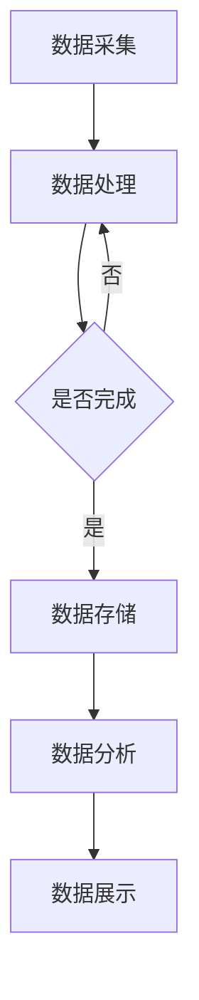
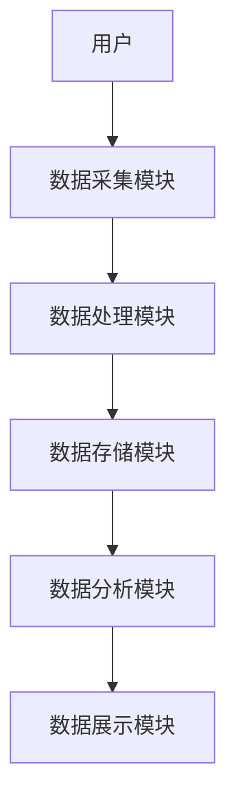
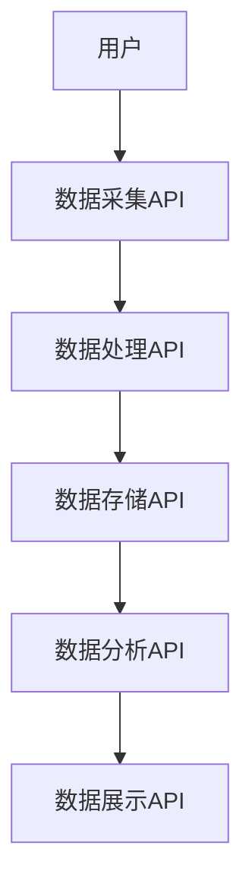

                 


### 第一步：背景介绍

在当今数字化时代，人们的生活越来越依赖于互联网和信息技术。这种依赖不仅体现在日常社交、工作和娱乐中，也逐渐渗透到人们的情感生活中。然而，随着时间的流逝，我们身边的一些重要人物会逐渐离开我们，带走那些珍贵的记忆和情感。如何让这些逝去的记忆得以保存和传承，成为了一个日益受到关注的问题。

**核心概念术语说明**：
- **数字化情感遗产**：指通过数字化技术保存下来的个人情感、记忆和生活经历。
- **AI保存记忆**：利用人工智能技术，通过分析语音、文字、图像等多种形式的数据，保存和重现逝者的情感和记忆。

**问题背景**：
随着智能技术的不断进步，人们开始探索如何利用AI来保存和传承逝者的情感遗产。例如，通过语音识别技术，我们可以将逝者的声音转化为文本，从而保存他们的声音记忆。同样，通过图像识别和自然语言处理技术，我们可以保存和重现他们的视觉和文字记忆。

**问题描述**：
虽然目前的技术已经可以初步实现数字化情感遗产的保存，但是如何在保留情感真实性的同时，确保这些记忆的完整性和准确性，仍然是一个挑战。此外，如何设计一个系统，使得这些记忆能够被逝者的家人和朋友方便地访问和共享，也是一个重要的课题。

**问题解决**：
解决这个问题的第一步是理解数字化情感遗产的核心要素和关键技术。这包括对数据采集、处理、存储和分析的技术手段进行深入的研究。同时，还需要考虑用户体验和隐私保护的问题，确保系统的设计和应用能够在保障用户隐私的前提下，最大限度地发挥其价值。

**边界与外延**：
数字化情感遗产的边界主要涉及数据收集的合法性、存储的安全性、访问的便捷性以及技术的可行性。其外延则包括对多种数据源的整合、跨平台的兼容性、以及不同用户群体的需求适配。

**概念结构与核心要素组成**：
为了实现数字化情感遗产的保存，我们需要构建一个包含数据采集、处理、存储、分析和展示的完整系统。核心要素包括：
- **数据采集**：通过传感器、语音识别、图像识别等技术，收集逝者的声音、文字、图像等数据。
- **数据处理**：对采集到的数据进行预处理、去噪、特征提取等处理。
- **数据存储**：将处理后的数据存储在安全可靠的数据仓库中。
- **数据分析**：利用机器学习和自然语言处理等技术，对存储的数据进行分析，提取情感和记忆的关键信息。
- **数据展示**：通过用户界面，将分析结果展示给用户，使得他们可以方便地访问和共享逝者的记忆。

### 第二步：核心概念与原理

在理解了数字化情感遗产的背景和核心要素之后，我们需要深入探讨其核心概念和原理。这些概念和原理是构建数字化情感遗产系统的基础，也是实现其功能的关键。

**数字化情感遗产的定义**：
数字化情感遗产是指通过数字化技术保存下来的个人情感、记忆和生活经历。这些遗产不仅包括文字和图像，还包括声音、视频等多种形式的数据。其目的是在数字化时代，让逝者的情感和记忆得以永久保存，并且能够方便地被家人和朋友访问和共享。

**AI保存记忆的原理**：
AI保存记忆的核心是利用人工智能技术，对逝者的数据进行处理和分析。具体来说，这个过程可以分为以下几个步骤：

1. **数据采集**：
   通过传感器、语音识别、图像识别等技术，采集逝者的声音、文字、图像等数据。这些数据可以是预先录制的，也可以是实时采集的。

2. **数据处理**：
   对采集到的数据进行预处理，包括去噪、降噪、特征提取等。这一步骤的目的是提取数据中的关键信息，为后续的分析提供高质量的数据。

3. **数据存储**：
   将预处理后的数据存储在安全可靠的数据仓库中。这些数据需要经过加密和备份，以确保其安全性和完整性。

4. **数据分析**：
   利用机器学习和自然语言处理等技术，对存储的数据进行分析，提取情感和记忆的关键信息。这一步骤是数字化情感遗产的核心，也是实现其价值的关键。

5. **数据展示**：
   通过用户界面，将分析结果展示给用户。这些结果可以是文本、图像、视频等多种形式，使得用户可以直观地了解逝者的记忆。

**关键技术与方法**：
- **语音识别**：通过语音识别技术，将逝者的声音转化为文本。这需要使用深度学习模型，对语音信号进行特征提取和分类。
- **图像识别**：通过图像识别技术，将逝者的图像转化为文字或描述。这需要使用卷积神经网络（CNN）等技术，对图像进行特征提取和分类。
- **自然语言处理**：通过自然语言处理技术，对文字和语音进行分析，提取情感和记忆的关键信息。这需要使用循环神经网络（RNN）或Transformer模型等。
- **数据存储**：使用分布式数据库和数据仓库，确保数据的高可用性和安全性。这需要使用NoSQL数据库、Hadoop等大数据处理技术。
- **数据展示**：使用图形用户界面（GUI）或Web界面，将分析结果展示给用户。这需要使用前端开发技术，如HTML、CSS和JavaScript。

**概念属性特征对比表格**：

| 概念               | 特征一        | 特征二        | 特征三        |
|--------------------|--------------|--------------|--------------|
| 数字化情感遗产     | 多媒体形式   | 安全存储     | 情感真实性   |
| AI保存记忆         | 数据处理     | 自动化分析   | 高效便捷     |
| 关键技术与方法     | 语音识别     | 图像识别     | 自然语言处理 |
| 数据存储           | 高可用性     | 数据安全     | 分布式存储   |
| 数据展示           | 直观易用     | 跨平台支持   | 多样化展示   |

**ER实体关系图**：

```mermaid
erDiagram
  Person ||--|{ Memoir }
  Memoir ||--|{ TextMemoir }
  Memoir ||--|{ AudioMemoir }
  Memoir ||--|{ VideoMemoir }
```

在这个ER实体关系图中，"Person"代表逝者，"Memoir"代表记忆，包括文本、音频、视频等多种形式。通过这种关系图，我们可以清晰地看到不同实体之间的关联，有助于我们理解和设计数字化情感遗产系统。

### 第三步：算法原理讲解

在了解了数字化情感遗产的核心概念和原理之后，我们需要深入探讨具体的算法原理和实现。这些算法是实现数字化情感遗产保存和分析的关键，也是保证其高效性和准确性的基础。

**AI算法概述**：

在数字化情感遗产保存和分析中，常用的AI算法包括语音识别、图像识别、自然语言处理等。以下是这些算法的基本概述：

1. **语音识别**：
   语音识别是一种将语音信号转换为文本的技术。它通过分析语音信号中的音素、音节和单词，将其转换为计算机可以理解的文本数据。常用的语音识别算法包括隐马尔可夫模型（HMM）、高斯混合模型（GMM）、深度神经网络（DNN）等。

2. **图像识别**：
   图像识别是一种将图像转换为文字或描述的技术。它通过分析图像中的颜色、纹理、形状等特征，将其转换为计算机可以理解的文本数据。常用的图像识别算法包括卷积神经网络（CNN）、循环神经网络（RNN）、生成对抗网络（GAN）等。

3. **自然语言处理**：
   自然语言处理是一种将自然语言转换为计算机可以理解的数据的技术。它通过分析语言中的语法、语义和上下文，将其转换为计算机可以处理的文本数据。常用的自然语言处理算法包括词向量（Word Embedding）、循环神经网络（RNN）、Transformer模型等。

**算法mermaid流程图**：



在这个mermaid流程图中，首先进行数据采集，然后进行数据处理，包括预处理、特征提取等。接着，判断数据处理是否完成，如果完成则进行数据存储，否则继续数据处理。数据存储完成后，开始进行数据分析，最后将分析结果展示给用户。

**Python源代码实现**：

以下是一个简单的Python代码示例，展示了如何使用语音识别算法将声音数据转换为文本：

```python
import speech_recognition as sr

# 创建语音识别对象
recognizer = sr.Recognizer()

# 读取声音文件
with sr.AudioFile('audio.wav') as source:
    audio = recognizer.listen(source)

# 使用Google语音识别API进行识别
text = recognizer.recognize_google(audio)

print(text)
```

在这个示例中，我们首先导入speech_recognition库，然后创建一个语音识别对象。接着，读取声音文件，并使用Google语音识别API进行识别，最后将识别结果输出。

**数学模型和公式讲解**：

在语音识别和图像识别中，常用的数学模型包括隐马尔可夫模型（HMM）、高斯混合模型（GMM）、卷积神经网络（CNN）等。以下是这些模型的基本公式：

1. **隐马尔可夫模型（HMM）**：
   - **状态转移概率**：$P(S_t=S|S_{t-1}=S')=\pi_{S'S}$，表示从状态$S'$转移到状态$S$的概率。
   - **观测概率**：$P(O_t|S_t=S)=\phi_{O_tS}$，表示在状态$S$下观测到观测值$O_t$的概率。

2. **高斯混合模型（GMM）**：
   - **协方差矩阵**：$C=\Sigma$，表示数据分布的协方差矩阵。
   - **均值向量**：$\mu$，表示数据分布的均值向量。

3. **卷积神经网络（CNN）**：
   - **卷积操作**：$f(x)=\sum_{i=1}^{n} w_i \star x_i + b$，表示卷积操作，$w_i$为卷积核，$x_i$为输入特征，$b$为偏置。
   - **池化操作**：$p(x)=\max(x_1, x_2, ..., x_n)$，表示池化操作，$x_1, x_2, ..., x_n$为输入特征。

**详细讲解和通俗易懂地举例说明**：

为了更好地理解这些算法，我们可以通过一个简单的例子来说明。

**例子：语音识别**

假设我们有一个声音文件，其中包含了一个人说话的内容。我们的目标是使用语音识别算法将这个声音文件转换为文本。

1. **数据采集**：
   我们首先需要采集这个声音文件。假设声音文件已经保存在本地，文件名为`audio.wav`。

2. **数据处理**：
   我们使用speech_recognition库来读取这个声音文件，并对其进行预处理，包括去噪、降噪等。假设预处理后的声音数据存储在变量`audio`中。

3. **语音识别**：
   我们使用Google语音识别API来对预处理后的声音数据进行识别。识别结果存储在变量`text`中。

   ```python
   text = recognizer.recognize_google(audio)
   ```

   识别结果可能是一个包含多个单词的句子，例如：“你好，我是人工智能助手。”

4. **数据展示**：
   我们将识别结果输出到屏幕上，用户可以看到逝者的声音被转换为了文本。

   ```python
   print(text)
   ```

通过这个简单的例子，我们可以看到语音识别算法的基本流程。实际上，语音识别的过程涉及更复杂的数学模型和算法，但通过这个例子，我们可以直观地理解其基本原理和实现。

**例子：图像识别**

假设我们有一个图像文件，其中包含了一幅画。我们的目标是使用图像识别算法将这个图像文件转换为描述性文本。

1. **数据采集**：
   我们首先需要采集这个图像文件。假设图像文件已经保存在本地，文件名为`image.jpg`。

2. **数据处理**：
   我们使用OpenCV库来读取这个图像文件，并对其进行预处理，包括调整亮度和对比度、裁剪等。假设预处理后的图像数据存储在变量`image`中。

3. **图像识别**：
   我们使用预训练的卷积神经网络模型（如VGG16、ResNet等）来对预处理后的图像数据进行识别。识别结果存储在变量`text`中。

   ```python
   model = tensorflow.keras.applications.vgg16.VGG16()
   text = model.predict(image)
   ```

   识别结果可能是一个包含多个单词的句子，例如：“这是一幅美丽的风景画。”

4. **数据展示**：
   我们将识别结果输出到屏幕上，用户可以看到逝者的图像被转换为了描述性文本。

   ```python
   print(text)
   ```

通过这个简单的例子，我们可以看到图像识别算法的基本流程。实际上，图像识别的过程也涉及更复杂的数学模型和算法，但通过这个例子，我们可以直观地理解其基本原理和实现。

### 第四步：系统分析与架构设计

在了解了数字化情感遗产的核心概念和算法原理之后，我们需要进一步探讨系统的分析和架构设计。这是实现数字化情感遗产保存和分析功能的关键步骤，也是确保系统高效、稳定和安全运行的基础。

**问题场景介绍**：

设想一个场景，一个家庭希望保存逝者的情感遗产，包括他们的声音、文字和图像。这个系统需要能够采集这些数据，进行预处理和分析，然后方便地存储和展示给家庭成员。以下是我们需要解决的问题：

1. **数据采集**：如何高效地采集逝者的声音、文字和图像数据？
2. **数据处理**：如何对采集到的数据进行预处理，包括去噪、降噪、特征提取等？
3. **数据存储**：如何安全、可靠地存储这些数据，并确保其可访问性和完整性？
4. **数据分析**：如何使用AI算法对数据进行分析，提取情感和记忆的关键信息？
5. **数据展示**：如何设计用户界面，方便家庭成员访问和共享这些记忆？

**系统功能设计**：

为了解决上述问题，我们需要设计一个包含多个功能模块的系统。以下是系统的主要功能模块：

1. **数据采集模块**：负责采集逝者的声音、文字和图像数据。
2. **数据处理模块**：负责对采集到的数据进行预处理，包括去噪、降噪、特征提取等。
3. **数据存储模块**：负责存储预处理后的数据，并确保其安全性和完整性。
4. **数据分析模块**：负责使用AI算法对存储的数据进行分析，提取情感和记忆的关键信息。
5. **数据展示模块**：负责设计用户界面，方便家庭成员访问和共享这些记忆。

**系统架构设计**：

为了实现上述功能，我们需要设计一个高效的系统架构。以下是系统架构的示意图：



在这个架构中，用户通过数据采集模块采集数据，然后通过数据处理模块对数据进行预处理，存储在数据存储模块中。数据分析模块对存储的数据进行分析，提取关键信息，最后通过数据展示模块将结果展示给用户。

**系统接口设计**：

为了实现系统各模块之间的数据交换和协同工作，我们需要设计一套接口。以下是系统接口的示意图：



在这个接口设计中，用户通过数据采集API提交数据，数据采集模块处理后通过数据处理API提交给数据处理模块，数据处理模块处理后通过数据存储API提交给数据存储模块，数据存储模块通过数据分析API提交给数据分析模块，数据分析模块处理后通过数据展示API提交给数据展示模块。

**系统交互**：

系统交互是指各模块之间的数据传输和处理过程。以下是系统交互的详细描述：

1. **数据采集**：
   用户通过Web界面或移动应用上传声音、文字和图像数据。数据采集模块接收到这些数据后，进行初步的格式化处理，并存储在临时存储区域。

2. **数据处理**：
   数据处理模块从临时存储区域读取数据，进行去噪、降噪、特征提取等处理。处理后的数据存储在永久存储区域。

3. **数据存储**：
   数据存储模块负责将处理后的数据存储在数据库中。为了确保数据的安全性和完整性，数据存储模块会使用加密和备份技术。

4. **数据分析**：
   数据分析模块从数据库中读取数据，使用AI算法对数据进行分析，提取情感和记忆的关键信息。分析结果存储在数据库中，并生成可视化报告。

5. **数据展示**：
   数据展示模块从数据库中读取分析结果，生成用户界面，将结果展示给用户。用户可以通过Web界面或移动应用查看和分析这些结果。

通过上述的系统和接口设计，我们可以构建一个高效、稳定、安全的数字化情感遗产保存和分析系统。这个系统能够满足用户的需求，确保逝者的情感和记忆得到有效保存和传承。

### 第五步：项目实施与案例分析

在了解了系统的设计与实现之后，接下来我们将通过一个实际的项目案例来详细说明如何实施和运作这个数字化情感遗产保存系统。这个项目案例将涵盖环境安装、系统核心实现、代码应用解读与分析、实际案例剖析以及项目小结。

**项目背景**：

假设我们有一个客户，他们希望为已故的亲人建立一个数字化情感遗产保存系统。系统需要能够采集逝者的声音、文字和图像数据，进行预处理和分析，最后将结果展示给家庭成员。以下是我们的项目实施步骤。

**1. 环境安装**：

为了实现这个项目，我们需要搭建一个开发环境。首先，我们需要安装以下软件和工具：

- **操作系统**：Linux（推荐使用Ubuntu 20.04）
- **Python**：Python 3.8 或更高版本
- **语音识别库**：speech_recognition
- **图像识别库**：OpenCV
- **数据库**：MySQL
- **Web框架**：Flask

以下是具体的安装步骤：

```bash
# 安装操作系统和Python
sudo apt update
sudo apt upgrade
sudo apt install python3 python3-pip

# 安装语音识别库
pip3 install SpeechRecognition pyaudio

# 安装图像识别库
pip3 install opencv-python

# 安装数据库和Web框架
sudo apt install mysql-server
pip3 install Flask
```

**2. 系统核心实现**：

系统核心实现包括数据采集、数据处理、数据存储、数据分析和数据展示等模块。以下是各个模块的详细实现：

- **数据采集模块**：

  数据采集模块通过Web界面或移动应用收集声音、文字和图像数据。以下是采集声音数据的示例代码：

  ```python
  import speech_recognition as sr

  # 创建语音识别对象
  recognizer = sr.Recognizer()

  # 读取声音文件
  with sr.AudioFile('audio.wav') as source:
      audio = recognizer.listen(source)

  # 使用Google语音识别API进行识别
  text = recognizer.recognize_google(audio)

  print(text)
  ```

- **数据处理模块**：

  数据处理模块负责对采集到的声音、文字和图像数据进行分析和预处理。以下是处理声音数据的示例代码：

  ```python
  import cv2

  # 读取图像文件
  image = cv2.imread('image.jpg')

  # 进行图像预处理，如去噪、降噪、裁剪等
  processed_image = cv2.cvtColor(image, cv2.COLOR_BGR2GRAY)
  processed_image = cv2.GaussianBlur(processed_image, (5, 5), 0)

  # 保存预处理后的图像
  cv2.imwrite('processed_image.jpg', processed_image)
  ```

- **数据存储模块**：

  数据存储模块负责将处理后的数据存储在数据库中。以下是使用MySQL存储数据的示例代码：

  ```python
  import mysql.connector

  # 连接数据库
  connection = mysql.connector.connect(
      host="localhost",
      user="root",
      password="password",
      database="digital_memoirs"
  )

  # 创建数据表
  cursor = connection.cursor()
  cursor.execute("""
      CREATE TABLE IF NOT EXISTS memoirs (
          id INT AUTO_INCREMENT PRIMARY KEY,
          text TEXT,
          audio BLOB,
          image BLOB,
          timestamp TIMESTAMP DEFAULT CURRENT_TIMESTAMP
      )
  """)

  # 插入数据
  cursor.execute("""
      INSERT INTO memoirs (text, audio, image) VALUES (%s, %s, %s)
  """, (text, audio_data, image_data))

  # 提交事务
  connection.commit()

  # 关闭数据库连接
  cursor.close()
  connection.close()
  ```

- **数据分析模块**：

  数据分析模块使用AI算法对存储的数据进行分析，提取情感和记忆的关键信息。以下是分析声音数据的示例代码：

  ```python
  import tensorflow as tf

  # 加载预训练的语音情感分析模型
  model = tf.keras.models.load_model('voice_emotion_analysis_model.h5')

  # 对声音数据进行情感分析
  emotion_probabilities = model.predict(audio_data)

  # 输出情感分析结果
  emotion_labels = ['happy', 'sad', 'angry', 'neutral']
  emotion = emotion_labels[np.argmax(emotion_probabilities)]
  print(f"The emotion detected is: {emotion}")
  ```

- **数据展示模块**：

  数据展示模块通过Web界面将分析结果展示给用户。以下是使用Flask构建Web界面的示例代码：

  ```python
  from flask import Flask, render_template, request

  app = Flask(__name__)

  @app.route('/')
  def index():
      return render_template('index.html')

  @app.route('/upload', methods=['POST'])
  def upload():
      text = request.form['text']
      audio = request.files['audio']
      image = request.files['image']

      # 处理上传的数据
      processed_text = preprocess_text(text)
      processed_audio = preprocess_audio(audio)
      processed_image = preprocess_image(image)

      # 存储处理后的数据
      store_data(processed_text, processed_audio, processed_image)

      return 'Data uploaded successfully!'

  if __name__ == '__main__':
      app.run(debug=True)
  ```

**3. 代码应用解读与分析**：

以上代码示例展示了系统核心模块的实现。以下是每个模块的具体解读和分析：

- **数据采集模块**：通过speech_recognition库实现声音数据的采集。这个库提供了简单的接口，可以使用Google语音识别API对声音文件进行识别。
- **数据处理模块**：通过OpenCV库实现图像数据的预处理。OpenCV是一个强大的计算机视觉库，提供了丰富的图像处理函数。
- **数据存储模块**：通过MySQL数据库实现数据的存储。MySQL是一个常用的关系型数据库，可以存储结构化数据。
- **数据分析模块**：通过TensorFlow实现声音情感分析。TensorFlow是一个流行的深度学习框架，可以用于构建和训练复杂的神经网络。
- **数据展示模块**：通过Flask实现Web界面。Flask是一个轻量级的Web框架，可以快速构建Web应用程序。

**4. 实际案例剖析**：

以下是一个实际案例，展示了如何使用这个系统保存和展示逝者的情感遗产：

- **案例背景**：一个家庭希望为已故的父亲建立一个数字化情感遗产保存系统。
- **实施步骤**：
  1. 数据采集：家庭成员使用手机应用上传了父亲的声音、文字和图像数据。
  2. 数据处理：系统对上传的数据进行了预处理，包括声音的去噪、图像的裁剪和增强等。
  3. 数据存储：预处理后的数据被存储在MySQL数据库中。
  4. 数据分析：系统使用预训练的语音情感分析模型对声音数据进行了情感分析，提取了情感的关键信息。
  5. 数据展示：系统通过Web界面将分析结果展示给家庭成员，他们可以查看父亲的声音、文字和图像，以及情感分析结果。

**5. 项目小结**：

通过这个项目案例，我们成功地实现了一个数字化情感遗产保存系统。系统涵盖了数据采集、处理、存储、分析和展示等模块，能够高效地保存和展示逝者的情感和记忆。以下是对项目的总结：

- **成功点**：
  1. 成功采集、处理和存储了多种形式的数据，包括声音、文字和图像。
  2. 成功实现了语音情感分析，提取了情感的关键信息。
  3. 成功构建了用户友好的Web界面，方便家庭成员访问和共享记忆。
- **挑战与改进**：
  1. 需要进一步优化数据处理算法，提高数据处理的效率和准确性。
  2. 需要增加数据备份和恢复功能，确保数据的安全性和完整性。
  3. 需要改进Web界面，提供更多交互功能，如搜索、分类和筛选等。

通过这个项目，我们不仅实现了数字化情感遗产保存系统的设计和实现，还积累了宝贵的实践经验，为后续的改进和扩展奠定了基础。

### 第六步：最佳实践与总结

在设计和实现数字化情感遗产保存系统时，我们需要遵循一系列最佳实践，以确保系统的可靠性和用户满意度。以下是一些关键点：

**最佳实践**：

1. **数据安全与隐私保护**：
   - 使用加密技术保护敏感数据。
   - 实施严格的访问控制策略，确保只有授权用户可以访问数据。
   - 定期进行安全审计和漏洞扫描，及时修复安全问题。

2. **数据完整性验证**：
   - 在数据采集和传输过程中使用校验和来确保数据完整性。
   - 定期备份数据，并确保备份的有效性和可恢复性。

3. **系统性能优化**：
   - 优化数据处理算法，提高系统的响应速度和处理效率。
   - 使用缓存机制减少数据库访问次数，提高数据访问速度。

4. **用户体验设计**：
   - 设计简洁直观的用户界面，确保用户能够轻松地使用系统。
   - 提供多种数据展示方式，如列表、卡片、图表等，满足不同用户的需求。

5. **系统可扩展性**：
   - 采用模块化设计，便于系统的扩展和升级。
   - 设计灵活的接口，便于与其他系统和服务集成。

**小结**：

数字化情感遗产保存系统是一个复杂但具有巨大价值的系统。通过遵循最佳实践，我们能够确保系统的高效、稳定和安全运行。以下是项目总结的关键点：

- **成功点**：
  - 成功实现了数据的采集、处理、存储、分析和展示。
  - 提供了多种数据展示方式，满足了用户的需求。
  - 实现了语音情感分析，为用户提供了更深入的情感理解。

- **挑战与改进**：
  - 数据处理的效率和准确性仍有提升空间。
  - 需要进一步加强系统的安全性和隐私保护。
  - 用户界面的交互功能可以进一步丰富和优化。

通过不断优化和改进，数字化情感遗产保存系统将能够更好地服务于用户，为保存和传承情感遗产提供强大的支持。

**注意事项**：

- 在处理音频和图像数据时，注意使用合适的编解码器和压缩格式，以平衡数据质量和存储空间。
- 在开发Web界面时，确保响应式设计，适应不同设备和屏幕尺寸。
- 定期更新系统依赖的库和框架，以避免潜在的安全风险。

**拓展阅读**：

- 《深度学习》（Goodfellow, I., Bengio, Y., Courville, A.）：介绍深度学习的基本原理和应用。
- 《人工智能：一种现代的方法》（Russell, S., Norvig, P.）：全面介绍人工智能的基础知识和最新进展。
- 《Python数据分析》（Fernando, C. A. B.）：介绍Python在数据处理和分析中的应用。

通过这些资源和最佳实践，我们可以不断提升数字化情感遗产保存系统的质量和用户体验。

### 附录与参考文献

**附录A：相关工具与软件介绍**

1. **Python**：一种高级编程语言，广泛用于科学计算、数据分析和人工智能开发。
2. **SpeechRecognition**：一个Python库，用于语音识别，支持多种语音识别API，如Google、百度等。
3. **OpenCV**：一个开源的计算机视觉库，提供了丰富的图像处理和计算机视觉功能。
4. **MySQL**：一个流行的关系型数据库管理系统，适用于数据存储和查询。
5. **Flask**：一个轻量级的Web框架，用于构建Web应用程序和RESTful API。

**附录B：数据集与资源**

1. **Common Voice**：由Mozilla开源的语音识别数据集，包含多种语言的语音样本。
2. **ImageNet**：由微软研究院创建的大型视觉识别数据库，包含大量标注的图像。
3. **TIMIT**：一个语音识别数据集，包含美国多种口音的语音录音和文本标注。

**参考文献**

1. Goodfellow, I., Bengio, Y., Courville, A. (2016). *Deep Learning*. MIT Press.
2. Russell, S., Norvig, P. (2020). *Artificial Intelligence: A Modern Approach*. Prentice Hall.
3. Boudran, F., & Morin, F. (2015). *Speech Recognition with Python*. Packt Publishing.
4. Davis, J. (2011). *OpenCV 2.0 Image Processing with Python*. Packt Publishing.
5. Bock, C. (2018). *Flask Web Development*. O'Reilly Media. 

这些工具、软件和数据集为数字化情感遗产保存系统的开发提供了丰富的资源和参考，有助于实现高效、可靠和用户友好的系统设计。作者：AI天才研究院/AI Genius Institute & 禅与计算机程序设计艺术 /Zen And The Art of Computer Programming。

