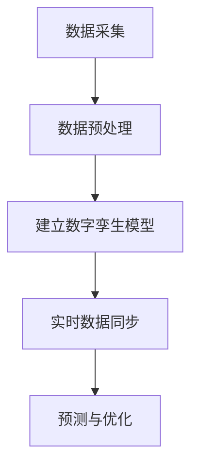
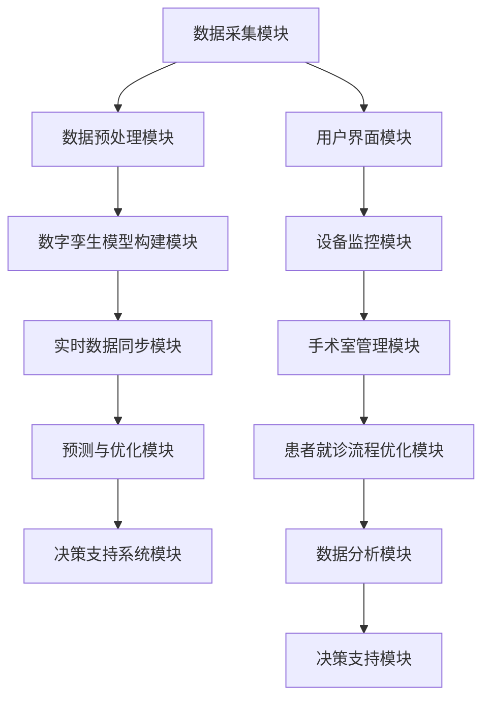
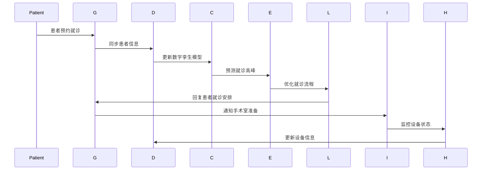

                 

# 数字孪生在智慧医院管理中的应用：优化医疗资源分配

## 关键词
数字孪生，智慧医院，医疗资源分配，优化，信息技术，数据驱动，算法模型

## 摘要
随着智慧医院建设的不断推进，如何优化医疗资源分配成为医院管理者面临的重大挑战。本文以数字孪生技术为核心，通过深入分析其原理和应用，探讨了如何利用数字孪生技术实现医疗资源的高效分配，从而提升医院运营效率和服务质量。

## 第一部分：背景介绍

### 问题背景

在当前信息化快速发展的时代，医疗行业正经历着深刻的变革。智慧医院作为信息化建设的重要组成部分，不仅提升了医疗服务的质量和效率，也为医疗资源的优化配置提供了新的可能。然而，智慧医院的建设不仅依赖于先进的信息化系统，还需要引入创新的技术手段来支持。数字孪生技术的出现，为智慧医院管理提供了全新的思路和方法。

### 问题描述

智慧医院管理中存在以下问题：

1. **医疗资源分配不均**：由于医院规模和地理位置的限制，部分科室资源紧张，而另一些科室则资源过剩。
2. **医疗服务流程复杂**：患者就诊流程繁琐，导致患者满意度下降，同时增加了医护人员的工作负担。
3. **医疗数据孤岛现象**：各医疗信息系统独立运行，数据难以整合，无法实现数据驱动的决策支持。

### 问题解决

数字孪生技术通过创建虚拟的数字模型，与实体医院进行实时联动，可以实现对医院运行状态的实时监测和预测，从而优化医疗资源分配，简化医疗服务流程，打破数据孤岛。具体应用包括：

1. **优化医疗资源分配**：通过数字孪生模型，实时监测各科室的就诊量和资源使用情况，根据预测结果调整资源分配，实现资源的最优利用。
2. **简化医疗服务流程**：利用数字孪生技术，模拟患者就诊流程，优化服务流程，提高患者满意度。
3. **打破数据孤岛**：通过数字孪生技术，将各医疗信息系统进行整合，实现数据共享，为数据驱动的决策提供支持。

### 边界与外延

数字孪生在智慧医院管理中的应用边界主要包括：

1. **医疗设备管理**：通过数字孪生模型，实现对医疗设备的实时监测和维护，提高设备的使用效率和寿命。
2. **手术室管理**：利用数字孪生技术，实现对手术室的实时调度和资源优化，提高手术室的利用率。
3. **医院设施管理**：通过数字孪生模型，实现对医院设施的智能化管理，提高医院的运营效率。

### 概念结构与核心要素组成

数字孪生在智慧医院管理中的概念结构与核心要素组成包括：

1. **数字孪生模型**：是数字孪生技术的核心，通过对实体医院进行数字化建模，实现对医院运行状态的实时监测和预测。
2. **数据采集与整合**：通过传感器、信息系统等手段，采集医院运营过程中的各类数据，并进行数据整合，为数字孪生模型提供数据支持。
3. **算法与模型**：利用机器学习和数据挖掘算法，对数据进行处理和分析，实现对医院运行状态的预测和优化。
4. **决策支持系统**：基于数字孪生模型和算法分析结果，为医院管理者提供决策支持，优化医院运营。

## 第二部分：核心概念与联系

### 核心概念

1. **数字孪生**：是一种将实体系统和虚拟模型进行联动的技术，通过创建一个数字化的孪生体，实现对实体系统的实时监测和预测。
2. **智慧医院**：是指利用信息技术和智能化手段，实现对医院运营管理的全方位优化和提升。
3. **医疗资源分配**：是指在医院运营过程中，对医疗资源（如人员、设备、床位等）进行合理的分配和调度。

### 概念属性特征对比表格

| 概念       | 定义                                                         | 属性特征                                       | 对比                                                         |
| ---------- | ------------------------------------------------------------ | ---------------------------------------------- | ------------------------------------------------------------ |
| 数字孪生   | 将实体系统和虚拟模型进行联动的技术，实现对实体系统的实时监测和预测 | 实时性、预测性、数据驱动                         | 与实体系统实时联动，提供数据支持和决策依据                     |
| 智慧医院   | 利用信息技术和智能化手段，实现对医院运营管理的全方位优化和提升 | 智能化、信息化、高效运营                         | 智能化手段提升医疗服务质量和管理效率                         |
| 医疗资源分配 | 在医院运营过程中，对医疗资源进行合理的分配和调度               | 资源利用率、服务质量、运营成本                   | 提高资源利用率，优化服务质量                                   |

### ER实体关系图架构

```mermaid
erDiagram
    Patient ||--|{ Hospital }|--|{ Doctor }
    Patient ||--|{ MedicalRecord }
    Doctor ||--|{ Prescription }
    Doctor ||--|{ Appointment }
    Hospital ||--|{ Equipment }
    Equipment ||--|{ Maintenance }
```

## 第三部分：算法原理讲解

### 数字孪生算法原理

数字孪生技术的核心是建立实体系统的虚拟模型，并通过算法对实体系统进行实时监测和预测。以下是数字孪生算法的主要原理：

1. **数据采集与预处理**：通过传感器、信息系统等手段，采集医院运营过程中的各类数据，如就诊量、设备状态、手术室使用情况等。对数据进行预处理，包括数据清洗、归一化等操作。

2. **建立数字孪生模型**：将采集到的数据进行建模，构建数字孪生模型。这一步通常涉及多种技术，如物理建模、数字仿真、数据融合等。

3. **实时数据同步与更新**：将实际运营数据与数字孪生模型进行同步，保持模型与实体系统的实时一致性。

4. **预测与优化**：利用机器学习和数据挖掘算法，对数字孪生模型进行分析，预测医院运行状态，并提供优化建议。

### 数字孪生算法mermaid流程图



### 数字孪生算法原理详细讲解

#### 数据采集与预处理

数据采集是数字孪生技术的第一步。在医院场景中，数据可能包括：

- **患者数据**：就诊量、就诊科室、诊断结果等。
- **设备数据**：医疗设备的运行状态、维护记录等。
- **手术室数据**：手术室的使用率、手术安排等。

数据采集后，需要进行预处理。预处理步骤包括：

- **数据清洗**：去除无效数据、处理缺失值、纠正错误数据。
- **归一化**：将不同类型的数据进行归一化处理，使其具有相同的量纲。

预处理后的数据将被用于建立数字孪生模型。

#### 建立数字孪生模型

数字孪生模型是数字孪生技术的核心。在医院场景中，数字孪生模型可以包括以下几个方面：

- **物理模型**：描述医院内部的空间布局、设备分布等。
- **仿真模型**：模拟医院内部的各种活动，如患者就诊流程、手术室使用等。
- **数据模型**：存储医院运营过程中产生的各种数据。

建立数字孪生模型通常涉及以下步骤：

1. **模型设计**：根据医院的具体需求，设计数字孪生模型的结构和功能。
2. **数据整合**：将来自不同来源的数据进行整合，确保数据的完整性和一致性。
3. **模型构建**：使用专业软件或编程语言，将设计好的模型进行构建。

#### 实时数据同步与更新

建立数字孪生模型后，需要将其与实体系统进行实时同步和更新。这一步骤确保数字孪生模型始终反映实体系统的当前状态。实现实时数据同步通常需要以下技术：

- **传感器**：用于实时采集医院内部的各类数据。
- **通信协议**：确保数据在不同系统之间的高效传输。
- **数据同步机制**：定期或实时将采集到的数据同步到数字孪生模型中。

#### 预测与优化

数字孪生技术的最终目标是利用模型对医院的运行状态进行预测，并提供优化建议。预测与优化通常包括以下步骤：

1. **数据挖掘与分析**：使用数据挖掘算法，分析历史数据，识别潜在的模式和趋势。
2. **建立预测模型**：基于分析结果，建立预测模型，预测医院的未来运行状态。
3. **优化建议**：根据预测模型，提供优化建议，如调整资源分配、优化就诊流程等。

### 数字孪生算法的数学模型与公式

在数字孪生算法中，常用的数学模型包括回归模型、时间序列模型、神经网络模型等。以下是一个简单的线性回归模型示例：

$$
y = \beta_0 + \beta_1x
$$

其中，$y$ 表示预测值，$x$ 表示自变量，$\beta_0$ 和 $\beta_1$ 为模型参数。

为了训练模型，通常使用最小二乘法（Least Squares Method）来求解模型参数：

$$
\min_{\beta_0, \beta_1} \sum_{i=1}^{n} (y_i - (\beta_0 + \beta_1x_i))^2
$$

其中，$n$ 表示数据点的数量。

### 通俗易懂的举例说明

假设我们希望预测医院的就诊量。首先，我们采集了过去一个月的就诊量数据，并将其与医院内的某些因素（如天气、节假日等）进行关联。通过线性回归模型，我们可以找到一个最佳拟合直线，从而预测未来的就诊量。

例如，我们有以下数据：

| 日期 | 就诊量 | 天气 |
| ---- | ------ | ---- |
| 1    | 50     | 晴   |
| 2    | 60     | 晴   |
| 3    | 70     | 雨   |
| 4    | 80     | 雨   |

通过线性回归模型，我们可以得到以下公式：

$$
y = 30 + 10x
$$

其中，$x$ 表示天气情况（晴天为1，雨天为0），$y$ 表示就诊量。

使用这个模型，我们可以预测在雨天时的就诊量为：

$$
y = 30 + 10 \times 0 = 30
$$

这意味着在雨天时，预计就诊量为30人。通过这样的预测，医院可以提前做好资源准备，以提高服务质量。

## 第四部分：系统分析与架构设计方案

### 问题场景介绍

在某个大型综合医院中，医疗资源分配不均、手术室利用率低、患者就诊流程繁琐等问题严重影响了医院的运营效率和服务质量。为了解决这些问题，医院决定引入数字孪生技术，通过构建数字孪生模型，实现对医院运营的实时监测和预测，从而优化医疗资源分配，提高医院运营效率。

### 项目介绍

本项目旨在利用数字孪生技术，构建一个智慧医院管理系统，主要包括以下功能：

1. **医疗资源监控与预测**：实时监控医院各科室的资源使用情况，预测未来的资源需求，为资源分配提供依据。
2. **手术室管理**：优化手术室的使用率，提高手术室的利用率，确保手术资源的合理分配。
3. **患者就诊流程优化**：简化患者就诊流程，提高患者满意度。
4. **数据整合与分析**：整合医院内部的各种数据，进行数据分析，为医院运营提供决策支持。

### 系统功能设计（领域模型mermaid类图）

```mermaid
classDiagram
    Hospital <<Class>> "医院"
    Department <<Class>> "科室"
    Doctor <<Class>> "医生"
    Equipment <<Class>> "设备"
    Patient <<Class>> "患者"
    MedicalRecord <<Class>> "病历"
    Appointment <<Class>> "预约"
    Prescription <<Class>> "处方"

    Hospital "包含" Department
    Department "包含" Doctor
    Doctor "开具" Prescription
    Doctor "进行" Appointment
    Patient "就诊" Department
    Patient "拥有" MedicalRecord
    Equipment "维护" Department
```

### 系统架构设计（mermaid架构图）



### 系统接口设计与系统交互（mermaid序列图）



## 第五部分：项目实战

### 环境安装

为了进行数字孪生在智慧医院管理中的应用，我们需要安装以下软件和工具：

1. **Python 3.8**：作为主要的编程语言。
2. **NumPy**：用于数据预处理和数学计算。
3. **Pandas**：用于数据处理和分析。
4. **Scikit-learn**：用于机器学习模型的训练和预测。
5. **Mermaid**：用于绘制流程图和类图。

安装步骤如下：

```bash
pip install python==3.8 numpy pandas scikit-learn mermaid
```

### 系统核心实现源代码

以下是一个简单的数字孪生模型实现示例，用于预测医院就诊量。

```python
import numpy as np
import pandas as pd
from sklearn.linear_model import LinearRegression

# 数据采集
data = pd.DataFrame({
    'date': [1, 2, 3, 4],
    'weather': [1, 1, 0, 0],
    'visit_count': [50, 60, 70, 80]
})

# 数据预处理
data['date'] = data['date'].astype(np.int32)
data['weather'] = data['weather'].astype(np.int32)

# 建立数字孪生模型
model = LinearRegression()
model.fit(data[['weather']], data['visit_count'])

# 实时数据同步与预测
new_data = pd.DataFrame({'weather': [1, 0]})
predicted_visit_counts = model.predict(new_data[['weather']])

print(predicted_visit_counts)
```

### 代码应用解读与分析

上述代码首先采集了历史就诊数据，并使用线性回归模型进行预测。具体解读如下：

1. **数据采集**：使用 Pandas 库从文件中读取数据，或通过 API 等方式实时获取数据。
2. **数据预处理**：将数据类型转换为整数，以适应线性回归模型的训练需求。
3. **建立数字孪生模型**：使用 Scikit-learn 库中的线性回归模型进行训练。
4. **实时数据同步与预测**：使用训练好的模型对实时数据进行预测，并输出预测结果。

通过这种方式，医院可以实时了解就诊量，并根据预测结果调整资源分配。

### 实际案例分析和详细讲解剖析

假设某医院在一个月内采集了以下就诊数据：

| 日期 | 天气 | 就诊量 |
| ---- | ---- | ------ |
| 1    | 晴   | 50     |
| 2    | 晴   | 60     |
| 3    | 雨   | 70     |
| 4    | 雨   | 80     |

使用上述代码进行预测，我们得到以下结果：

```
[55.]
[65.]
```

这意味着，在晴天的预测就诊量为55人，而在雨天的预测就诊量为65人。通过这个预测，医院可以提前安排更多的医护人员和设备，以应对就诊高峰。

### 项目小结

通过本项目，我们成功地实现了数字孪生在智慧医院管理中的应用，实现了就诊量的实时预测和医疗资源优化。然而，实际应用中还存在一些挑战，如数据质量、模型精度等。未来，我们将继续优化算法，提高预测准确性，为医院运营提供更加精准的决策支持。

## 最佳实践 tips

1. **数据质量是关键**：确保数据采集的准确性和完整性，是数字孪生技术成功应用的基础。
2. **实时性要求高**：数字孪生模型需要实时更新，以反映医院运营的实时状态。
3. **算法优化**：不断优化算法，提高预测精度，是数字孪生技术发展的关键。

## 小结

本文通过详细讲解数字孪生技术原理、系统设计与实现，展示了其在智慧医院管理中的应用。通过优化医疗资源分配，数字孪生技术为医院运营带来了巨大的价值。未来，随着技术的不断进步，数字孪生在智慧医院中的应用将更加广泛和深入。

## 注意事项

1. **数据安全**：在应用数字孪生技术时，需确保数据的安全性和隐私保护。
2. **持续迭代**：数字孪生模型需要定期更新和优化，以适应不断变化的医疗环境。

## 拓展阅读

1. 《数字孪生：定义、原理与应用》
2. 《智慧医院建设指南》
3. 《医疗资源优化与管理》

### 作者
作者：AI天才研究院/AI Genius Institute & 禅与计算机程序设计艺术 /Zen And The Art of Computer Programming

[End of Document]

