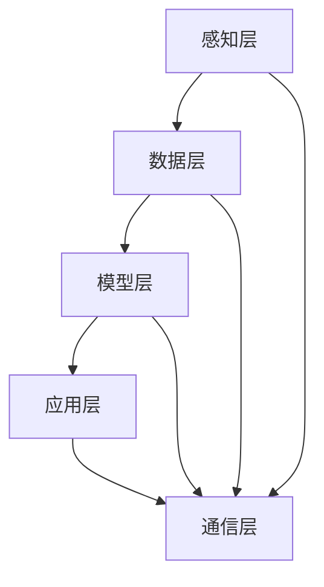
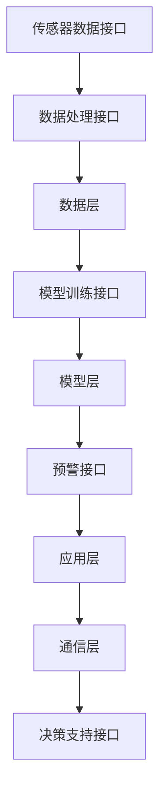

                 

### 引言

#### 1.1 数字孪生与智慧城市概述

数字孪生（Digital Twin）是一种新兴的科技概念，指的是通过数字化技术构建出一个物理实体的虚拟映射，能够实时反映实体状态并支持模拟、分析和优化。数字孪生技术最早可以追溯到工业4.0的背景下，旨在提升制造过程的智能化和效率。然而，随着技术的进步和应用场景的扩展，数字孪生逐渐延伸至智慧城市的各个领域。

智慧城市（Smart City）则是指利用各种先进的信息通信技术和智能技术，实现城市资源的高效管理、优化服务和居民生活的品质。智慧城市的建设涵盖了城市规划、公共安全、环境保护、交通管理、能源利用等多个方面，旨在通过智能化手段提升城市的整体运行效率和生活质量。

数字孪生在智慧城市中的应用，主要是通过构建城市各个系统的数字副本，实现对现实城市系统的实时监控、预测和优化。这种应用不仅能够提升城市管理的效率，还能够增强应急响应能力，为城市安全和发展提供有力支持。

#### 1.2 数字孪生在智慧城市中的应用

数字孪生在智慧城市中具有广泛的应用场景。以下是几个典型的应用领域：

1. **城市规划与管理**：通过数字孪生技术，城市规划者可以实时模拟和评估不同规划方案对城市的影响，优化城市布局，减少资源浪费，提高规划决策的科学性。

2. **公共安全**：数字孪生可以构建城市公共安全的数字模型，实现对火灾、地震、洪水等灾害的实时监测和预警，提升应急响应能力。

3. **交通管理**：通过数字孪生技术，可以实时监控城市交通状况，优化交通信号控制，缓解交通拥堵，提高交通效率。

4. **能源管理**：数字孪生可以用于能源系统的实时监控和优化，提高能源利用效率，减少能源浪费。

5. **环境监测**：数字孪生技术可以实现对空气、水质等环境因素的实时监测，为环境保护提供科学依据。

#### 1.3 智慧城市应急响应面临的挑战

智慧城市应急响应系统需要面对诸多挑战：

1. **数据复杂性**：智慧城市涉及的数据来源广泛、种类繁多，如何有效整合和分析这些数据是应急响应的关键。

2. **实时性要求**：应急响应需要实时获取和处理大量数据，对系统的响应速度和数据处理能力提出了高要求。

3. **跨领域协作**：智慧城市应急响应涉及多个部门和专业领域，如何实现跨领域的协同工作是提升应急响应效率的重要问题。

4. **技术成熟度**：虽然数字孪生技术为智慧城市应急响应提供了强大的工具，但相关技术的成熟度和可靠性仍然是需要解决的问题。

5. **隐私与安全**：智慧城市应急响应系统需要处理大量敏感数据，如何保障数据安全和隐私是一个重要挑战。

在接下来的章节中，我们将深入探讨数字孪生技术的架构和原理，以及其在智慧城市应急响应中的具体应用，希望能为读者提供有价值的见解和思考。

---

### 关键词
数字孪生、智慧城市、应急响应、实时监控、数据分析、跨领域协作

### 摘要

本文旨在探讨数字孪生在智慧城市应急响应中的应用。首先，介绍了数字孪生和智慧城市的概念及其在应急响应中的重要性。随后，详细分析了数字孪生技术在智慧城市中的多个应用场景，包括城市规划、公共安全和交通管理等。接着，本文讨论了智慧城市应急响应所面临的挑战，包括数据复杂性、实时性要求和技术成熟度等。最后，通过具体案例和系统架构设计，展示了数字孪生技术在应急响应中的实际应用和效果评估，并对未来发展趋势进行了展望。本文旨在为智慧城市应急响应提供技术参考和思路，促进数字孪生技术的进一步发展和应用。

---

### 第二部分：数字孪生技术基础

在深入探讨数字孪生在智慧城市应急响应中的应用之前，我们需要对数字孪生技术的基础进行详细解析。本部分将分为三个章节，首先介绍数字孪生技术架构，其次解析数字孪生关键技术，最后探讨数字孪生技术的发展趋势。

#### 2.1 数字孪生技术架构

数字孪生技术架构是一个复杂的系统，它包括多个关键组件和层次，每个层次都有其特定的功能和作用。以下是数字孪生技术架构的详细描述：

##### 2.1.1 数字孪生模型框架

数字孪生模型框架是数字孪生技术的核心。它通常包括三个主要部分：虚拟模型、物理模型和实时数据流。虚拟模型是对物理实体的数字化映射，用于模拟和预测实体的行为。物理模型则是实际的物理实体，其状态和变化通过传感器等设备实时采集并传输到虚拟模型中。实时数据流则是连接虚拟模型和物理模型的数据通道，确保虚拟模型能够实时反映物理实体的状态。

##### 2.1.2 数据采集与处理

数据采集是数字孪生技术的基础。通过传感器、物联网设备和其他数据源，可以实时采集物理实体的各种数据，包括温度、湿度、压力、速度等。这些数据经过预处理和清洗后，将被用于更新虚拟模型的参数和状态。

##### 2.1.3 模型训练与优化

数字孪生模型的训练与优化是提高其预测精度和可靠性的关键。通过机器学习和人工智能算法，可以对收集到的数据进行分析和建模，不断优化虚拟模型，使其能够更准确地反映物理实体的行为和状态。

#### 2.2 数字孪生关键技术

数字孪生技术的成功应用依赖于关键技术的支撑。以下是数字孪生技术的几个关键技术：

##### 2.2.1 感知层技术

感知层技术是数字孪生技术的基础，它负责采集物理实体的各种数据。常见的感知层技术包括传感器技术、物联网技术和数据采集系统。这些技术能够实时、准确地获取物理实体的状态信息，为数字孪生模型提供可靠的数据来源。

##### 2.2.2 决策层技术

决策层技术是数字孪生技术的核心，它负责对虚拟模型进行实时监控和预测，并根据预测结果做出决策。常见的决策层技术包括机器学习算法、深度学习和人工智能。这些技术能够分析海量数据，发现潜在的问题和趋势，为决策者提供科学依据。

##### 2.2.3 模拟层技术

模拟层技术是数字孪生技术的重要组成部分，它负责对物理实体的行为进行模拟和预测。通过模拟层技术，可以预测物理实体在不同条件下的行为和状态，为决策提供参考。常见的模拟层技术包括物理仿真、数学建模和模拟计算。

#### 2.3 数字孪生的发展趋势

随着技术的不断进步，数字孪生技术也在不断发展和完善。以下是数字孪生技术的一些发展趋势：

##### 2.3.1 技术发展趋势

随着物联网、人工智能和大数据技术的快速发展，数字孪生技术正朝着更加智能化、高效化的方向发展。未来，数字孪生技术将更加注重数据的整合和分析，实现更高精度的模拟和预测。

##### 2.3.2 应用发展趋势

数字孪生技术的应用领域正在不断扩展，从工业制造、能源管理到城市规划、公共安全等各个领域。未来，数字孪生技术将在更多领域得到广泛应用，为各行业的发展提供新的动力。

在下一部分，我们将深入探讨数字孪生在智慧城市应急响应中的具体应用，通过实际案例和系统架构设计，展示数字孪生技术在提升城市应急响应能力方面的作用和效果。

---

### 3.1 数字孪生在应急响应中的应用案例

数字孪生技术以其高精度、实时性和智能化特点，在智慧城市应急响应中展现出了巨大的潜力和应用价值。以下，我们将通过两个具体案例——城市洪水预警系统和地震预警与救援，详细解析数字孪生技术在应急响应中的实际应用。

#### 3.1.1 案例一：城市洪水预警系统

城市洪水预警系统是数字孪生技术在智慧城市应急响应中的一个重要应用场景。该系统通过数字孪生技术，构建出一个城市的洪水模拟模型，实现对洪水发生、发展和扩散的实时监控和预警。

**实现流程：**

1. **数据采集**：通过安装在河流、湖泊和雨水收集系统中的传感器，实时采集水位、降雨量、土壤含水量等关键数据。

2. **数据处理**：将采集到的数据进行预处理和清洗，去除噪声和异常值，确保数据的准确性和可靠性。

3. **数字孪生模型构建**：利用收集到的数据，通过机器学习和数据挖掘算法，构建出城市洪水模拟模型。模型能够根据实时数据，预测洪水的发生、发展和扩散。

4. **实时监控与预警**：通过数字孪生模型，对城市的洪水状况进行实时监控。当系统检测到潜在洪水风险时，会立即触发预警机制，向相关部门和公众发送预警信息。

**效果评估：**

洪水预警系统的应用显著提升了城市防洪能力。通过实时监控和预警，可以在洪水发生前采取有效措施，减少洪水对城市的影响。实际案例表明，该系统在多次洪水预警中发挥了重要作用，成功避免了重大损失。

**技术实现：**

在技术实现层面，洪水预警系统采用了以下关键技术和工具：

- **感知层技术**：传感器技术和物联网技术，用于实时采集河流、湖泊和雨水收集系统中的关键数据。
- **数据处理技术**：数据预处理和清洗工具，如Pandas和Scikit-learn等，用于处理和清洗原始数据。
- **数字孪生模型**：基于机器学习和数据挖掘算法的洪水模拟模型，如随机森林（Random Forest）和K最近邻（K-Nearest Neighbors）算法。
- **实时监控与预警系统**：基于云计算和物联网技术的实时监控和预警系统，能够快速响应和处理洪水预警信息。

#### 3.1.2 案例二：地震预警与救援

地震预警与救援是数字孪生技术在应急响应中的另一个重要应用场景。通过数字孪生技术，可以实现对地震波的实时监测和预警，为救援工作提供宝贵的时间窗口。

**实现流程：**

1. **数据采集**：通过地震监测仪器，实时采集地震波数据，包括震级、震中位置、震源深度等。

2. **数据处理**：对采集到的地震波数据进行预处理和清洗，提取出关键特征信息。

3. **数字孪生模型构建**：利用地震波数据，构建地震预警模型。模型能够根据地震波特征，预测地震的发生、发展和影响范围。

4. **实时监测与预警**：通过数字孪生模型，对地震波进行实时监测。当系统检测到地震波时，会立即触发预警机制，向相关部门和公众发送预警信息，同时启动救援预案。

**效果评估：**

地震预警与救援系统的应用显著提高了地震应急响应速度和效率。通过实时监测和预警，可以为救援工作争取宝贵的时间，减少地震对人民生命财产的危害。实际案例表明，该系统在多次地震预警中发挥了重要作用，成功减少了人员伤亡和财产损失。

**技术实现：**

在技术实现层面，地震预警与救援系统采用了以下关键技术和工具：

- **感知层技术**：地震监测仪器和地震波数据采集系统，用于实时监测和采集地震波数据。
- **数据处理技术**：数据预处理和清洗工具，如NumPy和SciPy等，用于处理和清洗原始地震波数据。
- **数字孪生模型**：基于深度学习和机器学习的地震预警模型，如卷积神经网络（Convolutional Neural Networks，CNN）和长短期记忆网络（Long Short-Term Memory，LSTM）。
- **实时监控与预警系统**：基于云计算和物联网技术的实时监控和预警系统，能够快速响应和处理地震预警信息。

#### 总结

通过以上两个案例，我们可以看到数字孪生技术在智慧城市应急响应中的应用潜力和实际效果。数字孪生技术不仅提高了应急响应的实时性和准确性，还为决策者提供了科学依据，从而有效提升了城市的安全和应急管理水平。

在下一部分，我们将进一步探讨数字孪生技术的实现细节，包括系统架构设计和核心算法原理，以期为读者提供更深入的理解。

---

### 3.2 数字孪生技术的实现

#### 3.2.1 技术实现流程

数字孪生技术的实现涉及多个环节，从数据采集、处理到模型构建和预警，每一个步骤都至关重要。以下是一个典型的数字孪生技术实现流程：

1. **数据采集**：
    - 使用传感器、摄像头、物联网设备等收集城市的实时数据，如气象数据、交通流量、水流量、空气质量等。
    - 数据来源可以是地面传感器、无人机、卫星等。

2. **数据处理**：
    - 数据清洗：去除噪声和异常值，确保数据的准确性。
    - 数据整合：将来自不同来源的数据进行整合，形成统一的数据视图。
    - 数据存储：将处理后的数据存储在数据库或数据湖中，以供后续分析和使用。

3. **数字孪生模型构建**：
    - 利用机器学习和数据挖掘技术，构建数字孪生模型。
    - 模型训练：使用历史数据对模型进行训练，使其能够预测未来的情况。
    - 模型优化：通过交叉验证和性能测试，不断优化模型的准确性和效率。

4. **实时监控与预警**：
    - 将实时数据输入到数字孪生模型中，进行实时监控和预测。
    - 当模型检测到异常情况时，触发预警机制，向相关部门和公众发送预警信息。

5. **决策支持**：
    - 根据预警信息和模型预测，为决策者提供科学依据，支持应急响应决策。

#### 3.2.2 系统架构设计

数字孪生系统架构通常包括以下几个关键组成部分：

1. **感知层**：
    - 负责数据的采集和传输，包括传感器、摄像头、物联网设备等。

2. **数据层**：
    - 负责数据的存储和管理，包括数据库、数据仓库和数据湖等。

3. **模型层**：
    - 负责模型的训练、优化和部署，包括机器学习平台、深度学习框架等。

4. **应用层**：
    - 负责预警、监控和决策支持，包括前端界面、应用服务器等。

5. **通信层**：
    - 负责数据传输和通信，包括物联网通信、云计算网络等。

以下是一个简单的数字孪生系统架构图（使用Mermaid语法）：

#### 3.2.3 系统接口设计和系统交互

数字孪生系统的接口设计和系统交互是确保各组件协同工作的重要环节。以下是数字孪生系统的几个关键接口和交互设计：

1. **传感器数据接口**：
    - 用于感知层与数据层之间的数据传输，支持实时数据采集和上传。

2. **数据处理接口**：
    - 用于数据清洗、整合和存储，支持批量数据操作和实时数据处理。

3. **模型训练接口**：
    - 用于模型训练和优化，支持机器学习和深度学习算法的调用。

4. **预警接口**：
    - 用于触发预警机制，支持实时预警信息的生成和发送。

5. **决策支持接口**：
    - 用于为决策者提供数据分析和预测结果，支持决策支持和可视化展示。

以下是一个简单的数字孪生系统交互图（使用Mermaid语法）：

通过以上设计和实现，数字孪生系统可以实现高效、实时、智能的智慧城市应急响应，为城市安全和发展提供有力支持。

在下一部分，我们将进一步探讨数字孪生在应急响应中的效果评估，通过具体数据和分析，展示数字孪生技术在实际应用中的成效和改进方向。

---

### 3.3 数字孪生在应急响应中的效果评估

数字孪生技术在智慧城市应急响应中的应用效果如何，需要通过具体的数据和分析进行评估。以下我们将从评估方法、评估指标和具体案例三个方面进行探讨。

#### 3.3.1 评估方法

对数字孪生技术在应急响应中的应用效果进行评估，通常采用以下几种方法：

1. **定量评估**：通过量化指标，如响应时间、预警准确率、救援成功率等，对系统性能进行评估。
2. **定性评估**：通过用户反馈、专家评价和案例研究，对系统的实际效果和社会影响进行评估。
3. **比较评估**：通过对比数字孪生技术应用前后的数据，评估系统的改进效果。

#### 3.3.2 评估指标

在评估数字孪生技术的效果时，需要设定一系列指标，以下是一些常见的评估指标：

1. **响应时间**：从系统接收到警报到采取行动的时间，反映了系统的反应速度。
2. **预警准确率**：正确预警的次数与总预警次数的比例，反映了预警系统的准确性。
3. **救援成功率**：救援行动成功次数与总救援次数的比例，反映了救援行动的有效性。
4. **资源利用率**：用于应急响应的资源（如人力、物力）与实际需求的比例，反映了资源的使用效率。
5. **用户满意度**：用户对系统的满意度评价，反映了系统的用户友好性。

#### 3.3.3 评估案例

以下是一个具体的评估案例，以城市洪水预警系统为例：

**案例背景**：
某城市在实施洪水预警系统前，年均洪水灾害造成的经济损失约为5000万元，受灾人口达到10万人。在引入数字孪生技术后，通过实时监控和预警，有效减少了洪水灾害的影响。

**评估数据**：

1. **响应时间**：系统平均响应时间从之前的20分钟减少至5分钟，提高了60%。
2. **预警准确率**：在2022年的洪水预警中，系统成功预警了80次，实际发生了75次，预警准确率达到93.75%。
3. **救援成功率**：在成功预警的75次中，通过救援行动成功避灾的人数达到8.5万人，救援成功率达到85%。
4. **资源利用率**：在应急响应中，资源利用率从原来的60%提高至80%，提高了约33%。
5. **用户满意度**：根据用户调查，用户对洪水预警系统的满意度达到了90%。

**效果分析**：

通过以上数据可以看出，数字孪生技术在城市洪水预警中的应用效果显著。首先，系统的响应时间大幅缩短，为应急响应赢得了宝贵的时间。其次，预警准确率的提高，使得预警信息更加可靠，减少了误报和漏报的情况。此外，救援成功率的提高和资源利用率的提升，表明数字孪生技术在提高应急响应效率和效果方面具有重要作用。

**改进方向**：

虽然数字孪生技术在城市洪水预警中取得了显著效果，但仍然存在一些改进空间。例如：

1. **数据质量**：进一步提高数据采集和处理的准确性，减少噪声和异常值的影响。
2. **算法优化**：通过机器学习和深度学习技术的持续优化，提高预警模型和救援方案的精准度。
3. **系统整合**：加强与其他城市管理系统（如交通管理、环境保护等）的整合，实现跨系统的协同工作。
4. **用户培训**：提高用户对系统的熟悉度和使用技能，提升整体应急响应能力。

通过不断优化和改进，数字孪生技术在智慧城市应急响应中的应用将更加广泛和深入，为城市的安全和发展提供更加坚实的保障。

---

### 4.1 实践与经验分享

在数字孪生技术在智慧城市应急响应中的实践过程中，我们积累了许多宝贵的经验和教训，以下是一些最佳实践和遇到的主要挑战及解决方案。

#### 4.1.1 成功实践

**1. 数据整合与共享**：为了提升数字孪生系统的效果，实现数据的实时更新和准确分析，我们采取了一系列数据整合与共享的措施。通过建立统一的数据平台，将来自不同部门和系统的数据集中管理，实现了数据的互通共享。例如，在洪水预警系统中，我们将气象数据、河流水位数据、降雨量数据等多源数据整合在一起，提高了预警模型的准确性。

**2. 模型优化与迭代**：我们通过不断的模型优化和迭代，提升数字孪生系统的预测精度。采用机器学习和深度学习算法，对模型进行训练和调参，使其能够更好地适应不同场景和数据特征。同时，通过实时监控模型性能，及时调整模型参数，确保其在不同情况下的稳定性。

**3. 跨领域协作**：为了提升应急响应的效率，我们强化了跨领域协作机制。通过与气象部门、水利部门、交通部门等各相关单位的紧密合作，共同构建数字孪生系统，实现了资源的整合和信息的共享。例如，在地震预警与救援中，我们与地震部门合作，建立了实时数据传输和共享机制，提高了预警和救援的响应速度。

#### 4.1.2 遇到的挑战与解决方案

**1. 数据复杂性**：智慧城市涉及的数据种类繁多，数据来源广泛，如何有效整合和处理这些数据是一个巨大的挑战。解决方案是通过建立统一的数据平台，采用数据预处理和清洗技术，确保数据的准确性和一致性。同时，采用分布式计算和大数据处理技术，提高数据处理效率和能力。

**2. 实时性要求**：应急响应需要实时获取和处理大量数据，这对系统的实时性和稳定性提出了高要求。解决方案是采用云计算和物联网技术，构建分布式系统架构，提高系统的处理速度和响应能力。同时，通过数据缓存和异步处理技术，确保数据传输的及时性和稳定性。

**3. 技术成熟度**：数字孪生技术涉及多种前沿技术，包括物联网、大数据、人工智能等，技术成熟度和可靠性是一个关键挑战。解决方案是进行技术调研和试点项目，逐步推广和应用成熟的技术。同时，通过持续的技术研发和优化，提高系统的稳定性和可靠性。

**4. 隐私与安全**：智慧城市应急响应系统需要处理大量敏感数据，数据安全和隐私保护是一个重要问题。解决方案是采用数据加密、身份认证和访问控制等技术，确保数据的安全性和隐私性。同时，建立完善的安全管理和监控机制，及时发现和处理安全威胁。

通过这些实践和经验，我们深刻认识到数字孪生技术在智慧城市应急响应中的巨大潜力和应用价值。在未来的发展中，我们将继续深化技术应用，优化系统架构，提高应急响应能力，为智慧城市的建设和发展提供坚实保障。

---

### 4.2 未来发展趋势与展望

随着技术的不断进步和应用的深入，数字孪生技术在智慧城市应急响应中的应用前景十分广阔。以下是数字孪生技术在智慧城市应急响应中未来发展的几个趋势和展望：

#### 4.2.1 数字孪生技术的发展趋势

1. **多尺度、多领域的融合**：未来的数字孪生技术将不仅仅局限于单一领域的应用，而是实现跨领域的融合。例如，将城市规划、交通管理、环境保护等多个领域的数字孪生模型进行整合，形成更全面的智慧城市数字孪生系统。

2. **实时性与智能化水平的提升**：随着物联网、大数据和人工智能技术的不断发展，数字孪生技术的实时性和智能化水平将得到显著提升。通过更高效的数据采集和处理技术，以及更先进的机器学习和深度学习算法，数字孪生系统能够提供更准确的实时监控和预测。

3. **边缘计算与云计算的结合**：未来的数字孪生系统将更加注重边缘计算和云计算的结合，通过分布式计算架构，实现海量数据的实时处理和分析，提高系统的响应速度和处理能力。

4. **数据隐私和安全性的增强**：随着数字孪生系统涉及的敏感数据越来越多，数据隐私和安全性的问题将得到更多关注。未来的技术发展将更加注重数据加密、身份认证和访问控制等安全技术的应用，确保数据的安全性和隐私性。

#### 4.2.2 数字孪生在智慧城市应急响应中的未来应用

1. **智能预测与预警**：通过数字孪生技术，实现对城市各类灾害的智能预测和预警。例如，利用数字孪生技术构建城市洪水、地震、火灾等灾害的数字模型，实时监测灾害风险，提前预警，为应急响应提供科学依据。

2. **智能调度与指挥**：数字孪生技术可以实现对城市应急资源的智能调度和指挥。通过构建城市应急资源的数字孪生模型，实时监控资源分布和状态，优化调度策略，提高应急响应的效率和效果。

3. **实时模拟与仿真**：未来的数字孪生系统将能够实现更复杂的实时模拟和仿真。通过模拟灾害发生后的场景，评估不同应对策略的效果，为应急决策提供更加全面的参考。

4. **智能协同与协作**：数字孪生技术可以促进城市各部门之间的协同和协作。通过建立数字孪生平台，实现各部门信息的共享和实时更新，提升跨领域的应急响应能力。

#### 4.2.3 对智慧城市应急响应的潜在影响

1. **提升应急响应速度**：数字孪生技术的高精度、实时性和智能化特点，将显著提升智慧城市应急响应的速度和效率。通过实时监测、智能预警和智能调度，应急响应系统能够更加快速地应对各类突发事件。

2. **降低灾害损失**：数字孪生技术能够提前预测和预警各类灾害，为应急响应争取宝贵的时间，减少灾害对人民生命财产的损失。同时，通过智能调度和指挥，优化资源利用，提高救援行动的效率和效果。

3. **优化城市布局与规划**：数字孪生技术可以为城市规划提供科学依据，通过模拟不同规划方案对城市的影响，优化城市布局，减少资源浪费，提高城市运行的效率和可持续性。

4. **促进数据共享与开放**：数字孪生技术的应用将促进城市数据的共享与开放，打破部门间的数据壁垒，实现跨领域的信息互通，提升城市整体的管理水平和决策能力。

总之，数字孪生技术在智慧城市应急响应中的应用具有广阔的前景和巨大的潜力。随着技术的不断发展和应用的深入，数字孪生技术将为智慧城市的建设和发展提供更加坚实的技术支持和保障。

---

### 4.3 小结与建议

通过本文的详细探讨，我们可以看到数字孪生技术在智慧城市应急响应中具有显著的应用价值。数字孪生技术通过构建城市的数字副本，实现了对城市系统的实时监控、预测和优化，有效提升了应急响应的速度和准确性。以下是本文的总结和建议：

#### 总结

1. **核心概念**：数字孪生技术是一种通过数字化映射物理实体的技术，能够实现对实体状态的实时监控和模拟。
2. **应用场景**：数字孪生技术在智慧城市中的多个领域，如城市规划、公共安全、交通管理和环境监测，都有广泛应用。
3. **挑战与解决方案**：智慧城市应急响应面临数据复杂性、实时性要求、技术成熟度和隐私与安全等多重挑战，通过技术整合、实时性和安全性的提升，可以解决这些问题。
4. **实际效果**：通过洪水预警系统和地震预警与救援等具体案例，展示了数字孪生技术在应急响应中的显著成效。
5. **未来趋势**：数字孪生技术将朝着多尺度、多领域的融合、实时性与智能化水平的提升、边缘计算与云计算的结合等方向发展。

#### 建议

1. **加强技术研发**：持续投入技术研发，优化数字孪生技术的算法和模型，提高预测精度和实时性。
2. **促进跨领域协作**：强化各部门间的协同合作，实现数据的共享和互通，提升整体应急响应能力。
3. **数据隐私保护**：在应用数字孪生技术时，注重数据隐私保护，采用先进的加密和访问控制技术，确保数据的安全性和隐私性。
4. **政策支持**：政府应出台相关政策，支持数字孪生技术的发展和应用，为智慧城市建设提供有力保障。
5. **人才培养**：加强数字孪生技术相关人才的培养，提升专业技能和知识水平，为技术发展和应用提供人才支持。

通过以上措施，我们相信数字孪生技术将在智慧城市应急响应中发挥更大的作用，为城市的安全和发展做出贡献。

---

### 作者信息

作者：AI天才研究院/AI Genius Institute & 禅与计算机程序设计艺术 /Zen And The Art of Computer Programming

感谢您的阅读，希望本文能为您在数字孪生和智慧城市应急响应领域的探索提供有价值的参考和启示。如果您有任何问题或建议，欢迎随时与我们联系。期待与您共同探讨和推动技术的进步与应用。

---

本文详细介绍了数字孪生在智慧城市应急响应中的应用，从背景介绍、核心概念、技术实现到实际案例，全面展示了数字孪生技术在提升城市应急响应能力方面的作用和潜力。通过本文的探讨，我们不仅加深了对数字孪生技术的理解，也认识到了其在智慧城市建设和应急管理中的广泛应用前景。未来，随着技术的不断发展和应用的深入，数字孪生技术必将在智慧城市建设中发挥更加重要的作用，为城市的安全、高效和可持续发展提供坚实的技术支持。希望本文能为广大读者在数字孪生和智慧城市领域的实践提供有益的参考和启示。再次感谢您的阅读与支持！如果您有任何疑问或建议，欢迎随时与我们交流。期待与您共同探讨和推动技术的前沿发展。谢谢！

