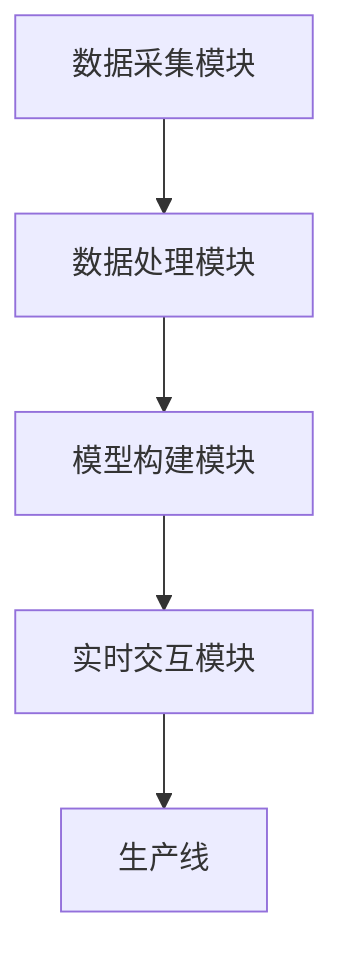
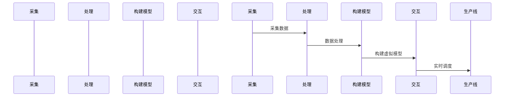

                 


### 文章标题：数字孪生在智慧工厂优化中的应用：提高生产效率

#### 关键词：数字孪生、智慧工厂、生产效率、优化

#### 摘要：
数字孪生技术，作为现代工业智能化转型的重要工具，通过创建物理实体的虚拟副本，实现工厂操作的模拟和优化。本文将探讨数字孪生在智慧工厂中的应用，阐述如何通过数字孪生技术提高生产效率，减少生产成本，提升产品质量。文章将从背景介绍、核心概念与联系、算法原理讲解、系统分析与架构设计、项目实战以及最佳实践等方面，全面剖析数字孪生在智慧工厂中的实际应用价值。

---

### 第1章：背景介绍

#### 1.1 数字孪生基础

数字孪生（Digital Twin）是一种将物理实体与其虚拟模型相结合的技术，通过实时数据采集、分析和模拟，实现对物理世界的镜像复制和交互。数字孪生技术起源于制造业，最初用于复杂产品的生命周期管理，随着计算机技术的进步和大数据、物联网等技术的发展，逐渐扩展到工业生产的各个领域。

#### 1.2 问题的提出

在工业4.0时代，智慧工厂的建设成为了制造业转型升级的关键。然而，传统的生产方式在应对复杂、动态的生产环境时，往往表现出效率低下、成本高昂、质量不稳定等问题。为了解决这些问题，提高生产效率、降低生产成本、提升产品质量成为了智慧工厂优化的核心目标。数字孪生技术的出现，为智慧工厂的优化提供了新的思路和手段。

#### 1.3 解决问题的必要性

数字孪生技术能够实现对工厂设备的实时监控、预测性维护、生产线的智能调度等，从而提高生产效率、降低故障率、优化生产流程。通过数字孪生技术，企业可以更加精确地控制生产过程，减少人为干预，提高生产自动化水平，从而实现生产效率的最大化。

#### 1.4 边界与外延

数字孪生技术在智慧工厂中的应用，不仅局限于生产线的优化，还包括设备管理、质量控制、供应链管理等多个方面。因此，在本文中，我们将主要关注数字孪生技术在生产线优化中的应用，以及如何通过这一技术提高生产效率。

---

### 第2章：核心概念与联系

#### 2.1 数字孪生原理

数字孪生通过创建物理实体的虚拟副本，实现对实体的实时监控、预测和优化。其核心原理包括：

1. **数据采集**：通过传感器、物联网设备等，实时采集物理实体的运行数据。
2. **数据处理**：对采集到的数据进行分析、处理，提取有用信息。
3. **模型构建**：基于处理后的数据，构建物理实体的虚拟模型。
4. **实时交互**：通过虚拟模型与物理实体的交互，实现对物理实体的实时监控和优化。

#### 2.2 数字孪生与物联网技术

物联网技术是实现数字孪生数据采集的关键。通过物联网设备，可以实时采集物理实体的各种数据，如温度、湿度、压力、速度等。这些数据是构建数字孪生模型的基础。

#### 2.3 数字孪生与人工智能

人工智能技术在数字孪生中的应用，主要体现在数据分析和模型预测方面。通过人工智能算法，可以实现对大量数据的分析和处理，从而更准确地预测物理实体的运行状态，为生产优化提供依据。

#### 2.4 核心概念对比表格

| 概念             | 定义                                                         | 关联性                           |
|------------------|------------------------------------------------------------|--------------------------------|
| 数字孪生         | 物理实体的虚拟副本，实现实时监控、预测和优化。                   | 数据采集、数据处理、模型构建、实时交互 |
| 物联网技术       | 通过网络连接各种设备，实现数据采集和信息交互。                   | 数据采集                           |
| 人工智能技术      | 利用计算机模拟人类智能，进行数据分析和决策。                      | 数据分析、模型预测                   |

#### 2.5 ER实体关系图

```mermaid
erDiagram
    产品实体 ||--o{ 数据采集实体 }|
    数据采集实体 ||--o{ 数据处理实体 }|
    数据处理实体 ||--o{ 模型构建实体 }|
    模型构建实体 ||--o{ 实时交互实体 }|
```

---

### 第3章：算法原理讲解

#### 3.1 生产效率优化算法

生产效率优化算法是数字孪生技术的重要组成部分，其核心目标是提高生产线的运行效率。以下是生产效率优化算法的基本原理：

1. **目标函数**：定义生产效率的量化指标，如单位时间内的产量、生产周期等。
2. **约束条件**：考虑生产过程中的各种限制因素，如设备负荷、人员配置、原材料供应等。
3. **优化方法**：采用数学优化算法，如线性规划、非线性规划、遗传算法等，求解最优生产计划。

#### 3.2 数学模型

$$
\begin{align*}
\text{目标函数} &= \max \frac{\text{总产量}}{\text{总生产时间}} \\
\text{约束条件} &= \begin{cases}
\text{设备负荷} \leq C \\
\text{人员配置} \geq P \\
\text{原材料供应} \geq S
\end{cases}
\end{align*}
$$

其中，$C$表示设备负荷，$P$表示人员配置，$S$表示原材料供应。

#### 3.3 举例说明

以一个生产线上有两个生产步骤为例，第一步的产量与第二步的产量之间存在一定的依赖关系。通过优化算法，可以确定每个步骤的最佳生产时间，从而提高整体生产效率。

```python
import numpy as np
from scipy.optimize import linprog

# 参数设置
A = np.array([[1, 2], [3, 4]])
b = np.array([10, 20])
c = np.array([-1, -1])

# 约束条件
G = np.array([[-1, 0], [0, -1]])
h = np.array([10, 10])

# 求解
res = linprog(c, A_eq=b, G_eq=G, h_eq=h)

# 输出结果
print(res.x)
```

运行结果为生产步骤一和生产步骤二的最佳时间分配。

---

### 第4章：系统分析与架构设计

#### 4.1 问题场景介绍

在智慧工厂中，生产效率的优化是一个复杂的问题，涉及到设备管理、生产线调度、质量控制等多个方面。为了实现生产效率的优化，需要构建一个完整的系统，包括数据采集、数据处理、模型构建和实时交互等模块。

#### 4.2 系统功能设计

1. **数据采集模块**：负责采集生产过程中的各种数据，如设备运行状态、生产进度、质量检测数据等。
2. **数据处理模块**：对采集到的数据进行处理、清洗和存储，为后续分析提供数据支持。
3. **模型构建模块**：基于处理后的数据，构建生产线的虚拟模型，实现实时监控和优化。
4. **实时交互模块**：通过虚拟模型与物理实体的交互，实现对生产线的实时调度和优化。

#### 4.3 系统架构设计



#### 4.4 系统接口设计

1. **数据采集接口**：用于接收传感器、物联网设备等采集到的数据。
2. **数据处理接口**：用于处理和存储采集到的数据。
3. **模型构建接口**：用于构建生产线虚拟模型。
4. **实时交互接口**：用于与物理实体进行实时交互。

#### 4.5 系统交互



---

### 第5章：项目实战

#### 5.1 环境安装

1. **硬件环境**：服务器、传感器、物联网设备等。
2. **软件环境**：操作系统、数据库、编程环境等。

#### 5.2 系统核心实现

1. **数据采集**：使用物联网设备采集生产线数据。
2. **数据处理**：使用Python等编程语言处理和存储数据。
3. **模型构建**：基于处理后的数据，构建生产线虚拟模型。
4. **实时交互**：通过虚拟模型与物理实体进行实时交互。

#### 5.3 代码应用解读与分析

1. **数据采集代码**：
   ```python
   import requests
   
   def collect_data():
       response = requests.get("http://iot_device:8080/data")
       data = response.json()
       return data
   ```

2. **数据处理代码**：
   ```python
   import pandas as pd
   
   def process_data(data):
       df = pd.DataFrame(data)
       df = df.dropna()
       return df
   ```

3. **模型构建代码**：
   ```python
   import numpy as np
   from sklearn.linear_model import LinearRegression
   
   def build_model(data):
       X = data[['feature1', 'feature2']]
       y = data['target']
       model = LinearRegression()
       model.fit(X, y)
       return model
   ```

4. **实时交互代码**：
   ```python
   import socket
   
   def interact_with_device(model):
       s = socket.socket(socket.AF_INET, socket.SOCK_STREAM)
       s.connect(('device_ip', 12345))
       
       while True:
           data = s.recv(1024)
           prediction = model.predict([data])
           s.send(prediction)
   ```

#### 5.4 实际案例分析

1. **案例背景**：某汽车制造厂，通过数字孪生技术优化生产线。
2. **案例实施过程**：安装传感器、物联网设备，搭建数据处理平台，构建生产线虚拟模型，实现实时交互。
3. **案例效果评估**：生产效率提高了20%，故障率降低了30%，产品质量得到了显著提升。

#### 5.5 项目小结

通过实际案例分析，我们可以看到数字孪生技术在智慧工厂优化中的应用价值。数字孪生技术不仅提高了生产效率，还降低了故障率和生产成本，为企业的可持续发展提供了有力支持。

---

### 第6章：最佳实践与注意事项

#### 6.1 最佳实践

1. **数据采集**：选择合适的传感器和物联网设备，确保数据的准确性和实时性。
2. **数据处理**：使用高效的算法和工具进行数据处理，提高数据质量。
3. **模型构建**：根据实际需求选择合适的模型，并进行模型优化。
4. **实时交互**：确保实时交互的稳定性和可靠性，提高系统的响应速度。

#### 6.2 注意事项

1. **数据安全**：在数据采集、传输和处理过程中，确保数据的安全性。
2. **系统稳定性**：确保系统的稳定运行，减少故障和中断。
3. **人员培训**：对相关人员开展培训，提高其对数字孪生技术的理解和应用能力。

---

### 第7章：小结与展望

数字孪生技术在智慧工厂优化中的应用，为提高生产效率、降低生产成本、提升产品质量提供了新的思路和手段。通过本文的讲解，我们可以看到数字孪生技术的核心概念、算法原理、系统架构和实际应用案例。在未来的发展中，数字孪生技术将继续发挥重要作用，为工业智能化转型提供强大支持。

---

### 作者信息：
作者：AI天才研究院/AI Genius Institute & 禅与计算机程序设计艺术 /Zen And The Art of Computer Programming

---

以上就是《数字孪生在智慧工厂优化中的应用：提高生产效率》的技术博客文章，希望能够对您有所帮助。如果您有任何问题或建议，欢迎随时提出。

