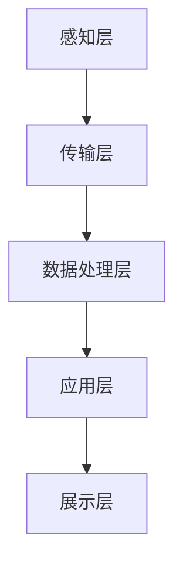

                 

### 文章标题

# 数字孪生在智慧矿山管理中的应用：提高采矿效率和安全性

### 关键词

- 数字孪生
- 智慧矿山
- 采矿效率
- 安全性
- 管理优化

### 摘要

本文旨在探讨数字孪生技术在智慧矿山管理中的应用，如何通过构建虚拟矿山模型，提高采矿效率和安全性。文章首先介绍了数字孪生技术的基本概念和智慧矿山的背景，随后详细阐述了数字孪生在采矿、安全监控和管理优化中的应用原理和架构设计，并结合实际案例进行了分析。最后，总结了数字孪生在智慧矿山管理中的最佳实践，并展望了其未来的发展趋势。

### 目录大纲设计过程

为了设计《数字孪生在智慧矿山管理中的应用：提高采矿效率和安全性》这本书的目录大纲，我们需要遵循以下步骤：

#### 1. 分析书名

书名《数字孪生在智慧矿山管理中的应用：提高采矿效率和安全性》表明了这本书的核心主题：数字孪生技术在智慧矿山管理中的应用。这涉及到数字孪生技术的概念介绍、应用场景、技术原理、系统架构、实际案例分析等。

#### 2. 确定大纲结构

根据书名和主题，我们可以确定以下大纲结构：

- **背景介绍**：介绍数字孪生技术、智慧矿山管理的背景、意义和挑战。
- **核心概念**：阐述数字孪生技术的基本概念、原理和分类。
- **技术原理**：详细讲解数字孪生技术在矿山管理中的应用原理。
- **系统架构**：介绍智慧矿山管理系统架构设计。
- **实际案例**：分析数字孪生技术在矿山管理中的实际应用案例。
- **最佳实践**：总结数字孪生技术在矿山管理中的最佳实践。
- **未来展望**：探讨数字孪生技术在矿山管理中的发展趋势。

#### 3. 确定目录层级

为了确保目录的清晰和逻辑性，我们采用以下层级结构：

- **1级目录**：总览各章节主题。
- **2级目录**：详细阐述各章节的具体内容。
- **3级目录**：具体说明每个小节的内容。

### 最终目录大纲

以下是《数字孪生在智慧矿山管理中的应用：提高采矿效率和安全性》的目录大纲：

```markdown
----------------------------------------------------------------
# 第一部分: 背景介绍

## 1.1 数字孪生技术概述
### 1.1.1 数字孪生技术的定义
### 1.1.2 数字孪生技术的核心概念
### 1.1.3 数字孪生技术的发展历程

## 1.2 智慧矿山管理的背景
### 1.2.1 智慧矿山的概念
### 1.2.2 智慧矿山的重要性
### 1.2.3 智慧矿山面临的挑战

## 1.3 数字孪生在智慧矿山管理中的应用
### 1.3.1 数字孪生技术在采矿中的应用
### 1.3.2 数字孪生技术在安全监控中的应用
### 1.3.3 数字孪生技术在矿山管理中的应用前景

## 1.4 本章小结

----------------------------------------------------------------

# 第二部分: 核心概念与技术原理

## 2.1 数字孪生技术的原理与分类
### 2.1.1 数字孪生技术的原理
### 2.1.2 数字孪生技术的分类
### 2.1.3 数字孪生技术的实现流程

## 2.2 智慧矿山管理系统架构设计
### 2.2.1 系统架构概述
### 2.2.2 数据采集与处理
### 2.2.3 数字孪生模型构建
### 2.2.4 系统集成与应用

## 2.3 数字孪生技术在矿山管理中的应用原理
### 2.3.1 数字孪生技术在采矿中的应用原理
### 2.3.2 数字孪生技术在安全监控中的应用原理
### 2.3.3 数字孪生技术在矿山管理中的优化原理

## 2.4 本章小结

----------------------------------------------------------------

# 第三部分: 系统架构与设计

## 3.1 智慧矿山管理系统架构设计
### 3.1.1 系统架构概述
### 3.1.2 数据采集与处理架构设计
### 3.1.3 数字孪生模型构建架构设计
### 3.1.4 系统集成与应用架构设计

## 3.2 系统功能设计与实现
### 3.2.1 系统功能设计
### 3.2.2 功能实现与优化

## 3.3 系统接口设计与交互
### 3.3.1 系统接口设计
### 3.3.2 系统交互设计

## 3.4 本章小结

----------------------------------------------------------------

# 第四部分: 实际案例与最佳实践

## 4.1 数字孪生技术在矿山管理中的实际应用案例
### 4.1.1 案例一：某矿山数字化改造项目
### 4.1.2 案例二：某矿山安全监控系统的建设
### 4.1.3 案例三：某矿山生产效率优化的应用

## 4.2 数字孪生技术在矿山管理中的最佳实践
### 4.2.1 最佳实践一：数据驱动的矿山管理
### 4.2.2 最佳实践二：基于数字孪生的安全预警系统
### 4.2.3 最佳实践三：智慧矿山生产优化方案

## 4.3 本章小结

---

----------------------------------------------------------------

### 背景介绍

#### 数字孪生技术概述

数字孪生（Digital Twin）是一种新兴的技术概念，通过构建物理实体（如设备、系统、产品等）的虚拟模型，实现对实体在现实世界中的模拟、监控、分析和优化。数字孪生技术的基本原理是通过物联网（IoT）和数据采集技术，将实体的各种物理参数实时传输到虚拟模型中，从而形成一个与实体高度相似的数字镜像。

数字孪生技术的核心概念包括：

- **物理实体**：指现实世界中的具体物理对象，如设备、机器、工厂、矿山等。
- **虚拟模型**：通过对物理实体进行数字化建模，构建一个在数字世界中对应的虚拟实体。
- **数据采集与传输**：利用传感器、物联网技术等手段，实时采集物理实体的运行数据，并将数据传输到虚拟模型中。
- **数据分析与优化**：通过大数据分析、机器学习等技术，对虚拟模型中的数据进行处理，实现对物理实体的实时监控、预测和优化。

#### 智慧矿山管理的背景

智慧矿山（Smart Mine）是指通过应用物联网、大数据、云计算、人工智能等先进技术，实现矿山生产过程的自动化、智能化和可视化，从而提高矿山生产效率、降低成本、保障安全。智慧矿山管理涉及到以下几个方面：

- **生产过程自动化**：通过自动化设备和控制系统，实现矿山开采、运输、加工等生产过程的自动化。
- **数据采集与分析**：利用传感器和物联网技术，实时采集矿山生产过程中的各种数据，并通过大数据分析技术进行深度挖掘，为决策提供支持。
- **安全监控与预警**：通过视频监控、气体检测、设备监测等技术，实现对矿山安全的实时监控和预警，提高矿山的安全性。
- **资源优化与管理**：通过优化矿山资源的开采、利用和分配，提高矿山的生产效率和经济效益。

#### 数字孪生在智慧矿山管理中的应用

数字孪生技术在智慧矿山管理中具有广泛的应用前景，具体表现在以下几个方面：

- **采矿中的应用**：通过数字孪生技术，可以对采矿过程进行实时监控和模拟，优化采矿工艺，提高采矿效率。
- **安全监控中的应用**：通过数字孪生技术，可以实现对矿山安全状况的实时监控和预测，及时发现安全隐患，提高矿山的安全性。
- **管理优化中的应用**：通过数字孪生技术，可以对矿山的生产、运营、维护等过程进行全方位的监控和分析，为矿山管理提供科学依据，实现管理优化。

### 数字孪生技术在智慧矿山管理中的应用前景

随着数字孪生技术的不断发展和成熟，其在智慧矿山管理中的应用前景十分广阔。未来，数字孪生技术有望在以下几个方面实现突破：

- **提高采矿效率**：通过数字孪生技术，可以实现矿山生产过程的精细化管理和优化，提高采矿效率。
- **保障矿山安全**：通过数字孪生技术，可以实现对矿山安全的全方位监控和预警，提高矿山的安全性。
- **降低运营成本**：通过数字孪生技术，可以实现矿山资源的优化利用，降低矿山运营成本。
- **实现矿山智能化**：通过数字孪生技术，可以实现矿山生产过程的全面智能化，推动矿山行业的数字化转型。

#### 本章小结

本章对数字孪生技术和智慧矿山管理进行了背景介绍，阐述了数字孪生技术在智慧矿山管理中的应用前景。通过本章的介绍，读者可以了解到数字孪生技术的基本概念、原理和应用场景，为后续章节的详细探讨打下基础。

### 核心概念与技术原理

#### 数字孪生技术的原理与分类

数字孪生技术是一种通过构建物理实体虚拟模型，实现对实体在现实世界中的模拟、监控、分析和优化的一种新兴技术。其基本原理主要包括以下几个方面：

- **数据采集**：利用传感器、物联网等技术，实时采集物理实体的各种物理参数，如温度、压力、速度、位置等。
- **数据传输**：将采集到的数据通过通信网络（如无线网络、光纤网络等）传输到云端或边缘设备，进行后续处理。
- **数据处理**：利用大数据分析、机器学习、人工智能等技术，对传输到云端或边缘设备的数据进行实时处理和分析，提取有价值的信息。
- **数据可视化**：通过数据可视化技术，将处理后的数据以图表、图像等形式展示出来，为决策提供支持。

根据实现方式的不同，数字孪生技术可以分为以下几类：

- **实时仿真**：通过对物理实体的实时数据采集和传输，构建虚拟模型，实现对实体的实时仿真和监控。
- **历史数据回溯**：通过对历史数据的分析和处理，构建虚拟模型，实现对实体过去行为的分析和预测。
- **预测性维护**：通过对实体运行数据的实时采集和分析，预测实体的故障和损坏，实现预防性维护。

#### 智慧矿山管理系统架构设计

智慧矿山管理系统的架构设计是数字孪生技术在矿山管理中应用的基础。一个典型的智慧矿山管理系统架构包括以下几个部分：

- **感知层**：包括各种传感器和监测设备，用于实时采集矿山生产过程中的各种数据，如温度、湿度、气体浓度、设备状态等。
- **传输层**：负责将感知层采集到的数据传输到数据中心或云平台，可以使用有线或无线通信技术。
- **数据处理层**：包括数据清洗、存储、处理和分析等功能，利用大数据分析、机器学习等技术，对采集到的数据进行分析和处理，提取有价值的信息。
- **应用层**：包括各种应用系统，如矿山生产管理系统、设备监控系统、安全预警系统、数据分析系统等，为矿山管理提供决策支持。
- **展示层**：通过数据可视化技术，将处理后的数据以图表、图像等形式展示给管理人员，帮助其了解矿山运行状态，做出科学决策。

#### 数字孪生技术在矿山管理中的应用原理

数字孪生技术在矿山管理中的应用主要体现在以下几个方面：

- **采矿优化**：通过数字孪生技术，可以实时监控矿山开采过程中的各种参数，如挖掘深度、挖掘速度、矿石品位等，结合大数据分析和机器学习算法，优化采矿工艺，提高采矿效率。
- **设备监控**：通过数字孪生技术，可以实现对矿山设备状态的实时监控，如设备运行状态、温度、压力等，及时发现问题并进行维修，降低设备故障率，延长设备使用寿命。
- **安全预警**：通过数字孪生技术，可以实时监测矿山环境中的各种安全指标，如气体浓度、温度、湿度等，结合机器学习算法，对潜在的安全隐患进行预测和预警，提高矿山的安全性。
- **资源管理**：通过数字孪生技术，可以实时监测矿山资源的使用情况，如矿石储量、设备利用率等，结合大数据分析和优化算法，实现矿山资源的优化配置和管理。

#### 本章小结

本章详细介绍了数字孪生技术的基本概念、原理和分类，以及智慧矿山管理系统架构设计，并阐述了数字孪生技术在矿山管理中的应用原理。通过本章的学习，读者可以了解数字孪生技术的核心概念和应用场景，为后续章节的实际案例分析打下基础。

### 系统架构与设计

#### 智慧矿山管理系统架构设计

智慧矿山管理系统的架构设计是实现数字孪生技术在矿山管理中应用的关键。一个典型的智慧矿山管理系统架构包括感知层、传输层、数据处理层、应用层和展示层，如图 1 所示。


图 1 智慧矿山管理系统架构图

#### 感知层

感知层是智慧矿山管理系统的底层，负责实时采集矿山生产过程中的各种数据。感知层包括各种传感器和监测设备，如温度传感器、湿度传感器、气体传感器、设备状态传感器等。这些传感器可以安装在矿山设备、环境、人员等关键位置，实时监测矿山运行状态。

#### 传输层

传输层负责将感知层采集到的数据传输到数据中心或云平台。传输层可以使用有线或无线通信技术，如光纤网络、无线传感器网络（WSN）等。传输层的关键技术包括数据传输协议、数据加密、数据压缩等。

#### 数据处理层

数据处理层是智慧矿山管理系统的核心，负责对采集到的数据进行分析和处理。数据处理层包括数据清洗、存储、处理和分析等功能。数据处理层可以使用大数据分析、机器学习、人工智能等技术，对矿山生产过程中的数据进行深度挖掘和分析，提取有价值的信息。

#### 应用层

应用层是智慧矿山管理系统的应用部分，包括各种应用系统，如矿山生产管理系统、设备监控系统、安全预警系统、数据分析系统等。应用层可以通过Web、移动APP、桌面客户端等方式，为矿山管理人员提供实时监控、分析报表、预警通知等操作界面。

#### 展示层

展示层负责将处理后的数据以图表、图像等形式展示给管理人员，帮助其了解矿山运行状态，做出科学决策。展示层可以使用各种可视化工具，如ECharts、D3.js等，实现数据可视化。

#### 系统功能设计与实现

智慧矿山管理系统的功能设计是根据矿山生产需求和管理目标进行的。以下是几个关键功能的设计和实现：

- **数据采集与传输**：设计数据采集模块，使用传感器实时采集矿山设备状态、环境参数等数据。设计数据传输模块，使用MQTT协议将数据传输到数据中心。
- **数据存储与管理**：设计数据存储模块，使用数据库（如MySQL、MongoDB等）存储采集到的数据。设计数据管理模块，实现对数据的增删改查等操作。
- **数据分析与处理**：设计数据分析模块，使用Python、R语言等数据分析工具对数据进行处理和分析，提取有价值的信息。设计数据可视化模块，使用ECharts等工具将分析结果展示给用户。
- **实时监控与预警**：设计实时监控模块，使用Web技术（如HTML、CSS、JavaScript等）实现矿山设备的实时监控。设计预警模块，使用机器学习算法（如决策树、支持向量机等）实现矿山安全隐患的预测和预警。

#### 系统接口设计与交互

智慧矿山管理系统需要与其他系统进行数据交互，如ERP系统、MES系统等。系统接口设计是实现系统间数据交换的关键。以下是几个关键接口的设计：

- **数据接口**：设计数据接口，实现矿山管理系统中数据与其他系统的数据交换。使用API接口、Web服务等方式进行数据交换。
- **控制接口**：设计控制接口，实现矿山管理系统对其他系统的控制和调度。使用远程控制、自动化脚本等方式进行控制。

#### 系统架构设计与实现

以下是一个简单的智慧矿山管理系统架构设计示例：



实现步骤如下：

1. **感知层设计**：安装传感器和监测设备，实时采集矿山设备状态、环境参数等数据。
2. **传输层设计**：使用MQTT协议将感知层采集到的数据传输到数据中心。
3. **数据处理层设计**：使用Python等编程语言实现数据清洗、存储、处理和分析功能。
4. **应用层设计**：使用Web技术（如HTML、CSS、JavaScript等）实现矿山设备的实时监控和数据分析功能。
5. **展示层设计**：使用ECharts等工具将处理后的数据以图表、图像等形式展示给用户。

#### 本章小结

本章详细介绍了智慧矿山管理系统的架构设计，包括感知层、传输层、数据处理层、应用层和展示层的功能和实现。通过本章的学习，读者可以了解智慧矿山管理系统架构的设计原则和实现方法，为后续章节的实际案例分析和设计提供参考。

