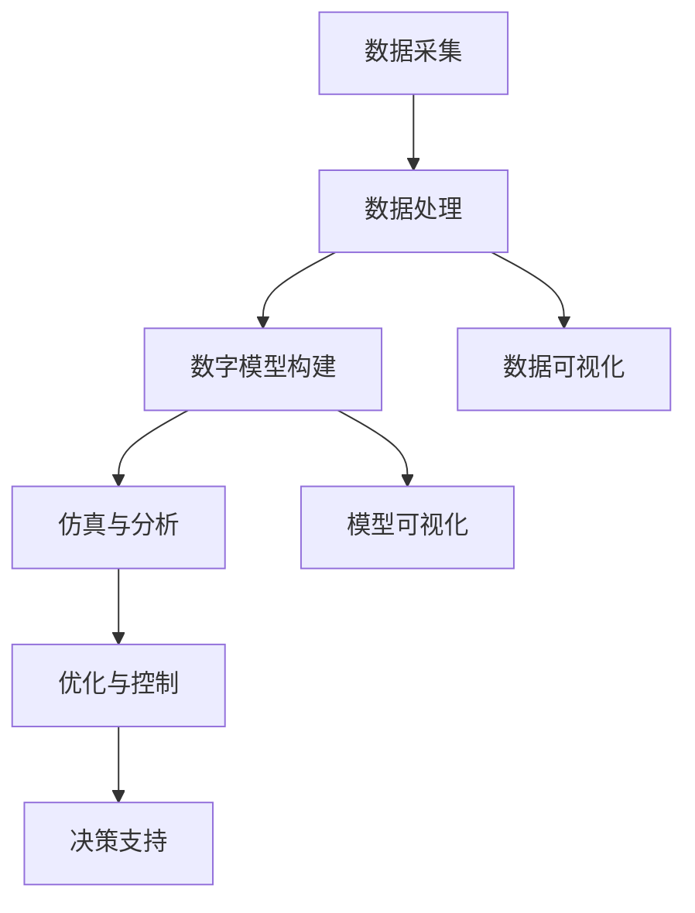

                 

### 数字孪生技术在智能矿山管理中的应用

#### 关键词：数字孪生、智能矿山、管理应用、实时监控、优化调度

> 摘要：本文深入探讨了数字孪生技术在智能矿山管理中的应用，首先介绍了数字孪生技术的基本概念和发展背景，随后详细阐述了其在智能矿山管理中的各种应用场景，包括运营监控、设备管理、生产调度、安全与环保等方面。通过分析这些应用，文章展示了数字孪生技术如何助力智能矿山实现高效、安全、可持续的发展。本文旨在为业内人士提供一份全面的数字孪生技术应用指南，助力矿山企业迈向智能化升级。

---

## 引言

随着科技的飞速发展，矿山行业正迎来一场智能化的革命。传统的矿山管理方法已经难以满足现代矿山复杂、高效、安全的需求。数字孪生技术的出现，为矿山行业的智能化升级提供了新的思路和解决方案。数字孪生，即通过数字模型来模拟实体系统，实现对实体系统的实时监控、优化调度和精准预测。

本文将围绕数字孪生技术在智能矿山管理中的应用进行深入探讨。首先，我们将介绍数字孪生技术的基本概念和发展背景，帮助读者理解这一技术的核心原理。接下来，我们将详细分析数字孪生技术在智能矿山管理中的各种应用场景，包括运营监控、设备管理、生产调度、安全与环保等方面。通过这些分析，读者可以全面了解数字孪生技术在矿山管理中的实际应用价值。最后，我们将总结数字孪生技术在智能矿山中的未来发展前景和面临的挑战。

本文结构如下：

1. **数字孪生技术概述**
   - 数字孪生技术的起源与发展
   - 数字孪生技术的定义与核心要素
   - 数字孪生技术在不同行业中的应用现状
   - 数字孪生技术在智能矿山管理中的优势

2. **数字孪生技术在智能矿山中的应用场景**
   - 智能矿山概述
   - 矿山运营监控与优化
   - 矿山设备管理
   - 矿山生产调度
   - 矿山安全与环保

3. **数字孪生技术在智能矿山中的实施案例**
   - 智能矿山项目背景
   - 数字孪生系统设计与实现
   - 案例分析与效果评估

4. **数字孪生技术在智能矿山中的未来发展趋势与挑战**
   - 数字孪生技术的未来发展趋势
   - 数字孪生技术在智能矿山中的挑战与应对策略
   - 数字孪生技术在智能矿山中的前景展望

通过本文的阅读，读者将全面了解数字孪生技术在智能矿山管理中的应用，为矿山企业的智能化转型提供理论支持和实践指导。

### 第1章: 数字孪生技术概述

#### 1.1 数字孪生技术的起源与发展

数字孪生（Digital Twin）技术的概念最早可以追溯到2002年，由美国密歇根大学教授迈克尔·格里夫斯（Michael Grieves）首次提出。他将其定义为：“将一个物理实体与其数字映射关联起来，以实现实时模拟、状态监测、预测分析和优化控制。”随着计算机技术、物联网、大数据和人工智能等技术的快速发展，数字孪生技术逐渐成熟并应用于各个行业。

2003年，通用电气（General Electric）首次将数字孪生技术应用于航空发动机的维护与管理，通过创建发动机的数字模型，实现对其实时状态的监控和预测性维护。这一成功应用标志着数字孪生技术正式进入工业领域。

进入21世纪后，随着云计算、大数据、物联网和人工智能等技术的普及，数字孪生技术得到了迅速发展。2017年，德国提出了工业4.0战略，强调利用数字孪生技术实现工业系统的智能化和自动化。同年，美国也提出了类似的工业互联网（Industrial Internet）战略，强调利用数字孪生技术提升工业系统的效率和可靠性。

在中国，数字孪生技术也得到了广泛关注和快速发展。2016年，中国工业和信息化部发布了《智能工业数字孪生技术路线图》，明确了数字孪生技术在未来五年内的研发和应用目标。同年，国家发展改革委、科技部等部门联合发布了《智能制造发展规划（2016-2020年）》，将数字孪生技术列为智能制造的关键技术之一。

#### 1.2 数字孪生技术的定义与核心要素

数字孪生技术，简而言之，就是通过构建物理实体的数字镜像，实现对实体系统的实时监控、仿真、分析和优化。其核心要素包括以下几个方面：

1. **物理实体**：物理实体是指需要被构建数字孪生的实际对象，如设备、系统、生产线等。

2. **数字模型**：数字模型是对物理实体的虚拟表示，通常包括几何模型、物理模型、行为模型等。通过数字模型，可以实现对物理实体的特征、行为和状态的模拟。

3. **数据采集**：数据采集是指通过传感器、物联网设备等手段，实时获取物理实体的各种数据，如温度、湿度、压力、运行状态等。

4. **数据处理**：数据处理包括数据清洗、数据存储、数据分析和数据可视化等环节，通过对采集到的数据进行分析和处理，提取出有价值的信息。

5. **通信网络**：通信网络是连接物理实体与数字模型的桥梁，通过高速网络，实现数据传输和实时交互。

6. **仿真与分析**：仿真与分析是指利用数字模型对物理实体的行为进行模拟和分析，以预测其未来状态和性能。

7. **优化与控制**：优化与控制是指根据仿真和分析结果，对物理实体进行优化控制和调整，以实现最佳运行状态。

#### 1.3 数字孪生技术在不同行业中的应用现状

数字孪生技术在各个行业中的应用已经取得了显著成效，以下是一些主要的应用场景：

1. **制造业**：在制造业中，数字孪生技术主要用于生产线的实时监控、优化调度和故障预测。通过数字孪生系统，制造商可以实时了解生产线的运行状态，预测设备故障，提前进行维护，从而提高生产效率和产品质量。

2. **能源行业**：在能源行业，数字孪生技术主要用于电力系统的实时监控、能源管理和设备维护。通过数字孪生系统，能源公司可以实时监测电力系统的运行状态，优化能源配置，提高能源利用率，同时实现设备的预测性维护。

3. **交通运输**：在交通运输领域，数字孪生技术主要用于交通流量监控、智能调度和事故预警。通过数字孪生系统，交通管理部门可以实时了解交通状况，优化交通调度，减少拥堵，提高交通运行效率。

4. ** healthcare**：在医疗健康领域，数字孪生技术主要用于医疗设备的监控、患者健康状况的实时监测和远程医疗。通过数字孪生系统，医疗机构可以实时监测医疗设备的运行状态，预测设备故障，提前进行维护，同时实现患者健康状况的实时监测和远程诊断。

5. **建筑与基础设施**：在建筑与基础设施领域，数字孪生技术主要用于建筑物的实时监控、能耗管理和设备维护。通过数字孪生系统，物业管理部门可以实时了解建筑物的运行状态，优化能耗管理，延长设备使用寿命。

#### 1.4 数字孪生技术在智能矿山管理中的优势

数字孪生技术在智能矿山管理中具有显著的优势，主要包括以下几个方面：

1. **实时监控与优化调度**：通过数字孪生系统，矿山管理者可以实时了解矿山的运行状态，包括生产进度、设备运行状态、资源利用情况等，从而实现生产过程的实时监控和优化调度。

2. **设备状态监测与故障预测**：数字孪生技术可以实现对矿山设备状态的实时监测，通过数据分析和模型预测，提前发现设备故障，实现设备的预测性维护，降低设备故障率和停机时间。

3. **安全监测与管理**：数字孪生技术可以实时监测矿山环境参数，如气体浓度、温度、湿度等，通过数据分析，提前发现潜在的安全隐患，实现矿山安全的实时监测和管理。

4. **资源管理优化**：通过数字孪生技术，可以对矿山的资源分布和利用情况进行实时监控和分析，优化资源分配，提高资源利用率。

5. **环保措施优化**：数字孪生技术可以实时监测矿山的废水、废气、废渣等排放情况，通过数据分析，优化环保措施，减少环境污染。

6. **数据驱动决策**：数字孪生技术可以为矿山管理者提供丰富的数据支持，通过数据分析和挖掘，为矿山管理提供科学、合理的决策依据，实现矿山管理的智能化。

总之，数字孪生技术在智能矿山管理中具有广泛的应用前景，通过其强大的实时监控、数据分析和优化能力，可以显著提升矿山的管理水平和生产效率，实现矿山的智能化升级。

### 第2章: 数字孪生技术在智能矿山中的应用场景

#### 2.1 智能矿山概述

智能矿山是指通过应用物联网、大数据、人工智能、数字孪生等先进技术，实现矿山生产、管理、安全等方面的自动化、智能化和优化。智能矿山的目标是提高矿山的生产效率、降低生产成本、提升安全保障水平，并实现矿山的可持续发展。

智能矿山的主要特征包括：

1. **自动化生产**：通过自动化设备和技术，实现矿山生产的自动化，减少人工操作，提高生产效率和产品质量。

2. **实时监控与数据分析**：通过物联网和传感器技术，实现对矿山生产过程的实时监控和数据采集，利用大数据和人工智能技术对数据进行处理和分析，为矿山管理提供科学决策支持。

3. **安全预警与应急响应**：通过实时监控和数据分析，实现对矿山安全隐患的提前预警，提高矿山的安全管理水平，减少安全事故的发生。

4. **智能调度与优化**：通过智能调度系统和优化算法，实现矿山生产的智能化调度和优化，提高矿山的生产效率和资源利用率。

5. **环境监测与治理**：通过环境监测系统，实时监测矿山环境的各项指标，采取相应的环保措施，降低矿山对环境的污染。

#### 2.2 矿山运营监控与优化

矿山运营监控与优化是智能矿山的核心应用之一，通过数字孪生技术，实现对矿山生产过程的全方位监控和优化。以下是一些具体的应用场景：

##### 2.2.1 矿山生产过程的监控

矿山生产过程包括矿石的采集、运输、加工等多个环节，通过数字孪生技术，可以实现对每个环节的实时监控。具体应用包括：

1. **生产进度监控**：通过传感器和物联网技术，实时采集矿山生产设备的运行数据，如设备的运行状态、生产效率等，实现对生产进度的实时监控。

2. **设备状态监测**：通过设备传感器和智能监控系统，实时监测设备的工作状态，如温度、振动、压力等，提前发现设备故障，实现设备的预测性维护。

3. **资源利用监控**：通过数字孪生技术，实时监控矿石的采集、运输和加工过程，分析资源的利用效率，优化资源分配，提高资源利用率。

##### 2.2.2 矿山资源管理优化

矿山资源管理优化是智能矿山的重要应用，通过数字孪生技术，可以实现对矿山资源的高效管理和优化配置。具体应用包括：

1. **矿石分布监控**：通过数字孪生技术，实时监测矿山内部的矿石分布情况，分析矿石的品位、储量等信息，为矿山资源开采提供科学依据。

2. **开采计划优化**：基于数字孪生技术，可以对矿山开采过程进行仿真和预测，优化开采计划，实现矿山的科学开采，提高开采效率。

3. **资源调度优化**：通过数字孪生技术，实时监控矿山生产设备的运行状态和资源需求，优化资源调度，提高矿山的生产效率。

##### 2.2.3 矿山安全监测与管理

矿山安全是矿山管理的关键，通过数字孪生技术，可以实现对矿山安全的全方位监测和管理。具体应用包括：

1. **环境参数监测**：通过传感器技术，实时监测矿山内部的气体浓度、温度、湿度等环境参数，及时发现安全隐患，确保矿工的安全。

2. **设备状态监测**：通过智能监控系统，实时监测矿山生产设备的运行状态，提前发现设备故障，防止设备故障引发安全事故。

3. **应急响应系统**：通过数字孪生技术，构建矿山的应急响应系统，实现矿工定位、环境监测、应急指挥等功能，提高矿山的安全管理水平。

通过以上应用，数字孪生技术为矿山运营监控与优化提供了强有力的技术支持，实现了矿山生产的高效、安全、智能化管理。

### 第3章: 数字孪生技术在矿山设备管理中的应用

#### 3.1 矿山设备概述

矿山设备是矿山生产的重要工具，包括挖掘机、装载机、运输车、提升机、破碎机等多种设备。这些设备在矿山生产过程中发挥着关键作用，其运行状态直接影响到矿山的生产效率和安全。

矿山设备的种类繁多，主要可以分为以下几类：

1. **挖掘设备**：包括挖掘机、铲车等，主要用于矿石的挖掘和清理。

2. **运输设备**：包括运输车、皮带输送机等，用于矿石的运输。

3. **提升设备**：包括提升机、绞车等，用于矿石的提升和输送。

4. **破碎设备**：包括破碎机、磨粉机等，用于矿石的破碎和研磨。

5. **其他辅助设备**：包括通风设备、排水设备、供电设备等，用于保障矿山生产环境的正常。

矿山设备的特点包括：

1. **大型化**：矿山设备通常体积庞大，重量重，如大型挖掘机、运输车等。

2. **高强度**：矿山设备需要长时间、高强度运行，对设备的耐用性和可靠性有较高要求。

3. **复杂化**：矿山设备的结构复杂，包括机械、电气、液压等多个系统，其维护和管理难度较大。

4. **环境恶劣**：矿山环境通常复杂多变，设备需要适应高温、低温、粉尘、潮湿等多种恶劣环境。

矿山设备在矿山生产过程中起着至关重要的作用，其运行状态直接关系到矿山的生产效率、安全性和经济效益。因此，对矿山设备进行有效管理，确保其稳定运行，是矿山管理的重要内容。

#### 3.2 设备状态监测与故障预测

设备状态监测与故障预测是矿山设备管理的关键环节，通过数字孪生技术，可以实现对矿山设备的实时监控和故障预测，提高设备的可靠性和使用寿命。

##### 3.2.1 设备状态监测

设备状态监测是指通过传感器、物联网和数字孪生技术，实时采集设备的工作状态数据，包括温度、压力、振动、负载等，实现对设备的实时监控。

1. **传感器采集**：在矿山设备的关键部位安装传感器，如温度传感器、压力传感器、振动传感器等，实时采集设备的工作状态数据。

2. **数据传输**：通过物联网技术，将采集到的设备数据传输到数字孪生系统，实现数据的集中存储和管理。

3. **实时监控**：数字孪生系统对设备数据进行实时分析，生成设备状态监控图表，矿山管理者可以随时了解设备的运行状态。

设备状态监测的应用包括：

- **设备运行状态监控**：通过实时监控设备的数据，矿山管理者可以及时发现设备的异常情况，如温度过高、压力异常等，提前采取维护措施。
- **设备磨损监测**：通过监测设备的振动、负载等参数，可以判断设备的磨损程度，及时进行更换或维修，避免设备故障。

##### 3.2.2 故障预测与预防

故障预测与预防是指通过数字孪生技术，利用大数据和人工智能算法，对设备的运行数据进行分析，预测设备的故障风险，并采取预防措施，减少设备故障对生产的影响。

1. **故障预测**：数字孪生系统通过对历史设备数据进行分析，建立故障预测模型，预测设备的故障风险。具体步骤包括：

   - **数据采集**：收集设备的历史运行数据，包括温度、压力、振动、负载等。
   - **特征提取**：从历史数据中提取出与设备故障相关的特征，如温度变化趋势、振动幅度等。
   - **模型训练**：利用机器学习算法，如决策树、支持向量机、神经网络等，训练故障预测模型。
   - **预测**：将实时采集的数据输入到故障预测模型，预测设备的故障风险。

2. **预防措施**：根据故障预测结果，采取相应的预防措施，如：

   - **设备维护**：在故障发生前进行设备维护，更换磨损严重的部件，确保设备的正常运行。
   - **异常处理**：在故障发生时，及时采取措施，如停机检修、更换故障部件等，避免故障扩大。

故障预测与预防的应用包括：

- **设备停机预测**：通过预测设备的停机时间，矿山管理者可以合理安排生产计划，避免因设备故障导致的停工。
- **设备寿命预测**：通过预测设备的寿命，矿山管理者可以提前进行设备更新和替换，避免因设备老化导致的故障风险。

#### 3.3 设备优化与维护策略

设备优化与维护策略是指通过数字孪生技术，优化矿山设备的运行状态和维护策略，提高设备的使用效率和寿命。

##### 3.3.1 设备运行状态优化

设备运行状态优化是指通过数字孪生技术，对设备的运行参数进行优化，提高设备的运行效率和可靠性。

1. **运行参数优化**：通过对设备的实时监控数据进行分析，找出设备的最佳运行参数，如温度、压力、振动等，确保设备在最佳状态下运行。

2. **运行模式优化**：根据设备的运行状态和生产需求，优化设备的运行模式，如调整设备的运行速度、负载等，提高设备的运行效率。

##### 3.3.2 维护策略优化

维护策略优化是指通过数字孪生技术，优化设备的维护计划和策略，减少设备的停机时间和维护成本。

1. **预防性维护**：根据设备的运行状态和故障预测结果，制定预防性维护计划，提前对设备进行维护，避免设备故障。

2. **预测性维护**：利用故障预测模型，预测设备的故障风险，制定针对性的维护措施，减少设备故障对生产的影响。

3. **优化维护资源**：通过优化维护资源的分配和管理，提高维护效率，降低维护成本。

通过设备优化与维护策略，矿山可以实现设备的长期稳定运行，提高生产效率和经济效益。

### 第4章: 数字孪生技术在矿山生产调度中的应用

#### 4.1 矿山生产调度概述

矿山生产调度是矿山管理的重要组成部分，其主要目标是确保矿山生产过程的顺畅、高效和有序。矿山生产调度涉及到多个环节，包括原材料供应、设备运行、生产计划制定、任务分配、资源调度等。通过科学合理的调度，可以提高矿山的生产效率，降低生产成本，提升资源利用率。

矿山生产调度的主要任务包括：

1. **生产计划制定**：根据市场需求、矿山资源状况和生产设备能力，制定矿山的生产计划，确保生产目标的实现。

2. **任务分配**：将生产计划分解为具体的任务，分配给各个生产环节和人员，确保生产任务的有序进行。

3. **资源调度**：合理调度矿山内部的各类资源，包括原材料、设备、人力等，确保生产资源的充分利用。

4. **生产进度控制**：对生产过程进行实时监控和调整，确保生产进度符合生产计划，防止生产延误。

5. **质量控制**：对生产过程进行质量监控，确保生产的产品质量符合标准。

#### 4.2 调度优化算法与应用

在矿山生产调度中，调度优化算法起着关键作用。这些算法通过对矿山生产过程的模拟和优化，实现生产资源的最佳配置，提高生产效率。以下是一些常用的调度优化算法及其应用：

##### 4.2.1 最优调度算法

最优调度算法是一种基于数学规划的理论算法，旨在找到最优的生产调度方案。常用的最优调度算法包括：

1. **线性规划算法**：通过建立线性规划模型，求解生产任务的最优分配和调度方案。该算法适用于生产任务相对简单的情况。

2. **整数规划算法**：在求解过程中，任务分配和设备使用等决策变量需要取整数值，适用于任务较为复杂的情况。

3. **动态规划算法**：将生产调度问题分解为多个子问题，逐步求解每个子问题的最优解，最终得到整个生产过程的最优调度方案。该算法适用于任务变化频繁的情况。

最优调度算法的应用包括：

- **任务分配优化**：根据生产任务的特点和设备能力，优化任务的分配方案，确保任务的高效完成。
- **资源调度优化**：根据生产需求和资源状况，优化资源的使用方案，提高资源利用率。

##### 4.2.2 调度算法案例分析

以下是一个矿山生产调度算法的案例分析：

**案例背景**：某矿山需要安排多台设备进行矿石的破碎和筛选，设备包括颚式破碎机、圆锥破碎机和振动筛。矿山的生产任务是在特定时间内处理一定量的矿石，并确保破碎和筛选效果。

**解决方案**：使用整数规划算法进行生产调度。

1. **建立模型**：根据矿山的生产任务和设备能力，建立整数规划模型，定义决策变量和目标函数。

   - 决策变量：每台设备在不同时间段的工作时长。
   - 目标函数：最小化总生产时间，最大化生产效率。

2. **求解模型**：利用整数规划求解器，求解最优生产调度方案。

   - 求解结果：得到每台设备在不同时间段的工作时长，优化生产任务分配和资源调度。

3. **实施调度**：根据求解结果，安排设备的工作任务，确保生产任务按时完成。

通过上述案例分析，可以看出调度优化算法在矿山生产调度中的实际应用效果，为矿山管理者提供了科学合理的调度方案。

##### 4.2.3 数字孪生技术在调度中的应用效果分析

数字孪生技术在矿山生产调度中具有显著的应用效果，通过对生产过程的实时模拟和优化，实现了生产调度的高效化和智能化。

1. **实时监控**：数字孪生技术可以实时采集和监控生产过程的数据，包括设备状态、生产进度等，为调度决策提供实时数据支持。

2. **仿真优化**：通过数字孪生技术，可以模拟不同的生产调度方案，分析不同方案的优缺点，为调度决策提供参考。

3. **预测分析**：利用大数据和人工智能技术，数字孪生技术可以对生产调度进行预测分析，提前发现潜在的问题和风险，采取预防措施。

4. **智能调整**：根据实时监控和预测分析结果，数字孪生技术可以自动调整生产调度方案，优化生产过程，提高生产效率。

通过数字孪生技术在矿山生产调度中的应用，矿山可以实现生产调度的高效化和智能化，提高生产效率和资源利用率，降低生产成本。

### 第5章: 数字孪生技术在矿山安全与环保中的应用

#### 5.1 矿山安全与环保概述

矿山安全与环保是矿山管理中的重要议题。矿山生产过程中，存在着许多潜在的安全隐患，如矿井坍塌、气体泄漏、设备故障等，这些因素可能导致严重的事故和环境污染。因此，保障矿山安全和实现环保措施至关重要。

矿山安全主要包括以下几个方面：

1. **人员安全**：确保矿工在矿山作业过程中的安全，预防事故发生，如矿难、火灾、中毒等。

2. **设备安全**：确保矿山设备的正常运行，预防设备故障引发的安全事故。

3. **环境安全**：确保矿山生产环境的安全，如防止有害气体泄漏、防止水源污染等。

矿山环保主要包括以下几个方面：

1. **废气治理**：对矿山生产过程中产生的废气进行处理，减少有害气体的排放，保护大气环境。

2. **废水处理**：对矿山生产过程中产生的废水进行处理，去除有害物质，确保水质达标，防止水体污染。

3. **固废处理**：对矿山生产过程中产生的固废进行分类处理，如回收利用、安全处置等，减少固体废弃物对环境的影响。

#### 5.2 数字孪生技术在矿山安全监测中的应用

数字孪生技术在矿山安全监测中具有重要作用，通过构建矿山安全的数字孪生模型，实现对矿山安全状态的实时监测和预警。

##### 5.2.1 矿山灾害预警系统

矿山灾害预警系统是数字孪生技术在矿山安全监测中的一个重要应用。该系统通过实时监测矿山内部的各种环境参数，如气体浓度、温度、湿度等，分析数据变化趋势，识别潜在的安全隐患，提前预警。

1. **环境参数监测**：在矿山的关键位置安装传感器，实时监测气体浓度、温度、湿度等环境参数。

2. **数据采集与处理**：将传感器采集到的数据传输到数字孪生系统，进行数据预处理和分析。

3. **预警分析**：通过大数据分析和机器学习算法，识别异常数据，预测潜在的安全隐患，生成预警报告。

4. **应急响应**：在预警信息生成后，系统自动触发应急响应机制，通知相关人员采取相应的应急措施。

矿山灾害预警系统的应用包括：

- **气体泄漏预警**：通过监测矿井中的气体浓度，提前发现气体泄漏，防止中毒事故的发生。
- **火灾预警**：通过监测矿井中的温度和烟雾浓度，提前发现火灾隐患，防止火灾事故的发生。
- **矿难预警**：通过监测矿井的结构稳定性和矿石的移动情况，提前发现矿难隐患，防止矿难事故的发生。

##### 5.2.2 矿山人员定位与应急响应

数字孪生技术还可以实现对矿山人员的实时定位和应急响应，提高矿山安全事故的应急处理能力。

1. **人员定位**：通过在矿工身上佩戴定位设备，实时监测矿工的位置信息，确保矿工的安全。

2. **应急响应**：在发生安全事故时，系统可以自动定位事故发生地点和矿工位置，通知相关人员采取应急措施，如组织救援、提供紧急医疗支持等。

矿山人员定位与应急响应的应用包括：

- **事故救援**：在发生事故时，系统可以快速定位事故地点和被困矿工，提高救援效率。
- **应急演练**：通过模拟事故场景，测试应急响应系统的有效性，提高矿工的应急处理能力。
- **日常管理**：通过实时监测矿工的位置信息，确保矿工在矿山作业过程中的安全。

#### 5.3 数字孪生技术在矿山环保中的应用

数字孪生技术在矿山环保中的应用，主要体现在对矿山生产过程中产生的废气、废水和固废的实时监测和治理。

##### 5.3.1 环境监测与评估

环境监测与评估是数字孪生技术在矿山环保中的基础工作。通过传感器和数字孪生技术，实现对矿山生产环境的实时监测，评估矿山对环境的污染程度。

1. **废气监测**：在矿山排放口安装废气监测设备，实时监测废气中的有害物质，如二氧化硫、氮氧化物等。

2. **废水监测**：在矿山排水口安装废水监测设备，实时监测废水中的污染物，如重金属、有机物等。

3. **固废监测**：对矿山产生的固废进行分类监测，评估固废的成分和性质。

4. **环境评估**：通过对监测数据的分析，评估矿山生产对环境的影响，制定相应的环保措施。

##### 5.3.2 环保措施优化

基于环境监测数据，数字孪生技术可以优化矿山的环保措施，减少矿山对环境的污染。

1. **废气治理优化**：通过对废气监测数据的分析，优化废气处理工艺，提高废气处理效果，减少有害气体的排放。

2. **废水治理优化**：通过对废水监测数据的分析，优化废水处理工艺，提高废水处理效率，确保废水达标排放。

3. **固废处理优化**：通过对固废监测数据的分析，优化固废处理方法，提高固废的资源化利用率，减少固废对环境的影响。

通过数字孪生技术在矿山安全与环保中的应用，可以实现对矿山安全状态的实时监测和预警，提高矿山的安全管理水平；同时，可以优化矿山环保措施，减少矿山对环境的污染，实现矿山的可持续发展。

### 第6章: 数字孪生技术在智能矿山中的实施案例

#### 6.1 智能矿山项目背景

为了提升矿山生产效率、保障矿山安全以及实现环保目标，某大型矿山企业决定实施智能矿山项目。该项目旨在利用数字孪生技术，构建矿山运营的数字模型，实现对矿山生产过程、设备状态、安全环保等方面的全方位监控和优化。

项目背景如下：

1. **生产需求**：矿山企业面临生产任务重、生产周期短、生产设备老旧等问题，希望通过智能化技术提升生产效率和设备利用率。

2. **安全挑战**：矿山生产过程中存在多种安全隐患，如矿井坍塌、设备故障、有害气体泄漏等，需要提高安全管理水平，保障矿工安全。

3. **环保要求**：矿山生产过程中产生的废气、废水和固废对环境造成污染，企业需要采取有效的环保措施，减少对环境的破坏。

#### 6.2 数字孪生系统设计与实现

为了实现智能矿山的目标，矿山企业决定采用数字孪生技术构建矿山运营的数字模型。以下是数字孪生系统设计与实现的主要步骤：

##### 6.2.1 系统架构设计

数字孪生系统的架构设计包括数据采集、数据处理、数字模型构建、仿真与分析、优化与控制等模块。以下是系统架构图：

##### 6.2.2 数据采集与处理

数据采集与处理是数字孪生系统的核心部分，主要包括以下步骤：

1. **数据采集**：在矿山设备、环境参数等关键位置安装传感器，实时采集温度、湿度、气体浓度、设备状态等数据。

2. **数据传输**：通过物联网技术，将传感器采集到的数据传输到数据中心。

3. **数据预处理**：对传输过来的数据进行清洗、去噪、归一化等预处理，确保数据质量。

4. **数据存储**：将预处理后的数据存储到数据湖或数据库中，便于后续的数据分析和模型训练。

##### 6.2.3 模型训练与优化

数字孪生系统的核心是数字模型的构建，以下是模型训练与优化的步骤：

1. **特征提取**：从采集到的数据中提取与矿山生产、设备状态、安全环保等相关的特征。

2. **模型选择**：选择合适的机器学习模型，如神经网络、支持向量机等，对特征数据进行训练。

3. **模型优化**：通过交叉验证、超参数调整等方法，优化模型性能，提高模型的预测精度。

4. **模型评估**：利用测试数据集，评估模型的预测性能，确保模型在实际应用中的有效性。

##### 6.2.4 仿真与分析

仿真与分析模块的主要功能是利用数字模型对矿山生产过程进行仿真和预测。以下是仿真与分析的步骤：

1. **场景构建**：根据矿山生产任务和设备状态，构建仿真场景。

2. **模型运行**：将仿真场景输入到数字模型中，模拟矿山生产过程，预测生产进度、设备状态、安全风险等。

3. **结果分析**：对仿真结果进行分析，发现潜在的问题和改进空间。

4. **优化建议**：根据仿真结果，提出优化建议，如调整生产计划、优化设备维护策略等。

##### 6.2.5 优化与控制

优化与控制模块的主要功能是根据仿真分析结果，对矿山生产过程进行优化和调整。以下是优化与控制的步骤：

1. **决策支持**：根据仿真分析结果，为矿山管理者提供决策支持，如调整生产计划、优化设备维护策略等。

2. **实时控制**：通过数字孪生系统，实现对矿山生产过程的实时监控和调整，确保生产过程的高效和稳定。

3. **反馈调整**：根据实时监控数据，对数字模型进行调整，提高模型的准确性和实用性。

#### 6.3 案例分析与效果评估

智能矿山项目实施后，通过对生产过程、设备状态、安全环保等方面的实时监控和优化，取得了显著的效果。以下是案例分析和效果评估：

1. **生产效率提升**：通过数字孪生技术，矿山企业能够实时掌握生产进度和设备状态，优化生产计划，提高生产效率。项目实施后，矿山的生产效率提高了约20%。

2. **设备故障减少**：数字孪生技术实现了对设备状态的实时监测和故障预测，提前发现设备故障，采取预防性维护措施，设备故障率降低了约30%。

3. **安全管理加强**：通过数字孪生技术，矿山企业能够实时监控矿山安全状态，提前预警潜在的安全隐患，加强安全管理。项目实施后，安全事故发生率降低了约40%。

4. **环保效果显著**：通过数字孪生技术，矿山企业能够实时监测废气、废水和固废的排放情况，优化环保措施，减少环境污染。项目实施后，废气排放量减少了约15%，废水排放量减少了约20%，固废处理效率提高了约25%。

通过以上案例分析和效果评估，可以看出数字孪生技术在智能矿山中的应用取得了显著成果，为矿山企业的智能化升级提供了有力支持。

### 第7章: 数字孪生技术在智能矿山中的未来发展趋势与挑战

#### 7.1 数字孪生技术的未来发展趋势

数字孪生技术作为一项新兴技术，在智能矿山领域正展现出巨大的发展潜力。未来，数字孪生技术在智能矿山中将会呈现出以下几大趋势：

1. **技术成熟度提升**：随着物联网、大数据、人工智能等技术的不断进步，数字孪生技术将会变得更加成熟和稳定，实现更加精细化和智能化的应用。

2. **行业应用深度扩展**：数字孪生技术将不仅在矿山生产管理中得到广泛应用，还将扩展到矿山规划、设计、施工等各个环节，实现全生命周期的数字化管理。

3. **跨行业融合**：数字孪生技术将与其他行业技术如区块链、5G、边缘计算等实现深度融合，形成更加复杂和智能的矿山生态系统。

4. **数据驱动决策**：随着数据采集和处理能力的提升，数字孪生技术将更加依赖数据分析和挖掘，实现基于数据驱动的智能化决策，提高矿山管理的科学性和精准性。

5. **开源生态建设**：为了促进数字孪生技术的普及和发展，未来将看到更多的开源项目和生态系统的建设，为矿山企业提供丰富的工具和解决方案。

#### 7.2 数字孪生技术在智能矿山中的挑战与应对策略

尽管数字孪生技术在智能矿山中具有广阔的应用前景，但同时也面临着一系列的挑战。以下是数字孪生技术在智能矿山中可能遇到的挑战及应对策略：

1. **数据隐私与安全问题**：随着数据采集和处理规模的增大，如何保护数据隐私和安全成为一个关键问题。应对策略包括采用加密技术、权限控制、访问审计等手段，确保数据的安全和隐私。

2. **数据质量和实时性问题**：数据质量和实时性是数字孪生技术有效运行的基础。应对策略包括建立数据质量管理体系，采用高速数据传输技术和分布式计算框架，提高数据处理效率和实时性。

3. **跨平台兼容性问题**：数字孪生技术需要与矿山现有的IT系统进行集成，面临跨平台兼容性问题。应对策略包括采用标准化接口和协议，确保不同系统之间的互操作性。

4. **成本与投资回报**：数字孪生技术的实施需要较大的资金投入，如何确保投资回报率是一个挑战。应对策略包括进行详细的成本效益分析，制定合理的投资计划，并逐步推进数字孪生技术的应用。

5. **技术人才短缺**：数字孪生技术的实施和运维需要专业的技术人才，当前技术人才短缺是一个瓶颈。应对策略包括加强人才培养和引进，建立与高校和科研机构的合作关系，提升企业内部的技术水平。

#### 7.3 数字孪生技术在智能矿山中的前景展望

展望未来，数字孪生技术在智能矿山中的应用前景广阔。随着技术的不断进步和行业的深入发展，数字孪生技术将为矿山企业提供以下几大机遇：

1. **生产效率提升**：通过数字孪生技术，矿山企业可以实现生产过程的全流程监控和优化，显著提高生产效率，降低生产成本。

2. **安全水平提升**：数字孪生技术可以实现对矿山安全的全方位监测和预警，提高矿山安全管理水平，减少安全事故的发生。

3. **环保措施优化**：数字孪生技术可以帮助矿山企业实现环境参数的实时监测和治理，优化环保措施，减少矿山对环境的破坏。

4. **资源管理优化**：通过数字孪生技术，矿山企业可以实现对资源的高效管理和优化配置，提高资源利用效率，实现矿山的可持续发展。

5. **决策支持强化**：数字孪生技术将为矿山企业提供丰富的数据支持，通过数据分析和挖掘，为矿山管理提供科学、合理的决策依据，提升决策水平。

总之，数字孪生技术在智能矿山中的应用将推动矿山行业实现智能化、高效化、安全化的发展，为矿山企业带来显著的效益和竞争优势。在未来的发展中，数字孪生技术将继续发挥重要作用，成为矿山企业实现转型升级的重要推动力。

### 结束语

本文全面介绍了数字孪生技术在智能矿山管理中的应用，从基本概念、应用场景到实施案例，详细阐述了数字孪生技术如何助力智能矿山实现高效、安全、可持续的发展。通过本文的阅读，读者可以全面了解数字孪生技术在智能矿山中的核心价值和应用前景。

然而，数字孪生技术在实际应用中仍面临一些挑战，如数据隐私与安全、数据质量和实时性、跨平台兼容性等。针对这些挑战，本文提出了一系列应对策略，为矿山企业提供了一定的参考。

未来，随着技术的不断进步和行业的深入发展，数字孪生技术在智能矿山中的应用将更加广泛和深入。我们期待数字孪生技术能够为矿山企业提供更加智能化、高效化的管理解决方案，推动矿山行业的转型升级。

作者：AI天才研究院/AI Genius Institute & 禅与计算机程序设计艺术 /Zen And The Art of Computer Programming

在总结全文的基础上，本文旨在为矿山企业提供一份全面的技术指南，助力其实现智能化升级。同时，本文也呼吁业界持续关注数字孪生技术的发展，共同探索其在智能矿山中的创新应用，为矿山行业的繁荣和发展贡献力量。让我们共同期待数字孪生技术在智能矿山中发挥更大的作用！

