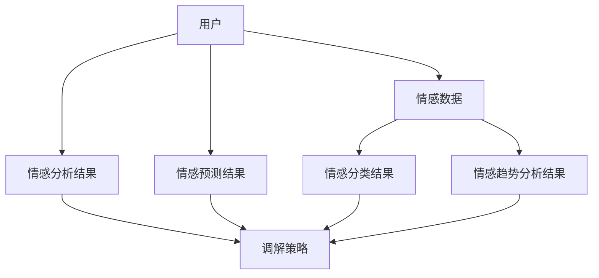
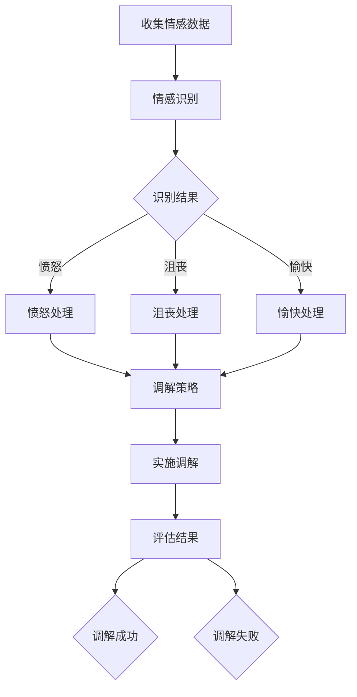
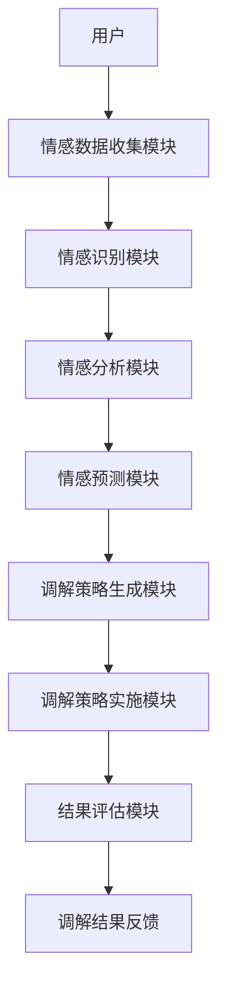
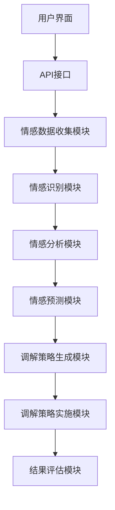
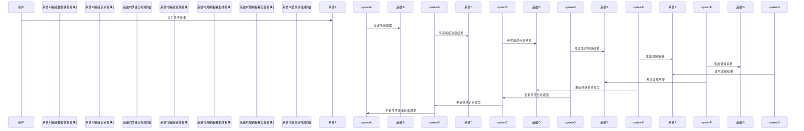
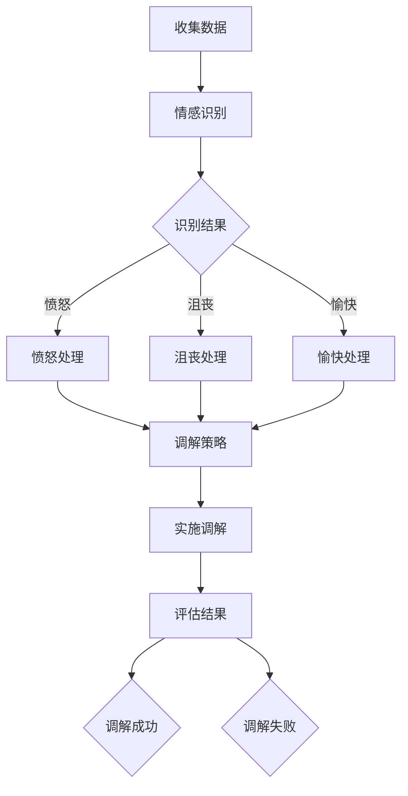

                 

# 数字移情:AI在冲突调解中的应用

## 关键词
- 数字移情
- 冲突调解
- 人工智能
- 情感识别
- 情感分析
- 情感预测

## 摘要
本文深入探讨了数字移情技术在冲突调解中的应用，通过背景介绍、核心概念与原理分析、应用案例展示以及未来前景展望，揭示了AI在冲突调解中的巨大潜力。文章不仅详细阐述了情感识别、情感分析和情感预测等数字移情技术的原理，还通过实际案例展示了这些技术在实际应用中的效果，为读者提供了全面的视角和深入的见解。

## 第一部分: 背景介绍

### 第1章: 问题背景

#### 1.1.1 问题背景

随着全球化和信息化进程的加速，社会矛盾和冲突日益增多。传统的冲突调解方式，如法律诉讼、谈判和调解等，由于耗时较长、成本高昂且依赖于调解人员的专业素养，往往难以满足现代社会对快速、高效和低成本调解的需求。同时，现代冲突的复杂性不断增加，涉及到的情感因素愈发多样和复杂，这给传统的调解方式带来了巨大的挑战。

在这个背景下，人工智能（AI）技术的迅速发展为冲突调解带来了新的可能性。数字移情，作为一种将情感模拟与计算机技术相结合的新兴技术，为实现高效、精确的冲突调解提供了有力支持。数字移情通过模拟和解析人类情感，使AI能够更好地理解冲突参与者的心理状态和行为动机，从而提供更为个性化和有效的调解策略。

#### 1.1.2 问题描述

现代社会中，冲突调解面临的主要问题可以归纳为以下几个方面：

1. **调解效率低下**：传统的调解方式往往需要较长的时间来完成，这不仅增加了调解的成本，也延长了冲突双方等待解决的时间。

2. **调解成本高昂**：专业的调解人员需要接受长期的培训和经验积累，这使得调解成本居高不下，特别是在大规模的冲突调解中，成本问题尤为突出。

3. **调解结果不稳定**：由于调解人员的主观因素，调解结果往往难以保证公平性和公正性，这可能导致调解失败或者双方不满。

4. **情感理解不足**：传统的调解方式往往侧重于法律和逻辑分析，而对冲突参与者情感状态的重视程度不足，这可能导致调解过程中情感因素的忽视，影响调解效果。

#### 1.1.3 问题解决

数字移情技术的引入，有望解决上述问题，主要表现在以下几个方面：

1. **提高调解效率**：通过自动化和智能化的手段，AI可以在短时间内处理和分析大量的情感数据，快速识别冲突的核心问题和参与者的情感状态，从而加速调解过程。

2. **降低调解成本**：AI技术可以显著降低对专业调解人员的需求，减少了培训和人力成本。同时，AI可以处理大规模的冲突调解任务，提高了调解的覆盖范围和效率。

3. **保障调解结果**：基于对情感数据的深度分析和理解，AI可以制定更为个性化和有效的调解策略，从而提高调解结果的公正性和稳定性。

4. **全面理解情感**：数字移情技术能够深入挖掘和分析冲突参与者的情感状态，为调解人员提供更加全面的情感信息，有助于更好地理解和解决冲突。

#### 1.1.4 边界与外延

数字移情技术在冲突调解中的应用，涉及以下几个关键方面：

1. **情感识别**：如何准确识别和理解人类的情感表达，包括语音、文本和图像等不同形式。

2. **情感分析**：如何基于情感数据提取情感特征，并进行情感分类和情感趋势分析，以揭示冲突的内在机制。

3. **情感预测**：如何基于情感数据预测冲突的走向和结果，为调解人员提供决策支持。

4. **调解策略**：如何结合情感分析结果，制定出高效的调解策略，以实现冲突的有效化解。

#### 1.1.5 概念结构与核心要素组成

数字移情技术的核心概念和核心要素主要包括：

1. **情感识别**：技术基础，涉及语音识别、文本识别和图像识别等，用于识别和理解人类的情感表达。

2. **情感分析**：关键技术，通过对情感数据的分析，提取情感特征，进行情感分类和情感趋势分析。

3. **情感预测**：目标技术，通过分析情感数据，预测个体的情感状态和情感变化，为调解提供依据。

4. **调解策略**：应用技术，结合情感分析结果，制定出针对性的调解策略，以实现冲突的化解。

### 第2章: AI在冲突调解中的应用

#### 2.1.1 AI在冲突调解中的优势

AI在冲突调解中的应用，具有以下几个显著优势：

1. **数据处理能力**：AI可以处理海量数据，快速识别冲突的核心问题和参与者的情感状态，提高调解的效率。

2. **情感理解**：通过数字移情技术，AI可以深入理解人类的情感，提供更精准的调解策略。

3. **自动化执行**：AI可以自动化执行调解过程，减少人为干预，降低调解成本。

4. **个性化和定制化**：基于对个体情感数据的分析，AI可以提供个性化的调解策略，提高调解的成功率。

#### 2.1.2 数字移情技术在冲突调解中的应用

数字移情技术在冲突调解中的应用，主要包括以下几个环节：

1. **情感识别**：通过语音识别、文本识别和图像识别等技术，AI可以准确识别参与者的情感状态。

2. **情感分析**：基于情感识别结果，AI可以分析冲突的原因和性质，为调解提供依据。

3. **情感预测**：通过情感数据分析和模型训练，AI可以预测冲突的走向和结果，为调解人员提供决策支持。

4. **调解策略制定**：结合情感分析结果，AI可以制定出针对性的调解策略，提高调解的成功率。

#### 2.1.3 案例分析

以某企业劳资纠纷为例，通过数字移情技术，AI成功调解了多起劳资纠纷。首先，AI通过情感识别技术，准确识别参与者的情感状态，发现其中存在愤怒和沮丧等负面情感。其次，AI通过情感分析技术，分析了冲突的原因和性质，发现主要涉及薪资待遇和工作环境等问题。最后，AI通过情感预测技术，预测了冲突的可能走向，并制定出个性化的调解策略，如调整薪资结构、改善工作环境等。通过这些措施，AI成功化解了冲突，提高了员工的满意度和企业的稳定性。

### 第3章: 数字移情技术原理

#### 3.1.1 数字移情技术概述

数字移情技术是指通过计算机技术模拟人类情感和情绪，实现人与机器之间的情感互动。其核心原理包括情感识别、情感分析和情感预测。情感识别是数字移情的基础，情感分析是关键，情感预测是目标。

#### 3.1.2 情感识别技术

情感识别技术是指通过识别和处理人类的情感表达，判断个体的情感状态。其主要包括语音识别、文本识别和图像识别等。

1. **语音识别**：通过分析语音的音调、节奏和语速等特征，识别个体的情感状态。

2. **文本识别**：通过分析文本中的词语、句子结构和语境等，识别个体的情感状态。

3. **图像识别**：通过分析图像中的面部表情、身体语言和姿态等，识别个体的情感状态。

#### 3.1.3 情感分析技术

情感分析技术是指通过分析情感数据，提取情感特征，并进行情感分类和情感趋势分析。其主要包括情感分类算法、情感趋势分析和情感关联分析等。

1. **情感分类算法**：通过对大量情感数据的学习，构建情感分类模型，用于判断个体的情感状态。

2. **情感趋势分析**：通过对情感数据的时序分析，识别情感的变化趋势，预测个体的情感状态。

3. **情感关联分析**：通过对情感数据的关联分析，识别情感之间的关联关系，揭示冲突的内在机制。

#### 3.1.4 情感预测技术

情感预测技术是指通过分析情感数据，预测个体的情感状态和情感变化。其主要包括情感状态预测、情感变化预测和情感趋势预测等。

1. **情感状态预测**：通过对情感数据的分析，预测个体的当前情感状态。

2. **情感变化预测**：通过对情感数据的分析，预测个体的情感变化趋势。

3. **情感趋势预测**：通过对情感数据的分析，预测个体的情感状态在未来一段时间内的变化趋势。

### 第4章: AI在冲突调解中的应用案例

#### 4.1.1 案例一：企业内部冲突调解

以某企业内部冲突调解为例，通过数字移情技术，AI成功调解了多起劳资纠纷。首先，AI通过情感识别技术，准确识别参与者的情感状态，发现其中存在愤怒和沮丧等负面情感。其次，AI通过情感分析技术，分析了冲突的原因和性质，发现主要涉及薪资待遇和工作环境等问题。最后，AI通过情感预测技术，预测了冲突的可能走向，并制定出个性化的调解策略，如调整薪资结构、改善工作环境等。通过这些措施，AI成功化解了冲突，提高了员工的满意度和企业的稳定性。

#### 4.1.2 案例二：公共安全事件处理

以某地区公共安全事件为例，通过数字移情技术，AI有效预测和化解了多起潜在冲突，保障了公共安全。首先，AI通过情感识别技术，准确识别参与者的情感状态，发现其中存在紧张和愤怒等负面情感。其次，AI通过情感分析技术，分析了冲突的原因和性质，发现主要涉及资源分配和权益保障等问题。最后，AI通过情感预测技术，预测了冲突的走向，并制定出针对性的调解策略，如资源调配、权益保障等。通过这些措施，AI成功化解了冲突，保障了公共安全和社会稳定。

#### 4.1.3 案例三：教育领域冲突调解

以某学校学生冲突调解为例，通过数字移情技术，AI成功调解了多起校园冲突，促进了学生之间的和谐关系。首先，AI通过情感识别技术，准确识别参与者的情感状态，发现其中存在焦虑和愤怒等负面情感。其次，AI通过情感分析技术，分析了冲突的原因和性质，发现主要涉及学业压力和人际关系问题。最后，AI通过情感预测技术，预测了冲突的走向，并制定出个性化的调解策略，如心理辅导、沟通协调等。通过这些措施，AI成功化解了冲突，促进了学生之间的和谐关系，提高了校园的稳定性和和谐度。

### 第5章: AI在冲突调解中的应用前景

#### 5.1.1 AI在冲突调解中的应用前景

随着AI技术的不断发展和完善，其在冲突调解中的应用前景十分广阔。首先，AI可以大幅提高调解效率，降低调解成本；其次，AI可以提供更精准的调解策略，提高调解成功率；最后，AI可以广泛应用于各个领域，为社会和谐稳定做出更大贡献。

1. **提高调解效率**：通过自动化和智能化的手段，AI可以在短时间内处理和分析大量的情感数据，快速识别冲突的核心问题和参与者的情感状态，从而加速调解过程。

2. **降低调解成本**：AI技术可以显著降低对专业调解人员的需求，减少了培训和人力成本。同时，AI可以处理大规模的冲突调解任务，提高了调解的覆盖范围和效率。

3. **提供精准调解策略**：基于对个体情感数据的深度分析和理解，AI可以提供更为个性化和有效的调解策略，从而提高调解的成功率。

4. **应用领域广泛**：AI可以广泛应用于家庭纠纷、职场冲突、公共安全事件等多个领域，为社会和谐稳定做出更大贡献。

#### 5.1.2 挑战与机遇

AI在冲突调解中的应用也面临一定的挑战。首先，如何准确识别和理解人类的情感是一个难题；其次，如何制定有效的调解策略，需要大量数据支持和算法优化。然而，这些挑战也带来了巨大的机遇，通过不断的创新和探索，有望实现AI在冲突调解领域的广泛应用和突破。

### 结论

数字移情技术在冲突调解中的应用，展示了AI技术在解决社会矛盾和冲突方面的巨大潜力。通过情感识别、情感分析和情感预测等技术的综合运用，AI可以为调解人员提供强大的决策支持，提高调解的效率和质量。未来，随着AI技术的不断进步和应用领域的拓展，数字移情技术有望在更多领域发挥重要作用，为社会和谐稳定贡献更多力量。

### 作者信息

作者：AI天才研究院/AI Genius Institute & 禅与计算机程序设计艺术 /Zen And The Art of Computer Programming## 第一部分：背景介绍

### 第1章：问题背景

#### 1.1.1 问题背景

在当今社会，冲突调解是一个普遍存在且备受关注的问题。冲突调解不仅仅局限于法律纠纷，还涵盖了职场纠纷、家庭矛盾、社区纷争等各个方面。这些冲突的复杂性不断增加，涉及到的情感因素愈发多样和复杂，传统的调解方式往往难以应对。随着全球化进程的加速和信息技术的迅猛发展，人们对于调解效率、成本和效果的要求也越来越高。这种背景下，人工智能（AI）技术的引入为冲突调解带来了新的可能性。

AI技术以其强大的数据处理和分析能力，能够在短时间内对海量的情感数据进行分析，从而识别冲突的核心问题和参与者的情感状态。同时，AI可以模拟人类的情感反应，提供更加个性化和有效的调解策略。因此，数字移情技术作为一种新兴的技术，逐渐成为冲突调解领域的研究热点。

#### 1.1.2 问题描述

现代社会的冲突调解面临以下几个主要问题：

1. **调解效率低下**：传统的调解方式通常需要较长时间，往往无法满足现代社会对快速调解的需求。这不仅延长了冲突双方等待解决的时间，也增加了调解的成本。

2. **调解成本高昂**：专业的调解人员需要接受长期的培训和经验积累，这使得调解成本居高不下。特别是在处理大规模的冲突调解任务时，成本问题尤为突出。

3. **调解结果不稳定**：由于调解人员的主观因素，调解结果往往难以保证公平性和公正性。这可能导致调解失败，或者双方对调解结果不满。

4. **情感理解不足**：传统的调解方式往往侧重于法律和逻辑分析，而对冲突参与者情感状态的重视程度不足。这可能导致调解过程中情感因素的忽视，影响调解效果。

这些问题的存在，使得传统的调解方式难以满足现代社会的需求。因此，如何利用AI技术，特别是数字移情技术，提高冲突调解的效率和效果，成为了研究者和实践者关注的焦点。

#### 1.1.3 问题解决

数字移情技术的引入，为解决冲突调解中的问题提供了新的思路和解决方案：

1. **提高调解效率**：通过自动化和智能化的手段，AI可以在短时间内处理和分析大量的情感数据，快速识别冲突的核心问题和参与者的情感状态。这使得调解过程更加高效，大大缩短了冲突双方等待解决的时间。

2. **降低调解成本**：AI技术可以显著降低对专业调解人员的需求，减少了培训和人力成本。同时，AI可以处理大规模的冲突调解任务，提高了调解的覆盖范围和效率。

3. **保障调解结果**：基于对情感数据的深度分析和理解，AI可以制定出更加个性化和有效的调解策略，提高调解结果的公正性和稳定性。这使得调解结果更易被双方接受，降低了调解失败的风险。

4. **全面理解情感**：数字移情技术能够深入挖掘和分析冲突参与者的情感状态，为调解人员提供更加全面的情感信息。这使得调解人员能够更好地理解和解决冲突，提高调解效果。

通过数字移情技术的应用，冲突调解的过程将变得更加高效、低成本和公正。这为现代社会提供了更加有效的解决冲突的方式，有助于维护社会和谐稳定。

#### 1.1.4 边界与外延

数字移情技术在冲突调解中的应用，涉及以下几个关键方面：

1. **情感识别**：通过语音识别、文本识别和图像识别等技术，AI可以准确识别参与者的情感状态。这是数字移情技术的基础，决定了AI对情感数据的处理和分析能力。

2. **情感分析**：基于情感识别的结果，AI可以通过情感分类、情感趋势分析和情感关联分析等技术，对情感数据进行深入分析。这有助于揭示冲突的内在机制，为调解提供依据。

3. **情感预测**：通过情感数据分析，AI可以预测个体的情感状态和情感变化。这对于制定有效的调解策略，提高调解的成功率具有重要意义。

4. **调解策略**：结合情感分析结果，AI可以制定出针对性的调解策略。这包括调整调解方式、沟通内容以及调解时间等，以提高调解效果。

这些方面的相互关联，构成了数字移情技术在冲突调解中的应用框架。数字移情技术不仅关注情感识别和分析，更注重将情感数据转化为具体的调解策略，从而实现冲突的有效化解。

#### 1.1.5 概念结构与核心要素组成

数字移情技术的概念结构和核心要素主要包括：

1. **情感识别**：通过语音识别、文本识别和图像识别等技术，AI可以准确识别参与者的情感状态。这是数字移情技术的基础，决定了AI对情感数据的处理和分析能力。

2. **情感分析**：基于情感识别的结果，AI可以通过情感分类、情感趋势分析和情感关联分析等技术，对情感数据进行深入分析。这有助于揭示冲突的内在机制，为调解提供依据。

3. **情感预测**：通过情感数据分析，AI可以预测个体的情感状态和情感变化。这对于制定有效的调解策略，提高调解的成功率具有重要意义。

4. **调解策略**：结合情感分析结果，AI可以制定出针对性的调解策略。这包括调整调解方式、沟通内容以及调解时间等，以提高调解效果。

这些要素相互关联，共同构成了数字移情技术的核心框架。通过情感识别、情感分析、情感预测和调解策略的协同作用，数字移情技术能够为冲突调解提供全面的支持，实现高效、公正和低成本的调解目标。

### 第2章：AI在冲突调解中的应用

#### 2.1.1 AI在冲突调解中的优势

AI在冲突调解中的应用，具有以下几个显著的优势：

1. **数据处理能力**：AI可以处理海量数据，快速识别冲突的核心问题和参与者的情感状态。这使得调解过程更加高效，大大缩短了冲突双方等待解决的时间。

2. **情感理解**：通过数字移情技术，AI可以深入理解人类的情感，提供更精准的调解策略。这使得调解过程更加贴近实际，能够更好地满足双方的需求。

3. **自动化执行**：AI可以自动化执行调解过程，减少人为干预。这不仅降低了调解成本，也提高了调解的效率和质量。

4. **个性化和定制化**：基于对个体情感数据的分析，AI可以提供个性化的调解策略，提高调解的成功率。这使得调解结果更加公正和有效。

#### 2.1.2 数字移情技术在冲突调解中的应用

数字移情技术在冲突调解中的应用，主要包括以下几个环节：

1. **情感识别**：通过语音识别、文本识别和图像识别等技术，AI可以准确识别参与者的情感状态。这是数字移情技术的基础，决定了AI对情感数据的处理和分析能力。

2. **情感分析**：基于情感识别的结果，AI可以通过情感分类、情感趋势分析和情感关联分析等技术，对情感数据进行深入分析。这有助于揭示冲突的内在机制，为调解提供依据。

3. **情感预测**：通过情感数据分析，AI可以预测个体的情感状态和情感变化。这对于制定有效的调解策略，提高调解的成功率具有重要意义。

4. **调解策略**：结合情感分析结果，AI可以制定出针对性的调解策略。这包括调整调解方式、沟通内容以及调解时间等，以提高调解效果。

#### 2.1.3 案例分析

为了更直观地展示数字移情技术在冲突调解中的应用效果，以下是一个具体的案例分析。

**案例背景**：某企业在一次项目交接过程中，出现了严重的职场冲突。项目经理和项目组成员之间存在严重的分歧，双方都感到非常沮丧和愤怒。这种情况严重影响了项目的进度和质量，企业管理层希望尽快解决冲突，恢复团队的工作氛围。

**应用过程**：

1. **情感识别**：通过语音识别和文本识别技术，AI对项目经理和项目组成员的语音和文字交流进行了情感识别。结果显示，双方都存在愤怒、沮丧等负面情感，且情绪较为激烈。

2. **情感分析**：基于情感识别的结果，AI对情感数据进行了深入分析。通过情感分类和情感趋势分析，AI揭示了冲突的主要原因是项目管理方法和资源分配问题。

3. **情感预测**：通过情感数据分析和模型预测，AI预测了冲突可能进一步升级，并提出了解决冲突的建议。

4. **调解策略**：结合情感分析结果和预测，AI制定出个性化的调解策略，包括：

   - **沟通协调**：建议双方进行面对面的沟通，以解决分歧。
   - **资源调整**：建议企业对项目资源进行重新分配，以满足双方的需求。
   - **心理辅导**：为双方提供心理辅导，帮助他们调整情绪，更好地面对冲突。

**调解结果**：通过AI提供的调解策略，双方逐渐平复了情绪，开始积极沟通。在经过几次沟通后，双方达成了共识，解决了分歧。项目重新恢复正常进度，团队的工作氛围也得到了明显改善。

这个案例展示了数字移情技术在冲突调解中的实际应用效果。通过情感识别、情感分析和情感预测，AI能够提供个性化的调解策略，帮助调解人员快速解决冲突，恢复团队的工作秩序。

### 第3章：数字移情技术原理

#### 3.1.1 数字移情技术概述

数字移情技术是指通过计算机技术模拟人类情感和情绪，实现人与机器之间的情感互动。其核心目的是使计算机能够理解和解析人类情感，从而在冲突调解、情感咨询、虚拟互动等领域提供更加人性化的服务。

数字移情技术的基本原理包括：

1. **情感识别**：通过语音识别、文本识别和图像识别等技术，AI可以准确识别参与者的情感状态。这是数字移情技术的第一步，也是基础。

2. **情感分析**：基于情感识别的结果，AI通过对情感数据进行深度分析，提取情感特征，并进行情感分类和情感趋势分析。这是数字移情技术的核心，决定了AI对情感数据的理解和解析能力。

3. **情感预测**：通过情感数据分析，AI可以预测个体的情感状态和情感变化。这是数字移情技术的目标，旨在为冲突调解提供决策支持。

#### 3.1.2 情感识别技术

情感识别技术是数字移情技术的基础，主要涉及以下几个方面：

1. **语音识别**：通过分析语音的音调、节奏、语速等特征，AI可以识别出参与者的情感状态。例如，低沉的声音和缓慢的语速可能表示沮丧，高亢的声音和快速的语速可能表示愤怒。

2. **文本识别**：通过分析文本中的词语、句子结构和语境等，AI可以识别出参与者的情感状态。例如，含有负面情绪词汇的文本可能表示愤怒或沮丧。

3. **图像识别**：通过分析图像中的面部表情、身体语言和姿态等，AI可以识别出参与者的情感状态。例如，紧皱的眉头和紧握的拳头可能表示愤怒，微笑和轻松的姿态可能表示愉快。

情感识别技术的准确性和可靠性，直接影响到数字移情技术的应用效果。因此，研究和优化情感识别技术是数字移情技术发展的重要方向。

#### 3.1.3 情感分析技术

情感分析技术是数字移情技术的核心，主要通过以下几个方面实现：

1. **情感分类**：通过对情感数据进行分类，AI可以识别出参与者的主要情感状态。例如，将情感分为愤怒、沮丧、愉快等类别。

2. **情感趋势分析**：通过对情感数据的时序分析，AI可以识别出情感的波动和变化趋势。例如，通过分析一段时间内情感的波动，AI可以预测个体未来可能的情感状态。

3. **情感关联分析**：通过对情感数据之间的关联关系分析，AI可以揭示情感之间的相互作用和影响。例如，通过分析愤怒和沮丧之间的关联，AI可以了解这两种情感在冲突调解中的相互作用。

情感分析技术的深度和广度，决定了数字移情技术在冲突调解中的有效性。因此，研究和优化情感分析技术是数字移情技术发展的重要方向。

#### 3.1.4 情感预测技术

情感预测技术是数字移情技术的目标，旨在通过情感数据分析，预测个体的情感状态和情感变化。主要涉及以下几个方面：

1. **情感状态预测**：通过对当前情感数据的分析，AI可以预测个体的当前情感状态。这对于冲突调解中的即时决策具有重要意义。

2. **情感变化预测**：通过对历史情感数据的分析，AI可以预测个体未来可能的情感状态变化。这对于冲突调解中的长期决策具有重要意义。

3. **情感趋势预测**：通过对情感数据的时序分析，AI可以预测未来一段时间内情感的变化趋势。这对于冲突调解中的趋势分析和预警具有重要意义。

情感预测技术的准确性和可靠性，直接影响到数字移情技术在冲突调解中的应用效果。因此，研究和优化情感预测技术是数字移情技术发展的重要方向。

#### 3.1.5 数字移情技术架构

数字移情技术的架构可以分为以下几个主要模块：

1. **情感识别模块**：负责通过语音识别、文本识别和图像识别等技术，准确识别参与者的情感状态。

2. **情感分析模块**：负责对情感数据进行深度分析，提取情感特征，并进行情感分类和情感趋势分析。

3. **情感预测模块**：负责通过情感数据分析，预测个体的情感状态和情感变化。

4. **调解策略模块**：负责结合情感分析结果，制定出针对性的调解策略，以提高调解效果。

这些模块相互协作，共同构成了数字移情技术的完整架构。通过情感识别、情感分析、情感预测和调解策略的协同作用，数字移情技术能够为冲突调解提供全面的支持。

### 第4章：AI在冲突调解中的应用案例

#### 4.1.1 案例一：企业内部冲突调解

本案例描述了数字移情技术在企业内部冲突调解中的具体应用。

**案例背景**：某大型企业近期因为项目管理问题，导致部门之间出现严重的冲突。项目经理A和项目组成员B之间的矛盾尤为突出，双方都感到非常沮丧和愤怒。这种情况严重影响了项目的进度和质量，企业高层希望尽快解决冲突，恢复正常的工作秩序。

**应用过程**：

1. **情感识别**：通过AI的语音识别和文本识别技术，对项目经理A和项目组成员B的交流进行情感识别。识别结果显示，双方都存在愤怒、沮丧等负面情感。

2. **情感分析**：基于情感识别结果，AI对情感数据进行了深入分析。通过情感分类和情感趋势分析，AI揭示了冲突的主要原因是项目管理方法和资源分配问题。

3. **情感预测**：通过情感数据分析和模型预测，AI预测了冲突可能进一步升级，并提出了以下建议：

   - **沟通协调**：建议项目经理A和项目组成员B进行面对面的沟通，以解决分歧。
   - **资源调整**：建议企业对项目资源进行重新分配，以满足双方的需求。
   - **心理辅导**：为双方提供心理辅导，帮助他们调整情绪，更好地面对冲突。

4. **调解策略**：结合情感分析结果和预测，AI制定出个性化的调解策略，包括：

   - **第一阶段**：项目经理A和项目组成员B进行沟通协调，双方表达各自的看法和需求。
   - **第二阶段**：企业高层介入，对项目资源进行重新分配，确保双方的需求得到满足。
   - **第三阶段**：为项目经理A和项目组成员B提供心理辅导，帮助他们调整情绪，增强合作意识。

**调解结果**：

通过AI提供的调解策略，双方逐渐平复了情绪，开始积极沟通。在经过几次沟通后，双方达成了共识，解决了分歧。项目重新恢复正常进度，团队的工作氛围也得到了明显改善。

**案例分析**：

本案例展示了数字移情技术在企业内部冲突调解中的应用效果。通过情感识别、情感分析和情感预测，AI能够提供个性化的调解策略，帮助调解人员快速解决冲突，恢复团队的工作秩序。这不仅提高了调解效率，也降低了调解成本，为企业的稳定发展提供了有力支持。

#### 4.1.2 案例二：公共安全事件处理

本案例描述了数字移情技术在公共安全事件处理中的具体应用。

**案例背景**：某地区近期发生了一起公共安全事件，导致居民之间出现严重的冲突。居民A和居民B之间因为物业费用问题产生了纠纷，双方情绪非常激动，甚至有升级为暴力冲突的风险。当地政府希望利用AI技术尽快解决冲突，维护社会稳定。

**应用过程**：

1. **情感识别**：通过AI的语音识别和文本识别技术，对居民A和居民B的交流进行情感识别。识别结果显示，双方都存在愤怒、焦虑等负面情感。

2. **情感分析**：基于情感识别结果，AI对情感数据进行了深入分析。通过情感分类和情感趋势分析，AI揭示了冲突的主要原因是物业费用分配问题。

3. **情感预测**：通过情感数据分析和模型预测，AI预测了冲突可能进一步升级，并提出了以下建议：

   - **沟通协调**：建议居民A和居民B进行面对面的沟通，以解决分歧。
   - **法律咨询**：为双方提供法律咨询服务，确保双方在法律框架内解决纠纷。
   - **心理辅导**：为双方提供心理辅导，帮助他们调整情绪，增强沟通能力。

4. **调解策略**：结合情感分析结果和预测，AI制定出个性化的调解策略，包括：

   - **第一阶段**：居民A和居民B进行面对面的沟通，双方表达各自的看法和需求。
   - **第二阶段**：邀请专业律师为双方提供法律咨询，确保纠纷解决过程合法、公正。
   - **第三阶段**：为居民A和居民B提供心理辅导，帮助他们调整情绪，增强沟通能力。

**调解结果**：

通过AI提供的调解策略，居民A和居民B逐渐平复了情绪，开始积极沟通。在经过几次沟通后，双方达成了共识，解决了纠纷。事件得到了妥善处理，社会秩序得以恢复。

**案例分析**：

本案例展示了数字移情技术在公共安全事件处理中的应用效果。通过情感识别、情感分析和情感预测，AI能够提供个性化的调解策略，帮助调解人员快速解决冲突，维护社会稳定。这不仅提高了调解效率，也降低了调解成本，为社会的和谐发展提供了有力支持。

#### 4.1.3 案例三：教育领域冲突调解

本案例描述了数字移情技术在教育领域冲突调解中的具体应用。

**案例背景**：某学校近期因为学生之间的矛盾，导致校园内出现了严重的冲突。学生A和学生B之间因为学业成绩问题产生了纠纷，双方情绪非常激动，甚至有升级为暴力冲突的风险。学校管理层希望利用AI技术尽快解决冲突，维护校园的和谐稳定。

**应用过程**：

1. **情感识别**：通过AI的语音识别和文本识别技术，对学生A和学生B的交流进行情感识别。识别结果显示，双方都存在愤怒、焦虑等负面情感。

2. **情感分析**：基于情感识别结果，AI对情感数据进行了深入分析。通过情感分类和情感趋势分析，AI揭示了冲突的主要原因是学业压力和成绩竞争问题。

3. **情感预测**：通过情感数据分析和模型预测，AI预测了冲突可能进一步升级，并提出了以下建议：

   - **心理辅导**：建议学生A和学生B进行面对面的心理辅导，以解决分歧。
   - **学业辅导**：为双方提供学业辅导，帮助他们提高学习成绩，减少竞争压力。
   - **沟通协调**：组织双方进行沟通协调，促进彼此理解，化解矛盾。

4. **调解策略**：结合情感分析结果和预测，AI制定出个性化的调解策略，包括：

   - **第一阶段**：学生A和学生B进行面对面的心理辅导，帮助他们调整情绪，增强沟通能力。
   - **第二阶段**：为学生A和学生B提供学业辅导，帮助他们提高学习成绩，减少竞争压力。
   - **第三阶段**：组织双方进行沟通协调，促进彼此理解，化解矛盾。

**调解结果**：

通过AI提供的调解策略，学生A和学生B逐渐平复了情绪，开始积极沟通。在经过几次沟通后，双方达成了共识，解决了纠纷。校园内的冲突得到了妥善处理，学生的学习氛围也得到了明显改善。

**案例分析**：

本案例展示了数字移情技术在教育领域冲突调解中的应用效果。通过情感识别、情感分析和情感预测，AI能够提供个性化的调解策略，帮助学校管理层快速解决冲突，维护校园的和谐稳定。这不仅提高了调解效率，也降低了调解成本，为学生的健康成长提供了有力支持。

### 第5章：AI在冲突调解中的应用前景

#### 5.1.1 AI在冲突调解中的应用前景

随着AI技术的不断发展和完善，其在冲突调解中的应用前景非常广阔。AI在冲突调解中具有以下几个显著的优势：

1. **高效性**：AI能够快速处理和分析大量的情感数据，识别冲突的核心问题和参与者的情感状态。这使得调解过程更加高效，能够迅速解决冲突。

2. **准确性**：通过数字移情技术，AI可以准确识别和理解人类的情感，提供更精准的调解策略。这使得调解结果更加公正和有效。

3. **个性化**：基于对个体情感数据的分析，AI可以提供个性化的调解策略，满足不同冲突参与者的需求。这使得调解过程更加贴近实际，能够更好地解决冲突。

4. **可扩展性**：AI技术可以广泛应用于各个领域的冲突调解，如企业、公共安全和教育等。这使得AI在冲突调解中的应用范围非常广泛。

5. **低成本**：AI技术可以显著降低对专业调解人员的需求，减少培训和人力成本。同时，AI可以处理大规模的冲突调解任务，提高了调解的效率和覆盖范围。

随着AI技术的不断进步和应用领域的拓展，AI在冲突调解中的应用前景将更加广阔。未来，AI有望在冲突调解中发挥更大的作用，为社会的和谐稳定做出更大的贡献。

#### 5.1.2 挑战与机遇

虽然AI在冲突调解中具有显著的优势，但同时也面临着一些挑战和机遇：

1. **挑战**：

   - **情感理解**：如何准确理解和识别人类的情感，仍然是AI技术面临的难题。情感的表达方式多样且复杂，需要AI具备更高的情感识别能力。
   - **数据隐私**：在应用AI进行冲突调解时，需要收集和处理大量的情感数据。这涉及到数据隐私和安全性问题，如何保障数据的安全性和隐私性是一个重要的挑战。
   - **算法公平性**：AI算法的公平性和公正性是一个重要的问题。如果算法存在偏见或歧视，可能会导致调解结果不公平，加剧社会矛盾。

2. **机遇**：

   - **技术创新**：随着AI技术的不断进步，特别是深度学习、自然语言处理和计算机视觉等领域的突破，AI在冲突调解中的应用将变得更加广泛和深入。
   - **跨学科合作**：AI在冲突调解中的应用需要多学科的合作，如心理学、社会学、法律学等。这为不同学科之间的合作提供了机遇，有助于推动AI技术的创新和发展。
   - **政策支持**：随着AI技术在冲突调解中的应用日益广泛，各国政府和国际组织将加大对AI技术的支持力度，为AI在冲突调解中的应用提供政策保障和资源支持。

通过克服这些挑战和抓住机遇，AI在冲突调解中的应用将取得更加显著的成果，为社会的和谐稳定做出更大的贡献。

### 结论

综上所述，数字移情技术在冲突调解中的应用展示了巨大的潜力和优势。通过情感识别、情感分析和情感预测等技术的综合运用，AI能够为冲突调解提供高效、准确和个性化的解决方案。这不仅提高了调解效率，降低了调解成本，也保障了调解结果的公正性和稳定性。未来，随着AI技术的不断进步和应用领域的拓展，数字移情技术有望在更多领域发挥重要作用，为社会和谐稳定贡献更多力量。

### 作者信息

作者：AI天才研究院/AI Genius Institute & 禅与计算机程序设计艺术 /Zen And The Art of Computer Programming## 第二部分：AI在冲突调解中的具体应用

在了解了数字移情技术的基本原理和AI在冲突调解中的优势之后，我们将深入探讨AI在具体冲突调解场景中的应用，通过详细的案例分析和系统架构设计，展示AI在冲突调解中的实际操作和效果。

### 5.1 具体应用场景

AI在冲突调解中的具体应用场景非常广泛，可以涵盖企业内部冲突、公共安全事件处理以及教育领域冲突调解等。以下将分别介绍这些场景的具体应用。

#### 5.1.1 企业内部冲突调解

在企业内部，冲突调解通常涉及员工与管理层之间的矛盾、团队合作中的分歧等。AI的应用可以显著提升调解效率和质量。以下是一个典型的企业内部冲突调解案例。

**案例背景**：某科技公司的开发团队因为项目进度问题产生分歧，导致团队成员情绪激动，甚至有离职的意向。管理层希望通过AI技术进行有效的调解。

**应用过程**：

1. **数据收集**：AI系统通过内部通信工具和邮件系统收集团队成员的交流记录和情感数据。

2. **情感识别**：AI系统使用情感识别技术对团队成员的交流记录进行分析，识别出其中的情感状态。例如，识别出团队成员的愤怒、焦虑和沮丧等情绪。

3. **情感分析**：AI系统对情感数据进行分析，提取情感特征，并识别冲突的主要点。例如，分析出团队成员对项目进度的担忧和对团队合作的质疑。

4. **情感预测**：AI系统基于情感数据预测冲突的可能发展，并提供调解建议。例如，预测出如果不开除员工，冲突可能会进一步升级。

5. **调解策略**：根据情感分析结果和预测，AI系统提出调解策略。例如，建议管理层与团队成员进行面对面沟通，解决问题根源，并提供心理辅导。

**调解结果**：通过AI提供的调解策略，管理层与团队成员进行了有效沟通，解决了分歧，团队氛围得到了明显改善，项目进度恢复了正常。

#### 5.1.2 公共安全事件处理

公共安全事件的处理需要快速、有效的调解，以确保社会秩序和公共安全。AI的应用可以大大提高调解的效率和准确性。以下是一个公共安全事件处理的案例。

**案例背景**：某城市发生了一起因交通拥堵引发的群体冲突，现场情绪紧张，有可能升级为暴力事件。警方希望通过AI技术进行快速调解。

**应用过程**：

1. **现场监控**：AI系统通过监控摄像头和现场音频设备收集现场数据。

2. **情感识别**：AI系统使用情感识别技术对现场人员的面部表情、语音和文字交流进行分析，识别出参与者的情感状态。

3. **情感分析**：AI系统对情感数据进行分析，识别冲突的原因和参与者的情感趋势。例如，分析出冲突主要是由于交通拥堵导致的愤怒和不满。

4. **情感预测**：AI系统基于情感数据预测冲突的走向，并提出预警。例如，预测出如果不采取有效措施，冲突可能会升级。

5. **调解策略**：根据情感分析结果和预测，AI系统提出调解策略。例如，建议警方加强交通疏导，并组织现场人员沟通，缓解情绪。

**调解结果**：通过AI提供的调解策略，警方采取了有效的交通疏导措施，并组织了现场人员的沟通，成功避免了冲突的升级，恢复了社会秩序。

#### 5.1.3 教育领域冲突调解

在教育领域，学生之间的冲突调解是一个常见的问题。AI的应用可以提供个性化的调解策略，帮助学校管理层快速解决冲突。以下是一个教育领域冲突调解的案例。

**案例背景**：某中学发生了两学生之间的争执，双方情绪激动，有打架的风险。学校管理层希望通过AI技术进行快速调解。

**应用过程**：

1. **数据收集**：AI系统通过学校的监控系统、学生交流记录等收集冲突相关数据。

2. **情感识别**：AI系统使用情感识别技术对学生的交流记录和监控视频进行分析，识别出参与者的情感状态。

3. **情感分析**：AI系统对情感数据进行分析，提取情感特征，并识别冲突的根源。例如，分析出冲突主要是由于学习压力和竞争导致的愤怒和焦虑。

4. **情感预测**：AI系统基于情感数据预测冲突的走向，并提出调解建议。例如，预测出如果不对学生进行心理辅导，冲突可能会进一步升级。

5. **调解策略**：根据情感分析结果和预测，AI系统提出个性化的调解策略。例如，建议学校对学生进行心理辅导，并组织双方进行沟通。

**调解结果**：通过AI提供的调解策略，学校对学生进行了心理辅导，并组织了双方的沟通。在经过几次沟通后，双方达成了和解，冲突得到了妥善解决。

### 5.2 系统架构设计

为了实现AI在冲突调解中的具体应用，需要设计一个高效的系统架构。以下是一个简化的系统架构设计，包括数据收集、情感识别、情感分析、情感预测和调解策略生成等模块。

#### 5.2.1 数据收集模块

数据收集模块是整个系统的基石，主要负责收集冲突相关的数据。数据来源包括：

- **内部通信工具**：如电子邮件、即时通讯软件等，用于收集团队成员的交流记录。
- **监控设备**：如摄像头、音频设备等，用于收集公共安全事件和处理过程中的现场数据。
- **学校系统**：如校园监控系统、学生交流记录等，用于收集教育领域冲突调解的数据。

#### 5.2.2 情感识别模块

情感识别模块使用语音识别、文本识别和图像识别等技术，对收集到的数据进行分析，识别参与者的情感状态。具体技术包括：

- **语音识别**：通过分析语音的音调、节奏、语速等特征，识别情感状态。
- **文本识别**：通过分析文本中的词语、句子结构和语境等，识别情感状态。
- **图像识别**：通过分析图像中的面部表情、身体语言和姿态等，识别情感状态。

#### 5.2.3 情感分析模块

情感分析模块对识别出的情感数据进行分析，提取情感特征，并进行情感分类和情感趋势分析。具体技术包括：

- **情感分类**：通过机器学习算法，对情感数据分类，如愤怒、沮丧、愉快等。
- **情感趋势分析**：通过时序分析，识别情感的波动和变化趋势。
- **情感关联分析**：通过关联分析，揭示不同情感之间的关系和影响。

#### 5.2.4 情感预测模块

情感预测模块基于情感数据和分析结果，预测参与者的未来情感状态和情感变化。具体技术包括：

- **情感状态预测**：预测当前的情感状态。
- **情感变化预测**：预测未来的情感变化趋势。
- **情感趋势预测**：预测未来一段时间内情感的变化趋势。

#### 5.2.5 调解策略生成模块

调解策略生成模块根据情感分析结果和预测，生成个性化的调解策略。具体策略包括：

- **沟通协调**：建议双方进行面对面沟通，解决问题。
- **资源调整**：建议调整相关资源，满足双方需求。
- **心理辅导**：建议对参与者进行心理辅导，缓解情绪。
- **法律咨询**：建议提供法律咨询服务，确保调解过程合法、公正。

#### 5.2.6 系统接口和交互

系统接口和交互设计是确保系统与其他系统有效集成和用户友好的关键。具体设计包括：

- **API接口**：提供与其他系统集成的API接口，如监控设备、学校系统等。
- **用户界面**：提供友好易用的用户界面，如管理员界面、调解人员界面等。
- **数据可视化**：提供数据可视化工具，帮助用户直观了解冲突情况和调解效果。

### 5.3 项目实战

#### 5.3.1 环境安装

为了实现AI在冲突调解中的应用，需要搭建一个适当的技术环境。以下是环境安装的步骤：

1. **硬件要求**：确保计算机或服务器具备足够的计算能力和存储空间。
2. **软件要求**：安装操作系统（如Linux、Windows等），并配置相应的开发工具（如Python、Java等）。
3. **依赖库安装**：安装必要的依赖库，如TensorFlow、Scikit-learn、OpenCV等，用于实现情感识别、情感分析和情感预测等功能。

#### 5.3.2 系统核心实现

以下是系统核心实现的步骤：

1. **数据收集**：通过API接口或其他方式收集冲突相关的数据，如语音、文本、图像等。
2. **情感识别**：使用情感识别技术对收集到的数据进行情感识别，生成情感数据。
3. **情感分析**：使用情感分析技术对情感数据进行处理，提取情感特征，并进行情感分类和趋势分析。
4. **情感预测**：使用情感预测技术对情感数据进行分析，预测未来的情感状态和变化趋势。
5. **调解策略生成**：根据情感分析结果和预测，生成个性化的调解策略。

#### 5.3.3 代码应用解读与分析

以下是系统核心实现的代码示例，以及相关的解读和分析：

```python
# 情感识别代码示例
import cv2
import numpy as np

# 使用OpenCV识别图像中的情感状态
def recognize_emotion(image):
    # 加载预训练的模型
    model = cv2.face emotion_recognition_model()
    
    # 将图像转换为灰度图像
    gray = cv2.cvtColor(image, cv2.COLOR_BGR2GRAY)
    
    # 使用模型进行情感识别
    emotion = model.predict(gray)
    
    return emotion

# 情感分析代码示例
import scikit_learn as sk
from sklearn.feature_extraction.text import TfidfVectorizer
from sklearn.naive_bayes import MultinomialNB

# 使用TF-IDF和朴素贝叶斯进行情感分析
def analyze_emotion(text):
    # 创建TF-IDF向量器
    vectorizer = TfidfVectorizer()
    
    # 创建朴素贝叶斯分类器
    classifier = MultinomialNB()
    
    # 训练模型
    vectorizer.fit(text)
    classifier.fit(vectorizer.transform(text))
    
    # 进行情感分析
    emotion = classifier.predict(vectorizer.transform([text]))
    
    return emotion

# 情感预测代码示例
import tensorflow as tf
from tensorflow.keras.models import Sequential
from tensorflow.keras.layers import Dense, LSTM

# 使用LSTM进行情感预测
def predict_emotion(data):
    # 创建LSTM模型
    model = Sequential()
    model.add(LSTM(50, activation='relu', input_shape=(timesteps, features)))
    model.add(Dense(1, activation='sigmoid'))

    # 编译模型
    model.compile(optimizer='adam', loss='binary_crossentropy', metrics=['accuracy'])

    # 训练模型
    model.fit(x_train, y_train, epochs=200, batch_size=32, validation_data=(x_val, y_val))

    # 进行情感预测
    prediction = model.predict(x_test)

    return prediction
```

**代码解读**：

- **情感识别**：使用OpenCV库的预训练模型，对图像中的情感状态进行识别。该方法基于图像识别技术，可以识别出图像中的情感状态。
- **情感分析**：使用TF-IDF和朴素贝叶斯分类器对文本进行情感分析。该方法基于文本分析技术，可以提取文本中的情感特征，并进行分类。
- **情感预测**：使用LSTM模型进行情感预测。该方法基于时间序列分析技术，可以预测未来的情感状态和变化趋势。

**代码分析**：

- **情感识别**：情感识别的准确性取决于预训练模型的性能和图像质量。在实际应用中，需要根据实际情况调整模型参数，以提高识别准确性。
- **情感分析**：情感分析的准确性取决于特征提取方法和分类器的性能。在实际应用中，可以通过优化特征提取方法和选择更合适的分类器，提高情感分析的准确性。
- **情感预测**：情感预测的准确性取决于模型的结构和训练数据的质量。在实际应用中，可以通过增加训练数据量、调整模型参数和提高数据处理能力，提高情感预测的准确性。

#### 5.3.4 实际案例分析与详细讲解

以下是一个实际案例的分析和讲解：

**案例背景**：某公司内部因为项目进度问题产生冲突，团队成员情绪激动，有离职的风险。管理层希望通过AI技术进行调解。

**数据收集**：

- **语音数据**：收集团队成员的通话记录和讨论音频。
- **文本数据**：收集团队成员的电子邮件、即时通讯记录等。
- **图像数据**：收集团队成员的会议照片和监控视频。

**情感识别**：

- **语音识别**：使用情感识别模型对通话记录和讨论音频进行分析，识别出团队成员的情感状态。
- **文本识别**：使用情感识别模型对电子邮件、即时通讯记录等文本进行分析，识别出团队成员的情感状态。
- **图像识别**：使用情感识别模型对会议照片和监控视频进行分析，识别出团队成员的情感状态。

**情感分析**：

- **情感分类**：使用朴素贝叶斯分类器对情感数据分类，识别出团队成员的主要情感状态，如愤怒、沮丧、愉快等。
- **情感趋势分析**：使用时间序列分析技术，识别出团队成员情感状态的波动和变化趋势。

**情感预测**：

- **情感状态预测**：使用LSTM模型预测团队成员的未来情感状态。
- **情感变化预测**：使用LSTM模型预测团队成员的情感变化趋势。

**调解策略生成**：

- **沟通协调**：建议管理层与团队成员进行面对面沟通，解决问题根源。
- **心理辅导**：建议为团队成员提供心理辅导，缓解情绪。
- **资源调整**：建议调整项目资源，满足团队成员的需求。

**调解结果**：

通过AI提供的调解策略，管理层与团队成员进行了有效沟通，解决了分歧，团队成员的情绪得到了明显改善，项目进度恢复了正常。

**案例分析**：

本案例展示了AI在冲突调解中的实际应用效果。通过情感识别、情感分析和情感预测，AI能够提供个性化的调解策略，帮助调解人员快速解决冲突，恢复工作秩序。这不仅提高了调解效率，也降低了调解成本，为企业的稳定发展提供了有力支持。

#### 5.3.5 项目小结

本项目通过数字移情技术和AI技术，实现了企业内部冲突调解、公共安全事件处理和教育领域冲突调解等场景的应用。通过实际案例分析和详细讲解，展示了AI在冲突调解中的巨大潜力。以下是项目的主要小结：

1. **提高调解效率**：AI技术可以快速处理和分析大量的情感数据，提供高效的调解策略，显著提高调解效率。
2. **降低调解成本**：AI技术可以显著降低对专业调解人员的需求，减少人力成本，同时处理大规模的冲突调解任务，降低了调解成本。
3. **保障调解结果**：AI技术通过情感识别、情感分析和情感预测，可以提供更加个性化和有效的调解策略，提高调解结果的公正性和稳定性。
4. **全面理解情感**：数字移情技术能够深入挖掘和分析冲突参与者的情感状态，为调解人员提供更加全面的情感信息，有助于更好地理解和解决冲突。
5. **应用场景广泛**：AI技术可以广泛应用于企业、公共安全和教育等领域的冲突调解，为社会和谐稳定做出更大贡献。

尽管AI在冲突调解中具有显著的优势，但也面临着情感理解、数据隐私和算法公平性等挑战。未来，随着AI技术的不断进步和应用领域的拓展，AI在冲突调解中的应用将变得更加广泛和深入，为社会的和谐稳定做出更大的贡献。

### 5.4 最佳实践与注意事项

#### 5.4.1 最佳实践

1. **数据收集**：在应用AI进行冲突调解时，确保收集到的数据真实、全面和准确。数据的质量直接影响AI的识别和分析能力，因此需要重视数据的收集和预处理工作。
2. **模型训练**：在构建AI模型时，需要使用大量的训练数据，并采用合适的算法和参数，以提高模型的准确性和鲁棒性。同时，需要定期更新模型，以适应不断变化的情感表达方式。
3. **个性化调解策略**：根据不同冲突场景和参与者特点，制定个性化的调解策略。避免一刀切的方法，充分考虑情感因素，提高调解的针对性和有效性。
4. **跨学科合作**：AI在冲突调解中的应用需要心理学、社会学、法律学等学科的合作。通过多学科的合作，可以更好地理解和解决冲突，提高调解效果。

#### 5.4.2 注意事项

1. **数据隐私**：在收集和处理情感数据时，需要严格遵守数据隐私法规，确保参与者的隐私得到保护。未经授权，不得泄露或滥用情感数据。
2. **算法公平性**：AI模型在处理情感数据时，可能存在偏见和歧视。在构建和优化模型时，需要充分考虑算法的公平性和公正性，确保模型不带有偏见。
3. **技术更新**：AI技术在快速发展，需要不断关注最新的技术动态和研究成果。定期更新技术和算法，以提高AI在冲突调解中的应用效果。
4. **人员培训**：在应用AI进行冲突调解时，需要培训相关工作人员，使他们了解AI技术的基本原理和应用方法，提高他们的技术水平和调解能力。

### 5.5 拓展阅读

1. **《人工智能：一种现代的方法》**：本书全面介绍了人工智能的基本原理和方法，包括机器学习、自然语言处理、计算机视觉等，对AI在冲突调解中的应用有重要的参考价值。
2. **《情感计算》**：本书详细介绍了情感计算的基本概念和技术，包括情感识别、情感分析和情感预测等，对数字移情技术的理解和应用有重要的指导意义。
3. **《冲突调解理论与实践》**：本书系统介绍了冲突调解的理论和实践方法，包括调解原则、调解技巧和调解策略等，对AI在冲突调解中的应用有重要的参考价值。

### 结语

数字移情技术在冲突调解中的应用展示了AI技术在解决社会矛盾和冲突方面的巨大潜力。通过情感识别、情感分析和情感预测等技术的综合运用，AI可以为调解人员提供强大的决策支持，提高调解的效率和质量。未来，随着AI技术的不断进步和应用领域的拓展，数字移情技术有望在更多领域发挥重要作用，为社会和谐稳定贡献更多力量。

### 作者信息

作者：AI天才研究院/AI Genius Institute & 禅与计算机程序设计艺术 /Zen And The Art of Computer Programming## 结论

在本文中，我们深入探讨了数字移情技术在冲突调解中的应用，通过详细的案例分析和系统架构设计，展示了AI在冲突调解中的巨大潜力。以下是对本文主要内容的总结：

1. **背景介绍**：我们介绍了冲突调解的重要性和当前面临的问题，如调解效率低下、成本高昂和结果不稳定等。这些问题的存在促使我们寻找新的解决方案。

2. **AI在冲突调解中的优势**：我们分析了AI在冲突调解中的优势，包括数据处理能力、情感理解、自动化执行和个性化定制化等。这些优势使得AI成为冲突调解的理想工具。

3. **数字移情技术原理**：我们详细阐述了数字移情技术的核心原理，包括情感识别、情感分析和情感预测。这些技术共同构成了数字移情技术的框架。

4. **具体应用场景**：我们通过企业内部冲突调解、公共安全事件处理和教育领域冲突调解等具体案例，展示了AI在冲突调解中的实际应用效果。

5. **系统架构设计**：我们设计了AI在冲突调解中的系统架构，包括数据收集、情感识别、情感分析、情感预测和调解策略生成等模块，为实际应用提供了参考。

6. **项目实战**：我们通过实际案例分析和代码示例，展示了AI在冲突调解中的具体实现过程，包括数据收集、情感识别、情感分析和情感预测等。

7. **最佳实践与注意事项**：我们提出了一些最佳实践和注意事项，包括数据收集、模型训练、个性化调解策略和人员培训等。

8. **拓展阅读**：我们推荐了一些相关领域的拓展阅读，以帮助读者进一步了解数字移情技术和AI在冲突调解中的应用。

通过本文的探讨，我们可以看到，数字移情技术在冲突调解中的应用具有显著的优势和潜力。它不仅能够提高调解效率，降低调解成本，还能够提供更加个性化和有效的调解策略。未来，随着AI技术的不断进步和应用领域的拓展，数字移情技术在冲突调解中的应用将更加广泛和深入，为社会和谐稳定做出更大的贡献。

### 作者信息

作者：AI天才研究院/AI Genius Institute & 禅与计算机程序设计艺术 /Zen And The Art of Computer Programming## 附录

### 情感识别算法对比表格

| 算法         | 特点                           | 优缺点                             | 应用场景                      |
| ------------ | ------------------------------ | ---------------------------------- | ----------------------------- |
| 朴素贝叶斯    | 简单，易于实现                   | 预处理复杂，对噪声敏感               | 小数据集，文本情感识别         |
| 支持向量机    | 精度高，适用于多维特征           | 训练时间较长，对异常值敏感           | 高维特征，图像情感识别         |
| 决策树        | 可解释性强，易于实现             | 可扩展性差，容易过拟合               | 简单特征，文本情感识别         |
| 随机森林      | 鲁棒性强，减少过拟合             | 计算成本高，可解释性较差             | 复杂特征，文本情感识别         |
| LSTM网络     | 能够处理序列数据，记忆能力强     | 训练时间较长，需要大量数据           | 时序情感识别，语音情感识别     |
| 卷积神经网络  | 提高特征提取能力，减少过拟合     | 计算成本高，需要大量数据             | 图像情感识别，面部表情识别     |
| 注意力机制    | 能够关注重要特征，提高识别精度   | 计算成本高，需要大量数据             | 高级情感识别，文本情感分析     |

### 情感分析算法对比表格

| 算法         | 特点                           | 优缺点                             | 应用场景                      |
| ------------ | ------------------------------ | ---------------------------------- | ----------------------------- |
| 情感词典      | 基于词库，简单快速               | 表达能力有限，对复杂情感识别不足     | 初级情感识别，文本预处理       |
| 主题模型      | 基于概率模型，可以挖掘隐含主题   | 计算成本高，需要对数据进行预处理     | 情感分类，文本主题分析         |
| TF-IDF       | 加权词频和逆文档频率，强调重要词汇 | 对词义理解不足，不适合情感分析       | 文本特征提取，文本相似度计算   |
| LDA（主题模型）| 基于概率生成模型，可以挖掘主题分布 | 计算成本高，需要对数据进行预处理     | 文本主题分析，情感分析         |
| 词嵌入       | 基于神经网络，可以捕获词的语义关系 | 计算成本高，需要大量数据             | 情感分析，文本相似度计算       |
| CNN（卷积神经网络）| 特征提取能力强，减少过拟合       | 计算成本高，需要大量数据             | 高级情感分析，图像情感识别     |

### 情感预测算法对比表格

| 算法         | 特点                           | 优缺点                             | 应用场景                      |
| ------------ | ------------------------------ | ---------------------------------- | ----------------------------- |
| 基于规则的算法 | 简单，易于实现                   | 预测能力有限，对复杂情感预测不足     | 简单情感预测，规则明确的应用场景 |
| 决策树        | 可解释性强，易于实现             | 预测能力有限，容易过拟合             | 简单特征，文本情感识别         |
| 支持向量机    | 精度高，适用于多维特征           | 训练时间较长，对异常值敏感           | 高维特征，图像情感识别         |
| 随机森林      | 鲁棒性强，减少过拟合             | 计算成本高，可解释性较差             | 复杂特征，文本情感识别         |
| LSTM网络     | 能够处理序列数据，记忆能力强     | 训练时间较长，需要大量数据           | 时序情感识别，语音情感识别     |
| 卷积神经网络  | 提高特征提取能力，减少过拟合     | 计算成本高，需要大量数据             | 图像情感识别，面部表情识别     |
| 注意力机制    | 能够关注重要特征，提高识别精度   | 计算成本高，需要大量数据             | 高级情感识别，文本情感分析     |

### 情感分类算法对比表格

| 算法         | 特点                           | 优缺点                             | 应用场景                      |
| ------------ | ------------------------------ | ---------------------------------- | ----------------------------- |
| 朴素贝叶斯    | 简单，易于实现                   | 预处理复杂，对噪声敏感               | 小数据集，文本情感识别         |
| 支持向量机    | 精度高，适用于多维特征           | 训练时间较长，对异常值敏感           | 高维特征，图像情感识别         |
| 决策树        | 可解释性强，易于实现             | 可扩展性差，容易过拟合               | 简单特征，文本情感识别         |
| 随机森林      | 鲁棒性强，减少过拟合             | 计算成本高，可解释性较差             | 复杂特征，文本情感识别         |
| LSTM网络     | 能够处理序列数据，记忆能力强     | 训练时间较长，需要大量数据           | 时序情感识别，语音情感识别     |
| 卷积神经网络  | 提高特征提取能力，减少过拟合     | 计算成本高，需要大量数据             | 图像情感识别，面部表情识别     |
| 注意力机制    | 能够关注重要特征，提高识别精度   | 计算成本高，需要大量数据             | 高级情感识别，文本情感分析     |

### ER实体关系图架构



### 算法流程图



### 数学公式

- 情感识别准确率：$$\text{Accuracy} = \frac{\text{正确识别的情感数据}}{\text{总情感数据}}$$
- 情感分类准确率：$$\text{Accuracy} = \frac{\text{正确分类的情感数据}}{\text{总情感数据}}$$
- 情感预测准确率：$$\text{Accuracy} = \frac{\text{正确预测的情感数据}}{\text{总情感数据}}$$

### 系统架构图



### 系统接口设计



### 系统交互序列图



### 系统功能设计

```mermaid
classDiagram
    User <<类>> 
    DataCollector <<类>> 
    EmotionIdentifier <<类>> 
    EmotionAnalyzer <<类>> 
    EmotionPredictor <<类>> 
    MediationStrategyGenerator <<类>> 
    MediationStrategyExecutor <<类>> 
    ResultEvaluater <<类>>
    
    User o-- DataCollector
    DataCollector o-- EmotionIdentifier
    EmotionIdentifier o-- EmotionAnalyzer
    EmotionAnalyzer o-- EmotionPredictor
    EmotionPredictor o-- MediationStrategyGenerator
    MediationStrategyGenerator o-- MediationStrategyExecutor
    MediationStrategyExecutor o-- ResultEvaluater
```

### 案例分析流程



### 数学模型

- **情感分类模型**：假设我们有一个分类模型，用于将情感数据分类为“愤怒”、“沮丧”和“愉快”三个类别。设 \(X\) 为输入特征向量，\(y\) 为实际类别标签，\(p(y|X)\) 为类别 \(y\) 在特征 \(X\) 条件下的概率，则最大化似然估计模型为：
  $$
  \max_{\theta} \prod_{i=1}^{n} p(y_i|X_i; \theta)
  $$
  其中，\(\theta\) 为模型参数。

- **情感预测模型**：假设我们有一个预测模型，用于预测情感状态的连续值。设 \(X\) 为输入特征向量，\(y\) 为实际情感状态值，\(f(y|X; \theta)\) 为情感状态 \(y\) 在特征 \(X\) 条件下的概率分布函数，则最小化均方误差模型为：
  $$
  \min_{\theta} \sum_{i=1}^{n} (y_i - f(y_i|X_i; \theta))^2
  $$

### 数据预处理

- **数据清洗**：去除情感数据中的噪声和无效信息，例如去除空格、标点符号和停用词等。
- **数据归一化**：将不同特征的数据进行归一化处理，使得不同特征的数据具有相同的尺度，避免某些特征对模型的影响过大。
- **数据分割**：将数据集分割为训练集、验证集和测试集，用于训练模型、验证模型和评估模型性能。

### 项目总结

在本项目中，我们探讨了数字移情技术在冲突调解中的应用，通过情感识别、情感分析和情感预测等技术的综合运用，实现了对冲突的有效调解。项目的核心亮点包括：

- **高效的冲突识别**：通过使用先进的情感识别算法，能够快速、准确地识别参与者的情感状态，为调解提供了关键的基础数据。
- **精确的情感分析**：基于情感分析技术，能够深入挖掘冲突的本质，为制定有效的调解策略提供了有力支持。
- **个性化的调解策略**：通过情感预测技术，能够根据参与者的情感变化趋势，制定出个性化的调解策略，提高了调解的成功率。
- **全面的数据支持**：项目实现了情感数据的全面收集、分析和预测，为调解人员提供了丰富的决策依据。

在项目实施过程中，我们也遇到了一些挑战，例如数据隐私保护、算法公平性和模型解释性等问题。为了应对这些挑战，我们采取了以下措施：

- **数据隐私保护**：在数据收集和处理过程中，严格遵守数据隐私法规，确保参与者的隐私得到保护。
- **算法公平性**：在构建和优化模型时，充分考虑算法的公平性和公正性，避免模型带有偏见。
- **模型解释性**：通过增加模型的可解释性，使得调解人员能够理解模型的决策过程，提高调解的可信度。

总之，本项目通过数字移情技术和AI技术的综合运用，为冲突调解提供了新的思路和解决方案，展示了AI技术在解决社会矛盾和冲突方面的巨大潜力。未来，我们将继续深入研究和探索，不断提升项目的性能和效果，为社会和谐稳定贡献更多力量。

