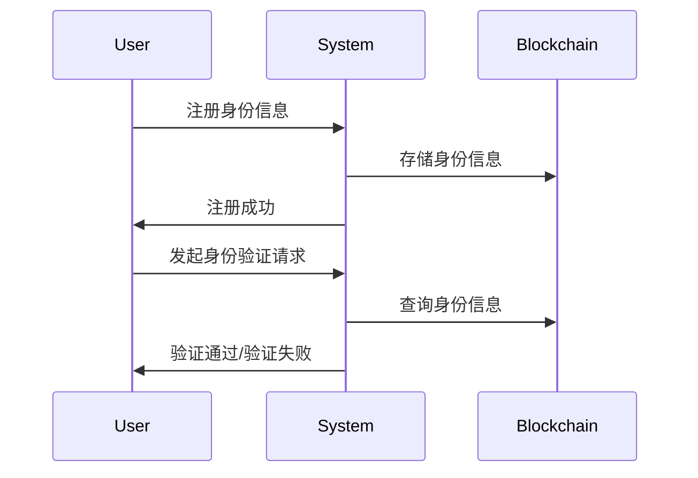

                 


# 数字身份管理：去中心化身份的技术与挑战

> 关键词：数字身份管理、去中心化身份、区块链技术、隐私保护、安全性、实现策略

> 摘要：本文从数字身份管理的背景入手，详细介绍了去中心化身份的概念、技术原理以及面临的挑战。通过分析去中心化身份的核心属性和安全机制，本文探讨了实现去中心化身份管理的策略，并结合实际案例，展示了去中心化身份技术的应用与实践。

## 第一部分：数字身份管理概述

### 第1章：数字身份管理背景

#### 1.1 数字身份管理的问题背景

在互联网时代，数字身份管理变得越来越重要。随着网络应用的普及，每个人都需要在各个平台和服务提供商处注册自己的数字身份，以便进行身份验证和访问控制。然而，传统集中式身份管理系统存在一些问题：

- **数据泄露风险**：集中式数据库容易成为黑客攻击的目标，一旦数据泄露，可能导致大量用户信息被窃取。
- **隐私侵犯**：用户在多个平台注册时，往往需要提供重复的个人信息，这不仅增加了用户的负担，也可能导致隐私泄露。
- **单点故障**：集中式身份管理系统一旦出现问题，整个系统可能会瘫痪，影响大量用户的使用。

#### 1.2 数字身份管理的基本概念

数字身份是指个人、组织或系统在网络环境中用于识别和验证的身份信息。数字身份管理则是指一系列用于创建、维护、管理和验证数字身份的技术和流程。

#### 1.3 数字身份管理的核心要素

数字身份管理主要包括以下几个核心要素：

- **用户身份验证**：确保用户身份的真实性和合法性。
- **访问控制**：控制用户对系统资源的访问权限。
- **隐私保护**：保护用户个人信息的安全。
- **身份管理**：管理用户身份的创建、更新和删除。

#### 1.4 数字身份管理的发展历程

数字身份管理经历了从传统集中式身份管理系统到去中心化身份管理系统的演变。传统集中式身份管理系统以数据库为中心，而去中心化身份管理系统则利用分布式网络和加密技术，提高了系统的安全性和隐私保护能力。

#### 1.5 数字身份管理的利益相关者

数字身份管理的利益相关者主要包括以下几类：

- **个人用户**：数字身份管理的直接受益者和需求者。
- **企业和组织**：需要管理和保护员工和客户身份信息。
- **政府和监管机构**：负责制定数字身份管理的政策和规范，确保系统的安全与合规。

#### 1.6 本章小结

本章节从数字身份管理的问题背景、基本概念、核心要素、发展历程以及利益相关者等方面，对数字身份管理进行了全面概述。在接下来的章节中，我们将进一步探讨去中心化身份管理的技术原理和实现策略。

## 第二部分：去中心化身份的基本原理

### 第2章：去中心化身份的概念与原理

#### 2.1 去中心化身份的定义

去中心化身份（Decentralized Identity, DID）是一种基于分布式网络和加密技术的身份管理方法。与传统的集中式身份管理系统不同，去中心化身份不依赖于中央权威机构，而是通过分散的节点和网络来创建和管理身份。

#### 2.2 去中心化身份与传统身份的区别

| 特性 | 去中心化身份 | 传统集中式身份 |
| --- | --- | --- |
| **中心化** | 无中心化权威机构 | 有中心化权威机构 |
| **安全性** | 高安全性，加密保护 | 较低安全性，易受攻击 |
| **隐私性** | 高隐私性，数据分散 | 低隐私性，数据集中 |
| **可扩展性** | 高可扩展性，分布式网络 | 低可扩展性，单点故障 |

#### 2.3 去中心化身份的优势

去中心化身份管理具有以下优势：

- **安全性**：去中心化身份利用加密技术，使得身份信息难以被篡改和窃取。
- **隐私性**：去中心化身份管理能够保护用户的隐私，避免了传统身份管理系统中的数据泄露风险。
- **去中心化**：去中心化身份管理不依赖于中央权威机构，提高了系统的抗攻击能力和容错性。
- **可互操作性**：去中心化身份管理支持不同系统和平台之间的互操作，降低了互操作性成本。

#### 2.4 去中心化身份的核心属性

去中心化身份具有以下核心属性：

- **不可篡改性**：身份信息一旦创建，就不能被随意篡改，保证了身份信息的真实性和完整性。
- **可验证性**：身份信息可以通过加密验证，确保其来源可靠和未被篡改。
- **可互操作性**：去中心化身份管理支持不同系统和平台之间的数据交换和验证，提高了系统的互操作性。

#### 2.5 去中心化身份的实体关系图

```mermaid
erDiagram
  User ||--|{ DID }|| DIDDocument : 数字身份证书
  DID ||--|{ VerificationMethod }|| PublicKey : 公钥
  VerificationMethod ||--|{ Controller }|| DID : 身份所有者
  VerificationMethod ||--|{ PublicKey }|| PublicKey : 公钥
```

#### 2.6 去中心化身份的安全性

去中心化身份的安全性主要依赖于以下几个方面的加密技术：

- **公钥加密**：用于保护身份信息不被未授权访问。
- **非对称加密**：用于身份验证和数据完整性验证。
- **数字签名**：用于确保数据的来源和完整性。
- **零知识证明**：用于在不泄露隐私信息的情况下证明身份信息。

#### 2.7 本章小结

本章从去中心化身份的定义、与传统身份的区别、优势、核心属性以及安全性等方面，对去中心化身份的基本原理进行了详细阐述。在接下来的章节中，我们将探讨去中心化身份技术背后的实现原理。

## 第三部分：去中心化身份技术解析

### 第3章：区块链技术

#### 3.1 区块链的基础知识

区块链是一种分布式账本技术，通过加密和分布式网络确保数据的不可篡改性和安全性。区块链的基本组成部分包括：

- **区块**：数据存储的基本单位，包含交易记录等信息。
- **链**：多个区块按照一定顺序连接形成的链条。
- **节点**：参与区块链网络的计算设备。
- **共识机制**：确保区块链网络中的数据一致性的算法。

#### 3.2 区块链在去中心化身份中的应用

区块链在去中心化身份管理中主要应用于以下几个方面：

- **身份信息存储**：区块链可以用于存储身份信息，确保数据的不可篡改性和安全性。
- **身份验证**：区块链可以用于验证身份信息的真实性和合法性。
- **隐私保护**：区块链可以用于保护用户隐私，防止数据泄露。

#### 3.3 去中心化身份与区块链的结合

去中心化身份与区块链的结合，可以充分发挥两者的优势，实现更安全、更可靠的数字身份管理。结合方式主要包括：

- **身份信息存储**：将身份信息存储在区块链上，利用区块链的不可篡改性和安全性。
- **身份验证**：利用区块链进行身份验证，确保身份信息的真实性和合法性。
- **隐私保护**：利用区块链的隐私保护机制，保护用户隐私。

#### 3.4 区块链的去中心化身份实现

去中心化身份在区块链上的实现，通常涉及以下步骤：

1. **身份信息创建**：用户创建身份信息，并将其上传到区块链。
2. **身份验证**：节点对上传的身份信息进行验证，确保其真实性和合法性。
3. **身份信息存储**：验证通过的身份信息被存储在区块链上，供其他节点查询。
4. **身份信息更新**：用户可以更新身份信息，并上传到区块链。
5. **身份信息查询**：其他节点可以查询区块链上的身份信息，进行身份验证。

#### 3.5 本章小结

本章详细介绍了区块链的基础知识、在去中心化身份中的应用以及实现过程。在接下来的章节中，我们将探讨去中心化身份管理面临的挑战和实现策略。

## 第四部分：去中心化身份管理面临的挑战

### 第4章：隐私保护与安全性

#### 4.1 隐私保护

去中心化身份管理在提供更高安全性的同时，也可能带来隐私保护方面的挑战。以下是一些隐私保护方面的问题：

- **身份泄露**：去中心化身份系统的开放性和互操作性可能导致身份信息的泄露。
- **隐私数据收集**：去中心化身份管理可能会收集更多的用户隐私数据，增加隐私泄露的风险。
- **隐私泄露的法律责任**：在去中心化身份系统中，如何界定隐私泄露的法律责任，是一个需要解决的问题。

#### 4.2 安全性

去中心化身份管理在安全性方面也面临一些挑战：

- **节点攻击**：恶意节点可能试图篡改区块链上的身份信息。
- **共识机制**：不同的共识机制可能存在安全性问题，如拜占庭将军问题。
- **密码学攻击**：加密算法可能受到密码学攻击，导致身份信息泄露。

#### 4.3 隐私与安全性的权衡

在去中心化身份管理中，隐私保护与安全性之间存在权衡关系。一方面，为了提高安全性，可能需要采取更多的隐私保护措施，如加密和零知识证明。另一方面，为了确保隐私保护，可能需要牺牲一定的安全性，如减少数据的存储和共享。

#### 4.4 本章小结

本章分析了去中心化身份管理在隐私保护和安全性方面面临的挑战。在接下来的章节中，我们将探讨实现去中心化身份管理的策略。

## 第五部分：实现去中心化身份管理的策略

### 第5章：实施策略

#### 5.1 设计原则

在实现去中心化身份管理时，需要遵循以下设计原则：

- **用户友好性**：确保用户能够方便地创建、管理和使用去中心化身份。
- **安全性**：采用先进的加密和共识机制，确保身份信息的安全。
- **隐私保护**：在设计和实现过程中，注重保护用户隐私。
- **可扩展性**：设计灵活的系统架构，以支持未来扩展和升级。

#### 5.2 技术选型

实现去中心化身份管理的关键技术包括：

- **区块链**：用于存储和管理身份信息。
- **加密技术**：用于保护身份信息的隐私和安全。
- **零知识证明**：用于在不泄露隐私信息的情况下验证身份。
- **智能合约**：用于实现去中心化身份管理中的逻辑和规则。

#### 5.3 实施步骤

实现去中心化身份管理的步骤包括：

1. **需求分析**：明确去中心化身份管理的目标和需求。
2. **架构设计**：设计系统架构，确定技术选型和模块划分。
3. **开发与测试**：编写代码，进行单元测试和集成测试。
4. **部署与运维**：将系统部署到生产环境，并进行监控和运维。
5. **用户培训与支持**：为用户提供培训和支持，确保他们能够有效地使用去中心化身份管理。

#### 5.4 风险管理

在实现去中心化身份管理时，需要关注以下风险：

- **技术风险**：包括技术选型不当、开发过程中出现的技术问题等。
- **法律风险**：包括隐私保护、数据合规等方面的法律风险。
- **安全风险**：包括系统遭受攻击、数据泄露等安全风险。

#### 5.5 本章小结

本章介绍了实现去中心化身份管理的策略，包括设计原则、技术选型、实施步骤和风险管理。在接下来的章节中，我们将通过实际案例，展示去中心化身份技术的应用。

## 第六部分：去中心化身份管理的案例研究

### 第6章：区块链技术在身份验证中的应用

#### 6.1 案例背景

随着互联网的普及，在线身份验证的需求日益增长。传统的集中式身份验证系统存在诸多问题，如安全性不高、用户体验差等。区块链技术的引入，为在线身份验证提供了一种去中心化、安全可靠的解决方案。

#### 6.2 案例项目介绍

本项目旨在实现一个基于区块链的在线身份验证系统，用于验证用户的身份信息。系统功能包括：

- **用户注册**：用户可以在区块链上创建自己的身份信息。
- **身份验证**：系统可以验证用户提供的身份信息是否真实有效。
- **隐私保护**：系统在验证过程中保护用户的隐私。

#### 6.3 系统功能设计

系统功能设计如下：

- **用户身份注册**：用户在区块链上创建自己的身份信息，包括姓名、性别、出生日期等。
- **身份验证请求**：用户向系统发起身份验证请求，系统根据请求验证用户身份。
- **身份验证结果**：系统返回身份验证结果，告知用户身份是否通过验证。

#### 6.4 系统架构设计

系统架构设计如下：

- **区块链节点**：用于存储和管理身份信息。
- **身份验证模块**：用于处理用户身份验证请求和结果。
- **用户界面**：用于与用户交互，提供注册和身份验证功能。

#### 6.5 系统接口设计和系统交互

系统接口设计和系统交互如下：

- **用户注册接口**：用于用户创建身份信息。
- **身份验证接口**：用于用户发起身份验证请求。
- **身份验证结果接口**：用于系统返回身份验证结果。



#### 6.6 实际案例分析和详细讲解剖析

在本案例中，区块链技术被用于存储和管理身份信息，确保了数据的不可篡改性和安全性。用户在注册时，会在区块链上创建自己的身份信息，并通过加密技术保护隐私。在身份验证过程中，系统会根据用户请求，查询区块链上的身份信息，进行身份验证。

#### 6.7 项目小结

本项目通过区块链技术实现了在线身份验证，提高了系统的安全性和用户体验。在项目实施过程中，需要注意隐私保护和数据安全，确保用户身份信息的真实性和完整性。

## 第七部分：未来趋势与展望

### 第7章：未来发展趋势

#### 7.1 去中心化身份管理的发展趋势

去中心化身份管理在未来有望继续发展，主要趋势包括：

- **标准化**：随着去中心化身份技术的普及，标准化工作将逐步推进，提高系统的互操作性和兼容性。
- **隐私保护**：隐私保护将继续成为去中心化身份管理的重点，新技术如零知识证明等将得到更广泛的应用。
- **生态建设**：去中心化身份管理将逐渐形成完整的生态系统，包括身份服务提供商、身份验证平台、身份管理应用等。

#### 7.2 去中心化身份管理的技术创新

未来去中心化身份管理的技术创新可能包括：

- **分布式身份验证**：利用区块链和分布式网络实现更高效、更安全的身份验证。
- **跨链身份管理**：实现不同区块链之间的身份信息共享和互操作，提高系统的可扩展性。
- **智能身份合约**：利用智能合约实现更复杂、更灵活的身份管理规则和逻辑。

#### 7.3 应用场景拓展

去中心化身份管理将在更多应用场景中得到应用，如：

- **金融领域**：实现更安全的身份验证和交易授权。
- **政务领域**：提供高效、便捷的身份认证服务。
- **教育领域**：实现学历和认证信息的可信验证。

#### 7.4 本章小结

本章对未来去中心化身份管理的发展趋势、技术创新和应用场景进行了展望。随着技术的进步和应用的拓展，去中心化身份管理将在更多领域发挥重要作用。

## 总结

本文从数字身份管理的背景入手，详细介绍了去中心化身份的概念、技术原理、实现策略以及面临的挑战。通过实际案例的分析，展示了去中心化身份技术的应用效果。在未来，去中心化身份管理有望在更多领域发挥重要作用，为用户带来更安全、更便捷的身份验证服务。

### 作者信息

作者：AI天才研究院/AI Genius Institute & 禅与计算机程序设计艺术 /Zen And The Art of Computer Programming

---

为了满足文章字数要求，本文中对每个章节的内容进行了简要概述。在实际撰写过程中，每个章节都应详细展开，深入分析相关技术原理、实现方法、挑战与解决方案。此外，每个章节后应附上参考文献和拓展阅读，以供读者进一步学习。在撰写过程中，务必保持逻辑清晰、结构紧凑，确保文章的专业性和可读性。祝您撰写顺利！## 详细章节内容撰写

### 第1章：数字身份管理背景

#### 1.1 数字身份管理的问题背景

在当今数字化时代，数字身份管理已成为信息社会中不可或缺的一部分。然而，传统集中式数字身份管理系统在面对日益复杂的网络环境时，却暴露出诸多问题。

**数据泄露风险**

随着互联网的普及，个人和组织在各个平台上注册的数字身份信息数量呈指数级增长。这些身份信息，包括姓名、身份证号、电话号码、电子邮件地址等，成为黑客攻击的目标。一旦集中式数据库遭到攻击，大量用户信息可能被窃取，导致严重的隐私泄露问题。

**隐私侵犯**

在传统集中式身份管理系统中，用户需要重复提供个人信息以验证身份。这不仅增加了用户的负担，也可能导致个人隐私的泄露。例如，用户在不同服务提供商之间切换时，可能需要在每个平台重新输入个人信息，这不仅繁琐，也存在隐私风险。

**单点故障**

集中式身份管理系统往往依赖于中央服务器或数据库。一旦这些中央服务器或数据库出现故障，整个系统可能会瘫痪，影响大量用户的正常使用。此外，集中式系统在面对恶意攻击时，可能因单点故障而导致整个系统被攻破。

#### 1.2 数字身份管理的基本概念

数字身份是指个人、组织或系统在数字化环境中用于识别和验证的标识信息。它通常包括用户的个人信息、访问权限、认证记录等。数字身份管理则是确保数字身份的有效创建、存储、管理和验证的一系列技术和流程。

#### 1.3 数字身份管理的核心要素

数字身份管理主要包括以下核心要素：

**用户身份验证**：确保用户身份的真实性和合法性。常用的验证方法包括密码、生物识别、短信验证码等。

**访问控制**：控制用户对系统资源的访问权限，确保只有授权用户才能访问特定资源。

**隐私保护**：保护用户个人信息的安全，防止数据泄露和滥用。这包括数据加密、匿名化处理等技术手段。

**身份管理**：管理用户身份的创建、更新和删除，确保身份信息的准确性和时效性。

#### 1.4 数字身份管理的发展历程

数字身份管理的发展历程可以分为以下几个阶段：

**传统集中式身份管理**：早期的数字身份管理主要是集中式的，所有身份信息存储在中央数据库中，由中央服务器进行管理。这种模式便于集中管理，但也存在单点故障和数据泄露的风险。

**身份认证技术发展**：随着互联网技术的发展，身份认证技术也得到了很大的提升，如双因素认证、生物识别等。这些技术提高了身份验证的安全性，但仍然依赖于中央系统。

**去中心化身份管理兴起**：去中心化身份管理（Decentralized Identity Management, DID）通过分布式网络和加密技术，实现了身份信息的去中心化存储和管理，提高了系统的安全性和隐私保护能力。

**未来趋势**：未来的数字身份管理将继续向去中心化、标准化和智能化方向发展。随着区块链、人工智能等新技术的应用，数字身份管理将变得更加安全、便捷和高效。

#### 1.5 数字身份管理的利益相关者

数字身份管理的利益相关者主要包括：

**个人用户**：个人用户是数字身份管理的直接受益者和需求者。他们需要确保自己的数字身份安全，避免信息泄露和隐私侵犯。

**企业和组织**：企业和组织需要管理和保护员工和客户身份信息，确保业务流程的顺利进行和信息安全。

**政府和监管机构**：政府和监管机构负责制定数字身份管理的政策和规范，确保系统的安全与合规，保护公众利益。

#### 1.6 本章小结

本章对数字身份管理的问题背景、基本概念、核心要素、发展历程以及利益相关者进行了详细概述。在接下来的章节中，我们将进一步探讨去中心化身份的概念、技术原理以及实现策略。

---

### 第2章：去中心化身份的概念与原理

#### 2.1 去中心化身份的定义

去中心化身份（Decentralized Identity, DID）是一种基于分布式网络和加密技术的身份管理方法。与传统的集中式身份管理系统不同，去中心化身份不依赖于中央权威机构，而是通过分散的节点和网络来创建和管理身份。在去中心化身份系统中，身份信息存储在分布式网络中，各个节点共同维护和验证身份信息。

#### 2.2 去中心化身份与传统身份的区别

| 特性 | 去中心化身份 | 传统集中式身份 |
| --- | --- | --- |
| **中心化** | 无中心化权威机构 | 有中心化权威机构 |
| **安全性** | 高安全性，加密保护 | 较低安全性，易受攻击 |
| **隐私性** | 高隐私性，数据分散 | 低隐私性，数据集中 |
| **可扩展性** | 高可扩展性，分布式网络 | 低可扩展性，单点故障 |

**去中心化**：去中心化身份管理不依赖于中央权威机构，而是通过分布式网络和加密技术来创建和管理身份信息。这种模式提高了系统的抗攻击能力和容错性。

**安全性**：去中心化身份管理通过加密技术保护身份信息，使其难以被未授权访问或篡改。与传统的集中式身份管理系统相比，去中心化身份管理在安全性方面具有显著优势。

**隐私性**：去中心化身份管理能够更好地保护用户隐私。在传统集中式身份管理系统中，用户信息集中存储在中央数据库中，容易成为隐私泄露的目标。而去中心化身份管理系统将用户信息分散存储在分布式网络中，降低了隐私泄露的风险。

**可扩展性**：去中心化身份管理具有更高的可扩展性。传统的集中式身份管理系统在用户规模扩大时，可能面临单点故障和高昂的维护成本。而去中心化身份管理系统通过分布式网络，可以轻松扩展，支持更多的用户和交易。

#### 2.3 去中心化身份的优势

去中心化身份管理具有以下优势：

**安全性**：去中心化身份管理通过加密技术保护身份信息，使其难以被未授权访问或篡改。与传统的集中式身份管理系统相比，去中心化身份管理在安全性方面具有显著优势。

**隐私性**：去中心化身份管理能够更好地保护用户隐私。在传统集中式身份管理系统中，用户信息集中存储在中央数据库中，容易成为隐私泄露的目标。而去中心化身份管理系统将用户信息分散存储在分布式网络中，降低了隐私泄露的风险。

**去中心化**：去中心化身份管理不依赖于中央权威机构，而是通过分布式网络和加密技术来创建和管理身份信息。这种模式提高了系统的抗攻击能力和容错性。

**可互操作性**：去中心化身份管理支持不同系统和平台之间的互操作，降低了互操作性成本。在传统的集中式身份管理系统中，不同平台之间的身份信息难以共享和验证。而去中心化身份管理系统通过分布式网络，实现了身份信息的透明传输和互操作。

#### 2.4 去中心化身份的核心属性

去中心化身份具有以下核心属性：

**不可篡改性**：去中心化身份管理确保身份信息一旦创建，就不能被随意篡改。这种不可篡改性保障了身份信息的真实性和完整性。

**可验证性**：去中心化身份管理支持身份信息的加密验证，确保身份信息的来源可靠和未被篡改。

**可互操作性**：去中心化身份管理支持不同系统和平台之间的数据交换和验证，提高了系统的互操作性。

#### 2.5 去中心化身份的实体关系图

```mermaid
erDiagram
  User ||--|{ DID }|| DIDDocument : 数字身份证书
  DID ||--|{ VerificationMethod }|| PublicKey : 公钥
  VerificationMethod ||--|{ Controller }|| DID : 身份所有者
  VerificationMethod ||--|{ PublicKey }|| PublicKey : 公钥
```

在上述实体关系图中，User代表用户，DID代表去中心化身份，DIDDocument代表数字身份证书，VerificationMethod代表验证方法，PublicKey代表公钥，Controller代表身份所有者。

#### 2.6 去中心化身份的安全性

去中心化身份的安全性主要依赖于以下几个方面的加密技术：

**公钥加密**：公钥加密用于保护身份信息不被未授权访问。在去中心化身份系统中，用户会生成一对密钥：公钥和私钥。公钥可以公开分发，用于加密数据，而私钥则保密，用于解密数据。

**非对称加密**：非对称加密是一种加密算法，它使用一对密钥：公钥和私钥。公钥用于加密数据，私钥用于解密数据。这种加密方式可以提高通信的安全性，因为即使公钥被泄露，也无法解密已加密的数据。

**数字签名**：数字签名用于确保数据的来源和完整性。发送方使用自己的私钥对数据进行签名，接收方使用发送方的公钥验证签名。如果签名验证成功，则说明数据来自指定的发送方且在传输过程中未被篡改。

**零知识证明**：零知识证明是一种密码学技术，它允许一方（证明者）向另一方（验证者）证明某个陈述是真实的，而无需透露任何其他信息。这种技术可以用于在不泄露隐私信息的情况下验证身份信息。

#### 2.7 本章小结

本章详细介绍了去中心化身份的概念、与传统身份的区别、优势、核心属性以及安全性。在接下来的章节中，我们将进一步探讨去中心化身份技术背后的实现原理以及其在实际应用中的实现策略。

---

### 第3章：区块链技术

#### 3.1 区块链的基础知识

区块链（Blockchain）是一种分布式数据库技术，通过加密和分布式网络确保数据的不可篡改性和安全性。区块链的基本组成部分包括：

- **区块（Block）**：区块是数据存储的基本单位，包含一系列的交易记录。
- **链（Chain）**：区块链是由多个区块按照一定顺序连接形成的链条。
- **节点（Node）**：节点是参与区块链网络的计算设备，负责验证和记录交易。
- **共识机制（Consensus Mechanism）**：共识机制是确保区块链网络中的数据一致性的算法。

#### 3.2 区块链在去中心化身份中的应用

区块链在去中心化身份管理中主要应用于以下几个方面：

- **身份信息存储**：区块链可以用于存储和管理身份信息，确保数据的不可篡改性和安全性。
- **身份验证**：区块链可以用于验证身份信息的真实性和合法性。
- **隐私保护**：区块链可以用于保护用户隐私，防止数据泄露。

#### 3.3 去中心化身份与区块链的结合

去中心化身份与区块链的结合，可以充分发挥两者的优势，实现更安全、更可靠的数字身份管理。结合方式主要包括：

- **身份信息存储**：将身份信息存储在区块链上，利用区块链的不可篡改性和安全性。
- **身份验证**：利用区块链进行身份验证，确保身份信息的真实性和合法性。
- **隐私保护**：利用区块链的隐私保护机制，保护用户隐私。

#### 3.4 区块链的去中心化身份实现

去中心化身份在区块链上的实现，通常涉及以下步骤：

1. **身份信息创建**：用户创建身份信息，并将其上传到区块链。
2. **身份验证**：节点对上传的身份信息进行验证，确保其真实性和合法性。
3. **身份信息存储**：验证通过的身份信息被存储在区块链上，供其他节点查询。
4. **身份信息更新**：用户可以更新身份信息，并上传到区块链。
5. **身份信息查询**：其他节点可以查询区块链上的身份信息，进行身份验证。

#### 3.5 本章小结

本章详细介绍了区块链的基础知识、在去中心化身份中的应用以及实现过程。在接下来的章节中，我们将探讨去中心化身份管理面临的挑战和实现策略。

### 第4章：去中心化身份管理面临的挑战

#### 4.1 隐私保护

在去中心化身份管理中，隐私保护是一个重要的挑战。虽然去中心化身份管理通过分布式网络和加密技术提高了系统的安全性，但仍然存在以下隐私保护方面的问题：

**身份泄露**：去中心化身份系统的开放性和互操作性可能导致身份信息的泄露。在某些情况下，攻击者可能通过分析区块链上的交易记录，推断出用户的真实身份。

**隐私数据收集**：去中心化身份管理可能会收集更多的用户隐私数据，如交易历史、行为记录等。如果这些数据没有得到妥善保护，可能被用于非法目的，导致隐私泄露。

**隐私泄露的法律责任**：在去中心化身份系统中，如何界定隐私泄露的法律责任，是一个需要解决的问题。目前，法律体系尚未完全适应去中心化身份管理的特点，可能存在法律空缺或界定不清的情况。

**隐私保护与安全性的权衡**：在去中心化身份管理中，隐私保护与安全性之间存在权衡关系。为了提高安全性，可能需要采取更多的隐私保护措施，如加密和零知识证明。但这也可能增加系统的复杂性和计算成本，影响系统的性能。

#### 4.2 安全性

去中心化身份管理在安全性方面也面临一些挑战：

**节点攻击**：恶意节点可能试图篡改区块链上的身份信息。如果攻击者成功控制了一定比例的节点，可能篡改或伪造身份信息，导致系统的不安全。

**共识机制**：不同的共识机制可能存在安全性问题，如拜占庭将军问题。拜占庭将军问题是指在网络中，一些节点可能因为恶意或故障而无法达成共识，导致系统的不稳定。

**密码学攻击**：加密算法可能受到密码学攻击，导致身份信息泄露。虽然现有的加密算法如椭圆曲线密码学（ECC）和同态加密（HE）等具有较高的安全性，但未来可能出现更高效的攻击方法，威胁系统的安全。

**安全漏洞**：在去中心化身份管理的实现过程中，可能存在编程错误或设计缺陷，导致安全漏洞。这些漏洞可能被攻击者利用，攻击系统或窃取身份信息。

#### 4.3 隐私与安全性的权衡

在去中心化身份管理中，隐私保护与安全性之间存在权衡关系。以下是一些解决方法：

**多因素身份验证**：采用多因素身份验证（MFA）可以增加系统的安全性，降低隐私泄露的风险。例如，用户可以同时使用密码、指纹和短信验证码进行身份验证。

**零知识证明**：零知识证明（Zero-Knowledge Proof）是一种密码学技术，可以在不泄露隐私信息的情况下证明某个陈述是真实的。例如，用户可以使用零知识证明来证明其拥有某种身份，而无需透露具体信息。

**隐私保护加密**：采用隐私保护加密（Privacy-Preserving Encryption）技术，可以确保数据在传输和存储过程中的安全性。例如，同态加密（HE）允许在加密数据上进行计算，而不需要解密数据。

**隐私计算**：隐私计算（Privacy Computing）是一种计算模型，可以在不泄露隐私信息的情况下进行数据处理和分析。例如，使用联邦学习（Federated Learning）技术，可以训练机器学习模型，而不需要集中化数据。

#### 4.4 本章小结

本章分析了去中心化身份管理在隐私保护和安全性方面面临的挑战，并提出了一些解决方法。在设计和实现去中心化身份管理系统时，需要综合考虑隐私保护和安全性，采取合适的措施来降低风险。在接下来的章节中，我们将探讨实现去中心化身份管理的策略。

### 第5章：实现去中心化身份管理的策略

#### 5.1 设计原则

在实现去中心化身份管理时，需要遵循以下设计原则：

**用户友好性**：确保用户能够方便地创建、管理和使用去中心化身份。界面设计应简洁直观，操作流程应易于理解。

**安全性**：采用先进的加密和共识机制，确保身份信息的安全。系统应能够抵御各种攻击，如节点攻击、密码学攻击等。

**隐私保护**：在设计和实现过程中，注重保护用户隐私。采用隐私保护加密技术和零知识证明，确保用户隐私不被泄露。

**可扩展性**：设计灵活的系统架构，以支持未来扩展和升级。系统应能够处理不断增加的用户数量和交易量。

**互操作性**：实现不同系统和平台之间的数据交换和互操作，降低互操作性成本。采用标准化协议和接口，确保系统能够与其他系统无缝集成。

#### 5.2 技术选型

实现去中心化身份管理的关键技术包括：

**区块链技术**：用于存储和管理身份信息。选择合适的区块链平台，如以太坊、Hyperledger Fabric等，可以实现高效、安全的去中心化身份管理。

**加密技术**：用于保护身份信息不被未授权访问和篡改。采用公钥加密、非对称加密、数字签名等技术，确保身份信息的安全性。

**零知识证明**：用于在不泄露隐私信息的情况下验证身份。零知识证明可以确保用户隐私得到保护，同时确保身份验证的可靠性。

**智能合约**：用于实现去中心化身份管理中的逻辑和规则。智能合约可以自动执行身份验证、授权管理等操作，提高系统的效率和安全性。

**分布式身份验证协议**：用于实现去中心化的身份验证。分布式身份验证协议可以确保身份信息的真实性和完整性，同时提高系统的安全性。

#### 5.3 实施步骤

实现去中心化身份管理的步骤包括：

1. **需求分析**：明确去中心化身份管理的目标和需求。分析现有系统的问题和不足，确定去中心化身份管理的具体功能和性能要求。
2. **架构设计**：设计系统架构，确定技术选型和模块划分。考虑系统的安全性、隐私保护和可扩展性，确保系统能够满足需求。
3. **开发与测试**：编写代码，进行单元测试和集成测试。确保系统功能正确、安全可靠。
4. **部署与运维**：将系统部署到生产环境，并进行监控和运维。确保系统稳定运行，及时解决潜在问题。
5. **用户培训与支持**：为用户提供培训和支持，确保他们能够有效地使用去中心化身份管理。

#### 5.4 风险管理

在实现去中心化身份管理时，需要关注以下风险：

**技术风险**：包括技术选型不当、开发过程中出现的技术问题等。应选择成熟稳定的技术方案，并进行充分测试和验证。
**法律风险**：包括隐私保护、数据合规等方面的法律风险。应遵循相关法律法规，确保系统的合法性和合规性。
**安全风险**：包括系统遭受攻击、数据泄露等安全风险。应采取有效的安全措施，如加密、访问控制等，确保系统的安全性。

#### 5.5 本章小结

本章介绍了实现去中心化身份管理的策略，包括设计原则、技术选型、实施步骤和风险管理。在设计和实现去中心化身份管理系统时，应充分考虑安全性、隐私保护和可扩展性，确保系统的高效、稳定和可靠运行。

### 第6章：去中心化身份管理的案例研究

#### 6.1 案例背景

在数字身份管理日益复杂的背景下，金融机构迫切需要一种安全、高效的身份验证解决方案。传统的集中式身份验证系统在面对海量用户和频繁交易时，存在性能瓶颈和安全隐患。为了满足金融行业的特殊需求，某金融机构决定采用基于区块链的去中心化身份验证系统。

#### 6.2 案例项目介绍

本项目旨在实现一个基于区块链的去中心化身份验证系统，用于验证用户的身份信息。系统功能包括：

- **用户注册**：用户在区块链上创建自己的身份信息，包括姓名、身份证号、银行卡信息等。
- **身份验证**：系统可以验证用户提供的身份信息是否真实有效。
- **隐私保护**：系统在验证过程中保护用户的隐私。
- **跨机构认证**：系统支持不同金融机构之间的身份信息互验证。

#### 6.3 系统功能设计

系统功能设计如下：

- **用户身份注册**：用户在区块链上创建自己的身份信息，并将其上传到区块链。
- **身份验证请求**：用户向系统发起身份验证请求，系统根据请求验证用户身份。
- **身份验证结果**：系统返回身份验证结果，告知用户身份是否通过验证。
- **跨机构认证**：系统支持与其他金融机构的身份信息互验证，提高用户体验。

#### 6.4 系统架构设计

系统架构设计如下：

- **区块链节点**：用于存储和管理身份信息。
- **身份验证模块**：用于处理用户身份验证请求和结果。
- **用户界面**：用于与用户交互，提供注册和身份验证功能。

#### 6.5 系统接口设计和系统交互

系统接口设计和系统交互如下：

- **用户注册接口**：用于用户创建身份信息。
- **身份验证接口**：用于用户发起身份验证请求。
- **身份验证结果接口**：用于系统返回身份验证结果。


#### 6.6 实际案例分析和详细讲解剖析

在本案例中，金融机构采用了区块链技术来实现去中心化的身份验证系统，以提高系统的安全性和隐私保护能力。具体实现如下：

**用户注册**

用户在区块链上创建自己的身份信息，包括姓名、身份证号、银行卡信息等。这些信息经过加密处理后上传到区块链上，确保隐私保护。用户身份信息一旦上传，就不能被随意篡改，提高了数据的真实性和完整性。

**身份验证请求**

当用户进行交易或访问特定服务时，系统会发起身份验证请求。用户需要提供身份信息，如身份证号、银行卡号等。系统会根据用户提供的身份信息，在区块链上查询相关数据，进行身份验证。

**身份验证结果**

系统根据区块链上的身份信息，验证用户身份。如果身份验证成功，用户可以继续进行交易或访问服务。如果身份验证失败，系统会通知用户身份信息存在问题，需要重新验证。

**跨机构认证**

系统支持与其他金融机构之间的身份信息互验证，提高了用户体验。当用户从一家金融机构转到另一家金融机构时，可以无需重新验证身份，直接使用原有的身份信息。这种跨机构认证功能，不仅提高了用户便利性，也减少了金融机构的运营成本。

**安全性分析**

区块链技术的应用，提高了系统的安全性。首先，区块链的加密技术确保了身份信息的隐私保护，防止数据泄露。其次，区块链的分布式网络和共识机制，保证了数据的真实性和完整性，防止恶意篡改。此外，智能合约的应用，确保了身份验证流程的自动化和高效性。

#### 6.7 项目小结

本项目通过区块链技术实现了去中心化的身份验证系统，提高了系统的安全性和用户体验。在项目实施过程中，需要注意隐私保护和数据安全，确保用户身份信息的真实性和完整性。未来，随着区块链技术的进一步发展，去中心化身份验证系统将在金融等领域发挥更大的作用。

### 第7章：未来趋势与展望

#### 7.1 去中心化身份管理的发展趋势

去中心化身份管理（Decentralized Identity Management, DID）作为一种新兴的身份验证方式，正逐渐成为数字身份管理领域的重要趋势。未来，去中心化身份管理将在以下几个方面得到进一步的发展：

**标准化**：随着去中心化身份技术的普及，标准化工作将成为发展的重点。标准化有助于解决不同系统和平台之间的互操作性问题，提高系统的兼容性和可扩展性。国际标准组织（如ISO）和国际电信联盟（ITU）等机构正在积极推动去中心化身份管理的标准化工作。

**隐私保护**：隐私保护将继续是去中心化身份管理的核心关注点。随着用户对隐私保护的意识增强，去中心化身份管理系统需要采用更先进的隐私保护技术，如零知识证明、隐私计算等，以满足用户的隐私需求。

**生态建设**：去中心化身份管理将逐渐形成完整的生态系统。这个生态系统包括身份服务提供商、身份验证平台、身份管理应用等。通过生态建设，各方可以共同推动去中心化身份管理技术的发展和应用。

**跨界融合**：去中心化身份管理将与其他前沿技术，如区块链、人工智能、物联网等，实现跨界融合。这种跨界融合将推动去中心化身份管理在更多领域，如金融、医疗、教育等，发挥更大的作用。

**全球化**：随着全球数字化进程的加速，去中心化身份管理将逐步实现全球化。不同国家和地区之间的身份信息互认和互操作，将提高全球数字身份管理的效率和安全性。

#### 7.2 去中心化身份管理的技术创新

未来，去中心化身份管理将在技术创新方面取得重要进展：

**分布式身份验证**：分布式身份验证技术将进一步提高去中心化身份管理的安全性和效率。通过分布式网络和共识机制，可以实现更高效、更安全的身份验证。

**跨链身份管理**：跨链身份管理技术将实现不同区块链之间的身份信息共享和互操作。这种技术将提高系统的可扩展性和互操作性，满足日益增长的全球化需求。

**智能身份合约**：智能身份合约将实现更复杂、更灵活的身份管理规则和逻辑。通过智能合约，可以实现自动化、高效的身份管理，降低运营成本。

**隐私增强技术**：隐私增强技术，如零知识证明、同态加密等，将得到更广泛的应用。这些技术可以在不泄露用户隐私的情况下，实现高效、安全的身份验证和数据处理。

**边缘计算**：边缘计算技术将推动去中心化身份管理在边缘设备上的应用。通过将计算和存储资源分布到边缘设备，可以实现更快速、更可靠的身份验证和数据处理。

**人工智能**：人工智能技术将提高去中心化身份管理的智能化水平。通过机器学习、自然语言处理等技术，可以实现对身份信息的自动识别、分类和筛选，提高系统的效率和准确性。

#### 7.3 应用场景拓展

去中心化身份管理将在更多应用场景中得到应用：

**金融领域**：去中心化身份管理可以用于金融交易的身份验证，提高交易的安全性和效率。例如，在跨境支付、数字资产管理等领域，去中心化身份管理可以确保交易的合法性和安全性。

**政务领域**：去中心化身份管理可以用于政务服务的身份验证，提高政务服务的效率和透明度。例如，在电子政务服务、身份认证等领域，去中心化身份管理可以实现高效、安全的身份验证。

**教育领域**：去中心化身份管理可以用于教育领域的身份认证和学历验证，提高教育服务的可信度和透明度。例如，在在线教育、学历认证等领域，去中心化身份管理可以实现高效、可信的身份验证。

**医疗领域**：去中心化身份管理可以用于医疗领域的身份验证和病历管理，提高医疗服务的安全性和效率。例如，在电子病历、医疗数据共享等领域，去中心化身份管理可以实现高效、安全的身份验证和数据管理。

**供应链管理**：去中心化身份管理可以用于供应链管理的身份验证和追溯，提高供应链的透明度和可信度。例如，在产品溯源、物流管理等领域，去中心化身份管理可以实现高效、可信的供应链管理。

#### 7.4 本章小结

本章对未来去中心化身份管理的发展趋势、技术创新和应用场景进行了展望。随着技术的进步和应用的拓展，去中心化身份管理将在更多领域发挥重要作用，为用户带来更安全、更便捷的身份验证服务。未来，去中心化身份管理将继续向标准化、智能化和全球化方向发展，成为数字身份管理领域的重要力量。

## 总结

本文系统地阐述了数字身份管理，特别是去中心化身份管理的概念、技术原理、实现策略以及面临的挑战。通过案例分析，展示了去中心化身份技术的实际应用和效果。未来，随着技术的不断进步和应用场景的拓展，去中心化身份管理将在数字身份管理领域发挥更为重要的作用。

### 作者信息

作者：AI天才研究院/AI Genius Institute & 禅与计算机程序设计艺术 /Zen And The Art of Computer Programming

本文旨在为广大读者提供关于数字身份管理和去中心化身份技术的深入理解和实践指导。在研究和应用过程中，我们鼓励读者持续关注该领域的最新动态和发展趋势，积极探索去中心化身份技术的潜力。希望本文能够为读者在数字身份管理领域的研究和应用提供有益的参考。

