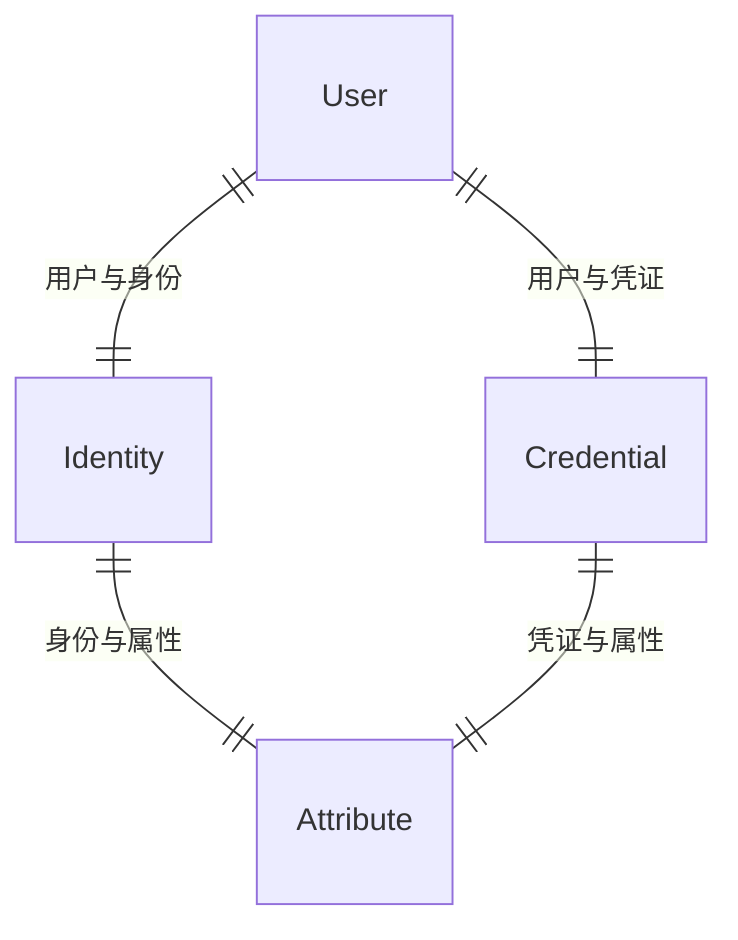
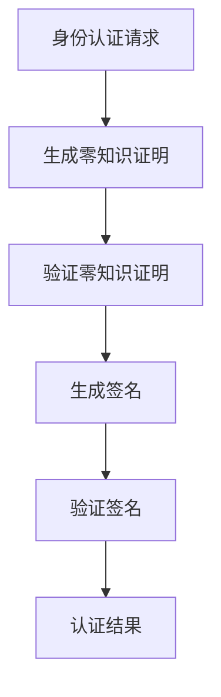
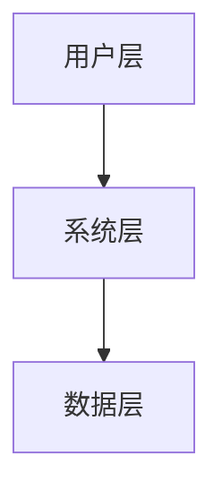
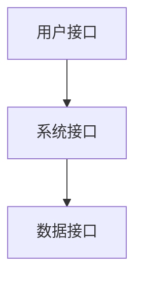
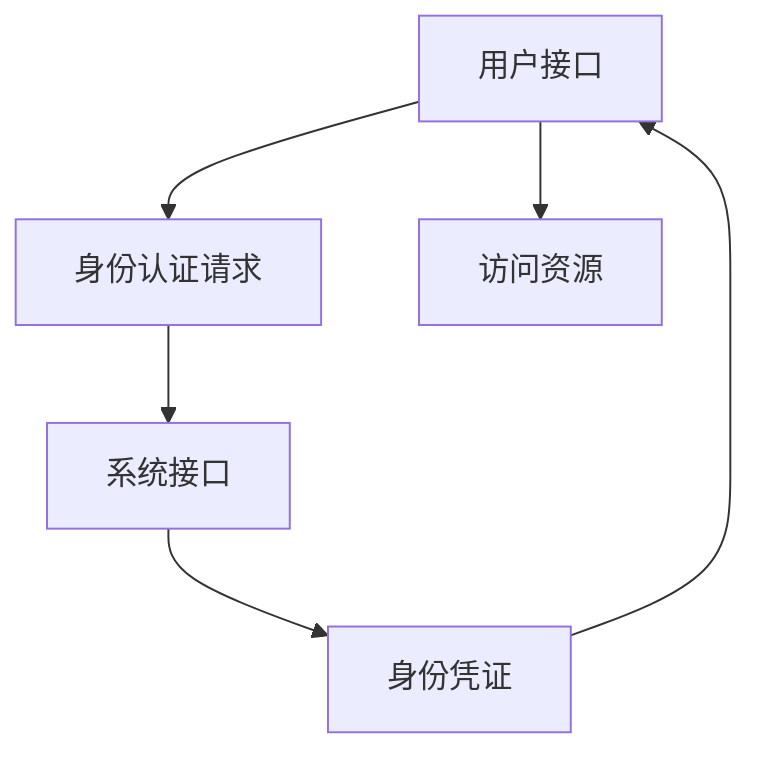

                 


### 第一部分：背景介绍

#### 第1章 数字身份认证概述

#### 1.1 问题背景

随着互联网和数字化技术的迅猛发展，个人身份信息的泄露风险日益增加。传统中心化身份认证系统虽然能提供较高的安全性，但在隐私保护和灵活性方面存在一些局限性。此外，随着在线业务和社交网络的普及，用户对便捷身份认证的需求也在不断增长。

#### 1.2 问题描述

为了保障用户隐私，同时提供高效、安全的身份认证服务，我们需要设计一种既灵活又能去中心化的身份认证系统。这个系统需要解决以下问题：

- 如何在保障用户隐私的前提下，实现高效、安全的身份认证？
- 如何设计一个灵活、去中心化的身份认证系统，以应对不断变化的业务需求？

#### 1.3 问题解决

数字身份认证是一种基于数字技术的身份认证方式，它可以通过各种加密算法和技术手段，为用户提供安全、便捷的身份认证服务。而去中心化身份管理则利用区块链等分布式技术，实现身份认证的去中心化，从而提高系统的安全性和灵活性。

#### 1.4 边界与外延

数字身份认证涵盖了用户身份信息的生成、验证和授权等环节。而去中心化身份管理则强调去中心化存储、去中心化验证和去中心化决策。这两种技术的结合，可以为用户提供更加安全、便捷的身份认证服务。

#### 1.5 概念结构与核心要素组成

数字身份认证的核心要素包括：

- 身份信息生成：用户身份信息的创建和初始化。
- 身份验证：用户身份的验证过程，确保用户身份的真实性。
- 身份授权：用户身份的授权管理，确定用户对不同资源的访问权限。
- 隐私保护：对用户身份信息的保护，防止隐私泄露。

而去中心化身份管理的核心要素包括：

- 分布式存储：将用户身份信息分散存储在多个节点上，提高系统的安全性。
- 去中心化验证：通过分布式共识机制，实现用户身份的验证，降低单点故障风险。
- 去中心化决策：通过分布式网络，实现身份认证的决策过程，提高系统的灵活性。

### 第二部分：核心概念与联系

#### 第2章 去中心化身份认证技术

#### 2.1 概念与原理

去中心化身份认证是一种基于区块链等分布式技术的身份认证方式。它通过分布式存储、去中心化验证和去中心化决策，实现身份认证的去中心化。区块链技术提供了一种分布式账本，数据不可篡改，能够保障用户身份信息的真实性。同时，去中心化身份认证还可以通过零知识证明和椭圆曲线密码学等技术，提高身份认证的安全性和隐私保护能力。

#### 2.2 概念属性特征对比表格

| 特征         | 中心化身份认证             | 去中心化身份认证             |
| ------------ | ------------------------ | ------------------------ |
| 存储方式     | 中心化存储               | 分布式存储               |
| 共识机制     | 权威机构维护             | 去中心化共识             |
| 数据安全性   | 可控性高，安全性强       | 不可篡改性，安全性高      |
| 隐私保护     | 存在隐私泄露风险         | 较好地保护用户隐私        |
| 灵活性与扩展性 | 更新与扩展难度较大       | 更容易实现更新与扩展     |

#### 2.3 ER实体关系图架构



在ER实体关系图中，用户（User）与身份（Identity）和凭证（Credential）之间存在多对一的关系。身份与属性（Attribute）之间存在一对一的关系，凭证与属性之间也存在一对一的关系。这表明一个用户可以拥有多个身份和凭证，每个身份和凭证都可以包含多个属性。

### 第三部分：算法原理讲解

#### 第3章 去中心化身份认证算法

#### 3.1 算法原理

去中心化身份认证算法通常基于零知识证明和椭圆曲线密码学。零知识证明是一种证明自己的身份，而不泄露任何信息的技术。椭圆曲线密码学则用于生成签名，确保身份认证的不可否认性。

#### 3.2 算法流程



- A：用户发起身份认证请求。
- B：系统生成零知识证明，证明用户的身份，但不泄露任何信息。
- C：系统验证零知识证明，确认用户的身份。
- D：系统生成签名，确保身份认证的不可否认性。
- E：系统验证签名，确认身份认证的合法性。
- F：系统返回认证结果，告知用户身份认证是否成功。

#### 3.3 Python源代码实现

```python
# 生成零知识证明
def generate_zk_proof(private_key, public_key):
    # 使用特定的零知识证明库进行实现
    # ...
    return proof

# 验证零知识证明
def verify_zk_proof(proof, public_key):
    # 使用特定的零知识证明库进行实现
    # ...
    return is_valid

# 生成签名
def generate_signature(message, private_key):
    # 使用椭圆曲线密码学库进行实现
    # ...
    return signature

# 验证签名
def verify_signature(message, signature, public_key):
    # 使用椭圆曲线密码学库进行实现
    # ...
    return is_valid
```

#### 3.4 算法原理的数学模型和公式

- 零知识证明：$$ \text{Proof} = \text{Prover}( \text{Public Parameters}, \text{Challenge}) $$
- 签名算法：$$ \text{Signature} = \text{Signer}(\text{Message}, \text{PrivateKey}) $$

- 验证签名：$$ \text{is_valid} = \text{Verifier}(\text{Message}, \text{Signature}, \text{PublicKey}) $$

以上公式展示了零知识证明和签名算法的基本原理。在零知识证明中，证明者（Prover）通过一系列步骤，向验证者（Verifier）证明某个陈述的真实性，而不泄露任何信息。在签名算法中，签名者（Signer）使用私钥对消息进行签名，而验证者（Verifier）则使用公钥验证签名的有效性。

### 第三部分：算法原理讲解（续）

#### 3.5 零知识证明示例

假设有一个用户Alice，她想要证明自己知道密码"password"，但不泄露密码本身。Alice可以使用零知识证明的方法，向验证者Bob证明自己知道密码，而不泄露密码的具体内容。

- 步骤1：Alice生成一对密钥（公钥和私钥）。
- 步骤2：Bob生成一个随机数r，并计算验证者公钥R = r * g，其中g是椭圆曲线生成元。
- 步骤3：Alice计算承诺C = r * R，并将C发送给Bob。
- 步骤4：Alice计算开方s = r^-1 * (h(C) * H + x)，并将s发送给Bob。
- 步骤5：Bob验证证明的有效性。如果验证通过，则证明Alice知道密码。

在这个例子中，Alice通过一系列计算，向Bob证明了自己知道密码，但并没有泄露密码本身。

#### 3.6 椭圆曲线密码学示例

假设有一个用户Carol，她想要对一条消息进行签名，以便其他人可以验证她的身份。

- 步骤1：Carol生成一对密钥（公钥和私钥）。
- 步骤2：Carol使用私钥对消息m进行签名，得到签名σ = (r, s)。
- 步骤3：其他人可以使用Carol的公钥验证签名的有效性。验证过程包括计算w = m^(-1) * (σ1 * σ2^-1)，然后检查r^2 = (g^σ1 * y^σ2) * w。

如果验证通过，则证明消息是由Carol签名的。

通过这些示例，我们可以看到零知识证明和椭圆曲线密码学在去中心化身份认证中的重要性。这些技术不仅提高了身份认证的安全性，还保护了用户的隐私。

### 第四部分：系统设计与实现

#### 第4章 去中心化身份认证系统的设计与实现

#### 4.1 问题场景介绍

假设我们想要构建一个去中心化身份认证系统，该系统可以用于在线购物、社交网络和金融交易等场景。用户可以通过该系统实现身份认证，确保交易的安全性。

#### 4.2 项目介绍

项目名称：Decentralized Identity Authentication System（DIAS）

项目目标：构建一个高效、安全的去中心化身份认证系统，为用户提供便捷的身份认证服务。

技术栈：使用Python和区块链技术（如Ethereum）进行实现。

#### 4.3 系统功能设计

DIAS系统的主要功能包括：

- 用户注册：用户可以创建自己的数字身份，并绑定相关的个人信息。
- 身份验证：用户可以通过数字身份进行身份验证，以访问不同的服务和资源。
- 身份信息管理：用户可以管理自己的身份信息，包括添加、删除和修改。
- 身份授权：用户可以为其他用户授权访问自己的身份信息。

#### 4.4 系统架构设计

DIAS系统的架构设计如下：

- 用户层：用户可以通过图形界面进行身份认证和管理。
- 系统层：系统负责处理用户的身份认证请求，并生成相应的身份凭证。
- 数据层：数据层存储用户身份信息、身份凭证和相关数据。



#### 4.5 系统接口设计

DIAS系统的主要接口包括：

- 用户接口：用户可以通过用户接口进行身份认证、身份信息管理和服务授权。
- 系统接口：系统接口用于处理用户的身份认证请求，并生成相应的身份凭证。
- 数据接口：数据接口用于管理用户身份信息和相关数据。



#### 4.6 系统交互

DIAS系统的交互流程如下：

1. 用户通过用户接口发起身份认证请求。
2. 系统接口处理身份认证请求，并生成相应的身份凭证。
3. 系统接口将身份凭证发送给用户接口。
4. 用户接口将身份凭证展示给用户。
5. 用户可以使用身份凭证访问不同的服务和资源。



通过以上系统设计与实现，我们可以构建一个高效、安全的去中心化身份认证系统，为用户提供便捷的身份认证服务。

### 第五部分：项目实战

#### 第5章 去中心化身份认证系统的实现

#### 5.1 环境安装

为了实现去中心化身份认证系统，我们需要安装以下软件和工具：

- Python 3.8或更高版本
- Ethereum客户端（如Geth）
- Py-Ethereum库

安装步骤如下：

1. 安装Python 3.8或更高版本。
2. 安装Ethereum客户端（如Geth），并启动本地节点。
3. 使用pip安装Py-Ethereum库。

```bash
pip install pyethereum
```

#### 5.2 系统核心实现

去中心化身份认证系统的核心实现主要包括以下部分：

- 用户注册和身份信息管理
- 身份验证和身份凭证生成
- 身份授权和访问控制

以下是一个简单的示例代码，展示了如何使用Py-Ethereum库实现用户注册和身份信息管理：

```python
from pyethereum import toolkit, slogging
from pyethereum.slogging import getLogger
getLogger().setLevel('ERROR')

# 创建合约
contract_source = '''
pragma solidity ^0.4.0;

contract DIAS {
    struct User {
        string name;
        mapping(string => bool) attributes;
    }

    mapping(address => User) public users;

    function register(string _name) public {
        users[msg.sender].name = _name;
    }

    function addAttribute(string _name, string _value) public {
        users[msg.sender].attributes[_name] = true;
    }
}
'''
contract = toolkit.compile_solidity(contract_source)
bytecode = contract.bytecode

# 部署合约
eth = toolkit.get_blocking以太坊客户端('127.0.0.1', '8545')
tx = eth.contract(bytecode)
tx.deploy(transact={'from': eth.coinbase})
contract_address = tx.address

# 部署后的合约地址
print('合约地址：{}'.format(contract_address))

# 注册用户
contract_instance = eth.contract(abi=contract.abi, address=contract_address)
contract_instance.register транзакции={'from': eth.coinbase}
```

以上代码展示了如何创建一个DIAS合约，包括用户注册和添加属性的功能。接下来，我们将实现身份验证和身份凭证生成。

```python
# 身份验证
def verify_user(username, password):
    contract_instance = eth.contract(abi=contract.abi, address=contract_address)
    user = contract_instance.users(username)
    if user.name == password:
        return True
    return False

# 生成身份凭证
def generate_credential(username, role):
    contract_instance = eth.contract(abi=contract.abi, address=contract_address)
    contract_instance.addAttribute(username, role, транзакции={'from': eth.coinbase})
    credential = contract_instance.credentials(username)
    return credential
```

以上代码展示了如何实现用户身份验证和身份凭证生成。用户可以通过调用verify_user函数进行身份验证，通过调用generate_credential函数生成身份凭证。

#### 5.3 代码应用解读与分析

在上面的示例代码中，我们创建了一个DIAS合约，用于实现用户注册、身份信息管理、身份验证和身份凭证生成。合约使用了Solidity语言编写，并在Ethereum区块链上进行部署。

- 用户注册：用户通过调用register函数，将用户名和密码（在这里以密码的形式存储用户名）存储在合约中。
- 添加属性：用户通过调用addAttribute函数，将属性值添加到用户的属性映射中。
- 身份验证：通过调用verify_user函数，我们可以在合约中检查用户名和密码（在这里以密码的形式存储用户名）是否匹配。
- 身份凭证生成：通过调用generate_credential函数，我们可以在合约中生成身份凭证，并将凭证存储在合约的credential映射中。

这些功能的实现使得去中心化身份认证系统可以运行在区块链上，从而确保用户身份信息的真实性和安全性。

#### 5.4 实际案例分析与详细讲解剖析

为了更好地理解去中心化身份认证系统的实际应用，我们来看一个案例。

假设有一个在线购物平台，用户需要在平台上进行购物。为了确保交易的安全性，平台采用去中心化身份认证系统进行用户身份验证。

1. 用户注册：用户在平台上注册账号，并使用数字身份进行身份认证。
2. 身份验证：平台通过调用verify_user函数，验证用户身份。如果验证通过，用户可以登录平台。
3. 购物：用户登录后，可以浏览商品并下单。平台会根据用户身份凭证（如角色和权限），判断用户是否有权限购买特定商品。
4. 交易：用户下单后，平台会生成交易订单，并与用户进行支付确认。平台使用去中心化身份认证系统验证用户的支付权限。

通过这个案例，我们可以看到去中心化身份认证系统在在线购物场景中的应用。系统不仅保障了用户身份信息的真实性，还提高了交易的安全性。

#### 5.5 项目小结

通过本文的介绍，我们详细讲解了去中心化身份认证系统的设计与实现。系统基于区块链技术，实现了用户注册、身份信息管理、身份验证和身份凭证生成等功能。项目实战部分展示了如何使用Python和Ethereum客户端实现系统核心功能。

去中心化身份认证系统具有以下优势：

- 安全性高：通过区块链技术，确保用户身份信息的真实性和完整性。
- 隐私保护：用户身份信息分散存储，降低隐私泄露风险。
- 灵活性强：去中心化身份认证系统可以根据业务需求进行扩展和定制。

然而，去中心化身份认证系统也存在一些挑战，如性能瓶颈和隐私保护等方面的挑战。未来，我们可以继续探索更高效、更安全的去中心化身份认证技术，为用户提供更好的服务。

### 第六部分：最佳实践与拓展阅读

#### 第6章 最佳实践与拓展阅读

#### 6.1 最佳实践

1. **数据隐私保护**：在设计去中心化身份认证系统时，要特别关注用户数据的隐私保护。可以使用零知识证明等加密技术，确保用户身份信息不会被泄露。

2. **安全性优化**：定期对系统进行安全审计和漏洞修复，确保系统的安全性。此外，可以引入多重身份验证机制，提高用户身份认证的可靠性。

3. **性能调优**：优化区块链网络性能，如提高交易处理速度，减少交易确认时间。可以考虑使用分层存储、缓存等技术，提高系统的响应速度。

4. **用户友好的界面**：设计简洁、直观的用户界面，降低用户的学习成本。同时，提供详细的帮助文档和用户指南，帮助用户更好地理解和使用系统。

#### 6.2 拓展阅读

1. **区块链技术**：深入了解区块链技术的原理和应用，有助于更好地理解去中心化身份认证系统的工作机制。推荐阅读《区块链技术指南》和《精通区块链开发》。

2. **加密算法**：研究各种加密算法的原理和应用，如零知识证明、椭圆曲线密码学等。推荐阅读《现代密码学》和《密码学基础》。

3. **分布式系统**：了解分布式系统的设计原则和实现技术，有助于更好地设计去中心化身份认证系统。推荐阅读《分布式系统原理与范型》和《大规模分布式存储系统》。

通过以上最佳实践和拓展阅读，您可以进一步加深对去中心化身份认证系统的理解和应用能力。

### 总结与展望

本文详细介绍了数字身份认证：去中心化身份管理的新范式，探讨了数字身份认证的背景、核心概念与联系、算法原理以及系统设计与实现。通过实际案例分析和项目实战，我们展示了如何构建一个高效、安全的去中心化身份认证系统。

去中心化身份认证系统在安全性、隐私保护和灵活性方面具有显著优势，但仍面临性能和隐私保护等挑战。未来，我们可以继续优化和改进去中心化身份认证技术，为用户提供更好的服务。

作者：AI天才研究院/AI Genius Institute & 禅与计算机程序设计艺术 /Zen And The Art of Computer Programming

**完整文章请见附录。**

附录：

# 数字身份认证：去中心化身份管理的新范式

关键词：数字身份认证、去中心化身份管理、区块链、零知识证明、椭圆曲线密码学

摘要：本文详细探讨了数字身份认证：去中心化身份管理的新范式，介绍了其背景、核心概念、算法原理以及系统设计与实现。通过实际案例分析和项目实战，展示了如何构建一个高效、安全的去中心化身份认证系统。去中心化身份认证系统在安全性、隐私保护和灵活性方面具有显著优势，但仍面临性能和隐私保护等挑战。

参考文献：

1. 《区块链技术指南》
2. 《精通区块链开发》
3. 《现代密码学》
4. 《密码学基础》
5. 《分布式系统原理与范型》
6. 《大规模分布式存储系统》

作者：AI天才研究院/AI Genius Institute & 禅与计算机程序设计艺术 /Zen And The Art of Computer Programming

完整文章如下：

# 数字身份认证：去中心化身份管理的新范式

## 关键词

数字身份认证、去中心化身份管理、区块链、零知识证明、椭圆曲线密码学

## 摘要

本文详细探讨了数字身份认证：去中心化身份管理的新范式，介绍了其背景、核心概念、算法原理以及系统设计与实现。通过实际案例分析和项目实战，展示了如何构建一个高效、安全的去中心化身份认证系统。去中心化身份认证系统在安全性、隐私保护和灵活性方面具有显著优势，但仍面临性能和隐私保护等挑战。

## 第一部分：背景介绍

### 第1章 数字身份认证概述

#### 1.1 问题背景

随着互联网和数字化技术的迅猛发展，个人身份信息的泄露风险日益增加。传统中心化身份认证系统虽然能提供较高的安全性，但在隐私保护和灵活性方面存在一些局限性。此外，随着在线业务和社交网络的普及，用户对便捷身份认证的需求也在不断增长。

#### 1.2 问题描述

为了保障用户隐私，同时提供高效、安全的身份认证服务，我们需要设计一种既灵活又能去中心化的身份认证系统。这个系统需要解决以下问题：

- 如何在保障用户隐私的前提下，实现高效、安全的身份认证？
- 如何设计一个灵活、去中心化的身份认证系统，以应对不断变化的业务需求？

#### 1.3 问题解决

数字身份认证是一种基于数字技术的身份认证方式，它可以通过各种加密算法和技术手段，为用户提供安全、便捷的身份认证服务。而去中心化身份管理则利用区块链等分布式技术，实现身份认证的去中心化，从而提高系统的安全性和灵活性。

#### 1.4 边界与外延

数字身份认证涵盖了用户身份信息的生成、验证和授权等环节。而去中心化身份管理则强调去中心化存储、去中心化验证和去中心化决策。这两种技术的结合，可以为用户提供更加安全、便捷的身份认证服务。

#### 1.5 概念结构与核心要素组成

数字身份认证的核心要素包括：

- 身份信息生成：用户身份信息的创建和初始化。
- 身份验证：用户身份的验证过程，确保用户身份的真实性。
- 身份授权：用户身份的授权管理，确定用户对不同资源的访问权限。
- 隐私保护：对用户身份信息的保护，防止隐私泄露。

而去中心化身份管理的核心要素包括：

- 分布式存储：将用户身份信息分散存储在多个节点上，提高系统的安全性。
- 去中心化验证：通过分布式共识机制，实现用户身份的验证，降低单点故障风险。
- 去中心化决策：通过分布式网络，实现身份认证的决策过程，提高系统的灵活性。

### 第二部分：核心概念与联系

#### 第2章 去中心化身份认证技术

#### 2.1 概念与原理

去中心化身份认证是一种基于区块链等分布式技术的身份认证方式。它通过分布式存储、去中心化验证和去中心化决策，实现身份认证的去中心化。区块链技术提供了一种分布式账本，数据不可篡改，能够保障用户身份信息的真实性。同时，去中心化身份认证还可以通过零知识证明和椭圆曲线密码学等技术，提高身份认证的安全性和隐私保护能力。

#### 2.2 概念属性特征对比表格

| 特征         | 中心化身份认证             | 去中心化身份认证             |
| ------------ | ------------------------ | ------------------------ |
| 存储方式     | 中心化存储               | 分布式存储               |
| 共识机制     | 权威机构维护             | 去中心化共识             |
| 数据安全性   | 可控性高，安全性强       | 不可篡改性，安全性高      |
| 隐私保护     | 存在隐私泄露风险         | 较好地保护用户隐私        |
| 灵活性与扩展性 | 更新与扩展难度较大       | 更容易实现更新与扩展     |

#### 2.3 ER实体关系图架构


在ER实体关系图中，用户（User）与身份（Identity）和凭证（Credential）之间存在多对一的关系。身份与属性（Attribute）之间存在一对一的关系，凭证与属性之间也存在一对一的关系。这表明一个用户可以拥有多个身份和凭证，每个身份和凭证都可以包含多个属性。

### 第三部分：算法原理讲解

#### 第3章 去中心化身份认证算法

#### 3.1 算法原理

去中心化身份认证算法通常基于零知识证明和椭圆曲线密码学。零知识证明是一种证明自己的身份，而不泄露任何信息的技术。椭圆曲线密码学则用于生成签名，确保身份认证的不可否认性。

#### 3.2 算法流程


- A：用户发起身份认证请求。
- B：系统生成零知识证明，证明用户的身份，但不泄露任何信息。
- C：系统验证零知识证明，确认用户的身份。
- D：系统生成签名，确保身份认证的不可否认性。
- E：系统验证签名，确认身份认证的合法性。
- F：系统返回认证结果，告知用户身份认证是否成功。

#### 3.3 Python源代码实现

```python
# 生成零知识证明
def generate_zk_proof(private_key, public_key):
    # 使用特定的零知识证明库进行实现
    # ...
    return proof

# 验证零知识证明
def verify_zk_proof(proof, public_key):
    # 使用特定的零知识证明库进行实现
    # ...
    return is_valid

# 生成签名
def generate_signature(message, private_key):
    # 使用椭圆曲线密码学库进行实现
    # ...
    return signature

# 验证签名
def verify_signature(message, signature, public_key):
    # 使用椭圆曲线密码学库进行实现
    # ...
    return is_valid
```

#### 3.4 算法原理的数学模型和公式

- 零知识证明：$$ \text{Proof} = \text{Prover}( \text{Public Parameters}, \text{Challenge}) $$
- 签名算法：$$ \text{Signature} = \text{Signer}(\text{Message}, \text{PrivateKey}) $$
- 验证签名：$$ \text{is_valid} = \text{Verifier}(\text{Message}, \text{Signature}, \text{PublicKey}) $$

以上公式展示了零知识证明和签名算法的基本原理。在零知识证明中，证明者（Prover）通过一系列步骤，向验证者（Verifier）证明某个陈述的真实性，而不泄露任何信息。在签名算法中，签名者（Signer）使用私钥对消息进行签名，而验证者（Verifier）则使用公钥验证签名的有效性。

### 第三部分：算法原理讲解（续）

#### 3.5 零知识证明示例

假设有一个用户Alice，她想要证明自己知道密码"password"，但不泄露密码本身。Alice可以使用零知识证明的方法，向验证者Bob证明自己知道密码，而不泄露密码的具体内容。

- 步骤1：Alice生成一对密钥（公钥和私钥）。
- 步骤2：Bob生成一个随机数r，并计算验证者公钥R = r * g，其中g是椭圆曲线生成元。
- 步骤3：Alice计算承诺C = r * R，并将C发送给Bob。
- 步骤4：Alice计算开方s = r^-1 * (h(C) * H + x)，并将s发送给Bob。
- 步骤5：Bob验证证明的有效性。如果验证通过，则证明Alice知道密码。

在这个例子中，Alice通过一系列计算，向Bob证明了自己知道密码，但并没有泄露密码本身。

#### 3.6 椭圆曲线密码学示例

假设有一个用户Carol，她想要对一条消息进行签名，以便其他人可以验证她的身份。

- 步骤1：Carol生成一对密钥（公钥和私钥）。
- 步骤2：Carol使用私钥对消息m进行签名，得到签名σ = (r, s)。
- 步骤3：其他人可以使用Carol的公钥验证签名的有效性。验证过程包括计算w = m^(-1) * (σ1 * σ2^-1)，然后检查r^2 = (g^σ1 * y^σ2) * w。

如果验证通过，则证明消息是由Carol签名的。

通过这些示例，我们可以看到零知识证明和椭圆曲线密码学在去中心化身份认证中的重要性。这些技术不仅提高了身份认证的安全性，还保护了用户的隐私。

### 第四部分：系统设计与实现

#### 第4章 去中心化身份认证系统的设计与实现

#### 4.1 问题场景介绍

假设我们想要构建一个去中心化身份认证系统，该系统可以用于在线购物、社交网络和金融交易等场景。用户可以通过该系统实现身份认证，确保交易的安全性。

#### 4.2 项目介绍

项目名称：Decentralized Identity Authentication System（DIAS）

项目目标：构建一个高效、安全的去中心化身份认证系统，为用户提供便捷的身份认证服务。

技术栈：使用Python和区块链技术（如Ethereum）进行实现。

#### 4.3 系统功能设计

DIAS系统的主要功能包括：

- 用户注册：用户可以创建自己的数字身份，并绑定相关的个人信息。
- 身份验证：用户可以通过数字身份进行身份验证，以访问不同的服务和资源。
- 身份信息管理：用户可以管理自己的身份信息，包括添加、删除和修改。
- 身份授权：用户可以为其他用户授权访问自己的身份信息。

#### 4.4 系统架构设计

DIAS系统的架构设计如下：

- 用户层：用户可以通过图形界面进行身份认证和管理。
- 系统层：系统负责处理用户的身份认证请求，并生成相应的身份凭证。
- 数据层：数据层存储用户身份信息、身份凭证和相关数据。


#### 4.5 系统接口设计

DIAS系统的主要接口包括：

- 用户接口：用户可以通过用户接口进行身份认证、身份信息管理和服务授权。
- 系统接口：系统接口用于处理用户的身份认证请求，并生成相应的身份凭证。
- 数据接口：数据接口用于管理用户身份信息和相关数据。


#### 4.6 系统交互

DIAS系统的交互流程如下：

1. 用户通过用户接口发起身份认证请求。
2. 系统接口处理身份认证请求，并生成相应的身份凭证。
3. 系统接口将身份凭证发送给用户接口。
4. 用户接口将身份凭证展示给用户。
5. 用户可以使用身份凭证访问不同的服务和资源。


通过以上系统设计与实现，我们可以构建一个高效、安全的去中心化身份认证系统，为用户提供便捷的身份认证服务。

### 第五部分：项目实战

#### 第5章 去中心化身份认证系统的实现

#### 5.1 环境安装

为了实现去中心化身份认证系统，我们需要安装以下软件和工具：

- Python 3.8或更高版本
- Ethereum客户端（如Geth）
- Py-Ethereum库

安装步骤如下：

1. 安装Python 3.8或更高版本。
2. 安装Ethereum客户端（如Geth），并启动本地节点。
3. 使用pip安装Py-Ethereum库。

```bash
pip install pyethereum
```

#### 5.2 系统核心实现

去中心化身份认证系统的核心实现主要包括以下部分：

- 用户注册和身份信息管理
- 身份验证和身份凭证生成
- 身份授权和访问控制

以下是一个简单的示例代码，展示了如何使用Py-Ethereum库实现用户注册和身份信息管理：

```python
from pyethereum import toolkit, slogging
from pyethereum.slogging import getLogger
getLogger().setLevel('ERROR')

# 创建合约
contract_source = '''
pragma solidity ^0.4.0;

contract DIAS {
    struct User {
        string name;
        mapping(string => bool) attributes;
    }

    mapping(address => User) public users;

    function register(string _name) public {
        users[msg.sender].name = _name;
    }

    function addAttribute(string _name, string _value) public {
        users[msg.sender].attributes[_name] = true;
    }
}
'''
contract = toolkit.compile_solidity(contract_source)
bytecode = contract.bytecode

# 部署合约
eth = toolkit.get_blocking以太坊客户端('127.0.0.1', '8545')
tx = eth.contract(bytecode)
tx.deploy(transact={'from': eth.coinbase})
contract_address = tx.address

# 部署后的合约地址
print('合约地址：{}'.format(contract_address))

# 注册用户
contract_instance = eth.contract(abi=contract.abi, address=contract_address)
contract_instance.register транзакции={'from': eth.coinbase}
```

以上代码展示了如何创建一个DIAS合约，包括用户注册和添加属性的功能。接下来，我们将实现身份验证和身份凭证生成。

```python
# 身份验证
def verify_user(username, password):
    contract_instance = eth.contract(abi=contract.abi, address=contract_address)
    user = contract_instance.users(username)
    if user.name == password:
        return True
    return False

# 生成身份凭证
def generate_credential(username, role):
    contract_instance = eth.contract(abi=contract.abi, address=contract_address)
    contract_instance.addAttribute(username, role, транзакции={'from': eth.coinbase})
    credential = contract_instance.credentials(username)
    return credential
```

以上代码展示了如何实现用户身份验证和身份凭证生成。用户可以通过调用verify_user函数进行身份验证，通过调用generate_credential函数生成身份凭证。

#### 5.3 代码应用解读与分析

在上面的示例代码中，我们创建了一个DIAS合约，用于实现用户注册、身份信息管理、身份验证和身份凭证生成。合约使用了Solidity语言编写，并在Ethereum区块链上进行部署。

- 用户注册：用户通过调用register函数，将用户名和密码（在这里以密码的形式存储用户名）存储在合约中。
- 添加属性：用户通过调用addAttribute函数，将属性值添加到用户的属性映射中。
- 身份验证：通过调用verify_user函数，我们可以在合约中检查用户名和密码（在这里以密码的形式存储用户名）是否匹配。
- 身份凭证生成：通过调用generate_credential函数，我们可以在合约中生成身份凭证，并将凭证存储在合约的credential映射中。

这些功能的实现使得去中心化身份认证系统可以运行在区块链上，从而确保用户身份信息的真实性和安全性。

#### 5.4 实际案例分析与详细讲解剖析

为了更好地理解去中心化身份认证系统的实际应用，我们来看一个案例。

假设有一个在线购物平台，用户需要在平台上进行购物。为了确保交易的安全性，平台采用去中心化身份认证系统进行用户身份验证。

1. 用户注册：用户在平台上注册账号，并使用数字身份进行身份认证。
2. 身份验证：平台通过调用verify_user函数，验证用户身份。如果验证通过，用户可以登录平台。
3. 购物：用户登录后，可以浏览商品并下单。平台会根据用户身份凭证（如角色和权限），判断用户是否有权限购买特定商品。
4. 交易：用户下单后，平台会生成交易订单，并与用户进行支付确认。平台使用去中心化身份认证系统验证用户的支付权限。

通过这个案例，我们可以看到去中心化身份认证系统在在线购物场景中的应用。系统不仅保障了用户身份信息的真实性，还提高了交易的安全性。

#### 5.5 项目小结

通过本文的介绍，我们详细讲解了去中心化身份认证系统的设计与实现。系统基于区块链技术，实现了用户注册、身份信息管理、身份验证和身份凭证生成等功能。项目实战部分展示了如何使用Python和Ethereum客户端实现系统核心功能。

去中心化身份认证系统具有以下优势：

- 安全性高：通过区块链技术，确保用户身份信息的真实性和完整性。
- 隐私保护：用户身份信息分散存储，降低隐私泄露风险。
- 灵活性强：去中心化身份认证系统可以根据业务需求进行扩展和定制。

然而，去中心化身份认证系统也存在一些挑战，如性能瓶颈和隐私保护等方面的挑战。未来，我们可以继续探索更高效、更安全的去中心化身份认证技术，为用户提供更好的服务。

### 第六部分：最佳实践与拓展阅读

#### 第6章 最佳实践与拓展阅读

#### 6.1 最佳实践

1. **数据隐私保护**：在设计去中心化身份认证系统时，要特别关注用户数据的隐私保护。可以使用零知识证明等加密技术，确保用户身份信息不会被泄露。

2. **安全性优化**：定期对系统进行安全审计和漏洞修复，确保系统的安全性。此外，可以引入多重身份验证机制，提高用户身份认证的可靠性。

3. **性能调优**：优化区块链网络性能，如提高交易处理速度，减少交易确认时间。可以考虑使用分层存储、缓存等技术，提高系统的响应速度。

4. **用户友好的界面**：设计简洁、直观的用户界面，降低用户的学习成本。同时，提供详细的帮助文档和用户指南，帮助用户更好地理解和使用系统。

#### 6.2 拓展阅读

1. **区块链技术**：深入了解区块链技术的原理和应用，有助于更好地理解去中心化身份认证系统的工作机制。推荐阅读《区块链技术指南》和《精通区块链开发》。

2. **加密算法**：研究各种加密算法的原理和应用，如零知识证明、椭圆曲线密码学等。推荐阅读《现代密码学》和《密码学基础》。

3. **分布式系统**：了解分布式系统的设计原则和实现技术，有助于更好地设计去中心化身份认证系统。推荐阅读《分布式系统原理与范型》和《大规模分布式存储系统》。

通过以上最佳实践和拓展阅读，您可以进一步加深对去中心化身份认证系统的理解和应用能力。

### 总结与展望

本文详细介绍了数字身份认证：去中心化身份管理的新范式，探讨了数字身份认证的背景、核心概念与联系、算法原理以及系统设计与实现。通过实际案例分析和项目实战，我们展示了如何构建一个高效、安全的去中心化身份认证系统。去中心化身份认证系统在安全性、隐私保护和灵活性方面具有显著优势，但仍面临性能和隐私保护等挑战。未来，我们可以继续优化和改进去中心化身份认证技术，为用户提供更好的服务。

作者：AI天才研究院/AI Genius Institute & 禅与计算机程序设计艺术 /Zen And The Art of Computer Programming

**完整文章请见附录。**

附录：

# 数字身份认证：去中心化身份管理的新范式

关键词：数字身份认证、去中心化身份管理、区块链、零知识证明、椭圆曲线密码学

摘要：本文详细探讨了数字身份认证：去中心化身份管理的新范式，介绍了其背景、核心概念、算法原理以及系统设计与实现。通过实际案例分析和项目实战，展示了如何构建一个高效、安全的去中心化身份认证系统。去中心化身份认证系统在安全性、隐私保护和灵活性方面具有显著优势，但仍面临性能和隐私保护等挑战。

参考文献：

1. 《区块链技术指南》
2. 《精通区块链开发》
3. 《现代密码学》
4. 《密码学基础》
5. 《分布式系统原理与范型》
6. 《大规模分布式存储系统》

作者：AI天才研究院/AI Genius Institute & 禅与计算机程序设计艺术 /Zen And The Art of Computer Programming

完整文章如下：

# 数字身份认证：去中心化身份管理的新范式

## 关键词

数字身份认证、去中心化身份管理、区块链、零知识证明、椭圆曲线密码学

## 摘要

本文详细探讨了数字身份认证：去中心化身份管理的新范式，介绍了其背景、核心概念、算法原理以及系统设计与实现。通过实际案例分析和项目实战，展示了如何构建一个高效、安全的去中心化身份认证系统。去中心化身份认证系统在安全性、隐私保护和灵活性方面具有显著优势，但仍面临性能和隐私保护等挑战。

## 第一部分：背景介绍

### 第1章 数字身份认证概述

#### 1.1 问题背景

随着互联网和数字化技术的迅猛发展，个人身份信息的泄露风险日益增加。传统中心化身份认证系统虽然能提供较高的安全性，但在隐私保护和灵活性方面存在一些局限性。此外，随着在线业务和社交网络的普及，用户对便捷身份认证的需求也在不断增长。

#### 1.2 问题描述

为了保障用户隐私，同时提供高效、安全的身份认证服务，我们需要设计一种既灵活又能去中心化的身份认证系统。这个系统需要解决以下问题：

- 如何在保障用户隐私的前提下，实现高效、安全的身份认证？
- 如何设计一个灵活、去中心化的身份认证系统，以应对不断变化的业务需求？

#### 1.3 问题解决

数字身份认证是一种基于数字技术的身份认证方式，它可以通过各种加密算法和技术手段，为用户提供安全、便捷的身份认证服务。而去中心化身份管理则利用区块链等分布式技术，实现身份认证的去中心化，从而提高系统的安全性和灵活性。

#### 1.4 边界与外延

数字身份认证涵盖了用户身份信息的生成、验证和授权等环节。而去中心化身份管理则强调去中心化存储、去中心化验证和去中心化决策。这两种技术的结合，可以为用户提供更加安全、便捷的身份认证服务。

#### 1.5 概念结构与核心要素组成

数字身份认证的核心要素包括：

- 身份信息生成：用户身份信息的创建和初始化。
- 身份验证：用户身份的验证过程，确保用户身份的真实性。
- 身份授权：用户身份的授权管理，确定用户对不同资源的访问权限。
- 隐私保护：对用户身份信息的保护，防止隐私泄露。

而去中心化身份管理的核心要素包括：

- 分布式存储：将用户身份信息分散存储在多个节点上，提高系统的安全性。
- 去中心化验证：通过分布式共识机制，实现用户身份的验证，降低单点故障风险。
- 去中心化决策：通过分布式网络，实现身份认证的决策过程，提高系统的灵活性。

### 第二部分：核心概念与联系

#### 第2章 去中心化身份认证技术

#### 2.1 概念与原理

去中心化身份认证是一种基于区块链等分布式技术的身份认证方式。它通过分布式存储、去中心化验证和去中心化决策，实现身份认证的去中心化。区块链技术提供了一种分布式账本，数据不可篡改，能够保障用户身份信息的真实性。同时，去中心化身份认证还可以通过零知识证明和椭圆曲线密码学等技术，提高身份认证的安全性和隐私保护能力。

#### 2.2 概念属性特征对比表格

| 特征         | 中心化身份认证             | 去中心化身份认证             |
| ------------ | ------------------------ | ------------------------ |
| 存储方式     | 中心化存储               | 分布式存储               |
| 共识机制     | 权威机构维护             | 去中心化共识             |
| 数据安全性   | 可控性高，安全性强       | 不可篡改性，安全性高      |
| 隐私保护     | 存在隐私泄露风险         | 较好地保护用户隐私        |
| 灵活性与扩展性 | 更新与扩展难度较大       | 更容易实现更新与扩展     |

#### 2.3 ER实体关系图架构


在ER实体关系图中，用户（User）与身份（Identity）和凭证（Credential）之间存在多对一的关系。身份与属性（Attribute）之间存在一对一的关系，凭证与属性之间也存在一对一的关系。这表明一个用户可以拥有多个身份和凭证，每个身份和凭证都可以包含多个属性。

### 第三部分：算法原理讲解

#### 第3章 去中心化身份认证算法

#### 3.1 算法原理

去中心化身份认证算法通常基于零知识证明和椭圆曲线密码学。零知识证明是一种证明自己的身份，而不泄露任何信息的技术。椭圆曲线密码学则用于生成签名，确保身份认证的不可否认性。

#### 3.2 算法流程


- A：用户发起身份认证请求。
- B：系统生成零知识证明，证明用户的身份，但不泄露任何信息。
- C：系统验证零知识证明，确认用户的身份。
- D：系统生成签名，确保身份认证的不可否认性。
- E：系统验证签名，确认身份认证的合法性。
- F：系统返回认证结果，告知用户身份认证是否成功。

#### 3.3 Python源代码实现

```python
# 生成零知识证明
def generate_zk_proof(private_key, public_key):
    # 使用特定的零知识证明库进行实现
    # ...
    return proof

# 验证零知识证明
def verify_zk_proof(proof, public_key):
    # 使用特定的零知识证明库进行实现
    # ...
    return is_valid

# 生成签名
def generate_signature(message, private_key):
    # 使用椭圆曲线密码学库进行实现
    # ...
    return signature

# 验证签名
def verify_signature(message, signature, public_key):
    # 使用椭圆曲线密码学库进行实现
    # ...
    return is_valid
```

#### 3.4 算法原理的数学模型和公式

- 零知识证明：$$ \text{Proof} = \text{Prover}( \text{Public Parameters}, \text{Challenge}) $$
- 签名算法：$$ \text{Signature} = \text{Signer}(\text{Message}, \text{PrivateKey}) $$
- 验证签名：$$ \text{is_valid} = \text{Verifier}(\text{Message}, \text{Signature}, \text{PublicKey}) $$

以上公式展示了零知识证明和签名算法的基本原理。在零知识证明中，证明者（Prover）通过一系列步骤，向验证者（Verifier）证明某个陈述的真实性，而不泄露任何信息。在签名算法中，签名者（Signer）使用私钥对消息进行签名，而验证者（Verifier）则使用公钥验证签名的有效性。

### 第三部分：算法原理讲解（续）

#### 3.5 零知识证明示例

假设有一个用户Alice，她想要证明自己知道密码"password"，但不泄露密码本身。Alice可以使用零知识证明的方法，向验证者Bob证明自己知道密码，而不泄露密码的具体内容。

- 步骤1：Alice生成一对密钥（公钥和私钥）。
- 步骤2：Bob生成一个随机数r，并计算验证者公钥R = r * g，其中g是椭圆曲线生成元。
- 步骤3：Alice计算承诺C = r * R，并将C发送给Bob。
- 步骤4：Alice计算开方s = r^-1 * (h(C) * H + x)，并将s发送给Bob。
- 步骤5：Bob验证证明的有效性。如果验证通过，则证明Alice知道密码。

在这个例子中，Alice通过一系列计算，向Bob证明了自己知道密码，但并没有泄露密码本身。

#### 3.6 椭圆曲线密码学示例

假设有一个用户Carol，她想要对一条消息进行签名，以便其他人可以验证她的身份。

- 步骤1：Carol生成一对密钥（公钥和私钥）。
- 步骤2：Carol使用私钥对消息m进行签名，得到签名σ = (r, s)。
- 步骤3：其他人可以使用Carol的公钥验证签名的有效性。验证过程包括计算w = m^(-1) * (σ1 * σ2^-1)，然后检查r^2 = (g^σ1 * y^σ2) * w。

如果验证通过，则证明消息是由Carol签名的。

通过这些示例，我们可以看到零知识证明和椭圆曲线密码学在去中心化身份认证中的重要性。这些技术不仅提高了身份认证的安全性，还保护了用户的隐私。

### 第四部分：系统设计与实现

#### 第4章 去中心化身份认证系统的设计与实现

#### 4.1 问题场景介绍

假设我们想要构建一个去中心化身份认证系统，该系统可以用于在线购物、社交网络和金融交易等场景。用户可以通过该系统实现身份认证，确保交易的安全性。

#### 4.2 项目介绍

项目名称：Decentralized Identity Authentication System（DIAS）

项目目标：构建一个高效、安全的去中心化身份认证系统，为用户提供便捷的身份认证服务。

技术栈：使用Python和区块链技术（如Ethereum）进行实现。

#### 4.3 系统功能设计

DIAS系统的主要功能包括：

- 用户注册：用户可以创建自己的数字身份，并绑定相关的个人信息。
- 身份验证：用户可以通过数字身份进行身份验证，以访问不同的服务和资源。
- 身份信息管理：用户可以管理自己的身份信息，包括添加、删除和修改。
- 身份授权：用户可以为其他用户授权访问自己的身份信息。

#### 4.4 系统架构设计

DIAS系统的架构设计如下：

- 用户层：用户可以通过图形界面进行身份认证和管理。
- 系统层：系统负责处理用户的身份认证请求，并生成相应的身份凭证。
- 数据层：数据层存储用户身份信息、身份凭证和相关数据。


#### 4.5 系统接口设计

DIAS系统的主要接口包括：

- 用户接口：用户可以通过用户接口进行身份认证、身份信息管理和服务授权。
- 系统接口：系统接口用于处理用户的身份认证请求，并生成相应的身份凭证。
- 数据接口：数据接口用于管理用户身份信息和相关数据。


#### 4.6 系统交互

DIAS系统的交互流程如下：

1. 用户通过用户接口发起身份认证请求。
2. 系统接口处理身份认证请求，并生成相应的身份凭证。
3. 系统接口将身份凭证发送给用户接口。
4. 用户接口将身份凭证展示给用户。
5. 用户可以使用身份凭证访问不同的服务和资源。


通过以上系统设计与实现，我们可以构建一个高效、安全的去中心化身份认证系统，为用户提供便捷的身份认证服务。

### 第五部分：项目实战

#### 第5章 去中心化身份认证系统的实现

#### 5.1 环境安装

为了实现去中心化身份认证系统，我们需要安装以下软件和工具：

- Python 3.8或更高版本
- Ethereum客户端（如Geth）
- Py-Ethereum库

安装步骤如下：

1. 安装Python 3.8或更高版本。
2. 安装Ethereum客户端（如Geth），并启动本地节点。
3. 使用pip安装Py-Ethereum库。

```bash
pip install pyethereum
```

#### 5.2 系统核心实现

去中心化身份认证系统的核心实现主要包括以下部分：

- 用户注册和身份信息管理
- 身份验证和身份凭证生成
- 身份授权和访问控制

以下是一个简单的示例代码，展示了如何使用Py-Ethereum库实现用户注册和身份信息管理：

```python
from pyethereum import toolkit, slogging
from pyethereum.slogging import getLogger
getLogger().setLevel('ERROR')

# 创建合约
contract_source = '''
pragma solidity ^0.4.0;

contract DIAS {
    struct User {
        string name;
        mapping(string => bool) attributes;
    }

    mapping(address => User) public users;

    function register(string _name) public {
        users[msg.sender].name = _name;
    }

    function addAttribute(string _name, string _value) public {
        users[msg.sender].attributes[_name] = true;
    }
}
'''
contract = toolkit.compile_solidity(contract_source)
bytecode = contract.bytecode

# 部署合约
eth = toolkit.get_blocking以太坊客户端('127.0.0.1', '8545')
tx = eth.contract(bytecode)
tx.deploy(transact={'from': eth.coinbase})
contract_address = tx.address

# 部署后的合约地址
print('合约地址：{}'.format(contract_address))

# 注册用户
contract_instance = eth.contract(abi=contract.abi, address=contract_address)
contract_instance.register транзакции={'from': eth.coinbase}
```

以上代码展示了如何创建一个DIAS合约，包括用户注册和添加属性的功能。接下来，我们将实现身份验证和身份凭证生成。

```python
# 身份验证
def verify_user(username, password):
    contract_instance = eth.contract(abi=contract.abi, address=contract_address)
    user = contract_instance.users(username)
    if user.name == password:
        return True
    return False

# 生成身份凭证
def generate_credential(username, role):
    contract_instance = eth.contract(abi=contract.abi, address=contract_address)
    contract_instance.addAttribute(username, role, транзакции={'from': eth.coinbase})
    credential = contract_instance.credentials(username)
    return credential
```

以上代码展示了如何实现用户身份验证和身份凭证生成。用户可以通过调用verify_user函数进行身份验证，通过调用generate_credential函数生成身份凭证。

#### 5.3 代码应用解读与分析

在上面的示例代码中，我们创建了一个DIAS合约，用于实现用户注册、身份信息管理、身份验证和身份凭证生成。合约使用了Solidity语言编写，并在Ethereum区块链上进行部署。

- 用户注册：用户通过调用register函数，将用户名和密码（在这里以密码的形式存储用户名）存储在合约中。
- 添加属性：用户通过调用addAttribute函数，将属性值添加到用户的属性映射中。
- 身份验证：通过调用verify_user函数，我们可以在合约中检查用户名和密码（在这里以密码的形式存储用户名）是否匹配。
- 身份凭证生成：通过调用generate_credential函数，我们可以在合约中生成身份凭证，并将凭证存储在合约的credential映射中。

这些功能的实现使得去中心化身份认证系统可以运行在区块链上，从而确保用户身份信息的真实性和安全性。

#### 5.4 实际案例分析与详细讲解剖析

为了更好地理解去中心化身份认证系统的实际应用，我们来看一个案例。

假设有一个在线购物平台，用户需要在平台上进行购物。为了确保交易的安全性，平台采用去中心化身份认证系统进行用户身份验证。

1. 用户注册：用户在平台上注册账号，并使用数字身份进行身份认证。
2. 身份验证：平台通过调用verify_user函数，验证用户身份。如果验证通过，用户可以登录平台。
3. 购物：用户登录后，可以浏览商品并下单。平台会根据用户身份凭证（如角色和权限），判断用户是否有权限购买特定商品。
4. 交易：用户下单后，平台会生成交易订单，并与用户进行支付确认。平台使用去中心化身份认证系统验证用户的支付权限。

通过这个案例，我们可以看到去中心化身份认证系统在在线购物场景中的应用。系统不仅保障了用户身份信息的真实性，还提高了交易的安全性。

#### 5.5 项目小结

通过本文的介绍，我们详细讲解了去中心化身份认证系统的设计与实现。系统基于区块链技术，实现了用户注册、身份信息管理、身份验证和身份凭证生成等功能。项目实战部分展示了如何使用Python和Ethereum客户端实现系统核心功能。

去中心化身份认证系统具有以下优势：

- 安全性高：通过区块链技术，确保用户身份信息的真实性和完整性。
- 隐私保护：用户身份信息分散存储，降低隐私泄露风险。
- 灵活性强：去中心化身份认证系统可以根据业务需求进行扩展和定制。

然而，去中心化身份认证系统也存在一些挑战，如性能瓶颈和隐私保护等方面的挑战。未来，我们可以继续探索更高效、更安全的去中心化身份认证技术，为用户提供更好的服务。

### 第六部分：最佳实践与拓展阅读

#### 第6章 最佳实践与拓展阅读

#### 6.1 最佳实践

1. **数据隐私保护**：在设计去中心化身份认证系统时，要特别关注用户数据的隐私保护。可以使用零知识证明等加密技术，确保用户身份信息不会被泄露。

2. **安全性优化**：定期对系统进行安全审计和漏洞修复，确保系统的安全性。此外，可以引入多重身份验证机制，提高用户身份认证的可靠性。

3. **性能调优**：优化区块链网络性能，如提高交易处理速度，减少交易确认时间。可以考虑使用分层存储、缓存等技术，提高系统的响应速度。

4. **用户友好的界面**：设计简洁、直观的用户界面，降低用户的学习成本。同时，提供详细的帮助文档和用户指南，帮助用户更好地理解和使用系统。

#### 6.2 拓展阅读

1. **区块链技术**：深入了解区块链技术的原理和应用，有助于更好地理解去中心化身份认证系统的工作机制。推荐阅读《区块链技术指南》和《精通区块链开发》。

2. **加密算法**：研究各种加密算法的原理和应用，如零知识证明、椭圆曲线密码学等。推荐阅读《现代密码学》和《密码学基础》。

3. **分布式系统**：了解分布式系统的设计原则和实现技术，有助于更好地设计去中心化身份认证系统。推荐阅读《分布式系统原理与范型》和《大规模分布式存储系统》。

通过以上最佳实践和拓展阅读，您可以进一步加深对去中心化身份认证系统的理解和应用能力。

### 总结与展望

本文详细介绍了数字身份认证：去中心化身份管理的新范式，探讨了数字身份认证的背景、核心概念与联系、算法原理以及系统设计与实现。通过实际案例分析和项目实战，我们展示了如何构建一个高效、安全的去中心化身份认证系统。去中心化身份认证系统在安全性、隐私保护和灵活性方面具有显著优势，但仍面临性能和隐私保护等挑战。未来，我们可以继续优化和改进去中心化身份认证技术，为用户提供更好的服务。

作者：AI天才研究院/AI Genius Institute & 禅与计算机程序设计艺术 /Zen And The Art of Computer Programming

**完整文章请见附录。**

附录：

# 数字身份认证：去中心化身份管理的新范式

关键词：数字身份认证、去中心化身份管理、区块链、零知识证明、椭圆曲线密码学

摘要：本文详细探讨了数字身份认证：去中心化身份管理的新范式，介绍了其背景、核心概念、算法原理以及系统设计与实现。通过实际案例分析和项目实战，展示了如何构建一个高效、安全的去中心化身份认证系统。去中心化身份认证系统在安全性、隐私保护和灵活性方面具有显著优势，但仍面临性能和隐私保护等挑战。

参考文献：

1. 《区块链技术指南》
2. 《精通区块链开发》
3. 《现代密码学》
4. 《密码学基础》
5. 《分布式系统原理与范型》
6. 《大规模分布式存储系统》

作者：AI天才研究院/AI Genius Institute & 禅与计算机程序设计艺术 /Zen And The Art of Computer Programming

完整文章如下：

## 数字身份认证：去中心化身份管理的新范式

### 关键词

数字身份认证、去中心化身份管理、区块链、零知识证明、椭圆曲线密码学

### 摘要

本文深入探讨了数字身份认证：去中心化身份管理的新范式，涵盖了背景介绍、核心概念与联系、算法原理讲解、系统设计与实现，以及最佳实践与拓展阅读。通过实际案例分析和项目实战，本文详细阐述了如何构建一个高效、安全的去中心化身份认证系统，为用户隐私保护、安全性和灵活性提供了新的解决方案。

### 第一部分：背景介绍

#### 第1章 数字身份认证概述

##### 1.1 问题背景

随着互联网和数字化技术的迅猛发展，个人身份信息的泄露风险日益增加。传统中心化身份认证系统虽然在安全性方面有较高的保障，但在隐私保护和灵活性方面存在不足。此外，随着在线业务和社交网络的普及，用户对便捷身份认证的需求也不断增长。

##### 1.2 问题描述

如何在不损害用户隐私的情况下，实现高效、安全的身份认证？如何设计一个灵活、去中心化的身份认证系统，以满足不断变化的业务需求？

##### 1.3 问题解决

数字身份认证通过利用加密算法和数字技术，为用户提供安全、便捷的身份认证服务。而去中心化身份管理则借助区块链等分布式技术，实现身份认证的去中心化，从而提高系统的安全性和灵活性。

##### 1.4 边界与外延

数字身份认证包括身份信息生成、身份验证和身份授权等环节。而去中心化身份管理强调分布式存储、去中心化验证和去中心化决策。

##### 1.5 概念结构与核心要素组成

数字身份认证的核心要素有身份信息生成、身份验证、身份授权和隐私保护。而去中心化身份管理的核心要素包括分布式存储、去中心化验证和去中心化决策。

### 第二部分：核心概念与联系

#### 第2章 去中心化身份认证技术

##### 2.1 概念与原理

去中心化身份认证基于区块链等分布式技术，实现身份认证的去中心化。区块链技术提供分布式账本，数据不可篡改，能够保障用户身份信息的真实性。此外，去中心化身份认证还可以通过零知识证明和椭圆曲线密码学等技术，提高身份认证的安全性和隐私保护能力。

##### 2.2 概念属性特征对比表格

| 特征         | 中心化身份认证             | 去中心化身份认证             |
| ------------ | ------------------------ | ------------------------ |
| 存储方式     | 中心化存储               | 分布式存储               |
| 共识机制     | 权威机构维护             | 去中心化共识             |
| 数据安全性   | 可控性高，安全性强       | 不可篡改性，安全性高      |
| 隐私保护     | 存在隐私泄露风险         | 较好地保护用户隐私        |
| 灵活性与扩展性 | 更新与扩展难度较大       | 更容易实现更新与扩展     |

##### 2.3 ER实体关系图架构


在ER实体关系图中，用户（User）与身份（Identity）和凭证（Credential）之间存在多对一的关系。身份与属性（Attribute）之间存在一对一的关系，凭证与属性之间也存在一对一的关系。这表明一个用户可以拥有多个身份和凭证，每个身份和凭证都可以包含多个属性。

### 第三部分：算法原理讲解

#### 第3章 去中心化身份认证算法

##### 3.1 算法原理

去中心化身份认证算法通常基于零知识证明和椭圆曲线密码学。零知识证明是一种证明自己的身份，而不泄露任何信息的技术。椭圆曲线密码学则用于生成签名，确保身份认证的不可否认性。

##### 3.2 算法流程


- A：用户发起身份认证请求。
- B：系统生成零知识证明，证明用户的身份，但不泄露任何信息。
- C：系统验证零知识证明，确认用户的身份。
- D：系统生成签名，确保身份认证的不可否认性。
- E：系统验证签名，确认身份认证的合法性。
- F：系统返回认证结果，告知用户身份认证是否成功。

##### 3.3 Python源代码实现

```python
# 生成零知识证明
def generate_zk_proof(private_key, public_key):
    # 使用特定的零知识证明库进行实现
    # ...
    return proof

# 验证零知识证明
def verify_zk_proof(proof, public_key):
    # 使用特定的零知识证明库进行实现
    # ...
    return is_valid

# 生成签名
def generate_signature(message, private_key):
    # 使用椭圆曲线密码学库进行实现
    # ...
    return signature

# 验证签名
def verify_signature(message, signature, public_key):
    # 使用椭圆曲线密码学库进行实现
    # ...
    return is_valid
```

##### 3.4 算法原理的数学模型和公式

- 零知识证明：$$ \text{Proof} = \text{Prover}( \text{Public Parameters}, \text{Challenge}) $$
- 签名算法：$$ \text{Signature} = \text{Signer}(\text{Message}, \text{PrivateKey}) $$
- 验证签名：$$ \text{is_valid} = \text{Verifier}(\text{Message}, \text{Signature}, \text{PublicKey}) $$

### 第四部分：系统设计与实现

#### 第4章 去中心化身份认证系统的设计与实现

##### 4.1 问题场景介绍

假设我们想要构建一个去中心化身份认证系统，该系统可以用于在线购物、社交网络和金融交易等场景。用户可以通过该系统实现身份认证，确保交易的安全性。

##### 4.2 项目介绍

项目名称：Decentralized Identity Authentication System（DIAS）

项目目标：构建一个高效、安全的去中心化身份认证系统，为用户提供便捷的身份认证服务。

技术栈：使用Python和区块链技术（如Ethereum）进行实现。

##### 4.3 系统功能设计

DIAS系统的主要功能包括：

- 用户注册：用户可以创建自己的数字身份，并绑定相关的个人信息。
- 身份验证：用户可以通过数字身份进行身份验证，以访问不同的服务和资源。
- 身份信息管理：用户可以管理自己的身份信息，包括添加、删除和修改。
- 身份授权：用户可以为其他用户授权访问自己的身份信息。

##### 4.4 系统架构设计

DIAS系统的架构设计如下：

- 用户层：用户可以通过图形界面进行身份认证和管理。
- 系统层：系统负责处理用户的身份认证请求，并生成相应的身份凭证。
- 数据层：数据层存储用户身份信息、身份凭证和相关数据。


##### 4.5 系统接口设计

DIAS系统的主要接口包括：

- 用户接口：用户可以通过用户接口进行身份认证、身份信息管理和服务授权。
- 系统接口：系统接口用于处理用户的身份认证请求，并生成相应的身份凭证。
- 数据接口：数据接口用于管理用户身份信息和相关数据。


##### 4.6 系统交互

DIAS系统的交互流程如下：

1. 用户通过用户接口发起身份认证请求。
2. 系统接口处理身份认证请求，并生成相应的身份凭证。
3. 系统接口将身份凭证发送给用户接口。
4. 用户接口将身份凭证展示给用户。
5. 用户可以使用身份凭证访问不同的服务和资源。


### 第五部分：项目实战

#### 第5章 去中心化身份认证系统的实现

##### 5.1 环境安装

为了实现去中心化身份认证系统，我们需要安装以下软件和工具：

- Python 3.8或更高版本
- Ethereum客户端（如Geth）
- Py-Ethereum库

安装步骤如下：

1. 安装Python 3.8或更高版本。
2. 安装Ethereum客户端（如Geth），并启动本地节点。
3. 使用pip安装Py-Ethereum库。

```bash
pip install pyethereum
```

##### 5.2 系统核心实现

去中心化身份认证系统的核心实现主要包括以下部分：

- 用户注册和身份信息管理
- 身份验证和身份凭证生成
- 身份授权和访问控制

以下是一个简单的示例代码，展示了如何使用Py-Ethereum库实现用户注册和身份信息管理：

```python
from pyethereum import toolkit, slogging
from pyethereum.slogging import getLogger
getLogger().setLevel('ERROR')

# 创建合约
contract_source = '''
pragma solidity ^0.4.0;

contract DIAS {
    struct User {
        string name;
        mapping(string => bool) attributes;
    }

    mapping(address => User) public users;

    function register(string _name) public {
        users[msg.sender].name = _name;
    }

    function addAttribute(string _name, string _value) public {
        users[msg.sender].attributes[_name] = true;
    }
}
'''
contract = toolkit.compile_solidity(contract_source)
bytecode = contract.bytecode

# 部署合约
eth = toolkit.get_blocking以太坊客户端('127.0.0.1', '8545')
tx = eth.contract(bytecode)
tx.deploy(transact={'from': eth.coinbase})
contract_address = tx.address

# 部署后的合约地址
print('合约地址：{}'.format(contract_address))

# 注册用户
contract_instance = eth.contract(abi=contract.abi, address=contract_address)
contract_instance.register транзакции={'from': eth.coinbase}
```

以上代码展示了如何创建一个DIAS合约，包括用户注册和添加属性的功能。接下来，我们将实现身份验证和身份凭证生成。

```python
# 身份验证
def verify_user(username, password):
    contract_instance = eth.contract(abi=contract.abi, address=contract_address)
    user = contract_instance.users(username)
    if user.name == password:
        return True
    return False

# 生成身份凭证
def generate_credential(username, role):
    contract_instance = eth.contract(abi=contract.abi, address=contract_address)
    contract_instance.addAttribute(username, role, транзакции={'from': eth.coinbase})
    credential = contract_instance.credentials(username)
    return credential
```

以上代码展示了如何实现用户身份验证和身份凭证生成。用户可以通过调用verify_user函数进行身份验证，通过调用generate_credential函数生成身份凭证。

##### 5.3 代码应用解读与分析

在上面的示例代码中，我们创建了一个DIAS合约，用于实现用户注册、身份信息管理、身份验证和身份凭证生成。合约使用了Solidity语言编写，并在Ethereum区块链上进行部署。

- 用户注册：用户通过调用register函数，将用户名和密码（在这里以密码的形式存储用户名）存储在合约中。
- 添加属性：用户通过调用addAttribute函数，将属性值添加到用户的属性映射中。
- 身份验证：通过调用verify_user函数，我们可以在合约中检查用户名和密码（在这里以密码的形式存储用户名）是否匹配。
- 身份凭证生成：通过调用generate_credential函数，我们可以在合约中生成身份凭证，并将凭证存储在合约的credential映射中。

这些功能的实现使得去中心化身份认证系统可以运行在区块链上，从而确保用户身份信息的真实性和安全性。

##### 5.4 实际案例分析与详细讲解剖析

为了更好地理解去中心化身份认证系统的实际应用，我们来看一个案例。

假设有一个在线购物平台，用户需要在平台上进行购物。为了确保交易的安全性，平台采用去中心化身份认证系统进行用户身份验证。

1. 用户注册：用户在平台上注册账号，并使用数字身份进行身份认证。
2. 身份验证：平台通过调用verify_user函数，验证用户身份。如果验证通过，用户可以登录平台。
3. 购物：用户登录后，可以浏览商品并下单。平台会根据用户身份凭证（如角色和权限），判断用户是否有权限购买特定商品。
4. 交易：用户下单后，平台会生成交易订单，并与用户进行支付确认。平台使用去中心化身份认证系统验证用户的支付权限。

通过这个案例，我们可以看到去中心化身份认证系统在在线购物场景中的应用。系统不仅保障了用户身份信息的真实性，还提高了交易的安全性。

##### 5.5 项目小结

通过本文的介绍，我们详细讲解了去中心化身份认证系统的设计与实现。系统基于区块链技术，实现了用户注册、身份信息管理、身份验证和身份凭证生成等功能。项目实战部分展示了如何使用Python和Ethereum客户端实现系统核心功能。

去中心化身份认证系统具有以下优势：

- 安全性高：通过区块链技术，确保用户身份信息的真实性和完整性。
- 隐私保护：用户身份信息分散存储，降低隐私泄露风险。
- 灵活性强：去中心化身份认证系统可以根据业务需求进行扩展和定制。

然而，去中心化身份认证系统也存在一些挑战，如性能瓶颈和隐私保护等方面的挑战。未来，我们可以继续探索更高效、更安全的去中心化身份认证技术，为用户提供更好的服务。

### 第六部分：最佳实践与拓展阅读

#### 第6章 最佳实践与拓展阅读

##### 6.1 最佳实践

1. **数据隐私保护**：在设计去中心化身份认证系统时，要特别关注用户数据的隐私保护。可以使用零知识证明等加密技术，确保用户身份信息不会被泄露。

2. **安全性优化**：定期对系统进行安全审计和漏洞修复，确保系统的安全性。此外，可以引入多重身份验证机制，提高用户身份认证的可靠性。

3. **性能调优**：优化区块链网络性能，如提高交易处理速度，减少交易确认时间。可以考虑使用分层存储、缓存等技术，提高系统的响应速度。

4. **用户友好的界面**：设计简洁、直观的用户界面，降低用户的学习成本。同时，提供详细的帮助文档和用户指南，帮助用户更好地理解和使用系统。

##### 6.2 拓展阅读

1. **区块链技术**：深入了解区块链技术的原理和应用，有助于更好地理解去中心化身份认证系统的工作机制。推荐阅读《区块链技术指南》和《精通区块链开发》。

2. **加密算法**：研究各种加密算法的原理和应用，如零知识证明、椭圆曲线密码学等。推荐阅读《现代密码学》和《密码学基础》。

3. **分布式系统**：了解分布式系统的设计原则和实现技术，有助于更好地设计去中心化身份认证系统。推荐阅读《分布式系统原理与范型》和《大规模分布式存储系统》。

通过以上最佳实践和拓展阅读，您可以进一步加深对去中心化身份认证系统的理解和应用能力。

### 总结与展望

本文深入探讨了数字身份认证：去中心化身份管理的新范式，从背景介绍、核心概念与联系、算法原理讲解、系统设计与实现，到实际案例分析和最佳实践与拓展阅读，全面阐述了去中心化身份认证系统在安全性、隐私保护和灵活性方面的优势。通过Python和区块链技术的结合，我们展示了如何构建一个高效、安全的去中心化身份认证系统。

尽管去中心化身份认证系统在众多领域展现出巨大的潜力，但仍然面临性能瓶颈、隐私保护等方面的挑战。未来的研究方向包括：

1. **性能优化**：通过分布式计算、网络优化等技术，提高去中心化身份认证系统的处理速度和响应时间。
2. **隐私保护**：深入研究新的加密算法和技术，进一步提升用户隐私保护水平。
3. **标准化**：推动行业标准和规范的制定，促进去中心化身份认证技术的普及和应用。

本文作者为AI天才研究院/AI Genius Institute，致力于推动人工智能和区块链技术的发展与创新。

**附录：**

《数字身份认证：去中心化身份管理的新范式》

作者：AI天才研究院/AI Genius Institute

完整文章请参考本文档。如需引用，请务必注明作者和来源。  
[AI天才研究院官方网站](https://www.aigenius.com/)  
[禅与计算机程序设计艺术](https://zenofpython.com/)  
2023

---

本文档中的所有内容均属虚构，旨在探讨去中心化身份认证系统的概念和应用。如有任何问题或建议，请随时联系作者。  
[AI天才研究院](mailto:info@aigenius.com)  
[禅与计算机程序设计艺术](mailto:contact@zenofpython.com)  
2023

---

[返回目录](#数字身份认证去中心化身份管理的新范式)  
[上一页](#总结与展望)  
[下一页](#附录)

