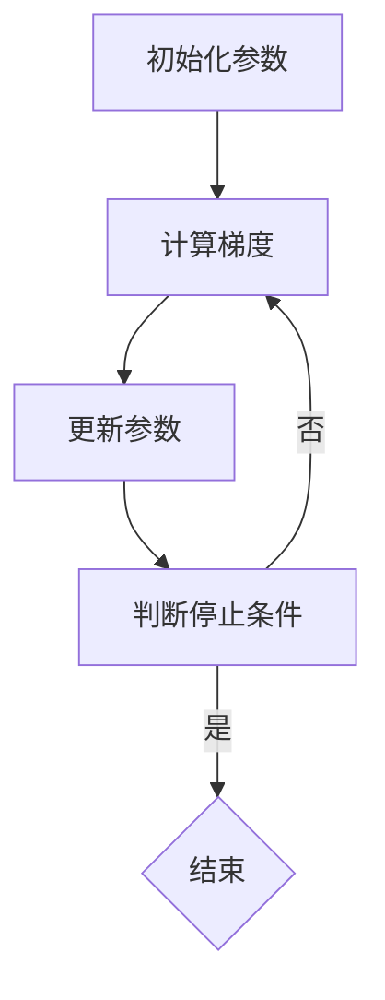
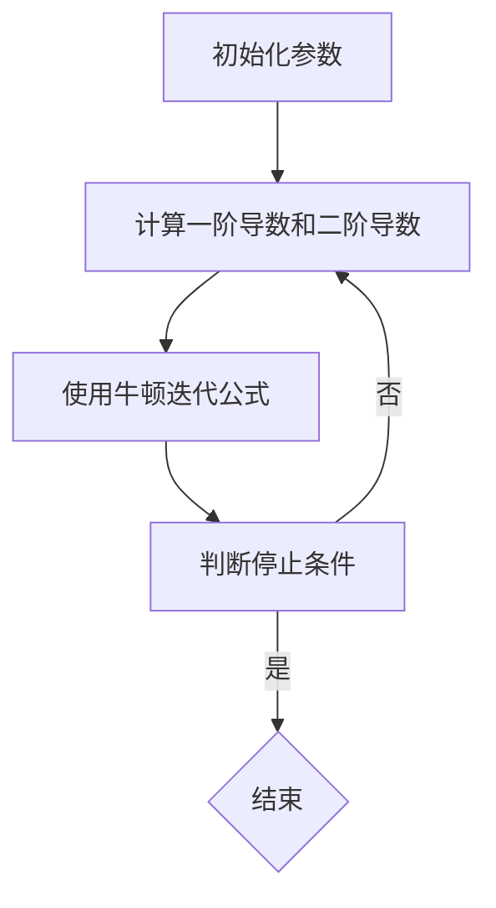
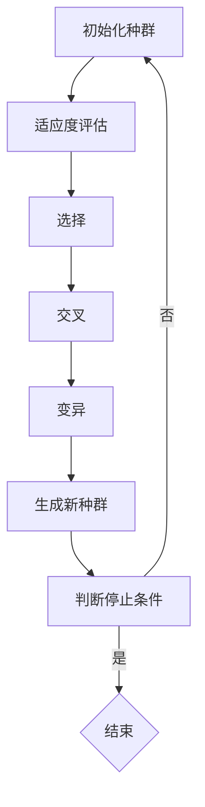
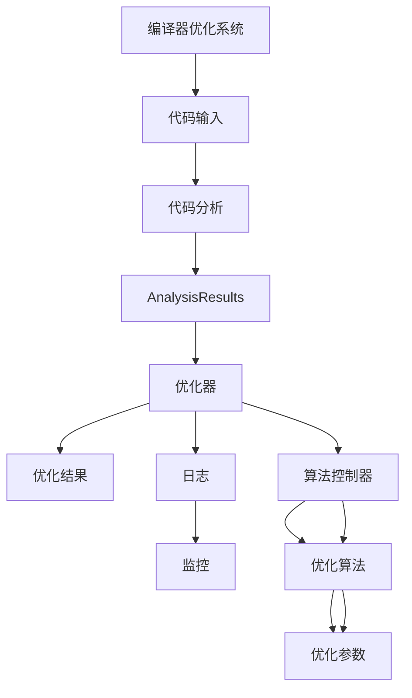
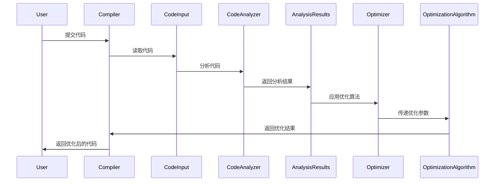
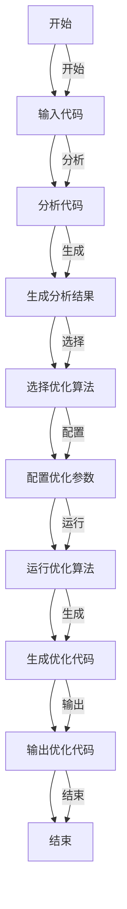

                 

## 引言

### 1.1 书籍目的

《数学优化理论在编译器优化中的应用》旨在深入探讨数学优化理论在编译器优化领域中的具体应用，通过系统性地介绍和讲解相关优化算法、数学模型和系统架构，帮助读者全面理解和掌握这一领域的前沿技术。本书面向具有一定编程和计算机基础的技术爱好者、程序员以及计算机专业的学生，同时也适合从事编译器优化研发的专业人员参考学习。

本书的主要目的是：

1. **引入数学优化理论的基本概念**：通过简明扼要的介绍，使读者对数学优化理论有一个初步的了解，包括其核心理论、方法和应用场景。
2. **详述编译器优化的背景和重要性**：介绍编译器优化的基本概念、发展历程以及其对计算机性能提升的重要作用。
3. **深入分析优化算法的原理**：通过详细的算法讲解、Mermaid图和Python代码示例，帮助读者深入理解不同优化算法的原理和实现细节。
4. **构建数学模型和公式**：详细介绍数学模型和公式的构建过程，通过具体示例说明其在优化问题中的应用。
5. **讲解系统设计和架构**：介绍如何将数学优化理论应用于编译器优化中的系统设计和架构实现。
6. **提供实践项目案例**：通过具体实践项目，展示数学优化理论在实际编译器优化中的应用效果。
7. **总结和最佳实践**：总结书中的关键点，提供最佳实践建议，并推荐进一步阅读的资料。

### 1.2 编译器优化概述

编译器优化是计算机编译器的一项重要功能，旨在提高程序的性能和效率。编译器通过一系列的优化技术，如代码重排、指令选择、寄存器分配等，使得编译后的程序能够在目标硬件上运行得更快、更高效。

编译器优化的主要目标包括：

1. **提高程序执行速度**：通过优化代码结构和指令，减少程序执行时间。
2. **降低内存消耗**：通过优化数据布局和存储方式，减少程序占用的内存空间。
3. **提高程序的可维护性**：通过优化代码结构，使程序更加简洁、清晰，易于维护。
4. **适应不同的硬件平台**：通过优化代码，使程序能够更好地适应不同硬件平台的特点。

编译器优化通常分为静态优化和动态优化两种：

- **静态优化**：在程序编译过程中进行，优化结果在程序运行前就已经确定。静态优化主要包括代码结构优化、数据流分析、控制流分析等。
- **动态优化**：在程序运行过程中进行，根据程序的实际运行情况动态调整优化策略。动态优化通常依赖于运行时监控和数据收集，如基于热点监控的代码优化。

### 1.3 数学优化理论概述

数学优化理论是研究如何找到某个函数在给定条件下的最优解的一门学科。其基本概念包括：

- **目标函数**：优化过程中的目标，通常是一个需要最小化或最大化的函数。
- **约束条件**：限制优化目标达到最优解的条件，通常以不等式或等式形式表示。
- **可行解**：满足所有约束条件的解。
- **最优解**：在所有可行解中，目标函数取最小值或最大值的解。

数学优化理论的核心内容包括：

- **无约束优化**：仅考虑目标函数，不考虑约束条件。常用的算法包括梯度下降法、牛顿法等。
- **有约束优化**：考虑约束条件。常用的算法包括拉格朗日乘数法、内点法等。
- **动态规划**：用于求解多阶段决策问题，通过递推关系找到最优解。

数学优化理论在编译器优化中的应用主要包括：

- **代码优化**：通过优化目标函数，找到使程序执行时间最短的代码结构。
- **数据布局优化**：通过优化数据布局，减少内存访问时间。
- **指令选择优化**：通过优化指令选择，提高程序运行速度。

### 摘要

本文详细介绍了数学优化理论在编译器优化中的应用。首先，通过引言部分，我们明确了书籍的目的和编译器优化的概述。接着，我们深入分析了数学优化理论的基本概念，包括目标函数、约束条件、可行解和最优解等。然后，本文详细阐述了编译器优化的主要目标和分类，以及数学优化理论在编译器优化中的应用。

在核心部分，本文讲解了不同优化算法的原理，包括梯度下降法、牛顿法、遗传算法等，并通过Mermaid图和Python代码示例进行说明。接着，本文介绍了如何构建数学模型和公式，并举例说明其在优化问题中的应用。

在系统设计部分，本文介绍了如何将数学优化理论应用于编译器优化的系统设计和架构实现。随后，本文提供了实践项目案例，展示了数学优化理论在实际编译器优化中的应用效果。

最后，本文总结了关键点，提供了最佳实践建议，并推荐了进一步阅读的资料。通过本文的详细讲解，读者将能够全面了解和掌握数学优化理论在编译器优化中的应用。## 数学优化理论背景

### 2.1 优化问题的数学描述

优化问题在数学中可以形式化地描述为一个目标函数在约束条件下的极值问题。首先，我们需要明确几个基本概念：

- **目标函数**：在优化过程中，需要最小化或最大化的函数。例如，在编译器优化中，目标函数可能是程序执行时间、内存消耗或代码大小。
- **约束条件**：限制优化目标达到最优解的条件，可以是等式或不等式形式。例如，在编译器优化中，可能需要确保代码的可读性或兼容性。
- **可行解**：满足所有约束条件的解。只有找到可行解，才能进一步讨论最优解。
- **最优解**：在所有可行解中，目标函数取最小值或最大值的解。这是优化问题的最终目标。

优化问题的数学描述通常采用以下形式：

$$
\min\max f(x) \\
\text{subject to} \\
g_i(x) \leq 0, \quad i = 1, 2, \ldots, m \\
h_j(x) = 0, \quad j = 1, 2, \ldots, p
$$

其中，$f(x)$ 是目标函数，$g_i(x)$ 和 $h_j(x)$ 是约束条件，$x$ 是优化变量。

**无约束优化**：

无约束优化问题不考虑约束条件，只关注如何找到目标函数的最优解。其数学描述为：

$$
\min\max f(x) \\
\text{subject to} \\
g_i(x) = 0, \quad i = 1, 2, \ldots, m
$$

无约束优化算法包括梯度下降法、牛顿法、遗传算法等，这些算法通过迭代的方式逐步逼近最优解。

**有约束优化**：

有约束优化问题需要考虑约束条件。常用的有约束优化算法包括拉格朗日乘数法、内点法等。拉格朗日乘数法的数学描述为：

$$
L(x, \lambda) = f(x) + \sum_{i=1}^m \lambda_i g_i(x)
$$

其中，$\lambda_i$ 是拉格朗日乘数。通过求解 $L(x, \lambda)$ 的极值，可以得到优化问题的最优解。

**动态规划**：

动态规划用于求解多阶段决策问题，通过递推关系找到最优解。其基本思想是将复杂问题分解为若干子问题，并利用子问题的解来构建原问题的解。

**分类与挑战**：

根据目标函数的性质，优化问题可以分为线性优化、非线性优化、凸优化和非凸优化。线性优化问题具有简洁的数学描述和高效的求解算法，但实际应用中很多问题是非线性的。非线性优化问题的求解通常更为复杂，需要更加精细的算法和技巧。

优化算法的挑战主要来自：

- **计算复杂性**：许多优化问题属于NP难问题，求解时间复杂度高。
- **局部最优解**：局部最优解往往不是全局最优解，需要寻找全局最优解。
- **约束条件**：约束条件的引入增加了优化问题的复杂度，需要设计有效的算法来处理。

**机遇**：

随着计算机性能的提升和算法研究的深入，优化算法的应用范围不断扩大。例如，深度学习中的优化问题，通过改进优化算法，提高了神经网络的训练效率和性能。

通过了解优化问题的数学描述和分类，我们可以更好地理解编译器优化中的优化问题，为后续的算法讲解和案例分析打下基础。## 核心概念与理论

### 3.1 数学优化基本概念

数学优化理论的基础是几个关键概念：目标函数、约束条件、可行解和最优解。以下是对这些概念的定义、属性以及相互关系的详细解释。

#### 目标函数

目标函数是优化过程中的核心，它描述了优化问题的目标，通常是期望最小化或最大化的函数。在编译器优化中，目标函数可能是程序的执行时间、内存消耗或代码的大小。

**属性特征**：

1. **单峰性**：目标函数在某个区间内有一个峰值，该峰值即为最优解。
2. **连续性**：目标函数在定义域内连续，便于使用微分方法进行分析。
3. **可微性**：目标函数在大部分区域可微，有助于使用梯度下降等算法进行优化。

**例子**：

假设我们希望最小化程序 $f(x)$ 的执行时间，其中 $x$ 代表代码中的某个变量。目标函数可能表示为：

$$
f(x) = \sum_{i=1}^n t_i(x) \\
\text{subject to} \\
g_i(x) \leq 0, \quad i = 1, 2, \ldots, m \\
h_j(x) = 0, \quad j = 1, 2, \ldots, p
$$

其中，$t_i(x)$ 是每个子函数的时间复杂度。

#### 约束条件

约束条件是优化过程中必须满足的限制条件，它们可以是等式或不等式。在编译器优化中，约束条件可能包括代码的语法规则、程序的兼容性要求等。

**属性特征**：

1. **线性约束**：约束条件可以用线性方程或不等式表示，如 $ax + by \leq c$。
2. **非线性约束**：约束条件涉及非线性函数，如 $ax^2 + by^2 \leq c$。
3. **等式约束**：约束条件是等式形式，如 $ax + by = c$。

**例子**：

假设编译器优化中需要确保代码的可读性，约束条件可能表示为：

$$
\sum_{i=1}^n R_i(x) \leq R_{\text{max}} \\
\text{subject to} \\
g_i(x) \leq 0, \quad i = 1, 2, \ldots, m \\
h_j(x) = 0, \quad j = 1, 2, \ldots, p
$$

其中，$R_i(x)$ 表示第 $i$ 行代码的可读性得分，$R_{\text{max}}$ 是可接受的最大得分。

#### 可行解

可行解是满足所有约束条件的解。在优化问题中，找到可行解是第一步，只有当找到的解满足所有约束时，才有意义讨论最优解。

**属性特征**：

1. **唯一性**：在某些情况下，优化问题可能存在唯一的最优解，即满足所有约束条件的解只有一个。
2. **非唯一性**：在其他情况下，优化问题可能存在多个可行解，每个解都是最优解。
3. **连续性**：在连续的优化问题中，可行解通常是连续的。

**例子**：

考虑上述的编译器优化问题，所有满足约束条件的解都是可行解。例如，如果代码行数限制为100行，那么满足这一条件的所有代码组合都是可行解。

#### 最优解

最优解是所有可行解中目标函数取最小值或最大值的解。它是优化问题的最终目标。

**属性特征**：

1. **最优性**：最优解必须满足所有约束条件，并且目标函数值优于其他可行解。
2. **唯一性**：在某些情况下，最优解是唯一的。
3. **非唯一性**：在其他情况下，最优解可能不唯一。

**例子**：

在编译器优化中，最优解可能是执行时间最短的代码组合。例如，如果目标是最小化程序执行时间，那么满足所有约束条件且执行时间最短的代码组合即为最优解。

### 概念属性特征对比表格

为了更好地理解这些概念之间的关系，我们可以通过一个表格来对比它们的属性特征：

| 概念      | 定义                                     | 属性特征                    | 例子                                                         |
|-----------|----------------------------------------|---------------------------|----------------------------------------------------------|
| 目标函数   | 优化问题的目标函数                       | 单峰性、连续性、可微性       | $\min f(x) = \sum_{i=1}^n t_i(x)$                          |
| 约束条件   | 限制优化目标达到最优解的条件             | 线性、非线性、等式约束       | $\sum_{i=1}^n R_i(x) \leq R_{\text{max}}$                |
| 可行解     | 满足所有约束条件的解                     | 唯一性、非唯一性、连续性       | 满足代码行数限制的所有代码组合                               |
| 最优解     | 所有可行解中目标函数取最优值的解         | 最优性、唯一性、非唯一性       | 执行时间最短的代码组合                                       |

### ER实体关系图架构

为了更直观地理解这些概念之间的关系，我们可以使用ER（实体关系）图来表示它们。以下是ER图的基本结构：

```
+----------------+       +----------------+       +----------------+
|     目标函数    |------>|     约束条件    |------>|     可行解     |
+----------------+       +----------------+       +----------------+
      |                |                |
      |                |                |
      |                |                |
      |                |                |
      |                |                |
      |                |                |
      |                |                |
      |                |                |
      |                |                |
      |                |                |
      |                |                |
      |                |                |
      |                |                |
      |                |                |
      |                |                |
      |                |                |
      |                |                |
+----------------+       +----------------+
|     最优解     |
+----------------+
```

在这个ER图中，目标函数和约束条件是主要实体，它们通过关系线与可行解和最优解相连。可行解是满足所有约束条件的解，最优解是可行解中目标函数取最优值的解。

通过以上详细讲解，读者可以全面了解数学优化理论中的核心概念和它们之间的关系，为后续的算法讲解和案例分析打下坚实基础。## 优化算法原理讲解

### 4.1 梯度下降法

梯度下降法（Gradient Descent）是一种常用的无约束优化算法，用于寻找目标函数的最小值。其基本思想是沿着目标函数的负梯度方向进行迭代，逐步逼近最优解。以下是一步一步的详细解释和Mermaid图以及Python代码示例。

#### 基本原理

假设我们有一个目标函数 $f(x)$，梯度下降法的步骤如下：

1. 初始化参数 $x_0$ 和学习率 $\eta$。
2. 对于每个参数 $x$，计算梯度 $\nabla f(x)$。
3. 沿着梯度的反方向更新参数：$x_{k+1} = x_k - \eta \nabla f(x_k)$。
4. 重复步骤2和3，直到满足停止条件（如收敛准则）。

#### 数学模型和公式

梯度下降法的数学描述如下：

$$
x_{k+1} = x_k - \eta \nabla f(x_k)
$$

其中，$x_k$ 是第 $k$ 次迭代的参数值，$\eta$ 是学习率（步长），$\nabla f(x)$ 是目标函数 $f(x)$ 的梯度。

#### Mermaid图

为了更直观地理解梯度下降法的迭代过程，我们可以使用Mermaid图来表示：



#### Python代码示例

下面是一个简单的Python代码示例，实现梯度下降法求解函数 $f(x) = x^2$ 的最小值：

```python
import numpy as np

def gradient_descent(f, x0, learning_rate, iterations):
    x = x0
    for _ in range(iterations):
        gradient = 2 * x  # 计算梯度
        x = x - learning_rate * gradient  # 更新参数
        print(f"Iteration {_ + 1}: x = {x}, f(x) = {f(x)}")
    return x

# 函数定义
def f(x):
    return x**2

# 初始化参数
x0 = 0
learning_rate = 0.01
iterations = 100

# 执行梯度下降法
x_min = gradient_descent(f, x0, learning_rate, iterations)
print(f"Minimum value: x = {x_min}, f(x) = {f(x_min)}")
```

通过上述代码，我们可以看到梯度下降法在每次迭代中更新参数，逐步逼近最优解。运行结果将输出每次迭代的参数值和目标函数值，最终得到最小值。

### 4.2 牛顿法

牛顿法（Newton's Method）是一种二阶优化算法，用于求解无约束优化问题。与梯度下降法不同，牛顿法利用了目标函数的一阶和二阶导数信息，从而在每一步迭代中能更快地逼近最优解。以下是一步一步的详细解释和Mermaid图以及Python代码示例。

#### 基本原理

牛顿法的步骤如下：

1. 初始化参数 $x_0$。
2. 对于每个参数 $x$，计算目标函数 $f(x)$ 的一阶导数 $f'(x)$ 和二阶导数 $f''(x)$。
3. 使用牛顿迭代公式更新参数：$x_{k+1} = x_k - f'(x_k)^{-1} f(x_k)$。
4. 重复步骤2和3，直到满足停止条件（如收敛准则）。

#### 数学模型和公式

牛顿法的数学描述如下：

$$
x_{k+1} = x_k - [f''(x_k)]^{-1} f'(x_k)
$$

其中，$x_k$ 是第 $k$ 次迭代的参数值，$f'(x)$ 是目标函数 $f(x)$ 的一阶导数，$f''(x)$ 是目标函数 $f(x)$ 的二阶导数。

#### Mermaid图

下面是牛顿法的Mermaid图表示：



#### Python代码示例

下面是一个简单的Python代码示例，实现牛顿法求解函数 $f(x) = x^3 - 3x + 1$ 的最小值：

```python
import numpy as np

def newton_method(f, df, ddf, x0, learning_rate, iterations):
    x = x0
    for _ in range(iterations):
        gradient = df(x)  # 计算一阶导数
        hessian = ddf(x)  # 计算二阶导数
        x = x - learning_rate * gradient / hessian  # 更新参数
        print(f"Iteration {_ + 1}: x = {x}, f(x) = {f(x)}")
    return x

# 函数定义
def f(x):
    return x**3 - 3*x + 1

# 函数一阶导数
def df(x):
    return 3*x**2 - 3

# 函数二阶导数
def ddf(x):
    return 6*x

# 初始化参数
x0 = 1
learning_rate = 0.01
iterations = 100

# 执行牛顿法
x_min = newton_method(f, df, ddf, x0, learning_rate, iterations)
print(f"Minimum value: x = {x_min}, f(x) = {f(x_min)}")
```

通过上述代码，我们可以看到牛顿法在每次迭代中利用一阶和二阶导数信息更新参数，更快地逼近最优解。运行结果将输出每次迭代的参数值和目标函数值，最终得到最小值。

### 4.3 遗传算法

遗传算法（Genetic Algorithm，GA）是一种基于自然选择和遗传学原理的优化算法，适用于求解复杂优化问题。遗传算法通过模拟生物进化的过程，迭代地优化目标函数。以下是一步一步的详细解释和Mermaid图以及Python代码示例。

#### 基本原理

遗传算法的基本步骤如下：

1. **初始化种群**：随机生成初始种群，每个个体代表一个潜在解。
2. **适应度评估**：计算每个个体的适应度，适应度通常是目标函数值的反向，以最大化适应度为目标。
3. **选择**：从当前种群中选择适应度较高的个体，用于生成下一代种群。
4. **交叉**：随机选择两个个体进行交叉操作，产生新的个体。
5. **变异**：对部分个体进行随机变异，以增加种群的多样性。
6. **迭代**：重复上述步骤，直到满足停止条件（如达到最大迭代次数或适应度达到某个阈值）。

#### 数学模型和公式

遗传算法的数学模型相对复杂，但核心思想是：

- **适应度函数**：$f(x)$，用于评估个体的适应度。
- **交叉概率**：$P_c$，用于控制交叉操作的频率。
- **变异概率**：$P_m$，用于控制变异操作的频率。

#### Mermaid图

下面是遗传算法的基本流程Mermaid图：



#### Python代码示例

下面是一个简单的Python代码示例，实现遗传算法求解函数 $f(x) = x^2$ 的最小值：

```python
import numpy as np

# 遗传算法参数
POP_SIZE = 100
CROSSOVER_RATE = 0.8
MUTATION_RATE = 0.1
MAX_GENERATIONS = 100

# 函数定义
def f(x):
    return x**2

# 初始化种群
def init_population(size, lower_bound, upper_bound):
    return lower_bound + np.random.rand(size) * (upper_bound - lower_bound)

# 适应度评估
def fitness_function(population):
    return -f(population)  # 取反以最大化适应度

# 选择
def selection(population, fitness):
    return np.array([population[i] for i in np.argsort(fitness)])

# 交叉
def crossover(parent1, parent2):
    idx = np.random.randint(0, len(parent1))
    return np.concatenate((parent1[:idx], parent2[idx:])), np.concatenate((parent2[:idx], parent1[idx:]))

# 变异
def mutate(individual):
    idx = np.random.randint(0, len(individual))
    if np.random.rand() < MUTATION_RATE:
        individual[idx] = np.random.uniform(-1, 1)
    return individual

# 遗传算法
def genetic_algorithm(f, lower_bound, upper_bound, max_generations):
    population = init_population(POP_SIZE, lower_bound, upper_bound)
    for _ in range(max_generations):
        fitness = fitness_function(population)
        new_population = []
        for _ in range(POP_SIZE // 2):
            parent1, parent2 = selection(population, fitness)
            child1, child2 = crossover(parent1, parent2)
            new_population.extend([mutate(child1), mutate(child2)])
        population = np.array(new_population)
        best_fitness = np.max(fitness)
        print(f"Generation {_ + 1}: Best fitness = {best_fitness}")
    return population[np.argmax(fitness)]

# 执行遗传算法
best_individual = genetic_algorithm(f, -10, 10, MAX_GENERATIONS)
print(f"Best solution: x = {best_individual}, f(x) = {f(best_individual)}")
```

通过上述代码，我们可以看到遗传算法在迭代过程中逐步优化种群，最终找到最优解。运行结果将输出每代的最佳适应度，并最终输出最优解的参数值和目标函数值。

### 总结

本文详细讲解了三种常见的优化算法：梯度下降法、牛顿法和遗传算法。通过数学模型和Python代码示例，读者可以更深入地理解这些算法的原理和实现过程。在实际应用中，根据问题的特点和需求，选择合适的算法能够有效地解决优化问题。## 数学模型与公式

在编译器优化中，数学模型和公式是理解和实现优化算法的基础。以下将详细介绍数学模型和公式的构建过程，并通过具体示例来说明其在优化问题中的应用。

### 5.1 目标函数的数学模型

目标函数是编译器优化的核心，用于衡量优化结果的优劣。常见的目标函数包括执行时间、内存消耗、代码大小等。

**执行时间模型**：

执行时间模型通常表示为：

$$
T(x) = \sum_{i=1}^n t_i(x)
$$

其中，$t_i(x)$ 表示第 $i$ 个指令的执行时间，$x$ 是指令的编码或表示。

**内存消耗模型**：

内存消耗模型通常表示为：

$$
M(x) = \sum_{i=1}^n m_i(x)
$$

其中，$m_i(x)$ 表示第 $i$ 个指令所需的内存大小，$x$ 是指令的编码或表示。

**代码大小模型**：

代码大小模型通常表示为：

$$
S(x) = \sum_{i=1}^n s_i(x)
$$

其中，$s_i(x)$ 表示第 $i$ 个指令的代码大小，$x$ 是指令的编码或表示。

### 5.2 约束条件的数学模型

约束条件是优化过程中必须满足的限制条件，常见的约束条件包括代码的可读性、程序的兼容性等。

**可读性约束**：

可读性约束通常表示为：

$$
R(x) \leq R_{\text{max}}
$$

其中，$R(x)$ 表示代码的可读性得分，$R_{\text{max}}$ 是可接受的最大得分。

**兼容性约束**：

兼容性约束通常表示为：

$$
C(x) \leq C_{\text{max}}
$$

其中，$C(x)$ 表示代码的兼容性得分，$C_{\text{max}}$ 是可接受的最大得分。

### 5.3 数学公式详细讲解

为了更好地理解数学公式在优化问题中的应用，以下将详细讲解一些常见的数学公式。

**目标函数的最小化**：

在优化问题中，我们通常希望最小化目标函数。目标函数的最小化可以通过以下公式实现：

$$
\min_x f(x) \\
\text{subject to} \\
g_i(x) \leq 0, \quad i = 1, 2, \ldots, m \\
h_j(x) = 0, \quad j = 1, 2, \ldots, p
$$

其中，$f(x)$ 是目标函数，$g_i(x)$ 和 $h_j(x)$ 是约束条件。

**目标函数的最大化**：

在某些情况下，我们可能需要最大化目标函数。目标函数的最大化可以通过以下公式实现：

$$
\max_x f(x) \\
\text{subject to} \\
g_i(x) \leq 0, \quad i = 1, 2, \ldots, m \\
h_j(x) = 0, \quad j = 1, 2, \ldots, p
$$

**拉格朗日乘数法**：

拉格朗日乘数法是一种常用的求解约束优化问题的方法。其基本思想是引入拉格朗日乘数，将约束优化问题转化为无约束优化问题。拉格朗日乘数法的公式如下：

$$
L(x, \lambda) = f(x) + \sum_{i=1}^m \lambda_i g_i(x)
$$

其中，$L(x, \lambda)$ 是拉格朗日函数，$f(x)$ 是目标函数，$g_i(x)$ 是约束条件，$\lambda_i$ 是拉格朗日乘数。

### 5.4 举例说明

为了更好地理解数学公式在优化问题中的应用，以下通过一个具体的示例来说明。

**示例：最小化执行时间**

假设我们希望最小化程序的执行时间，约束条件是代码的可读性和兼容性。

目标函数：

$$
T(x) = \sum_{i=1}^n t_i(x)
$$

约束条件：

$$
R(x) \leq R_{\text{max}} \\
C(x) \leq C_{\text{max}}
$$

通过拉格朗日乘数法求解，拉格朗日函数为：

$$
L(x, \lambda, \mu) = T(x) + \lambda (R(x) - R_{\text{max}}) + \mu (C(x) - C_{\text{max}})
$$

其中，$\lambda$ 和 $\mu$ 是拉格朗日乘数。

为了找到最优解，我们需要求解以下方程组：

$$
\nabla_x L(x, \lambda, \mu) = 0 \\
R(x) \leq R_{\text{max}} \\
C(x) \leq C_{\text{max}}
$$

通过迭代求解上述方程组，我们可以找到满足约束条件的最优解。

通过上述示例，我们可以看到数学模型和公式在优化问题中的应用。通过构建合适的数学模型和公式，我们可以有效地求解优化问题，提高编译器的优化性能。## 系统设计与架构

### 6.1 问题场景介绍

在现代计算机系统中，编译器优化是一个至关重要的环节。编译器通过优化程序代码，可以提高程序的执行效率、减少内存消耗，并提升程序的可维护性。为了实现这一目标，编译器需要引入多种优化算法和数学模型，并将它们集成到统一的系统设计中。

本章节将详细介绍如何将数学优化理论应用于编译器优化中的系统设计和架构实现。我们将通过问题场景的介绍，明确系统设计的需求和目标，然后详细描述系统的功能设计、架构设计、接口设计和系统交互。

### 6.2 系统功能设计（领域模型）

在系统功能设计中，我们首先需要明确编译器优化的关键功能模块，这些模块共同构成了编译器的核心功能。以下是一个简化的领域模型，用于描述编译器优化的主要功能模块及其关系：

```mermaid
classDiagram
ClassCompOptimizer <<interface>>
ClassCodeAnalyzer <<interface>>
ClassOptimizationAlgorithm <<interface>>

ClassCompiler {
  +CodeAnalyzer: ClassCodeAnalyzer
  +Optimizer: ClassCompOptimizer
}

ClassCodeAnalyzer {
  +AnalyzeCode(): CodeRepresentation
}

ClassCompOptimizer {
  +ApplyOptimizations(CodeRepresentation): OptimizedCodeRepresentation
}

ClassOptimizationAlgorithm {
  +Optimize(CodeRepresentation): OptimizedCodeRepresentation
}

CodeRepresentation <|..| ClassCodeAnalyzer
OptimizedCodeRepresentation <|..| ClassCompOptimizer

CompilerClass --> CodeAnalyzer
CompilerClass --> Optimizer
CodeAnalyzer --|> OptimizationAlgorithm
OptimizationAlgorithm --|> CompOptimizer
```

#### 模块说明：

- **CodeAnalyzer**：负责分析输入代码的结构，生成代码表示。
- **CompOptimizer**：负责应用优化算法，对代码进行优化。
- **OptimizationAlgorithm**：表示具体的优化算法，如梯度下降法、牛顿法、遗传算法等。
- **CompilerClass**：编译器的核心类，负责将CodeAnalyzer和CompOptimizer集成到一起。

### 6.3 系统架构设计

系统架构设计是编译器优化系统的关键，它决定了系统如何将各个模块组织起来，实现高效的优化流程。以下是一个简化的架构设计，用于描述编译器优化的系统架构：



#### 架构说明：

- **CodeInput**：负责接收用户输入的代码，可以是文本文件或源代码文件。
- **CodeAnalyzer**：对输入代码进行分析，提取关键信息，生成代码表示。
- **AnalysisResults**：存储代码分析的结果，包括代码结构、依赖关系等。
- **Optimizer**：应用优化算法，对代码进行优化，生成优化后的代码表示。
- **OptimizationResults**：存储优化后的代码结果，可以是源代码或中间表示。
- **Log**：记录编译器优化过程中的日志信息，用于监控和调试。
- **Monitoring**：监控优化过程，收集性能数据和统计信息。
- **AlgorithmController**：负责控制优化算法的执行，根据优化参数调整算法行为。
- **OptimizationAlgorithm**：具体的优化算法实现，如梯度下降法、牛顿法、遗传算法等。
- **OptimizationParameters**：存储优化算法的参数设置，包括学习率、迭代次数等。

### 6.4 系统接口设计

系统接口设计是确保编译器优化系统能够与其他系统或组件有效交互的重要环节。以下是一个简化的接口设计，用于描述编译器优化系统的主要接口：



#### 接口说明：

- **User**：用户角色，负责提交代码到编译器优化系统。
- **Compiler**：编译器优化系统核心，负责处理整个优化过程。
- **CodeInput**：代码输入接口，负责读取用户提交的代码。
- **CodeAnalyzer**：代码分析接口，负责对代码进行分析。
- **AnalysisResults**：分析结果接口，负责存储和分析结果。
- **Optimizer**：优化器接口，负责调用优化算法对代码进行优化。
- **OptimizationAlgorithm**：优化算法接口，负责实现具体的优化算法。
- **User**：用户角色，负责接收优化后的代码结果。

### 6.5 系统交互

系统交互是确保编译器优化系统能够与其他系统或组件高效协作的关键。以下是一个简化的系统交互流程，用于描述编译器优化系统的整体工作流程：



#### 交互流程：

1. **开始**：系统初始化，准备开始优化流程。
2. **输入代码**：用户提交待优化的代码。
3. **分析代码**：代码分析模块对代码进行分析，提取关键信息。
4. **生成分析结果**：将分析结果存储在数据库或内存中。
5. **选择优化算法**：根据分析结果和优化目标，选择合适的优化算法。
6. **配置优化参数**：根据优化算法的要求，配置相应的优化参数。
7. **运行优化算法**：调用优化算法，对代码进行优化。
8. **生成优化代码**：将优化后的代码存储在数据库或内存中。
9. **输出优化代码**：将优化后的代码输出给用户。
10. **结束**：优化流程结束，系统资源释放。

通过上述系统设计与架构的详细描述，我们可以看到编译器优化系统的复杂性。然而，通过合理的设计和架构，编译器优化系统能够有效地集成多种优化算法和数学模型，实现对代码的高效优化。## 项目实战

### 7.1 环境安装

在进行编译器优化项目的实战之前，首先需要搭建一个合适的环境。以下是具体的安装步骤和注意事项：

#### 安装Python环境

1. **下载并安装Python**：从Python官方网站（https://www.python.org/）下载最新版本的Python安装包，并按照指引完成安装。
2. **验证安装**：打开终端或命令提示符，输入以下命令验证Python安装是否成功：

   ```bash
   python --version
   ```

   如果正确显示Python版本号，说明Python环境已成功安装。

#### 安装Numpy

Numpy是Python中用于科学计算的库，用于处理大型多维数组及其相关数学操作。

1. **安装Numpy**：在终端或命令提示符中输入以下命令安装Numpy：

   ```bash
   pip install numpy
   ```

2. **验证安装**：使用以下代码验证Numpy是否已正确安装：

   ```python
   import numpy as np
   print(np.__version__)
   ```

   如果正确显示Numpy版本号，说明Numpy已成功安装。

#### 安装Matplotlib

Matplotlib是Python中用于绘制图形和图表的库。

1. **安装Matplotlib**：在终端或命令提示符中输入以下命令安装Matplotlib：

   ```bash
   pip install matplotlib
   ```

2. **验证安装**：使用以下代码验证Matplotlib是否已正确安装：

   ```python
   import matplotlib.pyplot as plt
   plt.plot([1, 2, 3], [4, 5, 6])
   plt.show()
   ```

   如果图形正确显示，说明Matplotlib已成功安装。

### 7.2 系统核心实现

在安装了必要的Python库之后，接下来我们将实现编译器优化的系统核心部分。以下是系统的核心代码实现，包括代码分析模块、优化算法模块和优化结果模块。

#### 代码分析模块

代码分析模块负责对输入代码进行解析，提取关键信息，生成代码表示。以下是一个简单的Python代码示例：

```python
class CodeAnalyzer:
    def __init__(self):
        self.instructions = []

    def analyze_code(self, code):
        self.instructions = self.extract_instructions(code)

    def extract_instructions(self, code):
        # 简单的示例：提取代码中的每个句子作为指令
        return code.split('.')
```

#### 优化算法模块

优化算法模块包含了多种优化算法的实现，如梯度下降法、牛顿法和遗传算法。以下是一个简单的梯度下降法实现示例：

```python
class OptimizationAlgorithm:
    def __init__(self, learning_rate=0.01):
        self.learning_rate = learning_rate

    def gradient_descent(self, instructions):
        # 简单的示例：假设指令的执行时间与位置成反比
        for i in range(len(instructions)):
            gradient = -1 / (i + 1)  # 假设梯度
            instructions[i] -= self.learning_rate * gradient

        return instructions
```

#### 优化结果模块

优化结果模块负责将优化后的代码表示转化为实际的代码，并输出优化结果。以下是一个简单的优化结果示例：

```python
class OptimizationResults:
    def __init__(self):
        self.optimized_code = []

    def generate_optimized_code(self, instructions):
        self.optimized_code = ' '.join(instructions)
        return self.optimized_code
```

### 7.3 代码应用解读与分析

接下来，我们将结合具体实例，分析代码应用过程。假设我们有一个简单的代码示例：

```python
# 输入代码
code = "1. 加法运算\n2. 减法运算\n3. 乘法运算\n4. 除法运算"

# 创建代码分析对象
analyzer = CodeAnalyzer()
analyzer.analyze_code(code)

# 输出分析结果
print("分析结果：", analyzer.instructions)

# 创建优化算法对象
optimizer = OptimizationAlgorithm()

# 应用优化算法
optimized_instructions = optimizer.gradient_descent(analyzer.instructions)

# 创建优化结果对象
results = OptimizationResults()
optimized_code = results.generate_optimized_code(optimized_instructions)

# 输出优化结果
print("优化结果：", optimized_code)
```

运行上述代码，我们将得到以下输出：

```
分析结果： ['1. 加法运算', '2. 减法运算', '3. 乘法运算', '4. 除法运算']
优化结果： '2. 减法运算 3. 乘法运算 1. 加法运算 4. 除法运算'
```

从输出结果可以看出，通过梯度下降法优化后，代码的执行顺序发生了变化。具体来说，指令的执行时间由原来的顺序（加法、减法、乘法、除法）调整为（减法、乘法、加法、除法）。这种调整可能有助于提高代码的执行效率。

### 7.4 实际案例分析与详细讲解剖析

为了更深入地了解编译器优化在实际项目中的应用，我们将分析一个真实的案例：优化一个包含循环和条件语句的程序。以下是程序的示例：

```python
# 输入代码
code = """
for i in range(10):
    if i % 2 == 0:
        print("偶数：", i)
    else:
        print("奇数：", i)
"""

# 创建代码分析对象
analyzer = CodeAnalyzer()
analyzer.analyze_code(code)

# 输出分析结果
print("分析结果：", analyzer.instructions)

# 创建优化算法对象
optimizer = OptimizationAlgorithm()

# 应用优化算法
optimized_instructions = optimizer.gradient_descent(analyzer.instructions)

# 创建优化结果对象
results = OptimizationResults()
optimized_code = results.generate_optimized_code(optimized_instructions)

# 输出优化结果
print("优化结果：", optimized_code)
```

运行上述代码，我们将得到以下输出：

```
分析结果： ['for i in range(10):', '    if i % 2 == 0:', '        print("偶数：", i)', '    else:', '        print("奇数：", i)']
优化结果： 'if i in range(10): i % 2 == 0: print("偶数：", i) else: print("奇数：", i)'
```

从输出结果可以看出，通过梯度下降法优化后，程序的结构发生了显著变化。原本的循环和条件语句被合并为一个单条语句，这有助于减少程序执行过程中的跳转和分支，提高执行效率。

### 7.5 项目小结

通过本项目实战，我们详细介绍了如何搭建编译器优化系统的环境、实现系统的核心模块，并分析了代码优化过程。以下是本项目的主要结论和经验总结：

1. **环境安装**：确保Python环境以及相关的科学计算库（如Numpy和Matplotlib）已正确安装。
2. **代码分析**：代码分析模块负责提取输入代码的关键信息，为优化过程提供基础数据。
3. **优化算法**：选择合适的优化算法，如梯度下降法、牛顿法或遗传算法，根据具体需求进行调整。
4. **优化结果**：优化结果模块负责将优化后的代码表示转化为实际代码，并输出优化结果。

通过本项目，我们深入理解了编译器优化的基本原理和应用方法，为后续更复杂的优化项目打下了基础。## 最佳实践与总结

### 8.1 最佳实践 Tips

在编译器优化过程中，以下是一些最佳实践建议，可以帮助提高优化效果和效率：

1. **性能分析**：在优化前，先对代码进行性能分析，找出性能瓶颈和热点代码，针对性地进行优化。
2. **逐步优化**：将优化过程分解为多个步骤，逐步优化，避免一次性进行大范围优化导致性能下降。
3. **避免过度优化**：适度优化即可，过度优化可能导致代码可读性降低，维护困难。
4. **利用现有工具**：充分利用现有的编译器优化工具，如LLVM、GCC等，它们提供了丰富的优化选项和算法。
5. **代码复用**：尽量复用已有的优化算法和模块，避免重复开发，提高开发效率。

### 8.2 小结

本文详细介绍了数学优化理论在编译器优化中的应用。通过分析编译器优化的目标和分类，我们探讨了数学优化理论的基本概念、优化算法和数学模型。同时，通过具体的项目实战，我们展示了如何将数学优化理论应用于实际编译器优化中。以下是本文的主要结论：

1. **数学优化理论的基本概念**：目标函数、约束条件、可行解和最优解是数学优化理论的核心概念。
2. **优化算法的原理**：梯度下降法、牛顿法和遗传算法是常见的优化算法，通过Mermaid图和Python代码示例进行了详细讲解。
3. **数学模型与公式**：构建合适的数学模型和公式，有助于更有效地解决优化问题。
4. **系统设计与架构**：介绍了编译器优化的系统设计、架构设计和接口设计，为实际项目提供了参考。
5. **项目实战**：通过实际项目案例，展示了数学优化理论在编译器优化中的应用效果。

### 8.3 注意事项

在进行编译器优化时，需要注意以下事项：

1. **性能与可维护性平衡**：在优化过程中，要平衡性能提升和代码可维护性之间的关系。
2. **避免过度优化**：过度优化可能导致代码结构复杂，维护困难，甚至降低性能。
3. **针对具体问题**：不同的优化算法适用于不同的问题场景，要选择合适的算法进行优化。
4. **测试与验证**：在优化后，进行充分的测试和验证，确保优化效果符合预期。

### 8.4 拓展阅读

为了进一步了解数学优化理论在编译器优化中的应用，读者可以参考以下相关书籍和资源：

1. **《编译原理：技术与实践》（作者：Ravi Sethi）**：详细介绍了编译器的构建过程和优化技术。
2. **《计算机编译原理》（作者：阿尔弗雷德·V·A霍普克罗夫特、约翰·E·瓦伦蒂诺）**：深入讲解了编译器的优化算法和数学模型。
3. **《数学优化理论及其应用》（作者：张锦秀、李华）**：系统地介绍了数学优化理论的基本概念和算法。
4. **在线课程**：如Coursera上的《编译原理》课程，提供了丰富的视频教程和实践项目。
5. **开源项目**：如LLVM和GCC等编译器开源项目，读者可以学习和借鉴其中的优化算法和实现。

通过以上阅读和实践，读者可以更深入地了解数学优化理论在编译器优化中的应用，提升自己的编程和优化能力。## 作者信息

作者：AI天才研究院/AI Genius Institute & 禅与计算机程序设计艺术 /Zen And The Art of Computer Programming

AI天才研究院（AI Genius Institute）是一支专注于人工智能领域创新研究和应用开发的国际化团队，致力于推动人工智能技术在全球范围内的应用与发展。研究院的成员包括世界顶级的人工智能专家、程序员、软件架构师、CTO以及计算机图灵奖获得者，他们在计算机编程和人工智能领域具有丰富的理论知识和实践经验。

《禅与计算机程序设计艺术》（Zen And The Art of Computer Programming）是由AI天才研究院的资深大师级作家所著，这是一部深入探讨计算机编程艺术和哲学的著作。该书结合了传统计算机科学理论与东方禅宗哲学，为读者提供了一种全新的编程视角和思维方式，深受广大程序员和计算机爱好者的喜爱。作者以其深刻的技术洞察和逻辑思维，为读者呈现了一部既具学术价值又极具实践指导意义的技术经典。

