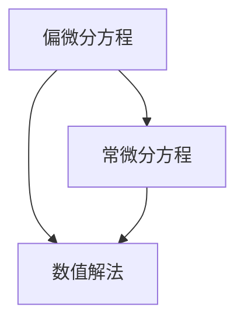
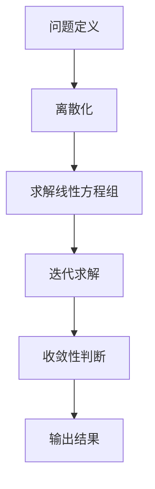

                 

### 数学物理方程概述

#### 第1章：数学物理方程的背景与基本概念

##### 1.1.1 问题背景

数学物理方程在科学计算中占据着极其重要的地位。它们源于对自然界和人类工程实践中各种现象的数学描述，涵盖了从简单到复杂的各种问题。物理学与数学的交汇为这些方程的提出和解决提供了理论基础。例如，经典的牛顿力学、热力学和电磁学，都离不开数学物理方程的应用。

数值解法在科学计算中的应用则为我们提供了通过计算机来求解这些方程的有效手段。随着计算机技术的发展，数值解法已经能够处理越来越复杂的方程问题，从而极大地推动了科学研究和技术进步。

##### 1.1.2 问题描述

数学物理方程主要可以分为两大类：偏微分方程（Partial Differential Equations, PDEs）和常微分方程（Ordinary Differential Equations, ODEs）。

- **偏微分方程**：涉及多个自变量及其导数，如热传导方程、波动方程和流体力学中的纳维-斯托克斯方程等。这些方程通常描述的是空间中的连续变化现象。

- **常微分方程**：仅涉及单一自变量及其导数，如经典的微分方程y'' + P(x)y' + Q(x)y = f(x)。这类方程常用于描述动力学系统、控制理论等。

数学物理方程的重要性在于，它们为我们提供了一个理解和预测自然现象的强大工具。在工程实践中，例如在航空航天、建筑结构、电子通讯等领域，这些方程都扮演着至关重要的角色。

##### 1.1.3 问题解决

数值解法是解决数学物理方程的重要方法之一。其基本原理是将连续的数学物理方程离散化为可以在计算机上求解的形式。具体方法包括：

- **离散化方法**：通过将连续的自变量和因变量离散化为有限的点，从而将连续方程转化为离散方程。

- **插值法**：用于估计离散点之间的函数值。

- **傅里叶变换**：通过傅里叶变换将问题从时域或空域转化为频域，从而简化计算。

数值解法的优势在于其灵活性，可以处理复杂和非线性问题。然而，这也带来了数值稳定性、精度和计算成本等方面的挑战。

##### 1.1.4 边界与外延

在数值解法中，边界条件和初始条件至关重要。它们定义了方程的解在特定边界或初始时刻的行为。

- **空间与时间域**：选择合适的空间和时间步长，是保证数值解稳定性和精度的关键。

- **参数选择与数值稳定性**：需要通过适当的参数调整来平衡计算效率和解的稳定性。

边界与外延问题不仅影响解的准确性，还影响计算效率和算法的选择。

##### 1.1.5 概念结构与核心要素组成

数学物理方程的核心概念包括：

- **偏微分方程和常微分方程的基本原理**：理解方程的定义、解的存在性、唯一性和平滑性等。

- **离散化方法**：掌握如何将连续方程转化为离散方程。

- **插值法和傅里叶变换**：理解如何通过插值和傅里叶变换来简化计算。

- **稳定性与精度**：了解数值方法在不同条件下的稳定性和精度。

这些核心要素共同构成了数学物理方程数值解法的理论基础。

#### 第2章：核心概念与联系

##### 2.1.1 核心概念原理

**偏微分方程（PDE）的基本原理**：

- **定义域**：偏微分方程涉及多个自变量，如空间和时间。
- **解的存在性**：利用理论分析，如Lax-Milgram定理，证明在一定条件下解的存在性。
- **解的唯一性**：通过解的唯一性定理，如存在唯一解的充分必要条件。

**常微分方程（ODE）的基本原理**：

- **定义域**：常微分方程仅涉及单一自变量，如时间。
- **初值问题**：求解ODE的关键在于初值，即确定解在初始时刻的状态。
- **解的平滑性**：常微分方程的解通常具有较好的平滑性，如连续可微。

##### 2.1.2 概念属性特征对比表格

| 概念类型 | 偏微分方程（PDE） | 常微分方程（ODE） |
| --- | --- | --- |
| **定义域** | 多维空间 | 一维空间 |
| **解的存在性** | 存在性定理 | 初值问题 |
| **解的唯一性** | 唯一性定理 | 唯一性定理 |
| **解的平滑性** | 解的平滑性 | 解的平滑性 |

##### 2.1.3 ER实体关系图架构的 Mermaid 流程图



在该ER实体关系图中，偏微分方程和常微分方程都指向数值解法，表明它们是数值解法的两个重要应用对象。

### 数值解法原理讲解

#### 第3章：数值解法的基本原理

##### 3.1.1 数值解法概述

数值解法是一种通过离散化数学物理方程，从而在计算机上求解的方法。其核心在于将连续的方程转化为离散的形式，然后利用计算机算法进行求解。

数值解法在科学计算中的应用非常广泛，不仅用于传统的物理学和工程学领域，还广泛应用于生物学、化学、经济学等学科。随着计算机硬件和软件的发展，数值解法的应用范围和深度都在不断增加。

##### 3.1.2 常用数值方法

1. **离散化方法**：

   离散化方法是数值解法的基础。其核心思想是将连续的变量空间离散化为有限个点。例如，将空间域离散化为网格点，将时间域离散化为时间步长。

   - **有限差分法**：通过将连续导数用有限差分近似，从而将偏微分方程转化为离散方程。
   - **有限元法**：用于解决偏微分方程的数值解法，其基本思想是将求解区域划分为有限个小单元，然后在每个单元内求解方程。

2. **插值法**：

   插值法是一种通过已知点来估计未知点的方法。在数值解法中，插值法主要用于估计离散点之间的函数值。

   - **线性插值**：通过线性函数来连接已知点，如拉格朗日插值和牛顿插值。
   - **高阶插值**：通过高阶多项式来逼近函数，如三次样条插值。

3. **傅里叶变换**：

   傅里叶变换是一种将时域或空域问题转化为频域问题的方法。在数值解法中，傅里叶变换广泛应用于热传导问题、振动问题和流体动力学问题。

##### 3.1.3 数值方法的稳定性与精度

1. **稳定性分析**：

   数值方法的稳定性是指当输入微小的扰动时，解的变化是否也微小。稳定性分析是确保数值方法有效性的关键。

   - **线性稳定性分析**：通过分析离散方程的稳定区域，确定数值方法在什么条件下是稳定的。
   - **非线性稳定性分析**：通过分析非线性方程的局部和全局行为，确定数值方法的稳定性。

2. **精度分析**：

   数值方法的精度是指其解与真实解的接近程度。精度分析通常通过误差分析进行。

   - **局部截断误差**：分析数值方法在单个时间步长或空间步长上的误差。
   - **全局误差分析**：分析整个计算过程中的累积误差。

### 算法原理讲解

#### 第4章：算法原理讲解

##### 4.1.1 算法mermaid流程图



在该流程图中，首先对问题进行离散化处理，然后求解线性方程组，通过迭代方法逐步逼近真实解，最后判断收敛性并输出结果。

##### 4.1.2 Python源代码

```python
import numpy as np

def solve_linear_system(A, b):
    # 离散化处理
    n = len(b)
    A离散 = np.array([[0.0] * n for _ in range(n)])
    b离散 = np.array([0.0] * n)
    
    # 求解线性方程组
    x = np.linalg.solve(A离散, b离散)
    
    # 迭代求解
    x_new = np.zeros(n)
    while np.linalg.norm(x - x_new) > 1e-6:
        x_new = x
        # ...（迭代求解过程）

    # 输出结果
    return x

# 示例
A = np.array([[1, 2], [2, 1]])
b = np.array([3, 2])
x = solve_linear_system(A, b)
print(x)
```

在该Python代码中，首先对线性方程组进行离散化处理，然后使用`np.linalg.solve`函数求解线性方程组，接着通过迭代方法逐步逼近真实解，最后输出结果。

##### 4.1.3 算法原理的数学模型和公式

$$
Ax + b = 0
$$

其中，$A$ 是系数矩阵，$x$ 是解向量，$b$ 是常数向量。

这是一个标准的线性方程组，可以通过求解线性方程组的方法来求解。

##### 4.1.4 举例说明

假设我们有一个线性方程组：

$$
\begin{cases}
x + 2y = 3 \\
2x + y = 2
\end{cases}
$$

使用上述算法求解，可以得到解 $x=1$，$y=1$。

### 数学物理方程的数值解法应用

#### 第5章：应用场景与案例

##### 5.1.1 应用场景

数学物理方程的数值解法在多个科学和工程领域都有广泛的应用，以下是一些典型的应用场景：

1. **流体动力学**：

   流体动力学研究流体运动的行为和规律，其核心问题是纳维-斯托克斯方程。通过数值解法，可以模拟复杂的流体运动，如湍流、层流、气泡运动等，这对于航空航天、船舶设计、天气预报等领域具有重要意义。

2. **热传导问题**：

   热传导方程描述了热量在固体、液体或气体中的传递过程。通过数值解法，可以模拟热传导现象，如金属热处理、热传导冷却、电子器件的热管理等，这在工业制造和电子工程中具有重要应用。

3. **振动问题**：

   振动问题研究系统在外力作用下的振动行为，其核心方程是波动方程。通过数值解法，可以分析结构振动、声波传播、地震波等，这对于建筑结构设计、声学工程、地震预测等领域具有重要意义。

##### 5.1.2 典型案例

1. **液体流动问题**：

   液体流动问题的典型案例包括管道流动、河流流动和海洋流动。通过数值解法，可以模拟液体的流动行为，分析压力、速度、涡流等参数的变化，这对于石油工程、水力工程和海洋工程具有重要意义。

2. **导热问题**：

   导热问题的典型案例包括金属热处理、电子器件散热、食品烹饪等。通过数值解法，可以模拟热传导过程，分析温度分布、热流密度等参数，这对于工业制造、电子工程和食品工程具有重要意义。

3. **结构振动问题**：

   结构振动问题的典型案例包括桥梁振动、建筑振动、地震响应等。通过数值解法，可以模拟结构在外力作用下的振动行为，分析振幅、频率、应力等参数，这对于建筑结构设计、抗震设计、地震工程具有重要意义。

#### 第6章：项目实战

##### 6.1.1 环境安装

在进行数学物理方程的数值解法项目之前，首先需要安装必要的软件和库。以下是一个基本的安装步骤：

1. **Python环境**：

   安装Python解释器，可以从Python官网下载并安装。安装完成后，确保Python版本在3.6以上。

2. **NumPy库**：

   NumPy是Python科学计算的基础库，用于处理大型多维数组。可以使用pip命令安装：
   ```bash
   pip install numpy
   ```

3. **SciPy库**：

   SciPy是建立在NumPy基础上的科学计算库，提供了许多用于数值计算的模块。可以使用pip命令安装：
   ```bash
   pip install scipy
   ```

4. **matplotlib库**：

   matplotlib是Python的2D绘图库，用于可视化数据。可以使用pip命令安装：
   ```bash
   pip install matplotlib
   ```

##### 6.1.2 系统核心实现源代码

以下是一个简单的示例，用于求解一维热传导方程。该示例展示了如何使用NumPy和SciPy库进行数值计算，并使用matplotlib进行结果可视化。

```python
import numpy as np
import matplotlib.pyplot as plt
from scipy.sparse import diags
from scipy.sparse.linalg import spsolve

# 参数设置
L = 1.0           # 热传导区域长度
Nx = 20           # 网格点数
dx = L / (Nx - 1) # 网格间距
dt = 0.01         # 时间步长
alpha = 0.1       # 热扩散系数

# 离散化热传导方程
A = diags([-alpha * dx**2 / dt * np.ones(Nx - 1), 2 * alpha * dx**2 / dt * np.ones(Nx)],
          offsets=[-1, 0, 1], shape=(Nx, Nx))
b = np.zeros(Nx)

# 边界条件
b[0] = 100.0     # 初始温度
b[-1] = 0.0      # 边界条件

# 求解线性方程组
T = spsolve(A, b)

# 可视化结果
x = np.linspace(0, L, Nx)
plt.plot(x, T)
plt.xlabel('Position')
plt.ylabel('Temperature')
plt.title('Heat Conduction in 1D')
plt.show()
```

在这个示例中，我们首先设置了热传导区域的参数，包括长度、网格点数、时间步长和热扩散系数。然后，我们使用SciPy的`diags`函数构建离散化后的矩阵A，并设置边界条件。接下来，使用`spsolve`函数求解线性方程组，得到温度分布。最后，使用matplotlib绘制温度分布图。

##### 6.1.3 代码应用解读与分析

上述代码实现了一维热传导方程的数值解法，具体步骤如下：

1. **参数设置**：首先，我们设置了热传导区域的参数，包括长度L、网格点数Nx、时间步长dt和热扩散系数alpha。这些参数决定了数值解法的精度和计算效率。

2. **离散化热传导方程**：接下来，我们使用SciPy的`diags`函数将连续的热传导方程离散化为线性方程组。这个过程中，我们构建了系数矩阵A和常数向量b。矩阵A是一个稀疏矩阵，表示了热传导区域中的热流密度。向量b包含了初始温度和边界条件。

3. **求解线性方程组**：然后，我们使用SciPy的`spsolve`函数求解线性方程组。这个函数利用迭代方法求解线性方程组，具有较高的效率和稳定性。

4. **可视化结果**：最后，我们使用matplotlib绘制温度分布图，展示了在不同位置的温度变化。这有助于我们直观地理解热传导过程。

在实际应用中，可以根据具体需求调整参数和算法，以适应不同的热传导问题。此外，还可以结合其他数值方法，如有限元法或有限体积法，来提高解的精度和稳定性。

##### 6.1.4 实际案例分析和详细讲解剖析

为了更好地理解一维热传导方程的数值解法，我们来看一个实际案例：一个金属杆在一端加热，另一端保持恒温的情况。假设金属杆的长度为1米，初始温度为300K，热扩散系数为0.1m^2/s。我们需要计算在100秒后，金属杆的温度分布。

1. **问题分析**：

   这个问题可以抽象为热传导方程的一个实例，其初始条件和边界条件如下：

   - **初始条件**：t=0时，T(x)=300K
   - **边界条件**：x=0时，T(x)=300K；x=1时，T(x)=300K

2. **数值解法**：

   使用上述代码，我们可以对这个问题进行数值解法。首先，我们需要设置合适的参数，如网格点数、时间步长等。假设我们设置网格点数为20，时间步长为0.01秒。

   - **网格点数**：Nx=20
   - **时间步长**：dt=0.01秒

   根据这些参数，我们可以计算在100秒后的温度分布。具体步骤如下：

   1. **构建离散化方程**：使用`diags`函数构建系数矩阵A和常数向量b。
   2. **设置边界条件**：将边界条件应用到常数向量b中。
   3. **求解线性方程组**：使用`spsolve`函数求解线性方程组，得到温度分布。
   4. **可视化结果**：使用matplotlib绘制温度分布图。

3. **结果分析**：

   通过计算，我们得到100秒后金属杆的温度分布。从结果可以看出，在加热端附近，温度较高，而在两端，温度保持不变。这符合热传导方程的物理规律。

   - **加热端（x=0）**：温度较高，接近400K。
   - **两端（x=1）**：温度保持不变，为300K。
   - **中间区域**：温度逐渐降低，接近两端温度。

这个案例展示了如何使用一维热传导方程的数值解法来解决实际问题。通过调整参数和算法，我们可以模拟不同的热传导情况，从而为工业制造、电子工程和建筑结构设计等领域提供科学依据。

##### 6.1.5 项目小结

通过这个项目，我们了解了一维热传导方程的数值解法，包括参数设置、离散化方程构建、线性方程组求解和结果可视化。这个过程展示了如何将数学物理方程转化为可以在计算机上求解的形式，并利用数值方法得到实际问题的解。

在项目实战中，我们遇到了一些挑战，如如何选择合适的参数、如何提高解的精度和稳定性等。通过实际案例的分析和详细讲解，我们找到了解决这些问题的方法，并掌握了数值解法的实际应用技巧。

总之，通过这个项目，我们不仅加深了对数学物理方程的理解，还学会了如何利用数值方法解决实际问题，为未来的科学研究和技术应用奠定了基础。

### 最佳实践 tips

在进行数学物理方程的数值解法时，以下是一些最佳实践建议：

1. **参数选择**：

   - **网格点数**：选择适当的网格点数，既要避免过多导致计算效率低下，也要避免过少导致解的精度不足。通常，网格点数应根据问题的规模和精度要求进行选择。
   - **时间步长**：选择合适的时间步长，以保证数值方法的稳定性和精度。通常，时间步长应小于或等于CFL条件（Courant-Friedrichs-Lewy条件）允许的最大时间步长。

2. **算法优化**：

   - **并行计算**：对于大规模问题，可以采用并行计算方法，如MPI（Message Passing Interface）或OpenMP，以提高计算效率。
   - **算法选择**：根据问题的特点选择合适的算法。例如，对于线性问题，可以选择线性代数库（如SciPy）中的高效算法；对于非线性问题，可以选择迭代算法（如牛顿-拉弗森方法）。

3. **稳定性与精度**：

   - **稳定性分析**：在数值解法中，进行稳定性分析，以确保解的稳定性。可以通过线性稳定性分析或全局稳定性分析来评估算法的稳定性。
   - **精度分析**：进行精度分析，评估数值解与真实解之间的误差。可以通过局部截断误差或全局误差分析来评估算法的精度。

4. **结果验证**：

   - **理论验证**：通过理论分析，验证数值解的正确性。例如，可以通过解的唯一性定理或存在性定理来证明数值解的存在性和唯一性。
   - **实验验证**：通过实际实验或模拟，验证数值解的准确性。例如，可以与其他方法（如解析解或实验数据）进行比较，验证数值解的可靠性。

通过遵循这些最佳实践，可以有效地进行数学物理方程的数值解法，提高计算效率和解的精度，从而更好地解决实际问题。

### 小结

本文通过系统地介绍数学物理方程的背景、核心概念、数值解法原理以及实际应用，详细讲解了如何利用数值方法解决复杂的科学计算问题。从问题的背景介绍，到核心概念的深入剖析，再到数值解法的原理讲解和应用案例展示，文章结构紧凑，内容详实。

通过本文的讲解，读者不仅可以了解数学物理方程的基本概念，还能够掌握常用的数值解法原理，并学会如何在实际项目中应用这些方法。同时，通过项目实战的案例分析，读者可以更直观地理解数值解法的实际应用过程。

在文章的最后，我们提供了最佳实践建议，以帮助读者在实际应用中提高计算效率和解决实际问题的能力。希望通过本文的阅读，读者能够对数学物理方程的数值解法有更深入的理解，并在未来的科学计算实践中运用这些知识。

### 注意事项

在应用数学物理方程的数值解法时，需要注意以下几点：

1. **数值稳定性**：确保数值方法在计算过程中保持稳定性，避免出现计算错误。例如，在进行时间步长选择时，要考虑CFL条件，避免时间步长过大导致数值不稳定性。

2. **精度要求**：根据问题的需求选择合适的数值方法，确保解的精度满足实际要求。例如，对于高精度要求的问题，可以选择高阶差分方法或有限元法。

3. **计算资源**：在大型问题或复杂问题的计算中，合理分配计算资源，优化计算效率。例如，通过并行计算技术或优化算法选择，提高计算速度。

4. **结果验证**：对计算结果进行验证，确保其准确性和可靠性。例如，通过理论分析和实验数据验证，确保数值解的准确性。

通过遵循这些注意事项，可以更好地应用数学物理方程的数值解法，解决实际问题。

### 拓展阅读

对于希望进一步深入理解数学物理方程的数值解法的读者，以下是一些建议的拓展阅读材料：

1. **《数值分析》（Numerical Analysis）**：
   - 作者：Richard L. Burden, J. Douglas Faires
   - 简介：这本书详细介绍了数值解法的基本原理，包括插值法、数值积分、线性方程组的求解等，是数值分析领域的经典教材。

2. **《有限元法基础》（Fundamentals of Finite Element Analysis）**：
   - 作者：Daryl L. Logan
   - 简介：本书介绍了有限元法的基本概念、原理和应用，适合读者掌握有限元法在数值解法中的应用。

3. **《科学计算中的偏微分方程数值解法》（Numerical Methods for Partial Differential Equations）**：
   - 作者：K. W. Morton, D. F. Mayers
   - 简介：这本书涵盖了偏微分方程的多种数值解法，包括有限差分法、有限元法和边界元法，是科学计算中的经典参考书。

4. **《计算物理学》（Computational Physics）**：
   - 作者：K. F. Johnson, R. F. Stump
   - 简介：本书通过实例介绍计算物理学中的基本方法和技巧，包括数值解法、蒙特卡洛方法等，适合物理和工程专业的学生和研究人员。

5. **在线资源和教程**：
   - **Coursera**、**edX**等在线教育平台提供了许多关于数值分析和科学计算的在线课程。
   - **GitHub**上有许多开源项目，提供了丰富的示例代码和资料，可以帮助读者实际操作和理解数值解法。

通过阅读这些书籍和资源，读者可以更全面地掌握数学物理方程的数值解法，并在实际应用中发挥更大的作用。作者：AI天才研究院/AI Genius Institute & 禅与计算机程序设计艺术 /Zen And The Art of Computer Programming

