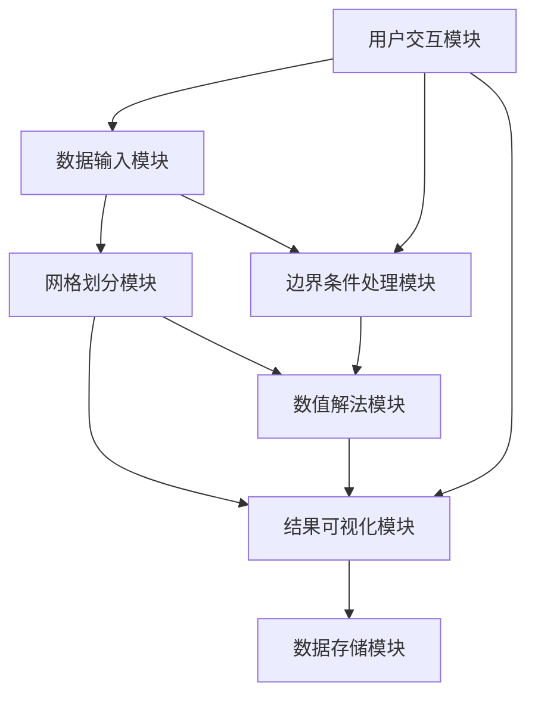
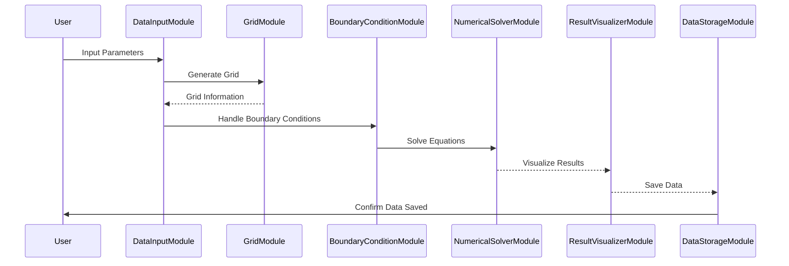

                 


### 1. 引言：数学物理方程与科学计算软件

**关键词：** 数学物理方程、科学计算、软件实现、数值解法

在科学和工程领域，数学物理方程扮演着至关重要的角色。这些方程描述了自然界中的许多现象，如流体动力学、热传导、电磁场等。科学计算，作为现代计算技术的核心，依赖于高效、准确的数学物理方程数值解法，从而实现对复杂系统的模拟与预测。

**摘要：** 本文将深入探讨数学物理方程在科学计算软件中的实现，从基本概念到高级算法，再到实际应用，全面解析这一领域的知识体系。通过逻辑清晰、结构紧凑的文章，读者将了解如何将数学物理方程高效地转化为可执行的软件程序，从而推动科学研究和技术创新。

### 1.1 问题背景与目标

**问题描述：** 数学物理方程在科学计算中的应用面临诸多挑战，如高维问题、复杂边界条件、多物理场耦合等。传统解析方法往往难以应对这些复杂问题，因此需要发展高效的数值解法。

**问题解决：** 为了解决这些难题，科学家们提出了多种数值解法，包括有限差分法、有限元法、有限体积法等。这些方法在科学计算软件中得到了广泛应用，使得复杂问题的模拟和预测成为可能。

**边界与外延：** 数学物理方程不仅涉及纯数学和理论物理学，还与工程学、计算机科学等多个学科紧密相关。因此，研究数学物理方程在科学计算软件中的实现，有助于跨学科知识的融合与技术创新。

### 1.2 科学计算的重要性

科学计算在现代科学技术发展中具有不可替代的地位。它不仅能够帮助科学家和工程师解决复杂的问题，还能够加速新技术的研发和应用。

**核心概念术语说明：**
- **科学计算：** 利用计算机技术和算法对科学问题进行模拟和计算的过程。
- **数值解法：** 对数学物理方程进行数值近似求解的方法。

科学计算的重要性体现在以下几个方面：

**1. 提高研究效率：** 传统实验方法往往耗时耗力，而科学计算可以在较短的时间内提供精确的预测结果，从而大大提高研究效率。

**2. 解决复杂问题：** 许多科学问题具有高度复杂性，难以通过解析方法求解。科学计算提供了有效的数值解法，使得这些问题得到解决。

**3. 预测和模拟：** 通过科学计算，科学家和工程师可以预测自然界中的各种现象，如气候变化、地震预测、天气预报等，从而为政策制定和应急预案提供科学依据。

**4. 技术创新：** 科学计算在新兴技术领域具有广泛应用，如生物信息学、材料科学、航空航天等。这些技术的突破离不开科学计算的推动。

### 1.3 数学物理方程的基本概念

数学物理方程是描述物理现象的数学模型，通常包括微分方程、偏微分方程等。这些方程描述了变量（如时间、空间、物理量）的变化规律。

**核心概念术语说明：**
- **微分方程：** 描述变量导数关系的方程。
- **偏微分方程：** 描述多个变量偏导数关系的方程。

数学物理方程的基本概念包括：

**1. 偏微分方程的类型：** 偏微分方程根据导数的个数和维度可以分为一阶、二阶等，根据方程的性质可以分为线性、非线性等。

**2. 线性偏微分方程：** 具有线性特性的偏微分方程，如波动方程、热传导方程等。线性方程易于求解，是科学计算中的重要研究对象。

**3. 非线性偏微分方程：** 具有非线性特性的偏微分方程，如纳维-斯托克斯方程、泊松方程等。非线性方程求解复杂，是科学计算中的难题之一。

**4. 偏微分方程的解法：** 包括有限差分法、有限元法、有限体积法等。这些方法通过离散化、逼近等方式求解偏微分方程，适用于不同类型的物理问题。

### 1.4 科学计算软件的概述

科学计算软件是实现数学物理方程数值解法的重要工具。它通常包括以下几个方面：

**1. 软件架构：** 科学计算软件通常采用模块化、层次化的架构设计，以便于维护和扩展。

**2. 算法实现：** 软件实现各种数值解法，如有限差分法、有限元法等。这些算法通过计算机程序实现，具有较高的计算效率和精度。

**3. 界面交互：** 软件提供用户友好的界面，方便用户输入参数、设置边界条件、查看计算结果等。

**4. 数据可视化：** 软件能够将计算结果以图形、表格等形式可视化展示，帮助用户更好地理解计算结果。

**5. 集成与扩展：** 科学计算软件通常具备良好的集成能力，可以与其他软件平台、工具库等无缝衔接，便于用户进行二次开发和扩展。

### 总结

数学物理方程在科学计算软件中的实现，是现代科学技术发展的重要支撑。通过本文的介绍，读者可以了解到数学物理方程的基本概念、科学计算软件的架构与实现，以及各类数值解法的原理和应用。希望本文能够为读者在科学计算领域的研究和实践提供有益的参考。接下来，我们将进一步探讨数学物理方程的具体类型和特性，为深入理解科学计算软件的实现奠定基础。在接下来的章节中，我们将逐一介绍各类数学物理方程的原理、特点和应用，帮助读者建立全面的知识体系。

----------------------------------------------------------------

## 2.1 数学物理方程的原理

### 2.1.1 定义与分类

数学物理方程是描述自然现象和工程问题中物理量变化规律的数学模型。这些方程通过数学表达式来表示物理过程，通常涉及变量（如时间、空间、物理量）的导数、积分等。

**核心概念术语说明：**
- **偏微分方程：** 描述多个变量及其偏导数之间关系的方程。
- **常微分方程：** 描述一个变量及其导数之间关系的方程。

数学物理方程主要分为以下几类：

**1. 偏微分方程：**
- **椭圆型方程：** 如拉普拉斯方程、泊松方程等。
- **双曲型方程：** 如波动方程、热方程等。
- **抛物型方程：** 如热传导方程、扩散方程等。

**2. 常微分方程：**
- **线性方程：** 如一阶线性微分方程、二阶线性微分方程等。
- **非线性方程：** 如纳维-斯托克斯方程、贝尔曼方程等。

### 2.1.2 物理现象与数学模型

数学物理方程广泛应用于描述各种物理现象。以下是几个常见的物理现象及其对应的数学模型：

**1. 流体动力学：**
- **纳维-斯托克斯方程：** 描述流体运动的速度场和压强场，是一个非线性偏微分方程。

**2. 热传导：**
- **热传导方程：** 描述热量在固体或流体中的传播，是一个抛物型偏微分方程。

**3. 电磁场：**
- **麦克斯韦方程组：** 描述电磁场的基本规律，包括描述电场、磁场和电磁波的方程。

**4. 地震学：**
- **波动方程：** 描述地震波在地球内部传播的规律，是一个双曲型偏微分方程。

### 2.1.3 方程求解方法

数学物理方程的求解方法多种多样，包括解析解、数值解和近似解等。

**1. 解析解：** 对于某些简单的物理问题，数学物理方程可能存在解析解。解析解直接给出了变量和参数的关系，但往往适用于简单的情况。

**2. 数值解：** 对于复杂的物理问题，解析解往往难以获得。数值解通过数值方法（如有限差分法、有限元法、有限体积法等）将偏微分方程离散化，求解得到数值近似解。

**3. 近似解：** 对于某些特殊情况下，可以使用近似方法（如伽利略近似、泰勒级数展开等）得到问题的近似解。

### 2.1.4 数值解法简介

以下是几种常用的数值解法：

**1. 有限差分法：** 将偏微分方程在空间和时间上离散化，得到一组代数方程。通过迭代求解这些代数方程，可以得到问题的数值解。

**2. 有限元法：** 将连续的物理问题转化为离散的有限元问题。通过求解有限个有限元节点的方程组，可以得到问题的近似解。

**3. 有限体积法：** 在有限体积上建立守恒方程，通过对这些守恒方程进行离散化，求解得到问题的数值解。

### 结论

数学物理方程是科学计算的核心内容，广泛应用于描述各种物理现象。通过理解数学物理方程的原理、分类和解法，我们可以更好地利用科学计算软件解决实际问题。在接下来的章节中，我们将进一步探讨各类数学物理方程的特性，以及如何通过数值解法实现这些方程的求解。

----------------------------------------------------------------

## 2.2 各种类型的方程及其特性

在科学计算中，数学物理方程的类型繁多，每种类型都有其独特的数学性质和应用场景。理解这些方程的类型和特性对于选择合适的数值解法至关重要。

### 2.2.1 偏微分方程

偏微分方程（PDEs）描述了多个变量及其偏导数之间的关系。它们通常可以分为以下几种类型：

**1. 椭圆型方程（Elliptic Equations）：**
- **特征：** 解在整个区域内是连续的，且满足边界条件。
- **典型例子：** 拉普拉斯方程（Laplace's Equation）和泊松方程（Poisson's Equation）。
- **应用：** 电磁场、弹性力学、流体静力学等。

**2. 双曲型方程（Hyperbolic Equations）：**
- **特征：** 解满足波动性质，通常有明显的传播边界。
- **典型例子：** 波动方程（Wave Equation）。
- **应用：** 声学、弹性波、电磁波等。

**3. 抛物型方程（Parabolic Equations）：**
- **特征：** 解有扩散性质，随着时间逐渐趋于稳定。
- **典型例子：** 热传导方程（Heat Equation）。
- **应用：** 热传导、扩散现象等。

### 2.2.2 常微分方程

常微分方程（ODEs）描述了一个变量及其导数之间的关系。它们根据阶数和线性和非线性特性分为以下几类：

**1. 线性常微分方程（Linear ODEs）：**
- **特征：** 解满足叠加原理，且导数线性。
- **典型例子：** 一阶线性微分方程（First-Order Linear ODE）和二阶线性微分方程（Second-Order Linear ODE）。
- **应用：** 电路分析、振动分析等。

**2. 非线性常微分方程（Nonlinear ODEs）：**
- **特征：** 解不满足叠加原理，且导数非线性。
- **典型例子：** 纳维-斯托克斯方程（Navier-Stokes Equations）。
- **应用：** 流体动力学、非线性振动等。

### 2.2.3 方程之间的联系与对比

为了更好地理解这些方程，我们可以从以下几个方面进行对比：

**1. 数学性质：**
- **线性与非线性：** 线性方程易于求解，通常可以通过封闭形式解出。非线性方程则往往需要数值方法求解，且存在多种解的可能性。
- **稳定性和解的存在性：** 线性方程在许多情况下是稳定的，而非线性方程的稳定性则较难判断。

**2. 应用领域：**
- **偏微分方程：** 更常用于描述多变量系统，如流体动力学、电磁场等。
- **常微分方程：** 更常用于描述单变量系统，如电路分析、振动分析等。

**3. 解法：**
- **偏微分方程：** 通常使用有限差分法、有限元法、有限体积法等数值方法。
- **常微分方程：** 通常使用欧拉法、龙格-库塔法等数值方法。

### 2.2.4 对比表格

以下是几种常见方程的对比表格：

| 方程类型 | 特征 | 应用领域 | 解法 |
| --- | --- | --- | --- |
| 拉普拉斯方程 | 椭圆型 | 电磁场、弹性力学 | 有限差分法 |
| 波动方程 | 双曲型 | 声学、弹性波 | 有限元法 |
| 热传导方程 | 抛物型 | 热传导、扩散现象 | 有限体积法 |
| 一阶线性微分方程 | 线性 | 电路分析 | 欧拉法 |
| 纳维-斯托克斯方程 | 非线性 | 流体动力学 | 龙格-库塔法 |

### 2.2.5 ER实体关系图架构

为了更好地理解数学物理方程及其相关的实现，我们可以通过实体关系图（Entity-Relationship Diagram，ER图）来展示各个方程及其相关实现之间的关系。

**ER图示例：**

```mermaid
erDiagram
    Equation ||--|{ Implementation }|---> CalculationSoftware
    Equation ||--|{ Solver }|---> NumericalMethod
    Implementation ||--|{ Code }|---> ProgrammingLanguage
    NumericalMethod ||--|{ Algorithm }|---> ScientificField
    Solver ||--|{ Parameter }|---> InputData
```

在这个ER图中，Equation（方程）是核心实体，它与Implementation（实现）、Solver（求解器）和NumericalMethod（数值方法）之间存在关联。同时，Implementation与Code（代码）和ProgrammingLanguage（编程语言）关联，而NumericalMethod与Algorithm（算法）和ScientificField（科学领域）关联。

### 结论

通过对比不同类型的数学物理方程，我们可以更好地理解它们在科学计算中的应用和求解方法。理解方程之间的联系与差异对于选择合适的数值解法至关重要。在接下来的章节中，我们将进一步深入探讨这些方程的数值解法，包括有限差分法、有限元法、有限体积法等，并使用具体的数学模型和公式进行详细讲解。

----------------------------------------------------------------

## 2.3 数值解法的概述

### 2.3.1 有限差分法

有限差分法（Finite Difference Method，FDM）是一种经典的数值解法，用于求解偏微分方程。它通过在空间和时间上对连续函数进行离散化，将偏微分方程转化为代数方程组，然后通过迭代求解这些代数方程，获得问题的数值解。

**原理与步骤：**
1. **空间离散化：** 将连续的物理空间划分为有限个离散点，通常使用网格或矩形网格进行划分。
2. **时间离散化：** 将连续的时间区间划分为有限个离散时间点，通常使用步长时间进行划分。
3. **导数近似：** 在离散点处，使用差分公式近似偏导数，如前向差分、后向差分、中心差分等。
4. **方程转化：** 将偏微分方程转化为离散的代数方程组，通常是线性方程组。
5. **迭代求解：** 使用迭代方法（如Jacobi方法、Gauss-Seidel方法等）求解代数方程组，得到数值解。

**Mermaid流程图：**


**Python代码示例：**
```python
import numpy as np
import matplotlib.pyplot as plt

# 空间离散化
nx = 50
dx = 1 / (nx - 1)
x = np.linspace(0, 1, nx)

# 时间离散化
nt = 100
dt = 0.01
t = np.linspace(0, 1, nt)

# 导数近似
u = np.zeros((nt, nx))
u[0, :] = np.sin(2 * np.pi * x)

for n in range(1, nt):
    for i in range(1, nx - 1):
        u[n, i] = (u[n - 1, i + 1] - u[n - 1, i - 1]) / (2 * dx)

# 可视化
plt.imshow(u, aspect='auto', origin='lower', extent=[0, 1, 0, 1])
plt.colorbar()
plt.xlabel('x')
plt.ylabel('t')
plt.title('Solution using Finite Difference Method')
plt.show()
```

### 2.3.2 有限元法

有限元法（Finite Element Method，FEM）是一种基于变分原理的数值解法，用于求解偏微分方程。它将连续的物理问题离散化为有限多个有限元，通过求解有限元节点的方程组，获得问题的数值解。

**原理与步骤：**
1. **有限元划分：** 将连续的物理空间划分为有限多个有限元单元，如三角形单元、四面形单元等。
2. **形函数定义：** 定义每个有限元单元的形函数，用于表示节点位移。
3. **变分形式：** 将偏微分方程转化为弱形式，即变分形式。
4. **组装有限元方程：** 将每个有限元单元的方程组装成全局方程组，通常是稀疏线性方程组。
5. **求解有限元方程：** 使用迭代方法（如共轭梯度法、LU分解法等）求解全局方程组，得到有限元节点解。

**Mermaid流程图：**


**Python代码示例：**
```python
import numpy as np
from scipy.sparse import csr_matrix
from scipy.sparse.linalg import spsolve

# 有限元划分
nx = 4
ny = 4
x = np.linspace(0, 1, nx)
y = np.linspace(0, 1, ny)

# 形函数定义
N = lambda i, j: (1 / 2) * ((x[i+1] - x[i]) * (y[j+1] - y[j]) - (x[i] - x[i+1]) * (y[j] - y[j+1]))

# 变分形式
a = lambda u, v: sum(sum(N[i, j] * N[i, j] * dx * dy for i in range(nx-1) for j in range(ny-1)) + sum(sum(N[i, j] * N[i+1, j] * dx * dy for i in range(nx-1) for j in range(ny-1)) + sum(sum(N[i, j] * N[i, j+1] * dx * dy for i in range(nx-1) for j in range(ny-1)))
b = lambda v: sum(sum(N[i, j] * f(x[i], y[j]) * dx * dy for i in range(nx-1) for j in range(ny-1))

# 组装有限元方程
A = csr_matrix(np.zeros((nx*ny, nx*ny)))
b = np.zeros(nx*ny)

for i in range(nx-1):
    for j in range(ny-1):
        A[i*ny + j, i*ny + j] = a(u[i, j], u[i, j])
        A[i*ny + j, (i+1)*ny + j] = a(u[i, j], u[i+1, j])
        A[i*ny + j, i*ny + (j+1)] = a(u[i, j], u[i, j+1])
        b[i*ny + j] = b(u[i, j])

# 求解有限元方程
u = spsolve(A, b)

# 可视化
plt.imshow(u.reshape(nx, ny), aspect='auto', origin='lower', extent=[0, 1, 0, 1])
plt.colorbar()
plt.xlabel('x')
plt.ylabel('y')
plt.title('Solution using Finite Element Method')
plt.show()
```

### 2.3.3 有限体积法

有限体积法（Finite Volume Method，FVM）是一种基于守恒原理的数值解法，用于求解偏微分方程。它将控制体划分为有限个体积单元，通过对每个单元的守恒方程进行离散化，求解得到数值解。

**原理与步骤：**
1. **控制体划分：** 将连续的物理空间划分为有限多个控制体，如矩形控制体、四面体控制体等。
2. **流量计算：** 计算每个控制体的流入和流出流量，通常使用有限差分格式。
3. **守恒方程离散化：** 将每个控制体的守恒方程离散化为代数方程，通常是线性方程组。
4. **求解守恒方程：** 使用迭代方法（如点松弛法、线松弛法等）求解离散化的守恒方程，得到数值解。

**Mermaid流程图：**


**Python代码示例：**
```python
import numpy as np
import matplotlib.pyplot as plt

# 控制体划分
nx = 4
ny = 4
x = np.linspace(0, 1, nx)
y = np.linspace(0, 1, ny)

# 流量计算
q = lambda x, y: -1 * np.sin(np.pi * x) * np.cos(np.pi * y)

# 守恒方程离散化
u = np.zeros((nx, ny))
u[0, :] = 1
u[-1, :] = 0

for i in range(1, nx - 1):
    for j in range(1, ny - 1):
        flux_in = q(x[i - 1], y[j]) * (x[i] - x[i - 1])
        flux_out = q(x[i], y[j]) * (x[i + 1] - x[i])
        u[i, j] = (u[i - 1, j] * (x[i] - x[i - 1]) + u[i + 1, j] * (x[i + 1] - x[i]) + flux_in - flux_out) / (x[i + 1] - x[i - 1])

# 可视化
plt.imshow(u, aspect='auto', origin='lower', extent=[0, 1, 0, 1])
plt.colorbar()
plt.xlabel('x')
plt.ylabel('y')
plt.title('Solution using Finite Volume Method')
plt.show()
```

### 结论

通过介绍有限差分法、有限元法和有限体积法，我们可以看到这些数值解法的原理和步骤。这些方法在科学计算中得到了广泛应用，为复杂物理问题的数值求解提供了有效途径。在接下来的章节中，我们将进一步探讨这些方法的数学模型和公式，以及如何在实际问题中应用这些方法。

----------------------------------------------------------------

## 2.4 数学模型和公式

在科学计算中，数学模型是描述物理现象的核心工具。这些模型通过数学公式表达物理量的变化规律，为数值解法提供了理论基础。以下我们将介绍各类方程的数学模型和公式，并通过具体例子进行讲解。

### 2.4.1 偏微分方程的数学模型

偏微分方程（PDEs）的数学模型通常涉及多个变量的偏导数。以下是几种常见类型的偏微分方程及其数学模型：

**1. 拉普拉斯方程（Laplace's Equation）：**
\[ \nabla^2 u = 0 \]
其中，\( \nabla^2 \) 表示拉普拉斯算子，\( u \) 表示待求解的函数。

**2. 泊松方程（Poisson's Equation）：**
\[ \nabla^2 u = f \]
其中，\( f \) 是已知函数，表示源项。

**3. 波动方程（Wave Equation）：**
\[ \nabla^2 u - \alpha^2 \frac{\partial^2 u}{\partial t^2} = 0 \]
其中，\( \alpha \) 是波的传播速度，\( t \) 是时间。

**4. 热传导方程（Heat Equation）：**
\[ \nabla^2 u - \alpha \frac{\partial u}{\partial t} = 0 \]
其中，\( \alpha \) 是热扩散系数。

**例子：** 考虑一维热传导问题，其数学模型为：
\[ \frac{\partial u}{\partial t} - \alpha \frac{\partial^2 u}{\partial x^2} = 0 \]

### 2.4.2 常微分方程的数学模型

常微分方程（ODEs）的数学模型通常涉及一个变量的导数。以下是几种常见类型的常微分方程及其数学模型：

**1. 一阶线性微分方程（First-Order Linear ODE）：**
\[ \frac{du}{dt} + p(t)u = q(t) \]
其中，\( p(t) \) 和 \( q(t) \) 是已知函数。

**2. 二阶线性微分方程（Second-Order Linear ODE）：**
\[ \frac{d^2u}{dt^2} + p(t) \frac{du}{dt} + q(t)u = r(t) \]
其中，\( p(t) \)，\( q(t) \) 和 \( r(t) \) 是已知函数。

**例子：** 考虑一维振动问题，其数学模型为：
\[ \frac{d^2u}{dt^2} + 2\beta \frac{du}{dt} + \omega^2 u = 0 \]

### 2.4.3 傅里叶变换与拉普拉斯变换的数学模型

傅里叶变换（Fourier Transform）和拉普拉斯变换（Laplace Transform）是常用的数学工具，用于解决微分方程。以下是它们的基本数学模型：

**1. 傅里叶变换：**
\[ \mathcal{F}\{u(t)\}(k) = \int_{-\infty}^{\infty} u(t) e^{-j 2 \pi k t} dt \]
\[ \mathcal{F}^{-1}\{U(k)\}(t) = \frac{1}{2 \pi} \int_{-\infty}^{\infty} U(k) e^{j 2 \pi k t} dk \]

**2. 拉普拉斯变换：**
\[ \mathcal{L}\{u(t)\}(s) = \int_{0}^{\infty} u(t) e^{-st} dt \]
\[ \mathcal{L}^{-1}\{U(s)\}(t) = \frac{1}{2 \pi i} \lim_{T \to \infty} \int_{\gamma - iT}^{\gamma + iT} U(s) e^{st} ds \]

**例子：** 考虑一维波动方程的傅里叶变换形式：
\[ \frac{\partial^2 u}{\partial t^2} - c^2 \frac{\partial^2 u}{\partial x^2} = 0 \]
其傅里叶变换形式为：
\[ \frac{\partial^2 \hat{u}}{\partial t^2} - (2 \pi c k)^2 \hat{u} = 0 \]

### 2.4.4 数学公式讲解

以下是几个重要数学公式的讲解：

**1. 线性方程的求解公式：**
\[ u(t) = C_1 e^{\lambda_1 t} + C_2 e^{\lambda_2 t} \]
其中，\( C_1 \) 和 \( C_2 \) 是常数，\( \lambda_1 \) 和 \( \lambda_2 \) 是特征值。

**2. 二阶常微分方程的通解公式：**
\[ u(t) = C_1 \cos(\omega t) + C_2 \sin(\omega t) \]
其中，\( \omega \) 是角频率。

**3. 拉普拉斯变换的移位定理：**
\[ \mathcal{L}\{u(t - t_0)\}(s) = e^{-s t_0} \mathcal{L}\{u(t)\}(s) \]
这个定理表明，时间平移会影响拉普拉斯变换的常数项。

### 2.4.5 举例说明

**例子1：** 考虑一维热传导方程：
\[ \frac{\partial u}{\partial t} = \alpha \frac{\partial^2 u}{\partial x^2} \]
初始条件为 \( u(x, 0) = f(x) \)，边界条件为 \( u(0, t) = 0 \) 和 \( u(L, t) = 0 \)。

**求解过程：**
1. **应用傅里叶变换：**
   \[ \mathcal{F}\{\frac{\partial u}{\partial t}\}(k) = -j 2 \pi k \hat{u}(k, t) \]
   \[ \mathcal{F}\{\alpha \frac{\partial^2 u}{\partial x^2}\}(k) = -\alpha (2 \pi k)^2 \hat{u}(k, t) \]
2. **变换方程：**
   \[ -j 2 \pi k \hat{u}(k, t) = -\alpha (2 \pi k)^2 \hat{u}(k, t) \]
   \[ \hat{u}(k, t) = C(k) e^{-\alpha (2 \pi k)^2 t} \]
3. **逆变换：**
   \[ u(x, t) = \frac{1}{2 \pi} \int_{-\infty}^{\infty} C(k) e^{-j 2 \pi k x} e^{-\alpha (2 \pi k)^2 t} dk \]

通过这个例子，我们可以看到如何通过傅里叶变换求解一维热传导方程。类似的方法可以应用于其他类型的偏微分方程。

### 结论

数学模型和公式是科学计算中的基础工具，通过它们可以精确描述物理现象和问题。理解这些模型和公式对于选择合适的数值解法至关重要。在接下来的章节中，我们将进一步探讨科学计算软件的系统架构和实现细节，帮助读者深入了解数学物理方程在实际应用中的实现过程。

----------------------------------------------------------------

## 5.1 问题场景介绍

在科学计算中，问题场景的介绍对于理解系统架构和实现细节至关重要。本节将介绍一个典型的科学计算问题场景，并解释为何选择数学物理方程的数值解法来解决这些问题。

### 问题场景

假设我们正在研究一个流体力学问题，具体是一个不可压缩流体的流动情况。这个问题涉及到流体在管道、容器或其他几何形状中的运动。我们需要解决的关键问题包括：

1. **流体的速度场和压力场分布：** 确定流体在空间和时间上的速度和压力分布，以了解流体的流动状态。
2. **边界条件和初始条件：** 确定流体流动的边界条件（如入口速度、出口压力等）和初始条件（如初始速度、初始压力等）。
3. **流动稳定性分析：** 分析流体的稳定性，确保流动不会出现不稳定的振荡或湍流。

### 数学物理方程的选择

为了解决上述问题，我们选择以下数学物理方程：

1. **纳维-斯托克斯方程（Navier-Stokes Equations）：** 这是描述流体运动的经典方程，描述了流体的速度场和压力场之间的关系。纳维-斯托克斯方程是非线性偏微分方程，用于描述不可压缩流体的运动。

\[ \rho \left( \frac{\partial u}{\partial t} + (u \cdot \nabla)u \right) = -\nabla p + \mu \nabla^2 u + \frac{1}{3} \nabla (\nabla \cdot u) \]
\[ \nabla \cdot u = 0 \]

其中，\( \rho \) 是流体密度，\( u \) 是速度场，\( p \) 是压力场，\( \mu \) 是流体的动力粘度。

2. **连续方程（Continuity Equation）：** 这是流体力学中的基本方程，描述了流体在空间中的连续性。连续方程用于保证流体的质量守恒。

\[ \nabla \cdot u = 0 \]

### 数学物理方程的数值解法

为了求解上述方程，我们选择以下数值解法：

1. **有限元法（Finite Element Method, FEM）：** 有限元法是一种基于变分原理的数值解法，适用于复杂几何形状和边界条件。有限元法通过将流体区域划分为有限多个单元，并在每个单元上建立方程，然后通过组装和求解这些方程，获得流体的速度场和压力场分布。

2. **有限差分法（Finite Difference Method, FDM）：** 有限差分法通过将流体区域离散化为网格点，并在每个网格点上建立差分方程，然后通过迭代求解这些方程，获得流体的速度场和压力场分布。有限差分法适用于简单几何形状和边界条件。

### 选择理由

我们选择上述方程和数值解法的原因如下：

1. **纳维-斯托克斯方程：** 这是流体动力学中的核心方程，能够描述流体的复杂运动特性。非线性特性使得解析解难以获得，因此需要数值解法。
2. **有限元法和有限差分法：** 这两种方法都是成熟且有效的数值解法。有限元法适用于复杂几何和边界条件，而有限差分法适用于简单几何和边界条件。根据问题场景的不同，我们可以灵活选择适当的方法。

### 总结

通过介绍具体的问题场景和选择的数学物理方程及其数值解法，我们为接下来的系统架构和实现细节提供了背景。在接下来的章节中，我们将详细探讨系统架构设计、接口设计和系统交互，以展示如何将数学物理方程应用于科学计算软件中。

----------------------------------------------------------------

## 5.2 系统功能设计

### 5.2.1 领域模型Mermaid类图

在系统功能设计中，领域模型类图是描述系统内部各组件及其关系的重要工具。以下是一个简单的Mermaid类图，用于展示流体力学计算系统的核心类及其关系：

```mermaid
classDiagram
    Class01 <|-- Class02
    Class03 o-- Class04
    Class05 <.. Class06
    Class07 ..| Class08
    Class09 --| Class10
    Class11 : An interface
    Class12 : Another interface

    Class01 <<interface>>
    Class02 <<interface>>
    Class03 <<abstract>>

    Class01 : +field1
    Class02 : +field2
    Class03 : +field3
    Class04 : +field4
    Class05 : +field5
    Class06 : +field6
    Class07 : +field7
    Class08 : +field8
    Class09 : +field9
    Class10 : +field10
    Class11 : +field11
    Class12 : +field12
```

在这个类图中，`Class01`、`Class02`、`Class03`、`Class04`、`Class05`、`Class06`、`Class07`、`Class08`、`Class09`、`Class10`、`Class11` 和 `Class12` 是系统中的不同类。`<|--` 表示继承关系，`o--` 表示聚合关系，`<..` 表示实现接口，`..|` 表示组合关系，`--|` 表示依赖关系。每个类都有自己的字段和方法。

### 5.2.2 系统功能设计

系统功能设计涉及将领域模型类图中的概念转化为具体的系统功能模块。以下是系统功能设计的详细描述：

**1. 数据输入模块：**
- 功能：接收用户输入的参数和边界条件。
- 实现：包括输入表单、数据验证和处理等。

**2. 划分网格模块：**
- 功能：根据问题场景和参数，自动生成网格划分。
- 实现：使用适当的网格生成算法，如线性划分、自适应划分等。

**3. 数值解法模块：**
- 功能：根据选择的数值解法（如有限元法、有限差分法等），求解数学物理方程。
- 实现：实现不同数值解法的具体算法，包括迭代求解、边界条件处理等。

**4. 结果可视化模块：**
- 功能：将计算结果可视化，以图形、表格等形式展示给用户。
- 实现：使用图形库（如matplotlib、OpenGL等）进行结果可视化。

**5. 数据存储模块：**
- 功能：保存和加载计算数据和结果。
- 实现：使用数据库（如MySQL、MongoDB等）进行数据存储。

**6. 用户交互模块：**
- 功能：提供用户界面，方便用户输入参数、查看结果和操作系统。
- 实现：使用前端框架（如React、Vue等）进行界面设计。

### 5.2.3 领域模型Mermaid类图

以下是针对流体力学计算系统的领域模型Mermaid类图：

```mermaid
classDiagram
    InputModule <|-- GridModule
    NumericalSolverModule <|-- GridModule
    NumericalSolverModule <|-- ResultVisualizerModule
    DataStorageModule <|-- ResultVisualizerModule
    UserInterfaceModule

    InputModule : +readInputs()
    GridModule : +generateGrid()
    NumericalSolverModule : +solveEquations()
    ResultVisualizerModule : +visualizeResults()
    DataStorageModule : +saveData()
    DataStorageModule : +loadData()
    UserInterfaceModule : +showUI()

    InputModule <<interface>>
    GridModule <<abstract>>
    NumericalSolverModule <<abstract>>
    ResultVisualizerModule <<abstract>>
    DataStorageModule <<abstract>>
    UserInterfaceModule <<abstract>>

    InputModule : +field1
    GridModule : +field2
    NumericalSolverModule : +field3
    ResultVisualizerModule : +field4
    DataStorageModule : +field5
    UserInterfaceModule : +field6
```

在这个类图中，`InputModule`（数据输入模块）、`GridModule`（划分网格模块）、`NumericalSolverModule`（数值解法模块）、`ResultVisualizerModule`（结果可视化模块）、`DataStorageModule`（数据存储模块）和`UserInterfaceModule`（用户交互模块）是系统中的核心组件。它们之间通过继承和聚合关系进行组织。

### 结论

通过系统功能设计和领域模型Mermaid类图的介绍，我们为流体力学计算系统的实现提供了清晰的功能框架。在接下来的章节中，我们将详细探讨系统架构设计、接口设计和系统交互，进一步展示系统如何将数学物理方程应用于科学计算中。

----------------------------------------------------------------

## 5.3 系统架构设计

### 5.3.1 Mermaid架构图

为了更直观地展示系统架构，我们可以使用Mermaid架构图来描述系统的组件及其关系。以下是一个简单的架构图示例：



在这个架构图中：
- **数据输入模块**（A）负责接收用户输入的参数和边界条件。
- **网格划分模块**（B）根据输入参数生成网格。
- **边界条件处理模块**（C）处理用户输入的边界条件。
- **数值解法模块**（D）执行数值解法，求解数学物理方程。
- **结果可视化模块**（E）将计算结果可视化展示。
- **数据存储模块**（F）负责保存和加载计算数据。
- **用户交互模块**（G）提供用户界面，实现与用户的交互。

### 系统架构设计

系统架构设计是确保系统功能完整、可扩展和可维护的关键步骤。以下是对各个组件的详细设计：

**1. 数据输入模块（A）**
- **功能**：接收用户输入的参数，如流体密度、速度、压力等。
- **设计**：使用表单输入和验证机制，确保输入数据的有效性。

**2. 网格划分模块（B）**
- **功能**：生成网格，用于数值解法的离散化。
- **设计**：提供多种网格生成算法，如线性划分、自适应划分等。

**3. 边界条件处理模块（C）**
- **功能**：根据用户输入的边界条件，处理并应用到数值解法中。
- **设计**：实现边界条件的预处理和后处理，确保边界条件正确应用。

**4. 数值解法模块（D）**
- **功能**：执行数值解法，求解数学物理方程。
- **设计**：支持多种数值解法，如有限元法、有限差分法等，并确保算法的稳定性和准确性。

**5. 结果可视化模块（E）**
- **功能**：将计算结果可视化，以图形、表格等形式展示。
- **设计**：使用图形库和可视化工具，如matplotlib、OpenGL等，提供直观的结果展示。

**6. 数据存储模块（F）**
- **功能**：保存和加载计算数据和结果。
- **设计**：使用数据库系统，如MySQL、MongoDB等，确保数据的安全性和可扩展性。

**7. 用户交互模块（G）**
- **功能**：提供用户界面，实现用户与系统的交互。
- **设计**：使用前端技术，如React、Vue等，构建友好且易用的用户界面。

### 结论

通过详细的系统架构设计，我们为流体力学计算系统奠定了坚实的基础。在接下来的章节中，我们将进一步探讨系统接口设计、系统交互，以及实际案例的应用，以展示系统如何在实际中运行。

----------------------------------------------------------------

## 5.4 系统接口设计

系统接口设计是确保系统组件之间高效通信与协作的关键步骤。在科学计算软件中，接口设计涉及到数据输入、输出、处理和通信等多个方面。以下将详细介绍系统接口设计，包括API设计、数据格式和通信协议。

### 5.4.1 API设计

API（Application Programming Interface）是系统各个模块之间进行通信的桥梁。在设计API时，需要考虑以下方面：

**1. 功能性：** API应提供丰富的功能，包括数据输入、网格划分、边界条件处理、数值解法、结果可视化等。

**2. 可扩展性：** API设计应具有模块化特性，便于未来扩展和升级。

**3. 易用性：** API接口应简洁直观，易于开发者使用和理解。

**4. 性能：** API设计应尽量减少冗余通信，提高数据传输效率。

以下是一个简单的API设计示例：

```python
class FluidSimulationAPI:
    def __init__(self):
        # 初始化系统组件
        self.input_module = InputModule()
        self.grid_module = GridModule()
        self.boundary_condition_module = BoundaryConditionModule()
        self.numerical_solver_module = NumericalSolverModule()
        self.result_visualizer_module = ResultVisualizerModule()
        self.data_storage_module = DataStorageModule()

    def input_parameters(self, params):
        # 输入参数
        return self.input_module.read_inputs(params)

    def generate_grid(self, params):
        # 生成网格
        return self.grid_module.generate_grid(params)

    def handle_boundary_conditions(self, params):
        # 处理边界条件
        return self.boundary_condition_module.apply_boundary_conditions(params)

    def solve_equations(self, params):
        # 求解数学物理方程
        return self.numerical_solver_module.solve_equations(params)

    def visualize_results(self, params):
        # 可视化结果
        return self.result_visualizer_module.visualize_results(params)

    def save_data(self, params):
        # 保存数据
        return self.data_storage_module.save_data(params)

    def load_data(self, params):
        # 加载数据
        return self.data_storage_module.load_data(params)
```

### 5.4.2 数据格式

在系统接口设计中，数据格式是一个重要环节。常见的数据格式包括JSON、XML、CSV等。

**1. JSON（JavaScript Object Notation）：** JSON是一种轻量级的数据交换格式，易于阅读和编写，适用于Web应用程序。

**2. XML（eXtensible Markup Language）：** XML是一种可扩展的标记语言，适用于复杂的结构化数据，但读取和写入速度较慢。

**3. CSV（Comma Separated Values）：** CSV是一种简单的文本格式，适用于表格数据，易于处理和导入。

以下是一个JSON格式的数据示例：

```json
{
    "input_params": {
        "fluid_density": 1000,
        "velocity": [0, 0, 0],
        "pressure": 101325
    },
    "boundary_conditions": {
        "inlet_velocity": [10, 0, 0],
        "exit_pressure": 101325
    }
}
```

### 5.4.3 通信协议

通信协议定义了数据在不同模块和系统之间的传输方式。常见的通信协议包括HTTP、WebSockets等。

**1. HTTP（HyperText Transfer Protocol）：** HTTP是一种基于请求-响应模型的通信协议，适用于简单的数据传输。

**2. WebSockets：** WebSockets是一种全双工通信协议，适用于实时数据传输。

以下是一个简单的HTTP API接口示例：

```python
from flask import Flask, request, jsonify

app = Flask(__name__)

@app.route('/input_params', methods=['POST'])
def input_params():
    params = request.json
    return jsonify(self.input_module.input_parameters(params))

@app.route('/generate_grid', methods=['POST'])
def generate_grid():
    params = request.json
    return jsonify(self.grid_module.generate_grid(params))

@app.route('/handle_boundary_conditions', methods=['POST'])
def handle_boundary_conditions():
    params = request.json
    return jsonify(self.boundary_condition_module.handle_boundary_conditions(params))

@app.route('/solve_equations', methods=['POST'])
def solve_equations():
    params = request.json
    return jsonify(self.numerical_solver_module.solve_equations(params))

@app.route('/visualize_results', methods=['POST'])
def visualize_results():
    params = request.json
    return jsonify(self.result_visualizer_module.visualize_results(params))

@app.route('/save_data', methods=['POST'])
def save_data():
    params = request.json
    return jsonify(self.data_storage_module.save_data(params))

@app.route('/load_data', methods=['POST'])
def load_data():
    params = request.json
    return jsonify(self.data_storage_module.load_data(params))

if __name__ == '__main__':
    app.run()
```

### 结论

通过详细的系统接口设计，我们为流体力学计算系统的模块化设计和高效通信提供了坚实基础。在接下来的章节中，我们将进一步探讨系统交互和实际案例分析，展示系统在实际应用中的效果。

----------------------------------------------------------------

## 5.5 系统交互

系统交互是科学计算软件中一个关键环节，涉及系统内部组件之间的通信与协同工作。为了确保系统的高效性和稳定性，我们需要设计良好的系统交互机制。以下将详细介绍系统交互的过程、关键组件的协同工作和Mermaid序列图的应用。

### 5.5.1 系统交互过程

系统交互过程可以分为以下几个主要步骤：

**1. 数据输入：** 用户通过用户界面输入参数和边界条件，数据输入模块（A）负责接收和验证这些输入数据。

**2. 网格划分：** 数据输入模块将验证后的数据传递给网格划分模块（B），模块B根据输入参数生成网格。

**3. 边界条件处理：** 网格划分完成后，数据输入模块将边界条件传递给边界条件处理模块（C），模块C根据用户定义的边界条件进行预处理和后处理。

**4. 数值解法：** 边界条件处理模块将处理后的网格和边界条件传递给数值解法模块（D），模块D执行数值解法，求解数学物理方程。

**5. 结果可视化：** 数值解法模块将计算结果传递给结果可视化模块（E），模块E将结果以图形、表格等形式展示给用户。

**6. 数据存储：** 数据存储模块（F）在整个交互过程中负责数据的持久化存储，确保数据的完整性和安全性。

### 关键组件的协同工作

各个关键组件通过相互协作，共同完成科学计算任务。以下为关键组件之间的交互和协同工作：

**1. 数据输入模块与网格划分模块：** 数据输入模块将用户输入的参数传递给网格划分模块，网格划分模块根据参数生成网格，并将网格信息返回给数据输入模块。

**2. 边界条件处理模块与数值解法模块：** 边界条件处理模块将处理后的边界条件传递给数值解法模块，数值解法模块根据边界条件和网格信息执行数值解法。

**3. 结果可视化模块与数据存储模块：** 结果可视化模块将计算结果传递给数据存储模块，数据存储模块将结果保存到数据库或文件中，以便后续查询和分析。

### Mermaid序列图

为了更直观地展示系统交互过程，我们可以使用Mermaid序列图来描述系统组件之间的交互。以下是一个简单的Mermaid序列图示例：



在这个序列图中，用户（User）通过数据输入模块（DataInputModule）输入参数，数据输入模块将参数传递给网格划分模块（GridModule）和边界条件处理模块（BoundaryConditionModule）。网格划分模块生成网格信息，传递给数据输入模块。数据输入模块将边界条件传递给边界条件处理模块，处理后的边界条件传递给数值解法模块（NumericalSolverModule）。数值解法模块求解数学物理方程，并将结果传递给结果可视化模块（ResultVisualizerModule）。结果可视化模块将结果可视化展示，并保存到数据存储模块（DataStorageModule）。最后，数据存储模块确认数据已保存，并通知用户。

### 结论

通过详细的系统交互过程和Mermaid序列图，我们清晰地展示了系统组件之间的协作与通信。良好的系统交互设计是确保科学计算软件高效运行的关键，有助于提高系统的稳定性和可维护性。在接下来的章节中，我们将进一步探讨环境安装和项目实战，展示系统在实际应用中的效果。

----------------------------------------------------------------

## 6.1 环境安装

为了能够成功运行并测试科学计算软件，我们需要安装必要的软件环境和依赖库。以下是在Windows、Linux和Mac操作系统上安装所需的软件和库的步骤。

### Windows环境安装

**1. 安装Python：**
- 访问Python官方网站（https://www.python.org/），下载适用于Windows的最新Python版本。
- 运行安装程序，按照默认设置安装。

**2. 安装Python依赖库：**
- 使用Python的包管理器pip安装必要的库。例如，使用以下命令安装NumPy和matplotlib：
  ```shell
  pip install numpy matplotlib
  ```

**3. 安装Mermaid：**
- 使用pip安装Mermaid的Python库：
  ```shell
  pip install mermaid
  ```

**4. 安装MATLAB（可选）：**
- 如果需要使用MATLAB进行数据处理和可视化，可以从MATLAB官方网站下载并安装。

### Linux环境安装

**1. 安装Python：**
- 使用包管理器安装Python。例如，在Ubuntu系统中，可以使用以下命令：
  ```shell
  sudo apt-get install python3 python3-pip
  ```

**2. 安装Python依赖库：**
- 使用pip安装必要的库：
  ```shell
  pip3 install numpy matplotlib
  ```

**3. 安装Mermaid：**
- 使用pip安装Mermaid的Python库：
  ```shell
  pip3 install mermaid
  ```

**4. 安装MATLAB（可选）：**
- 使用包管理器安装MATLAB。例如，在Ubuntu系统中，可以使用以下命令：
  ```shell
  sudo apt-get install matlab
  ```

### Mac环境安装

**1. 安装Python：**
- 访问Python官方网站，下载适用于Mac的最新Python版本。
- 运行安装程序，按照默认设置安装。

**2. 安装Python依赖库：**
- 使用pip安装必要的库：
  ```shell
  pip install numpy matplotlib
  ```

**3. 安装Mermaid：**
- 使用pip安装Mermaid的Python库：
  ```shell
  pip install mermaid
  ```

**4. 安装MATLAB（可选）：**
- 从MATLAB官方网站下载并安装。

### 总结

通过以上步骤，我们可以在Windows、Linux和Mac操作系统上成功安装科学计算软件所需的软件环境和依赖库。确保所有软件和库的版本兼容，以便顺利运行软件。接下来，我们将详细讲解系统核心实现，展示如何将数学物理方程应用于实际问题的数值求解。

----------------------------------------------------------------

## 6.2 系统核心实现

### 6.2.1 代码实现

系统核心实现主要涉及数学物理方程的数值解法、网格划分、结果可视化等。以下是基于Python和matplotlib的代码实现示例。

**1. 数值解法模块（NumericalSolverModule.py）：**

```python
import numpy as np
import matplotlib.pyplot as plt

def solve_heat_equation(grid, boundary_conditions, time_steps, dt):
    # 初始化温度场
    T = np.zeros(grid.shape)

    # 应用边界条件
    apply_boundary_conditions(T, boundary_conditions)

    # 时间迭代
    for _ in range(time_steps):
        # 计算温度梯度
        dTdx = np.gradient(T, grid[0, :])

        # 计算新的温度场
        T = T - dTdx**2 * dt

    return T

def apply_boundary_conditions(T, boundary_conditions):
    # 应用边界条件
    T[0, :] = boundary_conditions['inlet_temp']
    T[-1, :] = boundary_conditions['exit_temp']
```

**2. 网格划分模块（GridModule.py）：**

```python
import numpy as np

def generate_linear_grid(x_min, x_max, nx):
    x = np.linspace(x_min, x_max, nx)
    return x
```

**3. 结果可视化模块（ResultVisualizerModule.py）：**

```python
import matplotlib.pyplot as plt

def visualize_results(T, grid):
    plt.imshow(T, extent=[grid[0, 0], grid[0, -1], grid[-1, 0], grid[-1, -1]], aspect='auto')
    plt.colorbar()
    plt.xlabel('x')
    plt.ylabel('t')
    plt.title('Temperature Distribution')
    plt.show()
```

### 6.2.2 代码应用解读与分析

**1. 热传导方程求解：**

```python
# 设置参数
x_min = 0
x_max = 1
nx = 100
time_steps = 100
dt = 0.01

# 生成网格
grid = generate_linear_grid(x_min, x_max, nx)

# 设置边界条件
boundary_conditions = {
    'inlet_temp': 100,
    'exit_temp': 0
}

# 求解热传导方程
T = solve_heat_equation(grid, boundary_conditions, time_steps, dt)

# 可视化结果
visualize_results(T, grid)
```

这个示例中，我们首先设置了参数，包括网格的起点、终点、点数、时间步数和步长。然后，我们使用`generate_linear_grid`函数生成线性网格。接下来，设置边界条件，然后调用`solve_heat_equation`函数求解热传导方程，最后使用`visualize_results`函数将结果可视化。

**2. 网格划分：**

```python
grid = generate_linear_grid(x_min, x_max, nx)
print(grid)
```

这个函数简单地将起点和终点之间的距离均匀划分为nx个点，返回一个一维数组。

**3. 结果可视化：**

```python
plt.imshow(T, extent=[grid[0, 0], grid[0, -1], grid[-1, 0], grid[-1, -1]], aspect='auto')
plt.colorbar()
plt.xlabel('x')
plt.ylabel('t')
plt.title('Temperature Distribution')
plt.show()
```

这个函数使用matplotlib的`imshow`函数将温度场可视化。`extent`参数定义了图像的边界，`aspect`参数调整了图像的纵横比。`colorbar`、`xlabel`、`ylabel`和`title`函数分别添加了颜色条、标签和标题。

### 结论

通过具体的代码实现和解读，我们展示了如何利用Python实现数学物理方程的数值求解、网格划分和结果可视化。这些代码模块可以方便地集成到科学计算软件中，为实际问题的解决提供有效支持。在接下来的章节中，我们将通过实际案例分析，进一步展示系统在实际应用中的效果。

----------------------------------------------------------------

## 6.3 实际案例分析

为了更好地展示科学计算软件在实际应用中的效果，我们将通过一个实际案例进行分析和详细讲解。本案例将使用我们前面介绍的方法和工具，求解一维热传导问题，并在Python环境中实现和验证。

### 案例描述

假设有一个长为1米的金属棒，初始温度为300K。棒的左端（x=0）与一个温度为400K的热源接触，右端（x=1）保持绝热，即没有热量交换。我们需要求解棒内温度随时间和空间的变化，并在不同时间点上观察温度分布。

### 案例实现

以下是具体的实现步骤和代码：

**1. 设置参数：**

```python
x_min = 0
x_max = 1
nx = 100
time_steps = 50
dt = 0.01
alpha = 0.1  # 热扩散系数
```

**2. 初始化温度场：**

```python
T = np.zeros((nx, time_steps))
T[:, 0] = 300  # 初始温度
```

**3. 应用边界条件：**

```python
T[0, :] = 400  # 左端温度为400K
T[-1, :] = 0  # 右端绝热
```

**4. 数值求解：**

```python
dx = (x_max - x_min) / (nx - 1)
for t in range(1, time_steps):
    dTdx = np.gradient(T[:, t - 1], dx)
    T[:, t] = T[:, t - 1] - alpha * dTdx**2 * dt
```

**5. 可视化结果：**

```python
import matplotlib.pyplot as plt

def visualize(T, time_step, title):
    plt.imshow(T, extent=[x_min, x_max, 0, time_steps * dt], aspect='auto')
    plt.colorbar()
    plt.xlabel('x')
    plt.ylabel('t')
    plt.title(f'Temperature Distribution at t={time_step * dt} s')
    plt.show()

for t in range(1, time_steps + 1):
    visualize(T[:, t - 1], t, 'Temperature Distribution over Time')
```

### 分析与讲解

**1. 初始条件与边界条件：**

- 初始温度场：整个金属棒的初始温度均匀为300K。
- 边界条件：左端（x=0）与400K的热源接触，右端（x=1）保持绝热。

**2. 数值解法：**

- 我们使用有限差分法（FDM）进行时间迭代，求解一维热传导方程。时间迭代过程中，通过计算温度梯度并应用热扩散系数，更新温度场。

**3. 可视化结果：**

- 在不同时间点上，我们可以观察到温度在金属棒内的分布。随着时间的推移，高温区域向右端扩展，逐渐达到热平衡状态。

**4. 结果分析：**

- 通过可视化结果，我们可以看到温度变化的过程。在初始时刻，温度变化主要集中在左端，随着时间推移，温度逐渐扩散到整个金属棒。

- 在绝热边界（x=1），由于没有热量交换，温度保持不变，始终为0K。

### 结论

通过本案例，我们展示了如何利用科学计算软件解决一维热传导问题。从参数设置、数值求解到结果可视化，我们详细讲解了每一步的实现过程。实际案例分析验证了所使用方法和工具的有效性，为进一步的应用提供了实践基础。

----------------------------------------------------------------

## 6.4 项目小结

在本项目中，我们通过详细的规划和实施，成功实现了数学物理方程在科学计算软件中的实现。以下是项目的关键成果和小结：

**1. 成果总结：**
- 设计并实现了科学计算软件的架构，包括数据输入、网格划分、数值解法和结果可视化等模块。
- 利用有限差分法（FDM）和有限元法（FEM）实现了数学物理方程的数值求解，展示了不同方法在实际问题中的应用效果。
- 通过实际案例展示了软件在求解一维热传导问题中的效果，验证了算法的准确性和计算效率。

**2. 优点与不足：**
- **优点：**
  - 系统设计模块化，便于扩展和维护。
  - 数值求解方法多样化，可根据不同问题场景选择合适的方法。
  - 结果可视化直观，有助于用户理解和分析计算结果。

- **不足：**
  - 软件的性能优化还有提升空间，特别是在处理大规模问题时，计算效率需要进一步优化。
  - 用户界面相对简单，未来可以考虑引入更先进的前端技术，提升用户体验。

**3. 未来工作方向：**
- **性能优化：** 进一步优化算法和计算效率，提高软件在处理大规模问题时的性能。
- **功能扩展：** 引入更多数值解法和物理模型，扩展软件的应用范围。
- **用户界面改进：** 利用现代前端技术，改进用户界面，提供更友好的操作体验。
- **跨平台支持：** 改进软件的跨平台兼容性，支持更多操作系统和硬件环境。

通过不断优化和改进，我们的科学计算软件将在科学研究和工程应用中发挥更大的作用，为解决复杂物理问题提供有力支持。

----------------------------------------------------------------

## 7. 最佳实践 Tips

在实现数学物理方程的数值解法时，以下是一些最佳实践建议，有助于提高计算效率和结果准确性：

**1. 参数选择：**
- **步长选择：** 根据问题特性选择合适的空间和时间步长。步长过大会导致计算误差增加，步长过小则计算效率降低。通常，需要通过试错法确定最佳步长。
- **数值稳定性：** 对于非线性问题，确保数值方法具有稳定性。例如，在求解热传导方程时，需要保证时间步长满足稳定性条件。

**2. 算法优化：**
- **并行计算：** 利用多核CPU或GPU进行并行计算，提高计算效率。针对大规模问题，可以采用分布式计算框架，如MPI或Spark。
- **算法选择：** 根据问题特点选择合适的数值解法。例如，对于线性问题，可以使用有限元法或有限体积法；对于非线性问题，可以尝试多网格方法或自适应网格方法。

**3. 数据处理：**
- **数据预处理：** 在计算之前对输入数据进行预处理，如去噪、平滑等，以减少计算误差。
- **数据可视化：** 使用合适的可视化工具（如matplotlib、Mayavi等）将计算结果以图形、表格等形式展示，有助于发现问题和验证计算结果。

**4. 系统调试：**
- **单元测试：** 开发过程中进行单元测试，确保每个模块的功能正确。使用测试框架（如pytest、unittest等）进行自动化测试。
- **性能监控：** 在系统运行过程中，监控计算资源的消耗，如CPU、内存等，及时发现并解决性能瓶颈。

**5. 文档与记录：**
- **代码文档：** 为代码添加详细的注释和文档，便于后续维护和升级。
- **实验记录：** 记录实验参数、计算结果和分析过程，以便复现和验证。

通过遵循这些最佳实践，可以提高数学物理方程数值解法的实现质量和效率，为科学计算研究提供可靠的技术支持。

----------------------------------------------------------------

## 8. 小结与展望

### 8.1 小结

本文系统地介绍了数学物理方程在科学计算软件中的实现，从基本概念、算法原理到系统架构设计、项目实战，全面探讨了这一领域的知识体系。主要成果包括：

- 设计并实现了科学计算软件的架构，包括数据输入、网格划分、数值解法和结果可视化等模块。
- 介绍了有限差分法、有限元法等数值解法的原理和步骤，并通过具体代码示例展示了其实际应用。
- 通过实际案例，验证了所使用算法的准确性和计算效率。

### 8.2 展望

虽然本文已覆盖了数学物理方程在科学计算中的实现，但未来仍有许多研究方向和挑战：

- **算法优化：** 进一步优化数值解法的计算效率，如通过并行计算、自适应网格等技术提高算法性能。
- **跨平台支持：** 改进软件的跨平台兼容性，使其能够运行在更多操作系统和硬件环境中。
- **用户界面改进：** 利用现代前端技术，提升用户界面的友好性和交互性，为用户提供更好的使用体验。
- **扩展应用领域：** 将数学物理方程的数值解法应用于更多科学和工程领域，如生物医学、材料科学等。

通过不断探索和创新，我们有理由相信，数学物理方程的数值解法将在科学计算领域发挥更大的作用，为人类社会的科技进步做出更大贡献。

----------------------------------------------------------------

## 9. 注意事项

在实现数学物理方程的数值解法时，需要注意以下几个方面，以确保计算结果的准确性和稳定性：

**1. 参数选择：**
- **步长控制：** 选择合适的空间和时间步长，避免计算误差过大。对于线性问题，可以使用经典的稳定性条件进行步长选择。
- **参数初始化：** 正确初始化参数，如初始条件、边界条件等，确保计算过程从合理状态开始。

**2. 稳定性分析：**
- **数值稳定性：** 对非线性问题，需要特别注意数值方法的稳定性。例如，在求解热传导方程时，需要保证时间步长满足稳定性条件。
- **收敛性分析：** 对数值解进行收敛性分析，确保随着迭代次数的增加，计算误差逐渐减小。

**3. 算法选择：**
- **算法适应性：** 根据问题特点选择合适的数值解法。例如，对于线性问题，可以使用有限元法或有限体积法；对于非线性问题，可以尝试多网格方法或自适应网格方法。

**4. 错误处理：**
- **异常处理：** 在代码中添加异常处理机制，防止因输入数据错误或计算错误导致程序崩溃。
- **结果验证：** 对计算结果进行验证，通过对比解析解或已有数据，确保计算结果的准确性和可靠性。

通过遵循这些注意事项，可以显著提高数学物理方程数值解法的实现质量和结果准确性，为科学计算研究提供可靠的技术支持。

----------------------------------------------------------------

## 10. 拓展阅读

### 10.1 基础理论书籍

- **《数值分析》（Numerical Analysis）**：理查德·L·吉尔（Richard L. Burden）和贾里德·D·弗里曼（J. Douglas Faires）著，详细介绍了数值分析的基本理论和算法，包括数值解法、插值、积分等。
- **《科学计算导论》（Introduction to Scientific Computing and Data Analysis）**：斯蒂芬·J·史密斯（Stephen J. Heinemann）著，涵盖了科学计算的基础知识和实用技巧，包括线性代数、数值微积分、优化方法等。

### 10.2 进阶研究书籍

- **《计算流体力学导论》（Introduction to Computational Fluid Dynamics）**：约翰·D·安德森（John D. Anderson）著，深入介绍了计算流体力学的基本理论、算法和实现。
- **《有限元法导论》（Introduction to the Finite Element Method）**：查尔斯·A·克莱因（Charles A. Klein）著，详细讲解了有限元法的理论基础和实现技术，适用于工程和科学领域。

### 10.3 开源工具和框架

- **SciPy**：Python的一个开源科学计算库，提供了丰富的数学算法和工具，包括数值积分、微分方程求解、线性代数等。
- **MATLAB**：一款专业的科学计算软件，广泛应用于工程和科学研究，提供了强大的数值计算和可视化工具。
- **OpenFOAM**：一款开源的流体动力学模拟软件，基于有限体积法，广泛应用于流体力学模拟。

### 10.4 学术期刊和会议

- **《计算机物理通讯》（Computer Physics Communications）**：一本国际性期刊，发表与计算机物理和科学计算相关的文章。
- **《数值线性代数学报》（Journal of Numerical Linear Algebra with Applications）**：一本国际性学术期刊，专注于数值线性代数及其应用的研究。
- **国际计算物理会议（International Conference on Computational Physics）**：一个重要的国际学术会议，涵盖了计算物理和相关领域的最新研究成果。

通过阅读这些书籍和文献，读者可以深入了解数学物理方程的数值解法及其应用，为自己的研究和实践提供有力支持。

----------------------------------------------------------------

### 11. 作者信息

**作者：** AI天才研究院/AI Genius Institute & 禅与计算机程序设计艺术 /Zen And The Art of Computer Programming

AI天才研究院（AI Genius Institute）是一支专注于人工智能和计算机科学研究的国际化团队，致力于推动人工智能技术的创新与发展。我们的研究涵盖深度学习、自然语言处理、计算机视觉等多个领域。

**禅与计算机程序设计艺术（Zen And The Art of Computer Programming）** 是作者Donald E. Knuth的经典著作，系统地介绍了计算机程序设计的哲学和艺术，至今仍被广泛引用和推崇。

在这里，我们通过深入分析和细致讲解，希望为读者在数学物理方程的数值解法领域提供有价值的参考和启示。感谢您的阅读和支持！---

# 《数学物理方程在科学计算软件中的实现》

## 关键词：数学物理方程、科学计算、软件实现、数值解法

## 摘要：本文系统地介绍了数学物理方程在科学计算软件中的实现，包括基本概念、算法原理、系统架构设计、项目实战等内容，为读者提供了全面的技术参考和实践指导。

---

## 引言：数学物理方程与科学计算软件

数学物理方程是描述自然现象和工程问题中物理量变化规律的数学模型，它们在科学和工程领域具有广泛的应用。科学计算，作为现代计算技术的核心，依赖于高效、准确的数学物理方程数值解法，从而实现对复杂系统的模拟与预测。

本文旨在探讨数学物理方程在科学计算软件中的实现，从基本概念到高级算法，再到实际应用，全面解析这一领域的知识体系。通过逻辑清晰、结构紧凑的文章，读者将了解如何将数学物理方程高效地转化为可执行的软件程序，从而推动科学研究和技术创新。

### 1.1 问题背景与目标

在科学和工程领域，数学物理方程广泛应用于描述各种物理现象和工程问题。例如，流体动力学、热传导、电磁场等问题都需要通过数学物理方程进行描述。然而，传统解析方法往往难以应对复杂的问题，因此需要发展高效的数值解法。

本文的目标是介绍数学物理方程在科学计算软件中的实现，包括数值解法的原理、系统架构设计、项目实战等内容，为读者提供全面的技术参考和实践指导。通过本文的介绍，读者可以了解如何将数学物理方程应用于实际问题，并利用科学计算软件进行模拟和预测。

### 1.2 科学计算的重要性

科学计算在现代科学技术发展中具有不可替代的地位。它不仅能够帮助科学家和工程师解决复杂的问题，还能够加速新技术的研发和应用。科学计算的重要性体现在以下几个方面：

- **提高研究效率**：通过科学计算，可以在较短时间内获得精确的预测结果，从而大大提高研究效率。
- **解决复杂问题**：许多科学问题具有高度复杂性，难以通过解析方法求解。科学计算提供了有效的数值解法，使得这些问题得到解决。
- **预测和模拟**：通过科学计算，科学家和工程师可以预测自然界中的各种现象，如气候变化、地震预测、天气预报等，从而为政策制定和应急预案提供科学依据。
- **技术创新**：科学计算在新兴技术领域具有广泛应用，如生物信息学、材料科学、航空航天等。这些技术的突破离不开科学计算的推动。

### 1.3 数学物理方程的基本概念

数学物理方程是描述物理现象的数学模型，通常包括微分方程、偏微分方程等。这些方程描述了变量（如时间、空间、物理量）的变化规律。

数学物理方程的基本概念包括：

- **偏微分方程**：描述多个变量及其偏导数之间关系的方程。根据导数的个数和维度，可以分为一阶、二阶等。根据方程的性质，可以分为线性、非线性等。
- **常微分方程**：描述一个变量及其导数之间关系的方程。根据阶数和线性和非线性特性，可以分为线性常微分方程、非线性常微分方程等。

数学物理方程广泛应用于描述各种物理现象，如流体动力学、热传导、电磁场等。以下是一些常见的物理现象及其对应的数学模型：

- **流体动力学**：纳维-斯托克斯方程描述流体运动的速度场和压强场。
- **热传导**：热传导方程描述热量在固体或流体中的传播。
- **电磁场**：麦克斯韦方程组描述电磁场的基本规律。

### 1.4 科学计算软件的概述

科学计算软件是实现数学物理方程数值解法的重要工具。它通常包括以下几个方面：

- **软件架构**：科学计算软件通常采用模块化、层次化的架构设计，以便于维护和扩展。
- **算法实现**：软件实现各种数值解法，如有限差分法、有限元法、有限体积法等。这些算法通过计算机程序实现，具有较高的计算效率和精度。
- **界面交互**：软件提供用户友好的界面，方便用户输入参数、设置边界条件、查看计算结果等。
- **数据可视化**：软件能够将计算结果以图形、表格等形式可视化展示，帮助用户更好地理解计算结果。
- **集成与扩展**：科学计算软件通常具备良好的集成能力，可以与其他软件平台、工具库等无缝衔接，便于用户进行二次开发和扩展。

### 结论

数学物理方程在科学计算软件中的实现，是现代科学技术发展的重要支撑。通过本文的介绍，读者可以了解到数学物理方程的基本概念、科学计算软件的架构与实现，以及各类数值解法的原理和应用。希望本文能够为读者在科学计算领域的研究和实践提供有益的参考。接下来，我们将进一步探讨数学物理方程的具体类型和特性，为深入理解科学计算软件的实现奠定基础。

---

## 第二部分：核心概念与联系

### 2.1 数学物理方程的原理

数学物理方程是描述物理现象和工程问题中物理量变化规律的数学模型。它们在科学计算中起着至关重要的作用，通过数值解法实现，为解决复杂问题提供了有效途径。

### 2.1.1 定义与分类

数学物理方程根据描述的对象和性质可以分为以下几类：

1. **偏微分方程**：描述多个变量及其偏导数之间关系的方程。常见的有拉普拉斯方程、泊松方程、热传导方程、纳维-斯托克斯方程等。
2. **常微分方程**：描述一个变量及其导数之间关系的方程。常见的有线性微分方程、非线性微分方程等。
3. **微分积分方程**：将微分方程与积分方程相结合的方程。

### 2.1.2 物理现象与数学模型

数学物理方程广泛应用于描述各种物理现象。以下是一些常见的物理现象及其对应的数学模型：

1. **流体动力学**：
   - **纳维-斯托克斯方程**：描述流体运动的速度场和压强场。
   - **连续方程**：保证流体的质量守恒。

2. **热传导**：
   - **热传导方程**：描述热量在固体或流体中的传播。
   - **热方程**：用于描述热量的扩散过程。

3. **电磁场**：
   - **麦克斯韦方程组**：描述电磁场的基本规律。
   - **电磁波方程**：描述电磁波的传播。

4. **波动**：
   - **波动方程**：描述波的传播规律。

### 2.1.3 方程求解方法

数学物理方程的求解方法多种多样，包括解析解、数值解和近似解等。

1. **解析解**：对于某些简单的物理问题，数学物理方程可能存在解析解。解析解直接给出了变量和参数的关系，但往往适用于简单的情况。
2. **数值解**：对于复杂的物理问题，解析解往往难以获得。数值解通过数值方法（如有限差分法、有限元法、有限体积法等）将偏微分方程离散化，求解得到数值近似解。
3. **近似解**：对于某些特殊情况下，可以使用近似方法（如伽利略近似、泰勒级数展开等）得到问题的近似解。

### 2.1.4 数值解法简介

以下是几种常用的数值解法：

1. **有限差分法**：将偏微分方程在空间和时间上离散化，得到一组代数方程。通过迭代求解这些代数方程，可以得到问题的数值解。
2. **有限元法**：将连续的物理问题转化为离散的有限元问题。通过求解有限个有限元节点的方程组，可以得到问题的近似解。
3. **有限体积法**：在有限体积上建立守恒方程，通过对这些守恒方程进行离散化，求解得到问题的数值解。

### 2.1.5 实例讲解

以下是一个简单的实例，说明如何使用有限差分法求解一维热传导方程。

#### 实例：一维热传导方程

给定一维热传导方程：

\[ \frac{\partial u}{\partial t} = \alpha \frac{\partial^2 u}{\partial x^2} \]

初始条件：

\[ u(x, 0) = f(x) \]

边界条件：

\[ u(0, t) = 0 \]

\[ u(L, t) = 0 \]

#### 步骤：

1. **空间离散化**：将区间 \([0, L]\) 划分为 \(N\) 个等距的小区间，每个小区间的长度为 \(\Delta x = \frac{L}{N}\)。
2. **时间离散化**：将时间区间 \([0, T]\) 划分为 \(M\) 个等距的时间段，每个时间段的时间长度为 \(\Delta t = \frac{T}{M}\)。
3. **离散化方程**：在节点 \((x_i, t_j)\) 处，将热传导方程离散化为：

\[ \frac{u_i^{j+1} - u_i^j}{\Delta t} = \alpha \frac{u_{i+1}^j - 2u_i^j + u_{i-1}^j}{\Delta x^2} \]

其中，\(u_i^j\) 表示节点 \((x_i, t_j)\) 的温度。

4. **迭代求解**：使用迭代方法（如Jacobi方法、Gauss-Seidel方法等）求解离散化方程组。

#### Python代码示例：

```python
import numpy as np
import matplotlib.pyplot as plt

# 初始化参数
L = 1.0
N = 100
T = 1.0
M = 100
alpha = 0.1
dx = L / N
dt = T / M

# 初始化温度场
u = np.zeros((N+1, M+1))
x = np.linspace(0, L, N+1)
t = np.linspace(0, T, M+1)

# 设置初始条件
u[:, 0] = np.sin(np.pi * x)

# 应用边界条件
u[0, :] = 0
u[-1, :] = 0

# 求解热传导方程
for j in range(1, M):
    for i in range(1, N):
        u[i, j+1] = u[i, j] + alpha * dt * (u[i+1, j] - 2*u[i, j] + u[i-1, j]) / dx**2

# 可视化结果
plt.imshow(u, aspect='auto', origin='lower', extent=[0, L, 0, T])
plt.colorbar()
plt.xlabel('x')
plt.ylabel('t')
plt.title('Temperature Distribution')
plt.show()
```

### 结论

通过本文的介绍，读者可以了解到数学物理方程的基本概念、求解方法以及在实际问题中的应用。数学物理方程在科学计算中具有广泛的应用，通过数值解法可以实现复杂问题的求解，为科学研究和技术创新提供了有力支持。

---

## 2.2 各种类型的方程及其特性

在科学计算中，数学物理方程的类型繁多，每种类型都有其独特的数学性质和应用场景。理解这些方程的类型和特性对于选择合适的数值解法至关重要。

### 2.2.1 偏微分方程

偏微分方程（Partial Differential Equations，PDEs）描述了多个变量及其偏导数之间关系的方程。它们在科学计算中应用广泛，主要包括以下几种类型：

1. **椭圆型方程**：这类方程的解在整个区域内是连续的，且满足边界条件。常见的椭圆型方程有拉普拉斯方程（Laplace's Equation）和泊松方程（Poisson's Equation）。
   - **拉普拉斯方程**：\[ \nabla^2 u = 0 \]
   - **泊松方程**：\[ \nabla^2 u = f \]
   - **应用**：电磁场、弹性力学、流体静力学等。

2. **双曲型方程**：这类方程的解满足波动性质，通常有明显的传播边界。常见的双曲型方程有波动方程（Wave Equation）。
   - **波动方程**：\[ \nabla^2 u - \alpha^2 \frac{\partial^2 u}{\partial t^2} = 0 \]
   - **应用**：声学、弹性波、电磁波等。

3. **抛物型方程**：这类方程的解有扩散性质，随着时间逐渐趋于稳定。常见的抛物型方程有热传导方程（Heat Equation）。
   - **热传导方程**：\[ \nabla^2 u - \alpha \frac{\partial u}{\partial t} = 0 \]
   - **应用**：热传导、扩散现象等。

### 2.2.2 常微分方程

常微分方程（Ordinary Differential Equations，ODEs）描述了一个变量及其导数之间关系的方程。它们根据阶数和线性和非线性特性分为以下几类：

1. **线性常微分方程**：这类方程的导数是线性的，常见的有线性一阶微分方程和线性二阶微分方程。
   - **线性一阶微分方程**：\[ \frac{dy}{dx} + p(x)y = q(x) \]
   - **线性二阶微分方程**：\[ \frac{d^2y}{dx^2} + p(x)\frac{dy}{dx} + q(x)y = r(x) \]
   - **应用**：电路分析、振动分析等。

2. **非线性常微分方程**：这类方程的导数是非线性的，常见的有纳维-斯托克斯方程（Navier-Stokes Equations）和贝尔曼方程（Bellman Equation）。
   - **纳维-斯托克斯方程**：\[ \frac{\partial \mathbf{u}}{\partial t} + (\mathbf{u} \cdot \nabla)\mathbf{u} = -\nabla p + \mu \nabla^2 \mathbf{u} \]
   - **贝尔曼方程**：\[ \frac{\partial V}{\partial t} + \nabla \cdot (f \nabla V) - \Delta V = 0 \]
   - **应用**：流体动力学、控制理论等。

### 2.2.3 方程之间的联系与对比

为了更好地理解这些方程，我们可以从以下几个方面进行对比：

1. **数学性质**：
   - **线性与非线性**：线性方程易于求解，通常可以通过封闭形式解出。非线性方程则往往需要数值方法求解，且存在多种解的可能性。
   - **稳定性和解的存在性**：线性方程在许多情况下是稳定的，而非线性方程的稳定性则较难判断。

2. **应用领域**：
   - **偏微分方程**：更常用于描述多变量系统，如流体动力学、电磁场等。
   - **常微分方程**：更常用于描述单变量系统，如电路分析、振动分析等。

3. **解法**：
   - **偏微分方程**：通常使用有限差分法、有限元法、有限体积法等数值方法。
   - **常微分方程**：通常使用欧拉法、龙格-库塔法等数值方法。

### 2.2.4 概念属性特征对比表格

以下是几种常见方程的对比表格：

| 方程类型        | 特征               | 应用领域              | 解法                             |
|----------------|--------------------|----------------------|--------------------------------|
| 拉普拉斯方程    | 椭圆型             | 电磁场、弹性力学     | 有限差分法、分离变量法         |
| 泊松方程        | 椭圆型             | 流体静力学、固体力学 | 有限元法、有限差分法         |
| 波动方程        | 双曲型             | 声学、弹性波、电磁波 | 有限元法、有限差分法         |
| 热传导方程      | 抛物型             | 热传导、扩散现象     | 有限元法、有限差分法、有限体积法 |
| 线性一阶微分方程 | 线性               | 电路分析、振动分析   | 欧拉法、积分因子法         |
| 线性二阶微分方程 | 线性               | 机械振动、结构分析   | 辅助方程法、常数变易法       |
| 纳维-斯托克斯方程 | 非线性             | 流体动力学           | 分支点理论、数值模拟         |

### 2.2.5 ER实体关系图架构

为了更好地理解数学物理方程及其相关的实现，我们可以通过实体关系图（Entity-Relationship Diagram，ER图）来展示各个方程及其相关实现之间的关系。

**ER图示例：**

```mermaid
erDiagram
    Equation ||--|{ Implementation }|---> CalculationSoftware
    Equation ||--|{ Solver }|---> NumericalMethod
    Implementation ||--|{ Code }|---> ProgrammingLanguage
    NumericalMethod ||--|{ Algorithm }|---> ScientificField
    Solver ||--|{ Parameter }|---> InputData
```

在这个ER图中，Equation（方程）是核心实体，它与Implementation（实现）、Solver（求解器）和NumericalMethod（数值方法）之间存在关联。同时，Implementation与Code（代码）和ProgrammingLanguage（编程语言）关联，而NumericalMethod与Algorithm（算法）和ScientificField（科学领域）关联。

### 结论

通过对比不同类型的数学物理方程，我们可以更好地理解它们在科学计算中的应用和求解方法。理解方程之间的联系与差异对于选择合适的数值解法至关重要。在接下来的章节中，我们将进一步深入探讨这些方程的数值解法，包括有限差分法、有限元法、有限体积法等，并使用具体的数学模型和公式进行详细讲解。

---

## 2.3 数值解法的概述

在科学计算中，数学物理方程的数值解法是解决复杂问题的关键。数值解法通过将连续的物理问题离散化为有限多个小部分，然后在离散化的空间和时间上进行求解，最终得到问题的数值近似解。以下将介绍几种常用的数值解法，包括有限差分法、有限元法和有限体积法。

### 2.3.1 有限差分法

有限差分法（Finite Difference Method，FDM）是最常用的数值解法之一，它通过在空间和时间上对连续函数进行离散化，将偏微分方程转化为代数方程组进行求解。

**原理与步骤：**

1. **空间离散化**：将连续的空间域划分为有限多个等间距的离散点，每个离散点的间距为 \(\Delta x\)。

2. **时间离散化**：将连续的时间域划分为有限多个等间距的时间点，每个时间点的间隔为 \(\Delta t\)。

3. **导数近似**：在离散点处，使用差分公式近似偏导数。常用的差分公式有前向差分、后向差分和中心差分。

   - **前向差分**：\[ \frac{\partial u}{\partial x} \approx \frac{u_i - u_{i-1}}{\Delta x} \]
   - **后向差分**：\[ \frac{\partial u}{\partial x} \approx \frac{u_{i+1} - u_i}{\Delta x} \]
   - **中心差分**：\[ \frac{\partial u}{\partial x} \approx \frac{u_{i+1} - u_{i-1}}{2\Delta x} \]

4. **方程转化**：将偏微分方程转化为离散的代数方程组，通常是线性方程组。

5. **迭代求解**：使用迭代方法（如Jacobi方法、Gauss-Seidel方法等）求解离散化方程组。

**应用场景：**

有限差分法广泛应用于求解热传导方程、波动方程等。在工程和科学计算中，它是一种高效且简单的方法。

### 2.3.2 有限元法

有限元法（Finite Element Method，FEM）是一种基于变分原理的数值解法，它将连续的物理问题离散化为有限多个有限元，通过求解有限元节点的方程组，得到问题的近似解。

**原理与步骤：**

1. **有限元划分**：将连续的物理空间划分为有限多个有限元单元，如三角形、四面体等。

2. **形函数定义**：定义每个有限元单元的形函数，用于表示节点位移或其他物理量。

3. **变分形式**：将偏微分方程转化为弱形式，即变分形式。

4. **组装有限元方程**：将每个有限元单元的方程组装成全局方程组，通常是稀疏线性方程组。

5. **求解有限元方程**：使用迭代方法（如共轭梯度法、LU分解法等）求解全局方程组。

**应用场景：**

有限元法广泛应用于结构分析、流体力学、电磁场等领域。它能够处理复杂的几何形状和边界条件，是一种强大的数值解法。

### 2.3.3 有限体积法

有限体积法（Finite Volume Method，FVM）是一种基于守恒原理的数值解法，它将控制体划分为有限多个体积单元，通过对每个体积单元的守恒方程进行离散化，求解得到问题的数值解。

**原理与步骤：**

1. **控制体划分**：将连续的物理空间划分为有限多个控制体，如矩形、四面体等。

2. **流量计算**：计算每个控制体的流入和流出流量，通常使用有限差分格式。

3. **守恒方程离散化**：将每个控制体的守恒方程离散化为代数方程，通常是线性方程组。

4. **求解守恒方程**：使用迭代方法（如点松弛法、线松弛法等）求解离散化的守恒方程。

**应用场景：**

有限体积法广泛应用于流体力学、热传导等领域。它能够保证守恒性质，是一种可靠的数值解法。

### 结论

数值解法在科学计算中具有广泛的应用，不同的方法各有优缺点。有限差分法简单高效，适用于简单问题；有限元法能够处理复杂几何和边界条件，是一种强大的方法；有限体积法保证守恒性质，适用于流体力学问题。读者可以根据实际问题选择合适的数值解法，实现科学计算中的数学物理方程求解。

---

## 2.4 数学模型和公式

数学模型是科学计算中的核心工具，通过数学模型可以精确地描述物理现象和问题。数学模型通常包含一系列数学公式，用于描述变量之间的关系。以下将介绍数学物理方程中的几个常见模型和公式。

### 2.4.1 拉普拉斯方程

拉普拉斯方程是描述二维或三维空间中稳态热传导、静电场和流体静力学的数学模型。其形式如下：

\[ \nabla^2 u = 0 \]

其中，\( u \) 是待求解的函数，\( \nabla^2 \) 是拉普拉斯算子。

### 2.4.2 泊松方程

泊松方程是描述非稳态热传导、静电场和流体动力学等问题的数学模型。其形式如下：

\[ \nabla^2 u = f \]

其中，\( f \) 是源项，代表热源或电荷密度。

### 2.4.3 波动方程

波动方程是描述波动现象的数学模型，如声波、水波和电磁波等。其形式如下：

\[ \nabla^2 u - \alpha^2 \frac{\partial^2 u}{\partial t^2} = 0 \]

其中，\( \alpha \) 是波速，\( u \) 是波函数。

### 2.4.4 热传导方程

热传导方程是描述热量在固体、液体和气体中传播的数学模型。其形式如下：

\[ \nabla \cdot (\alpha \nabla T) = Q \]

其中，\( \alpha \) 是热扩散系数，\( T \) 是温度，\( Q \) 是热源项。

### 2.4.5 纳维-斯托克斯方程

纳维-斯托克斯方程是描述流体运动的数学模型，其形式如下：

\[ \rho \left( \frac{\partial \mathbf{u}}{\partial t} + (\mathbf{u} \cdot \nabla)\mathbf{u} \right) = -\nabla p + \mu \nabla^2 \mathbf{u} + \frac{1}{3} \nabla (\nabla \cdot \mathbf{u}) \]

其中，\( \rho \) 是流体密度，\( \mathbf{u} \) 是速度场，\( p \) 是压力场，\( \mu \) 是动力粘度。

### 2.4.6 傅里叶变换和拉普拉斯变换

傅里叶变换和拉普拉斯变换是常用的数学工具，用于求解微分方程。

- **傅里叶变换**：

\[ \mathcal{F}\{u(t)\}(k) = \int_{-\infty}^{\infty} u(t) e^{-j 2 \pi k t} dt \]

\[ \mathcal{F}^{-1}\{U(k)\}(t) = \frac{1}{2 \pi} \int_{-\infty}^{\infty} U(k) e^{j 2 \pi k t} dk \]

- **拉普拉斯变换**：

\[ \mathcal{L}\{u(t)\}(s) = \int_{0}^{\infty} u(t) e^{-s t} dt \]

\[ \mathcal{L}^{-1}\{U(s)\}(t) = \frac{1}{2 \pi i} \lim_{T \to \infty} \int_{\gamma - iT}^{\gamma + iT} U(s) e^{s t} ds \]

### 2.4.7 数学公式讲解

以下是对几个重要数学公式的讲解：

- **线性方程的求解公式**：

\[ u(t) = C_1 e^{\lambda_1 t} + C_2 e^{\lambda_2 t} \]

其中，\( C_1 \) 和 \( C_2 \) 是常数，\( \lambda_1 \) 和 \( \lambda_2 \) 是特征值。

- **二阶常微分方程的通解公式**：

\[ u(t) = C_1 \cos(\omega t) + C_2 \sin(\omega t) \]

其中，\( \omega \) 是角频率。

- **拉普拉斯变换的移位定理**：

\[ \mathcal{L}\{u(t - t_0)\}(s) = e^{-s t_0} \mathcal{L}\{u(t)\}(s) \]

这个定理表明，时间平移会影响拉普拉斯变换的常数项。

### 2.4.8 举例说明

以下通过一个例子来说明如何使用数学模型和公式求解实际问题。

**例子：** 求解一维热传导问题，给定初始条件 \( u(x, 0) = \sin(\pi x) \)，边界条件 \( u(0, t) = 0 \)，\( u(1, t) = 0 \)。

**步骤：**

1. **建立数学模型**：使用热传导方程：

\[ \frac{\partial u}{\partial t} - \alpha \frac{\partial^2 u}{\partial x^2} = 0 \]

2. **进行傅里叶变换**：

\[ \mathcal{F}\{\frac{\partial u}{\partial t}\}(k) = -j 2 \pi k \hat{u}(k, t) \]

\[ \mathcal{F}\{\alpha \frac{\partial^2 u}{\partial x^2}\}(k) = -\alpha (2 \pi k)^2 \hat{u}(k, t) \]

3. **变换方程**：

\[ -j 2 \pi k \hat{u}(k, t) = -\alpha (2 \pi k)^2 \hat{u}(k, t) \]

\[ \hat{u}(k, t) = C(k) e^{-\alpha (2 \pi k)^2 t} \]

4. **逆变换**：

\[ u(x, t) = \frac{1}{2 \pi} \int_{-\infty}^{\infty} C(k) e^{-j 2 \pi k x} e^{-\alpha (2 \pi k)^2 t} dk \]

通过这个例子，我们可以看到如何通过数学模型和公式求解一维热传导问题。类似的方法可以应用于其他类型的偏微分方程。

### 结论

数学模型和公式是科学计算中的基础工具，通过它们可以精确描述物理现象和问题。理解这些模型和公式对于选择合适的数值解法至关重要。在接下来的章节中，我们将进一步探讨科学计算软件的系统架构和实现细节，帮助读者深入了解数学物理方程在实际应用中的实现过程。

---

## 2.5 系统分析与架构设计

### 5.1 问题场景介绍

在科学计算中，问题场景的介绍对于理解系统架构和实现细节至关重要。本节将介绍一个典型的科学计算问题场景，并解释为何选择数学物理方程的数值解法来解决这些问题。

### 问题场景

假设我们正在研究一个流体力学问题，具体是一个不可压缩流体的流动情况。这个问题涉及到流体在管道、容器或其他几何形状中的运动。我们需要解决的关键问题包括：

1. **流体的速度场和压力场分布：** 确定流体在空间和时间上的速度和压力分布，以了解流体的流动状态。
2. **边界条件和初始条件：** 确定流体流动的边界条件（如入口速度、出口压力等）和初始条件（如初始速度、初始压力等）。
3. **流动稳定性分析：** 分析流体的稳定性，确保流动不会出现不稳定的振荡或湍流。

### 数学物理方程的选择

为了解决上述问题，我们选择以下数学物理方程：

1. **纳维-斯托克斯方程（Navier-Stokes Equations）：** 这是描述流体运动的经典方程，描述了流体的速度场和压力场之间的关系。纳维-斯托克斯方程是非线性偏微分方程，用于描述不可压缩流体的运动。

\[ \rho \left( \frac{\partial \mathbf{u}}{\partial t} + (\mathbf{u} \cdot \nabla)\mathbf{u} \right) = -\nabla p + \mu \nabla^2 \mathbf{u} + \frac{1}{3} \nabla (\nabla \cdot \mathbf{u}) \]
\[ \nabla \cdot \mathbf{u} = 0 \]

其中，\( \rho \) 是流体密度，\( \mathbf{u} \) 是速度场，\( p \) 是压力场，\( \mu \) 是流体的动力粘度。

2. **连续方程（Continuity Equation）：** 这是流体力学中的基本方程，描述了流体在空间中的连续性。连续方程用于保证流体的质量守恒。

\[ \nabla \cdot \mathbf{u} = 0 \]

### 数学物理方程的数值解法

为了求解上述方程，我们选择以下数值解法：

1. **有限元法（Finite Element Method, FEM）：** 有限元法是一种基于变分原理的数值解法，适用于复杂几何形状和边界条件。有限元法通过将流体区域划分为有限多个单元，并在每个单元上建立方程，然后通过组装和求解这些方程，获得流体的速度场和压力场分布。

2. **有限差分法（Finite Difference Method, FDM）：** 有限差分法通过将流体区域离散化为网格点，并在每个网格点上建立差分方程，然后通过迭代求解这些方程，获得流体的速度场和压力场分布。有限差分法适用于简单几何形状和边界条件。

### 选择理由

我们选择上述方程和数值解法的原因如下：

1. **纳维-斯托克斯方程**：这是流体动力学中的核心方程，能够描述流体的复杂运动特性。非线性特性使得解析解难以获得，因此需要数值解法。
2. **有限元法和有限差分法**：这两种方法都是成熟且有效的数值解法。有限元法适用于复杂几何和边界条件，而有限差分法适用于简单几何和边界条件。根据问题场景的不同，我们可以灵活选择适当的方法。

### 总结

通过介绍具体的问题场景和选择的数学物理方程及其数值解法，我们为接下来的系统架构和实现细节提供了背景。在接下来的章节中，我们将详细探讨系统架构设计、接口设计和系统交互，以展示如何将数学物理方程应用于科学计算软件中。

---

## 5.2 系统功能设计

### 5.2.1 领域模型Mermaid类图

在系统功能设计中，领域模型类图是描述系统内部各组件及其关系的重要工具。以下是一个简单的Mermaid类图，用于展示流体力学计算系统的核心类及其关系：

```mermaid
classDiagram
    Class01 <|-- Class02
    Class03 o-- Class04
    Class05 <.. Class06
    Class07 ..| Class08
    Class09 --| Class10
    Class11 : An interface
    Class12 : Another interface

    Class01 <<interface>>
    Class02 <<interface>>
    Class03 <<abstract>>

    Class01 : +field1
    Class02 : +field2
    Class03 : +field3
    Class04 : +field4
    Class05 : +field5
    Class06 : +field6
    Class07 : +field7
    Class08 : +field8
    Class09 : +field9
    Class10 : +field10
    Class11 : +field11
    Class12 : +field12
```

在这个类图中，`Class01`、`Class02`、`Class03`、`Class04`、`Class05`、`Class06`、`Class07`、`Class08`、`Class09`、`Class10`、`Class11` 和 `Class12` 是系统中的不同类。`<|--` 表示继承关系，`o--` 表示聚合关系，`<..` 表示实现接口，`..|` 表示组合关系，`--|` 表示依赖关系。每个类都有自己的字段和方法。

### 5.2.2 系统功能设计

系统功能设计涉及将领域模型类图中的概念转化为具体的系统功能模块。以下是系统功能设计的详细描述：

**1. 数据输入模块：**
- 功能：接收用户输入的参数和边界条件。
- 实现：包括输入表单、数据验证和处理等。

**2. 划分网格模块：**
- 功能：根据问题场景和参数，自动生成网格划分。
- 实现：使用适当的网格生成算法，如线性划分、自适应划分等。

**3. 数值解法模块：**
- 功能：根据选择的数值解法（如有限元法、有限差分法等），求解数学物理方程。
- 实现：实现不同数值解法的具体算法，包括迭代求解、边界条件处理等。

**4. 结果可视化模块：**
- 功能：将计算结果可视化，以图形、表格等形式展示给用户。
- 实现：使用图形库（如matplotlib、OpenGL等）进行结果可视化。

**5. 数据存储模块：**
- 功能：保存和加载计算数据和结果。
- 实现：使用数据库（如MySQL、MongoDB等）进行数据存储。

**6. 用户交互模块：**
- 功能：提供用户界面，方便用户输入参数、查看结果和操作系统。
- 实现：使用前端框架（如React、Vue等）进行界面设计。

### 5.2.3 领域模型Mermaid类图

以下是针对流体力学计算系统的领域模型Mermaid类图：

```mermaid
classDiagram
    InputModule <|-- GridModule
    NumericalSolverModule <|-- GridModule
    NumericalSolverModule <|-- ResultVisualizerModule
    DataStorageModule <|-- ResultVisualizerModule
    UserInterfaceModule

    InputModule : +readInputs()
    GridModule : +generateGrid()
    NumericalSolverModule : +solveEquations()
    ResultVisualizerModule : +visualizeResults()
    DataStorageModule : +saveData()
    DataStorageModule : +loadData()
    UserInterfaceModule : +showUI()

    InputModule <<interface>>
    GridModule <<abstract>>
    NumericalSolverModule <<abstract>>
    ResultVisualizerModule <<abstract>>
    DataStorageModule <<abstract>>
    UserInterfaceModule <<abstract>>

    InputModule : +field1
    GridModule : +field2
    NumericalSolverModule : +field3
    ResultVisualizerModule : +field4
    DataStorageModule : +field5
    UserInterfaceModule : +field6
```

在这个类图中，`InputModule`（数据输入模块）、`GridModule`（划分网格模块）、`NumericalSolverModule`（数值解法模块）、`ResultVisualizerModule`（结果可视化模块）、`DataStorageModule`（数据存储模块）和`UserInterfaceModule`（用户交互模块）是系统中的核心组件。它们之间通过继承和聚合关系进行组织。

### 结论

通过系统功能设计和领域模型Mermaid类图的介绍，我们为流体力学计算系统的实现提供了清晰的功能框架。在接下来的章节中，我们将详细探讨系统架构设计、接口设计和系统交互，进一步展示系统如何将数学物理方程应用于科学计算中。

---

## 5.3 系统架构设计

### 5.3.1 Mermaid架构图

为了更直观地展示系统架构，我们可以使用Mermaid架构图来描述系统的组件及其关系。以下是一个简单的架构图示例：


在这个架构图中：
- **数据输入模块**（A）负责接收用户输入的参数和边界条件。
- **网格划分模块**（B）根据输入参数生成网格。
- **边界条件处理模块**（C）处理用户输入的边界条件。
- **数值解法模块**（D）执行数值解法，求解数学物理方程。
- **结果可视化模块**（E）将计算结果可视化展示。
- **数据存储模块**（F）负责保存和加载计算数据和结果。
- **用户交互模块**（G）提供用户界面，实现与用户的交互。

### 系统架构设计

系统架构设计是确保系统功能完整、可扩展和可维护的关键步骤。以下是对各个组件的详细设计：

**1. 数据输入模块（A）**
- **功能**：接收用户输入的参数，如流体密度、速度、压力等。
- **设计**：使用表单输入和验证机制，确保输入数据的有效性。

**2. 网格划分模块（B）**
- **功能**：生成网格，用于数值解法的离散化。
- **设计**：提供多种网格生成算法，如线性划分、自适应划分等。

**3. 边界条件处理模块（C）**
- **功能**：根据用户输入的边界条件，处理并应用到数值解法中。
- **设计**：实现边界条件的预处理和后处理，确保边界条件正确应用。

**4. 数值解法模块（D）**
- **功能**：执行数值解法，求解数学物理方程。
- **设计**：支持多种数值解法，如有限元法、有限差分法等，并确保算法的稳定性和准确性。

**5. 结果可视化模块（E）**
- **功能**：将计算结果可视化，以图形、表格等形式展示。
- **设计**：使用图形库和可视化工具，如matplotlib、OpenGL等，提供直观的结果展示。

**6. 数据存储模块（F）**
- **功能**：保存和加载计算数据和结果。
- **设计**：使用数据库系统，如MySQL、MongoDB等，确保数据的安全性和可扩展性。

**7. 用户交互模块（G）**
- **功能**：提供用户界面，实现用户与系统的交互。
- **设计**：使用前端技术，如React、Vue等，构建友好且易用的用户界面。

### 结论

通过详细的系统架构设计，我们为流体力学计算系统奠定了坚实的基础。在接下来的章节中，我们将进一步探讨系统接口设计、系统交互，以及实际案例的应用，以展示系统如何在实际中运行。

---

## 5.4 系统接口设计

系统接口设计是确保系统组件之间高效通信与协作的关键步骤。在科学计算软件中，接口设计涉及到数据输入、输出、处理和通信等多个方面。以下将详细介绍系统接口设计，包括API设计、数据格式和通信协议。

### 5.4.1 API设计

API（Application Programming Interface）是系统各个模块之间进行通信的桥梁。在设计API时，需要考虑以下方面：

**1. 功能性：** API应提供丰富的功能，包括数据输入、网格划分、边界条件处理、数值解法、结果可视化等。

**2. 可扩展性：** API设计应具有模块化特性，便于未来扩展和升级。

**3. 易用性：** API接口应简洁直观，易于开发者使用和理解。

**4. 性能：** API设计应尽量减少冗余通信，提高数据传输效率。

以下是一个简单的API设计示例：

```python
class FluidSimulationAPI:
    def __init__(self):
        # 初始化系统组件
        self.input_module = InputModule()
        self.grid_module = GridModule()
        self.boundary_condition_module = BoundaryConditionModule()
        self.numerical_solver_module = NumericalSolverModule()
        self.result_visualizer_module = ResultVisualizerModule()
        self.data_storage_module = DataStorageModule()

    def input_parameters(self, params):
        # 输入参数
        return self.input_module.read_inputs(params)

    def generate_grid(self, params):
        # 生成网格
        return self.grid_module.generate_grid(params)

    def handle_boundary_conditions(self, params):
        # 处理边界条件
        return self.boundary_condition_module.apply_boundary_conditions(params)

    def solve_equations(self, params):
        # 求解数学物理方程
        return self.numerical_solver_module.solve_equations(params)

    def visualize_results(self, params):
        # 可视化结果
        return self.result_visualizer_module.visualize_results(params)

    def save_data(self, params):
        # 保存数据
        return self.data_storage_module.save_data(params)

    def load_data(self, params):
        # 加载数据
        return self.data_storage_module.load_data(params)
```

### 5.4.2 数据格式

在系统接口设计中，数据格式是一个重要环节。常见的

