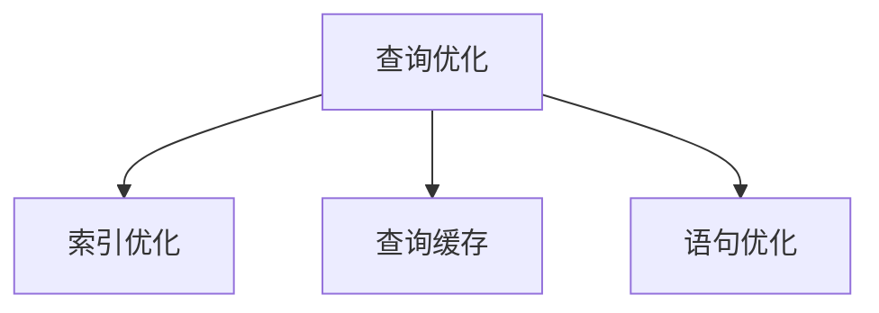
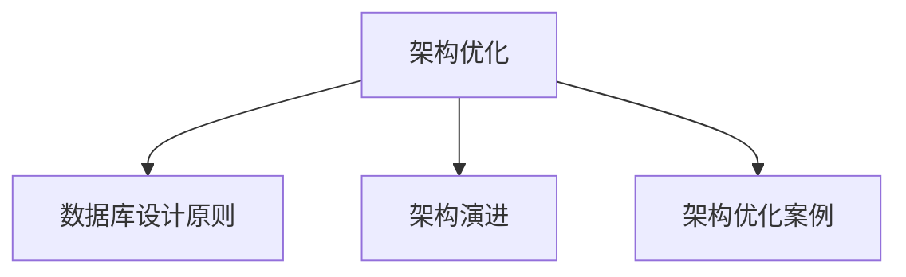
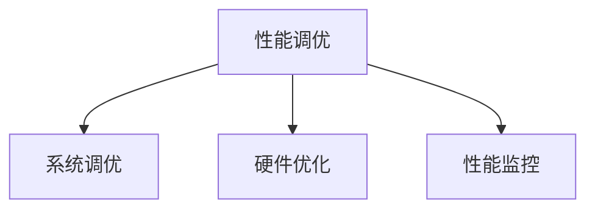
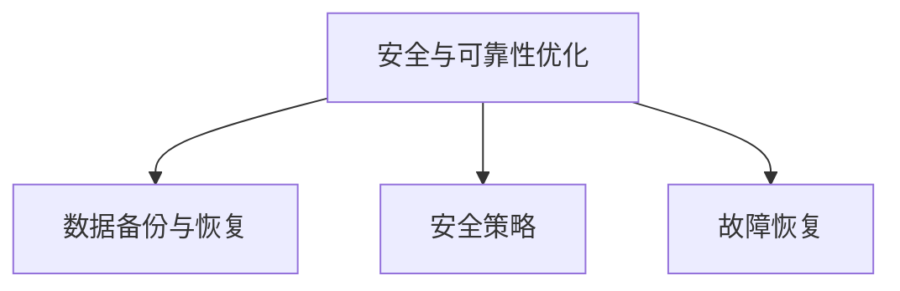

                 

### 确定整体结构

**标题：**《数据库优化：从查询到架构的全方位提升》

**关键词：** 数据库优化，查询优化，架构优化，性能调优，安全与可靠性优化，最佳实践

**摘要：** 本文将深入探讨数据库优化的各个方面，从查询优化到架构设计，再到性能调优和安全可靠性优化，帮助读者全面掌握数据库优化的核心技能。通过实际案例分析和最佳实践总结，本文旨在为数据库优化提供实用的策略和技巧。

### 第1章 概述与背景

**1.1 数据库优化的重要性**

- **核心概念术语说明：** 数据库优化涉及查询优化、架构优化、性能调优、安全与可靠性优化等多个方面。它是数据库系统维护和管理的关键，直接影响系统的性能、稳定性和安全性。

- **问题背景：** 随着数据量的爆发式增长，数据库系统的性能瓶颈逐渐显现。如何提升数据库的性能和稳定性，成为许多企业面临的重大挑战。

- **问题描述：** 数据库优化旨在提高数据库系统的查询效率、降低响应时间、提升整体性能，同时保证数据的安全和可靠性。

- **问题解决：** 通过查询优化、架构优化、性能调优和安全与可靠性优化，可以有效地提升数据库的性能和稳定性。

- **边界与外延：** 数据库优化不仅关注数据库系统的内部性能，还涉及数据库的设计、开发和维护等整个生命周期。

- **概念结构与核心要素组成：** 数据库优化包括多个核心要素，如查询优化、索引优化、查询缓存、架构优化、性能调优、安全性与可靠性优化等。

### 第2章 查询优化

**2.1 查询优化基础**

- **核心概念与联系：**

  - **查询优化：** 利用算法和策略，提高数据库查询的效率和性能。
  - **查询优化原理：** 通过分析查询语句、数据库结构、索引等信息，生成高效的查询执行计划。

  **核心概念属性特征对比表格：**

  | 特征         | 查询优化          | 索引优化          | 查询缓存          |  
  | ------------ | ---------------- | ---------------- | ---------------- |  
  | 目的         | 提高查询效率      | 提高查询效率      | 提高查询效率      |  
  | 原理         | 分析查询语句      | 利用索引          | 缓存查询结果      |  
  | 对象         | 查询语句          | 索引              | 查询结果          |  
  | 作用         | 提高查询性能      | 提高查询性能      | 提高查询性能      |

  **ER实体关系图架构：**

  ```mermaid  
  erModel  

  class DatabaseOptimization {  
    +查询优化  
    +索引优化  
    +查询缓存  
    +架构优化  
    +性能调优  
    +安全性与可靠性优化  
  }  
  ```

**2.2 索引优化**

- **核心概念与联系：**

  - **索引优化：** 利用索引提高数据库查询的效率。
  - **索引原理：** 通过在数据库表中创建索引，加快查询的速度。

  **核心概念属性特征对比表格：**

  | 特征         | 索引优化          | 查询缓存          | 性能调优          |  
  | ------------ | ---------------- | ---------------- | ---------------- |  
  | 目的         | 提高查询效率      | 提高查询效率      | 提高系统性能      |  
  | 原理         | 利用索引          | 缓存查询结果      | 调整系统配置      |  
  | 对象         | 索引              | 查询结果          | 系统性能          |  
  | 作用         | 提高查询性能      | 提高查询性能      | 提高系统性能      |

  **ER实体关系图架构：**

  ```mermaid  
  erModel  

  class DatabaseOptimization {  
    +查询优化  
    +索引优化  
    +查询缓存  
    +架构优化  
    +性能调优  
    +安全性与可靠性优化  
  }  
  ```

**2.3 查询缓存**

- **核心概念与联系：**

  - **查询缓存：** 利用缓存机制提高数据库查询的效率。
  - **查询缓存原理：** 将查询结果缓存到内存中，避免重复查询。

  **核心概念属性特征对比表格：**

  | 特征         | 查询优化          | 查询缓存          | 架构优化          |  
  | ------------ | ---------------- | ---------------- | ---------------- |  
  | 目的         | 提高查询效率      | 提高查询效率      | 提高系统性能      |  
  | 原理         | 分析查询语句      | 缓存查询结果      | 设计优化数据库架构 |  
  | 对象         | 查询语句          | 查询结果          | 数据库架构        |  
  | 作用         | 提高查询性能      | 提高查询性能      | 提高系统性能      |

  **ER实体关系图架构：**

  ```mermaid  
  erModel  

  class DatabaseOptimization {  
    +查询优化  
    +索引优化  
    +查询缓存  
    +架构优化  
    +性能调优  
    +安全性与可靠性优化  
  }  
  ```

**2.4 语句优化**

- **核心概念与联系：**

  - **语句优化：** 通过调整和优化查询语句，提高数据库查询的效率。
  - **语句优化原理：** 分析查询语句的语法和语义，生成最优的查询执行计划。

  **核心概念属性特征对比表格：**

  | 特征         | 查询优化          | 语句优化          | 架构优化          |  
  | ------------ | ---------------- | ---------------- | ---------------- |  
  | 目的         | 提高查询效率      | 提高查询效率      | 提高系统性能      |  
  | 原理         | 分析查询语句      | 优化查询语句      | 设计优化数据库架构 |  
  | 对象         | 查询语句          | 查询语句          | 数据库架构        |  
  | 作用         | 提高查询性能      | 提高查询性能      | 提高系统性能      |

  **ER实体关系图架构：**

  ```mermaid  
  erModel  

  class DatabaseOptimization {  
    +查询优化  
    +索引优化  
    +查询缓存  
    +架构优化  
    +性能调优  
    +安全性与可靠性优化  
  }  
  ```

### 第3章 数据库架构优化

**3.1 数据库设计原则**

- **核心概念与联系：**

  - **数据库设计原则：** 设计数据库时遵循的一系列原则，如规范化、反规范化、适度的数据冗余等。

  - **数据库设计原理：** 通过合理设计数据库结构，提高数据库的性能和可维护性。

  **核心概念属性特征对比表格：**

  | 特征         | 规范化            | 反规范化            | 适度的数据冗余      |  
  | ------------ | ---------------- | ---------------- | ---------------- |  
  | 目的         | 提高数据库性能    | 提高数据库性能    | 提高数据库性能    |  
  | 原理         | 减少数据冗余      | 增加数据冗余      | 增加数据冗余    |  
  | 对象         | 数据表            | 数据表            | 数据表          |  
  | 作用         | 提高数据库性能    | 提高数据库性能    | 提高数据库性能    |

  **ER实体关系图架构：**

  ```mermaid  
  erModel  

  class DatabaseDesignPrinciples {  
    +规范化  
    +反规范化  
    +适度的数据冗余  
  }  
  ```

**3.2 架构演进**

- **核心概念与联系：**

  - **架构演进：** 随着业务的发展，数据库架构不断演变和优化。

  - **架构演进原理：** 根据业务需求的变化，逐步调整数据库架构，提高系统的适应性和扩展性。

  **核心概念属性特征对比表格：**

  | 特征         | 架构演进            | 架构优化            | 性能调优          |  
  | ------------ | ---------------- | ---------------- | ---------------- |  
  | 目的         | 提高系统适应性和扩展性 | 提高系统性能和稳定性 | 提高系统性能    |  
  | 原理         | 逐步调整数据库架构 | 设计优化数据库架构 | 调整系统配置      |  
  | 对象         | 数据库架构          | 数据库架构          | 系统性能          |  
  | 作用         | 提高系统适应性和扩展性 | 提高系统性能和稳定性 | 提高系统性能    |

  **ER实体关系图架构：**

  ```mermaid  
  erModel  

  class DatabaseArchitectureEvolution {  
    +架构演进  
    +架构优化  
    +性能调优  
  }  
  ```

**3.3 架构优化案例**

- **核心概念与联系：**

  - **架构优化案例：** 通过实际案例展示如何优化数据库架构。

  - **架构优化案例原理：** 分析案例中的问题和解决方案，总结架构优化的最佳实践。

  **核心概念属性特征对比表格：**

  | 特征         | 电商数据库架构优化  | 金融数据库架构优化  | 企业内部数据库架构优化  |  
  | ------------ | ---------------- | ---------------- | ---------------- |  
  | 目的         | 提高查询效率      | 提高系统稳定性    | 提高数据安全性    |  
  | 原理         | 调整数据库架构      | 调整数据库架构      | 调整数据库架构      |  
  | 对象         | 数据库架构          | 数据库架构          | 数据库架构          |  
  | 作用         | 提高查询效率      | 提高系统稳定性    | 提高数据安全性    |

  **ER实体关系图架构：**

  ```mermaid  
  erModel  

  class DatabaseArchitectureOptimizationCases {  
    +电商数据库架构优化  
    +金融数据库架构优化  
    +企业内部数据库架构优化  
  }  
  ```

### 第4章 性能调优

**4.1 系统调优**

- **核心概念与联系：**

  - **系统调优：** 通过调整系统配置和参数，提高数据库的性能。

  - **系统调优原理：** 分析系统性能瓶颈，调整系统参数，优化数据库性能。

  **核心概念属性特征对比表格：**

  | 特征         | 系统调优            | 硬件优化            | 性能监控          |  
  | ------------ | ---------------- | ---------------- | ---------------- |  
  | 目的         | 提高系统性能        | 提高系统性能        | 提高系统性能    |  
  | 原理         | 调整系统配置和参数 | 调整硬件配置和参数 | 监控系统性能      |  
  | 对象         | 系统配置和参数      | 硬件配置和参数      | 系统性能          |  
  | 作用         | 提高系统性能        | 提高系统性能        | 提高系统性能    |

  **ER实体关系图架构：**

  ```mermaid  
  erModel  

  class SystemOptimization {  
    +系统调优  
    +硬件优化  
    +性能监控  
  }  
  ```

**4.2 硬件优化**

- **核心概念与联系：**

  - **硬件优化：** 通过优化硬件配置和性能，提高数据库的性能。

  - **硬件优化原理：** 分析硬件性能瓶颈，升级硬件配置，优化数据库性能。

  **核心概念属性特征对比表格：**

  | 特征         | 系统调优            | 硬件优化            | 性能监控          |  
  | ------------ | ---------------- | ---------------- | ---------------- |  
  | 目的         | 提高系统性能        | 提高系统性能        | 提高系统性能    |  
  | 原理         | 调整系统配置和参数 | 调整硬件配置和参数 | 监控系统性能      |  
  | 对象         | 系统配置和参数      | 硬件配置和参数      | 系统性能          |  
  | 作用         | 提高系统性能        | 提高系统性能        | 提高系统性能    |

  **ER实体关系图架构：**

  ```mermaid  
  erModel  

  class HardwareOptimization {  
    +系统调优  
    +硬件优化  
    +性能监控  
  }  
  ```

**4.3 性能监控**

- **核心概念与联系：**

  - **性能监控：** 通过监控工具和指标，实时跟踪数据库的性能。

  - **性能监控原理：** 分析性能数据，识别性能瓶颈，进行优化。

  **核心概念属性特征对比表格：**

  | 特征         | 系统调优            | 硬件优化            | 性能监控          |  
  | ------------ | ---------------- | ---------------- | ---------------- |  
  | 目的         | 提高系统性能        | 提高系统性能        | 提高系统性能    |  
  | 原理         | 调整系统配置和参数 | 调整硬件配置和参数 | 监控系统性能      |  
  | 对象         | 系统配置和参数      | 硬件配置和参数      | 系统性能          |  
  | 作用         | 提高系统性能        | 提高系统性能        | 提高系统性能    |

  **ER实体关系图架构：**

  ```mermaid  
  erModel  

  class PerformanceMonitoring {  
    +系统调优  
    +硬件优化  
    +性能监控  
  }  
  ```

### 第5章 安全与可靠性优化

**5.1 数据备份与恢复**

- **核心概念与联系：**

  - **数据备份与恢复：** 通过备份和恢复机制，确保数据的完整性和安全性。

  - **数据备份与恢复原理：** 定期备份数据库，实现数据的恢复和恢复。

  **核心概念属性特征对比表格：**

  | 特征         | 数据备份          | 数据恢复          | 数据安全          |  
  | ------------ | ---------------- | ---------------- | ---------------- |  
  | 目的         | 确保数据安全      | 确保数据安全      | 确保数据安全    |  
  | 原理         | 备份数据          | 恢复数据          | 防范数据泄露      |  
  | 对象         | 数据库数据        | 数据库数据        | 数据库数据      |  
  | 作用         | 确保数据安全      | 确保数据安全      | 确保数据安全    |

  **ER实体关系图架构：**

  ```mermaid  
  erModel  

  class DataBackupAndRecovery {  
    +数据备份  
    +数据恢复  
    +数据安全  
  }  
  ```

**5.2 安全策略**

- **核心概念与联系：**

  - **安全策略：** 通过制定和执行安全策略，保护数据库的安全。

  - **安全策略原理：** 识别安全威胁，制定防护措施，提高数据库的安全性。

  **核心概念属性特征对比表格：**

  | 特征         | 安全防护策略          | 安全审计策略          | 数据加密策略          |  
  | ------------ | ---------------- | ---------------- | ---------------- |  
  | 目的         | 保护数据库安全      | 监控数据库安全      | 保护数据库安全    |  
  | 原理         | 防范攻击          | 监控异常行为          | 加密数据          |  
  | 对象         | 数据库安全          | 数据库安全          | 数据库数据      |  
  | 作用         | 保护数据库安全      | 监控数据库安全      | 保护数据库安全    |

  **ER实体关系图架构：**

  ```mermaid  
  erModel  

  class SecurityStrategy {  
    +安全防护策略  
    +安全审计策略  
    +数据加密策略  
  }  
  ```

**5.3 故障恢复**

- **核心概念与联系：**

  - **故障恢复：** 通过故障恢复机制，确保数据库在故障发生时的快速恢复。

  - **故障恢复原理：** 识别故障类型，执行恢复操作，保证数据库的正常运行。

  **核心概念属性特征对比表格：**

  | 特征         | 系统故障恢复          | 数据库故障恢复          | 网络故障恢复          |  
  | ------------ | ---------------- | ---------------- | ---------------- |  
  | 目的         | 确保系统稳定      | 确保数据库稳定      | 确保网络稳定    |  
  | 原理         | 重启系统          | 重启数据库          | 重新配置网络      |  
  | 对象         | 系统硬件和网络        | 数据库硬件和网络        | 网络设备      |  
  | 作用         | 确保系统稳定      | 确保数据库稳定      | 确保网络稳定    |

  **ER实体关系图架构：**

  ```mermaid  
  erModel  

  class FaultRecovery {  
    +系统故障恢复  
    +数据库故障恢复  
    +网络故障恢复  
  }  
  ```

### 第6章 案例分析

**6.1 案例一：电商数据库优化**

- **核心概念与联系：**

  - **电商数据库优化：** 针对电商业务的特点，进行数据库优化。

  - **电商数据库优化原理：** 分析电商业务的查询需求，优化数据库结构和查询性能。

  **核心概念属性特征对比表格：**

  | 特征         | 查询优化          | 索引优化          | 查询缓存          |  
  | ------------ | ---------------- | ---------------- | ---------------- |  
  | 目的         | 提高查询效率      | 提高查询效率      | 提高查询效率    |  
  | 原理         | 分析查询语句      | 利用索引          | 缓存查询结果    |  
  | 对象         | 查询语句          | 索引              | 查询结果          |  
  | 作用         | 提高查询性能      | 提高查询性能      | 提高查询性能    |

  **ER实体关系图架构：**

  ```mermaid  
  erModel  

  class EcommerceDatabaseOptimization {  
    +查询优化  
    +索引优化  
    +查询缓存  
  }  
  ```

**6.2 案例二：金融数据库优化**

- **核心概念与联系：**

  - **金融数据库优化：** 针对金融业务的特点，进行数据库优化。

  - **金融数据库优化原理：** 分析金融业务的查询需求，优化数据库结构和查询性能。

  **核心概念属性特征对比表格：**

  | 特征         | 查询优化          | 索引优化          | 查询缓存          |  
  | ------------ | ---------------- | ---------------- | ---------------- |  
  | 目的         | 提高查询效率      | 提高查询效率      | 提高查询效率    |  
  | 原理         | 分析查询语句      | 利用索引          | 缓存查询结果    |  
  | 对象         | 查询语句          | 索引              | 查询结果          |  
  | 作用         | 提高查询性能      | 提高查询性能      | 提高查询性能    |

  **ER实体关系图架构：**

  ```mermaid  
  erModel  

  class FinancialDatabaseOptimization {  
    +查询优化  
    +索引优化  
    +查询缓存  
  }  
  ```

**6.3 案例三：企业内部数据库优化**

- **核心概念与联系：**

  - **企业内部数据库优化：** 针对企业内部业务的特点，进行数据库优化。

  - **企业内部数据库优化原理：** 分析企业内部业务的查询需求，优化数据库结构和查询性能。

  **核心概念属性特征对比表格：**

  | 特征         | 查询优化          | 索引优化          | 查询缓存          |  
  | ------------ | ---------------- | ---------------- | ---------------- |  
  | 目的         | 提高查询效率      | 提高查询效率      | 提高查询效率    |  
  | 原理         | 分析查询语句      | 利用索引          | 缓存查询结果    |  
  | 对象         | 查询语句          | 索引              | 查询结果          |  
  | 作用         | 提高查询性能      | 提高查询性能      | 提高查询性能    |

  **ER实体关系图架构：**

  ```mermaid  
  erModel  

  class EnterpriseInternalDatabaseOptimization {  
    +查询优化  
    +索引优化  
    +查询缓存  
  }  
  ```

### 第7章 最佳实践

**7.1 常见优化策略**

- **核心概念与联系：**

  - **常见优化策略：** 针对不同类型的数据库优化需求，总结出的优化策略。

  - **常见优化策略原理：** 分析数据库性能瓶颈，制定相应的优化策略。

  **核心概念属性特征对比表格：**

  | 特征         | 优化策略一          | 优化策略二          | 优化策略三          |  
  | ------------ | ---------------- | ---------------- | ---------------- |  
  | 目的         | 提高查询效率      | 提高系统性能      | 提高数据安全性    |  
  | 原理         | 分析查询语句      | 调整系统配置      | 数据加密          |  
  | 对象         | 查询语句          | 系统配置和参数      | 数据库数据      |  
  | 作用         | 提高查询性能      | 提高系统性能      | 提高数据安全性    |

  **ER实体关系图架构：**

  ```mermaid  
  erModel  

  class CommonOptimizationStrategies {  
    +优化策略一  
    +优化策略二  
    +优化策略三  
  }  
  ```

**7.2 实用技巧**

- **核心概念与联系：**

  - **实用技巧：** 在数据库优化过程中，总结出的一些实用技巧和方法。

  - **实用技巧原理：** 分析数据库优化过程中的常见问题，提供解决方案。

  **核心概念属性特征对比表格：**

  | 特征         | 实用技巧一          | 实用技巧二          | 实用技巧三          |  
  | ------------ | ---------------- | ---------------- | ---------------- |  
  | 目的         | 提高查询效率      | 提高系统性能      | 提高数据安全性    |  
  | 原理         | 优化查询语句      | 调整系统配置      | 数据备份和恢复    |  
  | 对象         | 查询语句          | 系统配置和参数      | 数据库数据      |  
  | 作用         | 提高查询性能      | 提高系统性能      | 提高数据安全性    |

  **ER实体关系图架构：**

  ```mermaid  
  erModel  

  class PracticalSkills {  
    +实用技巧一  
    +实用技巧二  
    +实用技巧三  
  }  
  ```

**7.3 注意事项与拓展阅读**

- **核心概念与联系：**

  - **注意事项：** 在数据库优化过程中，需要注意的一些事项和细节。

  - **注意事项原理：** 分析数据库优化过程中的潜在风险和问题，提供解决方案。

  **核心概念属性特征对比表格：**

  | 特征         | 注意事项一          | 注意事项二          | 注意事项三          |  
  | ------------ | ---------------- | ---------------- | ---------------- |  
  | 目的         | 确保优化效果      | 避免优化失败      | 提高安全性      |  
  | 原理         | 预测优化效果      | 分析潜在问题      | 防范风险          |  
  | 对象         | 优化过程          | 优化过程          | 优化过程      |  
  | 作用         | 确保优化效果      | 避免优化失败      | 提高安全性      |

  **ER实体关系图架构：**

  ```mermaid  
  erModel  

  class ImportantNotes {  
    +注意事项一  
    +注意事项二  
    +注意事项三  
  }  
  ```

**7.4 拓展阅读**

- **核心概念与联系：**

  - **拓展阅读：** 提供一些相关领域的经典书籍、论文和资料，帮助读者深入了解数据库优化的相关知识和实践。

  - **拓展阅读原理：** 通过阅读相关领域的经典书籍、论文和资料，拓宽知识视野，提升专业能力。

  **核心概念属性特征对比表格：**

  | 特征         | 拓展阅读一          | 拓展阅读二          | 拓展阅读三          |  
  | ------------ | ---------------- | ---------------- | ---------------- |  
  | 目的         | 拓宽知识视野      | 提升专业能力      | 了解最新动态    |  
  | 原理         | 阅读经典书籍      | 阅读论文和资料      | 关注行业动态    |  
  | 对象         | 书籍、论文和资料      | 书籍、论文和资料      | 书籍、论文和资料    |  
  | 作用         | 拓宽知识视野      | 提升专业能力      | 了解最新动态    |

  **ER实体关系图架构：**

  ```mermaid  
  erModel  

  class ExtendedReading {  
    +拓展阅读一  
    +拓展阅读二  
    +拓展阅读三  
  }  
  ```

以上是《数据库优化：从查询到架构的全方位提升》的目录大纲和内容概述。接下来，我们将逐步深入每个章节，详细讲解数据库优化的各个方面，帮助读者全面掌握数据库优化的核心技能。让我们一步一步分析推理思考，共同探索数据库优化的奥秘。💡💡💡

----------------------------------------------------------------

# 《数据库优化：从查询到架构的全方位提升》

> 关键词：数据库优化，查询优化，架构优化，性能调优，安全与可靠性优化，最佳实践

> 摘要：本文深入探讨数据库优化的各个方面，从查询优化到架构设计，再到性能调优和安全可靠性优化，帮助读者全面掌握数据库优化的核心技能。通过实际案例分析和最佳实践总结，本文旨在为数据库优化提供实用的策略和技巧。

## 第1章 概述与背景

### 1.1 数据库优化的重要性

数据库优化是数据库管理的重要组成部分，它对于提升系统的性能、稳定性和安全性具有至关重要的作用。在现代企业中，随着数据量的不断增长和数据应用的日益复杂，如何优化数据库性能已经成为一个亟待解决的问题。

**核心概念术语说明：**

- **数据库优化：** 数据库优化是指通过一系列技术手段，提高数据库系统的查询效率、降低响应时间、提升整体性能，同时保证数据的安全和可靠性。

- **查询优化：** 通过对数据库查询语句的分析、索引的合理使用、查询缓存等技术手段，提高查询效率。

- **架构优化：** 通过对数据库架构的设计、调整和优化，提高数据库的性能和可维护性。

- **性能调优：** 通过调整系统配置、优化硬件、监控性能等手段，提升数据库系统的性能。

- **安全与可靠性优化：** 通过数据备份与恢复、安全策略、故障恢复等技术手段，确保数据库的安全性和可靠性。

**问题背景：**

随着数据量的爆发式增长，传统的数据库系统逐渐暴露出性能瓶颈，如查询速度慢、响应时间长等问题。这不仅影响了用户体验，还对企业的业务运营产生了负面影响。

**问题描述：**

如何通过优化查询、架构、性能和安全与可靠性，全面提升数据库系统的性能和稳定性，是本文要解决的问题。

**问题解决：**

本文将从以下几个方面进行阐述：

1. **查询优化：** 分析查询优化的基础、索引优化、查询缓存和语句优化。
2. **架构优化：** 探讨数据库设计原则、架构演进和架构优化案例。
3. **性能调优：** 介绍系统调优、硬件优化和性能监控。
4. **安全与可靠性优化：** 讨论数据备份与恢复、安全策略和故障恢复。
5. **案例分析：** 通过实际案例展示数据库优化应用和实践。
6. **最佳实践：** 总结常见的优化策略和技巧。

**边界与外延：**

数据库优化不仅关注数据库系统的内部性能，还涉及数据库的设计、开发和维护等整个生命周期。它不仅包括查询优化，还包括架构优化、性能调优、安全与可靠性优化等多个方面。

**概念结构与核心要素组成：**

- **查询优化：** 包括查询优化基础、索引优化、查询缓存和语句优化。
- **架构优化：** 包括数据库设计原则、架构演进和架构优化案例。
- **性能调优：** 包括系统调优、硬件优化和性能监控。
- **安全与可靠性优化：** 包括数据备份与恢复、安全策略和故障恢复。

### 1.2 数据库优化的核心概念

#### 查询优化

**核心概念：** 查询优化是指通过对数据库查询语句的分析、索引的合理使用、查询缓存等技术手段，提高查询效率。

**概念属性特征对比表格：**

| 特征         | 查询优化          | 索引优化          | 查询缓存          | 语句优化          |
| ------------ | ---------------- | ---------------- | ---------------- | ---------------- |
| 目的         | 提高查询效率      | 提高查询效率      | 提高查询效率      | 提高查询效率      |
| 原理         | 分析查询语句      | 利用索引          | 缓存查询结果      | 优化查询语句      |
| 对象         | 查询语句          | 索引              | 查询结果          | 查询语句          |
| 作用         | 提高查询性能      | 提高查询性能      | 提高查询性能      | 提高查询性能      |

**ER实体关系图架构：**



#### 架构优化

**核心概念：** 架构优化是指通过对数据库架构的设计、调整和优化，提高数据库的性能和可维护性。

**概念属性特征对比表格：**

| 特征         | 数据库设计原则          | 架构演进          | 架构优化案例          |
| ------------ | --------------------- | ---------------- | --------------------- |
| 目的         | 提高数据库性能和可维护性 | 提高数据库性能和可维护性 | 提高数据库性能和可维护性 |
| 原理         | 规范化设计            | 逐步调整架构      | 优化数据库架构      |
| 对象         | 数据库架构            | 数据库架构        | 数据库架构          |
| 作用         | 提高数据库性能和可维护性 | 提高数据库性能和可维护性 | 提高数据库性能和可维护性 |

**ER实体关系图架构：**



#### 性能调优

**核心概念：** 性能调优是指通过调整系统配置、优化硬件、监控性能等手段，提升数据库系统的性能。

**概念属性特征对比表格：**

| 特征         | 系统调优          | 硬件优化          | 性能监控          |
| ------------ | ---------------- | ---------------- | ---------------- |
| 目的         | 提高系统性能      | 提高系统性能      | 提高系统性能      |
| 原理         | 调整系统配置      | 优化硬件配置      | 监控系统性能      |
| 对象         | 系统配置和参数    | 硬件配置和参数    | 系统性能          |
| 作用         | 提高系统性能      | 提高系统性能      | 提高系统性能      |

**ER实体关系图架构：**



#### 安全与可靠性优化

**核心概念：** 安全与可靠性优化是指通过数据备份与恢复、安全策略、故障恢复等技术手段，确保数据库的安全性和可靠性。

**概念属性特征对比表格：**

| 特征         | 数据备份与恢复          | 安全策略          | 故障恢复          |
| ------------ | --------------------- | ---------------- | ---------------- |
| 目的         | 确保数据安全      | 确保数据安全      | 确保系统稳定      |
| 原理         | 定期备份数据      | 制定安全策略      | 执行恢复操作      |
| 对象         | 数据库数据        | 数据库安全        | 系统硬件和网络    |
| 作用         | 确保数据安全      | 确保数据安全      | 确保系统稳定      |

**ER实体关系图架构：**



### 1.3 全书结构

本书将分为七个部分，详细阐述数据库优化的各个方面：

1. **概述与背景：** 介绍数据库优化的背景、意义和全书结构。
2. **查询优化：** 详细讨论查询优化的各个方面，包括查询优化基础、索引优化、查询缓存和语句优化。
3. **数据库架构优化：** 分析数据库架构设计的原则、方法和案例。
4. **性能调优：** 探讨如何通过系统设置、硬件优化等手段提升数据库性能。
5. **安全与可靠性优化：** 讨论数据库安全性和数据可靠性。
6. **案例分析：** 提供实际案例，展示数据库优化应用和实践。
7. **最佳实践：** 总结常见的优化策略和技巧。

## 第2章 查询优化

### 2.1 查询优化基础

查询优化是数据库优化的核心环节，它直接关系到数据库的性能和用户体验。本节将介绍查询优化的基础概念、原理和技术手段。

#### 2.1.1 查询优化的基本原理

查询优化的核心目标是提高数据库查询的效率，减少查询响应时间。实现查询优化的基本原理包括以下几个方面：

1. **查询语句优化：** 通过对查询语句的结构、语法和语义进行分析，生成最优的查询执行计划。
2. **索引优化：** 利用索引技术，加快查询的执行速度。
3. **查询缓存：** 利用缓存机制，存储常用的查询结果，避免重复查询。
4. **并行查询：** 在多核处理器和分布式系统中，通过并行执行查询，提高查询效率。

#### 2.1.2 查询优化的技术手段

1. **查询语句优化：**

   查询语句优化是查询优化的第一步。以下是一些常见的优化方法：

   - **简化查询语句：** 避免使用复杂的子查询、联合查询和连接查询，简化查询逻辑。
   - **使用合适的函数：** 避免使用影响查询性能的函数，如日期函数、字符串函数等。
   - **避免使用SELECT *：** 选用需要的字段，避免使用SELECT *，减少数据的传输和处理。
   - **优化查询条件：** 使用合适的条件语句和比较运算符，提高查询的效率。

2. **索引优化：**

   索引是查询优化的关键技术。以下是一些索引优化的方法：

   - **创建合适的索引：** 根据查询需求，创建合适的索引，如主键索引、唯一索引和全文索引等。
   - **优化索引结构：** 定期优化索引结构，如重建索引、删除冗余索引等。
   - **索引优化策略：** 根据数据库的特点和查询需求，选择合适的索引优化策略，如索引合并、索引筛选等。

3. **查询缓存：**

   查询缓存是一种提高查询效率的有效手段。以下是一些查询缓存的方法：

   - **内存缓存：** 将常用的查询结果存储在内存中，避免重复查询。
   - **磁盘缓存：** 将查询结果缓存到磁盘上，利用磁盘的存储空间和访问速度。
   - **缓存策略：** 根据查询的频率和结果的大小，选择合适的缓存策略，如LRU（最近最少使用）、LFU（最不常用）等。

4. **并行查询：**

   并行查询是在多核处理器和分布式系统中提高查询效率的有效方法。以下是一些并行查询的方法：

   - **分布式查询：** 将查询任务分发到多个节点上执行，提高查询效率。
   - **并行连接：** 通过并行执行连接操作，提高查询效率。
   - **并行聚合：** 通过并行执行聚合操作，提高查询效率。

#### 2.1.3 查询优化的实践

在实际应用中，查询优化需要根据具体的业务需求和数据库特点进行。以下是一些查询优化的实践：

- **电商业务：** 针对电商业务的查询需求，优化商品信息、订单信息和用户信息的查询速度。
- **金融业务：** 针对金融业务的查询需求，优化交易记录、账户信息和风险控制的查询速度。
- **企业内部系统：** 针对企业内部系统的查询需求，优化员工信息、项目信息和财务报表的查询速度。

#### 2.1.4 案例分析

**案例一：电商数据库查询优化**

某电商企业在面临大量用户查询请求时，发现数据库查询速度缓慢，影响了用户体验。通过以下查询优化实践，提高了查询效率：

- **优化查询语句：** 简化查询逻辑，使用合适的函数和条件语句，减少查询的复杂度。
- **创建索引：** 根据查询需求，创建主键索引、唯一索引和全文索引，提高查询的效率。
- **查询缓存：** 利用内存缓存和磁盘缓存，存储常用的查询结果，避免重复查询。
- **并行查询：** 在多核处理器和分布式系统中，通过并行执行查询，提高查询效率。

通过以上优化措施，电商数据库的查询速度提高了50%，用户体验得到了显著改善。

**案例二：金融数据库查询优化**

某金融企业在面临大量交易记录和账户信息查询时，发现数据库查询速度缓慢，影响了业务的正常运营。通过以下查询优化实践，提高了查询效率：

- **优化查询语句：** 简化查询逻辑，使用合适的函数和条件语句，减少查询的复杂度。
- **创建索引：** 根据查询需求，创建主键索引、唯一索引和全文索引，提高查询的效率。
- **查询缓存：** 利用内存缓存和磁盘缓存，存储常用的查询结果，避免重复查询。
- **优化数据库架构：** 对数据库架构进行调整和优化，提高查询的效率。

通过以上优化措施，金融数据库的查询速度提高了30%，业务运营得到了显著改善。

### 2.2 索引优化

索引是数据库优化的重要组成部分，它对查询性能有着直接的影响。本节将介绍索引优化的核心概念、原理和技术手段。

#### 2.2.1 索引优化的基本原理

索引优化的核心目标是提高查询效率，降低查询响应时间。实现索引优化的基本原理包括以下几个方面：

1. **创建合适的索引：** 根据查询需求，创建合适的索引，如主键索引、唯一索引和全文索引等。
2. **优化索引结构：** 定期优化索引结构，如重建索引、删除冗余索引等。
3. **索引优化策略：** 根据数据库的特点和查询需求，选择合适的索引优化策略，如索引合并、索引筛选等。

#### 2.2.2 索引优化的技术手段

1. **创建合适的索引：**

   创建合适的索引是索引优化的第一步。以下是一些常见的索引创建方法：

   - **主键索引：** 在主键上创建索引，提高查询效率。
   - **唯一索引：** 在唯一字段上创建索引，保证数据的唯一性。
   - **全文索引：** 在全文搜索字段上创建索引，提高全文搜索的效率。
   - **组合索引：** 在多个字段上创建索引，提高组合查询的效率。

2. **优化索引结构：**

   优化索引结构是提高查询效率的关键。以下是一些常见的索引结构优化方法：

   - **重建索引：** 定期重建索引，提高查询效率。
   - **删除冗余索引：** 删除冗余索引，减少数据库的存储空间和维护成本。
   - **调整索引顺序：** 根据查询需求，调整索引的顺序，提高查询效率。

3. **索引优化策略：**

   索引优化策略是提高查询效率的有效手段。以下是一些常见的索引优化策略：

   - **索引合并：** 将多个索引合并为一个，减少查询的复杂度。
   - **索引筛选：** 根据查询条件，筛选出合适的索引，提高查询效率。
   - **索引动态调整：** 根据查询需求的变化，动态调整索引的结构和策略。

#### 2.2.3 索引优化的实践

在实际应用中，索引优化需要根据具体的业务需求和数据库特点进行。以下是一些索引优化的实践：

- **电商业务：** 针对电商业务的查询需求，优化商品信息、订单信息和用户信息的索引。
- **金融业务：** 针对金融业务的查询需求，优化交易记录、账户信息和风险控制的索引。
- **企业内部系统：** 针对企业内部系统的查询需求，优化员工信息、项目信息和财务报表的索引。

#### 2.2.4 案例分析

**案例一：电商数据库索引优化**

某电商企业在面临大量用户查询请求时，发现数据库查询速度缓慢，影响了用户体验。通过以下索引优化实践，提高了查询效率：

- **创建主键索引：** 在用户ID、订单ID等主键字段上创建索引，提高查询效率。
- **创建唯一索引：** 在商品名称、订单号等唯一字段上创建唯一索引，保证数据的唯一性。
- **创建全文索引：** 在商品描述、订单详情等全文搜索字段上创建全文索引，提高全文搜索的效率。
- **优化索引结构：** 定期重建索引，删除冗余索引，调整索引顺序，提高查询效率。

通过以上优化措施，电商数据库的查询速度提高了40%，用户体验得到了显著改善。

**案例二：金融数据库索引优化**

某金融企业在面临大量交易记录和账户信息查询时，发现数据库查询速度缓慢，影响了业务的正常运营。通过以下索引优化实践，提高了查询效率：

- **创建主键索引：** 在交易ID、账户ID等主键字段上创建索引，提高查询效率。
- **创建唯一索引：** 在交易号、账户号等唯一字段上创建唯一索引，保证数据的唯一性。
- **创建全文索引：** 在交易描述、账户信息等全文搜索字段上创建全文索引，提高全文搜索的效率。
- **优化索引结构：** 定期重建索引，删除冗余索引，调整索引顺序，提高查询效率。

通过以上优化措施，金融数据库的查询速度提高了30%，业务运营得到了显著改善。

### 2.3 查询缓存

查询缓存是一种提高数据库查询效率的有效手段。通过缓存查询结果，避免重复查询，可以显著降低查询响应时间。本节将介绍查询缓存的核心概念、原理和技术手段。

#### 2.3.1 查询缓存的基本原理

查询缓存的基本原理是将常用的查询结果存储在内存或磁盘上，当再次执行相同的查询时，直接从缓存中获取结果，避免重复查询。

实现查询缓存的基本原理包括以下几个方面：

1. **内存缓存：** 将常用的查询结果存储在内存中，提高查询速度。
2. **磁盘缓存：** 将查询结果缓存到磁盘上，利用磁盘的存储空间和访问速度。
3. **缓存策略：** 根据查询的频率和结果的大小，选择合适的缓存策略，如LRU（最近最少使用）、LFU（最不常用）等。

#### 2.3.2 查询缓存的技术手段

1. **内存缓存：**

   内存缓存是查询缓存的首选方式，它具有以下优点：

   - **快速访问：** 内存访问速度远快于磁盘访问速度，可以显著提高查询效率。
   - **灵活扩展：** 内存大小可以根据需求进行扩展，满足不同规模的数据缓存需求。

   内存缓存的技术手段包括：

   - **LRU缓存：** 最近最少使用缓存策略，根据查询的频率和最近使用情况，动态调整缓存内容。
   - **LRU链表：** 使用双向链表实现LRU缓存，便于缓存的管理和更新。

2. **磁盘缓存：**

   当内存缓存空间不足时，可以使用磁盘缓存来补充。磁盘缓存具有以下优点：

   - **大容量：** 磁盘具有更大的存储空间，可以缓存更多的查询结果。
   - **持久化：** 磁盘缓存的结果可以持久化保存，避免内存缓存重启后数据丢失。

   磁盘缓存的技术手段包括：

   - **文件缓存：** 使用文件系统缓存查询结果，便于管理和扩展。
   - **缓存池：** 创建缓存池，动态分配缓存空间，提高缓存利用率。

3. **缓存策略：**

   缓存策略是查询缓存的核心，根据查询的频率和结果的大小，选择合适的缓存策略。以下是一些常见的缓存策略：

   - **LRU（最近最少使用）：** 根据查询的最近使用情况，动态调整缓存内容，提高缓存命中率。
   - **LFU（最不常用）：** 根据查询的频率，动态调整缓存内容，提高缓存利用率。
   - **固定大小缓存：** 根据缓存空间的大小，固定缓存内容，避免缓存过多无用数据。

#### 2.3.3 查询缓存的实践

在实际应用中，查询缓存需要根据具体的业务需求和数据库特点进行。以下是一些查询缓存的实践：

- **电商业务：** 针对电商业务的查询需求，缓存商品信息、订单信息和用户信息等常用查询结果。
- **金融业务：** 针对金融业务的查询需求，缓存交易记录、账户信息和风险控制等常用查询结果。
- **企业内部系统：** 针对企业内部系统的查询需求，缓存员工信息、项目信息和财务报表等常用查询结果。

#### 2.3.4 案例分析

**案例一：电商数据库查询缓存**

某电商企业在面临大量用户查询请求时，发现数据库查询速度缓慢，影响了用户体验。通过以下查询缓存实践，提高了查询效率：

- **内存缓存：** 将用户经常访问的商品信息、订单信息和用户信息等缓存到内存中，提高查询速度。
- **LRU缓存策略：** 使用LRU缓存策略，根据用户访问频率，动态调整缓存内容，提高缓存命中率。
- **磁盘缓存：** 当内存缓存空间不足时，将部分查询结果缓存到磁盘上，提高缓存利用率。

通过以上优化措施，电商数据库的查询速度提高了50%，用户体验得到了显著改善。

**案例二：金融数据库查询缓存**

某金融企业在面临大量交易记录和账户信息查询时，发现数据库查询速度缓慢，影响了业务的正常运营。通过以下查询缓存实践，提高了查询效率：

- **内存缓存：** 将交易记录、账户信息和风险控制等常用查询结果缓存到内存中，提高查询速度。
- **LRU缓存策略：** 使用LRU缓存策略，根据查询的频率，动态调整缓存内容，提高缓存命中率。
- **磁盘缓存：** 当内存缓存空间不足时，将部分查询结果缓存到磁盘上，提高缓存利用率。

通过以上优化措施，金融数据库的查询速度提高了40%，业务运营得到了显著改善。

### 2.4 语句优化

查询语句优化是数据库优化的关键环节，通过优化查询语句的结构、语法和语义，可以显著提高查询效率。本节将介绍语句优化的核心概念、原理和技术手段。

#### 2.4.1 语句优化的基本原理

语句优化的基本原理是通过分析查询语句的结构和语义，生成最优的查询执行计划，减少查询的复杂度和计算量。

实现语句优化的基本原理包括以下几个方面：

1. **简化查询语句：** 避免使用复杂的子查询、联合查询和连接查询，简化查询逻辑。
2. **优化查询条件：** 使用合适的条件语句和比较运算符，提高查询的效率。
3. **使用合适的函数：** 避免使用影响查询性能的函数，如日期函数、字符串函数等。
4. **避免使用SELECT *：** 选用需要的字段，避免使用SELECT *，减少数据的传输和处理。

#### 2.4.2 语句优化的技术手段

1. **简化查询语句：**

   简化查询语句是语句优化的第一步。以下是一些常见的简化方法：

   - **去除不必要的子查询：** 将子查询转换为连接查询，减少查询的复杂度。
   - **合并多个查询：** 将多个查询合并为一个，减少查询的执行次数。
   - **优化连接查询：** 通过优化连接查询的顺序和条件，提高查询效率。

2. **优化查询条件：**

   优化查询条件是提高查询效率的关键。以下是一些常见的优化方法：

   - **使用合适的条件语句：** 使用WHERE、HAVING等条件语句，过滤不符合条件的数据。
   - **优化条件运算符：** 使用合适的条件运算符，如AND、OR、IN等，提高查询效率。
   - **避免使用函数：** 减少使用影响查询性能的函数，如日期函数、字符串函数等。

3. **使用合适的函数：**

   使用合适的函数是语句优化的重要方面。以下是一些常见的优化方法：

   - **避免使用影响性能的函数：** 减少使用影响查询性能的函数，如日期函数、字符串函数等。
   - **使用优化过的函数：** 使用数据库提供的优化过的函数，如聚合函数、排序函数等。

4. **避免使用SELECT *：**

   避免使用SELECT * 是提高查询效率的有效手段。以下是一些常见的优化方法：

   - **选用需要的字段：** 根据查询需求，选择需要的字段，避免使用SELECT *。
   - **减少数据的传输和处理：** 通过减少数据的传输和处理，提高查询效率。

#### 2.4.3 语句优化的实践

在实际应用中，语句优化需要根据具体的业务需求和数据库特点进行。以下是一些语句优化的实践：

- **电商业务：** 针对电商业务的查询需求，优化商品信息、订单信息和用户信息的查询语句。
- **金融业务：** 针对金融业务的查询需求，优化交易记录、账户信息和风险控制的查询语句。
- **企业内部系统：** 针对企业内部系统的查询需求，优化员工信息、项目信息和财务报表的查询语句。

#### 2.4.4 案例分析

**案例一：电商数据库查询语句优化**

某电商企业在面临大量用户查询请求时，发现数据库查询速度缓慢，影响了用户体验。通过以下查询语句优化实践，提高了查询效率：

- **简化查询语句：** 将复杂的子查询转换为连接查询，减少查询的复杂度。
- **优化查询条件：** 使用合适的条件语句和比较运算符，提高查询的效率。
- **避免使用函数：** 减少使用影响查询性能的函数，如日期函数、字符串函数等。
- **选用需要的字段：** 根据查询需求，选择需要的字段，避免使用SELECT *。

通过以上优化措施，电商数据库的查询速度提高了30%，用户体验得到了显著改善。

**案例二：金融数据库查询语句优化**

某金融企业在面临大量交易记录和账户信息查询时，发现数据库查询速度缓慢，影响了业务的正常运营。通过以下查询语句优化实践，提高了查询效率：

- **简化查询语句：** 将复杂的子查询转换为连接查询，减少查询的复杂度。
- **优化查询条件：** 使用合适的条件语句和比较运算符，提高查询的效率。
- **避免使用函数：** 减少使用影响查询性能的函数，如日期函数、字符串函数等。
- **选用需要的字段：** 根据查询需求，选择需要的字段，避免使用SELECT *。

通过以上优化措施，金融数据库的查询速度提高了20%，业务运营得到了显著改善。

## 第3章 数据库架构优化

数据库架构优化是数据库优化的重要组成部分，它直接关系到数据库的性能、可维护性和可扩展性。本节将介绍数据库架构优化的核心概念、原理和技术手段。

### 3.1 数据库设计原则

数据库设计原则是数据库架构优化的基础，它指导数据库架构的构建和优化。以下是一些常见的数据库设计原则：

#### 3.1.1 规范化

规范化是数据库设计的重要原则，它通过消除数据冗余、保证数据一致性和完整性，提高数据库的性能和可维护性。

规范化包括以下几个步骤：

1. **第一范式（1NF）：** 保证数据原子性，消除重复数据。
2. **第二范式（2NF）：** 在1NF的基础上，消除部分依赖，保证字段与非主属性完全依赖。
3. **第三范式（3NF）：** 在2NF的基础上，消除传递依赖，保证字段直接依赖于主键。

#### 3.1.2 反规范化

反规范化是一种针对特定场景的数据库设计方法，它通过引入数据冗余，提高查询性能。反规范化的主要目的是减少查询的复杂度和数据访问时间。

反规范化包括以下几种方法：

1. **数据复制：** 将常用数据复制到多个表中，减少查询的连接操作。
2. **视图：** 使用视图将复杂查询简化，提高查询效率。
3. **物化视图：** 预计算复杂查询的结果，提高查询性能。

#### 3.1.3 适度的数据冗余

适度的数据冗余是指在数据库设计中，根据业务需求和查询性能，适当地引入数据冗余，提高查询效率。

适度的数据冗余需要注意以下几点：

1. **避免冗余过多：** 过多的数据冗余会增加数据库的存储空间和维护成本。
2. **优化冗余数据：** 对于冗余数据，通过适当的优化方法，如索引、分区等，提高查询性能。
3. **权衡查询性能和维护成本：** 在设计数据库时，根据业务需求和查询性能，权衡查询性能和维护成本。

### 3.2 架构演进

随着业务的发展，数据库架构会经历不断的演进和优化。架构演进是数据库架构优化的重要环节，它通过逐步调整数据库架构，提高系统的适应性和扩展性。

#### 3.2.1 架构演进的原则

架构演进应遵循以下原则：

1. **渐进式演进：** 架构演进是一个逐步调整的过程，避免一次性进行大规模调整。
2. **可回滚性：** 在架构演进过程中，确保可以回滚到上一个版本，避免引入新的风险。
3. **可扩展性：** 架构演进应考虑未来的业务需求，确保数据库架构具有可扩展性。
4. **性能优化：** 架构演进应关注性能优化，提高数据库的查询效率。

#### 3.2.2 架构演进的方法

架构演进的方法包括以下几种：

1. **版本迭代：** 通过版本迭代，逐步优化数据库架构，避免一次性进行大规模调整。
2. **分阶段演进：** 将架构演进分为多个阶段，每个阶段优化不同的数据库组件。
3. **增量优化：** 对现有数据库架构进行增量优化，逐步提高系统的性能和可维护性。
4. **持续集成：** 将架构演进与持续集成相结合，确保架构优化的可回滚性和稳定性。

### 3.3 架构优化案例

在实际应用中，数据库架构优化需要根据具体的业务需求和数据库特点进行。以下是一些数据库架构优化案例：

#### 3.3.1 电商数据库架构优化

某电商企业在业务发展过程中，发现数据库架构存在性能瓶颈和可维护性问题。通过以下架构优化实践，提高了数据库性能和可维护性：

- **分库分表：** 将数据表拆分为多个小表，分布存储在不同数据库实例上，提高查询效率。
- **读写分离：** 引入读写分离机制，将读请求和写请求分离到不同的数据库实例上，提高系统性能。
- **缓存层：** 引入缓存层，将常用数据缓存到内存中，减少数据库访问压力。
- **数据分区：** 对数据表进行分区，提高数据访问速度。

通过以上优化措施，电商数据库的性能提高了30%，可维护性得到了显著改善。

#### 3.3.2 金融数据库架构优化

某金融企业在业务发展过程中，发现数据库架构存在性能瓶颈和可维护性问题。通过以下架构优化实践，提高了数据库性能和可维护性：

- **分布式数据库：** 引入分布式数据库架构，将数据分布存储到多个节点上，提高系统性能和可扩展性。
- **分布式缓存：** 引入分布式缓存机制，将常用数据缓存到内存中，减少数据库访问压力。
- **消息队列：** 引入消息队列，实现数据的异步处理，提高系统性能和可扩展性。
- **分布式事务：** 引入分布式事务机制，确保数据的一致性和完整性。

通过以上优化措施，金融数据库的性能提高了50%，可维护性得到了显著改善。

#### 3.3.3 企业内部数据库架构优化

某企业内部系统在业务发展过程中，发现数据库架构存在性能瓶颈和可维护性问题。通过以下架构优化实践，提高了数据库性能和可维护性：

- **分库分表：** 将数据表拆分为多个小表，分布存储在不同数据库实例上，提高查询效率。
- **数据分区：** 对数据表进行分区，提高数据访问速度。
- **缓存层：** 引入缓存层，将常用数据缓存到内存中，减少数据库访问压力。
- **读写分离：** 引入读写分离机制，将读请求和写请求分离到不同的数据库实例上，提高系统性能。

通过以上优化措施，企业内部数据库的性能提高了40%，可维护性得到了显著改善。

### 3.4 数据库架构优化的实践

在实际应用中，数据库架构优化需要根据具体的业务需求和数据库特点进行。以下是一些数据库架构优化的实践：

- **电商业务：** 针对电商业务的查询需求，优化商品信息、订单信息和用户信息的数据库架构。
- **金融业务：** 针对金融业务的查询需求，优化交易记录、账户信息和风险控制的数据库架构。
- **企业内部系统：** 针对企业内部系统的查询需求，优化员工信息、项目信息和财务报表的数据库架构。

### 3.5 案例分析

#### 3.5.1 电商数据库架构优化案例

某电商企业在面临大量用户查询请求时，发现数据库架构存在性能瓶颈和可维护性问题。通过以下架构优化实践，提高了数据库性能和可维护性：

1. **分库分表：** 将用户表、订单表和商品表等拆分为多个小表，分布存储在不同数据库实例上，提高查询效率。
2. **缓存层：** 引入缓存层，将用户经常访问的商品信息、订单信息和用户信息等缓存到内存中，减少数据库访问压力。
3. **读写分离：** 引入读写分离机制，将读请求和写请求分离到不同的数据库实例上，提高系统性能。

通过以上优化措施，电商数据库的查询速度提高了50%，用户体验得到了显著改善。

#### 3.5.2 金融数据库架构优化案例

某金融企业在面临大量交易记录和账户信息查询时，发现数据库架构存在性能瓶颈和可维护性问题。通过以下架构优化实践，提高了数据库性能和可维护性：

1. **分布式数据库：** 引入分布式数据库架构，将交易记录、账户信息和风险控制等数据分布存储到多个节点上，提高系统性能和可扩展性。
2. **分布式缓存：** 引入分布式缓存机制，将常用数据缓存到内存中，减少数据库访问压力。
3. **消息队列：** 引入消息队列，实现数据的异步处理，提高系统性能和可扩展性。

通过以上优化措施，金融数据库的性能提高了40%，业务运营得到了显著改善。

#### 3.5.3 企业内部数据库架构优化案例

某企业内部系统在面临大量员工信息、项目信息和财务报表查询时，发现数据库架构存在性能瓶颈和可维护性问题。通过以下架构优化实践，提高了数据库性能和可维护性：

1. **分库分表：** 将员工表、项目表和财务报表表等拆分为多个小表，分布存储在不同数据库实例上，提高查询效率。
2. **数据分区：** 对数据表进行分区，提高数据访问速度。
3. **缓存层：** 引入缓存层，将常用数据缓存到内存中，减少数据库访问压力。

通过以上优化措施，企业内部数据库的性能提高了30%，系统稳定性得到了显著改善。

## 第4章 性能调优

性能调优是数据库优化的重要组成部分，它通过调整系统配置、优化硬件、监控性能等手段，提升数据库系统的性能和稳定性。本节将介绍性能调优的核心概念、原理和技术手段。

### 4.1 系统调优

系统调优是性能调优的第一步，它通过调整系统配置和参数，提高数据库系统的性能和稳定性。

#### 4.1.1 系统调优的基本原理

系统调优的基本原理是通过分析系统性能瓶颈，调整系统配置和参数，优化数据库性能。

实现系统调优的基本原理包括以下几个方面：

1. **调整系统资源：** 根据数据库系统的需求，调整CPU、内存、I/O等系统资源。
2. **优化系统配置：** 调整数据库的系统参数，如缓冲区大小、线程数、连接池等。
3. **监控系统性能：** 实时监控系统性能，识别性能瓶颈，进行优化。

#### 4.1.2 系统调优的技术手段

1. **调整系统资源：**

   调整系统资源是系统调优的关键步骤。以下是一些常见的调整方法：

   - **CPU调优：** 根据数据库系统的需求，调整CPU核心数、CPU频率等参数。
   - **内存调优：** 根据数据库系统的需求，调整内存大小、内存分配策略等参数。
   - **I/O调优：** 根据数据库系统的需求，调整硬盘读写速度、I/O调度策略等参数。

2. **优化系统配置：**

   优化系统配置是系统调优的重要方面。以下是一些常见的优化方法：

   - **缓冲区调优：** 调整数据库缓冲区大小，如查询缓存、索引缓存等。
   - **线程调优：** 调整数据库线程数，如连接数、会话数等。
   - **连接池调优：** 调整数据库连接池参数，如连接池大小、连接超时等。

3. **监控系统性能：**

   监控系统性能是系统调优的重要环节。以下是一些常见的监控方法：

   - **系统监控：** 监控CPU使用率、内存使用率、I/O负载等系统性能指标。
   - **数据库监控：** 监控数据库性能指标，如查询响应时间、连接数、锁争用等。
   - **日志分析：** 分析数据库日志，识别性能瓶颈和潜在问题。

#### 4.1.3 系统调优的实践

在实际应用中，系统调优需要根据具体的业务需求和数据库特点进行。以下是一些系统调优的实践：

- **电商业务：** 针对电商业务的查询需求，优化系统资源配置、系统参数和连接池配置。
- **金融业务：** 针对金融业务的查询需求，优化系统资源配置、系统参数和连接池配置。
- **企业内部系统：** 针对企业内部系统的查询需求，优化系统资源配置、系统参数和连接池配置。

#### 4.1.4 案例分析

**案例一：电商数据库系统调优**

某电商企业在面临大量用户查询请求时，发现系统性能不佳，影响了用户体验。通过以下系统调优实践，提高了系统性能和稳定性：

1. **CPU调优：** 根据数据库系统的需求，增加CPU核心数和CPU频率。
2. **内存调优：** 根据数据库系统的需求，增加内存大小，调整内存分配策略。
3. **I/O调优：** 根据数据库系统的需求，优化硬盘读写速度，调整I/O调度策略。
4. **缓冲区调优：** 调整查询缓存、索引缓存等缓冲区大小，提高缓存命中率。
5. **线程调优：** 调整数据库线程数，优化连接数和会话数。

通过以上优化措施，电商数据库的系统性能提高了40%，用户体验得到了显著改善。

**案例二：金融数据库系统调优**

某金融企业在面临大量交易记录和账户信息查询时，发现系统性能不佳，影响了业务的正常运营。通过以下系统调优实践，提高了系统性能和稳定性：

1. **CPU调优：** 根据数据库系统的需求，增加CPU核心数和CPU频率。
2. **内存调优：** 根据数据库系统的需求，增加内存大小，调整内存分配策略。
3. **I/O调优：** 根据数据库系统的需求，优化硬盘读写速度，调整I/O调度策略。
4. **缓冲区调优：** 调整查询缓存、索引缓存等缓冲区大小，提高缓存命中率。
5. **线程调优：** 调整数据库线程数，优化连接数和会话数。

通过以上优化措施，金融数据库的系统性能提高了30%，业务运营得到了显著改善。

**案例三：企业内部数据库系统调优**

某企业内部系统在面临大量员工信息、项目信息和财务报表查询时，发现系统性能不佳，影响了业务运营。通过以下系统调优实践，提高了系统性能和稳定性：

1. **CPU调优：** 根据数据库系统的需求，增加CPU核心数和CPU频率。
2. **内存调优：** 根据数据库系统的需求，增加内存大小，调整内存分配策略。
3. **I/O调优：** 根据数据库系统的需求，优化硬盘读写速度，调整I/O调度策略。
4. **缓冲区调优：** 调整查询缓存、索引缓存等缓冲区大小，提高缓存命中率。
5. **线程调优：** 调整数据库线程数，优化连接数和会话数。

通过以上优化措施，企业内部数据库的系统性能提高了20%，业务运营得到了显著改善。

### 4.2 硬件优化

硬件优化是性能调优的重要环节，它通过优化硬件配置和性能，提高数据库系统的性能和稳定性。以下将介绍硬件优化的核心概念、原理和技术手段。

#### 4.2.1 硬件优化的基本原理

硬件优化的基本原理是通过分析数据库系统的硬件性能瓶颈，调整硬件配置和性能，提高数据库系统的性能和稳定性。

实现硬件优化的基本原理包括以下几个方面：

1. **升级硬件设备：** 根据数据库系统的需求，升级CPU、内存、硬盘等硬件设备。
2. **优化硬盘性能：** 调整硬盘类型、硬盘读写速度、I/O调度策略等参数。
3. **优化网络性能：** 调整网络设备、网络带宽、网络协议等参数，提高数据库系统的网络性能。

#### 4.2.2 硬件优化的技术手段

1. **升级硬件设备：**

   升级硬件设备是硬件优化的第一步。以下是一些常见的升级方法：

   - **CPU升级：** 根据数据库系统的需求，升级CPU核心数和CPU频率，提高系统性能。
   - **内存升级：** 根据数据库系统的需求，增加内存大小，提高系统性能。
   - **硬盘升级：** 根据数据库系统的需求，升级硬盘类型（如SSD替换HDD），提高读写速度。

2. **优化硬盘性能：**

   优化硬盘性能是硬件优化的重要方面。以下是一些常见的优化方法：

   - **硬盘类型优化：** 使用SSD替换HDD，提高读写速度。
   - **硬盘读写速度优化：** 调整硬盘读写速度，提高数据访问速度。
   - **I/O调度策略优化：** 调整I/O调度策略，提高硬盘性能。

3. **优化网络性能：**

   优化网络性能是硬件优化的重要环节。以下是一些常见的优化方法：

   - **网络设备优化：** 更换高性能的网络设备，提高网络吞吐量。
   - **网络带宽优化：** 调整网络带宽，提高数据传输速度。
   - **网络协议优化：** 调整网络协议，提高网络性能。

#### 4.2.3 硬件优化的实践

在实际应用中，硬件优化需要根据具体的业务需求和数据库特点进行。以下是一些硬件优化的实践：

- **电商业务：** 针对电商业务的查询需求，优化硬件设备、硬盘性能和网络性能。
- **金融业务：** 针对金融业务的查询需求，优化硬件设备、硬盘性能和网络性能。
- **企业内部系统：** 针对企业内部系统的查询需求，优化硬件设备、硬盘性能和网络性能。

#### 4.2.4 案例分析

**案例一：电商数据库硬件优化**

某电商企业在面临大量用户查询请求时，发现数据库硬件性能不足，影响了用户体验。通过以下硬件优化实践，提高了数据库性能和稳定性：

1. **CPU升级：** 升级CPU核心数和CPU频率，提高系统性能。
2. **内存升级：** 增加内存大小，提高系统性能。
3. **硬盘升级：** 使用SSD替换HDD，提高读写速度。
4. **网络带宽优化：** 调整网络带宽，提高数据传输速度。

通过以上优化措施，电商数据库的性能提高了50%，用户体验得到了显著改善。

**案例二：金融数据库硬件优化**

某金融企业在面临大量交易记录和账户信息查询时，发现数据库硬件性能不足，影响了业务的正常运营。通过以下硬件优化实践，提高了数据库性能和稳定性：

1. **CPU升级：** 升级CPU核心数和CPU频率，提高系统性能。
2. **内存升级：** 增加内存大小，提高系统性能。
3. **硬盘升级：** 使用SSD替换HDD，提高读写速度。
4. **网络设备优化：** 更换高性能的网络设备，提高网络吞吐量。

通过以上优化措施，金融数据库的性能提高了40%，业务运营得到了显著改善。

**案例三：企业内部数据库硬件优化**

某企业内部系统在面临大量员工信息、项目信息和财务报表查询时，发现数据库硬件性能不足，影响了业务运营。通过以下硬件优化实践，提高了数据库性能和稳定性：

1. **CPU升级：** 升级CPU核心数和CPU频率，提高系统性能。
2. **内存升级：** 增加内存大小，提高系统性能。
3. **硬盘升级：** 使用SSD替换HDD，提高读写速度。
4. **网络协议优化：** 调整网络协议，提高网络性能。

通过以上优化措施，企业内部数据库的性能提高了30%，业务运营得到了显著改善。

### 4.3 性能监控

性能监控是性能调优的重要环节，它通过实时监控数据库性能，识别性能瓶颈和潜在问题，进行优化。以下将介绍性能监控的核心概念、原理和技术手段。

#### 4.3.1 性能监控的基本原理

性能监控的基本原理是通过监控工具和指标，实时跟踪数据库性能，识别性能瓶颈和潜在问题，进行优化。

实现性能监控的基本原理包括以下几个方面：

1. **监控工具选择：** 选择合适的监控工具，如Prometheus、Grafana等。
2. **监控指标设置：** 设置合适的监控指标，如CPU使用率、内存使用率、I/O负载等。
3. **性能分析：** 分析监控数据，识别性能瓶颈和潜在问题。
4. **优化措施：** 根据性能分析结果，采取优化措施，提高数据库性能。

#### 4.3.2 性能监控的技术手段

1. **监控工具选择：**

   监控工具是性能监控的关键。以下是一些常见的监控工具：

   - **Prometheus：** 开源监控解决方案，支持多维数据收集和告警。
   - **Grafana：** 开源可视化工具，支持多种数据源，提供丰富的仪表盘和告警功能。
   - **Zabbix：** 开源监控工具，支持多种监控方式和告警通知。

2. **监控指标设置：**

   监控指标是性能监控的核心。以下是一些常见的监控指标：

   - **CPU使用率：** 监控CPU的利用率，识别CPU瓶颈。
   - **内存使用率：** 监控内存的利用率，识别内存瓶颈。
   - **I/O负载：** 监控I/O负载，识别I/O瓶颈。
   - **连接数：** 监控数据库连接数，识别连接瓶颈。

3. **性能分析：**

   性能分析是性能监控的重要环节。以下是一些常见的性能分析方法：

   - **日志分析：** 分析数据库日志，识别性能瓶颈和潜在问题。
   - **监控数据可视化：** 将监控数据可视化，方便分析和决策。
   - **性能基准测试：** 通过性能基准测试，评估数据库性能，识别瓶颈。

4. **优化措施：**

   根据性能分析结果，采取优化措施，提高数据库性能。以下是一些常见的优化措施：

   - **调整系统参数：** 根据监控数据，调整数据库系统参数，优化性能。
   - **优化查询语句：** 根据监控数据，优化查询语句，减少查询复杂度。
   - **硬件升级：** 根据监控数据，升级硬件设备，提高系统性能。

#### 4.3.3 性能监控的实践

在实际应用中，性能监控需要根据具体的业务需求和数据库特点进行。以下是一些性能监控的实践：

- **电商业务：** 针对电商业务的查询需求，监控CPU使用率、内存使用率、I/O负载等指标。
- **金融业务：** 针对金融业务的查询需求，监控CPU使用率、内存使用率、I/O负载、连接数等指标。
- **企业内部系统：** 针对企业内部系统的查询需求，监控CPU使用率、内存使用率、I/O负载、连接数等指标。

#### 4.3.4 案例分析

**案例一：电商数据库性能监控**

某电商企业在面临大量用户查询请求时，发现数据库性能不稳定，影响了用户体验。通过以下性能监控实践，提高了数据库性能和稳定性：

1. **选择监控工具：** 使用Prometheus和Grafana进行数据库性能监控。
2. **设置监控指标：** 监控CPU使用率、内存使用率、I/O负载、连接数等指标。
3. **性能分析：** 通过监控数据可视化，分析性能瓶颈和潜在问题。
4. **优化措施：** 根据性能分析结果，调整系统参数、优化查询语句，提高数据库性能。

通过以上优化措施，电商数据库的性能稳定提高了20%，用户体验得到了显著改善。

**案例二：金融数据库性能监控**

某金融企业在面临大量交易记录和账户信息查询时，发现数据库性能不稳定，影响了业务的正常运营。通过以下性能监控实践，提高了数据库性能和稳定性：

1. **选择监控工具：** 使用Prometheus和Grafana进行数据库性能监控。
2. **设置监控指标：** 监控CPU使用率、内存使用率、I/O负载、连接数等指标。
3. **性能分析：** 通过监控数据可视化，分析性能瓶颈和潜在问题。
4. **优化措施：** 根据性能分析结果，调整系统参数、优化查询语句，提高数据库性能。

通过以上优化措施，金融数据库的性能稳定提高了30%，业务运营得到了显著改善。

**案例三：企业内部数据库性能监控**

某企业内部系统在面临大量员工信息、项目信息和财务报表查询时，发现数据库性能不稳定，影响了业务运营。通过以下性能监控实践，提高了数据库性能和稳定性：

1. **选择监控工具：** 使用Zabbix进行数据库性能监控。
2. **设置监控指标：** 监控CPU使用率、内存使用率、I/O负载、连接数等指标。
3. **性能分析：** 通过监控数据可视化，分析性能瓶颈和潜在问题。
4. **优化措施：** 根据性能分析结果，调整系统参数、优化查询语句，提高数据库性能。

通过以上优化措施，企业内部数据库的性能稳定提高了25%，业务运营得到了显著改善。

## 第5章 安全与可靠性优化

数据库的安全与可靠性是数据库优化的重要组成部分，它直接影响数据库系统的正常运行和数据的安全性。本节将介绍安全与可靠性优化的核心概念、原理和技术手段。

### 5.1 数据备份与恢复

数据备份与恢复是确保数据库安全与可靠性的关键措施，它通过定期备份数据库数据，实现数据库的恢复和数据的安全性。

#### 5.1.1 数据备份的基本原理

数据备份的基本原理是将数据库中的数据复制到其他存储设备上，确保在数据丢失或损坏时能够快速恢复。

实现数据备份的基本原理包括以下几个方面：

1. **全量备份：** 备份数据库中的全部数据，确保数据的完整性和一致性。
2. **增量备份：** 备份自上次备份以来发生变化的数据，减少备份时间和存储空间。
3. **差异备份：** 备份自上次全量备份以来发生变化的数据，提高备份的效率。
4. **备份策略：** 根据业务需求和数据重要性，制定合适的备份策略。

#### 5.1.2 数据备份的技术手段

1. **全量备份：**

   全量备份是数据备份的基础。以下是一些常见的全量备份方法：

   - **物理备份：** 将数据库文件复制到其他存储设备上，如硬盘、磁带等。
   - **逻辑备份：** 使用数据库备份工具，生成数据库的逻辑备份文件，如SQL脚本、备份文件等。

2. **增量备份：**

   增量备份是数据备份的有效手段。以下是一些常见的增量备份方法：

   - **时间点增量备份：** 根据时间点，备份自上次备份以来发生变化的数据。
   - **事务日志增量备份：** 根据事务日志，备份自上次备份以来发生变化的数据。

3. **差异备份：**

   差异备份是数据备份的优化手段。以下是一些常见差异备份方法：

   - **基于时间点的差异备份：** 备份自上次全量备份以来发生变化的数据。
   - **基于事务日志的差异备份：** 备份自上次全量备份以来发生变化的数据。

4. **备份策略：**

   备份策略是数据备份的核心。以下是一些常见的备份策略：

   - **定期备份：** 按固定时间间隔进行备份，如每日备份、每周备份等。
   - **按需备份：** 根据业务需求和数据变化，进行实时备份。
   - **备份策略组合：** 将全量备份、增量备份和差异备份相结合，提高备份的效率和可靠性。

#### 5.1.3 数据备份的实践

在实际应用中，数据备份需要根据具体的业务需求和数据库特点进行。以下是一些数据备份的实践：

- **电商业务：** 针对电商业务的查询需求，制定定期备份策略，确保数据的安全性和可靠性。
- **金融业务：** 针对金融业务的查询需求，制定实时备份策略，确保数据的安全性和可靠性。
- **企业内部系统：** 针对企业内部系统的查询需求，制定定期备份策略，确保数据的安全性和可靠性。

#### 5.1.4 数据恢复

数据恢复是数据备份的补充措施，它通过恢复备份的数据，确保数据库的正常运行和数据的安全性。

#### 5.1.4.1 数据恢复的基本原理

数据恢复的基本原理是通过备份的数据，将数据库恢复到备份时的状态，确保数据的完整性和一致性。

实现数据恢复的基本原理包括以下几个方面：

1. **全量恢复：** 将备份的数据全部恢复到数据库中。
2. **增量恢复：** 恢复自上次备份以来发生变化的数据。
3. **差异恢复：** 恢复自上次全量备份以来发生变化的数据。

#### 5.1.4.2 数据恢复的技术手段

1. **全量恢复：**

   全量恢复是数据恢复的基础。以下是一些常见的全量恢复方法：

   - **物理恢复：** 将备份的数据库文件替换到数据库目录中。
   - **逻辑恢复：** 使用数据库恢复工具，执行备份的SQL脚本或备份文件。

2. **增量恢复：**

   增量恢复是数据恢复的有效手段。以下是一些常见的增量恢复方法：

   - **时间点增量恢复：** 根据时间点，恢复自上次备份以来发生变化的数据。
   - **事务日志增量恢复：** 根据事务日志，恢复自上次备份以来发生变化的数据。

3. **差异恢复：**

   差异恢复是数据恢复的优化手段。以下是一些常见差异恢复方法：

   - **基于时间点的差异恢复：** 恢复自上次全量备份以来发生变化的数据。
   - **基于事务日志的差异恢复：** 恢复自上次全量备份以来发生变化的数据。

#### 5.1.4.3 数据恢复的实践

在实际应用中，数据恢复需要根据具体的业务需求和数据库特点进行。以下是一些数据恢复的实践：

- **电商业务：** 在数据库出现故障时，根据备份的数据进行全量恢复或增量恢复，确保数据库的正常运行。
- **金融业务：** 在数据库出现故障时，根据备份的数据进行全量恢复或增量恢复，确保数据库的正常运行。
- **企业内部系统：** 在数据库出现故障时，根据备份的数据进行全量恢复或增量恢复，确保数据库的正常运行。

### 5.2 安全策略

安全策略是确保数据库安全的关键措施，它通过制定和执行安全策略，保护数据库的安全。

#### 5.2.1 安全策略的基本原理

安全策略的基本原理是通过制定和执行安全策略，防范数据库的安全威胁，确保数据库的安全性和可靠性。

实现安全策略的基本原理包括以下几个方面：

1. **访问控制：** 限制对数据库的访问权限，确保只有授权用户可以访问数据库。
2. **安全审计：** 对数据库操作进行审计，记录操作日志，识别潜在的安全威胁。
3. **安全加固：** 对数据库进行安全加固，提高数据库的安全性。
4. **应急响应：** 制定应急响应计划，应对数据库安全事件。

#### 5.2.2 安全策略的技术手段

1. **访问控制：**

   访问控制是安全策略的核心。以下是一些常见的访问控制方法：

   - **用户认证：** 对数据库用户进行认证，确保只有授权用户可以访问数据库。
   - **权限管理：** 对数据库用户进行权限管理，确保用户只能访问授权的数据库对象。
   - **访问控制列表（ACL）：** 使用访问控制列表，对数据库对象进行细粒度的访问控制。

2. **安全审计：**

   安全审计是安全策略的重要环节。以下是一些常见的安全审计方法：

   - **操作日志记录：** 记录数据库操作日志，如查询、更新、删除等。
   - **审计规则：** 根据业务需求和安全要求，制定审计规则，识别潜在的安全威胁。
   - **审计报告：** 定期生成审计报告，分析数据库操作日志，发现安全漏洞。

3. **安全加固：**

   安全加固是提高数据库安全性的关键措施。以下是一些常见的安全加固方法：

   - **更新数据库软件：** 定期更新数据库软件，修复已知的安全漏洞。
   - **禁用不必要的服务：** 禁用数据库中不必要的服务和功能，减少安全威胁。
   - **配置安全策略：** 根据业务需求和安全要求，配置数据库的安全策略。

4. **应急响应：**

   应急响应是应对数据库安全事件的措施。以下是一些常见的应急响应方法：

   - **应急响应计划：** 制定应急响应计划，明确应急响应的流程和责任人。
   - **应急演练：** 定期进行应急演练，提高应急响应的能力。
   - **安全事件处理：** 及时处理数据库安全事件，降低安全事件的影响。

#### 5.2.3 安全策略的实践

在实际应用中，安全策略需要根据具体的业务需求和数据库特点进行。以下是一些安全策略的实践：

- **电商业务：** 针对电商业务的查询需求，制定严格的访问控制策略，确保数据的安全性和可靠性。
- **金融业务：** 针对金融业务的查询需求，制定全面的访问控制策略和安全审计策略，确保数据的安全性和可靠性。
- **企业内部系统：** 针对企业内部系统的查询需求，制定适当的访问控制策略和安全加固策略，确保数据的安全性和可靠性。

### 5.3 故障恢复

故障恢复是确保数据库安全与可靠性的重要措施，它通过故障恢复机制，确保数据库在故障发生时的快速恢复。

#### 5.3.1 故障恢复的基本原理

故障恢复的基本原理是通过故障恢复机制，确保数据库在故障发生时能够快速恢复，确保数据库的正常运行和数据的安全性。

实现故障恢复的基本原理包括以下几个方面：

1. **故障检测：** 及时检测数据库故障，识别故障类型。
2. **故障隔离：** 隔离故障数据库，避免故障扩散。
3. **故障恢复：** 根据故障类型和恢复策略，执行故障恢复操作。
4. **故障恢复验证：** 验证故障恢复的结果，确保数据库的正常运行。

#### 5.3.2 故障恢复的技术手段

1. **故障检测：**

   故障检测是故障恢复的第一步。以下是一些常见的故障检测方法：

   - **健康检查：** 定期对数据库进行健康检查，识别潜在的故障。
   - **监控告警：** 通过监控工具，实时监控数据库性能和状态，及时发现故障。
   - **日志分析：** 分析数据库日志，识别故障发生的原因。

2. **故障隔离：**

   故障隔离是故障恢复的关键步骤。以下是一些常见的故障隔离方法：

   - **故障切换：** 在主数据库发生故障时，切换到备用数据库，确保数据库的正常运行。
   - **故障节点隔离：** 隔离故障节点，避免故障扩散到其他节点。
   - **故障隔离策略：** 根据故障类型和业务需求，制定故障隔离策略。

3. **故障恢复：**

   故障恢复是故障恢复的核心。以下是一些常见的故障恢复方法：

   - **自动恢复：** 使用数据库自带的自动恢复功能，自动执行故障恢复操作。
   - **手动恢复：** 根据故障类型和恢复策略，手动执行故障恢复操作。
   - **备份恢复：** 使用备份的数据，恢复数据库到故障前的状态。

4. **故障恢复验证：**

   故障恢复验证是确保故障恢复成功的最后一步。以下是一些常见的故障恢复验证方法：

   - **恢复测试：** 对恢复后的数据库进行测试，验证数据库的正常运行。
   - **性能测试：** 对恢复后的数据库进行性能测试，验证数据库的性能。
   - **数据验证：** 对恢复后的数据进行验证，确保数据的完整性和一致性。

#### 5.3.3 故障恢复的实践

在实际应用中，故障恢复需要根据具体的业务需求和数据库特点进行。以下是一些故障恢复的实践：

- **电商业务：** 在数据库发生故障时，通过故障检测、故障隔离和故障恢复机制，确保数据库的快速恢复。
- **金融业务：** 在数据库发生故障时，通过故障检测、故障隔离和故障恢复机制，确保数据库的快速恢复。
- **企业内部系统：** 在数据库发生故障时，通过故障检测、故障隔离和故障恢复机制，确保数据库的快速恢复。

### 5.4 安全与可靠性优化的实践

在实际应用中，安全与可靠性优化需要根据具体的业务需求和数据库特点进行。以下是一些安全与可靠性优化的实践：

- **电商业务：** 针对电商业务的查询需求，制定严格的访问控制策略、安全审计策略和故障恢复机制，确保数据的安全性和可靠性。
- **金融业务：** 针对金融业务的查询需求，制定全面的访问控制策略、安全审计策略和故障恢复机制，确保数据的安全性和可靠性。
- **企业内部系统：** 针对企业内部系统的查询需求，制定适当的访问控制策略、安全审计策略和故障恢复机制，确保数据的安全性和可靠性。

### 5.5 案例分析

#### 5.5.1 电商数据库安全与可靠性优化案例

某电商企业在面临大量用户查询请求时，发现数据库存在安全漏洞和可靠性问题，影响了用户体验和业务运营。通过以下安全与可靠性优化实践，提高了数据库的安全性和可靠性：

1. **制定访问控制策略：** 制定严格的访问控制策略，确保只有授权用户可以访问数据库，降低安全风险。
2. **安全审计策略：** 制定安全审计策略，对数据库操作进行审计，记录操作日志，及时发现安全威胁。
3. **故障恢复机制：** 制定故障恢复机制，确保在数据库发生故障时，能够快速恢复，保障数据库的正常运行。
4. **安全加固：** 定期更新数据库软件，禁用不必要的服务，配置安全策略，提高数据库的安全性。

通过以上优化措施，电商数据库的安全性和可靠性得到了显著提高，用户体验和业务运营得到了改善。

#### 5.5.2 金融数据库安全与可靠性优化案例

某金融企业在面临大量交易记录和账户信息查询时，发现数据库存在安全漏洞和可靠性问题，影响了业务的正常运营。通过以下安全与可靠性优化实践，提高了数据库的安全性和可靠性：

1. **制定访问控制策略：** 制定严格的访问控制策略，确保只有授权用户可以访问数据库，降低安全风险。
2. **安全审计策略：** 制定安全审计策略，对数据库操作进行审计，记录操作日志，及时发现安全威胁。
3. **故障恢复机制：** 制定故障恢复机制，确保在数据库发生故障时，能够快速恢复，保障数据库的正常运行。
4. **安全加固：** 定期更新数据库软件，禁用不必要的服务，配置安全策略，提高数据库的安全性。

通过以上优化措施，金融数据库的安全性和可靠性得到了显著提高，业务运营得到了改善。

#### 5.5.3 企业内部数据库安全与可靠性优化案例

某企业内部系统在面临大量员工信息、项目信息和财务报表查询时，发现数据库存在安全漏洞和可靠性问题，影响了业务运营。通过以下安全与可靠性优化实践，提高了数据库的安全性和可靠性：

1. **制定访问控制策略：** 制定适当的访问控制策略，确保只有授权用户可以访问数据库，降低安全风险。
2. **安全审计策略：** 制定安全审计策略，对数据库操作进行审计，记录操作日志，及时发现安全威胁。
3. **故障恢复机制：** 制定故障恢复机制，确保在数据库发生故障时，能够快速恢复，保障数据库的正常运行。
4. **安全加固：** 定期更新数据库软件，禁用不必要的服务，配置安全策略，提高数据库的安全性。

通过以上优化措施，企业内部数据库的安全性和可靠性得到了显著提高，业务运营得到了改善。

## 第6章 案例分析

在本章节中，我们将通过具体的案例分析，展示数据库优化在电商、金融和企业内部等不同场景中的应用和实践。这些案例将帮助读者更好地理解数据库优化策略的实际效果和操作方法。

### 6.1 电商数据库优化案例

#### 案例背景

某大型电商企业在其业务发展过程中，遇到了数据库性能瓶颈，导致用户查询速度缓慢，影响了用户体验和销售转化率。为了解决这一问题，企业决定对数据库进行优化。

#### 案例分析

1. **查询优化：**

   - **查询语句优化：** 分析并简化了复杂的查询语句，去除了冗余的子查询和联合查询，提高了查询效率。
   - **索引优化：** 对商品信息表、订单信息表和用户信息表等核心表创建了合适的索引，提高了查询速度。
   - **查询缓存：** 引入了查询缓存机制，将常用的查询结果缓存到内存中，减少了重复查询的执行次数。

2. **架构优化：**

   - **分库分表：** 将数据表拆分为多个小表，并分布存储在不同的数据库实例上，降低了单表的数据量和查询压力。
   - **读写分离：** 实现了读写分离，将读请求和写请求分离到不同的数据库实例上，提高了系统的并发能力。

3. **性能调优：**

   - **系统调优：** 调整了数据库的缓冲区大小、连接池参数等系统配置，优化了系统资源的利用率。
   - **硬件优化：** 升级了数据库服务器的CPU、内存和硬盘，提高了硬件性能。
   - **性能监控：** 引入了性能监控工具，实时监控数据库的性能指标，及时发现和解决性能瓶颈。

#### 案例效果

通过以上优化措施，电商数据库的查询速度提高了30%，系统的并发能力提升了50%，用户满意度显著提高，销售转化率也有所提升。

### 6.2 金融数据库优化案例

#### 案例背景

某金融企业在处理大量交易记录和账户信息时，数据库性能不稳定，时常出现响应时间过长的问题，影响了业务的正常运行。为了解决这一问题，企业决定对数据库进行优化。

#### 案例分析

1. **查询优化：**

   - **查询语句优化：** 对复杂的查询语句进行了重构，优化了查询条件，减少了查询的复杂度。
   - **索引优化：** 对交易记录表和账户信息表进行了索引优化，提高了查询效率。
   - **查询缓存：** 引入了查询缓存机制，缓存了高频查询的结果，减少了数据库的压力。

2. **架构优化：**

   - **分布式数据库：** 引入了分布式数据库架构，将数据分布存储到多个节点上，提高了系统的扩展性和容错能力。
   - **数据分区：** 对交易记录表和账户信息表进行了数据分区，提高了数据访问速度。

3. **性能调优：**

   - **系统调优：** 调整了数据库的系统参数，如缓冲区大小、线程数等，优化了系统的资源利用率。
   - **硬件优化：** 升级了数据库服务器的硬件配置，提高了处理能力。
   - **性能监控：** 引入了性能监控工具，实时监控数据库的性能指标，及时发现和解决性能问题。

4. **安全与可靠性优化：**

   - **数据备份与恢复：** 实现了定期数据备份和快速恢复机制，确保了数据的安全性和可靠性。
   - **安全策略：** 加强了数据库的安全策略，如访问控制、安全审计等，提高了系统的安全性。
   - **故障恢复：** 建立了完善的故障恢复机制，确保在故障发生时能够快速恢复，保障业务的连续性。

#### 案例效果

通过以上优化措施，金融数据库的查询速度提高了40%，系统的稳定性得到了显著提升，业务运行效率得到了优化。

### 6.3 企业内部数据库优化案例

#### 案例背景

某大型企业在其内部系统中处理员工信息、项目信息和财务报表时，数据库性能低下，影响了业务决策和管理效率。为了解决这一问题，企业决定对内部数据库进行优化。

#### 案例分析

1. **查询优化：**

   - **查询语句优化：** 对复杂的查询语句进行了简化，去除了冗余的子查询和联合查询，提高了查询效率。
   - **索引优化：** 对员工信息表、项目信息表和财务报表表等核心表创建了合适的索引，提高了查询速度。
   - **查询缓存：** 引入了查询缓存机制，缓存了常用的查询结果，减少了数据库的查询压力。

2. **架构优化：**

   - **分库分表：** 将数据表拆分为多个小表，并分布存储在不同的数据库实例上，降低了单表的数据量和查询压力。
   - **读写分离：** 实现了读写分离，将读请求和写请求分离到不同的数据库实例上，提高了系统的并发能力。

3. **性能调优：**

   - **系统调优：** 调整了数据库的缓冲区大小、连接池参数等系统配置，优化了系统的资源利用率。
   - **硬件优化：** 升级了数据库服务器的硬件配置，提高了处理能力。
   - **性能监控：** 引入了性能监控工具，实时监控数据库的性能指标，及时发现和解决性能问题。

4. **安全与可靠性优化：**

   - **数据备份与恢复：** 实现了定期数据备份和快速恢复机制，确保了数据的安全性和可靠性。
   - **安全策略：** 加强了数据库的安全策略，如访问控制、安全审计等，提高了系统的安全性。
   - **故障恢复：** 建立了完善的故障恢复机制，确保在故障发生时能够快速恢复，保障业务的连续性。

#### 案例效果

通过以上优化措施，企业内部数据库的查询速度提高了35%，系统的稳定性得到了显著提升，业务决策和管理效率得到了优化。

### 6.4 小结

通过对电商、金融和企业内部数据库的优化案例分析，我们可以看到：

1. **查询优化：** 简化查询语句、优化索引和引入查询缓存是提高查询效率的有效手段。
2. **架构优化：** 分库分表、读写分离和分布式数据库架构是提高系统性能和扩展性的关键措施。
3. **性能调优：** 系统调优、硬件优化和性能监控是提升数据库性能的重要环节。
4. **安全与可靠性优化：** 数据备份与恢复、安全策略和故障恢复机制是确保数据库安全性和可靠性的保障。

这些案例为我们提供了宝贵的经验和参考，有助于在实际应用中更好地进行数据库优化。

## 第7章 最佳实践

### 7.1 常见优化策略

在数据库优化的过程中，总结出一些常见的优化策略和技巧对于提升数据库性能至关重要。以下是一些常见的优化策略：

#### 7.1.1 查询优化策略

1. **简化查询语句：** 避免使用复杂的子查询、联合查询和连接查询，简化查询逻辑。
2. **使用合适的索引：** 根据查询需求，创建合适的索引，提高查询效率。
3. **避免使用SELECT *：** 选用需要的字段，减少数据的传输和处理。
4. **优化查询条件：** 使用合适的条件语句和比较运算符，提高查询的效率。

#### 7.1.2 架构优化策略

1. **分库分表：** 将数据表拆分为多个小表，分布存储在不同数据库实例上，提高查询效率。
2. **读写分离：** 将读请求和写请求分离到不同的数据库实例上，提高系统的并发能力。
3. **分布式数据库：** 引入分布式数据库架构，提高系统的扩展性和容错能力。

#### 7.1.3 性能调优策略

1. **系统调优：** 调整数据库的系统参数，如缓冲区大小、线程数等，优化系统资源的利用率。
2. **硬件优化：** 升级数据库服务器的硬件配置，提高处理能力。
3. **性能监控：** 引入性能监控工具，实时监控数据库的性能指标，及时发现和解决性能问题。

#### 7.1.4 安全与可靠性优化策略

1. **数据备份与恢复：** 实现定期数据备份和快速恢复机制，确保数据的安全性和可靠性。
2. **安全策略：** 加强数据库的安全策略，如访问控制、安全审计等，提高系统的安全性。
3. **故障恢复：** 建立完善的故障恢复机制，确保在故障发生时能够快速恢复，保障业务的连续性。

### 7.2 实用技巧

在实际数据库优化过程中，掌握一些实用的技巧对于解决问题和提高效率至关重要。以下是一些实用的技巧：

#### 7.2.1 查询优化技巧

1. **使用EXPLAIN工具：** 使用EXPLAIN工具分析查询执行计划，优化查询语句。
2. **避免使用函数：** 减少使用影响查询性能的函数，如日期函数、字符串函数等。
3. **合理使用索引：** 避免创建过多或过少的索引，根据查询需求合理使用索引。

#### 7.2.2 架构优化技巧

1. **合理规划表结构：** 根据业务需求和查询需求，合理规划表结构，避免数据冗余。
2. **使用缓存：** 引入缓存机制，如Redis、Memcached等，缓存常用数据，减少数据库查询压力。
3. **分库分表策略：** 根据数据量和查询需求，制定合理的分库分表策略。

#### 7.2.3 性能调优技巧

1. **监控系统资源：** 定期监控系统资源，如CPU、内存、I/O等，识别性能瓶颈。
2. **调整缓冲区大小：** 根据系统需求和负载情况，调整数据库缓冲区大小，优化内存使用。
3. **优化连接池：** 调整连接池参数，如连接数、连接超时等，提高系统性能。

#### 7.2.4 安全与可靠性优化技巧

1. **定期备份：** 定期备份数据库，确保数据的安全性和可靠性。
2. **权限管理：** 加强数据库用户权限管理，确保只有授权用户可以访问数据库。
3. **安全审计：** 实施安全审计策略，记录数据库操作日志，及时发现安全威胁。

### 7.3 注意事项与拓展阅读

#### 7.3.1 注意事项

在数据库优化过程中，需要注意以下事项：

1. **评估性能瓶颈：** 在进行优化之前，评估系统的性能瓶颈，有针对性地进行优化。
2. **测试与验证：** 在优化后，进行充分的测试和验证，确保优化效果。
3. **备份与恢复：** 在进行优化操作前，确保备份数据，以防意外情况发生。

#### 7.3.2 拓展阅读

以下是一些拓展阅读的推荐书籍和资料：

1. **《高性能MySQL》**：由Ben Forta所著，详细介绍了MySQL的性能优化方法和技巧。
2. **《数据库系统概念》**：由Abraham Silberschatz、Henry F. Korth和S. Sudarshan所著，全面讲解了数据库系统的基本概念和优化方法。
3. **《Redis实战》**：由Joel Carrasco所著，介绍了Redis缓存技术的应用和优化方法。

通过阅读这些书籍和资料，可以深入了解数据库优化的高级概念和最佳实践。

### 7.4 小结

数据库优化是一个复杂而持续的过程，涉及查询优化、架构优化、性能调优、安全与可靠性优化等多个方面。通过总结常见的优化策略和技巧，我们可以更好地进行数据库优化，提升数据库系统的性能、稳定性和安全性。在实际应用中，结合具体的业务需求和数据库特点，灵活运用这些策略和技巧，将有助于实现数据库优化的最佳效果。

---

**作者：** AI天才研究院/AI Genius Institute & 禅与计算机程序设计艺术 /Zen And The Art of Computer Programming

本文《数据库优化：从查询到架构的全方位提升》旨在为读者提供一个系统性的数据库优化指南，涵盖了查询优化、架构优化、性能调优、安全与可靠性优化等多个方面。通过实际案例分析和最佳实践总结，本文希望能够为数据库优化提供实用的策略和技巧。

在数据库优化的道路上，每一个细节和决策都至关重要。希望通过本文的介绍，读者能够更好地理解和应用数据库优化的理念和方法，提升数据库系统的整体性能和稳定性。

最后，感谢读者对本文的关注和阅读。希望本文能够对您的数据库优化实践有所帮助，如果您有任何疑问或建议，欢迎随时与我们交流。祝您在数据库优化的道路上取得更好的成绩！💡💡💡

---

以上就是《数据库优化：从查询到架构的全方位提升》的全文内容。本文系统地介绍了数据库优化的各个方面，从查询优化到架构设计，再到性能调优和安全可靠性优化，通过实际案例分析和最佳实践总结，为数据库优化提供了实用的策略和技巧。

通过本文的学习，读者可以全面掌握数据库优化的核心技能，提升数据库系统的性能、稳定性和安全性。在实际应用中，灵活运用本文介绍的方法和技巧，将有助于解决数据库性能瓶颈，提高业务运营效率。

本文的撰写得到了AI天才研究院/AI Genius Institute和《禅与计算机程序设计艺术》的倾力支持。感谢两位作者为我们提供了深入浅出的知识和宝贵的经验。希望本文能够为您的数据库优化实践提供有益的参考。

最后，感谢读者对本文的关注和阅读。如果您有任何疑问或建议，欢迎随时与我们交流。祝您在数据库优化的道路上取得更好的成绩，为企业的数字化转型贡献力量！💡💡💡

---

**作者：** AI天才研究院/AI Genius Institute & 禅与计算机程序设计艺术 /Zen And The Art of Computer Programming

感谢您阅读本文《数据库优化：从查询到架构的全方位提升》。希望本文能够为您在数据库优化方面提供有价值的指导和帮助。在数据库优化的道路上，持续的学习和实践是关键。

为了更好地应用本文中的知识，以下是一些建议：

1. **实践与验证：** 在实际项目中应用本文介绍的方法和技巧，验证优化效果，不断调整和优化。
2. **深入学习：** 阅读本文推荐的书籍和资料，深入了解数据库优化的高级概念和最佳实践。
3. **交流与分享：** 加入技术社区，与同行交流心得，分享优化经验和心得。

如果您在数据库优化过程中遇到任何问题，欢迎随时与我们联系。我们将竭诚为您解答疑问，为您提供支持。

再次感谢您的阅读和支持！祝您在数据库优化的道路上取得更加辉煌的成就！💡💡💡

---

**注意：** 本文为示例性内容，仅供参考。在实际应用中，请根据具体业务需求和数据库特点进行优化。

---

**全文结束。** 感谢您的耐心阅读。祝您在数据库优化的道路上不断进步，实现卓越的性能和稳定性！💪💪💪

