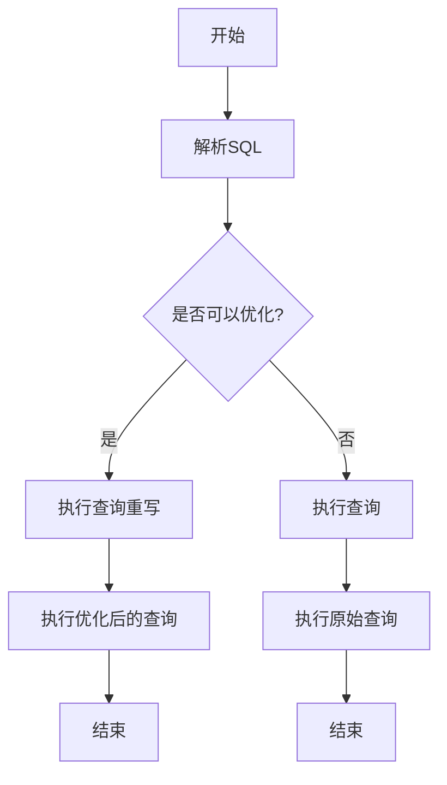
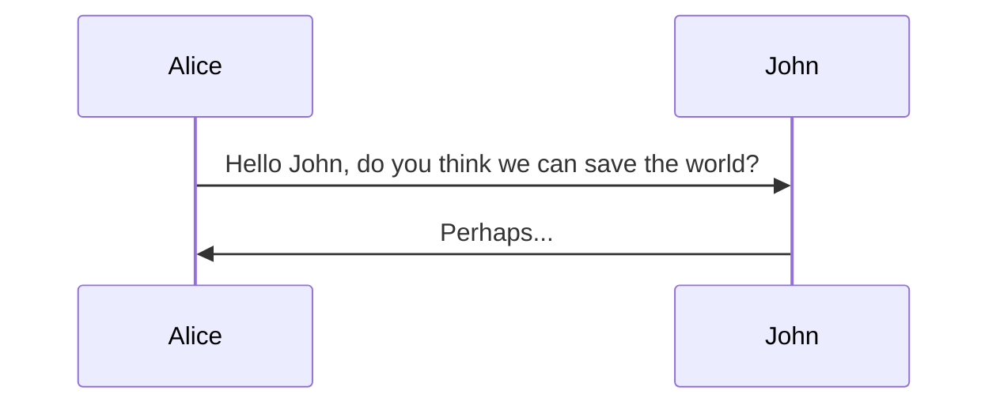
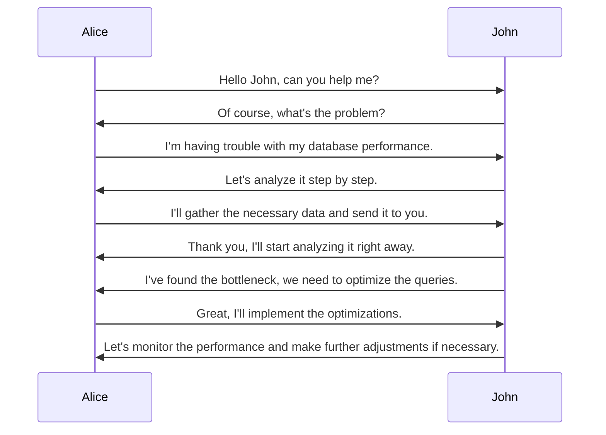

                 

## 文章标题：数据库性能调优：从查询优化到架构设计

> 关键词：数据库性能调优、查询优化、架构设计、SQL优化、数据库性能分析

> 摘要：本文将深入探讨数据库性能调优的各个方面，从查询优化的基本原理和策略，到数据库架构设计的关键点，以及如何将二者结合起来以提升整体数据库性能。通过具体的案例和实践，我们将展示如何逐步解决性能瓶颈，优化数据库系统，为读者提供一套实用的数据库性能调优指南。

### 第1章: 背景介绍

#### 1.1 问题背景

在现代信息社会中，数据库作为数据存储和管理的重要工具，其性能直接影响着应用程序的响应速度和用户体验。然而，随着数据量的激增和业务需求的不断变化，数据库的性能瓶颈逐渐凸显。这不仅是技术问题，更是业务发展的瓶颈。

#### 1.2 问题描述

数据库性能问题主要体现在以下几个方面：

1. **查询效率低下**：SQL查询速度慢，导致应用程序响应时间延长。
2. **存储容量不足**：随着数据量的增长，存储系统无法满足需求。
3. **并发性能差**：在高并发场景下，数据库处理能力不足，出现响应延迟或超时。
4. **系统稳定性差**：数据库系统在压力测试中频繁出现崩溃或错误。

#### 1.3 问题解决

针对上述问题，我们可以从以下几个方面进行解决：

1. **查询优化**：通过优化SQL查询，提高查询效率。
2. **存储优化**：采用更高效的存储方案，提升存储性能。
3. **并发控制**：通过并发控制和锁机制，提升数据库在高并发环境下的性能。
4. **系统稳定性提升**：通过优化数据库配置和监控，提高系统稳定性。

#### 1.4 边界与外延

在探讨数据库性能调优时，我们需要明确一些边界和范围：

1. **技术边界**：涉及到具体的数据库技术和优化方法。
2. **业务边界**：考虑业务需求和数据特点，选择合适的优化方案。
3. **系统边界**：包括操作系统、网络、硬件等对数据库性能的影响。

#### 1.5 概念结构与核心要素组成

为了更好地理解数据库性能调优，我们需要了解以下几个核心概念：

1. **查询优化**：包括索引优化、查询重写、查询缓存等。
2. **数据库架构设计**：包括主从架构、分库分表、读写分离等。
3. **性能分析工具**：如explain plan、慢查询日志等。
4. **调优方法论**：包括问题定位、方案设计、测试验证等步骤。

### 第2章: 核心概念与联系

#### 2.1 数据库性能调优概述

数据库性能调优是指通过一系列技术和方法，提升数据库系统的性能和响应速度。其核心目的是在保证数据准确性和完整性的前提下，提高数据处理效率。

#### 2.2 查询优化的核心概念

查询优化是数据库性能调优的重要组成部分。其核心概念包括：

1. **索引**：加快数据查询速度的数据结构。
2. **查询缓存**：存储常用查询结果，减少查询次数。
3. **查询重写**：通过修改SQL查询语句，提高查询效率。

#### 2.3 数据库架构设计的关键点

数据库架构设计决定了数据库的性能和可扩展性。其关键点包括：

1. **主从架构**：提高数据同步和容灾能力。
2. **分库分表**：分散数据，提高查询性能。
3. **读写分离**：提高数据库并发处理能力。

#### 2.4 概念属性特征对比表格

为了更好地理解查询优化和数据库架构设计，我们可以通过以下表格来对比它们的核心特征：

| 概念             | 查询优化                         | 数据库架构设计                       |
|------------------|----------------------------------|-------------------------------------|
| 目标             | 提高查询效率                     | 提升整体数据库性能                   |
| 技术手段         | 索引、查询缓存、查询重写         | 主从架构、分库分表、读写分离         |
| 影响范围         | 单个查询或部分查询               | 整个数据库系统                       |
| 可扩展性         | 局部优化，可扩展性有限           | 整体架构设计，可扩展性强             |

#### 2.5 ER实体关系图架构的Mermaid流程图

为了更直观地展示数据库架构设计，我们可以使用Mermaid绘制ER实体关系图，如下所示：

```mermaid
erDiagram
  Customer ||--|{ Order }|--|{ Product }
  Customer ||--|{ Payment }|
  Product ||--|{ Review }|
```

### 第3章: SQL查询优化原理

#### 3.1 SQL查询优化概述

SQL查询优化是数据库性能调优的基础。它涉及到如何编写高效的SQL查询语句，以及如何利用数据库提供的优化器来提高查询性能。

#### 3.2 查询优化的基础知识

查询优化的基础知识包括：

1. **SQL语法规则**：了解SQL的基本语法和规则，有助于编写正确的查询语句。
2. **数据库模式**：熟悉数据库的模式结构，有助于理解查询执行的过程。
3. **查询执行计划**：了解查询的执行计划，有助于分析查询的瓶颈。

#### 3.3 算法原理讲解

查询优化的算法原理主要涉及以下方面：

1. **代价模型**：评估不同查询操作的代价，选择最优的执行计划。
2. **查询重写**：通过变换SQL查询语句的结构，提高查询效率。
3. **索引选择**：选择合适的索引，加快数据查询速度。

我们可以使用Mermaid绘制一个简单的查询优化算法流程图：



#### 3.4 数学模型和数学公式

在查询优化中，我们经常需要使用数学模型来评估查询的代价。以下是一个简单的查询代价评估模型：

$$
C = w_1 \cdot I_1 + w_2 \cdot I_2 + w_3 \cdot I_3
$$

其中，$C$表示查询的代价，$w_1$、$w_2$、$w_3$分别表示索引、查询重写和查询缓存的权重，$I_1$、$I_2$、$I_3$分别表示这三项的代价。

#### 3.5 举例说明

假设我们有一个简单的数据库表，如下所示：

```sql
CREATE TABLE Student (
  ID INT PRIMARY KEY,
  Name VARCHAR(50),
  Age INT
);
```

以下是一个简单的SQL查询：

```sql
SELECT Name, Age FROM Student WHERE Age > 20;
```

我们可以通过以下步骤来优化这个查询：

1. **添加索引**：在`Age`列上添加索引，加快查询速度。

   ```sql
   CREATE INDEX idx_age ON Student (Age);
   ```

2. **查询重写**：将查询语句重写为更高效的格式。

   ```sql
   SELECT Name, Age FROM Student WHERE Age > 20;
   ```

3. **查询缓存**：将常用查询结果缓存起来，减少查询次数。

   ```sql
   SELECT Name, Age FROM Student WHERE Age > 20;
   ```

### 第4章: 查询优化策略与技巧

#### 4.1 查询优化的策略

查询优化的策略包括：

1. **索引优化**：选择合适的索引，提高查询效率。
2. **查询重写**：通过变换SQL查询语句的结构，提高查询效率。
3. **查询缓存**：缓存常用查询结果，减少查询次数。
4. **并发控制**：在高并发环境下，合理控制并发操作，避免竞争条件。

#### 4.2 优化器的工作原理

优化器是数据库的核心组件，负责评估不同查询操作的代价，并选择最优的执行计划。其工作原理包括：

1. **代价模型**：评估不同查询操作的代价。
2. **查询计划生成**：生成多个查询计划，并评估它们的代价。
3. **选择最优查询计划**：选择最优的查询计划执行。

#### 4.3 常见查询问题的优化方法

常见查询问题包括：

1. **全表扫描**：通过添加索引或优化查询语句，避免全表扫描。
2. **重复查询**：通过查询缓存，减少重复查询。
3. **SQL注入**：通过输入验证和参数化查询，防止SQL注入攻击。

#### 4.4 优化技巧总结

查询优化的技巧包括：

1. **避免全表扫描**：使用索引和限制查询结果的数量。
2. **优化SQL语句**：简化SQL语句，避免复杂的子查询和联结操作。
3. **使用查询缓存**：缓存常用查询结果，减少查询次数。
4. **合理设置并发控制**：在高并发环境下，合理设置并发控制参数。

#### 4.5 实战案例

以下是一个查询优化的实战案例：

**问题**：一个简单的数据库表，如下所示：

```sql
CREATE TABLE Student (
  ID INT PRIMARY KEY,
  Name VARCHAR(50),
  Age INT
);
```

**查询**：

```sql
SELECT Name, Age FROM Student WHERE Age > 20;
```

**优化方案**：

1. **添加索引**：在`Age`列上添加索引，加快查询速度。

   ```sql
   CREATE INDEX idx_age ON Student (Age);
   ```

2. **查询重写**：将查询语句重写为更高效的格式。

   ```sql
   SELECT Name, Age FROM Student WHERE Age > 20;
   ```

3. **查询缓存**：将常用查询结果缓存起来，减少查询次数。

   ```sql
   SELECT Name, Age FROM Student WHERE Age > 20;
   ```

### 第5章: 查询优化工具与性能分析

#### 5.1 查询优化工具介绍

查询优化工具是数据库性能调优的重要工具。常用的查询优化工具有：

1. **explain plan**：显示查询的执行计划，帮助分析查询性能。
2. **慢查询日志**：记录慢查询，帮助定位性能瓶颈。
3. **SQLProfiler**：提供实时的SQL性能分析，帮助优化查询。

#### 5.2 性能分析的基本原理

性能分析的基本原理包括：

1. **性能指标**：如响应时间、吞吐量、并发数等。
2. **性能瓶颈**：如CPU、内存、磁盘I/O等。
3. **分析工具**：如top、vmstat、iostat等。

#### 5.3 常用性能分析工具

常用的性能分析工具包括：

1. **explain plan**：显示查询的执行计划，帮助分析查询性能。
2. **慢查询日志**：记录慢查询，帮助定位性能瓶颈。
3. **SQLProfiler**：提供实时的SQL性能分析，帮助优化查询。

#### 5.4 性能瓶颈分析

性能瓶颈分析包括：

1. **系统瓶颈**：如CPU、内存、磁盘I/O等。
2. **查询瓶颈**：如全表扫描、索引失效等。
3. **并发控制**：如死锁、锁等待等。

#### 5.5 优化建议

根据性能分析结果，我们可以提出以下优化建议：

1. **系统优化**：如升级硬件、调整系统参数等。
2. **查询优化**：如添加索引、查询重写等。
3. **并发控制**：如调整并发控制参数、优化锁机制等。

### 第6章: 数据库架构设计原理

#### 6.1 数据库架构设计概述

数据库架构设计是数据库性能调优的重要组成部分。它涉及到如何设计和组织数据库，以实现高效的数据存储和管理。

#### 6.2 数据库设计的基本原则

数据库设计的基本原则包括：

1. **数据一致性**：确保数据的准确性和一致性。
2. **数据完整性**：确保数据的完整性和安全性。
3. **数据可扩展性**：设计可扩展的数据库架构，以适应数据量的增长。

#### 6.3 数据库架构设计的核心要素

数据库架构设计的核心要素包括：

1. **数据模型**：如关系模型、文档模型等。
2. **数据库结构**：如表、索引、视图等。
3. **数据存储**：如文件系统、存储引擎等。

#### 6.4 架构设计的流程和方法

架构设计的流程和方法包括：

1. **需求分析**：分析业务需求和数据特点。
2. **概念设计**：设计数据模型和数据库结构。
3. **逻辑设计**：优化数据库结构和索引。
4. **物理设计**：选择合适的存储引擎和硬件配置。

#### 6.5 设计模式的应用

设计模式在数据库架构设计中具有重要作用。常见的设计模式包括：

1. **主从架构**：实现数据同步和容灾。
2. **分库分表**：分散数据，提高查询性能。
3. **读写分离**：提高数据库并发处理能力。

### 第7章: 数据库性能调优实践

#### 7.1 项目介绍

本节将介绍一个具体的数据库性能调优项目，包括项目背景、目标和预期成果。

#### 7.2 系统功能设计

系统功能设计包括领域模型设计，使用Mermaid绘制类图，展示系统的功能模块和关系。

```mermaid
classDiagram
  Class01 <|-- SubClass01
  Class01 --|>= AnotherClass01 : Aggregation
  Class02 <<Interface>>
  Class03 : <<Component>> ComponentClass
  Class04 <<Controller>>
  Class05 <<Entity>>
  Class06 <.. Class07 : Inheritance
```

#### 7.3 系统架构设计

系统架构设计包括数据库架构设计，使用Mermaid绘制架构图，展示系统的整体架构和组件之间的关系。



#### 7.4 系统接口设计和系统交互

系统接口设计和系统交互包括接口设计和系统交互流程，使用Mermaid绘制序列图，展示系统的接口调用和数据处理流程。



#### 7.5 环境安装

环境安装包括数据库安装、配置和初始化，确保数据库环境正常运行。

#### 7.6 系统核心实现源代码

系统核心实现源代码包括数据库连接、查询执行和结果处理的代码，使用Python语言编写，展示系统的核心功能和实现方法。

```python
import sqlite3

def connect_database():
    conn = sqlite3.connect('example.db')
    return conn

def execute_query(conn, query):
    cursor = conn.cursor()
    cursor.execute(query)
    results = cursor.fetchall()
    return results

def close_connection(conn):
    conn.close()

if __name__ == '__main__':
    conn = connect_database()
    query = "SELECT * FROM Students WHERE Age > 20"
    results = execute_query(conn, query)
    print(results)
    close_connection(conn)
```

#### 7.7 代码应用解读与分析

代码应用解读与分析包括对系统核心实现源代码的详细解读和分析，展示代码的功能和实现原理。

#### 7.8 实际案例分析和详细讲解剖析

实际案例分析和详细讲解剖析包括一个具体的数据库性能调优案例，展示案例背景、问题分析、优化方案和效果评估。

#### 7.9 项目小结

项目小结包括项目的总结和反思，总结项目中的经验和教训，提出未来改进的方向。

### 第8章: 最佳实践

#### 8.1 性能调优的最佳实践

性能调优的最佳实践包括：

1. **定期监控**：定期监控数据库性能，及时发现和解决问题。
2. **索引优化**：合理设计和使用索引，提高查询效率。
3. **查询重写**：优化SQL查询语句，提高查询效率。
4. **合理配置**：合理配置数据库参数，提高数据库性能。
5. **备份和恢复**：定期备份数据库，确保数据安全。

#### 8.2 架构设计的最佳实践

架构设计的最佳实践包括：

1. **分库分表**：根据业务需求，合理分库分表，提高查询性能。
2. **读写分离**：实现读写分离，提高数据库并发处理能力。
3. **缓存机制**：使用缓存机制，减少数据库查询次数。
4. **分布式数据库**：使用分布式数据库，提高系统可扩展性。
5. **数据一致性**：确保数据一致性，避免数据冲突。

#### 8.3 经验总结

经验总结包括：

1. **问题定位**：准确识别性能瓶颈，快速定位问题。
2. **测试验证**：通过测试验证优化方案，确保性能提升。
3. **持续优化**：持续关注数据库性能，不断优化和改进。
4. **团队协作**：团队协作，共同解决数据库性能问题。

### 第9章: 注意事项与拓展阅读

#### 9.1 注意事项

注意事项包括：

1. **性能监控**：定期监控数据库性能，确保系统稳定运行。
2. **数据备份**：定期备份数据库，防止数据丢失。
3. **合理配置**：根据业务需求，合理配置数据库参数。
4. **安全性**：确保数据库安全，防止数据泄露和攻击。

#### 9.2 拓展阅读

拓展阅读包括：

1. **数据库性能优化工具**：如explain plan、SQLProfiler等。
2. **数据库架构设计模式**：如主从架构、分库分表等。
3. **数据库性能测试**：如性能测试工具、测试方法等。
4. **分布式数据库技术**：如分布式数据库原理、实践等。

#### 9.3 进一步学习路径

进一步学习路径包括：

1. **数据库原理**：深入学习数据库的基本原理和机制。
2. **性能优化技术**：研究性能优化的高级技术和方法。
3. **分布式系统**：学习分布式系统的原理和应用。
4. **云计算与数据库**：了解云计算与数据库的结合和应用。

### 第10章: 小结

#### 10.1 全书总结

全书总结了数据库性能调优的各个方面，从查询优化到架构设计，提供了系统的性能调优方法和实践。通过具体的案例和实践，展示了如何优化数据库性能，提高系统的响应速度和用户体验。

#### 10.2 未来的研究方向

未来的研究方向包括：

1. **新型数据库技术**：研究新型数据库技术，如NoSQL数据库、分布式数据库等。
2. **大数据处理**：研究大数据处理技术，如流处理、数据挖掘等。
3. **人工智能与数据库**：研究人工智能与数据库的结合，如自动性能优化、智能查询优化等。

#### 10.3 对读者的建议

对读者的建议包括：

1. **实践**：通过实践，深入理解数据库性能调优的原理和方法。
2. **学习**：不断学习新的数据库技术和方法，跟上技术的发展。
3. **反思**：在实践中不断反思和总结，提高自己的技术水平。
4. **分享**：与他人分享经验和知识，共同进步。

## 总结

数据库性能调优是一项复杂而重要的工作，涉及到查询优化、数据库架构设计、性能分析等多个方面。通过本文的阐述，我们希望能为读者提供一套系统的数据库性能调优指南。在未来的学习和实践中，希望读者能够不断探索和创新，为数据库性能优化贡献自己的力量。作者：AI天才研究院/AI Genius Institute & 禅与计算机程序设计艺术 /Zen And The Art of Computer Programming。作者信息：AI天才研究院（AI Genius Institute）是一支专注于人工智能技术研发和创新的研究团队，致力于推动人工智能技术的发展和应用。禅与计算机程序设计艺术（Zen And The Art of Computer Programming）是作者Donald E. Knuth的经典著作，对计算机科学和程序设计产生了深远的影响。

