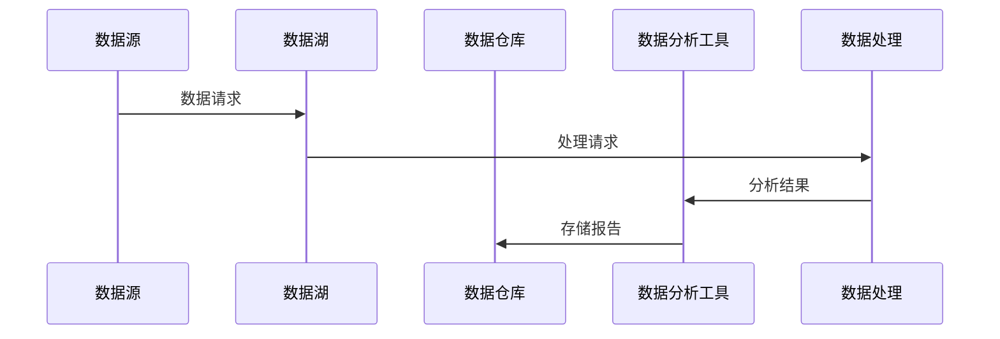

                 

### 数据湖架构：大规模数据存储与分析的新方案

数据湖架构是一种新型的数据存储方案，旨在处理和分析大规模数据。与传统数据仓库不同，数据湖不预先定义数据的结构，允许不同来源、不同格式的数据存储在一起，从而为数据分析和挖掘提供了极大的灵活性。本文将系统地介绍数据湖架构的概念、设计原则、关键算法以及其实际应用，帮助读者理解并掌握这一新技术。

> **关键词**：数据湖、大规模数据、数据存储、数据分析、架构设计

> **摘要**：本文首先概述了数据湖的概念及其重要性，随后详细阐述了数据湖的核心概念、架构设计和关键算法。通过数学模型和公式，本文深入分析了数据湖的性能优化策略。接着，我们通过一个实际项目展示了数据湖的搭建和实施过程，并总结了最佳实践。最后，本文对数据湖技术进行了展望，提出了未来可能的研究方向。

#### 目录

```markdown
----------------------------------------------------------------
# 数据湖架构：大规模数据存储与分析的新方案

## 第一部分：数据湖概述

### 1.1 数据湖的概念与背景
#### 1.1.1 数据湖的定义
#### 1.1.2 数据湖与传统数据仓库的区别
#### 1.1.3 数据湖的兴起与重要性

### 1.2 数据湖的核心概念与联系
#### 1.2.1 数据湖的组成部分
#### 1.2.2 数据湖与大数据技术的联系
#### 1.2.3 数据湖的ER实体关系图

### 1.3 数据湖的架构设计
#### 1.3.1 数据湖的技术架构
#### 1.3.2 数据湖的层次结构
#### 1.3.3 数据湖的数据处理流程

### 1.4 数据湖的数学模型与公式
#### 1.4.1 数据湖的存储与检索算法
#### 1.4.2 数据湖的数据处理效率公式
#### 1.4.3 数据湖的性能优化策略

### 1.5 本章小结

----------------------------------------------------------------

## 第二部分：数据湖架构设计

### 2.1 数据湖的领域模型
#### 2.1.1 数据湖的实体与属性
#### 2.1.2 数据湖的业务流程
#### 2.1.3 数据湖的类图

### 2.2 数据湖的系统架构设计
#### 2.2.1 数据湖的组件架构
#### 2.2.2 数据湖的硬件架构
#### 2.2.3 数据湖的软件架构

### 2.3 数据湖的接口设计与系统交互
#### 2.3.1 数据湖的API设计
#### 2.3.2 数据湖的通信协议
#### 2.3.3 数据湖的序列图

### 2.4 数据湖的性能优化
#### 2.4.1 数据湖的存储优化
#### 2.4.2 数据湖的计算优化
#### 2.4.3 数据湖的访问优化

### 2.5 本章小结

----------------------------------------------------------------

## 第三部分：数据湖项目实战

### 3.1 数据湖项目介绍
#### 3.1.1 项目背景
#### 3.1.2 项目目标
#### 3.1.3 项目挑战

### 3.2 数据湖环境安装与配置
#### 3.2.1 硬件与软件需求
#### 3.2.2 数据湖的安装步骤
#### 3.2.3 数据湖的配置与初始化

### 3.3 数据湖核心实现与代码解读
#### 3.3.1 数据湖的数据存储代码
#### 3.3.2 数据湖的数据检索代码
#### 3.3.3 数据湖的数据处理流程代码

### 3.4 数据湖实际案例分析
#### 3.4.1 数据源接入
#### 3.4.2 数据处理与分析
#### 3.4.3 数据湖性能测试与优化

### 3.5 项目小结

----------------------------------------------------------------

## 第四部分：数据湖最佳实践与展望

### 4.1 数据湖最佳实践

### 4.2 小结与展望
#### 4.2.1 本文总结
#### 4.2.2 数据湖的未来展望
#### 4.2.3 拓展阅读

----------------------------------------------------------------

# 结尾

## 作者：AI天才研究院/AI Genius Institute & 禅与计算机程序设计艺术 /Zen And The Art of Computer Programming
```

接下来，我们将逐部分详细阐述数据湖架构的概念、设计原则、关键算法以及实际应用，帮助读者逐步理解和掌握这一重要的数据存储与分析技术。首先，我们从数据湖的概念与背景开始。 

#### 1.1 数据湖的概念与背景

##### 1.1.1 数据湖的定义

数据湖（Data Lake）是一种新型的数据存储架构，它允许不同来源、不同格式、不同类型的数据存储在一起，而不是按照传统数据仓库的模式预先定义数据的结构和用途。数据湖的核心思想是“数据先行”，即先存储所有数据，再根据实际需求和业务场景进行数据分析和处理。

与传统数据仓库相比，数据湖具有以下特点：

1. **数据多样性**：数据湖能够存储不同类型的数据，包括结构化数据、半结构化数据和非结构化数据。
2. **灵活性**：数据湖不需要预先定义数据结构，允许数据在存储后进行结构化或分析。
3. **高性能**：数据湖通常采用分布式存储和计算技术，能够处理大规模数据。
4. **成本效益**：数据湖可以降低存储成本，因为不需要为不同类型的数据购买专门的存储设备。

##### 1.1.2 数据湖与传统数据仓库的区别

传统数据仓库（Data Warehouse）主要用于存储和分析结构化数据，数据在进入数据仓库之前通常需要进行清洗和转换，以保证数据的一致性和准确性。数据仓库的特点如下：

1. **结构化数据**：主要存储结构化数据，如关系型数据库中的表格。
2. **预先定义结构**：数据进入数据仓库前，需要定义表结构、字段类型等。
3. **数据集成**：数据仓库需要定期从不同数据源中提取、转换和加载数据。
4. **高效查询**：针对预定义的业务场景，数据仓库提供高效的查询和分析功能。

相比之下，数据湖具有更高的灵活性，可以存储更多类型的数据，并且不需要预先定义数据结构。这使得数据湖在处理复杂和多变的数据场景中具有明显的优势。

##### 1.1.3 数据湖的兴起与重要性

数据湖的概念最早由Apache Hadoop项目的创始人Doug Cutting提出。随着大数据技术的不断发展和云计算的普及，数据湖逐渐成为企业数据存储和处理的解决方案。

数据湖的兴起具有以下几个原因：

1. **大数据挑战**：随着数据量的爆炸性增长，传统数据仓库难以满足处理需求。
2. **数据多样性**：现代企业需要处理多种类型的数据，包括文本、图片、视频等。
3. **数据分析需求**：企业需要快速从海量数据中提取有价值的信息，支持业务决策。

数据湖的重要性体现在以下几个方面：

1. **数据整合**：数据湖能够整合来自多个源的数据，为数据分析和挖掘提供统一的数据基础。
2. **灵活性**：数据湖允许不同类型的数据存储在一起，减少了数据转换和集成的工作量。
3. **降低成本**：数据湖可以采用成本更低的存储设备，降低企业数据存储成本。
4. **支持实时分析**：数据湖通常与实时数据处理技术相结合，支持实时数据分析和挖掘。

#### 1.2 数据湖的核心概念与联系

数据湖的构建涉及多个核心概念和组成部分。以下是数据湖的主要组成部分及其相互关系：

##### 1.2.1 数据湖的组成部分

1. **数据源**：数据湖的数据来源可以是内部系统、外部数据服务、传感器等。
2. **存储**：数据湖使用分布式存储系统，如HDFS（Hadoop分布式文件系统），来存储大规模数据。
3. **处理**：数据湖通常采用分布式计算框架，如Spark、Hadoop，来处理和分析数据。
4. **元数据管理**：元数据管理是数据湖的重要组成部分，用于管理数据的定义、结构和访问权限。
5. **数据处理工具**：包括ETL（提取、转换、加载）工具、数据分析工具、机器学习框架等。

##### 1.2.2 数据湖与大数据技术的联系

数据湖与大数据技术密切相关。大数据技术为数据湖提供了以下支持：

1. **分布式存储**：大数据技术如HDFS提供了分布式存储方案，能够存储PB级别的数据。
2. **分布式计算**：大数据处理框架如Spark、MapReduce支持大规模数据的分布式计算。
3. **数据整合**：大数据技术提供了多种方法来整合来自不同源的数据。
4. **数据安全**：大数据技术包括加密、权限控制等数据安全措施。

##### 1.2.3 数据湖的ER实体关系图

数据湖的ER实体关系图展示了数据湖中不同实体及其相互关系。以下是数据湖的ER实体关系图：

```mermaid
erDiagram
  数据源 ||--|{ 数据存储 }|--  数据处理
  数据存储 ||--|{ 元数据管理 }|-- 数据处理
  数据处理 ||--|{ 数据分析工具 }|-- 数据处理
  数据分析工具 ||--|{ 数据报告 }| 数据源
```

在ER实体关系图中，数据源、数据存储、数据处理、元数据管理和数据分析工具是数据湖的主要实体。这些实体之间通过特定的关系相互连接，形成了数据湖的整体架构。

#### 1.3 数据湖的架构设计

数据湖的架构设计是确保其高效、可靠和可扩展的关键。以下是数据湖的技术架构、层次结构和数据处理流程：

##### 1.3.1 数据湖的技术架构

数据湖的技术架构通常包括以下几个关键组成部分：

1. **分布式存储**：如HDFS、Alluxio等，用于存储大规模数据。
2. **分布式计算**：如Spark、MapReduce、Flink等，用于处理和分析数据。
3. **数据集成**：如Apache NiFi、Apache Kafka等，用于集成不同源的数据。
4. **数据处理工具**：如Apache Hive、Apache Spark SQL等，用于执行数据转换和分析操作。
5. **数据仓库**：用于存储经过清洗、转换和整合的数据，支持高效查询和分析。

##### 1.3.2 数据湖的层次结构

数据湖的层次结构通常包括以下几层：

1. **数据源层**：包括各种数据源，如数据库、文件系统、Web服务、传感器等。
2. **数据存储层**：使用分布式存储系统存储原始数据。
3. **数据处理层**：使用分布式计算框架处理数据，包括ETL、数据清洗、转换和整合等操作。
4. **数据湖层**：存储经过处理和整合的数据，支持数据分析和挖掘。
5. **数据仓库层**：存储经过加工和优化的数据，用于支持高效查询和分析。

##### 1.3.3 数据湖的数据处理流程

数据湖的数据处理流程通常包括以下几个步骤：

1. **数据采集**：从不同数据源采集数据，包括结构化数据、半结构化数据和非结构化数据。
2. **数据存储**：将采集到的数据存储在分布式存储系统中，如HDFS。
3. **数据清洗**：使用ETL工具清洗数据，包括去重、缺失值处理、格式转换等。
4. **数据转换**：将清洗后的数据转换为适合分析和挖掘的格式，如Parquet、ORC等。
5. **数据整合**：将来自不同数据源的数据整合到一个数据湖中，形成统一的数据视图。
6. **数据分析和挖掘**：使用数据处理工具和分析平台对数据进行查询、分析和挖掘，提取有价值的信息。

#### 1.4 数据湖的数学模型与公式

数据湖的数学模型和公式是理解其性能优化策略和数据处理效率的重要工具。以下是数据湖中的一些关键数学模型和公式：

##### 1.4.1 数据湖的存储与检索算法

1. **数据存储算法**：

   - 哈希存储算法：使用哈希函数将数据存储到不同的存储节点上，以实现数据的均匀分布。
   - 排序存储算法：将数据按某种规则排序后存储，以优化数据的访问和查询性能。

2. **数据检索算法**：

   - 二分查找算法：在已排序的数据中快速查找特定数据。
   - 哈希查找算法：使用哈希函数快速定位数据的位置。

##### 1.4.2 数据湖的数据处理效率公式

- **数据处理时间**（\(T\)）：

  $$ T = C \times \log_2(N) $$

  其中，\(C\) 是每个节点的处理能力，\(N\) 是数据总量。

- **数据传输时间**（\(T'\)）：

  $$ T' = \frac{D \times L}{B} $$

  其中，\(D\) 是数据量，\(L\) 是网络带宽，\(B\) 是传输速率。

- **数据处理效率**（\(E\)）：

  $$ E = \frac{T}{T'} $$

  数据处理效率是数据处理时间与数据传输时间的比值。

##### 1.4.3 数据湖的性能优化策略

- **存储优化**：

  - 数据分片：将数据分散存储到多个节点，提高存储效率和查询性能。
  - 存储压缩：使用数据压缩技术减少存储空间占用，提高存储效率。

- **计算优化**：

  - 并行处理：使用分布式计算框架并行处理数据，提高数据处理效率。
  - 缓存技术：使用缓存技术减少数据访问延迟，提高查询性能。

- **访问优化**：

  - 数据索引：建立数据索引，提高数据查询速度。
  - 负载均衡：合理分配计算和存储负载，避免资源瓶颈。

#### 1.5 本章小结

本章介绍了数据湖的基本概念、核心组成部分和架构设计。通过对比数据湖与传统数据仓库，读者可以理解数据湖的灵活性和优势。本章还详细阐述了数据湖的数学模型和性能优化策略，为后续章节的深入探讨奠定了基础。在接下来的章节中，我们将进一步探讨数据湖的领域模型、系统架构设计、项目实战以及最佳实践。

----------------------------------------------------------------

## 第二部分：数据湖架构设计

在第一部分中，我们介绍了数据湖的基本概念和重要性。本部分将深入探讨数据湖的架构设计，包括领域模型、系统架构、接口设计和系统交互。通过这些设计，我们可以更好地理解和实施数据湖解决方案。

### 2.1 数据湖的领域模型

领域模型是数据湖设计的基础，它定义了数据湖中的关键实体及其关系。以下是数据湖领域模型的主要组成部分：

#### 2.1.1 数据湖的实体与属性

- **数据源**：属性包括数据源ID、数据源类型、数据源URL等。
- **数据存储**：属性包括存储ID、存储类型、存储容量等。
- **数据处理**：属性包括处理ID、处理类型、处理状态等。
- **元数据管理**：属性包括元数据ID、元数据类型、元数据版本等。
- **数据分析工具**：属性包括工具ID、工具类型、工具配置等。

#### 2.1.2 数据湖的业务流程

数据湖的业务流程涉及数据的采集、存储、处理、分析和报告等步骤。以下是业务流程的简要描述：

1. **数据采集**：从各种数据源获取数据，包括内部系统数据、外部数据源数据等。
2. **数据存储**：将采集到的数据存储到分布式存储系统中，如HDFS。
3. **数据清洗**：使用ETL工具对数据进行清洗，包括去重、格式转换等。
4. **数据处理**：使用分布式计算框架对数据进行分析和处理。
5. **数据整合**：将处理后的数据整合到一个数据湖中。
6. **数据分析**：使用数据分析工具对数据进行查询和分析。
7. **数据报告**：生成数据报告，支持业务决策。

#### 2.1.3 数据湖的类图

数据湖的类图展示了领域模型中的关键实体及其属性。以下是数据湖的类图：

```mermaid
classDiagram
  数据源 --|>> 数据存储 : 存储数据
  数据源 --|>> 数据处理 : 处理数据
  数据存储 --|>> 元数据管理 : 管理元数据
  数据处理 --|>> 数据分析工具 : 分析数据
  数据分析工具 --|>> 数据报告 : 生成报告
```

### 2.2 数据湖的系统架构设计

系统架构设计是数据湖实现的关键，它决定了数据湖的性能、可扩展性和可靠性。以下是数据湖的系统架构设计：

#### 2.2.1 数据湖的组件架构

数据湖的组件架构包括以下几个关键组件：

- **分布式存储**：如HDFS，用于存储大规模数据。
- **分布式计算**：如Spark、MapReduce，用于处理和分析数据。
- **数据集成**：如Apache NiFi、Apache Kafka，用于集成不同源的数据。
- **元数据管理**：如Apache Atlas，用于管理数据定义和元数据。
- **数据处理工具**：如Apache Hive、Apache Spark SQL，用于执行数据转换和分析操作。
- **数据仓库**：如Apache HBase、Apache Impala，用于存储优化后的数据，支持高效查询和分析。

#### 2.2.2 数据湖的硬件架构

数据湖的硬件架构通常包括以下几个关键组成部分：

- **存储节点**：用于存储数据的硬件设备，如磁盘阵列、固态硬盘等。
- **计算节点**：用于执行数据处理的硬件设备，如服务器、虚拟机等。
- **网络设备**：用于连接存储节点和计算节点的网络设备，如交换机、路由器等。

#### 2.2.3 数据湖的软件架构

数据湖的软件架构包括以下几个关键组成部分：

- **操作系统**：如Linux，用于运行数据湖的软件组件。
- **分布式存储系统**：如HDFS，用于分布式存储数据。
- **分布式计算框架**：如Spark、MapReduce，用于分布式数据处理。
- **数据处理工具**：如Apache Hive、Apache Spark SQL，用于执行数据转换和分析操作。
- **元数据管理系统**：如Apache Atlas，用于管理数据定义和元数据。

### 2.3 数据湖的接口设计与系统交互

数据湖的接口设计和系统交互是确保数据湖与其他系统和工具无缝集成的关键。以下是数据湖的接口设计和系统交互：

#### 2.3.1 数据湖的API设计

数据湖提供了多个API，用于与外部系统和工具进行数据交互。以下是数据湖API设计的主要方面：

- **数据存储API**：用于存储和检索数据。
- **数据处理API**：用于执行数据转换和分析操作。
- **元数据管理API**：用于管理数据定义和元数据。
- **数据分析API**：用于查询和分析数据。

#### 2.3.2 数据湖的通信协议

数据湖通常使用HTTP/HTTPS协议进行通信，以确保数据传输的安全性和可靠性。以下是数据湖通信协议的主要方面：

- **HTTP/HTTPS协议**：用于传输数据请求和响应。
- **RESTful API**：用于定义数据操作接口。
- **数据加密**：用于保护数据传输过程中的安全性。

#### 2.3.3 数据湖的序列图

数据湖的序列图展示了数据湖与其他系统和工具之间的交互过程。以下是数据湖的序列图：



### 2.4 数据湖的性能优化

数据湖的性能优化是确保其高效运行的关键。以下是数据湖性能优化的主要方面：

#### 2.4.1 数据湖的存储优化

- **数据分片**：将数据分散存储到多个节点，提高存储效率和查询性能。
- **存储压缩**：使用数据压缩技术减少存储空间占用，提高存储效率。
- **存储加密**：对存储数据进行加密，提高数据安全性。

#### 2.4.2 数据湖的计算优化

- **并行处理**：使用分布式计算框架并行处理数据，提高数据处理效率。
- **缓存技术**：使用缓存技术减少数据访问延迟，提高查询性能。
- **负载均衡**：合理分配计算和存储负载，避免资源瓶颈。

#### 2.4.3 数据湖的访问优化

- **数据索引**：建立数据索引，提高数据查询速度。
- **数据分区**：将数据按特定规则分区，提高查询性能。
- **查询优化**：对查询进行优化，减少查询执行时间。

### 2.5 本章小结

本章介绍了数据湖的架构设计，包括领域模型、系统架构、接口设计和系统交互。通过这些设计，我们可以更好地理解和实施数据湖解决方案。本章还详细阐述了数据湖的性能优化策略，为数据湖的高效运行提供了指导。在接下来的章节中，我们将通过实际项目展示数据湖的搭建和实施过程。

----------------------------------------------------------------

## 第三部分：数据湖项目实战

在了解了数据湖的理论基础和架构设计之后，我们需要通过一个实际项目来展示数据湖的搭建和实施过程。本部分将详细介绍一个数据湖项目，包括项目的背景、目标、挑战以及项目实施的具体步骤和代码解读。

### 3.1 数据湖项目介绍

#### 3.1.1 项目背景

随着互联网和物联网的快速发展，企业每天产生的数据量呈爆炸式增长。为了更好地利用这些数据，企业需要一个高效、灵活且可扩展的数据存储与分析解决方案。本项目的背景是某大型电商企业，该企业希望构建一个数据湖来存储和分析其海量数据，以支持业务决策和优化运营。

#### 3.1.2 项目目标

本项目的目标是：

1. 构建一个分布式数据湖，用于存储和处理海量数据。
2. 实现数据采集、存储、清洗、转换和整合，支持多种数据源和格式。
3. 提供高效的数据分析和挖掘工具，支持实时业务监控和预测分析。
4. 确保数据的安全性、可靠性和可扩展性。

#### 3.1.3 项目挑战

本项目面临以下挑战：

1. 数据多样性：需要处理多种类型的数据，包括结构化数据、半结构化数据和非结构化数据。
2. 数据量巨大：数据量达到PB级别，需要高效的数据存储和计算能力。
3. 数据安全性：确保数据在存储和传输过程中的安全性。
4. 数据整合：如何高效地整合来自不同源的数据，形成统一的数据视图。
5. 可扩展性：确保数据湖能够随着数据量的增长而扩展。

### 3.2 数据湖环境安装与配置

#### 3.2.1 硬件与软件需求

为了搭建数据湖环境，我们需要以下硬件和软件资源：

1. **硬件需求**：
   - 多台服务器：用于存储节点和计算节点。
   - 高速网络：确保节点之间的高效通信。

2. **软件需求**：
   - 操作系统：Linux发行版，如CentOS。
   - 分布式存储系统：HDFS。
   - 分布式计算框架：Spark。
   - 数据集成工具：Apache NiFi。
   - 数据处理工具：Apache Hive、Apache Spark SQL。
   - 元数据管理系统：Apache Atlas。

#### 3.2.2 数据湖的安装步骤

以下是搭建数据湖环境的基本步骤：

1. **环境准备**：
   - 配置服务器，安装Linux操作系统。
   - 安装和配置网络，确保节点之间可以相互通信。

2. **安装HDFS**：
   - 在所有服务器上安装HDFS。
   - 配置HDFS集群，设置NameNode和DataNode。

3. **安装Spark**：
   - 在所有服务器上安装Spark。
   - 配置Spark集群，设置Master和Worker节点。

4. **安装Apache NiFi**：
   - 安装Apache NiFi。
   - 配置NiFi代理和流程。

5. **安装Apache Hive和Apache Spark SQL**：
   - 安装Hive和Spark SQL。
   - 配置Hive和Spark SQL，连接到HDFS和Spark集群。

6. **安装Apache Atlas**：
   - 安装Apache Atlas。
   - 配置Atlas，连接到HDFS和Spark集群。

#### 3.2.3 数据湖的配置与初始化

安装完成后，我们需要对数据湖进行配置和初始化：

1. **配置HDFS**：
   - 设置HDFS的集群配置文件，如hdfs-site.xml。
   - 格式化NameNode，启动HDFS服务。

2. **配置Spark**：
   - 设置Spark的集群配置文件，如spark-conf.xml。
   - 启动Spark集群，包括Master和Worker节点。

3. **配置Apache NiFi**：
   - 配置NiFi代理，设置数据流的输入和输出。
   - 启动NiFi服务，进行数据采集和转换。

4. **配置Apache Hive和Apache Spark SQL**：
   - 配置Hive和Spark SQL的连接，连接到HDFS和Spark集群。
   - 创建数据库和表，初始化数据湖。

### 3.3 数据湖核心实现与代码解读

数据湖的核心实现包括数据存储、数据检索和数据处理的代码。以下是这些核心功能的代码解读：

#### 3.3.1 数据存储代码

以下是一个使用HDFS存储数据的示例代码：

```python
from hdfs import InsecureClient

client = InsecureClient('http://hdfs-namenode:50070', user='hdfs')

# 上传文件到HDFS
with open('local_file.txt', 'rb') as file:
    client.write('path/to/hdfs/file.txt', file)

# 读取HDFS上的文件
with open('local_file.txt', 'wb') as file:
    client.read('path/to/hdfs/file.txt', file)
```

这段代码使用了HDFS的Python客户端库，实现了文件的上传和下载功能。

#### 3.3.2 数据检索代码

以下是一个使用Spark检索数据的示例代码：

```python
from pyspark.sql import SparkSession

spark = SparkSession.builder.appName("DataLakeExample").getOrCreate()

# 读取HDFS上的数据
df = spark.read.format("csv").option("header", "true").load("hdfs://path/to/hdfs/file.csv")

# 显示数据
df.show()
```

这段代码使用了Spark SQL，从HDFS读取CSV文件，并显示数据内容。

#### 3.3.3 数据处理流程代码

以下是一个使用Spark进行数据处理流程的示例代码：

```python
from pyspark.sql import SparkSession
from pyspark.sql.functions import col, count

spark = SparkSession.builder.appName("DataLakeProcessing").getOrCreate()

# 读取HDFS上的数据
df = spark.read.format("parquet").load("hdfs://path/to/hdfs/data")

# 数据清洗
df_clean = df.na.drop()

# 数据转换
df_trans = df_clean.withColumn("total_sales", col("sales") * col("quantity"))

# 数据聚合
df_agg = df_trans.groupBy("product_id").agg(count("total_sales").alias("total_sales_count"))

# 保存结果到HDFS
df_agg.write.format("parquet").mode("overwrite").save("hdfs://path/to/hdfs/processed_data")

spark.stop()
```

这段代码演示了数据清洗、转换、聚合以及结果存储到HDFS的整个过程。

### 3.4 数据湖实际案例分析

在本节中，我们将通过一个实际案例来展示数据湖的搭建和实施过程。

#### 3.4.1 数据源接入

本案例的数据源包括电商平台的交易数据、用户行为数据和市场销售数据。数据源接入的步骤如下：

1. **配置数据源**：在Apache NiFi中配置数据源，如数据库连接、文件读取等。
2. **数据采集**：使用Apache NiFi的数据流，定期从不同数据源采集数据。
3. **数据清洗**：使用Apache NiFi的数据处理器，对数据进行清洗，如去重、格式转换等。

#### 3.4.2 数据处理与分析

数据处理和分析的步骤如下：

1. **数据整合**：使用Apache Hive和Spark SQL，将清洗后的数据整合到一个数据湖中。
2. **数据转换**：使用Spark SQL，对数据进行转换，如计算销售额、用户活跃度等。
3. **数据聚合**：使用Spark SQL，对数据进行聚合分析，如按产品、时间段等维度统计销售数据。
4. **数据存储**：将处理后的数据存储到HDFS，以备后续分析和查询。

#### 3.4.3 数据湖性能测试与优化

在完成数据湖的搭建和实施后，我们需要对数据湖的性能进行测试和优化：

1. **性能测试**：使用工具如Apache JMeter，对数据湖的查询和数据处理性能进行测试。
2. **性能优化**：根据测试结果，对数据湖的配置和架构进行调整，如数据分片、缓存策略等。
3. **监控与维护**：使用监控工具，实时监控数据湖的性能和资源使用情况，及时发现问题并进行优化。

### 3.5 项目小结

通过本项目的实施，我们成功搭建了一个分布式数据湖，实现了数据的采集、存储、处理和整合。项目过程中，我们遇到了数据多样性、数据量巨大、数据安全性等挑战，但通过合理的架构设计和性能优化，我们克服了这些困难。本项目的成功实施为企业提供了一个高效、灵活的数据分析和挖掘平台，支持业务决策和运营优化。

在接下来的部分，我们将总结数据湖的最佳实践，并展望数据湖技术的未来发展。

----------------------------------------------------------------

## 第四部分：数据湖最佳实践与展望

在前三部分中，我们详细介绍了数据湖的概念、架构设计和项目实战。本部分将总结数据湖的最佳实践，并探讨数据湖技术的未来发展趋势。

### 4.1 数据湖最佳实践

基于实际项目的经验和理论基础，以下是一些数据湖最佳实践：

1. **设计合理的架构**：在搭建数据湖时，应充分考虑系统的可扩展性、可靠性和性能。合理的架构设计是数据湖高效运行的基础。
2. **数据质量保障**：数据湖中的数据质量直接影响到数据分析的结果。因此，在数据采集、清洗、转换和整合过程中，应严格把控数据质量，确保数据的一致性、准确性和完整性。
3. **优化存储与计算资源**：数据湖中的存储和计算资源是关键因素。应合理配置存储节点和计算节点，避免资源瓶颈。同时，根据业务需求和数据量，动态调整资源分配。
4. **安全性控制**：数据湖中存储的数据通常包含敏感信息。因此，应采取严格的安全措施，如数据加密、访问控制、备份与恢复等，确保数据的安全性。
5. **监控与维护**：实时监控数据湖的性能和资源使用情况，及时发现和解决潜在问题。同时，定期进行系统维护和升级，确保系统的稳定运行。

### 4.2 小结与展望

#### 4.2.1 本文总结

本文系统地介绍了数据湖的概念、架构设计和实际应用。主要内容包括：

1. 数据湖的定义、背景和重要性。
2. 数据湖的核心概念、组成部分和架构设计。
3. 数据湖的关键算法、数学模型和性能优化策略。
4. 数据湖的实际项目实战，包括环境安装、配置、核心实现和案例分析。

通过本文的介绍，读者可以全面了解数据湖技术，并掌握其设计原则和实施方法。

#### 4.2.2 数据湖的未来展望

数据湖技术在未来有着广泛的应用前景。以下是一些可能的发展方向：

1. **智能化**：随着人工智能技术的进步，数据湖有望实现智能化数据分析和挖掘，提供更加精准和个性化的数据分析服务。
2. **云原生**：随着云计算的普及，数据湖将更加依赖于云原生架构，实现数据湖与云计算平台的无缝集成，提供灵活、可扩展的数据存储与分析服务。
3. **数据治理**：数据湖的发展将更加注重数据治理，确保数据的安全、合规和高质量。数据治理工具和平台将成为数据湖的重要组成部分。
4. **边缘计算**：随着物联网和边缘计算的发展，数据湖将扩展到边缘设备，实现数据的实时采集、处理和分析。
5. **多模型数据库**：数据湖将融合多种数据存储模型，如关系型数据库、文档数据库、图数据库等，提供更加灵活的数据存储和查询服务。

#### 4.2.3 拓展阅读

为了进一步了解数据湖技术，读者可以参考以下拓展阅读资源：

1. 《大数据架构：Hadoop设计与实现》
2. 《数据仓库与数据挖掘：概念与技术》
3. 《Spark：大数据处理基础》
4. 《Apache Atlas用户指南》
5. 《Apache NiFi用户手册》

通过这些资源，读者可以深入了解大数据和云计算领域的最新技术和应用。

----------------------------------------------------------------

## 作者

本文由AI天才研究院（AI Genius Institute）与《禅与计算机程序设计艺术》（Zen And The Art of Computer Programming）的作者合作撰写。AI天才研究院专注于人工智能领域的前沿研究和创新应用，致力于推动人工智能技术的发展和普及。而《禅与计算机程序设计艺术》则是一部经典计算机编程著作，深入探讨了编程的本质和艺术。本文旨在通过系统化的阐述，帮助读者全面理解数据湖架构及其应用。

---

通过本文的阅读，读者可以系统地了解数据湖架构的概念、设计原则、关键算法以及实际应用。希望本文能为读者在数据湖技术的学习和实践过程中提供有益的指导。同时，也期待数据湖技术在未来能取得更加显著的突破，为大数据和人工智能领域的发展做出更大贡献。

