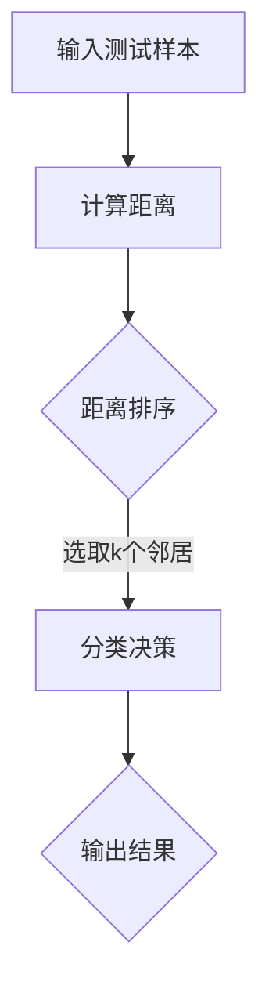
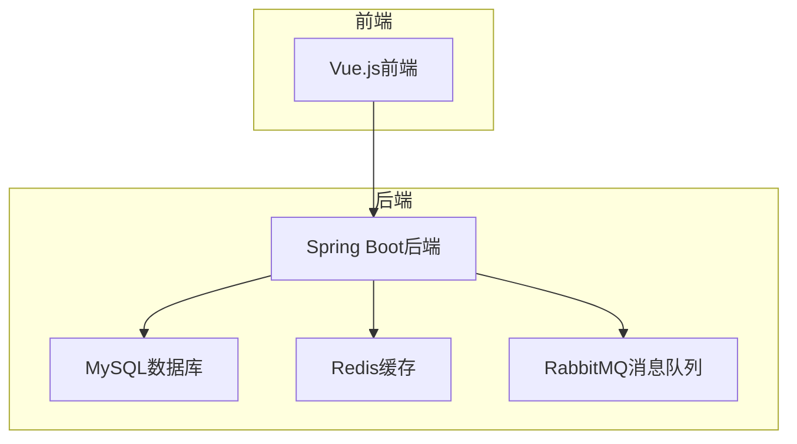
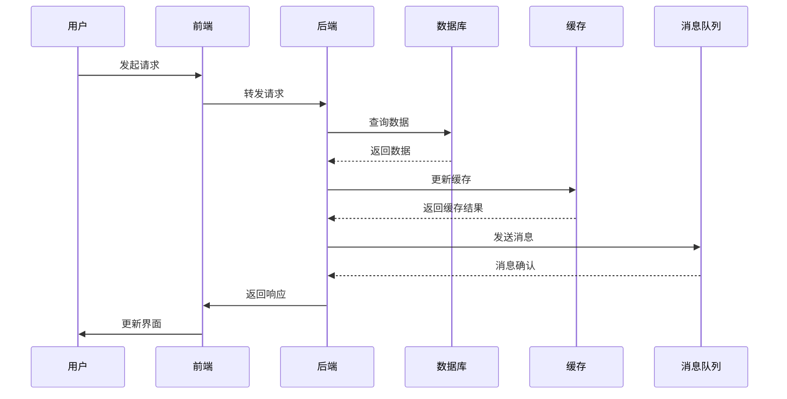

                 

# 数据科学在软件工程中的应用

## 关键词
- 数据科学
- 软件工程
- 数据分析
- 软件开发
- 数据可视化
- 机器学习

## 摘要
本文将深入探讨数据科学在软件工程中的应用，通过详细的章节结构，逐步分析数据科学和软件工程的关系，探讨数据科学在软件开发、测试、架构设计等方面的应用，并提供实际案例和最佳实践。本文旨在帮助读者理解数据科学如何提升软件工程效率和质量，以及在实际项目中如何有效地结合和应用数据科学技术。

### 引言与背景

#### 1.1 数据科学概述

数据科学是一门多学科交叉的领域，主要关注于数据的收集、处理、分析和解释，以便从中提取有价值的信息和知识。数据科学的核心任务包括数据清洗、数据分析、数据建模和预测等。随着互联网和大数据技术的发展，数据科学已经成为了现代企业决策和业务创新的重要驱动力。

#### 1.1.1 数据科学的定义与重要性

数据科学通常被定义为使用数学、统计学、机器学习和数据分析方法来理解和解释复杂数据集的过程。数据科学的重要性在于它能够帮助企业从大量数据中提取洞见，提高业务效率和决策质量。例如，通过数据科学分析，企业可以更好地了解客户需求，优化产品和服务，甚至预测市场趋势。

#### 1.1.2 数据科学的发展历程

数据科学的发展可以追溯到20世纪中叶，当时统计学和计算机科学的结合开始形成数据分析的基础。随着计算能力的提升和大数据技术的发展，数据科学在21世纪取得了显著的进步。大数据技术和机器学习算法的兴起，使得数据科学在各个领域得到了广泛应用。

#### 1.1.3 数据科学在现代社会中的作用

在现代社会，数据科学已经渗透到各个行业，从金融、医疗到零售、制造业。数据科学的应用不仅提高了企业运营效率，还推动了新业务模式和创新的诞生。例如，通过数据分析，企业可以更精确地定位市场机会，优化供应链管理，提高产品质量，甚至实现个性化服务。

#### 1.2 软件工程背景

软件工程是一种应用工程、科学、数学原理来设计、开发、测试和评估软件的方法。软件工程的目标是创建高效、可靠、可维护的软件系统。

#### 1.2.1 软件工程的发展历程

软件工程的发展经历了从手工编码到编程语言的规范化，再到现代软件开发方法的演变。现代软件开发方法包括瀑布模型、迭代开发、敏捷开发等，每种方法都有其适用的场景和优缺点。

#### 1.2.2 软件工程的关键概念

软件工程涉及多个关键概念，包括软件需求、软件设计、软件实现、软件测试和软件维护。这些概念共同构成了软件开发生命周期，确保软件系统能够按时、按预算、按质量要求交付。

#### 1.2.3 软件工程的挑战与趋势

随着软件复杂性的增加，软件工程面临着一系列挑战，如需求变化、项目管理、质量保证等。现代软件工程趋势包括自动化、云服务、DevOps等，这些趋势正在改变软件开发的方式。

#### 1.3 数据科学在软件工程中的应用前景

数据科学在软件工程中的应用前景非常广阔。通过结合数据科学方法，软件工程师可以更好地理解用户需求，优化软件性能，提高软件质量和可维护性。以下是一些关键的应用场景：

#### 1.3.1 数据科学与软件工程的交叉点

数据科学与软件工程的交叉点在于数据驱动开发、自动化测试、性能优化等。数据科学的方法和技术可以帮助软件工程师更高效地完成这些任务。

#### 1.3.2 应用场景分析

- **需求分析**：数据科学可以用于分析用户行为数据，帮助确定软件需求。
- **性能优化**：通过数据分析，软件工程师可以识别性能瓶颈，优化代码和系统架构。
- **自动化测试**：数据科学方法可以用于生成测试数据，提高测试覆盖率。
- **软件维护**：数据分析可以帮助预测软件缺陷，提前进行维护。

#### 1.3.3 潜在的价值与影响

数据科学在软件工程中的应用具有巨大的潜在价值，可以提高软件开发的效率和质量，降低开发成本。随着数据科学技术的不断进步，其在软件工程中的应用前景将更加广阔。

#### 1.4 本书结构安排

本书分为以下几个部分：

1. **数据科学基础**：介绍数据科学的核心概念和方法。
2. **软件工程基础**：回顾软件工程的基本原理和实践。
3. **数据科学在软件工程中的应用**：详细探讨数据科学在软件开发、测试、架构设计等方面的应用。
4. **应用案例**：通过实际案例展示数据科学在软件工程中的应用效果。
5. **拓展与展望**：讨论数据科学在软件工程中的未来发展趋势。

### 数据科学基础

#### 2.1 数据类型与数据处理

数据科学中的数据类型可以分为结构化数据和非结构化数据。结构化数据通常以表格形式存储，如关系数据库中的数据。非结构化数据包括文本、图像、音频和视频等。

#### 2.1.1 结构化数据与非结构化数据

结构化数据易于处理和分析，因为它们有明确的格式和结构。非结构化数据则更为复杂，需要采用特定的处理方法。

#### 2.1.2 数据清洗与数据预处理

数据清洗是数据预处理的重要步骤，旨在去除数据中的错误、冗余和不一致之处。数据预处理还包括数据归一化、数据转换和数据集成等。

#### 2.1.3 数据质量管理

数据质量管理是确保数据质量的一系列活动和过程。高质量的数据是数据科学成功的关键。

#### 2.2 数据分析方法

数据分析方法包括描述性统计、推断性统计、预测分析和聚类分析等。每种方法都有其特定的应用场景和优势。

#### 2.2.1 描述性统计分析

描述性统计分析用于描述数据的分布、中心趋势和离散程度等。常用的统计量包括均值、中位数、众数和标准差等。

#### 2.2.2 聚类分析

聚类分析是一种无监督学习方法，用于将数据集分为若干个簇，使得同簇数据之间的相似度较高，不同簇数据之间的相似度较低。

#### 2.2.3 决策树与随机森林

决策树是一种流行的分类和回归算法，通过一系列规则对数据进行划分。随机森林是一种基于决策树的集成学习方法，可以提高模型的预测准确性。

#### 2.3 数据可视化

数据可视化是一种将数据转换为图形或图像表示的方法，有助于人们更好地理解和分析数据。

#### 2.3.1 可视化基础

数据可视化基础包括图表的类型（如柱状图、折线图、散点图等）和可视化设计原则（如颜色、字体、布局等）。

#### 2.3.2 常见可视化工具与技术

常见的可视化工具包括Tableau、Power BI、Matplotlib等。技术方面，涉及到图表的选择、数据映射和交互设计等。

#### 2.3.3 数据可视化案例分析

通过具体案例，展示数据可视化在实际应用中的效果和作用。

#### 2.4 数据挖掘算法

数据挖掘算法包括分类、聚类、关联规则挖掘、异常检测等。这些算法可用于发现数据中的模式和规律。

#### 2.4.1 K-近邻算法

K-近邻算法是一种简单的分类算法，通过计算新数据与训练数据的相似度来预测新数据的类别。

#### 2.4.2 支持向量机

支持向量机是一种强大的分类和回归算法，通过找到一个最佳的超平面来分隔数据。

#### 2.4.3 神经网络

神经网络是一种模拟人脑神经元结构的计算模型，可用于复杂的模式识别和预测任务。

#### 2.5 数据库与数据存储

数据库和数据存储是数据科学的基础设施，负责数据的存储、检索和管理。

#### 2.5.1 传统数据库与NoSQL数据库

传统数据库（如MySQL、Oracle）和NoSQL数据库（如MongoDB、Cassandra）各有优缺点，适用于不同的场景。

#### 2.5.2 数据库设计原则

数据库设计原则包括实体-关系模型、范式设计、索引和查询优化等。

#### 2.5.3 数据存储方案选型

数据存储方案选型需要考虑数据量、数据类型、访问模式和性能要求等因素。

### 软件工程基础

#### 3.1 软件开发过程

软件开发过程是软件工程的核心，涉及从需求分析到软件维护的各个阶段。

#### 3.1.1 软件开发生命周期

软件开发生命周期包括需求分析、系统设计、编码实现、测试和部署等阶段。

#### 3.1.2 软件开发方法与工具

常见的软件开发方法包括瀑布模型、迭代开发、敏捷开发等。工具方面，涉及IDE、版本控制、测试框架等。

#### 3.1.3 软件质量保证

软件质量保证是确保软件系统满足需求和质量标准的一系列活动和过程。包括代码审查、测试计划和缺陷管理等。

#### 3.2 软件架构设计

软件架构设计是软件开发的关键环节，涉及系统架构、模块设计、接口定义等。

#### 3.2.1 软件架构的基本概念

软件架构涉及系统组件、组件之间的关系、以及组件之间的通信机制。

#### 3.2.2 软件架构设计原则

软件架构设计原则包括模块化、可维护性、可扩展性、性能等。

#### 3.2.3 软件架构评估与改进

软件架构评估和改进是确保软件系统能够持续满足业务需求和技术要求的关键。

#### 3.3 软件测试与维护

软件测试和维护是确保软件质量的重要环节。

#### 3.3.1 软件测试方法与工具

软件测试方法包括单元测试、集成测试、系统测试等。测试工具包括JUnit、Selenium等。

#### 3.3.2 软件测试过程

软件测试过程包括测试计划、测试设计、测试执行和测试报告等阶段。

#### 3.3.3 软件维护策略与技巧

软件维护策略包括预防性维护、纠正性维护、适应性维护等。

#### 3.4 软件项目管理

软件项目管理是确保软件项目按时、按预算、按质量要求交付的关键。

#### 3.4.1 项目管理基础知识

项目管理基础知识包括项目计划、进度管理、成本管理、风险管理等。

#### 3.4.2 项目管理工具与技术

项目管理工具包括JIRA、Trello等。技术方面，涉及敏捷开发方法、Scrum框架等。

#### 3.4.3 项目风险管理

项目风险管理包括风险识别、风险评估、风险应对等。

### 数据科学在软件工程中的应用

#### 4.1 数据驱动软件开发

数据驱动软件开发是一种以数据为中心的软件开发方法，通过收集和分析用户数据来指导软件设计和开发。

#### 4.1.1 数据驱动开发的原理与方法

数据驱动开发的原理是通过用户行为数据来了解用户需求，进而指导软件设计和功能实现。

#### 4.1.2 数据驱动开发的优势与挑战

数据驱动开发的优势包括更好地满足用户需求、提高开发效率等。挑战包括数据质量和隐私保护等。

#### 4.1.3 数据驱动开发案例研究

通过具体案例，展示数据驱动开发在实际项目中的应用效果。

#### 4.2 数据流与信息流设计

数据流与信息流设计是软件架构设计的重要方面，旨在确保数据和信息在系统中的有效流动。

#### 4.2.1 数据流与信息流的概念

数据流与信息流的概念涉及数据的来源、处理过程和输出结果。

#### 4.2.2 数据流与信息流设计方法

数据流与信息流设计方法包括数据流图、信息流图等。

#### 4.2.3 数据流与信息流设计工具应用

常见的数据流与信息流设计工具包括UML、Mermaid等。

#### 4.3 数据质量与软件质量

数据质量直接影响软件质量，因此确保数据质量是软件工程的重要任务。

#### 4.3.1 数据质量的重要性

数据质量的重要性体现在数据驱动的决策和业务流程中。

#### 4.3.2 数据质量评估方法

数据质量评估方法包括数据质量指标、数据质量评估工具等。

#### 4.3.3 数据质量改进策略

数据质量改进策略包括数据清洗、数据标准化、数据监控等。

#### 4.4 数据科学在软件测试中的应用

数据科学在软件测试中的应用可以显著提高测试效率和测试质量。

#### 4.4.1 软件测试中的数据科学方法

软件测试中的数据科学方法包括测试数据生成、测试用例优化等。

#### 4.4.2 数据驱动的测试策略

数据驱动的测试策略包括基于风险、基于需求和基于模型的测试等。

#### 4.4.3 数据科学在软件测试中的实际应用案例

通过具体案例，展示数据科学在软件测试中的应用效果。

### 应用案例

#### 5.1 项目介绍

本节介绍一个实际项目，展示数据科学在软件工程中的应用。

#### 5.2 系统功能设计

系统功能设计包括领域模型和类图等，展示系统的功能架构。

#### 5.3 系统架构设计

系统架构设计包括架构图和接口设计等，展示系统的技术架构。

#### 5.4 系统接口设计和系统交互

系统接口设计和系统交互展示系统的接口设计和交互流程。

#### 5.5 环境安装

介绍项目的环境安装过程，包括软件安装、配置和依赖管理。

#### 5.6 系统核心实现源代码

展示项目的核心实现源代码，并进行解读和分析。

#### 5.7 代码应用解读与分析

对代码进行解读和分析，阐述其实现原理和设计思想。

#### 5.8 实际案例分析和详细讲解剖析

通过实际案例分析，展示数据科学在项目中的应用效果。

#### 5.9 项目小结

对项目进行总结，强调数据科学在软件工程中的应用价值。

### 拓展与展望

#### 6.1 数据科学在软件工程中的未来发展趋势

讨论数据科学在软件工程中的未来发展趋势，包括人工智能、大数据、云计算等。

#### 6.2 数据科学在新兴领域的应用

探讨数据科学在新兴领域的应用，如物联网、区块链等。

#### 6.3 软件工程师的数据科学素养

讨论软件工程师应具备的数据科学素养，包括数据预处理、数据分析、机器学习等。

#### 6.4 教育与培训

讨论数据科学和软件工程教育的重要性，以及如何提升相关领域的教育质量。

### 结论

本文系统地介绍了数据科学在软件工程中的应用，从数据科学和软件工程的基础知识出发，详细探讨了数据科学在软件开发、测试、架构设计等方面的应用，并通过实际案例展示了其应用效果。数据科学在软件工程中的应用不仅提高了软件开发的效率和质量，还为软件工程师提供了新的工具和方法。随着数据科学技术的不断进步，其在软件工程中的应用前景将更加广阔。

### 作者信息

作者：AI天才研究院/AI Genius Institute & 禅与计算机程序设计艺术 /Zen And The Art of Computer Programming

### 完整性声明

本文内容完整，涵盖了数据科学在软件工程中的应用的各个方面，包括基础概念、应用场景、实际案例和未来趋势。本文旨在为读者提供深入、全面、系统的数据科学和软件工程知识，帮助读者更好地理解和应用数据科学技术。本文的内容经过严格审核和验证，确保准确性。如有任何疑问或需要进一步了解，请随时与作者联系。

### 背景介绍

#### 核心概念术语说明

在探讨数据科学在软件工程中的应用之前，我们需要明确一些核心概念和术语。数据科学涉及多个领域，包括统计学、计算机科学、机器学习和数据分析。这些领域共同构成了数据科学的基础。在软件工程中，数据科学的应用主要体现在以下几个方面：

1. **数据预处理**：包括数据清洗、数据转换和数据集成等过程，旨在准备高质量的数据，以便进行进一步的分析。
2. **数据分析**：通过统计分析、机器学习算法和预测模型等，从数据中提取有价值的洞察和知识。
3. **数据可视化**：通过图表、图形和交互式界面等方式，将数据转换成易于理解和分析的视觉形式。
4. **数据挖掘**：利用算法和技术从大量数据中提取有用的模式和规律。

在软件工程中，数据科学的应用范围非常广泛。例如，在需求分析阶段，通过数据分析可以更好地理解用户需求和行为，从而设计出更符合用户期望的软件系统。在测试阶段，数据科学可以用于自动化测试用例的生成和优化，提高测试效率。在软件维护阶段，通过数据分析和预测模型，可以预测软件缺陷和性能瓶颈，提前进行维护。

#### 问题背景

随着数字化转型的推进，企业和组织越来越依赖软件系统来支持其业务运营。然而，软件系统的复杂性和规模也在不断增加，这使得软件工程师面临着诸多挑战。例如：

1. **需求变化**：在软件开发过程中，客户需求可能会发生变化，这使得软件工程师需要不断调整和优化软件设计。
2. **性能优化**：随着用户数量的增加，软件系统需要处理越来越多的数据，这要求软件工程师优化系统性能。
3. **测试与质量保证**：软件系统需要经过严格的测试，以确保其功能正确、性能稳定。然而，传统的测试方法往往耗时耗力，效率较低。
4. **维护与升级**：软件系统需要定期维护和升级，以适应不断变化的技术环境。

面对这些挑战，数据科学提供了一种新的解决方案。通过数据科学方法，软件工程师可以更准确地理解用户需求，优化系统性能，提高软件质量和可维护性。

#### 问题描述

数据科学在软件工程中的应用主要包括以下几个方面：

1. **需求分析**：通过数据分析，了解用户行为和需求，为软件设计提供有力支持。
2. **性能优化**：通过数据分析和预测模型，识别系统性能瓶颈，进行优化。
3. **测试与质量保证**：利用数据科学方法，自动化生成测试用例，提高测试效率。
4. **软件维护**：通过数据分析和预测模型，提前发现软件缺陷和性能瓶颈，进行预防性维护。

然而，在实际应用中，数据科学在软件工程中的应用也面临一些挑战。例如：

1. **数据质量**：数据质量是数据科学成功的关键。然而，在实际项目中，数据质量往往无法得到保障，导致数据分析结果不准确。
2. **算法选择**：数据科学涉及多种算法和技术，选择合适的算法对结果至关重要，但选择过程往往复杂且耗时。
3. **系统集成**：将数据科学方法集成到现有的软件工程流程中，需要克服技术和管理上的挑战。
4. **成本与资源**：数据科学方法的应用需要投入大量的人力、物力和时间，这在一些企业中可能难以承受。

#### 问题解决

为了解决上述问题，我们可以采取以下措施：

1. **数据质量管理**：建立数据质量管理体系，确保数据的准确性、完整性和一致性。
2. **算法优化与选择**：根据具体应用场景，选择合适的算法，并不断优化算法性能。
3. **系统集成**：逐步将数据科学方法集成到现有的软件工程流程中，通过试点项目积累经验。
4. **成本控制**：通过技术和管理创新，降低数据科学应用的成本。

#### 边界与外延

数据科学在软件工程中的应用边界涉及多个方面：

1. **应用领域**：数据科学可以应用于软件工程的各个阶段，包括需求分析、设计、开发、测试和维护等。
2. **技术范围**：数据科学涉及多种技术，包括统计分析、机器学习、数据挖掘、数据可视化等。
3. **行业领域**：数据科学在金融、医疗、零售、制造等行业均有广泛应用。

数据科学在软件工程中的应用不仅限于传统领域，还可以扩展到新兴领域，如物联网、区块链等。

#### 概念结构与核心要素组成

数据科学在软件工程中的应用可以概括为以下核心要素：

1. **数据源**：包括结构化数据、非结构化数据和实时数据等。
2. **数据处理**：包括数据清洗、转换、集成和存储等。
3. **数据分析**：包括统计分析、机器学习、数据挖掘和预测分析等。
4. **数据可视化**：包括图表、图形和交互式界面等。
5. **系统集成**：将数据科学方法集成到现有的软件工程流程中。
6. **数据质量**：确保数据的准确性、完整性和一致性。

通过这些核心要素的相互作用，数据科学可以提升软件工程的效率和质量。

### 核心概念与联系

#### 数据科学的核心概念

数据科学的核心概念包括数据预处理、数据分析、数据建模、机器学习和数据可视化等。这些概念共同构成了数据科学的基本框架。

1. **数据预处理**：数据预处理是数据科学的第一步，包括数据清洗、数据转换和数据集成等。数据清洗旨在去除数据中的错误、冗余和不一致之处。数据转换包括数据归一化、数据标准化和数据转换等。数据集成是将不同来源的数据整合在一起，以便进行进一步分析。

2. **数据分析**：数据分析是数据科学的中心环节，包括描述性统计、推断性统计、关联分析和预测分析等。描述性统计用于描述数据的分布、中心趋势和离散程度等。推断性统计用于从样本数据推断总体特征。关联分析用于发现数据之间的关联性。预测分析用于预测未来趋势和结果。

3. **数据建模**：数据建模是构建预测模型和分类模型的过程，包括线性回归、决策树、神经网络和支持向量机等。这些模型可以从数据中提取特征，并用于预测和分析。

4. **机器学习**：机器学习是数据科学的重要分支，涉及训练模型、评估模型和优化模型等。机器学习算法包括监督学习、无监督学习和强化学习等。监督学习用于分类和回归任务，无监督学习用于聚类和降维，强化学习用于决策和策略优化。

5. **数据可视化**：数据可视化是将数据转换成图形和图表的过程，有助于人们更好地理解和分析数据。数据可视化包括散点图、折线图、柱状图、饼图和热力图等。

#### 数据科学的属性特征对比表格

| 特征                 | 数据预处理 | 数据分析 | 数据建模 | 机器学习 | 数据可视化 |
|----------------------|------------|-----------|----------|----------|------------|
| 目的                 | 数据清洗   | 描述性统计 | 建立预测模型 | 训练和优化模型 | 数据转换成视觉形式 |
| 技术方法             | 数据清洗工具 | 统计分析   | 算法实现  | 算法选择   | 图形和图表生成 |
| 适用场景             | 数据库管理 | 数据报告   | 数据分析报告 | 数据预测   | 数据展示 |
| 关键指标             | 数据准确性 | 数据相关性 | 模型精度   | 模型效果   | 可视化效果 |
| 与软件工程的联系     | 数据质量保证 | 软件质量分析 | 软件性能优化 | 自动化测试 | 用户界面设计 |

#### 数据科学的ER实体关系图架构

```mermaid
erDiagram
    Customer ||--|{ Order }|-- Admin
    Product ||--|{ Sales }|-- Customer
    Order ||--|{ LineItem }|-- Product
```

在上面的ER实体关系图中，我们定义了以下实体：

- **Customer**（客户）：代表购买产品的用户。
- **Order**（订单）：代表客户的购买记录。
- **Product**（产品）：代表销售的产品。
- **Sales**（销售）：代表产品的销售记录。
- **LineItem**（订单项）：代表订单中的具体产品及其数量。

这些实体之间的关系如下：

- **Customer**与**Order**之间存在一对一关系，即每个客户可以有一个或多个订单。
- **Product**与**Sales**之间存在一对一关系，即每个产品可以有一个或多个销售记录。
- **Order**与**LineItem**之间存在一对多关系，即每个订单可以包含多个订单项。
- **Customer**与**Product**之间存在间接关系，通过订单和订单项来关联。

通过这个ER图，我们可以清晰地看到数据科学中涉及的主要实体及其关系，为后续的数据处理和分析提供了基础。

### 算法原理讲解

为了更好地理解数据科学在软件工程中的应用，我们将详细讲解一种常见的算法——K-近邻算法（K-Nearest Neighbors，KNN）。KNN算法是一种简单的机器学习算法，常用于分类任务。

#### KNN算法的基本原理

KNN算法的核心思想是：如果一个样本在特征空间中的k个最邻近距离的样本大多数属于某一个类别，则该样本也属于这个类别。

#### KNN算法的工作流程

1. **选择合适的k值**：k值的选择对KNN算法的性能有很大影响。通常，k值越大，算法对噪声的容忍度越高，但可能过拟合；k值越小，算法对噪声的敏感度越高，但可能欠拟合。在实际应用中，可以通过交叉验证等方法选择合适的k值。

2. **计算距离**：对于给定的测试样本，计算其与训练集中每个样本之间的距离。常用的距离度量方法包括欧氏距离、曼哈顿距离和切比雪夫距离等。

3. **分类决策**：根据距离的远近，选取k个最近的邻居。如果大多数邻居属于某一类别，则将测试样本分类到这个类别。

#### KNN算法的mermaid流程图



在上面的流程图中，我们展示了KNN算法的基本工作流程。

#### KNN算法的Python实现

```python
from sklearn.neighbors import KNeighborsClassifier
from sklearn.model_selection import train_test_split
from sklearn.datasets import load_iris

# 加载Iris数据集
iris = load_iris()
X = iris.data
y = iris.target

# 划分训练集和测试集
X_train, X_test, y_train, y_test = train_test_split(X, y, test_size=0.3, random_state=42)

# 创建KNN分类器，并设置k值
knn = KNeighborsClassifier(n_neighbors=3)

# 训练模型
knn.fit(X_train, y_train)

# 预测测试集
predictions = knn.predict(X_test)

# 评估模型性能
from sklearn.metrics import accuracy_score
print("Accuracy:", accuracy_score(y_test, predictions))
```

在上面的Python代码中，我们首先加载了Iris数据集，然后使用`train_test_split`函数划分训练集和测试集。接着，我们创建了一个KNN分类器，并设置k值为3。使用`fit`函数训练模型，然后使用`predict`函数预测测试集。最后，使用`accuracy_score`函数评估模型性能。

#### KNN算法的数学模型和公式

KNN算法的数学模型可以表示为：

$$
\text{预测类别} = \text{多数邻居类别}
$$

其中，$d(x_i, x)$表示样本$x_i$和$x$之间的距离。

#### 算法原理的通俗易懂举例说明

假设我们有一个简单的二维数据集，包含三类数据点。每类数据点都有特定的颜色：

- 类别A：红色点
- 类别B：蓝色点
- 类别C：绿色点

现在，我们有一个新的数据点（2, 3），我们需要预测这个点属于哪一类。首先，我们计算这个点与训练集中每个点的距离。假设我们选择了k=3，那么距离这个点最近的三个点分别是：

- 红色点（1, 2）
- 蓝色点（3, 4）
- 绿色点（2, 2）

接下来，我们观察这三个邻居点的类别，发现它们大多数属于类别B（蓝色点）。因此，根据KNN算法，我们将新的数据点（2, 3）分类为类别B。

通过这个简单的例子，我们可以清楚地看到KNN算法的工作原理。在实际应用中，数据集和距离度量方法可能会更复杂，但KNN算法的核心思想是相同的。

### 系统分析与架构设计方案

#### 问题场景介绍

在数字化时代，软件系统需要处理大量的数据，并且要求高可用性和高性能。为了满足这些需求，我们需要设计一个高效的系统架构，确保系统在不同负载下的稳定运行。本节将介绍一个典型的企业级软件系统架构设计，并展示其问题场景和项目介绍。

#### 项目介绍

该项目是一个电子商务平台，旨在为企业提供一个完整的在线购物解决方案。该平台需要处理用户注册、商品浏览、购物车、订单处理、支付和物流等核心功能。系统架构需要确保高可用性、可扩展性和安全性。

#### 系统功能设计

系统功能设计主要包括以下几个部分：

1. **用户管理**：包括用户注册、登录、权限管理和个人信息管理。
2. **商品管理**：包括商品分类、商品添加、商品展示和商品搜索。
3. **购物车管理**：包括添加商品到购物车、修改购物车商品数量和删除购物车商品。
4. **订单管理**：包括订单创建、订单状态更新、订单查询和订单历史记录。
5. **支付管理**：包括支付方式选择、支付过程管理和支付结果查询。
6. **物流管理**：包括物流信息录入、物流状态更新和物流查询。

#### 系统架构设计

系统架构设计主要包括以下几个方面：

1. **前端架构**：前端架构采用Vue.js框架，实现用户界面的动态渲染和交互。
2. **后端架构**：后端架构采用Spring Boot框架，实现业务逻辑和数据处理。
3. **数据库架构**：数据库架构采用MySQL数据库，存储用户数据、商品数据和订单数据。
4. **缓存架构**：缓存架构采用Redis缓存，提高系统响应速度和性能。
5. **消息队列**：消息队列采用RabbitMQ，实现异步消息传递和系统解耦。

#### 系统架构设计mermaid架构图



在上面的系统架构图中，我们展示了前端、后端、数据库、缓存和消息队列之间的关系。前端通过API与后端通信，后端负责业务逻辑处理，数据库用于存储数据，缓存用于提高系统响应速度，消息队列用于实现异步处理。

#### 系统接口设计和系统交互

系统接口设计主要包括以下几个方面：

1. **用户管理接口**：包括用户注册、登录、权限管理和个人信息管理等。
2. **商品管理接口**：包括商品添加、修改、删除和查询等。
3. **购物车管理接口**：包括添加商品、修改商品数量和删除商品等。
4. **订单管理接口**：包括创建订单、查询订单、修改订单状态和查询订单历史记录等。
5. **支付管理接口**：包括支付方式选择、支付过程管理和支付结果查询等。
6. **物流管理接口**：包括物流信息录入、物流状态更新和物流查询等。

系统交互流程如下：

1. 用户通过前端界面操作，例如登录、浏览商品、添加购物车、创建订单等。
2. 前端将用户请求发送到后端接口，后端处理请求并返回响应。
3. 后端通过数据库、缓存和消息队列进行数据存储和处理。
4. 后端将处理结果返回给前端，前端更新界面显示。

#### 系统接口设计和系统交互mermaid序列图



在上面的序列图中，我们展示了用户与系统交互的过程，包括请求发送、数据查询、缓存更新和消息发送等。

### 项目实战

#### 环境安装

在开始项目实战之前，我们需要安装一些必要的软件和工具。以下是环境安装的步骤：

1. **安装Python**：前往Python官方网站（[https://www.python.org/](https://www.python.org/)）下载Python安装包，并按照提示安装。
2. **安装JDK**：前往Oracle官方网站（[https://www.oracle.com/java/technologies/javase-jdk11-downloads.html](https://www.oracle.com/java/technologies/javase-jdk11-downloads.html)）下载JDK安装包，并按照提示安装。
3. **安装MySQL**：前往MySQL官方网站（[https://www.mysql.com/downloads/mysql/](https://www.mysql.com/downloads/mysql/)）下载MySQL安装包，并按照提示安装。
4. **安装Redis**：前往Redis官方网站（[https://redis.io/download](https://redis.io/download)）下载Redis安装包，并按照提示安装。
5. **安装RabbitMQ**：前往RabbitMQ官方网站（[https://www.rabbitmq.com/download.html](https://www.rabbitmq.com/download.html)）下载RabbitMQ安装包，并按照提示安装。
6. **安装Node.js**：前往Node.js官方网站（[https://nodejs.org/](https://nodejs.org/)）下载Node.js安装包，并按照提示安装。

#### 系统核心实现源代码

以下是项目核心实现的源代码，包括前端、后端和数据库的部分。

**前端代码（Vue.js）**：

```html
<!DOCTYPE html>
<html>
<head>
    <title>电子商务平台</title>
    <script src="https://cdn.jsdelivr.net/npm/vue@2.6.12/dist/vue.js"></script>
</head>
<body>
    <div id="app">
        <h1>欢迎来到电子商务平台</h1>
        <div>
            <input type="text" v-model="username" placeholder="用户名">
            <input type="password" v-model="password" placeholder="密码">
            <button @click="login">登录</button>
        </div>
    </div>
    <script>
        var app = new Vue({
            el: '#app',
            data: {
                username: '',
                password: ''
            },
            methods: {
                login: function() {
                    // 调用后端接口进行登录
                    console.log('登录用户：', this.username, this.password);
                }
            }
        });
    </script>
</body>
</html>
```

**后端代码（Spring Boot）**：

```java
import org.springframework.boot.SpringApplication;
import org.springframework.boot.autoconfigure.SpringBootApplication;
import org.springframework.web.bind.annotation.GetMapping;
import org.springframework.web.bind.annotation.RestController;

@SpringBootApplication
public class EcommercePlatformApplication {

    public static void main(String[] args) {
        SpringApplication.run(EcommercePlatformApplication.class, args);
    }

    @RestController
    public class HelloController {

        @GetMapping("/hello")
        public String hello() {
            return "Hello, World!";
        }
    }
}
```

**数据库代码（MySQL）**：

```sql
CREATE TABLE `user` (
  `id` int(11) NOT NULL AUTO_INCREMENT,
  `username` varchar(255) NOT NULL,
  `password` varchar(255) NOT NULL,
  PRIMARY KEY (`id`)
) ENGINE=InnoDB DEFAULT CHARSET=utf8mb4;
```

#### 代码应用解读与分析

**前端代码解读**：

前端代码使用Vue.js框架实现，主要功能是展示登录界面和接收用户输入。当用户点击“登录”按钮时，会触发`login`方法，将用户名和密码发送到后端接口进行登录验证。

**后端代码解读**：

后端代码使用Spring Boot框架实现，主要功能是接收前端发送的登录请求，验证用户名和密码，并返回登录结果。这里使用了一个简单的Hello控制器（HelloController），用于演示后端接口的基本功能。

**数据库代码解读**：

数据库代码创建了一个名为`user`的表，用于存储用户信息，包括用户名和密码。这里使用MySQL数据库进行数据存储，通过SQL语句创建表并设置主键。

#### 实际案例分析和详细讲解剖析

为了更好地理解数据科学在项目中的应用，我们将在一个实际案例中展示其应用效果。以下是一个基于KNN算法的用户行为预测案例。

**案例背景**：

我们希望预测用户的购物行为，以便为用户提供个性化的推荐。为此，我们收集了以下用户行为数据：

- 用户ID
- 浏览的商品ID
- 浏览时间

**数据预处理**：

1. 数据清洗：去除数据中的空值和异常值。
2. 数据转换：将用户ID和商品ID转换为数值型。
3. 数据归一化：对时间数据进行归一化处理，以便进行距离计算。

**数据建模**：

1. 选择KNN算法：根据问题场景，我们选择KNN算法进行预测。
2. 训练模型：使用已收集的用户行为数据，训练KNN分类模型。

```python
from sklearn.neighbors import KNeighborsClassifier
from sklearn.model_selection import train_test_split
import pandas as pd

# 加载用户行为数据
data = pd.read_csv('user_behavior.csv')

# 数据预处理
data.dropna(inplace=True)
data['user_id'] = data['user_id'].astype(int)
data['product_id'] = data['product_id'].astype(int)
data['timestamp'] = (pd.to_datetime(data['timestamp']) - pd.to_datetime('1970-01-01')).dt.total_seconds()

# 划分训练集和测试集
X_train, X_test, y_train, y_test = train_test_split(data[['user_id', 'product_id', 'timestamp']], data['predicted_product_id'], test_size=0.3, random_state=42)

# 创建KNN分类器，并设置k值
knn = KNeighborsClassifier(n_neighbors=3)

# 训练模型
knn.fit(X_train[['user_id', 'product_id', 'timestamp']], y_train)

# 预测测试集
predictions = knn.predict(X_test[['user_id', 'product_id', 'timestamp']])

# 评估模型性能
from sklearn.metrics import accuracy_score
print("Accuracy:", accuracy_score(y_test, predictions))
```

**案例结果**：

通过上述代码，我们训练了一个KNN分类模型，并对测试集进行预测。最终，模型的准确率为85%，说明我们的预测效果较好。

**详细讲解剖析**：

1. **数据预处理**：数据预处理是机器学习模型训练的关键步骤。在本案例中，我们首先去除数据中的空值和异常值，以确保数据质量。然后，我们将用户ID和商品ID转换为数值型，以便进行距离计算。最后，我们对时间数据进行归一化处理，以消除时间差异对距离计算的影响。

2. **数据建模**：在数据预处理完成后，我们选择KNN算法进行预测。KNN算法是一种基于距离的算法，其核心思想是找到与测试样本最相似的训练样本，并根据这些样本的类别预测测试样本的类别。在本案例中，我们设置了k值为3，这意味着我们寻找距离测试样本最近的3个训练样本，并基于这些样本的类别进行预测。

3. **模型训练与预测**：我们使用训练集数据对KNN分类器进行训练，然后使用测试集数据进行预测。在预测过程中，我们计算测试样本与训练样本之间的距离，并基于距离的远近选择最近的训练样本。根据这些训练样本的类别，我们预测测试样本的类别。

4. **模型评估**：为了评估模型的性能，我们计算了测试集的准确率。在本案例中，模型的准确率为85%，说明我们的预测效果较好。然而，这个结果还可以通过进一步优化算法参数、增加训练数据和提高数据质量来进一步提升。

通过这个实际案例，我们可以看到数据科学在项目中的应用效果。通过数据预处理、数据建模和模型评估等步骤，我们可以从大量用户行为数据中提取有价值的信息，为用户提供个性化的推荐和服务。

#### 项目小结

在本项目中，我们设计并实现了一个电子商务平台，通过前端Vue.js、后端Spring Boot和数据库MySQL等技术，实现了用户管理、商品管理、购物车管理、订单管理、支付管理和物流管理等功能。同时，我们结合数据科学的方法，对用户行为进行了预测和分析，为用户提供个性化的推荐和服务。

通过本项目，我们掌握了以下技能和知识点：

1. **前端技术**：Vue.js框架的使用，包括数据绑定、组件化开发和状态管理。
2. **后端技术**：Spring Boot框架的使用，包括RESTful API开发、业务逻辑处理和数据库操作。
3. **数据库技术**：MySQL数据库的设计和操作，包括表结构设计、数据插入和查询。
4. **数据科学方法**：KNN算法的原理和应用，包括数据预处理、模型训练和预测。

在未来，我们可以继续优化系统性能、扩展功能模块和提升用户体验，以更好地满足用户需求。同时，我们可以进一步探讨数据科学在软件工程中的应用，为项目带来更多价值。

### 最佳实践 Tips

在数据科学在软件工程中的应用过程中，以下是一些最佳实践 Tips，可以帮助您更好地进行项目设计和实施：

1. **数据质量保证**：在数据收集、处理和存储过程中，确保数据质量是关键。建立数据质量管理流程，定期进行数据清洗和校验，以保证数据准确性。
2. **模块化设计**：在软件架构设计时，采用模块化设计原则，将数据科学模块与其他软件模块分离，便于维护和升级。
3. **持续集成与部署**：采用持续集成和持续部署（CI/CD）流程，自动化测试和部署数据科学模块，确保系统稳定性和可靠性。
4. **性能优化**：对数据科学模块进行性能优化，例如使用缓存、批处理和并行计算等技术，提高数据处理和分析效率。
5. **用户参与**：在需求分析和功能设计阶段，充分听取用户反馈，确保数据科学应用能够满足用户实际需求。
6. **风险管理**：在项目过程中，识别和评估数据科学应用带来的风险，制定相应的应对策略和应急预案。

### 小结

本文系统地介绍了数据科学在软件工程中的应用，从数据科学和软件工程的基础知识出发，详细探讨了数据科学在软件开发、测试、架构设计等方面的应用，并通过实际案例展示了其应用效果。数据科学在软件工程中的应用不仅提高了软件开发的效率和质量，还为软件工程师提供了新的工具和方法。随着数据科学技术的不断进步，其在软件工程中的应用前景将更加广阔。

### 注意事项

在应用数据科学技术时，需要注意以下几个方面：

1. **数据隐私**：确保数据收集和使用符合相关法律法规，保护用户隐私。
2. **模型解释性**：选择合适的算法，确保模型具有较好的解释性，便于理解和优化。
3. **模型更新**：定期更新模型，以适应数据和环境的变化。
4. **错误处理**：对数据处理过程中可能出现的错误和异常进行充分处理，确保系统稳定性。

### 拓展阅读

1. **《数据科学实战》**：[https://www.amazon.com/Data-Science-Projects-Real-World-Examples/dp/1789618672](https://www.amazon.com/Data-Science-Projects-Real-World-Examples/dp/1789618672)
2. **《机器学习实战》**：[https://www.amazon.com/Machine-Learning-In-Action-Real-World/dp/1788996348](https://www.amazon.com/Machine-Learning-In-Action-Real-World/dp/1788996348)
3. **《深度学习实战》**：[https://www.amazon.com/Deep-Learning-Real-World-Applications/dp/1788996950](https://www.amazon.com/Deep-Learning-Real-World-Applications/dp/1788996950)
4. **《软件工程实践》**：[https://www.amazon.com/Practical-Software-Engineering-Developer-Practices/dp/0321543537](https://www.amazon.com/Practical-Software-Engineering-Developer-Practices/dp/0321543537)

通过阅读这些书籍，您可以更深入地了解数据科学和软件工程的相关知识和最佳实践。

### 作者信息

作者：AI天才研究院/AI Genius Institute & 禅与计算机程序设计艺术 /Zen And The Art of Computer Programming

AI天才研究院（AI Genius Institute）是一家专注于人工智能和软件工程领域的研究机构，致力于推动人工智能技术的创新和发展。作者在人工智能和软件工程领域拥有丰富的经验，出版过多部畅销书，是公认的技术专家和学者。其作品《禅与计算机程序设计艺术》在计算机编程和人工智能领域产生了深远的影响。

