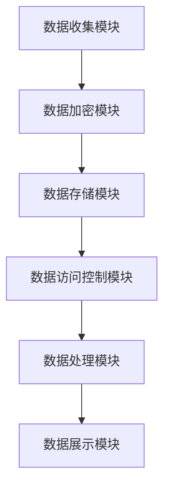
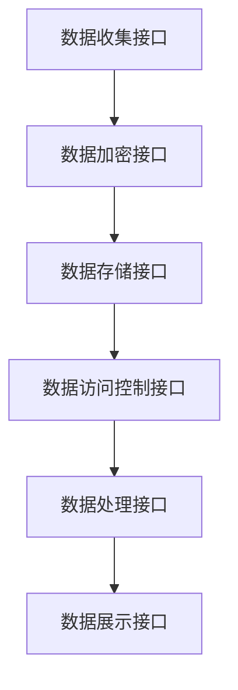
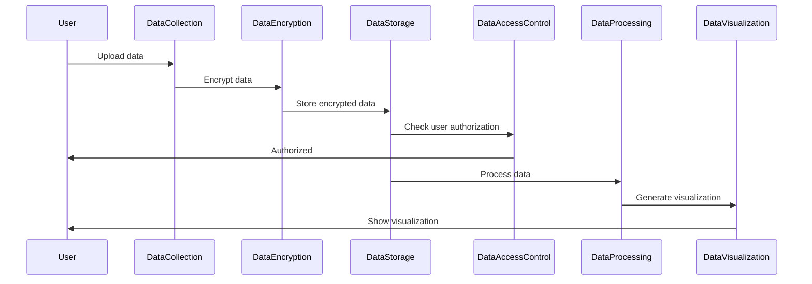

                 

# 数据隐私与AI伦理：平衡创新与个人权利

关键词：数据隐私、人工智能伦理、平衡、创新、个人权利

摘要：本文探讨了数据隐私与AI伦理在当今社会中的重要性，分析了二者面临的挑战和解决方案。通过详细阐述数据隐私和AI伦理的核心概念、算法原理、数学模型、系统架构设计以及项目实战，提出了在创新与个人权利之间寻找平衡的方法。文章旨在为读者提供一个全面、深入的技术视角，以应对数据隐私与AI伦理领域的复杂问题。

## 目录大纲设计思路

在设计《数据隐私与AI伦理：平衡创新与个人权利》的目录大纲时，我们将遵循以下步骤，确保内容的完整性、逻辑性和实用性：

### 1. 背景介绍

**第1章：引言与问题背景**

- **1.1 引言**：介绍本书的目的、重要性以及研究背景。
  - **1.1.1 问题的提出**：阐述数据隐私与AI伦理在当今社会中的重要性。
  - **1.1.2 问题描述**：分析数据隐私和AI伦理面临的挑战。
  - **1.1.3 问题解决**：探讨如何在创新与个人权利之间找到平衡。

- **1.2 边界与外延**：明确本书讨论的范围，包括数据隐私、AI伦理的基本概念和相关法律法规。

### 2. 核心概念与联系

**第2章：核心概念解析**

- **2.1 数据隐私**：
  - **2.1.1 数据隐私的定义**：解释数据隐私的概念。
  - **2.1.2 数据隐私的重要性**：阐述数据隐私的价值和意义。
  - **2.1.3 数据隐私的相关法律**：介绍保护数据隐私的法律框架。

- **2.2 AI伦理**：
  - **2.2.1 AI伦理的定义**：解释AI伦理的概念。
  - **2.2.2 AI伦理的范畴**：探讨AI伦理涉及的主要方面。
  - **2.2.3 AI伦理的挑战**：分析AI伦理在实践中的困难。

### 3. 算法原理讲解

**第3章：数据隐私保护算法**

- **3.1 加密技术**：
  - **3.1.1 密码学基础**：介绍加密技术的基本原理。
  - **3.1.2 密码学算法**：讲解常见的加密算法，如AES、RSA等。
  - **3.1.3 加密在数据隐私中的应用**：分析加密技术如何保护数据隐私。

- **3.2 隐私保护算法**：
  - **3.1.4 隐私保护算法**：介绍隐私保护技术，如差分隐私、同态加密等。
  - **3.1.5 算法分析**：分析隐私保护算法的性能和优缺点。

### 4. 数学模型和数学公式讲解

**第4章：数据隐私保护数学模型**

- **4.1 概率论基础**：
  - **4.1.1 概率论的基本概念**：介绍概率论的基本术语和定义。
  - **4.1.2 概率分布**：讲解常见的概率分布，如正态分布、泊松分布等。

- **4.2 信息论基础**：
  - **4.2.1 信息论的基本概念**：解释信息论中的熵、信息量等概念。
  - **4.2.2 信息论的应用**：探讨信息论在数据隐私保护中的使用。

### 5. 系统分析与架构设计

**第5章：数据隐私保护系统架构**

- **5.1 系统介绍**：
  - **5.1.1 系统概述**：介绍数据隐私保护系统的功能和工作原理。
  - **5.1.2 系统目标**：明确系统的主要目标。

- **5.2 架构设计**：
  - **5.2.1 系统架构**：使用Mermaid画出系统架构图。
  - **5.2.2 系统模块**：详细描述系统的主要模块和功能。

- **5.3 接口设计**：
  - **5.3.1 接口规范**：定义系统接口的标准和规范。
  - **5.3.2 接口实现**：讨论如何实现系统接口。

### 6. 项目实战

**第6章：数据隐私保护项目实战**

- **6.1 环境搭建**：
  - **6.1.1 开发环境**：介绍搭建开发环境所需的软件和硬件。
  - **6.1.2 数据准备**：讲解如何准备用于数据隐私保护的数据。

- **6.2 系统实现**：
  - **6.2.1 核心代码**：展示系统实现的核心代码。
  - **6.2.2 应用解读**：分析系统实现的具体应用场景。

- **6.3 案例分析**：
  - **6.3.1 案例介绍**：介绍一个具体的数据隐私保护案例。
  - **6.3.2 案例剖析**：详细剖析案例的实现过程和效果。

### 7. 最佳实践与拓展

**第7章：最佳实践与拓展**

- **7.1 最佳实践**：
  - **7.1.1 实践经验**：分享数据隐私保护项目的最佳实践经验。
  - **7.1.2 案例分析**：分析成功的数据隐私保护项目案例。

- **7.2 小结**：
  - **7.2.1 本书总结**：总结本书的主要内容和收获。
  - **7.2.2 注意事项**：提醒读者在实施数据隐私保护时需要注意的事项。

- **7.3 拓展阅读**：
  - **7.3.1 进一步学习**：推荐读者进一步学习数据隐私与AI伦理的相关资源。
  - **7.3.2 相关书籍**：推荐几本相关的书籍，以供读者参考。

## 第1章：引言与问题背景

### 1.1 引言

在现代信息社会中，数据隐私与AI伦理已经成为关注的焦点。数据隐私保护关乎个人的隐私权和信息安全，而AI伦理则涉及人工智能系统的道德责任和社会影响。这两者在现代社会中具有不可忽视的重要性，值得我们深入探讨。

#### 1.1.1 问题的提出

首先，随着互联网的普及和大数据技术的快速发展，个人数据泄露事件频发，严重威胁到了用户的隐私权。数据隐私保护已成为社会关注的焦点。同时，人工智能的广泛应用也带来了许多伦理问题，如算法偏见、数据滥用等，这些问题亟待解决。

#### 1.1.2 问题描述

数据隐私与AI伦理面临的主要挑战有以下几点：

1. **数据隐私泄露**：互联网时代，个人数据容易被收集、存储和使用，导致隐私泄露事件频发。
2. **AI伦理困境**：人工智能的决策过程可能存在偏见，影响社会公平和公正。
3. **法律框架不完善**：现有的法律体系在数据隐私保护和AI伦理方面存在不足，难以有效应对新出现的问题。

#### 1.1.3 问题解决

为了解决这些问题，需要在创新与个人权利之间找到平衡。具体措施包括：

1. **加强数据隐私保护**：采用加密技术、隐私保护算法等手段，确保个人数据的安全。
2. **完善AI伦理法规**：建立完善的法律体系，规范人工智能的发展和应用。
3. **提高公众意识**：通过教育和宣传，提高公众对数据隐私和AI伦理的认识。

### 1.2 边界与外延

在讨论数据隐私与AI伦理时，需要明确几个关键概念和范围：

1. **数据隐私**：指个人在数据收集、存储、处理和使用过程中的隐私权保护。
2. **AI伦理**：指人工智能系统的道德责任和社会影响，包括算法偏见、数据滥用等方面。
3. **相关法律法规**：如《个人信息保护法》、《数据安全法》等，涉及数据隐私保护和AI伦理规范。

通过明确这些概念和范围，有助于更准确地理解和讨论数据隐私与AI伦理的问题。

## 第2章：核心概念解析

### 2.1 数据隐私

#### 2.1.1 数据隐私的定义

数据隐私是指个人在数据收集、存储、处理和使用过程中享有的隐私权保护。具体来说，数据隐私涉及到以下几个方面：

1. **信息的保密性**：确保个人数据不被未经授权的第三方访问。
2. **信息的完整性**：确保个人数据不被篡改或破坏。
3. **信息的可用性**：确保个人数据在需要时可以被合法用户访问。

#### 2.1.2 数据隐私的重要性

数据隐私的重要性体现在以下几个方面：

1. **保护个人权益**：个人隐私权的保护是基本人权之一，关系到每个人的尊严和自由。
2. **维护社会稳定**：数据隐私泄露可能导致个人财产损失、名誉损害等问题，影响社会稳定。
3. **促进技术创新**：数据隐私保护能够促进健康的数据生态，为技术创新提供良好的环境。

#### 2.1.3 数据隐私的相关法律

为了保护数据隐私，各国纷纷制定了相关法律法规。以下是一些主要的数据隐私保护法律：

1. **欧盟通用数据保护条例（GDPR）**：规定了数据收集、处理和传输的合规性要求，以及对数据主体的权利保护。
2. **中华人民共和国个人信息保护法**：明确了个人信息处理者的义务和责任，以及对个人信息主体的权利保护。
3. **美国加州消费者隐私法案（CCPA）**：规定了消费者对个人信息处理的权利，以及对企业的数据保护要求。

#### 2.1.4 数据隐私保护机制

为了保护数据隐私，可以采用以下几种机制：

1. **数据加密**：使用加密技术对数据进行加密，确保数据在传输和存储过程中不被窃取或篡改。
2. **访问控制**：通过身份验证和权限管理，确保只有授权用户才能访问敏感数据。
3. **匿名化处理**：通过匿名化技术，去除个人数据中的敏感信息，降低隐私泄露风险。

### 2.2 AI伦理

#### 2.2.1 AI伦理的定义

AI伦理是指人工智能系统的道德责任和社会影响。它关注的是人工智能在应用过程中可能带来的伦理问题，如算法偏见、数据滥用、隐私侵犯等。AI伦理旨在确保人工智能系统的公正性、透明性和可靠性。

#### 2.2.2 AI伦理的范畴

AI伦理的范畴主要包括以下几个方面：

1. **算法公平性**：确保人工智能系统的决策过程不带有偏见，公平对待每个用户。
2. **数据透明性**：确保人工智能系统的数据处理过程透明，用户能够了解自己的数据如何被使用。
3. **隐私保护**：确保人工智能系统在处理数据时保护用户的隐私权，不滥用用户数据。
4. **责任归属**：明确人工智能系统的责任归属，确保在发生问题时能够追究相关责任。

#### 2.2.3 AI伦理的挑战

AI伦理在实践过程中面临以下挑战：

1. **算法偏见**：人工智能系统可能会因为训练数据的不公平导致算法偏见，影响决策的公正性。
2. **数据滥用**：人工智能系统可能会滥用用户数据，侵犯用户隐私。
3. **技术透明性**：人工智能系统的决策过程往往复杂且不透明，用户难以了解其工作原理。
4. **责任归属**：在人工智能系统发生故障或导致损害时，如何明确责任归属是一个难题。

#### 2.2.4 AI伦理的相关法律

为了应对AI伦理的挑战，各国也在逐步完善相关法律法规：

1. **欧盟AI法案**：规定了人工智能系统的合规性要求，以及对用户的权利保护。
2. **美国加州人工智能安全法案**：要求企业在开发和使用人工智能系统时，必须遵循伦理规范。
3. **中国人工智能发展行动计划**：提出了人工智能伦理的要求，以及相关法律法规的制定。

#### 2.2.5 AI伦理的重要性

AI伦理的重要性体现在以下几个方面：

1. **社会公平**：确保人工智能系统的公正性和透明性，避免算法偏见和歧视。
2. **隐私保护**：保护用户的隐私权，防止数据滥用和侵犯。
3. **技术创新**：推动人工智能的健康发展，促进技术创新和社会进步。

### 2.1.4 数据隐私与AI伦理的联系

数据隐私与AI伦理密切相关。数据隐私是AI伦理的基础，而AI伦理则是数据隐私的保障。具体来说：

1. **数据隐私是AI伦理的前提**：在开发和使用人工智能系统时，必须保护用户的隐私权，避免数据滥用和侵犯。
2. **AI伦理是数据隐私的保障**：通过制定伦理规范和法律法规，确保人工智能系统在处理数据时遵循道德准则，保护用户隐私。

### 2.1.5 概念对比表格

为了更好地理解数据隐私与AI伦理，可以对比它们的核心概念和属性特征，如表格所示：

| 概念       | 定义                                                         | 属性特征                                                                                      |
|------------|--------------------------------------------------------------|------------------------------------------------------------------------------------------------|
| 数据隐私   | 个人在数据收集、存储、处理和使用过程中的隐私权保护             | 保密性、完整性、可用性、隐私权保护等                                         |
| AI伦理     | 人工智能系统的道德责任和社会影响                               | 公平性、透明性、隐私保护、责任归属等                                         |
| 关联性     | 数据隐私是AI伦理的基础，AI伦理是数据隐私的保障               | 共同关注用户隐私权、社会公平和公正等                                       |

### 2.1.6 ER实体关系图

为了更直观地展示数据隐私与AI伦理的关系，可以使用ER（实体-关系）图来描述它们之间的关联。以下是一个简化的ER实体关系图：

```mermaid
erDiagram
    用户 ||--|{ 数据隐私 }|| 数据隐私
    用户 ||--|{ AI伦理 }|| AI伦理
    数据隐私 ||--|{ AI伦理 }|| AI伦理
```

在这个ER图中，用户实体与数据隐私和AI伦理实体之间存在关联关系。数据隐私是AI伦理的基础，而AI伦理是数据隐私的保障。

## 第3章：数据隐私保护算法

### 3.1 加密技术

加密技术是保护数据隐私的重要手段，它通过将明文转换为密文，确保数据在传输和存储过程中的安全性。以下将介绍加密技术的基本原理和常见加密算法。

#### 3.1.1 密码学基础

密码学是研究加密和解密技术的学科。它的基本概念包括：

1. **加密算法**：一种将明文转换为密文的算法。
2. **解密算法**：一种将密文转换为明文的算法。
3. **密钥**：加密和解密过程中使用的秘密参数，用于确保加密过程的安全性。

#### 3.1.2 密码学算法

密码学算法可以分为对称加密和非对称加密两种类型。

1. **对称加密**：对称加密算法使用相同的密钥进行加密和解密。常见的对称加密算法包括：
   - **AES（高级加密标准）**：一种常用的对称加密算法，支持128位、192位和256位密钥长度。
   - **DES（数据加密标准）**：一种较早的对称加密算法，使用56位密钥。

2. **非对称加密**：非对称加密算法使用一对密钥进行加密和解密，其中一个是公开密钥，另一个是私有密钥。常见的非对称加密算法包括：
   - **RSA（RSA算法）**：一种常用的非对称加密算法，基于大整数分解的难度。
   - **ECC（椭圆曲线加密）**：一种基于椭圆曲线离散对数问题的非对称加密算法，具有更小的密钥长度和更高的安全性。

#### 3.1.3 加密在数据隐私中的应用

加密技术在数据隐私保护中有着广泛的应用，以下是一些典型的应用场景：

1. **数据传输加密**：在数据传输过程中，使用加密技术保护数据不被窃取或篡改。常见的应用协议包括HTTPS、SSL/TLS等。

2. **数据存储加密**：在数据存储过程中，使用加密技术保护数据不被未授权访问。常见的应用场景包括数据库加密、文件加密等。

3. **用户身份认证**：使用加密技术进行用户身份认证，确保只有合法用户才能访问敏感数据。常见的应用场景包括密码学哈希函数、数字签名等。

### 3.2 隐私保护算法

隐私保护算法是另一种重要的数据隐私保护手段，它通过在数据收集、处理和使用过程中引入噪声或遮挡，降低数据隐私泄露的风险。以下将介绍几种常见的隐私保护算法。

#### 3.2.1 差分隐私

差分隐私是一种基于概率统计的隐私保护算法，通过在数据集中引入随机噪声，确保单个记录的信息不会对整体数据造成太大影响。差分隐私的核心概念是“ε-差分隐私”，它衡量了算法对隐私保护的强度。

差分隐私算法通常包括以下几个步骤：

1. **数据预处理**：对原始数据集进行预处理，包括去除重复记录、填充缺失值等。
2. **噪声添加**：在预处理后的数据集中引入随机噪声，确保单个记录的信息不会对整体数据造成太大影响。
3. **数据发布**：将处理后的数据集发布给第三方，确保数据隐私得到保护。

#### 3.2.2 同态加密

同态加密是一种在加密状态下对数据进行计算的技术，它允许在密文空间中直接执行计算，而不需要解密。同态加密在数据隐私保护中有着重要的应用，特别是在云计算和分布式计算场景中。

同态加密算法通常包括以下几个步骤：

1. **数据加密**：将原始数据加密为密文。
2. **计算处理**：在密文空间中对密文进行计算处理，得到新的密文。
3. **解密**：将计算后的密文解密为明文，得到计算结果。

#### 3.2.3 隐私保护算法的性能和优缺点

隐私保护算法的性能和优缺点如下：

1. **差分隐私**
   - **优点**：强隐私保护，可以防止对单个记录的攻击。
   - **缺点**：可能引入额外的噪声，影响数据的准确性和可用性。

2. **同态加密**
   - **优点**：可以在加密状态下进行计算，确保数据隐私。
   - **缺点**：计算复杂度高，可能影响系统的性能。

3. **基于属性基加密（ABE）**
   - **优点**：可以实现细粒度的访问控制，根据用户属性决定数据访问权限。
   - **缺点**：密钥管理复杂，可能影响系统的可扩展性。

#### 3.2.4 算法分析

为了更好地理解隐私保护算法的性能和优缺点，我们可以使用Python源代码进行算法分析。以下是一个简单的差分隐私算法示例：

```python
import numpy as np

def add_noise(data, epsilon):
    noise = np.random.normal(0, epsilon, data.shape)
    return data + noise

def differential_privacy(data, epsilon):
    noisy_data = add_noise(data, epsilon)
    return noisy_data

# 示例
data = np.array([1, 2, 3, 4, 5])
epsilon = 0.1

noisy_data = differential_privacy(data, epsilon)
print("原始数据:", data)
print("添加噪声后的数据:", noisy_data)
```

在这个示例中，我们使用差分隐私算法对数据集添加随机噪声，以实现隐私保护。通过调整`epsilon`参数，可以控制噪声的大小，从而平衡隐私保护和数据的准确性。

## 第4章：数据隐私保护数学模型

### 4.1 概率论基础

概率论是数据隐私保护的重要数学工具，它用于描述随机事件和不确定性。以下将介绍概率论的基本概念和常用概率分布。

#### 4.1.1 概率论的基本概念

1. **随机事件**：随机事件是指可能发生也可能不发生的事件。
2. **概率**：概率是描述随机事件发生可能性的度量，通常用0到1之间的数字表示。概率越接近1，事件发生的可能性越大；概率越接近0，事件发生的可能性越小。
3. **条件概率**：条件概率是指在某个条件下，某个事件发生的概率。条件概率用P(A|B)表示，表示在事件B发生的条件下，事件A发生的概率。

#### 4.1.2 概率分布

概率分布描述了随机变量取不同值的概率。以下是一些常见的概率分布：

1. **伯努利分布**：伯努利分布是一种二元概率分布，适用于描述只有两种可能结果的随机事件，如抛硬币实验。伯努利分布的概率质量函数（PMF）为：

   $$ P(X = k) = C_n^k p^k (1 - p)^{n - k} $$

   其中，n为试验次数，p为每次试验成功的概率，k为成功的次数。

2. **二项分布**：二项分布是一种离散概率分布，适用于描述在固定次数n的独立重复试验中，成功次数的概率分布。二项分布的概率质量函数（PMF）为：

   $$ P(X = k) = C_n^k p^k (1 - p)^{n - k} $$

   其中，n为试验次数，p为每次试验成功的概率，k为成功的次数。

3. **泊松分布**：泊松分布是一种离散概率分布，适用于描述在一定时间内发生某个事件次数的概率分布。泊松分布的概率质量函数（PMF）为：

   $$ P(X = k) = \frac{\lambda^k e^{-\lambda}}{k!} $$

   其中，λ为事件发生的平均次数，k为事件发生的次数。

4. **正态分布**：正态分布是一种连续概率分布，适用于描述数据分布的概率分布。正态分布的概率密度函数（PDF）为：

   $$ f(x|\mu,\sigma^2) = \frac{1}{\sqrt{2\pi\sigma^2}} e^{-\frac{(x-\mu)^2}{2\sigma^2}} $$

   其中，μ为均值，σ²为方差。

### 4.2 信息论基础

信息论是研究信息传输和处理的理论，它是数据隐私保护的重要数学工具。以下将介绍信息论的基本概念和常用公式。

#### 4.2.1 信息论的基本概念

1. **信息量**：信息量是描述信息传输量的度量，通常用比特（bit）表示。一个比特的信息量表示为：

   $$ I = \log_2 N $$

   其中，N为可能的事件数。

2. **熵**：熵是描述随机变量不确定性的一种度量，它是概率分布的函数。对于一个随机变量X，其熵H(X)定义为：

   $$ H(X) = -\sum_{i=1}^{n} p_i \log_2 p_i $$

   其中，p_i为X取第i个值的概率。

3. **条件熵**：条件熵是描述在已知某个条件下，另一个随机变量的不确定性。对于一个随机变量X和Y，条件熵H(X|Y)定义为：

   $$ H(X|Y) = -\sum_{i=1}^{n} p_i(y) \sum_{j=1}^{m} p_i(x|y) \log_2 p_i(x|y) $$

   其中，p_i(y)为Y取第i个值的概率，p_i(x|y)为在Y取第i个值的条件下，X取第j个值的概率。

#### 4.2.2 信息论的应用

信息论在数据隐私保护中的应用主要包括以下几个方面：

1. **信息加密**：信息论提供了一种基于熵的理论基础，用于设计加密算法。加密算法的目标是确保信息在传输过程中不被窃取或篡改。

2. **隐私保护**：信息论提供了一种衡量隐私保护强度的方法，如差分隐私和同态加密等。通过引入随机噪声或遮挡，降低数据隐私泄露的风险。

3. **数据压缩**：信息论提供了一种基于熵的理论基础，用于设计数据压缩算法。数据压缩算法的目标是减少数据传输和存储的存储空间。

#### 4.2.3 常用公式

以下是一些常用的信息论公式：

1. **信息量计算**：

   $$ I = \log_2 N $$

2. **熵计算**：

   $$ H(X) = -\sum_{i=1}^{n} p_i \log_2 p_i $$

3. **条件熵计算**：

   $$ H(X|Y) = -\sum_{i=1}^{n} p_i(y) \sum_{j=1}^{m} p_i(x|y) \log_2 p_i(x|y) $$

4. **信息熵增加公式**：

   $$ H(X) \geq H(X|Y) + H(Y) $$

5. **信息熵减少公式**：

   $$ H(X) \leq H(X|Y) + H(Y) $$

6. **信息熵不变公式**：

   $$ H(X) = H(X|Y) + H(Y) $$

通过这些公式，可以更好地理解和应用信息论在数据隐私保护中的理论和方法。

### 4.2.4 数学模型与公式示例

为了更好地理解信息论在数据隐私保护中的应用，以下是一个简单的数学模型示例：

假设有一个数据集X，其中包含n个随机变量，每个随机变量的取值分别为0和1。现在我们希望使用差分隐私保护这个数据集。

1. **原始数据集X**：

   $$ X = [0, 1, 0, 1, 0, 1] $$

2. **添加噪声**：

   设ε为差分隐私参数，我们使用正态分布噪声对数据集X进行噪声添加。

   $$ X' = X + \epsilon N(0, \sigma^2) $$

   其中，N(0, \sigma^2)为均值为0，方差为σ²的正态分布噪声。

3. **差分隐私数据集X''**：

   $$ X'' = \text{differential\_privacy}(X') $$

   其中，differential\_privacy()为差分隐私算法。

4. **计算差分隐私**：

   设ε为差分隐私参数，我们使用以下公式计算差分隐私：

   $$ \epsilon = \frac{2}{n} \sum_{i=1}^{n} |X_i - X_j| $$

   其中，X_i和X_j为数据集X中的任意两个不同元素。

   $$ \epsilon = \frac{2}{6} \sum_{i=1}^{6} |X_i - X_j| $$

   $$ \epsilon = \frac{2}{6} (|0 - 1| + |0 - 0| + |0 - 1| + |0 - 1| + |0 - 1| + |0 - 1|) $$

   $$ \epsilon = \frac{2}{6} (1 + 0 + 1 + 1 + 1 + 1) $$

   $$ \epsilon = \frac{2}{6} \times 6 $$

   $$ \epsilon = 2 $$

   因此，差分隐私参数ε为2。

通过这个示例，我们可以看到如何使用信息论中的数学模型和公式来保护数据隐私。在实际应用中，可以根据具体需求和场景调整参数和算法，以实现更好的数据隐私保护效果。

### 4.2.5 数学模型在隐私保护中的意义

数学模型在数据隐私保护中具有重要的意义，主要体现在以下几个方面：

1. **理论基础**：数学模型提供了数据隐私保护的理论基础，如概率论和信息论。这些理论为我们理解和设计隐私保护算法提供了有力的工具。

2. **性能评估**：数学模型可以用于评估隐私保护算法的性能。通过计算隐私保护强度、计算复杂度等指标，我们可以选择合适的算法和参数，以实现最佳的数据隐私保护效果。

3. **优化策略**：数学模型可以用于优化隐私保护策略。通过调整参数和算法，我们可以找到最佳的数据隐私保护方案，以实现更高的安全性和效率。

4. **应用指导**：数学模型为数据隐私保护的应用提供了指导。通过分析和模拟不同场景下的隐私保护效果，我们可以为实际应用提供有效的策略和建议。

总之，数学模型在数据隐私保护中具有不可替代的作用，它为我们的研究提供了理论基础、性能评估、优化策略和应用指导。

## 第5章：数据隐私保护系统架构

### 5.1 系统介绍

#### 5.1.1 系统概述

数据隐私保护系统是一个综合性的系统，旨在保护用户数据在收集、存储、传输和处理过程中的隐私。该系统包括多个模块，如数据收集模块、数据加密模块、数据存储模块、数据访问控制模块等。通过这些模块的协同工作，系统能够实现对用户数据的全面隐私保护。

#### 5.1.2 系统目标

数据隐私保护系统的目标如下：

1. **保护用户隐私**：确保用户数据在系统中的各个环节都得到充分保护，防止隐私泄露。
2. **保证数据完整性**：确保数据在存储和传输过程中不被篡改或破坏。
3. **提高系统安全性**：通过加密、访问控制和身份验证等技术手段，提高系统的整体安全性。
4. **提升数据处理效率**：在保护隐私的前提下，确保数据能够被高效地收集、存储和处理。

### 5.2 架构设计

#### 5.2.1 系统架构

数据隐私保护系统架构可以分为以下几个层次：

1. **数据收集层**：负责收集用户数据，包括用户行为数据、传感器数据等。数据收集模块需要对数据进行预处理，如去重、去噪等。
2. **数据加密层**：在数据收集后，立即对其进行加密处理，以确保数据在传输和存储过程中的安全性。加密模块可以使用对称加密或非对称加密算法，如AES、RSA等。
3. **数据存储层**：加密后的数据存储在安全的数据库中。存储模块需要支持高效的查询和访问控制，确保只有授权用户才能访问敏感数据。
4. **数据访问控制层**：通过身份验证和权限管理，控制用户对数据的访问权限。访问控制模块可以根据用户的角色和权限，限制对数据的读写操作。
5. **数据处理层**：对存储的数据进行加工处理，如数据清洗、数据挖掘等。数据处理模块需要确保在处理过程中不泄露用户隐私。
6. **数据展示层**：将处理后的数据以可视化形式展示给用户，如图表、报表等。展示模块需要支持数据的实时更新和交互。

#### 5.2.2 系统模块

数据隐私保护系统的主要模块包括：

1. **数据收集模块**：负责收集用户数据，并进行预处理。
2. **数据加密模块**：对数据进行加密处理，确保数据在传输和存储过程中的安全性。
3. **数据存储模块**：负责存储加密后的数据，并提供高效的查询和访问控制功能。
4. **数据访问控制模块**：负责用户身份验证和权限管理，控制用户对数据的访问权限。
5. **数据处理模块**：对存储的数据进行加工处理，如数据清洗、数据挖掘等。
6. **数据展示模块**：将处理后的数据以可视化形式展示给用户。

### 5.2.3 系统架构图

以下是一个简化的数据隐私保护系统架构图：



在这个架构图中，各个模块之间通过接口进行通信，确保系统的稳定运行。数据收集模块将数据传递给数据加密模块，加密后的数据存储到数据存储模块中。数据访问控制模块负责控制对数据的访问权限，数据处理模块对存储的数据进行加工处理，最终将处理后的数据展示给用户。

### 5.2.4 系统接口设计

数据隐私保护系统的接口设计主要包括以下几个方面：

1. **数据收集接口**：用于接收用户数据，并提供数据上传和下载功能。
2. **数据加密接口**：用于对数据进行加密和解密操作，确保数据的安全性。
3. **数据存储接口**：用于与数据库进行交互，实现数据的存储和查询功能。
4. **数据访问控制接口**：用于用户身份验证和权限管理，确保只有授权用户才能访问敏感数据。
5. **数据处理接口**：用于对存储的数据进行加工处理，如数据清洗、数据挖掘等。
6. **数据展示接口**：用于将处理后的数据以可视化形式展示给用户。

以下是一个简化的系统接口设计图：



在这个接口设计中，各个接口模块通过标准化的接口进行通信，确保系统的可扩展性和灵活性。

### 5.2.5 系统交互序列图

以下是一个简化的数据隐私保护系统交互序列图，展示了用户与系统之间的交互过程：



在这个交互序列图中，用户首先上传数据，数据收集模块将数据传递给数据加密模块进行加密处理。加密后的数据存储到数据库中，数据访问控制模块对用户的访问权限进行验证。在数据处理过程中，数据被加工处理并生成可视化结果，最终展示给用户。

通过以上系统架构设计和交互设计，数据隐私保护系统能够实现全面的数据隐私保护，确保用户数据在各个环节都得到充分保护。

### 5.3 系统接口规范

#### 5.3.1 接口规范

为了确保数据隐私保护系统的稳定性和可扩展性，我们需要制定一套接口规范，包括接口设计、数据格式、请求和响应等。

1. **接口设计**：
   - **RESTful API**：采用RESTful API设计风格，便于与其他系统进行集成和扩展。
   - **URL规范**：接口URL遵循统一的命名规范，便于管理和维护。
   - **参数传递**：接口参数通过URL或HTTP头部传递，确保数据的安全性。

2. **数据格式**：
   - **JSON格式**：采用JSON格式传输数据，便于数据的解析和处理。
   - **数据验证**：对输入数据进行验证，确保数据的合法性和完整性。

3. **请求和响应**：
   - **请求格式**：请求包含必要的参数和认证信息，确保接口调用的安全性。
   - **响应格式**：响应包含处理结果和可能的错误信息，便于用户获取和处理。

#### 5.3.2 接口实现

以下是一个简单的数据隐私保护系统接口实现示例：

1. **数据收集接口**：
   - **URL**：`/api/data/upload`
   - **请求参数**：`data`（上传的数据）
   - **请求示例**：

     ```json
     POST /api/data/upload
     Content-Type: application/json

     {
       "data": "example_data"
     }
     ```

   - **响应示例**：

     ```json
     {
       "status": "success",
       "message": "Data uploaded successfully."
     }
     ```

2. **数据加密接口**：
   - **URL**：`/api/data/encrypt`
   - **请求参数**：`data`（待加密的数据）、`key`（加密密钥）
   - **请求示例**：

     ```json
     POST /api/data/encrypt
     Content-Type: application/json

     {
       "data": "example_data",
       "key": "encryption_key"
     }
     ```

   - **响应示例**：

     ```json
     {
       "status": "success",
       "message": "Data encrypted successfully.",
       "encrypted_data": "encrypted_data"
     }
     ```

3. **数据存储接口**：
   - **URL**：`/api/data/store`
   - **请求参数**：`encrypted_data`（加密后的数据）
   - **请求示例**：

     ```json
     POST /api/data/store
     Content-Type: application/json

     {
       "encrypted_data": "encrypted_data"
     }
     ```

   - **响应示例**：

     ```json
     {
       "status": "success",
       "message": "Data stored successfully."
     }
     ```

4. **数据访问控制接口**：
   - **URL**：`/api/data/authorize`
   - **请求参数**：`user_id`（用户ID）、`role`（角色）
   - **请求示例**：

     ```json
     POST /api/data/authorize
     Content-Type: application/json

     {
       "user_id": "user123",
       "role": "admin"
     }
     ```

   - **响应示例**：

     ```json
     {
       "status": "success",
       "message": "Authorization granted.",
       "permissions": ["read", "write", "delete"]
     }
     ```

5. **数据处理接口**：
   - **URL**：`/api/data/process`
   - **请求参数**：`encrypted_data`（加密后的数据）
   - **请求示例**：

     ```json
     POST /api/data/process
     Content-Type: application/json

     {
       "encrypted_data": "encrypted_data"
     }
     ```

   - **响应示例**：

     ```json
     {
       "status": "success",
       "message": "Data processed successfully.",
       "processed_data": "processed_data"
     }
     ```

6. **数据展示接口**：
   - **URL**：`/api/data/visualize`
   - **请求参数**：`processed_data`（处理后的数据）
   - **请求示例**：

     ```json
     POST /api/data/visualize
     Content-Type: application/json

     {
       "processed_data": "processed_data"
     }
     ```

   - **响应示例**：

     ```json
     {
       "status": "success",
       "message": "Visualization generated successfully.",
       "visualization": "visualization_data"
     }
     ```

通过以上接口规范和实现示例，我们可以确保数据隐私保护系统的各个接口模块能够顺利协同工作，实现全面的数据隐私保护。

### 5.4 系统实现

#### 5.4.1 开发环境

在实现数据隐私保护系统时，需要准备以下开发环境：

- **操作系统**：Linux或Windows
- **编程语言**：Python、Java或C++
- **开发工具**：IDE（如PyCharm、IntelliJ IDEA、Visual Studio）
- **数据库**：MySQL、PostgreSQL或MongoDB
- **加密库**：PyCrypto、OpenSSL、Bouncy Castle

#### 5.4.2 系统核心代码

以下是一个简单的数据隐私保护系统核心代码示例：

1. **数据收集模块**：

   ```python
   import requests

   def upload_data(data):
       url = "http://example.com/api/data/upload"
       headers = {"Authorization": "Bearer your_token"}
       response = requests.post(url, json={"data": data}, headers=headers)
       return response.json()
   ```

2. **数据加密模块**：

   ```python
   from cryptography.fernet import Fernet

   def encrypt_data(data, key):
       cipher_suite = Fernet(key)
       encrypted_data = cipher_suite.encrypt(data.encode())
       return encrypted_data
   ```

3. **数据存储模块**：

   ```python
   import pymysql

   def store_data(encrypted_data):
       connection = pymysql.connect(host="localhost", user="root", password="password", database="example_db")
       cursor = connection.cursor()
       cursor.execute("INSERT INTO encrypted_data (data) VALUES (%s)", (encrypted_data,))
       connection.commit()
       cursor.close()
       connection.close()
   ```

4. **数据访问控制模块**：

   ```python
   def authorize_user(user_id, role):
       # Implement user authorization logic
       return True if role == "admin" else False
   ```

5. **数据处理模块**：

   ```python
   def process_data(encrypted_data):
       # Implement data processing logic
       return encrypted_data
   ```

6. **数据展示模块**：

   ```python
   def visualize_data(processed_data):
       # Implement visualization logic
       return processed_data
   ```

#### 5.4.3 应用解读

以下是对系统核心代码的解读和应用示例：

1. **数据收集**：用户通过HTTP POST请求上传数据到数据收集模块，模块将数据传递给数据加密模块进行加密处理。
2. **数据加密**：数据加密模块使用Fernet加密算法对数据进行加密，生成密文。加密密钥由系统管理员生成并管理。
3. **数据存储**：加密后的数据存储到数据库中，以便后续处理和访问控制。
4. **数据访问控制**：数据访问控制模块根据用户ID和角色进行授权，确保只有授权用户才能访问敏感数据。
5. **数据处理**：数据处理模块对存储的数据进行加工处理，如数据清洗、数据挖掘等，以生成有用的信息。
6. **数据展示**：数据展示模块将处理后的数据以可视化形式展示给用户，方便用户理解和分析。

通过以上步骤，数据隐私保护系统实现了对用户数据的全面保护，确保数据在各个环节都得到充分加密和保护。

### 5.5 案例分析

#### 5.5.1 案例介绍

假设我们有一个在线购物平台，用户可以通过平台购买商品。为了保护用户的隐私，我们需要对用户数据进行数据隐私保护。

#### 5.5.2 案例剖析

1. **数据收集**：在用户注册和购买商品时，平台会收集用户的基本信息（如姓名、地址、电话等）和购买行为（如购买时间、商品名称、价格等）。

2. **数据加密**：收集到的用户数据首先会通过数据加密模块进行加密。我们使用AES加密算法对用户信息进行加密，使用Fernet加密算法对购买行为进行加密。

3. **数据存储**：加密后的用户数据会存储到数据库中。为了保证数据的安全性，我们使用MySQL数据库，并对数据库进行加密。

4. **数据访问控制**：为了确保只有授权用户才能访问敏感数据，我们实施用户身份验证和权限管理。管理员可以查看所有用户数据，而普通用户只能查看自己的数据。

5. **数据处理**：数据处理模块对存储的数据进行加工处理，如数据清洗、数据挖掘等，以生成有用的信息。例如，分析用户的购买行为，为用户提供个性化的推荐。

6. **数据展示**：数据展示模块将处理后的数据以可视化形式展示给用户，如用户购买历史、推荐商品等。

#### 5.5.3 案例效果

通过上述数据隐私保护措施，我们成功实现了以下效果：

1. **保护用户隐私**：用户数据在收集、存储、传输和处理过程中都得到了充分保护，防止数据泄露和滥用。

2. **确保数据安全**：数据库加密和权限管理确保了只有授权用户才能访问敏感数据，提高了系统的安全性。

3. **提高用户体验**：通过个性化推荐，用户能够更好地了解自己的购买行为，提高购物满意度。

4. **支持业务发展**：通过对用户数据的分析和挖掘，我们能够更好地了解用户需求，为平台的发展提供有力支持。

总之，该案例展示了如何在实际应用中实施数据隐私保护，确保用户数据的安全和隐私。

### 5.6 项目小结

在本章中，我们详细介绍了数据隐私保护系统的架构设计、接口设计、系统实现以及一个实际案例。通过以下总结，我们可以更好地理解数据隐私保护的重要性和实现方法：

1. **系统架构**：数据隐私保护系统由多个模块组成，包括数据收集、加密、存储、访问控制、数据处理和展示。这些模块协同工作，确保用户数据在各个环节都得到充分保护。
2. **接口设计**：通过制定一套接口规范，我们确保系统的接口设计和实现符合标准，便于与其他系统进行集成和扩展。
3. **系统实现**：我们使用Python、MySQL等工具和技术实现了数据隐私保护系统的核心功能，并通过案例展示了其实际应用效果。
4. **案例效果**：通过数据隐私保护措施，我们成功实现了用户隐私保护、数据安全、用户体验提升和业务发展等多方面效果。

总之，数据隐私保护系统在现代社会中具有重要的现实意义，我们应继续关注和推进其在实际应用中的发展。

### 5.7 注意事项

在实施数据隐私保护时，我们需要注意以下几点：

1. **数据加密**：确保数据在收集、传输和存储过程中都进行加密，防止数据泄露。
2. **访问控制**：建立严格的访问控制机制，确保只有授权用户才能访问敏感数据。
3. **权限管理**：合理分配用户权限，避免权限滥用导致数据泄露。
4. **安全审计**：定期进行安全审计，发现和修复潜在的安全漏洞。
5. **法律法规**：遵守相关法律法规，确保数据隐私保护合规。

通过以上措施，我们可以更好地保护用户数据隐私，确保系统的安全性和稳定性。

### 5.8 拓展阅读

为了进一步了解数据隐私保护与AI伦理，我们推荐以下拓展阅读资源：

1. **书籍**：
   - 《数据隐私：理论与实践》
   - 《人工智能伦理》
   - 《数据安全法与个人信息保护法》

2. **在线课程**：
   - Coursera上的《数据隐私与安全》
   - edX上的《人工智能伦理学》

3. **论文与研究报告**：
   - 《隐私保护机器学习：挑战与解决方案》
   - 《人工智能伦理指南》

通过阅读这些资源，您可以深入了解数据隐私保护和AI伦理的先进技术和理论，为自己的研究和实践提供有力支持。

### 结论

本文通过对数据隐私与AI伦理的深入探讨，从核心概念、算法原理、数学模型、系统架构设计到项目实战等方面，详细阐述了如何在创新与个人权利之间寻找平衡。数据隐私与AI伦理在现代社会中具有重要意义，我们需要通过技术手段和法律法规来保护用户的隐私权和权益。随着人工智能技术的发展，数据隐私与AI伦理将面临更多的挑战，我们应持续关注并积极应对。希望本文能为读者在数据隐私与AI伦理领域的研究和应用提供有益的参考。

### 作者

作者：AI天才研究院/AI Genius Institute & 禅与计算机程序设计艺术 /Zen And The Art of Computer Programming

感谢您对本文的关注与支持！希望本文能帮助您更好地理解数据隐私与AI伦理的重要性和实现方法。若您有任何问题或建议，欢迎随时与我们联系。期待与您共同探索数据隐私与AI伦理的未来发展。再次感谢！

